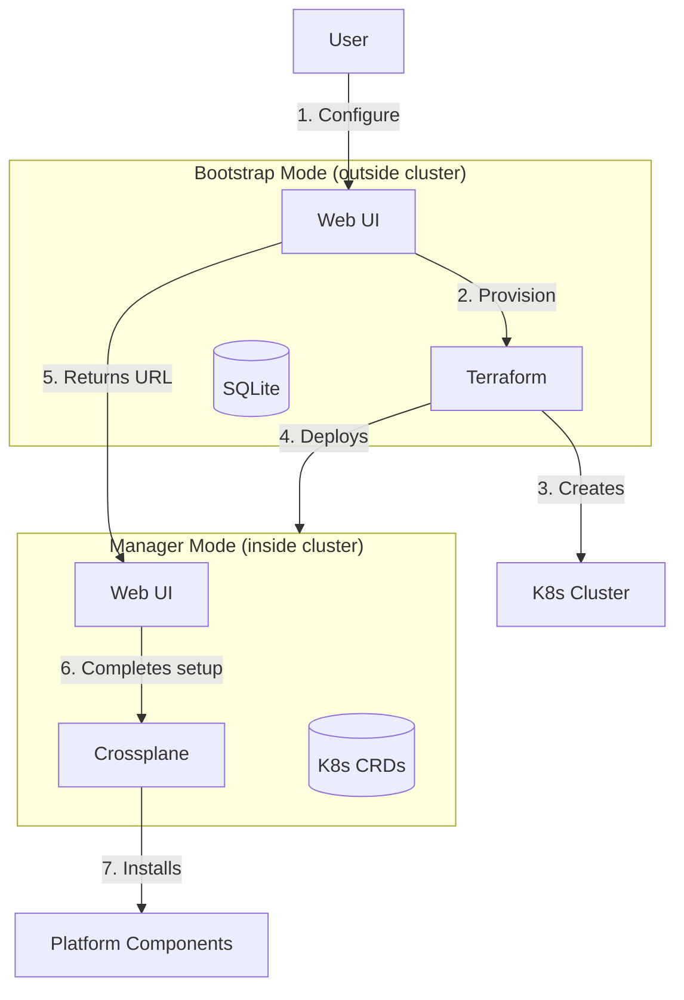

# OpenOva Core

Bootstrap wizard and Lifecycle Manager for the OpenOva platform.

**Status:** Development | **Updated:** 2026-02-08

---

## Overview

OpenOva Core is a single Go application with two deployment modes:

| Mode | Location | Purpose | IaC Tool |
|------|----------|---------|----------|
| **Bootstrap** | Outside cluster (SaaS or self-hosted) | Initial provisioning | Terraform |
| **Manager** | Inside customer's K8s cluster | Day-2 operations | Crossplane |



---

## Architecture

### Directory Structure

```
core/
├── apps/                           # Web applications
│   ├── bootstrap/                  # Runs outside cluster
│   │   ├── main.go                 # Entry point
│   │   ├── handlers/               # HTTP handlers
│   │   │   ├── wizard.go           # Wizard flow
│   │   │   ├── provision.go        # Terraform execution
│   │   │   └── health.go           # Health checks
│   │   ├── terraform/              # Embedded TF modules
│   │   │   ├── hetzner/
│   │   │   ├── huawei/
│   │   │   └── oci/
│   │   └── Dockerfile
│   │
│   └── manager/                    # Runs inside cluster
│       ├── main.go                 # Entry point
│       ├── handlers/               # HTTP handlers
│       │   ├── dashboard.go        # Main dashboard
│       │   ├── components.go       # Component management
│       │   └── upgrades.go         # Upgrade orchestration
│       ├── controllers/            # K8s controllers
│       │   ├── platform_controller.go
│       │   └── component_controller.go
│       └── Dockerfile
│
├── internal/                       # Private application code
│   ├── domain/                     # Core business logic (zero deps)
│   │   ├── platform.go             # Platform entity
│   │   ├── component.go            # Component entity
│   │   ├── region.go               # Region entity
│   │   └── events.go               # Domain events
│   │
│   ├── application/                # Use cases / orchestration
│   │   ├── bootstrap_service.go    # Bootstrap orchestration
│   │   ├── lifecycle_service.go    # Lifecycle operations
│   │   └── upgrade_service.go      # Upgrade coordination
│   │
│   ├── adapters/                   # Infrastructure adapters
│   │   ├── kubernetes/             # K8s client adapter
│   │   ├── terraform/              # Terraform executor
│   │   ├── crossplane/             # Crossplane adapter
│   │   └── git/                    # Git operations (Gitea)
│   │
│   └── events/                     # In-memory event bus
│       ├── bus.go                  # Go channels event bus
│       └── handlers/               # Event handlers
│
├── pkg/                            # Public API types
│   └── apis/
│       └── v1alpha1/
│           ├── platform_types.go   # Platform CRD
│           └── component_types.go  # Component CRD
│
├── ui/                             # Shared React frontend
│   ├── package.json
│   ├── src/
│   │   ├── App.tsx
│   │   ├── components/             # Shared UI components
│   │   │   ├── Sidebar.tsx
│   │   │   ├── StatusBadge.tsx
│   │   │   └── ComponentCard.tsx
│   │   └── pages/
│   │       ├── bootstrap/          # Bootstrap wizard pages
│   │       │   ├── Organization.tsx
│   │       │   ├── Credentials.tsx
│   │       │   ├── CloudProvider.tsx
│   │       │   ├── Regions.tsx
│   │       │   ├── Components.tsx
│   │       │   └── Review.tsx
│   │       └── manager/            # Lifecycle manager pages
│   │           ├── Dashboard.tsx
│   │           ├── Components.tsx
│   │           ├── Upgrades.tsx
│   │           └── Settings.tsx
│   └── public/
│
└── deploy/                         # K8s manifests (manager only)
    ├── base/
    │   ├── kustomization.yaml
    │   ├── deployment.yaml
    │   ├── service.yaml
    │   └── rbac.yaml
    └── overlays/
        ├── dev/
        └── prod/
```

---

## Zero External Dependencies

OpenOva Core is designed to have **no dependencies on platform components** (no CNPG, Valkey, Redpanda for itself).

### Bootstrap Mode

| Need | Solution |
|------|----------|
| Database | SQLite (embedded, temporary) |
| Event Bus | Go channels (in-memory) |
| Caching | Go sync.Map |
| Session | JWT + cookie (stateless) |
| Terraform State | S3 backend (customer's archival S3) |

### Manager Mode

| Need | Solution |
|------|----------|
| State | Kubernetes CRDs (K8s is the database) |
| Event Bus | Go channels + K8s watch events |
| Caching | informer cache (client-go) |
| Reconciliation | controller-runtime |
| Cross-Cluster | Kubernetes API (multi-cluster contexts) |

---

## Design Patterns

### Hexagonal Architecture

```
                    +-------------------+
   HTTP Handlers -> |                   | -> Kubernetes
   K8s Controllers->|   Domain Logic    | -> Terraform
   Event Bus -----> |   (Pure Go)       | -> Crossplane
                    +-------------------+
                          |
                    No external deps
```

The domain layer contains pure business logic with no infrastructure dependencies. All I/O is handled through adapters.

### Event-Driven Architecture

```go
// Domain emits events
type ComponentInstallRequested struct {
    ComponentID string
    Version     string
}

// Event bus routes to handlers
bus.Subscribe(ComponentInstallRequested{}, func(e Event) {
    // Handler orchestrates installation via Crossplane
    crossplaneAdapter.CreateComposition(e.ComponentID, e.Version)
})
```

### Kubernetes-Native (Manager Mode)

```go
// Platform CRD represents desired state
type Platform struct {
    metav1.TypeMeta   `json:",inline"`
    metav1.ObjectMeta `json:"metadata,omitempty"`
    Spec   PlatformSpec   `json:"spec"`
    Status PlatformStatus `json:"status"`
}

type PlatformSpec struct {
    Components []ComponentRef `json:"components"`
    Regions    []RegionSpec   `json:"regions"`
}

// Controller reconciles desired vs actual
func (r *PlatformReconciler) Reconcile(ctx context.Context, req ctrl.Request) (ctrl.Result, error) {
    var platform Platform
    if err := r.Get(ctx, req.NamespacedName, &platform); err != nil {
        return ctrl.Result{}, client.IgnoreNotFound(err)
    }

    // Reconcile each component
    for _, comp := range platform.Spec.Components {
        if err := r.reconcileComponent(ctx, &platform, comp); err != nil {
            return ctrl.Result{}, err
        }
    }

    return ctrl.Result{}, nil
}
```

---

## User Journeys

### Journey 1: Initial Bootstrap

```
1. User accesses Bootstrap UI (SaaS at bootstrap.openova.io or self-hosted)

2. Wizard collects configuration:
   - Organization name, domain
   - Cloud provider credentials
   - Region selection (1 or 2)
   - Component selection (a la carte)

3. Bootstrap provisions via Terraform:
   - K8s clusters in selected regions
   - WireGuard mesh for cross-region
   - Gitea with bidirectional mirroring
   - Flux for GitOps
   - Core platform components

4. Bootstrap deploys Lifecycle Manager into cluster

5. Bootstrap returns Lifecycle Manager URL
   - User bookmarks this for day-2 operations
   - Bootstrap wizard can now be closed/deleted

6. Lifecycle Manager UI shows installation progress
   - Remaining components installing via Crossplane
   - Real-time status updates

7. Lifecycle Manager provides service URLs:
   - Backstage (developer portal)
   - Grafana (observability)
   - Gitea (git server)
   - All other installed services
```

### Journey 2: Day-2 Component Installation

```
1. Platform operator accesses Lifecycle Manager UI

2. Navigates to Components page
   - Toggle: "Show installed only" (default: on)
   - Turns off toggle to see available components

3. Clicks [+ Install] on desired component (e.g., MongoDB)

4. If component has dependencies:
   - System shows required dependencies
   - Auto-selects Debezium + Redpanda for CDC
   - User confirms

5. Lifecycle Manager creates Crossplane Composition
   - Component installs via GitOps flow
   - Progress shown in real-time

6. Component appears in installed list
```

### Journey 3: Platform Upgrade

```
1. Lifecycle Manager checks for updates (scheduled or manual)

2. Dashboard shows: "2 upgrades available"

3. Operator clicks to view upgrades:
   - Backstage v1.30 → v1.31
   - Grafana v11.3 → v11.4

4. Operator reviews changelog for each

5. Operator clicks [Upgrade Now] or [Schedule]

6. Lifecycle Manager:
   - Updates Crossplane Composition version
   - Monitors rollout progress
   - Reports success/failure

7. If failure: automatic rollback + alert
```

---

## Custom Resource Definitions

### Platform CRD

```yaml
apiVersion: openova.io/v1alpha1
kind: Platform
metadata:
  name: acme-corp
  namespace: openova-system
spec:
  organization:
    name: acme-corp
    domain: acme.io
  regions:
    - name: eu-central
      role: primary
    - name: eu-west
      role: standby
  components:
    - name: backstage
      version: v1.31.0
      enabled: true
    - name: grafana
      version: v11.4.0
      enabled: true
    - name: cnpg
      version: v1.24.0
      enabled: true
status:
  phase: Running
  components:
    - name: backstage
      status: Healthy
      version: v1.31.0
    - name: grafana
      status: Healthy
      version: v11.4.0
    - name: cnpg
      status: Healthy
      version: v1.24.0
  lastReconciled: "2026-02-08T10:30:00Z"
```

### Component CRD

```yaml
apiVersion: openova.io/v1alpha1
kind: Component
metadata:
  name: cnpg
  namespace: openova-system
spec:
  chart: cnpg
  version: v1.24.0
  category: data
  dependencies:
    - external-secrets
  values:
    replication:
      enabled: true
      mode: async
status:
  phase: Running
  health: Healthy
  endpoints:
    - name: primary
      url: cnpg-primary.data.svc
  lastReconciled: "2026-02-08T10:30:00Z"
```

---

## Lifecycle Manager UI

### Dashboard

```
┌─────────────────────────────────────────────────────────────┐
│ OpenOva Lifecycle Manager                    [Cluster: prod]│
├─────────────────────────────────────────────────────────────┤
│                                                             │
│  Platform Health: ██████████ 100%                          │
│                                                             │
│  ┌─────────────┐ ┌─────────────┐ ┌─────────────┐           │
│  │ Components  │ │ Upgrades    │ │ Alerts      │           │
│  │     24      │ │   2 avail   │ │     0       │           │
│  └─────────────┘ └─────────────┘ └─────────────┘           │
│                                                             │
│  Quick Links:                                               │
│  [Backstage] [Grafana] [Gitea] [Vault] [Harbor]            │
│                                                             │
└─────────────────────────────────────────────────────────────┘
```

### Components View

```
┌─────────────────────────────────────────────────────────────┐
│ Components                    [x] Show installed only       │
├─────────────────────────────────────────────────────────────┤
│                                                             │
│  MANDATORY (Core Platform)                                  │
│  ┌──────────────────────────────────────────────────────┐  │
│  │ ✓ Cilium       v1.16.2  ● Healthy                   │  │
│  │ ✓ Flux         v2.4.0   ● Healthy                   │  │
│  │ ✓ Grafana      v11.3.0  ● Healthy   [Upgrade: 11.4] │  │
│  │ ✓ Backstage    v1.30.0  ● Healthy   [Upgrade: 1.31] │  │
│  └──────────────────────────────────────────────────────┘  │
│                                                             │
│  A LA CARTE (Optional)                                      │
│  ┌──────────────────────────────────────────────────────┐  │
│  │ ✓ CNPG         v1.24.0  ● Healthy                   │  │
│  │ ✓ Valkey       v8.0.0   ● Healthy                   │  │
│  │ ○ MongoDB      ---      [+ Install]                  │  │
│  │ ○ Redpanda     ---      [+ Install]                  │  │
│  └──────────────────────────────────────────────────────┘  │
│                                                             │
│  META-PLATFORMS                                             │
│  ┌──────────────────────────────────────────────────────┐  │
│  │ ○ AI Hub       ---      [+ Install]                  │  │
│  │ ○ Open Banking ---      [+ Install]                  │  │
│  └──────────────────────────────────────────────────────┘  │
│                                                             │
└─────────────────────────────────────────────────────────────┘
```

### Dependency Resolution

When installing a meta-platform with dependencies:

```
┌─────────────────────────────────────────────────────────────┐
│ Install: AI Hub                                     [x]     │
├─────────────────────────────────────────────────────────────┤
│                                                             │
│  AI Hub requires the following components:                  │
│                                                             │
│  ┌────────────────────────────────────────────────────┐    │
│  │ ✓ KServe          (required)    [will be installed] │    │
│  │ ✓ Knative         (required)    [will be installed] │    │
│  │ ✓ vLLM            (required)    [will be installed] │    │
│  │ ✓ Milvus          (required)    [will be installed] │    │
│  │ ✓ CNPG            (required)    [already installed] │    │
│  └────────────────────────────────────────────────────┘    │
│                                                             │
│  Optional components:                                       │
│  [ ] Neo4j           (knowledge graph)                     │
│  [ ] LangServe       (RAG service)                         │
│                                                             │
│                              [Cancel]  [Install AI Hub]    │
└─────────────────────────────────────────────────────────────┘
```

---

## No Overlap with Backstage

Lifecycle Manager and Backstage serve different users:

| Aspect | Lifecycle Manager | Backstage |
|--------|-------------------|-----------|
| **Users** | Platform operators | Application developers |
| **Purpose** | Install/upgrade platform | Deploy applications |
| **Manages** | Platform components | Application services |
| **Examples** | "Install MongoDB", "Upgrade Grafana" | "Deploy my-app", "Create database" |

**Key insight:** Lifecycle Manager manages Backstage itself. To upgrade Backstage from v1.30 to v1.31, operators use Lifecycle Manager.

---

## Self-Hosted Bootstrap

For customers who cannot use SaaS bootstrap:

```bash
# Option 1: Container
docker run -p 8080:8080 ghcr.io/openova-io/bootstrap:latest

# Option 2: Binary
curl -sL https://bootstrap.openova.io/install | bash
openova-bootstrap serve --port 8080

# Access at http://localhost:8080
# Same wizard UI, runs entirely on your machine
# Credentials never leave your environment
```

---

## Technology Stack

| Layer | Technology |
|-------|------------|
| Language | Go 1.22+ |
| Web Framework | Chi or Echo |
| K8s Client | client-go, controller-runtime |
| Frontend | React 18, TypeScript, Tailwind |
| Build | Ko (Go), Vite (UI) |
| Testing | Go testing, Testify, Ginkgo |

---

## Development

```bash
# Run bootstrap locally
cd apps/bootstrap
go run main.go

# Run manager locally (requires kubeconfig)
cd apps/manager
go run main.go --kubeconfig ~/.kube/config

# Run UI in dev mode
cd ui
npm install
npm run dev

# Build containers
ko build ./apps/bootstrap
ko build ./apps/manager
```

---

*Part of [OpenOva](https://openova.io)*
