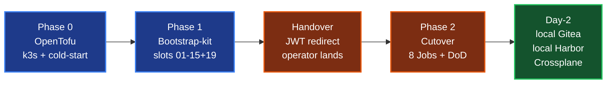

# Catalyst Architecture

**Status:** Authoritative target architecture. **Updated:** 2026-04-29.
**Implementation:** Most of what this document describes is **design-stage** — see [`IMPLEMENTATION-STATUS.md`](IMPLEMENTATION-STATUS.md) for what exists in code today vs what is design. The DNS plane (bp-powerdns + pool-domain-manager + registrar adapters) is deployed today in `openova-system` on Catalyst-Zero.

This document describes the architecture of **Catalyst** — the OpenOva platform. For terminology, defer to [`GLOSSARY.md`](GLOSSARY.md). For naming, defer to [`NAMING-CONVENTION.md`](NAMING-CONVENTION.md). For current code state, defer to [`IMPLEMENTATION-STATUS.md`](IMPLEMENTATION-STATUS.md).

---

## 1. The platform in one paragraph

Catalyst is a self-sufficient Kubernetes-native control plane published as signed OCI Blueprints. A single deployed Catalyst is called a **Sovereign**. Inside a Sovereign, **Organizations** are the multi-tenancy unit. An Organization has **Environments** (`{org}-prod`, `{org}-dev`, etc.) where users install **Applications** from **Blueprints**. **Each Application is its own Gitea repo** (one App = one repo, uniformly across SME and corporate scale); branches `develop`/`staging`/`main` map to dev/stg/prod environments. One or more vclusters per Environment run lightweight Flux watching the appropriate branch across the Org's Application repos. Every state change flows through NATS JetStream, projects into per-Environment KV via the **projector** service, and reaches the console via SSE — so every UI surface sees the same picture, derived from Git (write side) and Kubernetes (runtime side) without fragmenting. Crossplane handles all non-Kubernetes resources. OpenBao + ESO handles secrets; workload identity is provided by Cilium WireGuard (east-west encryption) + K8s ServiceAccount TokenReview (workload auth) — SPIRE was dropped from the bootstrap-kit by founder PR #665 (2026-05-03) and is retained as opt-in only (see [`SECURITY.md`](SECURITY.md) §2 for the re-enable triggers). Keycloak handles user identity. **Same code runs in every Sovereign — whether it's run by us, by Omantel, or by Bank Dhofar.**

---

## 2. Two scales, one architecture

The model serves two distinct customer shapes through the **same code**:

```
        ┌──────────────────────────────────────────────────────────────┐
        │ SME-style Sovereign (e.g. omantel)                           │
        │                                                               │
        │ Many small Organizations, mostly single-Environment           │
        │ Each Org gets its own minimal Keycloak (no HA)                │
        │ Self-service marketplace, next-next-next install              │
        │ Sovereign-admins are the SaaS provider's cloud team           │
        └──────────────────────────────────────────────────────────────┘

        ┌──────────────────────────────────────────────────────────────┐
        │ Corporate-style Sovereign (e.g. bankdhofar)                  │
        │                                                               │
        │ Few internal Organizations (core-banking, digital-channels…)  │
        │ One Sovereign-wide Keycloak (federates to corporate Azure AD) │
        │ Rich governance: EnvironmentPolicy, soak gates, approvers     │
        │ Sovereign-admins are the bank's platform team                 │
        │ Multi-region default; multi-Environment per Org default       │
        └──────────────────────────────────────────────────────────────┘
```

The **only** runtime configuration difference is set at provisioning time:

```yaml
keycloakTopology: per-organization      # SME default
# or
keycloakTopology: shared-sovereign      # Corporate default
```

Everything else is identical in code.

---

## 3. Topology

```
┌─────────────────────────────────────────────────────────────────────────┐
│ Sovereign: omantel                                                       │
│                                                                           │
│  Management host cluster: hz-nbg-mgt-prod                                 │
│  ┌────────────────────────────────────────────────────────────────────┐ │
│  │ Catalyst control plane (in catalyst-* namespaces)                   │ │
│  │   console   marketplace   admin   catalog-svc   projector           │ │
│  │   provisioning   environment-controller   blueprint-controller      │ │
│  │   billing                                                            │ │
│  │   gitea   nats-jetstream   openbao   keycloak                       │ │
│  │   observability (Grafana stack)                                      │ │
│  └────────────────────────────────────────────────────────────────────┘ │
│  Plus per-host-cluster infrastructure (Cilium, Flux, Crossplane,         │
│  cert-manager, External-Secrets, Kyverno, Harbor, Reloader, Trivy,       │
│  Falco, Sigstore, Syft+Grype, VPA, KEDA, External-DNS, PowerDNS, Coraza, │
│  SeaweedFS, Velero, failover-controller) — see PLATFORM-TECH-STACK §3.   │
│                                                                           │
│  Workload host clusters: hz-fsn-rtz-prod, hz-hel-rtz-prod                 │
│  ┌──────────────────────────────────────────────────────────────────┐   │
│  │ Per-Org vcluster (named {org}):                                  │   │
│  │   muscatpharmacy   acme-shop   blue-pharmacy   …                 │   │
│  │   each runs its own lightweight Flux pointed at the Environment  │   │
│  │   Gitea repo                                                     │   │
│  └──────────────────────────────────────────────────────────────────┘   │
│                                                                           │
│  DMZ host clusters: hz-fsn-dmz-prod, hz-hel-dmz-prod                      │
│   Cilium Gateway, WAF (Coraza), PowerDNS authoritative + lua-records,    │
│   dnsdist rate-limit, WireGuard endpoints                                 │
└─────────────────────────────────────────────────────────────────────────┘
                              ↕
                  Gitea (in management cluster) — 5 conventional Gitea Orgs
                  ──────────────────────────────────────────────────────────
                  catalog/                    ← public Blueprint mirror (read-only)
                  catalog-sovereign/          ← Sovereign-owner-curated private Blueprints (optional)
                  acme-pharmacy/              ← one Gitea Org per Catalyst Organization
                    ├── shared-blueprints     ← Org-private Blueprint authoring
                    ├── store-frontend        ← one Gitea Repo per Application
                    ├── pharmacy-mail
                    ├── consult-room
                    └── appointments
                                              (branches develop/staging/main map
                                               to dev/stg/prod environments)
                  kestrel-rx/                 ← another Catalyst Organization
                    ├── shared-blueprints
                    └── ...
                  system/                     ← sovereign-admin scope
                    ├── catalyst-config       (CRs: Sovereign, Organization,
                    │                          Environment, EnvironmentPolicy)
                    ├── policy-bundle         (Kyverno, Falco, RE Scorecard)
                    └── runbooks              (auto-remediation)
                  ...
```

**Sovereign self-sufficiency**: once a Sovereign is provisioned, it has its own Gitea, its own JetStream, its own OpenBao, its own Keycloak, its own Crossplane. It does not depend on any other Sovereign at runtime. OpenOva's `openova` Sovereign is in the picture only as the publisher of public Blueprints — and even those are mirrored locally, so the Sovereign keeps working if openova.io disappears.

---

## 4. Write side: Git → Flux → Kubernetes (+ Crossplane)

```
                       Console UI                       REST/GraphQL API
                            │                                    │
                            │  (Git push from any of these       │
                            │   bypasses provisioning and goes   │
                            │   straight to the App's repo;      │
                            │   webhook + projector still fire)  │
                            ▼                                    ▼
              ┌──────────────────────────────────────────────────────────┐
              │  provisioning service                                    │
              │   - validates configSchema against Blueprint              │
              │   - resolves dependency graph                             │
              │   - creates one Gitea repo per Application                │
              │   - commits initial manifests to develop/staging/main     │
              └──────────────────────────────────────────────────────────┘
                                     │
                                     ▼
              ┌──────────────────────────────────────────────────────────┐
              │  Application Gitea repo: {org}/{app}                      │
              │  (FQDN form per NAMING §11.2 — one repo per Application)  │
              │  ────────────────────────────────────────────────────────  │
              │  branches: develop → dev env, staging → stg, main → prod  │
              │  ────────────────────────────────────────────────────────  │
              │  kustomization.yaml      ← root Flux Kustomization         │
              │  values.yaml             ← base values                     │
              │  overlays/               ← per-env overlays                │
              │    dev/values.yaml                                         │
              │    stg/values.yaml                                         │
              │    prod/values.yaml                                        │
              │  secrets/                ← ExternalSecret refs (no plain)  │
              │  CODEOWNERS              ← team / approver list            │
              │                                                            │
              │  EnvironmentPolicy lives separately in the system Gitea   │
              │  Org: system/catalyst-config/policies/{org}-{env}-policy   │
              └──────────────────────────────────────────────────────────┘
                                     │
                                     ▼ (Gitea webhook → projector → annotate)
              ┌──────────────────────────────────────────────────────────┐
              │  Flux in vcluster {org}                                  │
              │   - N GitRepository sources, one per App repo            │
              │   - each watching the env-appropriate branch              │
              │   - kustomize-controller applies to per-App namespaces   │
              │   - helm-controller renders Helm-based Blueprints        │
              └──────────────────────────────────────────────────────────┘
                                     │
                  ┌──────────────────┴────────────────────┐
                  ▼                                        ▼
        K8s Application workloads                 Crossplane Claims
        (Deployments, Services,                  (Hetzner servers, DNS records,
         Pods, Secrets via ESO)                   S3 buckets, Cloudflare Workers)
                                                          │
                                                          ▼
                                              Crossplane Compositions
                                              fan out to provider APIs
```

**Crossplane is the only IaC.** Users never write Crossplane Compositions in their Application configs. Blueprint authors do — when a Blueprint declares "needs an external Postgres," that becomes a Crossplane Claim under the hood. Advanced users (corporate sovereign-admins, OpenOva engineers) can author and contribute Crossplane Compositions as Blueprints. End users see "needs a database, pick existing or new" in the UI.

---

## 5. Read side: CQRS via JetStream → projector → console

```
┌────────────────────┐     ┌────────────────────┐     ┌──────────────────┐
│ k8s informers      │     │ Flux events        │     │ Gitea webhooks   │
│ (one per vcluster) │     │ (per vcluster)     │     │ (per Sovereign)  │
└─────────┬──────────┘     └─────────┬──────────┘     └─────────┬────────┘
          │                          │                          │
          ▼                          ▼                          ▼
   ┌────────────────────────────────────────────────────────────────────┐
   │  NATS JetStream                                                    │
   │  Account isolation: one NATS Account per Organization.             │
   │  Subject prefix scoped per Environment (where <env> = {org}-{env_type}): │
   │     ws.<env>.k8s.<obj-kind>.<ns>.<name>                            │
   │     ws.<env>.flux.<kustomization>                                  │
   │     ws.<env>.git.<commit-hash>                                     │
   │     ws.<env>.crossplane.<resource>                                 │
   └────────────────────────────────────────────────────────────────────┘
                                  │
                                  ▼ durable consumer per env partition
   ┌────────────────────────────────────────────────────────────────────┐
   │  projector                                                         │
   │   - consumes events                                                │
   │   - rebuilds per-object state                                      │
   │   - writes to JetStream KV: ws-<env>-state/<kind>/<name>           │
   │   - fans out SSE to subscribed console clients                     │
   │   - authorizes by JWT claim {environment, org, role}               │
   │   - serves REST/GraphQL snapshot read API                          │
   └────────────────────────────────────────────────────────────────────┘
                                  │
                                  ▼
                       ┌────────────────────┐
                       │  Catalyst console  │
                       └────────────────────┘
```

**One spine (JetStream), one read model (JetStream KV), one consumer (projector), one stream (SSE).**

The console **never talks to k8s API or Git directly.** This is the architectural lock that prevents the "App says installed in one tab, failed in another tab" class of bug. Both tabs read the same JetStream KV snapshot served by the same projector replica.

JetStream replaces the older Redpanda + Valkey pairing in the control plane: NATS is Apache 2.0 (no BSL risk), has native KV (fewer moving parts), and native multi-tenant Accounts (cleaner per-Org isolation). Application-layer event needs (e.g. TalentMesh's voice pipeline) remain free to choose Redpanda, Kafka, NATS, or anything else — that's an Application-level decision, not a control-plane one.

---

## 6. Identity and secrets

Two separate identity systems for two separate purposes:

| Subject | System | Lifetime | Purpose |
|---|---|---|---|
| **Workloads** (every Pod) | Cilium WireGuard mesh (kernel-layer transport encryption) + K8s ServiceAccount TokenReview (workload auth) | WG keys: per Cilium-agent restart. SA bound-tokens: 1 h, auto-rotated by kubelet | Pod-to-Pod transport (WG); Pod-to-OpenBao / Pod-to-NATS / Pod-to-Catalyst-API auth (SA token + TokenReview) |
| **Users** (every human) | Keycloak → JWT | 15 min access / 30 day refresh | UI auth, API auth |

SPIFFE/SPIRE was dropped from the bootstrap-kit by founder PR #665 (2026-05-03, "drop bp-spire — Cilium WireGuard is canonical east-west mesh"). The `platform/spire/` chart is retained as opt-in for cross-Sovereign federation, sub-hour cryptographic workload attestation (compliance triggers), or per-workload-fingerprint authorization — see [`SECURITY.md`](SECURITY.md) §2 for the full re-enable trigger list.

**Secrets** flow:

```
            OpenBao (per-region, independent Raft cluster)
                  │
                  │ (workload requests authenticated via the OpenBao
                  │  `kubernetes` auth method = projected SA bound-token
                  │  → K8s TokenReview; transport encrypted by Cilium WG)
                  ▼
            ESO ExternalSecret CR (in Git, references OpenBao path)
                  │
                  ▼
            K8s Secret (versioned, reloader watches for hash change)
                  │
                  ▼
            Pod (env var or mounted file)
```

**Multi-region**: each region runs its **own** 3-node Raft OpenBao cluster. **No stretched cluster.** Cross-region async perf replication for read availability and DR. A region failure does not require any other region to do anything.

**Keycloak** topology depends on Sovereign type:
- **SME-style** (`per-organization`): minimal single-replica Keycloak per Org, sized for hundreds of users. Embedded H2 or sqlite. Each Org's Keycloak is independent; failure does not affect other Orgs.
- **Corporate-style** (`shared-sovereign`): one HA Keycloak for the entire Sovereign, federating to the parent corporation's identity provider (Azure AD, Okta).

See [`SECURITY.md`](SECURITY.md) for full credential rotation and identity flow.

---

## 7. The user-facing surfaces

Three first-class surfaces. **No fourth.**

### 7.1 UI (the Catalyst console)

Default. Most users never leave it. Three depths the user can switch between:

- **Form view** — one Application page, fields driven by `configSchema`. Default for SME.
- **Advanced view** — same page with topology, secrets, observability, history, manifest tabs. Default for corporate.
- **IaC editor view** — in-browser Monaco editing the Application's Gitea repo with Blueprint-schema validation, live diff, commit-on-save. Toggle, not modal.

All three commit to the same Application Gitea repo (one repo per App, branches `develop`/`staging`/`main` mapping to dev/stg/prod). The **Application card** is the user's primary handle — see [`PERSONAS-AND-JOURNEYS.md`](PERSONAS-AND-JOURNEYS.md).

### 7.2 Git

Direct push or pull-request to the Application's Gitea repo (one repo per App), or to `shared-blueprints` for Org-private Blueprints, or to `catalog-sovereign` for Sovereign-curated private Blueprints.

Identical write semantics as the UI. Both end up as commits on the App's repo branches. EnvironmentPolicy (PR approvals, soak, change windows) applies regardless of the surface — the policy CR lives in the `system` Gitea Org and is matched by Org+env_type at projector enforcement time.

### 7.3 API (REST + GraphQL)

For **integrations**, not for primary IaC authoring.

Use cases:
- A bank's existing Backstage portal queries Catalyst to show Environments and Applications.
- A change-management tool (ServiceNow, JIRA) triggers Application installs based on a ticket.
- A monitoring/auditing tool exports state for compliance reports.

The API exposes the same operations the console performs. It is **not** an IaC authoring layer in the Terraform-cloud sense. We do not ship a Terraform provider, a Pulumi SDK, or any other "declare desired state through us" surface — the Application Gitea repo is that surface.

### 7.4 What's deliberately NOT a surface

- `kubectl` — useful for debugging inside one's own vcluster; never a configuration mechanism.
- A standalone CLI for production changes — Catalyst may expose a small read-only debug CLI in the future; not authoritative for installs/promotions.
- Terraform / Pulumi — Crossplane covers non-K8s; it is platform plumbing, not user-facing.

---

## 8. Promotion across Environments

Promotion is **not** a separate engine or a chain object. Because each Application is a single Gitea repo with branches mapping to env_types, promotion is the simple act of opening a PR from the lower-env branch to the higher-env branch (e.g. `staging` → `main` to promote stg → prod), plus a policy gating the destination branch.

```
Blueprint detail page in console:

  bp-wordpress @ available 1.4.0
  ─────────────────────────────────────────────────
  Applications using this Blueprint in your Org (4)

  Application       Environment        Version    Status
  ──────────────────────────────────────────────────────
  marketing-site    acme-dev           1.4.0      ● Running   [Open]
  marketing-site    acme-stg           1.3.0      ● Running   [Open]
  marketing-site    acme-prod          1.2.0      ● Running   [Open]
  blog              acme-prod          1.2.0      ● Running   [Open]

  [ + Install in another Environment ]
  [ Compare versions ]
```

From `marketing-site` in `acme-stg`, the user clicks "Promote to acme-prod". Catalyst opens a Gitea PR from the `staging` branch to the `main` branch in the **same** `marketing-site` Application repo. The destination Environment's `EnvironmentPolicy` CR (in the `system` Gitea Org, matched by `appliesTo.environments: [acme-prod]`) supplies the approvers, soak duration, change window, and RE-score gate that apply to the PR. On merge, the Flux instance in the `acme-prod` vcluster (which watches the `main` branch) reconciles. Done.

```yaml
# Lives at: system/catalyst-config/policies/acme-prod-policy.yaml
# (in the Sovereign-admin's `system` Gitea Org)
apiVersion: catalyst.openova.io/v1alpha1
kind: EnvironmentPolicy
metadata:
  name: acme-prod-policy
  namespace: catalyst-system
spec:
  appliesTo:
    environments: [acme-prod]
  rules:
    - kind: pr-required
      approvers: [team-platform, team-security]
      minApprovals: 2
    - kind: re-score-gate
      minScore: 80
      severity: blocking
    - kind: soak
      sourceEnvironment: acme-stg
      duration: 72h
    - kind: change-window
      cron: "0 14 * * 2,4"  # Tue/Thu 14:00
      duration: 2h
```

The policy lives in the Sovereign-admin's `system` Gitea Org and applies uniformly to every Application in the destination Environment, regardless of who initiated the change (UI, Git, API). The same CR shape is used for SME and corporate Sovereigns — only the field values differ (e.g. `minApprovals: 1` for SMEs with a single org-admin, `minApprovals: 2-3` for corporate teams).

---

## 9. Multi-Application linkage (the dependency tree)

A Blueprint can declare dependencies on other Blueprints:

```yaml
apiVersion: catalyst.openova.io/v1alpha1
kind: Blueprint
metadata:
  name: bp-wordpress
  version: 1.3.0
spec:
  configSchema: …
  depends:
    - blueprint: bp-postgres
      version: ^1.4
      alias: db
      when: "{{ .config.postgres.mode == 'embedded' }}"
      values:
        databases: ["{{ .application.name }}"]
```

When a User installs `marketing-site` from `bp-wordpress`:

1. **Catalog-svc** flattens the dependency tree.
2. **Console** asks: "WordPress requires Postgres. Use an existing Postgres Application or create a new dedicated one?" — querying projector for existing `bp-postgres` Applications in this Org.
3. **Provisioning service** composes an InstallPlan: either one Application (`marketing-site`) referencing an existing postgres Application, or two Applications (`marketing-site` + `marketing-site-postgres`).
4. **Gitea creates one or two repos** under the Org's Gitea Org (e.g. `acme-pharmacy/marketing-site` + `acme-pharmacy/marketing-site-postgres`), each with `develop`/`staging`/`main` branches and initial manifests.
5. **Flux** in the Org's vcluster picks up new `GitRepository` sources and reconciles in dependency order via cross-repo `Kustomization.dependsOn` edges.

Every Application is its own Gitea repo and its own Flux Kustomization. The dependency graph is materialized as `dependsOn` edges between Kustomizations (which are namespaced CRs in the vcluster, regardless of which Gitea repo each Kustomization was sourced from), computed at install time from the Blueprint's `depends` declaration.

---

## 10. Provisioning a Sovereign

```
Phase 0  Bootstrap (one-shot, runs from catalyst-provisioner.openova.io)
─────────────────────────────────────────────────────────────────────
1. OpenTofu provisions: VPC, host nodes, load balancers, object storage
   on the target cloud provider (Hetzner / AWS / etc.). DNS is NOT
   written here — it flows through the PowerDNS / pool-domain-manager
   plane (see step 3 below + docs/PLATFORM-POWERDNS.md).
2. Bootstrap kit installs in order:
   a. Cilium (CNI + Gateway API + WireGuard   ← network must come first;
      east-west mesh encryption, 100%             WireGuard provides
      mesh coverage, kernel layer)              kernel-level transport
                                                encryption for every
                                                pod-to-pod packet — the
                                                canonical east-west
                                                mTLS layer since PR #665
                                                (2026-05-03)
   b. cert-manager                            ← TLS for north-south /
                                                Gateway API ingress
   c. Flux (host-level)                       ← GitOps engine
   d. Crossplane + provider config            ← cloud resource control plane
   e. Sealed Secrets (transient, only for bootstrap secrets)
   f. (slot reserved — bp-spire was dropped per PR #665; Cilium WireGuard
      + K8s SA TokenReview replace SPIRE/SVID workload identity. The
      platform/spire/ chart is retained as opt-in; see SECURITY.md §2
      re-enable triggers)
   g. NATS JetStream cluster (3 nodes)
   h. OpenBao cluster (3 nodes, region-local Raft) — auth backend =
      `kubernetes` (TokenReview), not `cert` (SVID)
   i. Keycloak (per `keycloakTopology` choice)
   j. Gitea (with public Blueprint mirror seeded)
   k. PowerDNS (bp-powerdns) + dnsdist        ← per-Sovereign authoritative
                                                DNS zone, DNSSEC, lua-records
   l. Catalyst control plane (umbrella Blueprint: bp-catalyst-platform)
3. Pool-domain-manager (running on the OpenOva-run Catalyst-Zero, NOT
   on the new Sovereign) calls `/v1/commit`: creates the per-Sovereign
   PowerDNS zone, writes the canonical 6-record set via the PowerDNS
   REST API, and updates the parent-zone NS delegation via the matching
   registrar adapter (Cloudflare / Namecheap / GoDaddy / OVH / Dynadot)
   — see docs/SOVEREIGN-PROVISIONING.md §3 + docs/PLATFORM-POWERDNS.md.

Phase 1  Hand-off (~5 minutes after Phase 0 starts)
─────────────────────────────────────────────────────────────────────
Crossplane in the new Sovereign adopts management of further
infrastructure. OpenTofu state is archived. Bootstrap kit is no
longer in the runtime path.

Phase 2  Day-1 setup
─────────────────────────────────────────────────────────────────────
First sovereign-admin logs into the console; configures cert-manager
issuers, backup destinations, optional federation; onboards the first
Organization and creates its first Environment.

Phase 3  Steady-state operation
─────────────────────────────────────────────────────────────────────
Catalyst is fully autonomous. catalyst-provisioner.openova.io remains
online indefinitely as the entry point for future Sovereign
provisioning runs — but the existing Sovereign no longer depends on
it at runtime.
```

See [`SOVEREIGN-PROVISIONING.md`](SOVEREIGN-PROVISIONING.md) for the full procedure (this is the canonical reference for phase semantics).

---

## 11. Catalyst-on-Catalyst (dogfooding)

Every component in the Catalyst control plane is itself published as a Blueprint:

```
bp-catalyst-platform                 ← umbrella
├── depends: bp-catalyst-console
├── depends: bp-catalyst-marketplace
├── depends: bp-catalyst-admin
├── depends: bp-catalyst-catalog-svc
├── depends: bp-catalyst-projector
├── depends: bp-catalyst-provisioning
├── depends: bp-catalyst-environment-controller
├── depends: bp-catalyst-blueprint-controller
├── depends: bp-catalyst-billing
├── depends: bp-catalyst-gitea            ← per-Sovereign Git server
├── depends: bp-catalyst-nats-jetstream   ← event spine + KV
├── depends: bp-catalyst-openbao          ← secret backend
├── depends: bp-catalyst-keycloak         ← user identity
└── depends: bp-catalyst-observability    ← OTel + Grafana stack
                                            (workload identity = Cilium
                                             WireGuard + K8s SA TokenReview;
                                             bp-spire was dropped per
                                             PR #665, retained opt-in in
                                             platform/spire/ — see
                                             SECURITY.md §2)
```

(Cilium, Flux, Crossplane, Cert-manager, Kyverno, Harbor, External-Secrets, Reloader, Falco, Sigstore, Syft+Grype, **PowerDNS** are **per-host-cluster infrastructure**, not Catalyst control-plane components — see [`PLATFORM-TECH-STACK.md`](PLATFORM-TECH-STACK.md) §1. They get installed once per host cluster, before Catalyst itself. The pool-domain-manager (PDM) is deployed on the OpenOva-run Catalyst-Zero only — it is part of the bootstrap surface, not the per-Sovereign control plane.)

Installing `bp-catalyst-platform` once gives you a working Sovereign. Same Blueprint installed on Hetzner = the openova Sovereign. Same Blueprint installed on AWS for a bank = that bank's Sovereign. Same Blueprint installed on Hetzner for a telco = the omantel Sovereign. **One artifact. Zero divergence.**

OpenOva's own customer Applications (Cortex, Fingate, Fabric, Relay, Specter, Axon) are similarly composite Blueprints that run **on top of** Catalyst — they are Applications inside the `openova-public` Environment of the openova Sovereign.

### 11.1 Phase 2 — Self-Sovereignty Cutover

A franchised Sovereign emerging from Phase-1 is operationally tethered to the OpenOva mothership in eight places (audit per [ADR-0002](adr/0002-post-handover-sovereignty-cutover.md) §2.1 and umbrella issue #790): Flux GitRepository url, containerd registry rewrites, 38 OCI HelmRepositories, `catalyst-api` upstream fallback, GHCR pull Secret, Crossplane provider packages, Catalyst-authored image refs, OS package mirrors. Six of these are operationally hot (P0/P1) and must be pivoted before the customer can claim sovereignty.

The cutover follows a **30/70 model**:

- **OpenTofu provisions ~30%** — k3s install, Cilium, the cold-start `registries.yaml` v1 (routing pulls through `harbor.openova.io` to absorb docker.io rate limits), Flux pointed at `github.com/openova-io/openova`, and bootstrap-kit slots 01–15 + 19. The dormant `bp-self-sovereign-cutover` blueprint is installed at slot 06a — JobTemplate ConfigMaps + RBAC + status ConfigMap are present, but the eight cutover Jobs are NOT created during Phase 1.
- **The Sovereign's own ecosystem provisions the remaining ~70%** post-cutover. Once the customer's local Gitea and local Harbor have absorbed the mothership tether, every subsequent reconcile (slots 16–50, day-2 Crossplane operations, Catalyst-platform updates, customer Application installs) flows through the Sovereign's own infrastructure.

The seam between the two halves is a single Helm chart with eight sequential Jobs, triggered POST-HANDOVER by an operator click on **"Achieve True Sovereignty"** in the admin console (or, optionally, by `catalyst-api` auto-fire on first login). The eight Jobs are the canonical implementation of the eight-tether map:

| # | Job | Pivots tether |
|---|---|---|
| 1 | `gitea-mirror` | Mirrors `github.com/openova-io/openova` → local Gitea |
| 2 | `harbor-projects` | Creates 7 proxy-cache projects on local Harbor |
| 3 | `harbor-prewarm` | Pre-pulls all bootstrap-kit images through local Harbor |
| 4 | `registry-pivot` | DaemonSet rewrites `/etc/rancher/k3s/registries.yaml` (mothership Harbor → local Harbor) |
| 5 | `flux-gitrepository-patch` | Flips Flux source to local Gitea |
| 6 | `helmrepo-patches` | Flips 38 HelmRepositories to local Harbor |
| 7 | `catalyst-api-env-patch` | Removes upstream fallback in `catalyst-api` |
| 8 | `egress-block-test` | NetworkPolicy deny-egress hold for 10 min — DoD proof |



The cutover is delivered across four issues under umbrella #790:

| Issue | Deliverable |
|---|---|
| #791 | `bp-self-sovereign-cutover` chart — the eight Jobs + DaemonSet + status ConfigMap |
| #792 | `catalyst-api` POST `/sovereign/cutover/start` + GET `/status` + GET `/events` (SSE) |
| #793 | console-ui "Achieve True Sovereignty" button + cutover progress card on admin console |
| #794 | This documentation set (ADR-0002 + ARCHITECTURE.md §11 + Inviolable #11) |

After Phase 2, the Sovereign survives `github.com`, `ghcr.io`, and `harbor.openova.io` being unreachable — and that survival is the DoD proof of franchise independence. The full architectural reasoning, alternatives considered (Phase-1.5 mid-provision cutover, sovereign-built-in mirror, manual runbook, Crossplane composition) and consequence analysis live in [ADR-0002](adr/0002-post-handover-sovereignty-cutover.md). The non-negotiable rule is recorded as Principle #11 in [`INVIOLABLE-PRINCIPLES.md`](INVIOLABLE-PRINCIPLES.md).

---

## 12. State-of-the-art principles applied

| Pattern | Where it lives in this design |
|---|---|
| **CQRS** | Write side: Git → Flux → K8s. Read side: catalog-svc + projector. |
| **GitOps as truth** | Every state change is a commit. Rollback = `git revert`. Audit = `git log`. |
| **Event sourcing** | NATS JetStream is the durable event log. Projector replays for recovery. |
| **CRD-driven control plane** | Sovereign, Organization, Environment, Application, Blueprint, EnvironmentPolicy, SecretPolicy, Runbook — all CRDs. Controllers reconcile. |
| **Multi-tenancy at OS layer** | vcluster per Organization per host cluster — isolated K8s API + control plane per Org. |
| **Crossplane for non-K8s** | All cloud-side resources via Compositions. Users never see Crossplane. |
| **OCI artifacts for software** | Blueprints are signed OCI manifests, cosigned, SBOMed. |
| **CloudEvents-shaped envelopes** | Standard event format on JetStream subjects. |
| **OpenTelemetry first-class** | All Catalyst services emit traces; every Blueprint inherits OTel by default. |
| **Policy as code** | Kyverno policies in Catalyst block out-of-policy commits and out-of-policy K8s resources. |
| **Supply chain security** | cosign signing, SLSA-3 build provenance, Syft+Grype SBOM, Trivy scans, Falco runtime. |
| **JSON Schema for config** | Console form is generated from Blueprint configSchema. No hand-written forms. |
| **Pull-based updates** | Each Sovereign mirrors the public Blueprint catalog on its own schedule. Air-gap-ready by construction. |
| **Workload identity** | Cilium WireGuard mesh (kernel-level east-west encryption, 100% coverage) + K8s ServiceAccount TokenReview (audience-scoped 1h projected bound-tokens) replace static long-lived ServiceAccount secret-tokens. SPIRE/SVID is opt-in in `platform/spire/` for future re-introduction — see [`SECURITY.md`](SECURITY.md) §2. |
| **Independent failure domains** | OpenBao Raft per region. vcluster per Org. Keycloak per Org (SME) or per Sovereign (corporate). |

---

## 13. Open Application Model influence

The Blueprint shape is influenced by — but not identical to — OAM:

| OAM term | Catalyst equivalent |
|---|---|
| Application | Blueprint with `card.category=composite` |
| Component | Blueprint (single-purpose) |
| Trait | Blueprint overlay (e.g. `overlays/small`, `overlays/medium`, `overlays/large`) |
| Scope | Environment + Placement |

We are not a strict OAM implementation. We borrow the layered composition idea but use Kubernetes-native primitives (Kustomize, Helm) rather than OAM-specific machinery — because Flux, Crossplane, and the K8s ecosystem are the runtime, and inventing a new layer adds no value.

---

## 14. Autoscaling

Catalyst layers four orthogonal autoscalers, each addressing a different
dimension of "make this Sovereign fit its workload." None of them
substitute for any of the others; they compose.

| Dimension | Component | Blueprint | Where it lives | Decides |
|---|---|---|---|---|
| **Workload (vertical)** — right-size pod requests/limits | VPA | `bp-vpa` | bootstrap-kit slot 29 | "Pod X actually uses N MB / M mC, change its requests" |
| **Workload (horizontal, metric-driven)** — replicas of a Deployment from CPU/memory | Kubernetes built-in | (HPA is a kube primitive — no blueprint needed) | every Sovereign | "Service Y is hot, run 5 replicas instead of 2" |
| **Workload (horizontal, event-driven)** — replicas from queue depth, NATS lag, cron | KEDA | `bp-keda` | bootstrap-kit slot 28a | "JetStream subject Z has 50k pending msgs, scale consumer to 8" |
| **Node (cluster-wide)** — add/remove cloud machines | cluster-autoscaler | `bp-cluster-autoscaler-hcloud` | bootstrap-kit slot 40 | "5 pods are FailedScheduling on the current pool, add a worker" |

The wizard's pre-launch StepReview surfaces an *estimated* footprint
(sum of `resources.requests` across the bootstrap-kit baseline +
operator-selected components) so the operator picks an initial worker
count that fits without immediately triggering cluster-autoscaler. The
runtime cluster-autoscaler then handles drift and steady-state
fluctuation within the operator's `min`/`max` bounds.

**Why not a single autoscaler?**

- HPA without VPA scales replicas of pods that may themselves be
  starved or oversized — wasted capacity OR throttled latency.
- VPA without HPA right-sizes pods but cannot redistribute load.
- Neither moves the node-pool boundary; both will jam the scheduler
  when the project quota is reached. cluster-autoscaler is the only
  layer that touches the cloud API to change node count.
- KEDA covers async-workload-driven scale (event log pressure, cron
  windows, job queues) that HPA's CPU/memory model cannot express.

**Bounds and safety:**

- cluster-autoscaler is bounded by per-Sovereign `min`/`max` set in the
  HelmRelease overlay (and surfaced on the wizard's Provider step).
  `min` ≤ Tofu Phase 0's worker_count ≤ `max`.
- Scale-down idle: 10 minutes default — workers must remain
  underutilised for the full 10m before being removed (cost-saving
  default; per-Sovereign overlays MAY raise this for spiky workloads).
- The autoscaler runs on the control-plane node only — it is never
  scheduled onto a worker it could itself terminate.
- Hetzner project quota is the ultimate cap: when `max` is reached or
  the project quota is exhausted, FailedScheduling persists until an
  operator raises one or the other.

**Why we did not pick KEDA for cluster scaling:**

KEDA scales workloads (replicas), not nodes — different problem space
even though both speak "autoscaler." When KEDA's scaler pushes a
Deployment to N replicas the kube-scheduler still has to find Nodes for
those replicas to land on; cluster-autoscaler is the only component
that can grow the node pool to make room. They compose: KEDA decides
*how many replicas*, cluster-autoscaler decides *how many nodes*.

---

## 15. Read further

- [`GLOSSARY.md`](GLOSSARY.md) — every term defined.
- [`NAMING-CONVENTION.md`](NAMING-CONVENTION.md) — every name's pattern.
- [`PERSONAS-AND-JOURNEYS.md`](PERSONAS-AND-JOURNEYS.md) — who uses each surface and how.
- [`SECURITY.md`](SECURITY.md) — identity, secrets, rotation in detail.
- [`SOVEREIGN-PROVISIONING.md`](SOVEREIGN-PROVISIONING.md) — bringing a Sovereign online.
- [`BLUEPRINT-AUTHORING.md`](BLUEPRINT-AUTHORING.md) — writing Blueprints (including Crossplane Compositions for advanced users).
- [`PLATFORM-TECH-STACK.md`](PLATFORM-TECH-STACK.md) — every component's role in Catalyst.
- [`SRE.md`](SRE.md) — operating a Sovereign.
