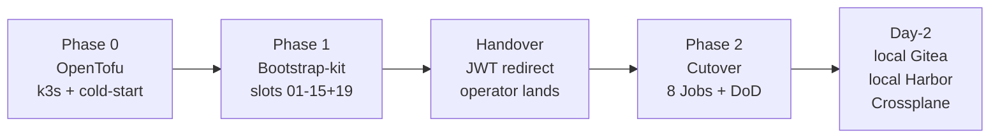
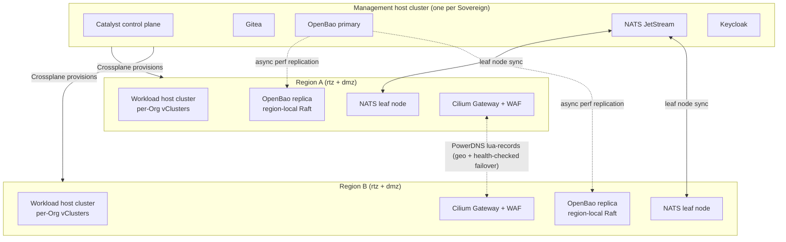

# Architecture

> **What this is**: the canonical "how OpenOva works" doc. Target architecture, tech stack, naming, repo layout, bootstrap-kit slot ordering, and EPIC-level design — all in one place.
>
> **Authority**: PERMANENT canon. Reviewed PRs only. Reconciled into a single file on 2026-05-20 from the former ARCHITECTURE / PLATFORM-TECH-STACK / NAMING-CONVENTION / EPICS-1-6-unified-design / BOOTSTRAP-KIT-EXPANSION-PLAN set.
>
> **Pointers**:
> - User-global engineering principles → `~/.claude/CLAUDE.md`
> - Inviolable engineering rules → [`docs/PRINCIPLES.md`](PRINCIPLES.md)
> - 5-pillar Definition of Done → [`docs/DOD.md`](DOD.md)
> - What exists in code today vs design → [`docs/STATUS.md`](STATUS.md)
> - Terminology (wins over every other doc) → [`docs/GLOSSARY.md`](GLOSSARY.md)
> - Domain canon for tests → [`docs/DOD.md`](DOD.md)
> - Anti-theater receipts → [`docs/PRINCIPLES.md`](PRINCIPLES.md)

---

## §1 — High-level model

**Catalyst** is the OpenOva platform — a Kubernetes-native control plane published as signed OCI Blueprints. A deployed Catalyst is called a **Sovereign**. Inside a Sovereign:

- **Organization** is the multi-tenancy unit. An Org has one or more Environments.
- **Environment** (`{org}-prod`, `{org}-dev`, etc.) is where users install Applications.
- **Application** is a running deployment — one Gitea repo per Application, uniformly at SME and corporate scale; branches `develop` / `staging` / `main` map to `dev` / `stg` / `prod` Environments.
- **Blueprint** is the install unit — a signed `bp-<name>:<semver>` OCI artifact.

One or more vClusters per Environment run lightweight Flux watching the appropriate branch across the Org's Application repos. Every state change flows through NATS JetStream, projects into per-Environment KV via the **projector** service, and reaches the console via SSE — so every UI surface sees the same picture, derived from Git (write side) and Kubernetes (runtime side) without fragmenting. Crossplane handles all non-Kubernetes resources. OpenBao + ESO handles secrets; workload identity is Cilium WireGuard (kernel transport encryption) + K8s ServiceAccount TokenReview (workload-to-workload auth) — SPIRE was dropped from the bootstrap-kit by founder PR [#665](https://github.com/openova-io/openova/pull/665) (2026-05-03) and is retained as **DEFERRED / opt-in only**; re-enable triggers in [`SECURITY.md`](SECURITY.md) §2. Keycloak handles user identity.

**Same code runs in every Sovereign** — whether it's run by OpenOva (`openova`), Omantel for SMEs (`omantel.omani.works`), or a corporate customer self-hosting under their own private agreement. Customer-hosted Sovereign deployments are intentionally not named in this public catalog. (`omantel.biz` is the LE-rate-limit *test-fallback* TLD per [`DOD.md`](DOD.md) §4, not the franchised Sovereign FQDN.)

### §1.1 Two scales, one architecture

The model serves two distinct customer shapes through the **same code**:

```
        ┌──────────────────────────────────────────────────────────────┐
        │ SME-style Sovereign (e.g. omantel.omani.works)              │
        │                                                              │
        │ Many small Organizations, mostly single-Environment          │
        │ Each Org gets its own minimal Keycloak (no HA)               │
        │ Self-service marketplace, next-next-next install             │
        │ Sovereign-admins are the SaaS provider's cloud team          │
        └──────────────────────────────────────────────────────────────┘

        ┌──────────────────────────────────────────────────────────────┐
        │ Corporate-style Sovereign (customer self-host)               │
        │                                                              │
        │ Few internal Organizations (core-banking, digital-channels…) │
        │ One Sovereign-wide Keycloak (federates to corporate Azure AD)│
        │ Rich governance: EnvironmentPolicy, soak gates, approvers    │
        │ Sovereign-admins are the bank's platform team                │
        │ Multi-region default; multi-Environment per Org default      │
        └──────────────────────────────────────────────────────────────┘
```

The **only** runtime configuration difference is set at provisioning time:

```yaml
keycloakTopology: per-organization      # SME default
# or
keycloakTopology: shared-sovereign      # Corporate default
```

Everything else is identical in code.

### §1.2 Topology overview

```
┌─────────────────────────────────────────────────────────────────────────┐
│ Sovereign: <sovereign-fqdn>                                              │
│                                                                          │
│  Management host cluster: hz-nbg-mgt-prod                                │
│  ┌────────────────────────────────────────────────────────────────────┐ │
│  │ Catalyst control plane (in catalyst-* namespaces)                  │ │
│  │   console   marketplace   admin   catalog-svc   projector          │ │
│  │   provisioning   environment-controller   blueprint-controller     │ │
│  │   billing                                                          │ │
│  │   gitea   nats-jetstream   openbao   keycloak                      │ │
│  │   observability (Grafana stack)                                    │ │
│  └────────────────────────────────────────────────────────────────────┘ │
│  Plus per-host-cluster infrastructure (Cilium, Flux, Crossplane,        │
│  cert-manager, External-Secrets, Kyverno, Harbor, Reloader, Trivy,      │
│  Falco, Sigstore, Syft+Grype, VPA, KEDA, External-DNS, PowerDNS, Coraza,│
│  SeaweedFS, Velero, Continuum failover orchestrator) — see §3.          │
│                                                                          │
│  Workload host clusters: hz-fsn-rtz-prod, hz-hel-rtz-prod                │
│  ┌──────────────────────────────────────────────────────────────────┐   │
│  │ Per-Org vCluster (named {org}):                                  │   │
│  │   muscatpharmacy   acme-shop   blue-pharmacy   …                 │   │
│  │   each runs its own lightweight Flux pointed at the Environment  │   │
│  │   Gitea repo                                                     │   │
│  └──────────────────────────────────────────────────────────────────┘   │
│                                                                          │
│  DMZ host clusters: hz-fsn-dmz-prod, hz-hel-dmz-prod                     │
│   Cilium Gateway, WAF (Coraza), PowerDNS authoritative + lua-records,   │
│   dnsdist rate-limit, WireGuard endpoints                                │
└─────────────────────────────────────────────────────────────────────────┘
                              ↕
                  Gitea (in management cluster) — 5 conventional Gitea Orgs
                  ──────────────────────────────────────────────────────────
                  catalog/                    ← public Blueprint mirror (read-only)
                  catalog-sovereign/          ← Sovereign-owner-curated private Blueprints (optional)
                  acme-pharmacy/              ← one Gitea Org per Catalyst Organization
                    ├── shared-blueprints     ← Org-private Blueprint authoring
                    ├── store-frontend        ← one Gitea Repo per Application
                    ├── pharmacy-mail
                    ├── consult-room
                    └── appointments
                                              (branches develop/staging/main map
                                               to dev/stg/prod environments)
                  kestrel-rx/                 ← another Catalyst Organization
                  system/                     ← sovereign-admin scope
                    ├── catalyst-config       (Sovereign/Organization/Environment/Policy CRs)
                    ├── policy-bundle         (Kyverno, Falco, RE Scorecard)
                    └── runbooks              (auto-remediation)
```

**Sovereign self-sufficiency**: once a Sovereign is provisioned, it has its own Gitea, its own JetStream, its own OpenBao, its own Keycloak, its own Crossplane. It does not depend on any other Sovereign at runtime. OpenOva's `openova` Sovereign is the publisher of public Blueprints — but those are mirrored locally, so the Sovereign keeps working if `openova.io` disappears. Post `bp-self-sovereign-cutover` (§5.6), the Sovereign also survives `github.com`, `ghcr.io`, and `harbor.openova.io` being unreachable.

---

## §2 — Repo layout

```
openova/
├── core/                   # Catalyst control-plane application (Go)
│   ├── apps/               # target: console/, projector/, environment-controller/, etc.
│   │                       # current: empty .gitkeep + legacy bootstrap/manager/ placeholders
│   ├── internal/           # domain, application, adapters, events
│   ├── pkg/apis/           # CRD types: Sovereign, Organization, Environment,
│   │                       # Application, Blueprint, EnvironmentPolicy, SecretPolicy,
│   │                       # Runbook, Continuum
│   ├── ui/                 # frontend (Astro 5 + Svelte 5 islands)
│   └── deploy/             # K8s manifests per control-plane component
├── platform/               # Component Blueprint folders — one folder per upstream OSS project
│   ├── cilium/  cnpg/  cnpg-pair/  continuum/  flux/  gitea/  keycloak/  openbao/  …
│   └── …                   # ~61 folders total
├── products/               # Composite Blueprint folders OpenOva ships
│   ├── catalyst/           # Target: bp-catalyst-platform umbrella
│   ├── cortex/             # AI Hub
│   ├── axon/               # SaaS LLM Gateway
│   ├── fingate/            # Open Banking
│   ├── fabric/             # Data & Integration
│   └── relay/              # Communication
├── clusters/
│   └── _template/          # Canonical bootstrap-kit slots 01..48 (§6)
└── docs/                   # Canonical platform documentation
```

Each subfolder of `platform/` and `products/` is the **source of one Blueprint** in this monorepo (canonical layout). CI fans out to per-Blueprint OCI artifacts at `ghcr.io/openova-io/bp-<name>:<semver>` — that's where per-Blueprint isolation lives. There are no separate per-Blueprint Git repositories.

---

## §3 — Tech stack by layer

Components are categorized by where they run:

| Category | Where it runs | Examples |
|---|---|---|
| **Catalyst control plane** | The Sovereign's `mgt` cluster (once per Sovereign) | console, marketplace, admin, projector, catalog-svc, provisioning, environment-controller, blueprint-controller, useraccess-controller, organization-controller, application-controller, continuum-controller, billing, gitea, nats-jetstream, openbao, keycloak, observability (Grafana stack) |
| **Per-host-cluster infrastructure** | Every host cluster (`mgt`, `rtz`, `dmz`) | cilium, external-dns, powerdns, coraza, flux, crossplane, opentofu (Phase-0 only), sealed-secrets (Phase-0 only), cert-manager, external-secrets, kyverno, trivy, falco, sigstore, syft-grype, vpa, keda, reloader, seaweedfs, velero, harbor |
| **Application Blueprints** | Inside per-Org vClusters | cnpg, cnpg-pair, ferretdb, valkey, strimzi, clickhouse, opensearch, stalwart, livekit, matrix, stunner, guacamole, milvus, neo4j, vllm, kserve, knative, librechat, bge, llm-gateway, anthropic-adapter, langfuse, nemo-guardrails, temporal, flink, debezium, iceberg, openmeter, litmus |

The **same upstream technology** can serve in multiple categories. For example: Valkey is **not** part of the control plane (JetStream KV replaces it there) but **is** available as an Application Blueprint when a User wants Redis-compatible caching. Similarly, Strimzi/Kafka is an Application Blueprint; the Catalyst control plane uses NATS JetStream for events.

### §3.1 Canonical stack — modern, community-adopted, cost / perf / reliability balanced

| Layer | Canonical choice | Why |
|---|---|---|
| CNI + service mesh | **Cilium eBPF** (no sidecars) — Gateway API, mTLS via WireGuard, Hubble flow observability | Kernel-level enforcement; lowest overhead at scale |
| GitOps | **Flux** | Lightweight, native CRDs, no UI dep, multi-tenant by Kustomization. One Flux per vCluster (source + kustomize + helm controllers); host-level Flux on every host cluster |
| IaC | **Crossplane** (Day-2) + **OpenTofu** (Phase-0 only) | Composition + declarative; never user-facing |
| Organization isolation | **vCluster** | Strong boundary without per-Org control-plane overhead |
| Event spine | **NATS JetStream** | Streams + KV; replaces both Kafka and Redis for control-plane traffic. Per-Org Accounts. Apache 2.0 |
| Operational data (SQL) | **CNPG** Postgres | Per-Sovereign primary on `mgt`; per-region siblings |
| Operational data (multi-region zero-tx-loss) | **bp-cnpg-pair** (synchronous `remote_apply`) + **bp-continuum** (failover orchestrator) | Two Cluster CRs (primary + ReplicaCluster) across Cilium ClusterMesh; sync replication for zero-tx-loss; lease-based orchestrated switchover. PR [#2071](https://github.com/openova-io/openova/pull/2071) wired sync repl; PR [#2087](https://github.com/openova-io/openova/pull/2087) + [#2093](https://github.com/openova-io/openova/pull/2093) added pre-merge guards |
| Document store | **FerretDB on CNPG** | MongoDB wire protocol; one backing store, not two |
| KV / cache | **Valkey** | Sessions, rate-limit counters, idempotency keys, ephemeral pubsub |
| Object storage | **SeaweedFS** | Unified S3 with hot/warm/cold tiering, single endpoint per Sovereign |
| Secret backend | **OpenBao** + **external-secrets operator** | Vault-compatible, MPL-2.0, reflector for cross-ns mirror. Region-local Raft. Bootstrap-only sealed-secrets bridges until ESO+OpenBao online |
| Workload identity | **Cilium WireGuard** (transport) + **K8s ServiceAccount TokenReview** (auth) | Kernel-level east-west encryption + audience-scoped 1h bound-tokens. Replaced SPIRE per PR [#665](https://github.com/openova-io/openova/pull/665) |
| Workload identity (DEFERRED) | **SPIRE / SPIFFE** | DEFERRED / opt-in only. `platform/spire/` chart retained; re-enable triggers in [`SECURITY.md`](SECURITY.md) §2; roadmap in TBD-V29 ([#2055](https://github.com/openova-io/openova/issues/2055)) |
| User identity | **Keycloak** | Per-Org realm (SME) or per-Sovereign realm (corporate); federates Azure SSO / Okta / generic OIDC |
| Policy / admission | **Kyverno** | Single engine for admission, mutation, generation. `validationFailureAction: Audit` for permissive, `Enforce` for enforcing — same YAML |
| Runtime security | **Falco** (eBPF) | DROP-class detection at kernel level |
| Supply chain | **Sigstore** + **cosign** + **Syft+Grype** + **Trivy** | Signature verification, SBOM, image+IaC vuln scan. SLSA-3 build provenance |
| Edge / DNS | **PowerDNS** (authoritative + DNSSEC + lua-records) + **external-dns** | Geo-failover via lua, no proprietary DNS lock-in. PDM owns zone lifecycle + registrar adapters |
| WAF | **Coraza** (OWASP CRS) | DMZ-edge, sits in front of Cilium Gateway |
| Mail | **Stalwart** | Modern, programmable; per-Org vCluster, not host-cluster |
| AI runtime | **Knative** → **KServe** → **vLLM**; **bge** for embeddings, **llm-gateway** + **anthropic-adapter**, **nemo-guardrails** | KServe model serving on Knative serverless; vLLM inference; bge embeddings; LLM gateway for subscription proxy and adapter; guardrails for safety |
| AI observability | **Langfuse** | CNPG-backed; OIDC via Keycloak |
| Observability (general) | **Grafana Alloy** + **Loki** + **Mimir** + **Tempo** + **Grafana** | OTel-native, multi-tenant, cost-efficient at scale. SeaweedFS-backed |
| Container registry | **Harbor** | Per-host registry, proxy-cache for upstream, signature verification |
| Sovereignty pivot | **bp-self-sovereign-cutover** | 8-tether pivot from mothership to local Gitea + local Harbor. ADR-0002. Principle #11 |
| Failover | **Continuum** (custom CRD + controller) | Lease-based (Cloudflare KV witness or 3-DNS-quorum), low-TTL lua-record flip. Replaced README-only `failover-controller` per Phase 0 #11 |
| Browser access | **Guacamole** (single per Sovereign) | Bastion, pod consoles, RDP/VNC over Keycloak SSO; recordings on SeaweedFS |
| UI | **Astro 5 + Svelte 5 islands** | Static-first, minimal JS, fast interaction-to-paint |
| Backup | **Velero** | SeaweedFS-backed |
| Autoscaling | **HPA** + **VPA** + **KEDA** + **cluster-autoscaler** | Four orthogonal autoscalers — see §3.3 |

### §3.2 Five backing stores — period

Every component picks from this list; nothing else qualifies.

| Store | Tech | Use |
|---|---|---|
| SQL | CNPG | Transactional state — Keycloak, PowerDNS, billing, PDM |
| Document | FerretDB on CNPG | Marketplace catalog item specs, nested document shapes |
| KV / cache | Valkey | Sessions, rate-limit counters, idempotency keys, ephemeral pubsub |
| Messaging | NATS JetStream | Audit log, billing events, cross-replica fan-out, cross-region Mirror streams |
| Object | SeaweedFS | Bastion / pod session recordings, large blobs |

No new MongoDB. No new MySQL. No Redis (Valkey substitutes). No Redpanda. No Kafka inside Catalyst itself (Strimzi is an opt-in Application Blueprint). No MinIO (SeaweedFS substitutes).

### §3.3 Autoscaling — four orthogonal layers

Catalyst layers four orthogonal autoscalers, each addressing a different dimension. None substitute for any other; they compose.

| Dimension | Component | Blueprint | Slot | Decides |
|---|---|---|---|---|
| Workload (vertical) — right-size pod requests/limits | VPA | `bp-vpa` | 29 | "Pod X uses N MB / M mC, change its requests" |
| Workload (horizontal, metric-driven) — replicas from CPU/mem | Kubernetes built-in | (HPA is a kube primitive) | n/a | "Service Y is hot, run 5 replicas instead of 2" |
| Workload (horizontal, event-driven) — replicas from queue depth, NATS lag, cron | KEDA | `bp-keda` | (W3) | "JetStream subject Z has 50k pending msgs, scale consumer to 8" |
| Node (cluster-wide) — add/remove cloud machines | cluster-autoscaler | `bp-cluster-autoscaler-hcloud` | 40 | "5 pods are FailedScheduling, add a worker" |

Bounds: cluster-autoscaler is bounded by per-Sovereign `min` / `max` in the HelmRelease overlay; `min` ≤ Tofu Phase-0 worker_count ≤ `max`. Scale-down idle: 10 minutes default. The autoscaler runs on the control-plane node only — it is never scheduled onto a worker it could itself terminate. Hetzner project quota is the ultimate cap.

### §3.4 License posture

Every Catalyst control-plane component carries an open-source license that allows redistribution. The Catalyst control plane never bundles BSL-licensed software.

| Component | License |
|---|---|
| OpenBao | MPL 2.0 (Apache-2.0 fork of Vault) |
| NATS JetStream | Apache 2.0 |
| Cilium | Apache 2.0 |
| Flux | Apache 2.0 |
| Crossplane | Apache 2.0 |
| Gitea | MIT |
| Keycloak | Apache 2.0 |
| cert-manager | Apache 2.0 |
| ESO | Apache 2.0 |
| OpenTofu | MPL 2.0 (Terraform fork) |
| OpenSearch | Apache 2.0 (Elasticsearch fork) |
| Valkey | BSD-3 (Redis fork) |

### §3.5 Composite Blueprints (Products)

| Composite | Composes |
|---|---|
| `bp-catalyst-platform` | The Catalyst control plane itself |
| `bp-cortex` | AI Hub — kserve, knative, vllm, milvus, neo4j, librechat, bge, llm-gateway, anthropic-adapter, nemo-guardrails, langfuse |
| `bp-axon` | SaaS LLM Gateway (also a standalone managed gateway) |
| `bp-fingate` | Open Banking — keycloak (FAPI mode), openmeter, ext_authz + 6 banking services |
| `bp-fabric` | Data & Integration — strimzi, flink, temporal, debezium, iceberg, clickhouse, seaweedfs |
| `bp-relay` | Communication — stalwart, livekit, stunner, matrix, guacamole |
| `bp-self-sovereign-cutover` | 8-tether pivot — see §5.6 |

`bp-specter` (AIOps agents) and Exodus (migration program) sit alongside the above; Specter is a composite Blueprint typically installed in corporate Sovereigns, Exodus is a services engagement.

---

## §4 — Naming conventions

Every name is a **composition of typed dimensions** — never free-text, never descriptive prose. Names are deterministic: given the dimensions, the name is computable. **Don't repeat the parent**: when an object lives inside a container that already encodes location, do not repeat that information. **Building blocks, not failover roles**: clusters are named by their functional security zone, not "primary" or "dr". (The former standalone `NAMING-CONVENTION.md` is folded into this section.)

### §4.1 Dimensions

**Provider** (2-char/1-char): `hz/h` Hetzner · `hw/w` Huawei · `oci/o` OCI · `aws/a` AWS · `gcp/g` GCP · `az/z` Azure · `ct/c` Contabo.

**Region** (provider-scoped). Hetzner examples: `fsn/f` Falkenstein · `nbg/n` Nuremberg · `hel/l` Helsinki · `ash/a` Ashburn · `hil/i` Hillsboro · `sin/s` Singapore. (`h` reserved for Hetzner provider.) Huawei: `apse/p`, `cnn/c`, `las/q`, `mer/r`. OCI: `dxb/x`, `fra/r`, `sg/g`, `iad/d`, `syd/y`.

**Building block** (security zone): `rtz/r` Restricted Trust Zone (production workloads) · `dmz/d` (internet-facing — WAF, ingress, WireGuard endpoints) · `mgt/m` (Catalyst control plane).

**Env type**: `prod/p` · `stg/s` · `uat/u` · `dev/d` · `poc/c`. **DR is a Placement, not an env_type** — disaster recovery is expressed by the Application's Placement spec across regions, not by a separate `*-dr` Environment.

**Organization slug**: `^[a-z][a-z0-9-]{2,31}$`. Reserved: `system`, `flux`, `crossplane`, `catalyst`, `gitea`, `kube-*`, anything matching a provider/region/bb/env_type code.

### §4.2 Patterns

| Object | Pattern | Example |
|---|---|---|
| K8s cluster context | `{prov}-{reg}-{bb}-{env_type}` | `hz-fsn-rtz-prod` |
| Server / VM | `{prov}{reg}{bb}-{app}-{#}{env_type}` | `hzfsnr-k8s-1p` |
| DNS location code | `{p}{r}{b}{e}` (4 chars) | `hfrp` |
| VPC / Network | `{bb}-{env_type}` | `rtz-prod`, `dmz-prod` |
| vCluster (within host cluster) | `{org}` | `acme`, `acmebank` |
| vCluster (cross-cluster qualified) | `{prov}-{reg}-{bb}-{env_type}-{org}` | `hz-fsn-rtz-prod-acme` |
| Catalyst Environment | `{org}-{env_type}` | `acme-prod`, `acmebank-uat` |
| Blueprint | `bp-<name>` | `bp-wordpress`, `bp-cnpg-pair` |
| Application (within Environment) | `<purpose>` | `marketing-site`, `blog` |
| Catalyst control-plane DNS | `{component}.{location-code}.{sovereign-domain}` | `gitea.hfmp.openova.io`, `console.hnmp.openova.io` |
| Application DNS | `{app}.{environment}.{sovereign-or-org-domain}` | `marketing-site.acme-prod.<sovereign>.<tld>`, `blog.acme-prod.acme.com` (white-label) |
| Application Gitea repo | `gitea.{location-code}.{sovereign-domain}/{org}/{app}` | `gitea.hfmp.<sovereign>.<tld>/acme-pharmacy/store-frontend` |

Test Sovereigns and tenant Organizations follow [`docs/DOD.md`](DOD.md):

- Test Sovereign: `t<NN>.omani.works` (or `t<NN>.omantel.biz` if LE-rate-limited)
- Tenant Organization: `<orgslug>.omani.homes` (default), `omani.rest`, or `omani.trade`
- Voucher redeem URL: `https://marketplace.t<NN>.omani.works/redeem/?code=<CODE>`

**Forbidden in tests**: `openova.io`, any `*.openova.io` placeholder Sovereign, `eventforge.io`. The legacy `admin.<sovereign-fqdn>` subdomain for voucher operations is dead — voucher and billing operations live in the operator console's BSS menu.

### §4.3 Required labels on every Catalyst-managed resource

The label set is the single join key across compliance, RBAC, billing, networking, and resource-browser scoping. Phase 0 makes it enforceable at admission via two Kyverno ClusterPolicies (`mutate-add-openova-labels` + `validate-require-openova-labels`).

```yaml
metadata:
  labels:
    # Cluster scope (set by infrastructure)
    openova.io/provider:        hetzner|huawei|oci|aws|gcp|azure|contabo
    openova.io/region:          fsn|nbg|hel|...        # 3-char
    openova.io/building-block:  rtz|dmz|mgt
    openova.io/env-type:        prod|stg|uat|dev|poc
    openova.io/sovereign:       <sovereign-fqdn>       # e.g. omantel.omani.works, t38.omani.works
    openova.io/host-cluster:    <prov>-<reg>-<bb>-<env_type>

    # Tenant scope (set by organization-controller / application-controller)
    openova.io/organization:    <org-slug>
    openova.io/environment:     <org>-<env_type>
    openova.io/vcluster:        <org>
    openova.io/application:     <app-name>
    openova.io/blueprint:       <bp-name>
    openova.io/blueprint-version: <semver>

    # Lifecycle
    openova.io/managed-by:      flux|crossplane|opentofu|manual
    app.kubernetes.io/managed-by: flux                 # mirrors when managed-by=flux
```

### §4.4 Why an Environment is an object, not a tag

It owns its own Git repo (a tag couldn't). It owns Placement metadata. It is the unit of Application install / uninstall / promotion. Renaming would break Git history and Flux state — naming is stable for the lifetime of the Environment.

---

## §5 — Catalyst control plane

### §5.1 Architectural rules (non-negotiable)

These extend [`PRINCIPLES.md`](PRINCIPLES.md) and ADR-0001.

1. **GitOps is the only deployment path.** Flux-only. No `kubectl apply` in production. No `helm install` in production. No `exec.Command("helm", …)`. Catalyst components observe via watch streams or write to Gitea repos that Flux reconciles.
2. **Crossplane is cloud-only.** Crossplane manages cloud-provider APIs (Hetzner Servers, OCI compute, S3 buckets, etc.). It does **not** do K8s-to-K8s composition. RoleBindings, Kustomizations, ConfigMaps from a higher-level intent CR are reconciled by Flux Kustomizations or thin in-cluster controllers — never a Crossplane Composition.
3. **Five backing stores. Period.** (See §3.2.)
4. **K8s itself is the database for cluster state.** No shadow store mirrors pods/deployments/services into a separate database. `catalyst-api` holds an in-process informer cache (`internal/k8scache.Factory`) that is rebuilt from the kube-apiserver on cold start.
5. **Event-driven, never polling.** State observed via K8s watch streams. UI updates via SSE. No `time.Tick` poll loops. No `setInterval` HTTP polls anywhere in the read path.
6. **Tenancy is K8s-native.** An `Organization` is `namespace + vCluster + Keycloak group + Organization CR`. Per-Org isolation lives in the vCluster layer. Resource names below the namespace never embed the Org slug.
7. **Identity is Keycloak.** Per-Sovereign realm (corporate) or per-Org realm (SME). OIDC tokens flow end-to-end; the Sovereign's K8s api-server validates them via `--oidc-*` flags. Corporate Sovereigns federate Azure SSO via Keycloak Identity Provider broker.
8. **Browser access is via Guacamole.** Bastion sessions, pod consoles, RDP/VNC. One protocol, one audit log, one session-recording path (recordings on SeaweedFS).
9. **Catalyst events flow on NATS JetStream.** Audit log, user actions, billing, cross-replica fan-out, cross-region Mirror streams.
10. **IaC always — every parameter is a variable.** No region, replica count, TTL, weight, retention, or other knob is hardcoded. UI surfaces them; CRDs persist them in Gitea.

### §5.2 Write side — Git → Flux → Kubernetes (+ Crossplane)

```
                       Console UI                       REST/GraphQL API
                            │                                    │
                            ▼                                    ▼
              ┌──────────────────────────────────────────────────────────┐
              │  provisioning service                                    │
              │   - validates configSchema against Blueprint             │
              │   - resolves dependency graph                            │
              │   - creates one Gitea repo per Application               │
              │   - commits initial manifests to develop/staging/main    │
              └──────────────────────────────────────────────────────────┘
                                     │
                                     ▼
              ┌──────────────────────────────────────────────────────────┐
              │  Application Gitea repo: {org}/{app}                     │
              │  branches: develop → dev env, staging → stg, main → prod │
              │  kustomization.yaml      ← root Flux Kustomization       │
              │  values.yaml             ← base values                   │
              │  overlays/               ← per-env overlays              │
              │  secrets/                ← ExternalSecret refs           │
              │  CODEOWNERS              ← team / approver list          │
              │                                                          │
              │  EnvironmentPolicy lives separately in system Gitea Org: │
              │    system/catalyst-config/policies/{org}-{env}-policy    │
              └──────────────────────────────────────────────────────────┘
                                     │
                                     ▼ (Gitea webhook → projector → annotate)
              ┌──────────────────────────────────────────────────────────┐
              │  Flux in vCluster {org}                                  │
              │   - N GitRepository sources, one per App repo            │
              │   - each watching the env-appropriate branch             │
              │   - kustomize-controller applies to per-App namespaces   │
              │   - helm-controller renders Helm-based Blueprints        │
              └──────────────────────────────────────────────────────────┘
                                     │
                  ┌──────────────────┴────────────────────┐
                  ▼                                        ▼
        K8s Application workloads                 Crossplane Claims
        (Deployments, Services,                   (Cloud servers, DNS records,
         Pods, Secrets via ESO)                    S3 buckets, registrar APIs)
                                                          │
                                                          ▼
                                              Crossplane Compositions
                                              fan out to provider APIs
```

**Crossplane is the only IaC.** Users never write Compositions in their Application configs. Blueprint authors do — when a Blueprint declares "needs an external Postgres," that becomes a Crossplane Claim. Advanced users can author Compositions as Blueprints. End users see "needs a database, pick existing or new" in the UI.

### §5.3 Read side — CQRS via JetStream → projector → console

```
┌────────────────────┐     ┌────────────────────┐     ┌──────────────────┐
│ k8s informers      │     │ Flux events        │     │ Gitea webhooks   │
│ (one per vCluster) │     │ (per vCluster)     │     │ (per Sovereign)  │
└─────────┬──────────┘     └─────────┬──────────┘     └─────────┬────────┘
          │                          │                          │
          ▼                          ▼                          ▼
   ┌────────────────────────────────────────────────────────────────────┐
   │  NATS JetStream                                                    │
   │  Account isolation: one NATS Account per Organization              │
   │  Subject prefix scoped per Environment (where <env> = {org}-{type}):│
   │     ws.<env>.k8s.<obj-kind>.<ns>.<name>                            │
   │     ws.<env>.flux.<kustomization>                                  │
   │     ws.<env>.git.<commit-hash>                                     │
   │     ws.<env>.crossplane.<resource>                                 │
   └────────────────────────────────────────────────────────────────────┘
                                  │
                                  ▼ durable consumer per env partition
   ┌────────────────────────────────────────────────────────────────────┐
   │  projector                                                         │
   │   - consumes events                                                │
   │   - rebuilds per-object state                                      │
   │   - writes to JetStream KV: ws-<env>-state/<kind>/<name>           │
   │   - fans out SSE to subscribed console clients                     │
   │   - authorizes by JWT claim {environment, org, role}               │
   │   - serves REST/GraphQL snapshot read API                          │
   └────────────────────────────────────────────────────────────────────┘
                                  │
                                  ▼
                       ┌────────────────────┐
                       │  Catalyst console  │
                       └────────────────────┘
```

**One spine (JetStream), one read model (JetStream KV), one consumer (projector), one stream (SSE).** The console never talks to k8s API or Git directly. This is the architectural lock that prevents the "App says installed in one tab, failed in another tab" class of bug.

JetStream replaces an older Redpanda + Valkey pairing in the control plane: NATS is Apache 2.0 (no BSL risk), has native KV (fewer moving parts), and native multi-tenant Accounts (cleaner per-Org isolation). Application-layer event needs (e.g. TalentMesh's voice pipeline) remain free to choose Redpanda, Kafka, NATS, or anything else — that's an Application-level decision, not a control-plane one.

### §5.4 Catalyst CRDs

All in `apps.openova.io/v1`, `orgs.openova.io/v1`, `catalyst.openova.io/v1`, or `dr.openova.io/v1` per type domain. Land in `products/catalyst/chart/crds/`. Validation hooks run as Kyverno ClusterPolicy.

| CRD | Group | Purpose |
|---|---|---|
| `Sovereign` | `catalyst.openova.io/v1` | The deployed Catalyst — one per Sovereign |
| `Organization` | `orgs.openova.io/v1` | Multi-tenancy unit; reconciles to vCluster + Keycloak group + Gitea Org + base RBAC |
| `Environment` | `catalyst.openova.io/v1` | User-facing scope (`{org}-{env_type}`); reconciles per-region vCluster + Flux + JetStream subjects |
| `Application` | `apps.openova.io/v1` | Running deployment; validated against `Blueprint.spec.configSchema` at admission |
| `Blueprint` | `catalyst.openova.io/v1` | Catalog item; CRD-validated `card / visibility / owner / configSchema / topology† / depends / manifests.source / overlays / upgrades / rotation / observability` |
| `EnvironmentPolicy` | `catalyst.openova.io/v1` | Compliance config + promotion gating + placement defaults (per-Org weight + mode per-policy) |
| `SecretPolicy` | `catalyst.openova.io/v1` | Rotation rules (TTL, action: rotate/warn/block) |
| `Runbook` | `catalyst.openova.io/v1` | Auto-remediation hooks |
| `Continuum` | `dr.openova.io/v1` | Active-hotstandby orchestration: lease, replication health, switchover sequence, lua-record body |
| `UserAccess` | `catalyst.openova.io/v1` | Tier-based RBAC (scope = label selectors; AND within UA, OR across UAs) |

> **† Canonical placement/topology declaration (#3375 DoD-1).** A Blueprint
> declares its multi-region placement in **one canonical shape**:
> `spec.topology` (`supported[] · defaults · perTopology{<bcp>:{replication,
> switchover, placement{tier, clusters[], roles{}}}}`). This is the shape the
> application-controller's fan-out renderer consumes (`internal/render/
> topology.go` `ResolveTopology` → `fanout.go` `FanoutHRs`), the shape the
> cluster-ID registry resolves (`internal/clusterregistry`), and the shape the
> agreement table (`docs/topology-matrix.md`) carries — it expresses the
> mechanism, switchover, and per-cluster role columns directly. The earlier
> `spec.placementSchema` (`modes[]/default/vcluster`, G92/G93) is the **legacy
> orphan**: it cannot express replication backend, switchover mechanism, or
> per-cluster roles. It remains wired only to the legacy `Application.spec.
> placement` string-enum path (`internal/placement/placement.go`); its removal
> is a coordinated controller-migration follow-on (sequenced after the #3370/
> #3373 placement wave converges), not a declaration change. New Blueprints use
> `spec.topology` exclusively — the CI admission gate (`blueprint-admission-
> validate`) rejects a blueprint without it (G116).

### §5.5 Controllers

All Go binaries under `core/controllers/<name>/cmd/main.go`, `controller-runtime` + `client-go`. Containers signed via cosign in CI; deployed via Flux HelmReleases.

| Controller | Watches | Reconciles | Where |
|---|---|---|---|
| `organization-controller` | `Organization` | vCluster + Keycloak group + Gitea Org + base RBAC | mgt |
| `environment-controller` | `Environment` | per-app Gitea repo branches + per-vCluster Flux GitRepository + JetStream subjects | mgt |
| `blueprint-controller` | `Blueprint` | catalog mirror (public → sovereign-curated → per-Org) | mgt |
| `application-controller` | `Application` | per-region Gitea manifest writes; honors Placement | mgt |
| `useraccess-controller` | `UserAccess` | RoleBinding + ClusterRoleBinding via kubernetes clientset | per data-plane cluster |
| `continuum-controller` | `Continuum` + `Application` | lease, replication health, switchover sequence, lua-record body via PDM | mgt |
| `compliance-aggregator` | `PolicyReport`, `ClusterPolicyReport`, custom evaluators | Score rollups → SSE + NATS `policy-rollup` KV | per data-plane cluster |

The `useraccess-controller` replaces the older `XUserAccess` Crossplane Composition (which depended on `provider-kubernetes` — never installed). Phase 0 ships the Go controller; the Composition + orphaned Provider reference are deleted.

### §5.6 Phase 2 — Self-Sovereignty Cutover

A franchised Sovereign emerging from Phase 1 is operationally tethered to the OpenOva mothership in **eight** places (audit per [ADR-0002](adr/0002-post-handover-sovereignty-cutover.md) §2.1 and umbrella issue #790): Flux GitRepository url, containerd registry rewrites, 38 OCI HelmRepositories, `catalyst-api` upstream fallback, GHCR pull Secret, Crossplane provider packages, Catalyst-authored image refs, OS package mirrors. Six are operationally hot (P0/P1) and must be pivoted before the customer can claim sovereignty.

The cutover follows a **30/70 model**:

- **OpenTofu provisions ~30%** — k3s install, Cilium, the cold-start `registries.yaml` v1 (routing pulls through `harbor.openova.io` to absorb docker.io rate limits), Flux pointed at `github.com/openova-io/openova`, and bootstrap-kit slots 01–15 + 19. The dormant `bp-self-sovereign-cutover` Blueprint is installed at slot 06a — JobTemplate ConfigMaps + RBAC + status ConfigMap are present, but the eight cutover Jobs are NOT created during Phase 1.
- **The Sovereign's own ecosystem provisions the remaining ~70%** post-cutover. Once the customer's local Gitea and local Harbor have absorbed the mothership tether, every subsequent reconcile (slots 16–50, day-2 Crossplane operations, Catalyst-platform updates, customer Application installs) flows through the Sovereign's own infrastructure.

The seam is a single Helm chart with eight sequential Jobs, triggered POST-HANDOVER by an operator click on **"Achieve True Sovereignty"** in the admin console (or, optionally, by `catalyst-api` auto-fire on first login). The eight Jobs are the canonical implementation of the eight-tether map:

| # | Job | Pivots tether |
|---|---|---|
| 1 | `gitea-mirror` | Mirrors `github.com/openova-io/openova` → local Gitea |
| 2 | `harbor-projects` | Creates 7 proxy-cache projects on local Harbor |
| 3 | `harbor-prewarm` | Pre-pulls all bootstrap-kit images through local Harbor |
| 4 | `registry-pivot` | DaemonSet rewrites `/etc/rancher/k3s/registries.yaml` (mothership Harbor → local Harbor) |
| 5 | `flux-gitrepository-patch` | Flips Flux source to local Gitea |
| 6 | `helmrepo-patches` | Flips 38 HelmRepositories to local Harbor |
| 7 | `catalyst-api-env-patch` | Removes upstream fallback in `catalyst-api` |
| 8 | `egress-block-test` | NetworkPolicy deny-egress hold for 10 min — DoD proof |



After Phase 2, the Sovereign survives `github.com`, `ghcr.io`, and `harbor.openova.io` being unreachable — and that survival is the DoD proof of franchise independence. The full architectural reasoning lives in [ADR-0002](adr/0002-post-handover-sovereignty-cutover.md). The non-negotiable rule is Principle #11 in [`PRINCIPLES.md`](PRINCIPLES.md).

### §5.7 Identity and secrets

Two separate identity systems for two separate purposes:

| Subject | System | Lifetime | Purpose |
|---|---|---|---|
| **Workloads** (every Pod) | Cilium WireGuard (transport) + K8s SA TokenReview (auth) | WG keys: per Cilium-agent restart. SA bound-tokens: 1 h, auto-rotated by kubelet | Pod-to-Pod transport (WG); Pod-to-OpenBao / Pod-to-NATS / Pod-to-`catalyst-api` auth (SA token + TokenReview) |
| **Users** (every human) | Keycloak → JWT | 15 min access / 30 day refresh | UI auth, API auth |

SPIFFE/SPIRE was dropped from the bootstrap-kit by founder PR #665. The `platform/spire/` chart is **DEFERRED / opt-in only** for cross-Sovereign federation, sub-hour cryptographic workload attestation, or per-workload-fingerprint authorization. Re-enable triggers in [`SECURITY.md`](SECURITY.md) §2.

Secret flow:

```
            OpenBao (per-region, independent Raft cluster)
                  │
                  │ (workload requests authenticated via OpenBao
                  │  `kubernetes` auth method = projected SA bound-token
                  │  → K8s TokenReview; transport encrypted by Cilium WG)
                  ▼
            ESO ExternalSecret CR (in Git, references OpenBao path)
                  │
                  ▼
            K8s Secret (versioned, reloader watches for hash change)
                  │
                  ▼
            Pod (env var or mounted file)
```

**Multi-region**: each region runs its **own** 3-node Raft OpenBao cluster. **No stretched cluster.** Cross-region async perf replication for read availability and DR. A region failure does not require any other region to do anything.

**Keycloak topology** depends on Sovereign type. SME-style (`per-organization`): minimal single-replica Keycloak per Org, embedded H2 or sqlite. Corporate-style (`shared-sovereign`): one HA Keycloak for the entire Sovereign, federating to corporate identity provider.

See [`SECURITY.md`](SECURITY.md) for full credential rotation and identity flow.

### §5.8 The three user-facing surfaces

Three first-class surfaces. **No fourth.**

**UI (Catalyst console)** — default. Form / Advanced / IaC editor (in-browser Monaco editing the Application's Gitea repo with Blueprint-schema validation, live diff, commit-on-save). All three commit to the same Application Gitea repo.

**Git** — direct push or pull-request to the Application's Gitea repo, or to `shared-blueprints` for Org-private Blueprints, or to `catalog-sovereign` for Sovereign-curated private Blueprints. Identical write semantics as the UI. EnvironmentPolicy applies regardless of surface.

**API (REST + GraphQL)** — for **integrations**, not for primary IaC authoring. Use cases: a bank's existing portal queries Catalyst to show Environments and Applications; a change-management tool triggers Application installs; a monitoring tool exports state for compliance.

**Not surfaces**: `kubectl` (useful for debugging inside one's own vCluster; never a configuration mechanism). Standalone CLI for production changes. Terraform / Pulumi. Crossplane is platform plumbing.

### §5.9 Promotion across Environments

Promotion is **not** a separate engine or chain object. Because each Application is a single Gitea repo with branches mapping to env_types, promotion is the simple act of opening a PR from the lower-env branch to the higher-env branch (e.g. `staging` → `main`), plus a policy gating the destination branch.

```yaml
# Lives at: system/catalyst-config/policies/acme-prod-policy.yaml
apiVersion: catalyst.openova.io/v1
kind: EnvironmentPolicy
metadata:
  name: acme-prod-policy
spec:
  appliesTo:
    environments: [acme-prod]
  rules:
    - kind: pr-required
      approvers: [team-platform, team-security]
      minApprovals: 2
    - kind: re-score-gate
      minScore: 80
      severity: blocking
    - kind: soak
      sourceEnvironment: acme-stg
      duration: 72h
    - kind: change-window
      cron: "0 14 * * 2,4"
      duration: 2h
```

### §5.10 Multi-Application linkage

A Blueprint can declare dependencies on other Blueprints:

```yaml
apiVersion: catalyst.openova.io/v1
kind: Blueprint
metadata:
  name: bp-wordpress
  version: 1.3.0
spec:
  configSchema: …
  depends:
    - blueprint: bp-postgres
      version: ^1.4
      alias: db
      when: "{{ .config.postgres.mode == 'embedded' }}"
      values:
        databases: ["{{ .application.name }}"]
```

When a User installs `marketing-site` from `bp-wordpress`: catalog-svc flattens the dependency tree; console asks "WordPress requires Postgres. Use existing or create new?"; provisioning service composes an InstallPlan (one Application referencing existing postgres, or two Applications); Gitea creates one or two repos; Flux picks up new GitRepository sources and reconciles in dependency order via cross-repo `Kustomization.dependsOn` edges.

---

## §6 — Per-host-cluster infrastructure

Every host cluster a Sovereign owns gets the same substrate, installed by the bootstrap kit during Phase 0 (or by Crossplane when a new region is added later).

### §6.1 Networking and service mesh

- **Cilium** — CNI + Service Mesh (eBPF). Kernel-level mTLS via WireGuard. L7 policies. Gateway API. Default-deny CCNP baseline + per-namespace allow templates instantiated by organization-controller. Application-controller adds per-Application egress rules from `Blueprint.spec.networking.egress`.
- **Hubble** — relay + UI enabled; UI exposed behind Cilium Gateway with OIDC (Keycloak `hubble-ui` client). RBAC: `hubble.read` on viewer+ tier.
- **PowerDNS** + **dnsdist** — per-Sovereign authoritative DNS, DNSSEC, lua-records for geo + health-checked failover. `pdns-pg` CNPG-backed. PDM owns zone lifecycle.
- **external-dns** — `pdns` provider; reconciles Service / Ingress hostnames.
- **Coraza** — WAF (OWASP CRS) at DMZ edge.

### §6.2 GitOps and IaC

- **Flux** — one per vCluster (source + kustomize + helm controllers) plus host-level Flux on each host cluster.
- **Crossplane** — only on mgt; manages cloud resources for the whole Sovereign. Cloud-only; never K8s-to-K8s.
- **OpenTofu** — Phase-0 bootstrap only.
- **Sealed-Secrets** — Phase-0 bootstrap only; decommissioned after Phase 1 hand-off in favor of ESO + OpenBao.

### §6.3 Security and policy

cert-manager · external-secrets · Kyverno (single admission/audit engine; same YAML toggles `Audit` ↔ `Enforce`) · Trivy (image + IaC scan) · Falco (runtime, eBPF) · Sigstore (cosign verification) · Syft+Grype (SBOM + match).

### §6.4 Scaling and operations

VPA · KEDA · Reloader. (HPA is a Kubernetes built-in; cluster-autoscaler at slot 40 — see §3.3.)

### §6.5 Storage and registry

SeaweedFS (unified S3 routing hot/warm/cold) · Velero (SeaweedFS-backed) · Harbor (per-host registry).

### §6.6 Resilience

**Continuum** (replaces the README-only `failover-controller`) — multi-region failover orchestration; lease-based (Cloudflare KV witness, with 3-DNS quorum fallback) to prevent split-brain. Drives bp-cnpg-pair primary/standby flip + low-TTL lua-record body via PDM.

### §6.7 Visual asset manifest (component-logos)

> Source: previously `docs/COMPONENT-LOGOS.md` (merged here on 2026-05-20).

The Catalyst wizard's component picker (Step 5: Components, `StepComponents.tsx` in `products/catalyst/bootstrap/ui/src/pages/wizard/steps/`) renders a single flat marketplace card grid (no per-family section headers) with a clickable family chip on each card and a search + product-family chip filter at the top — the layout that won out after the operator's "fragmented page" feedback. Each card displays the component's brand mark from a vendored asset file under `products/catalyst/bootstrap/ui/public/component-logos/<id>.{svg,png}`.

This subsection tracks the source and license of each logo so the asset library can be audited, re-vendored, or swapped for canonical upstream art when permission/license is verified.

#### §6.7.1 How it works

`componentGroups.ts` declares each component with an optional `logoUrl` field. The default value (when omitted) is `/component-logos/<id>.svg`, which Vite serves from the wizard's `public/` directory. Components whose canonical upstream asset is published as PNG (e.g. coraza, external-dns, ferretdb, langfuse, loki, mimir, netbird, ntfy, openmeter, strongswan, syft-grype, tempo, trivy, vllm) carry an explicit `logoUrl: basePath('component-logos/<id>.png')` override in the catalog entry.

To change a logo:

- **Use a vendored upstream SVG/PNG**: replace the file at `public/component-logos/<id>.<ext>`. No code change required — the URL is data, not source (per [`PRINCIPLES.md`](PRINCIPLES.md) #4 "never hardcode").
- **Suppress the logo entirely**: set `logoUrl: null` in the component definition (PowerDNS uses this — no single-glyph upstream brand mark is suitable for a square card tile). The card renders the letter-mark fallback (hue-derived from the component name).

#### §6.7.2 Current asset status

The 58 logo files currently in `public/component-logos/` (44 SVG + 14 PNG) are sourced from the canonical upstream:

- **CNCF artwork repo** — cert-manager, cilium, cnpg (cloudnativepg), crossplane, envoy, external-secrets, falco, flux, harbor, keda, keycloak, knative, kserve, kyverno, litmus, opentelemetry, opentofu, sigstore, strimzi, vpa.
- **Project repos** (each upstream's own brand page or repository) — alloy, clickhouse, debezium, ferretdb, frpc, gitea, grafana, iceberg, langfuse, librechat, livekit, loki, matrix, milvus, mimir, neo4j, netbird, ntfy, openbao, openmeter, opensearch, reloader, seaweedfs, stalwart, strongswan, stunner, superset, syft-grype, temporal, tempo, trivy, valkey, vcluster, velero, vllm, flink, coraza.
- **OpenOva-curated** (no upstream brand) — axon, bge, continuum, specter. These ship as in-house marks under the OpenOva license.

The catalog references one additional component (`powerdns`) whose catalog entry sets `logoUrl: null` — PowerDNS has no single-glyph upstream brand mark suitable for a square card tile, so the wizard renders the letter-mark fallback by design.

CI's logo smoke-test (`.github/workflows/catalyst-build.yaml`) curls every PNG/SVG path the catalog references so a missing or mis-cased asset fails the build, not the user.

#### §6.7.3 Canonical upstream logo source per component

The table records the canonical upstream logo source for each component for re-vendoring + license traceability.

| Component slug      | Upstream project      | Canonical logo source                                                       | Notes |
|---------------------|-----------------------|-----------------------------------------------------------------------------|-------|
| flux                | Flux CD               | https://github.com/cncf/artwork/tree/main/projects/flux                     | CNCF graduated, Apache-2.0, brand-guidelines apply |
| crossplane          | Crossplane            | https://github.com/cncf/artwork/tree/main/projects/crossplane               | CNCF incubating |
| gitea               | Gitea                 | https://about.gitea.com/                                                     | MIT |
| opentofu            | OpenTofu              | https://opentofu.org/                                                        | Linux Foundation, MPL-2.0 |
| vcluster            | vCluster (Loft Labs)  | https://www.vcluster.com/brand                                               | Apache-2.0 |
| cilium              | Cilium                | https://github.com/cncf/artwork/tree/main/projects/cilium                    | CNCF graduated |
| coraza              | Coraza WAF            | https://coraza.io/                                                            | OWASP, Apache-2.0 |
| external-dns        | ExternalDNS           | https://github.com/kubernetes-sigs/external-dns                              | Kubernetes-sigs |
| envoy               | Envoy Proxy           | https://github.com/cncf/artwork/tree/main/projects/envoy                     | CNCF graduated |
| frpc                | frp / frpc            | https://github.com/fatedier/frp                                              | Apache-2.0 |
| netbird             | NetBird               | https://netbird.io/brand                                                     | BSD-3-Clause |
| strongswan          | strongSwan            | https://www.strongswan.org/                                                  | GPL-2.0 |
| vpa                 | Kubernetes VPA        | https://github.com/kubernetes/autoscaler                                     | Apache-2.0 — Kubernetes wheel mark |
| keda                | KEDA                  | https://github.com/cncf/artwork/tree/main/projects/keda                      | CNCF graduated |
| reloader            | Reloader (Stakater)   | https://github.com/stakater/Reloader                                         | Apache-2.0 |
| continuum           | Continuum (in-house)  | OpenOva platform-curated                                                     | No upstream — text-mark fallback |
| seaweedfs           | SeaweedFS             | https://github.com/seaweedfs/seaweedfs                                       | Apache-2.0 |
| velero              | Velero                | https://github.com/cncf/artwork/tree/main/projects/velero                    | CNCF |
| harbor              | Harbor                | https://github.com/cncf/artwork/tree/main/projects/harbor                    | CNCF graduated |
| falco               | Falco                 | https://github.com/cncf/artwork/tree/main/projects/falco                     | CNCF graduated |
| kyverno             | Kyverno               | https://github.com/cncf/artwork/tree/main/projects/kyverno                   | CNCF graduated |
| trivy               | Trivy (Aqua)          | https://github.com/aquasecurity/trivy                                        | Apache-2.0 |
| syft-grype          | Syft + Grype          | https://github.com/anchore/syft, https://github.com/anchore/grype            | Apache-2.0 (Anchore) |
| sigstore            | Sigstore              | https://www.sigstore.dev/                                                    | Linux Foundation |
| keycloak            | Keycloak              | https://www.keycloak.org/                                                    | CNCF, Apache-2.0 |
| openbao             | OpenBao (Vault fork)  | https://openbao.org/img/openbao-icon.svg                                     | MPL-2.0 — use OpenBao's mark, **NOT** HashiCorp Vault's |
| external-secrets    | External Secrets Op.  | https://github.com/external-secrets/external-secrets                         | Apache-2.0 |
| cert-manager        | cert-manager          | https://github.com/cncf/artwork/tree/main/projects/cert-manager              | CNCF graduated |
| grafana             | Grafana               | https://grafana.com/brand                                                    | AGPL-3.0; brand-guidelines apply |
| opentelemetry       | OpenTelemetry         | https://github.com/cncf/artwork/tree/main/projects/opentelemetry             | CNCF graduated |
| alloy               | Grafana Alloy         | https://grafana.com/brand                                                    | AGPL-3.0 |
| loki                | Grafana Loki          | https://grafana.com/brand                                                    | AGPL-3.0 |
| mimir               | Grafana Mimir         | https://grafana.com/brand                                                    | AGPL-3.0 |
| tempo               | Grafana Tempo         | https://grafana.com/brand                                                    | AGPL-3.0 |
| opensearch          | OpenSearch            | https://opensearch.org/brand-guidelines/                                     | Apache-2.0 |
| litmus              | LitmusChaos           | https://github.com/cncf/artwork/tree/main/projects/litmus                    | CNCF |
| openmeter           | OpenMeter             | https://openmeter.io/                                                        | Apache-2.0 |
| specter             | Specter (in-house)    | OpenOva platform-curated                                                     | No upstream — text-mark fallback |
| cnpg                | CloudNativePG         | https://cloudnative-pg.io/                                                   | Apache-2.0 |
| valkey              | Valkey                | https://valkey.io/                                                           | Linux Foundation, BSD-3 |
| strimzi             | Strimzi               | https://github.com/cncf/artwork/tree/main/projects/strimzi                   | CNCF |
| debezium            | Debezium              | https://debezium.io/                                                          | Apache-2.0 |
| flink               | Apache Flink          | https://flink.apache.org/                                                     | Apache-2.0 — Apache trademark policy applies |
| temporal            | Temporal              | https://temporal.io/brand                                                     | MIT |
| clickhouse          | ClickHouse            | https://clickhouse.com/                                                       | Apache-2.0 |
| ferretdb            | FerretDB              | https://www.ferretdb.io/                                                      | Apache-2.0 |
| iceberg             | Apache Iceberg        | https://iceberg.apache.org/                                                   | Apache-2.0 |
| superset            | Apache Superset       | https://superset.apache.org/                                                  | Apache-2.0 |
| kserve              | KServe                | https://github.com/cncf/artwork/tree/main/projects/kserve                    | CNCF |
| knative             | Knative               | https://github.com/cncf/artwork/tree/main/projects/knative                   | CNCF |
| axon                | Axon (OpenOva)        | OpenOva platform-curated                                                     | OpenOva product mark |
| neo4j               | Neo4j                 | https://neo4j.com/brand                                                       | GPL-3.0 (community) |
| vllm                | vLLM                  | https://github.com/vllm-project/vllm                                         | Apache-2.0 |
| milvus              | Milvus                | https://github.com/cncf/artwork/tree/main/projects/milvus                    | CNCF |
| bge                 | BGE (BAAI)            | BAAI / FlagEmbedding                                                          | MIT |
| langfuse            | Langfuse              | https://github.com/langfuse/langfuse                                         | MIT |
| librechat           | LibreChat             | https://github.com/danny-avila/LibreChat                                     | MIT |
| stalwart            | Stalwart              | https://stalw.art/                                                            | AGPL-3.0 |
| livekit             | LiveKit               | https://livekit.io/                                                           | Apache-2.0 |
| stunner             | STUNner               | https://github.com/l7mp/stunner                                               | MIT |
| matrix              | Matrix                | https://matrix.org/foundation/                                                | Apache-2.0 |
| ntfy                | ntfy                  | https://ntfy.sh/                                                              | Apache-2.0 |

#### §6.7.4 Replacement procedure

To replace an in-house mark with the upstream's official SVG:

1. Download the canonical asset from the source URL above.
2. Confirm license permits redistribution in this public repo (most CNCF projects allow brand-asset use with attribution; some require permission for derivative works).
3. Convert to a square viewBox if not already; size to 64x64.
4. Save as `products/catalyst/bootstrap/ui/public/component-logos/<id>.svg`, overwriting the existing file.
5. Run `npm test` in `products/catalyst/bootstrap/ui/` to confirm tests still pass (logos are loaded by URL, so no test-fixture change is needed).
6. Commit under `area/platform`, mention the license in the commit message.

#### §6.7.5 License note

OpenOva does not claim ownership of any third-party project's brand or logo. The marks vendored under `public/component-logos/` are **stylised brand-color silhouettes** generated for use in OpenOva's own console UI. Each upstream project's name and brand-color reference remains the property of its respective owner. When you ship the Catalyst wizard to a customer, ensure the license terms of any canonical upstream logos you swap in still permit redistribution in your build.

For OpenOva-curated components (Continuum, Specter, Axon) there is no upstream — the marks are wholly OpenOva's.

---

## §7 — Application Blueprints

Optional and à la carte. Users install them as Applications when they need them.

### §7.1 Data services

| Blueprint | Purpose | Multi-region replication |
|---|---|---|
| `bp-cnpg` | PostgreSQL operator | WAL streaming (async primary-replica) |
| `bp-cnpg-pair` | **Active-hot-standby PG pair** — primary in region A, ReplicaCluster in region B over Cilium ClusterMesh. **Synchronous `remote_apply`** for zero-tx-loss multi-region (PR [#2071](https://github.com/openova-io/openova/pull/2071)). Pre-merge guards added by PRs [#2087](https://github.com/openova-io/openova/pull/2087) + [#2093](https://github.com/openova-io/openova/pull/2093). Orchestrated by `bp-continuum` | Synchronous |
| `bp-ferretdb` | MongoDB wire protocol on PostgreSQL | Via CNPG WAL streaming |
| `bp-strimzi` | Apache Kafka streaming | MirrorMaker2 |
| `bp-valkey` | Redis-compatible cache | REPLICAOF |
| `bp-clickhouse` | OLAP analytics | ReplicatedMergeTree |
| `bp-opensearch` | Search + hot SIEM backend | Cross-cluster replication |

### §7.2 Workflow / processing / lakehouse / CDC

`bp-temporal` (saga orchestration + compensation) · `bp-flink` (stream + batch) · `bp-iceberg` (open table format) · `bp-debezium` (CDC).

### §7.3 Communication

`bp-stalwart` (email; per-Org vCluster) · `bp-stunner` (TURN/STUN) · `bp-livekit` (WebRTC SFU) · `bp-matrix` (chat; Synapse server) · `bp-guacamole` (clientless remote-desktop; Keycloak SSO; session recording to SeaweedFS).

### §7.4 AI / ML

`bp-knative` · `bp-kserve` · `bp-vllm` · `bp-milvus` · `bp-neo4j` · `bp-librechat` · `bp-bge` · `bp-llm-gateway` · `bp-anthropic-adapter`.

### §7.5 AI safety + observability + metering + chaos

`bp-nemo-guardrails` · `bp-langfuse` · `bp-openmeter` (CNPG-backed default; ClickHouse-less profile) · `bp-litmus`.

---

## §8 — Multi-region topology



Each region is its own failure domain. OpenBao Raft is **intra-region only**; cross-region is async perf replication.

### §8.1 Canonical multi-region rules

- **N regions × 1 cpx52 per region**. Each node is CP **and** worker (untainted), `workerCount=0` in the cluster body. 3 regions = 3 servers, NOT 9. Wrong topology (e.g. N×cpx52×workerCount=2) triggers Hetzner `resource_limit_exceeded`.
- **ClusterMesh apiserver** via **LoadBalancer** type Service — never `NodePort`. NodePort breaks the WireGuard-encrypted DMZ flow.
- **Inter-region transport** = **DMZ WireGuard over PUBLIC IPs ALWAYS** (DoD A2 invariant). No RFC1918 tunnels over cloud-provider VPC peering — that locks the Sovereign to one provider.
- **Provider-mix canonical** — a single Sovereign may span Hetzner + Huawei + OCI + AWS regions; Crossplane providers cover all.
- **Sibling vClusters** named `acme` on `hz-fsn-rtz-prod` and `hz-hel-rtz-prod` are two physical realizations of the **same logical Catalyst Environment** `acme-prod`.
- **The mgt cluster does NOT join ClusterMesh** — it reaches data planes via the configured inter-cluster mesh (NetBird is one option) and direct K8s API calls.

### §8.2 Failover semantics

When fsn becomes unavailable, `hz-hel-rtz-prod` serves all traffic for Applications with `placement: active-active` or `active-hotstandby`. The cluster name does not change. PowerDNS lua-record `ifurlup` health check fails for the fsn backend and the authoritative answer drops it within the configured probe window. Recovery is a routing event, not a renaming event.

For zero-tx-loss `active-hotstandby`: `bp-cnpg-pair` runs synchronous `remote_apply` across ClusterMesh. `bp-continuum` holds a lease (Cloudflare KV witness, 3-DNS quorum fallback; 10s renew / 30s TTL), watches replication metrics, and on failover:

1. Validate lease holder is current primary (or assume control on lease loss + witness quorum).
2. Cordon old primary writes (CNPG operator demotes primary, promotes standby).
3. Drain in-flight HTTP traffic to old primary via flipping Cilium HTTPRoute weight to 0 over 10s.
4. Flip lua-record probe target via PDM `/v1/commit` (low-TTL DNS — default 30s).
5. Release old lease; acquire on new primary.
6. Uncordon new primary writes; resume traffic.
7. Audit event on NATS `catalyst.audit`.

Resolver clients within 30–90s observe new primary (lua-record TTL window). Switchover from Application page completes in <60s with <5s write disruption (bank-tier RTO/RPO).

### §8.3 K3s installation

```bash
curl -sfL https://get.k3s.io | sh -s - server \
  --cluster-init \
  --disable traefik \
  --disable servicelb \
  --disable local-storage \
  --flannel-backend=none \
  --disable-network-policy \
  --kube-controller-manager-arg="node-monitor-period=5s" \
  --kube-controller-manager-arg="node-monitor-grace-period=20s" \
  --kube-apiserver-arg="default-watch-cache-size=50" \
  --etcd-arg="quota-backend-bytes=1073741824" \
  --kubelet-arg="max-pods=50"
```

Disabled K3s components and replacements:

| Component | Replacement |
|---|---|
| traefik | Cilium Gateway API |
| servicelb | Cloud LB + PowerDNS lua-records for cross-region failover |
| local-storage | Application-level replication (CNPG + hcloud-volumes CSI for stateful) |
| flannel | Cilium CNI |

Cilium install (canonical flags):

```bash
helm install cilium cilium/cilium \
  --namespace kube-system \
  --set kubeProxyReplacement=true \
  --set k8sServiceHost=${API_SERVER_IP} \
  --set k8sServicePort=6443 \
  --set hubble.enabled=true \
  --set hubble.relay.enabled=true \
  --set encryption.enabled=true \
  --set encryption.type=wireguard \
  --set gatewayAPI.enabled=true \
  --set envoy.enabled=true
```

### §8.4 Provisioning a Sovereign — phase semantics

```
Phase 0  Bootstrap (one-shot, runs from catalyst-provisioner.openova.io)
─────────────────────────────────────────────────────────────────────
1. OpenTofu provisions: VPC, host nodes, load balancers, object storage
   on the target cloud provider. DNS is NOT written here — it flows
   through the PowerDNS / pool-domain-manager plane.
2. Bootstrap kit installs slots 01..15 + 19 (cold-start). See §9 for the
   full slot listing.
3. Pool-domain-manager (running on the OpenOva-run Catalyst-Zero, NOT
   on the new Sovereign) calls `/v1/commit`: creates the per-Sovereign
   PowerDNS zone, writes the canonical 6-record set via the PowerDNS
   REST API, and updates the parent-zone NS delegation via the matching
   registrar adapter (Cloudflare / Namecheap / GoDaddy / OVH / Dynadot).

Phase 1  Hand-off (~5 minutes after Phase 0 starts)
─────────────────────────────────────────────────────────────────────
Crossplane in the new Sovereign adopts management of further
infrastructure. OpenTofu state is archived. Bootstrap kit is no longer
in the runtime path. Operator JWT redirect lands operator on Sovereign
Console at `console.{location-code}.{sovereign-domain}`.

Phase 2  Self-Sovereignty Cutover (operator click "Achieve True Sovereignty")
─────────────────────────────────────────────────────────────────────
8 sequential Jobs pivot the 8 mothership tethers — see §5.6.
Egress-block-test (Job 8) holds NetworkPolicy deny-egress against
github.com / ghcr.io / harbor.openova.io for 10 min. The Sovereign
must reconcile green during this hold; otherwise cutoverComplete=false.

Phase 3  Steady-state operation
─────────────────────────────────────────────────────────────────────
Catalyst is fully autonomous. catalyst-provisioner.openova.io remains
online indefinitely as the entry point for future Sovereign
provisioning runs — but the existing Sovereign no longer depends on it
at runtime.
```

### §8.5 Cloud-provider options

Hetzner Cloud (most-tested) · AWS · GCP · Azure · Oracle Cloud · Huawei Cloud. Crossplane providers exist for all. The OpenOva Sovereign runs on Hetzner. Region count: 1 (SME) / 2 (recommended for production) / 3+ (regulated tier; adds DR replica region).

### §8.6 Multi-Sovereign fleet view

Cross-Sovereign view (in the OpenOva-mothership console only): per-Sovereign card with health, applications count, regions, alerts; cross-Sovereign topology + DR posture aggregator. Live multi-Sovereign aggregator replaces mock-data dashboards.

### §8.7 ClusterMesh ID assignment

> Source: previously `docs/CLUSTERMESH-CLUSTER-IDS.md` (merged here on 2026-05-20).

Every Cilium ClusterMesh peer needs a unique `cluster.name` + `cluster.id` pair. The ID is a uint8 (1–255 range; 0 is reserved) and identity collisions are silent — peer A and peer B both thinking they are id=1 produces a peering failure with no helpful log line. Per [`PRINCIPLES.md`](PRINCIPLES.md) #4 (never hardcode), the chart cannot ship a default `cluster.id`, and per the same rule the IDs MUST be tracked somewhere durable so future Sovereigns don't accidentally re-use them.

This subsection is the source of truth for ClusterMesh peer identity across the OpenOva fleet. Every per-Sovereign overlay at `clusters/<sovereign>/bootstrap-kit/01-cilium.yaml` MUST set `spec.values.cilium.cluster.name` + `spec.values.cilium.cluster.id` to a pair listed in §8.7.3 below; new Sovereigns MUST claim a fresh row in the same PR that introduces the overlay.

#### §8.7.1 The chart shape

The `bp-cilium` umbrella chart at `platform/cilium/chart/` ships the ClusterMesh values overlay separately at `values-clustermesh.yaml` (see that file's header for rationale). The default `values.yaml` has no ClusterMesh block — it is opt-in per Sovereign so single-region Sovereigns don't pay the LoadBalancer / NodePort cost.

When a Sovereign joins a mesh, its overlay merges these values on top of the chart defaults:

```yaml
values:
  cilium:
    cluster:
      name: <one of the names in §8.7.3 below>
      id:   <matching id>
    clustermesh:
      useAPIServer: true
      apiserver:
        service:
          # NodePort for Hetzner / on-prem (avoids per-peer LB quota
          # on Hetzner projects); LoadBalancer for AWS/GCP if the
          # provider has free LB quota.
          type: NodePort
          nodePort: 32379
```

> **Note on Service type.** This deployment shape uses NodePort for Hetzner-only meshes to avoid per-peer LB quota. The platform-canonical rule in §8.1 is **LoadBalancer** when the provider has free LB quota — see §8.1 for the canonical multi-region invariants; NodePort is the documented Hetzner-quota exception.

NodePort `32379` is the canonical port across the OpenOva fleet (matches upstream Cilium's documented default for self-hosted peering). The Hetzner firewall rules `catalyst-omantel-biz-fw` open 32379/tcp from peer Sovereigns' private CIDRs; analogous rules MUST be added for every new peer.

#### §8.7.2 Convention: cluster.name format

`<sovereign-stem>-<region-code>` where:

- `<sovereign-stem>` — first label of the Sovereign FQDN (e.g. `omantel`, `otech`, `acme`). Lower-case, ASCII, hyphens allowed.
- `<region-code>` — Hetzner region short code (`fsn`, `hel`, `nbg`, `ash`, `hil`) or AWS/GCP region key (`use1`, `usw2`, `euw1`, ...).

Examples that ARE valid: `omantel-fsn`, `omantel-hel`, `acme-nbg`, `bigtenant-use1`. Examples that are NOT: `omantel.omani.works` (uses the full FQDN — too long, dots not allowed), `prod-fsn` (no sovereign tied), `OMANTEL-FSN` (case-sensitive on cluster identity).

#### §8.7.3 Registry

| cluster.id | cluster.name | Sovereign FQDN | Region | Mesh | Notes |
|------------|--------------|----------------|--------|------|-------|
| 1 | `omantel-fsn` | `omantel.omani.works` | Hetzner fsn1 | mesh-omantel | Original (Phase-1). |
| 2 | `omantel-hel` | `omantel-hel.omani.works` | Hetzner hel1 | mesh-omantel | Phase-2 peer. |
| 3..255 | reserved for future omantel-* and other Sovereign meshes | | | | Allocate sequentially. |

> **Rule.** When a new Sovereign joins a mesh, claim the next free ID in this table in the same PR that introduces the per-Sovereign overlay. Before merging, run:
>
> ```bash
> # No two rows in the table may share an id within the same Mesh column.
> grep -E "^\| [0-9]" docs/ARCHITECTURE.md \
>   | awk -F'|' '{ print $5 ":" $2 }' | sort | uniq -d
> ```
>
> A non-empty result fails the PR.

#### §8.7.4 Mesh boundaries

A mesh is the closed graph of peers connected via `cilium clustermesh connect`. Within a mesh every cluster.id MUST be unique; ACROSS meshes the same id is fine. Today every Sovereign's data-plane regions form a mesh per Sovereign (single tenant boundary); that is the only mesh topology the chart supports.

When Continuum cross-Sovereign federation goes live, the cross-Sovereign management plane mesh (`hz-nbg-mgt-prod` ↔ data-plane peers) will form a SECOND mesh graph. Allocate cluster.ids in the same table but mark the mesh column distinctly so the duplicate-id check above keeps working.

#### §8.7.5 Operator runbook (per-peer bringup)

See `platform/cilium/chart/values-clustermesh.yaml` header — the steps are the source of truth. In short:

1. Apply the overlay (HelmRelease reconcile).
2. `cilium clustermesh enable --service-type NodePort --context <local>`
3. `cilium clustermesh enable --service-type NodePort --context <remote>`
4. `cilium clustermesh connect --context <local> --destination-context <remote>`
5. `cilium clustermesh status --context <local>` — assert all peers `connected`.
6. Spot-check a global service: deploy bp-cnpg-pair on the mesh and assert the replica region's `pg_stat_wal_receiver` shows the primary region's WAL stream.

### §8.8 Multi-region DNS topology (PowerDNS lua-records)

> Source: previously `docs/MULTI-REGION-DNS.md` (merged here on 2026-05-20).

Geographic redundancy in OpenOva is realized at the **authoritative DNS** layer, not at the K8s controller layer. PowerDNS lua-records (`ifurlup`, `ifportup`, `pickclosest`, `pickrandom`, `pickwhashed`) provide everything Catalyst needs:

- **Geo-aware response selection** — answer the closest healthy backend for the resolver's source IP / ECS subnet.
- **Health-checked failover** — drop a backend from the response set when a TCP/HTTP probe fails, restore it when the probe recovers.
- **Latency-aware routing** — combine `ifurlup` (health) with `pickclosest` (geo) for active-active steering.
- **Same operational layer Catalyst already runs** — PowerDNS is bp-powerdns, deployed by the bootstrap kit on every Sovereign's `mgt` cluster. No separate operator, no extra CRDs, no extra reconciliation loop.

This subsumes the role previously assigned to k8gb. The k8gb component has been removed from `componentGroups.ts`, the umbrella chart, and the wizard; lua-records cover every failover scenario k8gb covered without the dedicated GSLB controller.

#### §8.8.1 Why PowerDNS lua-records (and why not k8gb)

| Concern | k8gb (removed) | PowerDNS lua-records (current) |
|---|---|---|
| Authoritative DNS | CoreDNS plugin, separate zone | PowerDNS authoritative — same zones used for `external-dns`, ACME, etc. |
| Operator footprint | k8gb controller + CRDs (`Gslb`, `GslbHttpRoute`) + per-cluster CoreDNS pod set | None — declarative LUA records in the existing PowerDNS zone |
| Health-check primitive | k8gb-managed liveness probes | PowerDNS `ifurlup` / `ifportup` (HTTP / TCP probes from PowerDNS pods) |
| Geo selection | EdgeDNS witness + custom logic | `pickclosest` (geo by source IP), `pickrandom` (RR), `pickwhashed` (sticky weighted) |
| DNSSEC | Layered on top, separate signer | Native — PowerDNS signs the lua-record's computed answer with the zone's KSK/ZSK |
| Operational surface | k8gb pods + CoreDNS pods + custom CRDs | Existing PowerDNS deployment + dnsdist rate-limit shield |
| Cluster-coordination | Required (gslb endpoints sync between clusters) | Not required — authoritative DNS is the source of truth |

The architectural cost difference is large enough that the deletion is the right move per [`PRINCIPLES.md`](PRINCIPLES.md) #2 ("never compromise from quality — pick the unified primitive, not the dual-shape design") and #4 ("never hardcode — health probes, weights, geo policy are configuration in the lua-record body, not code in a controller").

#### §8.8.2 Failover patterns (the lua-record cookbook)

Every Catalyst Sovereign zone is hosted on PowerDNS. The records below sit alongside ordinary A/AAAA/CNAME records that `external-dns` writes via the PowerDNS REST API. Lua-record syntax follows the [upstream PowerDNS documentation](https://doc.powerdns.com/authoritative/lua-records/index.html).

> **Note on examples.** Backend IPv4 addresses (`5.161.42.18`, `95.217.189.42`) and the FQDN `primary.example.com` below are placeholders — they illustrate the lua-record shape only. The canonical 6-record set per Sovereign zone is written by **pool-domain-manager** (PDM, `core/pool-domain-manager/`) on `/v1/commit`; lua-records (geo / health-check policy) are written by the **catalyst-dns** controller (Catalyst control-plane sidecar) from each Application's Placement spec — see §8.9 "In-cluster consumers".

**Active-active across two regions, health-checked**:

```
foo.acme.com.  IN  LUA  A "ifurlup('https://primary.example.com/healthz', {'5.161.42.18', '95.217.189.42'}, {selector='all'})"
```

- PowerDNS HTTP-probes `https://primary.example.com/healthz` from each PowerDNS pod every 5s (default; configurable via `interval` option).
- `selector='all'` returns **every** healthy backend — the resolver's stub then picks one (typical client behaviour: rotate, retry on failure).
- When the probe to a backend fails three times in a row (default `failOnIncerror=true`, 3 fails to drop), that backend is removed from the answer set within the next TTL window.
- When the probe recovers, the backend is restored automatically.

**Geo-aware active-active (`pickclosest`)**:

```
api.acme.com.  IN  LUA  A "pickclosest({'5.161.42.18', '95.217.189.42'})"
```

- PowerDNS uses ECS (EDNS Client Subnet) when present, falling back to the resolver's source IP.
- The closer regional LB by GeoIP wins.
- Combine with `ifurlup` for health-aware closeness:

```
api.acme.com.  IN  LUA  A "
  ifurlup('https://primary.example.com/healthz', {
    {'5.161.42.18', '95.217.189.42'}
  }, {selector='pickclosest'})
"
```

**Active-passive (primary → DR)**:

```
api.acme.com.  IN  LUA  A "ifurlup('https://primary.example.com/healthz', {'5.161.42.18', '95.217.189.42'}, {selector='pickfirst'})"
```

- `pickfirst` returns the first healthy backend in the list.
- When `5.161.42.18` (primary) is healthy → answer is `5.161.42.18`.
- When primary fails the probe → answer flips to `95.217.189.42` (DR) within one TTL window.
- When primary recovers → answer flips back to primary on the next probe success.

**TCP-only / non-HTTP services (`ifportup`)** — for services that don't expose an HTTP `/healthz` (e.g. SMTP, IMAP, custom TCP):

```
mail.acme.com.  IN  LUA  A "ifportup(587, {'5.161.42.18', '95.217.189.42'})"
```

- PowerDNS attempts a TCP connect to port 587 on each backend.
- Connect-fail → drop from the response set; connect-success → include.

**Weighted round-robin (`pickwhashed`)** — for canary releases or traffic-shifting:

```
api.acme.com.  IN  LUA  A "pickwhashed({{80, '5.161.42.18'}, {20, '95.217.189.42'}})"
```

- 80% of distinct client IPs are pinned to `5.161.42.18`, 20% to `95.217.189.42` (consistent hash on source IP — the same client gets the same answer until the weight changes).

#### §8.8.3 Where lua-records are written

Lua-records are part of each Sovereign's PowerDNS zone, alongside the canonical 6-record set (see §8.9 "Per-Sovereign zone model"). The 6-record set is written once at provisioning by **pool-domain-manager** (PDM `/v1/commit`); ongoing A/AAAA/CNAME records are written by **external-dns**; LUA records are written by the **catalyst-dns** controller (sidecar to the Catalyst control plane on the `mgt` cluster):

```
PDM         ──► PowerDNS REST API ──► canonical 6-record set (one-shot at provision)
external-dns ──► PowerDNS REST API ──► A/AAAA/CNAME records (per-region LB IPs)
catalyst-dns ──► PowerDNS REST API ──► LUA records (geo / health-check policy)
```

This separation matters: `external-dns` knows about a single K8s Service or Ingress; it has no concept of multi-region health policy. The catalyst-dns controller reads the Application's **Placement** field from the per-Org Gitea repo, sees `placement: active-active` (or `active-hotstandby`, etc.), and synthesizes the corresponding lua-record body.

#### §8.8.4 Application Placement → lua-record selector mapping

| Application Placement | lua-record idiom |
|---|---|
| `single-region` | Plain A record(s) — no lua-record needed |
| `active-active` | `ifurlup(..., {selector='all'})` (or `selector='pickclosest'` for geo-affinity) |
| `active-hotstandby` | `ifurlup(..., {selector='pickfirst'})` — primary first, DR second |
| `active-passive-warm` | `ifurlup(..., {selector='pickfirst'})` + longer TTL (manual operator promotion is the contract; the LUA only flips when the probe fails enough times) |
| `weighted-canary` | `pickwhashed({{w1, ip1}, {w2, ip2}})` — adjust weights via Catalyst console (re-emits the lua-record body with new weights) |

#### §8.8.5 Probe target

Every Catalyst Application Blueprint MUST expose `/healthz` on its public endpoint. The catalyst-dns controller defaults to `https://<app-fqdn>/healthz` as the probe target, configurable per-Application via `spec.healthCheck.path` in the Blueprint instance.

DNS pods are inside the Sovereign — they probe **outbound** to the regional LB IPs over the public internet (or via the Cilium Cluster Mesh + WireGuard back-channel for cross-region private probes). The probe direction is intentional: DNS pods are the source of truth on whether a regional LB is reachable from the same place the public internet would reach it.

#### §8.8.6 Split-brain protection (lease + witness)

Lua-records are necessary but not sufficient for split-brain protection during a network partition. Continuum (§6.6 + §10.7) layers a **lease-based witness** on top:

- During healthy operation, each regional cluster renews a lease in a cloud witness (Cloudflare KV or similar — out of band from the Sovereign's own infra).
- The PowerDNS lua-record probes are the *primary* failover signal (sub-minute response).
- The lease becomes the *tie-breaker* for stateful promotion (OpenBao DR, CNPG primary promotion) — only the cluster holding a valid lease is allowed to take over write authority.
- See [`SRE.md`](SRE.md) for the witness protocol; this subsection covers only the DNS-routing half.

#### §8.8.7 Adding a second Sovereign region (the HA upgrade path)

A single-region Sovereign is the SME default. For corporate / regulated tier (and for any Sovereign that signs an SLA strict enough that single-region downtime would breach it), the upgrade path is:

1. **Sovereign provisioned in Region A** (e.g. `hz-fsn-rtz-prod`) — single LB IP, plain A records.
2. **Operator decides to add Region B** via the Catalyst admin UI: Admin → Infrastructure → Add Region.
3. Crossplane provisions Region B's clusters (rtz + dmz) with **the same building blocks** as Region A.
4. Region B's PowerDNS replicas join the Sovereign's authoritative NS set via SOA NOTIFY + AXFR (PowerDNS-native zone replication; no external sync layer needed).
5. **catalyst-dns rewrites every Application's lua-record from `single-region` → `active-active`** (or whichever Placement the Application opts into). Old plain A records are replaced with `ifurlup(...)` lua-records pointing at both regional LBs.
6. The cloud witness (Continuum) starts arbitrating leases across the two clusters.

The cluster name **never changes** during this upgrade — Region A's cluster is still `hz-fsn-rtz-prod`, Region B is now `hz-hel-rtz-prod`, and neither is "primary" or "DR". This is the explicit design from §4 (Naming) and §8.2 (Failover semantics) — failover is a routing event, not a renaming event.

Triggers for adding a second region:

| Trigger | Recommendation |
|---|---|
| SLA target ≥ 99.95% uptime | Mandatory second region — single-region cannot meet this |
| Compliance requirement (DORA, NIS2, GDPR data residency split) | Mandatory — typically one region per data-residency boundary |
| Application's Placement set to `active-active` / `active-hotstandby` / `active-passive-warm` | Mandatory — these placements require ≥ 2 regions to honour |
| Latency-sensitive global traffic (regional users far from Region A) | Strongly recommended — `pickclosest` lua-records cut median RTT |
| Cost-sensitive single-tenant Sovereign on a low-tier SLA | Defer — pay for it when a workload demands it |

#### §8.8.8 Operational checks

Verify a lua-record is healthy:

```
dig +short api.acme.com @ns1.openova.io
# Expected: an A record from the healthy regional LB set.

dig +short api.acme.com @ns1.openova.io +subnet=80.81.82.0/24
# Expected: with a EU client subnet, pickclosest returns the EU regional LB.
```

Force a probe-failure simulation (chaos-engineering) — the Litmus chaos suite (`platform/litmus/`) includes a scenario that black-holes a regional LB's probe target. After ~1 TTL window:

```
dig +short api.acme.com @ns1.openova.io
# Expected: the affected backend IP is absent from the response.
```

When the probe target is restored, the IP returns automatically — no operator action.

Read PowerDNS probe state:

```
kubectl exec -n openova-system deploy/powerdns -- pdns_control bind-list-record api.acme.com
```

PowerDNS exposes the current probe status (last probe timestamp, last result, current selection set) — useful when investigating "why is the answer set what it is?" during an incident.

### §8.9 PowerDNS deployment shape

> Source: previously `docs/PLATFORM-POWERDNS.md` (merged here on 2026-05-20).

PowerDNS Authoritative is the canonical DNS service for every Sovereign zone in the OpenOva fleet. It replaces the previously-listed `k8gb` component — PowerDNS lua records cover geo and health-checked failover natively, removing the need for a dedicated GSLB controller (see §8.8 for the lua-record cookbook).

This subsection defines the per-Sovereign zone model, DNSSEC posture, REST API contract, and the operational interfaces that bp-powerdns exposes to the rest of Catalyst.

#### §8.9.1 Per-Sovereign zone model

Every Sovereign — pool (e.g. `omantel.omani.works`, `acme.openova.io`) and BYO (`acme.bank.com`) — gets its own PowerDNS zone. No exceptions.

```
PowerDNS Authoritative (Catalyst-Zero, Contabo-mkt initially)
├── openova.io.                               (root pool — admin + console + api)
├── omani.works.                              (Oman pool — Huawei + Omantel partners)
├── omantel.omani.works.                      (Omantel Sovereign — wildcard records)
├── acme.openova.io.                          (acme Sovereign — pool subdomain)
└── acme.bank.com.                            (acme BYO — operator brought their own domain)
```

Each Sovereign zone holds the canonical 6-record set written by `catalyst-dns`:

```
@                A      <regional-LB-IPv4>
*                A      <regional-LB-IPv4>
console          A      <regional-LB-IPv4>
api              A      <regional-LB-IPv4>
gitea            A      <regional-LB-IPv4>
harbor           A      <regional-LB-IPv4>
```

The wildcard A record (`*.<sub>.<domain>`) covers every additional subdomain a Sovereign might add at runtime (e.g. `axon`, `umami`, `langfuse`) without re-issuing certificates.

**Authority chain**:

```
. (root)
└── openova.io.
    NS  ns1.openova.io.
    NS  ns2.openova.io.
    NS  ns3.openova.io.
    └── DS records for each Sovereign zone (per-zone DNSSEC anchors)
```

The three public NS endpoints (`ns1`, `ns2`, `ns3`) are anycast Floating IPs across Hetzner regions. The Phase-0 stand-in is a Service of type `LoadBalancer` (see "Anycast deferral" below).

For pool-domain-based Sovereigns (`<sub>.openova.io`, `<sub>.omani.works`) the parent zone `openova.io` / `omani.works` is delegated to the OpenOva PowerDNS NS set via the registrar (Dynadot). Each child Sovereign zone (`<sub>.openova.io`) publishes its own DS in the parent zone for DNSSEC chaining.

For BYO Sovereigns (`<sub>.acme.com`) the operator's existing registrar publishes the NS delegation pointing at OpenOva's NS endpoints. The operator follows the runbook in [`RUNBOOKS.md`](RUNBOOKS.md) to add the DS record to their parent zone.

#### §8.9.2 DNSSEC

DNSSEC is **mandatory**. Off requires an explicit cluster-overlay override AND a documented exception in the Sovereign's onboarding ticket.

**Algorithm**: `ECDSAP256SHA256` (algorithm 13) — the IETF-recommended curve for new deployments since 2014, smaller signatures than RSA, sufficient strength for the foreseeable future.

**Key model** — each zone gets an automatically-generated KSK (Key Signing Key) + ZSK (Zone Signing Key) pair:

```bash
# Generated by the catalyst-dns sidecar after zone creation.
pdnsutil add-zone-key <zone> ksk active ecdsa256
pdnsutil add-zone-key <zone> zsk active ecdsa256
```

Keys live in the `cryptokeys` table inside the CNPG-managed `pdns-pg` Postgres database. CNPG's WAL archiving + base backup schedule (configured at the bp-cnpg level) is the disaster-recovery anchor — losing the database means losing every zone's keys, so the Postgres backup posture is part of the security story.

**SOA serials**: `default-soa-edit-signed=INCEPTION-EPOCH` keeps SOA serials in sync across replicas after every signed-zone change. Operators don't manually bump SOA on edits — PowerDNS handles it.

**Rotation** — KSK rotation follows RFC 6781 / RFC 7583:

1. Add a new KSK (`pdnsutil add-zone-key <zone> ksk active ecdsa256`)
2. Wait for TTL to expire on the parent DS record
3. Submit the new DS to the registrar / parent zone
4. Wait for the new DS to propagate
5. Mark the old KSK inactive (`pdnsutil set-zone-key-active <zone> <old-id> 0`)
6. Wait one more TTL window
7. Remove the old KSK (`pdnsutil remove-zone-key <zone> <old-id>`)

ZSK rotation is fully automated — PowerDNS handles ZSK rollover internally.

#### §8.9.3 Lua records (the `enable-lua-records=yes` directive)

The full lua-record cookbook (failover patterns, Application Placement → selector mapping, probe targets, operational checks) lives in §8.8. The `enable-lua-records=yes` directive is set in the Catalyst overlay and cannot be turned off without removing geo + health-check capability.

Quick example for the bp-powerdns deployment shape:

```
www  IN  LUA  A "
  ifurlup('https://www-fra.example.com/healthz', {
    'A 1.2.3.4',
    'A 5.6.7.8'
  })
"
```

This record returns `1.2.3.4` while the FRA backend's `/healthz` returns 200; falls through to `5.6.7.8` otherwise. Used by Catalyst's regional active-active LB pattern.

#### §8.9.4 REST API

Exposed at `https://pdns.openova.io/api`, behind a basicAuth Middleware at the cluster ingress. <!-- TODO verify: this folded Contabo-mkt PowerDNS deployment references a Traefik Middleware, but the canonical K3s stack disables Traefik in favour of the Cilium Gateway (§8.3) — confirm whether the live PowerDNS ingress is Traefik or Cilium Gateway and reconcile. --> The plaintext password is generated per-cluster (random 32 chars per [`PRINCIPLES.md`](PRINCIPLES.md) #4, never hardcode), bcrypt-hashed in-cluster only, and stored in K8s Secret `powerdns-api-basicauth` in the `openova-system` namespace.

The full API surface is documented at https://doc.powerdns.com/authoritative/http-api/. The Catalyst-relevant endpoints:

```
GET    /api/v1/servers/localhost
GET    /api/v1/servers/localhost/zones
POST   /api/v1/servers/localhost/zones                     # create zone
PUT    /api/v1/servers/localhost/zones/<zone>
PATCH  /api/v1/servers/localhost/zones/<zone>              # add/remove records
DELETE /api/v1/servers/localhost/zones/<zone>
GET    /api/v1/servers/localhost/zones/<zone>/cryptokeys   # DNSSEC keys
POST   /api/v1/servers/localhost/zones/<zone>/rectify
```

**In-cluster consumers** — three Catalyst services hit the PowerDNS API in-cluster (via the ClusterIP Service `powerdns:8081`, NOT through the public ingress):

1. **pool-domain-manager (PDM)** — `core/pool-domain-manager/internal/pdns/` writes the canonical 6-record set on `/v1/commit`, creates per-Sovereign zones, and bootstraps DNSSEC keys. PDM also wraps the parent-zone NS-flip via its registrar adapters (Cloudflare, Namecheap, GoDaddy, OVH, Dynadot).
2. **cert-manager-webhook-pdns** — DNS-01 ACME challenges for wildcard certs (replaces the planned cert-manager-dynadot-webhook for any zone hosted on PowerDNS).
3. **external-dns-pdns** — automatic A/AAAA/CNAME records for K8s Ingress + LB services.

The API key (`x-api-key` header) is read from K8s Secret `powerdns-api-credentials` (key `api-key`); the same secret is mounted by all three consumers.

**External consumers** — operators may hit `https://pdns.openova.io/api` from a laptop using `curl`-with-basic-auth. The basicAuth middleware terminates at Traefik, so the API key is still required end-to-end:

```
curl -u operator:<password> -H 'X-API-Key: <api-key>' \
  https://pdns.openova.io/api/v1/servers/localhost
```

#### §8.9.5 dnsdist companion

A `dnsdist` Deployment fronts every PowerDNS replica for query rate-limiting and DDoS posture. Default policy:

- `MaxQPSIPRule(100)` — drop queries from any source IP exceeding 100 qps for 60s
- 1% sampled query logging to stderr (k8s log)
- Health-checked backend (the in-cluster `powerdns:5353` Service)

The threshold is configurable via `.Values.dnsdist.ratelimit.qpsPerSource`. Per-Sovereign overrides go in the cluster overlay's HelmRelease `values:` block.

#### §8.9.6 Anycast deferral

The target state for `ns1.openova.io`, `ns2.openova.io`, `ns3.openova.io` is anycast Hetzner Floating IPs spread across regions. The Crossplane `XHetznerFloatingIP` composite resource definition that would allocate these does not yet exist in `platform/crossplane/compositions/` (the compositions currently authored cover Server, Network, Firewall, LoadBalancer, and Pool-Allocation).

**Phase-0 stand-in**: A Kubernetes `Service` of `type=LoadBalancer` (rendered by `templates/anycast-endpoint.yaml`). On Hetzner-managed Sovereigns the Hetzner cloud-controller-manager allocates a public IPv4 automatically; on Contabo this falls back to NodePort + external-IP routing.

**Cutover**: Once `xrd-floating-ip.yaml` + `composition-floating-ip.yaml` land in `platform/crossplane/compositions/`, bp-powerdns is bumped to 1.1.0 with `.Values.crossplane.floatingIP.enabled=true` flipped on by default. The placeholder Service stays in the chart but is disabled by setting `.Values.anycast.enabled=false` in cluster overlays. The follow-up issue tracking the composition is referenced from the gap comment in `templates/crossplane-floatingip.yaml`.

#### §8.9.7 Cluster manifests (private repo)

The Flux-managed deployment lives in `clusters/contabo-mkt/apps/powerdns/` in `openova-private`:

```
clusters/contabo-mkt/apps/powerdns/
├── kustomization.yaml         # references the chart
├── helmrelease.yaml           # pulls bp-powerdns:1.0.6 from ghcr.io/openova-io
├── helm-repository.yaml       # OCI HelmRepository pointing at ghcr.io/openova-io
├── namespace.yaml             # openova-system (already exists)
├── api-credentials-secret.yaml  # ExternalSecret reading from openbao
└── api-basicauth-secret.yaml    # bcrypt(operator:<pw>) for the Traefik middleware
```

The HelmRelease's `values:` block carries cluster-specific overrides (replicaCount, dnsdist threshold, region, etc.). The base chart's defaults are sufficient for Contabo-mkt's first deployment.

#### §8.9.8 First deploy on Contabo-mkt — runbook

```bash
# 1. Generate API key + webserver password (random 32 chars per PRINCIPLES.md #4 — never hardcode)
api_key=$(python3 -c "import secrets,string; print(''.join(secrets.choice(string.ascii_letters+string.digits) for _ in range(48)))")
ws_pw=$(python3 -c "import secrets,string; print(''.join(secrets.choice(string.ascii_letters+string.digits) for _ in range(32)))")

# 2. Stage them in OpenBao (already deployed at openbao.openova.io)
#    — ExternalSecret in clusters/contabo-mkt/apps/powerdns/ pulls them into K8s

# 3. Generate basicAuth bcrypt for the operator user
op_pw=$(python3 -c "import secrets,string; print(''.join(secrets.choice(string.ascii_letters+string.digits) for _ in range(32)))")
htpasswd -nbB operator "$op_pw"   # → operator:$2y$05$<hash>

# 4. Apply (Flux reconciles automatically every 1m)
git -C openova-private add clusters/contabo-mkt/apps/powerdns/
git commit -m "deploy(powerdns): initial bp-powerdns:1.0.6 on contabo-mkt"
git push

# 5. Wait for reconcile
flux get helmrelease powerdns -n openova-system

# 6. Verify
kubectl get cluster pdns-pg -n openova-system
kubectl get deploy powerdns -n openova-system
curl -u "operator:$op_pw" -H "X-API-Key: $api_key" https://pdns.openova.io/api/v1/servers/localhost
```

#### §8.9.9 References

- [PowerDNS Authoritative — Settings](https://doc.powerdns.com/authoritative/settings.html)
- [PowerDNS REST API](https://doc.powerdns.com/authoritative/http-api/)
- [Lua records](https://doc.powerdns.com/authoritative/lua-records/index.html)
- [dnsdist documentation](https://dnsdist.org/)
- [`PRINCIPLES.md`](PRINCIPLES.md) — inviolable principles, especially #4 (never hardcode — credentials are runtime-generated, never committed)
- §4 (Naming) — Catalyst control-plane DNS pattern + Sovereign-domain rules

---

## §9 — Bootstrap-kit slot ordering

The `clusters/_template/bootstrap-kit/` directory carries the canonical HelmReleases that produce a Sovereign from a fresh K3s + Cilium substrate. Each HR file is prefixed with its slot number (`NN-bp-<name>.yaml`). Numeric slot prefix makes append-merge resolution algorithmic; Flux `dependsOn` is the actual install ordering.

### §9.1 Canonical slot list (post-W2; 48 HRs end-state)

| Slot | Blueprint | Tier | Layer | dependsOn |
|---:|---|---|---|---|
| 01 | bp-cilium | 0 — Foundation | host | (root) |
| 02 | bp-cert-manager | 0 | host | bp-cilium |
| 03 | bp-flux | 0 | host | bp-cert-manager |
| 04 | bp-crossplane | 0 | mgt | bp-flux |
| 05 | bp-sealed-secrets | 0 (Phase-0-transient) | host | bp-cert-manager |
| 06 | *(reserved)* | — | — | **DEFERRED** — was `bp-spire`; removed by PR [#665](https://github.com/openova-io/openova/pull/665). Re-enable triggers in `SECURITY.md` §2; roadmap TBD-V29 ([#2055](https://github.com/openova-io/openova/issues/2055)) |
| 06a | bp-self-sovereign-cutover | 4 (dormant) | mgt | bp-flux — Phase-1 installs dormant, Jobs created post-handover |
| 07 | bp-nats-jetstream | 2 — Eventbus | mgt | bp-cert-manager |
| 08 | bp-openbao | 1 — Identity | mgt | bp-cert-manager |
| 09 | bp-keycloak | 1 — Identity | mgt | bp-cert-manager, bp-cnpg (when HA) |
| 10 | bp-gitea | 2 — Git | mgt | bp-keycloak |
| 11 | bp-powerdns | 3 — DNS authoritative | host | bp-cert-manager, bp-cnpg |
| 12 | bp-external-dns | 3 — DNS sync | host | bp-powerdns |
| 13 | bp-catalyst-platform | 4 — Catalyst umbrella | mgt | bp-gitea, bp-nats-jetstream, bp-openbao, bp-keycloak |
| 14 | bp-crossplane-claims | 0 — Foundation extension | mgt | bp-crossplane |
| 15 | bp-external-secrets | 0/3 | host | bp-openbao, bp-cert-manager |
| 16 | bp-cnpg | 5 — Data | mgt | bp-flux |
| 17 | bp-valkey | 5 | mgt | bp-flux |
| 18 | bp-seaweedfs | 5 | host | bp-flux, bp-cert-manager |
| 19 | bp-harbor | 5 — registry | host | bp-cnpg, bp-seaweedfs, bp-cert-manager |
| 20 | bp-opentelemetry | 6 — Observability | host | bp-cert-manager |
| 21 | bp-alloy | 6 | host | bp-opentelemetry |
| 22 | bp-loki | 6 | mgt | bp-seaweedfs |
| 23 | bp-mimir | 6 | mgt | bp-seaweedfs |
| 24 | bp-tempo | 6 | mgt | bp-seaweedfs |
| 25 | bp-grafana | 6 | mgt | bp-cnpg, bp-loki, bp-mimir, bp-tempo, bp-keycloak |
| 26 | bp-langfuse | 6 — LLM obs | mgt | bp-cnpg, bp-keycloak, bp-cert-manager |
| 27 | bp-kyverno | 7 — Security/policy | host | bp-cilium |
| 28 | bp-reloader | 7 | host | (none) |
| 29 | bp-vpa | 7 | host | (none) |
| 30 | bp-trivy | 7 | host | bp-cert-manager |
| 31 | bp-falco | 7 | host | bp-cilium |
| 32 | bp-sigstore | 7 | host | bp-cert-manager |
| 33 | bp-syft-grype | 7 | host | bp-cert-manager |
| 34 | bp-velero | 7 | host | bp-seaweedfs |
| 35 | bp-coraza | 8 — Edge | host | bp-cilium, bp-cert-manager |
| 36 | bp-stunner | 8 | host | bp-cilium, bp-cert-manager |
| 37 | bp-knative | 9 — Apps / AI runtime | host | bp-cert-manager |
| 38 | bp-kserve | 9 | host | bp-knative |
| 39 | bp-vllm | 9 | host | bp-kserve |
| 40 | bp-llm-gateway | 9 | mgt | bp-cnpg, bp-keycloak |
| 41 | bp-anthropic-adapter | 9 | mgt | bp-llm-gateway |
| 42 | bp-bge | 9 | host | bp-cnpg |
| 43 | bp-nemo-guardrails | 9 | mgt | bp-llm-gateway, bp-bge, bp-cnpg |
| 44 | bp-temporal | 9 | mgt | bp-cnpg, bp-cert-manager |
| 45 | bp-openmeter | 9 | mgt | bp-cnpg, bp-nats-jetstream (ClickHouse-less profile) |
| 46 | bp-livekit | 9 — relay | host | bp-stunner, bp-cert-manager |
| 47 | bp-matrix | 9 — relay | mgt | bp-cnpg, bp-keycloak, bp-cert-manager |
| 48 | bp-librechat | 9 | mgt | bp-llm-gateway, bp-vllm, bp-bge, bp-keycloak |

End-state: **48 HRs.** `present` = 14 (slots 01–14). `W2.K1` + `W2.K2` + `W2.K3` + `W2.K4` = 5 + 7 + 8 + 14 = **34 added**.

### §9.2 Excluded from the canonical kit (marketplace-registered, opt-in)

| Blueprint | Reason |
|---|---|
| `bp-failover-controller` | Replaced by `bp-continuum`; the README-only stub is dead |
| `bp-clickhouse` | OLAP heavy; OpenMeter uses CNPG-backed profile until an analytics-heavy Org onboards |
| `bp-strimzi`, `bp-flink`, `bp-debezium`, `bp-iceberg` | Kafka / streaming / lakehouse; opt-in App Blueprints |
| `bp-opensearch` | Heavy SIEM/search; Loki covers default logs path |
| `bp-ferretdb`, `bp-milvus`, `bp-neo4j` | App-tier data services; opt-in per consumer |
| `bp-stalwart` | Per-Org vCluster (Relay product), not host-cluster |
| `bp-guacamole` | Admin-tooling; post-handoff opt-in |
| `bp-litmus` | Chaos engineering; production-readiness add-on |
| `bp-keda` | Deferred for first Sovereigns where HPA + KServe-native autoscale cover the path |
| `bp-opentofu` | Phase-0-only; never a host-cluster HR |
| `platform/spire/` | **DEFERRED** — see slot 06 above |

### §9.3 Full DAG depth

```
Longest chain:
bp-cilium → bp-cert-manager → bp-openbao → bp-keycloak → bp-gitea → bp-catalyst-platform   (6 hops)
```

With `bp-spire` deferred (slot 06 reserved), the longest chain is one shorter than the original 7-hop W1.D estimate. At 1-min Flux reconcile interval the worst-case full bring-up is ~6–10 minutes once images are cached.

### §9.4 `kustomization.yaml` merge protocol

Each W2 PR appends only its own slots in numeric order. PR merge order is K0 → K1 → K2 → K3 → K4 (enforced by labels). Subsequent PRs rebase on main; the conflict on `kustomization.yaml` is structural (both branches appended to the same list) — keep both blocks, in slot-number order. Per-HR ownership of CI guard:

```bash
scripts/check-bootstrap-deps.sh \
  --kustomization clusters/_template/bootstrap-kit/kustomization.yaml \
  --hrs clusters/_template/bootstrap-kit/*.yaml \
  --dag docs/ARCHITECTURE.md
```

The script parses every HR's `dependsOn`, parses the DAG above, and fails the PR if there's drift in either direction.

### §9.5 Per-Blueprint smoke tests

Each slot ships a 1-line readiness probe in `tests/e2e/bootstrap-kit/<slot>-<bp>.sh`. The harness runs every probe against a fresh prov after the kit reconciles, with a 10-minute timeout. Probes substitute `<sov>` with the test Sovereign FQDN (e.g. `t38.omani.works`) at runtime.

---

## §10 — EPIC-level design overview

Six EPICs roll the platform from Foundation contracts → DR. Phase 0 (#1095) is serial; Phase 1 (#1096–#1101) runs **6 EPICs in parallel** after Phase 0 acceptance.

| # | EPIC | Issue | Scope |
|---|---|---|---|
| 0 | Foundation contracts | #1095 | CRDs, controllers, label vocab, vCluster scaffold, MC substrate, Cilium hardening |
| 1 | Compliance | #1096 | Kyverno + watcher extension + score aggregator + UI |
| 2 | Applications | #1097 | Application/Blueprint CRDs, controllers, catalog-svc, install + topology editor |
| 3 | RBAC | #1098 | useraccess-controller, Keycloak full-CRUD, claims, catalog tiers, multi-grant UI |
| 4 | Cloud Resources | #1099 | k9s-on-web + Guacamole + projector |
| 5 | Networking | #1100 | default-deny, Hubble, OTel Operator, ClusterMesh, DMZ vCluster, inter-Sovereign mesh |
| 6 | Multi-cluster + Continuum DR | #1101 | 3 regions, CNPG cluster-pair, Continuum CRD/controller, switchover UI |

### §10.1 EPIC-0 — Foundation (Phase 0)

Lands the cross-cutting primitives every later EPIC keys off. **Single team, serial.** Deliverables: ADR-0001 ratification; CRD set (§5.4); seven controllers (§5.5); Keycloak full-CRUD + Valkey claim cache; useraccess-controller (replaces Crossplane Composition); label-vocabulary Kyverno mutate + validate policies; vCluster scaffold via thin controller; 3 Hetzner regions provisioned by OpenTofu (today only `var.regions[0]` is wired end-to-end — Phase 0 wires all); cleanup of nine known P0 bugs (Cilium 1.16.5 vs 1.19.3 drift; `omantel.omani.works/`+`otech.omani.works/` template drift; `provisioningstate.yaml` CRD schema; NATS chart `templates/` Stream+KV CRs; OTel Operator HelmRelease; `local-path` → `hcloud-volumes` CSI default for stateful; Hubble relay+UI on; default-deny CCNP baseline; delete orphaned `provider-kubernetes` reference).

**Acceptance**: All 8+ CRDs present (`kubectl explain` works; schema rejects malformed inputs). All 7 controllers reconciling. Demo Org bring-up via single API call: vCluster + Keycloak group + Gitea Org + base RBAC within 60s. Demo Application install via single API call: Blueprint resolved, manifests in Gitea, Flux reconciles, Pod Ready in <3 min on `hz-fsn-rtz-prod`. Cilium ClusterMesh: Service in vCluster-acme on fsn reachable via cross-cluster FQDN from a Pod in vCluster-acme on hel. 2× consecutive GREEN qa-loop.

### §10.2 EPIC-1 Compliance

Kyverno is the only admission/audit engine. The existing k8scache watcher extends to subscribe to PolicyReport + ClusterPolicyReport CRs. Custom evaluators for non-Kyverno checks live as small Go evaluators in the same watcher process and emit synthetic PolicyReport-like rows so the aggregation path is uniform (HPA-effective, OTel-sidecar-injected, Hubble-flows-seen, Image-via-Harbor-proxy, Crossplane-managed-by-flux). Score aggregator: weighted average roll-ups per-Application → per-Environment → per-Organization → per-Sovereign; output SSE + NATS `policy-rollup` KV; time-series in Mimir.

Sample policies (default weight + mode): multi-replica 15% / permissive; PDB 15% / permissive; topology spread 10% / permissive; probes 5% / enforcing; resource requests 8% / enforcing; resource limits 4% / permissive; Cilium L7 mTLS 10% / enforcing; Flux-managed 10% / enforcing; Harbor proxy 5% / enforcing; image-tag-pinned 5% / enforcing; Prometheus scrape 5% / permissive; plus configurable: NetworkPolicy present, OTel-injected, Hubble flows seen, runAsNonRoot + readOnlyRootFilesystem, cosign verified, secret-not-in-env, backup configured. PVC volume expansion is `N/A` for stateless workloads — score normalizer drops `N/A` from the denominator.

UI: SRE Lead fleet dashboard; Security Lead slice; Org owner / App owner view ("what would I need to fix to reach 90%"); per-policy drill-down; permissive ↔ enforcing toggle per policy, per Environment.

**Acceptance**: Every Application gets a score within 60s of install. Score updates within 5s of a violation. Toggling permissive → enforcing blocks new violators at admission within 30s.

### §10.3 EPIC-2 Applications

Application controller reconciles `Application` CR → per-region Gitea repo manifest writes → Flux GitRepository + Kustomization → HelmRelease per Blueprint chart. `active-active` writes to all `regions[]` simultaneously. `active-hotstandby` writes both regions but flips `replica: 0` in the standby region — Continuum manages the failover flip.

Blueprint controller validates `Blueprint` CRs at admission. catalog-svc (new Go service in `core/services/catalog/`) reads from public catalog mirror (auto-mirrored from this repo via CI), Sovereign-curated `catalog-sovereign` Gitea Org, and per-Org `<org>/shared-blueprints` repo. Exposes REST + GraphQL.

Live install UI: replace static `applicationCatalog.ts` with live data from catalog-svc; auto-form generator (`@rjsf/core` JSON-Schema → React form); install handler POST → catalyst-api creates Application CR; UI polls/SSE for status. Topology editor on the Application page: `single-region | active-active | active-hotstandby` + regions[] picker.

**Acceptance**: User installs `bp-wordpress` from catalog into a fresh Org in <60s, Ready in <3 min on `hz-fsn-rtz-prod`. Same user flips topology to `active-hotstandby` adding `hz-hel-rtz-prod`; replicas materialize in hel within 5 min. Org user pushes Blueprint to `<org>/shared-blueprints`, sovereign-admin curates it, appears in catalog.

### §10.4 EPIC-3 RBAC

5 fixed catalog tiers, each = a Keycloak realm role mapped to a ClusterRole:

| Tier | Level | Key actions | Auto-injected scope |
|---|---|---|---|
| viewer | 10 | `*.read` | — |
| developer | 20 | viewer + `workloads.exec`, `workloads.console`, `tickets.create/update`, `sessions.playback` | `env-type=dev` |
| operator | 30 | developer + `console.connect.admin`, `sam.manage`, `patches.manage`, `tickets.accept` | — |
| admin | 40 | operator + `compute.*` (except delete), `credentials.*`, `applications.*`, `actions.*`, `accounts.*`, `networks.*`, `sessions.*` | — |
| owner | 50 | admin + `rbac.*`, `organization.*` | — |

Action sets live in `catalog-tier.yaml` ConfigMap; ClusterRoles rendered at useraccess-controller startup.

Scope is label-based: `UserAccess.spec.scopes: [{labelKey, labelValue}]`. AND within a UserAccess, OR across UserAccesses. Wildcard `[{*: *}]` = global. `/rbac/assign` find-or-create-role endpoint takes `{user, tier, scope}` and materializes Keycloak group attributes + RoleBinding via the controller.

Boundary between internal and customer Orgs: both are `Organization` CRs; difference is `kind: internal | customer` + `billingMode`. useraccess-controller refuses cross-Org grants from internal to customer unless signed by the management Org owner (Kyverno validating policy on UserAccess admission).

Corporate SSO federation via per-Org Keycloak Identity Provider config (Azure SSO / Okta / generic OIDC). UI: multi-grant editor, Keycloak user picker, group/realm/client browser (sovereign-admin only), per-Application "Members" tab, per-Organization "Members" page, access matrix view, audit trail.

### §10.5 EPIC-4 Cloud Resources

Resource browser extends to a full k9s-on-web: drill-down detail page with tabs; resource tree per detail (ownerReferences up + label selectors down); YAML editor with diff preview (validates via dry-run; commits via Flux PR for `managed-by=flux`, direct apply for `managed-by=manual` with audit log); events panel (k8scache extended to include `Event` kind); metrics panel (kube-state-metrics + Prometheus); per-row actions (scale, restart, delete, edit YAML; RBAC-gated).

Logs WebSocket: `catalyst-api /api/v1/sovereigns/{id}/k8s/logs/{ns}/{pod}/{container}?follow=true&tailLines=100`. Streams kubelet logs directly. xterm.js client with color, search, copy, scrollback.

Guacamole: new `platform/guacamole/chart/` per [`RUNBOOKS.md`](RUNBOOKS.md) §2. Helm templates: guacd Deployment, Guacamole webapp, k8s-ws-proxy DaemonSet, SeaweedFS PVC for recordings, Service, Ingress via Cilium Gateway, Keycloak OIDC client. Realm + client provisioned via `keycloak-config-cli`. **One Guacamole per Sovereign.**

k8s-ws-proxy: new Go binary `core/cmd/k8s-ws-proxy/`. HMAC-signed WebSocket proxy. Forwards to local kube-apiserver `/api/v1/.../pods/exec`. Echoes `Sec-WebSocket-Protocol: v4.channel.k8s.io`. Tmux-connect cascade for bastion shells.

Projector (CQRS read-side): subscribes to NATS `catalyst.events`, projects into Valkey KV under `cluster:{cluster}:kind:{kind}:{namespace}/{name}`. catalyst-api SSE endpoint reads from Valkey KV. Replay window: NATS retention 24h; cold-start full reconcile from K8s LIST + replay.

### §10.6 EPIC-5 Networking

Cilium pinned subchart + values.yaml to one recent stable (1.16.6+ / 1.17.x). Default-deny CCNP baseline + per-namespace allow templates. Hubble relay+UI on; UI behind Cilium Gateway with OIDC. ClusterMesh enabled between `hz-fsn-rtz-prod` ↔ `hz-hel-rtz-prod`; WireGuard transparent encryption on; FQDN pattern `<svc>.<ns>.svc.<cluster>.global` documented for Application authors.

OTel auto-instrumentation via OpenTelemetry Operator + default `Instrumentation` CR per Application namespace (Java/.NET/Node/Python first; Go eBPF later). Wire collector exporters: traces → Tempo, logs → Loki, metrics → Mimir. Trace context propagation via Cilium Envoy.

DMZ vCluster pattern: `{org}-dmz` vCluster auto-created for `Organization.spec.kind: customer + tier: corporate`. DMZ blueprint set: inter-Sovereign mesh endpoint, ingress controller, WAF (Coraza), Stalwart-relay. Cilium L7 policy enforcing dmz → workload egress on declared service ports only. SME-style Orgs skip DMZ.

Inter-Sovereign mesh: control plane on management cluster, agents on every cluster, routes catalyst-api → data-plane K8s APIs, Continuum lease channels traverse the mesh. Mesh mTLS via SPIRE-issued certs is the DEFERRED path (see §3 spire row); the canonical near-term path uses Cilium WireGuard + a workload-identity gateway.

### §10.7 EPIC-6 Multi-cluster + Continuum DR

Builds on Phase-0 substrate (3 regions + ClusterMesh).

`bp-cnpg-pair` Blueprint: primary CNPG Cluster in `hz-fsn-rtz-prod`, replica `externalCluster` in `hz-hel-rtz-prod` using WAL streaming over Cilium ClusterMesh (no public exposure). **Synchronous `remote_apply`** for zero-tx-loss (PR [#2071](https://github.com/openova-io/openova/pull/2071)). Pre-merge guards in PRs [#2087](https://github.com/openova-io/openova/pull/2087) + [#2093](https://github.com/openova-io/openova/pull/2093). Replica becomes promotable when WAL lag < threshold.

Continuum controller (`core/controllers/continuum/`; the `bp-continuum` chart + Cloudflare KV witness worker live at `products/continuum/`): goroutine per CR maintains lease (10s renew, 30s TTL), watches replication metrics, drives the switchover sequence (§8.2). Lease witness = Cloudflare KV; fallback = 3-DNS-witness quorum (8.8.8.8 + 1.1.1.1 + 9.9.9.9, 2-of-3). Lua-record body synthesizer writes `{ifurlup, pickclosest}` lua bodies via PDM.

Application-page topology UI: editor (`single-region` | `active-active` | `active-hotstandby`); region picker; switchover button (RBAC: owner; confirms with diff); live status (replication lag, lease health, last switchover, RPO/RTO observed vs target); switchover history with audit trail.

**Acceptance**: 3-region cluster up (1 mgt + 2 data planes). Demo Application with `active-hotstandby` runs primary in fsn, hot-standby in hel; CNPG replication healthy. Switchover from Application page completes in <60s with <5s write disruption. Resolver clients within 30–90s observe new primary (lua-record TTL window). Reverse failback once original primary recovers.

**Control-plane DR posture (#5267, deliberate)**: the Catalyst control plane (catalyst-api serving console / api / marketplace) is **primary-region-only** — G2 (#2574) suspends `bp-catalyst-platform` on secondary CPs (`SECONDARY_HR_SUSPEND`), and catalyst-api is single-replica `strategy: Recreate` on RWO zone-scoped EVS PVCs (single-writer flat-file deployment store, no leader election). During a primary-region kill the gateway VIP fails over to the surviving region's envoy (#5246) and the console returns **HTTP 404 `server: envoy`** for the outage window, then 200 on failback — that 404 signature is the expected PASS state, gated by `products/catalyst/chart/tests/api-single-writer-dr-contract.sh` and specified in [`DOD.md`](DOD.md) §6 "Service-plane contract during the kill". Data-plane failover (CNPG + customer workloads + gateway) is the Pillar-3 contract; control-plane HA needs a persistence redesign (DB-backed store + leader election) and is deferred with that reason.

### §10.8 State-of-the-art patterns applied

| Pattern | Where it lives |
|---|---|
| CQRS | Write side: Git → Flux → K8s. Read side: catalog-svc + projector |
| GitOps as truth | Every state change is a commit. Rollback = `git revert`. Audit = `git log` |
| Event sourcing | NATS JetStream is the durable event log. Projector replays for recovery |
| CRD-driven control plane | Sovereign, Organization, Environment, Application, Blueprint, EnvironmentPolicy, SecretPolicy, Runbook, Continuum, UserAccess — all CRDs. Controllers reconcile |
| Multi-tenancy at OS layer | vCluster per Organization per host cluster |
| Crossplane for non-K8s | All cloud-side resources via Compositions. Users never see Crossplane |
| OCI artifacts for software | Blueprints are signed OCI manifests, cosigned, SBOMed |
| CloudEvents-shaped envelopes | Standard event format on JetStream subjects |
| OpenTelemetry first-class | All Catalyst services emit traces; every Blueprint inherits OTel by default |
| Policy as code | Kyverno blocks out-of-policy commits and out-of-policy K8s resources |
| Supply chain security | cosign signing, SLSA-3 build provenance, Syft+Grype SBOM, Trivy scans, Falco runtime |
| JSON Schema for config | Console form is generated from Blueprint configSchema |
| Pull-based updates | Each Sovereign mirrors the public Blueprint catalog on its own schedule. Air-gap-ready by construction |
| Workload identity | Cilium WireGuard + K8s SA TokenReview replace static long-lived SA secret-tokens. SPIRE/SVID is DEFERRED / opt-in |
| Independent failure domains | OpenBao Raft per region. vCluster per Org. Keycloak per Org (SME) or per Sovereign (corporate) |
| Lease-based failover | Continuum + Cloudflare KV witness (DNS-quorum fallback) prevents split-brain |
| Zero-tx-loss multi-region | bp-cnpg-pair synchronous `remote_apply` over Cilium ClusterMesh |

---

## §11 — Per-chart DESIGN.md inventory

Each major Blueprint folder ships a `DESIGN.md` capturing the architectural decision record (what this chart does, why, the alternatives considered, and the canonical configuration). Pointers (each link relative to repo root):

| Chart | DESIGN.md |
|---|---|
| bp-cnpg-pair | [`platform/cnpg-pair/DESIGN.md`](../platform/cnpg-pair/DESIGN.md) — synchronous `remote_apply` ReplicaCluster, ClusterMesh wiring, pre-merge guards (PRs #2087/#2093) |
| bp-continuum | [`platform/continuum/DESIGN.md`](../platform/continuum/DESIGN.md) — lease + witness, switchover sequence, PDM integration |
| bp-self-sovereign-cutover | [`platform/self-sovereign-cutover/DESIGN.md`](../platform/self-sovereign-cutover/DESIGN.md) — 8-tether pivot, 8 Jobs, egress-block DoD test |
| bp-sandbox | [`platform/sandbox/DESIGN.md`](../platform/sandbox/DESIGN.md) — auto-mounted `openova-sandbox-mcp`, full-org knowledge |
| bp-kyverno | [`platform/kyverno/DESIGN.md`](../platform/kyverno/DESIGN.md) — label-vocab mutate + validate ClusterPolicies, audit ↔ enforce toggle |
| bp-catalyst-platform | [`products/catalyst/DESIGN.md`](../products/catalyst/DESIGN.md) — umbrella composition; component-by-component bring-up order |
| bp-cortex | [`products/cortex/DESIGN.md`](../products/cortex/DESIGN.md) — Knative → KServe → vLLM/bge pipeline; OpenMeter metering |
| bp-axon | [`products/axon/DESIGN.md`](../products/axon/DESIGN.md) — standalone gateway profile + Claude Code subscription proxy |
| bp-fingate | [`products/fingate/DESIGN.md`](../products/fingate/DESIGN.md) — FAPI-mode Keycloak + ext_authz + 6 banking services |
| bp-fabric | [`products/fabric/DESIGN.md`](../products/fabric/DESIGN.md) — Strimzi + Flink + Temporal + Debezium + Iceberg + ClickHouse |
| bp-relay | [`products/relay/DESIGN.md`](../products/relay/DESIGN.md) — Stalwart + LiveKit + Stunner + Matrix + Guacamole |

Where a chart does not yet ship a DESIGN.md, the canonical authoring rule is in [`docs/RUNBOOKS.md`](RUNBOOKS.md). When a chart's DESIGN.md contradicts this document, this document wins; raise a PR to reconcile.

---

## §12 — Influences and open standards

The Blueprint shape is influenced by — but not identical to — the Open Application Model:

| OAM term | Catalyst equivalent |
|---|---|
| Application | Blueprint with `card.category=composite` |
| Component | Blueprint (single-purpose) |
| Trait | Blueprint overlay (e.g. `overlays/small`, `overlays/medium`, `overlays/large`) |
| Scope | Environment + Placement |

Catalyst is not a strict OAM implementation. The layered composition idea is borrowed; the runtime uses Kubernetes-native primitives (Kustomize, Helm) rather than OAM-specific machinery — because Flux, Crossplane, and the K8s ecosystem are the runtime, and inventing a new layer adds no value.

---

## §13 — Read further

- [`GLOSSARY.md`](GLOSSARY.md) — every term defined.
- [`DOD.md`](DOD.md) — end-user Definition of Done; Phase 0 / 1 / 2 deterministic test; Sovereign + tenant-Org FQDN patterns and forbidden test strings; who uses each surface and how; the multi-region DoD gates.
- [`PRINCIPLES.md`](PRINCIPLES.md) — the engineering principles, including Principle #11 (sovereignty post-cutover); receipts of theater patterns to refuse at review.
- [`STATUS.md`](STATUS.md) — what's actually built today.
- [`SECURITY.md`](SECURITY.md) — identity, secrets, rotation, SPIRE deferral re-enable triggers.
- [`RUNBOOKS.md`](RUNBOOKS.md) §9 — bringing a Sovereign online (folded from former `SOVEREIGN-PROVISIONING.md`).
- §8.8 above — PowerDNS lua-record patterns (folded from former `MULTI-REGION-DNS.md`).
- §8.9 above — PowerDNS deployment shape (folded from former `PLATFORM-POWERDNS.md`).
- §8.7 above — ClusterMesh cluster.id registry (folded from former `CLUSTERMESH-CLUSTER-IDS.md`).
- §6.7 above — component-logo manifest + licenses (folded from former `COMPONENT-LOGOS.md`).
- [`RUNBOOKS.md`](RUNBOOKS.md) — writing Blueprints (including Crossplane Compositions for advanced authors).
- [`SRE.md`](SRE.md) — operating a Sovereign.
- [`adr/0001-catalyst-control-plane-architecture.md`](adr/0001-catalyst-control-plane-architecture.md) — ratified Catalyst control-plane ADR.
- [`adr/0002-post-handover-sovereignty-cutover.md`](adr/0002-post-handover-sovereignty-cutover.md) — 30/70 cutover rationale.
