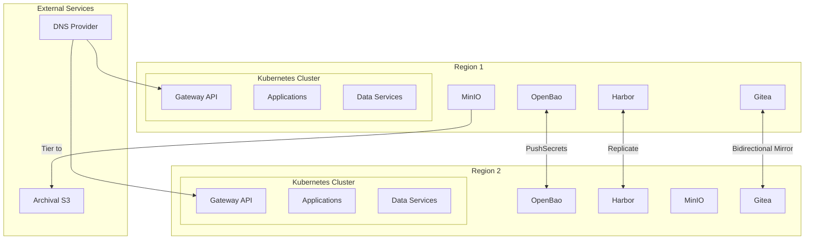
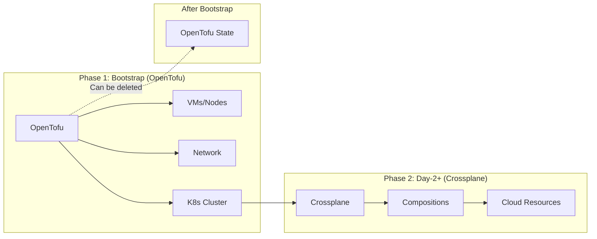
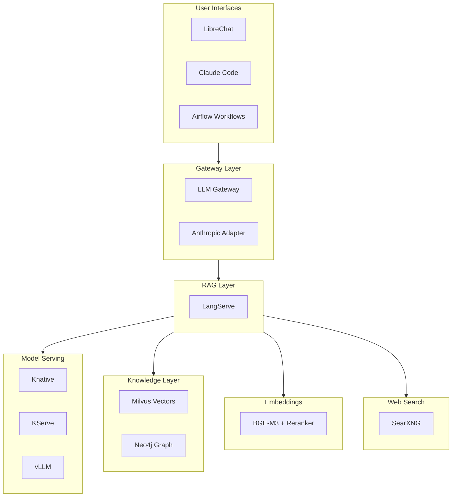
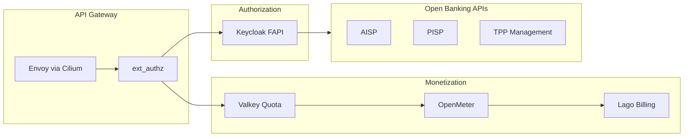
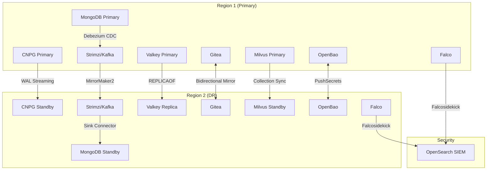

# Platform Technology Stack

Technology stack for the OpenOva Kubernetes platform.

**Status:** Accepted | **Updated:** 2026-02-09

---

## Overview

Components are categorized as **Mandatory** (always installed), **A La Carte** (optional services), and **Products** (vertical solutions bundling components with custom services).

---

## Architecture Overview



---

## Mandatory Components

### Infrastructure & Provisioning

| Component | Purpose | Location |
|-----------|---------|----------|
| OpenTofu | Bootstrap IaC (MPL 2.0, drop-in Terraform replacement) | [platform/opentofu](opentofu/) |
| Crossplane | Day-2 cloud resource provisioning | [platform/crossplane](crossplane/) |

#### OpenTofu → Crossplane Handoff

OpenOva uses a **two-phase provisioning model** where OpenTofu bootstraps the initial infrastructure, then Crossplane takes over for all subsequent operations.



**Phase 1 - Bootstrap (OpenTofu):**
- Provisions initial VMs/nodes
- Creates network infrastructure (VPC, subnets, firewall rules)
- Installs K3s cluster
- Installs Flux, which then installs all platform components including Crossplane
- **OpenTofu's job ends here** - state can be archived or deleted

> **Note:** OpenTofu retains the `terraform {}` HCL block syntax for compatibility. Existing Terraform configurations work as-is.

**Phase 2 - Day-2 Operations (Crossplane):**
- All subsequent cloud resources managed via Kubernetes CRDs
- Continuous reconciliation (drift detection and correction)
- GitOps-native (resources defined in Git, applied by Flux)
- Self-service via Backstage templates

**Why This Model:**

| Aspect | OpenTofu | Crossplane |
|--------|-----------|------------|
| When | One-time bootstrap | Ongoing operations |
| State | External file (risk) | Kubernetes CRDs (native) |
| Drift | Manual detection | Continuous reconciliation |
| Access | CI/CD credentials | Kubernetes RBAC |
| Self-service | Requires pipeline | Native via CRDs |

**Key Principle:** The bootstrap wizard (OpenTofu) is designed to be **safely deletable** after initial provisioning. Crossplane owns all cloud resources going forward, making the platform self-sustaining without external IaC state.

### Networking & Service Mesh

| Component | Purpose | Location |
|-----------|---------|----------|
| Cilium | CNI + Service Mesh (eBPF, mTLS, L7) | [platform/networking/cilium](cilium/) |
| Coraza | WAF (OWASP CRS) | - |
| ExternalDNS | DNS sync to provider | [platform/networking/external-dns](external-dns/) |
| k8gb | GSLB (authoritative DNS) | [platform/networking/k8gb](k8gb/) |

### GitOps, Git & IDP

| Component | Purpose | Location |
|-----------|---------|----------|
| Flux | GitOps engine | [platform/gitops/flux](flux/) |
| Gitea | Internal Git + CI/CD | [platform/gitops/gitea](gitea/) |
| Backstage | Developer portal | [platform/idp/backstage](backstage/) |

### Security

| Component | Purpose | Location |
|-----------|---------|----------|
| cert-manager | TLS certificates | [platform/security/cert-manager](cert-manager/) |
| External Secrets (ESO) | Secrets operator | [platform/security/external-secrets](external-secrets/) |
| OpenBao | Secrets backend (per cluster, MPL 2.0) | [platform/openbao](openbao/) |
| Trivy | Security scanning | [platform/security/trivy](trivy/) |
| Falco | Runtime security (eBPF) | [platform/falco](falco/) |

### Policy

| Component | Purpose | Location |
|-----------|---------|----------|
| Kyverno | Policy engine (validation, mutation, generation) | [platform/policy/kyverno](kyverno/) |

### Scaling

| Component | Purpose | Location |
|-----------|---------|----------|
| VPA | Vertical autoscaling | [platform/scaling/vpa](vpa/) |
| KEDA | Event-driven horizontal autoscaling | [platform/scaling/keda](keda/) |

### Observability

| Component | Purpose | Location |
|-----------|---------|----------|
| Grafana Alloy | Telemetry collector | [platform/observability/grafana](grafana/) |
| Loki | Log aggregation | [platform/observability/grafana](grafana/) |
| Mimir | Metrics storage | [platform/observability/grafana](grafana/) |
| Tempo | Distributed tracing | [platform/observability/grafana](grafana/) |
| Grafana | Visualization | [platform/observability/grafana](grafana/) |
| OpenTelemetry | Application tracing | - |

### Registry

| Component | Purpose | Location |
|-----------|---------|----------|
| Harbor | Container/artifact registry | [platform/registry/harbor](harbor/) |

### Storage

| Component | Purpose | Location |
|-----------|---------|----------|
| MinIO | Object storage | [platform/storage/minio](minio/) |
| Velero | Backup/restore | [platform/storage/velero](velero/) |

### Failover & Resilience

| Component | Purpose | Location |
|-----------|---------|----------|
| Failover Controller | Failover orchestration | [platform/failover/failover-controller](failover-controller/) |

---

## User Choice Options

### Cloud Provider

| Provider | Status | Crossplane Provider |
|----------|--------|---------------------|
| Hetzner Cloud | Available | hcloud |
| Huawei Cloud | Coming | huaweicloud |
| Oracle Cloud | Coming | oci |
| AWS | Coming | aws |
| GCP | Coming | gcp |
| Azure | Coming | azure |

### Regions

| Option | Description |
|--------|-------------|
| 1 region | Allowed (no DR) |
| 2 regions | Recommended (multi-region DR) |

### LoadBalancer

| Option | How It Works | Cost |
|--------|--------------|------|
| Cloud Provider LB | Native LB | ~€5-10/mo |
| k8gb DNS-based LB | Gateway API + k8gb | Free |
| Cilium L2 Mode | ARP-based (same subnet) | Free |

### DNS Provider

| Provider | Availability |
|----------|--------------|
| Cloudflare | Always |
| Hetzner DNS | If Hetzner chosen |
| AWS Route53 | If AWS chosen |
| GCP Cloud DNS | If GCP chosen |
| Azure DNS | If Azure chosen |

### Archival S3 Storage

| Provider | Availability |
|----------|--------------|
| Cloudflare R2 | Always (zero egress) |
| AWS S3 | If AWS chosen |
| GCP GCS | If GCP chosen |
| Azure Blob | If Azure chosen |

---

## A La Carte Data Services

| Component | Purpose | DR Strategy | Location |
|-----------|---------|-------------|----------|
| CNPG | PostgreSQL | WAL streaming | [platform/cnpg](cnpg/) |
| MongoDB | Document database | CDC via Debezium | [platform/mongodb](mongodb/) |
| Strimzi | Apache Kafka streaming | MirrorMaker2 | [platform/strimzi](strimzi/) |
| Valkey | Redis-compatible cache | REPLICAOF | [platform/valkey](valkey/) |
| RabbitMQ | Message broker (AMQP) | Shovel/Federation | [platform/rabbitmq](rabbitmq/) |
| ActiveMQ Artemis | JMS message broker | Mirroring | [platform/activemq](activemq/) |
| Vitess | MySQL horizontal scaling | VReplication | [platform/vitess](vitess/) |
| ClickHouse | OLAP analytics | ReplicatedMergeTree | [platform/clickhouse](clickhouse/) |
| OpenSearch | Search + SIEM | Cross-cluster replication | [platform/opensearch](opensearch/) |

---

## A La Carte Communication

| Component | Purpose | Location |
|-----------|---------|----------|
| Stalwart | Email server | [platform/communication/stalwart](stalwart/) |
| STUNner | WebRTC gateway | [platform/networking/stunner](stunner/) |

---

## A La Carte Workflow & Integration

| Component | Purpose | Location |
|-----------|---------|----------|
| Airflow | Workflow orchestration (DAGs) | [platform/airflow](airflow/) |
| Temporal | Durable workflow execution | [platform/temporal](temporal/) |
| Camel K | Enterprise integration (300+ connectors) | [platform/camel](camel/) |
| Dapr | Microservice building blocks | [platform/dapr](dapr/) |
| Flink | Stream + batch processing | [platform/flink](flink/) |
| Debezium | Change data capture (CDC) | [platform/debezium](debezium/) |

---

## A La Carte Analytics

| Component | Purpose | Location |
|-----------|---------|----------|
| Iceberg | Open table format (data lakehouse) | [platform/iceberg](iceberg/) |
| Trino | Distributed SQL query engine | [platform/trino](trino/) |
| Superset | BI visualization and dashboards | [platform/superset](superset/) |

---

## Security & Compliance

| Component | Purpose | Location |
|-----------|---------|----------|
| Falco | Runtime eBPF security (CNCF Graduated) | [platform/falco](falco/) |
| OpenSearch | SIEM (with Falco integration) | [platform/opensearch](opensearch/) |

Falco detects runtime threats via eBPF system call monitoring. Events flow through Falcosidekick to OpenSearch for SIEM correlation, alerting, and compliance dashboards.

---

## Products

Products bundle a la carte components with custom services for specific verticals.

### Cortex (OpenOva Cortex - AI Hub)

Enterprise AI platform with LLM serving, RAG, and intelligent agents.



#### Cortex Components

| Component | Purpose | Type | Location |
|-----------|---------|------|----------|
| **cortex** | Product blueprint | Product | [products/cortex](../products/cortex/) |
| **llm-gateway** | Subscription proxy for Claude Code | Custom | [products/cortex/components/llm-gateway](llm-gateway/) |
| **anthropic-adapter** | OpenAI ↔ Anthropic translation | Custom | [products/cortex/components/anthropic-adapter](anthropic-adapter/) |
| knative | Serverless platform | A La Carte | [products/cortex/components/knative](knative/) |
| kserve | Model serving | A La Carte | [products/cortex/components/kserve](kserve/) |
| vllm | LLM inference (PagedAttention) | A La Carte | [products/cortex/components/vllm](vllm/) |
| langserve | LangChain RAG service | A La Carte | [products/cortex/components/langserve](langserve/) |
| milvus | Vector database | A La Carte | [products/cortex/components/milvus](milvus/) |
| neo4j | Graph database | A La Carte | [products/cortex/components/neo4j](neo4j/) |
| librechat | Chat UI | A La Carte | [products/cortex/components/librechat](librechat/) |
| airflow | Workflow orchestration | A La Carte | [products/cortex/components/airflow](airflow/) |
| searxng | Privacy-respecting web search | A La Carte | [products/cortex/components/searxng](searxng/) |
| bge | Embeddings + reranking | A La Carte | [products/cortex/components/bge](bge/) |

#### Cortex Resource Requirements

| Component | Replicas | CPU | Memory | GPU |
|-----------|----------|-----|--------|-----|
| vLLM | 1 | 4 | 32Gi | 2x A10 |
| BGE-M3 | 1 | 2 | 4Gi | 1x A10 |
| BGE-Reranker | 1 | 1 | 2Gi | 1x A10 |
| Milvus | 3 | 2 | 8Gi | - |
| Neo4j | 1 | 2 | 4Gi | - |
| LangServe | 2 | 1 | 2Gi | - |
| LibreChat | 2 | 0.5 | 1Gi | - |
| LLM Gateway | 2 | 0.25 | 512Mi | - |
| **Total** | - | ~15 | ~55Gi | 4x A10 |

### Fingate (OpenOva Fingate - Open Banking)

Fintech sandbox with PSD2/FAPI compliance.



#### Fingate Components

| Component | Purpose | Type | Location |
|-----------|---------|------|----------|
| **fingate** | Product blueprint | Product | [products/fingate](../products/fingate/) |
| keycloak | FAPI Authorization Server | A La Carte | [platform/identity/keycloak](keycloak/) |
| openmeter | Usage metering | A La Carte | [products/fingate/components/openmeter](openmeter/) |
| lago | Billing and invoicing | A La Carte | [products/fingate/components/lago](lago/) |

---

### Titan (OpenOva Titan - Data Lakehouse)

Enterprise data lakehouse for analytics, BI, and data engineering.

#### Titan Components

| Component | Purpose | Type | Location |
|-----------|---------|------|----------|
| **titan** | Product blueprint | Product | [products/titan](../products/titan/) |
| iceberg | Open table format | A La Carte | [platform/iceberg](iceberg/) |
| trino | Distributed SQL queries | A La Carte | [platform/trino](trino/) |
| superset | BI dashboards | A La Carte | [platform/superset](superset/) |
| flink | Stream + batch processing | A La Carte | [platform/flink](flink/) |
| airflow | Workflow orchestration | A La Carte | [platform/airflow](airflow/) |
| clickhouse | OLAP analytics | A La Carte | [platform/clickhouse](clickhouse/) |
| debezium | CDC ingestion | A La Carte | [platform/debezium](debezium/) |
| strimzi | Event streaming (Kafka) | A La Carte | [platform/strimzi](strimzi/) |
| minio | Object storage (S3) | Mandatory | [platform/minio](minio/) |

---

### Fuse (OpenOva Fuse - Microservices Integration)

Enterprise integration platform for microservice communication, workflow orchestration, and legacy system connectivity.

#### Fuse Components

| Component | Purpose | Type | Location |
|-----------|---------|------|----------|
| **fuse** | Product blueprint | Product | [products/fuse](../products/fuse/) |
| temporal | Durable workflows | A La Carte | [platform/temporal](temporal/) |
| camel | Enterprise integration (300+ connectors) | A La Carte | [platform/camel](camel/) |
| dapr | Microservice building blocks | A La Carte | [platform/dapr](dapr/) |
| strimzi | Event streaming (Kafka) | A La Carte | [platform/strimzi](strimzi/) |
| rabbitmq | Message broker (AMQP) | A La Carte | [platform/rabbitmq](rabbitmq/) |
| activemq | JMS message broker | A La Carte | [platform/activemq](activemq/) |

---

## Cluster Deployment

### K3s Installation

```bash
curl -sfL https://get.k3s.io | sh -s - server \
  --cluster-init \
  --disable traefik \
  --disable servicelb \
  --disable local-storage \
  --flannel-backend=none \
  --disable-network-policy \
  --kube-controller-manager-arg="node-monitor-period=5s" \
  --kube-controller-manager-arg="node-monitor-grace-period=20s" \
  --kube-apiserver-arg="default-watch-cache-size=50" \
  --etcd-arg="quota-backend-bytes=1073741824" \
  --kubelet-arg="max-pods=50"
```

### Disabled K3s Components

| Component | Replacement |
|-----------|-------------|
| traefik | Gateway API (Cilium) |
| servicelb | DNS-based failover (k8gb) |
| local-storage | Application-level replication |
| flannel | Cilium CNI |

### Cilium Installation

```bash
helm install cilium cilium/cilium \
  --namespace kube-system \
  --set kubeProxyReplacement=true \
  --set k8sServiceHost=${API_SERVER_IP} \
  --set k8sServicePort=6443 \
  --set hubble.enabled=true \
  --set hubble.relay.enabled=true \
  --set encryption.enabled=true \
  --set encryption.type=wireguard \
  --set gatewayAPI.enabled=true \
  --set envoy.enabled=true
```

---

## Resource Estimates

### Core Platform (Per Region)

| Category | Components | Estimated RAM |
|----------|------------|---------------|
| Core Platform | Cilium, Flux, ESO, Kyverno | ~2GB |
| Observability | Grafana Stack + Alloy | ~3GB |
| Storage | Harbor, MinIO, Velero | ~4GB |
| Security | OpenBao, cert-manager, Trivy, Falco | ~1GB |
| Git & IDP | Gitea, Backstage | ~2GB |
| **Minimum Total** | | ~12GB |

**Recommended minimum:** 3 nodes × 8GB RAM = 24GB per region

### With Cortex (Per Region)

| Category | Components | Estimated RAM | GPU |
|----------|------------|---------------|-----|
| Core Platform | (as above) | ~12GB | - |
| Cortex | LLM Gateway, LangServe, etc. | ~55GB | 4x A10 |
| **Total** | | ~67GB | 4x A10 |

**Recommended:** 3 CPU nodes + 2 GPU nodes per region

---

## Multi-Region Data Flow



---

*Part of [OpenOva](https://openova.io)*
