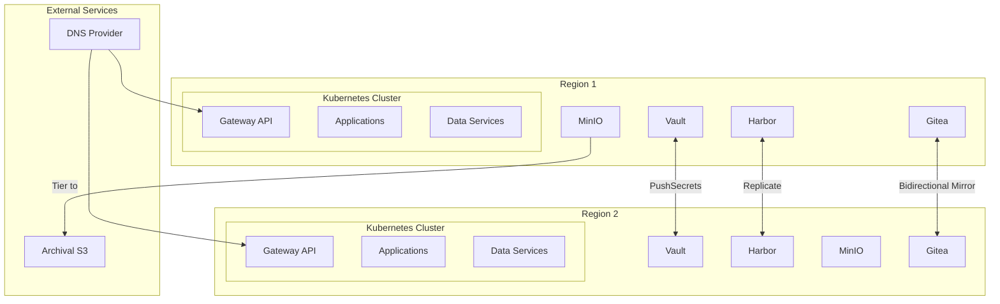
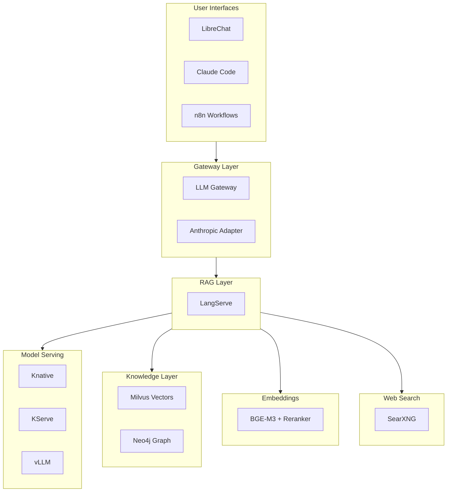
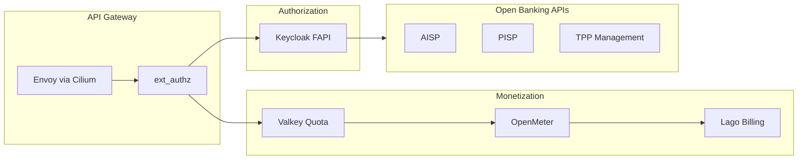
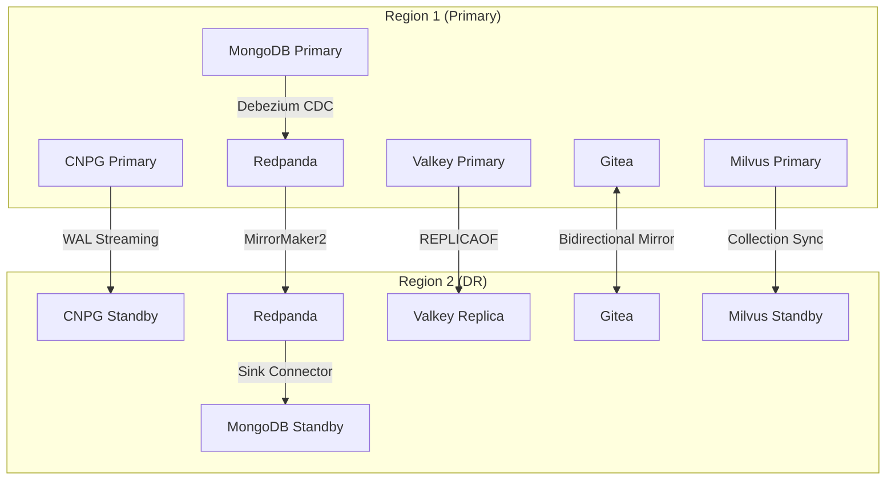

# Platform Technology Stack

Technology stack for the OpenOva Kubernetes platform.

**Status:** Accepted | **Updated:** 2026-02-08

---

## Overview

Components are categorized as **Mandatory** (always installed), **A La Carte** (optional services), and **Meta Blueprints** (vertical solutions bundling components with custom services).

---

## Architecture Overview



---

## Mandatory Components

### Infrastructure & Provisioning

| Component | Purpose | Location |
|-----------|---------|----------|
| Terraform | Bootstrap IaC (initial cluster only) | [platform/iac/terraform](../platform/iac/terraform/) |
| Crossplane | Day-2 cloud resource provisioning | [platform/iac/crossplane](../platform/iac/crossplane/) |

#### Terraform → Crossplane Handoff

OpenOva uses a **two-phase provisioning model** where Terraform bootstraps the initial infrastructure, then Crossplane takes over for all subsequent operations.


**Phase 1 - Bootstrap (Terraform):**
- Provisions initial VMs/nodes
- Creates network infrastructure (VPC, subnets, firewall rules)
- Installs K3s cluster
- Installs Flux, which then installs all platform components including Crossplane
- **Terraform's job ends here** - state can be archived or deleted

**Phase 2 - Day-2 Operations (Crossplane):**
- All subsequent cloud resources managed via Kubernetes CRDs
- Continuous reconciliation (drift detection and correction)
- GitOps-native (resources defined in Git, applied by Flux)
- Self-service via Backstage templates

**Why This Model:**

| Aspect | Terraform | Crossplane |
|--------|-----------|------------|
| When | One-time bootstrap | Ongoing operations |
| State | External file (risk) | Kubernetes CRDs (native) |
| Drift | Manual detection | Continuous reconciliation |
| Access | CI/CD credentials | Kubernetes RBAC |
| Self-service | Requires pipeline | Native via CRDs |

**Key Principle:** The bootstrap wizard (Terraform) is designed to be **safely deletable** after initial provisioning. Crossplane owns all cloud resources going forward, making the platform self-sustaining without external IaC state.

### Networking & Service Mesh

| Component | Purpose | Location |
|-----------|---------|----------|
| Cilium | CNI + Service Mesh (eBPF, mTLS, L7) | [platform/networking/cilium](../platform/networking/cilium/) |
| Coraza | WAF (OWASP CRS) | - |
| ExternalDNS | DNS sync to provider | [platform/networking/external-dns](../platform/networking/external-dns/) |
| k8gb | GSLB (authoritative DNS) | [platform/networking/k8gb](../platform/networking/k8gb/) |

### GitOps, Git & IDP

| Component | Purpose | Location |
|-----------|---------|----------|
| Flux | GitOps engine | [platform/gitops/flux](../platform/gitops/flux/) |
| Gitea | Internal Git + CI/CD | [platform/gitops/gitea](../platform/gitops/gitea/) |
| Backstage | Developer portal | [platform/idp/backstage](../platform/idp/backstage/) |

### Security

| Component | Purpose | Location |
|-----------|---------|----------|
| cert-manager | TLS certificates | [platform/security/cert-manager](../platform/security/cert-manager/) |
| External Secrets (ESO) | Secrets operator | [platform/security/external-secrets](../platform/security/external-secrets/) |
| Vault | Secrets backend (per cluster) | [platform/security/vault](../platform/security/vault/) |
| Trivy | Security scanning | [platform/security/trivy](../platform/security/trivy/) |

### Policy

| Component | Purpose | Location |
|-----------|---------|----------|
| Kyverno | Policy engine (validation, mutation, generation) | [platform/policy/kyverno](../platform/policy/kyverno/) |

### Scaling

| Component | Purpose | Location |
|-----------|---------|----------|
| VPA | Vertical autoscaling | [platform/scaling/vpa](../platform/scaling/vpa/) |
| KEDA | Event-driven horizontal autoscaling | [platform/scaling/keda](../platform/scaling/keda/) |

### Observability

| Component | Purpose | Location |
|-----------|---------|----------|
| Grafana Alloy | Telemetry collector | [platform/observability/grafana](../platform/observability/grafana/) |
| Loki | Log aggregation | [platform/observability/grafana](../platform/observability/grafana/) |
| Mimir | Metrics storage | [platform/observability/grafana](../platform/observability/grafana/) |
| Tempo | Distributed tracing | [platform/observability/grafana](../platform/observability/grafana/) |
| Grafana | Visualization | [platform/observability/grafana](../platform/observability/grafana/) |
| OpenTelemetry | Application tracing | - |

### Registry

| Component | Purpose | Location |
|-----------|---------|----------|
| Harbor | Container/artifact registry | [platform/registry/harbor](../platform/registry/harbor/) |

### Storage

| Component | Purpose | Location |
|-----------|---------|----------|
| MinIO | Object storage | [platform/storage/minio](../platform/storage/minio/) |
| Velero | Backup/restore | [platform/storage/velero](../platform/storage/velero/) |

### Failover & Resilience

| Component | Purpose | Location |
|-----------|---------|----------|
| Failover Controller | Failover orchestration | [platform/failover/failover-controller](../platform/failover/failover-controller/) |

---

## User Choice Options

### Cloud Provider

| Provider | Status | Crossplane Provider |
|----------|--------|---------------------|
| Hetzner Cloud | Available | hcloud |
| Huawei Cloud | Coming | huaweicloud |
| Oracle Cloud | Coming | oci |
| AWS | Coming | aws |
| GCP | Coming | gcp |
| Azure | Coming | azure |

### Regions

| Option | Description |
|--------|-------------|
| 1 region | Allowed (no DR) |
| 2 regions | Recommended (multi-region DR) |

### LoadBalancer

| Option | How It Works | Cost |
|--------|--------------|------|
| Cloud Provider LB | Native LB | ~€5-10/mo |
| k8gb DNS-based LB | Gateway API + k8gb | Free |
| Cilium L2 Mode | ARP-based (same subnet) | Free |

### DNS Provider

| Provider | Availability |
|----------|--------------|
| Cloudflare | Always |
| Hetzner DNS | If Hetzner chosen |
| AWS Route53 | If AWS chosen |
| GCP Cloud DNS | If GCP chosen |
| Azure DNS | If Azure chosen |

### Archival S3 Storage

| Provider | Availability |
|----------|--------------|
| Cloudflare R2 | Always (zero egress) |
| AWS S3 | If AWS chosen |
| GCP GCS | If GCP chosen |
| Azure Blob | If Azure chosen |

---

## A La Carte Data Services

| Component | Purpose | DR Strategy | Location |
|-----------|---------|-------------|----------|
| CNPG | PostgreSQL | WAL streaming | [platform/data/cnpg](../platform/data/cnpg/) |
| MongoDB | Document database | CDC via Debezium | [platform/data/mongodb](../platform/data/mongodb/) |
| Redpanda | Event streaming | MirrorMaker2 | [platform/data/redpanda](../platform/data/redpanda/) |
| Valkey | Redis-compatible cache | REPLICAOF | [platform/data/valkey](../platform/data/valkey/) |

---

## A La Carte Communication

| Component | Purpose | Location |
|-----------|---------|----------|
| Stalwart | Email server | [platform/communication/stalwart](../platform/communication/stalwart/) |
| STUNner | WebRTC gateway | [platform/networking/stunner](../platform/networking/stunner/) |

---

## Meta Blueprints

Meta blueprints bundle a la carte components with custom services for specific verticals.

### AI Hub

Enterprise AI platform with LLM serving, RAG, and intelligent agents.



#### AI Hub Components

| Component | Purpose | Type | Location |
|-----------|---------|------|----------|
| **ai-hub** | Meta blueprint | Blueprint | [meta-platforms/ai-hub](../meta-platforms/ai-hub/) |
| **llm-gateway** | Subscription proxy for Claude Code | Custom | [meta-platforms/ai-hub/components/llm-gateway](../meta-platforms/ai-hub/components/llm-gateway/) |
| **anthropic-adapter** | OpenAI ↔ Anthropic translation | Custom | [meta-platforms/ai-hub/components/anthropic-adapter](../meta-platforms/ai-hub/components/anthropic-adapter/) |
| knative | Serverless platform | A La Carte | [meta-platforms/ai-hub/components/knative](../meta-platforms/ai-hub/components/knative/) |
| kserve | Model serving | A La Carte | [meta-platforms/ai-hub/components/kserve](../meta-platforms/ai-hub/components/kserve/) |
| vllm | LLM inference (PagedAttention) | A La Carte | [meta-platforms/ai-hub/components/vllm](../meta-platforms/ai-hub/components/vllm/) |
| langserve | LangChain RAG service | A La Carte | [meta-platforms/ai-hub/components/langserve](../meta-platforms/ai-hub/components/langserve/) |
| milvus | Vector database | A La Carte | [meta-platforms/ai-hub/components/milvus](../meta-platforms/ai-hub/components/milvus/) |
| neo4j | Graph database | A La Carte | [meta-platforms/ai-hub/components/neo4j](../meta-platforms/ai-hub/components/neo4j/) |
| librechat | Chat UI | A La Carte | [meta-platforms/ai-hub/components/librechat](../meta-platforms/ai-hub/components/librechat/) |
| n8n | Workflow automation | A La Carte | [meta-platforms/ai-hub/components/n8n](../meta-platforms/ai-hub/components/n8n/) |
| searxng | Privacy-respecting web search | A La Carte | [meta-platforms/ai-hub/components/searxng](../meta-platforms/ai-hub/components/searxng/) |
| bge | Embeddings + reranking | A La Carte | [meta-platforms/ai-hub/components/bge](../meta-platforms/ai-hub/components/bge/) |

#### AI Hub Resource Requirements

| Component | Replicas | CPU | Memory | GPU |
|-----------|----------|-----|--------|-----|
| vLLM | 1 | 4 | 32Gi | 2x A10 |
| BGE-M3 | 1 | 2 | 4Gi | 1x A10 |
| BGE-Reranker | 1 | 1 | 2Gi | 1x A10 |
| Milvus | 3 | 2 | 8Gi | - |
| Neo4j | 1 | 2 | 4Gi | - |
| LangServe | 2 | 1 | 2Gi | - |
| LibreChat | 2 | 0.5 | 1Gi | - |
| LLM Gateway | 2 | 0.25 | 512Mi | - |
| **Total** | - | ~15 | ~55Gi | 4x A10 |

### Open Banking

Fintech sandbox with PSD2/FAPI compliance.



#### Open Banking Components

| Component | Purpose | Type | Location |
|-----------|---------|------|----------|
| **open-banking** | Meta blueprint | Blueprint | [meta-platforms/open-banking](../meta-platforms/open-banking/) |
| keycloak | FAPI Authorization Server | A La Carte | [platform/identity/keycloak](../platform/identity/keycloak/) |
| openmeter | Usage metering | A La Carte | [meta-platforms/open-banking/components/openmeter](../meta-platforms/open-banking/components/openmeter/) |
| lago | Billing and invoicing | A La Carte | [meta-platforms/open-banking/components/lago](../meta-platforms/open-banking/components/lago/) |

---

## Cluster Deployment

### K3s Installation

```bash
curl -sfL https://get.k3s.io | sh -s - server \
  --cluster-init \
  --disable traefik \
  --disable servicelb \
  --disable local-storage \
  --flannel-backend=none \
  --disable-network-policy \
  --kube-controller-manager-arg="node-monitor-period=5s" \
  --kube-controller-manager-arg="node-monitor-grace-period=20s" \
  --kube-apiserver-arg="default-watch-cache-size=50" \
  --etcd-arg="quota-backend-bytes=1073741824" \
  --kubelet-arg="max-pods=50"
```

### Disabled K3s Components

| Component | Replacement |
|-----------|-------------|
| traefik | Gateway API (Cilium) |
| servicelb | DNS-based failover (k8gb) |
| local-storage | Application-level replication |
| flannel | Cilium CNI |

### Cilium Installation

```bash
helm install cilium cilium/cilium \
  --namespace kube-system \
  --set kubeProxyReplacement=true \
  --set k8sServiceHost=${API_SERVER_IP} \
  --set k8sServicePort=6443 \
  --set hubble.enabled=true \
  --set hubble.relay.enabled=true \
  --set encryption.enabled=true \
  --set encryption.type=wireguard \
  --set gatewayAPI.enabled=true \
  --set envoy.enabled=true
```

---

## Resource Estimates

### Core Platform (Per Region)

| Category | Components | Estimated RAM |
|----------|------------|---------------|
| Core Platform | Cilium, Flux, ESO, Kyverno | ~2GB |
| Observability | Grafana Stack + Alloy | ~3GB |
| Storage | Harbor, MinIO, Velero | ~4GB |
| Security | Vault, cert-manager, Trivy | ~1GB |
| Git & IDP | Gitea, Backstage | ~2GB |
| **Minimum Total** | | ~12GB |

**Recommended minimum:** 3 nodes × 8GB RAM = 24GB per region

### With AI Hub (Per Region)

| Category | Components | Estimated RAM | GPU |
|----------|------------|---------------|-----|
| Core Platform | (as above) | ~12GB | - |
| AI Hub | LLM Gateway, LangServe, etc. | ~55GB | 4x A10 |
| **Total** | | ~67GB | 4x A10 |

**Recommended:** 3 CPU nodes + 2 GPU nodes per region

---

## Multi-Region Data Flow



---

*Part of [OpenOva](https://openova.io)*
