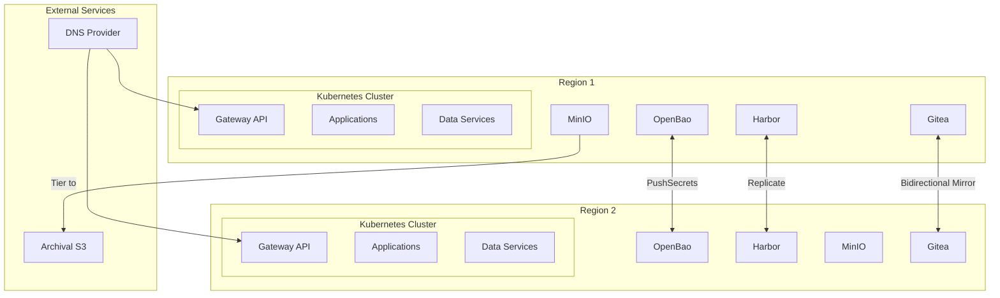
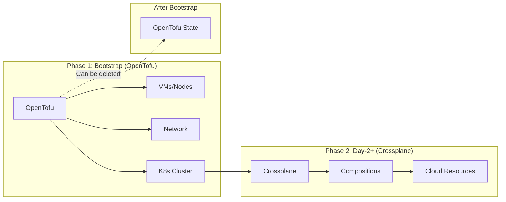
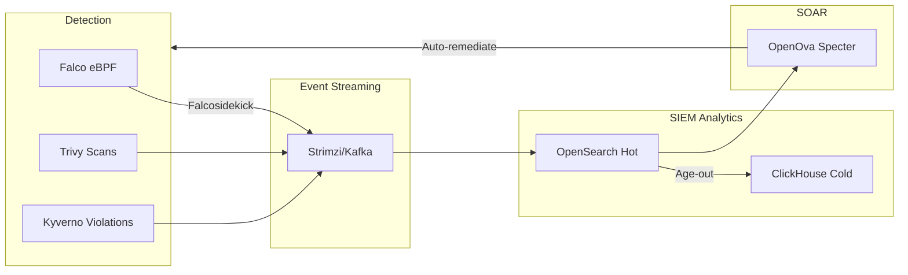
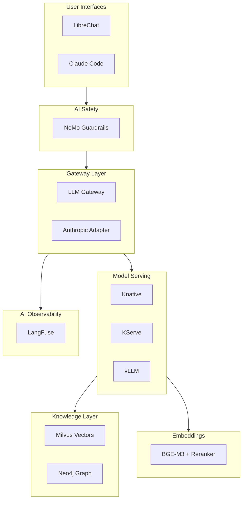
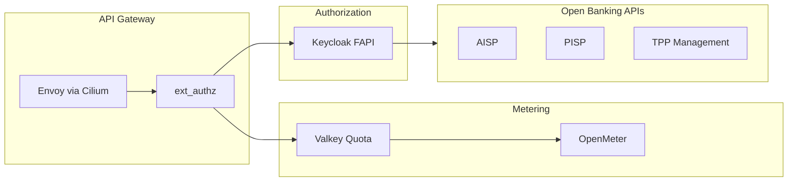
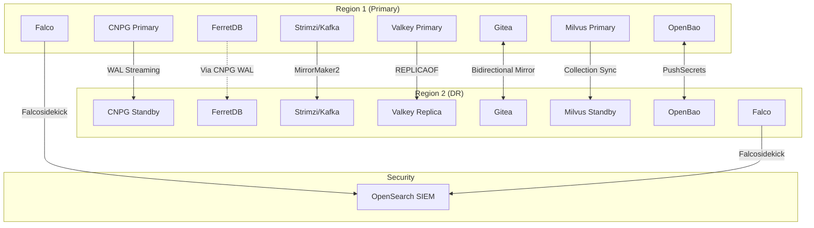

# Platform Technology Stack

Technology stack for the OpenOva Kubernetes platform.

**Status:** Accepted | **Updated:** 2026-02-26

---

## Overview

Components are categorized as **Mandatory** (always installed), **A La Carte** (optional services), and **Products** (vertical solutions bundling components with custom services).

**Total:** 52 platform components (26 mandatory + 26 a la carte)

---

## Architecture Overview


```mermaid
flowchart TB
    subgraph External["External Services"]
        DNS[DNS Provider]
        Archival[Archival S3]
    end

    subgraph Region1["Region 1"]
        subgraph K8s1["Kubernetes Cluster"]
            GW1[Gateway API]
            Apps1[Applications]
            Data1[Data Services]
        end
        Bao1[OpenBao]
        Harbor1[Harbor]
        MinIO1[MinIO]
        Gitea1[Gitea]
    end

    subgraph Region2["Region 2"]
        subgraph K8s2["Kubernetes Cluster"]
            GW2[Gateway API]
            Apps2[Applications]
            Data2[Data Services]
        end
        Bao2[OpenBao]
        Harbor2[Harbor]
        MinIO2[MinIO]
        Gitea2[Gitea]
    end

    DNS --> GW1
    DNS --> GW2
    Harbor1 <-->|"Replicate"| Harbor2
    MinIO1 -->|"Tier to"| Archival
    Bao1 <-->|"PushSecrets"| Bao2
    Gitea1 <-->|"Bidirectional Mirror"| Gitea2
```

---

## Mandatory Components (26)

### Infrastructure & Provisioning

| Component | Purpose | Location |
|-----------|---------|----------|
| OpenTofu | Bootstrap IaC (MPL 2.0, drop-in Terraform replacement) | [platform/opentofu](../platform/opentofu/) |
| Crossplane | Day-2 cloud resource provisioning | [platform/crossplane](../platform/crossplane/) |

#### OpenTofu to Crossplane Handoff

OpenOva uses a **two-phase provisioning model** where OpenTofu bootstraps the initial infrastructure, then Crossplane takes over for all subsequent operations.


```mermaid
flowchart LR
    subgraph Phase1["Phase 1: Bootstrap (OpenTofu)"]
        TF[OpenTofu]
        VMs[VMs/Nodes]
        Net[Network]
        K8s[K8s Cluster]
    end

    subgraph Phase2["Phase 2: Day-2+ (Crossplane)"]
        CP[Crossplane]
        XR[Compositions]
        Cloud[Cloud Resources]
    end

    subgraph Deleted["After Bootstrap"]
        TFState[OpenTofu State]
    end

    TF --> VMs
    TF --> Net
    TF --> K8s
    K8s --> CP
    CP --> XR
    XR --> Cloud
    TF -.->|"Can be deleted"| TFState
```

**Phase 1 - Bootstrap (OpenTofu):**
- Provisions initial VMs/nodes
- Creates network infrastructure (VPC, subnets, firewall rules)
- Installs K3s cluster
- Installs Flux, which then installs all platform components including Crossplane
- **OpenTofu's job ends here** - state can be archived or deleted

**Phase 2 - Day-2 Operations (Crossplane):**
- All subsequent cloud resources managed via Kubernetes CRDs
- Continuous reconciliation (drift detection and correction)
- GitOps-native (resources defined in Git, applied by Flux)
- Self-service via Catalyst IDP templates

**Why This Model:**

| Aspect | OpenTofu | Crossplane |
|--------|-----------|------------|
| When | One-time bootstrap | Ongoing operations |
| State | External file (risk) | Kubernetes CRDs (native) |
| Drift | Manual detection | Continuous reconciliation |
| Access | CI/CD credentials | Kubernetes RBAC |
| Self-service | Requires pipeline | Native via CRDs |

**Key Principle:** The bootstrap wizard (OpenTofu) is designed to be **safely deletable** after initial provisioning. Crossplane owns all cloud resources going forward, making the platform self-sustaining without external IaC state.

### Networking & Service Mesh

| Component | Purpose | Location |
|-----------|---------|----------|
| Cilium | CNI + Service Mesh (eBPF, mTLS, L7) | [platform/cilium](../platform/cilium/) |
| Coraza | WAF (OWASP CRS) | [platform/coraza](../platform/coraza/) |
| ExternalDNS | DNS sync to provider | [platform/external-dns](../platform/external-dns/) |
| k8gb | GSLB (authoritative DNS) | [platform/k8gb](../platform/k8gb/) |

### GitOps & Git

| Component | Purpose | Location |
|-----------|---------|----------|
| Flux | GitOps engine | [platform/flux](../platform/flux/) |
| Gitea | Internal Git + CI/CD | [platform/gitea](../platform/gitea/) |

### Security

| Component | Purpose | Location |
|-----------|---------|----------|
| cert-manager | TLS certificates | [platform/cert-manager](../platform/cert-manager/) |
| External Secrets (ESO) | Secrets operator | [platform/external-secrets](../platform/external-secrets/) |
| OpenBao | Secrets backend (per cluster, MPL 2.0) | [platform/openbao](../platform/openbao/) |
| Trivy | Security scanning | [platform/trivy](../platform/trivy/) |
| Falco | Runtime security (eBPF) | [platform/falco](../platform/falco/) |

### Supply Chain Security

| Component | Purpose | Location |
|-----------|---------|----------|
| Sigstore/Cosign | Container image signing + verification | [platform/sigstore](../platform/sigstore/) |
| Syft + Grype | SBOM generation + vulnerability matching | [platform/syft-grype](../platform/syft-grype/) |

### Policy

| Component | Purpose | Location |
|-----------|---------|----------|
| Kyverno | Policy engine (validation, mutation, generation) | [platform/kyverno](../platform/kyverno/) |

### Scaling

| Component | Purpose | Location |
|-----------|---------|----------|
| VPA | Vertical autoscaling | [platform/vpa](../platform/vpa/) |
| KEDA | Event-driven horizontal autoscaling | [platform/keda](../platform/keda/) |

### Operations

| Component | Purpose | Location |
|-----------|---------|----------|
| Reloader | Auto-restart on ConfigMap/Secret changes | [platform/reloader](../platform/reloader/) |

### Observability

| Component | Purpose | Location |
|-----------|---------|----------|
| Grafana Alloy | Telemetry collector | [platform/grafana](../platform/grafana/) |
| Loki | Log aggregation | [platform/grafana](../platform/grafana/) |
| Mimir | Metrics storage | [platform/grafana](../platform/grafana/) |
| Tempo | Distributed tracing | [platform/grafana](../platform/grafana/) |
| Grafana | Visualization | [platform/grafana](../platform/grafana/) |
| OpenTelemetry | Application tracing | - |
| OpenSearch | Hot SIEM backend (security analytics) | [platform/opensearch](../platform/opensearch/) |

### Registry

| Component | Purpose | Location |
|-----------|---------|----------|
| Harbor | Container/artifact registry | [platform/harbor](../platform/harbor/) |

### Storage

| Component | Purpose | Location |
|-----------|---------|----------|
| MinIO | Object storage | [platform/minio](../platform/minio/) |
| Velero | Backup/restore | [platform/velero](../platform/velero/) |

### Failover & Resilience

| Component | Purpose | Location |
|-----------|---------|----------|
| Failover Controller | Failover orchestration | [platform/failover-controller](../platform/failover-controller/) |

---

## SIEM/SOAR Architecture


```mermaid
flowchart LR
    subgraph Detection["Detection"]
        Falco[Falco eBPF]
        Trivy[Trivy Scans]
        Kyverno[Kyverno Violations]
    end

    subgraph Streaming["Event Streaming"]
        Kafka[Strimzi/Kafka]
    end

    subgraph Analytics["SIEM Analytics"]
        OS[OpenSearch Hot]
        CH[ClickHouse Cold]
    end

    subgraph Response["SOAR"]
        Specter[OpenOva Specter]
    end

    Falco -->|Falcosidekick| Kafka
    Trivy --> Kafka
    Kyverno --> Kafka
    Kafka --> OS
    OS -->|Age-out| CH
    OS --> Specter
    Specter -->|Auto-remediate| Detection
```

Falco detects runtime threats via eBPF. Events flow through Kafka to OpenSearch (hot SIEM) for correlation and alerting. Aged data moves to ClickHouse for cold storage and compliance reporting. OpenOva Specter provides SOAR capabilities for automated incident response.

---

## User Choice Options

### Cloud Provider

| Provider | Status | Crossplane Provider |
|----------|--------|---------------------|
| Hetzner Cloud | Available | hcloud |
| Huawei Cloud | Coming | huaweicloud |
| Oracle Cloud | Coming | oci |
| AWS | Coming | aws |
| GCP | Coming | gcp |
| Azure | Coming | azure |

### Regions

| Option | Description |
|--------|-------------|
| 1 region | Allowed (no DR) |
| 2 regions | Recommended (multi-region DR) |

### LoadBalancer

| Option | How It Works | Cost |
|--------|--------------|------|
| Cloud Provider LB | Native LB | ~EUR5-10/mo |
| k8gb DNS-based LB | Gateway API + k8gb | Free |
| Cilium L2 Mode | ARP-based (same subnet) | Free |

### DNS Provider

| Provider | Availability |
|----------|--------------|
| Cloudflare | Always |
| Hetzner DNS | If Hetzner chosen |
| AWS Route53 | If AWS chosen |
| GCP Cloud DNS | If GCP chosen |
| Azure DNS | If Azure chosen |

### Archival S3 Storage

| Provider | Availability |
|----------|--------------|
| Cloudflare R2 | Always (zero egress) |
| AWS S3 | If AWS chosen |
| GCP GCS | If GCP chosen |
| Azure Blob | If Azure chosen |

---

## A La Carte Data Services (26 components)

| Component | Purpose | DR Strategy | Location |
|-----------|---------|-------------|----------|
| CNPG | PostgreSQL | WAL streaming | [platform/cnpg](../platform/cnpg/) |
| FerretDB | MongoDB wire protocol on PostgreSQL | Via CNPG WAL streaming | [platform/ferretdb](../platform/ferretdb/) |
| Strimzi | Apache Kafka streaming | MirrorMaker2 | [platform/strimzi](../platform/strimzi/) |
| Valkey | Redis-compatible cache | REPLICAOF | [platform/valkey](../platform/valkey/) |
| ClickHouse | OLAP analytics | ReplicatedMergeTree | [platform/clickhouse](../platform/clickhouse/) |
| OpenSearch | Search + hot SIEM | Cross-cluster replication | [platform/opensearch](../platform/opensearch/) |

---

## A La Carte Communication

| Component | Purpose | Location |
|-----------|---------|----------|
| Stalwart | Email server | [platform/stalwart](../platform/stalwart/) |
| STUNner | K8s-native TURN/STUN (WebRTC) | [platform/stunner](../platform/stunner/) |
| LiveKit | Video/audio/data (WebRTC SFU) | [platform/livekit](../platform/livekit/) |
| Matrix/Synapse | Team chat (federation) | [platform/matrix](../platform/matrix/) |

---

## A La Carte Workflow & Processing

| Component | Purpose | Location |
|-----------|---------|----------|
| Temporal | Saga orchestration + compensation observability | [platform/temporal](../platform/temporal/) |
| Flink | Stream + batch processing | [platform/flink](../platform/flink/) |
| Debezium | Change data capture (CDC) | [platform/debezium](../platform/debezium/) |

---

## A La Carte Analytics

| Component | Purpose | Location |
|-----------|---------|----------|
| Iceberg | Open table format (data lakehouse) | [platform/iceberg](../platform/iceberg/) |

---

## A La Carte AI/ML

| Component | Purpose | Location |
|-----------|---------|----------|
| KServe | Model serving | [platform/kserve](../platform/kserve/) |
| Knative | Serverless platform | [platform/knative](../platform/knative/) |
| vLLM | LLM inference | [platform/vllm](../platform/vllm/) |
| Milvus | Vector database | [platform/milvus](../platform/milvus/) |
| Neo4j | Graph database | [platform/neo4j](../platform/neo4j/) |
| LibreChat | Chat UI | [platform/librechat](../platform/librechat/) |
| BGE | Embeddings + reranking | [platform/bge](../platform/bge/) |
| LLM Gateway | Subscription proxy for Claude Code | [platform/llm-gateway](../platform/llm-gateway/) |
| Anthropic Adapter | OpenAI-to-Anthropic translation | [platform/anthropic-adapter](../platform/anthropic-adapter/) |

---

## A La Carte AI Safety & Observability

| Component | Purpose | Location |
|-----------|---------|----------|
| NeMo Guardrails | AI safety firewall (prompt injection, PII filtering) | [platform/nemo-guardrails](../platform/nemo-guardrails/) |
| LangFuse | LLM observability (traces, cost, eval) | [platform/langfuse](../platform/langfuse/) |

---

## A La Carte Identity & Monetization

| Component | Purpose | Location |
|-----------|---------|----------|
| Keycloak | FAPI Authorization Server | [platform/keycloak](../platform/keycloak/) |
| OpenMeter | Usage metering | [platform/openmeter](../platform/openmeter/) |

---

## A La Carte Chaos Engineering

| Component | Purpose | Location |
|-----------|---------|----------|
| Litmus Chaos | Chaos engineering experiments | [platform/litmus](../platform/litmus/) |

---

## Products

Products bundle a la carte components with custom services for specific verticals.

### Cortex (OpenOva Cortex - AI Hub)

Enterprise AI platform with LLM serving, RAG, AI safety, and LLM observability.


```mermaid
flowchart TB
    subgraph UI["User Interfaces"]
        LibreChat[LibreChat]
        ClaudeCode[Claude Code]
    end

    subgraph Safety["AI Safety"]
        Guardrails[NeMo Guardrails]
    end

    subgraph Gateway["Gateway Layer"]
        LLMGateway[LLM Gateway]
        Adapter[Anthropic Adapter]
    end

    subgraph Serving["Model Serving"]
        Knative[Knative]
        KServe[KServe]
        vLLM[vLLM]
    end

    subgraph Knowledge["Knowledge Layer"]
        Milvus[Milvus Vectors]
        Neo4j[Neo4j Graph]
    end

    subgraph Embeddings["Embeddings"]
        BGE[BGE-M3 + Reranker]
    end

    subgraph Observability["AI Observability"]
        LangFuse[LangFuse]
    end

    UI --> Safety
    Safety --> Gateway
    Gateway --> Serving
    Serving --> Knowledge
    Serving --> Embeddings
    Gateway --> Observability
```

#### Cortex Components

| Component | Purpose | Type | Location |
|-----------|---------|------|----------|
| llm-gateway | Subscription proxy for Claude Code | Custom | [platform/llm-gateway](../platform/llm-gateway/) |
| anthropic-adapter | OpenAI-to-Anthropic translation | Custom | [platform/anthropic-adapter](../platform/anthropic-adapter/) |
| knative | Serverless platform | A La Carte | [platform/knative](../platform/knative/) |
| kserve | Model serving | A La Carte | [platform/kserve](../platform/kserve/) |
| vllm | LLM inference (PagedAttention) | A La Carte | [platform/vllm](../platform/vllm/) |
| milvus | Vector database | A La Carte | [platform/milvus](../platform/milvus/) |
| neo4j | Graph database | A La Carte | [platform/neo4j](../platform/neo4j/) |
| librechat | Chat UI | A La Carte | [platform/librechat](../platform/librechat/) |
| bge | Embeddings + reranking | A La Carte | [platform/bge](../platform/bge/) |
| nemo-guardrails | AI safety firewall | A La Carte | [platform/nemo-guardrails](../platform/nemo-guardrails/) |
| langfuse | LLM observability | A La Carte | [platform/langfuse](../platform/langfuse/) |

#### Cortex Resource Requirements

| Component | Replicas | CPU | Memory | GPU |
|-----------|----------|-----|--------|-----|
| vLLM | 1 | 4 | 32Gi | 2x A10 |
| BGE-M3 | 1 | 2 | 4Gi | 1x A10 |
| BGE-Reranker | 1 | 1 | 2Gi | 1x A10 |
| Milvus | 3 | 2 | 8Gi | - |
| Neo4j | 1 | 2 | 4Gi | - |
| LibreChat | 2 | 0.5 | 1Gi | - |
| LLM Gateway | 2 | 0.25 | 512Mi | - |
| NeMo Guardrails | 2 | 1 | 2Gi | - |
| LangFuse | 2 | 0.5 | 1Gi | - |
| **Total** | - | ~16 | ~56Gi | 4x A10 |

### Fingate (OpenOva Fingate - Open Banking)

Fintech sandbox with PSD2/FAPI compliance.


```mermaid
flowchart LR
    subgraph Gateway["API Gateway"]
        Envoy[Envoy via Cilium]
        ExtAuth[ext_authz]
    end

    subgraph Auth["Authorization"]
        Keycloak[Keycloak FAPI]
    end

    subgraph Metering["Metering"]
        OpenMeter[OpenMeter]
        Valkey[Valkey Quota]
    end

    subgraph APIs["Open Banking APIs"]
        AISP[AISP]
        PISP[PISP]
        TPP[TPP Management]
    end

    Envoy --> ExtAuth
    ExtAuth --> Keycloak
    ExtAuth --> Valkey
    Valkey --> OpenMeter
    Keycloak --> APIs
```

#### Fingate Components

| Component | Purpose | Type | Location |
|-----------|---------|------|----------|
| keycloak | FAPI Authorization Server | A La Carte | [platform/keycloak](../platform/keycloak/) |
| openmeter | Usage metering | A La Carte | [platform/openmeter](../platform/openmeter/) |

---

### Fabric (OpenOva Fabric - Data & Integration)

Event-driven data integration and lakehouse analytics (merged from former Titan + Fuse products).

#### Fabric Components

| Component | Purpose | Type | Location |
|-----------|---------|------|----------|
| strimzi | Apache Kafka event streaming | A La Carte | [platform/strimzi](../platform/strimzi/) |
| flink | Stream + batch processing | A La Carte | [platform/flink](../platform/flink/) |
| temporal | Saga orchestration + compensation | A La Carte | [platform/temporal](../platform/temporal/) |
| debezium | CDC ingestion | A La Carte | [platform/debezium](../platform/debezium/) |
| iceberg | Open table format | A La Carte | [platform/iceberg](../platform/iceberg/) |
| clickhouse | OLAP analytics | A La Carte | [platform/clickhouse](../platform/clickhouse/) |
| minio | Object storage (S3) | Mandatory | [platform/minio](../platform/minio/) |

---

### Relay (OpenOva Relay - Communication)

Enterprise communication platform with email, video, chat, and WebRTC.

#### Relay Components

| Component | Purpose | Type | Location |
|-----------|---------|------|----------|
| stalwart | Email server (JMAP/IMAP/SMTP) | A La Carte | [platform/stalwart](../platform/stalwart/) |
| livekit | Video/audio (WebRTC SFU) | A La Carte | [platform/livekit](../platform/livekit/) |
| stunner | K8s-native TURN/STUN | A La Carte | [platform/stunner](../platform/stunner/) |
| matrix | Team chat (Matrix/Synapse) | A La Carte | [platform/matrix](../platform/matrix/) |

---

## Cluster Deployment

### K3s Installation

```bash
curl -sfL https://get.k3s.io | sh -s - server \
  --cluster-init \
  --disable traefik \
  --disable servicelb \
  --disable local-storage \
  --flannel-backend=none \
  --disable-network-policy \
  --kube-controller-manager-arg="node-monitor-period=5s" \
  --kube-controller-manager-arg="node-monitor-grace-period=20s" \
  --kube-apiserver-arg="default-watch-cache-size=50" \
  --etcd-arg="quota-backend-bytes=1073741824" \
  --kubelet-arg="max-pods=50"
```

### Disabled K3s Components

| Component | Replacement |
|-----------|-------------|
| traefik | Gateway API (Cilium) |
| servicelb | DNS-based failover (k8gb) |
| local-storage | Application-level replication |
| flannel | Cilium CNI |

### Cilium Installation

```bash
helm install cilium cilium/cilium \
  --namespace kube-system \
  --set kubeProxyReplacement=true \
  --set k8sServiceHost=${API_SERVER_IP} \
  --set k8sServicePort=6443 \
  --set hubble.enabled=true \
  --set hubble.relay.enabled=true \
  --set encryption.enabled=true \
  --set encryption.type=wireguard \
  --set gatewayAPI.enabled=true \
  --set envoy.enabled=true
```

---

## Resource Estimates

### Core Platform (Per Region)

| Category | Components | Estimated RAM |
|----------|------------|---------------|
| Core Platform | Cilium, Flux, ESO, Kyverno | ~2GB |
| Observability | Grafana Stack + Alloy | ~3GB |
| Storage | Harbor, MinIO, Velero | ~4GB |
| Security | OpenBao, cert-manager, Trivy, Falco, Sigstore, Coraza | ~1.5GB |
| Git | Gitea | ~1GB |
| Operations | Reloader, Syft/Grype | ~0.5GB |
| **Minimum Total** | | ~12GB |

**Recommended minimum:** 3 nodes x 8GB RAM = 24GB per region

### With Cortex (Per Region)

| Category | Components | Estimated RAM | GPU |
|----------|------------|---------------|-----|
| Core Platform | (as above) | ~12GB | - |
| Cortex | LLM Gateway, NeMo Guardrails, LangFuse, etc. | ~56GB | 4x A10 |
| **Total** | | ~68GB | 4x A10 |

**Recommended:** 3 CPU nodes + 2 GPU nodes per region

---

## Multi-Region Data Flow


```mermaid
flowchart TB
    subgraph Region1["Region 1 (Primary)"]
        PG1[CNPG Primary]
        FDB1[FerretDB]
        SK1[Strimzi/Kafka]
        VK1[Valkey Primary]
        GT1[Gitea]
        MV1[Milvus Primary]
        Bao1R1[OpenBao]
        Falco1[Falco]
    end

    subgraph Region2["Region 2 (DR)"]
        PG2[CNPG Standby]
        FDB2[FerretDB]
        SK2[Strimzi/Kafka]
        VK2[Valkey Replica]
        GT2[Gitea]
        MV2[Milvus Standby]
        Bao2R2[OpenBao]
        Falco2[Falco]
    end

    subgraph SIEM["Security"]
        OS[OpenSearch SIEM]
    end

    PG1 -->|"WAL Streaming"| PG2
    FDB1 -.->|"Via CNPG WAL"| FDB2
    SK1 -->|"MirrorMaker2"| SK2
    VK1 -->|"REPLICAOF"| VK2
    GT1 <-->|"Bidirectional Mirror"| GT2
    MV1 -->|"Collection Sync"| MV2
    Bao1R1 <-->|"PushSecrets"| Bao2R2
    Falco1 -->|"Falcosidekick"| OS
    Falco2 -->|"Falcosidekick"| OS
```

---

*Part of [OpenOva](https://openova.io)*
