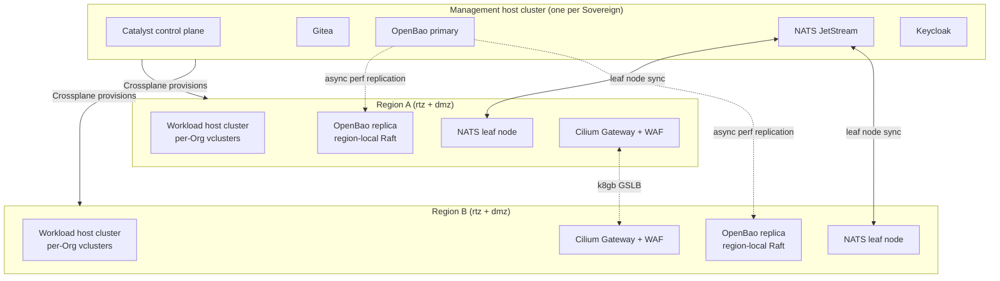

# Platform Tech Stack

**Status:** Authoritative target stack. **Updated:** 2026-04-27.
**Implementation:** Component READMEs exist; Catalyst control-plane glue is design-stage. See [`IMPLEMENTATION-STATUS.md`](IMPLEMENTATION-STATUS.md).

Every component in Catalyst, what it does, and where it sits — control plane, application layer, or both. Defer to [`GLOSSARY.md`](GLOSSARY.md) for terminology and [`ARCHITECTURE.md`](ARCHITECTURE.md) for the model.

---

## 1. Component categorization

Catalyst's components fall into three categories:

| Category | Where it runs | Examples |
|---|---|---|
| **Catalyst control plane** | The Sovereign's `mgt` cluster | console, marketplace, admin, projector, catalog-svc, provisioning, environment-controller, blueprint-controller, billing, gitea, nats-jetstream (control-plane account), openbao, keycloak, spire-server, observability (Grafana stack) |
| **Per-host-cluster infrastructure** | Every host cluster (`mgt`, `rtz`, `dmz`) | cilium, external-dns, k8gb, coraza, flux, crossplane, opentofu (bootstrap-only), cert-manager, external-secrets, kyverno, trivy, falco, sigstore, syft-grype, vpa, keda, reloader, minio, velero, harbor, failover-controller |
| **Application Blueprints** | Inside per-Org vclusters | cnpg, ferretdb, valkey, strimzi, clickhouse, opensearch, stalwart, livekit, matrix, stunner, milvus, neo4j, vllm, kserve, knative, librechat, bge, llm-gateway, anthropic-adapter, langfuse, nemo-guardrails, temporal, flink, debezium, iceberg, openmeter, litmus |

The **same upstream technology** can serve in multiple categories. For example: Valkey is **not** part of the control plane (JetStream KV replaces it there) but **is** available as an Application Blueprint when a User wants Redis-compatible caching for their app. Similarly, Strimzi/Kafka is an Application Blueprint; the Catalyst control plane uses NATS JetStream for events, not Kafka.

This separation is critical and is the main reason to read this document carefully.

---

## 2. Catalyst control-plane components (per-Sovereign, on the `mgt` cluster)

These components make a Kubernetes cluster a Sovereign. Installed exactly once per Sovereign, on its management cluster, as part of the `bp-catalyst-platform` umbrella Blueprint.

### 2.1 User-facing surfaces

| Component | Source | Purpose |
|---|---|---|
| **console** | `core/` (Go + Astro/Svelte UI) | Primary UI for end users. Form / Advanced / IaC editor depths. |
| **marketplace** | (UI module of `core/`) | Public-facing Blueprint card grid. |
| **admin** | (UI module of `core/`) | Sovereign-admin operations UI. |

### 2.2 Catalyst backend services

| Component | Purpose |
|---|---|
| **projector** | CQRS read-side. Subscribes to NATS JetStream, materializes per-Environment KV, fans out SSE to console. |
| **catalog-svc** | Reads Blueprint CRDs, serves catalog API to console + marketplace. |
| **provisioning** | Validates configSchema, composes manifests, creates one Gitea repo per Application under the Org's Gitea Org, commits initial branches (`develop`/`staging`/`main`). |
| **environment-controller** | Reconciles Environment CRD: vcluster + Flux-bootstrap (watching the appropriate branch across the Org's Application repos) + webhooks. |
| **blueprint-controller** | Watches Blueprint sources (this monorepo + per-Sovereign `catalog-sovereign` Gitea Org + Org-private `shared-blueprints` repos), registers Blueprint CRDs. |
| **billing** | Per-Organization metering, invoicing. |

### 2.3 Per-Sovereign supporting services

These run **once per Sovereign** (on the mgt cluster, with sibling replicas in workload regions where noted). They are part of the Catalyst control plane.

| Component | Purpose |
|---|---|
| **[keycloak](../platform/keycloak/)** | User identity. Per-Org realm in SME-style Sovereigns; per-Sovereign realm in corporate-style. |
| **[openbao](../platform/openbao/)** | Secret backend. Primary on mgt; sibling Raft cluster per workload region with async perf replication. **No stretched clusters.** See [`SECURITY.md`](SECURITY.md) §5. |
| **spire-server** | SPIFFE/SPIRE workload identity. 5-min rotating SVIDs. Root server on mgt; per-host-cluster agent + cluster-local SPIRE-server replica. |
| **nats-jetstream** | Event spine (pub/sub + Streams + KV). Per-Organization Accounts. Replaces Redpanda + Valkey for the **control plane** only. Apache 2.0. |
| **[gitea](../platform/gitea/)** | Per-Sovereign Git server. Hosts five conventional Gitea Orgs: `catalog` (public Blueprint mirror), `catalog-sovereign` (Sovereign-curated private Blueprints), one per Catalyst Organization (each with `shared-blueprints` + one repo per Application), and `system` (sovereign-admin scope). See [`GLOSSARY.md`](GLOSSARY.md) §"Gitea Orgs". |
| **observability** (Grafana stack) | Catalyst's own self-monitoring: Alloy collector, Loki (logs), Mimir (metrics), Tempo (traces), Grafana visualization. Customer Application telemetry also flows here unless an Org installs its own observability stack. |

---

## 3. Per-host-cluster infrastructure (on every host cluster: `mgt`, `rtz`, `dmz`)

These are deployed on **every** host cluster a Sovereign owns — not just the management cluster. They form the substrate Catalyst (and Application workloads) sit on. Installed by the bootstrap kit during Phase 0 (or by Crossplane when a new region is added later).

### 3.1 Networking and service mesh

| Component | Purpose |
|---|---|
| **[cilium](../platform/cilium/)** | CNI + Service Mesh (eBPF). mTLS, L7 policies, Gateway API. |
| **[external-dns](../platform/external-dns/)** | DNS sync (registers/deletes records via cloud DNS APIs). |
| **[k8gb](../platform/k8gb/)** | GSLB — authoritative DNS for cross-region failover. |
| **[coraza](../platform/coraza/)** | WAF (OWASP CRS) at the DMZ edge. |

### 3.2 GitOps and IaC

| Component | Purpose |
|---|---|
| **[flux](../platform/flux/)** | GitOps reconciler. **One Flux instance per vcluster** (lightweight: source + kustomize + helm controllers). Plus a host-level Flux on each host cluster for Catalyst itself. |
| **[crossplane](../platform/crossplane/)** | The only IaC. Manages all non-Kubernetes resources via Compositions. **Never user-facing.** Installed on the mgt cluster (manages cloud resources for the whole Sovereign). |
| **[opentofu](../platform/opentofu/)** | Bootstrap IaC only. Used in Phase 0 of Sovereign provisioning by `catalyst-provisioner`, then archived. Not deployed on host clusters. |

### 3.3 Security and policy

| Component | Purpose |
|---|---|
| **[cert-manager](../platform/cert-manager/)** | TLS certificate automation. |
| **[external-secrets](../platform/external-secrets/)** | ESO — reads OpenBao paths, materializes K8s Secrets. |
| **[kyverno](../platform/kyverno/)** | Policy engine — admission control, mutation, generation. |
| **[trivy](../platform/trivy/)** | Image and IaC vulnerability scanning (CI + runtime). |
| **[falco](../platform/falco/)** | Runtime security (eBPF). |
| **[sigstore](../platform/sigstore/)** | Container image signing verification (cosign admission). |
| **[syft-grype](../platform/syft-grype/)** | SBOM generation + vulnerability matching. |

### 3.4 Scaling and operations

| Component | Purpose |
|---|---|
| **[vpa](../platform/vpa/)** | Vertical Pod Autoscaler — right-sizing. |
| **[keda](../platform/keda/)** | Event-driven horizontal autoscaling, scale-to-zero. |
| **[reloader](../platform/reloader/)** | Auto-restart Pods when ConfigMap/Secret hashes change. |

### 3.5 Storage and registry

| Component | Purpose |
|---|---|
| **[minio](../platform/minio/)** | In-cluster S3. Tiers cold data to cloud archival storage. |
| **[velero](../platform/velero/)** | K8s backup/restore. Backups land in cloud archival storage. |
| **[harbor](../platform/harbor/)** | Container registry per host cluster. Stores Catalyst component images, mirrored Blueprint OCI artifacts, customer images. |

### 3.6 Resilience

| Component | Purpose |
|---|---|
| **[failover-controller](../platform/failover-controller/)** | Multi-region failover orchestration. Lease-based (cloud witness) to prevent split-brain. |

---

## 4. Application Blueprints (Optional, A La Carte)

These are not part of the Catalyst control plane. Users install them as Applications when they need them.

### 4.1 Data services

| Blueprint | Purpose | Multi-region replication |
|---|---|---|
| **[cnpg](../platform/cnpg/)** | PostgreSQL operator | WAL streaming (async primary-replica) |
| **[ferretdb](../platform/ferretdb/)** | MongoDB wire protocol on PostgreSQL | Via CNPG WAL streaming |
| **[strimzi](../platform/strimzi/)** | Apache Kafka streaming | MirrorMaker2 |
| **[valkey](../platform/valkey/)** | Redis-compatible cache | REPLICAOF |
| **[clickhouse](../platform/clickhouse/)** | OLAP analytics | ReplicatedMergeTree |
| **[opensearch](../platform/opensearch/)** | Search + hot SIEM backend | Cross-cluster replication |

### 4.2 CDC

| Blueprint | Purpose |
|---|---|
| **[debezium](../platform/debezium/)** | Change data capture |

### 4.3 Workflow and processing

| Blueprint | Purpose |
|---|---|
| **[temporal](../platform/temporal/)** | Saga orchestration + compensation |
| **[flink](../platform/flink/)** | Stream + batch processing |

### 4.4 Data lakehouse

| Blueprint | Purpose |
|---|---|
| **[iceberg](../platform/iceberg/)** | Open table format |

### 4.5 Communication

| Blueprint | Purpose |
|---|---|
| **[stalwart](../platform/stalwart/)** | Email server (JMAP/IMAP/SMTP) |
| **[stunner](../platform/stunner/)** | K8s-native TURN/STUN |
| **[livekit](../platform/livekit/)** | Video/audio (WebRTC SFU) |
| **[matrix](../platform/matrix/)** | Team chat (Matrix protocol; Synapse is the server implementation) |

### 4.6 AI / ML

| Blueprint | Purpose |
|---|---|
| **[knative](../platform/knative/)** | Serverless platform |
| **[kserve](../platform/kserve/)** | Model serving |
| **[vllm](../platform/vllm/)** | LLM inference |
| **[milvus](../platform/milvus/)** | Vector database |
| **[neo4j](../platform/neo4j/)** | Graph database |
| **[librechat](../platform/librechat/)** | Chat UI |
| **[bge](../platform/bge/)** | Embeddings + reranking |
| **[llm-gateway](../platform/llm-gateway/)** | Subscription proxy for Claude Code |
| **[anthropic-adapter](../platform/anthropic-adapter/)** | OpenAI-to-Anthropic translation |

### 4.7 AI safety and observability

| Blueprint | Purpose |
|---|---|
| **[nemo-guardrails](../platform/nemo-guardrails/)** | AI safety firewall |
| **[langfuse](../platform/langfuse/)** | LLM observability |

### 4.8 Identity and metering

| Blueprint | Purpose |
|---|---|
| **[openmeter](../platform/openmeter/)** | Usage metering |

### 4.9 Chaos engineering

| Blueprint | Purpose |
|---|---|
| **[litmus](../platform/litmus/)** | Chaos engineering experiments |

---

## 5. Composite Blueprints (Products)

OpenOva ships these as ready-made composite Blueprints. Each is a package of Blueprints with curated configuration:

| Composite | Composes |
|---|---|
| **[bp-catalyst-platform](../products/catalyst/)** | The Catalyst control plane itself — see §2 above. |
| **[bp-cortex](../products/cortex/)** | AI Hub — kserve, knative, vllm, milvus, neo4j, librechat, bge, llm-gateway, anthropic-adapter, nemo-guardrails, langfuse |
| **[bp-axon](../products/axon/)** | SaaS LLM Gateway (also installable as a managed gateway when Cortex is too heavy) |
| **[bp-fingate](../products/fingate/)** | Open Banking — keycloak (FAPI mode), openmeter, ext_authz + 6 banking services |
| **[bp-fabric](../products/fabric/)** | Data & Integration — strimzi, flink, temporal, debezium, iceberg, clickhouse, minio |
| **[bp-relay](../products/relay/)** | Communication — stalwart, livekit, stunner, matrix |

OpenOva also ships **Specter** (AIOps agents) and **Exodus** (migration program). Specter is a composite Blueprint (`bp-specter`) typically installed in corporate Sovereigns. Exodus is a deliverable services engagement, not a Blueprint.

---

## 6. Multi-Region Architecture


```mermaid
flowchart TB
    subgraph Mgt["Management host cluster (one per Sovereign)"]
        CC[Catalyst control plane]
        Gitea
        Bao0[OpenBao primary]
        Nats[NATS JetStream]
        KC[Keycloak]
    end

    subgraph RegionA["Region A (rtz + dmz)"]
        K8sA[Workload host cluster<br>per-Org vclusters]
        BaoA[OpenBao replica<br>region-local Raft]
        NatsA[NATS leaf node]
        IngressA[Cilium Gateway + WAF]
    end

    subgraph RegionB["Region B (rtz + dmz)"]
        K8sB[Workload host cluster<br>per-Org vclusters]
        BaoB[OpenBao replica<br>region-local Raft]
        NatsB[NATS leaf node]
        IngressB[Cilium Gateway + WAF]
    end

    Mgt -->|"Crossplane provisions"| RegionA
    Mgt -->|"Crossplane provisions"| RegionB
    Bao0 -.->|"async perf replication"| BaoA
    Bao0 -.->|"async perf replication"| BaoB
    Nats <-->|"leaf node sync"| NatsA
    Nats <-->|"leaf node sync"| NatsB
    IngressA <-.->|"k8gb GSLB"| IngressB
```

Each region is its own failure domain. OpenBao Raft is **intra-region only**; cross-region is async perf replication. See [`SECURITY.md`](SECURITY.md) §5.

---

## 7. Resource estimates

### 7.1 Catalyst control plane (per Sovereign, on the mgt cluster)

This is the budget for the **Catalyst-specific** layer only — the components in §2. Per-host-cluster infrastructure (§3 — Cilium, Flux, Crossplane, Kyverno, Harbor, etc.) runs on the mgt cluster too, but its budget is in §7.4 below.

| Layer | Approx RAM | Notes |
|---|---|---|
| Control-plane services (console, projector, catalog-svc, provisioning, environment-controller, blueprint-controller, billing) | ~3 GB | Several small Go services |
| NATS JetStream | ~0.5 GB | 3 replicas |
| OpenBao | ~1.5 GB | 3-node Raft |
| Keycloak (corporate / `shared-sovereign`) | ~2 GB | HA, Postgres-backed |
| Keycloak (SME / `per-organization` × N orgs) | ~150 MB × N | Single replica each, embedded H2 |
| Gitea | ~1 GB | |
| SPIRE server | ~0.3 GB | |
| Catalyst observability (Grafana stack) | ~3 GB | Grafana, Loki, Mimir, Tempo, Alloy |
| **Catalyst-only subtotal** | **~11.3 GB** | for the mgt cluster |

For a single-region SME Sovereign with 100 Orgs: ~11.3 GB Catalyst + 100 × 150 MB Keycloak ≈ ~26 GB Catalyst-only on the management host cluster (before per-host-cluster infrastructure overhead).

### 7.2 Per-Organization vcluster (workload regions)

| Layer | Approx RAM |
|---|---|
| vcluster control plane | ~150 MB |
| Lightweight Flux | ~150 MB |
| ESO + reloader | ~100 MB |
| **Subtotal per Org per region** | **~400 MB** + workload RAM |

### 7.3 Per-Application

Application-specific. A WordPress with embedded Postgres on `medium` overlay: ~2 GB. A multi-region Strimzi Kafka cluster: 4–16 GB per region.

### 7.4 Per-host-cluster infrastructure overhead

Adds to **every** host cluster a Sovereign owns (mgt, rtz, dmz):

| Layer | Approx RAM | Notes |
|---|---|---|
| Cilium | ~0.5 GB | per node, agents + Hubble |
| Flux (host-level) | ~0.2 GB | source + kustomize + helm controllers |
| Crossplane | ~0.5 GB | only on mgt; manages cloud resources for whole Sovereign |
| cert-manager | ~0.2 GB | |
| ESO | ~0.2 GB | |
| Kyverno | ~0.5 GB | |
| Trivy Operator | ~0.5 GB | |
| Falco | ~0.5 GB | per node |
| Harbor | ~3 GB | per host cluster |
| MinIO | ~1 GB | per host cluster |
| Velero | ~0.2 GB | |
| Reloader, VPA, KEDA, k8gb, External-DNS, Sigstore, Syft+Grype, failover-controller | ~1.5 GB combined | small operators |
| **Per-host-cluster subtotal** | **~8.8 GB** | per host cluster |

**Total mgt cluster RAM** ≈ Catalyst (§7.1) + per-host-cluster (§7.4) ≈ ~20 GB + 100 × 150 MB Keycloak (SME tier with 100 orgs) ≈ ~35 GB.

---

## 8. Cluster deployment

### 8.1 K3s installation

```bash
curl -sfL https://get.k3s.io | sh -s - server \
  --cluster-init \
  --disable traefik \
  --disable servicelb \
  --disable local-storage \
  --flannel-backend=none \
  --disable-network-policy \
  --kube-controller-manager-arg="node-monitor-period=5s" \
  --kube-controller-manager-arg="node-monitor-grace-period=20s" \
  --kube-apiserver-arg="default-watch-cache-size=50" \
  --etcd-arg="quota-backend-bytes=1073741824" \
  --kubelet-arg="max-pods=50"
```

### 8.2 Disabled K3s components

| Component | Replacement |
|---|---|
| traefik | Cilium Gateway API |
| servicelb | Cloud LB or k8gb DNS-based failover |
| local-storage | Application-level replication |
| flannel | Cilium CNI |

### 8.3 Cilium installation

```bash
helm install cilium cilium/cilium \
  --namespace kube-system \
  --set kubeProxyReplacement=true \
  --set k8sServiceHost=${API_SERVER_IP} \
  --set k8sServicePort=6443 \
  --set hubble.enabled=true \
  --set hubble.relay.enabled=true \
  --set encryption.enabled=true \
  --set encryption.type=wireguard \
  --set gatewayAPI.enabled=true \
  --set envoy.enabled=true
```

---

## 9. User choice options

### 9.1 Cloud Provider

| Provider | Status | Crossplane provider |
|---|---|---|
| Hetzner Cloud | Available | hcloud |
| AWS | Available (Crossplane provider stable) | aws |
| GCP | Available (Crossplane provider stable) | gcp |
| Azure | Available (Crossplane provider stable) | azure |
| Oracle Cloud (OCI) | Available | oci |
| Huawei Cloud | Available | huaweicloud |

Hetzner is the most-tested path; the OpenOva Sovereign runs on Hetzner.

### 9.2 Regions

| Option | Description |
|---|---|
| 1 region | SME default — single rtz cluster, no geographic redundancy |
| 2 regions | Recommended for production — symmetric rtz clusters + DMZ, k8gb routes |
| 3+ regions | Regulated tier — adds DR replica region |

### 9.3 LoadBalancer

| Option | How | Cost |
|---|---|---|
| Cloud Provider LB | Native LB | ~EUR 5–10/mo |
| k8gb DNS-based LB | Cilium Gateway + k8gb | Free |
| Cilium L2 Mode | ARP-based (same subnet) | Free |

### 9.4 DNS Provider

Sovereign-domain registration is by the customer; Cloudflare is a frequent default. Per-cloud DNS providers (Route53, Cloud DNS, Azure DNS, Hetzner DNS) work too — Crossplane providers exist for all.

### 9.5 Archival S3 Storage

| Provider | Notes |
|---|---|
| Cloudflare R2 | Always available; zero egress |
| AWS S3 | If AWS chosen |
| GCP GCS | If GCP chosen |
| Azure Blob | If Azure chosen |
| OCI Object Storage | If OCI chosen |

---

## 10. SIEM / SOAR architecture

```mermaid
flowchart LR
    subgraph Detect
        Falco
        Trivy
        Kyverno
    end

    Detect -->|Falcosidekick / hooks| Strimzi[Strimzi/Kafka<br>(Application Blueprint)]
    Strimzi --> OS[OpenSearch<br>(hot SIEM)]
    OS -->|Age-out| CH[ClickHouse<br>(cold storage)]
    OS -->|Correlation| Specter[bp-specter<br>(AIOps Blueprint)]
    Specter -->|Auto-remediate| Detect
```

This pipeline is **not** part of the Catalyst control plane — it's a composition of Application Blueprints (Strimzi for transport, OpenSearch for hot SIEM, ClickHouse for cold storage, `bp-specter` for SOAR/correlation) plus per-host-cluster security tooling already there (Falco, Trivy, Kyverno). Customers install OpenSearch + ClickHouse + bp-specter when they want SIEM; the rest is already running.

The Catalyst control plane's own audit log (commits, RBAC events, SecretPolicy actions) ships to OpenSearch via this pipeline when the SIEM components are installed; otherwise audit logs are retained in the local Grafana stack with rotation.

---

## 11. License posture

Every Catalyst control-plane component carries an open-source license that allows redistribution as a customer-deployable platform:

| Component | License | Notes |
|---|---|---|
| OpenBao | MPL 2.0 | Apache-2.0 fork of Vault, OK to redistribute. |
| NATS JetStream | Apache 2.0 | Clean. |
| Cilium | Apache 2.0 | Clean. |
| Flux | Apache 2.0 | Clean. |
| Crossplane | Apache 2.0 | Clean. |
| Gitea | MIT | Clean. |
| Keycloak | Apache 2.0 | Clean. |
| cert-manager | Apache 2.0 | Clean. |
| ESO | Apache 2.0 | Clean. |
| OpenTofu | MPL 2.0 | Clean (Terraform fork). |
| OpenSearch | Apache 2.0 | Clean (Elasticsearch fork). |
| Valkey | BSD-3 | Clean (Redis fork). |

Application Blueprints carry their upstream licenses; some are non-Apache (e.g. CNPG: Apache 2.0; Strimzi: Apache 2.0; ferretdb: Apache 2.0; vllm: Apache 2.0). The Catalyst control plane never bundles BSL-licensed software.

---

*See [`ARCHITECTURE.md`](ARCHITECTURE.md) for how these components fit together. See [`docs/TECHNOLOGY-FORECAST-2027-2030.md`](TECHNOLOGY-FORECAST-2027-2030.md) for the roadmap.*
