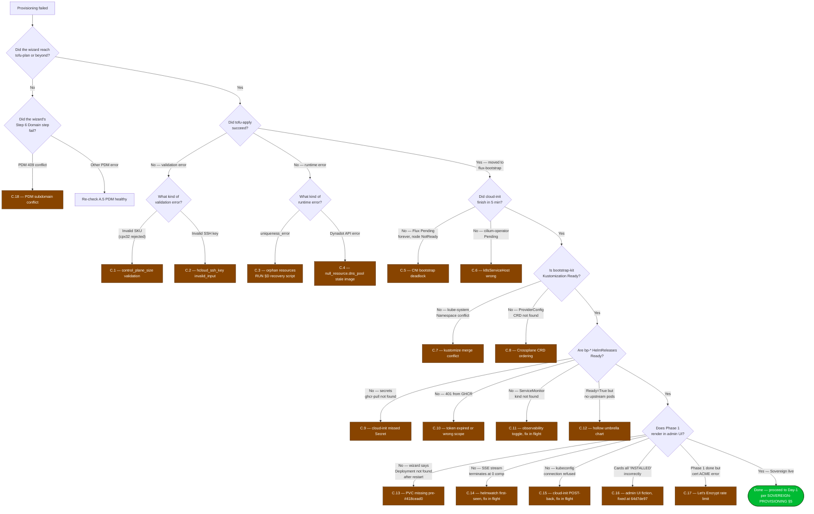

# Runbook — Operations & Remediation

**Status:** Authoritative operator playbook. **Updated:** 2026-04-29.
**Audience:** OpenOva platform operators provisioning, troubleshooting, and recovering Catalyst Sovereigns. Read this with [`SOVEREIGN-PROVISIONING.md`](SOVEREIGN-PROVISIONING.md) (the architectural contract) and [`RUNBOOK-PROVISIONING.md`](RUNBOOK-PROVISIONING.md) (the wizard-driven operator UX).

This runbook gives operators **one place** to:

1. Confirm the prerequisites are in place before opening the wizard.
2. Walk a successful provisioning end-to-end with realistic timing.
3. Diagnose and recover from each of the 18 known failure modes seen in the field.
4. Run a single idempotent script ([`scripts/operator-recover-sovereign.sh`](../scripts/operator-recover-sovereign.sh)) that returns a partially-provisioned Sovereign to a clean slate.

This file is the operator's first stop. It cross-links — never duplicates — the canonical contract docs.

---

## Table of contents

- [A. Pre-provision checklist](#a-pre-provision-checklist)
- [B. Step-by-step provisioning walkthrough](#b-step-by-step-provisioning-walkthrough)
- [C. Known failure modes and canonical recovery](#c-known-failure-modes-and-canonical-recovery)
- [D. Idempotent recovery script](#d-idempotent-recovery-script)
- [E. Cross-links](#e-cross-links)
- [F. Phase timeline](#f-phase-timeline)
- [G. Failure decision tree](#g-failure-decision-tree)

---

## F. Phase timeline

The following is the ownership and timing model for a single-region Sovereign on Hetzner Cloud. Total wall-clock is **15–25 minutes** for a solo Sovereign (1 control plane, 0 workers); 25–45 minutes with HA (3 CPs + N workers).

```mermaid
flowchart LR
  subgraph PROV["catalyst-provisioner (openova.io)"]
    direction TB
    W["Wizard / SSE\nUI captures input"] --> A["catalyst-api\n/v1/deployments"]
    A --> P0["Phase 0 — OpenTofu\nnetwork+firewall+ssh-key\n+server+LB\n(30–60s plan, 60–120s apply)"]
    P0 --> PDM["PDM /v1/commit\nwrites Sovereign DNS\n(~5s)"]
  end

  subgraph CI["Cloud-init on control-plane (3–5min)"]
    CI1["k3s install\n+ Cilium helm install\n(CNI bootstrap)"] --> CI2["Flux v2.4.0 install"]
    CI2 --> CI3["create flux-system/ghcr-pull\nfrom CATALYST_GHCR_PULL_TOKEN"]
    CI3 --> CI4["apply GitRepository\n+ 2 Kustomizations\n(bootstrap-kit + infra-config)"]
  end

  subgraph SOV["Sovereign cluster (Flux-owned)"]
    direction TB
    F1["bootstrap-kit Kustomization\ninstalls 11 bp-* in dep order\n(10–15min)"] --> F2["bp-catalyst-platform\numbrella reconciles\n(~2min)"]
    F2 --> F3["cert-manager issues wildcard\n+ Cilium Gateway online\n+ console URL responds\n(1–2min)"]
  end

  PDM --> CI1
  CI4 --> F1

  classDef ours fill:#0b3,stroke:#040,color:#fff
  classDef theirs fill:#06c,stroke:#024,color:#fff
  classDef sov fill:#840,stroke:#420,color:#fff
  class W,A,P0,PDM ours
  class CI1,CI2,CI3,CI4 theirs
  class F1,F2,F3 sov
```



Ownership is the key abstraction:

- **`catalyst-provisioner` (green)** runs in our `catalyst` namespace on Catalyst-Zero. It does the OpenTofu run, hands the cloud-init template to the new server, calls PDM, and then disconnects. It never installs anything on the new Sovereign — that's Flux's job.
- **Cloud-init on the new control-plane (blue)** is the only one-shot bridge. It installs k3s, Cilium, Flux, and the GHCR pull secret, then commits the cluster to GitOps mode by applying two Kustomizations.
- **Sovereign cluster (orange)** owns its own outcome from then on. Flux pulls the 12 `bp-*` charts from the public OpenOva monorepo and reconciles steady-state. The provisioner has no privileged access to the Sovereign after this hand-off.

The boundary between blue and orange is the **single hand-off point**. If a failure happens before this boundary, the operator's tools are: re-run wizard (idempotent because every Hetzner resource is named off the FQDN), purge orphans (script in §D). After this boundary, the operator's tools are: Flux reconciliation, HelmRelease debugging on the Sovereign cluster, and (worst case) blow it away and re-provision.

---

## A. Pre-provision checklist

Walk each of these top to bottom. The wizard fails fast on missing prerequisites, but most of them are not visible to the wizard; the operator must confirm them before starting.

### A.1 Hetzner Cloud project + API token

| Item | Required | Where |
|---|---|---|
| Hetzner Cloud project | Yes — separate project per Sovereign | https://console.hetzner.cloud → Projects |
| API token | Read **and** Write | Project → Security → API Tokens → New Token |
| Token storage | 1Password vault `OpenOva — Production`, item `Catalyst — Hetzner Cloud token (<sovereign-fqdn>)` | Tag `rotation:per-sovereign` |
| Rotation policy | Rotate when the token leaks, when a Sovereign is decommissioned, or every 12 months — whichever comes first. Token is held only by the operator at provisioning time; the Sovereign itself does not retain it. | See [`SECRET-ROTATION.md`](SECRET-ROTATION.md) §"Hetzner Cloud API token (per Sovereign)" |

**Critical:** the token is sent **once** through the wizard, used by `catalyst-api` for the OpenTofu run, and then redacted from the persisted deployment record. It is **not** copied to the Sovereign cluster. Day-2 IaC on the Sovereign uses Crossplane with its own Hetzner credential, sealed via OpenBao (see [`SOVEREIGN-PROVISIONING.md`](SOVEREIGN-PROVISIONING.md) §4).

### A.2 DNS pool registered in Dynadot + Dynadot credentials

The OpenOva pool zones are `omani.works` and `openova.io`. They are registered in Dynadot. The pool-domain-manager (PDM) running on Catalyst-Zero allocates subdomains under these zones for new Sovereigns.

| Item | Required | Where |
|---|---|---|
| Dynadot account holds the pool zones | Yes — confirm `omani.works`, `openova.io` are listed | https://www.dynadot.com → Domains |
| K8s Secret `dynadot-api-credentials` | Namespace `openova-system`, keys `api-key`, `api-secret`, `domain` | `kubectl -n openova-system get secret dynadot-api-credentials` |
| PDM running | `kubectl -n openova-system get deploy pool-domain-manager` shows `1/1 READY` | — |

For BYO modes (`byo-manual`, `byo-api`), the pool registration is irrelevant — the customer brings their own zone. See [`SOVEREIGN-PROVISIONING.md`](SOVEREIGN-PROVISIONING.md) §1 for the three domain modes.

### A.3 GHCR pull token in `catalyst/catalyst-ghcr-pull-token`

The bootstrap kit pulls 12 private OCI charts from `ghcr.io/openova-io/`. Cloud-init creates a `flux-system/ghcr-pull` Secret on the Sovereign cluster from the token in the catalyst-api Pod's `CATALYST_GHCR_PULL_TOKEN` env var, which is sourced from the K8s Secret `catalyst-ghcr-pull-token`.

| Item | Required | Where |
|---|---|---|
| Token type | Fine-grained personal access token, scope `packages:read` on org `openova-io` | https://github.com/settings/tokens?type=beta |
| K8s Secret | `catalyst/catalyst-ghcr-pull-token`, key `token` | `kubectl -n catalyst get secret catalyst-ghcr-pull-token` |
| Rotation policy | Yearly | See [`SECRET-ROTATION.md`](SECRET-ROTATION.md) §"GHCR pull token" |

If this Secret is missing, every bootstrap-kit HelmRelease fails to pull. See §C.9 below for the canonical recovery.

### A.4 PowerDNS pool zones bootstrapped

PDM writes the parent-zone delegation NS records for pool Sovereigns into PowerDNS (and pushes the same NS records into Dynadot via the registrar adapter). The pool zones must be bootstrapped in PowerDNS before the first pool Sovereign is provisioned.

```bash
# Confirm the pool zones exist as authoritative on PowerDNS.
kubectl -n openova-system exec deploy/powerdns -- \
  pdnsutil list-all-zones 2>/dev/null | grep -E '^(omani\.works|openova\.io)$'
```

If neither line is printed, see [`PLATFORM-POWERDNS.md`](PLATFORM-POWERDNS.md) §"Pool zone bootstrap" for one-time zone creation.

### A.5 PDM running and healthy

```bash
kubectl -n openova-system get deploy pool-domain-manager
kubectl -n openova-system exec deploy/pool-domain-manager -- \
  wget -q -O - http://localhost:8080/healthz
```

Expected: `{"status":"ok"}`. If unhealthy, the wizard's domain step (Step 6) cannot reserve subdomains; defer provisioning until PDM is back.

### A.6 bp-* charts published at the current target version

The bootstrap-kit Kustomization references 12 charts. Today's target versions are:

| Chart | Target version |
|---|---|
| `bp-cilium` | `1.1.0` |
| `bp-cert-manager` | `1.1.0` |
| `bp-flux` | `1.1.0` |
| `bp-crossplane` | `1.1.0` |
| `bp-sealed-secrets` | `1.1.0` |
| `bp-spire` | `1.1.0` |
| `bp-nats-jetstream` | `1.1.0` |
| `bp-openbao` | `1.1.0` |
| `bp-keycloak` | `1.1.0` |
| `bp-gitea` | `1.1.0` |
| `bp-powerdns` | `1.1.0` |
| `bp-catalyst-platform` | `1.1.0` |

When the observability-toggle agent lands, all 12 charts move to `1.1.1`. The bump is the operator's signal that observability defaults flip from on to off (per the IMPLEMENTATION-STATUS hardening) — the underlying charts are functionally compatible.

**Before provisioning, confirm the 12 OCI artifacts exist** at the target version:

```bash
for chart in cilium cert-manager flux crossplane sealed-secrets spire nats-jetstream openbao keycloak gitea powerdns catalyst-platform; do
  printf '%-24s ' "bp-$chart"
  curl -sS -H "Authorization: Bearer $(echo -n "$GHCR_PULL_TOKEN" | base64)" \
    "https://ghcr.io/v2/openova-io/bp-$chart/tags/list" 2>/dev/null | \
    python3 -c "import json,sys; print(json.load(sys.stdin).get('tags',[])[-3:])" 2>/dev/null || echo "MISSING"
done
```

(Replace `GHCR_PULL_TOKEN` with a token in your shell's env — never hard-code in scripts; see [`INVIOLABLE-PRINCIPLES.md`](INVIOLABLE-PRINCIPLES.md) #4.)

### A.7 subchart-guard CI green

The blueprint-release workflow has a 4-step subchart guard (verifies the upstream chart is present at build/package/push/pull). If any step fails, the chart that ships will be hollow (HelmRelease installs no upstream payload). See §C.12 below for the symptom and recovery.

```bash
gh run list --workflow=blueprint-release.yaml --limit 5 \
  --json conclusion,headBranch,event \
  --repo openova-io/openova
```

Every recent run on `main` must show `"conclusion": "success"`. If any fails, do not provision; fix CI first.

---

## B. Step-by-step provisioning walkthrough

Reference times are p50 against a Hetzner `fsn1` project with no rate-limit headwind.

### B.1 Phase 0 — OpenTofu (30–60s plan, 60–120s apply)

The operator clicks **Provision** in the wizard. The catalyst-api accepts the request, writes `tofu.auto.tfvars.json`, and runs `tofu init && tofu plan && tofu apply -auto-approve`. The wizard's progress page streams the `tofu` phase events live.

What gets created in Hetzner Cloud:

| Resource | Hetzner kind | Name pattern |
|---|---|---|
| Network (`10.0.0.0/16` + subnet `10.0.1.0/24`) | `hcloud_network` | `catalyst-${slug}-network` |
| Firewall (open 80/443/6443/ICMP; 22 closed) | `hcloud_firewall` | `catalyst-${slug}-fw` |
| SSH key (operator-supplied ed25519) | `hcloud_ssh_key` | `catalyst-${slug}-ssh` |
| Control-plane server (Ubuntu 24.04, cloud-init template) | `hcloud_server` | `catalyst-${slug}-cp-1` |
| Worker servers (`worker_count`) | `hcloud_server` | `catalyst-${slug}-worker-N` |
| Load balancer (lb11, NodePort 31080/31443) | `hcloud_load_balancer` | `catalyst-${slug}-lb` |

Where `${slug} = replace(sovereign_fqdn, ".", "-")`. **Names are deterministic — that is the basis for idempotent re-runs.**

### B.2 PDM /commit writes Sovereign DNS (~5s)

Once OpenTofu emits the `loadBalancerIP` output, catalyst-api calls `POST /api/v1/pool/<pool-zone>/commit` on PDM. PDM:

1. Creates the per-Sovereign authoritative zone on PowerDNS (`<sovereign-fqdn>.`).
2. Writes the canonical 6-record set: `@`, `*`, `console`, `api`, `gitea`, `harbor` — all A records pointing at the LB IP.
3. For pool Sovereigns: writes the parent-zone NS delegation into the Dynadot pool zone via the Dynadot registrar adapter.
4. For `byo-api`: flips NS at the customer's registrar via the matching adapter (Cloudflare / Namecheap / GoDaddy / OVH / Dynadot).
5. For `byo-manual`: emits the OpenOva NS list in the wizard so the customer can paste it into their own registrar.

See [`PLATFORM-POWERDNS.md`](PLATFORM-POWERDNS.md) §"Per-Sovereign zone model".

### B.3 Cloud-init (3–5 min)

Cloud-init on the control-plane node, in this exact order:

1. `apt-get update` + `apt-get install -y curl ca-certificates`.
2. `curl -sfL https://get.k3s.io | INSTALL_K3S_VERSION=v1.31.4+k3s1 sh -s - server --flannel-backend=none --disable-network-policy --disable=traefik --disable=servicelb --disable=local-storage --tls-san=<sovereign-fqdn>`.
3. `helm install cilium ... --set k8sServiceHost=127.0.0.1 ...` — Cilium **before** Flux to break the CNI bootstrap deadlock (#5 below).
4. `flux install` — installs Flux v2.4.0 core.
5. `kubectl create secret generic ghcr-pull -n flux-system --from-literal=token="$CATALYST_GHCR_PULL_TOKEN"` — durable so private bp-* charts pull cleanly (commit `dddbab4b`, #9 below).
6. Apply the GitRepository pointing at `clusters/<sovereign-fqdn>/` in the public OpenOva monorepo.
7. Apply two Kustomizations split for CRD ordering (commit `34c8de84`, #8 below):
   - `bootstrap-kit` — installs the 11 platform charts.
   - `infrastructure-config` — applies Crossplane Compositions and ProviderConfigs after Crossplane CRDs exist.

### B.4 Phase 1 — bootstrap-kit (10–15 min)

Flux pulls 11 `bp-*` HelmReleases in dependency order via `dependsOn`:

```
cilium  →  cert-manager  →  flux  →  crossplane  →  sealed-secrets
                                ↓
spire  →  nats-jetstream  →  openbao  →  keycloak  →  gitea  →  powerdns
```

Then `bp-catalyst-platform` (umbrella) reconciles. The 11 + umbrella = 12 G2 wrapper charts (per [`SOVEREIGN-PROVISIONING.md`](SOVEREIGN-PROVISIONING.md) §3 and [`IMPLEMENTATION-STATUS.md`](IMPLEMENTATION-STATUS.md) §7).

### B.5 cert-manager + Cilium Gateway + console URL (1–2 min)

Once `bp-cert-manager` is `Ready=True` and the wildcard `*.<sovereign-fqdn>` DNS has propagated, cert-manager's `ClusterIssuer/letsencrypt-prod` issues a wildcard cert via DNS-01 (against PowerDNS). The Cilium Gateway picks it up; `https://console.<sovereign-fqdn>` returns 200.

**Total:** 15–25 min for a solo Sovereign. The wizard's success screen prints the console URL and the LB IP.

---

## C. Known failure modes and canonical recovery

For each: SYMPTOM, ROOT CAUSE, DIAGNOSIS, RECOVERY. Eighteen modes documented from this session. They are grouped by phase boundary (Phase 0 OpenTofu / Cloud-init / Phase 1 Flux / post-Phase 1).

### C.1 `tofu plan` fails: control_plane_size validation

**Symptom:** SSE event during `tofu-plan`: `Error: Invalid value for variable | The given value "cpx32" is not valid for variable "control_plane_size".`

**Root cause:** the regex in [`infra/hetzner/variables.tf`](../infra/hetzner/variables.tf) accepted only `cx*` SKUs; the `cpx*` family was rejected. Fixed at commit `c6cbfe68`.

**Diagnosis:**

```bash
git -C /home/openova/repos/openova log --oneline c6cbfe68 -1
# Expected: c6cbfe68 fix(tofu): accept cpx* SKU family + empty worker_size for solo Sovereigns
```

If the running catalyst-api image predates `c6cbfe68`, the validation regex still rejects `cpx*`.

**Recovery:**

1. Confirm the catalyst-api image tag in `clusters/contabo-mkt/catalyst/helmrelease.yaml` is at or after `c6cbfe68`'s deploy commit.
2. If older, ship the latest catalyst image via the `deploy: update catalyst images` workflow.
3. Re-run the wizard with the same FQDN. Re-run is idempotent — see §D.

### C.2 `tofu apply` fails: `hcloud_ssh_key` invalid_input

**Symptom:** SSE event during `tofu-apply`: `Error: invalid_input | hcloud_ssh_key.this: public_key field is invalid (key body could not be parsed)`.

**Root cause:** the operator pasted a malformed ed25519 public key into the wizard — typically the private key by accident, or a key whose body is line-wrapped or missing the `ssh-ed25519 ` prefix.

**Diagnosis:**

```bash
# What did catalyst-api actually receive? (Token is redacted, ssh key is not.)
DID=$(kubectl -n catalyst exec deploy/catalyst-api -- \
  sh -c 'ls /var/lib/catalyst/deployments/*.json 2>/dev/null | tail -1')
kubectl -n catalyst exec deploy/catalyst-api -- \
  sh -c "cat $DID" | grep -E '"sshPublicKey"' | head -1
```

A valid line looks like `"sshPublicKey": "ssh-ed25519 AAAAC3Nz... user@host"` — the body must be unbroken base64.

**Recovery:**

1. Re-generate the public key on the operator's box: `ssh-keygen -t ed25519 -C "sovereign-admin@<org>" -f ~/.ssh/sovereign_admin -N ""`.
2. `cat ~/.ssh/sovereign_admin.pub` — copy the **single line** verbatim.
3. Re-run the wizard with the same FQDN; the `ssh_public_key` is the only changed field.

### C.3 `tofu apply` fails: name `uniqueness_error` (orphan resources)

**Symptom:** SSE event during `tofu-apply`: `Error: name is already used (uniqueness_error) | hcloud_network.this: a network with name "catalyst-omantel-omani-works-network" already exists`.

**Root cause:** a prior `tofu apply` got partway, the catalyst-api Pod restarted (its `/tmp/catalyst/tofu/...` is an emptyDir), and the OpenTofu state file was lost. Hetzner resources tagged for that Sovereign are orphans with no state file backing.

**Diagnosis:** the Sovereign's deployment record on catalyst-api shows status `failed` with the uniqueness error; Hetzner Cloud Console shows orphan resources tagged `catalyst.openova.io/sovereign=<fqdn>`.

**Recovery:** run [`scripts/operator-recover-sovereign.sh`](../scripts/operator-recover-sovereign.sh) (see §D) — it purges every Hetzner resource tagged for that Sovereign, releases the PDM allocation, and marks the deployment record as `cancelled`. Then re-run the wizard with the **same FQDN** — re-runs are fully idempotent because every resource name is deterministic off the FQDN.

This is the canonical recovery for any partial-state failure. The standing rule is: when in doubt, purge and re-run; never carry orphan state forward. Anchored in [`memory/feedback_idempotent_iac_purge.md`](file:///home/openova/.claude/projects/-home-openova-repos-openova-private/memory/feedback_idempotent_iac_purge.md).

### C.4 `tofu apply` fails: Dynadot API error from a `null_resource`

**Symptom:** SSE event during `tofu-apply`: `Error: external program failed | null_resource.dns_pool: dynadot API returned ...`.

**Root cause:** an old build of the OpenTofu module had a `null_resource.dns_pool` provisioner that called Dynadot directly. PDM now owns DNS writes — the `null_resource` was removed at commit `330211d2`.

**Diagnosis:**

```bash
git -C /home/openova/repos/openova log --oneline 330211d2 -1
# Expected: 330211d2 fix(tofu): drop redundant null_resource.dns_pool — PDM owns DNS writes
grep -n 'null_resource' /home/openova/repos/openova/infra/hetzner/main.tf || echo "OK — no null_resource"
```

**Recovery:** ensure the deployed catalyst-api image was built at or after `330211d2`. If older, redeploy. PDM `/commit` is now the single DNS writer.

### C.5 Cloud-init stuck: CNI bootstrap deadlock (Flux Pending forever)

**Symptom:** the new control-plane VM is up (SSH responds), but `kubectl get pods -A` from the operator's box (against the new cluster's kubeconfig) shows every pod stuck `Pending` with `0/1 nodes are available: 1 node(s) had untolerated taint`. Flux Kustomizations never go Ready.

**Root cause:** the original cloud-init installed Flux **before** Cilium. The control-plane node remained `NotReady` because no CNI was installed; Flux's own pods were Pending because the node was NotReady; Flux therefore never reconciled `bp-cilium`. Classic chicken-and-egg. Fixed at commits `e571ec7a` (Cilium before Flux) and `54872009` (k8sServiceHost=127.0.0.1).

**Diagnosis:**

```bash
git -C /home/openova/repos/openova log --oneline e571ec7a -1
# Expected: e571ec7a fix(cloudinit): install Cilium BEFORE Flux to break CNI bootstrap deadlock
git -C /home/openova/repos/openova log --oneline 54872009 -1
# Expected: 54872009 fix(cloudinit): use 127.0.0.1 for Cilium k8sServiceHost (host's local apiserver)
```

If the running catalyst-api image predates `54872009`, the cloud-init template still has the old order.

**Recovery:** redeploy catalyst-api at or after `54872009`, then run §D's recovery script and re-provision.

### C.6 Cloud-init stuck: `cilium-operator` Pending (k8sServiceHost wrong)

**Symptom:** node Ready, all kube-system pods running, but `cilium-operator` is Pending with event `0/1 nodes are available: 1 Too many pods` or it crashloops with `failed to dial kube-apiserver`.

**Root cause:** the original cloud-init passed `k8sServiceHost=<sovereign-fqdn>` to Cilium, which can't yet resolve at install time (DNS is being written in parallel). Fixed at commit `54872009` — uses `127.0.0.1` (the local k3s apiserver bind) as the bootstrap host.

**Diagnosis:** `kubectl -n kube-system describe pod -l name=cilium-operator | head -40` shows DNS resolution errors.

**Recovery:** same as C.5 — image must be at or after `54872009`. Purge + re-provision.

### C.7 Flux Kustomization fails: `kube-system Namespace already-registered`

**Symptom:** Flux event on the Sovereign cluster: `Reconciliation failed: existing namespace "kube-system" is conflicting with another resource that has the same name`.

**Root cause:** a kustomize merge inside the `bootstrap-kit` Kustomization had `kube-system` Namespace declared twice (once in `01-cilium`, once in `05-sealed-secrets`). Fixed at commit `2022e1af`.

**Diagnosis:**

```bash
git -C /home/openova/repos/openova log --oneline 2022e1af -1
# Expected: 2022e1af fix(bootstrap-kit): drop redundant kube-system Namespace from 01-cilium + 05-sealed-secrets
```

**Recovery:** the GitRepository on the Sovereign points at the public OpenOva monorepo `main`; once `2022e1af` is in `main`, Flux will pick it up on the next reconcile interval (default 1 min). If a Sovereign is stuck on a pinned older revision, edit the GitRepository's `spec.ref.branch` (or update its commit SHA) to current `main`.

### C.8 Flux Kustomization fails: `ProviderConfig CRD not found`

**Symptom:** Flux event on the Sovereign cluster: `no matches for kind "ProviderConfig" in version "hetzner.crossplane.io/v1beta1"`.

**Root cause:** a single Kustomization tried to apply both Crossplane (which installs the CRDs) and the Hetzner Crossplane Compositions (which reference those CRDs). Crossplane CRDs hadn't been registered yet. Fixed at commit `34c8de84` — split into two Kustomizations:

- `bootstrap-kit` — installs Crossplane (registers the CRDs).
- `infrastructure-config` — applies Compositions and ProviderConfigs, with `dependsOn: [bootstrap-kit]`.

**Diagnosis:**

```bash
git -C /home/openova/repos/openova log --oneline 34c8de84 -1
# Expected: 34c8de84 fix(cloudinit): split flux-bootstrap into bootstrap-kit + infrastructure-config Kustomizations
```

**Recovery:** confirm the cloud-init template (post-`34c8de84`) creates both Kustomizations. If the Sovereign was provisioned with the old single-Kustomization template, the Crossplane CRDs may still be missing. Re-provision against current `main`.

### C.9 HelmRelease pull fails: `secrets ghcr-pull not found`

**Symptom:** HelmRelease on the Sovereign cluster fails with `failed to get authentication secret 'flux-system/ghcr-pull': secrets "ghcr-pull" not found`.

**Root cause:** earlier cloud-init templates didn't create `flux-system/ghcr-pull` durably — the Secret was created in a transient kubectl call that didn't persist across cloud-init reboots. Fixed at commit `dddbab4b` — the Secret is created idempotently from `var.ghcr_pull_token` in cloud-init.

**Diagnosis:**

```bash
git -C /home/openova/repos/openova log --oneline dddbab4b -1
# Expected: dddbab4b fix(cloudinit): create flux-system/ghcr-pull secret on Sovereign so private bp-* charts pull cleanly
```

On the Sovereign cluster:

```bash
kubectl -n flux-system get secret ghcr-pull
```

If absent, the cloud-init template predated `dddbab4b`.

**Recovery:** re-provision against current `main`. Or, as a same-session fix on a still-up Sovereign: `kubectl -n flux-system create secret generic ghcr-pull --from-literal=token="$CATALYST_GHCR_PULL_TOKEN"` (operator runs from their box with kubeconfig from the Sovereign; never paste the token literally — pipe it from `kubectl get secret -n catalyst catalyst-ghcr-pull-token -o jsonpath='{.data.token}' | base64 -d`).

### C.10 HelmRelease pull fails: 401 from GHCR

**Symptom:** HelmRelease event: `failed to authorize: 401 Unauthorized | ghcr.io/openova-io/bp-cilium`.

**Root cause:** the GHCR token in `catalyst/catalyst-ghcr-pull-token` (and therefore the one cloud-init wrote to the Sovereign's `flux-system/ghcr-pull`) is expired or has the wrong scope.

**Diagnosis:**

```bash
# Confirm the secret exists with non-zero content (no `; echo` — see Rule #10)
kubectl -n catalyst get secret catalyst-ghcr-pull-token \
  -o jsonpath='{.data.token}' | base64 -d | wc -c

# Try a manifest fetch with the same token (token scope test):
kubectl -n catalyst get secret catalyst-ghcr-pull-token \
  -o jsonpath='{.data.token}' | base64 -d > /tmp/ghcr-token && chmod 600 /tmp/ghcr-token
curl -sS -o /dev/null -w '%{http_code}\n' \
  -H "Authorization: Bearer $(cat /tmp/ghcr-token | base64)" \
  https://ghcr.io/v2/openova-io/bp-cilium/manifests/1.1.0
rm -f /tmp/ghcr-token
```

If 401, the token has expired or lost `packages:read` scope.

**Recovery:** rotate the token per [`SECRET-ROTATION.md`](SECRET-ROTATION.md) §"GHCR pull token". After rotation, the next provisioning runs pick up the new token automatically; existing Sovereigns must have their `flux-system/ghcr-pull` Secret rotated by the same procedure (re-create the Secret with the new token, then `flux reconcile source helmrepository`).

### C.11 HelmRelease install fails: `ServiceMonitor not found in monitoring.coreos.com/v1`

**Symptom:** HelmRelease event for one of the bp-* charts: `error validating ... unable to recognize "templates/servicemonitor.yaml": no matches for kind "ServiceMonitor" in version "monitoring.coreos.com/v1"`.

**Root cause:** every bp-* chart at `1.1.0` ships `ServiceMonitor` templates **on by default**. The bootstrap-kit installs the bp-* charts before `kube-prometheus-stack` (which registers the `ServiceMonitor` CRD); circular dep. Fix landing in two stages: (a) `cilium`, `cert-manager`, and `external-dns` already have HelmRelease-level value overrides that disable observability templates at install (commit `41c7ac13`); (b) the remaining bp-* charts are pending the chart-level default flip, after which all charts move to `1.1.1`.

**Diagnosis:**

```bash
# On the Sovereign cluster:
kubectl get crd servicemonitors.monitoring.coreos.com 2>&1 | head -1
```

If `Error from server (NotFound)`, the CRD isn't registered yet.

**Recovery (interim, until 1.1.1 ships):**

1. On the Sovereign, edit every bp-* HelmRelease that errored: `kubectl -n <ns> edit helmrelease <name>` and add `values.observability.enabled: false`.
2. `flux reconcile helmrelease <name> -n <ns>`.
3. After all bp-* are `Ready=True`, install `bp-kube-prometheus-stack` (manually applied at this stage; promotion to bootstrap-kit is pending the dependency-ordering fix). Then re-flip `observability.enabled: true` on the bp-* charts.

**Recovery (after 1.1.1 ships):** re-provision; the new charts default to `observability.enabled: false` and the operator opts in once the observability stack is live.

### C.12 HelmRelease install fails: chart is hollow (umbrella conversion)

**Symptom:** HelmRelease shows `Ready=True` but no upstream pods come up — the namespace is empty except for the Helm release secret.

**Root cause:** the chart was published as a "hollow" umbrella — it had `dependencies` declared but the upstream subchart wasn't packaged into `charts/`. Fixed at commit `43aff202` (umbrella conversion of all 11 bp-* charts), reinforced by the 4-step subchart-guard in `.github/workflows/blueprint-release.yaml` (commit `54418bd5` + `35dcb84d`).

**Diagnosis:**

```bash
git -C /home/openova/repos/openova log --oneline 43aff202 -1
# Expected: 43aff202 feat(bp-*): convert all 11 bootstrap-kit charts to umbrella charts depending on upstream

# Pull the OCI artifact and verify charts/ contains the upstream:
helm pull oci://ghcr.io/openova-io/bp-cilium --version 1.1.0 \
  --untar --untardir /tmp/bp-cilium-check
ls /tmp/bp-cilium-check/bp-cilium/charts/  # must contain the upstream subchart
rm -rf /tmp/bp-cilium-check
```

If `charts/` is empty, the chart is hollow.

**Recovery:** re-run the `blueprint-release` workflow on the chart's tag. The 4 guards (build/package/push/pull) will fail loudly if the upstream is missing — fix the upstream chart pin or repo config and re-tag.

### C.13 catalyst-api Pod restart wipes deployments

**Symptom:** the wizard's progress page goes blank or shows "Deployment not found" right after a catalyst-api Pod restart, even mid-provisioning.

**Root cause:** earlier catalyst-api builds wrote deployment records to a non-PVC path (`/tmp/...` emptyDir or in-memory). Pod restart = deployment history wiped. Fixed at commit `418cead0`: catalyst-api now writes to `/var/lib/catalyst/deployments/` on a PVC.

**Diagnosis:**

```bash
kubectl -n catalyst get pvc | grep catalyst
# Expected: catalyst-api-data    Bound    ...
git -C /home/openova/repos/openova log --oneline 418cead0 -1
# Expected: 418cead0 feat(catalyst-api): persist deployments to PVC so they survive Pod restarts
```

**Recovery:** confirm the deployed catalyst-api image is at or after `418cead0` and the HelmRelease values include the PVC mount. If the Pod restarted mid-provisioning before the PVC fix landed, the deployment record is lost; the Hetzner resources may still exist as orphans — purge per §D and re-run.

### C.14 helmwatch terminates immediately at 0 components

**Symptom:** the per-component SSE stream from catalyst-api closes within seconds of the wizard transitioning to the Phase 1 view; admin UI shows zero components rendered.

**Root cause:** catalyst-api's helmwatch loop terminates as soon as it sees zero HelmReleases — it didn't wait for the first reconciliation to register them. The "first-seen gate" is a counter that resets the watch deadline after any HelmRelease is observed. Fix in flight on branch `fix/helmwatch-first-seen-gate`.

**Diagnosis:**

```bash
kubectl -n catalyst logs deploy/catalyst-api | grep -E 'helmwatch.*(start|0 components|terminate)' | tail -10
```

If `helmwatch terminate: 0 components observed for 30s` lines appear immediately after start, the gate is missing.

**Recovery (interim):** the wizard's progress page polls the `/v1/sovereigns/{id}/helmreleases` REST endpoint as a fallback. Refresh the page once Phase 1 is 30+ seconds in — the SSE stream will re-attach with HelmReleases now visible.

**Recovery (after fix lands):** redeploy catalyst-api with the gate; SSE persists for the full Phase 1 duration.

### C.15 catalyst-api can't fetch kubeconfig (cloud-init POST-back)

**Symptom:** wizard SSE shows `flux-bootstrap` complete but the per-component grid stays empty; catalyst-api logs say `failed to load Sovereign kubeconfig: connection refused`.

**Root cause:** the only Sovereign kubeconfig catalyst-api has is the one OpenTofu emitted at apply time — that's a `https://<sovereign-ip>:6443` reference whose cert was just rotated by k3s startup. Catalyst-api needs the **post-cloud-init** kubeconfig, which only exists on the new control-plane node. Fix in flight (issue #183, branch `feat/cloudinit-postback-kubeconfig-bearer-token`): cloud-init POSTs a freshly-minted bearer token + CA back to catalyst-api on completion.

**Diagnosis:**

```bash
kubectl -n catalyst logs deploy/catalyst-api | grep -E 'kubeconfig|6443|Sovereign API' | tail -10
```

**Recovery (interim):** on the control-plane node, `cat /etc/rancher/k3s/k3s.yaml`, replace `127.0.0.1` with the LB IP, save it as a Secret in `catalyst` ns named `sovereign-<fqdn>-kubeconfig`. Catalyst-api will pick it up on next reconcile.

**Recovery (after #183 lands):** automatic — cloud-init does the POST-back.

### C.16 Phase 1 succeeds but admin UI shows fiction "INSTALLED"

**Symptom:** the Sovereign admin landing page shows every app card as "INSTALLED" even when the underlying HelmReleases are still reconciling or have never installed.

**Root cause:** the admin UI was reading `deployment.status` (which becomes `ready` as soon as Phase 0 finishes) instead of the live helmwatch SSE stream. Fixed at commit `64d7de97`.

**Diagnosis:**

```bash
git -C /home/openova/repos/openova log --oneline 64d7de97 -1
# Expected: 64d7de97 fix(wizard): admin card state grounded on helmwatch SSE, not deployment.status
```

**Recovery:** confirm the deployed `catalyst-ui` image is at or after `64d7de97`'s deploy commit (`c2732b72` merge).

### C.17 cert-manager Let's Encrypt rate limit

**Symptom:** `bp-cert-manager` is `Ready=True`, but the `Certificate/wildcard` resource on the Sovereign reports `error from acme server: too many certificates already issued for "<sovereign-fqdn>": see https://letsencrypt.org/docs/rate-limits/`.

**Root cause:** the operator re-provisioned the same FQDN >5 times in 7 days, hitting Let's Encrypt's "Duplicate Certificate" rate limit (5 per registered domain per week).

**Diagnosis:**

```bash
# On the Sovereign:
kubectl describe certificate wildcard -n cert-manager 2>&1 | grep -A2 'rate-limited\|too many certificates'
```

**Recovery:** there is no shortcut. Wait until the rate-limit window expires (1 hour for the most common limits; up to 7 days for "Certificates per Registered Domain"). In the meantime:

1. Switch the ClusterIssuer to `letsencrypt-staging` (untrusted cert, but works without rate limit). `kubectl edit clusterissuer wildcard-issuer` and change the `acme.server` URL.
2. The Sovereign console URL will show a browser warning; that is acceptable for in-window operator testing.
3. When the rate limit expires, switch back to `letsencrypt-prod`; the Certificate will renew automatically.

### C.18 PDM `/commit` fails: subdomain conflict

**Symptom:** wizard's domain step (Step 6) reports `409 Conflict — subdomain "<name>" is already taken under <pool-zone>`.

**Root cause:** another Sovereign already holds that subdomain in PDM's allocation table.

**Diagnosis:**

```bash
kubectl -n openova-system exec deploy/pool-domain-manager -- \
  wget -q -O - "http://localhost:8080/api/v1/pool/<pool-zone>/check?sub=<name>"
# Expected: {"available":false,"reason":"active-state","detail":"this subdomain is already taken by a live Sovereign"}
```

**Recovery:**

- If the existing Sovereign is intentional, the operator picks a new name and re-runs the wizard.
- If the existing Sovereign is a leftover from a failed earlier run, run §D (which releases the PDM allocation as Step 2). Then re-run the wizard with the same name.

---

## D. Idempotent recovery script

[`scripts/operator-recover-sovereign.sh`](../scripts/operator-recover-sovereign.sh) — single-shot return to clean slate.

### Usage

```bash
# Dry-run (default) — prints what WOULD be done, deletes nothing.
./scripts/operator-recover-sovereign.sh <sovereign-fqdn>

# Apply — actually purges Hetzner, releases PDM, cancels deployment record.
HETZNER_API_TOKEN=<from-1Password> \
  ./scripts/operator-recover-sovereign.sh <sovereign-fqdn> --apply
```

### What it does, in order

1. **Hetzner Cloud purge.** Lists every resource carrying label `catalyst.openova.io/sovereign=<fqdn>` (servers, load balancers, networks, firewalls, volumes, primary IPs, floating IPs) and deletes each via the Hetzner API. SSH keys (which don't accept label selectors on Hetzner) are matched by deterministic name slug `catalyst-${slug}-*` where `${slug} = replace(sovereign_fqdn, ".", "-")`. After delete, a **verification sweep** re-queries each resource type and re-deletes any that lingered (the Hetzner API often returns `204 No Content` on DELETE while the resource persists, especially firewalls right after a server delete; skipping this step caused `uniqueness_error` on the next provision attempt).
2. **PDM allocation release.** Calls `DELETE http://pool-domain-manager.openova-system.svc.cluster.local:8080/api/v1/pool/<pool-zone>/release?sub=<sub>` so the subdomain becomes available for the next provisioning run.
3. **catalyst-api deployment record cancel.** Locates the JSON file under `/var/lib/catalyst/deployments/<id>.json` whose `request.sovereignFQDN` matches the FQDN, and rewrites `status` to `cancelled` with a recovery event. The wizard stops streaming events for that deployment, freeing the operator to launch a new one with the same FQDN cleanly.

### Why safe to re-run

Every Hetzner resource is named `catalyst-${slug}-{role}` where `${slug}` is the deterministic FQDN-with-dashes slug. Re-running the wizard with the same FQDN will recreate exactly the same names, so a clean slate guarantees no `uniqueness_error`.

### Hetzner DELETE-but-resource-persists workaround

The script does a verification sweep at the end of Step 1: after the labelled-resource delete pass, it re-lists every resource type by name slug (no label filter) and re-deletes any that lingered. This catches the well-known Hetzner quirk where `DELETE /v1/<kind>/<id>` returns `204 No Content` but the resource is still present 5–30 seconds later (firewalls right after a server delete are the worst offender). Skipping the sweep — which earlier versions of this script did — caused exactly the `uniqueness_error` that this script is meant to prevent. See [`memory/feedback_idempotent_iac_purge.md`](file:///home/openova/.claude/projects/-home-openova-repos-openova-private/memory/feedback_idempotent_iac_purge.md).

### Dry-run output against the live `omantel.omani.works` Sovereign

```
===================================================================
  OpenOva Catalyst — Operator Sovereign Recovery
===================================================================
  Sovereign FQDN:    omantel.omani.works
  Resource slug:     catalyst-omantel-omani-works-*
  Hetzner label:     catalyst.openova.io/sovereign=omantel.omani.works
  Pool parent zone:  omani.works
  Catalyst NS:       catalyst
  Mode:              dry-run
===================================================================

  Running in DRY-RUN mode. Nothing will be deleted.

── Step 1 / 3 — Hetzner Cloud resource purge ─────────────────────
  (Token not available — listing the resource names that WOULD be inspected.)
  [DRY-RUN] QUERY  servers?label_selector=catalyst.openova.io/sovereign=omantel.omani.works
  [DRY-RUN] QUERY  load_balancers?label_selector=...
  ... (one line per Hetzner kind)

── Step 2 / 3 — Pool-domain-manager allocation release ───────────
  [DRY-RUN] DELETE http://pool-domain-manager.openova-system.svc.cluster.local:8080/api/v1/pool/omani.works/release?sub=omantel
  PDM check returned: {"available":false,"reason":"active-state","detail":"this subdomain is already taken by a live Sovereign"}

── Step 3 / 3 — catalyst-api deployment record cancellation ──────
  [DRY-RUN] Mark deployment 6274daeb7a9873cd (current status: ready) -> status=cancelled

===================================================================
  DRY-RUN complete. No changes made.
===================================================================
```

(Set `HETZNER_API_TOKEN=...` before running to enumerate Hetzner resources for real instead of name-only preview.)

---

## E. Cross-links

- [`INVIOLABLE-PRINCIPLES.md`](INVIOLABLE-PRINCIPLES.md) — non-negotiable rules. Read before any change.
- [`SOVEREIGN-PROVISIONING.md`](SOVEREIGN-PROVISIONING.md) — architectural contract for Phase 0 + Phase 1.
- [`RUNBOOK-PROVISIONING.md`](RUNBOOK-PROVISIONING.md) — wizard-driven operator UX.
- [`PROVISIONING-PLAN.md`](PROVISIONING-PLAN.md) — Catalyst-Zero waterfall.
- [`BLUEPRINT-AUTHORING.md`](BLUEPRINT-AUTHORING.md) — how to author and version a `bp-<name>` Blueprint.
- [`CHART-AUTHORING.md`](CHART-AUTHORING.md) — Helm-chart conventions for every bp-* (umbrella shape, observability toggles, ServiceMonitor pattern).
- [`SECRET-ROTATION.md`](SECRET-ROTATION.md) — rotation schedules and one-liners for GHCR pull token, Dynadot credentials, Hetzner per-Sovereign tokens.
- [`PLATFORM-POWERDNS.md`](PLATFORM-POWERDNS.md) — per-Sovereign authoritative zone model, PDM commit flow, pool-zone bootstrap.
- [`IMPLEMENTATION-STATUS.md`](IMPLEMENTATION-STATUS.md) — what's deployed today vs design-only.

---

## G. Failure decision tree



The decision tree's leaves point at the §C entries above. Operators land at the right entry in 4–6 questions; each entry has a deterministic recovery.
