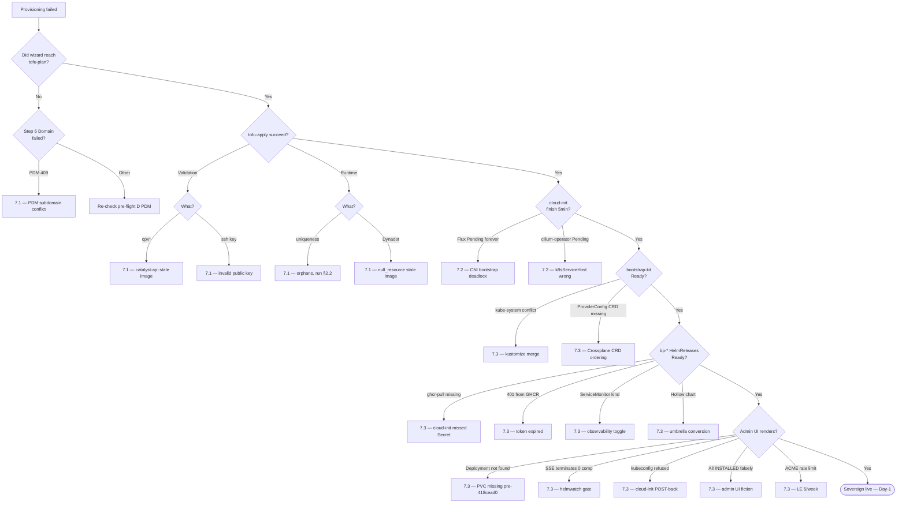

# Runbooks

> **What this is:** operator how-tos for OpenOva. Provisioning, chart bumps, Blueprint authoring, failover recovery, troubleshooting.
> **Authority:** PERMANENT canon. Reviewed PRs only.
> **Updated:** 2026-05-20.
> **Pointers:** see [`DOD.md`](DOD.md) for fresh-prov verification, [`ARCHITECTURE.md`](ARCHITECTURE.md) for system shape, [`PRINCIPLES.md`](PRINCIPLES.md) for what NOT to do.

This file consolidates five prior runbook documents (`BLUEPRINT-AUTHORING.md`, `CHART-AUTHORING.md`, `DEMO-RUNBOOK.md`, `RUNBOOK-OPERATIONS.md`, `RUNBOOK-PROVISIONING.md`) per the lean-doc strategy. Section anchors are stable; older docs are deleted by the orchestrator after this lands.

---

## Table of contents

- [§1 — Fresh provisioning](#1--fresh-provisioning)
- [§2 — Day-2 operations](#2--day-2-operations)
- [§3 — Blueprint authoring](#3--blueprint-authoring)
- [§4 — Chart-level conventions](#4--chart-level-conventions)
- [§5 — Demo / operator walks](#5--demo--operator-walks)
- [§6 — Failover recovery](#6--failover-recovery)
- [§7 — Troubleshooting matrix](#7--troubleshooting-matrix)
- [§8 — Bring up a Sovereign (full provisioning procedure)](#8--bring-up-a-sovereign-full-provisioning-procedure)
- [§9 — Doc-integrity audit cadence](#9--doc-integrity-audit-cadence)

---

## §1 — Fresh provisioning

Operator-level procedure for provisioning a new Sovereign end-to-end via the wizard at `console.<sovereign-fqdn>/sovereign`. Read with [`ARCHITECTURE.md`](ARCHITECTURE.md) (the architectural contract).

### 1.1 What you get

A new **Sovereign** — a self-sufficient deployed Catalyst — provisioned on Hetzner from Catalyst-Zero. At the end:

- k3s cluster on Hetzner Cloud servers in your chosen region
- Cilium CNI + Gateway API ingress, Flux GitOps reconciler, Crossplane day-2 IaC
- 11-component bootstrap kit reconciling cleanly: cilium → cert-manager → flux → crossplane → sealed-secrets → nats-jetstream → openbao → keycloak → gitea → powerdns → bp-catalyst-platform
  - (bp-spire was removed by founder PR [#665](https://github.com/openova-io/openova/pull/665); canonical workload identity is now Cilium WireGuard + K8s SA TokenReview. `platform/spire/` retained as opt-in; re-introduction roadmap TBD-V29 [#2055](https://github.com/openova-io/openova/issues/2055).)
- Reachable URLs: `console.<sovereign-fqdn>`, `gitea.<sovereign-fqdn>`, `harbor.<sovereign-fqdn>` (TLS via cert-manager + Let's Encrypt)
- Initial sovereign-admin in Keycloak's `catalyst-admin` realm
- catalyst-provisioner has zero ongoing connection to the new Sovereign — Phase 1 hand-off complete

### 1.2 Pre-flight checklist

Walk these top to bottom. The wizard fails fast on missing prerequisites, but most are not visible to the wizard.

**A. Hetzner Cloud project + API token**

| Item | Required | Where |
|---|---|---|
| Hetzner Cloud project | Yes — separate project per Sovereign | https://console.hetzner.cloud → Projects |
| API token | Read **and** Write | Project → Security → API Tokens → New Token |
| Token storage | 1Password vault `OpenOva — Production`, item `Catalyst — Hetzner Cloud token (<sovereign-fqdn>)` | Tag `rotation:per-sovereign` |
| Rotation policy | Rotate on leak, on decommission, or every 12 months | See [`SECURITY.md`](SECURITY.md) §11 (Secret rotation) |
The token is sent once through the wizard, used by `catalyst-api` for the OpenTofu run, then redacted from the persisted deployment record. It is **not** copied to the Sovereign cluster.

**B. SSH public key**

Generate fresh if you don't already have a sovereign-admin keypair:

```bash
ssh-keygen -t ed25519 -C "sovereign-admin@<your-org>" -f ~/.ssh/sovereign_admin -N ""
```

Paste the **PUBLIC** half (`*.pub`) — a single unbroken line starting `ssh-ed25519 AAAA...`.

**C. Pool subdomain reserved**

The OpenOva pool zones are `omani.works`, `omani.homes`, `omani.rest`, `omani.trade`, `omantel.biz`. Pick one and pick a subdomain (e.g. `t42`). PDM `/v1/reserve` checks availability; on commit it (a) creates the per-Sovereign PowerDNS zone, (b) writes the canonical 6-record set, (c) updates the parent-zone NS delegation via the Dynadot registrar adapter.

**Forbidden test domains** (per [`DOD.md`](DOD.md)): `openova.io`, `omantel.openova.io`, `Nova Cloud`, `eventforge.io`.

**D. DNS pool registered + Dynadot credentials**

| Item | Required | Where |
|---|---|---|
| K8s Secret `dynadot-api-credentials` | Namespace `openova-system`, keys `api-key`, `api-secret`, `domain` | `kubectl -n openova-system get secret dynadot-api-credentials` |
| PDM running | `kubectl -n openova-system get deploy pool-domain-manager` shows `1/1 READY` | — |
| PDM healthy | `kubectl -n openova-system exec deploy/pool-domain-manager -- wget -q -O - http://localhost:8080/healthz` returns `{"status":"ok"}` | — |

**E. GHCR pull token**

Cloud-init creates `flux-system/ghcr-pull` Secret on the Sovereign cluster from the catalyst-api Pod's `CATALYST_GHCR_PULL_TOKEN` env var (sourced from K8s Secret `catalyst-ghcr-pull-token`).

| Item | Required | Where |
|---|---|---|
| Token type | Fine-grained personal access token, scope `packages:read` on org `openova-io` | https://github.com/settings/tokens?type=beta |
| K8s Secret | `catalyst/catalyst-ghcr-pull-token`, key `token` | `kubectl -n catalyst get secret catalyst-ghcr-pull-token` |
| Rotation policy | Yearly | See [`SECURITY.md`](SECURITY.md) §11 (Secret rotation) |
**F. PowerDNS pool zones bootstrapped**

```bash
kubectl -n openova-system exec deploy/powerdns -- \
  pdnsutil list-all-zones 2>/dev/null | grep -E '^(omani\.(works|homes|rest|trade)|omantel\.biz)$'
```

If any line is missing, see [`PLATFORM-POWERDNS.md`](PLATFORM-POWERDNS.md) §"Pool zone bootstrap".

**G. bp-* charts published at target version**

Confirm the bootstrap-kit OCI artifacts exist before provisioning (target version is published in `clusters/_template/bootstrap-kit/*.yaml`).

**H. subchart-guard CI green**

```bash
gh run list --workflow=blueprint-release.yaml --limit 5 \
  --json conclusion,headBranch,event --repo openova-io/openova
```

Every recent run on `main` must show `"conclusion": "success"`. If any fails, do not provision; fix CI first.

### 1.3 The 7-step wizard

The wizard's canonical step order (from `STEPS` in `products/catalyst/bootstrap/ui/src/pages/wizard/WizardPage.tsx`): **Org → Topology → Provider → Credentials → Components → Domain → Review**.

| Step | What it captures | Notes |
|---|---|---|
| 1. Organisation | Org profile: name, industry, size, HQ, compliance frame | No email or domain here — captured at Step 6 |
| 2. Topology | Regions, building blocks, HA toggle, CP + worker SKU, worker count | Per #176 SKU pickers driven by `PROVIDER_NODE_SIZES[provider]` |
| 3. Provider | Hetzner (today); AWS / GCP / Azure / OCI / Huawei design-only | |
| 4. Credentials | Provider API token + project ID, SSH public key | Validated read-only via `POST /api/v1/credentials/validate`; token redacted from SSE stream |
| 5. Components | Single flat marketplace card grid (#162) with family chips + search + product-family chip filter | Per #175 dependency-aware cascades pull transitive deps automatically (Specter → BGE/Milvus/LangFuse/vLLM/KServe; Harbor → cnpg/seaweedfs/valkey) |
| 6. Domain | Pool subdomain OR BYO (manual NS / registrar API) + sovereign-admin email | Pool = PDM `/v1/reserve`. BYO byo-api = registrar token (Cloudflare/Namecheap/GoDaddy/OVH/Dynadot, #170) |
| 7. Review | Show every captured value, **Provision** button | Click → catalyst-api accepts the request and starts streaming |

**Multi-region topology:** canonical = N regions × 1 cpx52 per region, each node = CP AND worker (untainted), workerCount=0 in body. 3 regions = 3 servers, NOT 9.

### 1.4 Phase timeline

```mermaid
flowchart LR
  subgraph PROV["catalyst-provisioner (mothership)"]
    W["Wizard / SSE\nUI captures input"] --> A["catalyst-api\n/v1/deployments"]
    A --> P0["Phase 0 — OpenTofu\nnetwork+firewall+ssh-key\n+server+LB\n(30–60s plan, 60–120s apply)"]
    P0 --> PDM["PDM /v1/commit\nwrites Sovereign DNS\n(~5s)"]
  end
  subgraph CI["Cloud-init on control-plane (3–5min)"]
    CI1["k3s install\n+ Cilium helm install\n(CNI bootstrap)"] --> CI2["Flux v2.4.0 install"]
    CI2 --> CI3["create flux-system/ghcr-pull\nfrom CATALYST_GHCR_PULL_TOKEN"]
    CI3 --> CI4["apply GitRepository\n+ 2 Kustomizations\n(bootstrap-kit + infra-config)"]
  end
  subgraph SOV["Sovereign cluster (Flux-owned)"]
    F1["bootstrap-kit Kustomization\ninstalls 10 bp-* in dep order\n(10–15min)"] --> F2["bp-catalyst-platform\numbrella reconciles\n(~2min)"]
    F2 --> F3["cert-manager issues wildcard\n+ Cilium Gateway online\n+ console URL responds\n(1–2min)"]
  end
  PDM --> CI1
  CI4 --> F1
```



Total wall-clock: **15–25 minutes** for a solo Sovereign (1 cpx52, 0 workers); 25–45 minutes with HA.

**Ownership boundaries are load-bearing:**

- **catalyst-provisioner** runs in the `catalyst` namespace on Catalyst-Zero (the mothership). It does the OpenTofu run, hands the cloud-init template to the new server, calls PDM, then disconnects.
- **Cloud-init on the new control-plane** is the only one-shot bridge. Installs k3s, Cilium, Flux, GHCR pull secret, then commits the cluster to GitOps mode.
- **Sovereign cluster** owns its outcome from then on. Flux pulls bp-* charts from the public OpenOva monorepo and reconciles steady-state. The provisioner has no privileged access after hand-off.

### 1.5 Phase-by-phase walkthrough

**Phase 0 — OpenTofu (30–60s plan, 60–120s apply)**

What gets created in Hetzner Cloud:

| Resource | Hetzner kind | Name pattern |
|---|---|---|
| Network | `hcloud_network` | `catalyst-${slug}-network` |
| Firewall | `hcloud_firewall` | `catalyst-${slug}-fw` |
| SSH key | `hcloud_ssh_key` | `catalyst-${slug}-ssh` |
| Control-plane | `hcloud_server` | `catalyst-${slug}-cp-1` |
| Workers (`worker_count`) | `hcloud_server` | `catalyst-${slug}-worker-N` |
| Load balancer | `hcloud_load_balancer` | `catalyst-${slug}-lb` |

Where `${slug} = replace(sovereign_fqdn, ".", "-")`. **Names are deterministic** — that is the basis for idempotent re-runs.

**PDM /commit writes Sovereign DNS (~5s)**

PDM (#163, #167, #168, #170):

1. Creates the per-Sovereign authoritative zone `<sovereign-fqdn>.` on bp-powerdns (CNPG-backed `pdns-pg`, DNSSEC-signed ECDSAP256SHA256, lua-records enabled)
2. Writes the canonical 6-record set: `@`, `*`, `console`, `api`, `gitea`, `harbor` — all A records pointing at the LB IP
3. For pool Sovereigns: writes parent-zone NS delegation into Dynadot via the registrar adapter
4. For `byo-api`: flips NS at the customer's registrar
5. For `byo-manual`: emits OpenOva NS list in the wizard

**Cloud-init (3–5 min)** — strict order:

1. `apt-get update` + install curl ca-certificates
2. `curl -sfL https://get.k3s.io | INSTALL_K3S_VERSION=v1.31.4+k3s1 sh -s - server --flannel-backend=none --disable-network-policy --disable=traefik --disable=servicelb --disable=local-storage --tls-san=<sovereign-fqdn>`
3. `helm install cilium ... --set k8sServiceHost=127.0.0.1 ...` — Cilium **before** Flux to break the CNI bootstrap deadlock
4. `flux install` — Flux v2.4.0 core
5. `kubectl create secret generic ghcr-pull -n flux-system --from-literal=token="$CATALYST_GHCR_PULL_TOKEN"` — durable so private bp-* charts pull cleanly
6. Apply the GitRepository pointing at `clusters/<sovereign-fqdn>/` in the public OpenOva monorepo
7. Apply two Kustomizations split for CRD ordering:
   - `bootstrap-kit` — installs the 10 platform charts
   - `infrastructure-config` — applies Crossplane Compositions + ProviderConfigs (depends-on bootstrap-kit)

**Phase 1 — bootstrap-kit (10–15 min)**

Flux pulls 10 bp-* HelmReleases in dependency order:

```
cilium → cert-manager → flux → crossplane → sealed-secrets
                            ↓
nats-jetstream → openbao → keycloak → gitea → powerdns
```

Then `bp-catalyst-platform` (umbrella) reconciles.

**cert-manager + Cilium Gateway + console URL (1–2 min)**

Once `bp-cert-manager` is `Ready=True` and the wildcard `*.<sovereign-fqdn>` DNS has propagated, cert-manager issues a wildcard cert via DNS-01 (against PowerDNS). The Cilium Gateway picks it up; `https://console.<sovereign-fqdn>` returns 200.

### 1.6 Re-runs and idempotency

`tofu apply` on an existing state is idempotent: rerunning the wizard with the **same Sovereign FQDN** updates only what changed. To re-run cloud-init on the control-plane (rare), the cleanest path is via Crossplane Compositions in `clusters/<sovereign-fqdn>/`, NOT direct re-run. Cloud-init runs once per server lifetime by default.

For partial-state recovery, see §2.2 and the `operator-recover-sovereign.sh` script.

### 1.7 Canonical wipe endpoint

**Burned once on t124 (2026-05-16):** `DELETE /api/v1/deployments/{id}` is **record-only** — it does NOT destroy Hetzner resources. Use `POST /api/v1/deployments/{id}/wipe` with hcloud + S3 creds in the body — this is the canonical destructive operation (`tofu destroy` + `hetzner.Purge` + S3 delete).

---

## §2 — Day-2 operations

### 2.1 Decommissioning

```bash
DEPLOYMENT_ID=<the deployment ID from Phase 0>
curl -s -X POST "https://console.<mothership-fqdn>/api/v1/deployments/${DEPLOYMENT_ID}/wipe" \
  -H "Content-Type: application/json" \
  -d '{"hcloud_token":"<token>","s3_credentials":{...}}'
```

After destroy, verify:

```bash
# Hetzner Cloud Console → Servers → empty for the project
# Hetzner Cloud Console → Load balancers → empty for the project
dig +short console.<sovereign-fqdn>
# May resolve until parent-zone NS-delegation TTL expires (~15 min)
```

### 2.2 Recovery script — `scripts/operator-recover-sovereign.sh`

Single-shot return to clean slate. Idempotent.

```bash
# Dry-run (default) — prints what WOULD be done, deletes nothing
./scripts/operator-recover-sovereign.sh <sovereign-fqdn>

# Apply — actually purges Hetzner, releases PDM, cancels deployment record
HETZNER_API_TOKEN=<from-1Password> \
  ./scripts/operator-recover-sovereign.sh <sovereign-fqdn> --apply
```

What it does, in order:

1. **Hetzner Cloud purge.** Lists every resource carrying label `catalyst.openova.io/sovereign=<fqdn>` (servers, LBs, networks, firewalls, volumes, primary IPs, floating IPs) and deletes via Hetzner API. SSH keys are matched by deterministic name slug. After delete, a **verification sweep** re-queries each resource type and re-deletes any that lingered.
2. **PDM allocation release.** Calls `DELETE http://pool-domain-manager.openova-system.svc.cluster.local:8080/api/v1/pool/<pool-zone>/release?sub=<sub>`.
3. **catalyst-api deployment record cancel.** Rewrites `status` to `cancelled` with a recovery event.

**Why safe to re-run:** every Hetzner resource is named `catalyst-${slug}-{role}`. Re-running with the same FQDN recreates exactly the same names → no `uniqueness_error`.

**Hetzner DELETE-but-resource-persists workaround:** the verification sweep at end of Step 1 catches the well-known quirk where `DELETE /v1/<kind>/<id>` returns `204 No Content` but the resource is still present 5–30s later (firewalls right after a server delete are the worst offender). Skipping the sweep caused exactly the `uniqueness_error` this script is meant to prevent.

### 2.3 Hetzner orphan-cleanup discipline

After wipe, enumerate EVERY Hetzner endpoint with full listing, never substring-filter. CCM auto-scaler workers + `primary_ip-<digits>` lack FQDN → name filters miss them. Canonical `hetzner.Purge` also misses them. Always do a full-enumeration verification sweep.

### 2.4 Chart-version collision (parallel fix-authors)

When parallel fix-authors bump the same chart, version collisions are inevitable:

- Check the latest chart version on `origin/main` BEFORE bumping (don't trust the version cited in the dispatch prompt — it may be stale).
- On `git push` rejection: rebase + bump to the next free version + force-push-with-lease.
- **Lockstep bump in the same commit**: chart `Chart.yaml` `version` + `blueprint.yaml` `spec.version` + bootstrap-kit / reconciler pin file. Lockstep CI catches drift.

### 2.5 cert-manager + Let's Encrypt rate limit

If the operator re-provisioned the same FQDN >5 times in 7 days (LE "Duplicate Certificate" limit, 5/week):

1. Switch ClusterIssuer to `letsencrypt-staging` (untrusted cert, works without rate limit). `kubectl edit clusterissuer wildcard-issuer` and change `acme.server`.
2. Browser will warn; acceptable for in-window operator testing.
3. When the limit expires, switch back to `letsencrypt-prod`; Certificate renews automatically.

### 2.6 StorageClass missing (legacy)

**Symptom:** fresh Sovereign reaches `flux-bootstrap`, bootstrap-kit Kustomization stuck `Ready=False` 10+ min, every PVC `Pending` with `no persistent volumes available for this claim and no storage class is set`.

**Root cause:** pre-2026-04-29 cloud-init passed `--disable=local-storage` to the k3s installer.

**Resolution (current code):** cloud-init keeps k3s' built-in `local-path-provisioner` and marks `local-path` as the default StorageClass BEFORE applying the Flux bootstrap manifest.

**Recovery for pre-fix Sovereigns:**

```bash
KUBECONFIG=/path/to/sovereign-kubeconfig
kubectl apply -f https://raw.githubusercontent.com/rancher/local-path-provisioner/v0.0.30/deploy/local-path-storage.yaml
kubectl -n local-path-storage wait --for=condition=Ready pod -l app=local-path-provisioner --timeout=60s
kubectl patch storageclass local-path -p '{"metadata":{"annotations":{"storageclass.kubernetes.io/is-default-class":"true"}}}'
```

Local-path is correct for solo-Sovereign target. Multi-node migration to hcloud-csi is a separate, deliberate operation.

### 2.7 bp-flux double-install — version-pin invariant

**Live incident: omantel.omani.works, 2026-04-29.** Flux controllers deleted by the FIRST reconcile of `bp-flux`. Cluster lost its GitOps engine in-place; only recovery is full reprovision.

**Root cause:** cloud-init's `flux2 v<X.Y.Z>/install.yaml` URL pin and the bp-flux umbrella's `flux2` subchart `appVersion` drifted. Helm tried to update the existing Flux CRDs to a new schema, the apiserver rejected (`storedVersions[0]: Invalid value: "v1"`), Helm rolled back, the rollback **deleted** the existing Flux controller Deployments.

**The invariant:** cloud-init's install.yaml URL version and the bp-flux umbrella `flux2` subchart `appVersion` MUST be the same upstream Flux release. Enforced at:

- `infra/hetzner/cloudinit-control-plane.tftpl` — install.yaml URL pin
- `platform/flux/chart/Chart.yaml` — `flux2` subchart dep
- `platform/flux/chart/values.yaml` — `catalystBlueprint.upstream.version`
- `platform/flux/chart/tests/version-pin-replay.sh` — CI gate; replays the catastrophic precondition

To bump Flux safely: pick the target upstream version, find the matching community chart from `https://fluxcd-community.github.io/helm-charts/index.yaml`, update **all four** pin sites in one PR, bump `Chart.yaml` `version`, update every `clusters/<sovereign-fqdn>/bootstrap-kit/03-flux.yaml`, run the replay test locally, push.

### 2.8 Phase 1 watch shows 0 HelmReleases

**Symptom:** wizard reaches `flux-bootstrap` cleanly, then admin banner warns `Phase 1 watch saw 0 HelmReleases in 15m0s`.

**What it means:** Phase 0 succeeded (cluster up, Flux installed). Phase-1 watcher never saw a bp-* HelmRelease appear within the first-seen window (`CATALYST_PHASE1_FIRST_SEEN_TIMEOUT`, default 15 min). Means Flux on the new Sovereign isn't materialising the bootstrap-kit Kustomization.

**Operator playbook:**

1. Confirm catalyst-api Pod env vars are sane (`CATALYST_PHASE1_*`).
2. On the new Sovereign: `kubectl get gitrepository -n flux-system -o wide` + `describe gitrepository openova-public`. Look for `Conditions[type=Ready].status=True` + recent `lastAppliedRevision`. Common failures: 401/403 (deploy-key missing/wrong scope), 404 (branch/path mismatch), connection refused (DNS/firewall egress).
3. `kubectl get kustomization -n flux-system` + `describe kustomization -n flux-system <sovereign-fqdn>-bootstrap-kit`. The `Message` field names the cause: missing CRD, `dependsOn` unresolved, etc.
4. Inspect source-controller and kustomize-controller logs (`kubectl -n flux-system logs deploy/source-controller --tail=200`).
5. Re-run reconciliation manually: `flux reconcile source git openova-public -n flux-system` + `flux reconcile kustomization <sovereign-fqdn>-bootstrap-kit -n flux-system`.

If overall `CATALYST_PHASE1_WATCH_TIMEOUT` of 60m elapsed, start a fresh wizard run (Hetzner side is idempotent).

### 2.9 Cilium Gateway hostNetwork — world-ingress policy

Cilium's `reserved:ingress` endpoint is not covered by default-deny NotIn-namespace selector → 403 envoy on all public Sovereign hosts.

**Fix:** CCNP scoped to `reserved.ingress` allowing world / cluster / host / remote-node. PR #1482.

### 2.10 ClusterMesh `regionKeyFromSpec` off-by-one

`regionKeyFromSpec idx+1` mismatched tofu `secondary_regions` index → empty kc → silent zero peers → `fullyMeshed=0` with NO warn logs.

**Fix:** added "zero peer entries" Warn for future regressions (PR #1525).

### 2.11 Per-instance verification ledger

Every Sovereign instance carries a `docs/ledger/TRUST.md` ledger of claimed-done items in 4 states:

- UNVERIFIED (default)
- VERIFIED-PASS (screenshot evidence)
- VERIFIED-FAIL
- VERIFIED-PARTIAL

Every new PR against a surface flips it back to UNVERIFIED. Cron-refreshed alongside `docs/ledger/TRACKER.md`.

---

## §3 — Blueprint authoring

How to author a **Blueprint** for Catalyst — the unified unit of installable software (replaces what was previously called "module" + "template"). Defer to [`GLOSSARY.md`](GLOSSARY.md) for terminology and [`ARCHITECTURE.md`](ARCHITECTURE.md) for the broader model.

### 3.1 What a Blueprint is

A Blueprint is:

- A **source location** (one of three Gitea-Org-scoped places, all using identical Blueprint shape):
  - **Public Blueprints**: `platform/<name>/` or `products/<name>/` in `github.com/openova-io/openova` (this repository). Per-Blueprint isolation is provided by CI fan-out — each folder publishes its own signed OCI artifact. Visible to every Sovereign via the `catalog` Gitea Org mirror.
  - **Sovereign-curated private Blueprints**: a Gitea Repo under the `catalog-sovereign` Gitea Org on a Sovereign. Authored by the Sovereign owner, visible to every Catalyst Organization on that Sovereign without being public upstream.
  - **Org-private Blueprints**: a directory inside `gitea.<location-code>.<sovereign-domain>/<org>/shared-blueprints/bp-<name>/`. Visible only within that Org.
- A **CRD manifest** (`blueprint.yaml`) declaring its identity, configSchema, placementSchema, dependencies, manifest pointers
- A **set of manifests** (Helm chart, Kustomize base + overlays, or raw YAML) applied when the Blueprint is installed as an Application
- A **set of Crossplane Compositions** (optional) for any non-Kubernetes resources
- A **CI pipeline** that signs the artifact (cosign), generates SBOM (Syft), publishes to `ghcr.io/openova-io/bp-<name>:<semver>`

One Blueprint = one card in the marketplace (when `visibility: listed`).

### 3.2 Folder layout

```
platform/<name>/                 ← OR products/<name>/ for composite Blueprints
├── blueprint.yaml               ← the Blueprint CRD manifest
├── README.md
├── chart/                       ← Helm chart (preferred)
│   ├── Chart.yaml
│   ├── values.yaml
│   └── templates/
│   OR
├── manifests/                   ← Kustomize base + overlays
├── compositions/                ← (optional) Crossplane Compositions
├── card/                        ← marketplace presentation
└── tests/                       ← acceptance tests
```

CI workflow lives once at the monorepo root (`.github/workflows/blueprint-release.yaml`) with path-based matrix builds.

### 3.3 Blueprint CRD

Annotated example for `bp-wordpress`:

```yaml
apiVersion: catalyst.openova.io/v1alpha1
kind: Blueprint
metadata:
  name: bp-wordpress
  version: 1.3.0
spec:
  card:
    title: WordPress
    tagline: Self-hosted CMS
    category: cms
    icon: ./card/icon.svg
  visibility: listed                   # listed | unlisted | private
  owner:
    team: apps
    contact: apps@openova.io
  configSchema:                        # JSON Schema; drives console form
    type: object
    required: [domain, adminEmail]
    properties:
      domain: { type: string, format: hostname }
      adminEmail: { type: string, format: email }
      replicas: { type: integer, default: 2, minimum: 1, maximum: 20 }
  placementSchema:
    modes: [single-region, active-active, active-hotstandby]
    minRegions: 1
    maxRegions: 5
  depends:
    - blueprint: bp-postgres
      version: ^1.4
      alias: db
      when: "{{ .config.postgres.mode == 'embedded' }}"
  manifests:
    source:
      kind: HelmChart
      ref: oci://ghcr.io/openova-io/bp-wordpress:1.3.0
  upgrades:
    from: [ 1.2.x, 1.1.x ]
    blocks: [ 1.0.x ]
  rotation:
    - kind: oauth-client-secret
      name: wp-keycloak-client
      ttl: 90d
  observability:
    metrics: prometheus
    logs: stdout
    traces: otlp
```

### 3.4 configSchema design

The console form is generated from `configSchema` — never hand-written. JSON Schema features supported: `type`, `format`, `default`, `enum`, `minimum`, `maximum`, `oneOf`/`anyOf`, `dependencies`, and `x-catalyst-ui-hint` for non-trivial widgets (`password`, `domain-picker`, `application-ref`).

### 3.5 Dependencies

Hard, conditional, and reference dependencies all supported. Catalyst installs hard deps automatically; conditional deps are skipped if the predicate is false; reference deps resolve to a sibling Application in the same Environment.

### 3.6 Placement and multi-region

`placementSchema.modes`: `single-region` (trivial), `active-active` (stateless trivial, stateful declares replication strategy), `active-hotstandby` (CNPG WAL streaming, SeaweedFS bucket replication, Valkey REPLICAOF).

### 3.7 Manifests source types

| `manifests.source.kind` | When to use |
|---|---|
| `HelmChart` | Most third-party apps with existing Helm charts |
| `Kustomize` | Small custom apps; full patch control |
| `OAM` | (Future, not yet supported) |

### 3.8 Umbrella shape (HARD contract — CI-enforced)

**Every Blueprint chart at `platform/<name>/chart/` (and `products/<name>/chart/`) MUST be an *umbrella chart*: it MUST declare its upstream chart(s) under `dependencies:` in `Chart.yaml` so `helm dependency build` pulls the upstream payload into the published OCI artifact.**

Hollow charts — wrappers that carry only Catalyst overlay templates without an upstream subchart dependency — are **forbidden**. CI rejects them.

**Why this rule exists:** earlier this cycle, `bp-cert-manager:1.0.0` shipped as a hollow chart — only a `ClusterIssuer` template, no upstream `cert-manager` subchart bytes. Flux installed it on every Sovereign. Phase 1 broke on every Sovereign because cert-manager itself was never deployed. The artifact looked legitimate (right name, right version, signed, SBOM-attested) but the upstream payload was simply not there.

#### Dual-annotation requirement (PR #2087 + #2093)

Two pre-merge guards run on every chart change. **BOTH are mandatory.**

| Guard | Workflow | Rule | Why |
|---|---|---|---|
| **GUARD 1 — no-upstream** (pre-merge, PR [#2087](https://github.com/openova-io/openova/pull/2087)) | `.github/workflows/check-chart-annotations.yaml` → `scripts/check-chart-annotations.sh` | Every changed `chart/Chart.yaml` MUST EITHER declare a non-empty `dependencies:` block OR carry annotation `catalyst.openova.io/no-upstream: "true"` | Catches hollow shape **before the chart version is dead-reserved by a failed publish**. Pre-2026-05-20 each recurrence needed a follow-up version-bump PR. |
| **GUARD 2 — smoke-render** (pre-merge, PR [#2093](https://github.com/openova-io/openova/pull/2093)) | Same workflow | `helm template` with default values must produce ≥5 lines OR chart must carry `catalyst.openova.io/smoke-render-mode: "default-off"` | Catches charts that render empty at defaults (`enabled.default: false` master gate) without opt-out annotation. |

**Charts with `enabled.default: false` MUST carry BOTH annotations.**

> **Real incident — bp-network-policies:1.0.1 (2026-05-20):** chart had `no-upstream: true` (GUARD 1 satisfied) but was MISSING `smoke-render-mode: default-off`. Smoke-render check at publish time tripped and **dead-reserved version 1.0.1** — a follow-up PR was needed to bump to 1.0.2 with the second annotation. PR #2093 elevated the smoke-render check to pre-merge so this can never recur silently. PRs #2090 + #2091 added the dual annotations.

The four post-merge guards remain as belt-and-braces structural verification at publish time:

| When | Guard | Failure mode caught |
|---|---|---|
| After `helm dependency build` | Working-tree `chart/charts/<dep>-<ver>.tgz` exists for every `dependencies:` entry | Missing/wrong repo URL, silently-skipped dep |
| After `helm package` | `tar -tzf` listing contains `<chart_name>/charts/<dep>-<ver>.tgz` | `.helmignore` mishap, packaging-time stripping |
| After `helm push` | `helm pull` round-trips the artifact; pulled `.tgz` listing again contains every declared subchart | Registry-side path mangling, OCI manifest rewriting |
| Always | `helm template` smoke render produces non-trivial output OR `smoke-render-mode: default-off`; rendered manifests uploaded as workflow artifact | Render-broken templates, schema violations |

**Any single guard failing fails the whole publish job.** A hollow Blueprint can never reach a Sovereign through the sanctioned CI path.

#### Authoring rule

Every umbrella `Chart.yaml` declares the upstream chart(s) it wraps:

```yaml
# platform/cilium/chart/Chart.yaml
apiVersion: v2
name: bp-cilium
version: 1.1.0
type: application

dependencies:
  - name: cilium
    version: "1.16.5"
    repository: "https://helm.cilium.io"
```

The version pinned in `dependencies:` MUST match the version recorded in `platform/<name>/blueprint.yaml` and the `catalystBlueprint.upstream.version` field in `values.yaml` — all three together via PR + Blueprint release.

#### Verifying an existing artifact

```bash
helm pull oci://ghcr.io/openova-io/bp-cilium --version 1.1.0
tar -tzf bp-cilium-1.1.0.tgz | grep '^bp-cilium/charts/cilium/' | head
```

A non-empty result proves the upstream subchart is inside the OCI artifact.

### 3.9 Observability toggles must default false (HARD contract — CI-enforced)

**Every observability toggle in a Blueprint's `chart/values.yaml` — `serviceMonitor.enabled`, `metrics.enabled`, `prometheusRule.enabled`, `monitoring.enabled`, `tracing.enabled`, `prometheus.enabled` and analogues — MUST default to `false`.**

The CRDs that back `ServiceMonitor` / `PrometheusRule` (`monitoring.coreos.com/v1`) ship with `kube-prometheus-stack`. If `bp-cilium` defaults `cilium.prometheus.serviceMonitor.enabled: true`, Helm renders a ServiceMonitor the apiserver immediately rejects:

```
no matches for kind "ServiceMonitor" in version "monitoring.coreos.com/v1"
— ensure CRDs are installed first
```

Result: bp-cilium's HelmRelease enters InstallFailed, every downstream bp-* HelmRelease (`dependsOn: bp-cilium`) reports `dep is not ready`, the whole Sovereign bootstrap stalls. Verified failure on `omantel.omani.works` 2026-04-29 (issue #182).

**Canonical pattern:**

```yaml
# platform/cilium/chart/values.yaml — DEFAULT OFF
cilium:
  prometheus:
    enabled: false
    serviceMonitor:
      enabled: false
```

```yaml
# clusters/<sovereign>/bootstrap-kit/01-cilium.yaml — OPERATOR OPT-IN
spec:
  values:
    cilium:
      prometheus:
        enabled: true
        serviceMonitor:
          enabled: true
```

CI runs `tests/observability-toggle.sh` (when present under `platform/<name>/chart/tests/`) on every publish. The script asserts default-render produces zero `monitoring.coreos.com/v1` references, opt-in render succeeds AND produces a ServiceMonitor, explicit-off render succeeds AND produces zero references.

### 3.10 Visibility

| Value | Where it appears | Who can install it |
|---|---|---|
| `listed` | Public marketplace card grid | Everyone in the Sovereign |
| `unlisted` | Not on cards; reachable by direct URL or search | Anyone who knows the name |
| `private` | Visible only within the Org that owns the Blueprint repo | Only that Org's users |

### 3.11 Versioning

- Semver (`MAJOR.MINOR.PATCH`).
- Each release publishes a signed OCI artifact at `ghcr.io/openova-io/bp-<name>:<version>` (`bp-` prefix added to make it self-identifying as a Catalyst Blueprint).
- The Blueprint declares which prior versions are upgrade-compatible (`upgrades.from`).
- Customers pin to a version in their Application's `kustomization.yaml`. Upgrades are explicit (one-click console, or `git push` editing the version pin).

### 3.12 Hard rules for Blueprint authors

| Rule | Why |
|---|---|
| All container images cosigned | Supply-chain security; Kyverno admission policy denies unsigned. |
| All artifacts SBOMed | Compliance (EU CRA, NIS2). |
| No plaintext secrets; use ExternalSecret references | See [`SECURITY.md`](SECURITY.md). |
| Workload identity via K8s SA TokenReview + Cilium WireGuard | SPIFFE/SPIRE dropped from bootstrap-kit by PR #665; opt-in for cross-Sovereign federation. See [`SECURITY.md`](SECURITY.md) §2. |
| Health endpoints standardized: `/healthz` (liveness) + `/readyz` (readiness) | Catalyst observability assumes them. |
| Metrics on `/metrics` (Prometheus exposition) | Catalyst Grafana stack scrapes them. |
| Logs to stdout, structured JSON | Loki ingests them. |
| Traces via OTel | Tempo ingests them. |
| `app.kubernetes.io/*` labels set on every resource | Required for Catalyst projector to track. |
| Acceptance tests in `tests/` | CI runs them on every PR. |
| Upgrade tests against previous version | Required to declare upgrade compatibility. |

---

## §4 — Chart-level conventions

Sharp edges in the chart-authoring workflow that have already cost real outages. Read it before declaring "done" on any chart that mutates a long-lived resource.

### 4.1 Strategy flips on existing Deployments

**What goes wrong:** chart declares `Deployment.spec.strategy.type: Recreate`. The cluster already runs a Deployment of the same name created earlier with default `RollingUpdate` (so `spec.strategy.rollingUpdate.maxSurge=25%` and `maxUnavailable=25%` exist on the live object). Flux SSA submits the new manifest with the `kustomize-controller` field manager. The API server merges, then validates. Validation rejects:

```
Deployment.apps "<name>" is invalid:
  spec.strategy.rollingUpdate: Forbidden:
    may not be specified when strategy `type` is 'Recreate'
```

The Flux Kustomization parks at `Ready=False` on every reconcile until operator intervention.

**Why SSA does this:** SSA's contract is "set the fields you declare." It does NOT remove fields owned by other field managers. The pre-existing Deployment was created via `kubectl apply` (CSA), so `kubectl-client-side-apply` owns `.spec.strategy.rollingUpdate.*`. When kustomize-controller flips `.spec.strategy.type` to `Recreate`, those rolling-update fields stay on the object.

**Why `$patch: replace` is NOT the answer:**

1. API strict-decoding rejects it on CREATE: `strict decoding error: unknown field "spec.strategy.$patch"` — breaks fresh installs.
2. Flux SSA rejects it: `field not declared in schema`.
3. It is a runtime directive, not a chart field.

**The canonical fix** — annotate the Deployment with the Flux force annotation:

```yaml
apiVersion: apps/v1
kind: Deployment
metadata:
  name: catalyst-api
  annotations:
    kustomize.toolkit.fluxcd.io/force: enabled
spec:
  strategy:
    type: Recreate
```

When kustomize-controller's SSA dry-run fails with Invalid, the controller falls back to delete-and-recreate the SINGLE annotated resource. The recreated Deployment has no residual `rollingUpdate.*` fields.

**When you may use this annotation:** only on resources that (a) already declare `strategy.type: Recreate`, OR (b) carry no client traffic, OR (c) are explicitly designed to lose in-process state on every roll. **NEVER add to a `RollingUpdate` resource serving live traffic.**

**Reference incident:** 2026-04-29 — contabo-mkt cluster — `catalyst/catalyst-api`. Kustomization stuck Ready=False for hours. Fix: `kustomize.toolkit.fluxcd.io/force: enabled` on `products/catalyst/chart/templates/api-deployment.yaml`.

### 4.2 Other chart fields that collide on apply

Same fix applies to each — annotate with `kustomize.toolkit.fluxcd.io/force: enabled`, let Flux recover via delete-and-recreate when SSA dry-run fails.

| Resource kind | Field that triggers an Invalid merge | Notes |
|---|---|---|
| `Deployment` | `spec.strategy.type` Recreate ↔ RollingUpdate | §4.1 |
| `Deployment` | `spec.selector.matchLabels` change | Selector is immutable post-create. Must recreate. |
| `Service` | `spec.clusterIP` (None ↔ value) | Immutable. Must recreate. |
| `Service` | `spec.type` ClusterIP ↔ NodePort ↔ LoadBalancer | Some transitions invalid. |
| `PersistentVolumeClaim` | `spec.accessModes` change after binding | Immutable post-bind. Recreate would lose data — **DO NOT add force annotation**; provision a new PVC under a new name and migrate. |
| `StatefulSet` | `spec.serviceName`, `spec.selector` | Immutable. Must recreate (loses pod identity). Plan migrations carefully. |
| `Job` | `spec.template.*` after create | Immutable. Recreation is the only path. |

**For PVCs and StatefulSets:** NEVER add the Flux force annotation as a default. Data loss is the failure mode.

### 4.3 Authoring discipline checklist

Before declaring "done" on any chart that touches a long-lived resource:

1. Run the chart's manifest through `kubectl apply --dry-run=server` against an EMPTY namespace. Must succeed (no `$patch:` in spec).
2. If the resource type appears in §4.2, ALSO run against a namespace where a PRIOR shape exists. Must succeed; if it fails, add the Flux force annotation AND the integration test.
3. Verify `kustomization.yaml` references all template files.
4. If the resource carries client traffic, document the recreate blast radius in the chart's leading comment.

### 4.4 Service-name-mismatch in env-var defaults

When default URL is `http://svc.ns.svc...` but the real Service is `svc-bp-svc.ns.svc...`:

**Fix:** `helm template` and grep the real Service name. Wire env-var default off the rendered output, not the assumed shape.

---

## §5 — Demo / operator walks

The canonical deterministic 2-phase walk operator follows. Driven by [`DOD.md`](DOD.md). The operator-facing companion to `tests/dod/dod_test.go` (the Go test that drives the same flow non-interactively when `HETZNER_TEST_TOKEN` is populated).

### 5.1 Pre-flight

| Item | Notes |
|---|---|
| **Hetzner Cloud project** + API token (Read+Write) + project ID | ~€31/mo at hourly billing, ~€0.05/h while up |
| **SSH public key** | Generate fresh if needed: `ssh-keygen -t ed25519 -C "sovereign-admin@<sov>" -f ~/.ssh/<sov>_sovereign_admin` |
| **Pool subdomain reserved** | Pick `t<NN>` under `omani.works` (or `omantel.biz` if LE-rate-limited). PDM checks availability, on commit creates per-Sovereign zone + parent-zone NS delegation |
| **Catalyst-Zero (mothership) login** | Confirm before running. Mothership is the OpenOva-run Catalyst-Zero |
| **kubectl context to mothership** | For pre-flight verification only |

### 5.2 The walk — Phase 0 + Phase 1 deterministic test

Per [`DOD.md`](DOD.md), every walk must move at least one of the 5 inseparable pillars:

1. Marketplace + voucher onboarding (Phase 0 + Phase 1 a–c)
2. Multi-region BCP topology choice at signup (Phase 1 b)
3. Two independent CNPG clusters + region-kill failover (Phase 1 b + orthogonal D31)
4. Sandbox + auto-mounted `openova-sandbox-mcp` with full org knowledge (Phase 2 a–e)
5. Sovereign independence post-`bp-self-sovereign-cutover` (Principle #11 + ADR-0002)

**Phase 0 — voucher issuance + redeem preview (mothership BSS):**

1. **Sovereign-admin issues voucher** — navigate to `https://console.<sovereign-fqdn>/bss` (the BSS menu lives inside the operator console — NOT the legacy `admin.<sovereign-fqdn>` URL which has been dead since the BSS migration). Sign in with sovereign-admin credentials. **Billing → Vouchers → New Voucher**:

   | Field | Value |
   |---|---|
   | Code | e.g. `T42-DEMO-100` |
   | Credit (OMR) | `100` |
   | Description | `DoD demo voucher` |
   | Active | `true` |
   | Max redemptions | `1` |

   Click **Save**. The UI POSTs to `POST /billing/vouchers/issue`.

2. **Redeem preview** — open `https://marketplace.t<NN>.omani.works/redeem/?code=T42-DEMO-100` in a fresh browser session. The unauthenticated page POSTs to `/api/billing/vouchers/redeem-preview` and renders the credit metadata. **Sign up to redeem** routes to `/plans` with the code stashed in localStorage.

**Phase 1 — tenant signup + Org creation + first App (tenant-facing):**

1. Tenant signs up via email/magic-link or Google OAuth
2. Catalyst auto-creates an Organization (default slug `<orgslug>.omani.homes` per [`DOD.md`](DOD.md))
3. Voucher applied at first checkout via `POST /billing/checkout` with `promo_code` — atomic insert into `promo_redemptions`, increment of `times_redeemed`, positive entry in `credit_ledger`
4. Tenant lands in marketplace — credit balance shown in top-right wallet
5. Tenant creates an Environment (e.g. `production`)
6. Tenant installs first Application (e.g. `bp-wordpress`). The App install consumes from credit_ledger; remaining balance shown
7. Tenant reaches the App URL (e.g. `https://<orgslug>-production-wordpress.omani.homes`)

**Phase 2 — Sandbox + MCP (Pillar 4):**

`openova-sandbox-mcp` auto-mounts. Agent is `claude-code` with full Org knowledge. Operator verifies via XHR + screenshot.

### 5.3 Verification

Verify voucher consumption:

```bash
TOKEN=<sovereign-admin JWT>
curl -s -H "Authorization: Bearer $TOKEN" \
  "https://api.t<NN>.omani.works/billing/vouchers/list" \
  | jq '.[] | select(.code=="T42-DEMO-100")'
# Expected: { "times_redeemed":1, "max_redemptions":1, ... }
```

Verify App reachable:

```bash
curl -sI "https://<orgslug>-production-wordpress.omani.homes"
# Expected: HTTP/2 200 (or 302 to login), Let's Encrypt subject CN matching FQDN
```

### 5.4 Final step — append VALIDATION-LOG entry

```bash
cd /home/openova/repos/openova
git checkout main && git pull origin main

cat >> docs/archive/validation-log.md <<'EOF'

## Pass NNN (YYYY-MM-DD) — DoD MET — t<NN>.omani.works

**Operator:** <name>
**Sovereign FQDN:** t<NN>.omani.works
**Hetzner region:** fsn1
**Total wall-clock:** ~MM minutes
**Voucher exercised:** T<NN>-DEMO-100 (100 OMR, 1/1 redeemed)
**App installed:** bp-wordpress at <orgslug>-production-wordpress.omani.homes

DoD Met:
- [x] Wizard provisioned t<NN>.omani.works in ~12 min
- [x] DNS authoritative on per-Sovereign PowerDNS zone
- [x] TLS auto-issued via cert-manager + Let's Encrypt
- [x] sovereign-admin logged into console.t<NN>.omani.works
- [x] Voucher issued via /bss
- [x] Tenant redeemed at marketplace.t<NN>.omani.works/redeem/?code=...
- [x] Tenant created Org + Env, installed first App, App URL reached HTTP/2 200
EOF

git add docs/archive/validation-log.md
git -c user.name="hatiyildiz" -c user.email="269457768+hatiyildiz@users.noreply.github.com" \
  commit -m "docs(validation-log): DoD MET — t<NN>.omani.works"
git push origin main
```

(Per `~/.claude/CLAUDE.md`: **NEVER close issues** — only the user closes after verification. Use `Refs #N` in PR bodies, not `Closes #N`, except for pure CI-gate / docs-only PRs.)

---

## §6 — Failover recovery

For multi-region active-hotstandby Sovereigns and Applications (Pillar 3).

### 6.1 Region-kill canonical test (Pillar 3)

The deterministic failover test for two independent CNPG clusters:

1. Place a write into the primary CNPG cluster (synchronous replication, `remote_apply`, PR #2071)
2. Kill the primary region (Hetzner API: detach LB, drop firewall, terminate CP node)
3. Promote the replica via `Continuum` CR (PR #2072, #2074)
4. Verify the write made it across — zero-tx-loss
5. Reverse: promote original primary back when region recovers

Test harness lives at the D31 acceptance test (PR #2075).

### 6.2 Continuum CR + lease witness

`Continuum` (group `dr.openova.io/v1`) orchestrates switchover with a Cloudflare-KV or DNS-quorum lease witness (anti-split-brain). Schema in `products/catalyst/chart/crds/continuum.yaml`. Controller lives in EPIC-6 (#1101).

Required pattern: lease-based failover with cloud-witness. DMZ data plane over public IPs with WireGuard encryption (never RFC1918 tunnels depending on cloud-provider VPC peering).

### 6.3 cnpg-pair Blueprint (PR #2071)

`bp-cnpg-pair` ships two independent CNPG clusters across two regions over Cilium ClusterMesh, with synchronous replication (`remote_apply`). Cross-region pairing via `ReplicaCluster` over ClusterMesh. CRD: `cnpgpair.dr.openova.io/v1` in `products/catalyst/chart/crds/cnpgpair.yaml`.

Provisioning generalised beyond WP-only by PR #2073 (`feat(provisioning): generalize bp-cnpg-pair install path`).

### 6.4 Inter-region transport

Inter-region = DMZ WireGuard over **PUBLIC IPs** ALWAYS. Cilium ClusterMesh apiserver via LoadBalancer (NEVER NodePort). Provider-mix canonical (different regions can be different providers).

### 6.5 Existing-Sovereign migration

There is no in-place recovery for a cluster whose Flux controllers have been deleted (see §2.7). For zero-tx-loss claims to hold, validate on the topology you claim: never report multi-region pass against a single-region prov.

---

## §7 — Troubleshooting matrix

Common failure modes + first-look diagnostics, condensed from 18 documented incidents. Decision-tree shape: walk top-to-bottom, the first match wins.

### 7.1 Provisioning failures (Phase 0)

| Symptom | Most likely cause | Recovery |
|---|---|---|
| `tofu plan` fails with `Invalid value for variable | The given value "cpx32" is not valid for variable "control_plane_size"` | catalyst-api image predates fix `c6cbfe68` | Deploy newer catalyst-api image; re-run wizard with same FQDN |
| `tofu apply` fails with `hcloud_ssh_key: public_key field is invalid` | Malformed ed25519 key pasted into wizard | Re-generate (`ssh-keygen -t ed25519 ...`), copy single line verbatim, re-run wizard |
| `tofu apply` fails with `name is already used (uniqueness_error)` | Prior `tofu apply` partial, state file lost on Pod restart — orphan Hetzner resources | Run `scripts/operator-recover-sovereign.sh <fqdn> --apply` (see §2.2), then re-run wizard with same FQDN |
| `tofu apply` fails with `dynadot API returned ...` from a `null_resource.dns_pool` | Old catalyst-api build with stale null_resource | Deploy newer catalyst-api image at or after `330211d2` |
| `tofu plan` `403 Forbidden` from hcloud | Token has Read scope only, or expired | Generate Read+Write token; re-run wizard |
| `tofu plan` `quota exceeded` | Hetzner project default limits (typically 10 servers, 1 LB) | Open Hetzner support ticket; re-run when granted |
| `tofu apply` hangs at `Still creating...` >10 min | Hetzner regional capacity transient | Wait 15 min total; if stuck, cancel + re-run in a different region |
| PDM 409 conflict on subdomain check | Another Sovereign holds that subdomain in PDM | Pick a different name OR run §2.2 if leftover from failed run, then re-run with same name |

### 7.2 Cloud-init failures (Phase 0 → Phase 1 bridge)

| Symptom | Most likely cause | Recovery |
|---|---|---|
| Node up but every pod Pending with `0/1 nodes are available: 1 node(s) had untolerated taint` — Flux Kustomizations never go Ready | CNI bootstrap deadlock: cloud-init installed Flux BEFORE Cilium (pre-fix `e571ec7a`) | Deploy newer catalyst-api at or after `54872009`; run §2.2 + re-provision |
| `cilium-operator` Pending or crashlooping with `failed to dial kube-apiserver` | `k8sServiceHost=<sovereign-fqdn>` cannot yet resolve at install time (pre-fix `54872009`) | Same — image must be at or after `54872009` |

### 7.3 Phase 1 failures (Flux + bp-* HelmReleases)

| Symptom | Most likely cause | Recovery |
|---|---|---|
| Flux event: `existing namespace "kube-system" is conflicting with another resource that has the same name` | Bootstrap-kit kustomize merge had `kube-system` Namespace declared twice (pre-fix `2022e1af`) | Fix is in `main`; Flux picks up on next reconcile interval. If pinned to old SHA, edit GitRepository `spec.ref.branch` |
| Flux event: `no matches for kind "ProviderConfig" in version "hetzner.crossplane.io/v1beta1"` | Single Kustomization tried to apply both Crossplane (CRDs) AND Hetzner Compositions (CRs). Fix `34c8de84` split into two Kustomizations | Confirm cloud-init template post-`34c8de84`; re-provision |
| HelmRelease: `failed to get authentication secret 'flux-system/ghcr-pull': secrets "ghcr-pull" not found` | Pre-fix `dddbab4b` cloud-init didn't create durably | Re-provision against current `main`. On a still-up Sovereign: `kubectl -n flux-system create secret generic ghcr-pull --from-literal=token=...` |
| HelmRelease: `failed to authorize: 401 Unauthorized | ghcr.io/openova-io/bp-cilium` | GHCR token expired or wrong scope | Rotate per [`SECURITY.md`](SECURITY.md) §11 (Secret rotation); rotate `flux-system/ghcr-pull` Secret on existing Sovereigns + `flux reconcile source helmrepository` || HelmRelease: `error validating ... no matches for kind "ServiceMonitor" in version "monitoring.coreos.com/v1"` | bp-* chart ships `ServiceMonitor` ON by default; CRD not yet registered. See §3.9 | Edit bp-* HelmRelease values: `observability.enabled: false`; `flux reconcile helmrelease`. Long-term: bp-* chart bumps with default-off (already shipped in current bp-*:1.1.1+) |
| HelmRelease `Ready=True` but no upstream pods — namespace empty except Helm release secret | Hollow umbrella chart — `dependencies` declared but upstream subchart not packaged into `charts/`. Pre-fix `43aff202` | Re-run `blueprint-release` workflow on the chart's tag — 4 guards (build/package/push/pull) will fail loudly. Fix the upstream pin + re-tag. See §3.8 |
| Wizard goes blank or "Deployment not found" after catalyst-api Pod restart | Pre-fix `418cead0` catalyst-api wrote deployments to emptyDir — Pod restart wiped them | Confirm catalyst-api image at or after `418cead0`; PVC mount in HelmRelease values. Orphans may exist — purge per §2.2 |
| SSE stream closes within seconds — admin UI shows zero components | catalyst-api helmwatch loop terminated at 0 HelmReleases (first-seen-gate bug) | Refresh page after Phase 1 30+s in; wizard falls back to REST poll. Long-term: deploy catalyst-api with the gate fix |
| Wizard SSE shows `flux-bootstrap` complete but per-component grid stays empty; catalyst-api logs `failed to load Sovereign kubeconfig: connection refused` | Cloud-init POST-back kubeconfig not implemented (issue #183) | Interim: SSH to CP, replace `127.0.0.1` with LB IP in `/etc/rancher/k3s/k3s.yaml`, save as `sovereign-<fqdn>-kubeconfig` Secret in `catalyst` ns |
| Admin UI shows every app card as "INSTALLED" even when underlying HelmReleases reconciling | Admin UI read `deployment.status` instead of live helmwatch SSE — fix `64d7de97` | Confirm `catalyst-ui` image at or after `64d7de97` |
| `Certificate/wildcard` reports `too many certificates already issued for "<sovereign-fqdn>"` | Let's Encrypt rate limit: 5 per registered domain per week | Switch ClusterIssuer to `letsencrypt-staging`; wait for rate-limit expiry; switch back |
| Phase 1 watch banner: `0 HelmReleases in 15m0s` | Flux on new Sovereign isn't materialising bootstrap-kit | Walk §2.8 playbook (GitRepository, Kustomization, controller logs, manual reconcile) |

### 7.4 Failure decision tree



---

## See also

## §8 — Bring up a Sovereign (full provisioning procedure)

> Source: previously `docs/SOVEREIGN-PROVISIONING.md` (merged here on 2026-05-20).

How to provision a new **Sovereign** — a self-sufficient deployed instance of Catalyst. Defer to [`GLOSSARY.md`](GLOSSARY.md) for terminology and [`ARCHITECTURE.md`](ARCHITECTURE.md) for the model. §1 above covers the operator walk; this section is the design reference for the procedure.

### 8.1 Inputs

| Input | Required | Notes |
|---|---|---|
| Cloud provider | Hetzner / AWS / GCP / Azure / OCI / Huawei | Hetzner is the most-tested path. |
| Cloud credentials | Provider API token | Used by OpenTofu (one-shot bootstrap) and Crossplane (ongoing). |
| Sovereign name | e.g. `omantel`, `bankdhofar` | Slug, lowercase, 3–32 chars. |
| Sovereign domain | e.g. `omantel.omani.works`, `acme.bank.com` | Three modes: **pool** (subdomain under `omani.works` / `openova.io`, allocated by pool-domain-manager); **byo-manual** (customer pastes OpenOva NS records into their own registrar UI); **byo-api** (customer pastes a registrar API token, OpenOva flips NS via the registrar adapter). Supported registrars for byo-api: Cloudflare, Namecheap, GoDaddy, OVH, Dynadot. |
| Region(s) | 1+ | Single-region simplest for SME; 2+ for regulated/HA. |
| Building blocks per region | typically `mgt` + `rtz` (+ `dmz`) | At minimum `mgt` + `rtz`. |
| Keycloak topology | `per-organization` (SME) / `shared-sovereign` (corporate) | Determines Keycloak deployment shape. |
| Federation IdP (optional) | Azure AD / Okta / Google / etc. | For corporate; SME tier defers to per-Org Org-IdP federation. |
| TLS strategy | Let's Encrypt / cert-manager / corporate CA | cert-manager-managed, Let's Encrypt by default. |
| Object storage | Cloud-provider native | Used as the cold-tier backend behind SeaweedFS. |

### 8.2 Provisioning runs from `catalyst-provisioner`

The bootstrap is performed by `catalyst-provisioner.openova.io`, an always-on provisioning service operated by OpenOva. It is **not** part of any Sovereign at runtime — once a Sovereign is up, it is fully self-sufficient.

Why a permanent provisioner instead of "boot from your laptop":
- OpenTofu state must be durably stored — keeping it on a single person's laptop is fragile and a security risk.
- Provider credentials are scoped, stored in OpenBao on the provisioner, and never leave it.
- New Sovereigns can be created without a manual installer dance.

A self-host route exists for organizations that want zero OpenOva involvement: `catalyst-provisioner` is itself a Blueprint (`bp-catalyst-provisioner`) and can be deployed in a customer's own infrastructure. From there it bootstraps further Sovereigns. This is the air-gap path.

### 8.3 Phase 0 — Bootstrap

| Step | Lives in | What runs |
|---|---|---|
| 1. Wizard input → tofu vars | [`products/catalyst/bootstrap/api/internal/provisioner/`](../products/catalyst/bootstrap/api/internal/provisioner/) | Go service writes `tofu.auto.tfvars.json` from validated wizard input, runs `tofu init && tofu plan && tofu apply -auto-approve`, streams stdout/stderr to wizard via SSE. No cloud APIs called from Go (per [`PRINCIPLES.md`](PRINCIPLES.md) #3). |
| 2. Cloud resources | [`infra/hetzner/main.tf`](../infra/hetzner/main.tf) | OpenTofu provisions: hcloud_network (10.0.0.0/16) + subnet, hcloud_firewall (80/443/6443/ICMP open; 22 closed by default), hcloud_ssh_key from wizard input, 1 control-plane server (or 3 if `ha_enabled`) on Ubuntu 24.04 with cloud-init, `worker_count` worker servers, hcloud_load_balancer (lb11) targeting NodePorts 31080/31443. **DNS is authoritative on PowerDNS** — the per-Sovereign PowerDNS zone is created by PDM `/v1/commit` once the LB IP is known; for pool sovereigns PDM also writes the parent-zone delegation, and for `byo-api` Sovereigns the matching registrar adapter flips the NS records. |
| 3. k3s + Flux bootstrap | [`infra/hetzner/cloudinit-control-plane.tftpl`](../infra/hetzner/cloudinit-control-plane.tftpl) | cloud-init on the control-plane node installs k3s v1.31.4+k3s1 with `--flannel-backend=none --disable-network-policy --disable=traefik --disable=servicelb --disable=local-storage --tls-san=<sovereign-fqdn>`, then installs Flux v2.4.0 core, then applies the Flux GitRepository + Kustomization pointing at `clusters/<sovereign-fqdn>/` in the public OpenOva monorepo. Workers join via [`cloudinit-worker.tftpl`](../infra/hetzner/cloudinit-worker.tftpl). |
| 4. Bootstrap-kit install | `clusters/<sovereign-fqdn>/` (Flux-reconciled) | Flux installs the 12 G2 wrapper Helm charts in dependency order: cilium → cert-manager → flux (host-level) → crossplane → sealed-secrets (transient) → spire (server + agent) → nats-jetstream → openbao (3-node Raft) → keycloak → gitea → bp-powerdns → bp-catalyst-platform (umbrella). |
| 5. Crossplane adoption | Crossplane Compositions in `clusters/<sovereign-fqdn>/` | Crossplane adopts management of all infrastructure created by OpenTofu in step 2; sealed-secrets is decommissioned in favour of ESO + OpenBao for day-2 secret distribution; further DNS records (gitea/admin/api/harbor) are written by `external-dns` against the per-Sovereign PowerDNS zone. |

**DNS records written in Phase 0** — into the per-Sovereign PowerDNS zone (`<sovereign-fqdn>.`):

```
@                A → load balancer IP
*                A → load balancer IP
console          A → load balancer IP
api              A → load balancer IP
gitea            A → load balancer IP
harbor           A → load balancer IP
```

The PDM `/v1/commit` endpoint writes the canonical 6-record set into the freshly-created Sovereign zone via the PowerDNS REST API. The wildcard A record covers every additional subdomain a Sovereign might add at runtime without re-issuing certificates.

**OpenTofu state:** kept in the catalyst-api Pod under `/tmp/catalyst/tofu/<sovereign-fqdn>/` — pinned via the `CATALYST_TOFU_WORKDIR` env var and backed by the Pod's writable `/tmp` emptyDir. Re-running with the same FQDN is idempotent. For air-gap installs the operator MUST configure a remote backend with encryption-at-rest.

Total Phase 0 time: 30–60 minutes for a single-region Hetzner Sovereign once DoD lands.

### 8.4 Phase 1 — Hand-off

After Phase 0 completes:

1. Crossplane in the new Sovereign **adopts** management of all infrastructure created by OpenTofu. From this point forward, all infrastructure changes go through Crossplane.
2. The bootstrap k3s nodes are claimed by Crossplane via the cloud provider's adoption mechanism.
3. OpenTofu state is archived and read-only. It is never touched again.
4. `catalyst-provisioner` no longer has any active connection to the new Sovereign.

The Sovereign now has the full Catalyst control-plane set: its own Crossplane, OpenBao, JetStream, Keycloak, SPIFFE/SPIRE, Gitea (with mirror of the public Blueprint catalog), observability stack, and Catalyst control plane (console, marketplace, admin, projector, catalog-svc, provisioning, environment-controller, blueprint-controller, billing).

### 8.5 Phase 2 — Day-1 setup

The first `sovereign-admin` logs into `console.<location-code>.<sovereign-domain>` and runs Day-1 actions:

1. Configure cert-manager issuers (Let's Encrypt / corporate CA).
2. Configure backup destination (cloud object storage for Velero).
3. Configure Harbor with image-scanning policies.
4. (Optional) Federate Keycloak's catalyst-admin realm to corporate IdP.
5. (Optional) Configure observability exports (SIEM, datadog, etc.).
6. Onboard the first Organization (Catalyst console → Admin → Organizations → New). Environment-controller does NOT create vclusters yet — they are created when the first Environment is provisioned.
7. Create the first Environment (Console → switch to Org context → Environments → New). Environment-controller spins up a vcluster on the chosen host cluster and bootstraps Flux inside. Ready in ~60 seconds.

### 8.6 Phase 3 — Steady-state operation

Sovereign-admins use the Catalyst admin UI for onboarding more Organizations, adding host clusters in new regions (Crossplane provisions them, environment-controller adopts them), updating Catalyst itself (umbrella Blueprint version bumps applied via Flux PR), configuring SecretPolicies and EnvironmentPolicies, monitoring the Sovereign's own observability stack, and reviewing audit logs.

### 8.7 Multi-region topology

**Single-region (SME default):**

```
Region A
└── Host cluster: hz-fsn-mgt-prod    ← Catalyst control plane + per-Org vclusters
    └── all building blocks collapse onto one cluster (mgt + rtz + dmz workloads
        in separate namespaces, with Cilium NetworkPolicies enforcing isolation)
```

Cheapest topology. Single-region failure = Sovereign down. Acceptable for SME tier.

**Multi-region (corporate default):**

```
Region A (primary mgt)              Region B                       Region C (DR)
─────────────────                  ─────────────                  ─────────────
hz-nbg-mgt-prod                    hz-fsn-rtz-prod                hz-hel-rtz-prod
  Catalyst control plane             per-Org vclusters              per-Org vclusters
hz-nbg-dmz-prod                    hz-fsn-dmz-prod                hz-hel-dmz-prod
  ingress, WAF, PowerDNS            ingress, WAF, PowerDNS          ingress, WAF, PowerDNS
```

The `mgt` building block is typically NOT replicated (one Catalyst control plane per Sovereign). The `rtz` and `dmz` blocks ARE replicated for workload HA. OpenBao runs in BOTH the mgt cluster (primary) and each rtz region (replica) — see [`SECURITY.md`](SECURITY.md) §5.

### 8.8 Adding a region post-provisioning

```
sovereign-admin in Catalyst admin UI:
  Admin → Infrastructure → Add Region
    Provider: Hetzner
    Region: hel
    Building blocks: rtz, dmz
    Apply
```

Catalyst then: (1) Crossplane provisions the new VPC, hosts, k3s cluster; (2) Cluster registered in Catalyst's cluster registry; (3) cert-manager + Cilium + Flux + Crossplane + SPIRE + ESO + OpenBao replica deployed via the cluster's Flux Kustomization; (4) New region available as a Placement target for new and existing Environments.

Existing Applications with `placement.mode: single-region` do not migrate automatically. To extend an existing Application to the new region, the user explicitly switches Placement to `active-active` (or `active-hotstandby`) — a one-line edit in the Application's Gitea repo on the appropriate branch (or a click in the Topology tab).

### 8.9 Air-gap deployment

```
Connected zone (one-time)             Air-gapped Sovereign
──────────────────────────            ───────────────────────────────
1. Mirror public Blueprint OCI       Harbor receives blobs via physical
   artifacts to portable media.      transfer / data diode.
2. Mirror Catalyst control-plane     Sovereign's Gitea adopts blobs as
   container images.                 OCI manifests in local registry.
3. Mirror cert-manager root +        cert-manager configured with
   organization CA bundle.           internal CA only.
4. Configure Keycloak to local LDAP  Keycloak federates to internal AD/LDAP.
   (no external IdPs).
```

Catalyst is air-gap-ready by construction: every artifact (Blueprints, Catalyst code, base images) is OCI-signed. Mirror once, run forever.

### 8.10 Migration and decommission

**Migrating an Organization between Sovereigns.** Example: a Bank Dhofar Organization started life on the openova Sovereign (paid SaaS), now wants to move to its own bankdhofar Sovereign (self-host).

1. Provision bankdhofar Sovereign (Phases 0–2).
2. On openova Sovereign: Admin → Organization → Export — Catalyst produces an export bundle (Org metadata, all Application Gitea repos under this Org, the Org's `shared-blueprints` repo, Keycloak realm export, OpenBao export).
3. On bankdhofar Sovereign: Admin → Organization → Import — Environment-controller recreates Environments → vclusters; Flux pulls manifests, reconciles; Apps come up.
4. Final cutover: DNS swap.
5. Verify, then decommission on openova side.

Time depends on data volume; typically minutes to hours per Org.

**Decommissioning a Sovereign** is the reverse of provisioning: migrate all Organizations off, then admin → Sovereign → Decommission (Crossplane begins teardown of host clusters; OpenBao final state exported and stored encrypted; DNS records removed; cloud resources reclaimed). The customer keeps the OpenBao export and Gitea bundles for whatever retention period their compliance demands.

---

## §9 — Doc-integrity audit cadence

> Source: previously `docs/AUDIT-PROCEDURE.md` (merged here on 2026-05-20).

This section is the procedure for performing a documentation-integrity validation pass on the canonical Catalyst docs and component READMEs. It is **on-demand only** — there is no scheduled audit loop.

For invocation via Claude Code, see the `audit-catalyst-docs` skill.

### 9.1 When to run

- After any architectural change that touches multiple docs (component additions/removals, terminology shifts, structural model changes).
- Before tagging a public release of the canonical docs.
- Before adding a new Sovereign-curated catalog (`catalog-sovereign` Gitea Org) — to confirm the upstream canon is consistent.
- On request, ad-hoc, when a contributor questions whether a doc claim is current.

**Never run as a scheduled background loop.** Past loops over-anchored on incorrect models; text-shape consistency is not the same as architectural soundness.

### 9.2 What the audit verifies

The audit cross-checks the canonical docs and component READMEs against five categories of anchors:

1. **Banned-term hygiene** — 11 terms in `GLOSSARY.md` §"Banned terms" must not appear (in non-exempt contexts) anywhere in the canon.
2. **Naming canonicality** — `env_type` 3-char form, DNS pattern split (control-plane vs Application), API group split (`catalyst.openova.io` vs `compose.openova.io`), JetStream subject prefix.
3. **Structural invariants** — `App = Gitea Repo`, branches `develop`/`staging`/`main` map to envs, 5 Gitea Orgs convention.
4. **Component-count consistency** — number of `platform/<x>/` folders matches the count anchored across `CLAUDE.md`, `BUSINESS-STRATEGY.md`, etc.
5. **Defense-in-depth architectural anchors** — load-bearing decisions (OpenBao independent-Raft per region, SeaweedFS as unified S3 encapsulation, Catalyst-as-platform / OpenOva-as-company, Valkey-NOT-control-plane, no-bidirectional-Gitea-mirror) must each appear consistently across at least 4 representational levels.

### 9.3 The 13 acceptance greps

Run from the repo root (`/home/openova/repos/openova`). All should produce zero output unless an exemption explanation is included.

```bash
# 1. Banned terms (excluding contextual exemptions noted in GLOSSARY)
for term in 'tenant' 'Workspace' 'Lifecycle Manager' 'bootstrap wizard' 'Backstage' \
            'Synapse' 'Fuse' 'Module' 'Template' 'Operator' 'Client' 'Instance'; do
  grep -rni "\\b$term\\b" docs/ platform/*/README.md products/*/README.md core/README.md README.md CLAUDE.md \
    | grep -v 'GLOSSARY.md' | grep -v 'VALIDATION-LOG.md'
done

# 2. env_type long-form (must be 0)
grep -rnE 'acme-staging|acme-production|acme-development' docs/ platform/*/README.md products/*/README.md README.md CLAUDE.md \
  | grep -v VALIDATION-LOG

# 3. JetStream subject prefix
grep -rnE 'ws\.\{?(env|org)' docs/ARCHITECTURE.md docs/GLOSSARY.md docs/SECURITY.md

# 4. API group split (count must be >= 7 across Catalyst CRDs + Crossplane XRDs)
grep -rnE 'compose\.openova\.io/v1alpha1|catalyst\.openova\.io/v1alpha1' \
  docs/ARCHITECTURE.md docs/SECURITY.md docs/RUNBOOKS.md \
  core/README.md platform/crossplane/README.md | wc -l

# 5. Subsection ordering monotonicity — manual check: numbers must be strictly increasing.

# 6. Old App-as-folder model (must be 0 outside VALIDATION-LOG)
grep -rnE 'Environment Gitea repo|/{org}/{org}-{env_type}|<org>/<org>-<env_type|per-Environment Gitea repos' \
  docs/*.md README.md CLAUDE.md | grep -v VALIDATION-LOG

# 7. Branches-map-to-envs anchor present in 4+ docs
grep -lE 'develop`/`staging`/`main|develop/staging/main|branches.*map.*env' \
  docs/GLOSSARY.md docs/ARCHITECTURE.md docs/DOD.md

# 8. 5 Gitea Orgs convention
grep -lE 'catalog-sovereign|`system` Gitea Org|five conventional Gitea Orgs|5 conventional Gitea Orgs' \
  docs/GLOSSARY.md docs/ARCHITECTURE.md docs/RUNBOOKS.md

# 9. Component count = 56 across all anchors
grep -rnE '\b53 components\b|\b53 curated\b|\b53-component\b|\ball 53\b|\b53 platform\b|\b53 folders\b' \
  docs/*.md README.md CLAUDE.md | grep -v VALIDATION-LOG
ls -d platform/*/ | wc -l    # must equal 56

# 10. SeaweedFS encapsulation (no MinIO except intentional explanations)
grep -rinE '\bminio\b' docs/*.md README.md CLAUDE.md core/README.md products/*/README.md platform/*/README.md \
  | grep -v VALIDATION-LOG | grep -v 'platform/seaweedfs/'

# 11. OpenBao independent-Raft (must appear in 5+ representational levels)
grep -lE 'INDEPENDENT, NOT STRETCHED|independent Raft cluster|no stretched cluster|Independent OpenBao Raft' \
  docs/SECURITY.md docs/ARCHITECTURE.md docs/GLOSSARY.md docs/BUSINESS-STRATEGY.md

# 12. Catalyst-as-platform anchor
grep -lE 'Company vs.*Platform|Catalyst is the open|OpenOva.*the company|Catalyst.*the platform itself' \
  docs/GLOSSARY.md README.md docs/BUSINESS-STRATEGY.md

# 13. DNS pattern split (NAMING + multiple consumers)
grep -nE '\{component\}\.\{location-code\}\.\{sovereign-domain\}|\{app\}\.\{environment\}\.\{sovereign-domain\}' \
  docs/ARCHITECTURE.md
grep -lE '<location-code>\.<sovereign-domain>|<env>\.<sovereign-domain>' \
  docs/RUNBOOKS.md docs/SRE.md \
  platform/llm-gateway/README.md platform/valkey/README.md
```

### 9.4 Deep-read rotation

After greps, deep-read **one canonical doc + one component README** per pass. Rotate through the canon and the 56 platform components + 7 products. The next-most-stale entry should be the target.

For each: read the doc end-to-end; check known fix-trajectory anchors; cross-check at least 2 other docs the deep-read target references, looking for bidirectional consistency; verify the 5 invariants above hold.

### 9.5 Output

Append a numbered Pass entry to `docs/archive/validation-log.md` describing: date, pass number, target doc + target component; acceptance grep results (clean / drift); deep-read findings; any architectural anchors verified or flagged; if drift, what was fixed and the new anchor.

If clean: short entry confirming clean. If drift: longer entry documenting the fix and a Lesson if the drift represents a recurring pattern.

Commit message format: `docs(pass-N): <target-doc> <ordinal>-cycle + <component> <ordinal>-cycle <clean|fixed>`. Commit as `hatiyildiz` per the repo's git-identity convention.

### 9.6 What this audit does NOT do

- **Architectural review.** Text-shape consistency does not validate that the architecture is right.
- **Code review.** Most code is design-stage per `STATUS.md`. Code review is a separate concern.
- **Compliance review.** Mappings to PSD2/DORA/NIS2/SOX live in `bp-specter`'s Compliance Agent's runtime evaluation, not in doc audit.
- **Security review.** Security review is `/security-review` skill's domain.

---

## See also

- [`DOD.md`](DOD.md) — end-user Definition of Done (5 pillars + Phase 0/1/2 deterministic test)
- [`ARCHITECTURE.md`](ARCHITECTURE.md) — Catalyst target architecture (incl. PowerDNS deployment, multi-region DNS, ClusterMesh ID registry, component-logo asset manifest)
- [`DOD.md`](DOD.md) — Sovereign / tenant-Org FQDN patterns + forbidden test strings
- [`GLOSSARY.md`](GLOSSARY.md) — terminology source of truth (incl. banned terms)
- [`STATUS.md`](STATUS.md) — what's built today vs design
- [`PRINCIPLES.md`](PRINCIPLES.md) — the 15 inviolable engineering principles + theater receipts
- [`SECURITY.md`](SECURITY.md) — identity, secrets, rotation (incl. §11 GHCR pull token, Dynadot credentials, Hetzner tokens)
- [`BUSINESS-STRATEGY.md`](BUSINESS-STRATEGY.md) — franchise model + voucher mechanism (§17) + product families map (§18)
- [`ledger/TRUST.md`](ledger/TRUST.md) — verification ledger- `tests/dod/dod_test.go` — Go test that drives the §5 walk non-interactively
- `scripts/operator-recover-sovereign.sh` — §2.2 idempotent recovery
