# Runbooks

> **What this is:** operator how-tos for OpenOva. Provisioning, chart bumps, Blueprint authoring, failover recovery, troubleshooting.
> **Authority:** PERMANENT canon. Reviewed PRs only.
> **Updated:** 2026-07-14 — added §0 (Huawei kom4dc canonical provisioning chapter: protect-list, quota gates, pre-fire sequence, cutover re-fire, debug-before-wipe, fire-cadence cap); Hetzner sections explicitly demoted to the alternate-provider path.
> **Pointers:** see [`DOD.md`](DOD.md) for fresh-prov verification, [`ARCHITECTURE.md`](ARCHITECTURE.md) for system shape, [`PRINCIPLES.md`](PRINCIPLES.md) for what NOT to do.

This file consolidates five prior runbook documents (`BLUEPRINT-AUTHORING.md`, `CHART-AUTHORING.md`, `DEMO-RUNBOOK.md`, `RUNBOOK-OPERATIONS.md`, `RUNBOOK-PROVISIONING.md`) per the lean-doc strategy. Section anchors are stable; older docs are deleted by the orchestrator after this lands.

---

## Table of contents

- [§0 — Provisioning on Huawei kom4dc (CANONICAL substrate)](#0--provisioning-on-huawei-kom4dc-canonical-substrate)
- [§1 — Fresh provisioning](#1--fresh-provisioning) — *Hetzner, alternate-provider path*
- [§2 — Day-2 operations](#2--day-2-operations) — *§2.1–2.3 Hetzner-specific*
- [§3 — Blueprint authoring](#3--blueprint-authoring)
- [§4 — Chart-level conventions](#4--chart-level-conventions)
- [§5 — Demo / operator walks](#5--demo--operator-walks)
- [§6 — Failover recovery](#6--failover-recovery)
- [§7 — Troubleshooting matrix](#7--troubleshooting-matrix)
- [§8 — Doc-integrity audit cadence](#8--doc-integrity-audit-cadence)
- [§9 — Bring up a Sovereign (canonical phase walkthrough)](#9--bring-up-a-sovereign-canonical-phase-walkthrough)
- [§10 — UI regression test catalog](#10--ui-regression-test-catalog)
- [§11 — Phase-by-phase provisioning plan (Catalyst-Zero waterfall)](#11--phase-by-phase-provisioning-plan-catalyst-zero-waterfall)
- [§12 — Debugging cookbook — hard-won lessons](#12--debugging-cookbook--hard-won-lessons)

---

## §0 — Provisioning on Huawei kom4dc (CANONICAL substrate)

> **This is the production provisioning path.** Every fresh Sovereign prov today fires on **Huawei kom4dc** (region `me-east-215`; a "2-region" prov is mimicked as **2 VPCs in the one physical region**). The Hetzner mechanics in §1 / §2.1–2.3 / §5.1 / §9 are an **alternate-provider path** — their quota model, wipe behavior, orphan sweeps, and pre-fire gates DO NOT apply here. A session that executes Hetzner mechanics against the Huawei estate is running the wrong runbook.
>
> Companion GO/NO-GO checklist (promoted into the canonical read path by this chapter): [`docs/runbooks/preflight-sovereign-provision.md`](runbooks/preflight-sovereign-provision.md) (#4485).

### 0.1 Never-touch protect-list (read BEFORE any wipe, fire, quota reclaim, or cutover re-fire)

Production was deleted TWICE by automation (#4614 on 2026-06-28; #4675 on 2026-07-01 — a false-empty in-memory deployments store cleared a fire into a project still hosting the live Sovereign, and the in-band VPC-quota reclaim reaped it). This list is the durable, repo-tracked guard — it must never live only in session memory or code constants:

| Resource | Identity | Rule |
|---|---|---|
| Bastion node | `bastion-openova`, EIP `212.72.24.20` | NEVER wipe/scale/modify without explicit founder say-so (the one founder-protected Huawei resource) |
| Current production Sovereign | as of 2026-07-14: **hw240** (re-verify against live inventory before acting; #4675's victim was production omantel.biz, dep `2c3f7c34`) | NEVER a wipe target, NEVER a converged-env cutover re-fire target (§0.5), NEVER an in-band quota-reclaim victim |
| Any Sovereign serving a real Organization / shared infra the platform did not create | per live cloud inventory | protect-by-default — never infra-delete on CI-green; goal-first, walk incrementally |

**Maintenance rule:** when production is promoted to a new env, **updating this table is part of the promotion checklist** — the promotion is not complete until the production row names the new env (keep the execution protocol's copy, `docs/PROTOCOL.md` §5.0, in lockstep). Code-level protect sets (e.g. the provisioner reclaim hook) seed from THIS table and cross-check **live cloud inventory** (Huawei ECS/VPC API) — never the in-memory deployments store alone (#4675).

### 0.2 kom4dc quota table (the numbers that repeatedly cost hours)

| Resource | Limit | Consumption | Rule |
|---|---|---|---|
| VPC | **5 total** (hard project limit) | **2 per 2-region prov** | ≥2 free before fire; at 3+ used with a live prod present, wipe-first is MANDATORY |
| EVS | **400 volumes** | hw244 wedged at 332 (#5028: `413 VolumeLimitExceeded`) | ≥100 headroom before fire |
| EIP | pool-limited | shared with any coexisting env | wipe the old env BEFORE fire (hw182 lesson) |
| Wipe-release lag | **~15 min** | quota frees AFTER the wipe returns | **poll-until-headroom — never fire on assumed headroom** (hw96/97) |

### 0.3 Pre-fire sequence (mandatory, in order)

1. **Increment the env number** — a NEW `hw<NNN>.<tld>`, never reuse a failed number. Pick the TLD per LE-rate-limit rotation (`omani.works` ↔ `omantel.biz`).
2. **Reset UAT evidence** — `python3 scripts/reset-uat.py hw<NNN>` (founder rule 2026-06-08, reinforced 2026-06-14: every new env flushes ALL prior walk-evidence; `docs/ledger/UAT.md` must never carry evidence from a wiped env).
3. **Run the pre-flight gate** — `scripts/prov-preflight.sh <FQDN> <BUCKET> [<qaTestEnabled>] [<fireCutoverOnHandover>]` with `COOK` (owner-scoped `catalyst_session` cookie) and `HW_TFVARS` (path to a `tofu.auto.tfvars.json` carrying Huawei AK/SK) exported. It checks: incremented FQDN, zero active deployments, EIP-orphan headroom, and the ground-truth **no-foreign-Sovereign** gate (live Huawei ECS query — the #4675 guard). Confirm §0.2 headroom (VPC ≥2 free, EVS ≥100 free) as part of the same pass. **Non-zero exit = NO fire.** If headroom is missing after a wipe, poll until the ~15-min wipe-release lag clears — never fire on assumed headroom.
4. **Write the evidence line** into the session log under `docs/sessions/<date>/`: `PRE-FLIGHT PASS vpc=X/5 evs=Y/400 eip=Z free`. A fire with no such line in `docs/sessions/` is a protocol violation (grep-auditable).
5. **Fire** via the canonical endpoint only: `POST https://console.openova.io/sovereign/api/v1/deployments`. Never raw cloud CLIs/APIs for lifecycle operations.

### 0.4 Fire-cadence cap — max 2 fires per day

Hard cap: **at most 2 prov fires per day** (2026-07-10's five same-day resets is the named anti-pattern). Batch fixes release-train style — never fire a fresh prov for one passenger; exploit the best converged env first (§0.5). Every live patch made on a running env becomes a merged PR in the same session.

### 0.5 Converged-env cutover re-fire (verify cutover fixes WITHOUT a fresh prov)

Proven path (hw231, 2026-07-09). Use this to prove merged cutover fixes live on an existing converged env before spending a fresh fire.

**RT-10 walk-before-refire gate (mandatory):** a cutover re-fire is potentially destructive to the host env — treat it with wipe-grade discipline. Before the trigger:

- (a) the target env is **NAMED** in a train manifest at `docs/sessions/<date>/train-<env>.md`;
- (b) all walkable UAT evidence on that env is **extracted and committed FIRST** — the manifest carries the line `LANE-B-EXTRACTED: <UAT commit SHA>`; its absence makes the trigger a protocol violation;
- (c) the target is **NOT on the §0.1 protect-list** (the production Sovereign is never a re-fire target).

Then, against the target Sovereign:

```bash
# 1. Mint the runner-SA token (namespace catalyst)
TOK=$(kubectl -n catalyst create token bp-self-sovereign-cutover-runner)

# 2. Fire the internal trigger (re-POST resumes a partial chain; 409 = already in flight)
curl -s -X POST "https://api.<sovereign-fqdn>/api/v1/internal/cutover/trigger" \
  -H "Authorization: Bearer ${TOK}"

# 3. Poll the step Jobs + status ConfigMap (the Harbor prewarm step takes ~16 min — normal)
kubectl -n catalyst get jobs -l app.kubernetes.io/part-of=self-sovereign-cutover
kubectl -n catalyst get cm self-sovereign-cutover-status -o yaml   # cutoverComplete: "true" = done
```

### 0.6 Debug-before-wipe (founder rule, #3132)

If an env FAILED, **first** fetch its cloud-init log and extract the diagnostic value — only then wipe:

```bash
curl -s -H "Cookie: catalyst_session=${COOK}" \
  "https://console.openova.io/sovereign/api/v1/deployments/{id}/cloudinit-log"
```

On kom4dc the pushed cloud-init log is the **ONLY** Phase-1 forensic (no sshd, no console-output API). Auto-wiping a failed env before reading the log destroys the fire's entire diagnostic value — the exact mistake the founder called out. A 404 from this endpoint on a failed prov is itself a P0 defect, not a shrug.

Wipe via the canonical endpoint only — `POST https://console.openova.io/sovereign/api/v1/deployments/{id}/wipe` — and **never wipe a converged env while it retains verification value**: walk everything walkable and commit the evidence before any wipe (§0.5 gate (b) applies to wipes too).

---

## §1 — Fresh provisioning

> **⚠ ALTERNATE-PROVIDER PATH (Hetzner).** The canonical provisioning substrate is **Huawei kom4dc — see [§0](#0--provisioning-on-huawei-kom4dc-canonical-substrate)**, whose protect-list, quota gates, pre-fire sequence, and fire-cadence cap are mandatory for every live fire. This section documents the Hetzner wizard path and is retained for the alternate-provider case only. Do NOT execute these mechanics against the Huawei estate.

Operator-level procedure for provisioning a new Sovereign end-to-end via the wizard at `console.<sovereign-fqdn>/sovereign`. Read with [`ARCHITECTURE.md`](ARCHITECTURE.md) (the architectural contract).

### 1.1 What you get

A new **Sovereign** — a self-sufficient deployed Catalyst — provisioned on Hetzner from Catalyst-Zero. At the end:

- k3s cluster on Hetzner Cloud servers in your chosen region
- Cilium CNI + Gateway API ingress, Flux GitOps reconciler, Crossplane day-2 IaC
- 11-component bootstrap kit reconciling cleanly: cilium → cert-manager → flux → crossplane → sealed-secrets → nats-jetstream → openbao → keycloak → gitea → powerdns → bp-catalyst-platform
  - (bp-spire was removed by founder PR [#665](https://github.com/openova-io/openova/pull/665); canonical workload identity is now Cilium WireGuard + K8s SA TokenReview. `platform/spire/` retained as opt-in; re-introduction roadmap TBD-V29 [#2055](https://github.com/openova-io/openova/issues/2055).)
- Reachable URLs: `console.<sovereign-fqdn>`, `gitea.<sovereign-fqdn>`, `harbor.<sovereign-fqdn>` (TLS via cert-manager + Let's Encrypt)
- Initial sovereign-admin in Keycloak's `catalyst-admin` realm
- catalyst-provisioner has zero ongoing connection to the new Sovereign — Phase 1 hand-off complete

### 1.2 Pre-flight checklist

Walk these top to bottom. The wizard fails fast on missing prerequisites, but most are not visible to the wizard.

**A. Hetzner Cloud project + API token**

| Item | Required | Where |
|---|---|---|
| Hetzner Cloud project | Yes — separate project per Sovereign | https://console.hetzner.cloud → Projects |
| API token | Read **and** Write | Project → Security → API Tokens → New Token |
| Token storage | 1Password vault `OpenOva — Production`, item `Catalyst — Hetzner Cloud token (<sovereign-fqdn>)` | Tag `rotation:per-sovereign` |
| Rotation policy | Rotate on leak, on decommission, or every 12 months | See [`SECURITY.md` §11](SECURITY.md#11-rotation-cadence-and-operator-procedures) |

The token is sent once through the wizard, used by `catalyst-api` for the OpenTofu run, then redacted from the persisted deployment record. It is **not** copied to the Sovereign cluster.

**B. SSH public key**

Generate fresh if you don't already have a sovereign-admin keypair:

```bash
ssh-keygen -t ed25519 -C "sovereign-admin@<your-org>" -f ~/.ssh/sovereign_admin -N ""
```

Paste the **PUBLIC** half (`*.pub`) — a single unbroken line starting `ssh-ed25519 AAAA...`.

**C. Pool subdomain reserved**

The OpenOva pool zones are `omani.works`, `omani.homes`, `omani.rest`, `omani.trade`, `omantel.biz`. Pick one and pick a subdomain (e.g. `t42`). PDM `/v1/reserve` checks availability; on commit it (a) creates the per-Sovereign PowerDNS zone, (b) writes the canonical 6-record set, (c) updates the parent-zone NS delegation via the Dynadot registrar adapter.

**Forbidden test domains** (per [`DOD.md`](DOD.md)): `openova.io`, `omantel.openova.io`, `Nova Cloud`, `eventforge.io`.

**D. DNS pool registered + Dynadot credentials**

| Item | Required | Where |
|---|---|---|
| K8s Secret `dynadot-api-credentials` | Namespace `openova-system`, keys `api-key`, `api-secret`, `domain` | `kubectl -n openova-system get secret dynadot-api-credentials` |
| PDM running | `kubectl -n openova-system get deploy pool-domain-manager` shows `1/1 READY` | — |
| PDM healthy | `kubectl -n openova-system exec deploy/pool-domain-manager -- wget -q -O - http://localhost:8080/healthz` returns `{"status":"ok"}` | — |

**E. GHCR pull token**

Cloud-init creates `flux-system/ghcr-pull` Secret on the Sovereign cluster from the catalyst-api Pod's `CATALYST_GHCR_PULL_TOKEN` env var (sourced from K8s Secret `catalyst-ghcr-pull-token`).

| Item | Required | Where |
|---|---|---|
| Token type | Fine-grained personal access token, scope `packages:read` on org `openova-io` | https://github.com/settings/tokens?type=beta |
| K8s Secret | `catalyst/catalyst-ghcr-pull-token`, key `token` | `kubectl -n catalyst get secret catalyst-ghcr-pull-token` |
| Rotation policy | Yearly | See [`SECURITY.md` §11.1](SECURITY.md#111-ghcr-pull-token-catalyst-ghcr-pull-token) |

**F. PowerDNS pool zones bootstrapped**

```bash
kubectl -n openova-system exec deploy/powerdns -- \
  pdnsutil list-all-zones 2>/dev/null | grep -E '^(omani\.(works|homes|rest|trade)|omantel\.biz)$'
```

If any line is missing, see [`ARCHITECTURE.md`](ARCHITECTURE.md) §8.9 (PowerDNS deployment shape — per-Sovereign zone model).

**G. bp-* charts published at target version**

Confirm the bootstrap-kit OCI artifacts exist before provisioning (target version is published in `clusters/_template/bootstrap-kit/*.yaml`).

**H. subchart-guard CI green**

```bash
gh run list --workflow=blueprint-release.yaml --limit 5 \
  --json conclusion,headBranch,event --repo openova-io/openova
```

Every recent run on `main` must show `"conclusion": "success"`. If any fails, do not provision; fix CI first.

### 1.3 The 7-step wizard

The wizard's canonical step order (from `STEPS` in `products/catalyst/bootstrap/ui/src/pages/wizard/WizardPage.tsx`): **Org → Topology → Provider → Credentials → Components → Domain → Review**.

| Step | What it captures | Notes |
|---|---|---|
| 1. Organisation | Org profile: name, industry, size, HQ, compliance frame | No email or domain here — captured at Step 6 |
| 2. Topology | Regions, building blocks, HA toggle, CP + worker SKU, worker count | Per #176 SKU pickers driven by `PROVIDER_NODE_SIZES[provider]` |
| 3. Provider | Hetzner (today); AWS / GCP / Azure / OCI / Huawei design-only | |
| 4. Credentials | Provider API token + project ID, SSH public key | Validated read-only via `POST /api/v1/credentials/validate`; token redacted from SSE stream |
| 5. Components | Single flat marketplace card grid (#162) with family chips + search + product-family chip filter | Per #175 dependency-aware cascades pull transitive deps automatically (Specter → BGE/Milvus/LangFuse/vLLM/KServe; Harbor → cnpg/seaweedfs/valkey) |
| 6. Domain | Pool subdomain OR BYO (manual NS / registrar API) + sovereign-admin email | Pool = PDM `/v1/reserve`. BYO byo-api = registrar token (Cloudflare/Namecheap/GoDaddy/OVH/Dynadot, #170) |
| 7. Review | Show every captured value, **Provision** button | Click → catalyst-api accepts the request and starts streaming |

**Multi-region topology:** canonical = N regions × 1 cpx52 per region, each node = CP AND worker (untainted), workerCount=0 in body. 3 regions = 3 servers, NOT 9.

### 1.4 Phase timeline

```mermaid
flowchart LR
  subgraph PROV["catalyst-provisioner (mothership)"]
    W["Wizard / SSE\nUI captures input"] --> A["catalyst-api\n/v1/deployments"]
    A --> P0["Phase 0 — OpenTofu\nnetwork+firewall+ssh-key\n+server+LB\n(30–60s plan, 60–120s apply)"]
    P0 --> PDM["PDM /v1/commit\nwrites Sovereign DNS\n(~5s)"]
  end
  subgraph CI["Cloud-init on control-plane (3–5min)"]
    CI1["k3s install\n+ Cilium helm install\n(CNI bootstrap)"] --> CI2["Flux v2.4.0 install"]
    CI2 --> CI3["create flux-system/ghcr-pull\nfrom CATALYST_GHCR_PULL_TOKEN"]
    CI3 --> CI4["apply GitRepository\n+ 2 Kustomizations\n(bootstrap-kit + infra-config)"]
  end
  subgraph SOV["Sovereign cluster (Flux-owned)"]
    F1["bootstrap-kit Kustomization\ninstalls 10 bp-* in dep order\n(10–15min)"] --> F2["bp-catalyst-platform\numbrella reconciles\n(~2min)"]
    F2 --> F3["cert-manager issues wildcard\n+ Cilium Gateway online\n+ console URL responds\n(1–2min)"]
  end
  PDM --> CI1
  CI4 --> F1
```



Total wall-clock: **15–25 minutes** for a solo Sovereign (1 cpx52, 0 workers); 25–45 minutes with HA.

**Ownership boundaries are load-bearing:**

- **catalyst-provisioner** runs in the `catalyst` namespace on Catalyst-Zero (the mothership). It does the OpenTofu run, hands the cloud-init template to the new server, calls PDM, then disconnects.
- **Cloud-init on the new control-plane** is the only one-shot bridge. Installs k3s, Cilium, Flux, GHCR pull secret, then commits the cluster to GitOps mode.
- **Sovereign cluster** owns its outcome from then on. Flux pulls bp-* charts from the public OpenOva monorepo and reconciles steady-state. The provisioner has no privileged access after hand-off.

### 1.5 Phase-by-phase walkthrough

**Phase 0 — OpenTofu (30–60s plan, 60–120s apply)**

What gets created in Hetzner Cloud:

| Resource | Hetzner kind | Name pattern |
|---|---|---|
| Network | `hcloud_network` | `catalyst-${slug}-network` |
| Firewall | `hcloud_firewall` | `catalyst-${slug}-fw` |
| SSH key | `hcloud_ssh_key` | `catalyst-${slug}-ssh` |
| Control-plane | `hcloud_server` | `catalyst-${slug}-cp-1` |
| Workers (`worker_count`) | `hcloud_server` | `catalyst-${slug}-worker-N` |
| Load balancer | `hcloud_load_balancer` | `catalyst-${slug}-lb` |

Where `${slug} = replace(sovereign_fqdn, ".", "-")`. **Names are deterministic** — that is the basis for idempotent re-runs.

**PDM /commit writes Sovereign DNS (~5s)**

PDM (#163, #167, #168, #170):

1. Creates the per-Sovereign authoritative zone `<sovereign-fqdn>.` on bp-powerdns (CNPG-backed `pdns-pg`, DNSSEC-signed ECDSAP256SHA256, lua-records enabled)
2. Writes the canonical 6-record set: `@`, `*`, `console`, `api`, `gitea`, `harbor` — all A records pointing at the LB IP
3. For pool Sovereigns: writes parent-zone NS delegation into Dynadot via the registrar adapter
4. For `byo-api`: flips NS at the customer's registrar
5. For `byo-manual`: emits OpenOva NS list in the wizard

**Cloud-init (3–5 min)** — strict order:

1. `apt-get update` + install curl ca-certificates
2. `curl -sfL https://get.k3s.io | INSTALL_K3S_VERSION=v1.31.4+k3s1 sh -s - server --flannel-backend=none --disable-network-policy --disable=traefik --disable=servicelb --disable=local-storage --tls-san=<sovereign-fqdn>`
3. `helm install cilium ... --set k8sServiceHost=127.0.0.1 ...` — Cilium **before** Flux to break the CNI bootstrap deadlock
4. `flux install` — Flux v2.4.0 core
5. `kubectl create secret generic ghcr-pull -n flux-system --from-literal=token="$CATALYST_GHCR_PULL_TOKEN"` — durable so private bp-* charts pull cleanly
6. Apply the GitRepository pointing at `clusters/<sovereign-fqdn>/` in the public OpenOva monorepo
7. Apply two Kustomizations split for CRD ordering:
   - `bootstrap-kit` — installs the 10 platform charts
   - `infrastructure-config` — applies Crossplane Compositions + ProviderConfigs (depends-on bootstrap-kit)

**Phase 1 — bootstrap-kit (10–15 min)**

Flux pulls 10 bp-* HelmReleases in dependency order:

```
cilium → cert-manager → flux → crossplane → sealed-secrets
                            ↓
nats-jetstream → openbao → keycloak → gitea → powerdns
```

Then `bp-catalyst-platform` (umbrella) reconciles.

**cert-manager + Cilium Gateway + console URL (1–2 min)**

Once `bp-cert-manager` is `Ready=True` and the wildcard `*.<sovereign-fqdn>` DNS has propagated, cert-manager issues a wildcard cert via DNS-01 (against PowerDNS). The Cilium Gateway picks it up; `https://console.<sovereign-fqdn>` returns 200.

### 1.6 Re-runs and idempotency

`tofu apply` on an existing state is idempotent: rerunning the wizard with the **same Sovereign FQDN** updates only what changed. To re-run cloud-init on the control-plane (rare), the cleanest path is via Crossplane Compositions in `clusters/<sovereign-fqdn>/`, NOT direct re-run. Cloud-init runs once per server lifetime by default.

For partial-state recovery, see §2.2 and the `operator-recover-sovereign.sh` script.

### 1.7 Canonical wipe endpoint

**Burned once on t124 (2026-05-16):** `DELETE /api/v1/deployments/{id}` is **record-only** — it does NOT destroy Hetzner resources. Use `POST /api/v1/deployments/{id}/wipe` with hcloud + S3 creds in the body — this is the canonical destructive operation (`tofu destroy` + `hetzner.Purge` + S3 delete).

---

## §2 — Day-2 operations

> **Provider note:** §2.1–§2.3 are **Hetzner-specific (alternate-provider path)**. On the canonical Huawei kom4dc estate, decommissioning follows §0: protect-list check (§0.1), debug-before-wipe (§0.6), the canonical wipe endpoint, and the ~15-min wipe-release-lag poll (§0.2). Hetzner `hcloud_token` wipe bodies and Hetzner orphan sweeps do not apply there.

### 2.1 Decommissioning

```bash
DEPLOYMENT_ID=<the deployment ID from Phase 0>
curl -s -X POST "https://console.<mothership-fqdn>/api/v1/deployments/${DEPLOYMENT_ID}/wipe" \
  -H "Content-Type: application/json" \
  -d '{"hcloud_token":"<token>","s3_credentials":{...}}'
```

After destroy, verify:

```bash
# Hetzner Cloud Console → Servers → empty for the project
# Hetzner Cloud Console → Load balancers → empty for the project
dig +short console.<sovereign-fqdn>
# May resolve until parent-zone NS-delegation TTL expires (~15 min)
```

### 2.2 Recovery script — `scripts/operator-recover-sovereign.sh`

Single-shot return to clean slate. Idempotent.

```bash
# Dry-run (default) — prints what WOULD be done, deletes nothing
./scripts/operator-recover-sovereign.sh <sovereign-fqdn>

# Apply — actually purges Hetzner, releases PDM, cancels deployment record
HETZNER_API_TOKEN=<from-1Password> \
  ./scripts/operator-recover-sovereign.sh <sovereign-fqdn> --apply
```

What it does, in order:

1. **Hetzner Cloud purge.** Lists every resource carrying label `catalyst.openova.io/sovereign=<fqdn>` (servers, LBs, networks, firewalls, volumes, primary IPs, floating IPs) and deletes via Hetzner API. SSH keys are matched by deterministic name slug. After delete, a **verification sweep** re-queries each resource type and re-deletes any that lingered.
2. **PDM allocation release.** Calls `DELETE http://pool-domain-manager.openova-system.svc.cluster.local:8080/api/v1/pool/<pool-zone>/release?sub=<sub>`.
3. **catalyst-api deployment record cancel.** Rewrites `status` to `cancelled` with a recovery event.

**Why safe to re-run:** every Hetzner resource is named `catalyst-${slug}-{role}`. Re-running with the same FQDN recreates exactly the same names → no `uniqueness_error`.

**Hetzner DELETE-but-resource-persists workaround:** the verification sweep at end of Step 1 catches the well-known quirk where `DELETE /v1/<kind>/<id>` returns `204 No Content` but the resource is still present 5–30s later (firewalls right after a server delete are the worst offender). Skipping the sweep caused exactly the `uniqueness_error` this script is meant to prevent.

### 2.3 Hetzner orphan-cleanup discipline

After wipe, enumerate EVERY Hetzner endpoint with full listing, never substring-filter. CCM auto-scaler workers + `primary_ip-<digits>` lack FQDN → name filters miss them. Canonical `hetzner.Purge` also misses them. Always do a full-enumeration verification sweep.

### 2.4 Chart-version collision (parallel fix-authors)

When parallel fix-authors bump the same chart, version collisions are inevitable:

- Check the latest chart version on `origin/main` BEFORE bumping (don't trust the version cited in the dispatch prompt — it may be stale).
- On `git push` rejection: rebase + bump to the next free version + force-push-with-lease.
- **Lockstep bump in the same commit**: chart `Chart.yaml` `version` + `blueprint.yaml` `spec.version` + bootstrap-kit / reconciler pin file. Lockstep CI catches drift.

### 2.5 cert-manager + Let's Encrypt rate limit

If the operator re-provisioned the same FQDN >5 times in 7 days (LE "Duplicate Certificate" limit, 5/week):

1. Switch ClusterIssuer to `letsencrypt-staging` (untrusted cert, works without rate limit). `kubectl edit clusterissuer wildcard-issuer` and change `acme.server`.
2. Browser will warn; acceptable for in-window operator testing.
3. When the limit expires, switch back to `letsencrypt-prod`; Certificate renews automatically.

### 2.6 StorageClass missing (legacy)

**Symptom:** fresh Sovereign reaches `flux-bootstrap`, bootstrap-kit Kustomization stuck `Ready=False` 10+ min, every PVC `Pending` with `no persistent volumes available for this claim and no storage class is set`.

**Root cause:** pre-2026-04-29 cloud-init passed `--disable=local-storage` to the k3s installer.

**Resolution (current code):** cloud-init keeps k3s' built-in `local-path-provisioner` and marks `local-path` as the default StorageClass BEFORE applying the Flux bootstrap manifest.

**Recovery for pre-fix Sovereigns:**

```bash
KUBECONFIG=/path/to/sovereign-kubeconfig
kubectl apply -f https://raw.githubusercontent.com/rancher/local-path-provisioner/v0.0.30/deploy/local-path-storage.yaml
kubectl -n local-path-storage wait --for=condition=Ready pod -l app=local-path-provisioner --timeout=60s
kubectl patch storageclass local-path -p '{"metadata":{"annotations":{"storageclass.kubernetes.io/is-default-class":"true"}}}'
```

Local-path is correct for solo-Sovereign target. Multi-node migration to hcloud-csi is a separate, deliberate operation.

### 2.7 bp-flux double-install — version-pin invariant

**Live incident: omantel.omani.works, 2026-04-29.** Flux controllers deleted by the FIRST reconcile of `bp-flux`. Cluster lost its GitOps engine in-place; only recovery is full reprovision.

**Root cause:** cloud-init's `flux2 v<X.Y.Z>/install.yaml` URL pin and the bp-flux umbrella's `flux2` subchart `appVersion` drifted. Helm tried to update the existing Flux CRDs to a new schema, the apiserver rejected (`storedVersions[0]: Invalid value: "v1"`), Helm rolled back, the rollback **deleted** the existing Flux controller Deployments.

**The invariant:** cloud-init's install.yaml URL version and the bp-flux umbrella `flux2` subchart `appVersion` MUST be the same upstream Flux release. Enforced at:

- `infra/hetzner/cloudinit-control-plane.tftpl` — install.yaml URL pin
- `platform/flux/chart/Chart.yaml` — `flux2` subchart dep
- `platform/flux/chart/values.yaml` — `catalystBlueprint.upstream.version`
- `platform/flux/chart/tests/version-pin-replay.sh` — CI gate; replays the catastrophic precondition

To bump Flux safely: pick the target upstream version, find the matching community chart from `https://fluxcd-community.github.io/helm-charts/index.yaml`, update **all four** pin sites in one PR, bump `Chart.yaml` `version`, update every `clusters/<sovereign-fqdn>/bootstrap-kit/03-flux.yaml`, run the replay test locally, push.

### 2.8 Phase 1 watch shows 0 HelmReleases

**Symptom:** wizard reaches `flux-bootstrap` cleanly, then admin banner warns `Phase 1 watch saw 0 HelmReleases in 15m0s`.

**What it means:** Phase 0 succeeded (cluster up, Flux installed). Phase-1 watcher never saw a bp-* HelmRelease appear within the first-seen window (`CATALYST_PHASE1_FIRST_SEEN_TIMEOUT`, default 15 min). Means Flux on the new Sovereign isn't materialising the bootstrap-kit Kustomization.

**Operator playbook:**

1. Confirm catalyst-api Pod env vars are sane (`CATALYST_PHASE1_*`).
2. On the new Sovereign: `kubectl get gitrepository -n flux-system -o wide` + `describe gitrepository openova-public`. Look for `Conditions[type=Ready].status=True` + recent `lastAppliedRevision`. Common failures: 401/403 (deploy-key missing/wrong scope), 404 (branch/path mismatch), connection refused (DNS/firewall egress).
3. `kubectl get kustomization -n flux-system` + `describe kustomization -n flux-system <sovereign-fqdn>-bootstrap-kit`. The `Message` field names the cause: missing CRD, `dependsOn` unresolved, etc.
4. Inspect source-controller and kustomize-controller logs (`kubectl -n flux-system logs deploy/source-controller --tail=200`).
5. Re-run reconciliation manually: `flux reconcile source git openova-public -n flux-system` + `flux reconcile kustomization <sovereign-fqdn>-bootstrap-kit -n flux-system`.

If overall `CATALYST_PHASE1_WATCH_TIMEOUT` of 60m elapsed, start a fresh wizard run (Hetzner side is idempotent).

### 2.9 Cilium Gateway hostNetwork — world-ingress policy

Cilium's `reserved:ingress` endpoint is not covered by default-deny NotIn-namespace selector → 403 envoy on all public Sovereign hosts.

**Fix:** CCNP scoped to `reserved.ingress` allowing world / cluster / host / remote-node. PR #1482.

### 2.10 ClusterMesh `regionKeyFromSpec` off-by-one

`regionKeyFromSpec idx+1` mismatched tofu `secondary_regions` index → empty kc → silent zero peers → `fullyMeshed=0` with NO warn logs.

**Fix:** added "zero peer entries" Warn for future regressions (PR #1525).

### 2.11 Per-instance verification ledger

Every Sovereign instance carries a `docs/ledger/TRUST.md` ledger of claimed-done items in 4 states:

- UNVERIFIED (default)
- VERIFIED-PASS (screenshot evidence)
- VERIFIED-FAIL
- VERIFIED-PARTIAL

Every new PR against a surface flips it back to UNVERIFIED. Cron-refreshed alongside `docs/ledger/TRACKER.md`.

### 2.12 Operator setup — customer-managed LLM partner endpoint

The default channel `qwenPartner` exposed by `bp-newapi` (issue [#915](https://github.com/openova-io/openova/issues/915)) proxies to a **customer-managed LLM partner endpoint** that the operator wires per Sovereign. Per Inviolable Principle #4 (never hardcode), neither the endpoint URL nor the API key live in this repo; both are supplied via a Kubernetes Secret at install time.

**Secret schema.** Create a Secret in the namespace where `bp-newapi` is installed (per-tenant SME deployments install in the tenant Organization namespace; non-tenant operator installs are in the `newapi` namespace):

```yaml
apiVersion: v1
kind: Secret
metadata:
  name: newapi-channel-qwen-partner
  namespace: <newapi-install-namespace>
type: Opaque
stringData:
  # Upstream API key (Bearer token for the partner relay).
  API_KEY: "<operator-supplied — never commit>"
  # Optional: BASE_URL — also surface via `defaultChannels.qwenPartner.endpoint`
  # in the per-Sovereign overlay (clusters/<sovereign>/bootstrap-kit/80-newapi.yaml).
  BASE_URL: "https://<partner-supplied-host>/v1"
```

Operators that run OpenBao + external-secrets-operator should keep this Secret as an `ExternalSecret` referencing OpenBao path `sovereign/<sovereign-fqdn>/newapi/channel-qwen-partner` — that lets the secret rotate without redeploying the chart.

**Chart wiring.** The chart references the Secret via `defaultChannels.qwenPartner.existingSecret` + `existingSecretKey` (canonical `API_KEY`). The bootstrap-kit slot `80-newapi.yaml` defaults these correctly; do not override unless you have a custom Secret name.

**Endpoint.** Per Sovereign, set the operator-supplied endpoint via envsubst on the bootstrap-kit overlay's substitute map:

```bash
# clusters/<sovereign>/bootstrap-kit/80-newapi.yaml — postBuild.substitute
LLM_PARTNER_BASE_URL: "https://<partner-supplied-host>"
LLM_PARTNER_ACCOUNT_ID: "<operator-supplied account ID>"
LLM_PARTNER_CONTRACT_REF: "<operator-supplied legal contract reference>"
```

**Attestation gate.** When `attestation.kind=commercial-contract` (default for `qwenPartner`), the chart silently skips composing the channel until **both** `accountId` and `contractRef` are non-empty. Operators that have not yet signed a commercial contract see a `bp-newapi` install with zero default channels; once the overlay supplies those fields, the next Flux reconcile composes the channel.

**Privacy posture.** The partner identity is intentionally NOT stored in any tracked file in this public repo. All references to the partner (endpoint URL, account ID, contract ref) live in operator-supplied Secrets + per-Sovereign overlays that are not part of the public catalog. A CI guard (`.github/workflows/redact-guard.yml`) fails any PR that reintroduces partner-identifying names into tracked files.

### 2.8 GitHub PAT rotation (`ghcr-pull` Secret)

Founder-physical action. **Required when** Flux on the mothership OR any Sovereign reports `HelmChart ... is not ready: ... failed to login to OCI registry: ... 401 Unauthorized` — the GitHub PAT that authenticates `oci://ghcr.io/openova-io/bp-*` pulls has expired or been revoked.

**Diagnostic** (read-only, safe to run anytime):

```bash
# Token currently in the mothership Secret
TOKEN=$(kubectl get secret -n flux-system ghcr-pull -o jsonpath='{.data.\.dockerconfigjson}' \
  | base64 -d | jq -r '.auths["ghcr.io"].password')

# Live check against ghcr.io
curl -s -u "emrahbaysal:${TOKEN}" -o /dev/null -w "ghcr.io/v2/ HTTP %{http_code}\n" https://ghcr.io/v2/
# 200 = alive, 401 = expired/revoked
```

**Rotation** (founder-only — per `~/.claude/projects/.../memory/feedback_never_touch_emrah_baysal_email.md`, agents must NEVER rotate `emrah.baysal@openova.io` / `emrahbaysal` credentials autonomously):

1. Generate a fresh PAT at `https://github.com/settings/tokens/new` with scope `read:packages` (write-required only on the build runner; pull-only is enough for ghcr OCI consumers).

2. Update the mothership Secret:
   ```bash
   PAT=ghp_...new-pat...
   AUTH=$(echo -n "emrahbaysal:${PAT}" | base64 -w0)
   B64=$(echo -n "{\"auths\":{\"ghcr.io\":{\"username\":\"emrahbaysal\",\"password\":\"${PAT}\",\"auth\":\"${AUTH}\"}}}" | base64 -w0)
   kubectl patch secret -n flux-system ghcr-pull --type=merge -p "{\"data\":{\".dockerconfigjson\":\"${B64}\"}}"
   ```

3. Update every Sovereign's `tofu.auto.tfvars.json` on the catalyst-api-deployments PVC:
   ```bash
   # Spin up debug Pod with PVC mount, then:
   for f in /deps/tofu/*/tofu.auto.tfvars.json; do
     jq --arg t "${PAT}" '.ghcr_pull_token = $t' "$f" > /tmp/x && mv /tmp/x "$f"
   done
   ```

4. Force-reconcile every Sovereign's `flux-system/bp-cilium` HelmChart (cascades through bp-mgmt-vcluster → bp-keycloak → bp-sso-bridge):
   ```bash
   kubectl annotate helmrepository -n flux-system bp-cilium \
     reconcile.fluxcd.io/requestedAt=$(date +%s) --overwrite
   ```

5. Verify: every HR `kubectl get hr -A | grep -v True` should drain back to ≤ founder-physical / known-blocked sets within 2 min.

**Why this is sensitive**: a leaked `read:packages` PAT is a low-severity disclosure (no write, no repo access), but the same `emrahbaysal` account holds `repo` scope tokens elsewhere — rotating the wrong one breaks CI. Agents reading this runbook must NEVER execute step 1 or 2; only diagnose + report. The G106 #2701 incident was caught when the mothership PAT silently expired and cascaded into 8 HRs Ready=False on hw86 — fix lands when the founder rotates per this runbook.

**Reference**: G106 issue #2701, live caught 2026-06-01.

### 2.13 SSO operations — 3-hop Tier-3 silent chain (per-Org realm → sovereign realm → catalyst-pin)

For Sovereigns hosting multiple Organizations with per-Org Keycloak realms (G117.5 W2.C4 #2744). Each per-Org realm federates to the central `sovereign` realm via a `sovereign-broker` `keycloak-oidc` IdP, and the sovereign realm itself federates to `catalyst-pin` per G113 #2725. Result: a user who has a PIN-verified Catalyst session lands silently into every Tier-3 app under their Org with NO username/password form anywhere in the chain.

#### Architecture

| Hop | URL pattern | Mechanism |
|---|---|---|
| 0 (app start) | `https://<app>.<org>.<sov-fqdn>/<sso-login-path>` | App's OIDC-redirect; configured per-app at chart level |
| 1 (into Org realm) | `https://auth.<sov-fqdn>/realms/<org>/protocol/openid-connect/auth?client_id=<app>&…` | App's OIDC discovery URL specifies `iss=https://auth.<sov>/realms/<org>` |
| 2 (Org IDR → broker) | `https://auth.<sov-fqdn>/realms/<org>/broker/sovereign-broker/login?session_code=…&client_id=…&tab_id=…` | Org realm's IDR auto-303s here because `defaultProvider=sovereign-broker` (bp-keycloak 1.4.12 baked) |
| 3 (broker → sovereign realm) | `https://auth.<sov-fqdn>/realms/sovereign/protocol/openid-connect/auth?…` | `sovereign-broker` IdP federates to sovereign realm |
| 4 (sovereign IDR → catalyst-pin) | `https://auth.<sov-fqdn>/realms/sovereign/broker/catalyst-pin/login?session_code=…` | Sovereign realm's IDR auto-303s here because `defaultProvider=catalyst-pin` (PR #2730) |
| 5 (catalyst-pin → catalyst-api) | `https://api.<sov-fqdn>/oidc/auth?…` | KC's broker call to catalyst-api `/oidc/auth` |
| 6 (catalyst-api → console login OR back to KC with code) | depends on PIN cookie | If valid `catalyst_session` cookie present → 302 back to KC with `code`; otherwise 302 to `console.<sov>/login` |

Five distinct token exchanges; six 303/302 redirects. Total wall-clock for a logged-in user with valid PIN session: < 1 s.

#### Curl probes per hop (no-cookie, copy-paste)

```bash
SOV=hw86.omani.works
ORG=acme

# Hop 1: confirm Org realm discovery doc is live and issuer points back to itself
curl -sf "https://auth.${SOV}/realms/${ORG}/.well-known/openid-configuration" | jq .issuer
# Must be: "https://auth.${SOV}/realms/${ORG}"

# Hop 2: confirm Org realm IDR delegates to sovereign-broker (no login form)
curl -sk -I "https://auth.${SOV}/realms/${ORG}/protocol/openid-connect/auth?client_id=${ORG}-broker&response_type=code&scope=openid&redirect_uri=https%3A%2F%2Fexample.invalid%2Fcb&state=x"
# Expect: HTTP 302/303 with `Location` containing `/broker/sovereign-broker/`
# FAILURE MODE: HTTP 200 with HTML body = IDR config didn't bind. Re-check
# bp-keycloak 1.4.12 deployed; if needed apply the runtime fix:
#   ADMIN_TOKEN=$(...mint admin token...)
#   EXEC_ID=$(curl -sf -H "Authorization: Bearer ${ADMIN_TOKEN}" \
#     "https://auth.${SOV}/admin/realms/${ORG}/authentication/flows/browser/executions" \
#     | jq -r '.[] | select(.providerId=="identity-provider-redirector") | .id')
#   curl -sf -X POST "https://auth.${SOV}/admin/realms/${ORG}/authentication/executions/${EXEC_ID}/config" \
#     -H "Authorization: Bearer ${ADMIN_TOKEN}" \
#     -H "Content-Type: application/json" \
#     -d '{"alias":"sovereign-broker-redirector","config":{"defaultProvider":"sovereign-broker"}}'

# Hop 3: verify sovereign-broker IdP exists in the Org realm
curl -sf -H "Authorization: Bearer ${ADMIN_TOKEN}" \
  "https://auth.${SOV}/admin/realms/${ORG}/identity-provider/instances/sovereign-broker" \
  | jq '{alias, providerId, config: {clientId: .config.clientId, authorizationUrl: .config.authorizationUrl}}'
# Must show: alias="sovereign-broker", providerId="keycloak-oidc",
#            clientId="<org>-broker", authorizationUrl pointing at /realms/sovereign

# Hop 4: verify <org>-broker Client exists in sovereign realm
curl -sf -H "Authorization: Bearer ${ADMIN_TOKEN}" \
  "https://auth.${SOV}/admin/realms/sovereign/clients?clientId=${ORG}-broker" \
  | jq '.[0] | {clientId, redirectUris}'
# Must show: clientId="<org>-broker", redirectUris=["https://auth.${SOV}/realms/${ORG}/broker/sovereign-broker/endpoint"]

# Hop 5: verify OpenBao path holds the broker secret
kubectl exec -n openbao openbao-0 -- env VAULT_TOKEN="${ROOT}" \
  bao kv get -format=json kv/org/${ORG}/keycloak/sovereign-broker-secret \
  | jq '.data.data | {client_id, redirect_uri, org_slug}'

# Hops 4-6: full headed Playwright probe (driven from bastion or laptop)
SOV_FQDN=${SOV} ORG_A=acme ORG_B=beta-org \
  npx playwright test tests/g117-2hop-sso-cross-org-isolation.spec.ts --reporter=list
```

#### Cross-Org isolation invariant

Each Org realm issues id_tokens with `iss=https://auth.<sov>/realms/<slug>`. Any consumer app whose OIDC discovery URL points at Org-B's realm (`iss=…/realms/<slug-B>`) rejects Org-A id_tokens at the OIDC Core §3.1.3.7 issuer-check step. Verifier curl:

```bash
ISS_A=$(curl -sf "https://auth.${SOV}/realms/acme/.well-known/openid-configuration" | jq -r .issuer)
ISS_B=$(curl -sf "https://auth.${SOV}/realms/beta-org/.well-known/openid-configuration" | jq -r .issuer)
JWKS_A=$(curl -sf "https://auth.${SOV}/realms/acme/.well-known/openid-configuration" | jq -r .jwks_uri)
JWKS_B=$(curl -sf "https://auth.${SOV}/realms/beta-org/.well-known/openid-configuration" | jq -r .jwks_uri)
[ "${ISS_A}" != "${ISS_B}" ] && [ "${JWKS_A}" != "${JWKS_B}" ] && echo OK || { echo "FAIL: realms collapsed"; exit 1; }
```

#### When the chain breaks

| Symptom | Likely root cause | Fix |
|---|---|---|
| Hop 2 returns 200 with HTML login form | Org realm IDR has no `defaultProvider` config bound | Apply runtime fix above OR re-deploy bp-keycloak 1.4.12+ |
| Hop 3 returns `IDENTITY_PROVIDER_LOGIN_ERROR error="invalidRequestMessage"` | sovereign-broker IdP `clientSecret` mismatch with sovereign-realm `<org>-broker` Client `secret` | bp-sso-bridge re-tick will re-sync (deterministic helper guarantees same value); or manual PUT both ends with the value from OpenBao `kv/org/<slug>/keycloak/sovereign-broker-secret` |
| Hop 4 returns HTTP 200 with `Verify Existing Account by Email` | `firstBrokerLoginFlowAlias` not switched to `first broker login auto link` (KC SMTP failure) | Verify Org realm imports the auto-link flow (bp-keycloak 1.4.12 ships it); else POST update via Admin API |
| id_token has no `groups` claim → app authz fails | `groups` clientScope missing from the per-Org realm | Verify chart 1.4.12 render emits `clientScopes[].name=='groups'`; re-import realm if missing |
| Org-A token accepted by Org-B app | OIDC issuer-check disabled at the app, OR both Orgs accidentally federated into the same realm | Re-check `kc_oidc_issuer_url` per-app; verify chart `tenantRealms[].slug` are distinct |

#### Adding a new Org at runtime (without operator manual)

For a fresh prov, populate `bp-keycloak`'s `tenantRealms[]` via the per-cluster Sovereign overlay BEFORE bootstrap-kit reconciles. For an existing prov, two paths:

1. **Chart-mediated** (idempotent, recommended): add the entry to the Sovereign overlay's HelmRelease values for `bp-keycloak`, commit + push → Flux reconciles → bp-keycloak emits the new per-Org ConfigMap → bp-sso-bridge picks it up on next tick (≤60s).
2. **Operator-emergency** (when overlay path is blocked): `kubectl apply` a hand-crafted ConfigMap in the `keycloak` namespace with label `catalyst.openova.io/per-org-realm=true` + label `catalyst.openova.io/org-slug=<slug>` + data `org-realm.json: <full realm import JSON>`. bp-sso-bridge picks it up the same way. (Note: chart re-reconciles will OVERWRITE manual ConfigMaps if the slug is also in `tenantRealms[]` — keep them in sync.)

Reference: G117.5 W2.C4 #2744. Memory: `feedback_g117_per_org_realm_2hop_pitfalls.md` (gotchas + edge cases).

---

## §3 — Blueprint authoring

How to author a **Blueprint** for Catalyst — the unified unit of installable software (replaces what was previously called "module" + "template"). Defer to [`GLOSSARY.md`](GLOSSARY.md) for terminology and [`ARCHITECTURE.md`](ARCHITECTURE.md) for the broader model.

### 3.1 What a Blueprint is

A Blueprint is:

- A **source location** (one of three Gitea-Org-scoped places, all using identical Blueprint shape):
  - **Public Blueprints**: `platform/<name>/` or `products/<name>/` in `github.com/openova-io/openova` (this repository). Per-Blueprint isolation is provided by CI fan-out — each folder publishes its own signed OCI artifact. Visible to every Sovereign via the `catalog` Gitea Org mirror.
  - **Sovereign-curated private Blueprints**: a Gitea Repo under the `catalog-sovereign` Gitea Org on a Sovereign. Authored by the Sovereign owner, visible to every Catalyst Organization on that Sovereign without being public upstream.
  - **Org-private Blueprints**: a directory inside `gitea.<location-code>.<sovereign-domain>/<org>/shared-blueprints/bp-<name>/`. Visible only within that Org.
- A **CRD manifest** (`blueprint.yaml`) declaring its identity, configSchema, placementSchema, dependencies, manifest pointers
- A **set of manifests** (Helm chart, Kustomize base + overlays, or raw YAML) applied when the Blueprint is installed as an Application
- A **set of Crossplane Compositions** (optional) for any non-Kubernetes resources
- A **CI pipeline** that signs the artifact (cosign), generates SBOM (Syft), publishes to `ghcr.io/openova-io/bp-<name>:<semver>`

One Blueprint = one card in the marketplace (when `visibility: listed`).

### 3.2 Folder layout

```
platform/<name>/                 ← OR products/<name>/ for composite Blueprints
├── blueprint.yaml               ← the Blueprint CRD manifest
├── README.md
├── chart/                       ← Helm chart (preferred)
│   ├── Chart.yaml
│   ├── values.yaml
│   └── templates/
│   OR
├── manifests/                   ← Kustomize base + overlays
├── compositions/                ← (optional) Crossplane Compositions
├── card/                        ← marketplace presentation
└── tests/                       ← acceptance tests
```

CI workflow lives once at the monorepo root (`.github/workflows/blueprint-release.yaml`) with path-based matrix builds.

### 3.3 Blueprint CRD

Annotated example for `bp-wordpress`:

```yaml
apiVersion: catalyst.openova.io/v1alpha1
kind: Blueprint
metadata:
  name: bp-wordpress
  version: 1.3.0
spec:
  card:
    title: WordPress
    tagline: Self-hosted CMS
    category: cms
    icon: ./card/icon.svg
  visibility: listed                   # listed | unlisted | private
  owner:
    team: apps
    contact: apps@openova.io
  configSchema:                        # JSON Schema; drives console form
    type: object
    required: [domain, adminEmail]
    properties:
      domain: { type: string, format: hostname }
      adminEmail: { type: string, format: email }
      replicas: { type: integer, default: 2, minimum: 1, maximum: 20 }
  placementSchema:
    modes: [single-region, active-active, active-hotstandby]
    minRegions: 1
    maxRegions: 5
  depends:
    - blueprint: bp-postgres
      version: ^1.4
      alias: db
      when: "{{ .config.postgres.mode == 'embedded' }}"
  manifests:
    source:
      kind: HelmChart
      ref: oci://ghcr.io/openova-io/bp-wordpress:1.3.0
  upgrades:
    from: [ 1.2.x, 1.1.x ]
    blocks: [ 1.0.x ]
  rotation:
    - kind: oauth-client-secret
      name: wp-keycloak-client
      ttl: 90d
  observability:
    metrics: prometheus
    logs: stdout
    traces: otlp
```

### 3.4 configSchema design

The console form is generated from `configSchema` — never hand-written. JSON Schema features supported: `type`, `format`, `default`, `enum`, `minimum`, `maximum`, `oneOf`/`anyOf`, `dependencies`, and `x-catalyst-ui-hint` for non-trivial widgets (`password`, `domain-picker`, `application-ref`).

### 3.5 Dependencies

Hard, conditional, and reference dependencies all supported. Catalyst installs hard deps automatically; conditional deps are skipped if the predicate is false; reference deps resolve to a sibling Application in the same Environment.

### 3.6 Placement and multi-region

`placementSchema.modes`: `single-region` (trivial), `active-active` (stateless trivial, stateful declares replication strategy), `active-hotstandby` (CNPG WAL streaming, SeaweedFS bucket replication, Valkey REPLICAOF).

### 3.7 Manifests source types

| `manifests.source.kind` | When to use |
|---|---|
| `HelmChart` | Most third-party apps with existing Helm charts |
| `Kustomize` | Small custom apps; full patch control |
| `OAM` | (Future, not yet supported) |

### 3.8 Umbrella shape (HARD contract — CI-enforced)

**Every Blueprint chart at `platform/<name>/chart/` (and `products/<name>/chart/`) MUST be an *umbrella chart*: it MUST declare its upstream chart(s) under `dependencies:` in `Chart.yaml` so `helm dependency build` pulls the upstream payload into the published OCI artifact.**

Hollow charts — wrappers that carry only Catalyst overlay templates without an upstream subchart dependency — are **forbidden**. CI rejects them.

**Why this rule exists:** earlier this cycle, `bp-cert-manager:1.0.0` shipped as a hollow chart — only a `ClusterIssuer` template, no upstream `cert-manager` subchart bytes. Flux installed it on every Sovereign. Phase 1 broke on every Sovereign because cert-manager itself was never deployed. The artifact looked legitimate (right name, right version, signed, SBOM-attested) but the upstream payload was simply not there.

#### Dual-annotation requirement (PR #2087 + #2093)

Two pre-merge guards run on every chart change. **BOTH are mandatory.**

| Guard | Workflow | Rule | Why |
|---|---|---|---|
| **GUARD 1 — no-upstream** (pre-merge, PR [#2087](https://github.com/openova-io/openova/pull/2087)) | `.github/workflows/check-chart-annotations.yaml` → `scripts/check-chart-annotations.sh` | Every changed `chart/Chart.yaml` MUST EITHER declare a non-empty `dependencies:` block OR carry annotation `catalyst.openova.io/no-upstream: "true"` | Catches hollow shape **before the chart version is dead-reserved by a failed publish**. Pre-2026-05-20 each recurrence needed a follow-up version-bump PR. |
| **GUARD 2 — smoke-render** (pre-merge, PR [#2093](https://github.com/openova-io/openova/pull/2093)) | Same workflow | `helm template` with default values must produce ≥5 lines OR chart must carry `catalyst.openova.io/smoke-render-mode: "default-off"` | Catches charts that render empty at defaults (`enabled.default: false` master gate) without opt-out annotation. |

**Charts with `enabled.default: false` MUST carry BOTH annotations.**

> **Real incident — bp-network-policies:1.0.1 (2026-05-20):** chart had `no-upstream: true` (GUARD 1 satisfied) but was MISSING `smoke-render-mode: default-off`. Smoke-render check at publish time tripped and **dead-reserved version 1.0.1** — a follow-up PR was needed to bump to 1.0.2 with the second annotation. PR #2093 elevated the smoke-render check to pre-merge so this can never recur silently. PRs #2090 + #2091 added the dual annotations.

The four post-merge guards remain as belt-and-braces structural verification at publish time:

| When | Guard | Failure mode caught |
|---|---|---|
| After `helm dependency build` | Working-tree `chart/charts/<dep>-<ver>.tgz` exists for every `dependencies:` entry | Missing/wrong repo URL, silently-skipped dep |
| After `helm package` | `tar -tzf` listing contains `<chart_name>/charts/<dep>-<ver>.tgz` | `.helmignore` mishap, packaging-time stripping |
| After `helm push` | `helm pull` round-trips the artifact; pulled `.tgz` listing again contains every declared subchart | Registry-side path mangling, OCI manifest rewriting |
| Always | `helm template` smoke render produces non-trivial output OR `smoke-render-mode: default-off`; rendered manifests uploaded as workflow artifact | Render-broken templates, schema violations |

**Any single guard failing fails the whole publish job.** A hollow Blueprint can never reach a Sovereign through the sanctioned CI path.

#### Authoring rule

Every umbrella `Chart.yaml` declares the upstream chart(s) it wraps:

```yaml
# platform/cilium/chart/Chart.yaml
apiVersion: v2
name: bp-cilium
version: 1.1.0
type: application

dependencies:
  - name: cilium
    version: "1.16.5"
    repository: "https://helm.cilium.io"
```

The version pinned in `dependencies:` MUST match the version recorded in `platform/<name>/blueprint.yaml` and the `catalystBlueprint.upstream.version` field in `values.yaml` — all three together via PR + Blueprint release.

#### Verifying an existing artifact

```bash
helm pull oci://ghcr.io/openova-io/bp-cilium --version 1.1.0
tar -tzf bp-cilium-1.1.0.tgz | grep '^bp-cilium/charts/cilium/' | head
```

A non-empty result proves the upstream subchart is inside the OCI artifact.

### 3.9 Observability toggles must default false (HARD contract — CI-enforced)

**Every observability toggle in a Blueprint's `chart/values.yaml` — `serviceMonitor.enabled`, `metrics.enabled`, `prometheusRule.enabled`, `monitoring.enabled`, `tracing.enabled`, `prometheus.enabled` and analogues — MUST default to `false`.**

The CRDs that back `ServiceMonitor` / `PrometheusRule` (`monitoring.coreos.com/v1`) ship with `kube-prometheus-stack`. If `bp-cilium` defaults `cilium.prometheus.serviceMonitor.enabled: true`, Helm renders a ServiceMonitor the apiserver immediately rejects:

```
no matches for kind "ServiceMonitor" in version "monitoring.coreos.com/v1"
— ensure CRDs are installed first
```

Result: bp-cilium's HelmRelease enters InstallFailed, every downstream bp-* HelmRelease (`dependsOn: bp-cilium`) reports `dep is not ready`, the whole Sovereign bootstrap stalls. Verified failure on `omantel.omani.works` 2026-04-29 (issue #182).

**Canonical pattern:**

```yaml
# platform/cilium/chart/values.yaml — DEFAULT OFF
cilium:
  prometheus:
    enabled: false
    serviceMonitor:
      enabled: false
```

```yaml
# clusters/<sovereign>/bootstrap-kit/01-cilium.yaml — OPERATOR OPT-IN
spec:
  values:
    cilium:
      prometheus:
        enabled: true
        serviceMonitor:
          enabled: true
```

CI runs `tests/observability-toggle.sh` (when present under `platform/<name>/chart/tests/`) on every publish. The script asserts default-render produces zero `monitoring.coreos.com/v1` references, opt-in render succeeds AND produces a ServiceMonitor, explicit-off render succeeds AND produces zero references.

### 3.10 Visibility

| Value | Where it appears | Who can install it |
|---|---|---|
| `listed` | Public marketplace card grid | Everyone in the Sovereign |
| `unlisted` | Not on cards; reachable by direct URL or search | Anyone who knows the name |
| `private` | Visible only within the Org that owns the Blueprint repo | Only that Org's users |

### 3.11 Versioning

- Semver (`MAJOR.MINOR.PATCH`).
- Each release publishes a signed OCI artifact at `ghcr.io/openova-io/bp-<name>:<version>` (`bp-` prefix added to make it self-identifying as a Catalyst Blueprint).
- The Blueprint declares which prior versions are upgrade-compatible (`upgrades.from`).
- Customers pin to a version in their Application's `kustomization.yaml`. Upgrades are explicit (one-click console, or `git push` editing the version pin).

### 3.12 Hard rules for Blueprint authors

| Rule | Why |
|---|---|
| All container images cosigned | Supply-chain security; Kyverno admission policy denies unsigned. |
| All artifacts SBOMed | Compliance (EU CRA, NIS2). |
| No plaintext secrets; use ExternalSecret references | See [`SECURITY.md`](SECURITY.md). |
| Workload identity via K8s SA TokenReview + Cilium WireGuard | SPIFFE/SPIRE dropped from bootstrap-kit by PR #665; opt-in for cross-Sovereign federation. See [`SECURITY.md`](SECURITY.md) §2. |
| Health endpoints standardized: `/healthz` (liveness) + `/readyz` (readiness) | Catalyst observability assumes them. |
| Metrics on `/metrics` (Prometheus exposition) | Catalyst Grafana stack scrapes them. |
| Logs to stdout, structured JSON | Loki ingests them. |
| Traces via OTel | Tempo ingests them. |
| `app.kubernetes.io/*` labels set on every resource | Required for Catalyst projector to track. |
| Acceptance tests in `tests/` | CI runs them on every PR. |
| Upgrade tests against previous version | Required to declare upgrade compatibility. |

---

## §4 — Chart-level conventions

Sharp edges in the chart-authoring workflow that have already cost real outages. Read it before declaring "done" on any chart that mutates a long-lived resource.

### 4.1 Strategy flips on existing Deployments

**What goes wrong:** chart declares `Deployment.spec.strategy.type: Recreate`. The cluster already runs a Deployment of the same name created earlier with default `RollingUpdate` (so `spec.strategy.rollingUpdate.maxSurge=25%` and `maxUnavailable=25%` exist on the live object). Flux SSA submits the new manifest with the `kustomize-controller` field manager. The API server merges, then validates. Validation rejects:

```
Deployment.apps "<name>" is invalid:
  spec.strategy.rollingUpdate: Forbidden:
    may not be specified when strategy `type` is 'Recreate'
```

The Flux Kustomization parks at `Ready=False` on every reconcile until operator intervention.

**Why SSA does this:** SSA's contract is "set the fields you declare." It does NOT remove fields owned by other field managers. The pre-existing Deployment was created via `kubectl apply` (CSA), so `kubectl-client-side-apply` owns `.spec.strategy.rollingUpdate.*`. When kustomize-controller flips `.spec.strategy.type` to `Recreate`, those rolling-update fields stay on the object.

**Why `$patch: replace` is NOT the answer:**

1. API strict-decoding rejects it on CREATE: `strict decoding error: unknown field "spec.strategy.$patch"` — breaks fresh installs.
2. Flux SSA rejects it: `field not declared in schema`.
3. It is a runtime directive, not a chart field.

**The canonical fix** — annotate the Deployment with the Flux force annotation:

```yaml
apiVersion: apps/v1
kind: Deployment
metadata:
  name: catalyst-api
  annotations:
    kustomize.toolkit.fluxcd.io/force: enabled
spec:
  strategy:
    type: Recreate
```

When kustomize-controller's SSA dry-run fails with Invalid, the controller falls back to delete-and-recreate the SINGLE annotated resource. The recreated Deployment has no residual `rollingUpdate.*` fields.

**When you may use this annotation:** only on resources that (a) already declare `strategy.type: Recreate`, OR (b) carry no client traffic, OR (c) are explicitly designed to lose in-process state on every roll. **NEVER add to a `RollingUpdate` resource serving live traffic.**

**Reference incident:** 2026-04-29 — contabo-mkt cluster — `catalyst/catalyst-api`. Kustomization stuck Ready=False for hours. Fix: `kustomize.toolkit.fluxcd.io/force: enabled` on `products/catalyst/chart/templates/api-deployment.yaml`.

### 4.2 Other chart fields that collide on apply

Same fix applies to each — annotate with `kustomize.toolkit.fluxcd.io/force: enabled`, let Flux recover via delete-and-recreate when SSA dry-run fails.

| Resource kind | Field that triggers an Invalid merge | Notes |
|---|---|---|
| `Deployment` | `spec.strategy.type` Recreate ↔ RollingUpdate | §4.1 |
| `Deployment` | `spec.selector.matchLabels` change | Selector is immutable post-create. Must recreate. |
| `Service` | `spec.clusterIP` (None ↔ value) | Immutable. Must recreate. |
| `Service` | `spec.type` ClusterIP ↔ NodePort ↔ LoadBalancer | Some transitions invalid. |
| `PersistentVolumeClaim` | `spec.accessModes` change after binding | Immutable post-bind. Recreate would lose data — **DO NOT add force annotation**; provision a new PVC under a new name and migrate. |
| `StatefulSet` | `spec.serviceName`, `spec.selector` | Immutable. Must recreate (loses pod identity). Plan migrations carefully. |
| `Job` | `spec.template.*` after create | Immutable. Recreation is the only path. |

**For PVCs and StatefulSets:** NEVER add the Flux force annotation as a default. Data loss is the failure mode.

### 4.3 Authoring discipline checklist

Before declaring "done" on any chart that touches a long-lived resource:

1. Run the chart's manifest through `kubectl apply --dry-run=server` against an EMPTY namespace. Must succeed (no `$patch:` in spec).
2. If the resource type appears in §4.2, ALSO run against a namespace where a PRIOR shape exists. Must succeed; if it fails, add the Flux force annotation AND the integration test.
3. Verify `kustomization.yaml` references all template files.
4. If the resource carries client traffic, document the recreate blast radius in the chart's leading comment.

### 4.4 Service-name-mismatch in env-var defaults

When default URL is `http://svc.ns.svc...` but the real Service is `svc-bp-svc.ns.svc...`:

**Fix:** `helm template` and grep the real Service name. Wire env-var default off the rendered output, not the assumed shape.

---

## §5 — Demo / operator walks

The canonical deterministic 2-phase walk operator follows. Driven by [`DOD.md`](DOD.md). The operator-facing companion to `tests/dod/dod_test.go` (the Go test that drives the same flow non-interactively when `HETZNER_TEST_TOKEN` is populated).

### 5.1 Pre-flight

> **Hetzner-path table (alternate provider).** For any live fire on the canonical Huawei kom4dc substrate, the mandatory pre-fire sequence is §0.3 (`reset-uat.py` → `prov-preflight.sh` gate → `PRE-FLIGHT PASS` evidence line), governed by the §0.1 protect-list and §0.2 quota table — not this table.

| Item | Notes |
|---|---|
| **Hetzner Cloud project** + API token (Read+Write) + project ID | ~€31/mo at hourly billing, ~€0.05/h while up |
| **SSH public key** | Generate fresh if needed: `ssh-keygen -t ed25519 -C "sovereign-admin@<sov>" -f ~/.ssh/<sov>_sovereign_admin` |
| **Pool subdomain reserved** | Pick `t<NN>` under `omani.works` (or `omantel.biz` if LE-rate-limited). PDM checks availability, on commit creates per-Sovereign zone + parent-zone NS delegation |
| **Catalyst-Zero (mothership) login** | Confirm before running. Mothership is the OpenOva-run Catalyst-Zero |
| **kubectl context to mothership** | For pre-flight verification only |

### 5.2 The walk — Phase 0 + Phase 1 deterministic test

Per [`DOD.md`](DOD.md), every walk must move at least one of the 5 inseparable pillars:

1. Marketplace + voucher onboarding (Phase 0 + Phase 1 a–c)
2. Multi-region BCP topology choice at signup (Phase 1 b)
3. Two independent CNPG clusters + region-kill failover (Phase 1 b + orthogonal D31)
4. Sandbox + auto-mounted `openova-sandbox-mcp` with full org knowledge (Phase 2 a–e)
5. Sovereign independence post-`bp-self-sovereign-cutover` (Principle #11 + ADR-0002)

**Phase 0 — voucher issuance + redeem preview (mothership BSS):**

1. **Sovereign-admin issues voucher** — navigate to `https://console.<sovereign-fqdn>/bss` (the BSS menu lives inside the operator console — NOT the legacy `admin.<sovereign-fqdn>` URL which has been dead since the BSS migration). Sign in with sovereign-admin credentials. **Billing → Vouchers → New Voucher**:

   | Field | Value |
   |---|---|
   | Code | e.g. `T42-DEMO-100` |
   | Credit (OMR) | `100` |
   | Description | `DoD demo voucher` |
   | Active | `true` |
   | Max redemptions | `1` |

   Click **Save**. The UI POSTs to `POST /billing/vouchers/issue`.

2. **Redeem preview** — open `https://marketplace.t<NN>.omani.works/redeem/?code=T42-DEMO-100` in a fresh browser session. The unauthenticated page POSTs to `/api/billing/vouchers/redeem-preview` and renders the credit metadata. **Sign up to redeem** routes to `/plans` with the code stashed in localStorage.

**Phase 1 — tenant signup + Org creation + first App (tenant-facing):**

1. Tenant signs up via email/magic-link or Google OAuth
2. Catalyst auto-creates an Organization (default slug `<orgslug>.omani.homes` per [`DOD.md`](DOD.md))
3. Voucher applied at first checkout via `POST /billing/checkout` with `promo_code` — atomic insert into `promo_redemptions`, increment of `times_redeemed`, positive entry in `credit_ledger`
4. Tenant lands in marketplace — credit balance shown in top-right wallet
5. Tenant creates an Environment (e.g. `production`)
6. Tenant installs first Application (e.g. `bp-wordpress`). The App install consumes from credit_ledger; remaining balance shown
7. Tenant reaches the App URL (e.g. `https://<orgslug>-production-wordpress.omani.homes`)

**Phase 2 — Sandbox + MCP (Pillar 4):**

`openova-sandbox-mcp` auto-mounts. Agent is `claude-code` with full Org knowledge. Operator verifies via XHR + screenshot.

### 5.3 Verification

Verify voucher consumption:

```bash
TOKEN=<sovereign-admin JWT>
curl -s -H "Authorization: Bearer $TOKEN" \
  "https://api.t<NN>.omani.works/billing/vouchers/list" \
  | jq '.[] | select(.code=="T42-DEMO-100")'
# Expected: { "times_redeemed":1, "max_redemptions":1, ... }
```

Verify App reachable:

```bash
curl -sI "https://<orgslug>-production-wordpress.omani.homes"
# Expected: HTTP/2 200 (or 302 to login), Let's Encrypt subject CN matching FQDN
```

### 5.4 Final step — append VALIDATION-LOG entry

```bash
cd /home/openova/repos/openova
git checkout main && git pull origin main

cat >> docs/archive/validation-log.md <<'EOF'

## Pass NNN (YYYY-MM-DD) — DoD MET — t<NN>.omani.works

**Operator:** <name>
**Sovereign FQDN:** t<NN>.omani.works
**Hetzner region:** fsn1
**Total wall-clock:** ~MM minutes
**Voucher exercised:** T<NN>-DEMO-100 (100 OMR, 1/1 redeemed)
**App installed:** bp-wordpress at <orgslug>-production-wordpress.omani.homes

DoD Met:
- [x] Wizard provisioned t<NN>.omani.works in ~12 min
- [x] DNS authoritative on per-Sovereign PowerDNS zone
- [x] TLS auto-issued via cert-manager + Let's Encrypt
- [x] sovereign-admin logged into console.t<NN>.omani.works
- [x] Voucher issued via /bss
- [x] Tenant redeemed at marketplace.t<NN>.omani.works/redeem/?code=...
- [x] Tenant created Org + Env, installed first App, App URL reached HTTP/2 200
EOF

git add docs/archive/validation-log.md
git -c user.name="hatiyildiz" -c user.email="269457768+hatiyildiz@users.noreply.github.com" \
  commit -m "docs(validation-log): DoD MET — t<NN>.omani.works"
git push origin main
```

(Per `~/.claude/CLAUDE.md`: **NEVER close issues** — only the user closes after verification. Use `Refs #N` in PR bodies, not `Closes #N`, except for pure CI-gate / docs-only PRs.)

---

## §6 — Failover recovery

For multi-region active-hotstandby Sovereigns and Applications (Pillar 3).

### 6.1 Region-kill canonical test (Pillar 3)

The deterministic failover test for two independent CNPG clusters:

1. Place a write into the primary CNPG cluster (synchronous replication, `remote_apply`, PR #2071)
2. Kill the primary region (Hetzner API: detach LB, drop firewall, terminate CP node)
3. Promote the replica via `Continuum` CR (PR #2072, #2074)
4. Verify the write made it across — zero-tx-loss
5. Reverse: promote original primary back when region recovers

Test harness lives at the D31 acceptance test (PR #2075).

### 6.2 Continuum CR + lease witness

`Continuum` (group `dr.openova.io/v1`) orchestrates switchover with a Cloudflare-KV or DNS-quorum lease witness (anti-split-brain). Schema in `products/catalyst/chart/crds/continuum.yaml`. Controller lives in EPIC-6 (#1101).

Required pattern: lease-based failover with cloud-witness. DMZ data plane over public IPs with WireGuard encryption (never RFC1918 tunnels depending on cloud-provider VPC peering).

### 6.3 cnpg-pair Blueprint (PR #2071)

`bp-cnpg-pair` ships two independent CNPG clusters across two regions over Cilium ClusterMesh, with synchronous replication (`remote_apply`). Cross-region pairing via `ReplicaCluster` over ClusterMesh. CRD: `cnpgpair.dr.openova.io/v1` in `products/catalyst/chart/crds/cnpgpair.yaml`.

Provisioning generalised beyond WP-only by PR #2073 (`feat(provisioning): generalize bp-cnpg-pair install path`).

### 6.4 Inter-region transport

Inter-region = DMZ WireGuard over **PUBLIC IPs** ALWAYS. Cilium ClusterMesh apiserver via LoadBalancer (NEVER NodePort). Provider-mix canonical (different regions can be different providers).

### 6.5 Existing-Sovereign migration

There is no in-place recovery for a cluster whose Flux controllers have been deleted (see §2.7). For zero-tx-loss claims to hold, validate on the topology you claim: never report multi-region pass against a single-region prov.

### 6.6 OpenBao secrets-layer auto-unseal after region-kill (#5142/#5157)

OpenBao is **region-local** (3-node Raft, no stretched cluster — SECURITY.md §5).
When the primary region is killed and recovered, `openbao-0` restarts **SEALED**
(shamir does not auto-unseal), so the secrets layer degrades until re-unsealed:
SSO seeds, ExternalSecrets, the snapshot cron, and catalyst-api all destabilise.

**Auto-recovery (default, no operator action).** `bp-openbao` ships an
`openbao-unseal-reconciler` — a **Deployment** (bp-openbao ≥ **1.2.63**; it was a
CronJob in 1.2.61/1.2.62, see below) that runs a continuous loop: every
`reconcile.intervalSeconds` (120s) it checks `bao status` and, if sealed, applies
the persisted `openbao-unseal-keys` Secret via `bao operator unseal`. After a
region-kill recovery the Deployment pod resumes its loop the instant its node is
back, and openbao returns `Sealed=false` within ~2–4 min — no operator action.

> **#5157 — why a Deployment, not a CronJob.** The 1.2.62 CronJob was **not
> robust to the very event it guards**: killing the region takes down that
> region's single k3s control-plane (the CronJob scheduler), and on the hw263
> region-kill G12 the CronJob controller did not resume scheduling the reconciler
> for 40+ min (a Kyverno fail-closed `FailedDelete` wedged its loop) — openbao
> stayed SEALED until manual unseal. The Deployment has no such dependency. If a
> Sovereign is on ≤1.2.62, roll it to ≥1.2.63 or use the manual path below.

**Manual recovery (only if auto-unseal has not completed).** Exec into the pod
and apply the persisted key directly (BAO_ADDR pod-local, bypasses the Ready-gated
Service):

```bash
K="kubectl -n openbao"
$K exec openbao-0 -- sh -c 'BAO_ADDR=http://127.0.0.1:8200 bao status | grep Sealed'   # true?
KEY=$($K get secret openbao-unseal-keys -o jsonpath='{.data.unseal-keys-b64}' | base64 -d | head -1)
$K exec openbao-0 -- sh -c "BAO_ADDR=http://127.0.0.1:8200 bao operator unseal $KEY"
$K exec openbao-0 -- sh -c 'BAO_ADDR=http://127.0.0.1:8200 bao status | grep Sealed'   # false ✓
```

Then confirm the reconciler Deployment is healthy so it holds going forward:
`kubectl -n openbao get deploy openbao-unseal-reconciler` (want 1/1). If the
`openbao-unseal-keys` Secret is **missing**, auto-unseal cannot run — that is a
separate init-Job failure; see the init-job persistence path in
`platform/openbao/chart/templates/init-job.yaml`.

---

## §7 — Troubleshooting matrix

Common failure modes + first-look diagnostics, condensed from 18 documented incidents. Decision-tree shape: walk top-to-bottom, the first match wins.

### 7.1 Provisioning failures (Phase 0)

| Symptom | Most likely cause | Recovery |
|---|---|---|
| `tofu plan` fails with `Invalid value for variable | The given value "cpx32" is not valid for variable "control_plane_size"` | catalyst-api image predates fix `c6cbfe68` | Deploy newer catalyst-api image; re-run wizard with same FQDN |
| `tofu apply` fails with `hcloud_ssh_key: public_key field is invalid` | Malformed ed25519 key pasted into wizard | Re-generate (`ssh-keygen -t ed25519 ...`), copy single line verbatim, re-run wizard |
| `tofu apply` fails with `name is already used (uniqueness_error)` | Prior `tofu apply` partial, state file lost on Pod restart — orphan Hetzner resources | Run `scripts/operator-recover-sovereign.sh <fqdn> --apply` (see §2.2), then re-run wizard with same FQDN |
| `tofu apply` fails with `dynadot API returned ...` from a `null_resource.dns_pool` | Old catalyst-api build with stale null_resource | Deploy newer catalyst-api image at or after `330211d2` |
| `tofu plan` `403 Forbidden` from hcloud | Token has Read scope only, or expired | Generate Read+Write token; re-run wizard |
| `tofu plan` `quota exceeded` | Hetzner project default limits (typically 10 servers, 1 LB) | Open Hetzner support ticket; re-run when granted |
| `tofu apply` hangs at `Still creating...` >10 min | Hetzner regional capacity transient | Wait 15 min total; if stuck, cancel + re-run in a different region |
| PDM 409 conflict on subdomain check | Another Sovereign holds that subdomain in PDM | Pick a different name OR run §2.2 if leftover from failed run, then re-run with same name |

### 7.2 Cloud-init failures (Phase 0 → Phase 1 bridge)

| Symptom | Most likely cause | Recovery |
|---|---|---|
| Node up but every pod Pending with `0/1 nodes are available: 1 node(s) had untolerated taint` — Flux Kustomizations never go Ready | CNI bootstrap deadlock: cloud-init installed Flux BEFORE Cilium (pre-fix `e571ec7a`) | Deploy newer catalyst-api at or after `54872009`; run §2.2 + re-provision |
| `cilium-operator` Pending or crashlooping with `failed to dial kube-apiserver` | `k8sServiceHost=<sovereign-fqdn>` cannot yet resolve at install time (pre-fix `54872009`) | Same — image must be at or after `54872009` |

### 7.3 Phase 1 failures (Flux + bp-* HelmReleases)

| Symptom | Most likely cause | Recovery |
|---|---|---|
| Flux event: `existing namespace "kube-system" is conflicting with another resource that has the same name` | Bootstrap-kit kustomize merge had `kube-system` Namespace declared twice (pre-fix `2022e1af`) | Fix is in `main`; Flux picks up on next reconcile interval. If pinned to old SHA, edit GitRepository `spec.ref.branch` |
| Flux event: `no matches for kind "ProviderConfig" in version "hetzner.crossplane.io/v1beta1"` | Single Kustomization tried to apply both Crossplane (CRDs) AND Hetzner Compositions (CRs). Fix `34c8de84` split into two Kustomizations | Confirm cloud-init template post-`34c8de84`; re-provision |
| HelmRelease: `failed to get authentication secret 'flux-system/ghcr-pull': secrets "ghcr-pull" not found` | Pre-fix `dddbab4b` cloud-init didn't create durably | Re-provision against current `main`. On a still-up Sovereign: `kubectl -n flux-system create secret generic ghcr-pull --from-literal=token=...` |
| HelmRelease: `failed to authorize: 401 Unauthorized | ghcr.io/openova-io/bp-cilium` | GHCR token expired or wrong scope | Rotate per [`SECURITY.md` §11.1](SECURITY.md#111-ghcr-pull-token-catalyst-ghcr-pull-token); rotate `flux-system/ghcr-pull` Secret on existing Sovereigns + `flux reconcile source helmrepository` |
| HelmRelease: `error validating ... no matches for kind "ServiceMonitor" in version "monitoring.coreos.com/v1"` | bp-* chart ships `ServiceMonitor` ON by default; CRD not yet registered. See §3.9 | Edit bp-* HelmRelease values: `observability.enabled: false`; `flux reconcile helmrelease`. Long-term: bp-* chart bumps with default-off (already shipped in current bp-*:1.1.1+) |
| HelmRelease `Ready=True` but no upstream pods — namespace empty except Helm release secret | Hollow umbrella chart — `dependencies` declared but upstream subchart not packaged into `charts/`. Pre-fix `43aff202` | Re-run `blueprint-release` workflow on the chart's tag — 4 guards (build/package/push/pull) will fail loudly. Fix the upstream pin + re-tag. See §3.8 |
| Wizard goes blank or "Deployment not found" after catalyst-api Pod restart | Pre-fix `418cead0` catalyst-api wrote deployments to emptyDir — Pod restart wiped them | Confirm catalyst-api image at or after `418cead0`; PVC mount in HelmRelease values. Orphans may exist — purge per §2.2 |
| SSE stream closes within seconds — admin UI shows zero components | catalyst-api helmwatch loop terminated at 0 HelmReleases (first-seen-gate bug) | Refresh page after Phase 1 30+s in; wizard falls back to REST poll. Long-term: deploy catalyst-api with the gate fix |
| Wizard SSE shows `flux-bootstrap` complete but per-component grid stays empty; catalyst-api logs `failed to load Sovereign kubeconfig: connection refused` | Cloud-init POST-back kubeconfig not implemented (issue #183) | Interim: SSH to CP, replace `127.0.0.1` with LB IP in `/etc/rancher/k3s/k3s.yaml`, save as `sovereign-<fqdn>-kubeconfig` Secret in `catalyst` ns |
| Admin UI shows every app card as "INSTALLED" even when underlying HelmReleases reconciling | Admin UI read `deployment.status` instead of live helmwatch SSE — fix `64d7de97` | Confirm `catalyst-ui` image at or after `64d7de97` |
| `Certificate/wildcard` reports `too many certificates already issued for "<sovereign-fqdn>"` | Let's Encrypt rate limit: 5 per registered domain per week | Switch ClusterIssuer to `letsencrypt-staging`; wait for rate-limit expiry; switch back |
| Phase 1 watch banner: `0 HelmReleases in 15m0s` | Flux on new Sovereign isn't materialising bootstrap-kit | Walk §2.8 playbook (GitRepository, Kustomization, controller logs, manual reconcile) |

### 7.4 Failure decision tree


---

## §8 — Doc-integrity audit cadence

> Source: previously `docs/AUDIT-PROCEDURE.md` (merged here on 2026-05-20).

This section is the procedure for performing a documentation-integrity validation pass on the canonical Catalyst docs and component READMEs. It is **on-demand only** — there is no scheduled audit loop.

For invocation via Claude Code, see the `audit-catalyst-docs` skill.

### 8.1 When to run

- After any architectural change that touches multiple docs (component additions/removals, terminology shifts, structural model changes).
- Before tagging a public release of the canonical docs.
- Before adding a new Sovereign-curated catalog (`catalog-sovereign` Gitea Org) — to confirm the upstream canon is consistent.
- On request, ad-hoc, when a contributor questions whether a doc claim is current.

**Never run as a scheduled background loop.** Past loops over-anchored on incorrect models (see `docs/archive/validation-log.md` Pass 103); text-shape consistency is not the same as architectural soundness.

### 8.2 What the audit verifies

The audit cross-checks the canonical docs and component READMEs against five categories of anchors:

1. **Banned-term hygiene** — banned terms in [`GLOSSARY.md`](GLOSSARY.md) §"Banned terms" must not appear (in non-exempt contexts) anywhere in the canon.
2. **Naming canonicality** — `env_type` 3-char form, DNS pattern split (control-plane vs Application), API group split (`catalyst.openova.io` vs `compose.openova.io`), JetStream subject prefix.
3. **Structural invariants** — `App = Gitea Repo` (the unified rule from Pass 103), branches `develop`/`staging`/`main` map to envs, 5 Gitea Orgs convention (`catalog`, `catalog-sovereign`, per-Catalyst-Organization, `system`).
4. **Component-count consistency** — number of `platform/<x>/` folders matches the count anchored across `CLAUDE.md`, the technology forecast / roadmap, [`BUSINESS-STRATEGY.md`](BUSINESS-STRATEGY.md), and the implicit table sums.
5. **Defense-in-depth architectural anchors** — load-bearing decisions (OpenBao independent-Raft per region, SeaweedFS as unified S3 encapsulation, Catalyst-as-platform / OpenOva-as-company, Valkey-NOT-control-plane, no-bidirectional-Gitea-mirror) must each appear consistently across at least 4 representational levels.

### 8.3 The 13 acceptance greps

Run from the repo root (`/home/openova/repos/openova`). All should produce zero output unless an exemption explanation is included.

```bash
# 1. Banned terms (excluding contextual exemptions noted in GLOSSARY)
for term in 'tenant' 'Workspace' 'Lifecycle Manager' 'bootstrap wizard' 'Backstage' \
            'Synapse' 'Fuse' 'Module' 'Template' 'Operator' 'Client' 'Instance'; do
  grep -rni "\\b$term\\b" docs/ platform/*/README.md products/*/README.md core/README.md README.md CLAUDE.md \
    | grep -v 'GLOSSARY.md' | grep -v 'validation-log.md'
done

# 2. env_type long-form (must be 0)
grep -rnE 'acme-staging|acme-production|acme-development' docs/ platform/*/README.md products/*/README.md README.md CLAUDE.md \
  | grep -v validation-log

# 3. JetStream subject prefix (must show only NAMING §11.2 occurrence)
grep -rnE 'ws\.\{?(env|org)' docs/ARCHITECTURE.md docs/GLOSSARY.md docs/SECURITY.md

# 4. API group split (count must be >=7 across Catalyst CRDs + Crossplane XRDs)
grep -rnE 'compose\.openova\.io/v1alpha1|catalyst\.openova\.io/v1alpha1' \
  docs/ARCHITECTURE.md docs/SECURITY.md docs/RUNBOOKS.md \
  core/README.md platform/crossplane/README.md | wc -l

# 5. Subsection ordering monotonicity
grep -nE '^### 7\.[0-9]' docs/ARCHITECTURE.md
grep -nE '^### 2\.[0-9]|^### 11\.[0-9]' docs/ARCHITECTURE.md
grep -nE '^### 5\.[0-9]' docs/SECURITY.md
# Manual check: numbers must be strictly increasing.

# 6. Old App-as-folder model (must be 0 outside validation-log)
grep -rnE 'Environment Gitea repo|/{org}/{org}-{env_type}|<org>/<org>-<env_type|per-Environment Gitea repos' \
  docs/*.md README.md CLAUDE.md | grep -v validation-log

# 7. Branches-map-to-envs anchor present in 4+ docs
grep -lE 'develop`/`staging`/`main|develop/staging/main|branches.*map.*env' \
  docs/GLOSSARY.md docs/ARCHITECTURE.md docs/DOD.md

# 8. 5 Gitea Orgs convention (must be in GLOSSARY + ARCHITECTURE + RUNBOOKS)
grep -lE 'catalog-sovereign|`system` Gitea Org|five conventional Gitea Orgs|5 conventional Gitea Orgs' \
  docs/GLOSSARY.md docs/ARCHITECTURE.md docs/RUNBOOKS.md

# 9. Component count consistency across all anchors (no stale "53 components" except validation-log)
grep -rnE '\b53 components\b|\b53 curated\b|\b53-component\b|\ball 53\b|\b53 platform\b|\b53 folders\b' \
  docs/*.md README.md CLAUDE.md | grep -v validation-log
ls -d platform/*/ | wc -l    # must match the anchor

# 10. SeaweedFS encapsulation (no MinIO except intentional explanation in roadmap/forecast doc)
grep -rinE '\bminio\b' docs/*.md README.md CLAUDE.md core/README.md products/*/README.md platform/*/README.md \
  | grep -v validation-log | grep -v 'platform/seaweedfs/'

# 11. OpenBao independent-Raft (must appear in 5+ representational levels)
grep -lE 'INDEPENDENT, NOT STRETCHED|independent Raft cluster|no stretched cluster|Independent OpenBao Raft' \
  docs/SECURITY.md docs/ARCHITECTURE.md docs/GLOSSARY.md docs/BUSINESS-STRATEGY.md

# 12. Catalyst-as-platform anchor (must appear in GLOSSARY + README + BUSINESS-STRATEGY)
grep -lE 'Company vs.*Platform|Catalyst is the open|OpenOva.*the company|Catalyst.*the platform itself' \
  docs/GLOSSARY.md README.md docs/BUSINESS-STRATEGY.md

# 13. DNS pattern split (NAMING + multiple consumers)
grep -nE '\{component\}\.\{location-code\}\.\{sovereign-domain\}|\{app\}\.\{environment\}\.\{sovereign-domain\}' \
  docs/ARCHITECTURE.md
grep -lE '<location-code>\.<sovereign-domain>|<env>\.<sovereign-domain>' \
  docs/RUNBOOKS.md platform/llm-gateway/README.md platform/valkey/README.md
```

### 8.4 Deep-read rotation

After greps, deep-read **one canonical doc + one component README** per pass. Rotate through the canon and the 56 platform components + 7 products (catalyst, cortex, axon, fingate, fabric, relay, specter) over time. The next-most-stale entry should be the target.

The deep-read confirms the doc's known anchors are present and consistent with the rest of the canon. For each:

1. Read the doc end-to-end.
2. Check known fix-trajectory anchors (see `docs/archive/validation-log.md` for what was previously fixed in that file).
3. Cross-check at least 2 other docs the deep-read target references, looking for bidirectional consistency.
4. Verify the **5 invariants** (§8.2) hold.

### 8.5 Output

Append a numbered Pass entry to `docs/archive/validation-log.md` describing:

- Date, pass number, target doc + target component
- Acceptance grep results (clean / drift)
- Deep-read findings
- Any architectural anchors verified or flagged
- If drift: what was fixed and the new anchor

If clean: short entry confirming clean. If drift: longer entry documenting the fix and a Lesson if the drift represents a recurring pattern.

Commit message format: `docs(pass-N): <target-doc> <ordinal>-cycle + <component> <ordinal>-cycle <clean|fixed>`. Commit as `hatiyildiz` per the repo's git-identity convention.

### 8.6 What this audit does NOT do

- **Architectural review.** Text-shape consistency does not validate that the architecture is right. Architectural review is a separate, complementary discipline. See Pass 103 and Lesson #21.
- **Code review.** Most code is design-stage per [`STATUS.md`](STATUS.md). Code review is a separate concern.
- **Compliance review.** Mappings to PSD2/DORA/NIS2/SOX live in `bp-specter`'s Compliance Agent's runtime evaluation, not in doc audit.
- **Security review.** Security review is `/security-review` skill's domain.

---

## §9 — Bring up a Sovereign (canonical phase walkthrough)

> Source: previously `docs/SOVEREIGN-PROVISIONING.md` (merged here on 2026-05-20).

How to provision a new **Sovereign** — a self-sufficient deployed instance of Catalyst — from inputs to Day-2 steady state. Defer to [`GLOSSARY.md`](GLOSSARY.md) for terminology and [`ARCHITECTURE.md`](ARCHITECTURE.md) for the model. The canonical Huawei kom4dc provisioning gates (protect-list, quotas, pre-fire sequence, cadence cap) are in §0; the operator wizard procedure for the alternate (Hetzner) path is in §1 above; this section is the **complete provider-agnostic phase narrative** with multi-region, air-gap, migration, and decommission.

The implementation reflects the deployed shape — the Go provisioner, OpenTofu module, 12 G2 wrapper Helm charts (the original 11 plus bp-powerdns at [#167](https://github.com/openova-io/openova/issues/167)), the per-Sovereign PowerDNS zone model ([#167](https://github.com/openova-io/openova/issues/167)/[#168](https://github.com/openova-io/openova/issues/168)), and the pool-domain-manager (PDM) with registrar adapters ([#163](https://github.com/openova-io/openova/issues/163)/[#170](https://github.com/openova-io/openova/issues/170)) all exist in this monorepo today (per [`STATUS.md`](STATUS.md) §7). End-to-end DoD against a real Hetzner project tracks Group M of §11 below. Catalyst-Zero (Contabo k3s, namespace `catalyst`) is the running catalyst-provisioner today.

### 9.1 Inputs

| Input | Required | Notes |
|---|---|---|
| Cloud provider | Huawei (kom4dc) / Hetzner / AWS / GCP / Azure / OCI | Huawei kom4dc is the canonical production path (§0). Hetzner is the alternate, most-tested wizard path. |
| Cloud credentials | Provider API token | Used by OpenTofu (one-shot bootstrap) and Crossplane (ongoing). |
| Sovereign name | e.g. `omantel`, `acmebank` | Slug, lowercase, 3–32 chars. |
| Sovereign domain | e.g. `omantel.omani.works`, `acme.bank.com` | Three modes ([#169](https://github.com/openova-io/openova/issues/169)): **pool** (subdomain under `omani.works` / `openova.io`, allocated by pool-domain-manager); **byo-manual** (customer pastes OpenOva NS records into their own registrar UI); **byo-api** (customer pastes a registrar API token, OpenOva flips NS via the registrar adapter). Supported registrars for byo-api: Cloudflare, Namecheap, GoDaddy, OVH, Dynadot ([#170](https://github.com/openova-io/openova/issues/170)). |
| Region(s) | 1+ | Single-region simplest for SME; 2+ for regulated/HA. |
| Building blocks per region | typically `mgt` + `rtz` (+ `dmz`) | At minimum `mgt` + `rtz`. |
| Keycloak topology | `per-organization` (SME) / `shared-sovereign` (corporate) | Determines Keycloak deployment shape. |
| Federation IdP (optional) | Azure AD / Okta / Google / etc. | For corporate; SME tier defers to per-Org Org-IdP federation. |
| TLS strategy | Let's Encrypt / cert-manager / corporate CA | cert-manager-managed, Let's Encrypt by default. |
| Object storage | Cloud-provider native | Used as the cold-tier backend behind SeaweedFS (which is the in-cluster S3 encapsulation layer that all consumers — Velero, Harbor, CNPG WAL, OpenSearch snapshots, Loki/Mimir/Tempo, Iceberg — talk to). |

### 9.2 Provisioning runs from `catalyst-provisioner`

The bootstrap is performed by `catalyst-provisioner.openova.io`, an always-on provisioning service operated by OpenOva. It is **not** part of any Sovereign at runtime — once a Sovereign is up, it is fully self-sufficient.

Why a permanent provisioner instead of "boot from your laptop":

- OpenTofu state must be durably stored — keeping it on a single person's laptop is fragile and a security risk.
- Provider credentials are scoped, stored in OpenBao on the provisioner, and never leave it.
- New Sovereigns can be created without a manual installer dance — the same machinery serves the next Sovereign provisioning request, regardless of who initiates it.

A self-host route exists for organizations that want zero OpenOva involvement: `catalyst-provisioner` is itself a Blueprint (`bp-catalyst-provisioner`) and can be deployed in a customer's own infrastructure. From there it bootstraps further Sovereigns. This is the air-gap path.

### 9.3 Phase 0 — Bootstrap

The implementation maps cleanly onto two artifacts in this monorepo:

| Step | Lives in | What runs |
|---|---|---|
| 1. Wizard input → tofu vars | [`products/catalyst/bootstrap/api/internal/provisioner/`](../products/catalyst/bootstrap/api/internal/provisioner/) | Go service writes `tofu.auto.tfvars.json` from validated wizard input, runs `tofu init && tofu plan && tofu apply -auto-approve` against the canonical OpenTofu module, streams stdout/stderr lines to the wizard via SSE. No cloud APIs called from Go (per [`PRINCIPLES.md`](PRINCIPLES.md) #3). |
| 2. Cloud resources | [`infra/hetzner/main.tf`](../infra/hetzner/main.tf) | OpenTofu provisions: hcloud_network (10.0.0.0/16) + subnet (10.0.1.0/24), hcloud_firewall (80/443/6443/ICMP open; 22 closed by default — sovereign-admin adds source-CIDR rule via Crossplane post-bootstrap), hcloud_ssh_key from wizard input, 1 control-plane server (or 3 if `ha_enabled`) on Ubuntu 24.04 with cloud-init, `worker_count` worker servers, hcloud_load_balancer (lb11) targeting NodePorts 31080/31443. **DNS is authoritative on PowerDNS ([#167](https://github.com/openova-io/openova/issues/167)/[#168](https://github.com/openova-io/openova/issues/168))** — the per-Sovereign PowerDNS zone is created by pool-domain-manager (PDM) `/v1/commit` once the LB IP is known; for pool sovereigns PDM also writes the parent-zone delegation, and for `byo-api` Sovereigns the matching registrar adapter (Cloudflare / Namecheap / GoDaddy / OVH / Dynadot, [#170](https://github.com/openova-io/openova/issues/170)) flips the NS records at the customer's registrar. `byo-manual` Sovereigns instead show the OpenOva NS list in the wizard and poll until the customer's own registrar propagates the delegation. |
| 3. k3s + Flux bootstrap | [`infra/hetzner/cloudinit-control-plane.tftpl`](../infra/hetzner/cloudinit-control-plane.tftpl) | cloud-init on the control-plane node installs k3s v1.31.4+k3s1 with `--flannel-backend=none --disable-network-policy --disable=traefik --disable=servicelb --disable=local-storage --tls-san=<sovereign-fqdn>`, then installs Flux v2.4.0 core, then applies the Flux GitRepository + Kustomization pointing at `clusters/<sovereign-fqdn>/` in the public OpenOva monorepo. From this point Flux owns the cluster. Workers join via [`cloudinit-worker.tftpl`](../infra/hetzner/cloudinit-worker.tftpl) using the project-derived k3s_token. |
| 4. Bootstrap-kit install | `clusters/<sovereign-fqdn>/` (Flux-reconciled) | Flux installs the 12 G2 wrapper Helm charts (each a `bp-<name>:<semver>` OCI artifact published by [`.github/workflows/blueprint-release.yaml`](../.github/workflows/blueprint-release.yaml)) in dependency order: cilium → cert-manager → flux (host-level reconciler for the cluster's own Kustomizations) → crossplane → sealed-secrets (transient) → spire (server + agent; opt-in post PR #665) → nats-jetstream → openbao (3-node Raft) → keycloak (per topology choice) → gitea (with public Blueprint mirror) → bp-powerdns (per-Sovereign authoritative zone, [#167](https://github.com/openova-io/openova/issues/167)) → bp-catalyst-platform (umbrella). |
| 5. Crossplane adoption | Crossplane Compositions in `clusters/<sovereign-fqdn>/` | Crossplane adopts management of all infrastructure created by OpenTofu in step 2; sealed-secrets is decommissioned in favour of ESO + OpenBao for day-2 secret distribution; further DNS records (gitea/admin/api/harbor) are written by `external-dns` against the per-Sovereign PowerDNS zone via the PowerDNS REST API (NOT against the registrar). Phase 1 begins (see §9.4). |

The wizard's progress page polls Flux Kustomizations on the new cluster and renders steady-state to the user when every Kustomization is `Ready=True`.

**DNS records written in Phase 0** — into the per-Sovereign PowerDNS zone (`<sovereign-fqdn>.`), see [`ARCHITECTURE.md`](ARCHITECTURE.md) §8.9.1 (per-Sovereign zone model):

```
@                A → load balancer IP
*                A → load balancer IP
console          A → load balancer IP
api              A → load balancer IP
gitea            A → load balancer IP
harbor           A → load balancer IP
```

The PDM `/v1/commit` endpoint writes the canonical 6-record set into the freshly-created Sovereign zone via the PowerDNS REST API. The wildcard A record covers every additional subdomain a Sovereign might add at runtime (`axon`, `umami`, `langfuse`, etc.) without re-issuing certificates. Per NAMING §5.1 the canonical control-plane DNS pattern is `{component}.{location-code}.{sovereign-domain}` — the wildcard handles per-Application records under per-Environment subdomains.

**OpenTofu state:** kept in the catalyst-api Pod under `/tmp/catalyst/tofu/<sovereign-fqdn>/` — pinned via the `CATALYST_TOFU_WORKDIR` env var on the catalyst-api Deployment (commit `27527e4c`) and backed by the Pod's writable `/tmp` emptyDir (2 Gi sizeLimit; the in-code default `/var/lib/catalyst/...` is unwritable for UID 65534, hence the override). Re-running with the same FQDN is idempotent (`tofu apply` on existing state). For air-gap installs the sovereign-admin MUST configure a remote backend with encryption-at-rest so the Hetzner token isn't carried only on Pod ephemeral storage.

**Implementation status:** the Go wrapper, OpenTofu module, and 12 G2 wrapper charts (the original 11 + bp-powerdns added at [#167](https://github.com/openova-io/openova/issues/167)) all exist today (verified at [`STATUS.md`](STATUS.md) §7). The pool-domain-manager (`core/pool-domain-manager/`) and its 5 registrar adapters are deployed and running in `openova-system`. End-to-end DoD against a real Hetzner project is pending Group M of §11.

Total Phase 0 time: 30–60 minutes for a single-region Hetzner Sovereign once DoD lands.

### 9.4 Phase 1 — Hand-off

After Phase 0 completes:

1. Crossplane in the new Sovereign **adopts** management of all infrastructure created by OpenTofu. From this point forward, all infrastructure changes go through Crossplane.
2. The bootstrap k3s nodes are not "thrown away" — they are claimed by Crossplane via the cloud provider's adoption mechanism.
3. OpenTofu state is archived and read-only. It is never touched again.
4. `catalyst-provisioner` no longer has any active connection to the new Sovereign.

The Sovereign is now self-sufficient. It has the full Catalyst control-plane set per [`ARCHITECTURE.md`](ARCHITECTURE.md) §2.3:

- Its own Crossplane managing further infrastructure.
- Its own OpenBao for secrets.
- Its own JetStream as event spine.
- Its own Keycloak for users.
- Its own workload identity (Cilium WireGuard + K8s SA TokenReview; SPIFFE/SPIRE opt-in per [`SECURITY.md`](SECURITY.md) §2).
- Its own Gitea (with mirror of the public Blueprint catalog).
- Its own observability stack (Grafana + Alloy + Loki + Mimir + Tempo) for self-monitoring.
- Its own Catalyst control plane (console, marketplace, admin, projector, catalog-svc, provisioning, environment-controller, blueprint-controller, billing).

### 9.5 Phase 2 — Day-1 setup

The first `sovereign-admin` logs into `console.<location-code>.<sovereign-domain>`:

```
Day-1 actions
──────────────────────────────────────────────────────────────────
1. Configure cert-manager issuers (Let's Encrypt / corporate CA).
2. Configure backup destination (cloud object storage for Velero).
3. Configure Harbor with image-scanning policies.
4. (Optional) Federate Keycloak's catalyst-admin realm to corporate IdP.
5. (Optional) Configure observability exports (SIEM, datadog, etc.).
6. Onboard the first Organization:
     Catalyst console → Admin → Organizations → New
     Provide: name, contact, plan.
   Environment-controller does NOT create vclusters yet.
   They are created when the first Environment is provisioned.
7. Create the first Environment in that Organization:
     Console → switch to Org context → Environments → New
     Environment-controller spins up a vcluster on the chosen host cluster
     and bootstraps Flux inside (watching the env-appropriate branch on
     every Application repo within this Org's Gitea Org). Apps not yet
     installed have no repos yet; repos are created on demand by the
     provisioning-service when each App is installed.
     Ready in ~60 seconds.
```

### 9.6 Phase 3 — Steady-state operation

From here on, the Sovereign runs autonomously. Sovereign-admins use the Catalyst admin UI for:

- Onboarding more Organizations
- Adding host clusters in new regions (Crossplane provisions them, environment-controller adopts them)
- Updating Catalyst itself (umbrella Blueprint version bumps, applied via Flux PR)
- Configuring SecretPolicies and EnvironmentPolicies
- Monitoring the Sovereign's own observability stack
- Reviewing audit logs

Everyday Application installs and configurations are done by `org-admins` and `org-developers` within their Organizations — see [`DOD.md`](DOD.md).

### 9.7 Multi-region topology

#### 9.7.1 Single-region (SME default)

```
Region A
└── Host cluster: hz-fsn-mgt-prod    ← Catalyst control plane + per-Org vclusters
    └── all building blocks collapse onto one cluster (mgt + rtz + dmz workloads
        in separate namespaces, with Cilium NetworkPolicies enforcing isolation)
```

Cheapest topology. Single-region failure = Sovereign down. Acceptable for SME tier where customers also accept SME-tier SLAs.

#### 9.7.2 Multi-region (corporate default)

```
Region A (primary mgt)              Region B                       Region C (DR)
─────────────────                  ─────────────                  ─────────────
hz-nbg-mgt-prod                    hz-fsn-rtz-prod                hz-hel-rtz-prod
  Catalyst control plane             per-Org vclusters              per-Org vclusters
  Gitea, JetStream, OpenBao,         (sibling realizations          (sibling realizations
  Keycloak, projector,               of each Org's Environment)     of each Org's Environment)
  catalog-svc, marketplace,
  console, admin, billing
hz-nbg-dmz-prod                    hz-fsn-dmz-prod                hz-hel-dmz-prod
  ingress, WAF, PowerDNS            ingress, WAF, PowerDNS          ingress, WAF, PowerDNS
```

The `mgt` building block is typically NOT replicated (one Catalyst control plane per Sovereign). The `rtz` and `dmz` blocks ARE replicated for workload HA.

OpenBao runs in BOTH the mgt cluster (primary) and each rtz region (replica) — see [`SECURITY.md`](SECURITY.md) §5 for replication semantics.

### 9.8 Adding a region post-provisioning

```
sovereign-admin in Catalyst admin UI:
  Admin → Infrastructure → Add Region
    Provider: Hetzner
    Region: hel
    Building blocks: rtz, dmz
    Apply
```

Catalyst:

1. Crossplane provisions the new VPC, hosts, k3s cluster, etc.
2. Cluster registered in Catalyst's cluster registry.
3. cert-manager + Cilium + Flux + Crossplane + ESO + OpenBao replica deployed via the cluster's Flux Kustomization (SPIRE opt-in only).
4. New region available as a Placement target for new and existing Environments.

Existing Applications with `placement.mode: single-region` do not migrate automatically. To extend an existing Application to the new region, the user explicitly switches Placement to `active-active` (or `active-hotstandby`) and adds the new region to `placement.regions` — that's a one-line edit in the Application's Gitea repo on the appropriate branch (or a click in the Topology tab).

### 9.9 Air-gap deployment

```
Connected zone (one-time)             Air-gapped Sovereign
──────────────────────────            ───────────────────────────────
1. Mirror public Blueprint OCI       Harbor receives blobs via physical
   artifacts to portable media.      transfer / data diode.
2. Mirror Catalyst control-plane     Sovereign's Gitea adopts blobs as
   container images.                 OCI manifests in local registry.
3. Mirror cert-manager root +        cert-manager configured with
   organization CA bundle.           internal CA only.
4. Configure Keycloak to local LDAP  Keycloak federates to internal AD/LDAP.
   (no external IdPs).
```

Catalyst is air-gap-ready by construction: every artifact (Blueprints, Catalyst code, base images) is OCI-signed. Mirror once, run forever.

### 9.10 Migration and decommission

#### 9.10.1 Migrating an Organization between Sovereigns

Rare but supported. Example: a corporate Organization started life on the openova Sovereign (paid SaaS), now wants to move to its own customer-hosted Sovereign (self-host).

```
1. Provision the customer-hosted Sovereign (Phases 0–2).
2. On openova Sovereign: Admin → Organization → Export
     Catalyst produces an export bundle:
       - Org metadata
       - All Application Gitea repos under this Org (cloned + bundled, including all branches)
       - The Org's `shared-blueprints` repo
       - Keycloak realm export (users, federated identities)
       - OpenBao export (sealed secrets only)
3. On the customer-hosted Sovereign: Admin → Organization → Import
     Environment-controller recreates Environments → vclusters.
     Flux pulls manifests, reconciles.
     Apps come up.
4. Final cutover: DNS swap.
5. Verify, then decommission on openova side.
```

Time depends on data volume; typically minutes to hours per Org.

#### 9.10.2 Decommissioning a Sovereign

Reverse of provisioning:

```
1. Migrate all Organizations off (§9.10.1).
2. Catalyst admin → Sovereign → Decommission
3. Crossplane begins teardown of host clusters.
4. OpenBao final state exported and stored encrypted.
5. DNS records removed.
6. Cloud resources reclaimed.
```

The customer keeps the OpenBao export and Gitea bundles for whatever retention period their compliance demands.

For Hetzner-specific decommissioning (POST `/wipe` endpoint and orphan-cleanup discipline), see §1.7 + §2.2 + §2.3.

---

## §10 — UI regression test catalog

> Source: previously `docs/UI-REGRESSION-GUARDS.md` (merged here on 2026-05-20).

Mapping each Playwright cosmetic + step-flow regression guard to the user's original complaint and the source-of-truth file the guard protects.

- **Test file**: `products/catalyst/bootstrap/ui/e2e/cosmetic-guards.spec.ts`
- **Playwright config**: `products/catalyst/bootstrap/ui/playwright.config.ts`
- **CI workflow**: `.github/workflows/cosmetic-guards.yaml`
- **Annotation**: every test is tagged `@cosmetic-guard` so the CI step can filter via `--grep "@cosmetic-guard"`.
- **Companion suite**: `tests/e2e/playwright/` (issues [#142](https://github.com/openova-io/openova/issues/142)/[#143](https://github.com/openova-io/openova/issues/143)/[#144](https://github.com/openova-io/openova/issues/144) and the broader E2E agent [#184](https://github.com/openova-io/openova/issues/184)). The cosmetic-guards suite is intentionally narrower — only the regressions the user has called out repeatedly.

### 10.1 Running locally

```bash
cd products/catalyst/bootstrap/ui
npm install               # installs @playwright/test
npx playwright install    # one-time browser download
npm run dev               # starts vite on http://localhost:5173/sovereign/
# (in a second terminal)
npx playwright test e2e/cosmetic-guards.spec.ts
```

If something else has already claimed port 5173 (e.g. another vite instance), Vite will auto-bump to 5174/5175/etc. Override the test host accordingly:

```bash
PLAYWRIGHT_HOST=http://localhost:5174 npx playwright test e2e/cosmetic-guards.spec.ts
```

The config reads `PLAYWRIGHT_HOST` (default `http://localhost:5173`) and `PLAYWRIGHT_BASEPATH` (default `/sovereign`) from the environment, per [`PRINCIPLES.md`](PRINCIPLES.md) #4 (never hardcode).

### 10.2 Pass / fail semantics — what "green" means

Regression guards are by design RED while the regression they describe is in the codebase. A test in this suite turns green only when the canonical shape it asserts is the actual shape rendered by the wizard or admin page.

- **Tests 1, 2, 4 (StepComponents card geometry / luminance)**: green on main today — the canonical 108px height + per-brand logoTone + visible-glyph contract is currently honoured. Any future regression in these flips them red.
- **Tests 3, 5, 7, 8, 9 (logo brand surfaces, step order, step gating, recommended SKU, per-provider catalog)**: green on main today.
- **Tests 10, 11 (provision SPA route, no DAG)**: green on main today.
- **Test 6 (no "Choose Your Stack" / "Always Included" tab labels)**: RED on main today and intentionally so — the legacy tab strip is still in `StepComponents.tsx`. Flips green when stepComponentsCopy.ts drops `tabChooseLabel` / `tabAlwaysLabel` and StepComponents.tsx drops the top-level `role="tablist"` div.
- **Tests 12, 13, 14 (sidebar / AppDetail / JobsPage)**: RED on main today — the canonical Sovereign-side `Sidebar.tsx` / `AppDetail.tsx` / `JobsPage.tsx` are in flight on a separate branch (companion agent scope). Flip green when those files land + the data-testids in the table below are present.
- **Test 15 (no Phase 0 banners)**: RED on main today — `PhaseBanners.tsx` is still imported by `AdminPage.tsx`. Flips green when the import + file are removed and per-job cards take over.

A passing local run with all 15 green means every regression class the user has shouted about is currently absent. A failing test names the exact source-of-truth file the implementing agent needs to edit.

### 10.3 The 15 guards

Every row names: the user's complaint (paraphrased), the canonical reference, and the file that must NOT regress.

| # | User complaint | Canonical reference | Source-of-truth file | Restored by commit |
|---|----------------|---------------------|----------------------|--------------------|
| 1 | "Card height grew again — should be 108, not 130" | SME marketplace `.app-card` height | `src/pages/wizard/steps/StepComponents.tsx` `.corp-comp-card { height: 108px }` | `691467b4` |
| 2 | "Description text is squished — there's a 70px column wasted on the right" | SME contract minus the `.app-body { padding-right: 72px }` waste | `src/pages/wizard/steps/StepComponents.tsx` `.corp-comp-body` | (cosmetic refactor #175) |
| 3 | "Logo tiles are all white — Temporal/FerretDB/Alloy disappeared" | Each project's homepage / press kit surface | `src/pages/wizard/steps/logoTone.ts` `LOGO_SURFACE` | (logoTone introduction) |
| 4 | "Temporal logo isn't visible — looks like a blank blue square" | `LOGO_SURFACE` brand surface MUST contrast against the glyph | `src/pages/wizard/steps/StepComponents.tsx` `<ComponentLogo>` | (logoTone introduction) |
| 5 | "Wizard steps were in the wrong order somehow" | `WIZARD_STEPS` array | `src/app/layouts/WizardLayout.tsx` | (wizard step refactor #174) |
| 6 | "Don't show the old Choose-Your-Stack / Always-Included tab labels" | SME marketplace single-grid layout | `src/pages/wizard/steps/stepComponentsCopy.ts` (`tabChooseLabel` / `tabAlwaysLabel` retire) + StepComponents.tsx top-level `role="tablist"` retire | (in flight — companion agent) |
| 7 | "Domain step came before Components — that's backwards" | Step order: Components precedes Domain | `src/app/layouts/WizardLayout.tsx` (`WIZARD_STEPS`, `clickable = done`) | (#174) |
| 8 | "Hetzner CPX32 is what we sell — make it the recommended SKU" | `PROVIDER_NODE_SIZES.hetzner` `recommended:true` exactly on `cpx32` | `src/shared/constants/providerSizes.ts` | (provider catalog refactor) |
| 9 | "Huawei SKUs leaked into the Hetzner dropdown" | Per-provider SKU vocabularies are disjoint | `src/pages/wizard/steps/StepProvider.tsx` `skuOptions(provider)` reads `PROVIDER_NODE_SIZES[provider]` only | (provider refactor) |
| 10 | "Provision page has `.html` in the URL — looks like a static page" | tanstack-router SPA route `/provision/$deploymentId` | `src/app/router.tsx` `provisionRoute` + `vite.config.ts` `base: '/sovereign/'` | (DAG retirement) |
| 11 | "The bubble/edge graph is back — get rid of it" | AdminPage card grid replaces the legacy DAG | `src/pages/provision/ProvisionPage.tsx` re-exports `AdminPage` | (DAG retirement) |
| 12 | "Admin sidebar should look exactly like core/console" | `core/console/src/components/Sidebar.svelte` (`<aside class="...w-56...">` + 7-item nav) | `src/pages/sovereign/Sidebar.tsx` | (in flight — companion agent) |
| 13 | "Per-app page should be sectioned, not tabbed" | `core/console/src/components/AppDetail.svelte` sections (hero / About / Connection / Bundled / Tenant / Configuration / Jobs) | `src/pages/sovereign/AppDetail.tsx` | (in flight — companion agent) |
| 14 | "Jobs are expand-in-place cards, not a separate route" | `core/console/src/components/JobsPage.svelte` (button rows + inline expansion) | `src/pages/sovereign/JobsPage.tsx` + `JobCard.tsx` | (in flight — companion agent) |
| 15 | "Get rid of the Hetzner infra + Cluster bootstrap banners" | Per-job cards on AdminPage replace the Phase 0 banners | `src/pages/sovereign/AdminPage.tsx` (drop `<PhaseBanners>` import + delete `PhaseBanners.tsx`) | (in flight — companion agent) |

### 10.4 Tests that need a `data-testid` PR first

Per [`PRINCIPLES.md`](PRINCIPLES.md) #2 (never compromise quality), no test is tagged `.skip()` even when its target component is mid-refactor. Each test fails LOUD with an explicit error message naming the missing `data-testid` so the implementing agent has a precise target.

The list below is the authoritative set of `data-testid` attributes the companion-agent's UI work MUST add for the guards to flip green:

| `data-testid` | Goes on | Required by test |
|---------------|---------|-------------------|
| `admin-sidebar` | `<aside>` root of `src/pages/sovereign/Sidebar.tsx` | #12 |
| `job-row-<id>` | The `<button>` row in `src/pages/sovereign/JobsPage.tsx` | #14 |
| `job-expansion-<id>` | The inline expansion node sibling to `job-row-<id>` | #14 |

The `data-testid="component-card-<id>"` and `data-testid="logo-<id>"` attributes used by tests #1–#4 already exist in the current `StepComponents.tsx`.

### 10.5 Why this lives in `products/catalyst/bootstrap/ui/e2e/`, not `tests/e2e/playwright/`

The repo-level `tests/e2e/playwright/` is owned by the broader E2E suite (issues [#142](https://github.com/openova-io/openova/issues/142)/[#143](https://github.com/openova-io/openova/issues/143)/[#144](https://github.com/openova-io/openova/issues/144) + [#184](https://github.com/openova-io/openova/issues/184)) and pulls together the wizard, admin voucher UI, and unified Blueprint card grid. Co-locating the narrower cosmetic guards next to the UI source they protect:

- keeps the import path to canonical references (e.g. `LOGO_SURFACE`) trivially short,
- lets a UI engineer run the guards via `npm run dev` + `npx playwright test` from a single working directory,
- and makes the GitHub Actions path filter (`products/catalyst/bootstrap/ui/**`) trigger the exact suite that reasons about that tree.

The companion E2E suite agent ([#184](https://github.com/openova-io/openova/issues/184)) and this suite share the `/sovereign` basepath contract; nothing in either file depends on the other.

---

## §11 — Phase-by-phase provisioning plan (Catalyst-Zero waterfall)

> Source: previously `docs/PROVISIONING-PLAN.md` (merged here on 2026-05-20).
> **Historical (Hetzner-era).** This waterfall predates the Huawei kom4dc pivot; it is retained as history. Current provisioning is §0.

The agreed plan for consolidating the existing nova/console/admin/marketplace code into the public OpenOva Catalyst monorepo, deploying it as **Catalyst-Zero** (the first Catalyst Sovereign — running on Contabo, the chicken in the chicken-and-egg problem), and then provisioning the first **franchised Sovereign** on Hetzner via the wizard at `console.openova.io/sovereign`.

**Parent issue:** [#43](https://github.com/openova-io/openova/issues/43). **Sub-tickets:** A–M groups, [#45–#175](https://github.com/openova-io/openova/issues?q=is%3Aopen+%5B+). Post-Group-M continuation tickets ([#161](https://github.com/openova-io/openova/issues/161), [#162](https://github.com/openova-io/openova/issues/162), [#163](https://github.com/openova-io/openova/issues/163), [#167](https://github.com/openova-io/openova/issues/167), [#168](https://github.com/openova-io/openova/issues/168), [#169](https://github.com/openova-io/openova/issues/169), [#170](https://github.com/openova-io/openova/issues/170), [#171](https://github.com/openova-io/openova/issues/171), [#173](https://github.com/openova-io/openova/issues/173), [#174](https://github.com/openova-io/openova/issues/174), [#175](https://github.com/openova-io/openova/issues/175)) extend the plan with the per-Sovereign PowerDNS zone model, pool-domain-manager + registrar adapters, three-mode StepDomain (pool/byo-manual/byo-api), the wizard StepComponents redesign, and k8gb retirement.

### 11.1 Execution status (live)

| Group | Tickets | Status | Commits |
|---|---|---|---|
| A — Code consolidation | 9 | Done | 3c2f7e4 |
| B — SME backend services | 10 | Source migrated; CI workflow live | 7646840 |
| C — Cutover Catalyst-Zero | 8 | Flux is now reconciling Catalyst-Zero from `github.com/openova-io/openova` (public repo) — confirmed via `kubectl get gitrepository -A` returning `openova-public` source serving the catalyst-platform Kustomization | 9d93912, dc56854, bd967a7, 61de3da, 9fdfe07, 8c40984 (Group C cutover merge) |
| D — Wizard | 10 | In progress — Domain capture + Hetzner project ID added; AppsStep replacement pending | 854a063 |
| E — Provisioner backend | 13 | In progress — Real Hetzner client + bootstrap installer + Dynadot DNS landed; SSH kubeconfig fetch is stub | 915c467, db4f21a, 07b4bcf |
| F — Bootstrap-kit Helm charts | 14 | Done — All 12 G2 wrapper charts (original 11 + bp-powerdns [#167](https://github.com/openova-io/openova/issues/167)) + blueprint-release CI live | 8c0f766, 0190c605 |
| G — DNS multi-domain | 6 | Superseded by PowerDNS authoritative ([#167](https://github.com/openova-io/openova/issues/167)) + pool-domain-manager ([#163](https://github.com/openova-io/openova/issues/163)) + registrar adapters ([#170](https://github.com/openova-io/openova/issues/170)) — Dynadot is now one of five registrar adapters inside PDM, not the authoritative DNS surface | db4f21a, 0190c605 ([#167](https://github.com/openova-io/openova/issues/167)), 2854d652 ([#163](https://github.com/openova-io/openova/issues/163)), 567d7e1f ([#170](https://github.com/openova-io/openova/issues/170)) |
| H — Franchise model | 7 | In progress — `docs/FRANCHISE-MODEL.md` authored from existing admin impl; cross-Sovereign voucher deferred | this commit |
| I — Wizard UX | 6 | Design — SSE event log pane + step indicator pending |  |
| J — Hetzner infra | 6 | In progress — cloud-init in repo; firewall + k3s flags wired into provisioner | 07b4bcf |
| K — Documentation | 8 | In progress — STATUS.md + core/README + products/catalyst/README updated; component-count anchor refreshed 53 → 56 (spire + nats-jetstream + sealed-secrets factored in); reconcile-pass-1 (2026-04-29) refreshed canonical docs against PowerDNS/PDM/registrar-adapter ground truth | 3c2f7e4, 8c0f766, group-k-docs, reconcile-pass-1 |
| L — Testing | 8 | Design — Playwright + integration tests pending |  |
| M — End-to-end DoD | 9 | Design — Awaiting Hetzner credentials from sovereign-admin + first OCI-artifact CI runs to complete |  |

### 11.2 The chicken-and-egg problem and its resolution

Catalyst is a Kubernetes-native control plane that provisions other Sovereigns. Provisioning a Sovereign requires a **provisioner service** (`catalyst-provisioner.openova.io` per §9.2). That provisioner has to **run somewhere**. It cannot run inside the Sovereign it is provisioning (chicken-and-egg).

**Resolution:** the legacy nova/console/admin/marketplace stack currently running on **Contabo k3s** (in namespaces `catalyst`, `sme`, `marketplace`, `website`) is **Catalyst-Zero** — the first Sovereign. It exists today, has running pods today, and is the chicken from which the egg (the first Hetzner-hosted franchised Sovereign) gets provisioned.

The work in this plan **consolidates** that existing code into the public repo, **redeploys** it as a public-repo build (CI from `github.com/openova-io/openova`), and then **uses it** to provision the first franchised Sovereign. There is no greenfield "build Catalyst from scratch" — the Sovereign already exists; we are aligning it to the canonical Catalyst contract.

### 11.3 Current state inventory (verified against live cluster + repos, 2026-04-28)

#### 11.3.1 Code locations (today)

| What | Where today | Where it must end up |
|---|---|---|
| Catalyst console UI (Astro+Svelte) | `openova-private/apps/console/` | `openova/core/console/` |
| Catalyst admin UI (Astro+Svelte) | `openova-private/apps/admin/` | `openova/core/admin/` |
| Catalyst marketplace UI (Astro+Svelte) | `openova-private/apps/marketplace/` | `openova/core/marketplace/` |
| marketplace-api (Go backend) | `openova-private/website/marketplace-api/` | `openova/core/marketplace-api/` |
| Catalyst-zero deployment chart | `openova-private/clusters/contabo-mkt/apps/catalyst/` | `openova/products/catalyst/chart/templates/` |
| Vite scaffold for sovereign-wizard | `openova/products/catalyst/bootstrap/ui/` | merges into `openova/core/console/src/pages/sovereign/` |
| CI workflows (6 of them) | `openova-private/.github/workflows/{catalyst-build,marketplace-api-build,sme-{admin,console,marketplace,services}-build}.yaml` | `openova/.github/workflows/` |
| Voucher / billing / tenants admin surface | `openova-private/apps/admin/src/{components/BillingPage.svelte, lib/api.ts, pages/{billing,catalog,orders,tenants}.astro}` | `openova/core/admin/...` (carry forward unchanged) |

#### 11.3.2 Live deployment on Contabo (verified via `kubectl get all -A`)

| Namespace | Pods running | Notes |
|---|---|---|
| `catalyst` | catalyst-api + catalyst-ui | 39 days uptime |
| `sme` | console + admin + marketplace | 5–6 days uptime |
| `marketplace` | marketplace-api | 13 days uptime |
| `website` | openova-website | live |

These pods are Catalyst-Zero. They stay running through Phases 1–2; Phase 2 is a rolling-update cutover to public-repo image builds.

#### 11.3.3 Existing 5-step wizard (the "Components (5)" page reference)

The "Components (5)" the user referenced is the 5-step marketplace flow at `openova-private/apps/marketplace/src/components/`:

```
PlanStep → AppsStep → AddonsStep → CheckoutStep → ReviewStep
```

`AppsStep` is what gets replaced with the unified marketplace card grid (driven by the same `bp-<x>` Blueprint surface every Catalyst Sovereign uses).

#### 11.3.4 Voucher mechanism (already implemented)

Lives in `openova-private/apps/admin/`:

- `src/components/BillingPage.svelte` — voucher / billing UI
- `src/lib/api.ts` — voucher API client
- `src/pages/{billing,catalog,orders,tenants}.astro` — admin pages

This is the **canonical** voucher implementation. Do not redesign. Read what's there, propagate to franchised Sovereigns, document in [`FRANCHISE-MODEL.md`](FRANCHISE-MODEL.md).

### 11.4 Architectural agreements (from the design conversation, durable)

These agreements survive any context compaction and apply to every phase of the work below.

1. **Catalyst-Zero is the existing Contabo deployment.** Not greenfield. The work is consolidate + cutover + extend, not rebuild.
2. **omani.works is the first Sovereign-provided subdomain pool** (registered to the OpenOva Dynadot account). User dynamically picks `omantel.omani.works` during provisioning. The wizard offers BYO domain (customer's own) or a Sovereign-pool subdomain (default). Multi-region setups land in the multi-region chain once the single-region first run ships.
3. **Existing admin voucher implementation is the source of truth.** Do not propose new CRDs. Read the existing implementation, propagate it to franchised Sovereigns, document it.
4. **G2 quality only.** Catalyst-curated wrapper Helm charts at `platform/<x>/chart/` for every component in the bootstrap kit. No upstream-as-is shortcuts. No corner-cutting. The unified Blueprint contract from §3 is the standard.
5. **No mocks. No partial deliveries.** Waterfall — every phase produces real, deployed, working artifacts in a single ship.
6. **All product code is public.** Per the build-minutes constraint, code moves to `openova/` (the public monorepo) before any further development. CI runs in the public repo from this point onward.
7. **The Vite scaffold at `products/catalyst/bootstrap/ui/`** merges into `core/console/src/pages/sovereign/`. It does not become its own deployable.
8. **Sovereign-provisioning wizard target URL: `console.openova.io/sovereign`.** Captured fields include domain (BYO or pool), Hetzner Cloud API token, Hetzner project ID, Hetzner region (runtime parameter, never hardcoded), plus the marketplace-style App selection.
9. **The Hetzner region is a runtime parameter chosen by the wizard user.** Never hardcoded anywhere in code.
10. **Dynadot is OpenOva's registrar of record for the pool domains.** The `dynadot-api-credentials` K8s secret in `openova-system` is account-scoped and covers `openova.io` plus `omani.works` (and any other domain in the same Dynadot account). Post-[#167](https://github.com/openova-io/openova/issues/167)/[#170](https://github.com/openova-io/openova/issues/170) Dynadot is **not** authoritative DNS for any Sovereign zone — bp-powerdns is. Dynadot is one of five registrar adapters PDM uses to (a) keep the OpenOva pool domains' parent-zone NS records pointing at OpenOva PowerDNS and (b) honour `byo-api` Sovereigns whose customer happens to use Dynadot.

### 11.5 The 8-phase waterfall

Each phase produces one or more commits to `openova/`. Each commit is real working code, not scaffold. No phase is skipped, abbreviated, or deferred.

#### 11.5.1 Phase 1 — Code consolidation (openova-private → openova)

**What:** `git mv` the 4 apps (`console`, `admin`, `marketplace`, `marketplace-api`) from openova-private to `openova/core/`. Move 6 CI workflows to `openova/.github/workflows/`. Move Catalyst-Zero deployment manifests from `openova-private/clusters/contabo-mkt/apps/catalyst/` to `openova/products/catalyst/chart/templates/`.

**Outputs:**

- `openova/core/{console,admin,marketplace,marketplace-api}/` populated
- `openova/.github/workflows/{catalyst-build,marketplace-api-build,sme-*-build}.yaml`
- `openova/products/catalyst/chart/templates/{api-deployment,api-service,ui-deployment,ui-service,ingress}.yaml`
- `openova/products/catalyst/chart/Chart.yaml` (new)
- All import paths, image refs (`ghcr.io/openova-io/openova/{console,admin,marketplace,marketplace-api,catalyst-api,catalyst-ui}:<sha>`) updated
- validation-log entry: Pass 105

**Commit message:** `feat(consolidation): move Catalyst-Zero apps + CI from openova-private to public monorepo`

#### 11.5.2 Phase 2 — Cutover Catalyst-Zero to public-repo build

**What:** Trigger first public-repo CI run, get `:<sha>` images into GHCR, roll the existing Contabo deployment to the new images. Catalyst-Zero is now built from the public repo. Delete legacy paths from `openova-private` (preserved in git history).

**Outputs:**

- GHCR images at `ghcr.io/openova-io/openova/{console,admin,marketplace,marketplace-api,catalyst-api,catalyst-ui}:<sha>`
- Contabo k3s pods rolled to new image SHAs
- `openova-private` cleaned of legacy paths
- validation-log entry: Pass 106

**Commit message:** `infra(cutover): Catalyst-Zero now built from public repo`

**Acceptance:** `kubectl describe pod` on each rolled pod shows `image: ghcr.io/openova-io/openova/...`. Console at `console.openova.io` still loads. Brief rolling-update window (<60s).

#### 11.5.3 Phase 3 — Sovereign-provisioning wizard

**What:** Build the wizard at `core/console/src/pages/sovereign/` using the Vite scaffold. Replace the legacy 5-step marketplace flow's `AppsStep` with a unified marketplace card grid (driven by `bp-<x>` Blueprint surface). Add Sovereign-provisioning-specific fields:

- Domain: BYO (customer's own domain) **or** pool selection (default `omani.works` → user picks subdomain like `omantel`, `acme-bank`, etc.)
- Hetzner Cloud API token (capture, store via ESO into OpenBao, never log)
- Hetzner project ID
- Hetzner region (dropdown of valid Hetzner regions; runtime parameter)
- Sovereign owner email (becomes initial sovereign-admin)
- Initial App selection (the unified marketplace grid)

**Outputs:**

- `openova/core/console/src/pages/sovereign/index.astro` + sub-pages for each wizard step
- `openova/core/console/src/components/sovereign/{DomainStep,HetznerStep,AppsStep-unified,ReviewStep}.svelte`
- The legacy bootstrap Vite scaffold at `openova/products/catalyst/bootstrap/ui/` is merged in and the directory deleted (its content is now part of `core/console/`)
- validation-log entry: Pass 107

**Commit message:** `feat(console): sovereign-provisioning wizard at /sovereign with domain + Hetzner inputs + unified marketplace App selection`

#### 11.5.4 Phase 4 — Provisioner backend

**What:** Build the wizard's backend at [`products/catalyst/bootstrap/api/`](../products/catalyst/bootstrap/api/) (the Go service deployed as `catalyst-api` in the `catalyst` namespace on Catalyst-Zero). Real backend that takes wizard input → calls OpenTofu → returns Sovereign provisioning state via SSE. Per [`PRINCIPLES.md`](PRINCIPLES.md) #3, **no cloud APIs are called from Go directly** — OpenTofu owns Phase 0, Crossplane owns day-2, and Hetzner client code is reserved for read-only credential validation.

**Outputs:**

- [`products/catalyst/bootstrap/api/internal/provisioner/`](../products/catalyst/bootstrap/api/internal/provisioner/) — thin wrapper around `tofu` that writes `tofu.auto.tfvars.json` from validated wizard input, runs `tofu init && tofu plan && tofu apply -auto-approve`, streams stdout/stderr lines to the wizard via SSE
- [`products/catalyst/bootstrap/api/internal/hetzner/`](../products/catalyst/bootstrap/api/internal/hetzner/) — read-only Hetzner client for credential validation (`POST /api/v1/credentials/validate`); never used to mutate cloud state
- [`products/catalyst/bootstrap/api/internal/pdm/`](../products/catalyst/bootstrap/api/internal/pdm/) — PDM client (`/v1/reserve`, `/v1/commit`, `/v1/validate`) for pool-subdomain allocation and registrar-token validation
- [`products/catalyst/bootstrap/api/internal/dynadot/`](../products/catalyst/bootstrap/api/internal/dynadot/) — Dynadot client (used as one registrar adapter inside PDM's adapter set, not for direct DNS writes from this service)
- [`products/catalyst/bootstrap/api/internal/handler/`](../products/catalyst/bootstrap/api/internal/handler/) — REST handlers including `POST /api/v1/deployments`, `GET /api/v1/deployments/{id}/logs` (SSE), `POST /api/v1/deployments/{id}/phases/{phase}/retry`, `POST /api/v1/credentials/validate`, `POST /api/v1/subdomains/check`, `GET /api/v1/registrars`
- [`infra/hetzner/main.tf`](../infra/hetzner/main.tf) — OpenTofu module (network, firewall, ssh-key, control-plane + worker servers, load balancer)
- validation-log entry: Pass 108

**Commit message:** `feat(provisioner): real Hetzner Sovereign provisioning end-to-end`

#### 11.5.5 Phase 5 — Bootstrap kit Helm charts (G2 quality)

**What:** Real Catalyst-curated wrapper Helm charts at `platform/<x>/chart/` for every bootstrap-kit component. Each chart wraps upstream OSS with Catalyst-specific values, includes a `blueprint.yaml` per the unified Blueprint contract from §3, publishes a `bp-<name>:<semver>` OCI artifact via CI fan-out.

**Components (in dependency order):**

1. `platform/cilium/chart/` (CNI must come first)
2. `platform/cert-manager/chart/`
3. `platform/flux/chart/` (host-level)
4. `platform/crossplane/chart/`
5. `platform/sealed-secrets/chart/` (transient bootstrap-only)
6. `platform/spire/chart/` (opt-in — SPIRE deferred from bootstrap-kit by PR #665; the `platform/spire/` folder is retained)
7. `platform/nats-jetstream/chart/`
8. `platform/openbao/chart/`
9. `platform/keycloak/chart/`
10. `platform/gitea/chart/`
11. `products/catalyst/chart/` — the umbrella `bp-catalyst-platform`

**Outputs:**

- 11 directories with `Chart.yaml`, `values.yaml`, `templates/`, `blueprint.yaml`, optional `compositions/`, `policies/`, `overlays/`
- 11 entries in `openova/.github/workflows/blueprint-release.yaml` (path-matrix CI fan-out)
- 11 OCI artifacts published at `ghcr.io/openova-io/bp-<name>:<semver>` after first CI run
- One commit per chart (11 commits) — incremental review possible
- validation-log entries: Pass 109 through Pass 119

**Commit messages:** `feat(bp-<name>): G2 Catalyst-curated chart for <name> per BLUEPRINT-AUTHORING contract`

#### 11.5.6 Phase 6 — DNS architecture: PowerDNS authoritative + PDM + registrar adapters

**What:** The DNS architecture has two layers. **Authoritative DNS** lives on bp-powerdns ([#167](https://github.com/openova-io/openova/issues/167)) — every Sovereign zone (pool: `omantel.omani.works`, BYO: `acme.bank.com`) gets its own PowerDNS zone with DNSSEC + lua-records. **Allocation + registrar control** lives on the pool-domain-manager service ([#163](https://github.com/openova-io/openova/issues/163)), which exposes registrar adapters ([#170](https://github.com/openova-io/openova/issues/170)) for byo-api flow:

- **Pool subdomains** (e.g. `<sub>.omani.works`, `<sub>.openova.io`): PDM `/v1/reserve` checks availability, `/v1/commit` creates the per-Sovereign PowerDNS zone, writes the canonical 6-record set, and updates the parent zone's NS delegation via the OpenOva Dynadot registrar adapter.
- **BYO with manual NS-flip** (`byo-manual`): wizard surfaces the OpenOva NS list; customer pastes them into their own registrar UI; catalyst-api polls until propagation; PDM `/v1/commit` then writes the canonical record set into the new PowerDNS zone (no parent-zone change from OpenOva).
- **BYO with API NS-flip** (`byo-api`): customer picks their registrar from the supported list (Cloudflare, Namecheap, GoDaddy, OVH, Dynadot — [#170](https://github.com/openova-io/openova/issues/170)), pastes a token; PDM `/v1/validate` confirms scope read-only; on commit, the matching registrar adapter flips the NS records to OpenOva's NS set.

**Outputs:**

- [`core/pool-domain-manager/`](../core/pool-domain-manager/) — Go service deployed at `pool-domain-manager` in `openova-system`, CNPG-backed `pdm-pg`. Modules: `internal/allocator`, `internal/pdns`, `internal/registrar`, `internal/dynadot`, `internal/reserved`, `internal/store`. CI: [`.github/workflows/pool-domain-manager-build.yaml`](../.github/workflows/pool-domain-manager-build.yaml).
- [`platform/crossplane/compositions/composition-pool-allocation.yaml`](../platform/crossplane/compositions/composition-pool-allocation.yaml) + matching XRD — declarative Crossplane wrapper around PDM `/v1/reserve` so Sovereign provisioning runs through the canonical IaC path.
- [`platform/powerdns/`](../platform/powerdns/) — bp-powerdns wrapper chart (Chart.yaml, values.yaml, blueprint.yaml, templates) with DNSSEC + lua-records on by default, dnsdist companion for rate-limiting.
- validation-log entry: Pass 120 (component-count refresh + PDM landing).

**Commit message:** `feat(dns): bp-powerdns + pool-domain-manager + registrar adapters for pool/byo flows`

#### 11.5.7 Phase 7 — Franchise model docs + voucher propagation

**What:** Read existing voucher implementation in admin app. Write [`FRANCHISE-MODEL.md`](FRANCHISE-MODEL.md) documenting it as canonical. Ensure the new Sovereign at `omantel.omani.works` has its own admin surface (the same admin app, deployed inside the Sovereign) where omantel-admin can issue vouchers to omantel's tenants. Update [`GLOSSARY.md`](GLOSSARY.md) with `Voucher` and `Franchisee` definitions if not already present.

**Outputs:**

- `openova/docs/FRANCHISE-MODEL.md` — canonical doc
- Updates to [`GLOSSARY.md`](GLOSSARY.md) if needed
- Updates to [`BUSINESS-STRATEGY.md`](BUSINESS-STRATEGY.md) revenue model if needed
- validation-log entry: Pass 121

**Commit message:** `docs(franchise): canonical franchise model + voucher propagation, sourced from existing admin impl`

#### 11.5.8 Phase 8 — End-to-end provisioning (live demo / DoD)

**What:** From browser at `console.openova.io/sovereign`:

1. User logs in (Keycloak SSO)
2. Picks "New Sovereign"
3. Pastes Hetzner Cloud API token + project ID, picks region (any — runtime parameter)
4. Picks domain: pool → `omani.works` → user types `omantel` (creates `omantel.omani.works`)
5. Picks initial Apps (unified marketplace selection)
6. Click Provision
7. Watches SSE-driven progress for ~10 minutes
8. Provisioning completes; new Sovereign at `omantel.omani.works` is reachable
9. omantel-admin (initial sovereign-admin) logs into `console.omantel.omani.works`
10. omantel-admin issues 1 voucher
11. A fictional customer redeems the voucher at `omantel.omani.works/redeem?code=...`
12. Customer's Organization + Environment + first App is created on omantel.omani.works
13. Customer reaches their App's URL

**Acceptance:** every step above works without intervention. No mocks, no manual steps beyond the browser clicks.

**Outputs:**

- validation-log entry: Pass 122 — DoD documented with screenshots / kubectl evidence
- Optional: this section in [`RUNBOOKS.md`](RUNBOOKS.md) for repeatability

### 11.6 What this plan does NOT change

- The unified Application = Gitea Repo model (Pass 103) is preserved everywhere. The franchised Sovereign at omantel.omani.works will use the same model — one Gitea Org per Catalyst Organization, one Gitea Repo per Application.
- The 5 conventional Gitea Orgs convention (`catalog`, `catalog-sovereign`, `<org>` per Catalyst Organization, `system`) applies to the new Sovereign exactly as it does to Catalyst-Zero.
- The component-count anchor (Pass 104 set 53; Pass 105 raised it to 56 with spire + nats-jetstream + sealed-secrets) holds. SeaweedFS unified S3 encapsulation, Guacamole in bp-relay, OpenBao independent-Raft per region — all preserved.
- The audit procedure stays on-demand (no scheduled loops). The `audit-catalyst-docs` skill is the only validation entry point.

### 11.7 References

- [`ARCHITECTURE.md`](ARCHITECTURE.md) — target architecture (the design Catalyst-Zero is being aligned to)
- §9.3 above — bootstrap kit dependency order (canonical reference for Phase 5 of this plan)
- §3 above — unified Blueprint shape (the contract Phase 5 charts must satisfy)
- [`STATUS.md`](STATUS.md) — gets updated incrementally as each phase lands
- §8 above — how to validate after each phase
- `docs/archive/validation-log.md` Pass 1–104 — historical record; Pass 105+ tracks this plan's execution

---

## §12 — Debugging cookbook — hard-won lessons

Platform/upstream behaviours that exist regardless of our code, discovered the hard way during live Sovereign bring-up. Where §7 is a fast symptom→recovery table for provisioning, this section captures the deeper *root-cause* lessons (folded in from the former `docs/lessons-learned/` subdir on 2026-06-03). Each is **symptom → root cause → fix**.

### 12.1 Flux helm-controller SA needs `cluster-admin` in `flux-system`

**Symptom**: Every HelmRelease stalls in `pending-install` / `pending-upgrade` / `uninstalling`; user-facing message `Unlocked Helm release ... in pending-install state` with no progress.

**Root cause**: bp-flux's upstream subchart ships a `cluster-reconciler` ClusterRoleBinding that subjects the helm-controller (and kustomize-controller) SA in the **wrong namespace** (`catalyst-system`), but the controllers actually run in `flux-system`. They can't read/update the `sh.helm.release.v1.<name>.<n>` state Secrets they store in `flux-system`.

**Fix**: bp-flux 1.1.3+ ships a Catalyst-managed `catalyst-cluster-reconciler` binding (`platform/flux/chart/templates/catalyst-cluster-reconciler-rbac.yaml`) that subjects helm-controller AND kustomize-controller in `.Values.catalyst.fluxNamespace` (default `flux-system`) to `cluster-admin`, independent of and authoritative over the upstream binding. Diagnostic before chasing chart bugs:
```bash
kubectl get clusterrolebinding -o json | jq '.items[] | select(.subjects[]?.namespace=="flux-system" and .subjects[]?.name=="helm-controller")'
```
If the `roleRef` is weaker than `cluster-admin` (no `secrets/{get,list,update,delete}` in flux-system), the controller can't manage its own state. (Refs #338)

### 12.2 helm-controller parses every template even when `{{- if }}`-gated

**Symptom**: Install fails with `function "X" not defined` (e.g. `fromToml`) even though `.Values.X.enabled` is `false` and would never render the offending template.

**Root cause**: helm-controller's bundled helm SDK **parses** every template file at install time regardless of value gating. A function the bundled SDK doesn't define (e.g. `fromToml` from helm 3.13+ on an older SDK) aborts parse before gating applies. Hit live on bp-seaweedfs (upstream `seaweedfs/seaweedfs` 4.22.0 `templates/shared/security-configmap.yaml`, gated on `enableSecurity: false`).

**Fix**: A values override NEVER works here. Either (1) vendor the upstream chart into `platform/<name>/chart/charts/<upstream>/`, drop the `dependencies:` decl, physically delete the offending template, and bump the bp major version; or (2) upgrade helm-controller to a release whose bundled helm SDK supports the function (verify the SDK version before bumping). (Refs #340)

### 12.3 `before-hook-creation` deadlocks when the CRD ships from the same chart's subchart

**Symptom**: First install deadlocks with `failed post-install: ... resource mapping not found for name "<crname>" ... no matches for kind "<Kind>" in version "<group>/<version>" ensure CRDs are installed first`.

**Root cause**: A wrapper chart that ships both an upstream subchart registering a CRD AND a Catalyst-side CR of that kind gated with `helm.sh/hook-delete-policy: before-hook-creation`. The `before-hook-creation` lookup runs *before* the subchart's CRDs finish registering, so the apiserver has no mapping for the kind yet. Hit on bp-crossplane@1.1.2 (`CompositeResourceDefinition`) and bp-external-secrets@1.0.0 (`ClusterSecretStore`).

**Fix**: Never put a CR template with `before-hook-creation` in the same release as the subchart that registers its CRD. Split into a controller chart + a CR chart, sequenced via Flux `dependsOn` — the CR chart needs no hook annotations because Flux guarantees the controller is `Ready=True` (and CRDs registered) before it starts. Done in PR #247 (bp-crossplane → bp-crossplane-claims@1.0.0) and PR #334 (bp-external-secrets → bp-external-secrets-stores@1.0.0). (Refs #318 #331 #247)

### 12.4 Flux v2.4 helm-controller logs HelmRelease as nested JSON, not a flat string

**Symptom**: An external log-tailer / observability surface parsing helm-controller stdout renders **empty** — every line silently dropped.

**Root cause**: Older regexes assume a flat tag (`helmrelease="flux-system/bp-cilium"`). Flux v2.4's helm-controller actually emits structured JSON with the release as a **nested object** (`"HelmRelease": {"name": "bp-mimir", "namespace": "flux-system"}`). A flat-string regex matches zero lines.

**Fix**: Any parser must support BOTH shapes (the logger format isn't stable across Flux versions or operator-configured backends). `internal/helmwatch/logtailer.go` uses an alternation regex whose first arm matches the flat-string form and second arm matches the nested-object form; the consumer takes whichever capture group fired. Pin test fixtures to real production log samples so a future Flux upgrade that breaks the parse fails CI instead of going silent. (Refs #305)

### 12.5 chi does NOT decode `%3A` (path-safe specials) before route matching

**Symptom**: A path parameter that legitimately contains `:` (e.g. catalyst-api `jobId = "<deploymentId>:<jobName>"`) returns **404** when the client percent-encodes it; the raw-colon form returns 200.

**Root cause**: go-chi treats the percent-encoded form as part of the literal path — it does NOT decode `%3A` (or other RFC 3986 path-safe specials `@ & = + $ , ;`) before route matching. Most other routers (Express, Gin, ASP.NET) DO decode first, so a frontend that blindly `encodeURIComponent`s every path segment round-trips with them and silently 404s on chi. Invisible in TS unit tests that stub fetch (no real router in the loop).

**Fix**: Insert path params that can contain path-safe specials **raw** into the chi-routed URL; reserve `encodeURIComponent` for true reserved chars (`?`, `#`). For hex IDs / slugs the encode is a no-op anyway. Add a regression test at the integration boundary asserting the request URL carries the raw `:` and rejects `%3A`. (Refs #305)

### 12.6 catalyst-api `tofu destroy` reads its token from on-disk tfvars, not the request body

**Symptom**: A reviewer asks "why doesn't the wipe endpoint prompt for the Hetzner token before destroy?" — and a placeholder token in the wipe body still produces `tofuDestroyed: true`.

**Root cause**: catalyst-api clears `Request.HetznerToken` from in-memory state after `writeTfvars` (credential hygiene — no long-lived token in a restart-survivor), but persists it into `<workdir>/tofu.auto.tfvars.json` (mode 0600, on the catalyst-api PVC) so OpenTofu can authenticate the hcloud provider on apply/re-apply/destroy. `tofu destroy` only needs the workdir to still exist.

**Fix**: Document the two paths separately so the credential-hygiene rationale stays visible. The body-supplied token is NOT needed for the tofu pass; it IS needed for the **Hetzner-direct orphan-purge fallback** (label-selector `catalyst-deployment-id=<id>` force-delete of resources tofu never tracked) — that REST call can't read on-disk tfvars. Air-gap caveat: installs with a remote OpenTofu backend break this assumption and MUST configure the backend's auth in Pod-level env vars, not tfvars. (Refs #318)

### 12.7 Renaming a persisted JSON tag silently drops legacy on-disk data

**Symptom**: After renaming a struct's JSON tag (e.g. `json:"batchId"` → `json:"parentId"`), records written before the rename come back with the new field empty — no error, no log line. UI that depends on the field (e.g. canvas parent relationships) renders blank only on deployments provisioned before the rename. Tests miss it because every fixture uses the new shape.

**Root cause**: `encoding/json.Unmarshal` silently ignores any object key with no matching struct tag.

**Fix**: When renaming a persisted JSON tag, add a read-tolerant sibling field carrying the **legacy** tag, hoist it to the new field in `loadIndex` (or equivalent), and strip it before the next persist so the on-disk record becomes canonical. Add a test that hand-writes the legacy shape and asserts the migration. If the new wire shape promises derived data the old records can't supply, synthesize it at read time too — the migration must be invisible to consumers, not just to the unmarshaller. (Refs #351)

### 12.8 Keycloak `CLIENT.DESCRIPTION` is `varchar(255)`

**Symptom**: keycloak-config-cli realm-import Job fails with `PSQLException: value too long for type character varying(255)`, exhausts `backoffLimit`, Helm rolls back bp-keycloak, and **every** HR with `dependsOn: bp-keycloak` stalls `Ready=False` — cluster-wide blast radius from one wordy comment.

**Root cause**: Keycloak's schema caps `public.CLIENT.DESCRIPTION` at `varchar(255)`; the JDBC batch aborts on the first over-length description.

**Fix**: Every `"description":` in `platform/keycloak/chart/templates/configmap-*-realm.yaml` (sovereign-realm, tenant-realm, per-Org-realm) must be ≤255 chars; push rationale into the YAML comment ABOVE the JSON block (unbounded), not the JSON body. Chart test `tests/g117-e2e-realm-client-description-255-cap.sh` re-asserts the cap at render across `clients[]`, `authenticationFlows[]`, `authenticatorConfig[]` and warns >200 to surface drift early. (Refs #2816 #2802 #2827 #1285)

### 12.9 `helm template --show-only` returns the WHOLE multi-doc file

**Symptom**: A chart test extracting `.data["..."]` from a `--show-only templates/foo.yaml` render gets `null\n---\nnull`; the downstream `jq` aborts `parse error: Invalid numeric literal`, the test silently exits non-zero, and the Blueprint Release stops publishing the chart to GHCR — blocking every Sovereign pinned to that (now non-existent) chart version.

**Root cause**: `--show-only` emits **every** document in the file, not just the requested kind. A sibling Secret/ConfigMap with no matching data key pollutes the extraction.

**Fix**: In chart tests always `select(.kind == "<ExpectedKind>")` before extracting `.data["<key>"]`, even when today only one kind renders. And confirm the data key against the actual template (the sovereign-realm key is `sovereign-realm.json`, NOT `realm.json`) — don't guess from sibling tests. (Refs #2816 #2789 #2806 #2817)

### 12.10 `gitea admin auth list --vertical-bars` pads cells with TABS, not spaces

**Symptom**: A `gitea admin auth update-oauth --id "$AUTH_ID"` call aborts with `invalid value "1\t" for flag -id: parse error`; the bp-gitea SSO-configure Job exhausts backoffLimit and rolls back, blocking bp-catalyst-platform / bp-self-sovereign-cutover / bp-sso-bridge / bp-continuum on `dependency 'flux-system/bp-gitea' is not ready`.

**Root cause**: Despite the `|`-separated framing, Gitea left-pads each field with **tabs** to align columns. An awk strip that removes only spaces (`gsub(/ /, "", $1)`) leaves a trailing `\t` in the ID.

**Fix**: When parsing tab-aligned columnar CLI output, use `gsub(/[[:space:]]+/, "", $field)` (strips spaces, tabs, CR in one pass). Chart test `tests/g117-e2e-a1-auth-id-tab-strip.sh` re-asserts the pattern against a representative `--vertical-bars` sample and the live template. (Refs #2816 #2821 #2826)

### 12.11 `sovereign-fqdn` ConfigMap data key is `fqdn`, not `sovereignFqdn`

**Symptom**: bp-sso-bridge reconciler is a silent no-op for days — each tick logs `WARN: sovereign-fqdn ConfigMap missing; skipping tick`; Tier-1 OpenBao `sso/<app>` writes and per-Org realm reconciliation never run; bp-gitea/bp-grafana post-install hooks wait on ExternalSecrets backed by empty OpenBao paths and time out.

**Root cause**: bp-catalyst-platform emits the ConfigMap with literal data key `fqdn`, but the bp-sso-bridge chart default for the key-name env var was `sovereignFqdn` — a one-character contract drift that produced an SSO-stack-wide outage with no obvious blame.

**Fix**: Whenever a chart consumer reads a ConfigMap data key by name, add a cross-chart contract test that pins the consumer's default to the emitter's literal key (`tests/g117-e2e-a1-sovereign-fqdn-key-contract.sh` compares both sides; either-side drift fails CI). Don't trust reviewer attention to catch one silent log line per 6 minutes — it didn't, for a week. (Refs #2816 #2820 #2683)

---

## See also

- [`DOD.md`](DOD.md) — end-user Definition of Done (5 pillars + Phase 0/1/2 deterministic test)
- [`ARCHITECTURE.md`](ARCHITECTURE.md) — Catalyst target architecture
- [`DOD.md`](DOD.md) — Sovereign / tenant-Org FQDN patterns + forbidden test strings
- [`GLOSSARY.md`](GLOSSARY.md) — terminology source of truth (incl. banned terms)
- [`STATUS.md`](STATUS.md) — what's built today vs design
- [`PRINCIPLES.md`](PRINCIPLES.md) — the 15 inviolable engineering principles + theater receipts to watch for in PR review
- [`SECURITY.md`](SECURITY.md) — identity, secrets, rotation
- [`ARCHITECTURE.md`](ARCHITECTURE.md) §8.9 — per-Sovereign authoritative zone model (folded from former `PLATFORM-POWERDNS.md` on 2026-05-20)
- [`SECURITY.md` §11](SECURITY.md#11-rotation-cadence-and-operator-procedures) — GHCR pull token, Dynadot credentials, Hetzner tokens (rotation runbook merged from former `SECRET-ROTATION.md` on 2026-05-20)
- [`ARCHITECTURE.md`](ARCHITECTURE.md) §8.8 — PowerDNS lua-records for GSLB (folded from former `MULTI-REGION-DNS.md` on 2026-05-20)
- [`BUSINESS-STRATEGY.md` §10.8](BUSINESS-STRATEGY.md#108-franchise-model--end-to-end-mechanics) — franchise model + voucher mechanism (folded from `FRANCHISE-MODEL.md` 2026-05-20)
- [`TRUST.md`](ledger/TRUST.md) — verification ledger
- `tests/dod/dod_test.go` — Go test that drives the §5 walk non-interactively
- `scripts/operator-recover-sovereign.sh` — §2.2 idempotent recovery (Hetzner alternate path)
- [`docs/runbooks/preflight-sovereign-provision.md`](runbooks/preflight-sovereign-provision.md) — §0 companion GO/NO-GO checklist (#4485)
- `scripts/prov-preflight.sh` — §0.3 mandatory pre-fire gate (VPC/EIP/foreign-Sovereign checks)
- `scripts/reset-uat.py` — §0.3 UAT-evidence flush before every fire (founder rule 2026-06-08)
