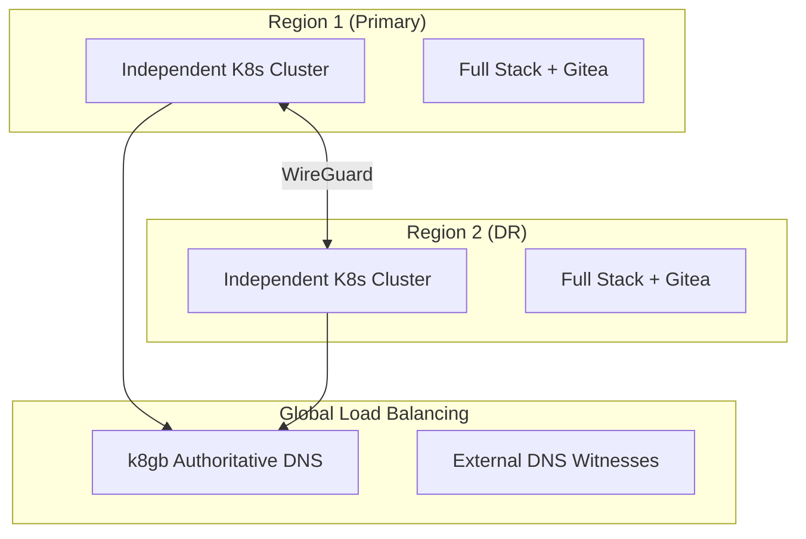
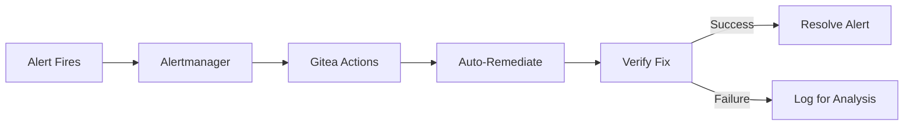
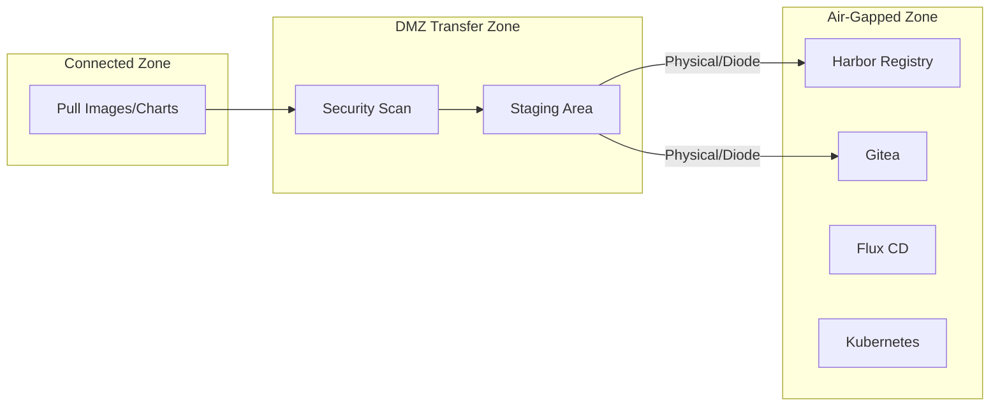
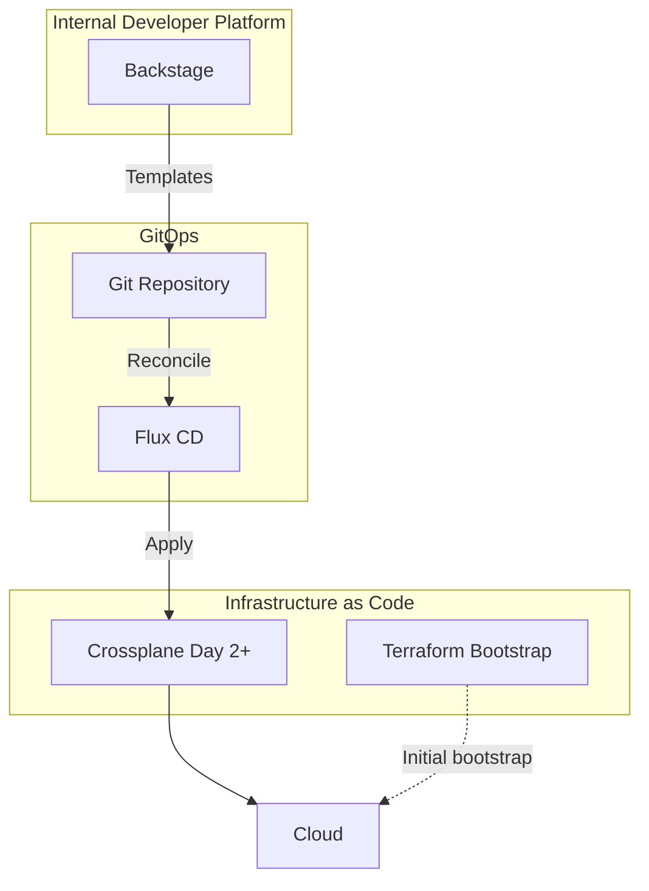

# SRE Handbook

Site Reliability Engineering practices for OpenOva platform operations.

**Status:** Accepted | **Updated:** 2026-02-08

---

## Overview

This document covers SRE practices, multi-region strategy, progressive delivery, auto-remediation, and operational tooling for OpenOva deployments including AI Hub and Open Banking blueprints.

---

## Multi-Region Strategy

### Architecture

Multi-region is strongly recommended. 2 independent clusters across regions provides true disaster recovery.



### Key Principles

- Each cluster survives independently during network partition
- No stretched clusters (avoids split-brain)
- Async data replication (eventual consistency)
- k8gb as authoritative DNS for GSLB zone
- External DNS witnesses for split-brain protection

### Cross-Region Networking

| Option | Use Case |
|--------|----------|
| WireGuard mesh | Different providers, secure overlay |
| Native peering | Same provider (lower latency) |

### Data Replication

| Service | Replication Method | RPO |
|---------|-------------------|-----|
| CNPG (Postgres) | WAL streaming to async standby | Near-zero |
| MongoDB | CDC via Debezium → Redpanda | Seconds |
| Redpanda | MirrorMaker2 | Seconds |
| Valkey | REPLICAOF command | Seconds |
| MinIO | Bucket replication | Minutes |
| Harbor | Registry replication | Minutes |
| Vault | ESO PushSecrets to both | Seconds |
| Gitea | Bidirectional mirror + CNPG | Seconds |
| Milvus | Collection sync | Minutes |
| Neo4j | Causal cluster replication | Seconds |

### Split-Brain Protection

Failover Controller queries external DNS witnesses:

| Resolver | Provider |
|----------|----------|
| 8.8.8.8 | Google |
| 1.1.1.1 | Cloudflare |
| 9.9.9.9 | Quad9 |

**Quorum:** 2/3 must agree other region is unreachable before promotion.

---

## Progressive Delivery

### Canary Deployments

Flagger provides automatic canary analysis with rollback:

- Flux-native integration
- Automatic rollback on metric degradation
- No ArgoCD dependency

### Feature Flags

Flipt for zero-cost feature flagging:

- Self-hosted deployment
- Simple SDK integration
- Gradual rollout control

---

## Auto-Remediation

### Architecture

Gitea Actions triggered by Alertmanager webhooks for automated incident response.



### Alert-to-Action Mapping

#### Platform Alerts

| Alert | Auto-Action | Verification |
|-------|-------------|--------------|
| HighMemoryUsage | Scale up deployment | Check memory |
| PodCrashLoopBackOff | Restart pod | Check pod status |
| HighErrorRate | Trigger rollback | Check error rate |
| DatabaseConnectionExhausted | Restart PgBouncer | Check connections |
| CertificateExpiringSoon | Trigger renewal | Check expiry |
| HighLatency | Scale service | Check latency |
| GslbEndpointDown | Check k8gb status | Verify DNS |

#### AI Hub Alerts

| Alert | Auto-Action | Verification |
|-------|-------------|--------------|
| VLLMHighLatency | Scale vLLM replicas | Check inference latency |
| VLLMOOMKilled | Reduce batch size | Check memory |
| GPUUtilizationLow | Scale down GPU pods | Check utilization |
| GPUMemoryExhausted | Evict low-priority jobs | Check GPU memory |
| MilvusQuerySlow | Rebuild index | Check query latency |
| EmbeddingQueueBacklog | Scale BGE replicas | Check queue depth |
| RAGRetrievalEmpty | Alert + log for analysis | Check retrieval quality |
| LLMGatewayQuotaExhausted | Notify user | Check quota |

#### Open Banking Alerts

| Alert | Auto-Action | Verification |
|-------|-------------|--------------|
| KeycloakHighLatency | Scale Keycloak | Check auth latency |
| QuotaServiceDown | Failover to backup | Check quota service |
| BillingWebhookFailed | Retry with backoff | Check webhook status |
| TPPCertExpiring | Alert ops team | Check certificate |

### Budget Control

| Threshold | Action |
|-----------|--------|
| 80% of budget | Warning log |
| 100% of budget | Block scale-up |

---

## Secret Rotation

| Secret Type | Frequency | Method |
|-------------|-----------|--------|
| Database credentials | Monthly | CronJob + ESO |
| JWT signing keys | 30 days | CronJob |
| TLS certificates | Auto | cert-manager |
| Gitea tokens | 90 days | CronJob + ESO |
| LLM API keys | 90 days | CronJob + ESO |
| Keycloak client secrets | 90 days | CronJob + ESO |

---

## GDPR Automation

| Process | Schedule |
|---------|----------|
| Data subject requests | Daily 2 AM |
| Data retention | Weekly Sunday 3 AM |
| Audit log cleanup | Monthly |
| Vector embedding purge | On data deletion request |
| Chat history cleanup | Per retention policy |

---

## Air-Gap Compliance

For regulated industries requiring air-gapped deployments:

### Architecture



### Prerequisites

All mandatory components support air-gap:

- Harbor - local registry with replication
- MinIO - local object storage
- Flux - reconciles from local Git
- Velero - backups to local MinIO
- Grafana Stack - self-contained observability

### AI Hub Air-Gap Considerations

| Component | Air-Gap Requirement |
|-----------|---------------------|
| vLLM | Pre-download model weights to MinIO |
| BGE-M3 | Pre-download embedding models |
| Milvus | No external dependencies |
| Neo4j | No external dependencies |
| SearXNG | Disabled (no internet access) |
| LangServe | Configure for local models only |

### Content Transfer

| Content Type | Air-Gap Destination |
|--------------|---------------------|
| Container images | Harbor |
| Helm charts | Harbor ChartMuseum |
| Git repositories | Self-hosted Gitea |
| OS packages | Local mirror |
| LLM model weights | MinIO |
| Embedding models | MinIO |

---

## Platform Engineering Tools

### Tool Selection

| Tool | Purpose | Status |
|------|---------|--------|
| Crossplane | Cloud resource provisioning (day-2) | Mandatory |
| Backstage | Internal Developer Platform (IDP) | Mandatory |
| Flux | GitOps delivery engine | Mandatory |
| Terraform | Bootstrap IaC only | Mandatory |

### Architecture



### Crossplane Providers

| Provider | Support |
|----------|---------|
| Hetzner Cloud | hcloud provider |
| Huawei Cloud | huaweicloud provider |
| Oracle Cloud | oci provider |
| AWS | aws provider |
| GCP | gcp provider |
| Azure | azure provider |

---

## Monitoring SLOs

### Platform SLOs

| SLI | Target | Alert Threshold |
|-----|--------|-----------------|
| Availability | 99.9% | <99.5% for 5m |
| Latency (p95) | <500ms | >1s for 5m |
| Error Rate | <0.1% | >1% for 5m |

### AI Hub SLOs

| SLI | Target | Alert Threshold |
|-----|--------|-----------------|
| LLM Inference Latency (p95) | <5s | >10s for 5m |
| LLM Token Throughput | >50 tok/s | <20 tok/s for 5m |
| Embedding Latency (p95) | <100ms | >500ms for 5m |
| RAG Retrieval Latency (p95) | <500ms | >2s for 5m |
| GPU Utilization | >60% | <30% for 15m |
| Vector Search Latency (p95) | <50ms | >200ms for 5m |

### Open Banking SLOs

| SLI | Target | Alert Threshold |
|-----|--------|-----------------|
| Auth Latency (p95) | <200ms | >500ms for 5m |
| API Availability | 99.95% | <99.5% for 5m |
| Consent Flow Success | >99% | <95% for 5m |

---

## GPU Operations

### GPU Node Management

```yaml
# GPU node pool labels
nodeSelector:
  node.kubernetes.io/gpu: "true"
  nvidia.com/gpu.product: "NVIDIA-A10"

tolerations:
  - key: nvidia.com/gpu
    operator: Exists
    effect: NoSchedule
```

### GPU Monitoring Metrics

| Metric | Query | Purpose |
|--------|-------|---------|
| GPU Utilization | `DCGM_FI_DEV_GPU_UTIL` | Compute usage |
| GPU Memory Used | `DCGM_FI_DEV_FB_USED` | Memory pressure |
| GPU Temperature | `DCGM_FI_DEV_GPU_TEMP` | Thermal throttling |
| GPU Power | `DCGM_FI_DEV_POWER_USAGE` | Power consumption |
| SM Clock | `DCGM_FI_DEV_SM_CLOCK` | Clock throttling |

### vLLM Operations

```bash
# Check vLLM health
curl http://vllm.ai-hub.svc:8000/health

# Check loaded models
curl http://vllm.ai-hub.svc:8000/v1/models

# Monitor generation metrics
curl http://vllm.ai-hub.svc:8000/metrics | grep vllm_
```

### KServe Operations

```bash
# List InferenceServices
kubectl get inferenceservices -n ai-hub

# Check model readiness
kubectl get inferenceservice <name> -o jsonpath='{.status.conditions}'

# Scale model replicas
kubectl patch inferenceservice <name> -p '{"spec":{"predictor":{"minReplicas":2}}}'
```

---

## Vector Database Operations

### Milvus Health Checks

```bash
# Check cluster status
kubectl exec -it milvus-proxy-0 -n ai-hub -- curl localhost:9091/healthz

# Check collection stats
curl -X GET "http://milvus.ai-hub.svc:19530/v1/vector/collections/<collection>/stats"

# Compact collection
curl -X POST "http://milvus.ai-hub.svc:19530/v1/vector/collections/<collection>/compact"
```

### Milvus Maintenance

| Task | Schedule | Command |
|------|----------|---------|
| Index rebuild | Weekly | `collection.create_index()` |
| Compaction | Daily | `collection.compact()` |
| Backup | Daily | Velero snapshot |
| Stats refresh | Hourly | `collection.get_stats()` |

---

## Alertmanager Configuration

```yaml
receivers:
  - name: gitea-actions
    webhook_configs:
      - url: https://gitea.<domain>/api/v1/repos/<org>/platform/actions/dispatches
        http_config:
          authorization:
            type: Bearer
            credentials_file: /etc/alertmanager/gitea-token
        send_resolved: true

  - name: ai-hub-oncall
    webhook_configs:
      - url: https://gitea.<domain>/api/v1/repos/<org>/ai-hub/actions/dispatches
        http_config:
          authorization:
            type: Bearer
            credentials_file: /etc/alertmanager/gitea-token

route:
  receiver: gitea-actions
  group_by: ['alertname', 'namespace']
  group_wait: 30s
  routes:
    - match:
        severity: critical
      receiver: gitea-actions
      group_wait: 10s
    - match:
        namespace: ai-hub
      receiver: ai-hub-oncall
      group_by: ['alertname', 'model']
```

---

## Grafana Dashboards

### Platform Dashboards

| Dashboard | Purpose |
|-----------|---------|
| Platform Overview | Request rates, latencies, errors |
| Cilium Network | Traffic flows, policy drops |
| Flux GitOps | Reconciliation status |
| CNPG Postgres | Database performance |

### AI Hub Dashboards

| Dashboard | Purpose |
|-----------|---------|
| AI Hub Overview | Request rates, model usage |
| GPU Metrics | Utilization, memory, temperature |
| LLM Inference | Latency, throughput, queue depth |
| RAG Analytics | Retrieval quality, citations |
| Vector Search | Query latency, index stats |
| User Analytics | Usage by agent, user |

### Open Banking Dashboards

| Dashboard | Purpose |
|-----------|---------|
| Open Banking Overview | API calls, consent flows |
| Keycloak Auth | Authentication metrics |
| Billing | Usage metering, revenue |

---

## Incident Response

### Severity Levels

| Level | Definition | Response Time |
|-------|------------|---------------|
| P1 | Platform down | 15 minutes |
| P2 | Major feature broken | 1 hour |
| P3 | Minor issue | 4 hours |
| P4 | Low priority | Next business day |

### AI Hub Specific Incidents

| Incident | Severity | Runbook |
|----------|----------|---------|
| vLLM not responding | P1 | Restart vLLM, check GPU |
| GPU OOM | P2 | Reduce batch size, scale |
| Milvus query timeout | P2 | Check index, rebuild |
| Embedding service down | P2 | Failover, restart BGE |
| RAG returning empty | P3 | Check retrieval config |

---

*Part of [OpenOva](https://openova.io)*
