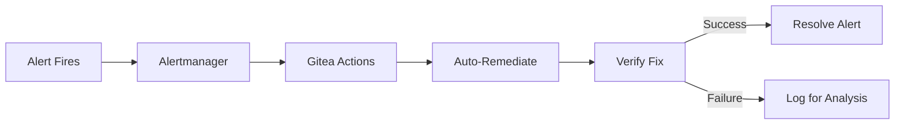

# SRE Handbook

**Status:** Authoritative target playbook. **Updated:** 2026-04-27.
**Implementation:** Most automation described (alert webhooks, Runbook CRDs, failover-controller actions) is design-stage. See [`IMPLEMENTATION-STATUS.md`](IMPLEMENTATION-STATUS.md). Existing Sovereign deployments may rely on simpler manual procedures until the automation lands.

Site Reliability Engineering practices for Catalyst Sovereigns. Defer to [`GLOSSARY.md`](GLOSSARY.md) for terminology, [`ARCHITECTURE.md`](ARCHITECTURE.md) for the model, [`SECURITY.md`](SECURITY.md) for credentials and identity.

---

## 1. Overview

This handbook covers running a Sovereign in production: multi-region topology, progressive delivery, auto-remediation, secret rotation, GDPR automation, air-gap considerations, SLOs, GPU operations, and incident response. Audience: `sovereign-admin` and SRE personas across SME-style and corporate-style Sovereigns.

---

## 2. Multi-region strategy

### 2.1 Architecture

Multi-region is **strongly recommended** for production-tier Sovereigns. Two or more independent host clusters across regions provide geographic redundancy with automatic failover.

Clusters are named by **building block** (functional security zone), not by failover role — there is **no "primary" or "DR" designation**. Both clusters run the same building blocks symmetrically; k8gb and GSLB handle traffic distribution. After a failover event, the surviving cluster serves all traffic — its name does not change.

See [`NAMING-CONVENTION.md`](NAMING-CONVENTION.md) §1.3.

```mermaid
flowchart TB
    subgraph RegionA["Region A (e.g. hz-fsn-rtz-prod)"]
        K8s1[Restricted Trust Zone Cluster]
        Stack1[Per-Org vclusters + workloads]
    end

    subgraph RegionB["Region B (e.g. hz-hel-rtz-prod)"]
        K8s2[Restricted Trust Zone Cluster]
        Stack2[Per-Org vclusters + workloads]
    end

    subgraph GSLB["Global Load Balancing"]
        k8gb[k8gb Authoritative DNS]
        Witness[Cloud witness<br>(lease for split-brain protection)]
    end

    K8s1 <-->|"WireGuard"| K8s2
    K8s1 --> k8gb
    K8s2 --> k8gb
    k8gb -.-> Witness
```

### 2.2 Key principles

- Each cluster survives independently during network partition — no shared control plane.
- **No stretched clusters** (avoids split-brain). This applies to OpenBao, JetStream, etcd, and any other quorum-based component.
- Both clusters are peers — neither is designated primary or DR.
- Async data replication (eventual consistency).
- k8gb as authoritative DNS for GSLB zone — removes unhealthy endpoints automatically.
- Cloud witness (lease) for split-brain protection — see §2.4.

### 2.3 Cross-region networking

| Option | Use case |
|---|---|
| WireGuard mesh | Different providers, secure overlay |
| Native peering | Same provider (lower latency, e.g. Hetzner vSwitch, OCI FastConnect) |

### 2.4 Split-brain protection

Failover Controller uses a **cloud witness** for lease-based authority:

| Component | Role |
|---|---|
| Cloud witness | Holds the lease — typically Cloudflare KV (cheap, globally distributed) or another out-of-Sovereign storage |
| Failover Controller | Per-cluster controller managing readiness and gating endpoints |

**Witness pattern:**
- Active region holds a lease (renews every 10s, TTL 30s).
- Standby regions cannot become active while a valid lease exists.
- Network partition: both regions reach the witness → active keeps renewing → no split-brain.
- Witness unreachable: failover controller falls back to multi-resolver DNS quorum (8.8.8.8 + 1.1.1.1 + 9.9.9.9, 2-of-3).

**Three layers controlled** by the failover controller:

| Layer | Mechanism |
|---|---|
| External traffic (Gateway API → k8gb) | HTTPRoute readiness toggling |
| Internal traffic (Cilium Cluster Mesh) | Service endpoint manipulation |
| Stateful services (CNPG, FerretDB, Strimzi) | Database promotion signaling |

**Modes:** automatic | semi-automatic | manual (regulated tier).

### 2.5 Data replication patterns

These apply to stateful components — Application Blueprints (data services) **and** per-host-cluster infrastructure with state (MinIO, Harbor). The Catalyst control plane's own state-bearing components use different patterns: see [`SECURITY.md`](SECURITY.md) for OpenBao and [`ARCHITECTURE.md`](ARCHITECTURE.md) for NATS JetStream.

| Component | Layer | Replication method | RPO |
|---|---|---|---|
| CNPG (PostgreSQL) | Application Blueprint | WAL streaming to async standby | Near-zero |
| FerretDB | Application Blueprint | Via CNPG WAL streaming | Near-zero |
| Strimzi/Kafka | Application Blueprint | MirrorMaker2 | Seconds |
| Valkey | Application Blueprint | REPLICAOF | Seconds |
| ClickHouse | Application Blueprint | ReplicatedMergeTree | Seconds |
| OpenSearch | Application Blueprint | Cross-cluster replication | Seconds |
| Milvus | Application Blueprint | Collection sync | Minutes |
| Neo4j | Application Blueprint | Causal cluster replication | Seconds |
| MinIO | Per-host-cluster infra | Bucket replication | Minutes |
| Harbor | Per-host-cluster infra | Registry replication | Minutes |
| Gitea | Catalyst control plane | Intra-cluster HA replicas + CNPG primary-replica (NOT cross-region mirror — see [platform/gitea/README.md](../platform/gitea/README.md) §"Multi-Region Strategy"). DR for Gitea is via mgt-cluster recovery, not bidirectional sync. | Seconds (intra-cluster only) |

---

## 3. Progressive delivery

### 3.1 Canary deployments

[Flagger](https://flagger.app) is the planned canary controller (currently a "components to watch" addition, see [`TECHNOLOGY-FORECAST-2027-2030.md`](TECHNOLOGY-FORECAST-2027-2030.md)):

- Flux-native integration
- Automatic rollback on metric degradation (latency, error rate)
- No ArgoCD dependency

When added, Flagger is intended to live as per-host-cluster infrastructure on each `rtz` cluster; per-Application canary configuration in the Application Blueprint. **Status:** design — not yet a deployed Blueprint.

### 3.2 Feature flags

[Flipt](https://flipt.io) is the planned feature-flag service (also "components to watch"):

- Self-hosted, zero-cost
- Simple SDK integration (Go, TypeScript, Python)
- Gradual rollout control

**Status:** design — not yet a deployed Blueprint.

---

## 4. Auto-remediation

### 4.1 Architecture

Gitea Actions triggered by Alertmanager webhooks for automated incident response.


```mermaid
flowchart LR
    Alert[Alert Fires] --> AM[Alertmanager]
    AM --> GA[Gitea Actions]
    GA --> Remediate[Auto-Remediate]
    Remediate --> Verify[Verify Fix]
    Verify -->|Success| Resolve[Resolve Alert]
    Verify -->|Failure| Log[Log for Analysis]
```

### 4.2 Alert-to-action mapping

#### Catalyst control plane

| Alert | Auto-action | Verification |
|---|---|---|
| HighMemoryUsage | Scale up deployment | Check memory |
| PodCrashLoopBackOff | Restart pod | Check pod status |
| HighErrorRate | Trigger rollback | Check error rate |
| DatabaseConnectionExhausted | Restart PgBouncer | Check connections |
| CertificateExpiringSoon | Trigger renewal | Check expiry |
| HighLatency | Scale service | Check latency |
| GslbEndpointDown | Check k8gb status | Verify DNS |
| OpenBaoSealed | Auto-unseal via SPIRE-attested unseal keys | Check unseal status |
| JetstreamLagHigh | Add JetStream consumer replica | Check consumer lag |

#### AI Hub (when bp-cortex installed)

| Alert | Auto-action | Verification |
|---|---|---|
| VLLMHighLatency | Scale vLLM replicas | Check inference latency |
| VLLMOOMKilled | Reduce batch size | Check memory |
| GPUUtilizationLow | Scale down GPU pods | Check utilization |
| GPUMemoryExhausted | Evict low-priority jobs | Check GPU memory |
| MilvusQuerySlow | Rebuild index | Check query latency |
| EmbeddingQueueBacklog | Scale BGE replicas | Check queue depth |
| RAGRetrievalEmpty | Alert + log | Check retrieval quality |
| LLMGatewayQuotaExhausted | Notify user | Check quota |

#### Open Banking (when bp-fingate installed)

| Alert | Auto-action | Verification |
|---|---|---|
| KeycloakHighLatency | Scale Keycloak | Check auth latency |
| QuotaServiceDown | Failover to backup | Check quota service |
| BillingWebhookFailed | Retry with backoff | Check webhook status |
| TPPCertExpiring | Alert sovereign-admin team | Check certificate |

### 4.3 Budget control

| Threshold | Action |
|---|---|
| 80% of budget | Warning log |
| 100% of budget | Block scale-up |

---

## 5. Secret rotation

Detailed in [`SECURITY.md`](SECURITY.md) §7. Summary:

| Class | Default frequency | Method |
|---|---|---|
| Workload identity (SPIRE SVID) | 5 minutes | Auto |
| Database credentials (dynamic) | 1 hour | OpenBao DB engine + sidecar |
| API tokens, OAuth client secrets | 90 days | OpenBao + ESO + Reloader |
| Signing keys | 365 days | Manual approval (security-officer) |
| TLS certificates | cert-manager | Auto (Let's Encrypt or corporate CA) |
| User passwords (Keycloak) | User-managed + MFA | Realm policy enforces min age |

---

## 6. GDPR automation

| Process | Schedule | Notes |
|---|---|---|
| Data subject requests | Daily 02:00 | Application Blueprints expose DSAR endpoints |
| Data retention | Weekly Sunday 03:00 | Per-Application policy |
| Audit log cleanup | Monthly | Retains per regulatory requirement |
| Vector embedding purge | On data deletion request | If using bp-cortex |
| Chat history cleanup | Per retention policy | If using bp-relay |

GDPR automation is a Catalyst-level controller (`gdpr-controller`) that orchestrates Application-specific deletion via the App's exposed compliance API.

---

## 7. Air-gap compliance

For regulated industries requiring air-gapped deployments:

```mermaid
flowchart LR
    subgraph Connected["Connected Zone"]
        Pull[Pull Images / OCI Blueprints]
    end

    subgraph DMZ["DMZ Transfer Zone"]
        Scan[Trivy + cosign verify]
        Stage[Staging Area]
    end

    subgraph AirGap["Air-Gapped Sovereign"]
        Harbor[Harbor Registry]
        Git[Gitea<br>(Blueprint mirror)]
        Flux[Flux per vcluster]
        K8s[Per-host clusters]
    end

    Pull --> Scan
    Scan --> Stage
    Stage -->|Physical / Diode| Harbor
    Stage -->|Physical / Diode| Git
```

### 7.1 Prerequisites

All Catalyst control-plane components support air-gap:

- Harbor — local registry with replication
- MinIO — local object storage
- Flux — reconciles from local Git
- Velero — backups to local MinIO
- Grafana stack — self-contained observability
- OpenBao + Keycloak — fully self-hosted; no external dependencies

### 7.2 AI Hub air-gap considerations (when bp-cortex installed)

| Component | Air-gap requirement |
|---|---|
| vLLM | Pre-download model weights to MinIO |
| BGE-M3 | Pre-download embedding models |
| Milvus | No external dependencies |
| Neo4j | No external dependencies |
| NeMo Guardrails | No external dependencies |
| LangFuse | No external dependencies |

### 7.3 Content transfer

| Content type | Air-gap destination |
|---|---|
| Container images | Harbor |
| Helm charts | Harbor (OCI) |
| Blueprint OCI manifests | Harbor → blueprint-controller registers |
| Git repositories | Self-hosted Gitea |
| OS packages | Local mirror |
| LLM model weights | MinIO |
| Embedding models | MinIO |

---

## 8. Catalyst observability

### 8.1 Self-monitoring

The Catalyst control plane runs its own Grafana stack (Alloy + Loki + Mimir + Tempo + Grafana) in the `catalyst-grafana` namespace on the management cluster. Every Catalyst component emits OpenTelemetry traces, metrics, and logs.

### 8.2 Per-Sovereign dashboards

| Dashboard | Purpose |
|---|---|
| Sovereign Health | All Catalyst components, control-plane SLOs |
| Per-Org Footprint | Resource usage by Organization |
| Per-Environment | Application states, error budgets |
| Promotion Activity | EnvironmentPolicy-driven promotions, soak times, approver latency |
| Secret Rotation | All credentials, age, next rotation |
| Audit | Commits, RBAC events, SecretPolicy actions |

### 8.3 Per-Organization dashboards

Each Organization sees their own slice:

| Dashboard | Purpose |
|---|---|
| Apps Overview | All Applications across Environments |
| Budget | Cost projection, billing |
| Compliance Posture | Per-control evidence |
| Incidents | Open issues, MTTR |

---

## 9. SLOs

### 9.1 Catalyst control plane

| SLI | Target | Alert threshold |
|---|---|---|
| Console availability | 99.9% | <99.5% for 5m |
| API p95 latency | <500ms | >1s for 5m |
| Catalog query p95 | <200ms | >500ms for 5m |
| projector SSE delivery | <2s end-to-end | >5s for 5m |
| Gitea webhook → reconcile | <30s | >2m for 5m |

### 9.2 AI Hub (bp-cortex)

| SLI | Target | Alert threshold |
|---|---|---|
| LLM Inference Latency (p95) | <5s | >10s for 5m |
| LLM Token Throughput | >50 tok/s | <20 tok/s for 5m |
| Embedding Latency (p95) | <100ms | >500ms for 5m |
| RAG Retrieval Latency (p95) | <500ms | >2s for 5m |
| GPU Utilization | >60% | <30% for 15m |
| Vector Search Latency (p95) | <50ms | >200ms for 5m |

### 9.3 Open Banking (bp-fingate)

| SLI | Target | Alert threshold |
|---|---|---|
| Auth Latency (p95) | <200ms | >500ms for 5m |
| API Availability | 99.95% | <99.5% for 5m |
| Consent Flow Success | >99% | <95% for 5m |

### 9.4 Data & Integration (bp-fabric)

| SLI | Target | Alert threshold |
|---|---|---|
| Kafka Produce Latency (p95) | <50ms | >200ms for 5m |
| Flink Checkpoint Duration | <30s | >60s for 5m |
| Temporal Workflow Latency (p95) | <1s | >5s for 5m |
| CDC Lag (Debezium) | <10s | >60s for 5m |
| ClickHouse Query Latency (p95) | <500ms | >2s for 5m |

### 9.5 Communication (bp-relay)

| SLI | Target | Alert threshold |
|---|---|---|
| Email Delivery Rate | >99.5% | <98% for 15m |
| LiveKit Call Setup (p95) | <2s | >5s for 5m |
| Matrix Message Delivery (p95) | <500ms | >2s for 5m |
| TURN Relay Success Rate | >99% | <95% for 5m |

---

## 10. GPU operations

### 10.1 GPU node management

```yaml
nodeSelector:
  node.kubernetes.io/gpu: "true"
  nvidia.com/gpu.product: "NVIDIA-A10"

tolerations:
  - key: nvidia.com/gpu
    operator: Exists
    effect: NoSchedule
```

### 10.2 GPU monitoring metrics

| Metric | Query | Purpose |
|---|---|---|
| GPU utilization | `DCGM_FI_DEV_GPU_UTIL` | Compute usage |
| GPU memory used | `DCGM_FI_DEV_FB_USED` | Memory pressure |
| GPU temperature | `DCGM_FI_DEV_GPU_TEMP` | Thermal throttling |
| GPU power | `DCGM_FI_DEV_POWER_USAGE` | Power consumption |
| SM clock | `DCGM_FI_DEV_SM_CLOCK` | Clock throttling |

### 10.3 vLLM operations

```bash
# Within an Org's vcluster, scoped to bp-cortex Application namespace
kubectl exec -n cortex deploy/vllm -- curl localhost:8000/health
kubectl exec -n cortex deploy/vllm -- curl localhost:8000/v1/models
```

### 10.4 KServe operations

```bash
kubectl get inferenceservices -n cortex
kubectl get inferenceservice <name> -o jsonpath='{.status.conditions}'
kubectl patch inferenceservice <name> -p '{"spec":{"predictor":{"minReplicas":2}}}'
```

---

## 11. Vector database operations

### 11.1 Milvus health checks

```bash
kubectl exec -n cortex milvus-proxy-0 -- curl localhost:9091/healthz
curl -X GET "http://milvus.cortex.svc:19530/v1/vector/collections/<collection>/stats"
curl -X POST "http://milvus.cortex.svc:19530/v1/vector/collections/<collection>/compact"
```

### 11.2 Maintenance

| Task | Schedule | Command |
|---|---|---|
| Index rebuild | Weekly | `collection.create_index()` |
| Compaction | Daily | `collection.compact()` |
| Backup | Daily | Velero snapshot |
| Stats refresh | Hourly | `collection.get_stats()` |

---

## 12. Alertmanager configuration

```yaml
receivers:
  - name: gitea-actions
    webhook_configs:
      - url: https://gitea.<location-code>.<sovereign-domain>/api/v1/repos/<org>/platform/actions/dispatches
        http_config:
          authorization:
            type: Bearer
            credentials_file: /etc/alertmanager/gitea-token
        send_resolved: true

  - name: ai-oncall
    webhook_configs:
      - url: https://gitea.<location-code>.<sovereign-domain>/api/v1/repos/<org>/cortex/actions/dispatches
        http_config:
          authorization:
            type: Bearer
            credentials_file: /etc/alertmanager/gitea-token

route:
  receiver: gitea-actions
  group_by: ['alertname', 'namespace']
  group_wait: 30s
  routes:
    - match:
        severity: critical
      receiver: gitea-actions
      group_wait: 10s
    - match:
        namespace: cortex
      receiver: ai-oncall
      group_by: ['alertname', 'model']
```

---

## 13. Incident response

### 13.1 Severity levels

| Level | Definition | Response time |
|---|---|---|
| P1 | Catalyst control plane down (Sovereign-impacting) | 15 minutes |
| P2 | Major Application or feature broken | 1 hour |
| P3 | Minor issue | 4 hours |
| P4 | Low priority | Next business day |

### 13.2 Catalyst-specific incidents

| Incident | Severity | Runbook |
|---|---|---|
| Console unreachable | P1 | Check Cilium Gateway, console pods, projector pods |
| Gitea unreachable | P1 | Check Gitea pods, CNPG primary, NetworkPolicy |
| Environment-controller stuck | P1 | Check controller logs, Crossplane provider auth |
| OpenBao sealed | P1 | Auto-unseal SPIRE — verify SPIRE server health |
| JetStream consumer lag | P2 | Add consumer replica, check disk pressure |
| projector lag | P2 | Check JetStream consumer status, projector replicas |
| Per-Org vcluster down | P2 | Check vcluster pod, host cluster capacity |
| Flux reconciliation stalled | P2 | Check source-controller logs, Git connectivity |
| New Sovereign provisioning failed | P3 | Check OpenTofu state, cloud provider quotas |

### 13.3 AI Hub incidents (bp-cortex)

| Incident | Severity | Runbook |
|---|---|---|
| vLLM not responding | P1 | Restart vLLM, check GPU |
| GPU OOM | P2 | Reduce batch size, scale |
| Milvus query timeout | P2 | Check index, rebuild |
| Embedding service down | P2 | Failover, restart BGE |
| RAG returning empty | P3 | Check retrieval config |

---

## 14. Runbooks

Sovereign-wide runbooks live in `system/runbooks` (Sovereign-admin scope). Org-specific runbooks may live in `<org>/runbooks` Gitea repo (one per Org if used). Both are version-controlled and indexed by Catalyst's `runbook-controller`, which surfaces them in incident response panels.

A typical runbook:

```yaml
apiVersion: catalyst.openova.io/v1alpha1
kind: Runbook
metadata:
  name: openbao-sealed
  namespace: catalyst-system
spec:
  triggers:
    - alertName: OpenBaoSealed
  preconditions:
    - check: spire.server.healthy
    - check: openbao.unseal.shamir.shares.available
  steps:
    - run: openbao operator unseal --auto-shamir
    - verify: openbao.status.sealed == false
  rollback: page-oncall
```

---

*Cross-reference [`ARCHITECTURE.md`](ARCHITECTURE.md), [`SECURITY.md`](SECURITY.md), [`PERSONAS-AND-JOURNEYS.md`](PERSONAS-AND-JOURNEYS.md).*
