# OpenOva / Catalyst — System Design & Onboarding

> **Audience:** an incoming lead developer / CTO taking over the build via harness engineering.
> **Goal:** understand the whole system top-to-bottom — the domain model, **the GitOps engine that is the
> heart of the platform**, the control plane, the event/streaming layer, how a customer goes from click to
> running app, how a Sovereign becomes *fully independent*, and how we *prove* any of it works.
> **Read order:** this doc → [`GLOSSARY.md`](GLOSSARY.md) (terms — wins over everything) →
> [`STATUS.md`](STATUS.md) (what's actually built) → [`ARCHITECTURE.md`](ARCHITECTURE.md) →
> [`DOD.md`](DOD.md) → [`PRINCIPLES.md`](PRINCIPLES.md) → [`PROTOCOL.md`](PROTOCOL.md) → [`RUNBOOKS.md`](RUNBOOKS.md).

---

## 0. The one-paragraph mental model

**OpenOva** (the company) builds **Catalyst** (the platform). A *deployed* Catalyst is a **Sovereign** —
a self-contained, multi-region Kubernetes cloud that a partner (Omantel, National Cloud, …) runs under
their own brand, **with its own billing, its own users, its own everything.** We run one reference
Sovereign, the **mothership** (`openova`), whose *only* cross-Sovereign job is **provisioning** — it
*fires* new Sovereigns. It does **not** run their billing, hold their data, or serve their traffic. Inside
a Sovereign, customers are **Organizations**, holding **Environments**, running **Applications**, installed
from **Blueprints**. The platform is driven **declaratively**: desired state lives in **Git**, **Flux**
reconciles the cluster toward it, and **Crossplane** turns declarative claims into real cloud infra. The
endgame (Pillar 5) is **sovereignty cutover** — a Sovereign severs its last tie to us and pulls everything
from its *own* Git + registry, proven by a 10-minute egress-block self-test. **Same code in every Sovereign.**

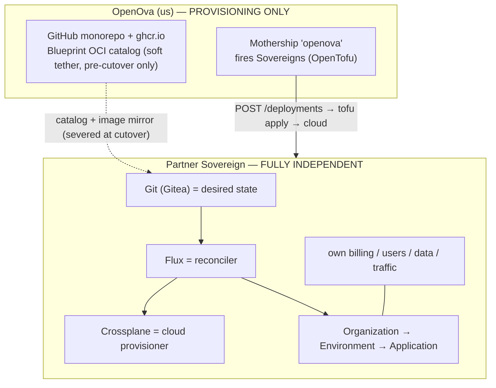

> **Two corrections a new lead must internalise immediately:** (1) **billing is per-Sovereign** — the
> mothership never bills a partner's customers; (2) a Sovereign has **zero runtime dependency** on the
> mothership. See §4.

---

## 1. Domain model (the nouns — learn these cold)

Strict containment. Use these exact words ([`GLOSSARY.md`](GLOSSARY.md) has the banned-terms list).

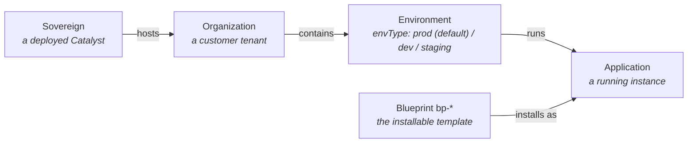

| Term | Is | Backed by (runtime) |
|---|---|---|
| **Sovereign** | a deployed Catalyst (a whole multi-region cloud) | k3s clusters × 2 regions + the Catalyst control plane |
| **Organization** | a customer tenant | `Organization` CR (`orgs.openova.io`) + a vCluster (paid) or host namespace (free/S) |
| **Environment** | a workspace in an Org | `Environment` CR with an **`envType`** (`prod` is the default; `dev`/`staging` exist but are rarely used — in practice most Orgs run a single `prod`) |
| **Application** | a running instance | `Application` CR (`apps.openova.io`) → a Flux `HelmRelease` |
| **Blueprint** | the installable template | `ghcr.io/openova-io/bp-<name>:<semver>` OCI (Helm chart + `blueprint.yaml`) |

Naming: cluster `{prov}-{reg}-{bb}-{env}` · vcluster `{org}` · Environment `{org}-{envType}` (e.g.
`agwalk305-prod`) · Blueprint `bp-<name>` · Application `<purpose>`. Full table in [`ARCHITECTURE.md`](ARCHITECTURE.md) §4.

---

## 2. The 5-pillar Definition of Done (the "why" behind every acceptance row)

Done = an operator can walk a **fresh provision** through all five (full text in [`DOD.md`](DOD.md); the walk
is [`ledger/UAT.md`](ledger/UAT.md), ~286 rows):

1. **Marketplace + voucher onboarding** — customer buys/redeems → live Org.
2. **Multi-region BCP topology choice at signup** — active-active / active-hot-standby / singleton.
3. **Two CNPG clusters + region-kill failover** — kill a region; data + control survive.
4. **Per-Org Agenity workspace + `bp-openova-mcp`** — an in-Org AI agent that can `create_application`.
5. **Sovereign independence post-cutover** — the 11-step `bp-self-sovereign-cutover` + egress-block proof.

---

## 3. Repository map (the monorepo)

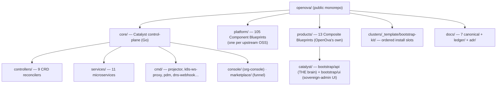

**⚠️ FOUR front-end trees** — grep all four before saying "the UI can't do X":
`core/console` (`org-console`, tenant UI) · `core/marketplace` (`org-marketplace`, customer funnel) ·
`products/catalyst/console` (`catalyst-console`) · `products/catalyst/bootstrap/ui` (**the sovereign-admin
console** — apps grid, jobs, topology, cutover). Each `platform|products/<x>` is the source of **one**
Blueprint published to `ghcr.io/openova-io/bp-<name>`.

---

## 4. Independence model — mothership vs Sovereign (read this before anything scary)

**The same binaries run in every Sovereign, including the mothership — as fully independent instances.**
There is no shared runtime, no shared database, no call-home.

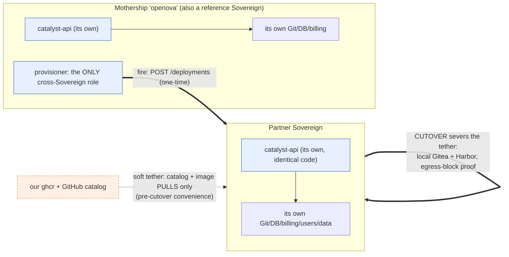

| Concern | Mothership | Partner Sovereign |
|---|---|---|
| Provisioning (fire new Sovereigns) | ✅ its job | ❌ never |
| Billing / vouchers / showback | own customers only | **own, independent** (`core/services/billing` in-cluster) |
| Users / auth / data | own | **own** (own Keycloak, own Postgres, own S3) |
| Serving traffic | own | **own** (own gateway, own DNS) |
| Runtime dependency on the other | none | **none** |
| Catalog + images | source of the public catalog | **soft tether pre-cutover** (pulls the catalog/images); **zero after cutover** |

- **Pre-cutover:** the only link is a *pull* — the Sovereign mirrors our public Blueprint catalog + images
  as a convenience. It already serves 100% of its own traffic without us. Losing the mothership at this
  stage only stops *new catalog updates*, not operation.
- **Post-cutover:** the Sovereign pulls **exclusively** from its own Gitea + Harbor. The 10-minute
  egress-block self-test (cutover step 08) *proves* it keeps reconciling green with `github.com`, `ghcr.io`,
  and `harbor.openova.io` denied. **After cutover a Sovereign is 100% self-sufficient. Full stop.**

---

## 5. The GitOps engine — Git + Flux + Crossplane (the heart of the platform)

Everything the platform does is a **declarative control loop**: the *desired* state is written to Git,
**Flux** continuously drives the cluster toward it, and **Crossplane** does the same for *cloud* resources.
Humans and the catalyst-api only ever **write desired state**; the engines converge reality to it.

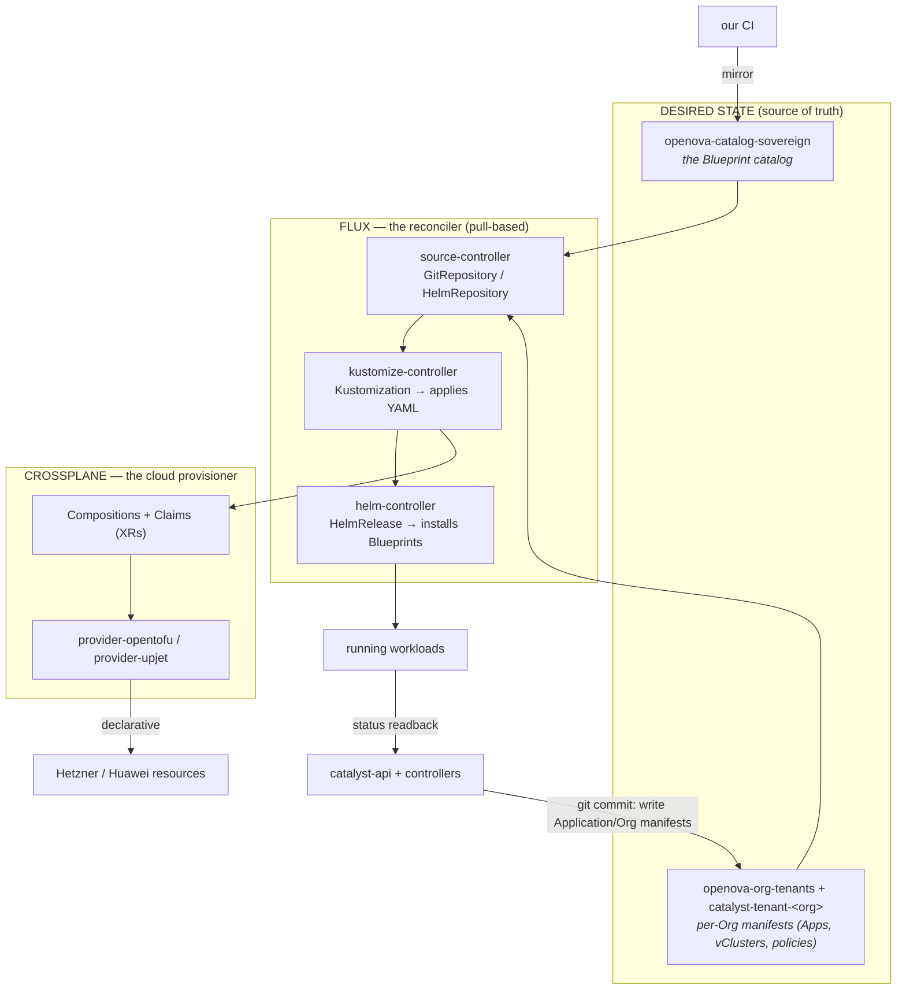

### 5.1 Git = the single source of truth
Post-cutover Git is the Sovereign's **own Gitea**; pre-cutover it also mirrors our GitHub catalog. Three
logical repos matter:
- **`openova-catalog-sovereign`** — the Blueprint catalog (what can be installed).
- **`openova-org-tenants`** + **`catalyst-tenant-<org>`** — the per-Org desired state (Applications,
  vCluster wiring, network policies). The catalyst-api *commits here* when an Org creates/edits an app
  ("git-back the write seams" — #3687); there is no imperative "apply" that bypasses Git.

### 5.2 Flux = the reconciler (pull, not push)
Flux runs **inside** the cluster and pulls: **`GitRepository`/`HelmRepository`** sources feed
**`Kustomization`** (raw YAML) and **`HelmRelease`** (Blueprint charts). Nothing is `kubectl apply`-ed by a
human in normal operation — you change Git, Flux converges. This is why "merged ≠ delivered": a merge only
becomes real after the pin rolls into Git and Flux reconciles it (and a fresh-prov walk proves it).

### 5.3 Crossplane = the cloud-provisioning arm (the user never sees it)
Kubernetes can't natively create a Hetzner server or an S3 bucket — **Crossplane** does, declaratively.
`platform/crossplane` ships **Compositions** (`compositions/`) + **Claims**; `platform/crossplane-claims`
wires them per-Sovereign. A key pattern is **adoption**: after the mothership's `tofu apply` fires a
Sovereign, `GenerateAdoptionClaims` (`provisioner/adoption.go`) reads the **OpenTofu state** and emits
Crossplane Claims that *import* that infra so it's henceforth managed declaratively (Observe-only adoption
= UAT gate **G1**). `provider-opentofu` / `provider-upjet` are the cloud drivers.

### 5.4 Two IaC layers — don't conflate them

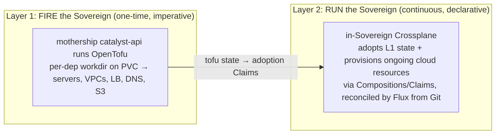

Layer 1 (**OpenTofu**, run by the mothership brain) is a bounded, one-time bootstrap of the cloud
substrate. Layer 2 (**Crossplane + Flux**, running inside the Sovereign) is the steady-state, Git-driven
engine that the Sovereign owns forever.

---

## 6. Control plane (Go) — the catalyst-api, the controllers, the services

The control plane **writes desired state and reads status back**; the engines in §5 do the converging.

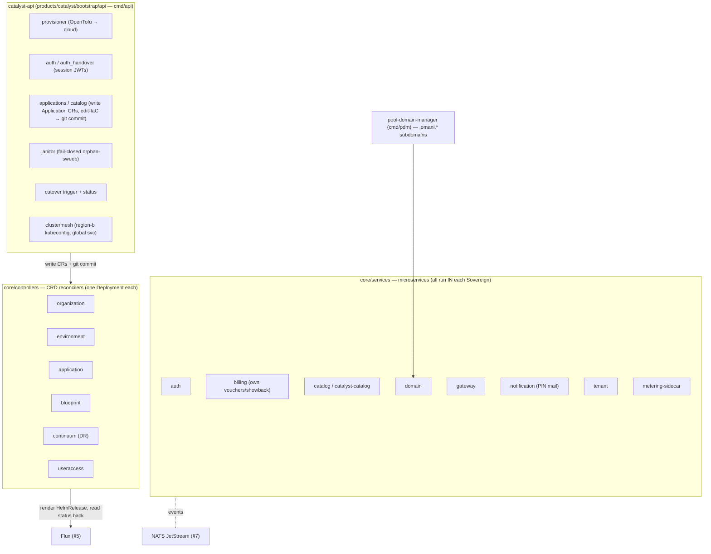

- **9 controllers** (`core/controllers/*`): `organization`, `environment`, `application`, `blueprint`,
  `continuum`, `useraccess` (+ `sandbox` legacy). Each drives one CRD to `Ready` by rendering a `HelmRelease`
  and **reading its status back** — never reporting `Ready` over orphaned bytes (#3687).
- **11 microservices** (`core/services/*`): `auth`, **`billing`** (per-Sovereign BSS), `catalog` +
  `catalyst-catalog`, `domain`, `gateway`, `metering-sidecar` (showback), `notification`, `provisioning`,
  `tenant`, `shared`.
- **CRD types** live in `core/pkg/apis/<kind>/v1alpha1/`. Groups: `apps.openova.io` (Application),
  `orgs.openova.io` (Organization), `catalyst.openova.io` (Blueprint), `dr.openova.io` (Continuum).

---

## 7. The streaming / event architecture (NATS JetStream + projector + SSE — CQRS)

The control plane is **event-driven**. Services don't poll each other — they publish to and consume from
**NATS JetStream**. The read side is **CQRS**: a **projector** materialises a live view into **Valkey**,
and the catalyst-api streams it to the console over **SSE**.

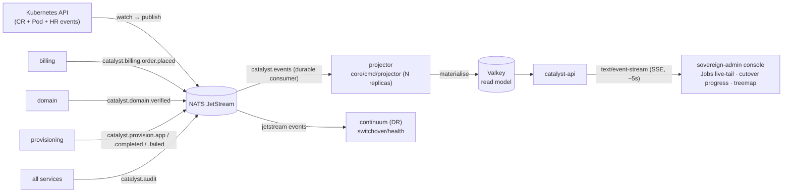

- **Streams/subjects (the bus):** `catalyst.events` (K8s resource events → projector), `catalyst.billing.*`
  (e.g. `order.placed`), `catalyst.domain.*` (e.g. `verified`), `catalyst.provision.*`
  (`app`/`completed`/`failed`), `catalyst.audit`, `auth.events`.
- **Why CQRS:** each catalyst-api replica needs its own SSE view; the projector fans the JetStream into
  Valkey so every replica serves a consistent, cheap live stream (the "Live state stream re-attached —
  refreshing every 5s" banner on the Jobs/cutover pages is this pipeline).
- **Continuum** consumes JetStream too (`continuum/internal/events/jetstream.go`) for DR
  switchover/health signalling.

---

## 8. Provisioning lifecycle (click → running app)

Two nested flows: **(A) fire a Sovereign** (mothership, one-time), then **(B) onboard an Org** (Git-driven).

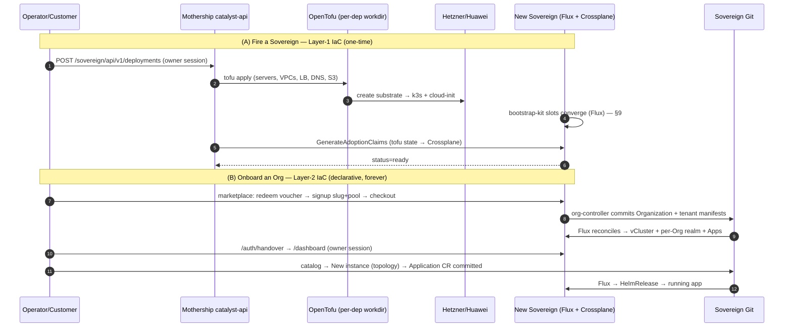

Canonical endpoints: create `POST /sovereign/api/v1/deployments` (owner session, **not** the handover JWT);
destroy `POST .../{id}/wipe`; record-only `DELETE .../{id}`. Never call cloud CLIs directly for shared-infra
writes.

---

## 9. Bootstrap-kit — the dependency DAG (not a list)

`clusters/_template/bootstrap-kit/` is applied by Flux, but the order is a **dependency graph**, not a line.
The critical edges:

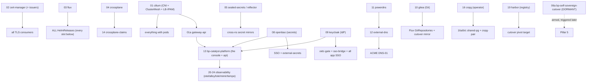

Read it as: **cilium is the floor** (no pod networks without it); **cert-manager** gates every TLS surface;
**flux** must exist before any HelmRelease; **keycloak + openbao** gate all SSO; **cnpg** precedes the
shared-pg trio; **harbor** lands late (it's the cutover pivot target); **slot 06a is the cutover chart,
installed dormant** and triggered only for Pillar 5. Lockstep gates
(`check-bootstrap-kit-pin-sync.sh`) keep a chart's version identical across the slot, the catalog-seed, and
the generated UI.

---

## 10. Blueprint delivery (source → running cluster)

```mermaid
graph LR
  SRC["platform/&lt;x&gt; or products/&lt;x&gt;<br/>chart/ + blueprint.yaml"] -->|CI on tag| OCI["ghcr.io/openova-io/bp-x:semver (signed)"]
  OCI -->|"deploy-bot bumps pin LINES (never blanket)"| SEED["catalog-seed blueprints.yaml"]
  SEED -->|"mirror to Sovereign Gitea (daily; Harbor after cutover)"| GIT["Sovereign Git + registry"]
  GIT -->|Flux GitRepository/HelmRepository| HR["HelmRelease per Application"]
  HR --> RUN["running workload"]
  RUN -->|fresh-prov walk + screenshot| PROVE["'delivered' (merged ≠ delivered)"]
```

- **Component Blueprints** (`platform/`, ~105): one per upstream OSS. **Composite Blueprints**
  (`products/`, 13): OpenOva's own (`agenity`, `axon`, `openova-mcp`, `continuum`, `openova-flow`,
  `catalyst` umbrella).
- **Lockstep pins** are the #1 "merged-but-not-delivered" trap: a version lives in Chart.yaml,
  blueprint.yaml, the catalog-seed, the bootstrap-kit slot, and the generated UI — CI gates force them to
  move together.

---

## 11. Multi-region & DR (Pillars 2 + 3)

Two regions wired by **Cilium ClusterMesh**; Postgres is **CNPG active-hot-standby**; DR is modelled by
**Continuum** CRs (`dr.openova.io`).

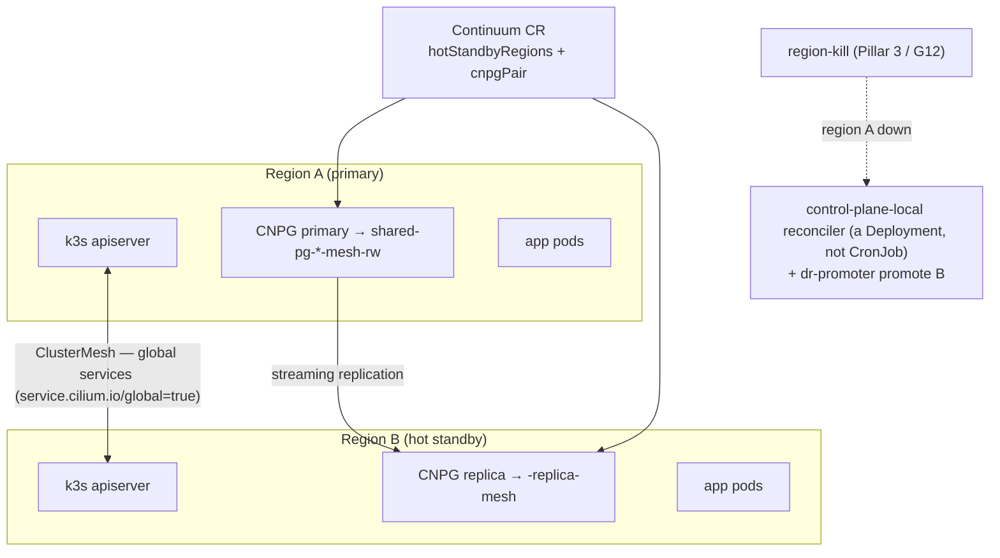

Gotchas (banked as hard-won memories): global `-mesh-rw` services **must mirror** across the mesh (a broken
mirror is exactly UAT row 235 / grafana); `ipBlock` NetworkPolicies never match ClusterMesh remote
identities — use `fromEndpoints`; the region-local reconciler must be a **Deployment** so it survives the kill.

---

## 12. Sovereignty cutover (Pillar 5 — the headline)

`bp-self-sovereign-cutover` (dormant at slot 06a) runs an **11-step chain** that severs all 8 mothership
tethers and proves independence with a 10-minute egress block. State lives in the
`catalyst/self-sovereign-cutover-status` ConfigMap.

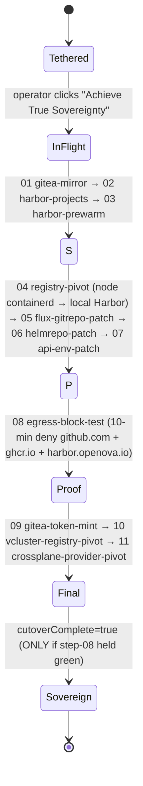

**No cutover claim without the egress-block proof.** A *mid-cutover* Sovereign can't receive fixes (the
registry is pivoting) — it must re-fire. Chart: `platform/self-sovereign-cutover/chart`.

---

## 13. Identity & SSO

One Keycloak per Sovereign; every app fronted by **`oidc-gate`** (per-app OIDC proxy); client secrets kept
in lockstep by the **`sso-bridge`** reconciler (re-mints each tick, ~60s, so a stale secret never 401s).
Cross-system owner handoff = a signed **RS256 handover JWT**.

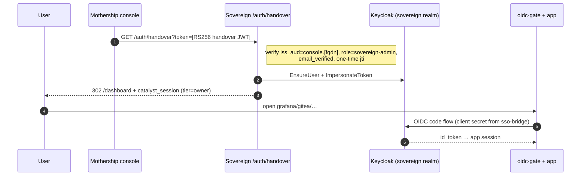

End-user login is a **passwordless PIN** (mailed via the notification service). Handover-key rotation
gotcha: if the mothership key rotates *after* a prov, that Sovereign's injected verify-pubkey goes stale —
compare fingerprints before assuming a handover is broken.

---

## 14. The per-Org agentic layer (Pillar 4)

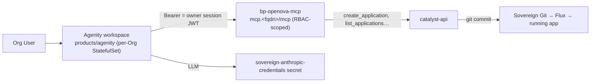

`bp-openova-mcp` (Go, `products/openova-mcp`) lets the in-Org agent mutate the Org **within the caller's
RBAC**. The agent's Anthropic credential is seeded at prov — its expiry is a live operational dependency.

---

## 15. Harness engineering — how we prove it (this is the job)

Deliverable ≠ "PR merged." Deliverable = **"a fresh provision walked through a pillar step produced a
screenshot + non-empty wire-capture + working artifact."** The acceptance ledger is the north star.

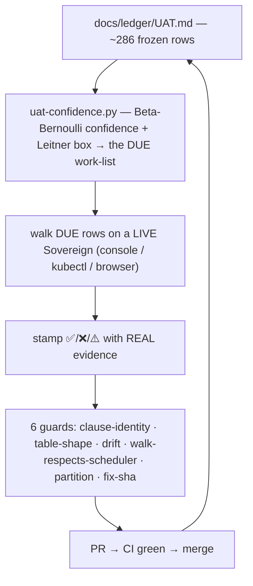

Rules that keep it honest ([`PRINCIPLES.md`](PRINCIPLES.md) + [`PROTOCOL.md`](PROTOCOL.md)): **never
fabricate a pass** (a ❌ with evidence beats a forced ✅); guards fail any green flip the scheduler didn't
mark *due* and any ✅ citing a wiped env; when a browser walk is blocked, **the runtime CR/Service state via
kubectl is authoritative**. State ledgers: [`ledger/TRUST.md`](ledger/TRUST.md),
[`ledger/TRACKER.md`](ledger/TRACKER.md), [`ledger/UAT.md`](ledger/UAT.md),
[`ledger/PATH-TO-100.md`](ledger/PATH-TO-100.md).

---

## 16. Deep-dive: the janitor (a worked "read one subsystem" example — UAT row R1)

**File:** `products/catalyst/bootstrap/api/internal/handler/janitor.go`.
- `StartJanitor()` → after 5 min, `runJanitorPass()` on a timer.
- **Fail-safe reap:** `switch status { case "failed": …; case "wiped": … }` — only those two become
  eligible; `ready`/`provisioning`/`active` match no case → **protected by default.**
- **Two safety layers:** active deployment IDs are hard-excluded (`buildActivePrefixes` → logs
  `skipped (active deployment)`); every cloud sweep is **log-only** unless `CATALYST_JANITOR_DESTRUCTIVE=true`
  (logs `would-reap`).
- **Why:** the `b9f9590b` self-reap deleted all 12 ECS nodes ~2.5 min after an ungated sweep.
- **Tests:** `janitor_reap_protection_test.go`, `janitor_wouldreap_5545_test.go`.

Every UAT row reads this way: **clause → the code that implements it → the test that guards it → the live
evidence that proves it.** That is the takeover skill.

---

## 17. Day-1 runbook for the new lead

1. **Read order:** this doc → GLOSSARY → STATUS → DOD → PRINCIPLES → PROTOCOL → RUNBOOKS.
2. **See it live:** pull a Sovereign's kubeconfig (mothership catalyst-api PVC
   `/var/lib/catalyst/kubeconfigs/<dep-id>.yaml`) → `kubectl get organizations,applications,continuums -A`,
   `flux get all -A`, `kubectl get gitrepositories,helmreleases -A`.
3. **Trace one pillar:** pick a UAT ✅ row → read clause → find code → run its test → re-verify live.
4. **Ship one change:** issue → branch → fix → PR `Refs #N` → CI green → merge → **verify the roll** (merged ≠ delivered).
5. **Fire a fresh prov** (autonomous, our infra): `POST /deployments` → converge → walk the DUE rows.

**Golden rules:** same code in every Sovereign · **Sovereigns are 100% independent (zero call-home) —
cutover proves it** · billing is per-Sovereign · Git is the source of truth, Flux + Crossplane converge ·
no NodePorts, ever · merged ≠ delivered · never fabricate a result.

---

*Companion to the canonical docs. On any conflict, [`GLOSSARY.md`](GLOSSARY.md) /
[`ARCHITECTURE.md`](ARCHITECTURE.md) / [`STATUS.md`](STATUS.md) win — fix this file.*
