# OpenOva / Catalyst — System Design & Onboarding

> **Audience:** an incoming lead developer / CTO taking over the build via harness engineering.
> **Goal:** understand the whole system top-to-bottom — the domain model, the control plane, how a
> customer goes from click to running app, how a Sovereign becomes self-hosting, and how we *prove*
> any of it works. Read this first, then [`ARCHITECTURE.md`](ARCHITECTURE.md) (target state),
> [`DOD.md`](DOD.md) (Definition of Done), [`PRINCIPLES.md`](PRINCIPLES.md) and [`PROTOCOL.md`](PROTOCOL.md)
> (how we work), and [`GLOSSARY.md`](GLOSSARY.md) (terms — wins over everything).

---

## 0. The one-paragraph mental model

**OpenOva** (the company) builds **Catalyst** (the platform). A *deployed* Catalyst is a **Sovereign** —
a self-contained, multi-region Kubernetes-based cloud that a partner (Omantel, National Cloud, …) runs
under their own brand. **We** run a reference Sovereign called the **mothership** (`openova`) that also
acts as the provisioning + billing control plane that *fires* new Sovereigns. Inside a Sovereign,
customers are **Organizations**, which hold **Environments**, which run **Applications**, which are
installed from **Blueprints** (versioned OCI artifacts). The endgame (Pillar 5) is **sovereignty
cutover**: a Sovereign severs all 8 ties to the mothership and runs entirely on its own registry +
GitOps, proven by a 10-minute egress-block self-test. **Same code in every Sovereign.**

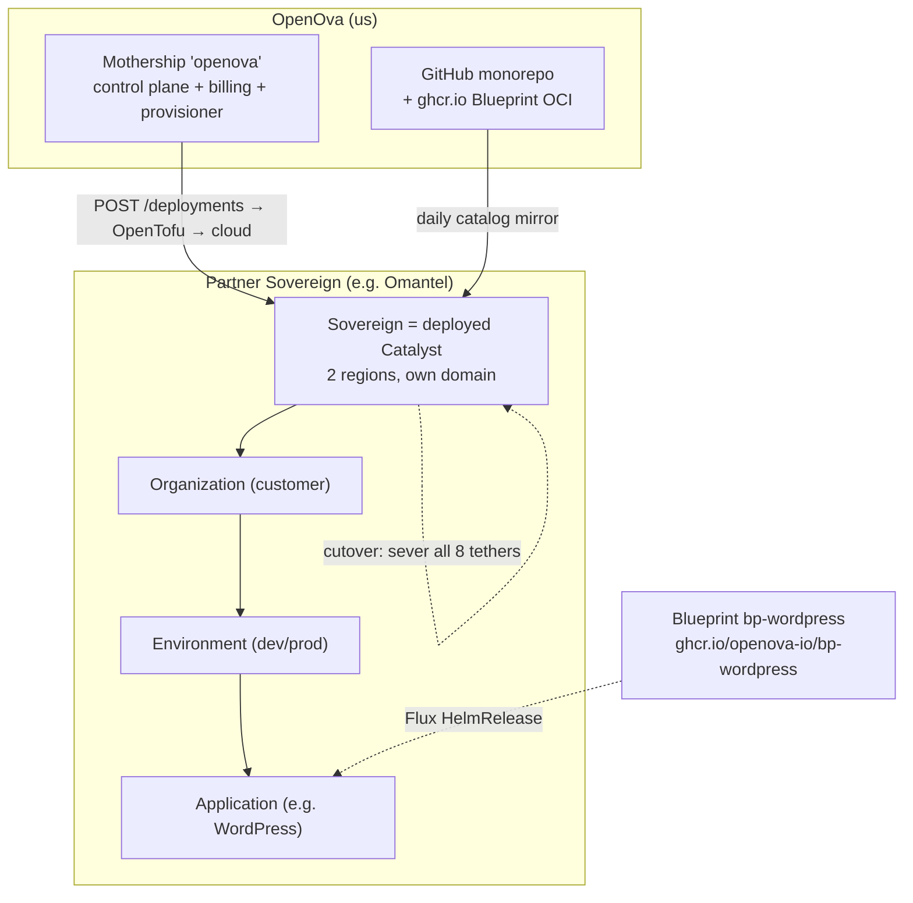

---

## 1. Domain model (the nouns — learn these cold)

Everything is a strict containment hierarchy. The [`GLOSSARY.md`](GLOSSARY.md) has the banned-terms list;
use these exact words.

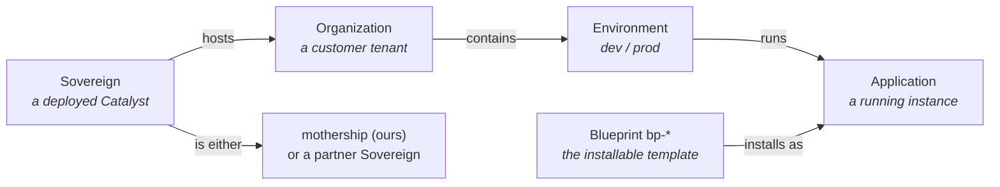

| Term | Is | Backed by (runtime) |
|---|---|---|
| **Sovereign** | a deployed Catalyst (a whole multi-region cloud) | a set of k3s clusters + the Catalyst control plane |
| **Organization** | a customer tenant | `Organization` CR (`orgs.openova.io`) + a vCluster (paid tiers) or host namespace (free/S) |
| **Environment** | a workspace inside an Org (dev/prod) | `Environment` CR + a namespace |
| **Application** | a running instance | `Application` CR (`apps.openova.io`) → a Flux `HelmRelease` |
| **Blueprint** | the installable template | `ghcr.io/openova-io/bp-<name>:<semver>` OCI (Helm chart + `blueprint.yaml`) |

**Naming conventions** (full table in [`ARCHITECTURE.md`](ARCHITECTURE.md) §4): cluster
`{prov}-{reg}-{bb}-{env}` · vcluster `{org}` · Environment `{org}-{env}` · Blueprint `bp-<name>` ·
Application `<purpose>`.

---

## 2. The 5-pillar Definition of Done (the "why" behind every row)

The product is only "done" when an operator can walk a **fresh provision** through all five. This is the
spine of the acceptance ledger ([`ledger/UAT.md`](ledger/UAT.md), ~286 rows). Full text in [`DOD.md`](DOD.md).

1. **Marketplace + voucher onboarding** — a customer buys/redeems and gets a live Org.
2. **Multi-region BCP topology choice at signup** — active-active / active-hot-standby / singleton.
3. **Two CNPG clusters + region-kill failover** — kill a region, data + control survive.
4. **Per-Org Agenity workspace + `bp-openova-mcp`** — an in-Org AI agent that can `create_application`.
5. **Sovereign independence post-cutover** — the 11-step `bp-self-sovereign-cutover` chain + egress-block proof.

---

## 3. Repository map (the monorepo)

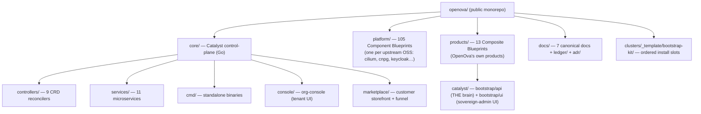

**Per-folder isolation:** each `platform/<x>` and `products/<x>` is the *source of one Blueprint*. CI
fans out to `ghcr.io/openova-io/bp-<name>:<semver>`. There are **no** separate per-Blueprint git repos.

### 3.1 ⚠️ There are FOUR front-end trees — grep all four before saying "the UI doesn't do X"

| Path | package | What it is |
|---|---|---|
| `core/console/` | `org-console` | per-**Organization** tenant console (signed-in User) |
| `core/marketplace/` | `org-marketplace` | **customer storefront + funnel** (signup, catalog, checkout, voucher redeem) |
| `products/catalyst/console/` | `catalyst-console` | Catalyst-side console assets |
| `products/catalyst/bootstrap/ui/` | `ui` | **the sovereign-admin console** (`src/pages/sovereign/…`) — apps grid, jobs, topology, cutover |

Most operator-facing acceptance rows live in **`bootstrap/ui`**. Customer-funnel rows live in **`core/marketplace`**.

---

## 4. Control plane architecture

The control plane is Go. Two shapes: **the catalyst-api** (a monolith-ish HTTP brain) and **the
controllers** (Kubernetes reconcilers). It runs *both* on the mothership (to fire Sovereigns) and inside
each Sovereign (to run that Sovereign).

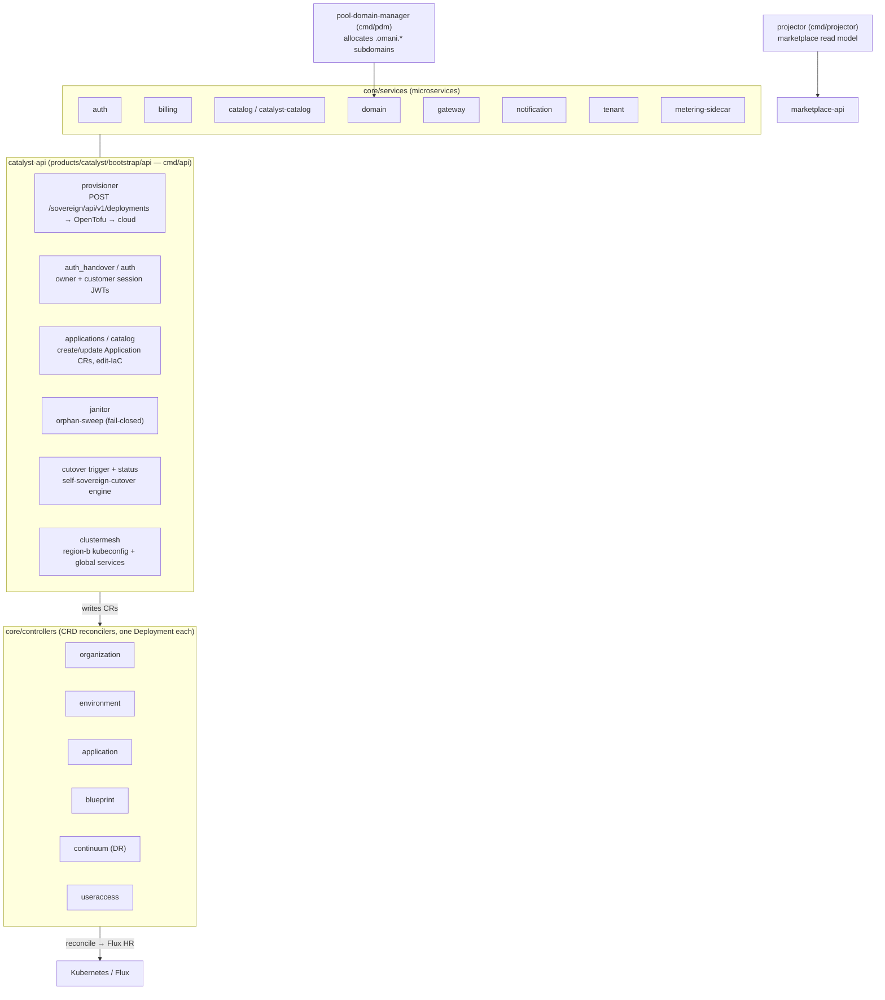

### 4.1 The 9 controllers (`core/controllers/*`) — the reconcile loops
`organization` · `environment` · `application` · `blueprint` · `continuum` (DR) · `useraccess` ·
`sandbox` (legacy) · plus shared `internal/` + `pkg/`. Each owns one CRD kind and drives it to `Ready`
by rendering a Flux `HelmRelease` and reading its status back (**never** report `Ready` over orphaned bytes — #3687).

### 4.2 The CRD / reconciler model

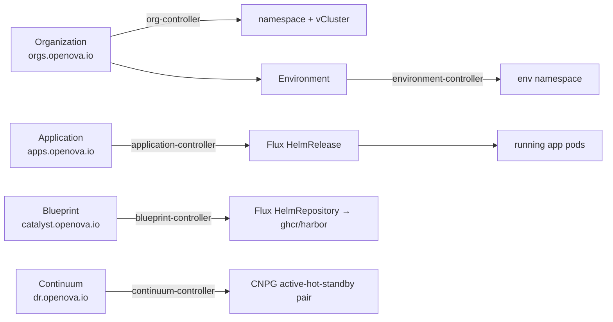

CRD Go types live in `core/pkg/apis/<kind>/v1alpha1/` (mirrored into `core/controllers/pkg/apis/`).

### 4.3 The 11 microservices (`core/services/*`)
`auth` (sessions/JWT) · `billing` (BSS/vouchers) · `catalog` + `catalyst-catalog` (Blueprint catalog +
in-cluster fallback) · `domain` (DNS) · `gateway` (edge) · `metering-sidecar` (showback) ·
`notification` (mail/PIN) · `provisioning` (fresh-prov + cutover-aware gitops) · `tenant` (per-Org) ·
`shared` (auth/claims/utilities).

### 4.4 Standalone binaries (`cmd/*`)
`api` (catalyst-api) · `catalyst-dns` · `verify-purge` · `projector` (marketplace read model) ·
`k8s-ws-proxy` (terminal/WS) · `cert-manager-dynadot-webhook` (ACME DNS-01 via Dynadot) ·
`pdm` (pool-domain-manager) · `catalog` · `sandbox-controller` · `openova-flow-server` +
`openova-flow-adapter-flux` · `openova-mcp` · `evs-csi-plugin` (Huawei).

---

## 5. The provisioning lifecycle (click → running app)

Two nested flows: **(A) fire a Sovereign** (mothership → cloud), then **(B) onboard an Org** (funnel → vCluster → apps).

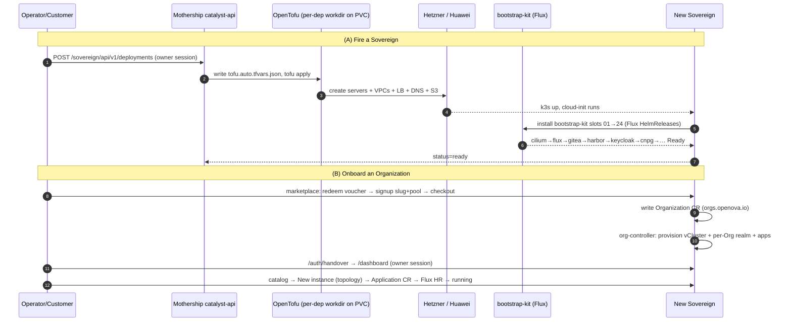

**Canonical endpoints (memorise):**
- Create: `POST https://console.openova.io/sovereign/api/v1/deployments` (owner session cookie, **not** the handover JWT).
- Destroy: `POST .../deployments/{id}/wipe` (tofu destroy + cloud cleanup, atomic). Record-only: `DELETE .../{id}`.
- Never call `hcloud`/cloud CLIs directly for shared-infra writes (L2 in the root CLAUDE.md).

### 5.1 The bootstrap-kit (`clusters/_template/bootstrap-kit/`) — ordered install on a fresh cluster
Flux applies slots in a strict dependency order. Learn the shape:

```
01 cilium → 01a gateway-api → 02 cert-manager (+issuers) → 03 flux → 04 crossplane →
05 sealed-secrets/reflector → 06 dragonfly → 06a bp-self-sovereign-cutover (dormant) →
07 nats → 08 openbao → 09 keycloak → 10 gitea → 11 powerdns(+admin) → 12 external-dns →
13 bp-catalyst-platform (+sso-bridge, oidc-gate, openova-mcp) → 14 crossplane-claims →
15 external-secrets → 16 cnpg (+shared-pg a/b/c, cnpg-pair) → 17 valkey → 18 seaweedfs →
19 harbor → 20-24 observability (otel, alloy, loki, mimir, tempo)
```
**Slot 06a is the cutover chart, installed dormant** — it arms Pillar 5 but does nothing until triggered.

---

## 6. The Blueprint system (how software gets delivered)

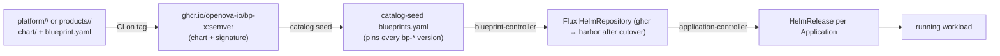

- **Component Blueprints** (`platform/`, ~105): one per upstream OSS (cilium, cnpg, keycloak, harbor…).
- **Composite Blueprints** (`products/`, 13): OpenOva's own — `agenity`, `axon`, `openova-mcp`,
  `continuum`, `openova-flow`, `catalyst` (the umbrella), etc.
- **Lockstep pins:** a chart version lives in *several* places at once (Chart.yaml, blueprint.yaml,
  catalog-seed, bootstrap-kit slot, generated UI). CI gates enforce they move together
  (`scripts/check-catalog-seed-lockstep.sh`, `check-bootstrap-kit-pin-sync.sh`). This is a frequent
  source of "merged but not delivered" bugs — see [`PRINCIPLES.md`](PRINCIPLES.md) anti-patterns.
- **Delivery:** the `deploy-bot` bumps pins per-line (never blanket), Gitea mirrors the catalog daily,
  Flux reconciles. **Merged ≠ delivered** until the image/chart rolls and a fresh-prov walk proves it.

---

## 7. Multi-region & disaster recovery (Pillars 2 + 3)

A Sovereign is **two regions** (`me-east-215-a` / `-b`) wired by **Cilium ClusterMesh**. Postgres is
**CNPG active-hot-standby** pairs; DR is modelled by **Continuum** CRs.

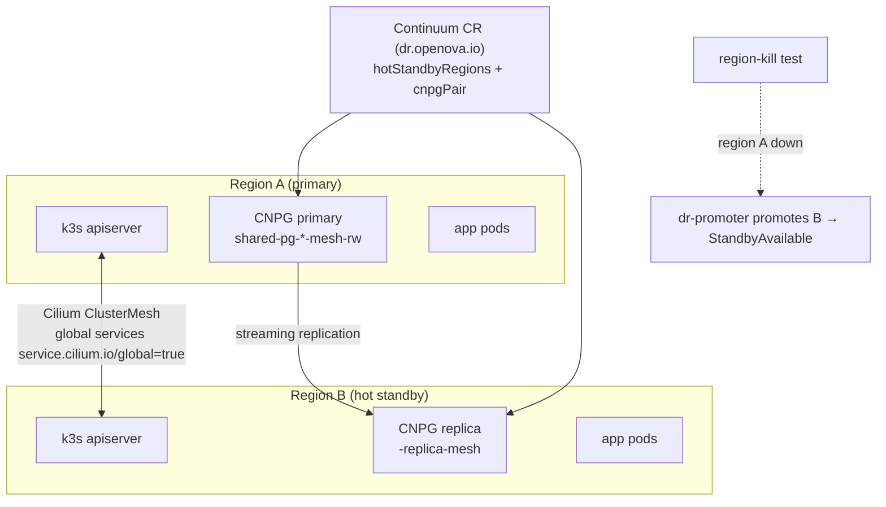

- **Region-kill (Pillar 3 / gate G12):** kill region A; region B's control-plane-local reconciler +
  dr-promoter keep the Sovereign serving and promote the standby. The reconciler must be a **Deployment,
  not a CronJob**, so it survives the kill.
- **Cross-region gotchas** (banked as memories): global `-mesh-rw` services must *mirror* across the mesh
  (a broken mirror is exactly UAT row 235 / grafana); `ipBlock` NetworkPolicies never match ClusterMesh
  remote identities — use `fromEndpoints`.

---

## 8. Sovereignty cutover (Pillar 5 — the headline)

`bp-self-sovereign-cutover` (dormant at slot 06a) runs an **11-step chain** that severs all 8 mothership
tethers and proves independence with a 10-minute egress block.

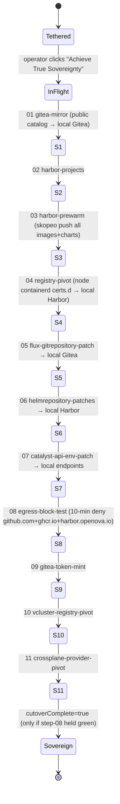

State is tracked in the `catalyst/self-sovereign-cutover-status` ConfigMap. **No cutover claim without the
egress-block proof.** A *mid-cutover* Sovereign cannot receive fixes (registry is pivoting) — merged never
becomes delivered until it re-fires. Chart: `platform/self-sovereign-cutover/chart`.

---

## 9. Identity & SSO

One Keycloak per Sovereign; every app is fronted by **`oidc-gate`** (a per-app OIDC reverse proxy) and its
client secrets are kept in lockstep by the **`sso-bridge`** reconciler. Cross-system owner handoff uses a
signed **handover JWT**.

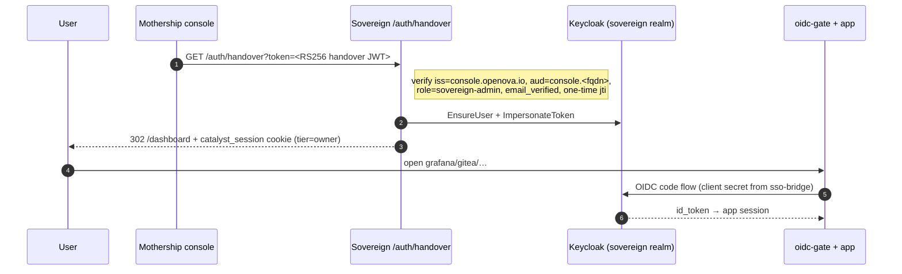

- **`sso-bridge`** re-mints each app's OIDC client secret every tick (~60s) so a stale secret never 401s.
- **Handover key** is an RS256 keypair distributed at cloud-init; the mothership signs, the Sovereign
  verifies with its injected pubkey. If the mothership key *rotates* after a prov, that Sovereign's
  injected pubkey goes stale (compare fingerprints before assuming a handover is broken).
- Login for end users is a **passwordless PIN** (mailed via the notification service).

---

## 10. The per-Org agentic layer (Pillar 4)

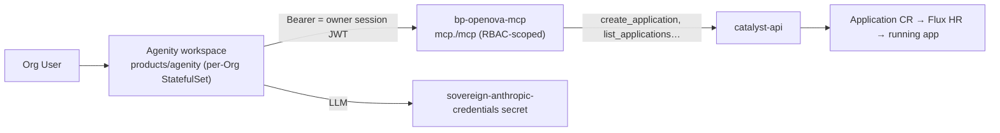

`bp-openova-mcp` is an RBAC-scoped MCP server (Go, `products/openova-mcp`) that lets the in-Org agent
mutate the Org (e.g. `create_application`) *within the caller's RBAC*. The agent's Anthropic credential is
a shared OAuth token seeded at prov (its expiry is a live operational dependency — the source of the
"agentic pillar down" class of incidents).

---

## 11. Delivery & GitOps (how a change reaches a running cluster)

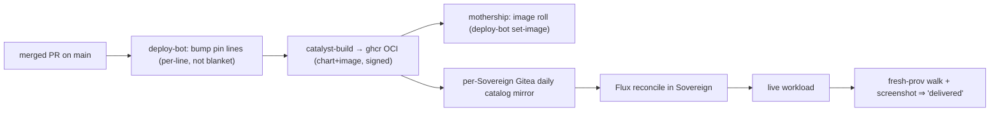

**Pre-cutover** pulls from GitHub + ghcr; **post-cutover** pulls exclusively from the local Gitea + Harbor.
A *running* Sovereign absorbs merged fixes by **image roll** — you rarely need to re-provision to ship code
(the "never wipe a working Sovereign to deploy code" rule). Wipe only for infra-shape changes or a genuinely
unrecoverable env.

---

## 12. Harness engineering — how we prove it (this is the job)

The deliverable is not "PR merged" — it is **"a fresh provision walked through a pillar step produced a
screenshot + non-empty wire-capture + working artifact."** The acceptance ledger is the north star.

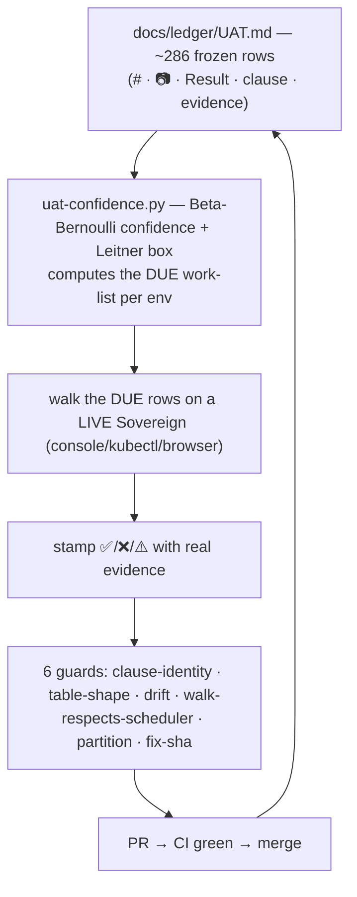

**The rules that keep it honest** (full set in [`PRINCIPLES.md`](PRINCIPLES.md) + [`PROTOCOL.md`](PROTOCOL.md)):
- **Never fabricate** a pass. A ❌ with real evidence beats a forced ✅. Guards fail any green flip the
  scheduler didn't mark *due* (this is the treadmill-refusal gate) and any ✅ citing a wiped predecessor env.
- **When a browser walk is blocked, verify the runtime outcome via kubectl** — the CR/Service state is
  authoritative (how rows 238/93/14 were banked).
- **15 Inviolable Principles + an anti-pattern catalog** ([`PRINCIPLES.md`](PRINCIPLES.md)): null-guards on
  empty data, `enabled:false` defaults, `Closes #N` on scaffold-only PRs, `--dry-run=server` as the only
  validator — these are *clues to investigate*, not approval.
- **Ledgers of state:** [`ledger/TRUST.md`](ledger/TRUST.md) (per-surface verification),
  [`ledger/TRACKER.md`](ledger/TRACKER.md) (open work), [`ledger/UAT.md`](ledger/UAT.md) (the acceptance walk),
  [`ledger/PATH-TO-100.md`](ledger/PATH-TO-100.md) (each non-green row → its exact fix).

---

## 13. Low-level deep-dive: the janitor (worked example)

A concrete "read one subsystem end-to-end" example (it's UAT row **R1**).
**File:** `products/catalyst/bootstrap/api/internal/handler/janitor.go`.

- `StartJanitor()` → after 5 min, `runJanitorPass()` on a timer.
- **Record reap (the fail-safe):** a `switch status { case "failed": …; case "wiped": … }` — *only* those
  two statuses become reap-eligible; `ready`/`provisioning`/`active` match no case → **protected by default.**
- **Two safety layers:** the currently-active deployment IDs are hard-excluded (`buildActivePrefixes` →
  logs `skipped (active deployment)`), and every cloud sweep is **log-only** unless
  `CATALYST_JANITOR_DESTRUCTIVE=true` (logs `would-reap`).
- **Why it exists:** the `b9f9590b` self-reap deleted all 12 ECS nodes ~2.5 min after an ungated sweep.
- **Tests:** `janitor_reap_protection_test.go`, `janitor_wouldreap_5545_test.go`.

Every UAT row can be read this way: clause → the code that implements it → the test that guards it → the
live evidence that proves it. That is the takeover skill.

---

## 14. Day-1 runbook for the new lead

1. **Read order:** this doc → GLOSSARY → STATUS (what's actually built) → DOD → PRINCIPLES → PROTOCOL → RUNBOOKS.
2. **See it live:** get a Sovereign's kubeconfig (via the mothership catalyst-api PVC at
   `/var/lib/catalyst/kubeconfigs/<dep-id>.yaml`), `kubectl get organizations,applications,continuums -A`.
3. **Trace one pillar:** pick any UAT ✅ row → read its clause → find the code → run its test → re-verify live.
4. **Ship one change:** open an issue → branch → fix → PR with `Refs #N` → CI green → merge → verify the roll.
5. **Fire a fresh prov** (autonomous, our own infra): `POST /deployments` → converge → walk the DUE rows.
   Everything about lifecycle, credentials, and wipe endpoints is in [`RUNBOOKS.md`](RUNBOOKS.md) +
   [`PROTOCOL.md`](PROTOCOL.md).

**Golden rules:** same code in every Sovereign · no NodePorts, ever · merged ≠ delivered · prove on a fresh
prov · never fabricate a result.

---

*Generated as an onboarding companion to the canonical docs. If any statement here disagrees with
[`GLOSSARY.md`](GLOSSARY.md) / [`ARCHITECTURE.md`](ARCHITECTURE.md) / [`STATUS.md`](STATUS.md), the canonical
doc wins — fix this file.*
