# OpenOva — Status Tracker

Regenerated every 15 min by `/home/openova/bin/refresh-dod-dashboard.sh`. Every `#NNNN` is a clickable GitHub link.

|  |  |
|---|---|
| Last refreshed | `2026-05-20T06:44:47Z` |
| Open issues | 34 |
| Open DoD gates | 6 / 41 |
| Open TBD-* regressions | 27 |
| DoD completion |  35 / 41 = 85% |

**Legend:**  done ·  fix shipped, awaits prov ·  open ·  deferred

---

## 1. Customer journey (founder's success criterion)

| # | Step | Status | Blocking issue |
|---|---|---|---|
| 1 | Operator issues voucher |  | — |
| 2 | Email arrives in recipient inbox |  | [#1741](https://github.com/openova-io/openova/issues/1741) → blocked by [#1793](https://github.com/openova-io/openova/issues/1793) |
| 3 | Recipient hits redeem landing |  | — |
| 4 | Recipient creates org + checkout |  | — |
| 5 | tenant.created → Organization CR |  | [#1900](https://github.com/openova-io/openova/issues/1900) closed |
| 6 | Organization CR exists |  | — |
| 7 | vCluster + Keycloak + Gitea materialize |  | [#1906](https://github.com/openova-io/openova/issues/1906) [#1901](https://github.com/openova-io/openova/issues/1901) closed; t32 verifies |
| 8 | Tenant subdomain HTTPS responds |  | [#1907](https://github.com/openova-io/openova/issues/1907) closed; t32 verifies |

t32 (live now): `console.t32.omani.works` returns HTTP 200 + envoy. Handover fired 2026-05-19T05:05:24Z.

---

## 2. Open-issue blocking graph

**All 34 open issues** grouped by where they sit in the convergence sequence. Each chain runs left-to-right; chains stack vertically.

> 💡 GitHub strips click handlers from rendered mermaid for security — every node label below has a 1:1 entry in the **clickable index** that follows the diagram.

```mermaid
flowchart LR
  classDef epic fill:#1f6feb,stroke:#0d419d,color:#fff,stroke-width:3px
  classDef open  fill:#cf222e,stroke:#a40e26,color:#fff,stroke-width:2px
  classDef wait  fill:#bf8700,stroke:#9a6700,color:#fff,stroke-width:2px
  classDef done  fill:#2ea043,stroke:#1a7f37,color:#fff,stroke-width:2px
  classDef defer fill:#6e7781,stroke:#4f555c,color:#fff,stroke-width:2px

  %% === EPIC: Customer Journey (voucher → tenant → WordPress) ===
  E_CJ(("Customer Journey")):::epic
  E_CJ --> I1793["#1793 SMTP creds missing"]:::wait
  I1793 --> I1741["#1741 Voucher email in 60s"]:::open
  I1741 --> D1842["#1842 D28 Voucher UI + email"]:::wait
  E_CJ --> I1723["#1723 WordPress install"]:::open
  E_CJ --> I1724["#1724 Gitea /git/refs/heads"]:::open
  I1723 --> D1829["#1829 D29 Zero-touch tenant"]:::wait
  I1724 --> D1829

  %% === EPIC: Multi-region Sovereign ===
  E_MR(("Multi-region")):::epic
  E_MR --> I1904["#1904 Fan-out regression"]:::wait
  I1904 --> D1808["#1808 D5 /cloud 3 regions"]:::wait
  I1904 --> D1817["#1817 D16 L1/L2 fan-out"]:::wait
  I1904 --> D1820["#1820 D19 Apps/Cloud counter"]:::open
  I1904 --> D1821["#1821 D20 Jobs region filter"]:::open

  %% === EPIC: Auth & SSO ===
  E_AUTH(("Auth & SSO")):::epic
  E_AUTH --> I1905["#1905 auth.fqdn hijack"]:::open
  I1905 --> D1807["#1807 D4 Keycloak PIN-login"]:::open

  %% === EPIC: Sandbox runtime + audit trail ===
  E_SBX(("Sandbox")):::epic
  E_SBX --> I1899["#1899 Gitea mirror lag"]:::open
  I1899 --> D1747["#1747 D11 Sandbox E2E"]:::wait
  E_SBX --> I1776["#1776 NATS publisher"]:::open
  I1776 --> D1835["#1835 D35 NATS round-trip"]:::wait

  %% === EPIC: Data plane (CNPG + LLM) ===
  E_DATA(("Data plane")):::epic
  E_DATA --> D1831["#1831 D31 CNPG active-hot-standby"]:::open
  E_DATA --> D1834["#1834 D34 newapi LLM gateway"]:::open

  %% === EPIC: SME billing (gateway 503 + purchase) ===
  E_SME(("SME billing")):::epic
  E_SME --> I1748["#1748 C9 voucher list 503"]:::open
  E_SME --> I1749["#1749 C10 voucher issue 503"]:::open
  E_SME --> I1750["#1750 C15 purchase 404"]:::open

  %% === EPIC: Observability + cosmetic ===
  E_OBS(("Observability")):::epic
  E_OBS --> I1728["#1728 E4 Treemap coverage"]:::open
  E_OBS --> I1734["#1734 G5 Hubble inter-region"]:::open
  E_OBS --> I1882["#1882 A28 kubeconfig 409"]:::open

  %% === EPIC: Parked (post-MVP) ===
  E_PARK(("Parked post-MVP")):::epic
  E_PARK --> I1726["#1726 D12 Anthropic OAuth"]:::defer
  E_PARK --> I1727["#1727 D13 anti-abuse"]:::defer
  E_PARK --> I1741b["#1741 Voucher IMAP write-cov"]:::defer

  %% === EPIC: Deferred architectural ===
  E_DEF(("Deferred arch")):::epic
  E_DEF --> D1841["#1841 A6 Provider-mix"]:::defer

  %% === EPIC: Completed today (2026-05-19) ===
  E_DONE(("Completed today")):::epic
  E_DONE --> C1806["#1806 D3 PIN-login ✓"]:::done
  E_DONE --> C1815["#1815 D14 re-login ✓"]:::done
  E_DONE --> C1827["#1827 D26 CSP fonts ✓"]:::done
  E_DONE --> C1773["#1773 D0 redirect ✓"]:::done
  E_DONE --> C1795["#1795 C4-fup toggle ✓"]:::done
  E_DONE --> C1880["#1880 t27 timeout ✓"]:::done

  %% === EPIC: t31 TLS chain VICTORY (2026-05-18/19) ===
  E_TLS(("t31 TLS VICTORY")):::epic
  E_TLS --> P1888["PR #1888 cilium-gw"]:::done
  E_TLS --> P1889["PR #1889 sovereign-tls"]:::done
  E_TLS --> P1892["PR #1892 listeners"]:::done
  E_TLS --> P1894["PR #1894 IaC eval"]:::done
  E_TLS --> P1898["PR #1898 8-annot cap"]:::done

  %% === EPIC: Wave 34 PRs merged today ===
  E_W34(("Wave 34 PRs")):::epic
  E_W34 --> P1903["PR #1903 RBAC"]:::done
  E_W34 --> P1909["PR #1909 HTTPRoute"]:::done
  E_W34 --> P1910["PR #1910 Gitea path"]:::done
  E_W34 --> P1911["PR #1911 NP NS"]:::done
  E_W34 --> P1912["PR #1912 CNP 6443"]:::done
  E_W34 --> P1913["PR #1913 parent_domains"]:::done
  E_W34 --> P1914["PR #1914 SMTP code"]:::done
  E_W34 --> P1915["PR #1915 SMTP chart"]:::done
  E_W34 --> P1916["PR #1916 Gitea mirror"]:::done
  E_W34 --> P1918["PR #1918 NATS scaffold"]:::done
  E_W34 --> P1919["PR #1919 sme-gw CNP"]:::done

  %% --- Click-through to GitHub issues ---
  click I1793 "https://github.com/openova-io/openova/issues/1793" "Open #1793"
  click I1741 "https://github.com/openova-io/openova/issues/1741" "Open #1741"
  click D1842 "https://github.com/openova-io/openova/issues/1842" "Open #1842"
  click I1904 "https://github.com/openova-io/openova/issues/1904" "Open #1904"
  click D1808 "https://github.com/openova-io/openova/issues/1808" "Open #1808"
  click D1817 "https://github.com/openova-io/openova/issues/1817" "Open #1817"
  click D1820 "https://github.com/openova-io/openova/issues/1820" "Open #1820"
  click D1821 "https://github.com/openova-io/openova/issues/1821" "Open #1821"
  click I1723 "https://github.com/openova-io/openova/issues/1723" "Open #1723"
  click I1724 "https://github.com/openova-io/openova/issues/1724" "Open #1724"
  click D1829 "https://github.com/openova-io/openova/issues/1829" "Open #1829"
  click I1905 "https://github.com/openova-io/openova/issues/1905" "Open #1905"
  click D1807 "https://github.com/openova-io/openova/issues/1807" "Open #1807"
  click I1899 "https://github.com/openova-io/openova/issues/1899" "Open #1899"
  click D1747 "https://github.com/openova-io/openova/issues/1747" "Open #1747"
  click I1776 "https://github.com/openova-io/openova/issues/1776" "Open #1776"
  click D1835 "https://github.com/openova-io/openova/issues/1835" "Open #1835"
  click D1831 "https://github.com/openova-io/openova/issues/1831" "Open #1831"
  click D1834 "https://github.com/openova-io/openova/issues/1834" "Open #1834"
  click I1748 "https://github.com/openova-io/openova/issues/1748" "Open #1748"
  click I1749 "https://github.com/openova-io/openova/issues/1749" "Open #1749"
  click I1750 "https://github.com/openova-io/openova/issues/1750" "Open #1750"
  click I1726 "https://github.com/openova-io/openova/issues/1726" "Open #1726"
  click I1727 "https://github.com/openova-io/openova/issues/1727" "Open #1727"
  click I1728 "https://github.com/openova-io/openova/issues/1728" "Open #1728"
  click I1734 "https://github.com/openova-io/openova/issues/1734" "Open #1734"
  click I1741b "https://github.com/openova-io/openova/issues/1741" "Open #1741"
  click I1882 "https://github.com/openova-io/openova/issues/1882" "Open #1882"
  click D1841 "https://github.com/openova-io/openova/issues/1841" "Open #1841"
```

### 🔗 Clickable issue index (mirror of every node above)

**Voucher email:** [#1793](https://github.com/openova-io/openova/issues/1793) SMTP creds → [#1741](https://github.com/openova-io/openova/issues/1741) email reach → [#1842](https://github.com/openova-io/openova/issues/1842) D28 issuance UI

**Multi-region fan-out:** [#1904](https://github.com/openova-io/openova/issues/1904) regression → [#1808](https://github.com/openova-io/openova/issues/1808) D5 cloud · [#1817](https://github.com/openova-io/openova/issues/1817) D16 L1/L2 · [#1820](https://github.com/openova-io/openova/issues/1820) D19 Apps/Cloud counter · [#1821](https://github.com/openova-io/openova/issues/1821) D20 Jobs filter

**D29 customer journey:** [#1723](https://github.com/openova-io/openova/issues/1723) WordPress install · [#1724](https://github.com/openova-io/openova/issues/1724) Gitea path → [#1829](https://github.com/openova-io/openova/issues/1829) D29 zero-touch

**Keycloak SSO:** [#1905](https://github.com/openova-io/openova/issues/1905) auth.fqdn hijack → [#1807](https://github.com/openova-io/openova/issues/1807) D4 PIN-login flow

**Sandbox runtime:** [#1899](https://github.com/openova-io/openova/issues/1899) Gitea mirror lag → [#1747](https://github.com/openova-io/openova/issues/1747) D11 Sandbox E2E

**NATS audit:** [#1776](https://github.com/openova-io/openova/issues/1776) sandbox.requested publisher → [#1835](https://github.com/openova-io/openova/issues/1835) D35 round-trip

**CNPG / newapi:** [#1831](https://github.com/openova-io/openova/issues/1831) D31 active-hot-standby · [#1834](https://github.com/openova-io/openova/issues/1834) D34 newapi LLM gateway

**SME gateway bugs (t32):** [#1748](https://github.com/openova-io/openova/issues/1748) C9 list · [#1749](https://github.com/openova-io/openova/issues/1749) C10 issue · [#1750](https://github.com/openova-io/openova/issues/1750) C15 purchase

**TBDs needing re-walk:** [#1726](https://github.com/openova-io/openova/issues/1726) D12 Anthropic OAuth · [#1727](https://github.com/openova-io/openova/issues/1727) D13 anti-abuse · [#1728](https://github.com/openova-io/openova/issues/1728) E4 treemap · [#1734](https://github.com/openova-io/openova/issues/1734) G5 Hubble · [#1741](https://github.com/openova-io/openova/issues/1741) voucher IMAP · [#1882](https://github.com/openova-io/openova/issues/1882) A28 kubeconfig 409

**Deferred:** [#1841](https://github.com/openova-io/openova/issues/1841) A6 provider-mix canonical

**🟢 Recently completed (clickable):** [#1806](https://github.com/openova-io/openova/issues/1806) D3 PIN-login · [#1815](https://github.com/openova-io/openova/issues/1815) D14 re-login · [#1827](https://github.com/openova-io/openova/issues/1827) D26 CSP fonts · [#1773](https://github.com/openova-io/openova/issues/1773) D0 redirect · [#1795](https://github.com/openova-io/openova/issues/1795) C4-fup toggle · [#1880](https://github.com/openova-io/openova/issues/1880) t27 timeout

**🟢 t31 TLS chain VICTORY (2026-05-18/19):** [PR #1888](https://github.com/openova-io/openova/pull/1888) cilium-gw · [PR #1889](https://github.com/openova-io/openova/pull/1889) sovereign-tls · [PR #1890](https://github.com/openova-io/openova/pull/1890) bake-time secrets · [PR #1892](https://github.com/openova-io/openova/pull/1892) listener wildcards · [PR #1893](https://github.com/openova-io/openova/pull/1893) UserAccess seed · [PR #1894](https://github.com/openova-io/openova/pull/1894) IaC eval fix · [PR #1898](https://github.com/openova-io/openova/pull/1898) 8-annot cap

**🟢 Today's merged PRs (Wave 34, 2026-05-19):** [PR #1903](https://github.com/openova-io/openova/pull/1903) RBAC · [PR #1909](https://github.com/openova-io/openova/pull/1909) HTTPRoute · [PR #1910](https://github.com/openova-io/openova/pull/1910) Gitea path · [PR #1911](https://github.com/openova-io/openova/pull/1911) NP NS · [PR #1912](https://github.com/openova-io/openova/pull/1912) CNP 6443 · [PR #1913](https://github.com/openova-io/openova/pull/1913) parent_domains · [PR #1914](https://github.com/openova-io/openova/pull/1914) SMTP code · [PR #1915](https://github.com/openova-io/openova/pull/1915) SMTP chart · [PR #1916](https://github.com/openova-io/openova/pull/1916) Gitea mirror · [PR #1918](https://github.com/openova-io/openova/pull/1918) NATS scaffold · [PR #1919](https://github.com/openova-io/openova/pull/1919) sme-gateway CNP · [PR #1921](https://github.com/openova-io/openova/pull/1921) newapi DB DSN

**Concurrency cap (2026-05-19 06:59 founder ask):** max 3 parallel sub-agents. Existing 6 complete gracefully; future dispatches respect cap.

### All 34 open items (clickable table)

| # | Title | Bucket |
|---|---|---|
| [#1094](https://github.com/openova-io/openova/issues/1094) | EPIC: Catalyst Phase 0/1 — 6 EPIC unified roll-out (Compliance / Apps / RBAC / | Other |
| [#1723](https://github.com/openova-io/openova/issues/1723) | TBD-C17: Step 17 — Final WordPress install at slug.omani.homes | TBD regression |
| [#1734](https://github.com/openova-io/openova/issues/1734) | TBD-G5: Hubble inter-region pod-to-pod data plane — t22 broken, t23+ fixed via | TBD regression |
| [#1741](https://github.com/openova-io/openova/issues/1741) | TBD-Cov-7 / C6-009: Voucher email arrives in recipient IMAP within 60s | TBD regression |
| [#1808](https://github.com/openova-io/openova/issues/1808) | DoD D5: `/cloud` view: renders all 3 regions, no stuck spinners | DoD gate |
| [#1819](https://github.com/openova-io/openova/issues/1819) | DoD D18: Sovereign-side catalyst-api can self-monitor Phase-1 install state | DoD gate |
| [#1820](https://github.com/openova-io/openova/issues/1820) | DoD D19: Apps + Cloud counter consistency | DoD gate |
| [#1821](https://github.com/openova-io/openova/issues/1821) | DoD D20: Jobs page surfaces all-region jobs with region filter | DoD gate |
| [#1831](https://github.com/openova-io/openova/issues/1831) | DoD D31: Tenant application with CNPG active-hot-standby replication | DoD gate |
| [#1835](https://github.com/openova-io/openova/issues/1835) | DoD D35: NATS broker round-trips `catalyst.tenant.created` + `catalyst.order.pla | DoD gate |
| [#1986](https://github.com/openova-io/openova/issues/1986) | TBD-P4: Pillar 4 (Sandbox + qwen-code + MCP) — 4 wiring breaks block end-user  | TBD regression |
| [#2015](https://github.com/openova-io/openova/issues/2015) | TBD-V14: sandbox-controller NEWAPI_BASE_URL service-name mismatch breaks qwen-co | TBD regression |
| [#2016](https://github.com/openova-io/openova/issues/2016) | TBD-V13: bp-self-sovereign-cutover orchestrator state-resume not idempotent acro | TBD regression |
| [#2019](https://github.com/openova-io/openova/issues/2019) | TBD-A48-v2: Split bp-kyverno into engine + bp-kyverno-policies (separate HR via  | TBD regression |
| [#2020](https://github.com/openova-io/openova/issues/2020) | TBD-V15: mothership catalyst-api Pending — CPU exhaustion blocks ALL Sovereign | TBD regression |
| [#2021](https://github.com/openova-io/openova/issues/2021) | TBD-V15: catalyst-bootstrap-api CATALYST_NEWAPI_ADDR default points at non-exist | TBD regression |
| [#2025](https://github.com/openova-io/openova/issues/2025) | TBD-V17: dormant/off-path in-cluster Service-name mismatches (audit follow-up) | TBD regression |
| [#2026](https://github.com/openova-io/openova/issues/2026) | TBD-V18: marketplace AppDetail does not render configSchema (replicas/disk/backu | TBD regression |
| [#2027](https://github.com/openova-io/openova/issues/2027) | TBD-V19: founder decision needed — is Pillar 1 step 4 phone-OTP OR email-magic | TBD regression |
| [#2028](https://github.com/openova-io/openova/issues/2028) | TBD-V20: wizard StepSuccess "Issue first voucher" CTA points at anti-canon admin | TBD regression |
| [#2030](https://github.com/openova-io/openova/issues/2030) | TBD-V22: build-projector CI workflow missing; projector image never published | TBD regression |
| [#2032](https://github.com/openova-io/openova/issues/2032) | TBD-V21: sandbox-controller env-var prefix drift — residual gaps not covered b | TBD regression |
| [#2033](https://github.com/openova-io/openova/issues/2033) | TBD-V23: bp-self-sovereign-cutover step 08 egress-block-test does NOT apply any  | TBD regression |
| [#2034](https://github.com/openova-io/openova/issues/2034) | TBD-V24: Pillar 5 "8-tether pivot" claim — chart pivots 5-7 tethers, no author | TBD regression |
| [#2040](https://github.com/openova-io/openova/issues/2040) | TBD-V26: marketplace.app.install MCP tool blocked by AddApp simulator + auth-boo | TBD regression |
| [#2042](https://github.com/openova-io/openova/issues/2042) | TBD-V27: thread configSchema form values into install POST (follow-up to PR #203 | TBD regression |
| [#2047](https://github.com/openova-io/openova/issues/2047) | TBD-V28: blueprint-controller image pin stale — PR #2013 fix in GHCR but never | TBD regression |
| [#2055](https://github.com/openova-io/openova/issues/2055) | TBD-V29: SPIFFE/SPIRE workload identity — defer per founder PR #665; align doc | TBD regression |
| [#2057](https://github.com/openova-io/openova/issues/2057) | TBD-V30: card-protocol / mobile card-stream surface — claim unbacked, DEFER (p | TBD regression |
| [#2058](https://github.com/openova-io/openova/issues/2058) | TBD-V31: align user-journey.md + architecture.md with TBD-V30 card-protocol defe | TBD regression |
| [#2065](https://github.com/openova-io/openova/issues/2065) | TBD-V14: Pillar 3 — bp-continuum controller is not deployed by the bootstrap-k | TBD regression |
| [#2066](https://github.com/openova-io/openova/issues/2066) | TBD-V15: Pillar 3 — Continuum CR is not auto-created when an active-hot-standb | TBD regression |
| [#2068](https://github.com/openova-io/openova/issues/2068) | TBD-V17: Pillar 3 — bp-cnpg-pair Blueprint has no standalone install path (onl | TBD regression |
| [#2077](https://github.com/openova-io/openova/issues/2077) | TBD-V33: migrate platform governance ledger (TRUST/TRACKER/WALK-RUNBOOK) from op | TBD regression |

---

## 3. Recently merged PRs (last 36h)

| Merged | PR | Issue closed | Title |
|---|---|---|---|

---

## 4. Theater-incident log

Caught "fix shipped but actually broken" events + the validation principle that emerged:

| When | Broken PR | Caught by | Resolving PR | Principle codified |
|---|---|---|---|---|
| 2026-05-18 23:19Z | PR [#1875](https://github.com/openova-io/openova/pull/1875) — HR.dependsOn -> Kustomization silently ignored | t27 empirical walk | PR [#1879](https://github.com/openova-io/openova/pull/1879) | **#14** HR.dependsOn cross-kind |
| 2026-05-19 01:08Z | PR [#1892](https://github.com/openova-io/openova/pull/1892) — Python jsonencode != tofu HCL | t29 `tofu plan` failure | PR [#1894](https://github.com/openova-io/openova/pull/1894) | **#15** validate IaC with the IaC evaluator |
| 2026-05-19 02:00Z | PR [#1889](https://github.com/openova-io/openova/pull/1889) — 10 annotations on Gateway, CRD cap 8 | t30 SSA dry-run reject | PR [#1898](https://github.com/openova-io/openova/pull/1898) | (#15 applied) |

**Pattern**: every theater event was caught by an empirical fresh-prov walk, never by static review.

---

## 5. Resources

- [INVIOLABLE-PRINCIPLES](https://github.com/openova-io/openova/blob/main/docs/INVIOLABLE-PRINCIPLES.md) — 15 principles
- Manual refresh: `bash /home/openova/bin/refresh-dod-dashboard.sh`
- Cron: every 15 minutes
