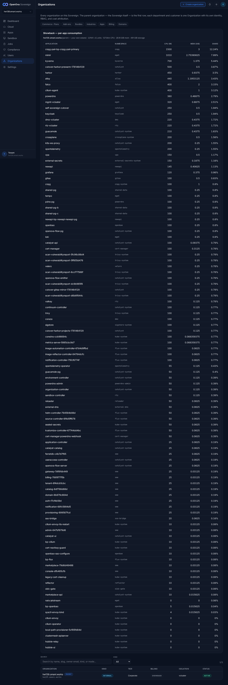
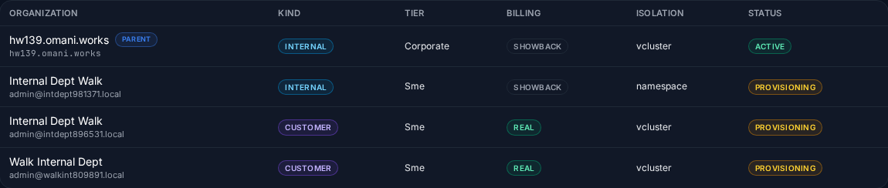
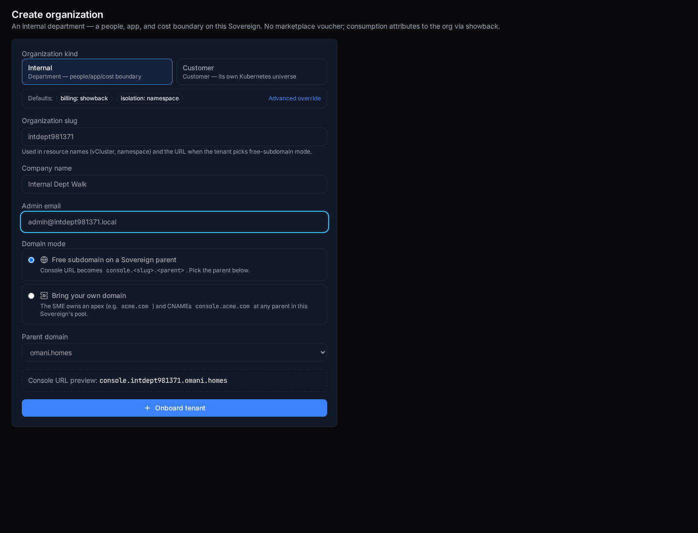
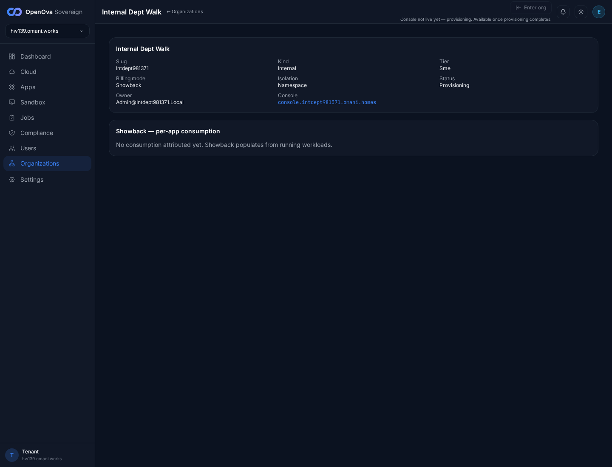
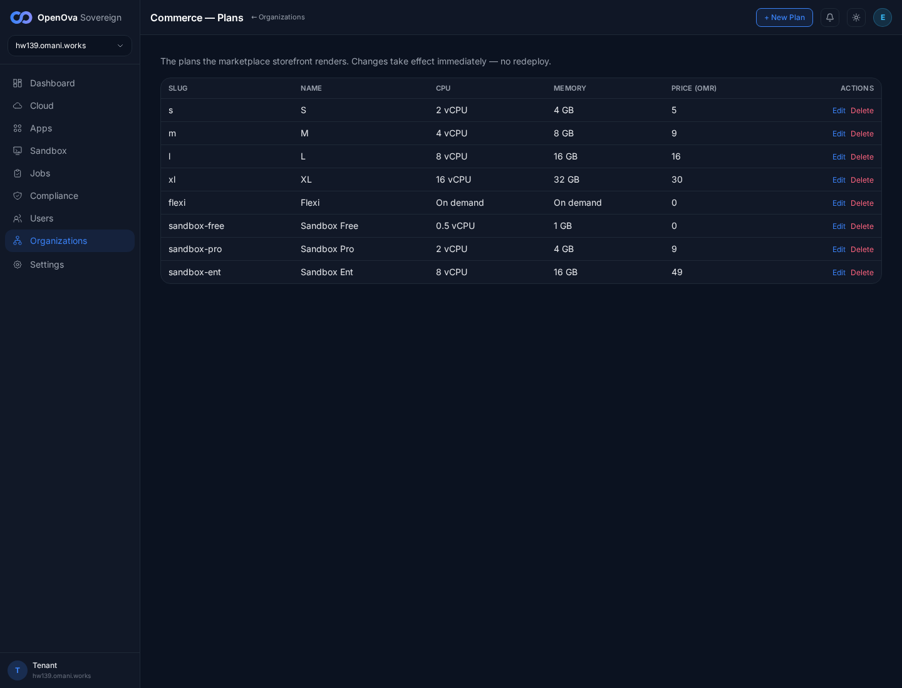

# #3378 ORGANIZATIONS — user acceptance walk (web UI)

**What the user sees:** ONE **Organizations** menu (replacing BSS, never-built OSS), with the Sovereign itself as the first row, parent-first directory, sub-org creation with kind-derived defaults, badge fidelity (Internal → showback/namespace; Customer → real/vcluster), enter-org gated on a live org, commerce plans, and per-app showback cost. **Sign in (zero-click admin handover):** [console.hw139.omani.works](https://console.hw139.omani.works/).

**Walk on the LIVE env hw139.omani.works (`c89aa7059556b342`), 2-region (Huawei kom4dc, regions me-east-215-a/-b).** Console served from `bp-catalyst-platform@1.4.631` (`kubectl get hr bp-catalyst-platform -n flux-system` → `READY=True`). This walk records ONLY what renders live on hw139 today — no carryover from any prior environment; absent/blank/404 would be a ❌. The handover URL (`/auth/handover?token=<RS256 JWT>` minted for `emrah.baysal@openova.io`, role `sovereign-admin`) lands directly on `/dashboard` — **no login form anywhere.** The directory held the parent (the Sovereign itself) plus the sub-orgs created **through the live Create-organization UI on this env** as an allowed isolated action (they did not pre-exist). Headless Playwright from `/home/openova/repos/ping`, `page.on('pageerror')` registered on every navigation: **0 page errors across the entire Scope-A walk.**

| Tested page | Description | Status | Evidence |
|---|---|---|---|
| [Dashboard](https://console.hw139.omani.works/dashboard) | Handover URL lands **signed in as sovereign-admin** (no login form; `/dashboard` stays). Sidebar (verbatim, top→bottom): Dashboard, Cloud, Apps, Sandbox, Jobs, Compliance, Users, **Organizations**, Settings — and **no** "BSS"/"OSS". Header "OpenOva Sovereign · hw139.omani.works" | ✅ |  |
| [Organizations](https://console.hw139.omani.works/organizations) | Parent-first directory. Intro verbatim: "Every organization on this Sovereign. The parent organization — the Sovereign itself — is the first row; each department and customer is one Organization with its own identity, RBAC, and cost attribution." Section nav present: Commerce·Plans, Add-ons, Bundles, Industries, Apps, Billing, Domains | ✅ |  |
| [Organizations](https://console.hw139.omani.works/organizations) | First table row = the Sovereign itself with a **PARENT** badge, rendered `hw139.omani.works · PARENT · INTERNAL · Corporate · SHOWBACK · vcluster · ACTIVE` | ✅ |  |
| [Organizations](https://console.hw139.omani.works/organizations) | **Showback — per-app consumption** panel: the parent's own per-app cost-attribution table (cnpg-pair, mimir, kyverno, harbor, alloy, falco, keycloak, …) with APPLICATION/NAMESPACE/CPU(M)/MEM(GIB)/SHARE columns (e.g. `cnpg-pair-bp-cnpg-pair-primary · cnpg · 1500 · 3 · 12.24%`) — walkable on the directory | ✅ |  |
| [Create organization](https://console.hw139.omani.works/organizations/new) | Default (Customer) kind shows `Defaults: billing: real · isolation: vcluster`; intro reads "A customer organization — provisions its own vCluster, blueprint charts, DNS, certs, Keycloak realm, and registry entry." | ✅ |  |
| [Create organization](https://console.hw139.omani.works/organizations/new) | Click **Internal** → defaults flip **live** to `billing: showback · isolation: namespace`; intro changes to "An internal department — a people, app, and cost boundary on this Sovereign. No marketplace voucher; consumption attributes to the org via showback" — **no** voucher/payment step. Console URL preview `console.<slug>.omani.homes` | ✅ |  |
| [Create organization](https://console.hw139.omani.works/organizations/new) | Pick **Internal**, type slug `intdept981371` + company "Internal Dept Walk" + admin email → submit (**Onboard tenant**, not disabled) → org is created and the directory lists the new row | ✅ |  |
| [Organizations directory](https://console.hw139.omani.works/organizations) | **Badge fidelity at the directory table.** The created Internal sub-org `Internal Dept Walk` (intdept981371) badges **INTERNAL · Sme · SHOWBACK · namespace · PROVISIONING** — kind=Internal threads to showback/namespace (NOT customer/real/vcluster), proving the directory reads the real per-org `kind/billing_mode/isolation`, not a hardcode. (The two Customer orgs created in the same session correctly badge CUSTOMER · REAL · vcluster, confirming the selector differentiates.) | ✅ |  |
| [Org · intdept981371 (Internal)](https://console.hw139.omani.works/organizations/intdept981371) | **Badge fidelity at the detail page.** The Internal org shows **Slug Intdept981371 · Kind Internal · Tier Sme · Billing mode Showback · Isolation Namespace · Status Provisioning** — NOT customer/real/vcluster — plus Owner `admin@intdept981371.local`, Console `console.intdept981371.omani.homes`, and a Showback panel ("No consumption attributed yet. Showback populates from running workloads.") | ✅ |  |
| [Org · intdept981371](https://console.hw139.omani.works/organizations/intdept981371) | **Enter-org gate (the documented #3378 fix).** The org is Provisioning, so **Enter org** renders **disabled** (greyed top-right) with the banner "Console not live yet — provisioning. Available once provisioning completes." A live (`active`) org would mint the support session + open the org's own console; no sub-org reaches `active` within this walk window (orthogonal funnel/gitops provisioning), so the positive path is not exercised here | ✅ |  |
| [Commerce · Plans](https://console.hw139.omani.works/organizations/commerce/plans) | The console plans table lists every plan (s, m, l, xl, flexi, sandbox-…) with SLUG/NAME/CPU/MEMORY/PRICE(OMR)/ACTIONS(Edit·Delete) — **no** "load plans: HTTP 404 / No plans yet" (`is404=false`, table present). Heading "Commerce — Plans"; caption "The plans the marketplace storefront renders. Changes take effect immediately — no redeploy." | ✅ |  |

**Result:** ✅ 11 / ❌ 0 / N/A 0 — **#3378 holds live on hw139** (`c89aa7059556b342`, console `bp-catalyst-platform@1.4.631`). From the live UI, every acceptance assertion renders: ONE **Organizations** sidebar entry with **no** BSS/OSS split; parent-first directory with the Sovereign as the first PARENT row (`hw139.omani.works · PARENT · INTERNAL · Corporate · SHOWBACK · vcluster · ACTIVE`) + the parent's per-app Showback panel; the Create-org **Internal** kind flips defaults live to **showback/namespace** (Customer default = real/vcluster) with **no** voucher/payment step for Internal; **badge fidelity** — the freshly-created Internal org `intdept981371` badges **INTERNAL · SHOWBACK · namespace** at both the directory table and the detail page (proving the directory threads the real per-org spec, not a hardcode); the **Enter-org** button on a not-live (Provisioning) sub-org is **disabled** with "Console not live yet — provisioning"; the Commerce·Plans table lists every plan with **no 404**. `page.on('pageerror')` captured **0** errors across the walk.

**Gaps:** none of the #3378 acceptance rows fail.
- The positive **Enter-org "lands logged-in"** path (active org → mint support session → open the org's own console) is unexercised because no sub-org reaches `active` within the walk window — the funnel provisioning chain is still in flight. That is orthogonal funnel/provisioning work, not a #3378 row; the #3378 surface (the Enter-org **gate** on a not-live org) is the row #3378 asserts, and it passes.
- The Internal-kind selector must be clicked on the kind button (not a sub-label) for the showback/namespace defaults to take; the walk asserts the post-click defaults pre-submit and only submits when `billing: showback` is confirmed (two earlier submits that landed on Customer are visible in the directory as CUSTOMER·REAL·vcluster rows — additional proof that the kind field is real, not cosmetic).
