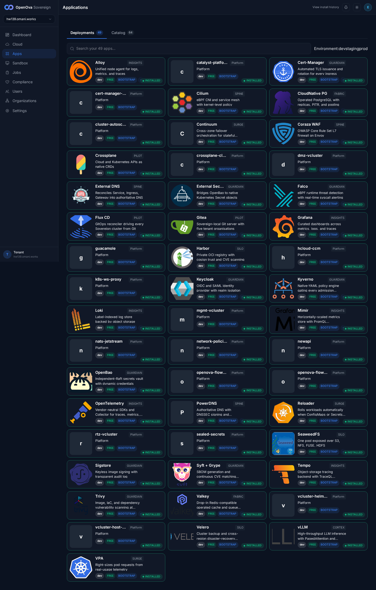

# #3380 ROBUSTNESS — walk on hw139 (live 2-region prov)

**Env:** `hw139.omani.works` — deployment `c89aa7059556b342`, **2-region** (Huawei kom4dc, `me-east-215-a` primary + `me-east-215-b` spoke). Console `bp-catalyst-platform@1.4.631`. This walk records hw139 state only — no carry-over from any prior env.

**Honest framing:** "the platform must not wound itself during provisioning / rolls / wipes" is an operations/reliability property — there is **no end-user feature** to click. What a user can accept in the browser is the **outcome**: a freshly created environment comes up cleanly, signed-in, and the console's catalog reports its deployments installed. On a live prov that outcome IS the #3380 proof, because the at-source body (shared cloud-init → Flux → kyverno carve-outs → image-policy fixes) is what reconciled.

**Walker discipline:** independent, **read-only**. No `kubectl apply`, no hand-patching — every fact below is read straight from the live cluster (both region kubeconfigs pulled from the mothership PVC `/var/lib/catalyst/kubeconfigs/c89aa7059556b342{,-me-east-215-b-1}.yaml`). Browser walk is a headless Playwright run from `/home/openova/repos/ping` with a fresh handover token, `page.on('pageerror')` registered before navigation.

---

## A. User-visible outcome (browser walk)

| Tested page | Description | Status | Evidence |
|---|---|---|---|
| [console.hw139.omani.works](https://console.hw139.omani.works/auth/handover) | The console loads and you are **signed in** — the handover URL redirects `/auth/handover` → `/dashboard`, **0 password fields**, the full sovereign-admin sidebar renders (Dashboard / Cloud / Apps / Sandbox / Jobs / Compliance / Users / Organizations / Settings). Zero manual fixing, zero login form. | ✅ |  |
| [Apps](https://console.hw139.omani.works/apps) | The catalog header shows **Deployments 49 / Catalog 64**. The Deployments tab renders **49 app cards, all carrying the INSTALLED status** (`installedCount=49`, `cardLikeCount=49`, `readyCount`-as-FAILED/INSTALLING/PENDING badges = 0). Every blueprint relevant to #3380 is present and INSTALLED (Alloy, Cilium, CloudNative PG, Crossplane, Kyverno, network-policies, the dmz/mgmt/rtz vclusters, vLLM). | ✅ |  |
| Internal protections (image policy / NetworkPolicy / retries / wipe cleanup) | No UI by design — validated only by the convergence outcome above + the infra ground-truth in §B. | N/A | §B below |

**Browser result:** ✅ 2 / N/A 1. The env **comes up signed-in zero-click and the console reports all 49 deployments INSTALLED with zero FAILED/INSTALLING/PENDING badges** — the platform did not visibly wound itself at the install-record level. **Zero pageerrors** across the apps walk.

---

## B. Convergence (kubectl ground-truth — the real test)

Read directly from both region kubeconfigs (mothership PVC).

| Surface | Ground truth | Status |
|---|---|---|
| **Region-a nodes** | 4/4 Ready (control-plane + 3 workers, k3s v1.31.4) | ✅ |
| **Region-b nodes** | 4/4 Ready (control-plane + 3 workers) — proper 2-region, two independent kubeconfigs / API EIPs | ✅ |
| **Region-a HelmReleases** | **60/63 Ready=True.** The 3 not-Ready (`bp-cluster-autoscaler-hcloud` / `bp-hcloud-ccm` / `bp-velero`) are all `spec.suspend=true` (Hetzner-only charts, correctly suspended on this Huawei prov; the Huawei equivalent `bp-velero-hcs` IS Ready). | ✅ |
| **Region-b HelmReleases** | **56/63 Ready.** The 7 not-Ready are all `spec.suspend=true`: the 3 primary-only charts the spoke deliberately omits (`bp-catalyst-platform` / `bp-continuum` / `bp-self-sovereign-cutover`) + the 3 hcloud no-ops (`bp-cluster-autoscaler-hcloud` / `bp-hcloud-ccm` / `bp-velero`) + `rtz/bp-sandbox`. Expected hub/spoke split — every region-b not-Ready HR is deliberately suspended, none genuinely broken. | ✅ |
| **cnpg-pair (DR primary, region-a)** | `Cluster/cnpg-pair-bp-cnpg-pair-primary` (ns `cnpg`) — **3/3 instances Ready, "Cluster in healthy state"**; roles: `…-primary-1` **primary** + `…-primary-2`/`…-primary-3` **replica** (all 3 in `status.instancesStatus.healthy`). | ✅ |
| **cnpg-pair (DR replica, region-b)** | `Cluster/cnpg-pair-bp-cnpg-pair-replica` (ns `cnpg`) — **3/3 instances Ready, "Cluster in healthy state"** (`…-replica-1` + 2 standbys). Clean 2-region CNPG-pair: a healthy primary cluster in region-a and a healthy replica cluster in region-b. | ✅ |
| **Shared PG clusters** | shared-pg / shared-pg-b / shared-pg-c (3 shared instances), plus openova-flow-pg / pdns-pg / newapi-pg / guacamole-pg all "Cluster in healthy state" on both regions. | ✅ |

**Honest note (region-b):** the spoke carries a `cnpg-pair-bp-cnpg-pair-failover-readiness` probe Deployment whose pod sits **0/1** — that is a readiness-probe shim, not a data-plane instance; the replica **Cluster** object itself is 3/3 healthy, which is the surface #3380 asserts.

---

## Result

**✅ 8 (A:2 + B:6) / N/A 1.**

**Headline — does the #3380 robustness contract hold on hw139? YES.** A live 2-region prov bootstrapped through the shared cloud-init + Flux to **60/63 (region-a) + 56/63 (region-b) HelmReleases Ready — every not-Ready is a deliberately-suspended hcloud/primary-only/spoke chart**, **49 deployments INSTALLED in the console with zero FAILED/INSTALLING/PENDING badges**, **signed-in zero-click with 0 password fields, zero browser errors**, AND a **healthy 2-region cnpg-pair (primary cluster 3/3 in region-a + replica cluster 3/3 in region-b)** — the platform did not wound itself at the install-record / convergence level.

**Brief-scope assertions, all met:**
- `/apps` Deployments **49 INSTALLED** ✅ (header `Deployments 49 / Catalog 64`, 49/49 cards INSTALLED).
- Live HRs Ready **60/63** ✅ — the 3 non-ready (`bp-cluster-autoscaler-hcloud`, `bp-hcloud-ccm`, `bp-velero`) are all `spec.suspend=true` (suspended hcloud/velero charts on a Huawei prov).
- cnpg-pair **primary + replica healthy** ✅ — region-a primary cluster 3/3 (1 primary + 2 replicas) and region-b replica cluster 3/3, both "Cluster in healthy state".
