# OpenOva — Status Tracker

Regenerated every 15 min by `/home/openova/bin/refresh-dod-dashboard.sh`. Every `#NNNN` is a clickable GitHub link.

|  |  |
|---|---|
| Last refreshed | `2026-08-17T04:15:03Z` |
| Deploy cron (#799) | ‚úì deploy-cron healthy (image-reroll last ran 9m ago) |
| Open issues | 100 |
| Open DoD gates | 0 / 41 |
| Open TBD-* regressions | 0 |
| DoD completion |  41 / 41 = 100% |

**Legend:**  done ·  fix shipped, awaits prov ·  open ·  deferred

---

## 1. Customer journey (founder's success criterion)

| # | Step | Status | Blocking issue |
|---|---|---|---|
| 1 | Operator issues voucher |  | — |
| 2 | Email arrives in recipient inbox |  | [#1741](https://github.com/openova-io/openova/issues/1741) ‚Üí blocked by [#1793](https://github.com/openova-io/openova/issues/1793) |
| 3 | Recipient hits redeem landing |  | — |
| 4 | Recipient creates org + checkout |  | — |
| 5 | tenant.created ‚Üí Organization CR |  | [#1900](https://github.com/openova-io/openova/issues/1900) closed |
| 6 | Organization CR exists |  | — |
| 7 | vCluster + Keycloak + Gitea materialize |  | [#1906](https://github.com/openova-io/openova/issues/1906) [#1901](https://github.com/openova-io/openova/issues/1901) closed; t32 verifies |
| 8 | Tenant subdomain HTTPS responds |  | [#1907](https://github.com/openova-io/openova/issues/1907) closed; t32 verifies |

t32 (live now): `console.t32.omani.works` returns HTTP 200 + envoy. Handover fired 2026-05-19T05:05:24Z.

---

## 2. Open-issue blocking graph

**All 100 open issues** grouped by where they sit in the convergence sequence. Each chain runs left-to-right; chains stack vertically.

> 💡 GitHub strips click handlers from rendered mermaid for security — every node label below has a 1:1 entry in the **clickable index** that follows the diagram.

```mermaid
flowchart LR
  classDef epic fill:#1f6feb,stroke:#0d419d,color:#fff,stroke-width:3px
  classDef open  fill:#cf222e,stroke:#a40e26,color:#fff,stroke-width:2px
  classDef wait  fill:#bf8700,stroke:#9a6700,color:#fff,stroke-width:2px
  classDef done  fill:#2ea043,stroke:#1a7f37,color:#fff,stroke-width:2px
  classDef defer fill:#6e7781,stroke:#4f555c,color:#fff,stroke-width:2px

  %% === EPIC: Customer Journey (voucher ‚Üí tenant ‚Üí WordPress) ===
  E_CJ(("Customer Journey")):::epic
  E_CJ --> I1793["#1793 SMTP creds missing"]:::wait
  I1793 --> I1741["#1741 Voucher email in 60s"]:::open
  I1741 --> D1842["#1842 D28 Voucher UI + email"]:::wait
  E_CJ --> I1723["#1723 WordPress install"]:::open
  E_CJ --> I1724["#1724 Gitea /git/refs/heads"]:::open
  I1723 --> D1829["#1829 D29 Zero-touch tenant"]:::wait
  I1724 --> D1829

  %% === EPIC: Multi-region Sovereign ===
  E_MR(("Multi-region")):::epic
  E_MR --> I1904["#1904 Fan-out regression"]:::wait
  I1904 --> D1808["#1808 D5 /cloud 3 regions"]:::wait
  I1904 --> D1817["#1817 D16 L1/L2 fan-out"]:::wait
  I1904 --> D1820["#1820 D19 Apps/Cloud counter"]:::open
  I1904 --> D1821["#1821 D20 Jobs region filter"]:::open

  %% === EPIC: Auth & SSO ===
  E_AUTH(("Auth & SSO")):::epic
  E_AUTH --> I1905["#1905 auth.fqdn hijack"]:::open
  I1905 --> D1807["#1807 D4 Keycloak PIN-login"]:::open

  %% === EPIC: Sandbox runtime + audit trail ===
  E_SBX(("Sandbox")):::epic
  E_SBX --> I1899["#1899 Gitea mirror lag"]:::open
  I1899 --> D1747["#1747 D11 Sandbox E2E"]:::wait
  E_SBX --> I1776["#1776 NATS publisher"]:::open
  I1776 --> D1835["#1835 D35 NATS round-trip"]:::wait

  %% === EPIC: Data plane (CNPG + LLM) ===
  E_DATA(("Data plane")):::epic
  E_DATA --> D1831["#1831 D31 CNPG active-hot-standby"]:::open
  E_DATA --> D1834["#1834 D34 newapi LLM gateway"]:::open

  %% === EPIC: SME billing (gateway 503 + purchase) ===
  E_SME(("SME billing")):::epic
  E_SME --> I1748["#1748 C9 voucher list 503"]:::open
  E_SME --> I1749["#1749 C10 voucher issue 503"]:::open
  E_SME --> I1750["#1750 C15 purchase 404"]:::open

  %% === EPIC: Observability + cosmetic ===
  E_OBS(("Observability")):::epic
  E_OBS --> I1728["#1728 E4 Treemap coverage"]:::open
  E_OBS --> I1734["#1734 G5 Hubble inter-region"]:::open
  E_OBS --> I1882["#1882 A28 kubeconfig 409"]:::open

  %% === EPIC: Parked (post-MVP) ===
  E_PARK(("Parked post-MVP")):::epic
  E_PARK --> I1726["#1726 D12 Anthropic OAuth"]:::defer
  E_PARK --> I1727["#1727 D13 anti-abuse"]:::defer
  E_PARK --> I1741b["#1741 Voucher IMAP write-cov"]:::defer

  %% === EPIC: Deferred architectural ===
  E_DEF(("Deferred arch")):::epic
  E_DEF --> D1841["#1841 A6 Provider-mix"]:::defer

  %% === EPIC: Completed today (2026-05-19) ===
  E_DONE(("Completed today")):::epic
  E_DONE --> C1806["#1806 D3 PIN-login ‚úì"]:::done
  E_DONE --> C1815["#1815 D14 re-login ‚úì"]:::done
  E_DONE --> C1827["#1827 D26 CSP fonts ‚úì"]:::done
  E_DONE --> C1773["#1773 D0 redirect ‚úì"]:::done
  E_DONE --> C1795["#1795 C4-fup toggle ‚úì"]:::done
  E_DONE --> C1880["#1880 t27 timeout ‚úì"]:::done

  %% === EPIC: t31 TLS chain VICTORY (2026-05-18/19) ===
  E_TLS(("t31 TLS VICTORY")):::epic
  E_TLS --> P1888["PR #1888 cilium-gw"]:::done
  E_TLS --> P1889["PR #1889 sovereign-tls"]:::done
  E_TLS --> P1892["PR #1892 listeners"]:::done
  E_TLS --> P1894["PR #1894 IaC eval"]:::done
  E_TLS --> P1898["PR #1898 8-annot cap"]:::done

  %% === EPIC: Wave 34 PRs merged today ===
  E_W34(("Wave 34 PRs")):::epic
  E_W34 --> P1903["PR #1903 RBAC"]:::done
  E_W34 --> P1909["PR #1909 HTTPRoute"]:::done
  E_W34 --> P1910["PR #1910 Gitea path"]:::done
  E_W34 --> P1911["PR #1911 NP NS"]:::done
  E_W34 --> P1912["PR #1912 CNP 6443"]:::done
  E_W34 --> P1913["PR #1913 parent_domains"]:::done
  E_W34 --> P1914["PR #1914 SMTP code"]:::done
  E_W34 --> P1915["PR #1915 SMTP chart"]:::done
  E_W34 --> P1916["PR #1916 Gitea mirror"]:::done
  E_W34 --> P1918["PR #1918 NATS scaffold"]:::done
  E_W34 --> P1919["PR #1919 sme-gw CNP"]:::done

  %% --- Click-through to GitHub issues ---
  click I1793 "https://github.com/openova-io/openova/issues/1793" "Open #1793"
  click I1741 "https://github.com/openova-io/openova/issues/1741" "Open #1741"
  click D1842 "https://github.com/openova-io/openova/issues/1842" "Open #1842"
  click I1904 "https://github.com/openova-io/openova/issues/1904" "Open #1904"
  click D1808 "https://github.com/openova-io/openova/issues/1808" "Open #1808"
  click D1817 "https://github.com/openova-io/openova/issues/1817" "Open #1817"
  click D1820 "https://github.com/openova-io/openova/issues/1820" "Open #1820"
  click D1821 "https://github.com/openova-io/openova/issues/1821" "Open #1821"
  click I1723 "https://github.com/openova-io/openova/issues/1723" "Open #1723"
  click I1724 "https://github.com/openova-io/openova/issues/1724" "Open #1724"
  click D1829 "https://github.com/openova-io/openova/issues/1829" "Open #1829"
  click I1905 "https://github.com/openova-io/openova/issues/1905" "Open #1905"
  click D1807 "https://github.com/openova-io/openova/issues/1807" "Open #1807"
  click I1899 "https://github.com/openova-io/openova/issues/1899" "Open #1899"
  click D1747 "https://github.com/openova-io/openova/issues/1747" "Open #1747"
  click I1776 "https://github.com/openova-io/openova/issues/1776" "Open #1776"
  click D1835 "https://github.com/openova-io/openova/issues/1835" "Open #1835"
  click D1831 "https://github.com/openova-io/openova/issues/1831" "Open #1831"
  click D1834 "https://github.com/openova-io/openova/issues/1834" "Open #1834"
  click I1748 "https://github.com/openova-io/openova/issues/1748" "Open #1748"
  click I1749 "https://github.com/openova-io/openova/issues/1749" "Open #1749"
  click I1750 "https://github.com/openova-io/openova/issues/1750" "Open #1750"
  click I1726 "https://github.com/openova-io/openova/issues/1726" "Open #1726"
  click I1727 "https://github.com/openova-io/openova/issues/1727" "Open #1727"
  click I1728 "https://github.com/openova-io/openova/issues/1728" "Open #1728"
  click I1734 "https://github.com/openova-io/openova/issues/1734" "Open #1734"
  click I1741b "https://github.com/openova-io/openova/issues/1741" "Open #1741"
  click I1882 "https://github.com/openova-io/openova/issues/1882" "Open #1882"
  click D1841 "https://github.com/openova-io/openova/issues/1841" "Open #1841"
```

### üîó Clickable issue index (mirror of every node above)

**Voucher email:** [#1793](https://github.com/openova-io/openova/issues/1793) SMTP creds ‚Üí [#1741](https://github.com/openova-io/openova/issues/1741) email reach ‚Üí [#1842](https://github.com/openova-io/openova/issues/1842) D28 issuance UI

**Multi-region fan-out:** [#1904](https://github.com/openova-io/openova/issues/1904) regression → [#1808](https://github.com/openova-io/openova/issues/1808) D5 cloud · [#1817](https://github.com/openova-io/openova/issues/1817) D16 L1/L2 · [#1820](https://github.com/openova-io/openova/issues/1820) D19 Apps/Cloud counter · [#1821](https://github.com/openova-io/openova/issues/1821) D20 Jobs filter

**D29 customer journey:** [#1723](https://github.com/openova-io/openova/issues/1723) WordPress install · [#1724](https://github.com/openova-io/openova/issues/1724) Gitea path → [#1829](https://github.com/openova-io/openova/issues/1829) D29 zero-touch

**Keycloak SSO:** [#1905](https://github.com/openova-io/openova/issues/1905) auth.fqdn hijack ‚Üí [#1807](https://github.com/openova-io/openova/issues/1807) D4 PIN-login flow

**Sandbox runtime:** [#1899](https://github.com/openova-io/openova/issues/1899) Gitea mirror lag ‚Üí [#1747](https://github.com/openova-io/openova/issues/1747) D11 Sandbox E2E

**NATS audit:** [#1776](https://github.com/openova-io/openova/issues/1776) sandbox.requested publisher ‚Üí [#1835](https://github.com/openova-io/openova/issues/1835) D35 round-trip

**CNPG / newapi:** [#1831](https://github.com/openova-io/openova/issues/1831) D31 active-hot-standby · [#1834](https://github.com/openova-io/openova/issues/1834) D34 newapi LLM gateway

**SME gateway bugs (t32):** [#1748](https://github.com/openova-io/openova/issues/1748) C9 list · [#1749](https://github.com/openova-io/openova/issues/1749) C10 issue · [#1750](https://github.com/openova-io/openova/issues/1750) C15 purchase

**TBDs needing re-walk:** [#1726](https://github.com/openova-io/openova/issues/1726) D12 Anthropic OAuth · [#1727](https://github.com/openova-io/openova/issues/1727) D13 anti-abuse · [#1728](https://github.com/openova-io/openova/issues/1728) E4 treemap · [#1734](https://github.com/openova-io/openova/issues/1734) G5 Hubble · [#1741](https://github.com/openova-io/openova/issues/1741) voucher IMAP · [#1882](https://github.com/openova-io/openova/issues/1882) A28 kubeconfig 409

**Deferred:** [#1841](https://github.com/openova-io/openova/issues/1841) A6 provider-mix canonical

**🟢 Recently completed (clickable):** [#1806](https://github.com/openova-io/openova/issues/1806) D3 PIN-login · [#1815](https://github.com/openova-io/openova/issues/1815) D14 re-login · [#1827](https://github.com/openova-io/openova/issues/1827) D26 CSP fonts · [#1773](https://github.com/openova-io/openova/issues/1773) D0 redirect · [#1795](https://github.com/openova-io/openova/issues/1795) C4-fup toggle · [#1880](https://github.com/openova-io/openova/issues/1880) t27 timeout

**🟢 t31 TLS chain VICTORY (2026-05-18/19):** [PR #1888](https://github.com/openova-io/openova/pull/1888) cilium-gw · [PR #1889](https://github.com/openova-io/openova/pull/1889) sovereign-tls · [PR #1890](https://github.com/openova-io/openova/pull/1890) bake-time secrets · [PR #1892](https://github.com/openova-io/openova/pull/1892) listener wildcards · [PR #1893](https://github.com/openova-io/openova/pull/1893) UserAccess seed · [PR #1894](https://github.com/openova-io/openova/pull/1894) IaC eval fix · [PR #1898](https://github.com/openova-io/openova/pull/1898) 8-annot cap

**🟢 Today's merged PRs (Wave 34, 2026-05-19):** [PR #1903](https://github.com/openova-io/openova/pull/1903) RBAC · [PR #1909](https://github.com/openova-io/openova/pull/1909) HTTPRoute · [PR #1910](https://github.com/openova-io/openova/pull/1910) Gitea path · [PR #1911](https://github.com/openova-io/openova/pull/1911) NP NS · [PR #1912](https://github.com/openova-io/openova/pull/1912) CNP 6443 · [PR #1913](https://github.com/openova-io/openova/pull/1913) parent_domains · [PR #1914](https://github.com/openova-io/openova/pull/1914) SMTP code · [PR #1915](https://github.com/openova-io/openova/pull/1915) SMTP chart · [PR #1916](https://github.com/openova-io/openova/pull/1916) Gitea mirror · [PR #1918](https://github.com/openova-io/openova/pull/1918) NATS scaffold · [PR #1919](https://github.com/openova-io/openova/pull/1919) sme-gateway CNP · [PR #1921](https://github.com/openova-io/openova/pull/1921) newapi DB DSN

**Concurrency cap (2026-05-19 06:59 founder ask):** max 3 parallel sub-agents. Existing 6 complete gracefully; future dispatches respect cap.

### All 100 open items (clickable table)

| # | Title | Bucket |
|---|---|---|
| [#6015](https://github.com/openova-io/openova/issues/6015) | catalyst-api is region-b-blind on a 2-region Sovereign — empty kubeconfigs dir | Other |
| [#6016](https://github.com/openova-io/openova/issues/6016) | region-b wedged at 57/65 — keycloak-database-secret never materialised in regi | Other |
| [#6027](https://github.com/openova-io/openova/issues/6027) | Per-Org console listeners still absent from region B with #5957 deployed — the | Other |
| [#6028](https://github.com/openova-io/openova/issues/6028) | Region B serves 503 on half of all Sovereign front-door connections — HTTPRout | Other |
| [#6031](https://github.com/openova-io/openova/issues/6031) | UAT row 57 has no fix anywhere — bp-cnpg-pair ships cnpgPair.enabled=false, so | Other |
| [#6032](https://github.com/openova-io/openova/issues/6032) | Application reports Ready over ANOTHER release's datastore — a second bp-postg | Other |
| [#6033](https://github.com/openova-io/openova/issues/6033) | active-hot-standby Application reports phase=Ready across 1 region with perClust | Other |
| [#6040](https://github.com/openova-io/openova/issues/6040) | hw293: region-B ClusterMesh never established — a dormant chart's census failu | Other |
| [#6043](https://github.com/openova-io/openova/issues/6043) | bp-catalyst-platform cannot publish: unresolved merge-conflict markers on main f | Other |
| [#6045](https://github.com/openova-io/openova/issues/6045) | hw293: four live defects surfaced by the 2026-08-11 UAT partition — an unpubli | Other |
| [#6058](https://github.com/openova-io/openova/issues/6058) | Flaky required gate: TestSecondaryKubeconfigDelivery_RunsOnFailedDeployment_6015 | Other |
| [#6060](https://github.com/openova-io/openova/issues/6060) | UAT row 63: TopologyTab returns on the status.perCluster rung and never reads st | Other |
| [#6062](https://github.com/openova-io/openova/issues/6062) | UAT row 8: GET /sovereign/parent-domains offers no org-pool parents — the list | Other |
| [#6071](https://github.com/openova-io/openova/issues/6071) | Continuum never reports a standby: leaseClient resolvers are hardcoded to 10.43. | Other |
| [#6072](https://github.com/openova-io/openova/issues/6072) | shared-pg consumer-hub sync: the -mesh-rw readiness gate tests a string that can | Other |
| [#6075](https://github.com/openova-io/openova/issues/6075) | Org detail never renders the purchased plan: spec.planSlug dropped at four layer | Other |
| [#6076](https://github.com/openova-io/openova/issues/6076) | Organizations parent row has an unstable identity: link target flips between /or | Other |
| [#6077](https://github.com/openova-io/openova/issues/6077) | Job re-run on a collapsed scanner identity row 422s and fails invisibly: syft-sb | Other |
| [#6079](https://github.com/openova-io/openova/issues/6079) | mothership GitOps loop dead: containerd's ghcr pull carries a credential GHCR de | Other |
| [#6081](https://github.com/openova-io/openova/issues/6081) | Per-Org console: the install wizard's Organization list is empty because the dir | Other |
| [#6082](https://github.com/openova-io/openova/issues/6082) | Cutover can never start on hw293: a repaired defect latched the record failed, a | Other |
| [#6084](https://github.com/openova-io/openova/issues/6084) | Silent re-auth on a per-Org console targets auth.<orgslug>.<parent>, which the g | Other |
| [#6085](https://github.com/openova-io/openova/issues/6085) | Reconciliation tab never offers Resume: suspended read is stale after its own ac | Other |
| [#6087](https://github.com/openova-io/openova/issues/6087) | catalyst-pin IdP dials catalyst-api over the Sovereign's own public EIP, so the  | Other |
| [#6090](https://github.com/openova-io/openova/issues/6090) | The Keycloak account console hangs forever on 'Loading the Account Console' inst | Other |
| [#6091](https://github.com/openova-io/openova/issues/6091) | converged-late census counts tenant HelmReleases: a customer app install can vet | Other |
| [#6093](https://github.com/openova-io/openova/issues/6093) | Jobs cutover projection orders the 11 sovereignty steps ALPHABETICALLY — every | Other |
| [#6106](https://github.com/openova-io/openova/issues/6106) | catalyst-pin broker back-channel netpol gap: keycloak cannot reach catalyst-api. | Other |
| [#6107](https://github.com/openova-io/openova/issues/6107) | org-controller counts an UNUSABLE secondary kubeconfig as wired — a contextles | Other |
| [#6108](https://github.com/openova-io/openova/issues/6108) | secondary-kubeconfig delivery ships a torn read: non-atomic write + a non-empty- | Other |
| [#6109](https://github.com/openova-io/openova/issues/6109) | openova-mcp masks the authoritative /whoami verdict behind a stale 'signature is | Other |
| [#6111](https://github.com/openova-io/openova/issues/6111) | UAT adjudication: three clauses assert objects the platform does not have (Conti | Other |
| [#6114](https://github.com/openova-io/openova/issues/6114) | UAT ❌ residue on hw293: 61 rows in 8 root-cause clusters — 30 behind one dea | Other |
| [#6122](https://github.com/openova-io/openova/issues/6122) | UAT row 213: cross-Org get_application answers not-found, not 403 — #5522 move | Other |
| [#6131](https://github.com/openova-io/openova/issues/6131) | Cutover execution tree still has no root: the true first step gitea-mirror keeps | Other |
| [#6135](https://github.com/openova-io/openova/issues/6135) | The Organization create door accepts a declared isolation it never honours: 202  | Other |
| [#6140](https://github.com/openova-io/openova/issues/6140) | hw293: a console-gateway hostname probed on the SHARED gateway's host port retur | Other |
| [#6148](https://github.com/openova-io/openova/issues/6148) | Region-kill failback: recovered region-A returns as an UNFENCED TL=1 primary and | Other |
| [#6149](https://github.com/openova-io/openova/issues/6149) | bp-postgres DR pairs ship a dr-promoter but NO dr-failback — region-A return l | Other |
| [#6155](https://github.com/openova-io/openova/issues/6155) | Showback bills an Organization the CR model does not contain — the join reads  | Other |
| [#6156](https://github.com/openova-io/openova/issues/6156) | DR preflight-02 cannot Fail on a 2-region Sovereign — the standby outage that  | Other |
| [#6163](https://github.com/openova-io/openova/issues/6163) | Agenity credential chain has TWO one-shot freezes: the init container reads once | Other |
| [#6166](https://github.com/openova-io/openova/issues/6166) | catalyst-ui has no priorityClassName, so it loses the slot #6157 freed — mothe | Other |
| [#6169](https://github.com/openova-io/openova/issues/6169) | Funnel-serving + singles residue (#6114 rows 87/90/95/115/218/228/232/234/241):  | Other |
| [#6172](https://github.com/openova-io/openova/issues/6172) | Fresh prov hw294 wedges Phase 1 at 51/67: bp-keycloak 1.5.9 post-install realm i | Other |
| [#6183](https://github.com/openova-io/openova/issues/6183) | specter residue + UAT row W5: remove the phantom wizard component id and the non | Other |
| [#6187](https://github.com/openova-io/openova/issues/6187) | bp-keycloak 1.5.10: the #6172 backchannel anchor is not gated to Sovereign mode, | Other |
| [#6189](https://github.com/openova-io/openova/issues/6189) | P0: mothership owner sign-in dead — Keycloak scaled to 0 behind a green HelmRe | Other |
| [#6191](https://github.com/openova-io/openova/issues/6191) | hw295 reports status=ready while its console gateway EIP (212.72.24.8, the wiped | Other |
| [#6192](https://github.com/openova-io/openova/issues/6192) | Per-app Overview prints stale PLACEMENT 'singleton' while Topology reads runtime | Other |
| [#6194](https://github.com/openova-io/openova/issues/6194) | Wizard StepOrg still says "All fields are pre-filled" after #5401 emptied them ‚ | Other |
| [#6197](https://github.com/openova-io/openova/issues/6197) | P0: mothership Stalwart is killed by its own liveness probe every ~15min — mai | Other |
| [#6200](https://github.com/openova-io/openova/issues/6200) | active-hot-standby preview renders BOTH regions as primary — the role switch m | Other |
| [#6202](https://github.com/openova-io/openova/issues/6202) | Cutover engine re-adopts a prior attempt's FAILED step Job instead of recreating | Other |
| [#6211](https://github.com/openova-io/openova/issues/6211) | harbor-prewarm PUSHes into a Harbor proxy-cache project — the first pass alway | Other |
| [#6214](https://github.com/openova-io/openova/issues/6214) | P0 Pillar-5: step-08's pre-hold Crossplane lint requires step-11's pivot — the | Other |
| [#6225](https://github.com/openova-io/openova/issues/6225) | Re-prov after a wipe false-fails on orphaned catalyst-* VPCs when the post-recla | Other |
| [#6229](https://github.com/openova-io/openova/issues/6229) | /api/v1/version reports a sha from a Deployment env var that a roll never update | Other |
| [#6231](https://github.com/openova-io/openova/issues/6231) | Topology choice does not survive the round trip: the status endpoint flattens th | Other |
| [#6238](https://github.com/openova-io/openova/issues/6238) | main is red: the bp-guacamole auto-bump workflow bumps Chart.yaml without the ca | Other |
| [#6242](https://github.com/openova-io/openova/issues/6242) | fix(funnel): a settled order whose launch call is lost strands the paid Organiza | Other |
| [#6249](https://github.com/openova-io/openova/issues/6249) | Sovereign /apps estate grid renders 11 cards against 10 Application CRs — a He | Other |
| [#6253](https://github.com/openova-io/openova/issues/6253) | harbor-prewarm calls an unpublished chart pin 'genuinely mid-roll' and then refu | Other |
| [#6255](https://github.com/openova-io/openova/issues/6255) | region-B cilium-operator never starts its Gateway-API controller (30s CRD poll l | Other |
| [#6260](https://github.com/openova-io/openova/issues/6260) | Sandbox retirement is half-landed: the reconciler's only install site was delete | Other |
| [#6262](https://github.com/openova-io/openova/issues/6262) | harbor-prewarm blocks on the cutover's OWN hollow pin, and the chart's Case 40 g | Other |
| [#6268](https://github.com/openova-io/openova/issues/6268) | Topology tab shows one target for an active-hot-standby app whose backing pair i | Other |
| [#6272](https://github.com/openova-io/openova/issues/6272) | check-guards-are-wired.sh globs only *.sh — a python guard is orphaned invisib | Other |
| [#6273](https://github.com/openova-io/openova/issues/6273) | harbor-prewarm Phase A0: an Organization's failed app install fail-closes the so | Other |
| [#6278](https://github.com/openova-io/openova/issues/6278) | Funnel + vcluster Org: every per-Org chart rendering a cert-manager Certificate  | Other |
| [#6280](https://github.com/openova-io/openova/issues/6280) | Phase A0 cannot list Organization namespaces — the #6273 partition ships witho | Other |
| [#6288](https://github.com/openova-io/openova/issues/6288) | A catalyst-api roll rewinds an in-flight cutover to step 1 — safe only if the  | Other |
| [#6289](https://github.com/openova-io/openova/issues/6289) | The cutover engine has no Lease — an outgoing catalyst-api Pod can drive the s | Other |
| [#6294](https://github.com/openova-io/openova/issues/6294) | harbor-prewarm enumerates the same destination twice and the redundant push fail | Other |
| [#6297](https://github.com/openova-io/openova/issues/6297) | bp-alloy slot 21: the Sovereign's own telemetry DaemonSet is denied on re-admiss | Other |
| [#6298](https://github.com/openova-io/openova/issues/6298) | Seven workflows run an unpinned azure/setup-helm — including check-no-nodeport | Other |
| [#6306](https://github.com/openova-io/openova/issues/6306) | noreply@openova.io burns its 25/hour send budget in 83s — PIN sign-in blocked  | Other |
| [#6307](https://github.com/openova-io/openova/issues/6307) | Post-pivot cutover deadlock: a step that terminal-fails past step-05 can never r | Other |
| [#6309](https://github.com/openova-io/openova/issues/6309) | No cutover step pivots the per-Org <slug>/catalyst-tenant repos — G11 cannot c | Other |
| [#6311](https://github.com/openova-io/openova/issues/6311) | bp-wordpress-tenant cannot converge in ANY Org: no cnpg-system carve-out blinds  | Other |
| [#6312](https://github.com/openova-io/openova/issues/6312) | wizard step 1 still pre-fills the fabricated company's industry — the select h | Other |
| [#6314](https://github.com/openova-io/openova/issues/6314) | bp-agenity per-Org oidc-gate points the browser at auth.<slug>.<pool>, a host wi | Other |
| [#6317](https://github.com/openova-io/openova/issues/6317) | Agenity Anthropic credential expires every ~5h and nothing refreshes it — rows | Other |
| [#6318](https://github.com/openova-io/openova/issues/6318) | Build bp-specter — realize the AIOps component the wizard catalog used to offe | Other |
| [#6319](https://github.com/openova-io/openova/issues/6319) | PIN sign-in is dead program-wide: an app_ready event storm NAKs against a 25/hou | Other |
| [#6324](https://github.com/openova-io/openova/issues/6324) | Per-Org bp-newapi quota guards model one 500m container; the ResourceQuota admit | Other |
| [#6336](https://github.com/openova-io/openova/issues/6336) | Fresh prov wedges at 0 HelmReleases: bootstrap GitRepository clones 938MB of his | Other |
| [#6339](https://github.com/openova-io/openova/issues/6339) | Region-b converges to 52/67 then stalls: keycloak and harbor blocked on missing  | Other |
| [#6344](https://github.com/openova-io/openova/issues/6344) | placement projection joins Pods to an Application by NAME COINCIDENCE — apps w | Other |
| [#6347](https://github.com/openova-io/openova/issues/6347) | placement projection emits TWO Primaries for an active-hot-standby app, plus a d | Other |
| [#6352](https://github.com/openova-io/openova/issues/6352) | per-Org GitOps tree is missing four emitters — bp-agenity (Pillar 4), bp-keycl | Other |
| [#6356](https://github.com/openova-io/openova/issues/6356) | helm.sh/resource-policy: keep makes the cutover status ConfigMap unrepairable ‚Ä | Other |
| [#6360](https://github.com/openova-io/openova/issues/6360) | Post-cutover Sovereign sells marketplace apps it cannot install — proxy-docker | Other |
| [#6362](https://github.com/openova-io/openova/issues/6362) | MCP accepts only handover-signed bearers — a signed-in User cannot reach it; r | Other |
| [#6364](https://github.com/openova-io/openova/issues/6364) | No vcluster is ever installed — bootstrap-kit slots 54/58/59 that the controll | Other |
| [#6367](https://github.com/openova-io/openova/issues/6367) | Per-Org HelmRelease can never resolve its own HelmRepository — targetNamespace | Other |
| [#6369](https://github.com/openova-io/openova/issues/6369) | MCP cross-Org isolation fails on BOTH read and write — a caller with empty org | Other |
| [#6370](https://github.com/openova-io/openova/issues/6370) | loadVClusters queries API group vcluster.io which exists nowhere — the install | Other |
| [#6372](https://github.com/openova-io/openova/issues/6372) | Per-Org agenity never starts: nothing seeds the Anthropic credential Secret, so  | Other |
| [#6374](https://github.com/openova-io/openova/issues/6374) | bp-agenity credentialWait: 0 silently renders as 300/5 via sprig default — 'fa | Other |

---

## 3. Recently merged PRs (last 36h)

| Merged | PR | Issue closed | Title |
|---|---|---|---|
| 2026-08-16T15:32 | [#6371](https://github.com/openova-io/openova/pull/6371) | #6370 | fix(topology): loadVClusters queried the non-existent group  |
| 2026-08-16T15:32 | [#6368](https://github.com/openova-io/openova/pull/6368) | #6367 | fix(provisioning): every purchased app sat at SourceNotReady |
| 2026-08-16T15:32 | [#6366](https://github.com/openova-io/openova/pull/6366) | #6360 | feat(catalog): sell bp-agenity in the storefront — a Bluepri |
| 2026-08-16T12:15 | [#6363](https://github.com/openova-io/openova/pull/6363) | #5991 | fix(bp-guacamole): connection producer was deleted at render |
| 2026-08-16T07:22 | [#6361](https://github.com/openova-io/openova/pull/6361) | #6357 | docs(uat): re-walk 15 hw296-carried rows on live hw298 — 8 h |
| 2026-08-16T04:43 | [#6358](https://github.com/openova-io/openova/pull/6358) | #6356 | docs(ledger): convergence capture 2026-08-16T00:29Z — hw298  |
| 2026-08-16T07:49 | [#6357](https://github.com/openova-io/openova/pull/6357) | #6356 | fix(cutover): re-seed the status ConfigMap when empty — reso |
| 2026-08-15T20:29 | [#6355](https://github.com/openova-io/openova/pull/6355) | #6354 | docs(uat): switch ledger to hw298 + stamp 227/G2/109/W5 on m |
| 2026-08-15T20:43 | [#6353](https://github.com/openova-io/openova/pull/6353) | #6352 | fix(provisioning): funnel path can now render bp-agenity — D |
| 2026-08-15T18:06 | [#6351](https://github.com/openova-io/openova/pull/6351) | #6314 | docs(uat): row 219 re-walked on a real customer Organization |
| 2026-08-15T17:21 | [#6350](https://github.com/openova-io/openova/pull/6350) | #6314 | docs(uat): rows 219 / G11 / 166 re-walked on hw298 — evidenc |
| 2026-08-15T19:57 | [#6349](https://github.com/openova-io/openova/pull/6349) | #5921 | docs(ledger): convergence capture 2026-08-15T16:43Z — hw298  |
| 2026-08-15T15:18 | [#6348](https://github.com/openova-io/openova/pull/6348) | #6345 | fix(placement): one Primary for an active-hot-standby app, a |
| 2026-08-15T14:00 | [#6345](https://github.com/openova-io/openova/pull/6345) | #6268 | fix(placement): join Pods to an Application by its RESOLVED  |
| 2026-08-15T12:22 | [#6342](https://github.com/openova-io/openova/pull/6342) | #5246 | fix(infra,catalyst-api): primary region captures its kubecon |
| 2026-08-14T14:25 | [#6338](https://github.com/openova-io/openova/pull/6338) | #6336 | fix(cloud-init): give the bootstrap GitRepository a clone bu |
| 2026-08-14T13:11 | [#6335](https://github.com/openova-io/openova/pull/6335) | #6330 | docs: UAT carry-forward runs after the env is live + append  |
| 2026-08-14T12:53 | [#6334](https://github.com/openova-io/openova/pull/6334) | #6309 | fix(cutover): pivot the per-Organization vCluster HelmReleas |
| 2026-08-14T11:18 | [#6333](https://github.com/openova-io/openova/pull/6333) | #6331 | docs(uat): rows 219-222 record the merged quota fix and STAY |
| 2026-08-14T11:58 | [#6332](https://github.com/openova-io/openova/pull/6332) | #3678 | fix(cutover): the sovereignty proof could report PASS withou |
| 2026-08-14T10:59 | [#6331](https://github.com/openova-io/openova/pull/6331) | #6114 | fix(quota): model the bp-newapi POD, not one container, in b |
| 2026-08-14T10:03 | [#6329](https://github.com/openova-io/openova/pull/6329) | #6323 | fix(ci): close the fail-open test-gate class outside the cut |
| 2026-08-14T09:36 | [#6328](https://github.com/openova-io/openova/pull/6328) | #6325 | docs(ledger): convergence cycle 2026-08-14T09:22Z — 278/286  |
| 2026-08-14T09:35 | [#6327](https://github.com/openova-io/openova/pull/6327) | #6307 | feat(ci): train-coherence pre-flight — is this train safe to |
| 2026-08-14T09:19 | [#6325](https://github.com/openova-io/openova/pull/6325) | #6313 | docs(uat): W1 and 235 walked green — the wizard fix delivere |
| 2026-08-14T10:24 | [#6323](https://github.com/openova-io/openova/pull/6323) | #6303 | fix(cutover): step-06 pivots the THIRD GitOps repo class — e |
| 2026-08-14T08:33 | [#6321](https://github.com/openova-io/openova/pull/6321) | #5575 | fix(wizard): UAT row W5 — remove the `specter` phantom card; |
| 2026-08-14T08:37 | [#6316](https://github.com/openova-io/openova/pull/6316) | #6314 | fix(agenity): per-Org oidc-gate issuer must name the Soverei |
| 2026-08-14T06:55 | [#6315](https://github.com/openova-io/openova/pull/6315) | #6090 | docs(uat): close four hw296 partials — 242 proven by live PO |
| 2026-08-14T07:38 | [#6313](https://github.com/openova-io/openova/pull/6313) | #6153 | fix(wizard): step 1 still pre-fills the fabricated company's |

---

## 4. Theater-incident log

Caught "fix shipped but actually broken" events + the validation principle that emerged:

| When | Broken PR | Caught by | Resolving PR | Principle codified |
|---|---|---|---|---|
| 2026-05-18 23:19Z | PR [#1875](https://github.com/openova-io/openova/pull/1875) — HR.dependsOn -> Kustomization silently ignored | t27 empirical walk | PR [#1879](https://github.com/openova-io/openova/pull/1879) | **#14** HR.dependsOn cross-kind |
| 2026-05-19 01:08Z | PR [#1892](https://github.com/openova-io/openova/pull/1892) — Python jsonencode != tofu HCL | t29 `tofu plan` failure | PR [#1894](https://github.com/openova-io/openova/pull/1894) | **#15** validate IaC with the IaC evaluator |
| 2026-05-19 02:00Z | PR [#1889](https://github.com/openova-io/openova/pull/1889) — 10 annotations on Gateway, CRD cap 8 | t30 SSA dry-run reject | PR [#1898](https://github.com/openova-io/openova/pull/1898) | (#15 applied) |

**Pattern**: every theater event was caught by an empirical fresh-prov walk, never by static review.

---

## 5. Resources

- [INVIOLABLE-PRINCIPLES](https://github.com/openova-io/openova/blob/main/docs/INVIOLABLE-PRINCIPLES.md) — 15 principles
- Manual refresh: `bash /home/openova/bin/refresh-dod-dashboard.sh`
- Cron: every 15 minutes
