# OpenOva — Status Tracker

Regenerated every 15 min by `/home/openova/bin/refresh-dod-dashboard.sh`. Every `#NNNN` is a clickable GitHub link.

|  |  |
|---|---|
| Last refreshed | `2026-06-24T01:15:03Z` |
| Deploy cron (#799) | ‚úì deploy-cron healthy (image-reroll last ran 9m ago) |
| Open issues | 23 |
| Open DoD gates | 0 / 41 |
| Open TBD-* regressions | 0 |
| DoD completion |  41 / 41 = 100% |

**Legend:**  done ·  fix shipped, awaits prov ·  open ·  deferred

---

## 1. Customer journey (founder's success criterion)

| # | Step | Status | Blocking issue |
|---|---|---|---|
| 1 | Operator issues voucher |  | — |
| 2 | Email arrives in recipient inbox |  | [#1741](https://github.com/openova-io/openova/issues/1741) ‚Üí blocked by [#1793](https://github.com/openova-io/openova/issues/1793) |
| 3 | Recipient hits redeem landing |  | — |
| 4 | Recipient creates org + checkout |  | — |
| 5 | tenant.created ‚Üí Organization CR |  | [#1900](https://github.com/openova-io/openova/issues/1900) closed |
| 6 | Organization CR exists |  | — |
| 7 | vCluster + Keycloak + Gitea materialize |  | [#1906](https://github.com/openova-io/openova/issues/1906) [#1901](https://github.com/openova-io/openova/issues/1901) closed; t32 verifies |
| 8 | Tenant subdomain HTTPS responds |  | [#1907](https://github.com/openova-io/openova/issues/1907) closed; t32 verifies |

t32 (live now): `console.t32.omani.works` returns HTTP 200 + envoy. Handover fired 2026-05-19T05:05:24Z.

---

## 2. Open-issue blocking graph

**All 23 open issues** grouped by where they sit in the convergence sequence. Each chain runs left-to-right; chains stack vertically.

> 💡 GitHub strips click handlers from rendered mermaid for security — every node label below has a 1:1 entry in the **clickable index** that follows the diagram.

```mermaid
flowchart LR
  classDef epic fill:#1f6feb,stroke:#0d419d,color:#fff,stroke-width:3px
  classDef open  fill:#cf222e,stroke:#a40e26,color:#fff,stroke-width:2px
  classDef wait  fill:#bf8700,stroke:#9a6700,color:#fff,stroke-width:2px
  classDef done  fill:#2ea043,stroke:#1a7f37,color:#fff,stroke-width:2px
  classDef defer fill:#6e7781,stroke:#4f555c,color:#fff,stroke-width:2px

  %% === EPIC: Customer Journey (voucher ‚Üí tenant ‚Üí WordPress) ===
  E_CJ(("Customer Journey")):::epic
  E_CJ --> I1793["#1793 SMTP creds missing"]:::wait
  I1793 --> I1741["#1741 Voucher email in 60s"]:::open
  I1741 --> D1842["#1842 D28 Voucher UI + email"]:::wait
  E_CJ --> I1723["#1723 WordPress install"]:::open
  E_CJ --> I1724["#1724 Gitea /git/refs/heads"]:::open
  I1723 --> D1829["#1829 D29 Zero-touch tenant"]:::wait
  I1724 --> D1829

  %% === EPIC: Multi-region Sovereign ===
  E_MR(("Multi-region")):::epic
  E_MR --> I1904["#1904 Fan-out regression"]:::wait
  I1904 --> D1808["#1808 D5 /cloud 3 regions"]:::wait
  I1904 --> D1817["#1817 D16 L1/L2 fan-out"]:::wait
  I1904 --> D1820["#1820 D19 Apps/Cloud counter"]:::open
  I1904 --> D1821["#1821 D20 Jobs region filter"]:::open

  %% === EPIC: Auth & SSO ===
  E_AUTH(("Auth & SSO")):::epic
  E_AUTH --> I1905["#1905 auth.fqdn hijack"]:::open
  I1905 --> D1807["#1807 D4 Keycloak PIN-login"]:::open

  %% === EPIC: Sandbox runtime + audit trail ===
  E_SBX(("Sandbox")):::epic
  E_SBX --> I1899["#1899 Gitea mirror lag"]:::open
  I1899 --> D1747["#1747 D11 Sandbox E2E"]:::wait
  E_SBX --> I1776["#1776 NATS publisher"]:::open
  I1776 --> D1835["#1835 D35 NATS round-trip"]:::wait

  %% === EPIC: Data plane (CNPG + LLM) ===
  E_DATA(("Data plane")):::epic
  E_DATA --> D1831["#1831 D31 CNPG active-hot-standby"]:::open
  E_DATA --> D1834["#1834 D34 newapi LLM gateway"]:::open

  %% === EPIC: SME billing (gateway 503 + purchase) ===
  E_SME(("SME billing")):::epic
  E_SME --> I1748["#1748 C9 voucher list 503"]:::open
  E_SME --> I1749["#1749 C10 voucher issue 503"]:::open
  E_SME --> I1750["#1750 C15 purchase 404"]:::open

  %% === EPIC: Observability + cosmetic ===
  E_OBS(("Observability")):::epic
  E_OBS --> I1728["#1728 E4 Treemap coverage"]:::open
  E_OBS --> I1734["#1734 G5 Hubble inter-region"]:::open
  E_OBS --> I1882["#1882 A28 kubeconfig 409"]:::open

  %% === EPIC: Parked (post-MVP) ===
  E_PARK(("Parked post-MVP")):::epic
  E_PARK --> I1726["#1726 D12 Anthropic OAuth"]:::defer
  E_PARK --> I1727["#1727 D13 anti-abuse"]:::defer
  E_PARK --> I1741b["#1741 Voucher IMAP write-cov"]:::defer

  %% === EPIC: Deferred architectural ===
  E_DEF(("Deferred arch")):::epic
  E_DEF --> D1841["#1841 A6 Provider-mix"]:::defer

  %% === EPIC: Completed today (2026-05-19) ===
  E_DONE(("Completed today")):::epic
  E_DONE --> C1806["#1806 D3 PIN-login ‚úì"]:::done
  E_DONE --> C1815["#1815 D14 re-login ‚úì"]:::done
  E_DONE --> C1827["#1827 D26 CSP fonts ‚úì"]:::done
  E_DONE --> C1773["#1773 D0 redirect ‚úì"]:::done
  E_DONE --> C1795["#1795 C4-fup toggle ‚úì"]:::done
  E_DONE --> C1880["#1880 t27 timeout ‚úì"]:::done

  %% === EPIC: t31 TLS chain VICTORY (2026-05-18/19) ===
  E_TLS(("t31 TLS VICTORY")):::epic
  E_TLS --> P1888["PR #1888 cilium-gw"]:::done
  E_TLS --> P1889["PR #1889 sovereign-tls"]:::done
  E_TLS --> P1892["PR #1892 listeners"]:::done
  E_TLS --> P1894["PR #1894 IaC eval"]:::done
  E_TLS --> P1898["PR #1898 8-annot cap"]:::done

  %% === EPIC: Wave 34 PRs merged today ===
  E_W34(("Wave 34 PRs")):::epic
  E_W34 --> P1903["PR #1903 RBAC"]:::done
  E_W34 --> P1909["PR #1909 HTTPRoute"]:::done
  E_W34 --> P1910["PR #1910 Gitea path"]:::done
  E_W34 --> P1911["PR #1911 NP NS"]:::done
  E_W34 --> P1912["PR #1912 CNP 6443"]:::done
  E_W34 --> P1913["PR #1913 parent_domains"]:::done
  E_W34 --> P1914["PR #1914 SMTP code"]:::done
  E_W34 --> P1915["PR #1915 SMTP chart"]:::done
  E_W34 --> P1916["PR #1916 Gitea mirror"]:::done
  E_W34 --> P1918["PR #1918 NATS scaffold"]:::done
  E_W34 --> P1919["PR #1919 sme-gw CNP"]:::done

  %% --- Click-through to GitHub issues ---
  click I1793 "https://github.com/openova-io/openova/issues/1793" "Open #1793"
  click I1741 "https://github.com/openova-io/openova/issues/1741" "Open #1741"
  click D1842 "https://github.com/openova-io/openova/issues/1842" "Open #1842"
  click I1904 "https://github.com/openova-io/openova/issues/1904" "Open #1904"
  click D1808 "https://github.com/openova-io/openova/issues/1808" "Open #1808"
  click D1817 "https://github.com/openova-io/openova/issues/1817" "Open #1817"
  click D1820 "https://github.com/openova-io/openova/issues/1820" "Open #1820"
  click D1821 "https://github.com/openova-io/openova/issues/1821" "Open #1821"
  click I1723 "https://github.com/openova-io/openova/issues/1723" "Open #1723"
  click I1724 "https://github.com/openova-io/openova/issues/1724" "Open #1724"
  click D1829 "https://github.com/openova-io/openova/issues/1829" "Open #1829"
  click I1905 "https://github.com/openova-io/openova/issues/1905" "Open #1905"
  click D1807 "https://github.com/openova-io/openova/issues/1807" "Open #1807"
  click I1899 "https://github.com/openova-io/openova/issues/1899" "Open #1899"
  click D1747 "https://github.com/openova-io/openova/issues/1747" "Open #1747"
  click I1776 "https://github.com/openova-io/openova/issues/1776" "Open #1776"
  click D1835 "https://github.com/openova-io/openova/issues/1835" "Open #1835"
  click D1831 "https://github.com/openova-io/openova/issues/1831" "Open #1831"
  click D1834 "https://github.com/openova-io/openova/issues/1834" "Open #1834"
  click I1748 "https://github.com/openova-io/openova/issues/1748" "Open #1748"
  click I1749 "https://github.com/openova-io/openova/issues/1749" "Open #1749"
  click I1750 "https://github.com/openova-io/openova/issues/1750" "Open #1750"
  click I1726 "https://github.com/openova-io/openova/issues/1726" "Open #1726"
  click I1727 "https://github.com/openova-io/openova/issues/1727" "Open #1727"
  click I1728 "https://github.com/openova-io/openova/issues/1728" "Open #1728"
  click I1734 "https://github.com/openova-io/openova/issues/1734" "Open #1734"
  click I1741b "https://github.com/openova-io/openova/issues/1741" "Open #1741"
  click I1882 "https://github.com/openova-io/openova/issues/1882" "Open #1882"
  click D1841 "https://github.com/openova-io/openova/issues/1841" "Open #1841"
```

### üîó Clickable issue index (mirror of every node above)

**Voucher email:** [#1793](https://github.com/openova-io/openova/issues/1793) SMTP creds ‚Üí [#1741](https://github.com/openova-io/openova/issues/1741) email reach ‚Üí [#1842](https://github.com/openova-io/openova/issues/1842) D28 issuance UI

**Multi-region fan-out:** [#1904](https://github.com/openova-io/openova/issues/1904) regression → [#1808](https://github.com/openova-io/openova/issues/1808) D5 cloud · [#1817](https://github.com/openova-io/openova/issues/1817) D16 L1/L2 · [#1820](https://github.com/openova-io/openova/issues/1820) D19 Apps/Cloud counter · [#1821](https://github.com/openova-io/openova/issues/1821) D20 Jobs filter

**D29 customer journey:** [#1723](https://github.com/openova-io/openova/issues/1723) WordPress install · [#1724](https://github.com/openova-io/openova/issues/1724) Gitea path → [#1829](https://github.com/openova-io/openova/issues/1829) D29 zero-touch

**Keycloak SSO:** [#1905](https://github.com/openova-io/openova/issues/1905) auth.fqdn hijack ‚Üí [#1807](https://github.com/openova-io/openova/issues/1807) D4 PIN-login flow

**Sandbox runtime:** [#1899](https://github.com/openova-io/openova/issues/1899) Gitea mirror lag ‚Üí [#1747](https://github.com/openova-io/openova/issues/1747) D11 Sandbox E2E

**NATS audit:** [#1776](https://github.com/openova-io/openova/issues/1776) sandbox.requested publisher ‚Üí [#1835](https://github.com/openova-io/openova/issues/1835) D35 round-trip

**CNPG / newapi:** [#1831](https://github.com/openova-io/openova/issues/1831) D31 active-hot-standby · [#1834](https://github.com/openova-io/openova/issues/1834) D34 newapi LLM gateway

**SME gateway bugs (t32):** [#1748](https://github.com/openova-io/openova/issues/1748) C9 list · [#1749](https://github.com/openova-io/openova/issues/1749) C10 issue · [#1750](https://github.com/openova-io/openova/issues/1750) C15 purchase

**TBDs needing re-walk:** [#1726](https://github.com/openova-io/openova/issues/1726) D12 Anthropic OAuth · [#1727](https://github.com/openova-io/openova/issues/1727) D13 anti-abuse · [#1728](https://github.com/openova-io/openova/issues/1728) E4 treemap · [#1734](https://github.com/openova-io/openova/issues/1734) G5 Hubble · [#1741](https://github.com/openova-io/openova/issues/1741) voucher IMAP · [#1882](https://github.com/openova-io/openova/issues/1882) A28 kubeconfig 409

**Deferred:** [#1841](https://github.com/openova-io/openova/issues/1841) A6 provider-mix canonical

**🟢 Recently completed (clickable):** [#1806](https://github.com/openova-io/openova/issues/1806) D3 PIN-login · [#1815](https://github.com/openova-io/openova/issues/1815) D14 re-login · [#1827](https://github.com/openova-io/openova/issues/1827) D26 CSP fonts · [#1773](https://github.com/openova-io/openova/issues/1773) D0 redirect · [#1795](https://github.com/openova-io/openova/issues/1795) C4-fup toggle · [#1880](https://github.com/openova-io/openova/issues/1880) t27 timeout

**🟢 t31 TLS chain VICTORY (2026-05-18/19):** [PR #1888](https://github.com/openova-io/openova/pull/1888) cilium-gw · [PR #1889](https://github.com/openova-io/openova/pull/1889) sovereign-tls · [PR #1890](https://github.com/openova-io/openova/pull/1890) bake-time secrets · [PR #1892](https://github.com/openova-io/openova/pull/1892) listener wildcards · [PR #1893](https://github.com/openova-io/openova/pull/1893) UserAccess seed · [PR #1894](https://github.com/openova-io/openova/pull/1894) IaC eval fix · [PR #1898](https://github.com/openova-io/openova/pull/1898) 8-annot cap

**🟢 Today's merged PRs (Wave 34, 2026-05-19):** [PR #1903](https://github.com/openova-io/openova/pull/1903) RBAC · [PR #1909](https://github.com/openova-io/openova/pull/1909) HTTPRoute · [PR #1910](https://github.com/openova-io/openova/pull/1910) Gitea path · [PR #1911](https://github.com/openova-io/openova/pull/1911) NP NS · [PR #1912](https://github.com/openova-io/openova/pull/1912) CNP 6443 · [PR #1913](https://github.com/openova-io/openova/pull/1913) parent_domains · [PR #1914](https://github.com/openova-io/openova/pull/1914) SMTP code · [PR #1915](https://github.com/openova-io/openova/pull/1915) SMTP chart · [PR #1916](https://github.com/openova-io/openova/pull/1916) Gitea mirror · [PR #1918](https://github.com/openova-io/openova/pull/1918) NATS scaffold · [PR #1919](https://github.com/openova-io/openova/pull/1919) sme-gateway CNP · [PR #1921](https://github.com/openova-io/openova/pull/1921) newapi DB DSN

**Concurrency cap (2026-05-19 06:59 founder ask):** max 3 parallel sub-agents. Existing 6 complete gracefully; future dispatches respect cap.

### All 23 open items (clickable table)

| # | Title | Bucket |
|---|---|---|
| [#3374](https://github.com/openova-io/openova/issues/3374) | SSO: typing the bare root URL of ANY surface (console + all ~11 external apps +  | Other |
| [#3376](https://github.com/openova-io/openova/issues/3376) | FUNNEL: a stranger with a voucher ends signed-in in their OWN org console with t | Other |
| [#3379](https://github.com/openova-io/openova/issues/3379) | SOVEREIGNTY: cutover earns cutoverComplete=true only via a DURABLE, reconcile-im | Other |
| [#3740](https://github.com/openova-io/openova/issues/3740) | bp-cnpg-pair: cross-region replica streams ASYNC (sync targets local region-a HA | Other |
| [#3785](https://github.com/openova-io/openova/issues/3785) | FUNNEL: customer's purchased WordPress image is kyverno-DENIED (not Harbor-proxi | Other |
| [#3829](https://github.com/openova-io/openova/issues/3829) | Every application AND activity shows its TRUE live state end-to-end — every ap | Other |
| [#3914](https://github.com/openova-io/openova/issues/3914) | Provisioning UX: fill the ~30-min 'Provision <provider>: Success' void with a li | Other |
| [#3969](https://github.com/openova-io/openova/issues/3969) | EPIC: Application-centric Placement (Primary/Standby·Hot/Cold, capability-gated | Other |
| [#4018](https://github.com/openova-io/openova/issues/4018) | fix(cloud): Path B — provisioning instantiates Crossplane XRCs so the XRC laye | Other |
| [#4079](https://github.com/openova-io/openova/issues/4079) | Per-cluster HelmRelease name is invalid RFC-1123 (agenity-rtz-A uppercase) + mis | Other |
| [#4111](https://github.com/openova-io/openova/issues/4111) | bp-agenity: spawned claude-code agent cannot authenticate or run (no claude bina | Other |
| [#4143](https://github.com/openova-io/openova/issues/4143) | bp-cnpg multi-operator webhook-cert conflict: per-Org + cnpg-system operators sh | Other |
| [#4179](https://github.com/openova-io/openova/issues/4179) | FUNNEL E2E: a stranger with a voucher creates an Org and lands SIGNED-IN on cons | Other |
| [#4180](https://github.com/openova-io/openova/issues/4180) | AGENITY: deliver the NEW dashboard DURABLY — the install must pin the current  | Other |
| [#4181](https://github.com/openova-io/openova/issues/4181) | UAT-215: drive EVERY row to ‚úÖ/‚ùå with live evidence on omantel.biz ‚Äî ZERO ‚ | Other |
| [#4206](https://github.com/openova-io/openova/issues/4206) | Secondary region: per-app CNPG PVCs (guacamole-pg/gitea-pg/harbor-pg) stuck Pend | Other |
| [#4212](https://github.com/openova-io/openova/issues/4212) | EPIC: light the object-model/DR backbone at runtime — ONE build (un-gate Cross | Other |
| [#4215](https://github.com/openova-io/openova/issues/4215) | FUNNEL DNS: org-tenant PowerDNS provisioner permanently no-op'd — new Orgs nev | Other |
| [#4218](https://github.com/openova-io/openova/issues/4218) | FUNNEL DNS layer-2: org-tenant pool A-record STILL unwritten after #4216 — key | Other |
| [#4220](https://github.com/openova-io/openova/issues/4220) | FUNNEL install-gauntlet: demo Org WordPress DOWN — bp-keycloak `*`→stale 1.5 | Other |
| [#4224](https://github.com/openova-io/openova/issues/4224) | CI: strategy-flip-regression has been RED on main since #4102 (b4dd43d02) — th | Other |
| [#4226](https://github.com/openova-io/openova/issues/4226) | bp-cnpg webhook-gate + cert-wait Helm-hook Jobs lack app.kubernetes.io/managed-b | Other |
| [#4228](https://github.com/openova-io/openova/issues/4228) | bp-agenity chat-runtime: make OPENOVA_MCP_RS256_PUBKEY_PEM secretKeyRef optional | Other |

---

## 3. Recently merged PRs (last 36h)

| Merged | PR | Issue closed | Title |
|---|---|---|---|
| 2026-06-24T01:05 | [#4227](https://github.com/openova-io/openova/pull/4227) | #4222 | fix(bp-cnpg): managed-by:flux on webhook Helm-hook Jobs ‚Üí un |
| 2026-06-24T01:05 | [#4225](https://github.com/openova-io/openova/pull/4225) | #4180 | feat(bp-agenity): durable per-Org install + Cilium-gateway C |
| 2026-06-24T00:47 | [#4223](https://github.com/openova-io/openova/pull/4223) | #4143 | fix(#4220): un-break demo Org WordPress — bp-keycloak 1.5.1  |
| 2026-06-24T00:44 | [#4222](https://github.com/openova-io/openova/pull/4222) | #1 | fix(catalyst-api): org-tenant pool A-record writes target CE |
| 2026-06-24T00:27 | [#4221](https://github.com/openova-io/openova/pull/4221) | #3914 | fix(console): wire orphan BootstrapProgress into /jobs — fil |
| 2026-06-24T00:27 | [#4219](https://github.com/openova-io/openova/pull/4219) | #4179 | docs(uat): #4179 post-#4216-roll — pool host STILL NXDOMAIN, |
| 2026-06-23T23:47 | [#4217](https://github.com/openova-io/openova/pull/4217) | #4179 | docs(uat): #4179 post-roll walk — redirect fix LIVE, row 86  |
| 2026-06-23T23:46 | [#4216](https://github.com/openova-io/openova/pull/4216) | #4179 | fix(funnel): org-tenant DNS provisioner reads CATALYST_POWER |
| 2026-06-24T00:12 | [#4214](https://github.com/openova-io/openova/pull/4214) | #4206 | fix(d31): name CNPG storageClass + decode Gitea contents env |
| 2026-06-23T23:06 | [#4213](https://github.com/openova-io/openova/pull/4213) | #1 | fix(funnel): bump orgTag d3c55b4→c3b2736 — roll the merged # |
| 2026-06-23T22:51 | [#4211](https://github.com/openova-io/openova/pull/4211) | #4192 | docs(walk): goal#4 demo-user 7283eb4a RBAC walk — own apps + |
| 2026-06-23T22:18 | [#4210](https://github.com/openova-io/openova/pull/4210) | #4200 | docs(walk): post-P0 signed-in console walk evidence (dashboa |
| 2026-06-23T21:46 | [#4209](https://github.com/openova-io/openova/pull/4209) | #3925 | docs(uat): flip 10 rows ✅ — post-roll re-walk of merged Jobs |
| 2026-06-23T21:23 | [#4208](https://github.com/openova-io/openova/pull/4208) | #893 | docs(backlog): audit #2 verdict table — 24→21 open, evidence |
| 2026-06-23T19:49 | [#4207](https://github.com/openova-io/openova/pull/4207) | #4196 | docs(4196): live omantel.biz walk evidence — native Billing  |
| 2026-06-23T19:47 | [#4205](https://github.com/openova-io/openova/pull/4205) | #4158 | fix(catalyst-api): deliver per-app SSO-OIDC Secrets to the r |
| 2026-06-23T19:28 | [#4204](https://github.com/openova-io/openova/pull/4204) | #3785 | fix(bp-wordpress-tenant): expose purchased WordPress at its  |
| 2026-06-23T19:13 | [#4203](https://github.com/openova-io/openova/pull/4203) | #4187 | fix(catalyst-ui): sovereign-owner sidebar avatar reads /whoa |
| 2026-06-23T19:13 | [#4202](https://github.com/openova-io/openova/pull/4202) | #3944 | fix(bp-self-sovereign-cutover): step-03 harbor-prewarm enume |
| 2026-06-23T19:13 | [#4201](https://github.com/openova-io/openova/pull/4201) | #3740 | fix(cnpg): cross-region replica streams SYNC from PRIMARY (R |
| 2026-06-23T19:30 | [#4200](https://github.com/openova-io/openova/pull/4200) | #3925 | fix(cloud): recon drill-in actions/logs no longer 404 on chr |
| 2026-06-23T19:16 | [#4199](https://github.com/openova-io/openova/pull/4199) | #4188 | fix(org-provisioning): reap stale duplicate vc-<subdomain>@0 |
| 2026-06-23T18:58 | [#4198](https://github.com/openova-io/openova/pull/4198) | #4196 | feat(catalyst-ui): ONE native top-level Billing menu — nativ |
| 2026-06-23T18:14 | [#4197](https://github.com/openova-io/openova/pull/4197) | #3724 | ci(cloud-init-size): dedicated required-able byte-size PR ga |
| 2026-06-23T17:56 | [#4195](https://github.com/openova-io/openova/pull/4195) | #4189 | docs(uat): full 215-row god-mode walk consolidated → 0 ⚠️ (1 |
| 2026-06-23T18:21 | [#4192](https://github.com/openova-io/openova/pull/4192) | #4182 | fix(catalyst): secure marketplace→console session handoff —  |
| 2026-06-23T17:18 | [#4185](https://github.com/openova-io/openova/pull/4185) | #4179 | docs(uat): #4176 P0 RESOLVED — #4179 funnel E2E live evidenc |
| 2026-06-23T16:46 | [#4184](https://github.com/openova-io/openova/pull/4184) | #4177 | fix(funnel): thread parent_domain end-to-end ‚Üí org-create la |
| 2026-06-23T15:57 | [#4178](https://github.com/openova-io/openova/pull/4178) | #3376 | docs(uat): sync session UAT to main + üõë #4176 P0 banner (org |
| 2026-06-23T16:05 | [#4177](https://github.com/openova-io/openova/pull/4177) | #4176 | fix(marketplace): org-creation redirect uses server console_ |

---

## 4. Theater-incident log

Caught "fix shipped but actually broken" events + the validation principle that emerged:

| When | Broken PR | Caught by | Resolving PR | Principle codified |
|---|---|---|---|---|
| 2026-05-18 23:19Z | PR [#1875](https://github.com/openova-io/openova/pull/1875) — HR.dependsOn -> Kustomization silently ignored | t27 empirical walk | PR [#1879](https://github.com/openova-io/openova/pull/1879) | **#14** HR.dependsOn cross-kind |
| 2026-05-19 01:08Z | PR [#1892](https://github.com/openova-io/openova/pull/1892) — Python jsonencode != tofu HCL | t29 `tofu plan` failure | PR [#1894](https://github.com/openova-io/openova/pull/1894) | **#15** validate IaC with the IaC evaluator |
| 2026-05-19 02:00Z | PR [#1889](https://github.com/openova-io/openova/pull/1889) — 10 annotations on Gateway, CRD cap 8 | t30 SSA dry-run reject | PR [#1898](https://github.com/openova-io/openova/pull/1898) | (#15 applied) |

**Pattern**: every theater event was caught by an empirical fresh-prov walk, never by static review.

---

## 5. Resources

- [INVIOLABLE-PRINCIPLES](https://github.com/openova-io/openova/blob/main/docs/INVIOLABLE-PRINCIPLES.md) — 15 principles
- Manual refresh: `bash /home/openova/bin/refresh-dod-dashboard.sh`
- Cron: every 15 minutes
