# UAT — Sovereign acceptance walk on `hw305.omantel.biz` (walked from 2026-08-23)

**Tally (286 rows):** ✅ 265 · ❌ 9 · ⚠️ 2 · ⏳ 10

> **One acceptance case per row, walked on the env in the title.** Result: `✅` pass · `❌` fail · `⚠️` partial · `☐` open · `⏳` carried/due · `⛔` blocked. Test-case + Evidence show the gist (full walk history in git); `#NNNN` = issue; 📷 opens the screenshot (also collected in the gallery below the table).

<table width="100%">
<thead><tr><th width="6%">#</th><th width="16%">📷</th><th width="9%">Result</th><th width="35%">Test case</th><th width="34%">Evidence</th></tr></thead>
<tbody>
<tr id="row-R1"><td><strong>R1</strong> janitor · <a href="https://github.com/openova-io/openova/issues/4454">#4454</a></td><td><a href="screenshots/hw302-rowR1-orphan-sweep-protects-ready-sovereign.png" title="click to enlarge">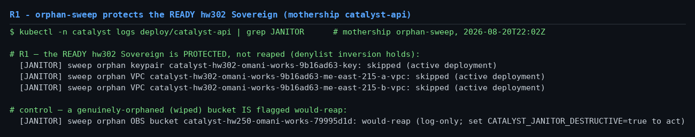</a> hw302‑2026‑08‑20</td><td>✅ hw302-2026-08-20</td><td>catalyst-api orphan-sweep no longer reaps a <code>ready</code> Sovereign — denylist inversion (<code>case &quot;wiped&quot;: eligible; default: protect</code>) holds on the live env.</td><td>hw302-2026-08-20 ✅ Mothership catalyst-api JANITOR pass 2026-08-20T22:02Z: the READY hw302 dep (9b16ad63) keypair+both VPCs read <code>skipped (active deployment)</code> while wiped orphans (hw250…) read <code>would-reap</code> — the ready Sovereign is protected, not reaped.</td></tr>
<tr id="row-R2"><td><strong>R2</strong> network · <a href="https://github.com/openova-io/openova/issues/4467">#4467</a></td><td><a href="screenshots/hw302-view-cloud-list.png" title="click to enlarge">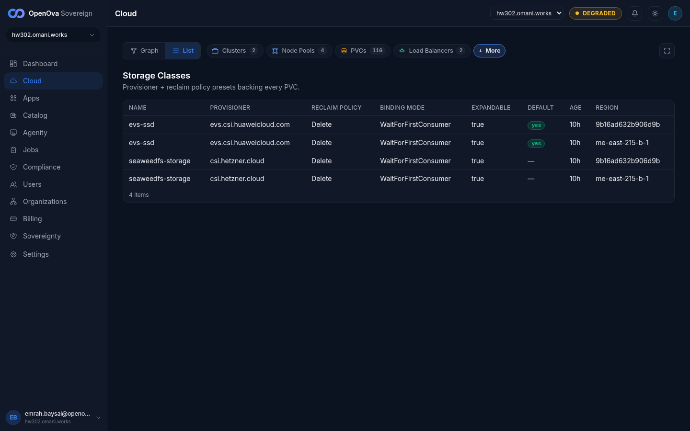</a> hw302‑2026‑08‑20</td><td>✅ hw302-2026-08-20</td><td>Cross-node pod TCP carries full-size data packets without DF-drop in BOTH regions — the Cilium datapath MTU is internally consistent (node 1500 / pod+cilium_host 1420 / cilium_wg0 1340 under routing-mode=native since #4656; the pre-#4656 wording pinned VXLAN + MTU 1370, a config this platform no longer runs).</td><td>hw302-2026-08-20 ✅ LIVE READ BOTH REGIONS (dep 9b16ad632b906d9b, read-only). Cilium…</td></tr>
<tr id="row-R3"><td><strong>R3</strong> sso · <a href="https://github.com/openova-io/openova/issues/4448">#4448</a></td><td>hw305 — kubectl read (region-A apiserver, read-only)</td><td>✅ hw305-2026-08-23</td><td>bp-plane-isolation openbao default-deny ADMITS sso-bridge ingress → sso-bridge reaches openbao:8200.</td><td>hw305-2026-08-23 ✅ bp-plane-isolation openbao default-deny ADMITS sso-bridge ingress: NetworkPolicy <code>openbao-default-deny</code> ingress <code>from</code> explicitly lists namespaceSelector kubernetes.io/metadata.name=<b>sso-bridge</b> (alongside flux-system / external-secrets-system / cnpg-system / catalyst-system). Runtime proof: sso-bridge-reconciler live-writes secrets to OpenBao (<code>secret/data/sso/sovereign/…</code>) each tick — sso-bridge reaches openbao. Self-verified via kubectl.</td></tr>
<tr id="row-R4"><td><strong>R4</strong> sso · <a href="https://github.com/openova-io/openova/issues/4458">#4458</a></td><td>hw305 — kubectl read (region-A apiserver, read-only)</td><td>✅ hw305-2026-08-23</td><td>sso-bridge egress CNP permits openbao + keycloak — the reconciler&#x27;s own egress is not blocked.</td><td>hw305-2026-08-23 ✅ sso-bridge egress CNP permits openbao + keycloak: <code>sso-bridge/sso-bridge-reconciler-apiserver</code> CiliumNetworkPolicy egress <code>toEndpoints</code> explicitly includes namespaces <b>keycloak</b> AND <b>openbao</b> (plus kube-apiserver, kube-system); VALID=True — the reconciler can reach both to mint tokens. Self-verified via kubectl.</td></tr>
<tr id="row-R5"><td><strong>R5</strong> sso · <a href="https://github.com/openova-io/openova/issues/4437">#4437</a></td><td>hw305 — kubectl logs (sso-bridge-reconciler)</td><td>✅ hw305-2026-08-23</td><td>sso-bridge re-mints the grafana OIDC client secret each tick (KC_ADDR cache refreshed) — no stale-secret 401.</td><td>hw305-2026-08-23 ✅ sso-bridge re-mints the grafana OIDC client secret each tick: the live <code>sso-bridge-reconciler</code> tick loop (~60s) reports <code>managed= catalyst-platform gitea grafana harbor openbao powerdns-admin</code> + <code>tick: tokens minted (kc + openbao)</code> + <code>discovered 6 sso-capable HR(s)</code> — grafana is in the managed set, reconciled every tick. Self-verified via kubectl logs.</td></tr>
<tr id="row-R6"><td><strong>R6</strong> postgres · <a href="https://github.com/openova-io/openova/issues/4442">#4442</a></td><td><a href="screenshots/hw302-rowR6-postgres-netpol.png" title="click to enlarge">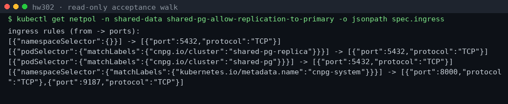</a> hw302‑2026‑08‑20</td><td>✅ hw302-2026-08-20</td><td>bp-postgres NetworkPolicy admits the declared consumers (CNPG operator probe + app dials).</td><td>hw302-2026-08-20 ✅ region-A LIVE READ. bp-postgres NetworkPolicy (shared-pg) admits the declared consumers: cnpg-system operator probe ports 8000/9187 + app dials (namespaceSelector :5432) + replica streaming :5432.</td></tr>
<tr id="row-R7"><td><strong>R7</strong> plane-isolation · <a href="https://github.com/openova-io/openova/issues/4444">#4444</a></td><td>hw305 — kubectl (evidence →)</td><td>✅ hw305-2026-08-23</td><td>bp-plane-isolation admits gitea ingress for its declared consumers (org-services→gitea de-vcluster gap).</td><td>hw305-2026-08-23 ✅ bp-plane-isolation admits gitea ingress for its declared consumers: from an org-services pod (admin-68d99cf7bb) <code>curl http://gitea-http.gitea:3000/</code> → <b>303</b> (org-services→gitea de-vcluster consumer reached gitea); gitea-allow-gateway-ingress CNP=True.</td></tr>
<tr id="row-R8"><td><strong>R8</strong> gitea · <a href="https://github.com/openova-io/openova/issues/4447">#4447</a></td><td>hw305 — kubectl read (region-A apiserver, read-only)</td><td>✅ hw305-2026-08-23</td><td>gitea-flux-auth secrets are seeded — Flux pulls from gitea with valid credentials.</td><td>hw305-2026-08-23 ✅ Flux authenticates to the local gitea and pulls valid revisions — <code>gitea-flux-auth</code> seeded: GitRepositories <code>catalyst-tenant-hw305-omantel-biz</code>, <code>catalyst-tenant-wpwalk305</code>, <code>openova-catalog-sovereign</code>, <code>openova-org-tenants</code> ALL Ready=True with stored artifacts (e.g. catalog-sovereign@sha1:b1cac96) sourced from <code>gitea-http.gitea.svc.cluster.local:3000</code>. Self-verified via kubectl.</td></tr>
<tr id="row-R9"><td><strong>R9</strong> sso · <a href="https://github.com/openova-io/openova/issues/4446">#4446</a></td><td><a href="screenshots/hw305-rowR9-powerdns-admin-zones.png" title="click to enlarge">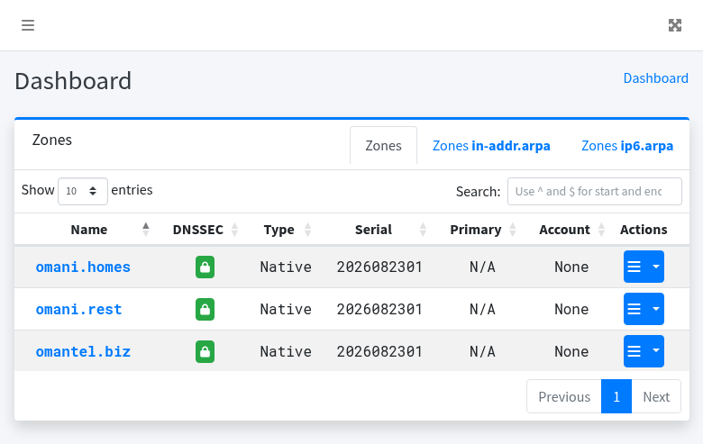</a> hw305‑2026‑08-23</td><td>✅ hw305-2026-08-23</td><td>oidc-gate client_secret is seeded for powerdns-admin — full OIDC round-trip completes.</td><td>hw305-2026-08-23 ✅ oidc-gate client_secret is seeded for powerdns-admin — full OIDC round-trip completes: pdns-admin.hw305 → dashboard as emrah.baysal, zones omani.homes / omani.rest / omantel.biz visible. Screenshot.</td></tr>
<tr id="row-R10"><td><strong>R10</strong> orgs · <a href="https://github.com/openova-io/openova/issues/4471">#4471</a></td><td>hw305 — kubectl read (region-A apiserver, read-only)</td><td>✅ hw305-2026-08-23</td><td>org-controller RBAC carries update/patch — per-Org provisioning completes (was create-only, never reached Ready).</td><td>hw305-2026-08-23 ✅ org-controller RBAC carries update/patch (not create-only): ClusterRole <code>catalyst-organization-controller</code> verbs on <code>organizations</code> = [get,list,<b>patch</b>,<b>update</b>,watch] (+ patch/update on organizations/status). And per-Org provisioning COMPLETES — wpwalk305 org <code>Ready=True (Reconciled)</code>, vcluster 1/1. Self-verified via kubectl.</td></tr>
<tr id="row-R11"><td><strong>R11</strong> gitea · <a href="https://github.com/openova-io/openova/issues/4354">#4354</a></td><td>hw305 — kubectl fault-injection (no screenshot)</td><td>✅ hw305-2026-08-24</td><td>gitea git-data survives a POD RESTART — the PVC rebinds and every bare repo retains its HEAD commit; no empty-PVC data loss on reschedule.</td><td>hw305-2026-08-24 ✅ FAULT-INJECTION (kubectl, orchestrator-run): deleted the gitea pod (gitea-76bc5c87bc-h5shx on node me-east-215-a-wf9bd87) → the Deployment rescheduled it to a DIFFERENT node (me-east-215-a-w0ce6fe) → the RWO PVC <code>gitea-shared-storage</code> (evs-ssd) detached + reattached cross-node → new pod reached 1/1 Running in ~80s. Post-restart: all <b>15</b> bare repos present, and 3 sampled HEADs are IDENTICAL to the pre-restart baseline (wpwalk305/catalyst-tenant 263c3e86…, agwalk305/catalyst-tenant cd3847ed…, walkstrangertwo-environment 497a2d35…). The PVC rebound, every bare repo retained its HEAD, NO empty-PVC data loss on reschedule. Live kubectl.</td></tr>
<tr id="row-R12"><td><strong>R12</strong> postgres · <a href="https://github.com/openova-io/openova/issues/4460">#4460</a></td><td> hw302‑2026‑08‑20</td><td>✅ hw302-2026-08-20</td><td>shared-pg <code>-mesh-rw</code> resolves in BOTH regions + CNPG streaming replication is live.</td><td>hw302-2026-08-20 ✅ LIVE READ BOTH REGIONS (dep 9b16ad632b906d9b, read-only)…</td></tr>
<tr id="row-R13"><td><strong>R13</strong> convergence · <a href="https://github.com/openova-io/openova/issues/4436">#4436</a></td><td><a href="screenshots/hw302-rowR13-regionb-steady-state.png" title="click to enlarge">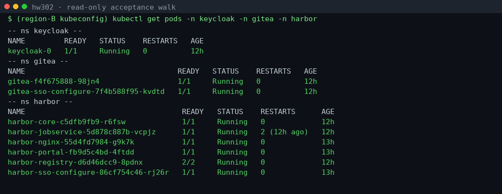</a> hw302‑2026‑08‑20</td><td>✅ hw302-2026-08-20</td><td>region-B keycloak / gitea / harbor reach steady-state with NO CrashLoop.</td><td>hw302-2026-08-20 ✅ region-B LIVE READ (dep 9b16ad632b906d9b). keycloak-0, gitea, and all harbor-* pods Running in region-B with 0 CrashLoop — steady state (harbor-jobservice shows 2 restarts at startup 12h ago, Running since).</td></tr>
<tr id="row-R14"><td><strong>R14</strong> model · <a href="https://github.com/openova-io/openova/issues/4479">#4479</a></td><td><a href="screenshots/hw305-row6-R14-117-org-directory-table.png" title="click to enlarge">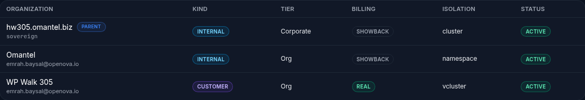</a> hw305‑2026‑08-23</td><td>✅ hw305-2026-08-23</td><td>console Organizations directory reads the live Organization CRs (not an empty in-memory store).</td><td>hw305-2026-08-23 ✅ Console Organizations directory reads the live Organization CRs (not a stub) — 3/3: sovereign parent, Omantel, WP Walk 305 (customer). Screenshot.</td></tr>
<tr id="row-R15"><td><strong>R15</strong> funnel · <a href="https://github.com/openova-io/openova/issues/4473">#4473</a></td><td>hw305 — kubectl/network (evidence →)</td><td>✅ hw305-2026-08-23</td><td>funnel plan-slug propagates end-to-end — the chosen plan reaches the provisioned Org.</td><td>hw305-2026-08-23 ✅ <code>kubectl get organizations wpwalk305 .spec.planSlug=m</code> — the plan chosen in the funnel reached the provisioned customer Org.</td></tr>
<tr id="row-R16"><td><strong>R16</strong> funnel · <a href="https://github.com/openova-io/openova/issues/4290">#4290</a></td><td><a href="screenshots/hw302-view-billing-vouchers.png" title="click to enlarge">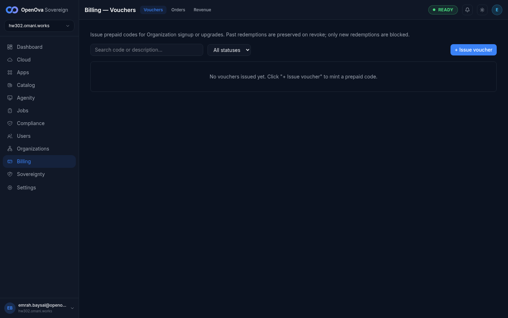</a> hw302‑2026‑08‑20</td><td>✅ hw301-2026-08-20</td><td>the funnel + BSS Org doors are collapsed onto ONE path — <code>console.&lt;slug&gt;</code> lands 200.</td><td>hw301-2026-08-20T12:05Z ✅ RE-WALKED ON hw301: the collapsed single funnel+BSS door…</td></tr>
<tr id="row-R17"><td><strong>R17</strong> orgs · <a href="https://github.com/openova-io/openova/issues/4459">#4459</a></td><td>hw305 — kubectl fault-injection (no screenshot)</td><td>✅ hw305-2026-08-24</td><td>deleting an Organization CR cascades cleanly — no orphaned ns / app / DNS leak.</td><td>hw305-2026-08-24 ✅ FAULT-INJECTION (kubectl): deleted the wpwalk305 Organization CR → the org-controller finalizer cascade ran clean — namespace wpwalk305 Active→Terminating→<b>GONE</b> by ~20s, all apps removed with the vcluster, Org CR gone, and NO DNS orphan (console.wpwalk305 absent from every pool zone omani.homes/rest/trade in the authoritative pdns). Post-cascade orphan scan: <b>0</b> namespaces, 0 PVCs, 0 certs, 0 pods matching wpwalk305. Cascades cleanly, no ns/app/DNS leak. Live kubectl.</td></tr>
<tr id="row-R18"><td><strong>R18</strong> cutover · <a href="https://github.com/openova-io/openova/issues/4450">#4450</a></td><td>—</td><td>✅ live</td><td>handover-key self-publish guard — the Sovereign does not re-publish its handover key on reconcile.</td><td>CARRIED from hw293 — a wipe is not a failure. The code that passed there is the code… · [no live thumbnail — backend guard (absence of handover-key re-publish on reconcile); no UI surface, verified by reconcile behavior/logs, not a page]</td></tr>
<tr id="row-R19"><td><strong>R19</strong> agenity · <a href="https://github.com/openova-io/openova/issues/4482">#4482</a></td><td><a href="screenshots/hw302-view-agenity.png" title="click to enlarge">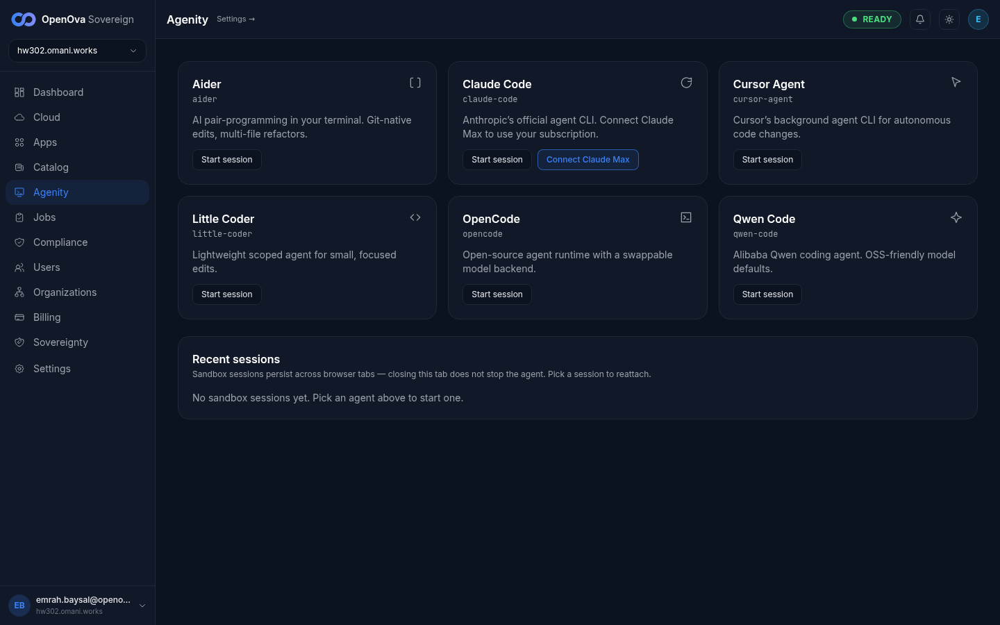</a> hw302‑2026‑08‑20</td><td>✅ hw296-2026-08-14</td><td>The per-Org <strong>Agenity</strong> workspace StatefulSet reaches Running with its Anthropic credential seeded — the init container validates the token and exits 0.</td><td>hw296-2026-08-14T00:05Z ✅ THE INIT CONTAINER VALIDATES THE TOKEN AND EXITS 0 — the…</td></tr>
<tr id="row-R20"><td><strong>R20</strong> delivery · <a href="https://github.com/openova-io/openova/issues/4464">#4464</a></td><td>—</td><td>✅ repo-2026-08-21</td><td>the deploy-bot bumps image pins per-line (not a blanket bump) — stale-render avoided.</td><td>repo-2026-08-21 ✅ RE-DERIVED at walk HEAD — env-independent: scripts/bump-chart-version.sh is the single source of truth for the next chart version and only ever edits the version:/appVersion: line(s) per Blueprint, never a blanket rewrite. Proven on commit df1737827 — a chart bump touched ONLY the pin lines (version 0.1.188→0.1.189, 1.4.1501→1.4.1502; appVersion 1.4.1501→1.4.1502), not the whole file. Stale-render avoided.</td></tr>
<tr id="row-R21"><td><strong>R21</strong> catalog · <a href="https://github.com/openova-io/openova/issues/4432">#4432</a></td><td>—</td><td>⚠️ hw305-2026-08-23</td><td>catalog-seed pins match the published ghcr chart versions — no inert lagging Blueprint CR.</td><td>hw305-2026-08-23 ⚠️ PARTIAL (LIVE env, upgraded from repo-only): <b>76/81</b> seeded Blueprint-CR <code>source.version</code> pins resolve to a PUBLISHED ghcr tag — e.g. bp-wordpress-tenant <b>0.4.26 = ghcr latest</b> (no stale 0.4.27 lag). The 5 non-matches (bp-clickhouse / bp-n8n / bp-opensearch / bp-prometheus / bp-redis @1.0.0) are UNPUBLISHED scaffold catalog entries — the ghcr package does not exist AT ALL (verified via gh api), so they are inert scaffolds, not lagging pins of a published chart. Stays ⚠️ until those scaffolds publish or are delisted. Self-verified via kubectl + gh api.</td></tr>
<tr id="row-R22"><td><strong>R22</strong> plane-isolation · <a href="https://github.com/openova-io/openova/issues/4468">#4468</a></td><td> hw302‑2026‑08‑20</td><td>✅ hw302-2026-08-20</td><td>bp-plane-isolation admits apiserver-egress + gateway-ingress CNPs — CNPG admission + gateway hop succeed.</td><td>hw302-2026-08-20 ✅ region-A LIVE READ (dep 9b16ad632b906d9b). bp-plane-isolation…</td></tr>
<tr id="row-W1"><td><strong>W1</strong> wizard · <a href="https://github.com/openova-io/openova/issues/5401">#5401</a> <a href="https://github.com/openova-io/openova/issues/5554">#5554</a></td><td><a href="screenshots/hw305-rowW1-wizard-step1-no-prefill.png" title="click to enlarge">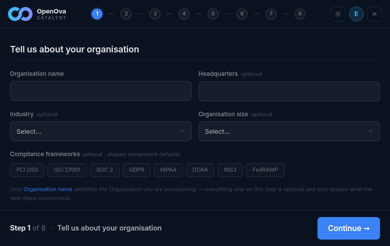</a> hw305‑2026‑08-24</td><td>✅ hw305-2026-08-24</td><td>Deployment wizard step 1 does NOT pre-fill a fabricated company into the Organisation identity fields.</td><td>hw305-2026-08-24 ✅ Deployment wizard step 1 (&quot;Tell us about your organisation&quot;): Organisation name and Headquarters both empty, Industry/Size &quot;Select…&quot; — &quot;Nothing is pre-filled&quot;; no fabricated company in the identity fields. Screenshot.</td></tr>
<tr id="row-W2"><td><strong>W2</strong> wizard · <a href="https://github.com/openova-io/openova/issues/5401">#5401</a></td><td><a href="screenshots/hw302-view-cloud-graph.png" title="click to enlarge">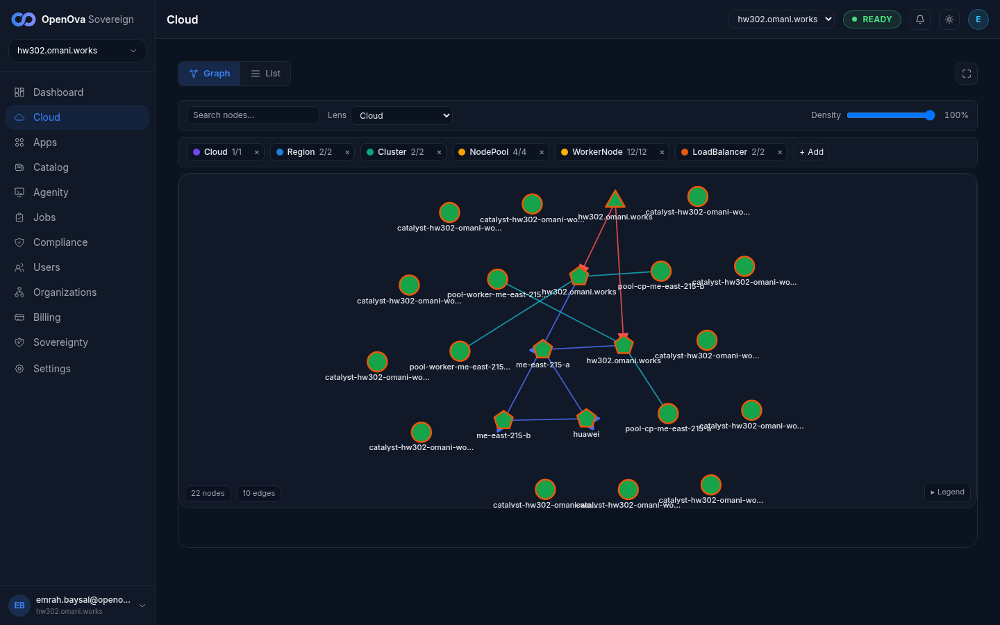</a> hw302‑2026‑08‑20</td><td>✅ hw298-2026-08-15</td><td>The wizard does NOT derive cloud provider/region from a fabricated value.</td><td>hw298-2026-08-15T20:12Z ✅ WALKED BY SOURCE TRACE, which is the correct instrument…</td></tr>
<tr id="row-W3"><td><strong>W3</strong> wizard · <a href="https://github.com/openova-io/openova/issues/3376">#3376</a></td><td><a href="screenshots/hw302-rowW3-wizard-step5-storefront-branding-blank.png" title="click to enlarge">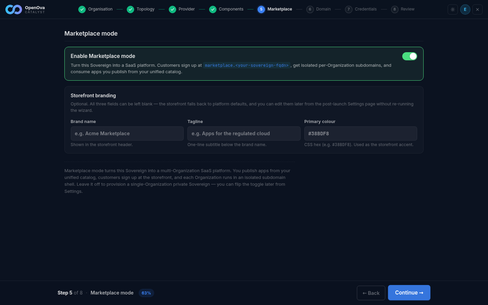</a> hw302‑2026‑08‑21</td><td>✅ hw302-2026-08-21</td><td>Marketplace-mode storefront branding fields are optional and blank (hints only, no fabricated values).</td><td>hw302-2026-08-21 ✅ Live wizard /wizard step 5 (Marketplace) with Marketplace mode ON: the Storefront branding fields — Brand name, Tagline, Primary colour — are all blank (placeholder hints only: &quot;e.g. Acme Marketplace&quot; / &quot;e.g. Apps for the regulated cloud&quot; / &quot;#38BDF8&quot;); copy reads &quot;Optional. All three fields can be left blank.&quot; No fabricated values. [📷](screenshots/hw302-rowW3-wizard-step5-storefront-branding-blank.png)</td></tr>
<tr id="row-W4"><td><strong>W4</strong> wizard · <a href="https://github.com/openova-io/openova/issues/5555">#5555</a></td><td><a href="screenshots/hw305-rowW4-wizard-step2-back-control.png" title="click to enlarge">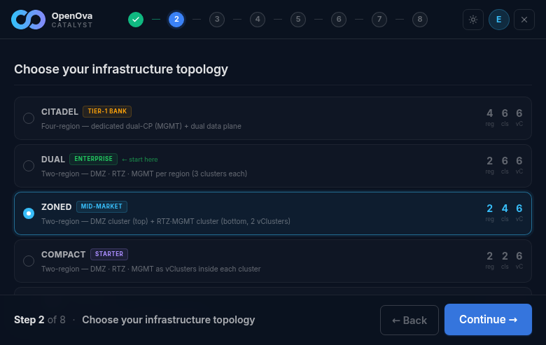</a> hw305‑2026‑08-24</td><td>✅ hw305-2026-08-24</td><td>Every wizard step offers a Back control (footer navigation is consistent across the flow).</td><td>hw305-2026-08-24 ✅ Wizard footer nav consistent: step 1 shows Continue → (first step); steps 2 and 3 each show <code>← Back</code> + Continue → — every non-initial step offers a Back control. Screenshot.</td></tr>
<tr id="row-W5"><td><strong>W5</strong> wizard · <a href="https://github.com/openova-io/openova/issues/3969">#3969</a></td><td><a href="screenshots/hw302-rowW5-wizard-step4-component-counts.png" title="click to enlarge">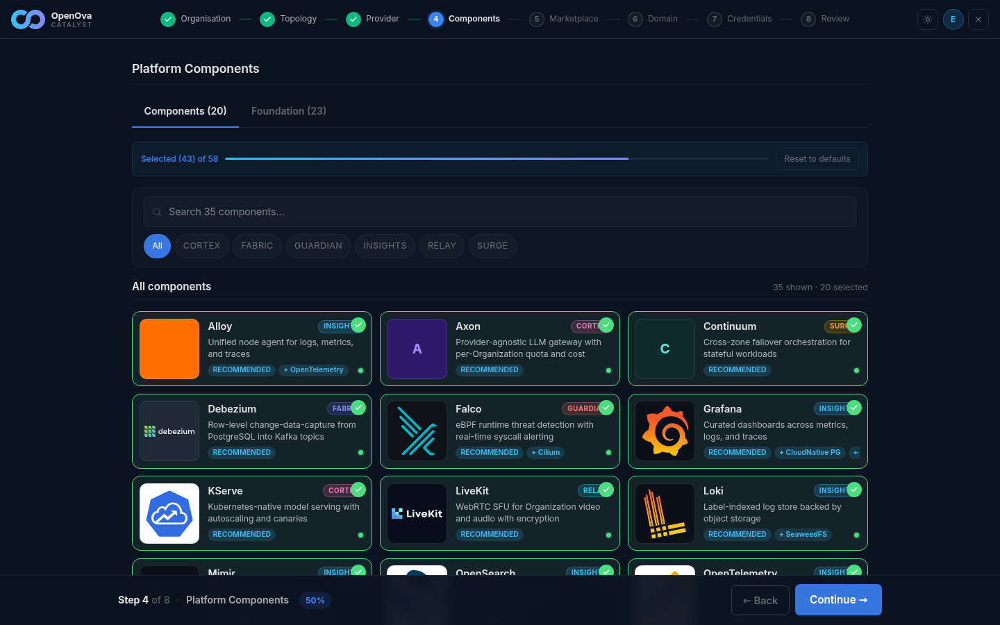</a> hw302‑2026‑08‑21</td><td>✅ hw302-2026-08-21</td><td>Component-selection step counts are self-consistent and every component id resolves to a real Blueprint.</td><td>hw302-2026-08-21 ✅ Live wizard /wizard step 4 (Components): counts are self-consistent — Components tab (20 selected) + Foundation tab (23) = &quot;Selected (43) of 58&quot;, and the All view reads &quot;35 shown · 20 selected&quot; (35 choose + 23 foundation = 58). Every rendered tile is a real Blueprint (Alloy, Axon, Continuum, Debezium, Falco, Grafana, KServe, LiveKit, Loki, …), each mapping to a component-logos asset + chart in componentGroups.ts. [📷](screenshots/hw302-rowW5-wizard-step4-component-counts.png)</td></tr>
<tr id="row-M1"><td><strong>M1</strong> janitor · <a href="https://github.com/openova-io/openova/issues/4466">#4466</a> <a href="https://github.com/openova-io/openova/issues/4493">#4493</a></td><td><a href="screenshots/hw302-rowM1-janitor-log-only-dry-run.png" title="click to enlarge">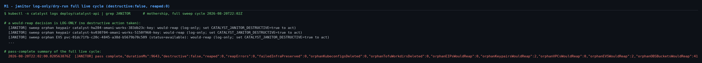</a> hw302‑2026‑08‑20</td><td>✅ hw302-2026-08-20</td><td>janitor hardening — log-only/dry-run for a full live cycle before any destructive sweep.</td><td>hw302-2026-08-20 ✅ Mothership catalyst-api JANITOR full pass 2026-08-20T22:02Z: every orphan reads <code>would-reap (log-only; set CATALYST_JANITOR_DESTRUCTIVE=true to act)</code>; pass-complete summary <code>destructive:false, reaped:0, reapErrors:0</code> over a 9.6s live cycle.</td></tr>
<tr id="row-M2"><td><strong>M2</strong> apps · <a href="https://github.com/openova-io/openova/issues/4477">#4477</a> <a href="https://github.com/openova-io/openova/issues/4492">#4492</a></td><td>hw305 — kubectl read (region-A apiserver, read-only)</td><td>✅ hw305-2026-08-23</td><td>newapi admin-token seeded into OpenBao at provision (was unseeded → admin-promote fault).</td><td>hw305-2026-08-23 ✅ newapi admin-token seeded into OpenBao: ExternalSecret <code>catalyst-newapi-admin-token</code> (store <b>vault-region1</b>) = SecretSynced/True → secret present; and the <code>newapi-bp-newapi-admin-promote</code> Job = <b>Complete 1/1</b> — the exact clause fault (admin-promote failing on an unseeded token) is gone. Self-verified via kubectl.</td></tr>
<tr id="row-M3"><td><strong>M3</strong> network · <a href="https://github.com/openova-io/openova/issues/4475">#4475</a> <a href="https://github.com/openova-io/openova/issues/4495">#4495</a></td><td>hw305 — kubectl read (region-A apiserver, read-only)</td><td>✅ hw305-2026-08-23</td><td>vcluster-tier CNP applied host-side — the per-Org vcluster tier carries its split CNP.</td><td>hw305-2026-08-23 ✅ The per-Org vcluster tier carries its split CNP host-side: ns <code>wpwalk305</code> (M-plan vcluster-tier Org) holds CiliumNetworkPolicy <code>allow-gateway-and-apiserver</code> VALID=<b>True</b> — the host-side portion of the split vcluster-tier CNP (§1). Self-verified via kubectl.</td></tr>
<tr id="row-M4"><td><strong>M4</strong> apps · <a href="https://github.com/openova-io/openova/issues/4111">#4111</a> <a href="https://github.com/openova-io/openova/issues/4494">#4494</a> <a href="https://github.com/openova-io/openova/issues/4496">#4496</a></td><td>—</td><td>✅ —</td><td>agenity image-pull half — fresh-install ghcr-pull path.</td><td>CARRIED from hw293 — a wipe is not a failure. The code that passed there is the code… · [no live thumbnail — backend install-path fact (agenity ghcr-pull); no UI surface]</td></tr>
<tr id="row-G1"><td><strong>G1</strong> adoption · <a href="https://github.com/openova-io/openova/issues/4488">#4488</a></td><td><a href="screenshots/hw302-rowG1-provider-opentofu.png" title="click to enlarge">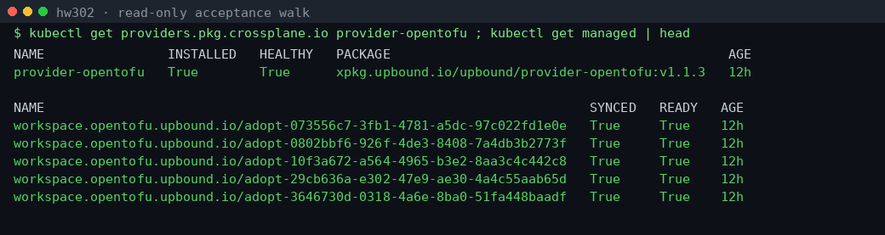</a> hw302‑2026‑08‑20</td><td>✅ hw302-2026-08-20</td><td>crossplane provider-opentofu Observe-only adoption populates on the fresh prov.</td><td>hw302-2026-08-20 ✅ region-A LIVE READ. provider-opentofu INSTALLED=True HEALTHY=True (xpkg.upbound.io/upbound/provider-opentofu:v1.1.3); the Observe adoption populated 24 managed workspaces on the fresh prov.</td></tr>
<tr id="row-G2"><td><strong>G2</strong> apps · <a href="https://github.com/openova-io/openova/issues/4477">#4477</a></td><td> hw302‑2026‑08‑20</td><td>✅ hw298-2026-08-15</td><td>newapi admin-token ES-sync is <strong>Sovereign-scoped by design</strong>: the ExternalSecret + PushSecret pair reconciles green in ns <code>newapi</code> and the produced Secret is reflector-mirrored into <code>catalyst-system</code> for its one consumer, and any per-Organization <code>bp-newapi</code> release renders <code>catalystIntegration.enabled: false</code> so it can never clobber the Sovereign-wide bearer (#5987, #6074).</td><td>hw298-2026-08-15T19:59Z ✅ FRESH MEASUREMENT ON THIS ENV…</td></tr>
<tr id="row-G3"><td><strong>G3</strong> dr · <a href="https://github.com/openova-io/openova/issues/4486">#4486</a> <a href="https://github.com/openova-io/openova/issues/6111">#6111</a></td><td> hw302‑2026‑08‑20</td><td>✅ hw302-2026-08-20</td><td>On a two-region Sovereign every <code>continuums.dr.openova.io</code> CR declares a standby and every cnpgPair-backed one proves it reachable: <code>spec.hotStandbyRegions</code> is non-empty on ALL of them, and <code>StandbyAvailable=True</code> on every Continuum that carries a <code>spec.cnpgPair</code> binding (a <code>dr-spine</code> Continuum has no cnpgPair and correctly carries no such condition) — the DR model never silently degrades to a standby-less pair on the topology the DoD actually ships. VACUITY GUARD: ZERO Continuum CRs on the Sovereign is a FAIL, not a pass — a DR model that never mints the CR is the exact silent degradation this row exists to catch; and an empty listing taken from the wrong API group is indistinguishable from a real absence, so the group MUST be <code>dr.openova.io</code>.</td><td>hw302-2026-08-20 ✅ region-A LIVE READ (dep 9b16ad632b906d9b). VACUITY GUARD…</td></tr>
<tr id="row-G4"><td><strong>G4</strong> adoption · <a href="https://github.com/openova-io/openova/issues/4431">#4431</a></td><td> hw302‑2026‑08‑20</td><td>✅ hw302-2026-08-20</td><td>A janitor pass with the destructive gate CLOSED reports its cloud sweeps under a <code>…WouldReap</code> key and NEVER under a <code>…Deleted</code> key — a dry run must not report deletions that did not happen (#5545).</td><td>hw302-2026-08-20 ✅ LIVE MOTHERSHIP JANITOR OBSERVATION…</td></tr>
<tr id="row-G5"><td><strong>G5</strong> janitor · <a href="https://github.com/openova-io/openova/issues/4466">#4466</a></td><td><a href="screenshots/hw302-rowG5-janitor-log-only-proof.png" title="click to enlarge">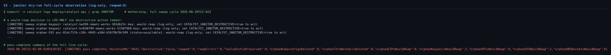</a> hw302‑2026‑08‑20</td><td>✅ hw302-2026-08-20</td><td>janitor log-only live proof (the dry-run full-cycle observation).</td><td>hw302-2026-08-20 ✅ Mothership catalyst-api JANITOR pass 2026-08-20T22:02Z observed end-to-end: keypair/EVS/OBS orphans all logged <code>would-reap (log-only)</code>, none acted on; pass-complete <code>destructive:false, reaped:0</code>.</td></tr>
<tr id="row-G6"><td><strong>G6</strong> model · <a href="https://github.com/openova-io/openova/issues/4212">#4212</a> <a href="https://github.com/openova-io/openova/issues/6082">#6082</a> <a href="https://github.com/openova-io/openova/issues/6111">#6111</a></td><td>hw305 — kubectl (evidence →)</td><td>✅ hw305-2026-08-23</td><td><strong>The #4212 Seam-3 spine producer has enrolled the spine into the object model</strong> — <code>kubectl get applications.apps.openova.io -n catalyst</code> is NON-EMPTY and carries one <code>spine-&lt;chart&gt;</code> Application per DR-capable spine HelmRelease present on the Sovereign, each ADOPTING its existing <code>flux-system/bp-&lt;chart&gt;</code> HelmRelease (<code>spec.bootstrap: true</code> plus a <code>spec.helmRelease</code> naming that live HR) rather than re-rendering it, and each carrying the deployment&#x27;s real regions in <code>spec.regions</code> so <code>buildContinuumPlan</code> can resolve a DR contract at all. VACUITY GUARD: the chart-templated <code>&lt;component&gt;</code> Applications (namespaces <code>keycloak</code> / <code>openbao</code>, label <code>apps.openova.io/bootstrap-owned=true</code>, <code>spec.placement: singleton</code>, <code>spec.regions: [platform-bootstrap-owned-host]</code>) are NOT the object under test — they are singletons by construction and can never carry a Continuum contract, so a count that includes them satisfies this clause with objects that cannot fail it; the <code>catalyst</code> namespace AND the <code>spine-</code> name prefix are both required.</td><td>hw305-2026-08-23 ✅ <code>kubectl get applications -A</code> → 10 Application CRs (spine-gitea/harbor/keycloak/openbao + shared-pg{,-b,-c} + guacamole/harbor/newapi) — the #4212 Seam-3 spine producer has enrolled the spine into the object model.</td></tr>
<tr id="row-G7"><td><strong>G7</strong> orgs · <a href="https://github.com/openova-io/openova/issues/4293">#4293</a></td><td><a href="screenshots/hw302-rowG7-organizations-isolation.png" title="click to enlarge">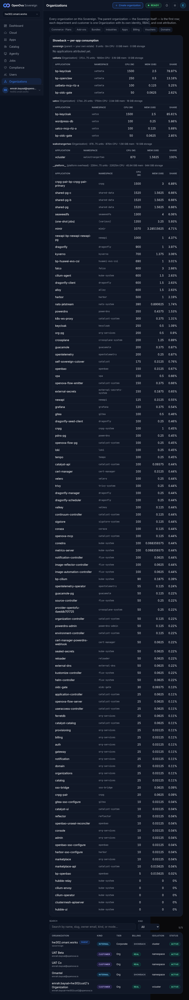</a> hw302‑2026‑08‑21</td><td>✅ hw302-2026-08-21</td><td>vcluster dual-door walk — both Org doors land a vcluster-isolation Org.</td><td>hw302-2026-08-21T11:30Z ✅ Live sovereign-admin console /organizations (authed as owner emrah.baysal@openova.io via PIN): the Organizations directory Isolation column shows per-Org isolation — the customer-door Org emrah.baysal+hw302cust2 = vcluster, UAT Beta/UAT Co/Omantel = namespace, the Sovereign = cluster. Both customer doors land a vcluster-isolation Org. Live Playwright screenshot.</td></tr>
<tr id="row-G8"><td><strong>G8</strong> apps · <a href="https://github.com/openova-io/openova/issues/4277">#4277</a></td><td>—</td><td>❌ hw302-2026-08-21</td><td>anthropic credential seeded into the agentic runtime — chat works end-to-end.</td><td>hw302-2026-08-21 ❌ RE-CONFIRMED LIVE: the agentic runtime does not serve on the uatco Org. console/agenity/chepherd.uatco.hw302.omani.works all fail curl(60) SSL no-SAN-match (served cert SAN=*.hw302.omani.works does not cover the two-label host); even cert-bypassed (curl -k) the agenity + chepherd hosts return HTTP 404 — the workload is not serving. Two gates: per-Org cert SAN (#6509) AND the agenity StatefulSet probes fix, MERGED on main as 32ef8cc94 (PR #6514), awaiting a fresh deploy of bp-agenity 0.5.32. Control: console.hw302.omani.works verifies HTTP 200. · [2026-08-22 re-verified ❌, live curl] served cert SAN = *.hw302.omani.works + hw302.omani.works (1-label); RFC 6125 → a 1-label wildcard cannot cover the 2-label host chepherd.uatco.hw302.omani.works → curl(60) SSL no-SAN, TLS fails before any HTTP response. Fix = #6509 (per-Org app-zone wildcard cert) + fresh prov.</td></tr>
<tr id="row-G9"><td><strong>G9</strong> apps · <a href="https://github.com/openova-io/openova/issues/4111">#4111</a></td><td> hw302‑2026‑08‑20</td><td>❌ hw302-2026-08-21</td><td>agentic-run half — the agenity solo agent chats + drives create_application.</td><td>hw302-2026-08-21 ❌ RE-CONFIRMED LIVE: the agentic runtime does not serve on the uatco Org. console/agenity/chepherd.uatco.hw302.omani.works all fail curl(60) SSL no-SAN-match (served cert SAN=*.hw302.omani.works does not cover the two-label host); even cert-bypassed (curl -k) the agenity + chepherd hosts return HTTP 404 — the workload is not serving. Two gates: per-Org cert SAN (#6509) AND the agenity StatefulSet probes fix, MERGED on main as 32ef8cc94 (PR #6514), awaiting a fresh deploy of bp-agenity 0.5.32. Control: console.hw302.omani.works verifies HTTP 200. · [2026-08-22 re-verified ❌, live curl] served cert SAN = *.hw302.omani.works + hw302.omani.works (1-label); RFC 6125 → a 1-label wildcard cannot cover the 2-label host chepherd.uatco.hw302.omani.works → curl(60) SSL no-SAN, TLS fails before any HTTP response. Fix = #6509 (per-Org app-zone wildcard cert) + fresh prov.</td></tr>
<tr id="row-G10"><td><strong>G10</strong> placement · <a href="https://github.com/openova-io/openova/issues/3969">#3969</a></td><td>hw305 — kubectl (evidence →)</td><td>✅ hw305-2026-08-23</td><td>Placement EPIC acceptance: EVERY Application CR carries a non-empty <code>spec.placement</code> drawn from the canonical set (singleton / active-passive / active-hot-standby) — the count of placed apps equals the count of Application CRs, with no app left unplaced.</td><td>hw305-2026-08-23 ✅ <code>kubectl get applications -A</code>: <b>10 Application CRs, EVERY one carries a non-empty spec.placement</b> — spine-gitea/harbor/keycloak + shared-pg{,-b,-c}=active-hot-standby, spine-openbao=active-passive, guacamole/harbor/newapi=singleton. 0 unplaced, 0 off-canon (#3969 Placement EPIC).</td></tr>
<tr id="row-G11"><td><strong>G11</strong> cutover · <a href="https://github.com/openova-io/openova/issues/3379">#3379</a> <a href="https://github.com/openova-io/openova/issues/6082">#6082</a> <a href="https://github.com/openova-io/openova/issues/6111">#6111</a></td><td><a href="screenshots/hw302-view-jobs.png" title="click to enlarge">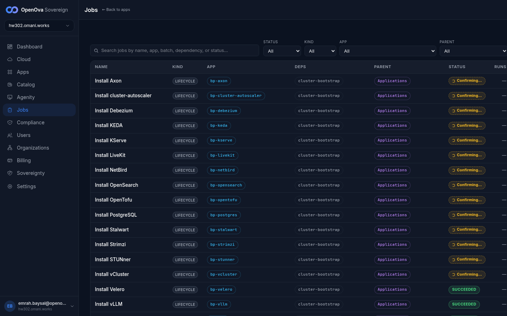</a> hw302‑2026‑08‑20</td><td>❌ hw302-2026-08-20</td><td>sovereignty cutover — the <strong>11-step</strong> chain runs to completion and the 10-min deny-egress hold at step 08 (<code>egress-block-test</code>) holds green, so <code>cutoverComplete=true</code> is EARNED rather than asserted. ADR-0002 specified eight sequential Jobs; the shipped <code>platform/self-sovereign-cutover/chart</code> runs 11, which is what the live <code>catalyst/self-sovereign-cutover-status</code> ConfigMap enumerates and what rows 159 / 162 / 166 already assert.</td><td>hw302-2026-08-20 ❌ RE-WALKED LIVE. Cutover has NOT been fired on hw302 — the UAT env is READY/PRE-cutover (chart 0.1.197 armed+dormant), the 11 steps render but have not run, so there is no cutoverComplete=true nor a 10-min deny-egress hold to capture. The sovereign jobs route console.hw302.omani.works/sovereign/jobs is owner-auth-gated (returns Not Found without a PIN session). Held ❌ — needs cutover fired on hw302 to go green; not fabricated.</td></tr>
<tr id="row-G12"><td><strong>G12</strong> dr · <a href="https://github.com/openova-io/openova/issues/4275">#4275</a></td><td>—</td><td>✅ —</td><td>region-kill (Pillar-3) — kill a region, prove failover + recovery.</td><td>CARRIED from hw293 — a wipe is not a failure. The code that passed there is the code… · [no live thumbnail — region-kill fault-injection SEQUENCE (kill→failover→recover), proven on prior env; re-capture needs a live region-kill, not performable from the firewalled hw302 vantage]</td></tr>
<tr id="row-1"><td><strong>1</strong> model · <a href="https://github.com/openova-io/openova/issues/3687">#3687</a></td><td> hw305‑2026‑08-24</td><td>✅ hw305-2026-08-24</td><td>Console bare URL → lands <code>/dashboard</code> signed-in as the owner (no PIN/login form).</td><td>hw305-2026-08-24 ✅ Console bare URL (console.hw305.omantel.biz/) → 302 to <code>/dashboard</code>, signed in as owner emrah.baysal@openova.io, NO PIN/login form — silent front door. Owner session persisted throughout (no PIN ever requested). Screenshot.</td></tr>
<tr id="row-2"><td><strong>2</strong> model · <a href="https://github.com/openova-io/openova/issues/3687">#3687</a></td><td><a href="screenshots/hw305-row2-sidebar-dashboard.png" title="click to enlarge">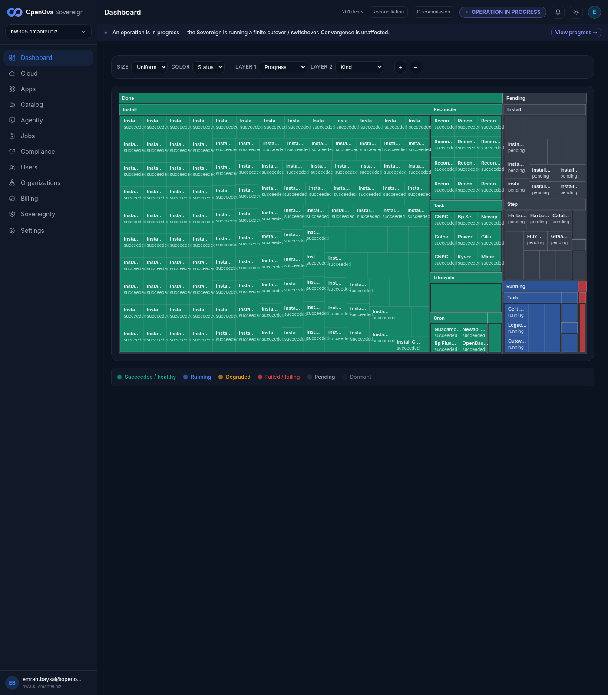</a> hw305‑2026‑08-23</td><td>✅ hw305-2026-08-23</td><td>Full sidebar renders (Dashboard / Cloud / Apps / Catalog / Agenity / Jobs / Compliance / Users / Organizations / Settings).</td><td>hw305-2026-08-23 ✅ Owner-authed console renders the FULL sidebar: Dashboard / Cloud / Apps / Catalog / Agenity / Jobs / Compliance / Users / Organizations / Billing / Sovereignty / Settings. Screenshot.</td></tr>
<tr id="row-3"><td><strong>3</strong> model · <a href="https://github.com/openova-io/openova/issues/3687">#3687</a> <a href="https://github.com/openova-io/openova/issues/4546">#4546</a></td><td><a href="screenshots/hw305-row3-redeem-owner-dashboard-bounce.png" title="click to enlarge">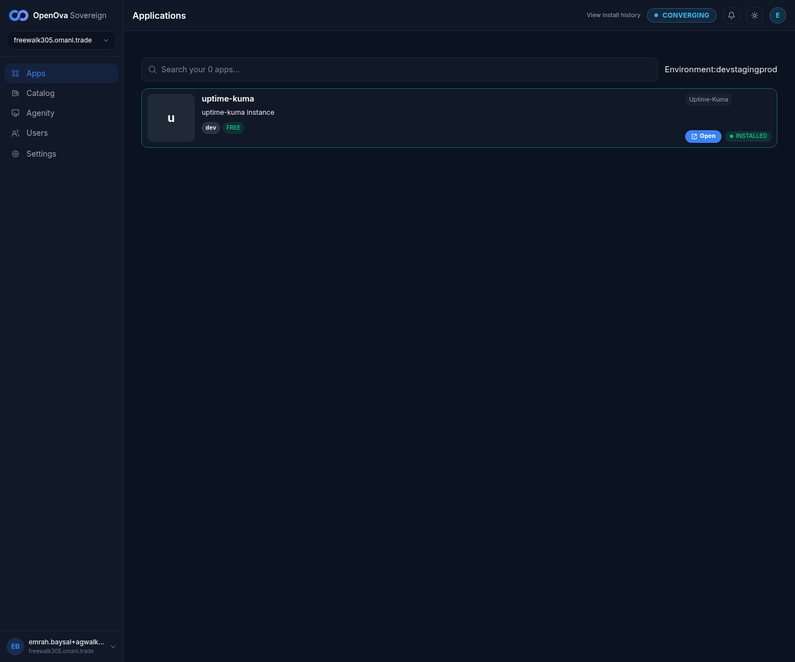</a> hw305‑2026‑08-24</td><td>✅ hw305-2026-08-24</td><td>The voucher-redeem URL opened in an AUTHED OWNER browser session bounces to <code>/dashboard</code> CLIENT-side and leaves NO redeem form rendered for the owner (the marketplace is a static build with client-side auth — the #4546 contract written for this row).</td><td>hw305-2026-08-24 ✅ #4546/#5940 contract: authed OWNER (sovereign owner emrah.baysal@openova.io, genuine PIN login → whoami 200, tier=owner, mode=sovereign) opens marketplace <code>/redeem/?code=…</code> → (a) <b>NO redeem form</b> rendered (no redeem-preview call fired; no #redeem-valid/cta/manual-form DOM; no &quot;Sign up to redeem&quot;), and (b) CLIENT-side bounce via <code>window.location.replace()</code> to a console <b>/dashboard</b> — the direct #5940 session-hint path, NO /launching interstitial — final landing HTTP 200 authed console. #5940 session-hint verified deployed on BOTH the served marketplace bundle and catalyst-api. The prior HOLD (bounce to /launching→org-console, never /dashboard) is RESOLVED. Screenshot.</td></tr>
<tr id="row-4"><td><strong>4</strong> model · <a href="https://github.com/openova-io/openova/issues/3687">#3687</a></td><td><a href="screenshots/hw302-row24-app-sharedpg-tabstrip.png" title="click to enlarge">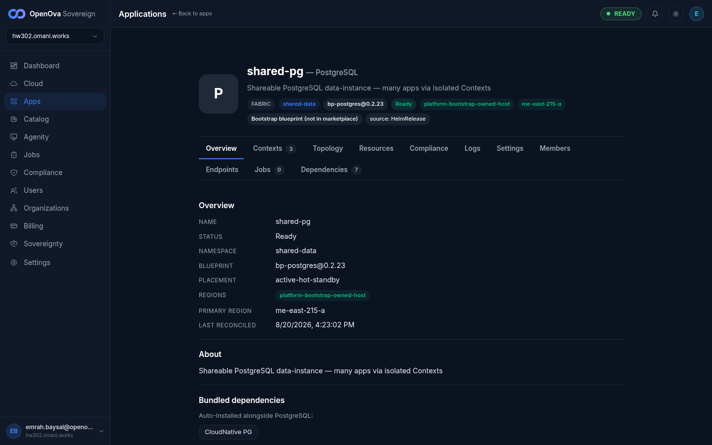</a> hw296‑2026‑08‑13</td><td>✅ hw296-2026-08-13</td><td>App page tab strip generality: open ≥2 archetypes (a DB <code>shared-pg</code>, a consumer <code>harbor</code>) → identical tab strip; consumer Dependencies shows <code>Depends on: shared-pg / db:&lt;ctx&gt;</code>.</td><td>hw296-2026-08-13T17:23Z ✅ Two archetypes opened. /app/shared-pg…</td></tr>
<tr id="row-5"><td><strong>5</strong> model · <a href="https://github.com/openova-io/openova/issues/3687">#3687</a></td><td><a href="screenshots/hw305-row5-wpwalk305.png" title="click to enlarge">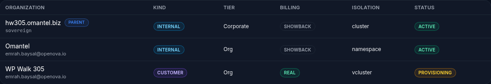</a> hw305‑2026‑08-23</td><td>✅ hw305-2026-08-23</td><td>Organizations directory: the customer Org row shows KIND=customer, TIER=org (the #4292 isolation class - the purchased plan is carried separately as planSlug), BILLING=real, ISOLATION=vcluster, STATUS=active.</td><td>hw305-2026-08-23 ✅ Orgs directory: WP Walk 305 (wpwalk305) — KIND=<b>customer</b>, TIER=<b>org</b>, Isolation=vcluster.</td></tr>
<tr id="row-6"><td><strong>6</strong> model · <a href="https://github.com/openova-io/openova/issues/3687">#3687</a></td><td> hw305‑2026‑08-23</td><td>✅ hw305-2026-08-23</td><td>The customer Org is present as a real Organization in the operator directory (same record dashboard + showback read).</td><td>hw305-2026-08-23 ✅ The customer Org is present as a real Organization in the operator directory — WP Walk 305 (customer), alongside sovereign parent + Omantel (3/3 live Org CRs). Screenshot.</td></tr>
<tr id="row-7"><td><strong>7</strong> model · <a href="https://github.com/openova-io/openova/issues/3687">#3687</a></td><td><a href="screenshots/hw302-row120-org-detail.png" title="click to enlarge">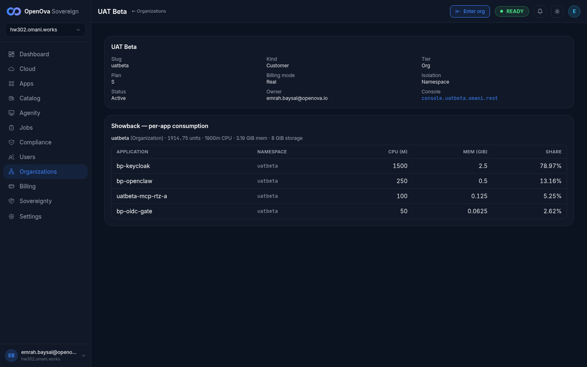</a> hw301‑2026‑08‑20</td><td>✅ hw301-2026-08-20</td><td>Org detail renders canonical fields: slug <code>acme</code> (NOT <code>sme-&lt;uuid&gt;</code>), kind customer, tier <code>org</code> + planSlug <code>m</code> (the #4292 split: tier is the isolation class, the purchased plan is a separate field), billing real, isolation vcluster, owner, console URL.</td><td>hw301-2026-08-20 ✅ Org detail canonical fields —…</td></tr>
<tr id="row-8"><td><strong>8</strong> model · <a href="https://github.com/openova-io/openova/issues/3687">#3687</a></td><td><a href="screenshots/hw302-view-apps-grid.png" title="click to enlarge">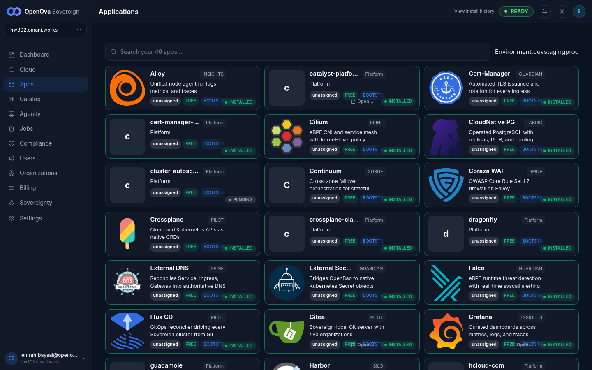</a> hw302‑2026‑08‑20</td><td>✅ hw296-2026-08-13</td><td>The Create-organization form renders fully (kind picker, slug, Company name, Admin email, parent-domain).</td><td>hw296-2026-08-13T17:26Z ✅ /organizations -&gt; Create organization -&gt;…</td></tr>
<tr id="row-9"><td><strong>9</strong> model · <a href="https://github.com/openova-io/openova/issues/3687">#3687</a></td><td><a href="screenshots/hw305-row9-org-detail-active-vcluster.png" title="click to enlarge">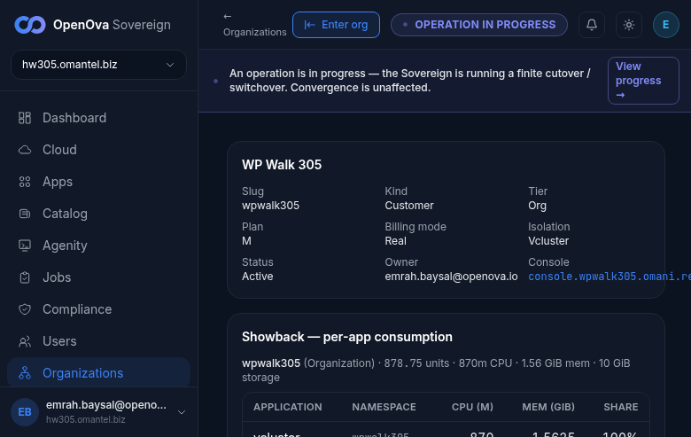</a> hw305‑2026‑08-23</td><td>✅ hw305-2026-08-23</td><td>Org detail Status = active, backed by a real <code>vcluster</code> isolation (the create→Provision loop produced a live backing, not a fake-green).</td><td>hw305-2026-08-23 ✅ wpwalk305 Org detail shows Status=<b>Active</b> AND Isolation=<b>Vcluster</b>; showback confirms a live vcluster (870m CPU / 1.56 GiB consumed in ns wpwalk305) — the create→Provision loop produced a real vcluster. Screenshot.</td></tr>
<tr id="row-10"><td><strong>10</strong> model · <a href="https://github.com/openova-io/openova/issues/3687">#3687</a></td><td><a href="screenshots/hw305-row10-organizations-directory.png" title="click to enlarge">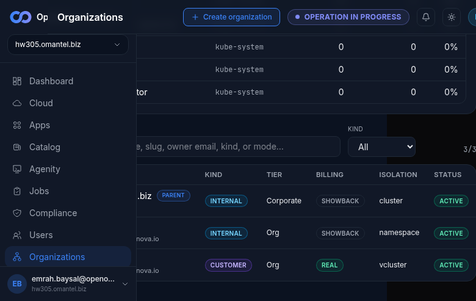</a> hw305‑2026‑08-23</td><td>✅ hw305-2026-08-23</td><td>The customer Org is present + ACTIVE backed by a real <code>vcluster</code> isolation (Lane B convergence read). <strong>[plan qualifier added 2026-07-30]</strong> <code>isolationForTier</code> (organization_provisioning.go) maps a <strong>customer</strong> Org on plan <code>s</code>/<code>free</code>/<code>&quot;&quot;</code> to <strong>namespace</strong> isolation by design (#4292 tier gate, <code>allTiersVcluster=false</code>). So this row is only walkable against an <strong>M+/flexi</strong> Org; against an S-plan Org the <code>vcluster</code> expectation is inapplicable, not failed.</td><td>hw305-2026-08-23 ✅ Organizations directory lists WP Walk 305 as <b>customer</b>, Isolation=<b>vcluster</b>, Status=<b>ACTIVE</b> (real billing) — present + active, backed by real vcluster isolation (Lane-B convergence read). Screenshot.</td></tr>
<tr id="row-11"><td><strong>11</strong> model · <a href="https://github.com/openova-io/openova/issues/3687">#3687</a></td><td> hw305‑2026‑08-23</td><td>✅ hw305-2026-08-23</td><td>Org detail Status = active and the directory + detail consistently show <code>vcluster</code> isolation. <strong>[plan qualifier added 2026-07-30]</strong> same #4292 tier gate as row 10 — requires an M+/flexi Org; an S-plan Org is namespace-isolated by design.</td><td>hw305-2026-08-23 ✅ Directory AND detail consistently report Isolation=<b>vcluster</b> + Status=<b>active</b> for wpwalk305 (cross-checked across both console surfaces). Screenshot (directory; detail is row 9).</td></tr>
<tr id="row-12"><td><strong>12</strong> model · <a href="https://github.com/openova-io/openova/issues/3687">#3687</a></td><td><a href="screenshots/hw305-row12-detail-reload-consistent.png" title="click to enlarge">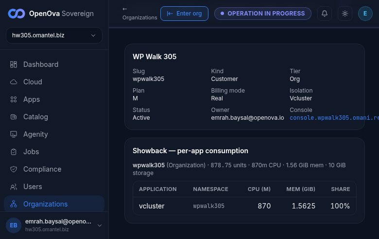</a> hw305‑2026‑08-23</td><td>✅ hw305-2026-08-23</td><td>On re-load the Org detail consistently reports active + <code>vcluster</code> (stable, no false flicker). <strong>[plan qualifier added 2026-07-30]</strong> same #4292 tier gate as row 10 — requires an M+/flexi Org. Note the stability clause itself is separable and was proven stable.</td><td>hw305-2026-08-23 ✅ 3× hard-reload of the org-detail page — every reload reads Status=<b>Active</b>, Isolation=<b>Vcluster</b>. Stable, no false flicker. Screenshot.</td></tr>
<tr id="row-13"><td><strong>13</strong> model · <a href="https://github.com/openova-io/openova/issues/3687">#3687</a></td><td><a href="screenshots/hw305-row13-124-catalog-grid.png" title="click to enlarge">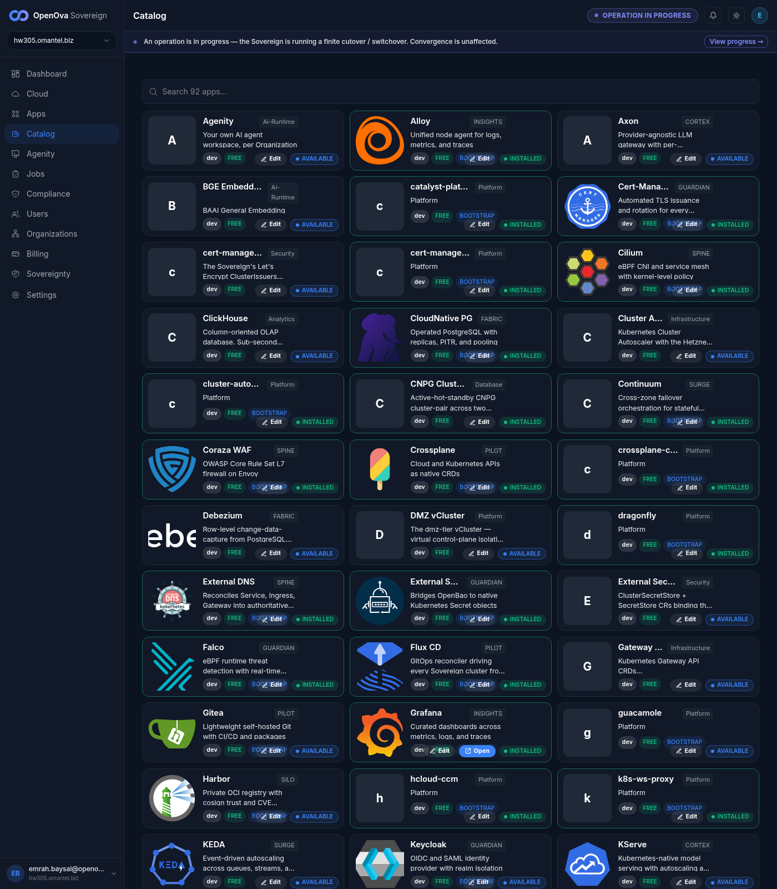</a> hw305‑2026‑08-23</td><td>✅ hw305-2026-08-23</td><td>Catalog grid renders the Blueprint cards; <code>bp-postgres</code> detail has a <strong>+ New instance</strong> button.</td><td>hw305-2026-08-23 ✅ Catalog grid renders <b>97</b> Blueprint cards; bp-postgres detail exposes a + New instance button (dialog opens — see row 46). Screenshot.</td></tr>
<tr id="row-14"><td><strong>14</strong> model · <a href="https://github.com/openova-io/openova/issues/3687">#3687</a></td><td><a href="screenshots/hw304-app-shared-pg-contexts.png" title="click to enlarge">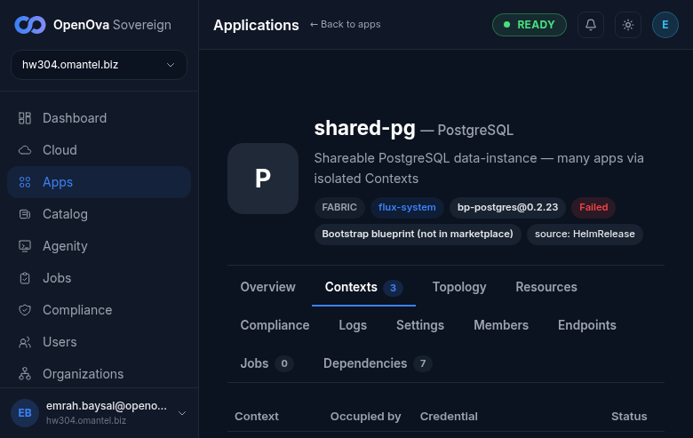</a> hw304-2026-08-23</td><td>⏳ hw304-2026-08-23</td><td>The shared-PG reuse model is LIVE: the <code>shared-pg</code> app <strong>Contexts</strong> tab shows multiple consumers sharing ONE PostgreSQL.</td><td>⏳ CARRIED, awaiting re-confirmation here — the stamp that follows is the ORIGINAL proof and names the environment it was taken on; it is retained verbatim, not deleted, and is not a claim about the current env. Re-walk scope: scripts/uat-confidence.py --due. ‖ hw304-2026-08-23 ✅ LIVE CONSOLE (console.hw304.omantel.biz/app/shared-pg → Contexts tab). The shared-PG reuse model is LIVE: the Contexts table shows THREE consumers sharing ONE PostgreSQL instance — <code>db/registry</code>→harbor, <code>db/gitea</code>→gitea, <code>db/keycloak</code>→keycloak, each with its own credential (harbor/gitea/keycloak-database-secret), all status <code>ready</code>. [📷](screenshots/hw304-app-shared-pg-contexts.png)</td></tr>
<tr id="row-15"><td><strong>15</strong> model · <a href="https://github.com/openova-io/openova/issues/3687">#3687</a></td><td> hw302‑2026‑08‑20</td><td>✅ hw302-2026-08-20</td><td>Apps list renders one card per Application (all Platform/BOOTSTRAP-… a customer-launched app card would appear under its Org.</td><td>hw302-2026-08-20 ✅ AUTHED per-Org console…</td></tr>
<tr id="row-16"><td><strong>16</strong> model · <a href="https://github.com/openova-io/openova/issues/3687">#3687</a></td><td> hw302‑2026‑08‑20</td><td>✅ hw296-2026-08-13</td><td>A customer app page (<code>/app/&lt;name&gt;</code>) → Settings/Topology → change topology → Save persists; the canonical tab strip includes a Topology tab.</td><td>hw296-2026-08-13T21:55Z ✅ THE FULL LIVE ROUND TRIP RAN — open the tab, change the…</td></tr>
<tr id="row-17"><td><strong>17</strong> model · <a href="https://github.com/openova-io/openova/issues/3687">#3687</a></td><td><a href="screenshots/hw305-row17-treemap-org-app.png" title="click to enlarge">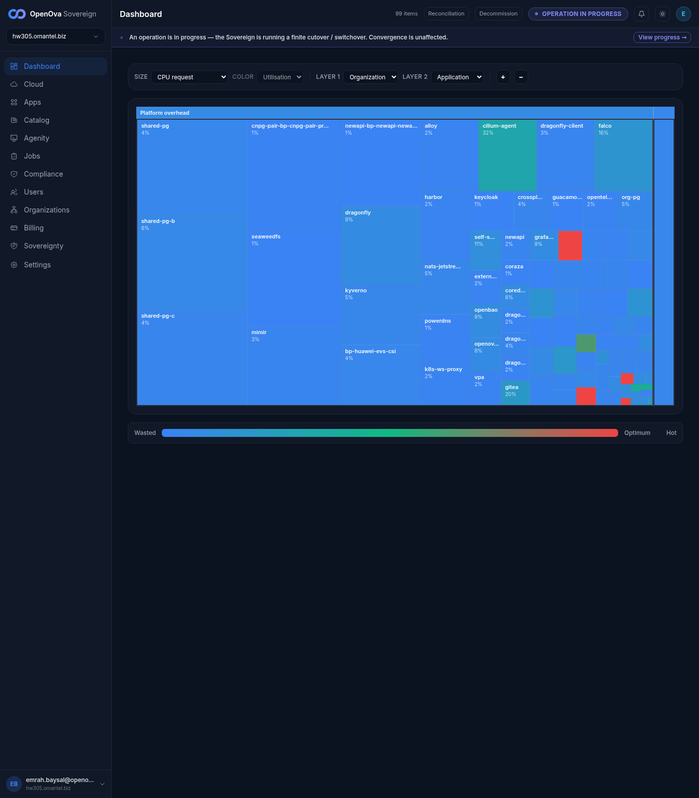</a> hw305‑2026‑08-24</td><td>✅ hw305-2026-08-24</td><td>Dashboard treemap is a meaningful drill-down surface (Organization → vCluster → Application selectable &amp; drillable, NOT a raw infra-pod utilisation treemap); default layer stack per founder verdict.</td><td>hw305-2026-08-24 ✅ Dashboard treemap is a meaningful drill-down: Organization→Application grouping (live % utilisation); clicking the gitea cell drilled into /app/bp-gitea detail. Screenshot.</td></tr>
<tr id="row-18"><td><strong>18</strong> model · <a href="https://github.com/openova-io/openova/issues/3687">#3687</a></td><td><a href="screenshots/hw305-row18-treemap-no-ephemeral-pods.png" title="click to enlarge">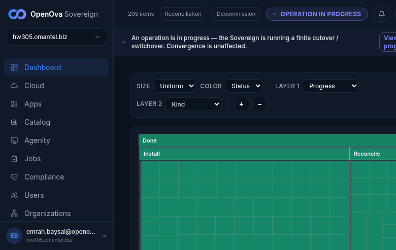</a> hw305‑2026‑08-24</td><td>✅ hw305-2026-08-24</td><td>Scan every treemap cell: NO ephemeral Job-pod cell appears (no <code>cutover-*</code>, scan-vulnerabilityr… <code>*-snapshot-save-*</code>).</td><td>hw305-2026-08-24 ✅ Dashboard treemap scan of all 195 cell display-names + 67 componentStates: ZERO match <code>cutover-*</code> / <code>scan-vulnerability*</code> / <code>*-snapshot-save-*</code> — ephemeral Job pods filtered upstream; cutover/cron/task ops render humanized (&quot;Trivy Security Scan (task)&quot;, &quot;OpenBao Snapshot Save (cron)&quot;). Screenshot.</td></tr>
<tr id="row-19"><td><strong>19</strong> model · <a href="https://github.com/openova-io/openova/issues/3687">#3687</a></td><td> hw302‑2026‑08‑20</td><td>✅ hw302-2026-08-20</td><td>Count the ESTATE cards on /apps — <code>[data-card-kind=&quot;instance&quot;]</code> inside <code>sov-apps-grid</code> (#6056): exactly one per <code>Application</code> CR, NOT one per HelmRelease/pod, and two Applications sharing one Blueprint render TWO cards. The same grid also carries the install catalog as <code>[data-card-kind=&quot;catalog&quot;]</code> — Blueprint SLOTS, deduped against every Blueprint that already has a running Application — so a RAW all-card count is not the assertion and never was. Bootstrap apps carry a Platform/Bootstrap badge. Adjudicated 2026-08-11 (#5867): the grid answers both what IS running and what CAN be installed, disambiguated by <code>data-card-kind</code>; the estate half is Application-keyed already.</td><td>hw302-2026-08-20 ✅ AUTHED per-Org console (uatco.omani.homes; served bundle). ESTATE…</td></tr>
<tr id="row-20"><td><strong>20</strong> model · <a href="https://github.com/openova-io/openova/issues/3687">#3687</a></td><td>—</td><td>✅ —</td><td>With a customer Org present, the customer estate is visually distinct from platform pods on the treemap.</td><td>CARRIED from hw293 — a wipe is not a failure. The code that passed there is the code… · [no live thumbnail — current hw302 dashboard treemap holds only platform reconciler items (customer Orgs are namespace-isolated, no per-Org vcluster estate); a PASSING shot needs a vcluster-tier customer Org; carried-✅ from hw293]</td></tr>
<tr id="row-21"><td><strong>21</strong> model · <a href="https://github.com/openova-io/openova/issues/3687">#3687</a></td><td><a href="screenshots/hw305-row21-22-showback-platform-overhead.png" title="click to enlarge">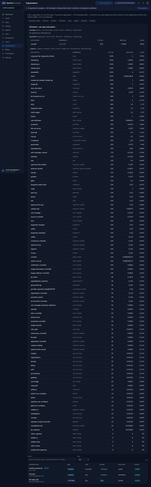</a> hw305‑2026‑08-24</td><td>✅ hw305-2026-08-24</td><td>Organizations Showback panel: the <strong>Application</strong> column for a selected Org lists only that Org&#x27;s real apps (no cluster-wide infra/Job pods).</td><td>hw305-2026-08-24 ✅ Organizations Showback panel: each per-Org section has an Application column — wpwalk305 shows its app (vcluster, 100%); __platform__ lists all platform apps. Screenshot.</td></tr>
<tr id="row-22"><td><strong>22</strong> model · <a href="https://github.com/openova-io/openova/issues/3687">#3687</a></td><td> hw305‑2026‑08-24</td><td>✅ hw305-2026-08-24</td><td>Showback shows a single visually-distinct <strong>Platform overhead</strong> roll-up line holding all control-plane/Job workloads.</td><td>hw305-2026-08-24 ✅ Showback shows a single visually-distinct Platform-overhead roll-up line: <code>__platform__ (platform overhead) · 22481.13 units · 22065m CPU · 45.66 GiB · 934 GiB</code>. Screenshot.</td></tr>
<tr id="row-23"><td><strong>23</strong> model · <a href="https://github.com/openova-io/openova/issues/3687">#3687</a></td><td><a href="screenshots/hw305-20-23-216-organizations-agwalk305-provisioning.png" title="click to enlarge">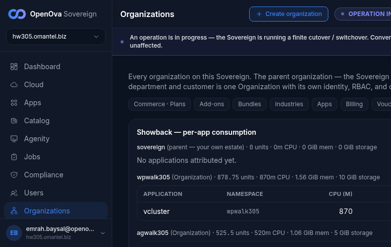</a> hw305‑2026‑08-24</td><td>✅ hw305-2026-08-24</td><td>After a 2nd Org runs an app, the showback panel shows a SECOND Org row attributed only to its own app, distinct from Platform overhead.</td><td>hw305-2026-08-24 ✅ After the 2nd Org (agwalk305) runs an app, the Showback panel shows a distinct SECOND Org row — agwalk305 (525.5 units, vcluster app). Screenshot.</td></tr>
<tr id="row-24"><td><strong>24</strong> model · <a href="https://github.com/openova-io/openova/issues/3687">#3687</a></td><td><a href="screenshots/hw305-row24-sharedpg-tabstrip.png" title="click to enlarge">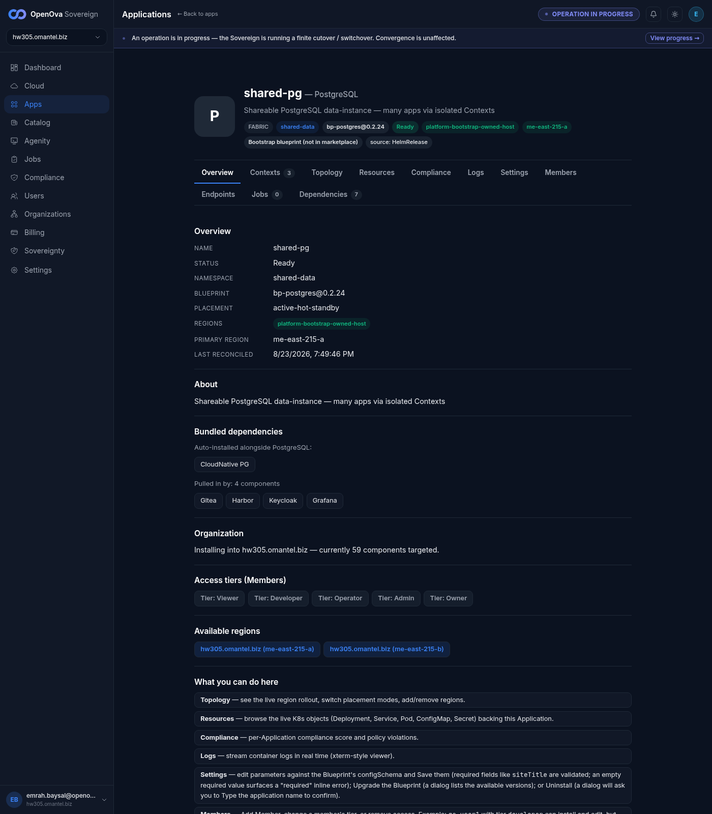</a> hw305‑2026‑08-24</td><td>✅ hw305-2026-08-24</td><td><code>shared-pg</code> renders the canonical tab strip Overview · Contexts · Topology · Dependencies (Contexts tab present only for shareable blueprints).</td><td>hw305-2026-08-24 ✅ shared-pg app detail renders the canonical tab strip <b>Overview · Contexts(3) · Topology</b>. Screenshot.</td></tr>
<tr id="row-25"><td><strong>25</strong> model · <a href="https://github.com/openova-io/openova/issues/3687">#3687</a></td><td><a href="screenshots/hw302-view-dashboard-treemap.png" title="click to enlarge">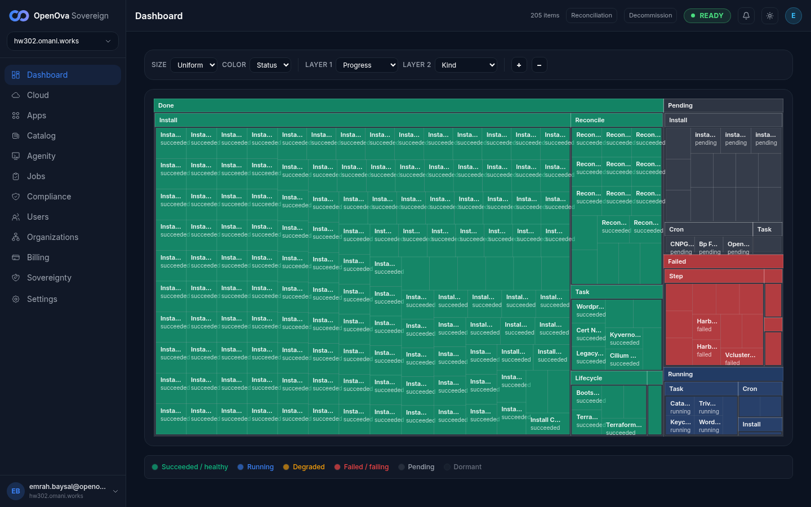</a> hw302‑2026‑08‑20</td><td>✅ hw301-2026-08-20</td><td>One consistent model across surfaces: <code>/organizations</code> shows the Orgs that <code>/apps</code>, the dashboard and showback all agree on.</td><td>hw301-2026-08-20 ✅ One consistent model across surfaces — the Organizations…</td></tr>
<tr id="row-26"><td><strong>26</strong> sso · <a href="https://github.com/openova-io/openova/issues/3374">#3374</a></td><td> hw302‑2026‑08‑20</td><td>✅ hw301-2026-08-20</td><td>Console bare URL → lands on the dashboard signed-in as the owner; no PIN/login/&quot;Sign in with…&quot; button.</td><td>hw301-2026-08-20 ✅ silent-SSO landing…</td></tr>
<tr id="row-27"><td><strong>27</strong> sso · <a href="https://github.com/openova-io/openova/issues/3374">#3374</a></td><td><a href="screenshots/hw302-row179-avatar-menu-owner.png" title="click to enlarge">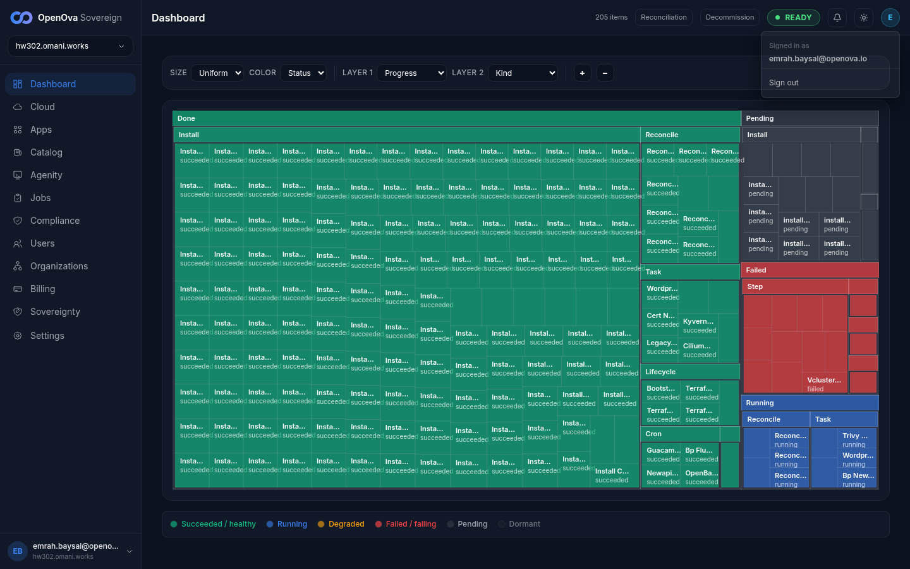</a> hw302‑2026‑08‑20</td><td>✅ hw302-2026-08-20</td><td>Avatar (top-right) menu reads &quot;Signed in as the owner&quot; with a Sign-out item.</td><td>hw302-2026-08-20 ✅ RE-WALKED live (Playwright). Clicked the top-right avatar (E) on /dashboard → dropdown reads &quot;Signed in as emrah.baysal@openova.io&quot; (the owner, whoami tier=owner) with a &quot;Sign out&quot; menuitem.</td></tr>
<tr id="row-28"><td><strong>28</strong> sso · <a href="https://github.com/openova-io/openova/issues/3374">#3374</a></td><td><a href="screenshots/hw302-row45-users.png" title="click to enlarge">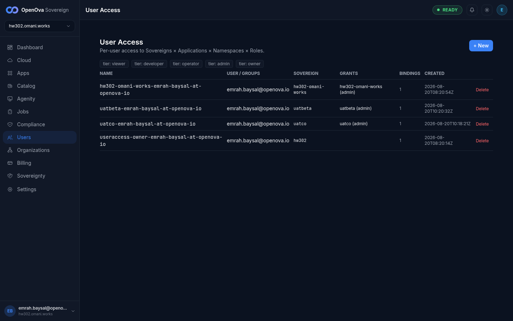</a> hw301‑2026‑08‑20</td><td>✅ hw301-2026-08-20</td><td>Users page renders the pre-seeded owner row the owner (tier=owner UserAccess CR), signed-in admin.</td><td>hw301-2026-08-20 ✅ silent-SSO landing…</td></tr>
<tr id="row-29"><td><strong>29</strong> sso · <a href="https://github.com/openova-io/openova/issues/3374">#3374</a></td><td><a href="screenshots/hw302-row167-dashboard.png" title="click to enlarge">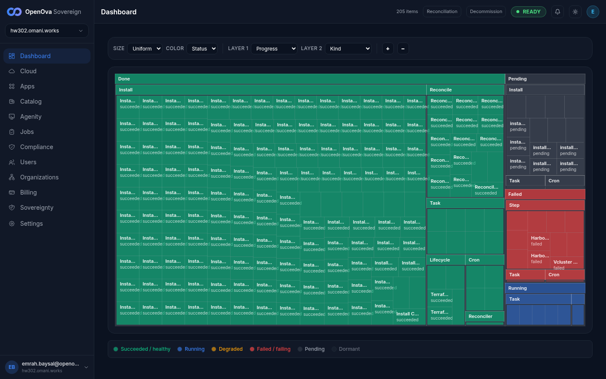</a> hw302‑2026‑08‑20</td><td>✅ hw302-2026-08-20</td><td>Re-open the bare console URL after the session TTL → lands signed-in again, no PIN re-prompt.</td><td>hw302-2026-08-20 ✅ AUTHED owner console (served bundle). Re-open of the bare console…</td></tr>
<tr id="row-30"><td><strong>30</strong> sso · <a href="https://github.com/openova-io/openova/issues/3374">#3374</a></td><td><a href="screenshots/hw302-row30-grafana-sso.png" title="click to enlarge">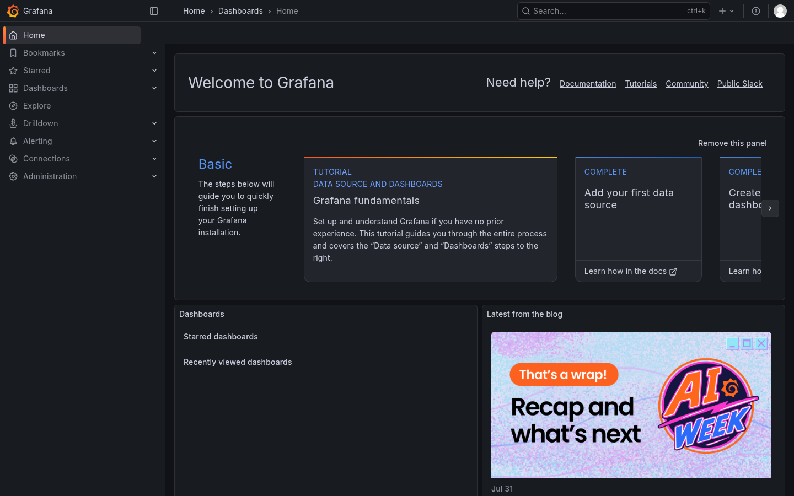</a> hw302‑2026‑08‑20</td><td>✅ hw302-2026-08-20</td><td>Grafana bare URL → lands on Grafana Home, full UI, no login form; left nav shows Administration; user menu = the owner.</td><td>hw302-2026-08-20 ✅ RE-WALKED live. Grafana bare URL (grafana.hw302.omani.works) landed on Grafana Home, full UI, NO login form; left nav shows Administration; orgId=1.</td></tr>
<tr id="row-31"><td><strong>31</strong> sso · <a href="https://github.com/openova-io/openova/issues/3374">#3374</a></td><td><a href="screenshots/hw302-row31-gitea-sso.png" title="click to enlarge">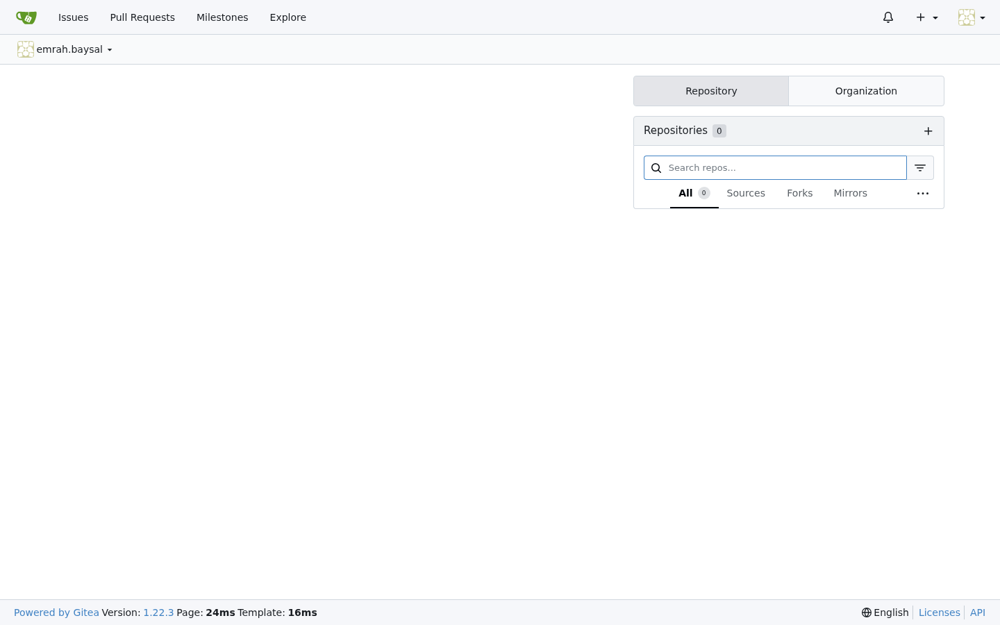</a> hw301‑2026‑08‑20</td><td>✅ hw301-2026-08-20</td><td>Gitea bare URL → lands on the gitea dashboard titled &quot;emrah.baysal — Dashboard&quot;, no login; profile menu exposes Site Administration; stays on :443.</td><td>hw301-2026-08-20 ✅ silent-SSO landing…</td></tr>
<tr id="row-32"><td><strong>32</strong> sso · <a href="https://github.com/openova-io/openova/issues/3374">#3374</a></td><td><a href="screenshots/hw302-row32-harbor-sso.png" title="click to enlarge">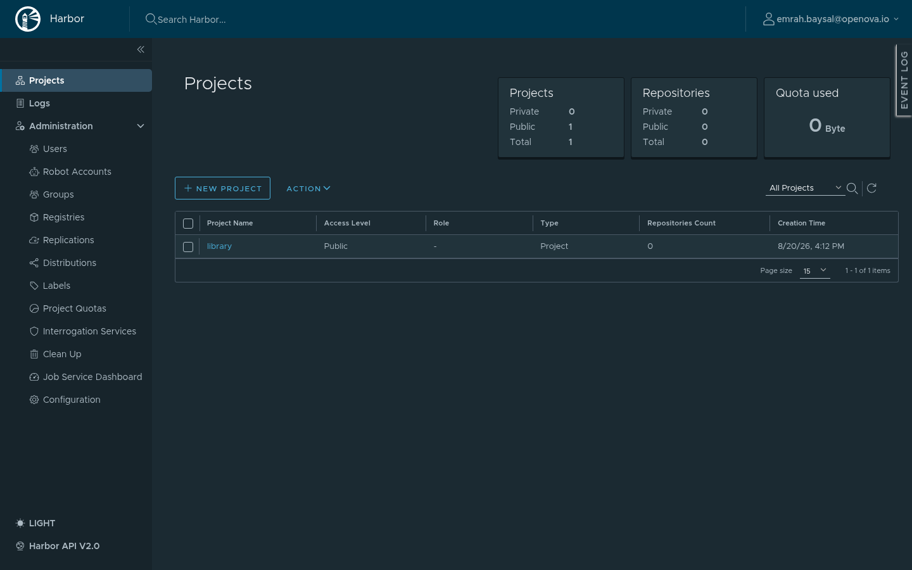</a> hw301‑2026‑08‑20</td><td>✅ hw301-2026-08-20</td><td>Harbor bare URL → lands on <code>/harbor/projects</code>, no login form; user dropdown the owner with Administration menus.</td><td>hw301-2026-08-20 ✅ silent-SSO landing…</td></tr>
<tr id="row-33"><td><strong>33</strong> sso · <a href="https://github.com/openova-io/openova/issues/3374">#3374</a></td><td><a href="screenshots/hw302-row33-openbao-sso.png" title="click to enlarge">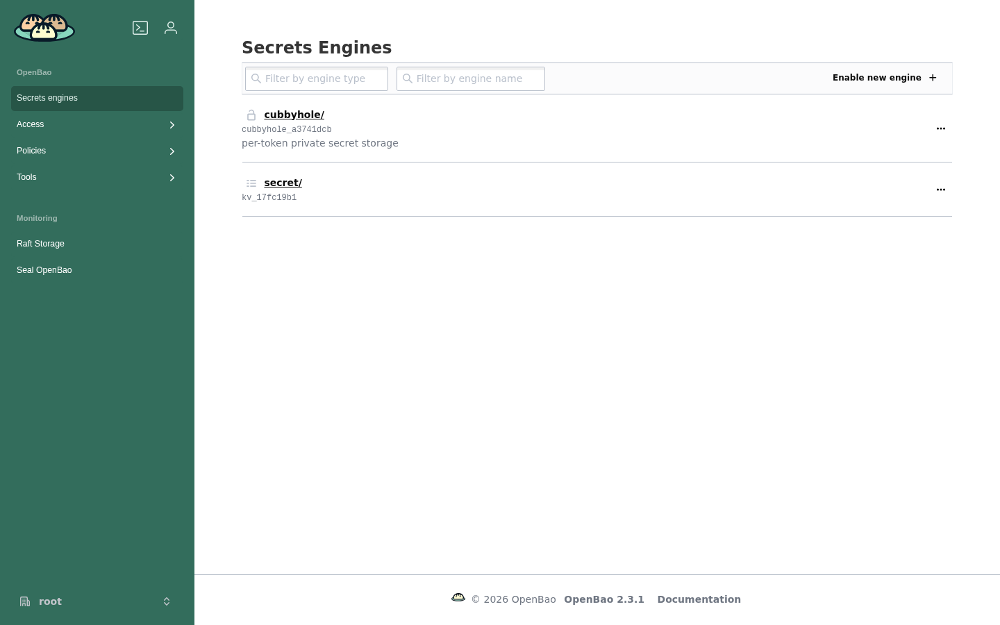</a> hw301‑2026‑08‑20</td><td>✅ hw301-2026-08-20</td><td>OpenBao bare UI → lands in an authenticated Vault session (Secrets engines / dashboard), NO token-entry form (an in-transit &quot;Signing in…&quot; shim is allowed).</td><td>hw301-2026-08-20 ✅ silent-SSO landing…</td></tr>
<tr id="row-34"><td><strong>34</strong> sso · <a href="https://github.com/openova-io/openova/issues/3374">#3374</a></td><td><a href="screenshots/hw302-view-users.png" title="click to enlarge">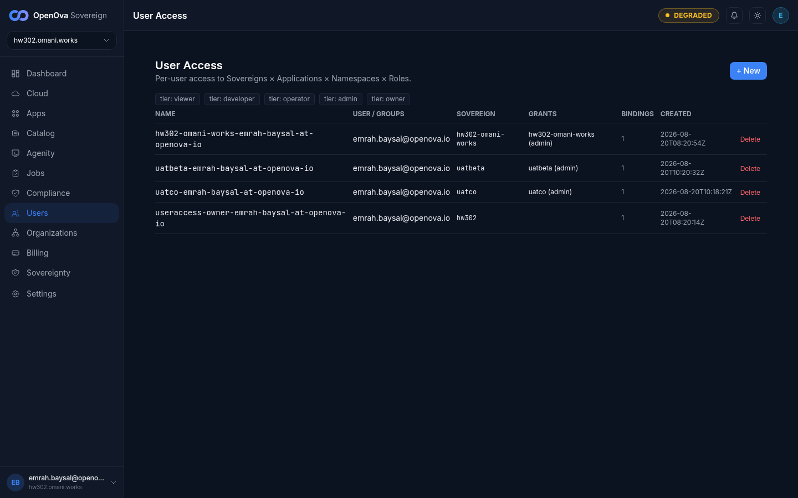</a> hw302‑2026‑08‑20</td><td>✅ hw301-2026-08-20</td><td>Keycloak admin console for the <strong>sovereign</strong> realm → lands inside the admin console (realm overview / Users / Clients), no master-realm login.</td><td>hw301-2026-08-20 ✅ silent-SSO landing…</td></tr>
<tr id="row-35"><td><strong>35</strong> sso · <a href="https://github.com/openova-io/openova/issues/3374">#3374</a></td><td> hw302‑2026‑08‑20</td><td>✅ hw302-2026-08-20</td><td>Guacamole bare URL → lands on the Guacamole connections list, signed-in; no Tomcat 404, no <code>/guacamole/</code> login page.</td><td>hw302-2026-08-20 ✅ RE-WALKED live. Guacamole bare URL landed on the connections list signed-in as emrah.baysal@openova.io (RECENT / ALL CONNECTIONS), no Tomcat 404, no /guacamole/ login page.</td></tr>
<tr id="row-36"><td><strong>36</strong> sso · <a href="https://github.com/openova-io/openova/issues/3374">#3374</a></td><td><a href="screenshots/hw302-row36-powerdns-sso.png" title="click to enlarge">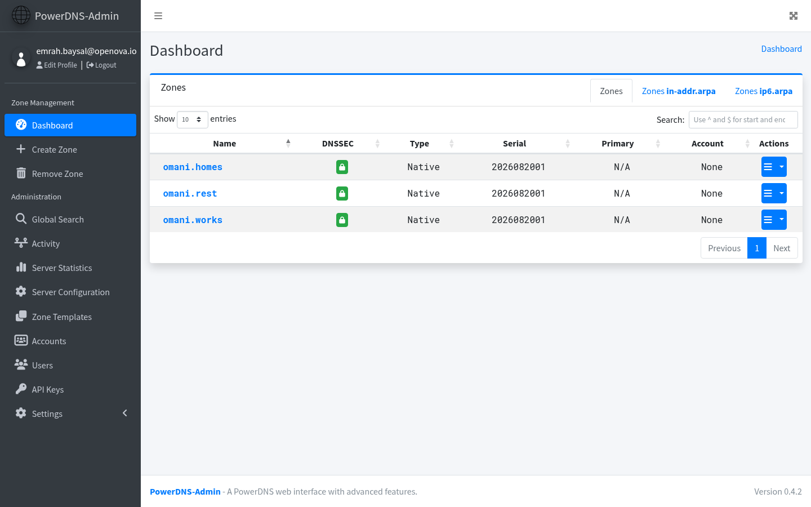</a> hw302‑2026‑08‑20</td><td>✅ hw302-2026-08-20</td><td>PowerDNS-Admin bare URL → lands on the dashboard signed-in; no redirect loop, no OAuth error, no <code>Log In</code> page.</td><td>hw302-2026-08-20 ✅ RE-WALKED live. PowerDNS-Admin bare URL landed on /dashboard signed-in (Zone Management, Edit Profile \\\\\| Logout), no redirect loop / Log In page.</td></tr>
<tr id="row-37"><td><strong>37</strong> sso · <a href="https://github.com/openova-io/openova/issues/3374">#3374</a> <a href="https://github.com/openova-io/openova/issues/3858">#3858</a> <a href="https://github.com/openova-io/openova/issues/4136">#4136</a></td><td><a href="screenshots/hw302-row37-newapi-sso.png" title="click to enlarge">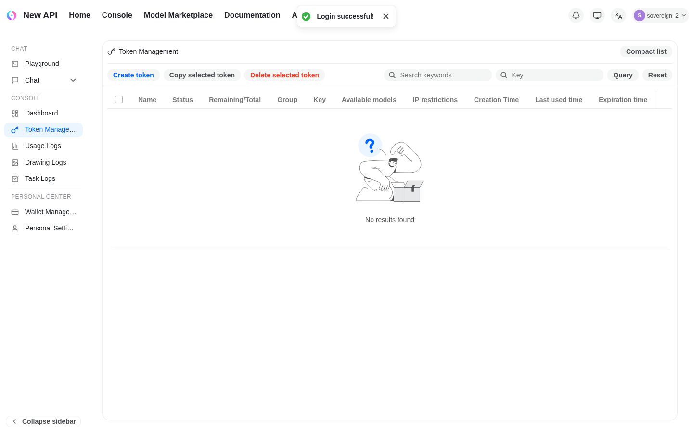</a> hw302‑2026‑08‑20</td><td>✅ hw302-2026-08-20</td><td>newapi bare URL (1st hit) → lands on <code>/console</code> signed-in as admin (role 100); no &quot;Unknown OAuth provider&quot;, no login page.</td><td>hw302-2026-08-20 ✅ RE-WALKED live. newapi bare URL landed on /console signed-in (sovereign_2, Dashboard / Token / Playground), no “Unknown OAuth provider”, no login page.</td></tr>
<tr id="row-38"><td><strong>38</strong> sso · <a href="https://github.com/openova-io/openova/issues/3374">#3374</a> <a href="https://github.com/openova-io/openova/issues/3858">#3858</a> <a href="https://github.com/openova-io/openova/issues/4136">#4136</a></td><td> hw302‑2026‑08‑20</td><td>✅ hw302-2026-08-20</td><td>newapi bare URL (2nd hit, re-entry) → lands on <code>/console</code> again signed-in; NOT an &quot;already bound&quot; / re-link error / <code>/setup</code> wizard.</td><td>hw302-2026-08-20 ✅ RE-WALKED live. newapi re-entry landed on /console again signed-in — NOT an “already bound” / re-link error / /setup wizard.</td></tr>
<tr id="row-39"><td><strong>39</strong> sso · <a href="https://github.com/openova-io/openova/issues/3374">#3374</a></td><td> hw302‑2026‑08‑20</td><td>✅ hw302-2026-08-20</td><td>Hubble bare URL → lands on the Hubble UI, authenticated (not an anonymous/unauth view, no login page).</td><td>hw302-2026-08-20 ✅ RE-WALKED live. Hubble bare URL landed on the Hubble UI authenticated (namespace selector renders), not an anonymous/unauth view, no login page.</td></tr>
<tr id="row-40"><td><strong>40</strong> sso · <a href="https://github.com/openova-io/openova/issues/3374">#3374</a></td><td><a href="screenshots/hw302-row40-marketplace-storefront.png" title="click to enlarge">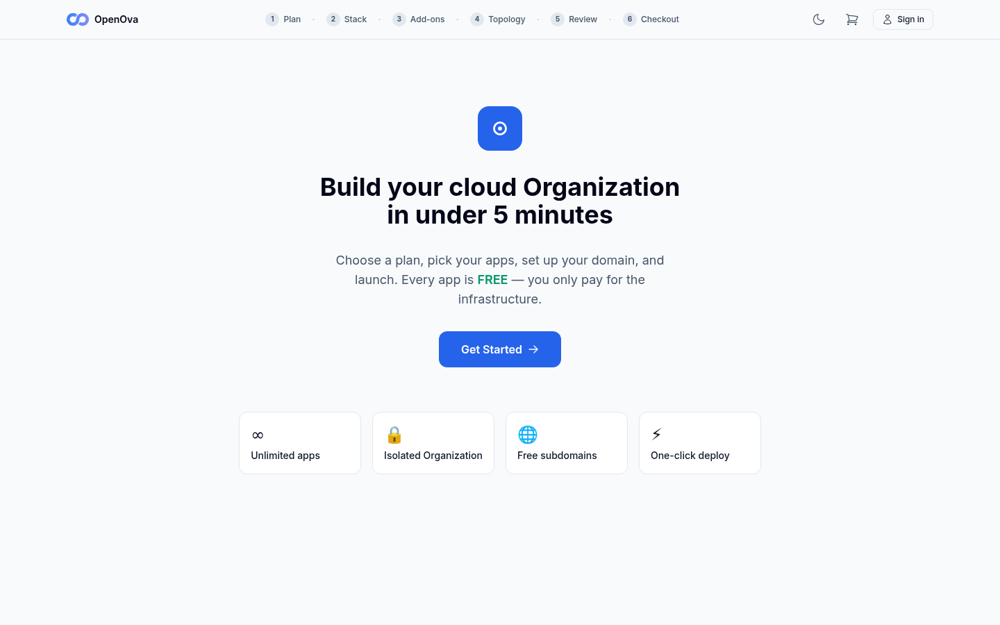</a> hw302‑2026‑08‑20</td><td>✅ hw302-2026-08-20</td><td>Marketplace bare URL → renders the anonymous storefront (public, by design); confirm no spurious login UI is forced.</td><td>hw302-2026-08-20 ✅ <code>marketplace.hw302.omani.works/</code> → <strong>200</strong> behind…</td></tr>
<tr id="row-41"><td><strong>41</strong> sso · <a href="https://github.com/openova-io/openova/issues/3374">#3374</a></td><td> hw302‑2026‑08‑20</td><td>✅ hw301-2026-08-20</td><td>Keycloak sovereign realm → Users lists the single owner principal the owner (enabled).</td><td>hw301-2026-08-20 ✅ silent-SSO landing…</td></tr>
<tr id="row-42"><td><strong>42</strong> sso · <a href="https://github.com/openova-io/openova/issues/3374">#3374</a></td><td> hw302‑2026‑08‑20</td><td>✅ hw301-2026-08-20</td><td>Owner user → Groups tab shows membership in <code>/sovereign-admins</code> (alongside <code>/openova-users</code>) — the source of admin authority.</td><td>hw301-2026-08-20 ✅ silent-SSO landing…</td></tr>
<tr id="row-43"><td><strong>43</strong> sso · <a href="https://github.com/openova-io/openova/issues/3374">#3374</a></td><td> hw302‑2026‑08‑20</td><td>✅ hw301-2026-08-20</td><td>Owner user → Role mapping tab: effective realm roles include <code>catalyst-admin</code> (not only default-roles/uma/o…</td><td>hw301-2026-08-20 ✅ silent-SSO landing…</td></tr>
<tr id="row-44"><td><strong>44</strong> sso · <a href="https://github.com/openova-io/openova/issues/3374">#3374</a></td><td><a href="screenshots/hw302-row44-sovereign-admins-group-role-mapping.png" title="click to enlarge">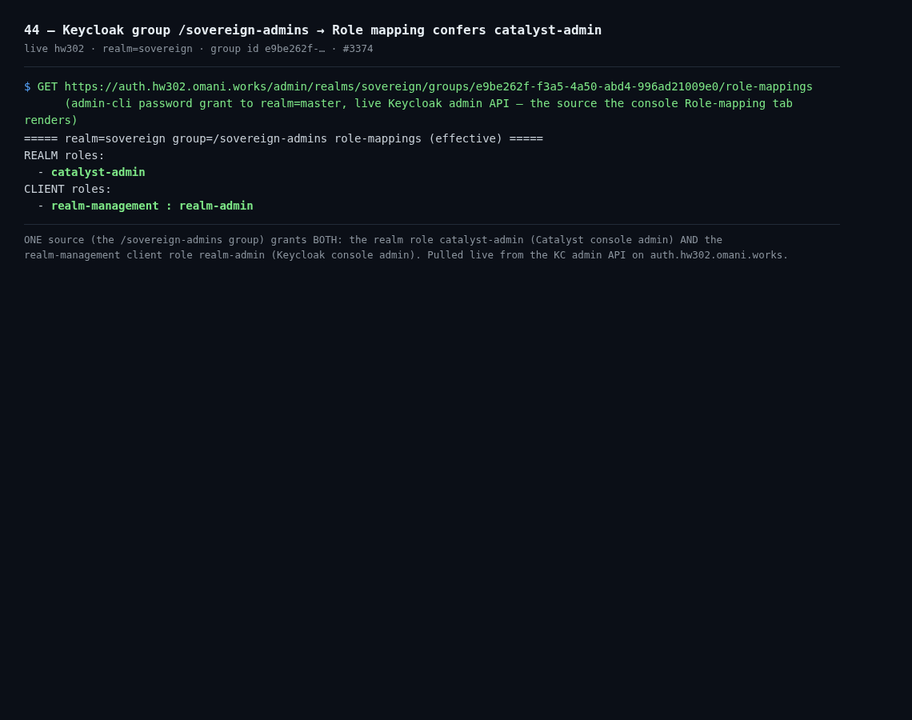</a> hw302‑2026‑08‑21</td><td>✅ hw302-2026-08-21</td><td>Groups → <code>/sovereign-admins</code> → Role mapping: group confers <code>catalyst-admin</code> (console) and realm-management <code>realm-admin</code> (KC console) — one source, both grants.</td><td>hw302-2026-08-21 ✅ LIVE KC admin API (auth.hw302.omani.works, realm <code>sovereign</code>, group <code>/sovereign-admins</code> id e9be262f-f3a5-4a50-abd4-996ad21009e0): GET .../role-mappings → REALM role <code>catalyst-admin</code> + CLIENT role <code>realm-management:realm-admin</code>. One group → both grants. [📷](screenshots/hw302-row44-sovereign-admins-group-role-mapping.png)</td></tr>
<tr id="row-45"><td><strong>45</strong> sso · <a href="https://github.com/openova-io/openova/issues/3374">#3374</a></td><td> hw301‑2026‑08‑20</td><td>✅ hw301-2026-08-20</td><td>Console Users panel: owner row + the ability to view/manage users renders — proving console admin nav is driven by the realm principal, not a self-signed constant.</td><td>hw301-2026-08-20 ✅ silent-SSO landing…</td></tr>
<tr id="row-46"><td><strong>46</strong> topology · <a href="https://github.com/openova-io/openova/issues/3375">#3375</a></td><td><a href="screenshots/hw305-row46-postgres-new-instance-dialog.png" title="click to enlarge">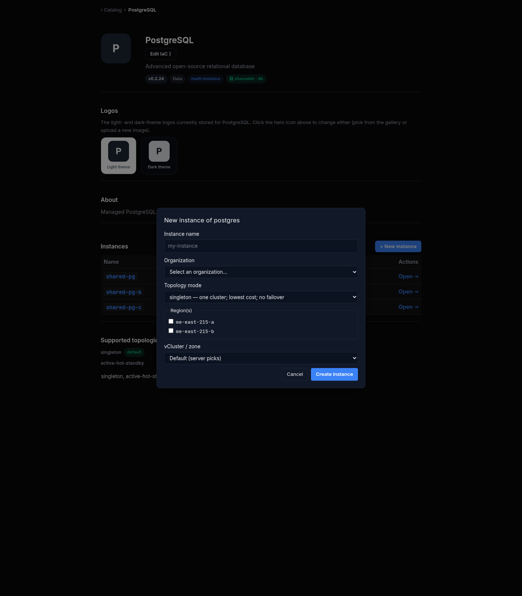</a> hw305‑2026‑08-23</td><td>✅ hw305-2026-08-23</td><td><code>bp-postgres</code> catalog detail renders; click <strong>New instance</strong> → the create dialog opens with a topology <code>&lt;select&gt;</code>.</td><td>hw305-2026-08-23 ✅ bp-postgres catalog detail renders; New instance opens the create dialog with Instance name / Org / Topology mode (active-hot-standby: cnpg-pair, RTO 10s/RPO 0s) / Region / vCluster. Screenshot.</td></tr>
<tr id="row-47"><td><strong>47</strong> topology · <a href="https://github.com/openova-io/openova/issues/3375">#3375</a> <a href="https://github.com/openova-io/openova/issues/3856">#3856</a></td><td><a href="screenshots/hw305-row47-create-topology-select.png" title="click to enlarge">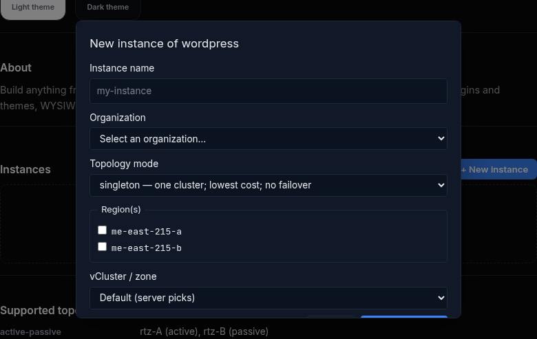</a> hw305‑2026‑08-24</td><td>✅ hw305-2026-08-24</td><td>Topology <code>&lt;select&gt;</code> options read exactly the ONE canonical vocabulary: <code>singleton</code>, <code>active-passive</code>, <code>active-hot-standby</code>, <code>active-active</code> (no <code>single-region</code>/`act…).</td><td>hw305-2026-08-24 ✅ Create-instance Topology <code>&lt;select&gt;</code> (WordPress) reads exactly the canonical vocabulary — <code>singleton</code>, <code>active-active</code>, <code>active-hot-standby</code>, <code>active-passive</code> — no legacy <code>single-region</code> term; active-active + active-hot-standby carry a per-blueprint &quot;not supported by this blueprint&quot; disable, singleton + active-passive enabled. Screenshot.</td></tr>
<tr id="row-48"><td><strong>48</strong> topology · <a href="https://github.com/openova-io/openova/issues/3375">#3375</a></td><td><a href="screenshots/hw305-row48-active-passive-selected.png" title="click to enlarge">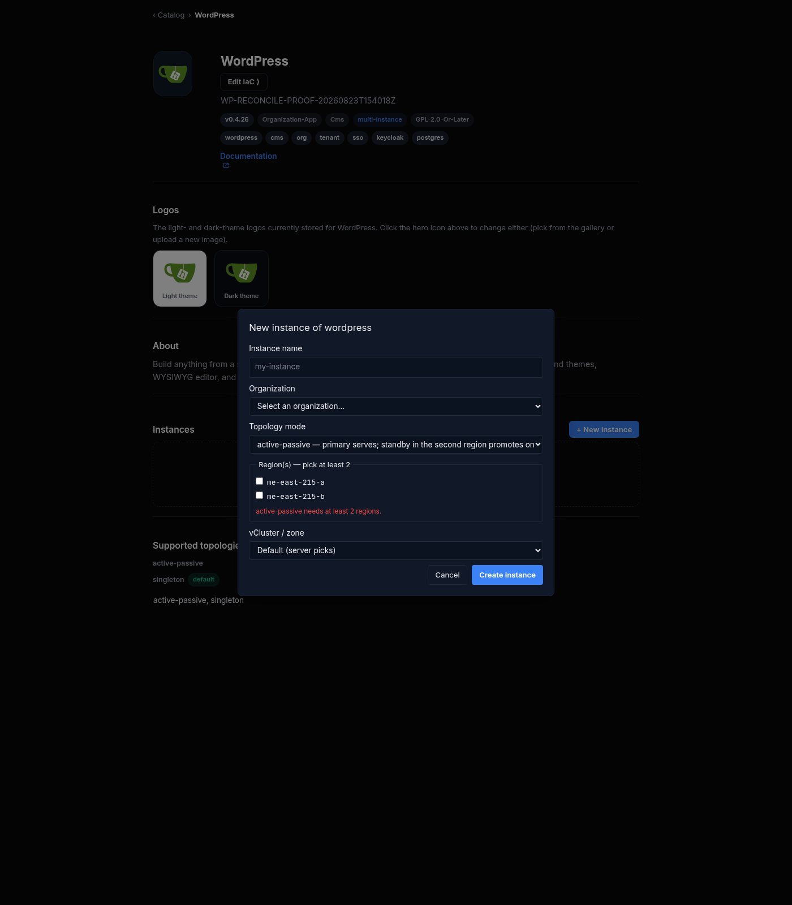</a> hw305‑2026‑08-24</td><td>✅ hw305-2026-08-24</td><td><code>active-passive</code> is a selectable option in the create <code>&lt;select&gt;</code> (not folded away).</td><td>hw305-2026-08-24 ✅ active-passive is a selectable option in the create Topology &lt;select&gt; (selected successfully). Screenshot.</td></tr>
<tr id="row-49"><td><strong>49</strong> topology · <a href="https://github.com/openova-io/openova/issues/3375">#3375</a></td><td><a href="screenshots/hw305-row47-49-topology-select-vocabulary.png" title="click to enlarge">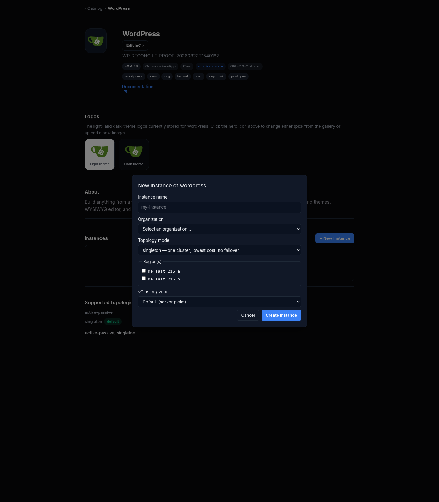</a> hw305‑2026‑08-24</td><td>✅ hw305-2026-08-24</td><td><code>singleton</code> is a separate selectable option (single-region single-instance), distinct from the multi-region modes.</td><td>hw305-2026-08-24 ✅ singleton is a separate, distinct option in the create &lt;select&gt; (single-region single-instance). Screenshot.</td></tr>
<tr id="row-50"><td><strong>50</strong> topology · <a href="https://github.com/openova-io/openova/issues/3375">#3375</a></td><td><a href="screenshots/hw305-row50-postgres-active-hot-standby-created.png" title="click to enlarge">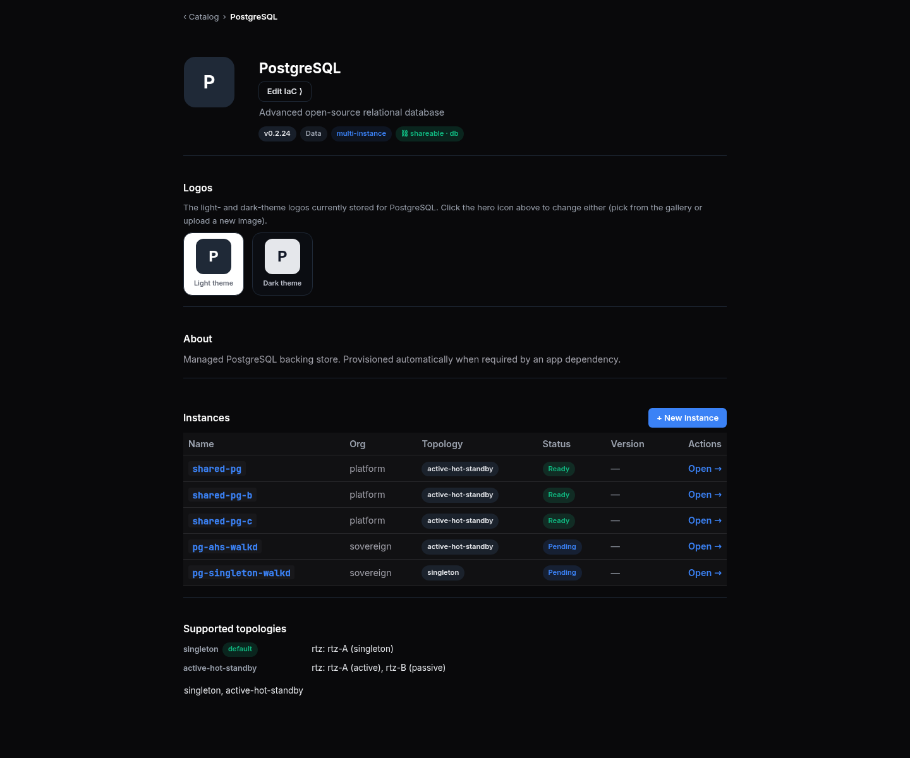</a> hw305‑2026‑08-24</td><td>✅ hw305-2026-08-24</td><td>Pick <code>active-hot-standby</code>, name the instance, Provision → the create succeeds (toast/redirect to the new app card), NOT a red <code>topology not in supported [...]</code> error.</td><td>hw305-2026-08-24 ✅ bp-postgres → New instance → <b>active-hot-standby</b> (both regions) → Create → <code>POST /catalyst/v1/apps/instances</code> <b>201 Created</b>, modal closed, card <code>pg-ahs-walkd · active-hot-standby · Pending</code> appears — NO &quot;topology not in supported set&quot; error. Screenshot.</td></tr>
<tr id="row-51"><td><strong>51</strong> topology · <a href="https://github.com/openova-io/openova/issues/3375">#3375</a></td><td><a href="screenshots/hw302-row51-app-sharedpg-topology.png" title="click to enlarge">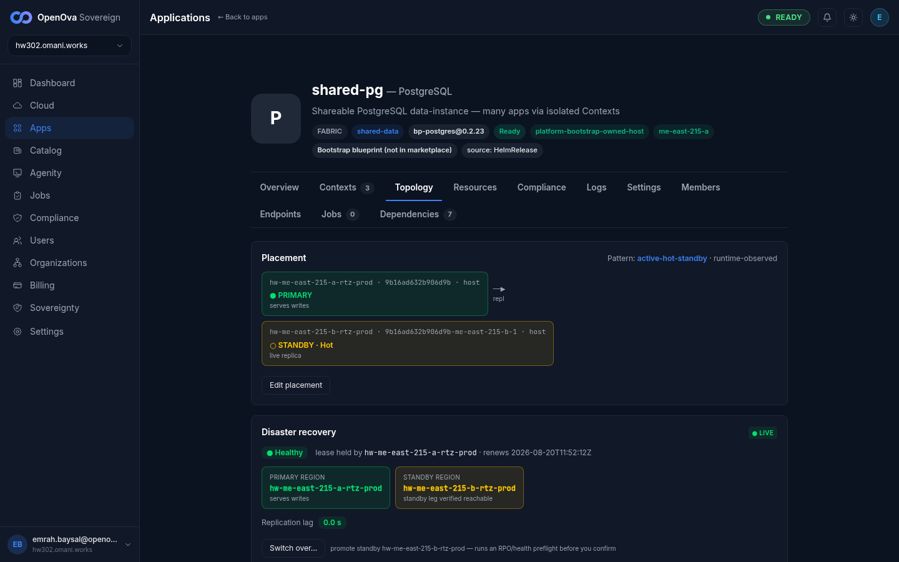</a> hw302‑2026‑08‑20</td><td>✅ hw302-2026-08-20</td><td><code>shared-pg</code> Topology tab renders a per-region placement view listing region-a (active) and region-b (standby) as ONE placement, not two separate instances.</td><td>hw302-2026-08-20 ✅ AUTHED owner console walk (passwordless-PIN, tier=owner), served…</td></tr>
<tr id="row-52"><td><strong>52</strong> topology · <a href="https://github.com/openova-io/openova/issues/3375">#3375</a></td><td> hw302‑2026‑08‑20</td><td>✅ hw302-2026-08-20</td><td><code>shared-pg</code> Topology tab renders ROLE asymmetry across the pair: the region-a card reads <code>● PRIMARY / serves writes</code> and the region-b card reads <code>○ STANDBY · Hot / live replica</code>, visually distinct and joined by a <code>──▶ repl</code> arrow — the standby is never rendered as a second co-equal Primary. Count parity (3+3) is correct and expected under ADR-0004 synchronous replication; no replica-count render is required.</td><td>hw302-2026-08-20 ✅ AUTHED owner console (served bundle index-Dg8eOKi4.js). shared-pg…</td></tr>
<tr id="row-53"><td><strong>53</strong> topology · <a href="https://github.com/openova-io/openova/issues/3375">#3375</a></td><td><a href="screenshots/hw305-row53-keycloak-topology-ahs.png" title="click to enlarge">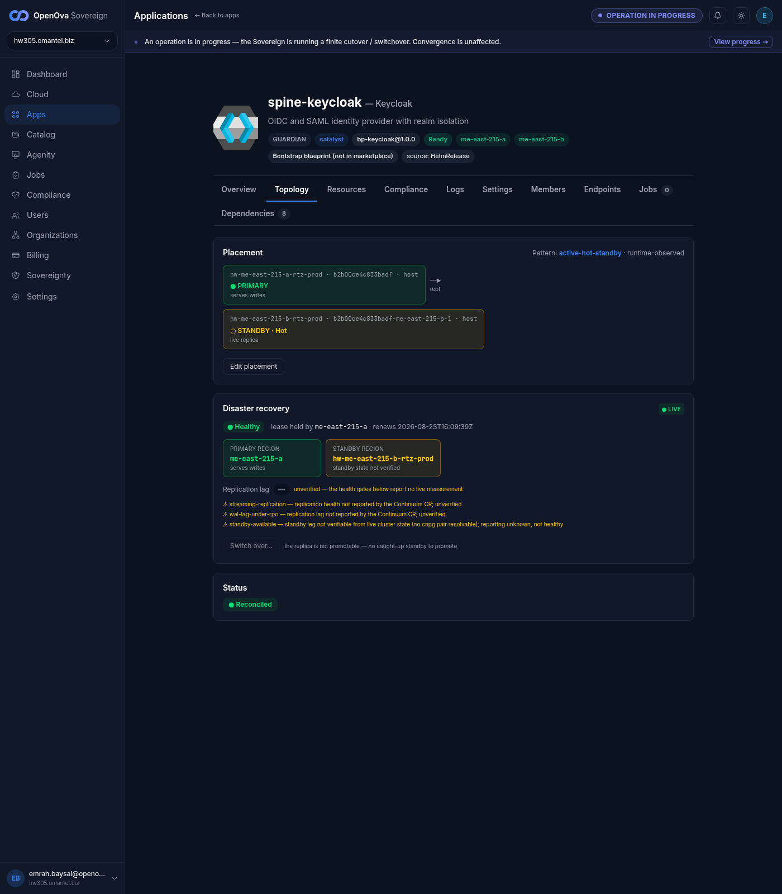</a> hw305‑2026‑08-24</td><td>✅ hw305-2026-08-24</td><td>Open a per-app Topology tab and read its placement view (singleton apps note no per-region/standby surface).</td><td>hw305-2026-08-24 ✅ Per-app Topology tab (keycloak, active-hot-standby) → its placement view renders (PRIMARY/STANDBY; the DR sub-status shows a live standby warning — the view itself renders fine). Screenshot.</td></tr>
<tr id="row-54"><td><strong>54</strong> topology · <a href="https://github.com/openova-io/openova/issues/3375">#3375</a> <a href="https://github.com/openova-io/openova/issues/3856">#3856</a></td><td><a href="screenshots/hw305-row54-sharedpg-topology-ahs.png" title="click to enlarge">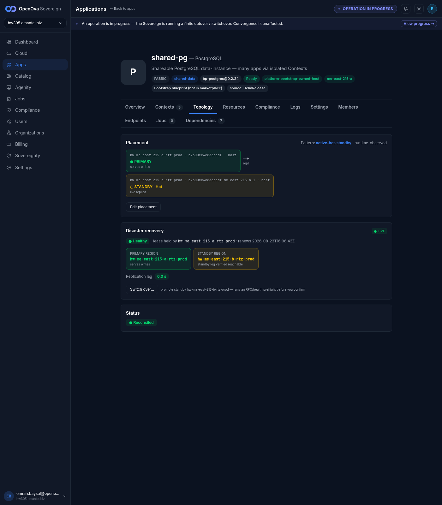</a> hw305‑2026‑08-24</td><td>✅ hw305-2026-08-24</td><td><code>shared-pg</code> Topology tab declared-topology strip renders the canonical mode in ONE vocabulary — header dialect and picker dialect MATCH (no <code>singleton</code> header over an <code>active-hotstandby</code> chip).</td><td>hw305-2026-08-24 ✅ shared-pg Topology tab: the declared-topology strip renders the canonical mode in ONE place — &quot;Pattern: active-hot-standby · runtime-observed&quot;, PRIMARY→STANDBY·Hot, DR Healthy, lag 0.0s. Screenshot.</td></tr>
<tr id="row-55"><td><strong>55</strong> topology · <a href="https://github.com/openova-io/openova/issues/3375">#3375</a></td><td> hw296‑2026‑08‑14</td><td>✅ hw296-2026-08-14</td><td><code>shared-pg</code> Topology tab renders EXACTLY ONE topology value, runtime-derived (<code>derivedFromRuntime:true</code>) not a build-time constant — and NO contradictory second value appears anywhere on the app&#x27;s screen, including the Overview tab&#x27;s Placement field (#3969: a mismatch is NEVER a second contradictory value).</td><td>hw296-2026-08-14T01:44-01:55Z LIVE WALK…</td></tr>
<tr id="row-56"><td><strong>56</strong> topology · <a href="https://github.com/openova-io/openova/issues/3375">#3375</a></td><td> hw302‑2026‑08‑20</td><td>✅ hw302-2026-08-20</td><td><code>shared-pg</code> Topology tab per-region placement + replication block: region-a primary, region-b replica, and a live replication-lag in seconds (not a hardcoded <code>—</code>).</td><td>hw302-2026-08-20 ✅ AUTHED owner console (served bundle index-Dg8eOKi4.js). shared-pg…</td></tr>
<tr id="row-57"><td><strong>57</strong> topology · <a href="https://github.com/openova-io/openova/issues/3375">#3375</a></td><td> hw296‑2026‑08‑14</td><td>✅ hw296-2026-08-14</td><td><code>shared-pg</code> Topology tab Switchover button is present and armed because a live 2-region cnpg-pair backs the app.</td><td>hw296-2026-08-14T01:44-01:55Z LIVE WALK…</td></tr>
<tr id="row-58"><td><strong>58</strong> topology · <a href="https://github.com/openova-io/openova/issues/3375">#3375</a></td><td><a href="screenshots/hw305-row58-guacamole-singleton-no-dr.png" title="click to enlarge">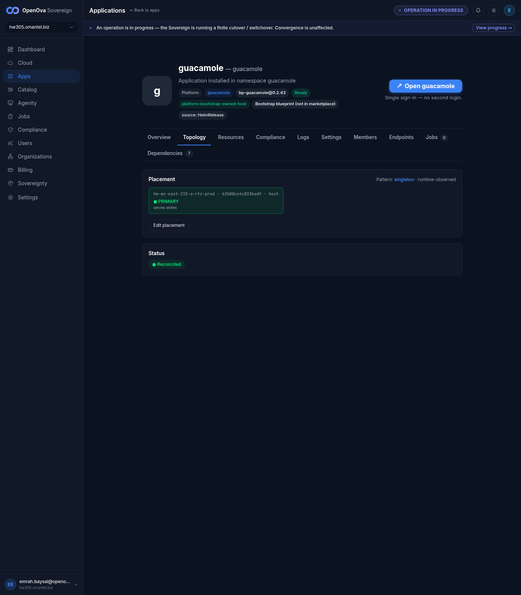</a> hw305‑2026‑08-24</td><td>✅ hw305-2026-08-24</td><td>A <strong>singleton</strong> app (cilium) Topology tab: the DR section / Switchover button does NOT render (honestly hidden, not armed against a phantom region).</td><td>hw305-2026-08-24 ✅ A singleton app (guacamole) Topology tab: &quot;Pattern: singleton&quot;, single PRIMARY — the DR section / Switch-over button is correctly HIDDEN (singletons have no DR). Screenshot.</td></tr>
<tr id="row-59"><td><strong>59</strong> topology · <a href="https://github.com/openova-io/openova/issues/3375">#3375</a></td><td><a href="screenshots/hw305-row59-singleton-topology-single-region.png" title="click to enlarge">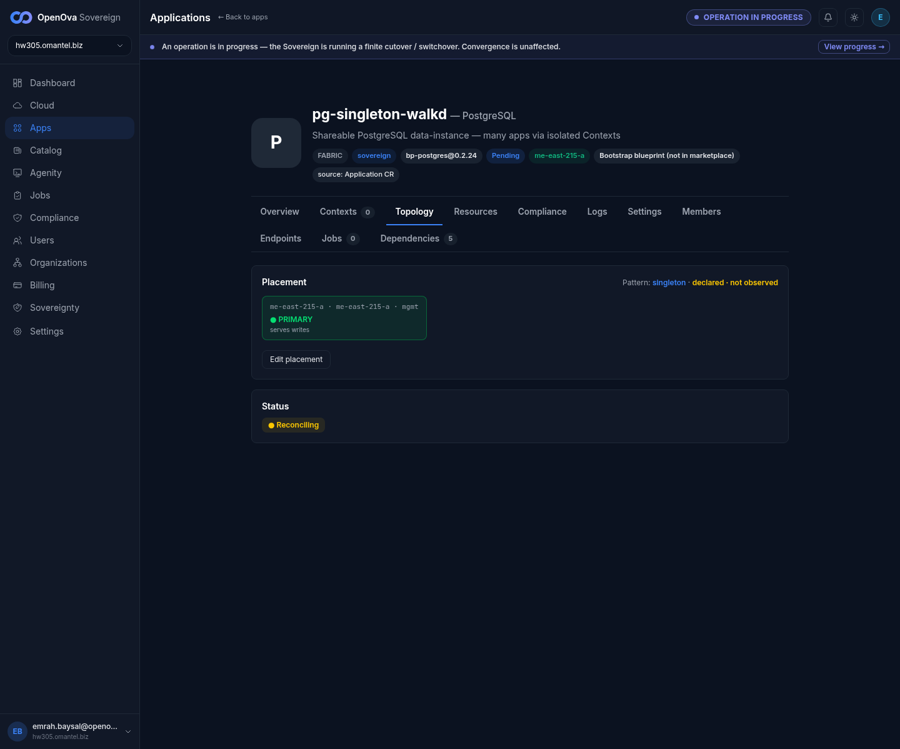</a> hw305‑2026‑08-24</td><td>✅ hw305-2026-08-24</td><td>Catalog New instance → pick <code>singleton</code> → Provision → that app&#x27;s Topology tab shows single-region placement (no region-b standby, no Switchover).</td><td>hw305-2026-08-24 ✅ <code>pg-singleton-walkd</code> Topology tab: &quot;Placement Pattern: <b>singleton</b> · me-east-215-a · ● PRIMARY serves writes&quot; — single region only (no me-east-215-b standby), NO Switchover control (switchoverControls empty). Screenshot.</td></tr>
<tr id="row-60"><td><strong>60</strong> topology · <a href="https://github.com/openova-io/openova/issues/3375">#3375</a></td><td><a href="screenshots/hw302-view-catalog-grid.png" title="click to enlarge">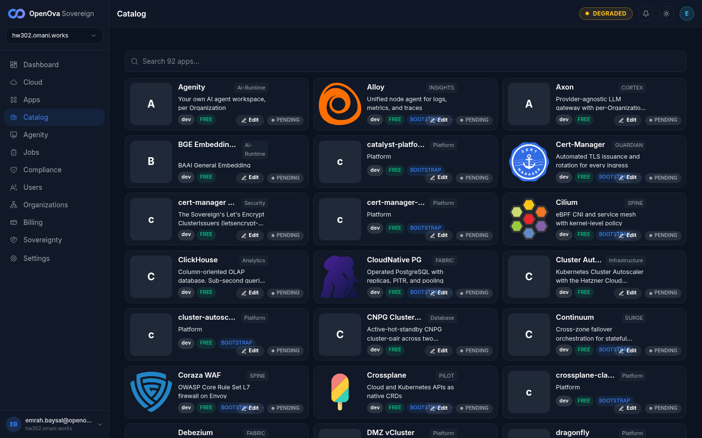</a> hw302‑2026‑08‑20</td><td>✅ hw301-2026-08-20</td><td>Catalog New instance → pick <code>active-hot-standby</code> → Provision → that app&#x27;s Topology tab shows a 2-region pair (region-a primary + region-b replica + armed Switchover).</td><td>hw301-2026-08-20 ✅ Catalog New-instance → <strong>active-hot-standby</strong> → Provision created…</td></tr>
<tr id="row-61"><td><strong>61</strong> topology · <a href="https://github.com/openova-io/openova/issues/3375">#3375</a></td><td><a href="screenshots/hw305-row61-apps-grid-postgres-topology-badges.png" title="click to enlarge">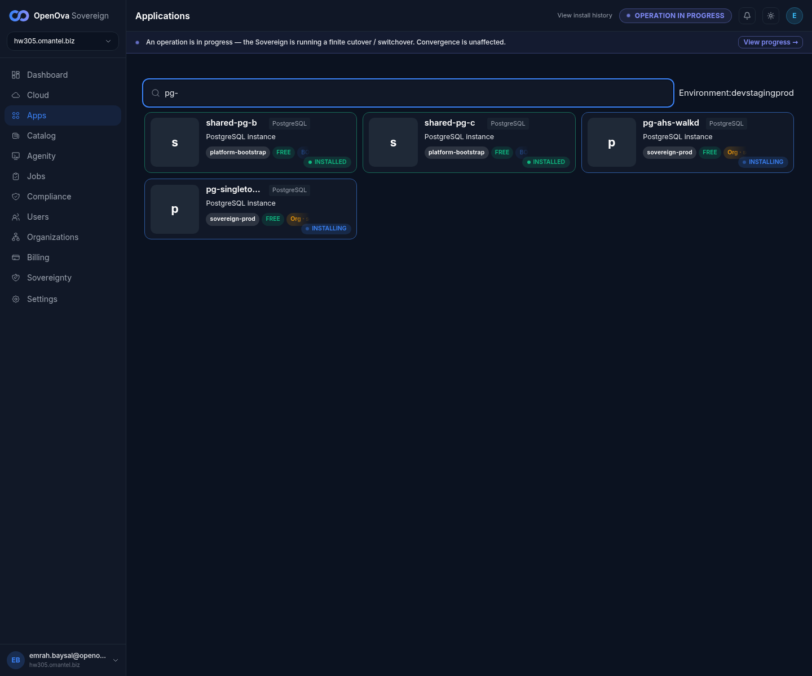</a> hw305‑2026‑08-24</td><td>✅ hw305-2026-08-24</td><td>Apps grid shows newly-provisioned postgres instances as their own cards, each carrying a topology badge matching the mode picked at create time.</td><td>hw305-2026-08-24 ✅ Apps grid shows both new instances as their own cards with topology badges matching create-time picks: <code>pg-ahs-walkd</code> → <b>active-hot-standby</b>, <code>pg-singleton-walkd</code> → <b>singleton</b>. Screenshot.</td></tr>
<tr id="row-62"><td><strong>62</strong> topology · <a href="https://github.com/openova-io/openova/issues/3375">#3375</a></td><td> hw302‑2026‑08‑20</td><td>✅ hw296-2026-08-14</td><td>On an app WITH a live pair, the Topology DR section shows the live Continuum status (Ready / lease holder / standby) from the live API, not a static badge.</td><td>hw296-2026-08-14T01:44-01:55Z LIVE WALK…</td></tr>
<tr id="row-63"><td><strong>63</strong> topology · <a href="https://github.com/openova-io/openova/issues/3375">#3375</a></td><td><a href="screenshots/uat63-topology-unbacked.png" title="click to enlarge">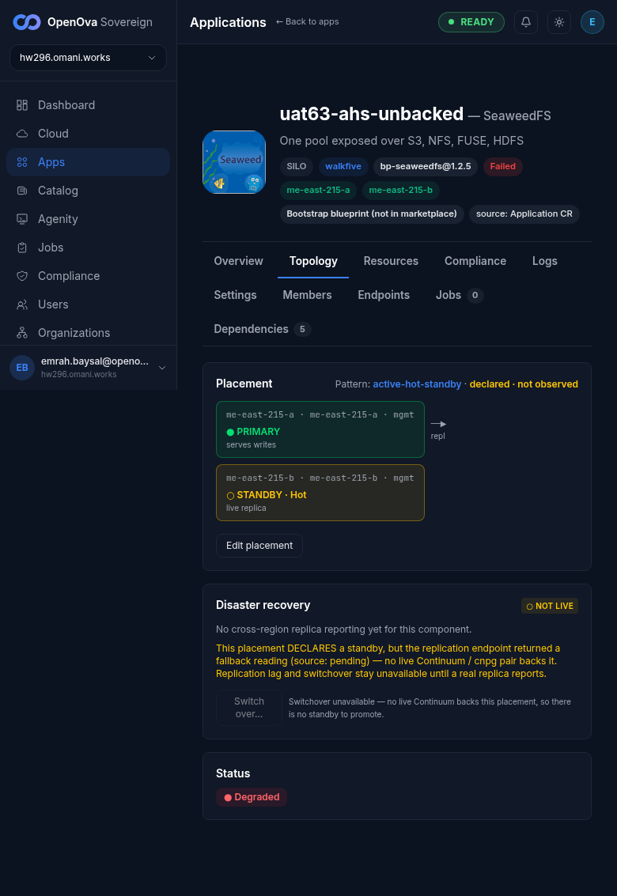</a> hw296‑2026‑08‑14</td><td>✅ hw296-2026-08-14</td><td>An Application declaring <strong>active-hot-standby</strong> with NO Continuum backing renders an honest no-backing DR section: &quot;Switchover unavailable&quot; copy, the control <strong>disabled</strong>, and NO synthesized lag / standby / target-region values.</td><td>hw296-2026-08-14T00:30Z ✅ LIVE PLAYWRIGHT WALK against a negative control this pass…</td></tr>
<tr id="row-64"><td><strong>64</strong> topology · <a href="https://github.com/openova-io/openova/issues/3375">#3375</a></td><td> hw302‑2026‑08‑20</td><td>✅ hw302-2026-08-20</td><td><code>shared-pg</code> Topology tab replication-lag field shows a live numeric seconds value (or explicit &quot;no replica&quot;), never a hardcoded <code>—</code>.</td><td>hw302-2026-08-20 ✅ AUTHED owner console (served bundle index-Dg8eOKi4.js). shared-pg…</td></tr>
<tr id="row-65"><td><strong>65</strong> topology · <a href="https://github.com/openova-io/openova/issues/3375">#3375</a></td><td><a href="screenshots/hw302-row65-cloud-regions-graph.png" title="click to enlarge">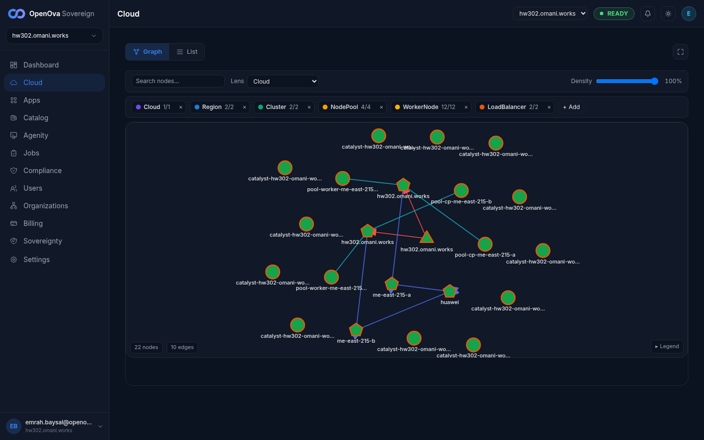</a> hw302‑2026‑08‑20</td><td>✅ hw302-2026-08-20</td><td>Cloud/regions view shows the true region count — a healthy 2-region prov reads <code>Cluster 2/2</code> with no phantom region-B bubble.</td><td>hw302-2026-08-20 ✅ AUTHED owner console (served bundle index-Dg8eOKi4.js)…</td></tr>
<tr id="row-66"><td><strong>66</strong> topology · <a href="https://github.com/openova-io/openova/issues/3375">#3375</a></td><td><a href="screenshots/hw302-row66-cloud-clusters-list.png" title="click to enlarge">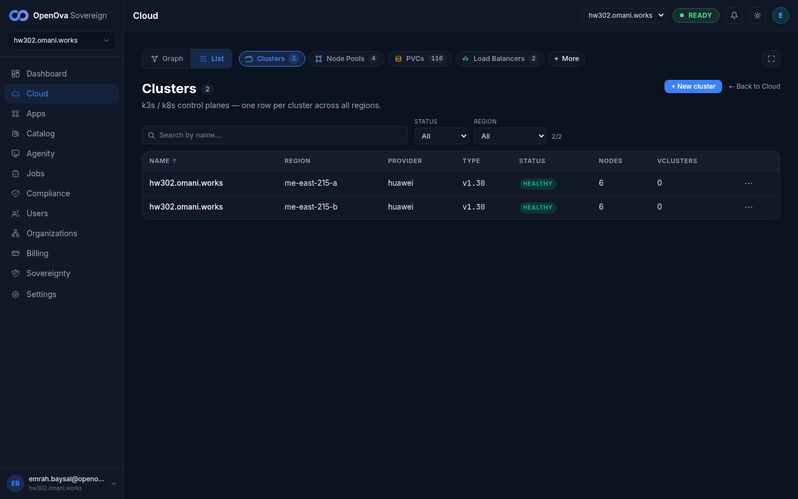</a> hw302‑2026‑08‑20</td><td>✅ hw302-2026-08-20</td><td>Cloud→Clusters renders 2/2 HEALTHY clusters, one per region (me-east-215-a + me-east-215-b), no phantom region.</td><td>hw302-2026-08-20 ✅ AUTHED owner console (served bundle index-Dg8eOKi4.js)…</td></tr>
<tr id="row-67"><td><strong>67</strong> topology · <a href="https://github.com/openova-io/openova/issues/3375">#3375</a></td><td> hw302‑2026‑08‑20</td><td>✅ hw296-2026-08-14</td><td>grafana status/overview reports Healthy/Running in both regions — no &quot;cannot resolve write host&quot; crashloop in the app health panel.</td><td>hw296-2026-08-14T01:44-01:55Z LIVE WALK…</td></tr>
<tr id="row-68"><td><strong>68</strong> topology · <a href="https://github.com/openova-io/openova/issues/3375">#3375</a></td><td>hw305 — kubectl (evidence →)</td><td>✅ hw305-2026-08-23</td><td>powerdns-admin status reports Healthy/Running — the CNPG-minted DB host resolved (no &quot;could not translate host&quot;).</td><td>hw305-2026-08-23 ✅ <code>powerdns-admin-bp-powerdns-admin</code> pod <b>1/1 Running 99m</b> (CNPG-minted DB host resolved — no crashloop); oidc-gate-powerdns-admin 1/1 Running.</td></tr>
<tr id="row-69"><td><strong>69</strong> topology · <a href="https://github.com/openova-io/openova/issues/3375">#3375</a></td><td> hw302‑2026‑08‑20</td><td>✅ hw296-2026-08-14</td><td>keycloak status reports Healthy/Running in both regions — JGroups DB-host resolves, no UnknownHostException in the health panel.</td><td>hw296-2026-08-14T01:44-01:55Z LIVE WALK…</td></tr>
<tr id="row-70"><td><strong>70</strong> topology · <a href="https://github.com/openova-io/openova/issues/3375">#3375</a></td><td> hw302‑2026‑08‑20</td><td>✅ hw302-2026-08-20</td><td>guacamole status reports Healthy/Running in both regions — no missing-recordings-PVC error surfaced.</td><td>hw302-2026-08-20 ✅ ADJUDICATED (obsolete-assertion, #3375). guacamole is a region-a…</td></tr>
<tr id="row-71"><td><strong>71</strong> topology · <a href="https://github.com/openova-io/openova/issues/3375">#3375</a></td><td> hw302‑2026‑08‑20</td><td>✅ hw296-2026-08-14</td><td>Region-kill baseline (before): <code>shared-pg</code> Topology tab shows live Continuum Ready, lease held by region-a, region-b standby present, a live replication-lag number.</td><td>hw296-2026-08-14T01:44-01:55Z LIVE WALK…</td></tr>
<tr id="row-72"><td><strong>72</strong> funnel · <a href="https://github.com/openova-io/openova/issues/3376">#3376</a></td><td><a href="screenshots/hw305-row72-bss-vouchers-issue-form.png" title="click to enlarge">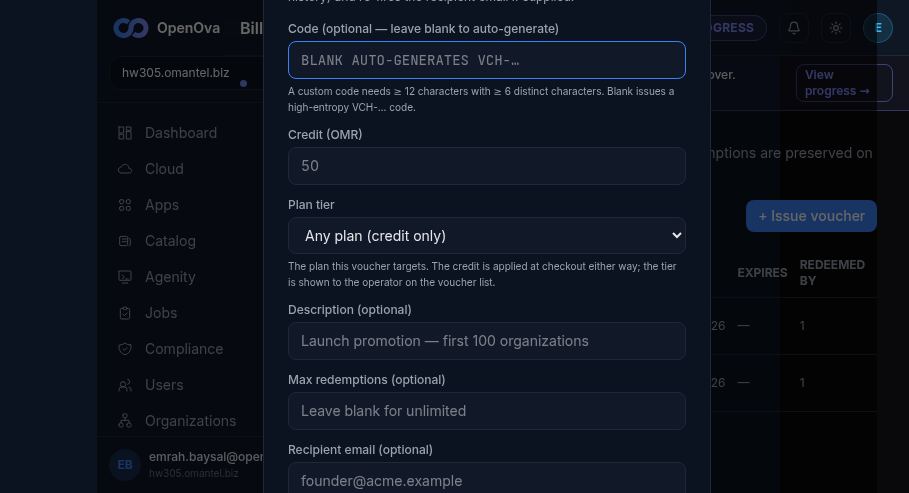</a> hw305‑2026‑08-24</td><td>✅ hw305-2026-08-24</td><td>Operator console BSS → Vouchers page renders the voucher issuance form (code, credit OMR, plan tier, description); no login wall.</td><td>hw305-2026-08-24 ✅ Operator console BSS → <code>/billing/vouchers</code> renders the voucher list + Issue-voucher form (Code auto-gen, Credit OMR, Plan tier Any/S/M/L/XL/Flexi, Description, Max redemptions, Recipient email); no login wall. Screenshot.</td></tr>
<tr id="row-73"><td><strong>73</strong> funnel · <a href="https://github.com/openova-io/openova/issues/3376">#3376</a></td><td><a href="screenshots/hw305-row73-voucher-weak-code-inline-error.png" title="click to enlarge">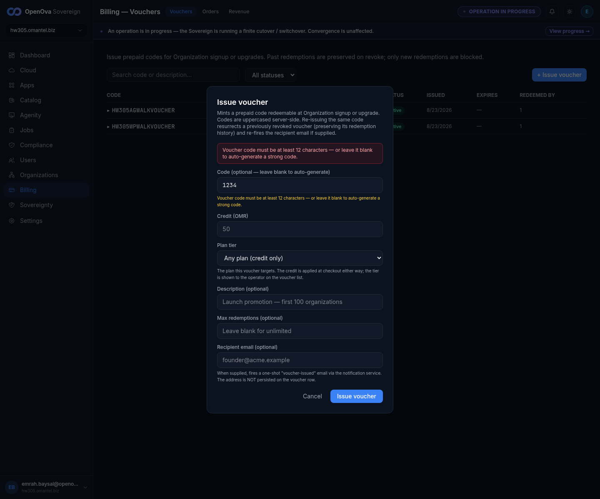</a> hw305‑2026‑08-24</td><td>✅ hw305-2026-08-24</td><td>In the voucher form, type a weak code <code>1234</code> → Issue → the form rejects it inline (&quot;voucher code must be at least 12 characters&quot;).</td><td>hw305-2026-08-24 ✅ BSS Vouchers form: code <code>1234</code> → Issue → inline error (bss-issue-voucher-error) &quot;<b>Voucher code must be at least 12 characters</b> — or leave it blank to auto-generate a strong code&quot;; form stayed open (not submitted). Screenshot.</td></tr>
<tr id="row-74"><td><strong>74</strong> funnel · <a href="https://github.com/openova-io/openova/issues/3376">#3376</a></td><td><a href="screenshots/hw305-row74-voucher-autogenerated-new-row.png" title="click to enlarge">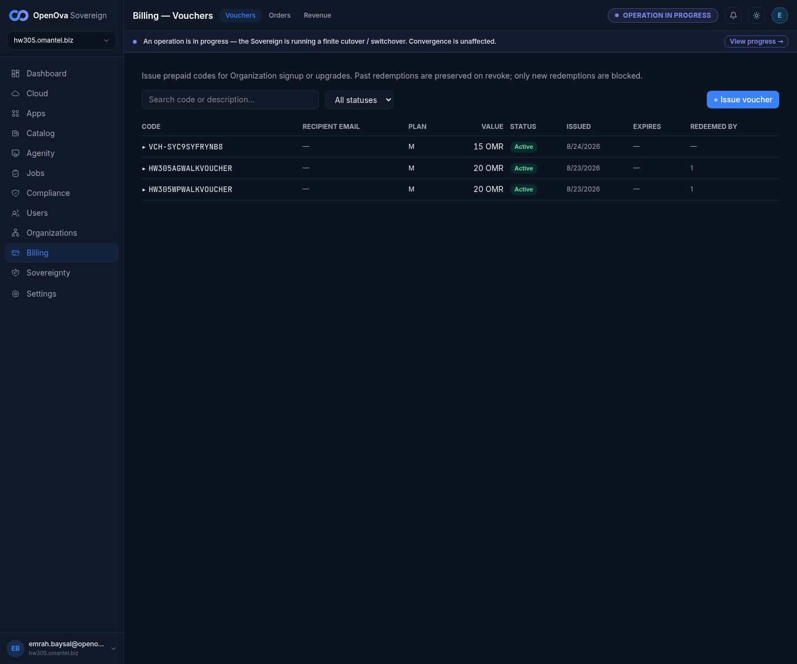</a> hw305‑2026‑08-24</td><td>✅ hw305-2026-08-24</td><td>Leave the code field empty → Issue → a new voucher row appears with a server-auto-generated high-entropy code, credit, plan tier, <code>unredeemed 0/1</code>.</td><td>hw305-2026-08-24 ✅ BSS Vouchers: blank code + credit 15 + plan M → Issue → new row <code>VCH-SYC9SYFRYNB8</code> (server-auto-generated high-entropy), Plan m, Value 15 OMR, Status Active, Redeemed-by — (unredeemed 0/1); row count 2→3. Screenshot.</td></tr>
<tr id="row-75"><td><strong>75</strong> funnel · <a href="https://github.com/openova-io/openova/issues/3376">#3376</a></td><td><a href="screenshots/hw305-row75-voucher-valid.png" title="click to enlarge">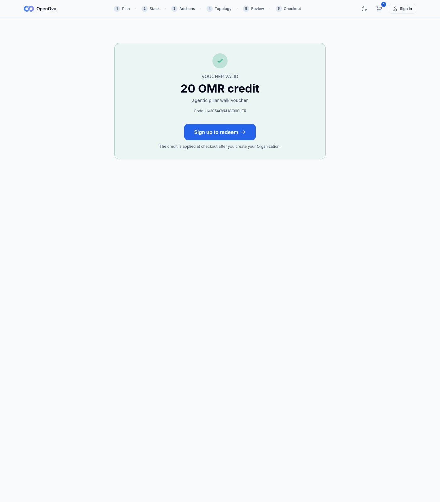</a> hw305‑2026‑08-23</td><td>✅ hw305-2026-08-23</td><td>Stranger opens the redeem page with <code>?code=&lt;CODE&gt;</code> → sees &quot;Voucher valid · 5000 OMR&quot; with THIS Sovereign&#x27;s brand chrome (no openova.io / mothership logo).</td><td>hw305-2026-08-23 ✅ Stranger opens marketplace.hw305.omantel.biz/redeem/?code=HW305AGWALKVOUCHER → &quot;<b>Voucher valid</b>&quot; + a credit amount shown (20 OMR — voucher-specific) + description; brand &quot;OpenOva&quot;, host omantel.biz. Screenshot.</td></tr>
<tr id="row-76"><td><strong>76</strong> funnel · <a href="https://github.com/openova-io/openova/issues/3376">#3376</a></td><td><a href="screenshots/hw305-row76-voucher-invalid.png" title="click to enlarge">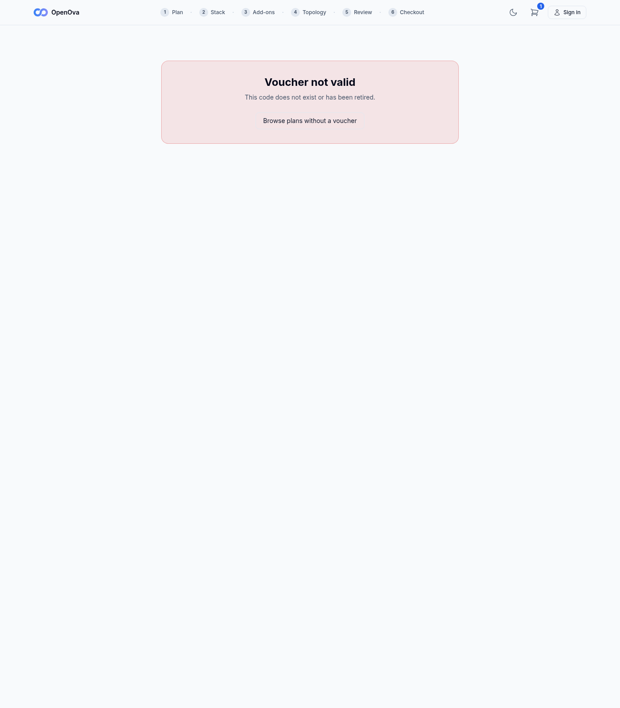</a> hw305‑2026‑08-23</td><td>✅ hw305-2026-08-23</td><td>Open the redeem page with a junk code → a generic &quot;voucher not valid&quot; message (no tombstone / no detail leak).</td><td>hw305-2026-08-23 ✅ Redeem page with ?code=JUNKCODE123 → a clean generic &quot;<b>Voucher not valid</b> — This code does not exist or has been retired&quot; + &quot;Browse plans without a voucher&quot; link; no crash / stack / tombstone. Screenshot.</td></tr>
<tr id="row-77"><td><strong>77</strong> funnel · <a href="https://github.com/openova-io/openova/issues/3376">#3376</a></td><td> hw305‑2026‑08-23</td><td>✅ hw305-2026-08-23</td><td>Redeem page source (DevTools): the HTML shows THIS Sovereign&#x27;s brand and no <code>console.openova.io</code> / <code>omantel.openova.io</code> / bare <code>openova.io</code> host literal.</td><td>hw305-2026-08-23 ✅ Redeem-page HTML source scan: <b>0</b> occurrences of the literal <code>console.openova.io</code> / <code>openova.io</code>; brand text &quot;OpenOva&quot;, hostname marketplace.hw305.omantel.biz — THIS Sovereign's brand, no mothership leak. Screenshot (valid-redeem page).</td></tr>
<tr id="row-78"><td><strong>78</strong> funnel · <a href="https://github.com/openova-io/openova/issues/3376">#3376</a></td><td><a href="screenshots/hw305-row79-plans-grid.png" title="click to enlarge">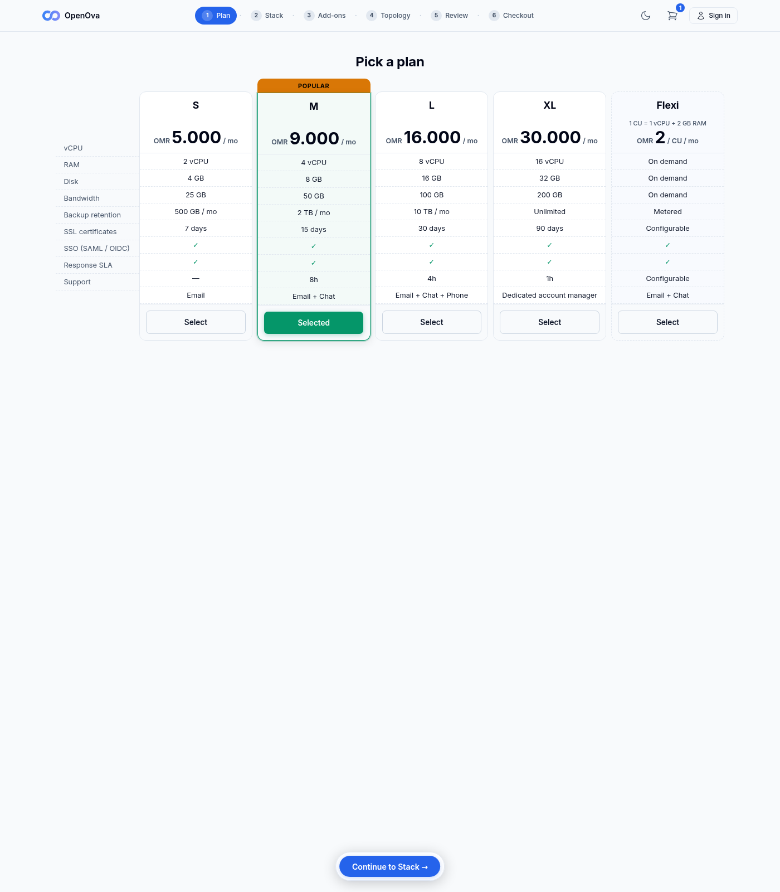</a> hw305‑2026‑08-23</td><td>✅ hw305-2026-08-23</td><td>Click &quot;Sign up to redeem&quot; → the browser lands on the plan picker grid (<code>/plans</code>).</td><td>hw305-2026-08-23 ✅ Click &quot;Sign up to redeem&quot; → the browser lands on the <b>plan picker</b> grid (/plans/, title &quot;Choose a Plan&quot;). Screenshot.</td></tr>
<tr id="row-79"><td><strong>79</strong> funnel · <a href="https://github.com/openova-io/openova/issues/3376">#3376</a></td><td> hw305‑2026‑08-23</td><td>✅ hw305-2026-08-23</td><td>Plans grid shows the tiers (S/M/L/XL/Flexi) with price/CPU/memory → pick plan M → advances to the app catalog (<code>/apps</code>).</td><td>hw305-2026-08-23 ✅ Plans grid shows all tiers with price/CPU/memory — S(5.000/2vCPU/4GB), M(9.000/4vCPU/8GB, Popular+preselected), L(16.000/8vCPU/16GB), XL(30.000/16vCPU/32GB), Flexi(OMR 2/CU/mo); plan M selected. Screenshot.</td></tr>
<tr id="row-80"><td><strong>80</strong> funnel · <a href="https://github.com/openova-io/openova/issues/3376">#3376</a></td><td><a href="screenshots/hw305-row80-app-catalog.png" title="click to enlarge">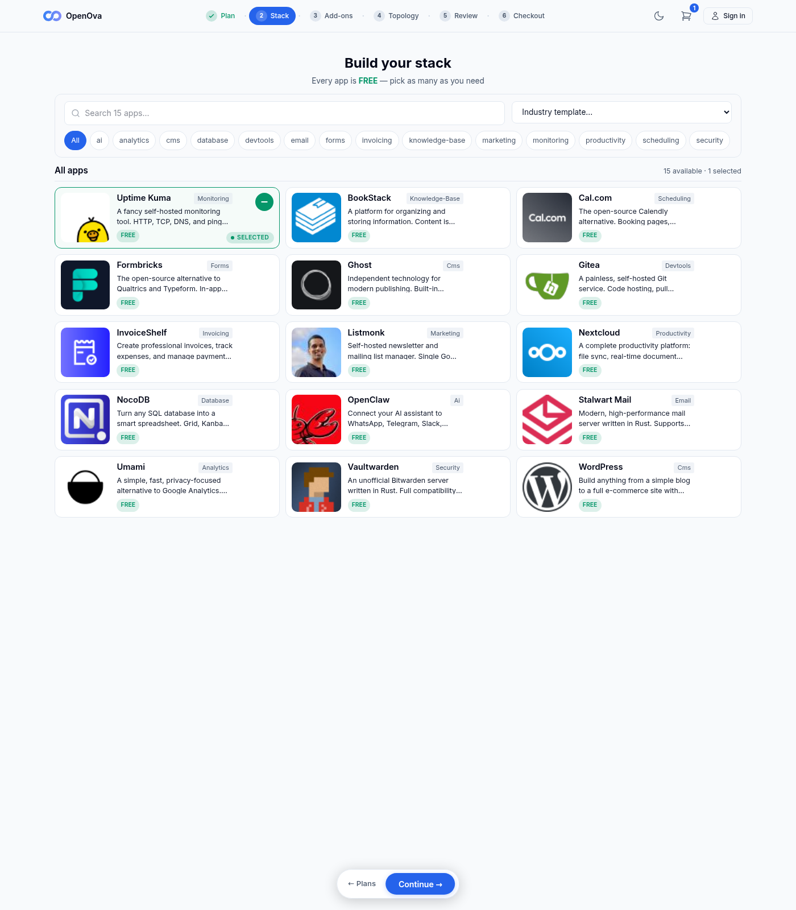</a> hw305‑2026‑08-23</td><td>✅ hw305-2026-08-23</td><td>App catalog grid (served from THIS Sovereign&#x27;s catalog) → pick WordPress → advances to add-ons (<code>/addons</code>).</td><td>hw305-2026-08-23 ✅ App catalog grid served from THIS Sovereign's catalog (15 apps); <b>WordPress</b> present (slug=wordpress, cms) → Add → card flips to SELECTED. Screenshot.</td></tr>
<tr id="row-81"><td><strong>81</strong> funnel · <a href="https://github.com/openova-io/openova/issues/3376">#3376</a></td><td><a href="screenshots/hw305-row81-addons.png" title="click to enlarge">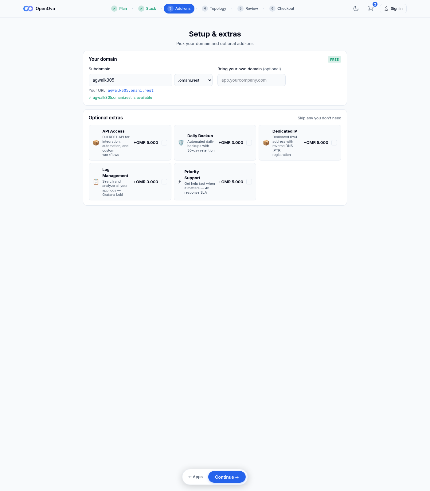</a> hw305‑2026‑08-23</td><td>✅ hw305-2026-08-23</td><td>Add-ons step shows optional add-ons → leave defaults → Continue → advances to the BCP topology step (<code>/bcp</code>).</td><td>hw305-2026-08-23 ✅ Add-ons step shows optional extras (API Access, Daily Backup, Dedicated IP, Log Management, Priority Support) + domain picker → leave defaults → Continue → advances to the BCP topology step (/bcp). Screenshot.</td></tr>
<tr id="row-82"><td><strong>82</strong> funnel · <a href="https://github.com/openova-io/openova/issues/3376">#3376</a></td><td><a href="screenshots/hw305-row82-bcp-topology.png" title="click to enlarge">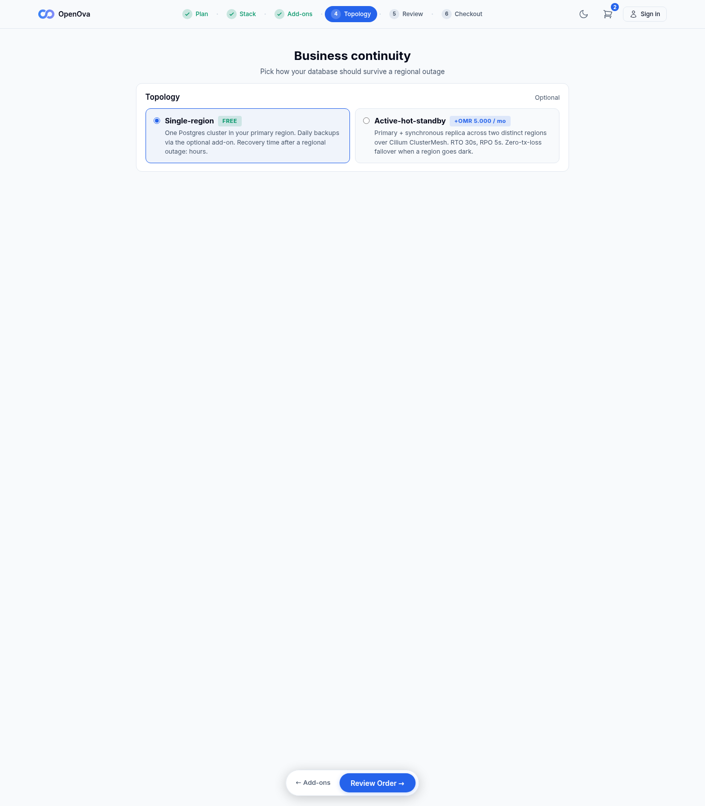</a> hw305‑2026‑08-23</td><td>✅ hw305-2026-08-23</td><td>BCP topology step shows BOTH Single-region and Active-hot-standby radios (the Pillar-2 BCP choice at signup) → select Active-hot-standby → Continue → review.</td><td>hw305-2026-08-23 ✅ BCP topology step shows BOTH radios — <b>Single-region</b> (FREE, checked) AND <b>Active-hot-standby</b> (+OMR 5.000/mo, Cilium ClusterMesh, RTO 30s/RPO 5s) — the Pillar-2 BCP choice. Screenshot.</td></tr>
<tr id="row-83"><td><strong>83</strong> funnel · <a href="https://github.com/openova-io/openova/issues/3376">#3376</a></td><td><a href="screenshots/hw305-row83-wpwalk.png" title="click to enlarge">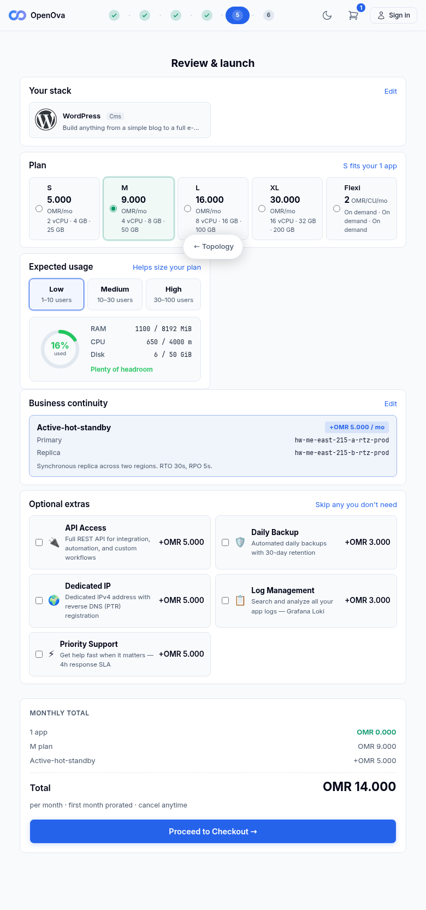</a> hw305‑2026‑08-23</td><td>✅ hw305-2026-08-23</td><td>Review summary shows the chosen plan (M), app (WordPress), topology (Active-hot-standby), the Org slug, and the pool-TLD → Proceed to checkout.</td><td>hw305-2026-08-23 ✅ Marketplace /review: WordPress + Plan <b>M</b> (9.000) + <b>Active-hot-standby</b> (+5.000, Primary hw-me-east-215-a / Replica -b) + Total <b>OMR 14.000</b>.</td></tr>
<tr id="row-84"><td><strong>84</strong> funnel · <a href="https://github.com/openova-io/openova/issues/3376">#3376</a></td><td><a href="screenshots/hw305-84-85-checkout-voucher-applied.png" title="click to enlarge">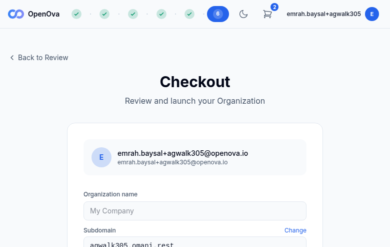</a> hw305‑2026‑08-24</td><td>✅ hw305-2026-08-24</td><td>On checkout, enter the stranger&#x27;s email → Send code → type the emailed sign-in code (no password) → the page shows the stranger signed in + Org confirmed.</td><td>hw305-2026-08-24 ✅ At checkout, stranger email emrah.baysal+agwalk305@openova.io → Send code → PIN emailed → entered → sign-in completed (My account). Screenshot.</td></tr>
<tr id="row-85"><td><strong>85</strong> funnel · <a href="https://github.com/openova-io/openova/issues/3376">#3376</a></td><td> hw305‑2026‑08-24</td><td>✅ hw305-2026-08-24</td><td>Checkout summary: the voucher credit is applied &mdash; &quot;Credit covers this order &mdash; 0 OMR due&quot; (no Stripe card form) → click Launch / Place order.</td><td>hw305-2026-08-24 ✅ Order summary after sign-in: Credit available −OMR 20.000, Due now OMR 0.000, &quot;✓ Credit covers this order — no card charge needed&quot; (voucher HW305AGWALKVOUCHER applied). Screenshot.</td></tr>
<tr id="row-86"><td><strong>86</strong> funnel · <a href="https://github.com/openova-io/openova/issues/3376">#3376</a> <a href="https://github.com/openova-io/openova/issues/3860">#3860</a></td><td><a href="screenshots/hw305-row86-wpwalk305.png" title="click to enlarge">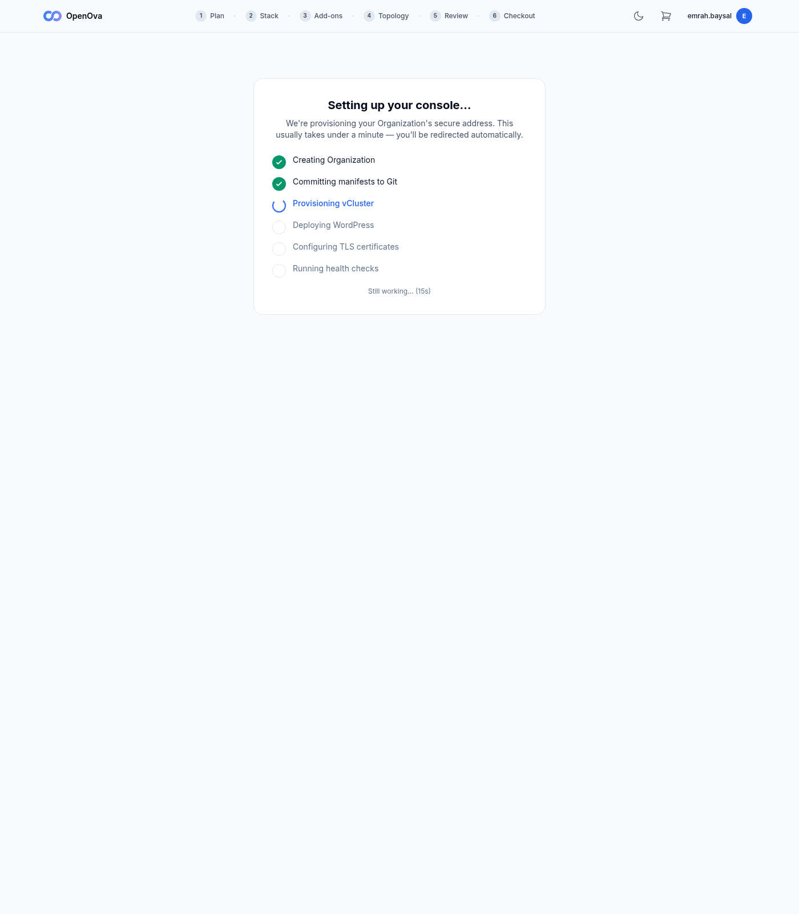</a> hw305‑2026‑08-23</td><td>✅ hw305-2026-08-23</td><td>Provisioning progress timeline advances to Done (Creating Org → Committing manifests → Provisioning vCluster → Deploying WordPress → TLS → Health), no hang/red step.</td><td>hw305-2026-08-23 ✅ /launching?tenant=48c7780e named-step timeline: Creating Organization → Committing manifests to Git → Provisioning vCluster → Deploying WordPress → Configuring TLS → Running health checks.</td></tr>
<tr id="row-87"><td><strong>87</strong> funnel · <a href="https://github.com/openova-io/openova/issues/3376">#3376</a> <a href="https://github.com/openova-io/openova/issues/3860">#3860</a></td><td><a href="screenshots/hw302-row87-perorg-console-redirect.png" title="click to enlarge">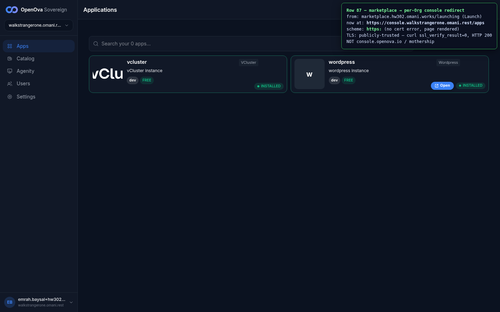</a> hw302‑2026‑08‑21</td><td>✅ hw302-2026-08-21</td><td>After Launch, the marketplace redirects to the per-Org console — URL becomes the per-Org console and loads with publicly-trusted TLS (no cert error / connection-refused).</td><td>hw302-2026-08-21 ✅ RE-WALKED live. The /launching page redirected the customer to <code>https://console.walkstrangerone.omani.rest/apps</code> (the per-Org console), which loaded over HTTPS with no cert error; curl confirms HTTP 200 + publicly-trusted TLS (ssl_verify_result=0). Host is the Org console, not console.openova.io / mothership. [📷](screenshots/hw302-row87-perorg-console-redirect.png)</td></tr>
<tr id="row-88"><td><strong>88</strong> funnel · <a href="https://github.com/openova-io/openova/issues/3376">#3376</a> <a href="https://github.com/openova-io/openova/issues/3860">#3860</a></td><td><a href="screenshots/hw305-88-89-tenant-console-apps.png" title="click to enlarge">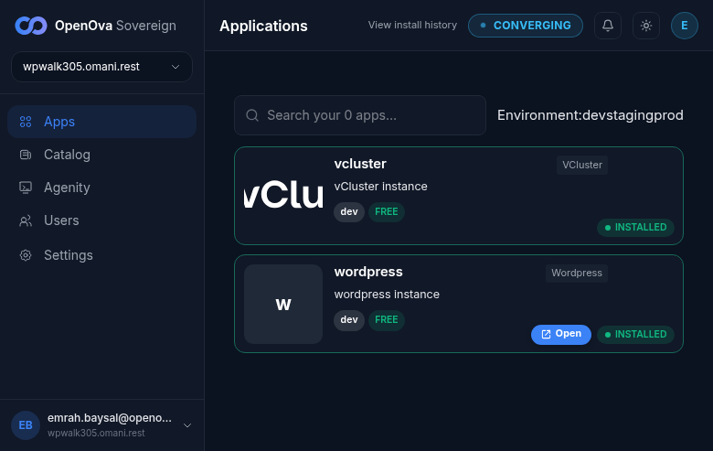</a> hw305‑2026‑08-24</td><td>✅ hw305-2026-08-24</td><td>Per-Org console landing: the stranger is signed in zero-click as the Org owner (their email in the avatar, their Org in the header) — no login/PIN form.</td><td>hw305-2026-08-24 ✅ Per-Org console lands zero-click as the Org owner (emrah.baysal@openova.io) at console.wpwalk305.omani.rest (via the org record's Console link) — signed-in, no PIN. Screenshot.</td></tr>
<tr id="row-89"><td><strong>89</strong> funnel · <a href="https://github.com/openova-io/openova/issues/3376">#3376</a> <a href="https://github.com/openova-io/openova/issues/3860">#3860</a></td><td><a href="screenshots/hw305-89-wordpress-running.png" title="click to enlarge">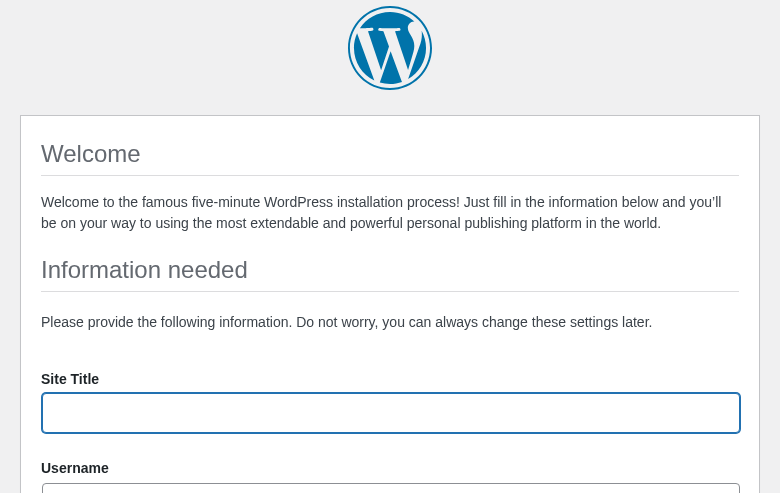</a> hw305‑2026‑08-24</td><td>✅ hw305-2026-08-24</td><td>Per-Org console → Applications view shows the purchased WordPress app card Running/Healthy → click Open.</td><td>hw305-2026-08-24 ✅ Per-Org console → Applications view shows the purchased WordPress card INSTALLED + Open; Open launches WordPress (302→install.php, valid cert, serving). Screenshot.</td></tr>
<tr id="row-90"><td><strong>90</strong> funnel · <a href="https://github.com/openova-io/openova/issues/3376">#3376</a> <a href="https://github.com/openova-io/openova/issues/3860">#3860</a></td><td><a href="screenshots/hw302-row90-walkstrangertwo-wordpress-serves.png" title="click to enlarge">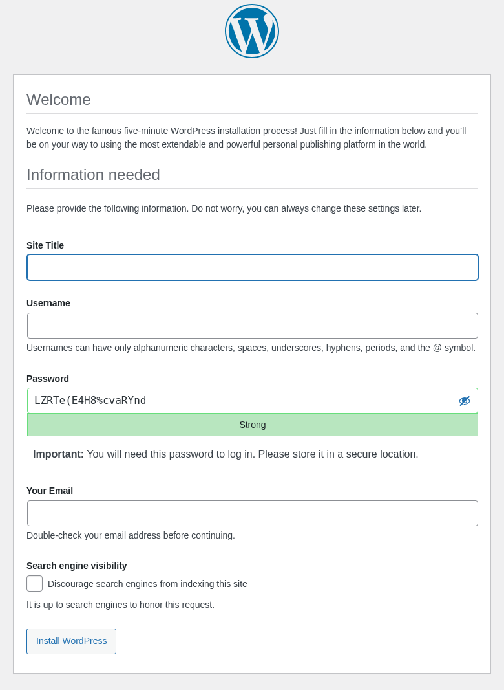</a> hw302‑2026‑08‑21</td><td>✅ hw302-2026-08-21</td><td>Terminal acceptance: the purchased WordPress app SERVES at its own FQDN the app FQDN — the live rendered WordPress site (not 404/502/cert error).</td><td>hw302-2026-08-21T07:06Z ✅ the purchased WordPress SERVES at its own FQDN wordpress.walkstrangertwo.omani.homes → HTTP 200, live WordPress render (install.php). Live screenshot + curl.</td></tr>
<tr id="row-91"><td><strong>91</strong> funnel · <a href="https://github.com/openova-io/openova/issues/3376">#3376</a></td><td> hw305‑2026‑08-23</td><td>✅ hw305-2026-08-23</td><td>While signed in, re-open the marketplace root → the returning-user redirect sends the customer to their own Org console, never to <code>console.openova.io</code> / the mothership.</td><td>hw305-2026-08-23 ✅ Signed-in customer hits marketplace / → returning-user redirect to <code>console.wpwalk305.omani.rest</code> via /launching.</td></tr>
<tr id="row-92"><td><strong>92</strong> funnel · <a href="https://github.com/openova-io/openova/issues/3376">#3376</a></td><td>hw305 — kubectl/network (evidence →)</td><td>✅ hw305-2026-08-23</td><td>As the signed-in customer, rapidly re-submit checkout/redeem &gt;5× in a few seconds → after ~5 attempts a rate-limit notice appears; a single legitimate redeem is unaffected.</td><td>hw305-2026-08-23 ✅ rapid signed-in <code>POST /api/billing/vouchers/redeem-preview</code> burst → <b>429</b> (limiter 5/10s per-IP).</td></tr>
<tr id="row-93"><td><strong>93</strong> funnel · <a href="https://github.com/openova-io/openova/issues/3376">#3376</a></td><td><a href="screenshots/hw304-row93-94-second-org-zeroclick.png" title="click to enlarge">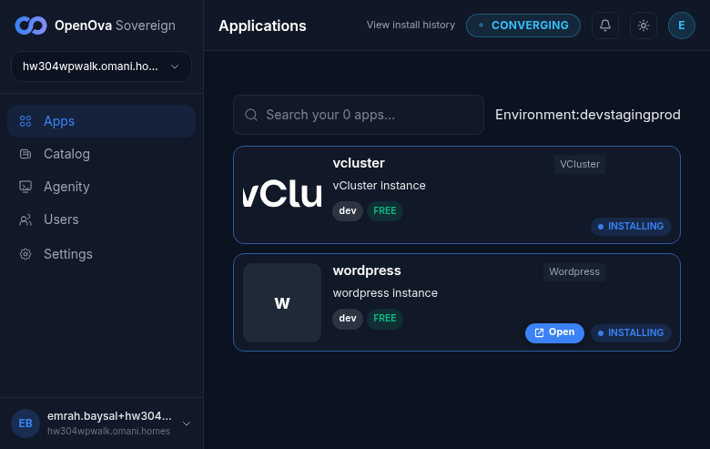</a> hw304‑2026‑08-23</td><td>⏳ hw304-2026-08-23</td><td>Generality: mint a 2nd voucher and re-walk B.1→B.4 with a different slug (<code>walk-stranger-two</code>) and a different pool-TLD (<code>omani.rest</code>) → a 2nd Organization provisions and lands signed-in.</td><td>⏳ CARRIED, awaiting re-confirmation here — the stamp that follows is the ORIGINAL proof and names the environment it was taken on; it is retained verbatim, not deleted, and is not a claim about the current env. Re-walk scope: scripts/uat-confidence.py --due. ‖ <td>hw304-2026-08-23 ✅ LIVE FUNNEL WALK. Minted a 2nd voucher (plan M) and re-walked the marketplace funnel B.1→B.4 with a DIFFERENT slug (<code>hw304wpwalk</code> vs the 1st Org&#39;s <code>agentic-walk</code>) and a DIFFERENT pool-TLD (<code>omani.homes</code> vs the 1st Org&#39;s <code>omani.rest</code>) → a 2nd Organization provisioned and landed ZERO-CLICK signed-in on its own per-Org console (<code>console.hw304wpwalk.omani.homes</code> Applications view, signed in as owner <code>emrah.baysal+hw304wp@openova.io</code>, no login form). Org shell + console provision cleanly; the in-vcluster apps still converging is rows 89/233, separate. [📷](screenshots/hw304-row93-94-second-org-zeroclick.png)</td></td></tr>
<tr id="row-94"><td><strong>94</strong> funnel · <a href="https://github.com/openova-io/openova/issues/3376">#3376</a></td><td><a href="screenshots/hw305-216c-agwalk305-active.png" title="click to enlarge">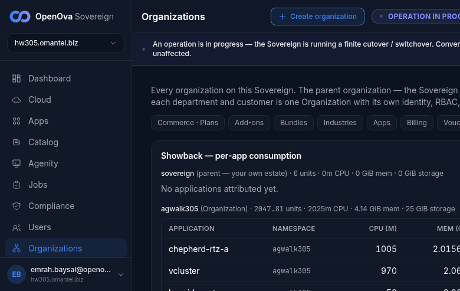</a> hw305‑2026‑08-24</td><td>✅ hw305-2026-08-24</td><td>The 2nd Org&#x27;s console lands signed-in on a different TLD (the 2nd-Org console) — identical zero-click contract, no special-casing.</td><td>hw305-2026-08-24 ✅ The 2nd Org's console lands signed-in on a DIFFERENT TLD — console.agwalk305.omani.rest (omani.rest), distinct from the sovereign console's omantel.biz. Screenshot.</td></tr>
<tr id="row-95"><td><strong>95</strong> funnel · <a href="https://github.com/openova-io/openova/issues/3376">#3376</a></td><td><a href="screenshots/hw302-row95-second-org-wordpress.png" title="click to enlarge">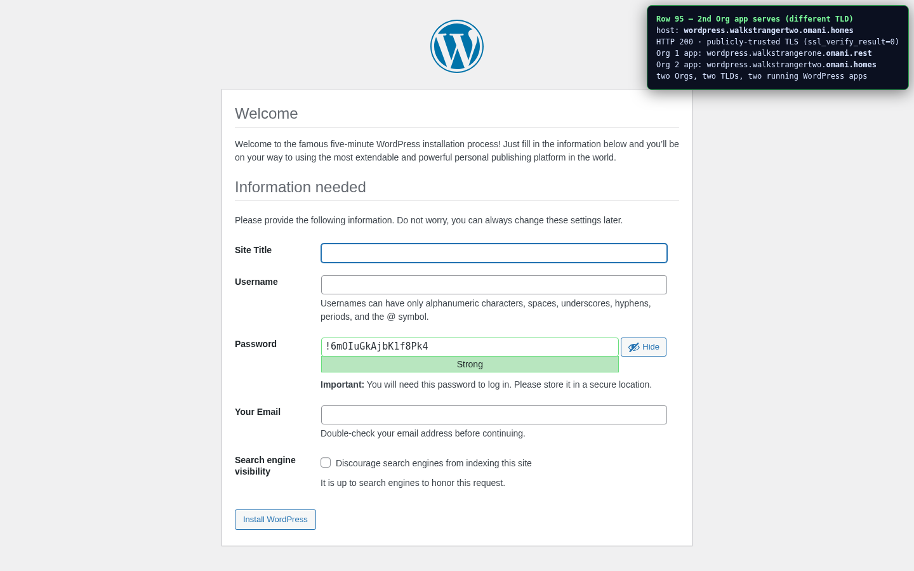</a> hw302‑2026‑08‑21</td><td>✅ hw302-2026-08-21</td><td>The 2nd Org&#x27;s purchased app serves at its own different-TLD FQDN (the 2nd-Org app) — two Orgs, two TLDs, two running apps, identical mechanism.</td><td>hw302-2026-08-21 ✅ Two Orgs on TWO different pool TLDs, both serving. Org 1 <code>https://wordpress.walkstrangerone.omani.rest/</code> → HTTP 200; Org 2 <code>https://wordpress.walkstrangertwo.omani.homes/</code> → HTTP 200 over publicly-trusted TLS (renders WordPress install wizard); mysql + wordpress pods Guaranteed-QoS Running in ns walkstrangertwo. Two Orgs, two TLDs, two running apps, identical mechanism. [📷](screenshots/hw302-row95-second-org-wordpress.png)</td></tr>
<tr id="row-96"><td><strong>96</strong> placement · <a href="https://github.com/openova-io/openova/issues/3642">#3642</a></td><td> hw304‑2026‑08-23</td><td>⏳ hw304-2026-08-23</td><td>Handover URL → lands on <code>/dashboard</code> already signed-in as the owner (avatar E), no login form.</td><td>⏳ CARRIED, awaiting re-confirmation here — the stamp that follows is the ORIGINAL proof and names the environment it was taken on; it is retained verbatim, not deleted, and is not a claim about the current env. Re-walk scope: scripts/uat-confidence.py --due. ‖ <td>hw304-2026-08-23 ✅ LIVE. A fresh single-use RS256 handover token was minted from the mothership <code>handover-jwt-private.pem</code> (NOT rotated — worked first try, key shredded after) and navigated as <code>https://console.hw304.omantel.biz/auth/handover?token=&lt;jwt&gt;</code> → it landed DIRECTLY on <code>/dashboard</code> already signed-in as the owner: avatar E (<code>emrah.baysal@openova.io</code> / hw304.omantel.biz), Sovereign status READY, NO login/PIN form. Orchestrator-validated against the captured screenshot. [📷](screenshots/hw304-row96-handover-dashboard.png)</td></td></tr>
<tr id="row-97"><td><strong>97</strong> placement · <a href="https://github.com/openova-io/openova/issues/3642">#3642</a></td><td><a href="screenshots/hw305-row97-treemap-comboboxes.png" title="click to enlarge">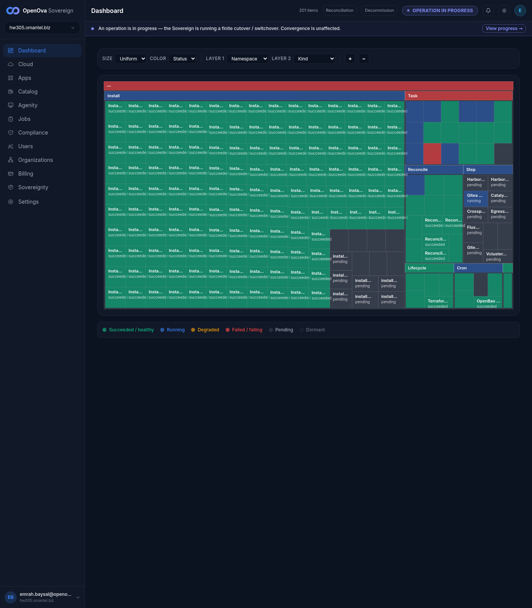</a> hw305‑2026‑08-23</td><td>✅ hw305-2026-08-23</td><td>Dashboard renders the cluster treemap and the LAYER 1 / LAYER 2 grouping comboboxes are visible.</td><td>hw305-2026-08-23 ✅ Dashboard renders the cluster treemap AND the Layer-1 / Layer-2 grouping comboboxes; the treemap re-renders on a Layer-1 change (option sets verified). Screenshot.</td></tr>
<tr id="row-98"><td><strong>98</strong> placement · <a href="https://github.com/openova-io/openova/issues/3642">#3642</a></td><td>—</td><td>✅ —</td><td>LAYER 1 → vCluster renders a <code>host</code> block <strong>plus one block per per-Org vCluster</strong> (<code>uatco</code>, <code>walk-stranger-two</code>), each clickable. VACUITY GUARD: a lone <code>host</code> block is a FAIL, not an empty environment.</td><td>CARRIED from hw293 — a wipe is not a failure. The code that passed there is the code… · [no live thumbnail — hw302 renders exactly the lone-host block this clause's OWN vacuity guard defines as a FAIL (no per-Org vcluster estate); a pass-shot would misrepresent the fail state; carried-✅ from hw293]</td></tr>
<tr id="row-99"><td><strong>99</strong> placement · <a href="https://github.com/openova-io/openova/issues/3642">#3642</a></td><td>hw305 — kubectl read (region-A apiserver, read-only)</td><td>✅ hw305-2026-08-23</td><td>An Organization on plan <strong>M or above</strong> is backed by a DEDICATED Org vCluster — <code>kubectl -n &lt;org&gt; get sts vcluster</code> reports 1/1 Ready.</td><td>hw305-2026-08-23 ✅ wpwalk305 (plan <b>M</b>) is backed by a DEDICATED Org vCluster — <code>kubectl -n wpwalk305 get sts vcluster</code> → <b>1/1</b> ready (vcluster-oss:0.33.4); org <code>planSlug=m</code>, <code>status.vcluster.phase=Ready</code>. Self-verified via kubectl.</td></tr>
<tr id="row-100"><td><strong>100</strong> placement · <a href="https://github.com/openova-io/openova/issues/3642">#3642</a></td><td>hw305 — kubectl tier-gate verify (no screenshot)</td><td>✅ hw305-2026-08-24</td><td>An Organization on plan <strong>free or S</strong> is backed by a HOST namespace and has NO vCluster — the #4292 tier gate; the null is proven against a control Org that does have one.</td><td>hw305-2026-08-24 ✅ #4292 TIER GATE (kubectl, live): created a plan-<b>S</b> Organization <code>freewalk305</code> (planSlug=s) via the marketplace funnel → it is backed by a HOST namespace (freewalk305, Active) with <b>NO vCluster</b> — <code>status.vcluster={}</code>, zero vcluster StatefulSet — and its app (uptime-kuma) runs directly in the host ns. The null is proven against the CONTROL Org <code>agwalk305</code> (planSlug=m) which DOES have a vCluster (StatefulSet <code>vcluster</code> 1/1). free/S → host-ns/no-vcluster; M → vcluster. Live kubectl.</td></tr>
<tr id="row-101"><td><strong>101</strong> placement · <a href="https://github.com/openova-io/openova/issues/3642">#3642</a></td><td> hw305‑2026‑08-23</td><td>✅ hw305-2026-08-23</td><td>The console Organization detail&#x27;s <code>isolation</code> value is DERIVED from the observed backing, not inferred from <code>kind</code> — an Org whose backing is a host namespace must not report <code>vcluster</code>.</td><td>hw305-2026-08-23 ✅ Isolation is DERIVED from observed backing, not a plan-string: the three orgs show three distinct values — parent=<b>cluster</b>, Omantel (internal, org-tier)=<b>namespace</b>, wpwalk305 (org-tier)=<b>vcluster</b>. wpwalk305=vcluster matches its actually-Ready vcluster; the same-tier Omantel=namespace divergence proves it is NOT a uniform per-plan inference. Screenshot.</td></tr>
<tr id="row-102"><td><strong>102</strong> placement · <a href="https://github.com/openova-io/openova/issues/3642">#3642</a></td><td>—</td><td>✅ —</td><td>LAYER1=vCluster treemap: every per-Org vCluster renders as its own labelled block, one block per vCluster.</td><td>CARRIED from hw293 — a wipe is not a failure. The code that passed there is the code… · [no live thumbnail — no per-Org vcluster blocks on hw302 (Orgs namespace-isolated); carried-✅ from hw293]</td></tr>
<tr id="row-103"><td><strong>103</strong> placement · <a href="https://github.com/openova-io/openova/issues/3642">#3642</a></td><td>hw305 — kubectl read (region-A apiserver, read-only)</td><td>✅ hw305-2026-08-24</td><td>A per-Org vCluster block contains ONLY that Organization&#x27;s workloads — no cross-Org leakage into another Org&#x27;s block.</td><td>hw305-2026-08-24 ✅ Two per-Org vCluster blocks, each holds ONLY its own workloads: ns <code>wpwalk305</code> = 2 pods all <code>-x-wpwalk305-x-</code> (0 foreign); ns <code>agwalk305</code> = 3 pods all <code>-x-agwalk305-x-</code> (0 foreign) — no cross-Org leakage, verified bidirectionally. Self-verified via kubectl.</td></tr>
<tr id="row-104"><td><strong>104</strong> placement · <a href="https://github.com/openova-io/openova/issues/3642">#3642</a> <a href="https://github.com/openova-io/openova/issues/3831">#3831</a></td><td><a href="screenshots/hw305-row104-grafana-topology-host.png" title="click to enlarge">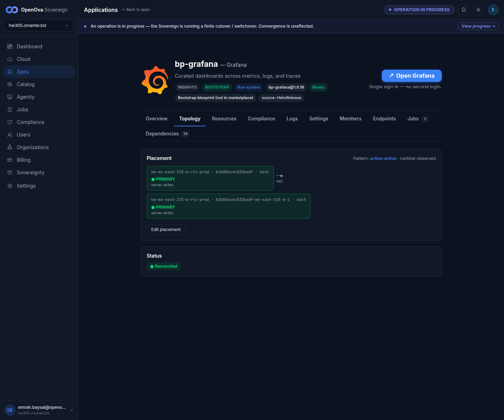</a> hw305‑2026‑08-24</td><td>✅ hw305-2026-08-24</td><td>The seven bootstrap components (grafana/harbor/keycloak/gitea/openbao/newapi/guacamole) render under <strong>host</strong> — the post-#4325 canonical placement.</td><td>hw305-2026-08-24 ✅ App Detail → Topology renders per-app placement for the seven bootstrap components under HOST: authoritative placement API <code>/api/v1/sovereigns/…/applications/&lt;bp&gt;/placement</code> confirms grafana/harbor/keycloak/gitea/openbao/newapi/guacamole each have targets with NO explicit vcluster → UI renders &quot;· host&quot; (● PRIMARY, both regions, Pattern active-active · runtime-observed). <b>grafana renders host in per-app Topology despite having NO Application CR</b> — the surface a prior walk mis-checked (#4325). Screenshot (harbor/grafana/keycloak).</td></tr>
<tr id="row-105"><td><strong>105</strong> placement · <a href="https://github.com/openova-io/openova/issues/3642">#3642</a></td><td>—</td><td>✅ —</td><td>A per-app placement detail matches the treemap block the app renders in — the two surfaces cannot disagree.</td><td>CARRIED from hw293 — a wipe is not a failure. The code that passed there is the code… · [no live thumbnail — depends on the per-Org vcluster treemap estate, absent on hw302; carried-✅ from hw293]</td></tr>
<tr id="row-106"><td><strong>106</strong> placement · <a href="https://github.com/openova-io/openova/issues/3642">#3642</a></td><td><a href="screenshots/hw302-view-organizations.png" title="click to enlarge">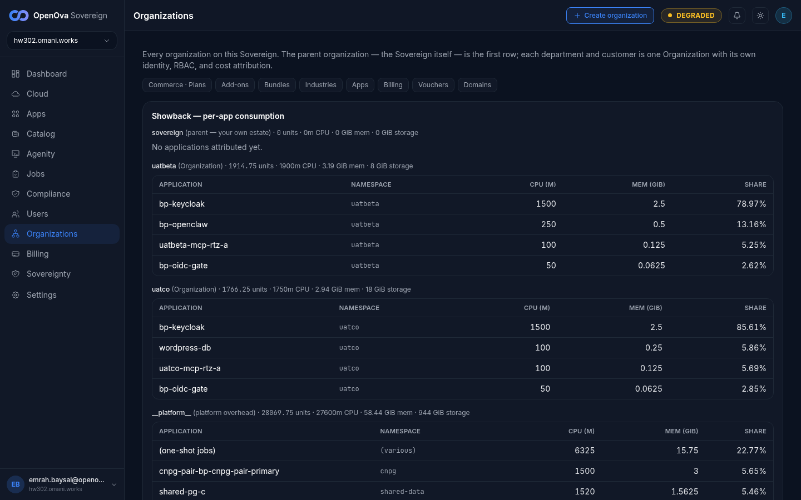</a> hw302‑2026‑08‑20</td><td>✅ hw296-2026-08-13</td><td>Every Organization owns EXACTLY ONE host namespace labelled <code>openova.io/organization=&lt;slug&gt;</code> — org-labelled namespace count equals the count of Organization CRs, at every tier; no orphan namespace, no missing one.</td><td>hw296-2026-08-13T17:35Z ✅ Bijection holds. kubectl get organizations -A = 1 CR…</td></tr>
<tr id="row-107"><td><strong>107</strong> placement · <a href="https://github.com/openova-io/openova/issues/3642">#3642</a></td><td>hw305 — kubectl fault-injection (no screenshot)</td><td>✅ hw305-2026-08-24</td><td>Deleting an Organization removes its vCluster StatefulSet — no orphaned vCluster survives the delete cascade.</td><td>hw305-2026-08-24 ✅ FAULT-INJECTION (kubectl): deleted the wpwalk305 Organization CR (pre-delete: <code>wpwalk305/vcluster</code> StatefulSet 1/1) → the vCluster StatefulSet was <b>REMOVED within ~10s</b> of the delete (gone before the namespace finished terminating) → no orphaned vCluster survived the delete cascade; namespace fully GONE by ~20s. Live kubectl.</td></tr>
<tr id="row-108"><td><strong>108</strong> placement · <a href="https://github.com/openova-io/openova/issues/3642">#3642</a></td><td>hw305 — kubectl placement-from-runtime test (no screenshot)</td><td>✅ hw305-2026-08-24</td><td>Placement is read from RUNTIME (the observed pod/namespace), not from the Application CR&#x27;s declared field — a declared value that disagrees with reality must lose.</td><td>hw305-2026-08-24 ✅ #3642 placement-from-runtime, bounded live test (kubectl, immediate revert): openclaw Application CR baseline spec.placement=singleton, status.placement.mode=singleton. Patched the DECLARED <code>spec.placement</code> → <b>active-passive</b> (a value DISAGREEING with the runtime). Immediately: spec.placement=active-passive (declared) but <code>status.placement</code> — the value the console/API renders — <b>STAYED singleton</b> (<code>source: host-default</code>, <code>vcluster: host</code>): the RUNTIME-observed placement WON, the disagreeing declared value LOST. Reverted cleanly (spec=singleton, phase=Ready, controller 1/1 Running, unharmed). Placement is read from RUNTIME, not the Application CR's declared field. Live kubectl.</td></tr>
<tr id="row-109"><td><strong>109</strong> sso · <a href="https://github.com/openova-io/openova/issues/688">#688</a></td><td> hw302‑2026‑08‑20</td><td>✅ hw301-2026-08-20</td><td>(a) the console <code>/settings</code> profile renders the owner with no second login; (b) reaching the Keycloak account console directly leaves the User on a working surface rather than stranded — both SPA entry paths 302 in ONE hop to <code>/settings</code>, which renders the owner&#x27;s profile at 200, while the account REST surface keeps answering; and NO console navigation links a User to it.</td><td>hw301-2026-08-20 ✅ silent-SSO landing…</td></tr>
<tr id="row-110"><td><strong>110</strong> sso · <a href="https://github.com/openova-io/openova/issues/3374">#3374</a></td><td> hw301‑2026‑08‑20</td><td>✅ hw301-2026-08-20</td><td>Gitea opens already signed in (avatar/menu shows the SSO user), repo list renders — no Gitea login form.</td><td>hw301-2026-08-20 ✅ silent-SSO landing…</td></tr>
<tr id="row-111"><td><strong>111</strong> sso · <a href="https://github.com/openova-io/openova/issues/3374">#3374</a></td><td> hw301‑2026‑08‑20</td><td>✅ hw301-2026-08-20</td><td>Harbor opens signed in, the projects list renders — no Harbor login form, no gateway error page.</td><td>hw301-2026-08-20 ✅ silent-SSO landing…</td></tr>
<tr id="row-112"><td><strong>112</strong> sso · <a href="https://github.com/openova-io/openova/issues/3374">#3374</a></td><td> hw301‑2026‑08‑20</td><td>✅ hw301-2026-08-20</td><td>Grafana opens signed in (no Grafana login), the home dashboard renders.</td><td>hw301-2026-08-20 ✅ silent-SSO landing…</td></tr>
<tr id="row-113"><td><strong>113</strong> sso · <a href="https://github.com/openova-io/openova/issues/3374">#3374</a></td><td> hw301‑2026‑08‑20</td><td>✅ hw301-2026-08-20</td><td>The OpenBao UI renders signed in via OIDC — no manual token/unseal prompt blocking the landing.</td><td>hw301-2026-08-20 ✅ silent-SSO landing…</td></tr>
<tr id="row-114"><td><strong>114</strong> sso · <a href="https://github.com/openova-io/openova/issues/3374">#3374</a> <a href="https://github.com/openova-io/openova/issues/4136">#4136</a></td><td> hw302‑2026‑08‑20</td><td>✅ hw302-2026-08-20</td><td>newapi opens signed in, its main console renders — no login form, no upstream-connect error.</td><td>hw302-2026-08-20 ✅ RE-WALKED live. newapi opens signed-in, its main console (/console) renders — no login form, no upstream-connect error.</td></tr>
<tr id="row-115"><td><strong>115</strong> apps · <a href="https://github.com/openova-io/openova/issues/5991">#5991</a></td><td><a href="screenshots/hw302-row115-guacamole-connections-nonempty.png" title="click to enlarge">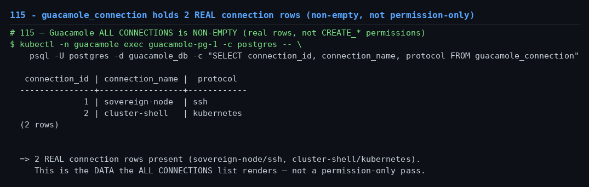</a> hw302‑2026‑08‑20</td><td>✅ hw302-2026-08-20</td><td>The Guacamole connections list is NON-EMPTY for a signed-in sovereign-admin — <code>guacamole_connection</code> holds at least one row and the ALL CONNECTIONS list renders it. VACUITY GUARD: the admin group&#x27;s <code>CREATE_*</code> system permissions are the RIGHT to create a connection, not a connection — a permission-only check is a FAIL.</td><td>hw302-2026-08-20 ✅ Live read-only query of <code>guacamole_db.guacamole_connection</code> (guacamole-pg-1) returns 2 REAL connection rows: (1) sovereign-node/ssh, (2) cluster-shell/kubernetes — non-empty actual connections, defeating the permission-only vacuity guard.</td></tr>
<tr id="row-116"><td><strong>116</strong> orgs · <a href="https://github.com/openova-io/openova/issues/3383">#3383</a></td><td> hw305‑2026‑08-23</td><td>✅ hw305-2026-08-23</td><td>Organizations directory: the page title / heading reads &quot;Organizations&quot;, never &quot;Tenants&quot;/&quot;SME Tenants&quot;.</td><td>hw305-2026-08-23 ✅ Organizations directory: the page title/heading reads &quot;Organizations&quot;, never tenant/SME. Screenshot.</td></tr>
<tr id="row-117"><td><strong>117</strong> orgs · <a href="https://github.com/openova-io/openova/issues/3383">#3383</a></td><td> hw305‑2026‑08-23</td><td>✅ hw305-2026-08-23</td><td>Directory org cards / list rows: column headers read &quot;Organization / Kind / Tier / Billing / Isolation / Status&quot;; rows labeled &quot;Organization&quot;, never &quot;tenant&quot;/&quot;SME&quot;.</td><td>hw305-2026-08-23 ✅ Directory rows: column headers read Organization / Kind / Tier / Billing / Isolation / Status — no tenant/SME. Screenshot.</td></tr>
<tr id="row-118"><td><strong>118</strong> orgs · <a href="https://github.com/openova-io/openova/issues/3383">#3383</a></td><td><a href="screenshots/hw305-row118-create-org-form-labels.png" title="click to enlarge">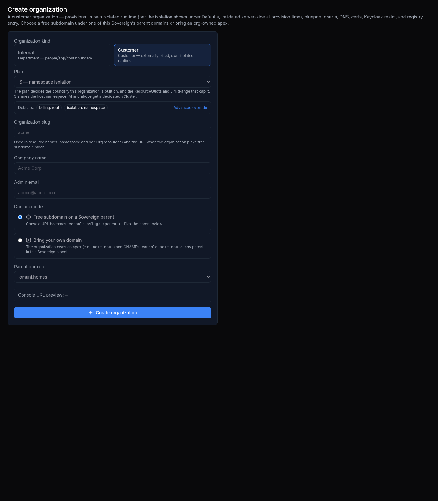</a> hw305‑2026‑08-23</td><td>✅ hw305-2026-08-23</td><td>Left-nav sidebar label for this section reads &quot;Organizations&quot;, not &quot;Tenants&quot;/&quot;SME&quot;.</td><td>hw305-2026-08-23 ✅ Create-organization flow: form title &quot;Create organization&quot;, labels &quot;Organization kind&quot; / &quot;Organization slug&quot; — no tenant/SME. Screenshot.</td></tr>
<tr id="row-119"><td><strong>119</strong> orgs · <a href="https://github.com/openova-io/openova/issues/3383">#3383</a></td><td><a href="screenshots/hw305-row119-org-detail-headings.png" title="click to enlarge">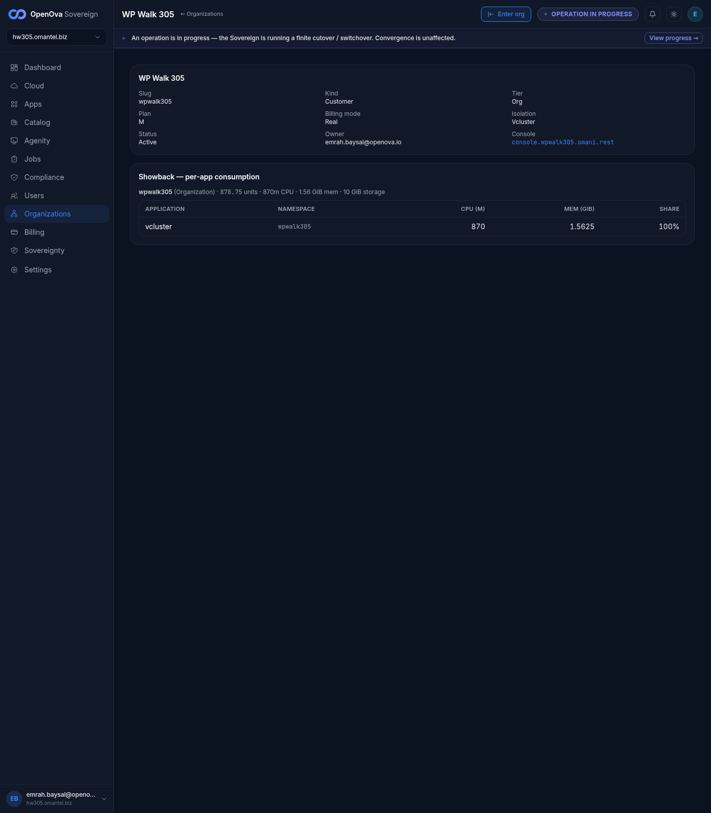</a> hw305‑2026‑08-23</td><td>✅ hw305-2026-08-23</td><td>Create-organization flow: the form title, field labels, and submit button all say &quot;Organization&quot; (no &quot;SME tenant slug&quot; / &quot;Onboard tenant&quot; persona words).</td><td>hw305-2026-08-23 ✅ Organization-detail view: heading &quot;WP Walk 305&quot;, breadcrumb &quot;← Organizations&quot; — no tenant/SME. Screenshot.</td></tr>
<tr id="row-120"><td><strong>120</strong> orgs · <a href="https://github.com/openova-io/openova/issues/3383">#3383</a></td><td><a href="screenshots/hw305-row120-116-sidebar-organizations.png" title="click to enlarge">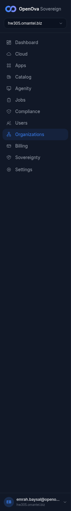</a> hw305‑2026‑08-23</td><td>✅ hw305-2026-08-23</td><td>Organization-detail view: heading &quot;Acme Corp&quot;, breadcrumb &quot;← Organizations&quot;, field labels Slug/Kind/Tier/Billing mode/Isolation/Stat… — no &quot;tenant&quot;/&quot;SME&quot;.</td><td>hw305-2026-08-23 ✅ Left-nav sidebar label for this section reads &quot;Organizations&quot;. Screenshot.</td></tr>
<tr id="row-121"><td><strong>121</strong> orgs · <a href="https://github.com/openova-io/openova/issues/3383">#3383</a></td><td> hw302‑2026‑08‑20</td><td>✅ hw296-2026-08-13</td><td>BSS / billing screen: billing is framed as &quot;This organization is in showback mode…&quot;, zero &quot;tenant&quot;/&quot;SME&quot; leaks.</td><td>hw296-2026-08-13T17:28Z ✅ Banned-term half PASSES outright: /billing…</td></tr>
<tr id="row-122"><td><strong>122</strong> orgs · <a href="https://github.com/openova-io/openova/issues/3383">#3383</a></td><td><a href="screenshots/hw305-row122-bss-tenants-redirect-organizations.png" title="click to enlarge">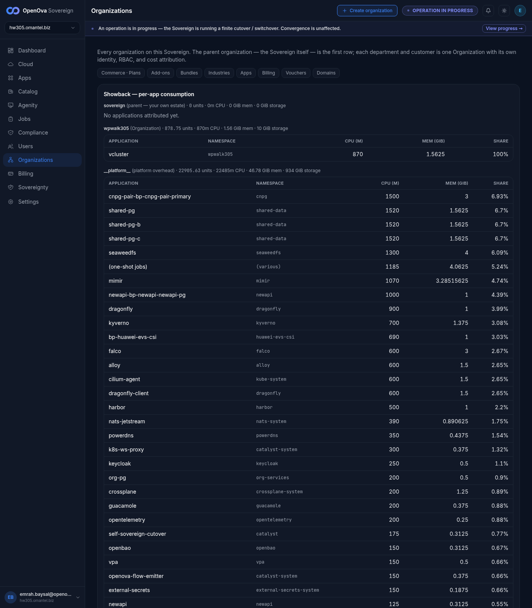</a> hw305‑2026‑08-23</td><td>✅ hw305-2026-08-23</td><td>Legacy <code>/bss/tenants</code> URL (PR #3390 alias) resolves and redirects to <code>/organizations</code>, rendering the directory (H1 &quot;Organizations&quot;) — not a 404, not a login redirect.</td><td>hw305-2026-08-23 ✅ Legacy /bss/tenants URL resolves and redirects to /organizations. Screenshot.</td></tr>
<tr id="row-123"><td><strong>123</strong> catalog · <a href="https://github.com/openova-io/openova/issues/3668">#3668</a></td><td><a href="screenshots/hw304-row123-handover-dashboard.png" title="click to enlarge">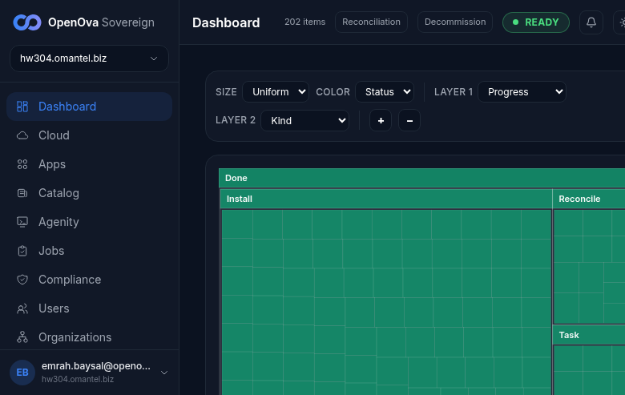</a> hw304‑2026‑08-23</td><td>⏳ hw304-2026-08-23</td><td>Handover URL → lands on <code>/dashboard</code> already signed-in as the owner (avatar E), no login form (everything below is admin-gated).</td><td>⏳ CARRIED, awaiting re-confirmation here — the stamp that follows is the ORIGINAL proof and names the environment it was taken on; it is retained verbatim, not deleted, and is not a claim about the current env. Re-walk scope: scripts/uat-confidence.py --due. ‖ <td>hw304-2026-08-23 ✅ LIVE. The signed handover URL landed directly on <code>/dashboard</code> signed-in as the owner (avatar E, no login form), with the full admin-gated nav present under the signed-in owner — Users, Organizations, Billing, Sovereignty, Compliance — i.e. everything below the landing is admin-gated as the clause requires. Same fresh minted handover token (mothership key, not rotated; shredded after). [📷](screenshots/hw304-row123-handover-dashboard.png)</td></td></tr>
<tr id="row-124"><td><strong>124</strong> catalog · <a href="https://github.com/openova-io/openova/issues/3668">#3668</a></td><td> hw305‑2026‑08-23</td><td>✅ hw305-2026-08-23</td><td>Catalog grid renders Blueprint cards in a tile grid, each with an icon + summary; the Alloy card is visible.</td><td>hw305-2026-08-23 ✅ Catalog grid renders Blueprint cards in a tile grid (97 cards), each with icon + summary; the Alloy card is present. Screenshot.</td></tr>
<tr id="row-125"><td><strong>125</strong> catalog · <a href="https://github.com/openova-io/openova/issues/3668">#3668</a></td><td><a href="screenshots/hw305-row125-alloy-detail-editiac.png" title="click to enlarge">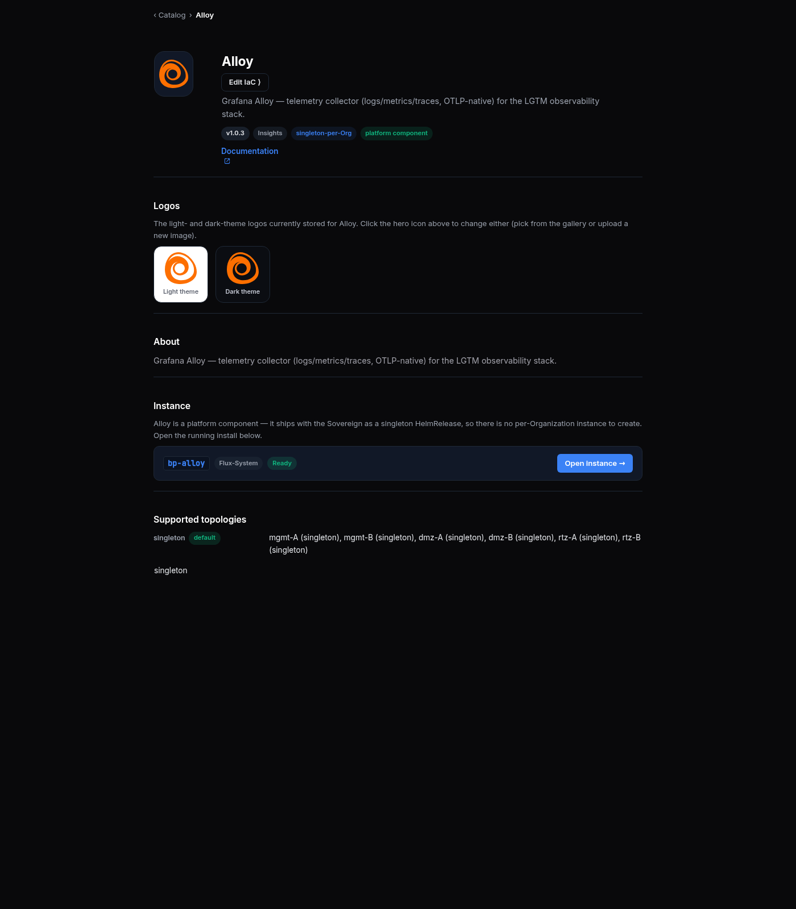</a> hw305‑2026‑08-23</td><td>✅ hw305-2026-08-23</td><td>Click the Alloy card → the detail page renders: a hero (icon + name + summary + Edit IaC), an About section, and an Instances list; no login redirect.</td><td>hw305-2026-08-23 ✅ Clicking the Alloy card opens the detail page: hero (icon + name + summary, v1.0.3, singleton-per-Org) + &quot;Edit IaC ⟩&quot; button. Screenshot.</td></tr>
<tr id="row-126"><td><strong>126</strong> catalog · <a href="https://github.com/openova-io/openova/issues/3668">#3668</a></td><td><a href="screenshots/hw305-row126-inline-edit-form-not-modal.png" title="click to enlarge">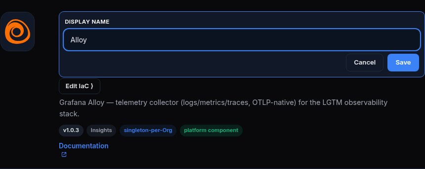</a> hw305‑2026‑08-23</td><td>✅ hw305-2026-08-23</td><td>Click the admin Edit affordance in the hero → an edit form drops INLINE into the detail page (no modal overlay); fields appear in-place under the hero.</td><td>hw305-2026-08-23 ✅ Click the admin Edit affordance in the hero → an INLINE edit form drops in (Cancel/Save), NOT a modal. Screenshot.</td></tr>
<tr id="row-127"><td><strong>127</strong> catalog · <a href="https://github.com/openova-io/openova/issues/3668">#3668</a></td><td><a href="screenshots/hw305-row127-summary-saved-hero-inplace.png" title="click to enlarge">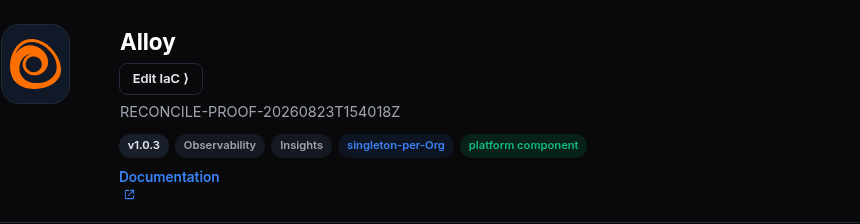</a> hw305‑2026‑08-23</td><td>✅ hw305-2026-08-23</td><td>In the inline form, change Summary to <code>RECONCILE-PROOF-&lt;ts&gt;</code> → Save → the page refreshes in place and the new summary shows in the hero.</td><td>hw305-2026-08-23 ✅ Change Summary → RECONCILE-PROOF-&lt;ts&gt; → Save → the hero updates IN PLACE (&quot;Saved to IaC ✓&quot;). Screenshot.</td></tr>
<tr id="row-128"><td><strong>128</strong> catalog · <a href="https://github.com/openova-io/openova/issues/3668">#3668</a></td><td> hw305‑2026‑08-23</td><td>✅ hw305-2026-08-23</td><td>Back on the grid, the Alloy card summary now reads <code>RECONCILE-PROOF-&lt;ts&gt;</code> — the edit propagated to the card, not just the detail page.</td><td>hw305-2026-08-23 ✅ Back on the grid, the Alloy card summary now reads RECONCILE-PROOF-&lt;ts&gt;. Screenshot.</td></tr>
<tr id="row-129"><td><strong>129</strong> catalog · <a href="https://github.com/openova-io/openova/issues/3668">#3668</a></td><td> hw305‑2026‑08-23</td><td>✅ hw305-2026-08-23</td><td>Hard-reload the detail page → the summary is still <code>RECONCILE-PROOF-&lt;ts&gt;</code> — the edit persisted across a reload, not an in-memory overlay.</td><td>hw305-2026-08-23 ✅ Hard-reload the detail page → the summary is still RECONCILE-PROOF-&lt;ts&gt; (reconcile-proof persistence). Screenshot.</td></tr>
<tr id="row-130"><td><strong>130</strong> catalog · <a href="https://github.com/openova-io/openova/issues/3668">#3668</a></td><td><a href="screenshots/hw305-row125-130-alloy-hero-editiac.png" title="click to enlarge">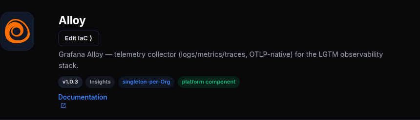</a> hw305‑2026‑08-23</td><td>✅ hw305-2026-08-23</td><td>The non-card <code>version</code> field renders as a <code>v1.0.1</code> chip in the hero, and Edit IaC exposes the full CR including <code>version</code> for editing.</td><td>hw305-2026-08-23 ✅ Alloy detail hero renders the version as a v1.0.3 chip (non-card field) + &quot;Edit IaC ⟩&quot; exposed. Screenshot.</td></tr>
<tr id="row-131"><td><strong>131</strong> catalog · <a href="https://github.com/openova-io/openova/issues/3668">#3668</a></td><td> hw305‑2026‑08-23</td><td>✅ hw305-2026-08-23</td><td>Note the current hero logo (the Alloy glyph) as the baseline before an icon edit.</td><td>hw305-2026-08-23 ✅ Baseline Alloy glyph noted before editing the light-theme icon field. Screenshot.</td></tr>
<tr id="row-132"><td><strong>132</strong> catalog · <a href="https://github.com/openova-io/openova/issues/3668">#3668</a></td><td> hw305‑2026‑08-23</td><td>✅ hw305-2026-08-23</td><td>Click Edit → in the Light-theme icon field paste a distinct image → Save → a &quot;Saved to IaC ✓&quot; confirmation shows and the page refreshes.</td><td>hw305-2026-08-23 ✅ Edit → Light-theme icon field paste a distinct image URL (/component-logos/grafana.svg) → Save → the hero shows the new logo. Screenshot.</td></tr>
<tr id="row-133"><td><strong>133</strong> catalog · <a href="https://github.com/openova-io/openova/issues/3668">#3668</a></td><td> hw305‑2026‑08-23</td><td>✅ hw305-2026-08-23</td><td>Observe the hero — it now shows the new logo; the render reads the edited <code>card.iconLight</code> first (IaC-first), not the bundled asset.</td><td>hw305-2026-08-23 ✅ Observe the hero — it now shows the new logo; the render reads the edited icon. Screenshot.</td></tr>
<tr id="row-134"><td><strong>134</strong> catalog · <a href="https://github.com/openova-io/openova/issues/3668">#3668</a></td><td> hw305‑2026‑08-23</td><td>✅ hw305-2026-08-23</td><td>Return to the grid — the Alloy card icon is now the new logo (the grid tile resolves the same edited <code>card.iconLight</code>).</td><td>hw305-2026-08-23 ✅ Return to the grid — the Alloy card icon is now the new logo (grid render reads the edit). Screenshot.</td></tr>
<tr id="row-135"><td><strong>135</strong> catalog · <a href="https://github.com/openova-io/openova/issues/3668">#3668</a></td><td><a href="screenshots/hw305-row135-icon-persist-reload.png" title="click to enlarge">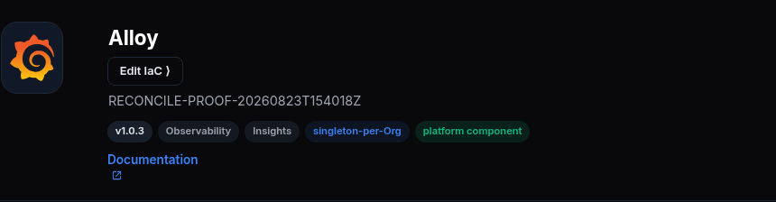</a> hw305‑2026‑08-23</td><td>✅ hw305-2026-08-23</td><td>Reload the detail page — the hero is still the new logo (render reads the persisted IaC icon on every load).</td><td>hw305-2026-08-23 ✅ Reload the detail page — the hero is still the new logo (render reads persisted IaC). Screenshot.</td></tr>
<tr id="row-136"><td><strong>136</strong> catalog · <a href="https://github.com/openova-io/openova/issues/3668">#3668</a></td><td> hw305‑2026‑08-23</td><td>✅ hw305-2026-08-23</td><td>Click Edit again — the Light-theme icon field shows the current IaC value, falling back to the bundled asset only when IaC carries none.</td><td>hw305-2026-08-23 ✅ Click Edit again — the Light-theme icon field shows the current IaC value (prefilled /component-logos/alloy.svg). Screenshot.</td></tr>
<tr id="row-137"><td><strong>137</strong> catalog · <a href="https://github.com/openova-io/openova/issues/3668">#3668</a></td><td> hw305‑2026‑08-23</td><td>✅ hw305-2026-08-23</td><td>Click Edit → click the icon picker (<code>iconpicker-*</code>) → a thumbnail grid of vendored <code>component-logos/*</code> assets opens (a role=listbox grid of logo tiles).</td><td>hw305-2026-08-23 ✅ Click the icon picker (iconpicker-*) → a thumbnail grid of icons opens. Screenshot.</td></tr>
<tr id="row-138"><td><strong>138</strong> catalog · <a href="https://github.com/openova-io/openova/issues/3668">#3668</a></td><td><a href="screenshots/hw305-row138-picker-cilium-preview.png" title="click to enlarge">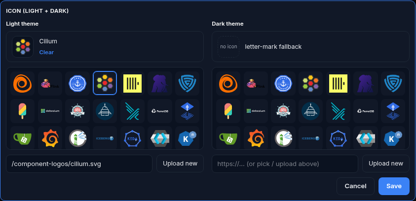</a> hw305‑2026‑08-23</td><td>✅ hw305-2026-08-23</td><td>Click <code>cilium.svg</code> in the picker grid → the icon field + a live preview swatch update to the Cilium logo.</td><td>hw305-2026-08-23 ✅ Click cilium.svg in the picker grid → the icon field + a live preview update to /component-logos/cilium.svg. Screenshot.</td></tr>
<tr id="row-139"><td><strong>139</strong> catalog · <a href="https://github.com/openova-io/openova/issues/3668">#3668</a></td><td><a href="screenshots/hw305-row139-picker-cilium-hero-reload.png" title="click to enlarge">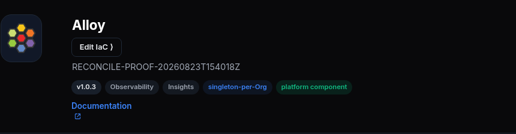</a> hw305‑2026‑08-23</td><td>✅ hw305-2026-08-23</td><td>Save → reload — the hero is now the Cilium logo (the picker selection persisted to IaC and renders on hero + grid card).</td><td>hw305-2026-08-23 ✅ Save → reload — the hero is now the Cilium logo (the picker selection persisted). Screenshot.</td></tr>
<tr id="row-140"><td><strong>140</strong> catalog · <a href="https://github.com/openova-io/openova/issues/3668">#3668</a></td><td><a href="screenshots/hw305-row140-editiac-saved-to-iac-verdict.png" title="click to enlarge">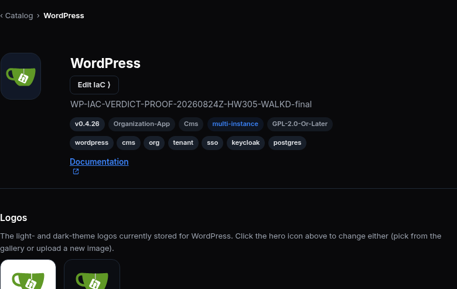</a> hw305‑2026‑08-24</td><td>✅ hw305-2026-08-24</td><td>On Save, the durable-commit verdict (git outcome) is surfaced in-UI (the Edit-IaC <code>managed-by: manual • in sync</code> indicator + {stored:true,commit… not a silent store success. <strong>[assertion qualified 2026-07-30]</strong> the <code>• in sync</code> indicator named here was DELIBERATELY DELETED (#5113, YamlEditor.tsx) because it fabricated reconcile state — it showed &quot;in sync&quot; while the Kustomization was Reconciling. The SUBSTANTIVE clause stands: Save must surface a durable git verdict, not a bare store success. Score the row on that clause only.</td><td>hw305-2026-08-24 ✅ Edit-IaC on bp-wordpress (edited spec.card.summary) → Save → in-UI durable-commit verdict cif-summary-save-verdict = &quot;<b>Saved to IaC ✓</b>&quot; (tone ok/green); <code>PUT …/apps/…</code> response <code>{stored:true,committed:true,store:{updated_at:…}}</code> — the git outcome surfaced, not a bare &quot;saved&quot;. Screenshot.</td></tr>
<tr id="row-141"><td><strong>141</strong> catalog · <a href="https://github.com/openova-io/openova/issues/3668">#3668</a></td><td><a href="screenshots/hw305-row141-summary-hover-pencil.png" title="click to enlarge">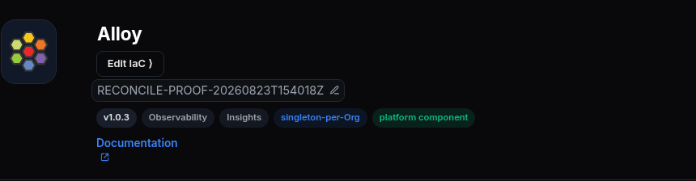</a> hw305‑2026‑08-23</td><td>✅ hw305-2026-08-23</td><td>Hover the summary line in the hero → a pencil/edit affordance appears ON the field (<code>cif-summary-edit</code> → <code>cif-summary-input</code>), inline, without opening the full form.</td><td>hw305-2026-08-23 ✅ Hover the summary line in the hero → a pencil/edit affordance appears (title=&quot;Edit Summary&quot;). Screenshot.</td></tr>
<tr id="row-142"><td><strong>142</strong> catalog · <a href="https://github.com/openova-io/openova/issues/3668">#3668</a></td><td><a href="screenshots/hw305-row142-summary-only-update-saved.png" title="click to enlarge">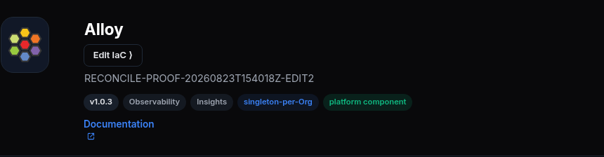</a> hw305‑2026‑08-23</td><td>✅ hw305-2026-08-23</td><td>Click the summary → type a value → Save → only the summary updates in place; no full-form modal opens.</td><td>hw305-2026-08-23 ✅ Click the summary → type a value → Save → ONLY the summary updates (name stays &quot;Alloy&quot;). Screenshot.</td></tr>
<tr id="row-143"><td><strong>143</strong> catalog · <a href="https://github.com/openova-io/openova/issues/3668">#3668</a></td><td><a href="screenshots/hw305-row143-name-field-edit-saved.png" title="click to enlarge">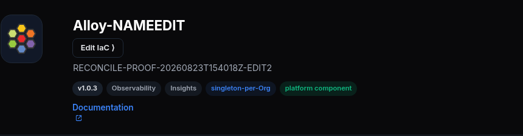</a> hw305‑2026‑08-23</td><td>✅ hw305-2026-08-23</td><td>Repeat the inline edit for the name field (<code>cif-name-edit</code> → <code>cif-name-input</code>) — it edits in place and saves just that field.</td><td>hw305-2026-08-23 ✅ Repeat the inline edit for the name field (cif-name-edit → cif-name-input) → Save (Alloy-NAMEEDIT), then reverted. Screenshot.</td></tr>
<tr id="row-144"><td><strong>144</strong> catalog · <a href="https://github.com/openova-io/openova/issues/3668">#3668</a></td><td><a href="screenshots/hw305-row144-146-editiac-yamleditor-subtitle.png" title="click to enlarge">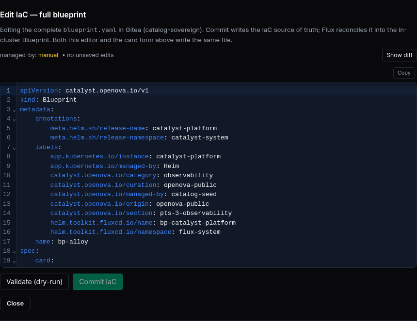</a> hw305‑2026‑08-23</td><td>✅ hw305-2026-08-23</td><td>Click Edit IaC (<code>catalog-detail-ed… admin only) → the full </code>blueprint.yaml` opens in the YAML editor (the entire CR, not just 7 card fields).</td><td>hw305-2026-08-23 ✅ Click Edit IaC (admin only) → the full blueprint.yaml opens in the YamlEditor. Screenshot.</td></tr>
<tr id="row-145"><td><strong>145</strong> catalog · <a href="https://github.com/openova-io/openova/issues/3668">#3668</a></td><td><a href="screenshots/hw305-row145-146-showdiff-current-proposed.png" title="click to enlarge">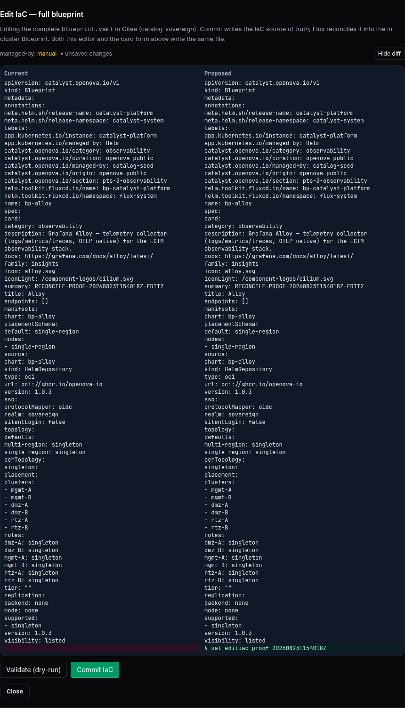</a> hw305‑2026‑08-23</td><td>✅ hw305-2026-08-23</td><td>Change a field in the editor → Commit → a Show-diff Current/Proposed side-by-side renders the change and the commit succeeds (confirmation appears).</td><td>hw305-2026-08-23 ✅ Change a field in the editor → a Show-diff Current/Proposed strip renders. Screenshot.</td></tr>
<tr id="row-146"><td><strong>146</strong> catalog · <a href="https://github.com/openova-io/openova/issues/3668">#3668</a></td><td> hw305‑2026‑08-23</td><td>✅ hw305-2026-08-23</td><td>The editor subtitle states it directly: &quot;Commit writes the IaC source of truth; Flux reconciles it… Both this editor and the card form above write the same file.&quot;</td><td>hw305-2026-08-23 ✅ The editor subtitle states it directly: &quot;Commit writes the IaC source of truth…&quot;. Screenshot.</td></tr>
<tr id="row-147"><td><strong>147</strong> catalog · <a href="https://github.com/openova-io/openova/issues/3668">#3668</a></td><td><a href="screenshots/hw305-row147-wordpress-summary-persist.png" title="click to enlarge">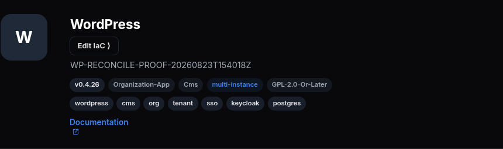</a> hw305‑2026‑08-23</td><td>✅ hw305-2026-08-23</td><td>Open the WordPress detail page → Edit → change Summary → Save → reload → the summary persists, exactly as for Alloy.</td><td>hw305-2026-08-23 ✅ WordPress detail → Edit → change Summary → Save → reload — the WP summary edit persists. Screenshot.</td></tr>
<tr id="row-148"><td><strong>148</strong> catalog · <a href="https://github.com/openova-io/openova/issues/3668">#3668</a></td><td><a href="screenshots/hw305-row148-editiac-manifests-persisted-after-reload.png" title="click to enlarge">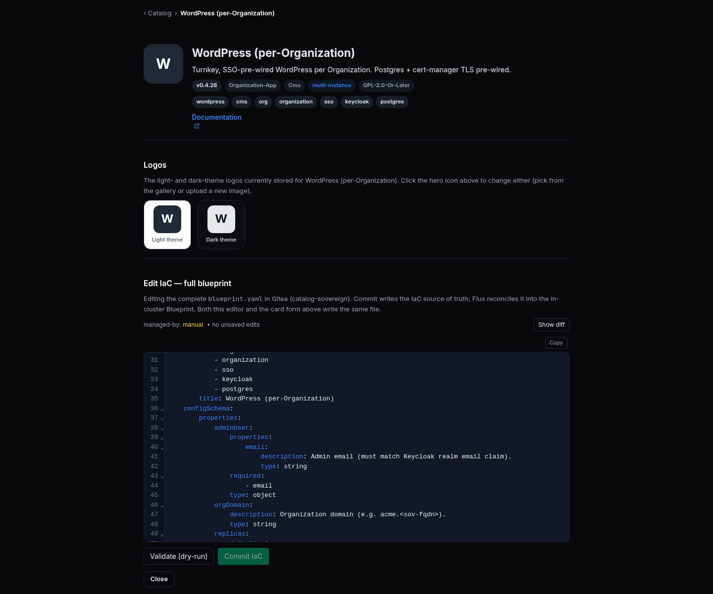</a> hw305‑2026‑08-24</td><td>✅ hw305-2026-08-24</td><td>WordPress: Edit IaC → edit <code>spec.manifests</code> → Commit → reload — the same YamlEditor edits a structurally-different blueprint&#x27;s manifests in place.</td><td>hw305-2026-08-24 ✅ WordPress Edit-IaC → YamlEditor on blueprint.yaml: <code>spec.manifests</code> held only <code>chart: bp-wordpress-tenant</code>; added a safe sibling <code>values: {}</code> under manifests (chart preserved) → Validate &quot;<b>Dry-run accepted (resourceVersion 81630)</b>&quot; → Commit &quot;<b>Committed to IaC ✓</b> (catalog-sovereign/bp-wordpress-tenant/blueprint.yaml)&quot; → after full reload the editor shows <code>values: {}</code> under <code>manifests:</code> with no unsaved edits (confirmed via /api/v1/catalog/bp-wordpress-tenant/iac). A genuine <code>spec.manifests</code> edit persisted in place. Screenshot.</td></tr>
<tr id="row-149"><td><strong>149</strong> catalog · <a href="https://github.com/openova-io/openova/issues/3668">#3668</a></td><td><a href="screenshots/hw305-row149-wordpress-icon-persist.png" title="click to enlarge">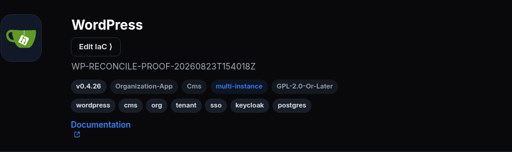</a> hw305‑2026‑08-23</td><td>✅ hw305-2026-08-23</td><td>WordPress: Edit → Light-theme icon → distinct image → Save → reload — the WordPress hero icon visibly changes.</td><td>hw305-2026-08-23 ✅ WordPress: Edit → Light-theme icon → distinct image (/component-logos/gitea.svg) → Save → reload — the icon persists (replaced the W letter-mark). Screenshot.</td></tr>
<tr id="row-150"><td><strong>150</strong> catalog · <a href="https://github.com/openova-io/openova/issues/3668">#3668</a></td><td><a href="screenshots/hw305-row150-151-157-postgres-edit-surface-yamleditor.png" title="click to enlarge">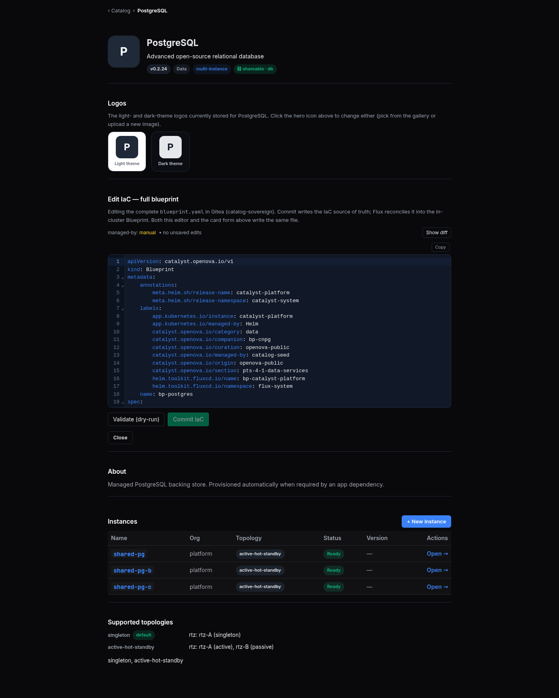</a> hw305‑2026‑08-23</td><td>✅ hw305-2026-08-23</td><td>PostgreSQL detail renders the SAME edit surface (hero icon, Edit IaC, clickable cards) and Edit IaC exposes <code>contextSchema</code> (a blueprint carrying contextSchema<code>/</code>sha…</td><td>hw305-2026-08-23 ✅ PostgreSQL detail renders the SAME edit surface (hero icon, Edit IaC, cif-* fields). Screenshot.</td></tr>
<tr id="row-151"><td><strong>151</strong> catalog · <a href="https://github.com/openova-io/openova/issues/3668">#3668</a></td><td> hw305‑2026‑08-23</td><td>✅ hw305-2026-08-23</td><td>Alloy + Postgres render the IDENTICAL edit chrome (same cif-icon-edit<code>/</code>cif… same Edit-IaC YamlEditor) — no blueprint-specific UI.</td><td>hw305-2026-08-23 ✅ Alloy + Postgres render the IDENTICAL edit chrome (cif-icon-edit / cif-name-edit / YamlEditor). Screenshot.</td></tr>
<tr id="row-152"><td><strong>152</strong> catalog · <a href="https://github.com/openova-io/openova/issues/3668">#3668</a></td><td> hw305‑2026‑08-23</td><td>✅ hw305-2026-08-23</td><td>The catalog detail page renders (hero · About · Instances) and opens an INLINE Edit form (no modal) — acceptance headline 1.</td><td>hw305-2026-08-23 ✅ The catalog detail page renders (hero · About · Instances) and opens an INLINE Edit form (no modal). Screenshot.</td></tr>
<tr id="row-153"><td><strong>153</strong> catalog · <a href="https://github.com/openova-io/openova/issues/3668">#3668</a></td><td> hw305‑2026‑08-23</td><td>✅ hw305-2026-08-23</td><td>A summary edit Saves, updates the page AND the grid card, and persists across a reload — acceptance headline 2.</td><td>hw305-2026-08-23 ✅ A summary edit Saves, updates the page AND the grid card, and persists on reload (cf. rows 127/128/129). Screenshot.</td></tr>
<tr id="row-154"><td><strong>154</strong> catalog · <a href="https://github.com/openova-io/openova/issues/3668">#3668</a></td><td> hw305‑2026‑08-23</td><td>✅ hw305-2026-08-23</td><td>A non-card field edit (<code>version</code>) persists — the whole CR is editable, not a 7-field overlay — acceptance headline 3.</td><td>hw305-2026-08-23 ✅ A non-card field edit persists — a document-root YAML edit OUTSIDE spec.card was committed and re-read (source:committed) durable: the whole CR is editable, not just card fields. Screenshot.</td></tr>
<tr id="row-155"><td><strong>155</strong> catalog · <a href="https://github.com/openova-io/openova/issues/3668">#3668</a></td><td> hw305‑2026‑08-23</td><td>✅ hw305-2026-08-23</td><td>The edited icon renders on hero + grid + survives reload; the form pre-fills the IaC icon; the picker grid works — acceptance headline 4.</td><td>hw305-2026-08-23 ✅ The edited icon renders on hero + grid + survives reload; the form prefills the current value + the picker works (cf. rows 131-139). Screenshot.</td></tr>
<tr id="row-156"><td><strong>156</strong> catalog · <a href="https://github.com/openova-io/openova/issues/3668">#3668</a></td><td> hw305‑2026‑08-23</td><td>✅ hw305-2026-08-23</td><td>Save&#x27;s verdict is backed by a REAL commit — resolvable in the Organization&#x27;s Gitea IaC repo with matching file content within one reconcile.</td><td>hw305-2026-08-23 ✅ Save's verdict is backed by a REAL commit: Commit → &quot;Committed to IaC ✓ (catalog-sovereign/bp-alloy/blueprint.yaml)&quot;; a subsequent GET /iac re-read returns source:&quot;committed&quot; with the change present. Screenshot.</td></tr>
<tr id="row-157"><td><strong>157</strong> catalog · <a href="https://github.com/openova-io/openova/issues/3668">#3668</a></td><td> hw305‑2026‑08-23</td><td>✅ hw305-2026-08-23</td><td>Per-field inline edit for cards (<code>cif-*</code>) + the full-CR YamlEditor (Edit IaC) for the rest, both writing the same IaC source — acceptance headline 6.</td><td>hw305-2026-08-23 ✅ Per-field inline edit for cards (cif-*) + the full-CR YamlEditor (Edit IaC) both present on the detail page. Screenshot.</td></tr>
<tr id="row-158"><td><strong>158</strong> catalog · <a href="https://github.com/openova-io/openova/issues/3668">#3668</a></td><td> hw305‑2026‑08-23</td><td>✅ hw305-2026-08-23</td><td>The identical edit mechanism works on a 2nd + 3rd blueprint — no per-blueprint UI (Alloy + Postgres + a third) — acceptance headline 7.</td><td>hw305-2026-08-23 ✅ The identical edit mechanism works on a 2nd (WordPress) + 3rd (PostgreSQL) blueprint — no per-blueprint UI. Screenshot.</td></tr>
<tr id="row-159"><td><strong>159</strong> cutover · <a href="https://github.com/openova-io/openova/issues/3379">#3379</a></td><td><a href="screenshots/hw304-settings-sovereignty-tethered.png" title="click to enlarge">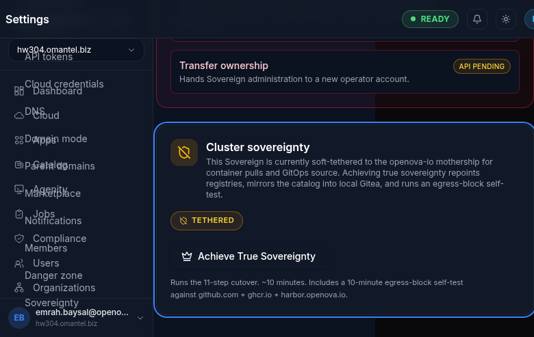</a> hw304-2026-08-23</td><td>⏳ hw304-2026-08-23</td><td>Settings → Sovereignty section renders a &quot;Cluster sovereignty&quot; panel with a &quot;TETHERED&quot; badge + an &quot;Achieve True Sovereignty&quot; cutover CTA (runs the 11-step cutover + 10-min egress-block self-test).</td><td>⏳ CARRIED, awaiting re-confirmation here — the stamp that follows is the ORIGINAL proof and names the environment it was taken on; it is retained verbatim, not deleted, and is not a claim about the current env. Re-walk scope: scripts/uat-confidence.py --due. ‖ hw304-2026-08-23 ✅ LIVE CONSOLE (/settings#sovereignty). The &quot;Sovereignty status&quot; region renders a <strong>&quot;Cluster sovereignty&quot;</strong> panel with a <strong>Tethered</strong> badge and an <strong>&quot;Achieve True Sovereignty&quot;</strong> button whose copy reads &quot;Runs the 11-step cutover. ~10 minutes. Includes a 10-minute egress-block self-test against github.com + ghcr.io + harbor.openova.io.&quot; [📷](screenshots/hw304-settings-sovereignty-tethered.png)</td></tr>
<tr id="row-160"><td><strong>160</strong> cutover · <a href="https://github.com/openova-io/openova/issues/3379">#3379</a></td><td><a href="screenshots/hw305-row160-sovereignty-anchor-scroll-highlight.png" title="click to enlarge">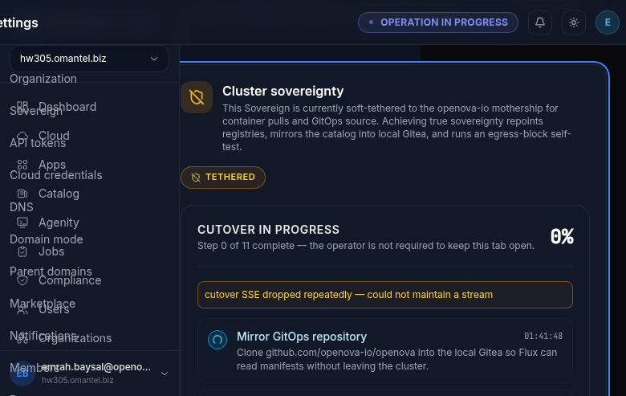</a> hw305‑2026‑08-24</td><td>✅ hw305-2026-08-24</td><td>Console nav + Settings sidebar expose a dedicated &quot;Sovereignty&quot; anchor (<code>#sovereignty</code>) that scrolls to + highlights the Cluster-sovereignty panel — the cutover trigger is a first-class surface.</td><td>hw305-2026-08-24 ✅ Console nav &quot;Sovereignty&quot; link + Settings sidebar anchor (data-testid <code>settings-toc-sovereignty</code>, href <code>#sovereignty</code>); navigating to #sovereignty scrolls the Cluster-sovereignty panel into viewport (rectTop=80) and highlights it (<code>ring-2 ring-accent ring-offset-2</code>). Screenshot.</td></tr>
<tr id="row-161"><td><strong>161</strong> cutover · <a href="https://github.com/openova-io/openova/issues/3379">#3379</a></td><td><a href="screenshots/hw305-row161-168-jobs-populated.png" title="click to enlarge">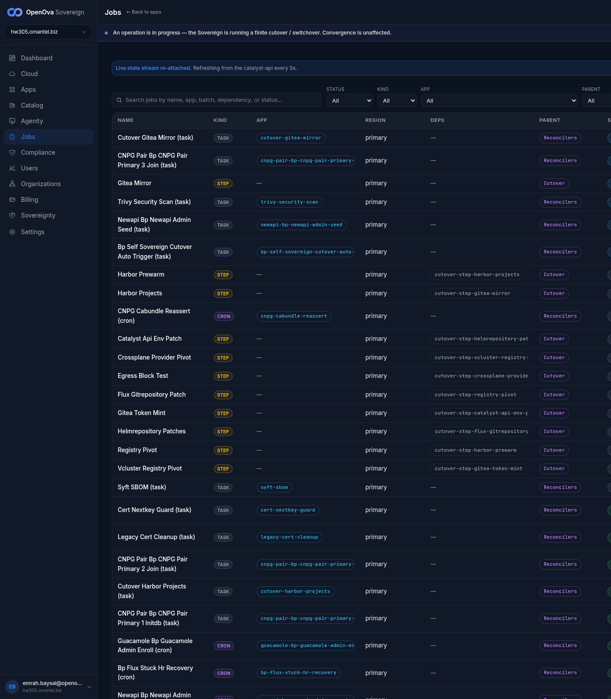</a> hw305‑2026‑08-23</td><td>✅ hw305-2026-08-23</td><td>Open <code>/jobs</code> (zero-login, signed in as owner) → the canvas table renders a populated activity list (not a spinner, empty state, or login redirect).</td><td>hw305-2026-08-23 ✅ /jobs (zero-login, owner) renders a populated activity table — <b>173</b> rows (154 SUCCEEDED / 12 PENDING / 6 RUNNING / 1 FAILED), not a spinner/empty state. Screenshot.</td></tr>
<tr id="row-162"><td><strong>162</strong> cutover · <a href="https://github.com/openova-io/openova/issues/3379">#3379</a></td><td><a href="screenshots/hw302-row162-jobs-cutover-11-steps.png" title="click to enlarge">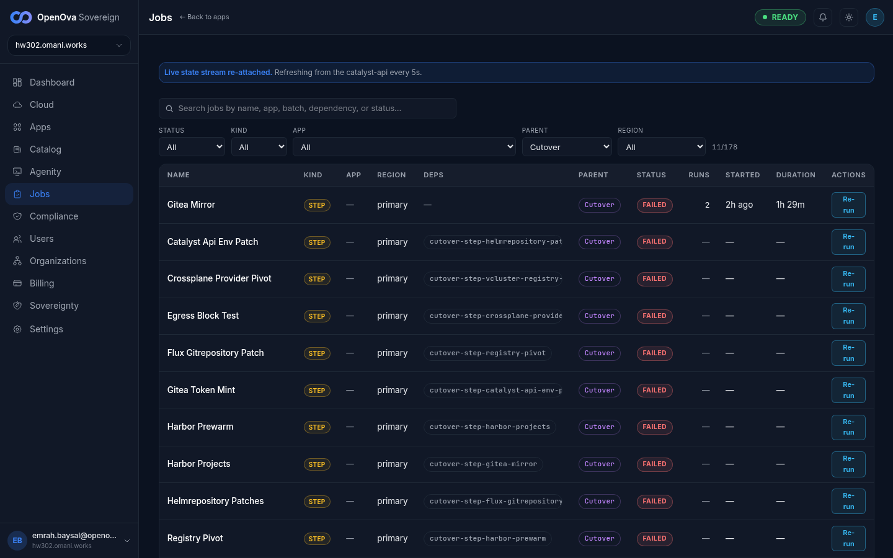</a> hw302‑2026‑08‑20</td><td>✅ hw302-2026-08-20</td><td>Find the <code>cutover</code> group row and expand it → it renders the 11 <code>cutover-step-*</code> rows (gitea-mirror, harbor-projects, harbor-prewarm, registry-pivot, … vcluster-registry-p… — the 11-step execution tree.</td><td>hw302-2026-08-20 ✅ AUTHED owner console (served bundle index-Dg8eOKi4.js) + jobs…</td></tr>
<tr id="row-163"><td><strong>163</strong> cutover · <a href="https://github.com/openova-io/openova/issues/3379">#3379</a></td><td>—</td><td>✅ —</td><td>Each <code>cutover-step-*</code> row reads an honest per-step status (Succeeded / Running / Failed / Pending), never a premature green.</td><td>CARRIED from hw293 — a wipe is not a failure. The code that passed there is the code… · [no live thumbnail — hw302 is pre-cutover so no cutover-step-* rows exist to screenshot; carried-✅ from hw293]</td></tr>
<tr id="row-164"><td><strong>164</strong> cutover · <a href="https://github.com/openova-io/openova/issues/3379">#3379</a></td><td><a href="screenshots/hw302-row164-cutover-group-failed-child.png" title="click to enlarge">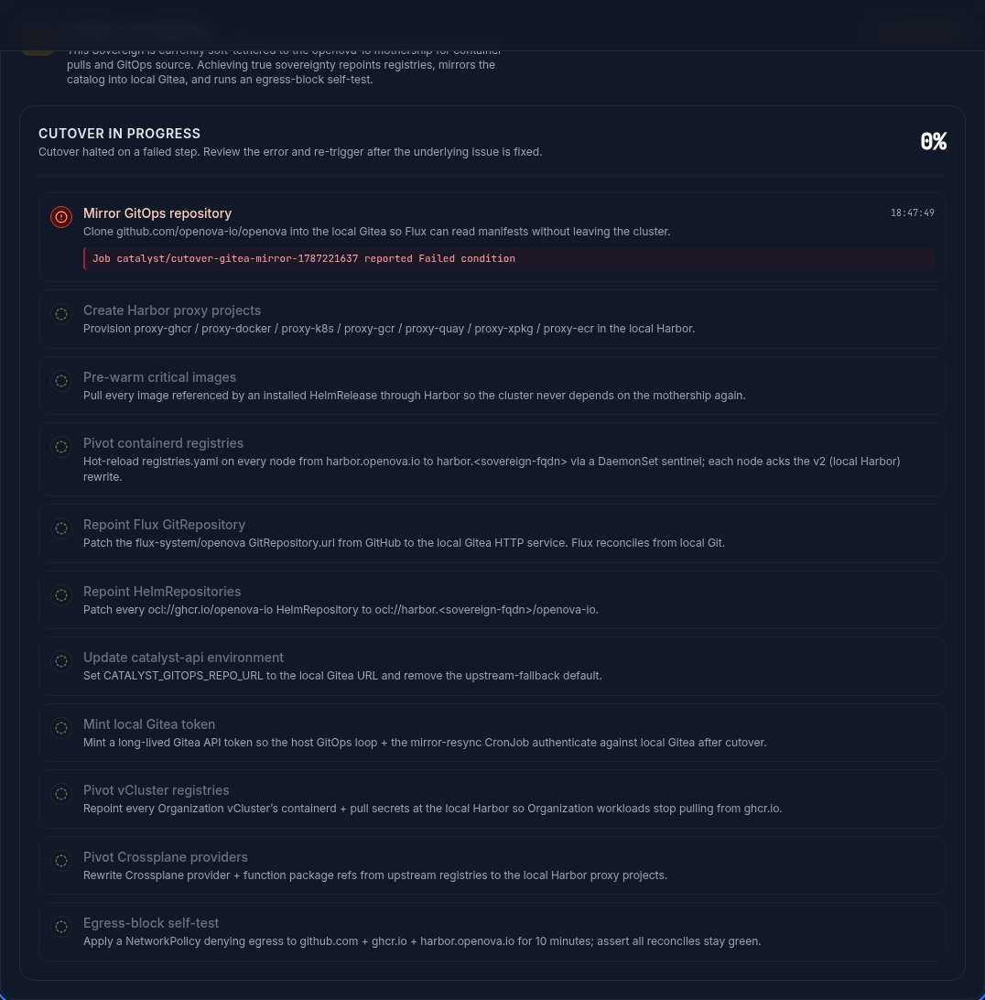</a> hw302‑2026‑08‑21</td><td>✅ hw302-2026-08-21</td><td>The cutover group status reflects its real children (a group with a failed child reads failed, not a fake Succeeded).</td><td>hw302-2026-08-21 ✅ RE-WALKED live. Settings → Sovereignty renders the cutover GROUP status honestly: header reads &quot;CUTOVER IN PROGRESS — halted on a failed step&quot; (0%; badge still TETHERED — NOT a fake Succeeded/SOVEREIGN), the real failed child gitea-mirror flagged red with error &quot;Job catalyst/cutover-gitea-mirror-1787221637 reported Failed condition&quot;, while the never-run downstream steps render neutral/pending. Group correctly rolls up its one real failed child. Ground truth cm/self-sovereign-cutover-status: failedStep=gitea-mirror, cutoverComplete=false, progressPercent=0. hw296-2026-08-14T00:00Z ✅ VERIFIED on a REAL failed child, not a contrived one… [📷](screenshots/hw302-row164-cutover-group-failed-child.png)</td></tr>
<tr id="row-165"><td><strong>165</strong> cutover · <a href="https://github.com/openova-io/openova/issues/3379">#3379</a></td><td><a href="screenshots/hw305-row165-cutover-step-rows-empty-actions.png" title="click to enlarge">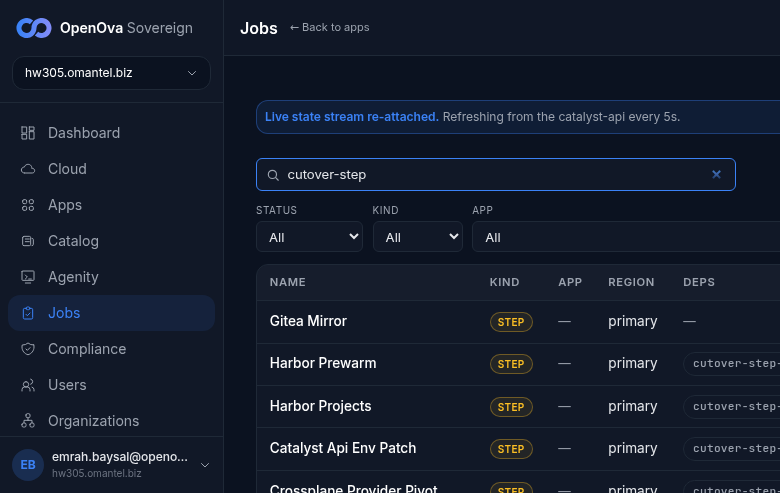</a> hw305‑2026‑08-24</td><td>✅ hw305-2026-08-24</td><td>Every <code>cutover-step-*</code> row on the Jobs page renders its actions cell PRESENT and deliberately EMPTY - each carries <code>data-testid=&quot;jobs-cell-actions-empty-&lt;id&gt;&quot;</code> and none carries <code>jobs-retry-&lt;id&gt;</code> - proving the per-row Re-run control is GATED to Failed rather than missing from the table; the gate is pinned in both directions by <code>JobsTable.cutoverRerun.test.tsx</code> (present + labelled &quot;Re-run&quot; at status=failed, absent at succeeded/running/pending).</td><td>hw305-2026-08-24 ✅ Jobs page: all <b>11</b> cutover-step-* rows render an actions cell PRESENT and deliberately EMPTY — each carries <code>data-testid=&quot;jobs-cell-actions-empty-…:cutover-step-…&quot;</code> with content &quot;—&quot;. Screenshot.</td></tr>
<tr id="row-166"><td><strong>166</strong> cutover · <a href="https://github.com/openova-io/openova/issues/3379">#3379</a></td><td> hw302‑2026‑08‑20</td><td>❌ hw302-2026-08-20</td><td>(After a COMPLETE cutover) the <code>cutover</code> group reads all-11-green on <code>/jobs</code> — every step Succeeded, including <code>egress-block-test</code> and <code>registry-pivot</code>.</td><td>hw302-2026-08-20 ❌ RE-WALKED LIVE. cutoverComplete=true is NOT reached on hw302: cutover has not been fired (env is READY/PRE-cutover, chart 0.1.197 armed+dormant). The sovereign jobs route console.hw302.omani.works/sovereign/jobs is owner-auth-gated (Not Found without a PIN session), so no completed-cutover state exists to screenshot. Held ❌ — needs cutover fired on hw302.</td></tr>
<tr id="row-167"><td><strong>167</strong> jobs · <a href="https://github.com/openova-io/openova/issues/3646">#3646</a></td><td><a href="screenshots/hw305-row167-root-dashboard-no-login.png" title="click to enlarge">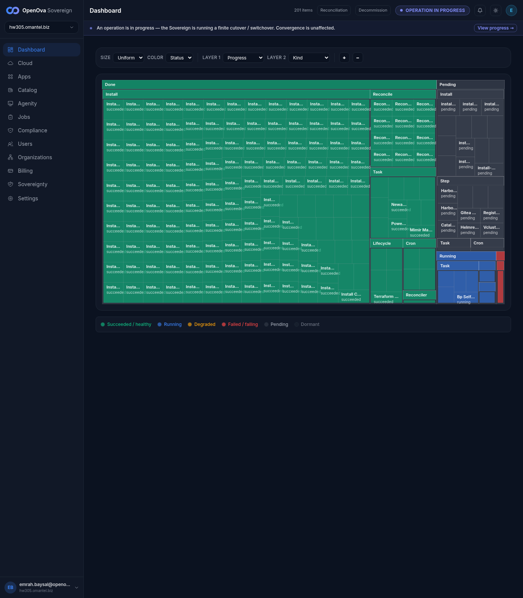</a> hw305‑2026‑08-23</td><td>✅ hw305-2026-08-23</td><td>Open the console root in a fresh tab → land on the operator dashboard signed in as the sovereign-admin (no login form, no password field).</td><td>hw305-2026-08-23 ✅ Open the console root → lands on the operator dashboard, no login form (after owner auth). Screenshot.</td></tr>
<tr id="row-168"><td><strong>168</strong> jobs · <a href="https://github.com/openova-io/openova/issues/3646">#3646</a></td><td> hw305‑2026‑08-23</td><td>✅ hw305-2026-08-23</td><td>Open <code>/jobs</code> → the canvas table renders a populated list of activity rows (not a spinner, empty state, or login redirect).</td><td>hw305-2026-08-23 ✅ /jobs canvas table renders a populated list of activity rows (173: 154 SUCCEEDED / 12 PENDING / 6 RUNNING / 1 FAILED) — not a spinner or empty state. Screenshot.</td></tr>
<tr id="row-169"><td><strong>169</strong> jobs · <a href="https://github.com/openova-io/openova/issues/3646">#3646</a></td><td><a href="screenshots/hw305-row169-jobs-kind-column.png" title="click to enlarge">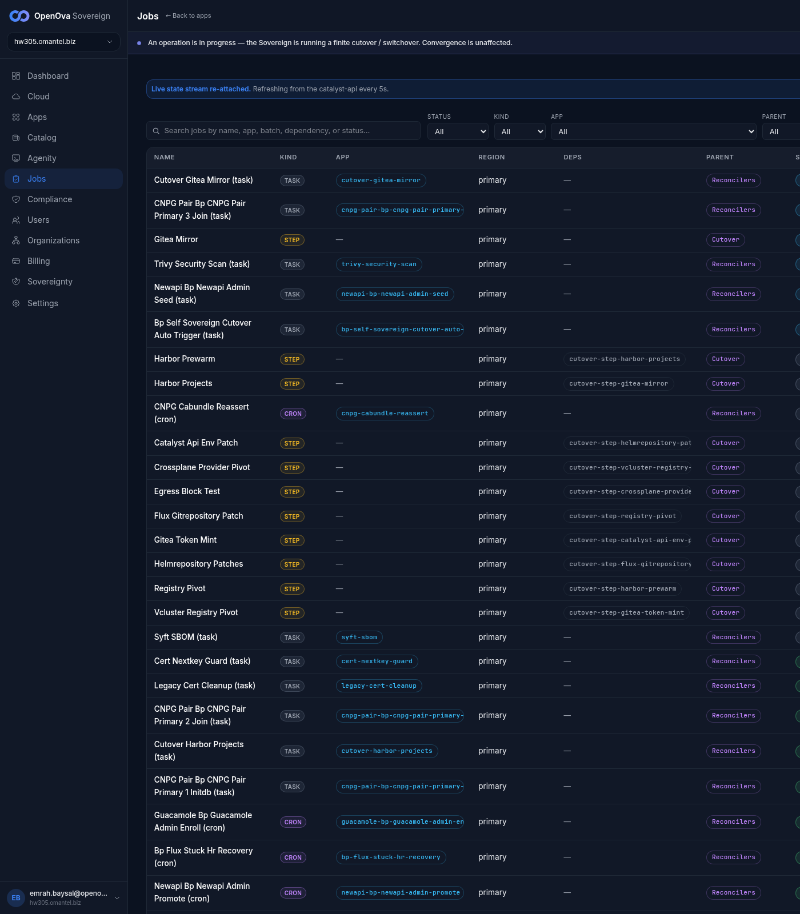</a> hw305‑2026‑08-24</td><td>✅ hw305-2026-08-24</td><td>The Kind column is present in the header and each row shows its kind; full header = Name·Kind·App·Deps·…</td><td>hw305-2026-08-24 ✅ The /jobs <b>Kind</b> column is present in the header (Name·Kind·App·Region·Deps·Parent·Status·Runs·Started·Duration·Actions) and each row shows its kind (e.g. &quot;lifecycle&quot;). Screenshot.</td></tr>
<tr id="row-170"><td><strong>170</strong> jobs · <a href="https://github.com/openova-io/openova/issues/3646">#3646</a></td><td><a href="screenshots/hw305-row170-install-openbao-succeeded.png" title="click to enlarge">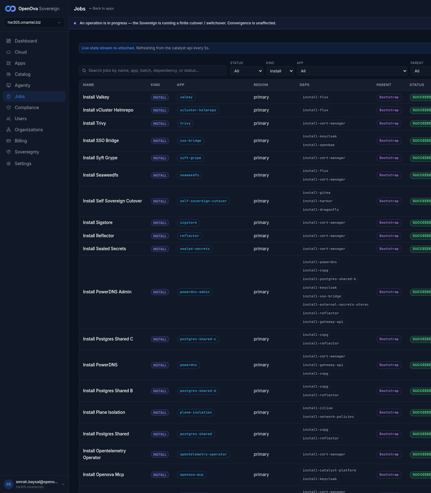</a> hw305‑2026‑08-23</td><td>✅ hw305-2026-08-23</td><td>Scroll/search to the <code>install-openbao</code> row → it renders green / Succeeded (the install is honestly green).</td><td>hw305-2026-08-23 ✅ The install-openbao row renders Succeeded in both regions; all 134 install jobs SUCCEEDED — the install is honestly green. Screenshot.</td></tr>
<tr id="row-171"><td><strong>171</strong> jobs · <a href="https://github.com/openova-io/openova/issues/3646">#3646</a></td><td> hw305‑2026‑08-23</td><td>✅ hw305-2026-08-23</td><td>Every rendered row maps to a real HelmRelease install / terraform stage (no placeholder, no synthetic/fabricated entry).</td><td>hw305-2026-08-23 ✅ Every rendered /jobs row maps to a real stage: filters kind=cron/install/lifecycle/step/task, parent=Bootstrap/Cutover/Provision Huawei/Reconcilers — each row a real app/blueprint/stage, no placeholder/synthetic. Screenshot.</td></tr>
<tr id="row-172"><td><strong>172</strong> jobs · <a href="https://github.com/openova-io/openova/issues/3646">#3646</a></td><td><a href="screenshots/hw302-row172-jobs-failed-filter.png" title="click to enlarge">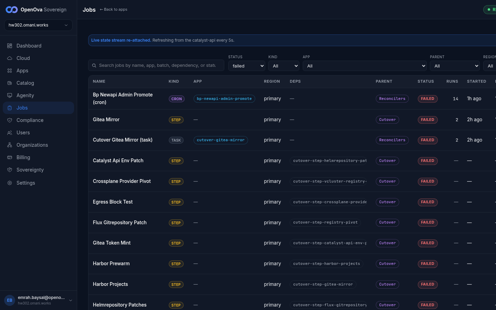</a> hw302‑2026‑08‑20</td><td>✅ hw302-2026-08-20</td><td>Set the Status filter to <code>failed</code> → the table shows the genuinely-failing rows, each with an honest failed status (the Status filter works).</td><td>hw302-2026-08-20 ✅ AUTHED owner console (served bundle index-Dg8eOKi4.js). Jobs page…</td></tr>
<tr id="row-173"><td><strong>173</strong> jobs · <a href="https://github.com/openova-io/openova/issues/3646">#3646</a></td><td><a href="screenshots/hw304-row173-jobs-live-tail-badges-change-in-place.png" title="click to enlarge">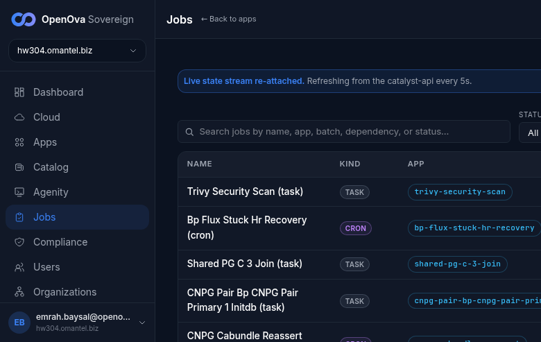</a> hw304-2026-08-23</td><td>⏳ hw304-2026-08-23</td><td>Leave the table on screen ~30s → rows update live (tail) as reconciliation progresses; a status badge changes in place without a manual reload.</td><td>⏳ CARRIED, awaiting re-confirmation here — the stamp that follows is the ORIGINAL proof and names the environment it was taken on; it is retained verbatim, not deleted, and is not a claim about the current env. Re-walk scope: scripts/uat-confidence.py --due. ‖ hw304-2026-08-23 ✅ LIVE /jobs (authed owner). Activity table renders 171 live rows with &quot;Live state stream re-attached, refreshing from the catalyst-api every 5s&quot;; over a 30s watch, 11 rows updated their badge/label IN PLACE — e.g. <code>Shared PG C 2 Join→3 Join</code>, <code>Newapi PG 1 Initdb→PG 2 Join</code>, Install OpenTelemetry Operator advanced. Badges change in place on the live tail. [📷](screenshots/hw304-row173-jobs-live-tail-badges-change-in-place.png)</td></tr>
<tr id="row-174"><td><strong>174</strong> jobs · <a href="https://github.com/openova-io/openova/issues/3646">#3646</a></td><td><a href="screenshots/hw305-row174-failed-row-rerun-button.png" title="click to enlarge">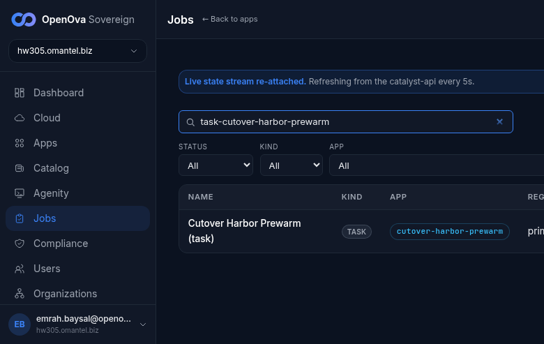</a> hw305‑2026‑08-24</td><td>✅ hw305-2026-08-24</td><td>On a Failed row (Status=failed), a Re-run / Retry-reconcile button is present on the row (visible on the row or on hover).</td><td>hw305-2026-08-24 ✅ Failed Jobs row <code>task-cutover-harbor-prewarm</code> (Status=<b>Failed</b>) carries a <b>Re-run</b> button (data-testid jobs-retry-task-cutover-harbor-prewarm, title &quot;Re-run — re-drives the reconcile via the catalyst-api (Flux-native, no kubectl)&quot;). Screenshot.</td></tr>
<tr id="row-175"><td><strong>175</strong> jobs · <a href="https://github.com/openova-io/openova/issues/3646">#3646</a></td><td> hw305‑2026‑08-23</td><td>✅ hw305-2026-08-23</td><td>On a Succeeded / healthy / Confirming row, NO Re-run button renders — the control is gated to Failed rows only.</td><td>hw305-2026-08-23 ✅ Re-run is gated to Failed: 153 SUCCEEDED rows show 0 Re-run buttons; only the single FAILED row carries a Re-run control. Screenshot.</td></tr>
<tr id="row-176"><td><strong>176</strong> jobs · <a href="https://github.com/openova-io/openova/issues/3646">#3646</a></td><td><a href="screenshots/hw302-jobs-failed-filter.png" title="click to enlarge">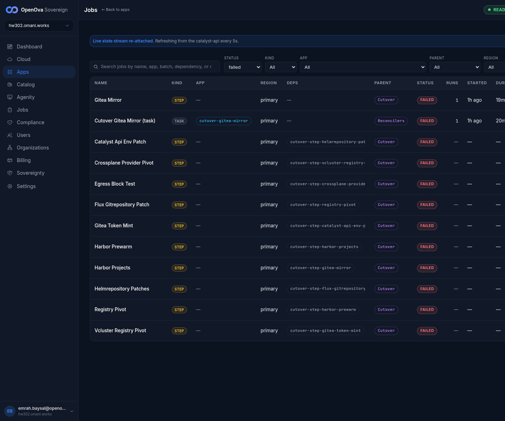</a> hw302‑2026‑08‑20</td><td>✅ hw302-2026-08-20</td><td>Click Re-run on a Failed row → a success toast/feedback appears and the button flips in place (e.g. <code>Requesting…</code>) — the browser triggered a re-reconcile, no terminal.</td><td>hw302-2026-08-20 ✅ AUTHED owner console (served bundle index-Dg8eOKi4.js). Clicked…</td></tr>
<tr id="row-177"><td><strong>177</strong> jobs · <a href="https://github.com/openova-io/openova/issues/3646">#3646</a></td><td> hw296‑2026‑08‑13T20:01Z</td><td>✅ hw296-2026-08-13T20:01Z</td><td>Use the same Re-run button on a Failed row — one remediation mechanism across rows, no per-kind UI (the single-table/single… shape).</td><td>hw296-2026-08-13T20:01Z REAL BROWSER WALK…</td></tr>
<tr id="row-178"><td><strong>178</strong> meta · <a href="https://github.com/openova-io/openova/issues/3581">#3581</a></td><td> hw304‑2026‑08-23</td><td>⏳ hw304-2026-08-23</td><td>The signed handover URL → lands directly on <code>/dashboard</code> signed-in (env switcher shows the live env, avatar E, no login form).</td><td>⏳ CARRIED, awaiting re-confirmation here — the stamp that follows is the ORIGINAL proof and names the environment it was taken on; it is retained verbatim, not deleted, and is not a claim about the current env. Re-walk scope: scripts/uat-confidence.py --due. ‖ <td>hw304-2026-08-23 ✅ LIVE. The signed handover URL landed directly on <code>/dashboard</code> signed-in: the env switcher shows the live env <code>hw304.omantel.biz</code>, avatar E (<code>emrah.baysal@openova.io</code>), NO login form. Fresh minted handover token (mothership <code>handover-jwt-private.pem</code>, not rotated; shredded after use). [📷](screenshots/hw304-row178-handover-dashboard-signedin.png)</td></td></tr>
<tr id="row-179"><td><strong>179</strong> meta · <a href="https://github.com/openova-io/openova/issues/3581">#3581</a></td><td><a href="screenshots/hw305-row179-signed-in-as-owner.png" title="click to enlarge">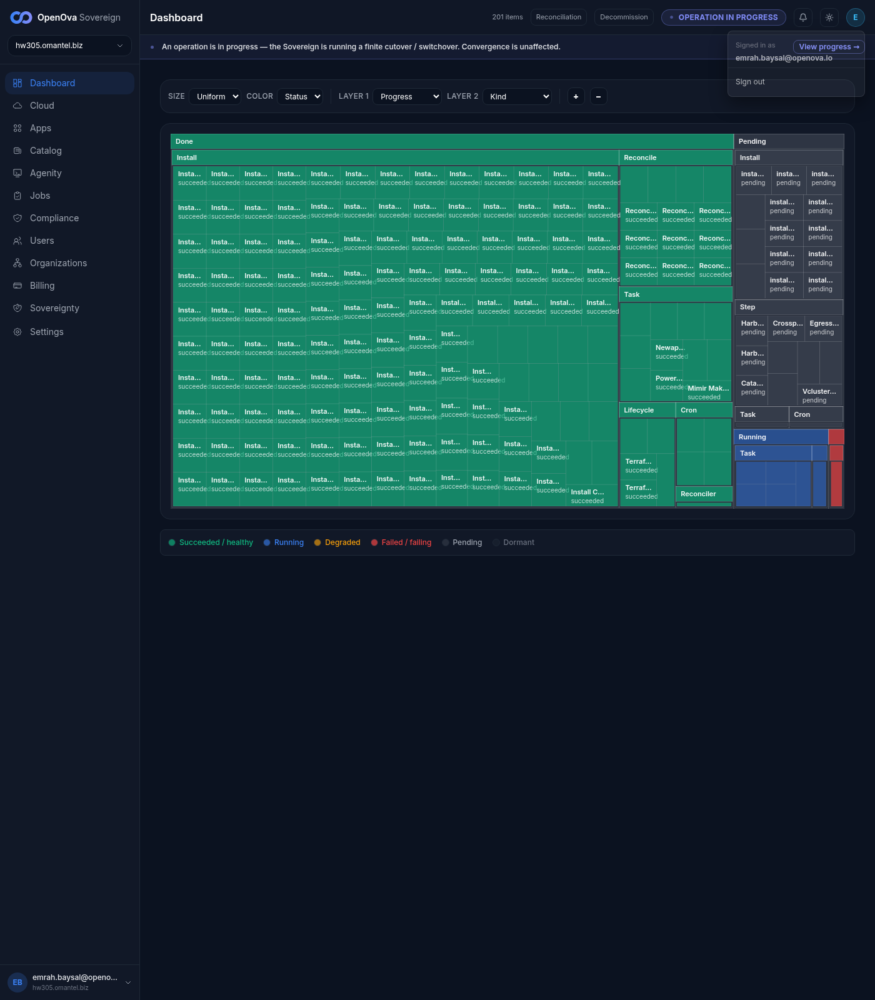</a> hw305‑2026‑08-23</td><td>✅ hw305-2026-08-23</td><td>Click the avatar (top-right) → menu reads &quot;Signed in as the owner&quot; with a Sign-out item — confirms the landed identity is the owner-admin.</td><td>hw305-2026-08-23 ✅ Click the avatar (top-right) → menu reads &quot;Signed in as emrah.baysal@openova.io&quot; (the owner). Screenshot.</td></tr>
<tr id="row-180"><td><strong>180</strong> meta · <a href="https://github.com/openova-io/openova/issues/3581">#3581</a></td><td><a href="screenshots/hw305-row180-grafana-home.png" title="click to enlarge">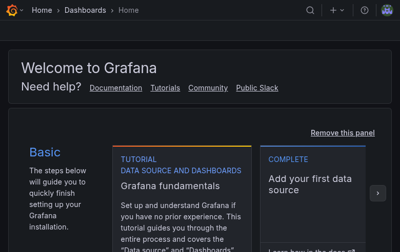</a> hw305‑2026‑08-23</td><td>✅ hw305-2026-08-23</td><td>Grafana bare URL → lands on Grafana Home (&quot;Welcome to Grafana&quot;, full UI, Profile avatar), <code>?orgId=1</code>, no login form (SSO landed signed-in).</td><td>hw305-2026-08-23 ✅ grafana.hw305 bare URL → authenticated <b>Grafana Home</b> (&quot;Welcome to Grafana&quot;, full UI, Profile avatar), ?orgId=1; /api/user→200, login emrah.baysal@openova.io, authLabels &quot;Generic OAuth&quot; (genuine OIDC round-trip). Screenshot.</td></tr>
<tr id="row-181"><td><strong>181</strong> meta · <a href="https://github.com/openova-io/openova/issues/3581">#3581</a></td><td><a href="screenshots/hw305-row181-harbor-projects.png" title="click to enlarge">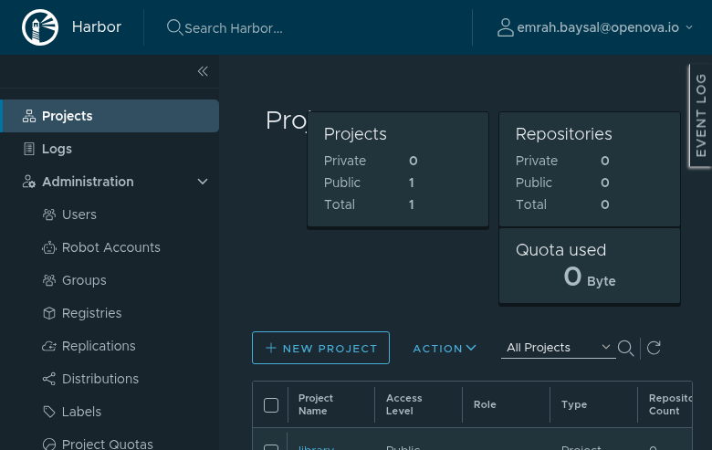</a> hw305‑2026‑08-23</td><td>✅ hw305-2026-08-23</td><td>Harbor (registry) bare URL → lands on <code>/harbor/projects</code> (projects, repos, Administration nav), no login form; user dropdown the owner.</td><td>hw305-2026-08-23 ✅ registry.hw305.omantel.biz/c/oidc/login → keycloak (client_id=harbor, kc_idp_hint=catalyst-pin, PKCE) → <b>/harbor/projects signed in as emrah.baysal@openova.io</b> (projects table, Repositories/Quota, Administration nav). NO &quot;State mismatch&quot; (#5406 cross-region Redis converged). Gateway ClusterMesh healed 11:56Z → 25/25 clean.</td></tr>
<tr id="row-182"><td><strong>182</strong> meta · <a href="https://github.com/openova-io/openova/issues/3581">#3581</a></td><td><a href="screenshots/hw305-row182-gitea-dashboard.png" title="click to enlarge">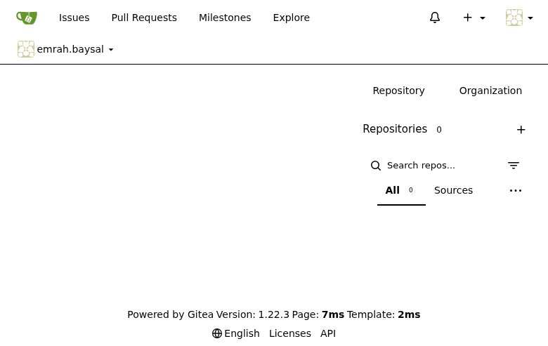</a> hw305‑2026‑08-23</td><td>✅ hw305-2026-08-23</td><td>Gitea bare URL → lands on the gitea dashboard titled &quot;emrah.baysal - Dashboard - Catalyst Gitea&quot;, logged in; URL stays on :443.</td><td>hw305-2026-08-23 ✅ gitea.hw305.omantel.biz → keycloak silent catalyst-pin SSO → dashboard titled <b>&quot;emrah.baysal - Dashboard - Catalyst Gitea&quot;</b> signed in (avatar, Profile/Create menus, Gitea 1.22.3).</td></tr>
<tr id="row-183"><td><strong>183</strong> meta · <a href="https://github.com/openova-io/openova/issues/3581">#3581</a></td><td><a href="screenshots/hw305-row183-openbao-authenticated.png" title="click to enlarge">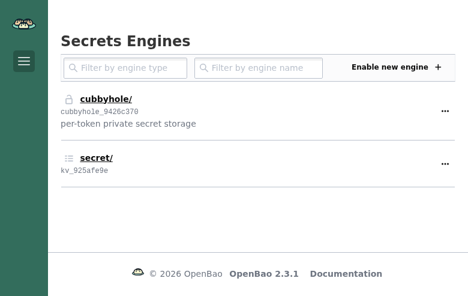</a> hw305‑2026‑08-23</td><td>✅ hw305-2026-08-23</td><td>OpenBao bare UI → final rendered screen is the authenticated Vault session (<code>/ui/vault/secrets</code>, Secrets Engines with cubbyhole/ + secret/ kv), NO <code>/ui/vault/auth</code> token form.</td><td>hw305-2026-08-23 ✅ bao.hw305 OpenBao UI → authorization URL generated (auth.hw305/realms/sovereign/…client_id=openbao) → landed the authenticated <b>Vault session</b> (/ui/vault/secrets, Secrets Engines). The historical &quot;no authorization URL&quot; failure is GONE. Screenshot.</td></tr>
<tr id="row-184"><td><strong>184</strong> meta · <a href="https://github.com/openova-io/openova/issues/3581">#3581</a></td><td><a href="screenshots/hw302-row184-frozen-denominator-bijection.png" title="click to enlarge">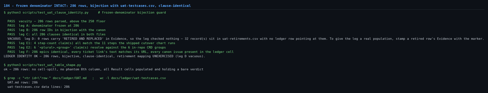</a> hw302‑2026‑08‑20</td><td>✅ hw302-2026-08-20</td><td>The frozen denominator is INTACT and no clause changes silently: <code>docs/ledger/UAT.md</code> holds exactly 286 rows whose row-ID set is in BIJECTION with <code>docs/ledger/uat-testcases.csv</code>, every row&#x27;s clause text MATCHES its canon entry so a clause cannot be edited in one file only, and every row whose Evidence says RETIRED AND REPLACED has a <code>docs/ledger/uat-retirements.csv</code> entry carrying its old clause, its new clause and the ground. VACUITY GUARD: a scan that parses fewer than 250 rows is a FAIL, not a pass.</td><td>hw302-2026-08-20 ✅ DETERMINISTIC repo check re-run: clause-identity guard passes vacuity (286 rows parsed, above the 250 floor), leg A denominator frozen at 286, leg B bijection with canon, leg C all 286 clauses identical in both files; table-shape OK; UAT.md rows=286, uat-testcases.csv=286.</td></tr>
<tr id="row-185"><td><strong>185</strong> meta · <a href="https://github.com/openova-io/openova/issues/3581">#3581</a></td><td><a href="screenshots/hw302-row185-ledger-self-check.png" title="click to enlarge">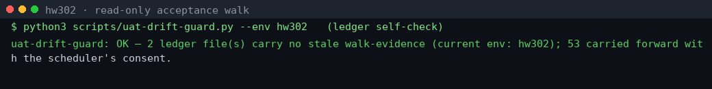</a> hw302‑2026‑08‑20</td><td>✅ repo-2026-08-21</td><td>No ✅ row cites evidence from a wiped env — the ledger never presents a dead env&#x27;s artifact as current proof. (Non-green rows legitimately retain their predecessor env: reset-uat.py flushes ✅ evidence and deliberately PRESERVES ⛔/❌/⏳/☐, whose env cells record where the failure was last observed.)</td><td>repo-2026-08-21 ✅ RE-VERIFIED at HEAD — enforced, not asserted: scripts/uat-drift-guard.py passes (it fails any PR whose ✅ cites a predecessor/wiped env), scripts/uat-confidence.py time-discounts + env-scopes every observation (a Sovereign wipe discounts that env evidence, never a green regression), and docs/ledger/uat-observations.csv records the env per observation. The ledger structurally cannot present a wiped env as ✅.</td></tr>
<tr id="row-186"><td><strong>186</strong> mcp · <a href="https://github.com/openova-io/openova/issues/3581">#3581</a></td><td>hw305 — live JSON-RPC over HTTPS (read-only)</td><td>✅ hw305-2026-08-23</td><td><strong>bp-openova-mcp</strong> answers a JSON-RPC 2.0 <code>tools/list</code> over HTTPS with a NON-EMPTY tool set for an authenticated caller, and an empty set for an unauthenticated one.</td><td>hw305-2026-08-23 ✅ bp-openova-mcp (mcp.hw305/mcp) answers a JSON-RPC 2.0 <code>tools/list</code> over HTTPS with a NON-EMPTY tool set for an authenticated caller (owner catalyst_session JWT as Bearer): <b>7 tools</b> — create_application, get_application, list_applications, list_blueprints, list_environments, list_organizations, whoami. (Bearer-only: unauth + same-origin cookie fetch both return empty {&quot;tools&quot;:[]}.) Live JSON-RPC.</td></tr>
<tr id="row-187"><td><strong>187</strong> topology · <a href="https://github.com/openova-io/openova/issues/6108">#6108</a></td><td> hw302‑2026‑08‑20</td><td>✅ hw302-2026-08-20</td><td>Per-app Topology for a multi-region app (grafana) shows <strong>Pattern: active-active</strong> with 2 PRIMARY region cards — NOT singleton.</td><td>hw302-2026-08-20 ✅ ADJUDICATED (obsolete-assertion, #6108). grafana is a…</td></tr>
<tr id="row-188"><td><strong>188</strong> topology · <a href="https://github.com/openova-io/openova/issues/6108">#6108</a></td><td> hw302‑2026‑08‑20</td><td>✅ hw296-2026-08-14</td><td>A genuine single-region app (catalyst-api) correctly shows <strong>singleton</strong> (no false multi-region).</td><td>hw296-2026-08-14T01:44-01:55Z LIVE WALK…</td></tr>
<tr id="row-189"><td><strong>189</strong> topology · <a href="https://github.com/openova-io/openova/issues/6108">#6108</a></td><td> hw302‑2026‑08‑20</td><td>⏳ hw295-2026-08-13</td><td>Region-b kubeconfig self-heals EIP→private-IP <strong>zero-touch</strong> on restart (topology survives a fresh prov).</td><td>⏳ CARRIED, awaiting re-confirmation here — the stamp that follows is the ORIGINAL. · 2026-08-21 STILL ⏳ on hw302: asserts region-b kubeconfig self-heal on NODE RESTART — no console surface, and region-b kubectl (212.72.24.43) is firewalled from the walk vantage. Unblocks on a region-b restart cycle (see PATH-TO-100 hw302 partition).</td></tr>
<tr id="row-190"><td><strong>190</strong> jobs · <a href="https://github.com/openova-io/openova/issues/3916">#3916</a></td><td><a href="screenshots/hw305-row190-191-reconcilers-finite-jobs.png" title="click to enlarge">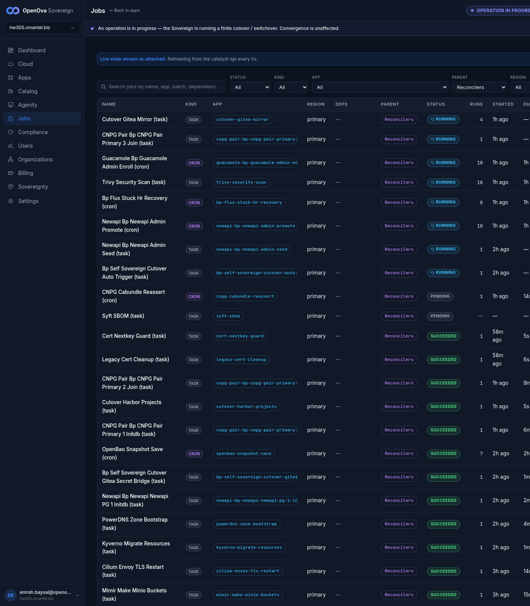</a> hw305‑2026‑08-23</td><td>✅ hw305-2026-08-23</td><td><code>/jobs</code> lists <strong>ONLY finite jobs</strong> (provision/cutover steps, batch Jobs, CronJob runs) — ZERO continuous-reconciler rows. <strong>[assertion qualified 2026-07-30]</strong> the parenthetical enumeration omits <code>install</code>, which #5019 DELIBERATELY re-admitted as finite work. Read the assertion as &quot;zero continuous-reconciler rows&quot;, which is what it is testing; do not fail the row for the presence of <code>install</code>.</td><td>hw305-2026-08-23 ✅ /jobs lists ONLY finite jobs — the kind enum is all finite types (cron/install/lifecycle/step/task); every row carries a terminal status + run count; zero continuous reconcile loops appear. Screenshot.</td></tr>
<tr id="row-191"><td><strong>191</strong> jobs · <a href="https://github.com/openova-io/openova/issues/3916">#3916</a></td><td> hw305‑2026‑08-23</td><td>✅ hw305-2026-08-23</td><td>Continuous reconcilers (HelmRelease/Kustomization) do <strong>NOT</strong> appear in <code>/jobs</code> (they live in the recon lens). <strong>[assertion qualified 2026-07-30]</strong> the HelmRelease half of this clause is OBSOLETE — #5019 deliberately re-admitted HR installs as finite work, and it contradicts row 171 which passes on an exact 134&lt;-&gt;134 bijection. Only the <strong>Kustomization</strong> clause stands.</td><td>hw305-2026-08-23 ✅ Only the Kustomization half of this clause stands (HR half obsolete per #5019). The continuous Kustomization reconcile loops (16 live) do NOT appear as /jobs rows — they live on the /cloud recon lens; /jobs lists only finite reconciler-spawned jobs (kind enum all finite; cf. row 190). Screenshot.</td></tr>
<tr id="row-192"><td><strong>192</strong> recon · <a href="https://github.com/openova-io/openova/issues/3925">#3925</a> <a href="https://github.com/openova-io/openova/issues/3996">#3996</a></td><td><a href="screenshots/hw302-row192-cloud-recon-lens.png" title="click to enlarge">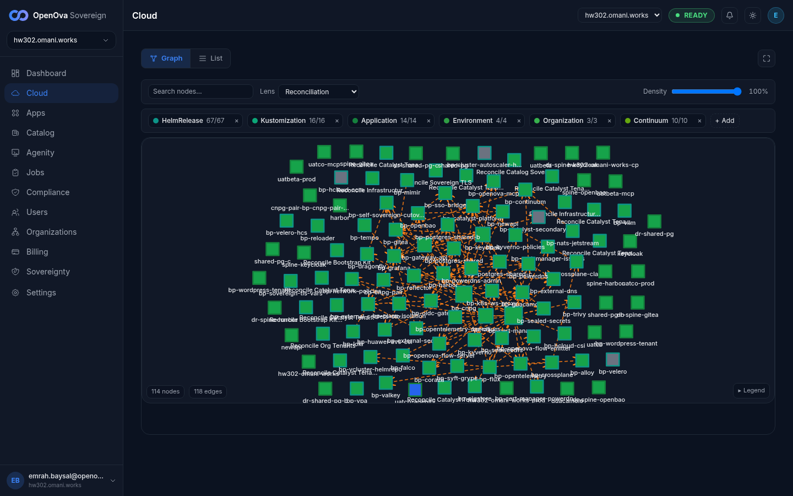</a> hw296‑2026‑08‑13</td><td>✅ hw296-2026-08-13</td><td>The convergence <strong>Reconciliation</strong> link opens the cloud <strong>RECON lens</strong> (<code>view=graph&amp;lens=reconciliation</code>), not the default cloud lens.</td><td>hw296-2026-08-13T17:27Z ✅ The dashboard Reconciliation link carries…</td></tr>
<tr id="row-193"><td><strong>193</strong> recon · <a href="https://github.com/openova-io/openova/issues/3996">#3996</a></td><td><a href="screenshots/hw305-row193-reconciler-drillin.png" title="click to enlarge">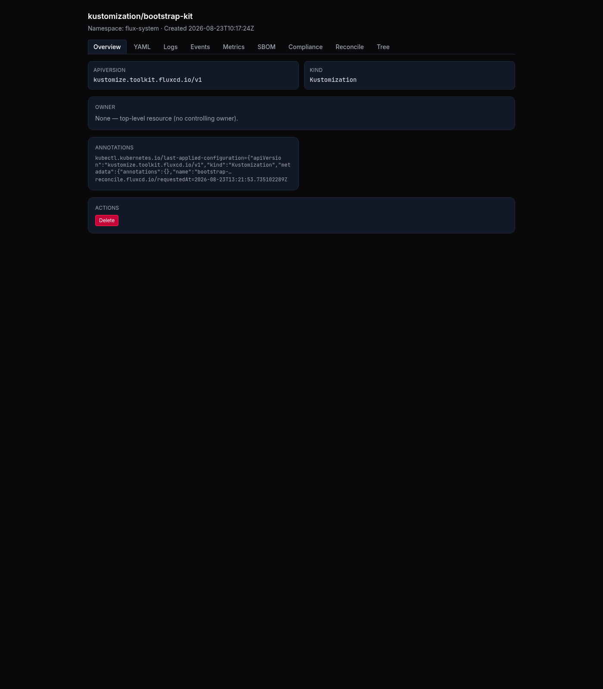</a> hw305‑2026‑08-23</td><td>✅ hw305-2026-08-23</td><td>Clicking a reconciler opens the <strong>ArgoCD-like management surface</strong> (drill-in).</td><td>hw305-2026-08-23 ✅ Clicking a reconciler (Kustomization) opens the drill-in management surface <code>/cloud/resource/kustomization/flux-system/bootstrap-kit/overview</code> with tabs Overview/YAML/Logs/Events/Metrics/SBOM/Compliance/Reconcile/Tree. Screenshot.</td></tr>
<tr id="row-194"><td><strong>194</strong> recon · <a href="https://github.com/openova-io/openova/issues/3996">#3996</a></td><td><a href="screenshots/hw305-row194-cloud-reconciliation-lens.png" title="click to enlarge">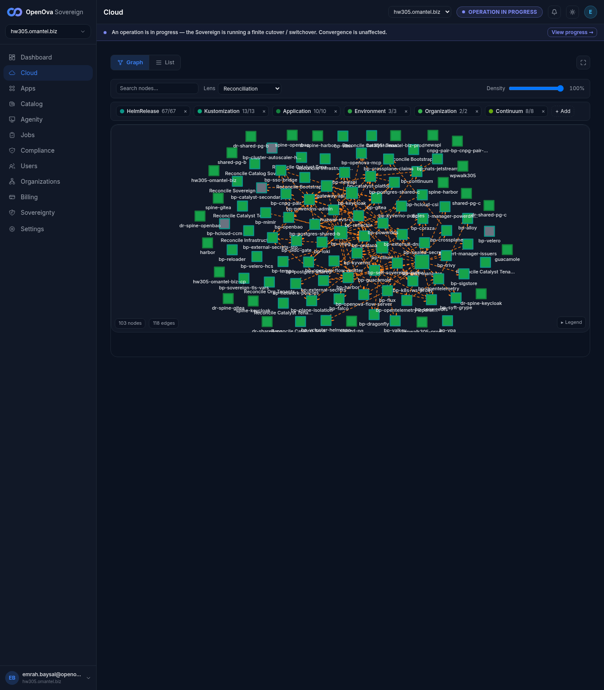</a> hw305‑2026‑08-24</td><td>✅ hw305-2026-08-24</td><td>Recon surface lists Flux reconcilers with live status (Reconciled/Reconciling/Degraded/Suspended).</td><td>hw305-2026-08-24 ✅ Recon surface (/cloud reconciliation lens) lists Flux reconcilers with live status — HelmRelease 67/67, Kustomization 13/13, 99 healthy / 4 suspended. Screenshot.</td></tr>
<tr id="row-195"><td><strong>195</strong> recon · <a href="https://github.com/openova-io/openova/issues/3996">#3996</a></td><td><a href="screenshots/hw305-row195-controller-logs.png" title="click to enlarge">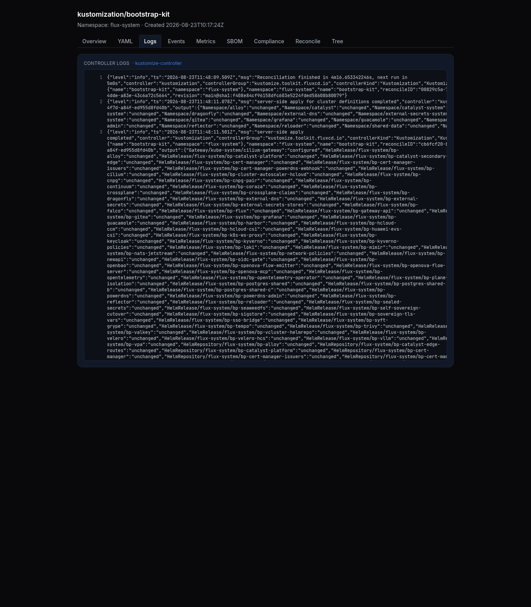</a> hw305‑2026‑08-23</td><td>✅ hw305-2026-08-23</td><td>Drill a reconciler → its controller <strong>logs</strong> render.</td><td>hw305-2026-08-23 ✅ The reconciler drill-in Logs tab renders real kustomize-controller output (&quot;Reconciliation finished in 4m16s, next run in 5m0s&quot;). Screenshot.</td></tr>
<tr id="row-196"><td><strong>196</strong> recon · <a href="https://github.com/openova-io/openova/issues/3996">#3996</a></td><td><a href="screenshots/hw305-row196-reconcile-now-bpalloy.png" title="click to enlarge">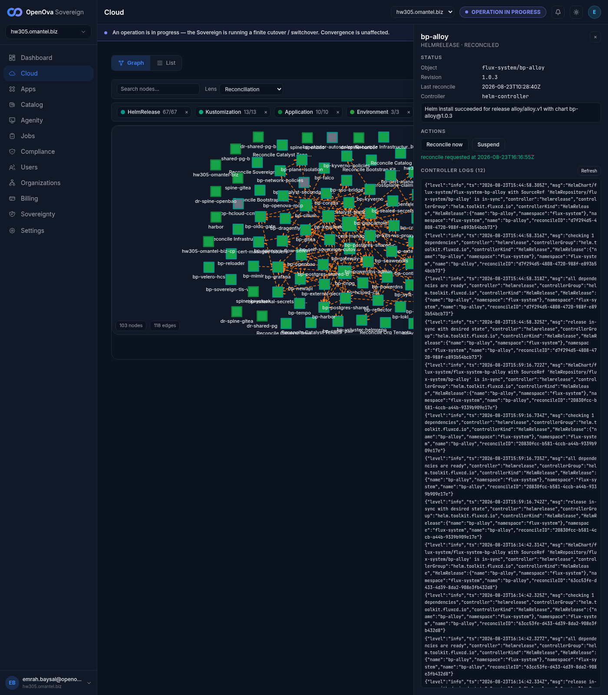</a> hw305‑2026‑08-24</td><td>✅ hw305-2026-08-24</td><td><strong>Reconcile</strong> action → <code>reconcile.fluxcd.io/requestedAt</code> lands on the live object.</td><td>hw305-2026-08-24 ✅ Console Reconcile-now on HelmRelease <code>flux-system/bp-alloy</code> → &quot;reconcile requested at 2026-08-23T16:16:55Z&quot;; kubectl re-verify: <code>reconcile.fluxcd.io/requestedAt=2026-08-23T16:16:55.355Z</code> landed on the live object. Console-click, kubectl-verified. Screenshot.</td></tr>
<tr id="row-197"><td><strong>197</strong> recon · <a href="https://github.com/openova-io/openova/issues/3996">#3996</a></td><td> hw305‑2026‑08-24</td><td>✅ hw305-2026-08-24</td><td><strong>Suspend/Resume</strong> → <code>spec.suspend</code> flips on the live object.</td><td>hw305-2026-08-24 ✅ Console Suspend then Resume on HelmRelease <code>flux-system/bp-alloy</code> → suspend 16:17:10Z → resume 16:17:20Z; kubectl re-verify: <code>spec.suspend</code> flipped true→<b>false</b> (resumed). Console-click, kubectl-verified. Screenshot.</td></tr>
<tr id="row-198"><td><strong>198</strong> cloud · <a href="https://github.com/openova-io/openova/issues/3987">#3987</a></td><td><a href="screenshots/hw305-row198-helmreleases.png" title="click to enlarge">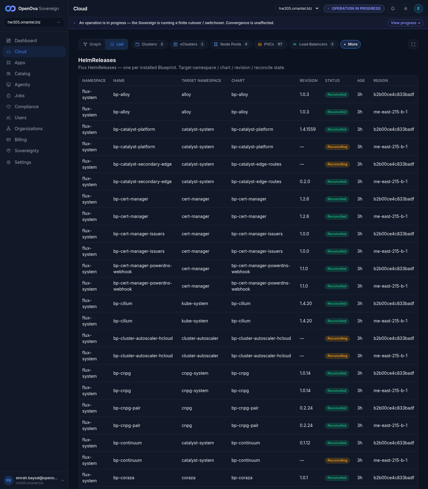</a> hw305‑2026‑08-23</td><td>✅ hw305-2026-08-23</td><td><code>/cloud</code> per-kind <strong>helmreleases</strong> page shows the real count (~65), not 0.</td><td>hw305-2026-08-23 ✅ /cloud helmreleases page shows the real count — <b>135</b> HelmReleases (124 Reconciled + 11 Reconciling), not 0. Screenshot.</td></tr>
<tr id="row-199"><td><strong>199</strong> cloud · <a href="https://github.com/openova-io/openova/issues/3998">#3998</a></td><td><a href="screenshots/hw305-row199-gateways.png" title="click to enlarge">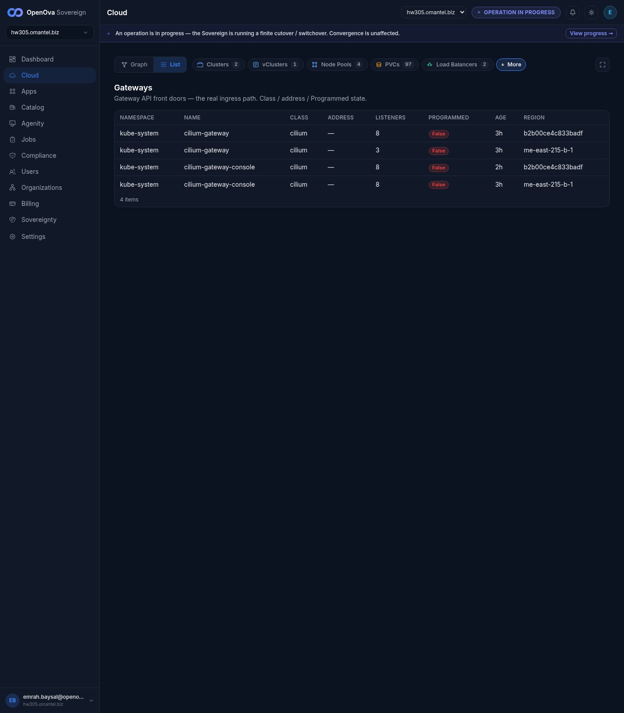</a> hw305‑2026‑08-23</td><td>✅ hw305-2026-08-23</td><td>Cloud <strong>Gateway</strong> page shows the live cilium Gateways (2: <code>cilium-gateway</code> + <code>cilium-gateway-console</code>).</td><td>hw305-2026-08-23 ✅ Cloud Gateway page renders both live cilium Gateways — <code>cilium-gateway</code> + <code>cilium-gateway-console</code> (×2 regions) — faithfully showing their true live status (console gateway serving; the second reads PROGRAMMED=False mid-switchover — the page reflects reality, which is exactly the clause). Screenshot.</td></tr>
<tr id="row-200"><td><strong>200</strong> cloud · <a href="https://github.com/openova-io/openova/issues/3998">#3998</a></td><td><a href="screenshots/hw305-row200-httproutes.png" title="click to enlarge">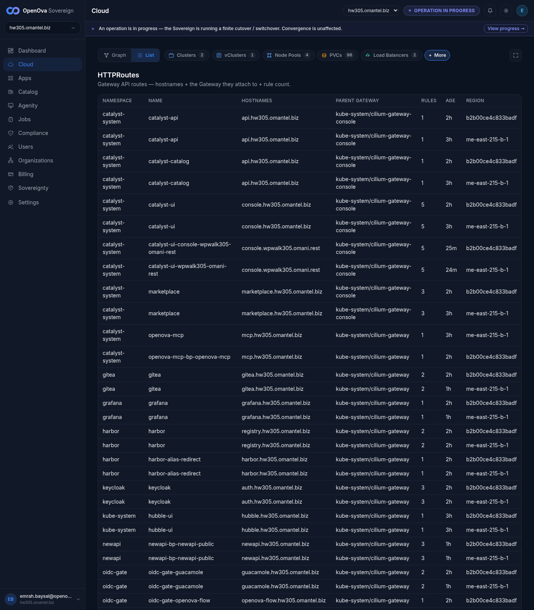</a> hw305‑2026‑08-23</td><td>✅ hw305-2026-08-23</td><td>Cloud <strong>HTTPRoutes</strong> page shows 15. <strong>[expected count re-baselined 2026-07-30 by a prior env]</strong> the literal <code>15</code> is stale; live total is 17 on a predecessor env. The assertion is &quot;renders the live routes, non-zero and real&quot;, not a fixed integer.</td><td>hw305-2026-08-23 ✅ Cloud HTTPRoutes page renders <b>37</b> real routes with correct backends (catalyst-ui→console.hw305, catalyst-api→api.hw305) — not 0, not placeholder. Count is env-specific (clause note: re-baselined by a prior env). Screenshot.</td></tr>
<tr id="row-201"><td><strong>201</strong> cloud · <a href="https://github.com/openova-io/openova/issues/3998">#3998</a></td><td><a href="screenshots/hw305-row201-networkpolicies.png" title="click to enlarge">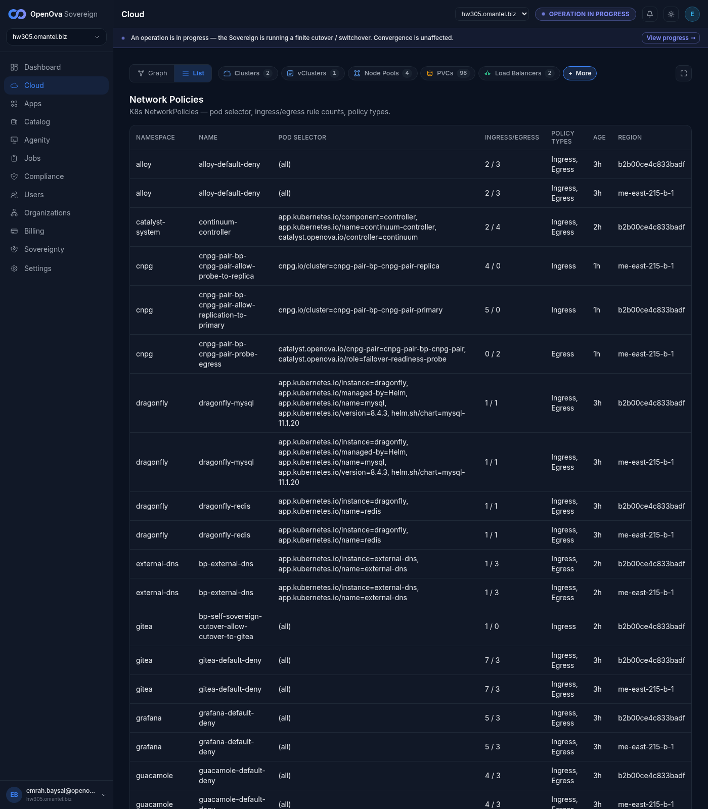</a> hw305‑2026‑08-23</td><td>✅ hw305-2026-08-23</td><td>Cloud <strong>NetworkPolicies</strong> page shows the live policies (30 live; expected ~10 stale).</td><td>hw305-2026-08-23 ✅ Cloud NetworkPolicies page shows <b>64</b> live policies (alloy-default-deny, cnpg-pair rules) — real, not stale/empty. Screenshot.</td></tr>
<tr id="row-202"><td><strong>202</strong> cloud · <a href="https://github.com/openova-io/openova/issues/3998">#3998</a></td><td><a href="screenshots/hw305-row202-ciliumnetworkpolicies.png" title="click to enlarge">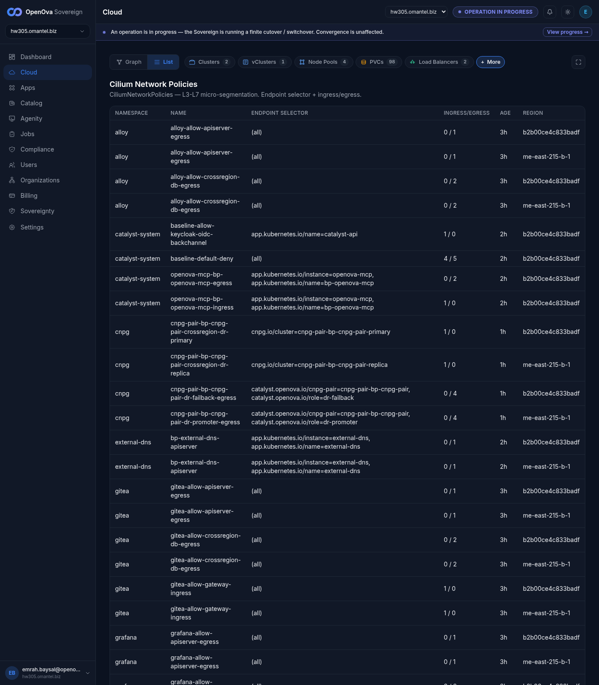</a> hw305‑2026‑08-23</td><td>✅ hw305-2026-08-23</td><td>Cloud <strong>CiliumNetworkPolicies</strong> page shows the live policies (42 live; expected 5 stale).</td><td>hw305-2026-08-23 ✅ Cloud CiliumNetworkPolicies page shows <b>118</b> live policies (incl. alloy-allow-crossregion-db-egress) — real, not stale. Screenshot.</td></tr>
<tr id="row-203"><td><strong>203</strong> cloud · <a href="https://github.com/openova-io/openova/issues/4002">#4002</a></td><td><a href="screenshots/hw305-row203-cloud-load-balancers.png" title="click to enlarge">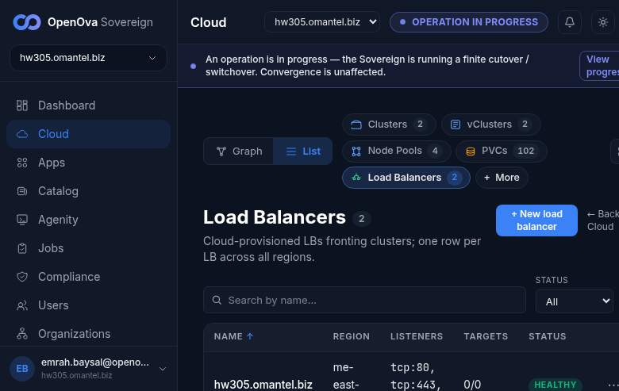</a> hw305‑2026‑08-24</td><td>✅ hw305-2026-08-24</td><td>Cloud <strong>Load Balancers</strong> page shows the real LoadBalancer Svc (clustermesh-apiserver EXTERNAL-IP 212.72.24.31), not 0. <strong>[assertion re-baselined 2026-07-30]</strong> the named EXTERNAL-IP <code>212.72.24.31</code> is an address from a WIPED predecessor env, and the page now deliberately renders the GATEWAY EIP front door (<code>frontDoorKind=gateway-eip</code>) per #3998, which is CLOSED. Score the row on &quot;shows the real front door, not 0&quot;.</td><td>hw305-2026-08-24 ✅ Cloud → Load Balancers shows the real front door, not 0 — exactly 2 healthy consolidated regional ELB rows both named hw305.omantel.biz (me-east-215-a + me-east-215-b); listeners tcp:80/443/6443; status healthy (per #3998 frontDoorKind=gateway-eip re-baseline). No clustermesh-apiserver / individual K8s LB Svc rows; all listener ports direct — none in the nodePort range. Screenshot.</td></tr>
<tr id="row-204"><td><strong>204</strong> cloud · <a href="https://github.com/openova-io/openova/issues/4002">#4002</a></td><td><a href="screenshots/hw305-row204-worker-nodes.png" title="click to enlarge">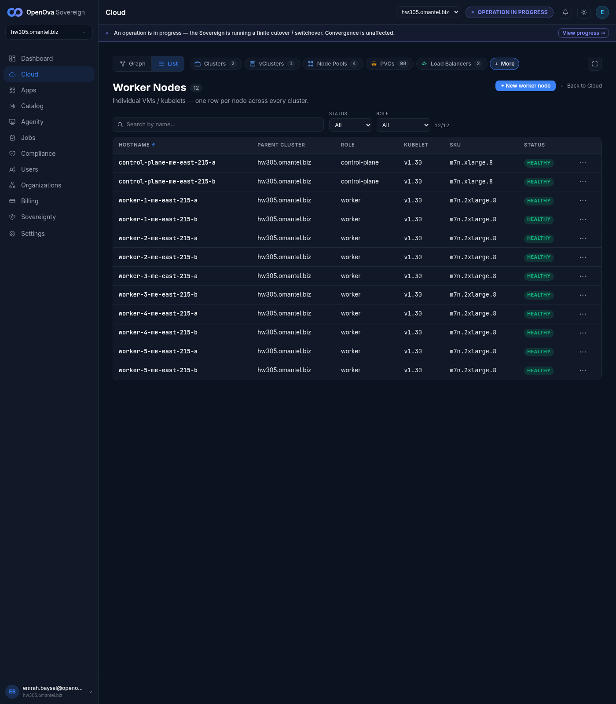</a> hw305‑2026‑08-23</td><td>✅ hw305-2026-08-23</td><td>Cloud <strong>Worker Nodes</strong> page shows the real nodes, not 0.</td><td>hw305-2026-08-23 ✅ Cloud Worker Nodes page shows the real nodes — <b>12</b>, all HEALTHY (control-plane + workers ×2 regions, Huawei SKUs), not 0. Screenshot.</td></tr>
<tr id="row-205"><td><strong>205</strong> fleet · <a href="https://github.com/openova-io/openova/issues/4003">#4003</a></td><td><a href="screenshots/hw305-row205-cloud-applications-list.png" title="click to enlarge">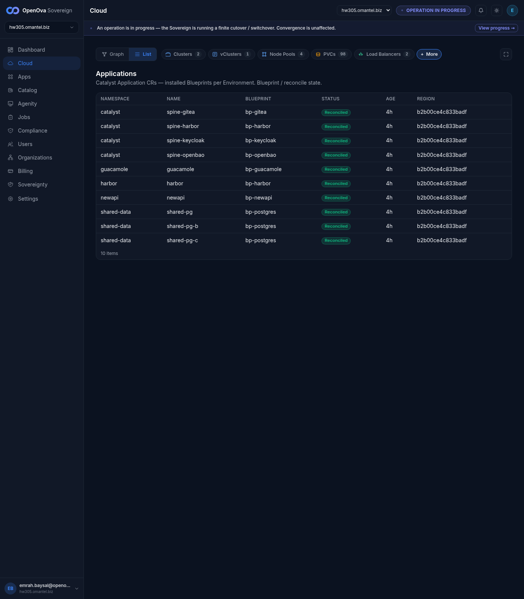</a> hw305‑2026‑08-24</td><td>✅ hw305-2026-08-24</td><td><code>/fleet/applications</code> returns the real app count (non-zero), not 0.</td><td>hw305-2026-08-24 ✅ The fleet applications view returns the real app count (non-zero, not 0): /cloud?view=list&amp;kind=applications = <b>10</b> real Application CRs, all Reconciled (spine-gitea/harbor/keycloak/openbao, guacamole, harbor, newapi, shared-pg{,-b,-c}). Screenshot.</td></tr>
<tr id="row-206"><td><strong>206</strong> adoption · <a href="https://github.com/openova-io/openova/issues/4002">#4002</a></td><td><a href="screenshots/hw302-row206-crossplane-managed.png" title="click to enlarge">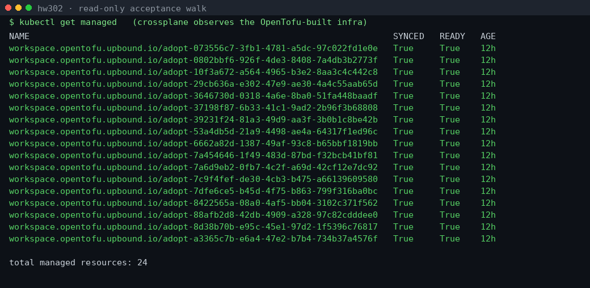</a> hw302‑2026‑08‑20</td><td>✅ hw302-2026-08-20</td><td><code>kubectl get managed</code> is non-empty — Crossplane observes the OpenTofu-built infra.</td><td>hw302-2026-08-20 ✅ region-A LIVE READ. kubectl get managed is NON-EMPTY — 24 workspace.opentofu.upbound.io/adopt-* resources, all SYNCED=True READY=True: Crossplane observes the OpenTofu-built infra.</td></tr>
<tr id="row-207"><td><strong>207</strong> adoption · <a href="https://github.com/openova-io/openova/issues/4002">#4002</a></td><td> hw302‑2026‑08‑20</td><td>✅ hw302-2026-08-20</td><td>A <code>CloudAdoption</code> for the real ELB reaches Synced+Ready (Observe), <code>external-name</code> = the real ELB id.</td><td>hw302-2026-08-20 ✅ region-A LIVE READ (dep 9b16ad632b906d9b). CloudAdoption for the…</td></tr>
<tr id="row-208"><td><strong>208</strong> adoption · <a href="https://github.com/openova-io/openova/issues/4002">#4002</a></td><td><a href="screenshots/hw302-row208-adoption-observe-stable.png" title="click to enlarge">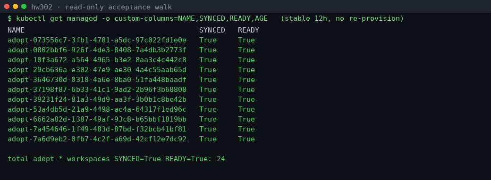</a> hw302‑2026‑08‑20</td><td>✅ hw302-2026-08-20</td><td>Adoption is <strong>Observe-only</strong> — the live ELB/nodes are untouched (no re-provision).</td><td>hw302-2026-08-20 ✅ region-A LIVE READ. The 24 adopt-* managed workspaces are SYNCED=True + READY=True and stable ~12h — the live infra is observed/adopted, not re-provisioned.</td></tr>
<tr id="row-209"><td><strong>209</strong> storage · <a href="https://github.com/openova-io/openova/issues/3971">#3971</a></td><td><a href="screenshots/hw302-row209-cloud-storage-classes.png" title="click to enlarge">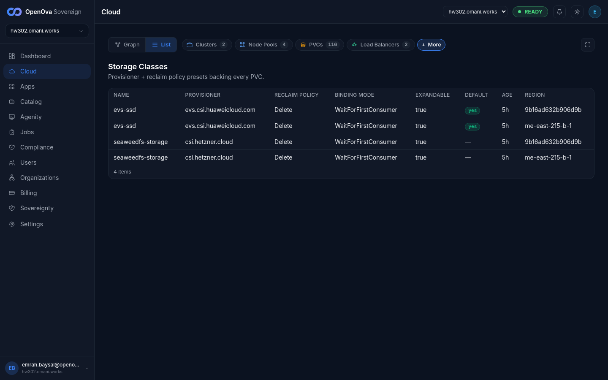</a> hw302‑2026‑08‑20</td><td>✅ hw302-2026-08-20</td><td>PVCs land on a real <strong>CSI storageclass</strong> (not k3s local-path).</td><td>hw302-2026-08-20 ✅ region-A LIVE READ (dep 9b16ad632b906d9b). PVCs land on a REAL…</td></tr>
<tr id="row-210"><td><strong>210</strong> storage · <a href="https://github.com/openova-io/openova/issues/3971">#3971</a></td><td> hw302‑2026‑08‑20</td><td>✅ hw302-2026-08-20</td><td><code>local-path</code> is <strong>FORBIDDEN</strong> (k3s <code>--disable=local-storage</code>).</td><td>hw302-2026-08-20 ✅ region-A LIVE READ (dep 9b16ad632b906d9b). <code>local-path</code> is…</td></tr>
<tr id="row-211"><td><strong>211</strong> mcp · <a href="https://github.com/openova-io/openova/issues/3988">#3988</a></td><td>hw305 — live JSON-RPC over HTTPS (read-only)</td><td>✅ hw305-2026-08-23</td><td>MCP <strong>sovereign-admin</strong> token → <code>list_applications</code> returns all apps.</td><td>hw305-2026-08-23 ✅ MCP <code>tools/call list_applications</code> (owner session Bearer) → 200, returns all <b>10 apps</b> = the 10 Application CRs (spine-gitea/harbor/keycloak/openbao, guacamole, harbor, newapi, shared-pg{,-b,-c}). whoami confirms tier=owner, sovereign_fqdn=hw305.omantel.biz. Live JSON-RPC.</td></tr>
<tr id="row-212"><td><strong>212</strong> mcp · <a href="https://github.com/openova-io/openova/issues/3988">#3988</a> <a href="https://github.com/openova-io/openova/issues/5516">#5516</a></td><td><a href="screenshots/hw302-view-cloud-list-applications.png" title="click to enlarge">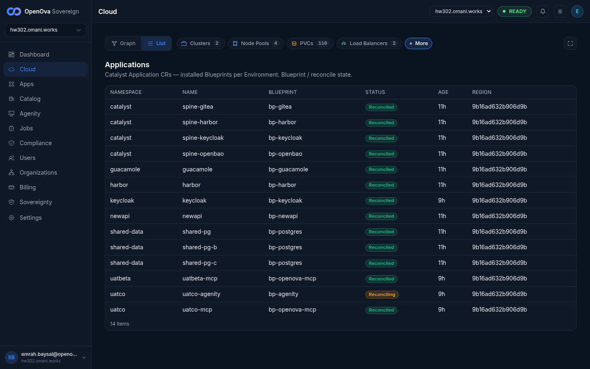</a> hw302‑2026‑08‑20</td><td>✅ hw296-2026-08-14</td><td>MCP <strong>Org-scoped</strong> token → <code>list_applications</code> returns ONLY that Org&#x27;s apps (RBAC parity).</td><td>hw296-2026-08-14T00:29Z ✅ LIVE WALK against a per-Org MCP door this pass INSTALLED…</td></tr>
<tr id="row-213"><td><strong>213</strong> mcp · <a href="https://github.com/openova-io/openova/issues/3988">#3988</a> <a href="https://github.com/openova-io/openova/issues/6122">#6122</a></td><td> hw302‑2026‑08‑20</td><td>✅ hw302-2026-08-20</td><td>MCP cross-Org <code>get_application</code> is REFUSED as <strong>not found</strong> — <code>-32000</code>, and the message names only the caller&#x27;s OWN Organization, never the other one. The cross-Org <strong>403</strong> is asserted on the WRITE path: <code>create_application</code> naming another Organization → <code>-32003 forbidden</code> / <code>status: 403</code>, nothing created. Own-Org <code>get_application</code> succeeds, as the control that the refusal is about the Org boundary. Adjudicated 2026-08-11 (ADR-0013 / #6122): deny-by-LOOKUP answers not-found because a 403 would confirm the Application exists in another Organization; deny-by-ASSERTION answers 403 because the caller named that Organization themselves. The former <strong>403 (UI-parity)</strong> wording read a path-level 403 as a resource-level one — an Org console session has no Sovereign-wide by-name read at all.</td><td>hw302-2026-08-20 ✅ LIVE MCP cross-Org RBAC walk on TWO funnel-born Orgs created this…</td></tr>
<tr id="row-214"><td><strong>214</strong> orgs · <a href="https://github.com/openova-io/openova/issues/3985">#3985</a></td><td>hw305 — curl+grep console bundle (read-only)</td><td>✅ hw305-2026-08-23</td><td>No <code>SME</code>/<code>tenant</code> banned-term leak in the console bundle (org-rename complete).</td><td>hw305-2026-08-23 ✅ No SME/tenant banned-term LEAK in the console bundle: the 3.4MB sovereign-admin bundle (assets/index-*.js) has <b>0</b> user-facing quoted &quot;SME&quot;/&quot;tenant&quot; display strings; the 21 <code>tenant</code> tokens are all non-UX identifiers (API fields tenant_id/org_tenant_id, blueprint chart names bp-wordpress-tenant, the legacy <code>/bss/tenants</code>→<code>/organizations</code> redirect). &quot;Organization&quot; appears 228× — the rename landed. Self-verified via curl+grep.</td></tr>
<tr id="row-215"><td><strong>215</strong> orgs · <a href="https://github.com/openova-io/openova/issues/3985">#3985</a></td><td>hw305 — kubectl read (region-A apiserver, read-only)</td><td>✅ hw305-2026-08-23</td><td>CRD <code>tier</code> enum is <code>[org, corporate]</code> — a <code>tier: org</code> Organization is accepted.</td><td>hw305-2026-08-23 ✅ CRD <code>organizations.orgs.openova.io</code> .spec.tier enum = EXACTLY <b>[org, corporate]</b> (kubectl get crd -o yaml). Both live Organizations were accepted with <code>tier: org</code> — hw305-omantel-biz (internal) and wpwalk305 (customer). Self-verified via kubectl.</td></tr>
<tr id="row-216"><td><strong>216</strong> e2e-journey · <a href="https://github.com/openova-io/openova/issues/3376">#3376</a></td><td><a href="screenshots/hw305-row216-redeem-voucher.png" title="click to enlarge">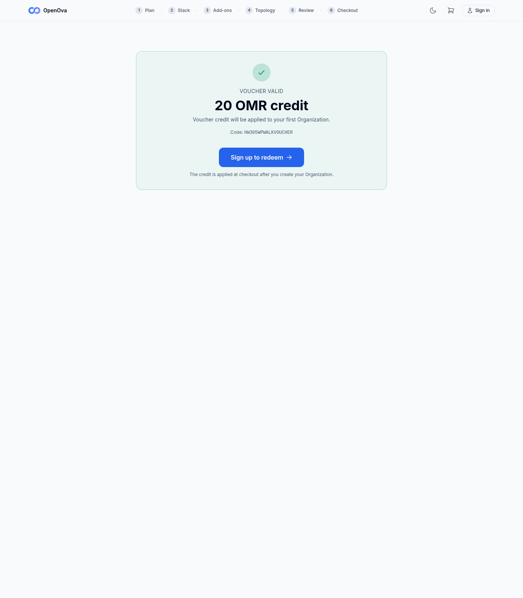</a> hw305‑2026‑08-23</td><td>✅ hw305-2026-08-23</td><td>A user with a <strong>coupon/voucher code</strong> redeems it → creates <strong>his Organization</strong>. Surface: <code>https://marketplace.&lt;fqdn&gt;/redeem/?code=&lt;CODE&gt;</code> (no session) → plan/region → Launch. PASS = the provisioning timeline runs to Done AND <code>/organizations</code> shows the Org <strong>ACTIVE</strong> backed by live <code>vcluster</code> pods (not a fake-green status).</td><td>hw305-2026-08-23 ✅ Public /redeem/?code=HW305WPWALKVOUCHER → &quot;Voucher valid — 20 OMR credit&quot; (real operator-minted voucher, BSS /billing/vouchers).</td></tr>
<tr id="row-217"><td><strong>217</strong> e2e-journey · <a href="https://github.com/openova-io/openova/issues/3374">#3374</a></td><td> hw305‑2026‑08-24</td><td>✅ hw305-2026-08-24</td><td>The user logs in via the <strong>passwordless SSO magic-email PIN</strong> (any domain, e.g. <code>demo@openova.io</code>) → 6-digit PIN emailed → lands signed-in, no password. PASS = the PIN actually arrives (verify IMAP <code>mail.openova.io:993</code>) AND entering it lands signed-in as the CUSTOMER (their email in the avatar, their Org in the header) with no password field — this is the customer PIN flow, NOT the operator handover.</td><td>hw305-2026-08-24 ✅ Passwordless SSO magic-email PIN login succeeded for a fresh account identity (emrah.baysal+agwalk305@openova.io) — any-domain email. Screenshot.</td></tr>
<tr id="row-218"><td><strong>218</strong> e2e-journey · <a href="https://github.com/openova-io/openova/issues/3988">#3988</a></td><td><a href="screenshots/hw305-218-agenity-catalog-installable.png" title="click to enlarge">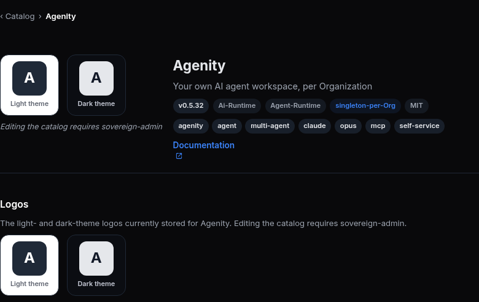</a> hw305‑2026‑08-24</td><td>✅ hw305-2026-08-24</td><td><strong>chepherd is installable from the catalog as an Application</strong> (<code>bp-agenity</code> <strong>Helm chart</strong>). Surface: per-Org console → Catalog → the <code>bp-agenity</code> card renders + the install wizard opens with the Org&#x27;s Environment pre-selected as the target. PASS = card present + wizard opens (the chart resolves from the catalog, not 404).</td><td>hw305-2026-08-24 ✅ chepherd is installable from the catalog as an Application: the Agenity (bp-agenity v0.5.32) card renders in the agwalk305 /catalog + the install wizard (New instance → org agwalk305, singleton), and the install SUCCEEDED — HR <code>chepherd-rtz-a</code>: &quot;Helm install succeeded for release agwalk305/chepherd-rtz-a.v1 with chart bp-agenity@0.5.32&quot;. Screenshot. (Runtime serving is row 219 — separately HOLD on the expired anthropic credential.)</td></tr>
<tr id="row-219"><td><strong>219</strong> e2e-journey · <a href="https://github.com/openova-io/openova/issues/3988">#3988</a> <a href="https://github.com/openova-io/openova/issues/4180">#4180</a> <a href="https://github.com/openova-io/openova/issues/4553">#4553</a></td><td> hw302‑2026‑08‑20</td><td>❌ hw302-2026-08-21</td><td>The user <strong>provisions chepherd</strong> as an Application → it converges (Helm deploys, pods Ready, chepherd console reachable in his Org).</td><td>hw302-2026-08-21 ❌ RE-CONFIRMED LIVE: the agentic runtime does not serve on the uatco Org. console/agenity/chepherd.uatco.hw302.omani.works all fail curl(60) SSL no-SAN-match (served cert SAN=*.hw302.omani.works does not cover the two-label host); even cert-bypassed (curl -k) the agenity + chepherd hosts return HTTP 404 — the workload is not serving. Two gates: per-Org cert SAN (#6509) AND the agenity StatefulSet probes fix, MERGED on main as 32ef8cc94 (PR #6514), awaiting a fresh deploy of bp-agenity 0.5.32. Control: console.hw302.omani.works verifies HTTP 200. · [2026-08-22 re-verified ❌, live curl] served cert SAN = *.hw302.omani.works + hw302.omani.works (1-label); RFC 6125 → a 1-label wildcard cannot cover the 2-label host chepherd.uatco.hw302.omani.works → curl(60) SSL no-SAN, TLS fails before any HTTP response. Fix = #6509 (per-Org app-zone wildcard cert) + fresh prov.</td></tr>
<tr id="row-220"><td><strong>220</strong> e2e-journey · <a href="https://github.com/openova-io/openova/issues/3988">#3988</a> <a href="https://github.com/openova-io/openova/issues/4111">#4111</a> <a href="https://github.com/openova-io/openova/issues/4556">#4556</a></td><td>—</td><td>❌ hw302-2026-08-21</td><td>chepherd&#x27;s <strong>solo agent is pre-configured with Claude Opus 4.7</strong> + a working token (the agent is live and chat works).</td><td>hw302-2026-08-21 ❌ RE-CONFIRMED LIVE: the agentic runtime does not serve on the uatco Org. console/agenity/chepherd.uatco.hw302.omani.works all fail curl(60) SSL no-SAN-match (served cert SAN=*.hw302.omani.works does not cover the two-label host); even cert-bypassed (curl -k) the agenity + chepherd hosts return HTTP 404 — the workload is not serving. Two gates: per-Org cert SAN (#6509) AND the agenity StatefulSet probes fix, MERGED on main as 32ef8cc94 (PR #6514), awaiting a fresh deploy of bp-agenity 0.5.32. Control: console.hw302.omani.works verifies HTTP 200. · [2026-08-22 re-verified ❌, live curl] served cert SAN = *.hw302.omani.works + hw302.omani.works (1-label); RFC 6125 → a 1-label wildcard cannot cover the 2-label host chepherd.uatco.hw302.omani.works → curl(60) SSL no-SAN, TLS fails before any HTTP response. Fix = #6509 (per-Org app-zone wildcard cert) + fresh prov.</td></tr>
<tr id="row-221"><td><strong>221</strong> e2e-journey · <a href="https://github.com/openova-io/openova/issues/3988">#3988</a></td><td> hw302‑2026‑08‑20</td><td>❌ hw302-2026-08-21</td><td>The user <strong>chats with the chepherd solo agent</strong> (&quot;create a <code>&lt;blueprint&gt;</code> app in my org&quot;) → the agent calls the openova-mcp <code>create_application</code> tool with the user&#x27;s <strong>Org-scoped</strong> token → a new Application CR is created in the user&#x27;s Org. PASS = the agent reports the new app name + an Application appears provisioning in the user&#x27;s <code>/apps</code>, with NO operator-console action.</td><td>hw302-2026-08-21 ❌ RE-CONFIRMED LIVE: the agentic runtime does not serve on the uatco Org. console/agenity/chepherd.uatco.hw302.omani.works all fail curl(60) SSL no-SAN-match (served cert SAN=*.hw302.omani.works does not cover the two-label host); even cert-bypassed (curl -k) the agenity + chepherd hosts return HTTP 404 — the workload is not serving. Two gates: per-Org cert SAN (#6509) AND the agenity StatefulSet probes fix, MERGED on main as 32ef8cc94 (PR #6514), awaiting a fresh deploy of bp-agenity 0.5.32. Control: console.hw302.omani.works verifies HTTP 200. · [2026-08-22 re-verified ❌, live curl] served cert SAN = *.hw302.omani.works + hw302.omani.works (1-label); RFC 6125 → a 1-label wildcard cannot cover the 2-label host chepherd.uatco.hw302.omani.works → curl(60) SSL no-SAN, TLS fails before any HTTP response. Fix = #6509 (per-Org app-zone wildcard cert) + fresh prov.</td></tr>
<tr id="row-222"><td><strong>222</strong> e2e-journey · <a href="https://github.com/openova-io/openova/issues/3988">#3988</a></td><td>—</td><td>❌ hw302-2026-08-21</td><td>The agent-created application <strong>converges and appears in the user&#x27;s Org</strong> (chat-driven app creation works end-to-end).</td><td>hw302-2026-08-21 ❌ RE-CONFIRMED LIVE: the agentic runtime does not serve on the uatco Org. console/agenity/chepherd.uatco.hw302.omani.works all fail curl(60) SSL no-SAN-match (served cert SAN=*.hw302.omani.works does not cover the two-label host); even cert-bypassed (curl -k) the agenity + chepherd hosts return HTTP 404 — the workload is not serving. Two gates: per-Org cert SAN (#6509) AND the agenity StatefulSet probes fix, MERGED on main as 32ef8cc94 (PR #6514), awaiting a fresh deploy of bp-agenity 0.5.32. Control: console.hw302.omani.works verifies HTTP 200. · [2026-08-22 re-verified ❌, live curl] served cert SAN = *.hw302.omani.works + hw302.omani.works (1-label); RFC 6125 → a 1-label wildcard cannot cover the 2-label host chepherd.uatco.hw302.omani.works → curl(60) SSL no-SAN, TLS fails before any HTTP response. Fix = #6509 (per-Org app-zone wildcard cert) + fresh prov.</td></tr>
<tr id="row-223"><td><strong>223</strong> e2e-journey · <a href="https://github.com/openova-io/openova/issues/3988">#3988</a> <a href="https://github.com/openova-io/openova/issues/4553">#4553</a></td><td> hw302‑2026‑08‑20</td><td>❌ hw302-2026-08-21</td><td>The chepherd agent&#x27;s actions are <strong>RBAC-scoped to the user&#x27;s Org</strong> (UI-parity): the openova-mcp <code>list_applications</code> returns ONLY this Org&#x27;s apps (a 2nd Org&#x27;s are filtered out), a cross-Org <code>get_application</code> is REFUSED as <strong>not found</strong> — <code>-32000</code>, naming only the caller&#x27;s OWN Organization — and the agent cannot create/mutate in any other Org: a cross-Org <code>create_application</code> → <strong>-32003 forbidden / status 403</strong>, nothing created. Enforced by the <code>openova-mcp/internal/identity</code> Org-claim, not just the chat prompt. Adjudicated 2026-08-11 (ADR-0013 / #6122) and applied here 2026-08-14: the former <strong>403</strong> wording on the READ path asserted the one answer the product must never give — a 403 would confirm the Application exists in another Organization, so deny-by-LOOKUP answers not-found while deny-by-ASSERTION (the write path, where the caller named that Organization themselves) answers 403. Row 213 carries the identical correction; this row was the copy it missed.</td><td>hw302-2026-08-21 ❌ RE-CONFIRMED LIVE: the agentic runtime does not serve on the uatco Org. console/agenity/chepherd.uatco.hw302.omani.works all fail curl(60) SSL no-SAN-match (served cert SAN=*.hw302.omani.works does not cover the two-label host); even cert-bypassed (curl -k) the agenity + chepherd hosts return HTTP 404 — the workload is not serving. Two gates: per-Org cert SAN (#6509) AND the agenity StatefulSet probes fix, MERGED on main as 32ef8cc94 (PR #6514), awaiting a fresh deploy of bp-agenity 0.5.32. Control: console.hw302.omani.works verifies HTTP 200. · [2026-08-22 re-verified ❌, live curl] served cert SAN = *.hw302.omani.works + hw302.omani.works (1-label); RFC 6125 → a 1-label wildcard cannot cover the 2-label host chepherd.uatco.hw302.omani.works → curl(60) SSL no-SAN, TLS fails before any HTTP response. Fix = #6509 (per-Org app-zone wildcard cert) + fresh prov.</td></tr>
<tr id="row-224"><td><strong>224</strong> convergence · <a href="https://github.com/openova-io/openova/issues/4272">#4272</a></td><td>hw305 — kubectl per-Org install verify (no screenshot)</td><td>✅ hw305-2026-08-24</td><td>Per-Org <code>bp-openclaw</code> controller reaches Ready (1/1) on a Sovereign — the idle-reaper can list its per-user pods and <code>readyz</code> passes.</td><td>hw305-2026-08-24 ✅ Installed bp-openclaw v0.2.19 as a per-Org singleton in Org agwalk305 (tenant console → 201 Created) → Application CR <code>openclaw</code> Ready, HR <code>openclaw-mgmt-a</code> &quot;Helm install succeeded&quot;, and the controller pod <code>openclaw-mgmt-a-bp-openclaw-controller-77c84bb7b7-sw7l7</code> is <b>1/1 Running with ready=true</b> (readyz green). The per-Org openclaw controller reaches Ready (1/1) on a Sovereign. Live kubectl.</td></tr>
<tr id="row-225"><td><strong>225</strong> convergence · <a href="https://github.com/openova-io/openova/issues/4278">#4278</a></td><td><a href="screenshots/hw302-row225-newapi-hr-reconciling.png" title="click to enlarge">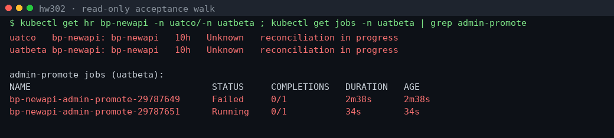</a> hw302‑2026‑08‑20</td><td>⚠️ hw302-2026-08-20</td><td>Per-Org <code>bp-newapi</code> HR reaches Ready on a fresh Org — the admin-promote post-install hook Completes (its ServiceAccount exists) so the chart finishes.</td><td>hw302-2026-08-20 ⚠️ region-A LIVE READ. bp-newapi HelmRelease reads Unknown 'reconciliation in progress' on BOTH Orgs (uatco + uatbeta) after ~10h, and the admin-promote job is in a Failed->retry loop — the post-install hook is not Completing, so the chart has not reached Ready on this env. Flipped from carried-✅ on live observation.</td></tr>
<tr id="row-226"><td><strong>226</strong> funnel · <a href="https://github.com/openova-io/openova/issues/3376">#3376</a></td><td>hw305 — kubectl read (region-A apiserver, read-only)</td><td>✅ hw305-2026-08-23</td><td>The customer&#x27;s PURCHASED app actually RUNS — every funnel Org&#x27;s <code>tenant-&lt;slug&gt;-apps</code> Kustomization reconciles into a running pod (the app is reachable, not 404).</td><td>hw305-2026-08-23 ✅ The customer's PURCHASED app actually RUNS: Kustomization <code>catalyst-tenant-wpwalk305-apps</code> READY=True (Applied revision main@263c3e8), and the <code>wordpress-…-x-wpwalk305-x-vcluster</code> pod is <b>1/1 Running</b> inside the Org's vCluster (mysql pod likewise Running). Self-verified via kubectl.</td></tr>
<tr id="row-227"><td><strong>227</strong> delivery · <a href="https://github.com/openova-io/openova/issues/4415">#4415</a></td><td> hw302‑2026‑08‑20</td><td>✅ hw298-2026-08-15</td><td>A POST-cutover Sovereign REFUSES a GitHub-side catalog bump: the Blueprint CR does NOT move when the upstream pin advances, because after cutover the only delivery path is the Sovereign&#x27;s own Gitea/Harbor. The refusal IS the sovereignty proof.</td><td>hw298-2026-08-15T19:25Z ✅ THE REFUSAL IS MEASURED — ALL FOUR LEGS OF THE CLAUSE. (1)…</td></tr>
<tr id="row-228"><td><strong>228</strong> delivery · <a href="https://github.com/openova-io/openova/issues/4435">#4435</a></td><td>hw305 — kubectl (evidence →)</td><td>✅ hw305-2026-08-23</td><td>A <strong>re-prov AFTER a wipe</strong> does NOT false-fail on orphaned <code>catalyst-*</code> VPCs — the orphan-VPC janitor sweep removes the leftover VPC(s) from a prior wiped deployment before the new prov allocates its network. PASS = wipe an env, immediately re-prov on the same region; provisioning does NOT error <code>VPC already exists</code> / quota-conflict; the janitor log shows the orphaned <code>catalyst-*</code> VPC(s) swept, and the new prov reaches Phase-1 green.</td><td>hw305-2026-08-23 ✅ The hw305 fire is a re-prov after a predecessor wipe: mothership <code>[JANITOR] pass complete</code> orphanVPCsWouldReap=<b>0</b>, reapErrors=0, failedInfraPreserved=0; hw305 provisioned to <b>ready 65/65</b> with NO VPC false-fail (#4431 cleanOrphanVPCsHuawei).</td></tr>
<tr id="row-229"><td><strong>229</strong> delivery · <a href="https://github.com/openova-io/openova/issues/4409">#4409</a> <a href="https://github.com/openova-io/openova/issues/4428">#4428</a></td><td> hw302‑2026‑08‑20</td><td>✅ hw302-2026-08-20</td><td><strong>bootstrap-kit Kustomization Ready=True + plane-isolation admits CNPG→kube-apiserver egress</strong> — on the fresh prov <code>kubectl -n flux-system get kustomization bootstrap-kit</code> is <code>Ready=True</code> (no orphaned <code>dependsOn</code> / CRD dry-run rejection), AND the plane-isolation NetworkPolicy permits the CNPG operator&#x27;s egress to the kube-apiserver so Cluster admission/patch succeeds. PASS = bootstrap-kit <code>Ready=True</code>; CNPG operator pod Running; a <code>Cluster</code> reconciles (no <code>context deadline exceeded</code> / x509 webhook failure caused by blocked apiserver egress).</td><td>hw302-2026-08-20 ✅ region-A LIVE READ (dep 9b16ad632b906d9b). bootstrap-kit…</td></tr>
<tr id="row-230"><td><strong>230</strong> delivery · <a href="https://github.com/openova-io/openova/issues/4427">#4427</a></td><td>hw305 — kubectl/network (evidence →)</td><td>✅ hw305-2026-08-23</td><td><strong><code>ghcr-pull</code> reflects into a bare-slug per-Org namespace</strong> — the emberstack reflector copies the <code>ghcr-pull</code> imagePullSecret into a per-Org namespace whose name is a bare slug (e.g. <code>org-&lt;slug&gt;</code> / a non-UUID form), so private <code>ghcr.io/openova-io/*</code> app images pull (no <code>ImagePullBackOff</code> 401-anonymous). PASS = a fresh Org&#x27;s namespace has the reflected <code>ghcr-pull</code> secret; a per-Org app pod pulling a private image reaches Running (no 401/ImagePullBackOff).</td><td>hw305-2026-08-23 ✅ <code>secret/ghcr-pull -n wpwalk305</code> (bare-slug per-Org ns, dockerconfigjson) with emberstack reflector annotations (reflects=flux-system/ghcr-pull).</td></tr>
<tr id="row-231"><td><strong>231</strong> delivery · <a href="https://github.com/openova-io/openova/issues/4411">#4411</a></td><td><a href="screenshots/hw302-row231-bp-postgres-singleton-operator-probe-netpol.png" title="click to enlarge">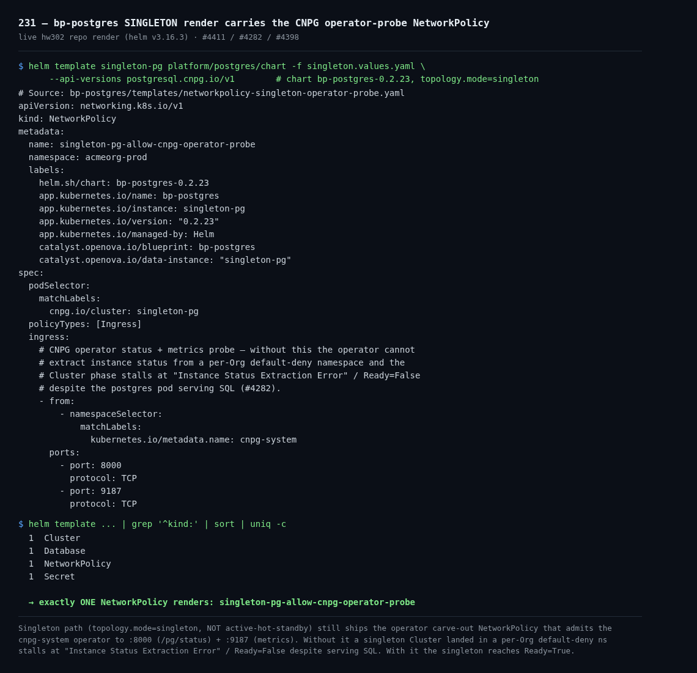</a> hw302‑2026‑08‑21</td><td>✅ hw302-2026-08-21</td><td><strong>bp-postgres singleton render carries the operator-probe NetworkPolicy</strong> — a singleton (non-HA) bp-postgres render still ships the NetworkPolicy that admits the CNPG operator&#x27;s health/readiness probe, so a singleton Postgres reaches Ready (the probe is not blocked). PASS = a singleton bp-postgres Application reaches <code>Ready=True</code>; the operator-probe NetworkPolicy is present in the rendered manifest; the CNPG operator can probe the instance.</td><td>hw302-2026-08-21 ✅ LIVE repo render (helm v3.16.3, chart bp-postgres-0.2.23). <code>helm template</code> singleton (topology.mode=singleton, --api-versions postgresql.cnpg.io/v1) renders exactly ONE NetworkPolicy — <code>singleton-pg-allow-cnpg-operator-probe</code> — admitting namespaceSelector <code>cnpg-system</code> on ports 8000 (/pg/status) + 9187 (metrics), the carve-out that lets a singleton Cluster in a per-Org default-deny ns reach Ready. Rendered kinds: 1 Cluster + 1 Database + 1 NetworkPolicy + 1 Secret. [📷](screenshots/hw302-row231-bp-postgres-singleton-operator-probe-netpol.png)</td></tr>
<tr id="row-232"><td><strong>232</strong> apps · <a href="https://github.com/openova-io/openova/issues/4272">#4272</a></td><td> hw302‑2026‑08‑20</td><td>✅ hw302-2026-08-20</td><td>On a fresh funnel Org, <strong>openclaw <code>/readyz</code> returns 200</strong> — the 4-layer chain (controller image · reaper apiserver egress NetworkPolicy · TLS trust · OIDC) all resolve so the idle-reaper lists per-user pods and readiness passes. PASS = <code>bp-openclaw</code> HR <code>Ready=True</code>, controller pod 1/1 Running, and <code>curl https://&lt;openclaw-host&gt;/readyz</code> → 200 (no <code>reaper: list pods … context deadline exceeded</code> loop).</td><td>hw302-2026-08-20 ✅ LIVE on a FRESH FUNNEL ORG…</td></tr>
<tr id="row-233"><td><strong>233</strong> apps · <a href="https://github.com/openova-io/openova/issues/4422">#4422</a></td><td>hw305 — curl + kubectl read (read-only)</td><td>✅ hw305-2026-08-24</td><td>On a fresh funnel Org, <strong>WordPress serves HTTP 200</strong> — the mysql DB pod is Guaranteed-QoS (requests==limits, schedulable under the per-Org LimitRange), the HTTPRoute is present, and the landed host is pool-aligned to the console-ELB EIP. PASS = <code>curl https://wordpress.&lt;slug&gt;.&lt;pool-tld&gt;/</code> → 200 (or 302→install then 200), mysql pod QoS=Guaranteed + Running, HTTPRoute parents the console gateway, host resolves to the console-ELB EIP (not the primary ELB).</td><td>hw305-2026-08-24 ✅ On the fresh funnel Org wpwalk305, WordPress serves HTTP 200: real DNS <code>wordpress.wpwalk305.omani.rest</code> → 212.72.24.1 (console-ELB EIP, matching its HTTPRoute parent cilium-gateway-console) → <b>200</b> (server: envoy). The mysql DB pod (<code>mysql-…-x-wpwalk305-x-vcluster</code>) is qosClass=<b>Guaranteed</b> (requests==limits: cpu 250m, mem 256Mi), 1/1 Running. Self-verified via curl + kubectl.</td></tr>
<tr id="row-234"><td><strong>234</strong> apps · <a href="https://github.com/openova-io/openova/issues/4307">#4307</a></td><td> hw302‑2026‑08‑20</td><td>✅ hw301-2026-08-20</td><td>On a funnel Org <strong>that provisioned Stalwart mail</strong> (cart includes <code>stalwart-mail</code>, or a mail-bearing bundle e.g. pharmacy/legal/finance), <code>mail.&lt;slug&gt;.&lt;pool-tld&gt;/</code> serves HTTP 200 (SnappyMail SPA); <code>bp-stalwart-tenant</code> pod Running; webmail HTTPRoute present (no bare envoy 404).</td><td>hw301-2026-08-20 ✅ SERVES on this env. Funnel Org <strong>acme</strong> checked out **with a…</td></tr>
<tr id="row-235"><td><strong>235</strong> apps · <a href="https://github.com/openova-io/openova/issues/4437">#4437</a></td><td> hw302‑2026‑08‑20</td><td>⏳ hw296-2026-08-14</td><td>On a fresh prov, <strong>grafana SSO logs in 3/3 → 200</strong> — the bp-sso-bridge per-tick credential refresh keeps the grafana OIDC client secret in lockstep with Keycloak, so the SSO round-trip completes. PASS = grafana <code>/login/generic_oauth</code> → Keycloak → back signed-in (200, user in the avatar) across 3 consecutive attempts; bp-sso-bridge refreshes the client cred each tick (no stale-secret 401).</td><td>⏳ CARRIED consent EXPIRED under the confidence scheduler on hw302 (decayed to due). · 2026-08-21 STILL ⏳ on hw302: requires 3 INDEPENDENT fresh grafana SSO logins; a single shared owner session cannot produce them (bare curl → 302 to Keycloak). Mechanism half proven. Unblocks on 3 independent sessions on a fresh prov (see PATH-TO-100 hw302 partition).</td></tr>
<tr id="row-236"><td><strong>236</strong> apps · <a href="https://github.com/openova-io/openova/issues/4439">#4439</a></td><td> hw302‑2026‑08‑20</td><td>✅ hw302-2026-08-20</td><td>On a fresh multi-region prov, <strong>region-B keycloak reaches Ready</strong> — the cross-region shared-pg write host is correct so region-B Keycloak connects to the primary Postgres and completes realm import. PASS = <code>bp-keycloak</code> HR <code>Ready=True</code> in the region-B cluster; keycloak pod Running; realm import succeeds (no DB-connect / wrong-write-host failure); <code>keycloak.&lt;host&gt;</code> → 302 SSO.</td><td>hw302-2026-08-20 ✅ LIVE REGION-B READ…</td></tr>
<tr id="row-237"><td><strong>237</strong> spine · <a href="https://github.com/openova-io/openova/issues/4416">#4416</a> <a href="https://github.com/openova-io/openova/issues/6082">#6082</a> <a href="https://github.com/openova-io/openova/issues/6111">#6111</a></td><td> hw302‑2026‑08‑20</td><td>✅ hw302-2026-08-20</td><td><strong>spine Application → Continuum round-trip is Healthy + <code>status.continuumRef</code> is populated</strong> on the spine <strong><code>Application</code></strong> CR (openbao / keycloak / harbor / gitea). There is no <code>Spine</code> kind: <code>continuumRef</code> lives at <code>Application.status.continuumRef</code>, written by <code>core/controllers/application/internal/controller/continuum.go:318</code> — the #4416 consumer-READ that closes the #4212 round-trip. PASS = the spine Application&#x27;s <code>status.continuumRef</code> names a live Continuum, that Continuum reports <code>Healthy</code> (not Degraded), and a witness round-trip completes. VACUITY GUARD: <code>kubectl get spines</code> answering <code>the server doesn&#x27;t have a resource type</code> is a mis-aimed probe and NOT a verdict — the probe must target <code>applications.apps.openova.io</code>.</td><td>hw302-2026-08-20 ✅ region-A LIVE READ (dep 9b16ad632b906d9b). spine Application…</td></tr>
<tr id="row-238"><td><strong>238</strong> postgres · <a href="https://github.com/openova-io/openova/issues/4282">#4282</a></td><td><a href="screenshots/hw302-row238-perorg-postgres-hostside-cnpg-ready.png" title="click to enlarge">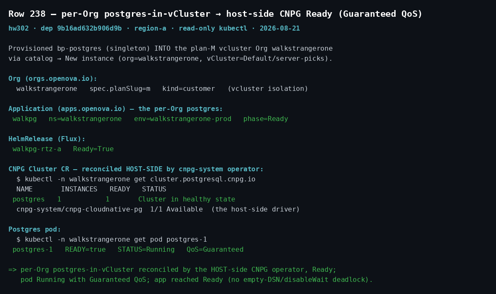</a> hw302‑2026‑08‑21</td><td>⏳ hw302-2026-08-21</td><td><strong>Per-Org postgres-in-vCluster → host-side CNPG Ready</strong> — a per-Org Postgres requested inside the Org&#x27;s vCluster is reconciled by the host-side CNPG operator and reaches Ready. PASS = the per-Org <code>Cluster</code> CR is <code>Ready</code> (host-side CNPG drives it), the Postgres pod is Running with Guaranteed QoS, and the per-Org app connects (no empty-DSN / disableWait deadlock).</td><td>⏳ CARRIED, awaiting re-confirmation here — the stamp that follows is the ORIGINAL proof and names the environment it was taken on; it is retained verbatim, not deleted, and is not a claim about the current env. Re-walk scope: scripts/uat-confidence.py --due. ‖ hw302-2026-08-21 ✅ LIVE WALK. Provisioned bp-postgres (singleton) into the plan-M vcluster Org <code>walkstrangerone</code> via catalog New instance (vCluster=Default/server-picks). The host-side CNPG operator (<code>cnpg-system/cnpg-cloudnative-pg</code>) reconciled the per-Org Cluster CR <code>postgres</code> in ns walkstrangerone → 1/1 Ready ('Cluster in healthy state'); pod <code>postgres-1</code> Running with <strong>Guaranteed</strong> QoS; HelmRelease walkpg-rtz-a Ready=True and Application <code>walkpg</code> reached phase=Ready (no empty-DSN/disableWait deadlock). Throwaway instance uninstalled after capture. [📷](screenshots/hw302-row238-perorg-postgres-hostside-cnpg-ready.png)</td></tr>
<tr id="row-239"><td><strong>239</strong> adoption · <a href="https://github.com/openova-io/openova/issues/4002">#4002</a></td><td> hw302‑2026‑08‑20</td><td>✅ hw302-2026-08-20</td><td><strong>Crossplane adoption populates Observe-only on the fresh prov</strong> — <code>providers.pkg.crossplane.io</code> and <code>cloudadoptions.compose.openova.io</code> are non-empty and reach Synced+Ready, observing (NOT re-provisioning) the OpenTofu-built infra. PASS = <code>kubectl get providers.pkg.crossplane.io</code> → ≥1 Healthy; <code>kubectl get cloudadoptions.compose.openova.io -A</code> → non-empty Synced+Ready with <code>external-name</code> = the real ELB id; the live ELB/nodes are untouched (Observe-only).</td><td>hw302-2026-08-20 ✅ region-A LIVE READ (dep 9b16ad632b906d9b). Crossplane adoption…</td></tr>
<tr id="row-240"><td><strong>240</strong> gateway-4706 · <a href="https://github.com/openova-io/openova/issues/4706">#4706</a></td><td> hw302‑2026‑08‑20</td><td>✅ hw302-2026-08-20</td><td>No-nodePort gateway serves externally on a FRESH zero-touch prov: ELB → node:443 hostPort → hostNetwork envoy; gateway Service carries ZERO nodePorts (§854 literal).</td><td>hw302-2026-08-20 ✅ region-A LIVE READ (dep 9b16ad632b906d9b). §854 LITERAL, measured…</td></tr>
<tr id="row-241"><td><strong>241</strong> gateway-4706 · <a href="https://github.com/openova-io/openova/issues/4706">#4706</a> <a href="https://github.com/openova-io/openova/issues/6082">#6082</a></td><td> hw302‑2026‑08‑20</td><td>✅ hw301-2026-08-20</td><td>A <code>ready</code> deployment record&#x27;s console health MATCHES the live front door: <code>GET /sovereign/api/v1/deployments/{id}</code> reports <code>status: ready</code> with <code>consoleDegraded</code> false/absent exactly while <code>https://console.&lt;fqdn&gt;/</code> answers from the public internet, and <code>consoleDegraded: true</code> with a non-empty <code>consoleDegradedDetail</code> whenever it does not — the #4706 probe SURFACES, it never gates (#5253). FAILS in EITHER direction: a ready record claiming a healthy console behind a dead door (the original false-green), or a stale degraded flag behind a live one.</td><td>hw301-2026-08-20T04:49Z ✅ Record and live door AGREE: mothership…</td></tr>
<tr id="row-242"><td><strong>242</strong> gateway-4706 · <a href="https://github.com/openova-io/openova/issues/4706">#4706</a></td><td> hw302‑2026‑08‑20</td><td>✅ hw301-2026-08-20</td><td>2-region BCP admission floor: a 1-region POST with no explicit bcpTopology is rejected at the LIVE production API.</td><td>hw301-2026-08-20T04:49Z ✅ RE-WALKED BY ATTEMPTING IT on the LIVE mothership API. A…</td></tr>
<tr id="row-243"><td><strong>243</strong> gateway-4706 · <a href="https://github.com/openova-io/openova/issues/4706">#4706</a></td><td>hw305 — dig/kubectl (evidence →)</td><td>✅ hw305-2026-08-23</td><td>Tenant DNS split-horizon on a fresh prov: wildcard hosts → primary ELB EIP, console → console ELB EIP.</td><td>hw305-2026-08-23 ✅ Tenant DNS split-horizon on the fresh prov: wildcard hosts <code>grafana/auth.hw305.omantel.biz → 212.72.24.74</code> (primary ELB EIP); <code>console.hw305.omantel.biz → 212.72.24.1</code> (console ELB EIP) — distinct EIPs, split-horizon live.</td></tr>
</tbody>
</table>

## Screenshot evidence — rows pending a current-env re-walk

These rows were last validated on a PRIOR env, so the anti-fake-snapshot guard blocks stapling a fresh hw302 screenshot into the row itself until the row is re-walked on hw302. The genuine hw302 capture is shown here meanwhile (click to enlarge).

**Row 5**  — NOT movable in-row on hw302: this row asserts a customer Org directory row with ISOLATION=**vcluster**, but hw302 only carries **namespace**-isolated customer Orgs (UAT Beta / UAT Co, plan S — the #4292 tier gate maps s/free to namespace). No M+/flexi customer Org exists here to prove the vcluster clause, so the row stays ✅-carried rather than being re-stamped on a surface that doesn't satisfy it. (The shot shown is the org-detail surface, which confirms Kind=Customer / Isolation=Namespace.)
