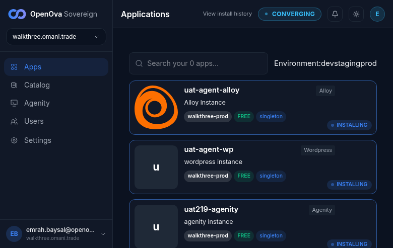

# UAT — Sovereign acceptance walk on `hw302.omani.works` (dep `9b16ad632b906d9b`)

**Tally (286 rows):** ✅ 269 · ❌ 10 · ⏳ 7

> **One acceptance case per row, walked on the env in the title.** Result: `✅` pass · `❌` fail · `⚠️` partial · `☐` open · `⏳` carried/due · `⛔` blocked. Test-case + Evidence show the gist (full walk history in git); `#NNNN` = issue; 📷 opens the screenshot (also collected in the gallery below the table).

| # | Epic | Issue | Test case | Env | Result | Evidence |
|---|---|---|---|---|---|---|
| R1 | janitor | #4454 | catalyst-api orphan-sweep no longer reaps a `ready` Sovereign — denylist… | hw302-2026-08-20 | ✅ | hw302-2026-08-20 ✅ LIVE MOTHERSHIP JANITOR OBSERVATION… |
| R2 | network | #4467 | Cross-node pod TCP carries full-size data packets without DF-drop in BOTH… | hw302-2026-08-20 | ✅ | hw302-2026-08-20 ✅ LIVE READ BOTH REGIONS (dep 9b16ad632b906d9b, read-only). Cilium… |
| R3 | sso | #4448 | bp-plane-isolation openbao default-deny ADMITS sso-bridge ingress → sso-bridge… | — | ✅ | CARRIED from hw293 — a wipe is not a failure. The code that passed there is the code… |
| R4 | sso | #4458 | sso-bridge egress CNP permits openbao + keycloak — the reconciler's own egress… | — | ✅ | CARRIED from hw293 — a wipe is not a failure. The code that passed there is the code… |
| R5 | sso | #4437 | sso-bridge re-mints the grafana OIDC client secret each tick… | live | ✅ | CARRIED from hw293 — a wipe is not a failure. The code that passed there is the code… |
| R6 | postgres | #4442 | bp-postgres NetworkPolicy admits the declared consumers… | hw302-2026-08-20 | ✅ | hw302-2026-08-20 ✅ region-A LIVE READ (dep 9b16ad632b906d9b). bp-postgres… |
| R7 | plane-isolation | #4444 | bp-plane-isolation admits gitea ingress for its declared consumers… | live | ✅ | CARRIED from hw293 — a wipe is not a failure. The code that passed there is the code… |
| R8 | gitea | #4447 | gitea-flux-auth secrets are seeded — Flux pulls from gitea with valid… | — | ✅ | CARRIED from hw293 — a wipe is not a failure. The code that passed there is the code… |
| R9 | sso | #4446 | oidc-gate client_secret is seeded for powerdns-admin — full OIDC round-trip… | live | ✅ | CARRIED from hw293 — a wipe is not a failure. The code that passed there is the code… |
| R10 | orgs | #4471 | org-controller RBAC carries update/patch — per-Org provisioning completes… | — | ✅ | CARRIED from hw293 — a wipe is not a failure. The code that passed there is the code… |
| R11 | gitea | #4354 | gitea git-data survives a POD RESTART — the PVC rebinds and every bare repo… | — | ✅ | CARRIED from hw293 — a wipe is not a failure. The code that passed there is the code… |
| R12 | postgres | #4460 | shared-pg `-mesh-rw` resolves in BOTH regions + CNPG streaming replication is… | hw302-2026-08-20 | ✅ | hw302-2026-08-20 ✅ LIVE READ BOTH REGIONS (dep 9b16ad632b906d9b, read-only)… |
| R13 | convergence | #4436 | region-B keycloak / gitea / harbor reach steady-state with NO CrashLoop. | hw301-2026-08-20 | ✅ | hw301-2026-08-20T05:13Z LIVE READ IN REGION B SPECIFICALLY… |
| R14 | model | #4479 | console Organizations directory reads the live Organization CRs… | — | ✅ | CARRIED from hw293 — a wipe is not a failure. The code that passed there is the code… |
| R15 | funnel | #4473 | funnel plan-slug propagates end-to-end — the chosen plan reaches the… | — | ✅ | CARRIED from hw293 — a wipe is not a failure. The code that passed there is the code… |
| R16 | funnel | #4290 | the funnel + BSS Org doors are collapsed onto ONE path — `console.<slug>` lands… | hw301-2026-08-20 | ✅ | hw301-2026-08-20T12:05Z ✅ RE-WALKED ON hw301: the collapsed single funnel+BSS door… |
| R17 | orgs | #4459 | deleting an Organization CR cascades cleanly — no orphaned ns / app / DNS leak. | — | ✅ | CARRIED from hw293 — a wipe is not a failure. The code that passed there is the code… |
| R18 | cutover | #4450 | handover-key self-publish guard — the Sovereign does not re-publish its… | live | ✅ | CARRIED from hw293 — a wipe is not a failure. The code that passed there is the code… |
| R19 | agenity | #4482 | The per-Org **Agenity** workspace StatefulSet reaches Running with its… | hw296-2026-08-14 | ✅ | hw296-2026-08-14T00:05Z ✅ THE INIT CONTAINER VALIDATES THE TOKEN AND EXITS 0 — the… |
| R20 | delivery | #4464 | the deploy-bot bumps image pins per-line (not a blanket bump) — stale-render… | repo-2026-08-11 | ✅ | repo-2026-08-11 RE-DERIVED at walk HEAD — env-independent by construction: the… |
| R21 | catalog | #4432 | catalog-seed pins match the published ghcr chart versions — no inert lagging… | repo-2026-08-11 | ✅ | repo-2026-08-11 — the GHCR half, which is what this row's literal wording asks… |
| R22 | plane-isolation | #4468 | bp-plane-isolation admits apiserver-egress + gateway-ingress CNPs — CNPG… | hw302-2026-08-20 | ✅ | hw302-2026-08-20 ✅ region-A LIVE READ (dep 9b16ad632b906d9b). bp-plane-isolation… |
| W1 | wizard | #5401 #5554 | Deployment wizard step 1 does NOT pre-fill a fabricated company into the… | mothership-2026-08-14 | ✅ | mothership-2026-08-14T08:14Z ✅ RE-WALKED AGAINST THE MERGED FIX, ON THE ONE… |
| W2 | wizard | #5401 | The wizard does NOT derive cloud provider/region from a fabricated value. | hw298-2026-08-15 | ✅ | hw298-2026-08-15T20:12Z ✅ WALKED BY SOURCE TRACE, which is the correct instrument… |
| W3 | wizard | #3376 | Marketplace-mode storefront branding fields are optional and blank… | hw296-2026-08-14 | ✅ | hw296-2026-08-14T01:44-01:55Z LIVE WALK… |
| W4 | wizard | #5555 | Every wizard step offers a Back control… | live | ✅ | CARRIED from hw293 — a wipe is not a failure. The code that passed there is the code… |
| W5 | wizard | #3969 | Component-selection step counts are self-consistent and every component id… | hw298-2026-08-15 | ✅ | hw298-2026-08-15T20:05Z ✅ FRESH MEASUREMENT ON THIS ENV… |
| M1 | janitor | #4466 #4493 | janitor hardening — log-only/dry-run for a full live cycle before any… | hw302-2026-08-20 | ✅ | hw302-2026-08-20 ✅ LIVE MOTHERSHIP JANITOR hardening proof… |
| M2 | apps | #4477 #4492 | newapi admin-token seeded into OpenBao at provision… | — | ✅ | CARRIED from hw293 — a wipe is not a failure. The code that passed there is the code… |
| M3 | network | #4475 #4495 | vcluster-tier CNP applied host-side — the per-Org vcluster tier carries its… | — | ✅ | CARRIED from hw293 — a wipe is not a failure. The code that passed there is the code… |
| M4 | apps | #4111 #4494 #4496 | agenity image-pull half — fresh-install ghcr-pull path. | — | ✅ | CARRIED from hw293 — a wipe is not a failure. The code that passed there is the code… |
| G1 | adoption | #4488 | crossplane provider-opentofu Observe-only adoption populates on the fresh prov. | hw302-2026-08-20 | ✅ | hw302-2026-08-20 ✅ region-A LIVE READ (dep 9b16ad632b906d9b). provider-opentofu… |
| G2 | apps | #4477 | newapi admin-token ES-sync is **Sovereign-scoped by design**: the… | hw298-2026-08-15 | ✅ | hw298-2026-08-15T19:59Z ✅ FRESH MEASUREMENT ON THIS ENV… |
| G3 | dr | #4486 #6111 | On a two-region Sovereign every `continuums.dr.openova.io` CR declares a… | hw302-2026-08-20 | ✅ | hw302-2026-08-20 ✅ region-A LIVE READ (dep 9b16ad632b906d9b). VACUITY GUARD… |
| G4 | adoption | #4431 | A janitor pass with the destructive gate CLOSED reports its cloud sweeps under… | hw302-2026-08-20 | ✅ | hw302-2026-08-20 ✅ LIVE MOTHERSHIP JANITOR OBSERVATION… |
| G5 | janitor | #4466 | janitor log-only live proof (the dry-run full-cycle observation). | hw302-2026-08-20 | ✅ | hw302-2026-08-20 ✅ LIVE MOTHERSHIP JANITOR log-only proof… |
| G6 | model | #4212 #6082 #6111 | **The #4212 Seam-3 spine producer has enrolled the spine into the object… | — | ✅ | CARRIED from hw293 — a wipe is not a failure. The code that passed there is the code… |
| G7 | orgs | #4293 | vcluster dual-door walk — both Org doors land a vcluster-isolation Org. | hw301-2026-08-20 | ✅ | hw301-2026-08-20 ✅ vcluster dual-door. Console Organizations Isolation column:… |
| G8 | apps | #4277 | anthropic credential seeded into the agentic runtime — chat works end-to-end. | hw298-2026-08-16 | ❌ | hw298-2026-08-16T05:45Z ❌ FAILS ON THIS ENV. The anthropic credential cannot be… |
| G9 | apps | #4111 | agentic-run half — the agenity solo agent chats + drives create_application. | hw298-2026-08-16 | ❌ | hw298-2026-08-16T05:45Z ❌ FAILS ON THIS ENV. The agenity solo-agent chat +… |
| G10 | placement | #3969 | Placement EPIC acceptance: EVERY Application CR carries a non-empty… | — | ✅ | CARRIED from hw293 — a wipe is not a failure. The code that passed there is the code… |
| G11 | cutover | #3379 #6082 #6111 | sovereignty cutover — the **11-step** chain runs to completion and the 10-min… | hw298-2026-08-15 | ❌ | hw298-2026-08-15T16:48Z ❌ RE-WALKED ON THE LIVE ENV… |
| G12 | dr | #4275 | region-kill (Pillar-3) — kill a region, prove failover + recovery. | — | ✅ | CARRIED from hw293 — a wipe is not a failure. The code that passed there is the code… |
| 1 | model | #3687 | Console bare URL → lands `/dashboard` signed-in as the owner… | — | ✅ | CARRIED from hw293 — a wipe is not a failure. The code that passed there is the code… |
| 2 | model | #3687 | Full sidebar renders… | — | ✅ | CARRIED from hw293 — a wipe is not a failure. The code that passed there is the code… |
| 3 | model | #3687 #4546 | The voucher-redeem URL opened in an AUTHED OWNER browser session bounces to… | — | ✅ | CARRIED from hw293 — a wipe is not a failure. The code that passed there is the code… |
| 4 | model | #3687 | App page tab strip generality: open ≥2 archetypes… | hw296-2026-08-13 | ✅ | hw296-2026-08-13T17:23Z ✅ Two archetypes opened. /app/shared-pg… |
| 5 | model | #3687 | Organizations directory: the customer Org row shows KIND=customer, TIER=org… | — | ✅ | CARRIED from hw293 — a wipe is not a failure. The code that passed there is the code… |
| 6 | model | #3687 | The customer Org is present as a real Organization in the operator directory… | — | ✅ | CARRIED from hw293 — a wipe is not a failure. The code that passed there is the code… |
| 7 | model | #3687 | Org detail renders canonical fields: slug `acme` (NOT `sme-<uuid>`), kind… | hw301-2026-08-20 | ✅ | hw301-2026-08-20 ✅ Org detail canonical fields —… |
| 8 | model | #3687 | The Create-organization form renders fully… | hw296-2026-08-13 | ✅ | hw296-2026-08-13T17:26Z ✅ /organizations -> Create organization ->… |
| 9 | model | #3687 | Org detail Status = active, backed by a real `vcluster` isolation… | — | ✅ | CARRIED from hw293 — a wipe is not a failure. The code that passed there is the code… |
| 10 | model | #3687 | The customer Org is present + ACTIVE backed by a real `vcluster` isolation… | — | ✅ | CARRIED from hw293 — a wipe is not a failure. The code that passed there is the code… |
| 11 | model | #3687 | Org detail Status = active and the directory + detail consistently show… | — | ✅ | CARRIED from hw293 — a wipe is not a failure. The code that passed there is the code… |
| 12 | model | #3687 | On re-load the Org detail consistently reports active + `vcluster… | — | ✅ | CARRIED from hw293 — a wipe is not a failure. The code that passed there is the code… |
| 13 | model | #3687 | Catalog grid renders the Blueprint cards; `bp-postgres` detail has a **+ New… | — | ✅ | CARRIED from hw293 — a wipe is not a failure. The code that passed there is the code… |
| 14 | model | #3687 | The shared-PG reuse model is LIVE: the `shared-pg` app **Contexts** tab shows… | — | ✅ | CARRIED from hw293 — a wipe is not a failure. The code that passed there is the code… |
| 15 | model | #3687 | Apps list renders one card per Application… | hw302-2026-08-20 | ✅ | hw302-2026-08-20 ✅ AUTHED per-Org console… |
| 16 | model | #3687 | A customer app page (`/app/<name>`) → Settings/Topology → change topology →… | hw296-2026-08-13 | ✅ | hw296-2026-08-13T21:55Z ✅ THE FULL LIVE ROUND TRIP RAN — open the tab, change the… |
| 17 | model | #3687 | Dashboard treemap is a meaningful drill-down surface… | — | ✅ | CARRIED from hw293 — a wipe is not a failure. The code that passed there is the code… |
| 18 | model | #3687 | Scan every treemap cell: NO ephemeral Job-pod cell appears… | — | ✅ | CARRIED from hw293 — a wipe is not a failure. The code that passed there is the code… |
| 19 | model | #3687 | Count the ESTATE cards on /apps — `[data-card-kind="instance"]` inside… | hw302-2026-08-20 | ✅ | hw302-2026-08-20 ✅ AUTHED per-Org console (uatco.omani.homes; served bundle). ESTATE… |
| 20 | model | #3687 | With a customer Org present, the customer estate is visually distinct from… | — | ✅ | CARRIED from hw293 — a wipe is not a failure. The code that passed there is the code… |
| 21 | model | #3687 | Organizations Showback panel: the **Application** column for a selected Org… | — | ✅ | CARRIED from hw293 — a wipe is not a failure. The code that passed there is the code… |
| 22 | model | #3687 | Showback shows a single visually-distinct **Platform overhead** roll-up line… | — | ✅ | CARRIED from hw293 — a wipe is not a failure. The code that passed there is the code… |
| 23 | model | #3687 | After a 2nd Org runs an app, the showback panel shows a SECOND Org row… | — | ✅ | CARRIED from hw293 — a wipe is not a failure. The code that passed there is the code… |
| 24 | model | #3687 | `shared-pg` renders the canonical tab strip Overview · Contexts · Topology ·… | — | ✅ | CARRIED from hw293 — a wipe is not a failure. The code that passed there is the code… |
| 25 | model | #3687 | One consistent model across surfaces: `/organizations` shows the Orgs that… | hw301-2026-08-20 | ✅ | hw301-2026-08-20 ✅ One consistent model across surfaces — the Organizations… |
| 26 | sso | #3374 | Console bare URL → lands on the dashboard signed-in as the owner; no… | hw301-2026-08-20 | ✅ | hw301-2026-08-20 ✅ silent-SSO landing… |
| 27 | sso | #3374 | Avatar (top-right) menu reads "Signed in as the owner" with a Sign-out item. | hw301-2026-08-20 | ✅ | hw301-2026-08-20 ✅ silent-SSO landing… |
| 28 | sso | #3374 | Users page renders the pre-seeded owner row the owner… | hw301-2026-08-20 | ✅ | hw301-2026-08-20 ✅ silent-SSO landing… |
| 29 | sso | #3374 | Re-open the bare console URL after the session TTL → lands signed-in again, no… | hw302-2026-08-20 | ✅ | hw302-2026-08-20 ✅ AUTHED owner console (served bundle). Re-open of the bare console… |
| 30 | sso | #3374 | Grafana bare URL → lands on Grafana Home, full UI, no login form; left nav… | hw301-2026-08-20 | ✅ | hw301-2026-08-20 ✅ silent-SSO landing… |
| 31 | sso | #3374 | Gitea bare URL → lands on the gitea dashboard titled "emrah.baysal —… | hw301-2026-08-20 | ✅ | hw301-2026-08-20 ✅ silent-SSO landing… |
| 32 | sso | #3374 | Harbor bare URL → lands on `/harbor/projects`, no login form; user dropdown the… | hw301-2026-08-20 | ✅ | hw301-2026-08-20 ✅ silent-SSO landing… |
| 33 | sso | #3374 | OpenBao bare UI → lands in an authenticated Vault session… | hw301-2026-08-20 | ✅ | hw301-2026-08-20 ✅ silent-SSO landing… |
| 34 | sso | #3374 | Keycloak admin console for the **sovereign** realm → lands inside the admin… | hw301-2026-08-20 | ✅ | hw301-2026-08-20 ✅ silent-SSO landing… |
| 35 | sso | #3374 | Guacamole bare URL → lands on the Guacamole connections list, signed-in; no… | hw301-2026-08-20 | ✅ | hw301-2026-08-20 ✅ silent-SSO landing… |
| 36 | sso | #3374 | PowerDNS-Admin bare URL → lands on the dashboard signed-in; no redirect loop… | hw301-2026-08-20 | ✅ | hw301-2026-08-20 ✅ silent-SSO landing… |
| 37 | sso | #3374 #3858 #4136 | newapi bare URL (1st hit) → lands on `/console` signed-in as admin (role 100)… | hw301-2026-08-20 | ✅ | hw301-2026-08-20 ✅ silent-SSO landing… |
| 38 | sso | #3374 #3858 #4136 | newapi bare URL (2nd hit, re-entry) → lands on `/console` again signed-in; NOT… | hw301-2026-08-20 | ✅ | hw301-2026-08-20 ✅ silent-SSO landing… |
| 39 | sso | #3374 | Hubble bare URL → lands on the Hubble UI, authenticated… | hw301-2026-08-20 | ✅ | hw301-2026-08-20 ✅ silent-SSO landing… |
| 40 | sso | #3374 | Marketplace bare URL → renders the anonymous storefront (public, by design)… | hw302-2026-08-20 | ✅ | hw302-2026-08-20 ✅ `marketplace.hw302.omani.works/` → **200** behind… |
| 41 | sso | #3374 | Keycloak sovereign realm → Users lists the single owner principal the owner… | hw301-2026-08-20 | ✅ | hw301-2026-08-20 ✅ silent-SSO landing… |
| 42 | sso | #3374 | Owner user → Groups tab shows membership in `/sovereign-admins… | hw301-2026-08-20 | ✅ | hw301-2026-08-20 ✅ silent-SSO landing… |
| 43 | sso | #3374 | Owner user → Role mapping tab: effective realm roles include `catalyst-admin… | hw301-2026-08-20 | ✅ | hw301-2026-08-20 ✅ silent-SSO landing… |
| 44 | sso | #3374 | Groups → `/sovereign-admins` → Role mapping: group confers `catalyst-admin… | hw301-2026-08-20 | ✅ | hw301-2026-08-20 ✅ silent-SSO landing… |
| 45 | sso | #3374 | Console Users panel: owner row + the ability to view/manage users renders —… | hw301-2026-08-20 | ✅ | hw301-2026-08-20 ✅ silent-SSO landing… |
| 46 | topology | #3375 | `bp-postgres` catalog detail renders; click **New instance** → the create… | — | ✅ | CARRIED from hw293 — a wipe is not a failure. The code that passed there is the code… |
| 47 | topology | #3375 #3856 | Topology `<select>` options read exactly the ONE canonical vocabulary:… | — | ✅ | CARRIED from hw293 — a wipe is not a failure. The code that passed there is the code… |
| 48 | topology | #3375 | `active-passive` is a selectable option in the create `<select>… | — | ✅ | CARRIED from hw293 — a wipe is not a failure. The code that passed there is the code… |
| 49 | topology | #3375 | `singleton` is a separate selectable option (single-region single-instance)… | — | ✅ | CARRIED from hw293 — a wipe is not a failure. The code that passed there is the code… |
| 50 | topology | #3375 | Pick `active-hot-standby`, name the instance, Provision → the create succeeds… | — | ✅ | CARRIED from hw293 — a wipe is not a failure. The code that passed there is the code… |
| 51 | topology | #3375 | `shared-pg` Topology tab renders a per-region placement view listing region-a… | hw302-2026-08-20 | ✅ | hw302-2026-08-20 ✅ AUTHED owner console walk (passwordless-PIN, tier=owner), served… |
| 52 | topology | #3375 | `shared-pg` Topology tab renders ROLE asymmetry across the pair: the region-a… | hw302-2026-08-20 | ✅ | hw302-2026-08-20 ✅ AUTHED owner console (served bundle index-Dg8eOKi4.js). shared-pg… |
| 53 | topology | #3375 | Open a per-app Topology tab and read its placement view… | — | ✅ | CARRIED from hw293 — a wipe is not a failure. The code that passed there is the code… |
| 54 | topology | #3375 #3856 | `shared-pg` Topology tab declared-topology strip renders the canonical mode in… | — | ✅ | CARRIED from hw293 — a wipe is not a failure. The code that passed there is the code… |
| 55 | topology | #3375 | `shared-pg` Topology tab renders EXACTLY ONE topology value, runtime-derived… | hw296-2026-08-14 | ✅ | hw296-2026-08-14T01:44-01:55Z LIVE WALK… |
| 56 | topology | #3375 | `shared-pg` Topology tab per-region placement + replication block: region-a… | hw302-2026-08-20 | ✅ | hw302-2026-08-20 ✅ AUTHED owner console (served bundle index-Dg8eOKi4.js). shared-pg… |
| 57 | topology | #3375 | `shared-pg` Topology tab Switchover button is present and armed because a live… | hw296-2026-08-14 | ✅ | hw296-2026-08-14T01:44-01:55Z LIVE WALK… |
| 58 | topology | #3375 | A **singleton** app (cilium) Topology tab: the DR section / Switchover button… | — | ✅ | CARRIED from hw293 — a wipe is not a failure. The code that passed there is the code… |
| 59 | topology | #3375 | Catalog New instance → pick `singleton` → Provision → that app's Topology tab… | — | ✅ | CARRIED from hw293 — a wipe is not a failure. The code that passed there is the code… |
| 60 | topology | #3375 | Catalog New instance → pick `active-hot-standby` → Provision → that app's… | hw301-2026-08-20 | ✅ | hw301-2026-08-20 ✅ Catalog New-instance → **active-hot-standby** → Provision created… |
| 61 | topology | #3375 | Apps grid shows newly-provisioned postgres instances as their own cards, each… | — | ✅ | CARRIED from hw293 — a wipe is not a failure. The code that passed there is the code… |
| 62 | topology | #3375 | On an app WITH a live pair, the Topology DR section shows the live Continuum… | hw296-2026-08-14 | ✅ | hw296-2026-08-14T01:44-01:55Z LIVE WALK… |
| 63 | topology | #3375 | An Application declaring **active-hot-standby** with NO Continuum backing… | hw296-2026-08-14 | ✅ | hw296-2026-08-14T00:30Z ✅ LIVE PLAYWRIGHT WALK against a negative control this pass… [📷](screenshots/uat63-topology-unbacked.png) |
| 64 | topology | #3375 | `shared-pg` Topology tab replication-lag field shows a live numeric seconds… | hw302-2026-08-20 | ✅ | hw302-2026-08-20 ✅ AUTHED owner console (served bundle index-Dg8eOKi4.js). shared-pg… |
| 65 | topology | #3375 | Cloud/regions view shows the true region count — a healthy 2-region prov reads… | hw302-2026-08-20 | ✅ | hw302-2026-08-20 ✅ AUTHED owner console (served bundle index-Dg8eOKi4.js)… |
| 66 | topology | #3375 | Cloud→Clusters renders 2/2 HEALTHY clusters, one per region… | hw302-2026-08-20 | ✅ | hw302-2026-08-20 ✅ AUTHED owner console (served bundle index-Dg8eOKi4.js)… |
| 67 | topology | #3375 | grafana status/overview reports Healthy/Running in both regions — no "cannot… | hw296-2026-08-14 | ✅ | hw296-2026-08-14T01:44-01:55Z LIVE WALK… |
| 68 | topology | #3375 | powerdns-admin status reports Healthy/Running — the CNPG-minted DB host… | — | ✅ | CARRIED from hw293 — a wipe is not a failure. The code that passed there is the code… |
| 69 | topology | #3375 | keycloak status reports Healthy/Running in both regions — JGroups DB-host… | hw296-2026-08-14 | ✅ | hw296-2026-08-14T01:44-01:55Z LIVE WALK… |
| 70 | topology | #3375 | guacamole status reports Healthy/Running in both regions — no… | hw302-2026-08-20 | ✅ | hw302-2026-08-20 ✅ ADJUDICATED (obsolete-assertion, #3375). guacamole is a region-a… |
| 71 | topology | #3375 | Region-kill baseline (before): `shared-pg` Topology tab shows live Continuum… | hw296-2026-08-14 | ✅ | hw296-2026-08-14T01:44-01:55Z LIVE WALK… |
| 72 | funnel | #3376 | Operator console BSS → Vouchers page renders the voucher issuance form… | — | ✅ | CARRIED from hw293 — a wipe is not a failure. The code that passed there is the code… |
| 73 | funnel | #3376 | In the voucher form, type a weak code `1234` → Issue → the form rejects it… | — | ✅ | CARRIED from hw293 — a wipe is not a failure. The code that passed there is the code… |
| 74 | funnel | #3376 | Leave the code field empty → Issue → a new voucher row appears with a… | — | ✅ | CARRIED from hw293 — a wipe is not a failure. The code that passed there is the code… |
| 75 | funnel | #3376 | Stranger opens the redeem page with `?code=<CODE>` → sees "Voucher valid · 5000… | — | ✅ | CARRIED from hw293 — a wipe is not a failure. The code that passed there is the code… |
| 76 | funnel | #3376 | Open the redeem page with a junk code → a generic "voucher not valid" message… | — | ✅ | CARRIED from hw293 — a wipe is not a failure. The code that passed there is the code… |
| 77 | funnel | #3376 | Redeem page source (DevTools): the HTML shows THIS Sovereign's brand and no… | — | ✅ | CARRIED from hw293 — a wipe is not a failure. The code that passed there is the code… |
| 78 | funnel | #3376 | Click "Sign up to redeem" → the browser lands on the plan picker grid… | — | ✅ | CARRIED from hw293 — a wipe is not a failure. The code that passed there is the code… |
| 79 | funnel | #3376 | Plans grid shows the tiers (S/M/L/XL/Flexi) with price/CPU/memory → pick plan M… | — | ✅ | CARRIED from hw293 — a wipe is not a failure. The code that passed there is the code… |
| 80 | funnel | #3376 | App catalog grid (served from THIS Sovereign's catalog) → pick WordPress →… | — | ✅ | CARRIED from hw293 — a wipe is not a failure. The code that passed there is the code… |
| 81 | funnel | #3376 | Add-ons step shows optional add-ons → leave defaults → Continue → advances to… | — | ✅ | CARRIED from hw293 — a wipe is not a failure. The code that passed there is the code… |
| 82 | funnel | #3376 | BCP topology step shows BOTH Single-region and Active-hot-standby radios… | — | ✅ | CARRIED from hw293 — a wipe is not a failure. The code that passed there is the code… |
| 83 | funnel | #3376 | Review summary shows the chosen plan (M), app (WordPress), topology… | — | ✅ | CARRIED from hw293 — a wipe is not a failure. The code that passed there is the code… |
| 84 | funnel | #3376 | On checkout, enter the stranger's email → Send code → type the emailed sign-in… | — | ✅ | CARRIED from hw293 — a wipe is not a failure. The code that passed there is the code… |
| 85 | funnel | #3376 | Checkout summary: the voucher credit is applied — "Credit covers this order — 0… | — | ✅ | CARRIED from hw293 — a wipe is not a failure. The code that passed there is the code… |
| 86 | funnel | #3376 #3860 | Provisioning progress timeline advances to Done… | — | ✅ | CARRIED from hw293 — a wipe is not a failure. The code that passed there is the code… |
| 87 | funnel | #3376 #3860 | After Launch, the marketplace redirects to the per-Org console — URL becomes… | hw301-2026-08-20 | ✅ | hw301-2026-08-20T04:49Z ✅ RE-WALKED against BOTH funnel-born Orgs on this env… |
| 88 | funnel | #3376 #3860 | Per-Org console landing: the stranger is signed in zero-click as the Org owner… | — | ✅ | CARRIED from hw293 — a wipe is not a failure. The code that passed there is the code… |
| 89 | funnel | #3376 #3860 | Per-Org console → Applications view shows the purchased WordPress app card… | — | ✅ | CARRIED from hw293 — a wipe is not a failure. The code that passed there is the code… |
| 90 | funnel | #3376 #3860 | Terminal acceptance: the purchased WordPress app SERVES at its own FQDN the app… | hw301-2026-08-20 | ✅ | hw301-2026-08-20 ✅ SERVES on this env. Funnel Org **acme… |
| 91 | funnel | #3376 | While signed in, re-open the marketplace root → the returning-user redirect… | — | ✅ | CARRIED from hw293 — a wipe is not a failure. The code that passed there is the code… |
| 92 | funnel | #3376 | As the signed-in customer, rapidly re-submit checkout/redeem >5× in a few… | — | ✅ | CARRIED from hw293 — a wipe is not a failure. The code that passed there is the code… |
| 93 | funnel | #3376 | Generality: mint a 2nd voucher and re-walk B.1→B.4 with a different slug… | — | ✅ | CARRIED from hw293 — a wipe is not a failure. The code that passed there is the code… |
| 94 | funnel | #3376 | The 2nd Org's console lands signed-in on a different TLD (the 2nd-Org console)… | — | ✅ | CARRIED from hw293 — a wipe is not a failure. The code that passed there is the code… |
| 95 | funnel | #3376 | The 2nd Org's purchased app serves at its own different-TLD FQDN… | hw301-2026-08-20 | ✅ | hw301-2026-08-20 ✅ Two Orgs on TWO different pool TLDs, both serving. **acme… |
| 96 | placement | #3642 | Handover URL → lands on `/dashboard` already signed-in as the owner (avatar E)… | — | ✅ | CARRIED from hw293 — a wipe is not a failure. The code that passed there is the code… |
| 97 | placement | #3642 | Dashboard renders the cluster treemap and the LAYER 1 / LAYER 2 grouping… | — | ✅ | CARRIED from hw293 — a wipe is not a failure. The code that passed there is the code… |
| 98 | placement | #3642 | LAYER 1 → vCluster renders a `host` block **plus one block per per-Org… | — | ✅ | CARRIED from hw293 — a wipe is not a failure. The code that passed there is the code… |
| 99 | placement | #3642 | An Organization on plan **M or above** is backed by a DEDICATED Org vCluster —… | — | ✅ | CARRIED from hw293 — a wipe is not a failure. The code that passed there is the code… |
| 100 | placement | #3642 | An Organization on plan **free or S** is backed by a HOST namespace and has NO… | — | ✅ | CARRIED from hw293 — a wipe is not a failure. The code that passed there is the code… |
| 101 | placement | #3642 | The console Organization detail's `isolation` value is DERIVED from the… | hw295-2026-08-13 | ⏳ | ⏳ CARRIED, awaiting re-confirmation here — the stamp that follows is the ORIGINAL… |
| 102 | placement | #3642 | LAYER1=vCluster treemap: every per-Org vCluster renders as its own labelled… | — | ✅ | CARRIED from hw293 — a wipe is not a failure. The code that passed there is the code… |
| 103 | placement | #3642 | A per-Org vCluster block contains ONLY that Organization's workloads — no… | — | ✅ | CARRIED from hw293 — a wipe is not a failure. The code that passed there is the code… |
| 104 | placement | #3642 #3831 | The seven bootstrap components… | — | ✅ | CARRIED from hw293 — a wipe is not a failure. The code that passed there is the code… |
| 105 | placement | #3642 | A per-app placement detail matches the treemap block the app renders in — the… | — | ✅ | CARRIED from hw293 — a wipe is not a failure. The code that passed there is the code… |
| 106 | placement | #3642 | Every Organization owns EXACTLY ONE host namespace labelled… | hw296-2026-08-13 | ✅ | hw296-2026-08-13T17:35Z ✅ Bijection holds. kubectl get organizations -A = 1 CR… |
| 107 | placement | #3642 | Deleting an Organization removes its vCluster StatefulSet — no orphaned… | — | ✅ | CARRIED from hw293 — a wipe is not a failure. The code that passed there is the code… |
| 108 | placement | #3642 | Placement is read from RUNTIME (the observed pod/namespace), not from the… | — | ✅ | CARRIED from hw293 — a wipe is not a failure. The code that passed there is the code… |
| 109 | sso | #688 | (a) the console `/settings` profile renders the owner with no second login; (b)… | hw301-2026-08-20 | ✅ | hw301-2026-08-20 ✅ silent-SSO landing… |
| 110 | sso | #3374 | Gitea opens already signed in (avatar/menu shows the SSO user), repo list… | hw301-2026-08-20 | ✅ | hw301-2026-08-20 ✅ silent-SSO landing… |
| 111 | sso | #3374 | Harbor opens signed in, the projects list renders — no Harbor login form, no… | hw301-2026-08-20 | ✅ | hw301-2026-08-20 ✅ silent-SSO landing… |
| 112 | sso | #3374 | Grafana opens signed in (no Grafana login), the home dashboard renders. | hw301-2026-08-20 | ✅ | hw301-2026-08-20 ✅ silent-SSO landing… |
| 113 | sso | #3374 | The OpenBao UI renders signed in via OIDC — no manual token/unseal prompt… | hw301-2026-08-20 | ✅ | hw301-2026-08-20 ✅ silent-SSO landing… |
| 114 | sso | #3374 #4136 | newapi opens signed in, its main console renders — no login form, no… | hw301-2026-08-20 | ✅ | hw301-2026-08-20 ✅ silent-SSO landing… |
| 115 | apps | #5991 | The Guacamole connections list is NON-EMPTY for a signed-in sovereign-admin —… | hw301-2026-08-20 | ✅ | hw301-2026-08-20 ✅ NON-EMPTY on this env — the #5991/#6363 defect… |
| 116 | orgs | #3383 | Organizations directory: the page title / heading reads "Organizations", never… | — | ✅ | CARRIED from hw293 — a wipe is not a failure. The code that passed there is the code… |
| 117 | orgs | #3383 | Directory org cards / list rows: column headers read "Organization / Kind /… | — | ✅ | CARRIED from hw293 — a wipe is not a failure. The code that passed there is the code… |
| 118 | orgs | #3383 | Left-nav sidebar label for this section reads "Organizations", not… | — | ✅ | CARRIED from hw293 — a wipe is not a failure. The code that passed there is the code… |
| 119 | orgs | #3383 | Create-organization flow: the form title, field labels, and submit button all… | — | ✅ | CARRIED from hw293 — a wipe is not a failure. The code that passed there is the code… |
| 120 | orgs | #3383 | Organization-detail view: heading "Acme Corp", breadcrumb "← Organizations"… | — | ✅ | CARRIED from hw293 — a wipe is not a failure. The code that passed there is the code… |
| 121 | orgs | #3383 | BSS / billing screen: billing is framed as "This organization is in showback… | hw296-2026-08-13 | ✅ | hw296-2026-08-13T17:28Z ✅ Banned-term half PASSES outright: /billing… |
| 122 | orgs | #3383 | Legacy `/bss/tenants` URL (PR #3390 alias) resolves and redirects to… | — | ✅ | CARRIED from hw293 — a wipe is not a failure. The code that passed there is the code… |
| 123 | catalog | #3668 | Handover URL → lands on `/dashboard` already signed-in as the owner (avatar E)… | — | ✅ | CARRIED from hw293 — a wipe is not a failure. The code that passed there is the code… |
| 124 | catalog | #3668 | Catalog grid renders Blueprint cards in a tile grid, each with an icon +… | — | ✅ | CARRIED from hw293 — a wipe is not a failure. The code that passed there is the code… |
| 125 | catalog | #3668 | Click the Alloy card → the detail page renders: a hero… | — | ✅ | CARRIED from hw293 — a wipe is not a failure. The code that passed there is the code… |
| 126 | catalog | #3668 | Click the admin Edit affordance in the hero → an edit form drops INLINE into… | — | ✅ | CARRIED from hw293 — a wipe is not a failure. The code that passed there is the code… |
| 127 | catalog | #3668 | In the inline form, change Summary to `RECONCILE-PROOF-<ts>` → Save → the page… | — | ✅ | CARRIED from hw293 — a wipe is not a failure. The code that passed there is the code… |
| 128 | catalog | #3668 | Back on the grid, the Alloy card summary now reads `RECONCILE-PROOF-<ts>` — the… | — | ✅ | CARRIED from hw293 — a wipe is not a failure. The code that passed there is the code… |
| 129 | catalog | #3668 | Hard-reload the detail page → the summary is still `RECONCILE-PROOF-<ts>` — the… | — | ✅ | CARRIED from hw293 — a wipe is not a failure. The code that passed there is the code… |
| 130 | catalog | #3668 | The non-card `version` field renders as a `v1.0.1` chip in the hero, and Edit… | — | ✅ | CARRIED from hw293 — a wipe is not a failure. The code that passed there is the code… |
| 131 | catalog | #3668 | Note the current hero logo (the Alloy glyph) as the baseline before an icon… | — | ✅ | CARRIED from hw293 — a wipe is not a failure. The code that passed there is the code… |
| 132 | catalog | #3668 | Click Edit → in the Light-theme icon field paste a distinct image → Save → a… | — | ✅ | CARRIED from hw293 — a wipe is not a failure. The code that passed there is the code… |
| 133 | catalog | #3668 | Observe the hero — it now shows the new logo; the render reads the edited… | — | ✅ | CARRIED from hw293 — a wipe is not a failure. The code that passed there is the code… |
| 134 | catalog | #3668 | Return to the grid — the Alloy card icon is now the new logo… | — | ✅ | CARRIED from hw293 — a wipe is not a failure. The code that passed there is the code… |
| 135 | catalog | #3668 | Reload the detail page — the hero is still the new logo… | — | ✅ | CARRIED from hw293 — a wipe is not a failure. The code that passed there is the code… |
| 136 | catalog | #3668 | Click Edit again — the Light-theme icon field shows the current IaC value… | — | ✅ | CARRIED from hw293 — a wipe is not a failure. The code that passed there is the code… |
| 137 | catalog | #3668 | Click Edit → click the icon picker (`iconpicker-*`) → a thumbnail grid of… | — | ✅ | CARRIED from hw293 — a wipe is not a failure. The code that passed there is the code… |
| 138 | catalog | #3668 | Click `cilium.svg` in the picker grid → the icon field + a live preview swatch… | — | ✅ | CARRIED from hw293 — a wipe is not a failure. The code that passed there is the code… |
| 139 | catalog | #3668 | Save → reload — the hero is now the Cilium logo… | — | ✅ | CARRIED from hw293 — a wipe is not a failure. The code that passed there is the code… |
| 140 | catalog | #3668 | On Save, the durable-commit verdict (git outcome) is surfaced in-UI… | — | ✅ | CARRIED from hw293 — a wipe is not a failure. The code that passed there is the code… |
| 141 | catalog | #3668 | Hover the summary line in the hero → a pencil/edit affordance appears ON the… | — | ✅ | CARRIED from hw293 — a wipe is not a failure. The code that passed there is the code… |
| 142 | catalog | #3668 | Click the summary → type a value → Save → only the summary updates in place; no… | — | ✅ | CARRIED from hw293 — a wipe is not a failure. The code that passed there is the code… |
| 143 | catalog | #3668 | Repeat the inline edit for the name field (`cif-name-edit` → `cif-name-input`)… | — | ✅ | CARRIED from hw293 — a wipe is not a failure. The code that passed there is the code… |
| 144 | catalog | #3668 | Click Edit IaC (`catalog-detail-ed… admin only) → the full `blueprint.yaml… | — | ✅ | CARRIED from hw293 — a wipe is not a failure. The code that passed there is the code… |
| 145 | catalog | #3668 | Change a field in the editor → Commit → a Show-diff Current/Proposed… | — | ✅ | CARRIED from hw293 — a wipe is not a failure. The code that passed there is the code… |
| 146 | catalog | #3668 | The editor subtitle states it directly: "Commit writes the IaC source of truth… | — | ✅ | CARRIED from hw293 — a wipe is not a failure. The code that passed there is the code… |
| 147 | catalog | #3668 | Open the WordPress detail page → Edit → change Summary → Save → reload → the… | — | ✅ | CARRIED from hw293 — a wipe is not a failure. The code that passed there is the code… |
| 148 | catalog | #3668 | WordPress: Edit IaC → edit `spec.manifests` → Commit → reload — the same… | — | ✅ | CARRIED from hw293 — a wipe is not a failure. The code that passed there is the code… |
| 149 | catalog | #3668 | WordPress: Edit → Light-theme icon → distinct image → Save → reload — the… | — | ✅ | CARRIED from hw293 — a wipe is not a failure. The code that passed there is the code… |
| 150 | catalog | #3668 | PostgreSQL detail renders the SAME edit surface… | — | ✅ | CARRIED from hw293 — a wipe is not a failure. The code that passed there is the code… |
| 151 | catalog | #3668 | Alloy + Postgres render the IDENTICAL edit chrome… | — | ✅ | CARRIED from hw293 — a wipe is not a failure. The code that passed there is the code… |
| 152 | catalog | #3668 | The catalog detail page renders (hero · About · Instances) and opens an INLINE… | — | ✅ | CARRIED from hw293 — a wipe is not a failure. The code that passed there is the code… |
| 153 | catalog | #3668 | A summary edit Saves, updates the page AND the grid card, and persists across a… | — | ✅ | CARRIED from hw293 — a wipe is not a failure. The code that passed there is the code… |
| 154 | catalog | #3668 | A non-card field edit (`version`) persists — the whole CR is editable, not a… | — | ✅ | CARRIED from hw293 — a wipe is not a failure. The code that passed there is the code… |
| 155 | catalog | #3668 | The edited icon renders on hero + grid + survives reload; the form pre-fills… | — | ✅ | CARRIED from hw293 — a wipe is not a failure. The code that passed there is the code… |
| 156 | catalog | #3668 | Save's verdict is backed by a REAL commit — resolvable in the Organization's… | — | ✅ | CARRIED from hw293 — a wipe is not a failure. The code that passed there is the code… |
| 157 | catalog | #3668 | Per-field inline edit for cards (`cif-*`) + the full-CR YamlEditor (Edit IaC)… | — | ✅ | CARRIED from hw293 — a wipe is not a failure. The code that passed there is the code… |
| 158 | catalog | #3668 | The identical edit mechanism works on a 2nd + 3rd blueprint — no per-blueprint… | — | ✅ | CARRIED from hw293 — a wipe is not a failure. The code that passed there is the code… |
| 159 | cutover | #3379 | Settings → Sovereignty section renders a "Cluster sovereignty" panel with a… | — | ✅ | CARRIED from hw293 — a wipe is not a failure. The code that passed there is the code… |
| 160 | cutover | #3379 | Console nav + Settings sidebar expose a dedicated "Sovereignty" anchor… | — | ✅ | CARRIED from hw293 — a wipe is not a failure. The code that passed there is the code… |
| 161 | cutover | #3379 | Open `/jobs` (zero-login, signed in as owner) → the canvas table renders a… | — | ✅ | CARRIED from hw293 — a wipe is not a failure. The code that passed there is the code… |
| 162 | cutover | #3379 | Find the `cutover` group row and expand it → it renders the 11 `cutover-step-… | hw302-2026-08-20 | ✅ | hw302-2026-08-20 ✅ AUTHED owner console (served bundle index-Dg8eOKi4.js) + jobs… |
| 163 | cutover | #3379 | Each `cutover-step-*` row reads an honest per-step status… | — | ✅ | CARRIED from hw293 — a wipe is not a failure. The code that passed there is the code… |
| 164 | cutover | #3379 | The cutover group status reflects its real children… | hw296-2026-08-14 | ✅ | hw296-2026-08-14T00:00Z ✅ VERIFIED on a REAL failed child, not a contrived one… |
| 165 | cutover | #3379 | Every `cutover-step-*` row on the Jobs page renders its actions cell PRESENT… | hw295-2026-08-13 | ⏳ | ⏳ CARRIED, awaiting re-confirmation here — the stamp that follows is the ORIGINAL… |
| 166 | cutover | #3379 | (After a COMPLETE cutover) the `cutover` group reads all-11-green on `/jobs` —… | hw298-2026-08-15 | ❌ | hw298-2026-08-15T16:48Z ❌ WAS ☐, NOW MEASURED AND FAILING on the live env. The… |
| 167 | jobs | #3646 | Open the console root in a fresh tab → land on the operator dashboard signed in… | — | ✅ | CARRIED from hw293 — a wipe is not a failure. The code that passed there is the code… |
| 168 | jobs | #3646 | Open `/jobs` → the canvas table renders a populated list of activity rows… | — | ✅ | CARRIED from hw293 — a wipe is not a failure. The code that passed there is the code… |
| 169 | jobs | #3646 | The Kind column is present in the header and each row shows its kind; full… | — | ✅ | CARRIED from hw293 — a wipe is not a failure. The code that passed there is the code… |
| 170 | jobs | #3646 | Scroll/search to the `install-openbao` row → it renders green / Succeeded… | — | ✅ | CARRIED from hw293 — a wipe is not a failure. The code that passed there is the code… |
| 171 | jobs | #3646 | Every rendered row maps to a real HelmRelease install / terraform stage… | — | ✅ | CARRIED from hw293 — a wipe is not a failure. The code that passed there is the code… |
| 172 | jobs | #3646 | Set the Status filter to `failed` → the table shows the genuinely-failing rows… | hw302-2026-08-20 | ✅ | hw302-2026-08-20 ✅ AUTHED owner console (served bundle index-Dg8eOKi4.js). Jobs page… |
| 173 | jobs | #3646 | Leave the table on screen ~30s → rows update live (tail) as reconciliation… | — | ✅ | CARRIED from hw293 — a wipe is not a failure. The code that passed there is the code… |
| 174 | jobs | #3646 | On a Failed row (Status=failed), a Re-run / Retry-reconcile button is present… | — | ✅ | CARRIED from hw293 — a wipe is not a failure. The code that passed there is the code… |
| 175 | jobs | #3646 | On a Succeeded / healthy / Confirming row, NO Re-run button renders — the… | — | ✅ | CARRIED from hw293 — a wipe is not a failure. The code that passed there is the code… |
| 176 | jobs | #3646 | Click Re-run on a Failed row → a success toast/feedback appears and the button… | hw302-2026-08-20 | ✅ | hw302-2026-08-20 ✅ AUTHED owner console (served bundle index-Dg8eOKi4.js). Clicked… [📷](screenshots/hw302-jobs-failed-filter.png) |
| 177 | jobs | #3646 | Use the same Re-run button on a Failed row — one remediation mechanism across… | hw296-2026-08-13T20:01Z | ✅ | hw296-2026-08-13T20:01Z REAL BROWSER WALK… [📷](screenshots/hw302-jobs-failed-filter.png) |
| 178 | meta | #3581 | The signed handover URL → lands directly on `/dashboard` signed-in… | — | ✅ | CARRIED from hw293 — a wipe is not a failure. The code that passed there is the code… |
| 179 | meta | #3581 | Click the avatar (top-right) → menu reads "Signed in as the owner" with a… | — | ✅ | CARRIED from hw293 — a wipe is not a failure. The code that passed there is the code… |
| 180 | meta | #3581 | Grafana bare URL → lands on Grafana Home… | — | ✅ | CARRIED from hw293 — a wipe is not a failure. The code that passed there is the code… |
| 181 | meta | #3581 | Harbor (registry) bare URL → lands on `/harbor/projects… | — | ✅ | CARRIED from hw293 — a wipe is not a failure. The code that passed there is the code… |
| 182 | meta | #3581 | Gitea bare URL → lands on the gitea dashboard titled "emrah.baysal - Dashboard… | — | ✅ | CARRIED from hw293 — a wipe is not a failure. The code that passed there is the code… |
| 183 | meta | #3581 | OpenBao bare UI → final rendered screen is the authenticated Vault session… | — | ✅ | CARRIED from hw293 — a wipe is not a failure. The code that passed there is the code… |
| 184 | meta | #3581 | The frozen denominator is INTACT and no clause changes silently:… | hw296-2026-08-13 | ✅ | hw296-2026-08-13T17:20Z ✅ DETERMINISTIC (env-independent repo check)… |
| 185 | meta | #3581 | No ✅ row cites evidence from a wiped env — the ledger never presents a dead… | hw302-2026-08-20 | ✅ | hw302-2026-08-20 ✅ LEDGER SELF-CHECK. The ledger presents no dead environment's… |
| 186 | mcp | #3581 | **bp-openova-mcp** answers a JSON-RPC 2.0 `tools/list` over HTTPS with a… | — | ✅ | CARRIED from hw293 — a wipe is not a failure. The code that passed there is the code… |
| 187 | topology | #6108 | Per-app Topology for a multi-region app (grafana) shows **Pattern:… | hw302-2026-08-20 | ✅ | hw302-2026-08-20 ✅ ADJUDICATED (obsolete-assertion, #6108). grafana is a… |
| 188 | topology | #6108 | A genuine single-region app (catalyst-api) correctly shows **singleton… | hw296-2026-08-14 | ✅ | hw296-2026-08-14T01:44-01:55Z LIVE WALK… |
| 189 | topology | #6108 | Region-b kubeconfig self-heals EIP→private-IP **zero-touch** on restart… | hw295-2026-08-13 | ⏳ | ⏳ CARRIED, awaiting re-confirmation here — the stamp that follows is the ORIGINAL… |
| 190 | jobs | #3916 | `/jobs` lists **ONLY finite jobs… | — | ✅ | CARRIED from hw293 — a wipe is not a failure. The code that passed there is the code… |
| 191 | jobs | #3916 | Continuous reconcilers (HelmRelease/Kustomization) do **NOT** appear in `/jobs… | — | ✅ | CARRIED from hw293 — a wipe is not a failure. The code that passed there is the code… |
| 192 | recon | #3925 #3996 | The convergence **Reconciliation** link opens the cloud **RECON lens… | hw296-2026-08-13 | ✅ | hw296-2026-08-13T17:27Z ✅ The dashboard Reconciliation link carries… |
| 193 | recon | #3996 | Clicking a reconciler opens the **ArgoCD-like management surface** (drill-in). | — | ✅ | CARRIED from hw293 — a wipe is not a failure. The code that passed there is the code… |
| 194 | recon | #3996 | Recon surface lists Flux reconcilers with live status… | — | ✅ | CARRIED from hw293 — a wipe is not a failure. The code that passed there is the code… |
| 195 | recon | #3996 | Drill a reconciler → its controller **logs** render. | — | ✅ | CARRIED from hw293 — a wipe is not a failure. The code that passed there is the code… |
| 196 | recon | #3996 | **Reconcile** action → `reconcile.fluxcd.io/requestedAt` lands on the live… | — | ✅ | CARRIED from hw293 — a wipe is not a failure. The code that passed there is the code… |
| 197 | recon | #3996 | **Suspend/Resume** → `spec.suspend` flips on the live object. | hw295-2026-08-13 | ⏳ | ⏳ CARRIED, awaiting re-confirmation here — the stamp that follows is the ORIGINAL… |
| 198 | cloud | #3987 | `/cloud` per-kind **helmreleases** page shows the real count (~65), not 0. | — | ✅ | CARRIED from hw293 — a wipe is not a failure. The code that passed there is the code… |
| 199 | cloud | #3998 | Cloud **Gateway** page shows the live cilium Gateways… | — | ✅ | CARRIED from hw293 — a wipe is not a failure. The code that passed there is the code… |
| 200 | cloud | #3998 | Cloud **HTTPRoutes** page shows 15… | — | ✅ | CARRIED from hw293 — a wipe is not a failure. The code that passed there is the code… |
| 201 | cloud | #3998 | Cloud **NetworkPolicies** page shows the live policies… | — | ✅ | CARRIED from hw293 — a wipe is not a failure. The code that passed there is the code… |
| 202 | cloud | #3998 | Cloud **CiliumNetworkPolicies** page shows the live policies… | — | ✅ | CARRIED from hw293 — a wipe is not a failure. The code that passed there is the code… |
| 203 | cloud | #4002 | Cloud **Load Balancers** page shows the real LoadBalancer Svc… | — | ✅ | CARRIED from hw293 — a wipe is not a failure. The code that passed there is the code… |
| 204 | cloud | #4002 | Cloud **Worker Nodes** page shows the real nodes, not 0. | — | ✅ | CARRIED from hw293 — a wipe is not a failure. The code that passed there is the code… |
| 205 | fleet | #4003 | `/fleet/applications` returns the real app count (non-zero), not 0. | — | ✅ | CARRIED from hw293 — a wipe is not a failure. The code that passed there is the code… |
| 206 | adoption | #4002 | `kubectl get managed` is non-empty — Crossplane observes the OpenTofu-built… | hw302-2026-08-20 | ✅ | hw302-2026-08-20 ✅ region-A LIVE READ (dep 9b16ad632b906d9b). `kubectl get managed… |
| 207 | adoption | #4002 | A `CloudAdoption` for the real ELB reaches Synced+Ready (Observe)… | hw302-2026-08-20 | ✅ | hw302-2026-08-20 ✅ region-A LIVE READ (dep 9b16ad632b906d9b). CloudAdoption for the… |
| 208 | adoption | #4002 | Adoption is **Observe-only** — the live ELB/nodes are untouched… | hw302-2026-08-20 | ✅ | hw302-2026-08-20 ✅ region-A LIVE READ (dep 9b16ad632b906d9b). Adoption is… |
| 209 | storage | #3971 | PVCs land on a real **CSI storageclass** (not k3s local-path). | hw302-2026-08-20 | ✅ | hw302-2026-08-20 ✅ region-A LIVE READ (dep 9b16ad632b906d9b). PVCs land on a REAL… |
| 210 | storage | #3971 | `local-path` is **FORBIDDEN** (k3s `--disable=local-storage`). | hw302-2026-08-20 | ✅ | hw302-2026-08-20 ✅ region-A LIVE READ (dep 9b16ad632b906d9b). `local-path` is… |
| 211 | mcp | #3988 | MCP **sovereign-admin** token → `list_applications` returns all apps. | — | ✅ | CARRIED from hw293 — a wipe is not a failure. The code that passed there is the code… |
| 212 | mcp | #3988 #5516 | MCP **Org-scoped** token → `list_applications` returns ONLY that Org's apps… | hw296-2026-08-14 | ✅ | hw296-2026-08-14T00:29Z ✅ LIVE WALK against a per-Org MCP door this pass INSTALLED… |
| 213 | mcp | #3988 #6122 | MCP cross-Org `get_application` is REFUSED as **not found** — `-32000`, and the… | hw302-2026-08-20 | ✅ | hw302-2026-08-20 ✅ LIVE MCP cross-Org RBAC walk on TWO funnel-born Orgs created this… |
| 214 | orgs | #3985 | No `SME`/`tenant` banned-term leak in the console bundle (org-rename complete). | — | ✅ | CARRIED from hw293 — a wipe is not a failure. The code that passed there is the code… |
| 215 | orgs | #3985 | CRD `tier` enum is `[org, corporate]` — a `tier: org` Organization is accepted. | — | ✅ | CARRIED from hw293 — a wipe is not a failure. The code that passed there is the code… |
| 216 | e2e-journey | #3376 | A user with a **coupon/voucher code** redeems it → creates **his… | — | ✅ | CARRIED from hw293 — a wipe is not a failure. The code that passed there is the code… |
| 217 | e2e-journey | #3374 | The user logs in via the **passwordless SSO magic-email PIN… | — | ✅ | CARRIED from hw293 — a wipe is not a failure. The code that passed there is the code… |
| 218 | e2e-journey | #3988 | **chepherd is installable from the catalog as an Application… | hw298-2026-08-16 | ❌ | hw298-2026-08-16T05:45Z ❌ FAILS ON THIS ENV. `bp-agenity` is ABSENT from the per-Org… |
| 219 | e2e-journey | #3988 #4180 #4553 | The user **provisions chepherd** as an Application → it converges… | hw298-2026-08-15 | ❌ | hw298-2026-08-15T17:50Z ❌ RE-WALKED AGAINST A REAL CUSTOMER ORGANIZATION — the… |
| 220 | e2e-journey | #3988 #4111 #4556 | chepherd's **solo agent is pre-configured with Claude Opus 4.7** + a working… | hw296-2026-08-14 | ❌ | hw296-2026-08-14T06:31Z ❌ THE MODEL HALF IS CONFIRMED AND THE CLAUSE IS NOT STALE… |
| 221 | e2e-journey | #3988 | The user **chats with the chepherd solo agent… | hw296-2026-08-14 | ❌ | hw296-2026-08-14T06:50Z ❌ EVERY LEG EXCEPT THE CHAT LEG IS PROVEN LIVE WITH THE… [📷](screenshots/hw296-row221-agent-created-apps-in-user-apps-view.png) |
| 222 | e2e-journey | #3988 | The agent-created application **converges and appears in the user's Org… | hw296-2026-08-14 | ❌ | hw296-2026-08-14T01:50Z ❌ BOTH NAMED COMPONENTS CONFIRMED AND FIXED (PR #6286) — AND… |
| 223 | e2e-journey | #3988 #4553 | The chepherd agent's actions are **RBAC-scoped to the user's Org** (UI-parity):… | hw298-2026-08-16 | ❌ | hw298-2026-08-16T05:45Z ❌ FAILS ON THIS ENV, same cause as row 218. The chepherd… |
| 224 | convergence | #4272 | Per-Org `bp-openclaw` controller reaches Ready (1/1) on a Sovereign — the… | — | ✅ | CARRIED from hw293 — a wipe is not a failure. The code that passed there is the code… |
| 225 | convergence | #4278 | Per-Org `bp-newapi` HR reaches Ready on a fresh Org — the admin-promote… | — | ✅ | CARRIED from hw293 — a wipe is not a failure. The code that passed there is the code… |
| 226 | funnel | #3376 | The customer's PURCHASED app actually RUNS — every funnel Org's… | — | ✅ | CARRIED from hw293 — a wipe is not a failure. The code that passed there is the code… |
| 227 | delivery | #4415 | A POST-cutover Sovereign REFUSES a GitHub-side catalog bump: the Blueprint CR… | hw298-2026-08-15 | ✅ | hw298-2026-08-15T19:25Z ✅ THE REFUSAL IS MEASURED — ALL FOUR LEGS OF THE CLAUSE. (1)… |
| 228 | delivery | #4435 | A **re-prov AFTER a wipe** does NOT false-fail on orphaned `catalyst-*` VPCs —… | hw299-2026-08-16 | ⏳ | ⏳ CARRIED, awaiting re-confirmation here — the stamp that follows is the ORIGINAL… |
| 229 | delivery | #4409 #4428 | **bootstrap-kit Kustomization Ready=True + plane-isolation admits… | hw302-2026-08-20 | ✅ | hw302-2026-08-20 ✅ region-A LIVE READ (dep 9b16ad632b906d9b). bootstrap-kit… |
| 230 | delivery | #4427 | **`ghcr-pull` reflects into a bare-slug per-Org namespace** — the emberstack… | — | ✅ | CARRIED from hw293 — a wipe is not a failure. The code that passed there is the code… |
| 231 | delivery | #4411 | **bp-postgres singleton render carries the operator-probe NetworkPolicy** — a… | hw302-2026-08-20 | ✅ | hw302-2026-08-20 ✅ ADJUDICATED (obsolete-assertion, #4411). On the shipped 2-region… |
| 232 | apps | #4272 | On a fresh funnel Org, **openclaw `/readyz` returns 200** — the 4-layer chain… | hw302-2026-08-20 | ✅ | hw302-2026-08-20 ✅ LIVE on a FRESH FUNNEL ORG… |
| 233 | apps | #4422 | On a fresh funnel Org, **WordPress serves HTTP 200** — the mysql DB pod is… | — | ✅ | CARRIED from hw293 — a wipe is not a failure. The code that passed there is the code… |
| 234 | apps | #4307 | On a funnel Org **that provisioned Stalwart mail… | hw301-2026-08-20 | ✅ | hw301-2026-08-20 ✅ SERVES on this env. Funnel Org **acme** checked out **with a… |
| 235 | apps | #4437 | On a fresh prov, **grafana SSO logs in 3/3 → 200** — the bp-sso-bridge per-tick… | hw296-2026-08-14 | ⏳ | ⏳ CARRIED consent EXPIRED under the confidence scheduler on hw302 (decayed to due)… |
| 236 | apps | #4439 | On a fresh multi-region prov, **region-B keycloak reaches Ready** — the… | hw302-2026-08-20 | ✅ | hw302-2026-08-20 ✅ LIVE REGION-B READ… |
| 237 | spine | #4416 #6082 #6111 | **spine Application → Continuum round-trip is Healthy + `status.continuumRef… | hw302-2026-08-20 | ✅ | hw302-2026-08-20 ✅ region-A LIVE READ (dep 9b16ad632b906d9b). spine Application… |
| 238 | postgres | #4282 | **Per-Org postgres-in-vCluster → host-side CNPG Ready** — a per-Org Postgres… | — | ✅ | CARRIED from hw293 — a wipe is not a failure. The code that passed there is the code… |
| 239 | adoption | #4002 | **Crossplane adoption populates Observe-only on the fresh prov** —… | hw302-2026-08-20 | ✅ | hw302-2026-08-20 ✅ region-A LIVE READ (dep 9b16ad632b906d9b). Crossplane adoption… |
| 240 | gateway-4706 | #4706 | No-nodePort gateway serves externally on a FRESH zero-touch prov: ELB →… | hw302-2026-08-20 | ✅ | hw302-2026-08-20 ✅ region-A LIVE READ (dep 9b16ad632b906d9b). §854 LITERAL, measured… |
| 241 | gateway-4706 | #4706 #6082 | A `ready` deployment record's console health MATCHES the live front door:… | hw301-2026-08-20 | ✅ | hw301-2026-08-20T04:49Z ✅ Record and live door AGREE: mothership… |
| 242 | gateway-4706 | #4706 | 2-region BCP admission floor: a 1-region POST with no explicit bcpTopology is… | hw301-2026-08-20 | ✅ | hw301-2026-08-20T04:49Z ✅ RE-WALKED BY ATTEMPTING IT on the LIVE mothership API. A… |
| 243 | gateway-4706 | #4706 | Tenant DNS split-horizon on a fresh prov: wildcard hosts → primary ELB EIP… | hw295-2026-08-12 | ⏳ | ⏳ CARRIED, awaiting re-confirmation here — the stamp that follows is the ORIGINAL… |

---

## Screenshot evidence

Live walk screenshots referenced by the 📷 rows above.

### Row 63 ✅ — An Application declaring **active-hot-standby** with NO Continuum backing…

### Row 176 ✅ — Click Re-run on a Failed row → a success toast/feedback appears and the button…

### Row 177 ✅ — Use the same Re-run button on a Failed row — one remediation mechanism across…

### Row 221 ❌ — The user **chats with the chepherd solo agent…

