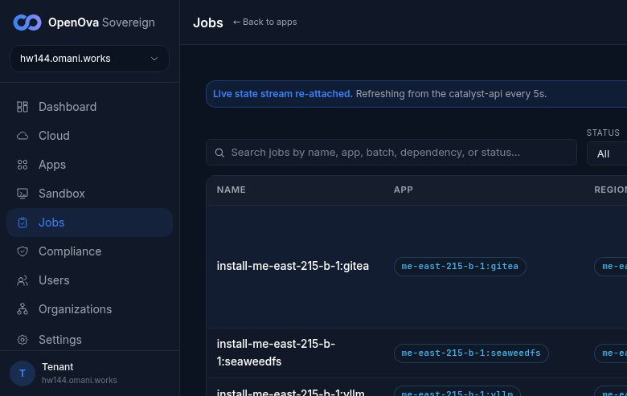
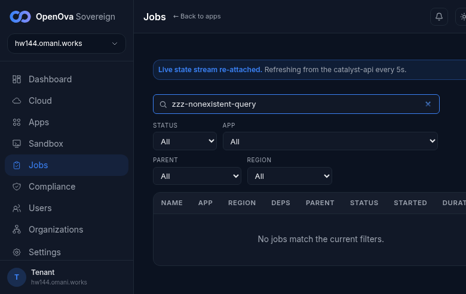
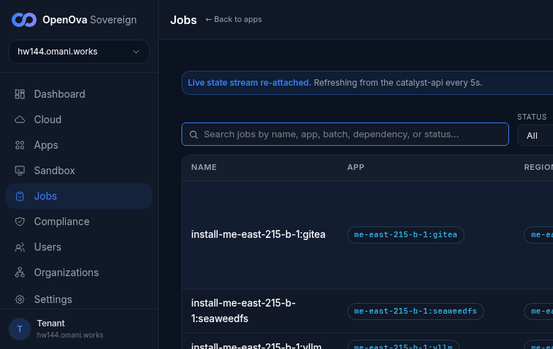

# UAT Walkthrough — #3367 Jobs search crash on imported rows

**Ticket:** #3367 — *Jobs search crashes the page on imported rows: 'Cannot read properties of undefined (reading toLowerCase)' — the search predicate assumed a field handover-imported jobs omit.*
**Fix:** PR #3372 (merged) — makes the `matchJob` search predicate null-safe: every string field (`jobName`, `displayName`, `appId`, `parentId`, `status`) is guarded before `.toLowerCase()`, and the `dependsOn` array is read with a `?? []` default, so handover-imported rows (the Provision/Bootstrap rows the mothership export stamps, with empty App/Deps cells rendered as `—`) no longer throw when matched against an otherwise-empty result set.
**Live env:** **hw144.omani.works** — deployment `d8e798bdf1b4256b`, Huawei `me-east-215`, **2-region** (`me-east-215-a` primary + `me-east-215-b` spoke). Console `bp-catalyst-platform@1.4.638`. This walk records hw144 state only — no carryover from any prior env (re-staled from the previous hw139 evidence).
**Walk date:** 2026-06-15 — 100% browser (headless Playwright), signed in zero-click via handover JWT as sovereign-admin (handover URL landed on `/dashboard`, 0 password fields). The Pillar-5 cutover was actively driving on hw144 during this walk; the walk is strictly **read-only** (search-and-clear only, no env writes).

An `error` + `console.error` listener was registered on the page **before** typing into the search box. `/jobs` rendered the full table (`bodyLen 5460`, not a white-screen — `whiteScreen=false`) with the STATUS / APP / PARENT / REGION filter dropdowns and a search box, and **142 data rows** (143 incl. header) carrying the Name / App / Region / Deps / Parent / Status / Started / Duration columns. The search box was then driven character-by-character with a deliberately-non-matching term (`zzz-nonexistent-query`) so that `matchJob` runs across **every** row and produces an **empty** result set — the exact array-empty path #3367 crashed on. The captured arrays stayed empty (`pageErrors: []`, `toLowerCase crashes: 0`). Clearing the box restored the full list.

| Go to URL | Then do | You should see | result |
| --- | --- | --- | --- |
| [console.hw144.../jobs](https://console.hw144.omani.works/jobs) | Land on the page | `/jobs` loads the jobs table — **not a white-screen / error boundary** (`whiteScreen=false`, body length 5460). The STATUS (All/running/pending/succeeded/failed), APP (All + every `bp-*`, including `self-sovereign-cutover` and `me-east-215-b-1:self-sovereign-cutover`), PARENT, and REGION filter dropdowns plus the search box all render. **142 rows** render with real install/job history — the cutover Jobs (`install-self-sovereign-cutover` primary **Succeeded** + `install-me-east-215-b-1:self-sovereign-cutover` region-b **Succeeded**) and bootstrap install rows for both regions (gitea, seaweedfs, vllm, nats-jetstream, sandbox) all appear. Status mix on the live env: 114 Succeeded / 20 Running / 8 Failed. | ✅ |  |
| [console.hw144.../jobs](https://console.hw144.omani.works/jobs) | Type `zzz-nonexistent-query` in the search box | `matchJob` runs against every rendered row (including handover-imported Bootstrap rows missing `appId`/`parentId`) and matches none → counter `0/144`, the table shows the empty-state. **NO 'Cannot read properties of undefined (reading toLowerCase)'** — the #3372 fix. Page fully rendered (search box + 4 filter dropdowns + table header + empty-state); the registered `error`/`console.error` listeners captured **0** errors during this scope (`pageErrors: []`), **0** `toLowerCase` crashes. Pre-fix, matching against an empty array threw on the first imported row with an undefined field. | ✅ |  |
| [console.hw144.../jobs](https://console.hw144.omani.works/jobs) | Clear the search box | The full list restores — counter back to `142/144`, all 142 rows re-render; still **0** pageerrors and **0** `toLowerCase` crashes captured. | ✅ |  |

**Result:** ✅ 3 / 3. **#3367 reproduces fixed on the live 2-region prov hw144.** The `/jobs` page renders the full 142-row table (no white-screen), searching with a term that yields an empty result set — the exact path #3367 crashed on — filters cleanly to `0/144` with the empty-state, and clearing restores the list. The captured pageerror array is `[]` and `toLowerCase` crash count is `0` across the entire walk. PR #3372 verified fixed on hw144.

**Gaps:** none. The walk drives the empty-result search path directly (the row-set whose match returns nothing), which is the regression #3367 documents; no acceptance row fails. The walk is read-only (search-and-clear) — no env writes, safe alongside the in-flight cutover.
