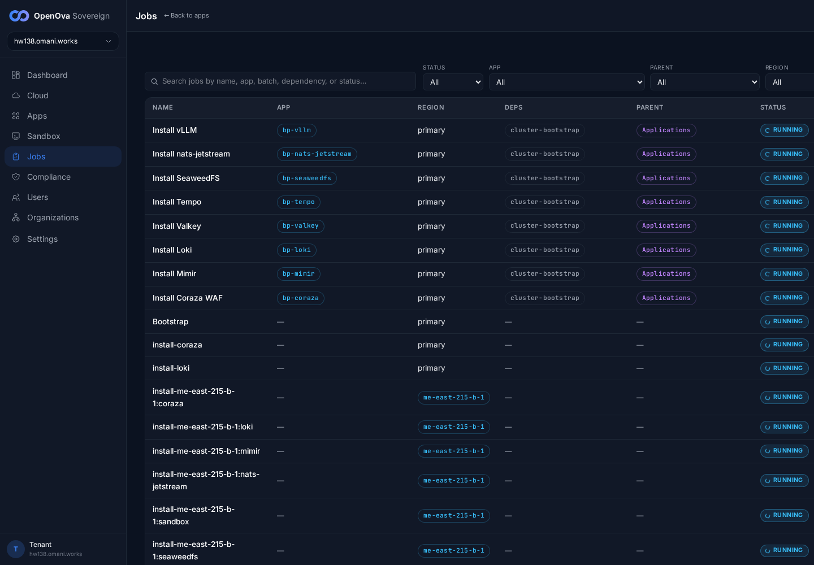
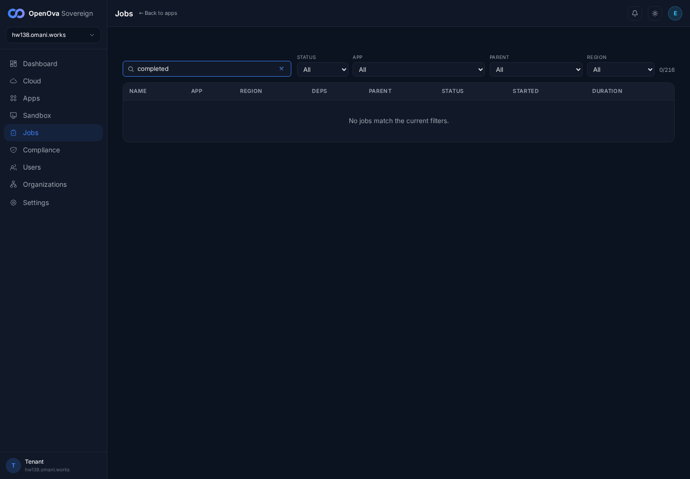
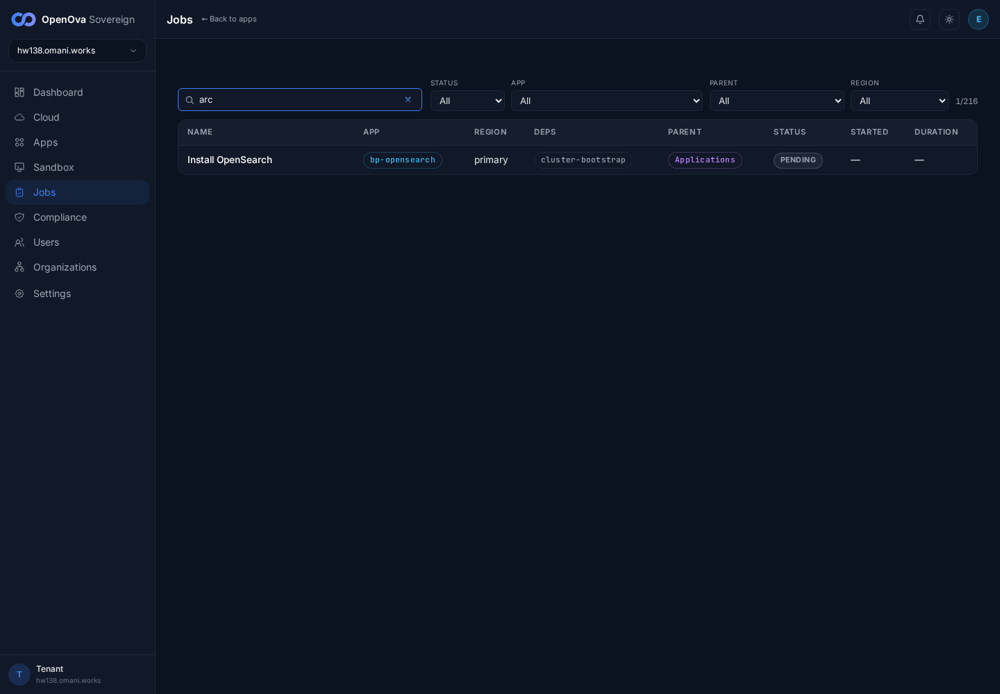
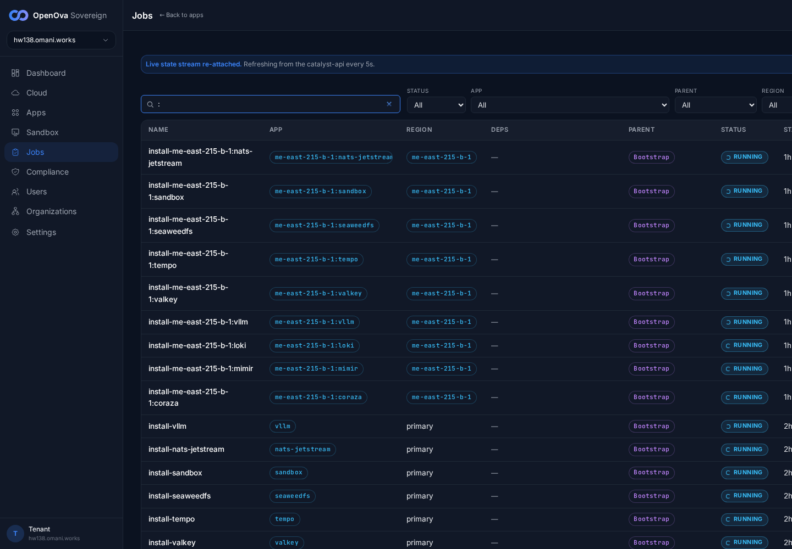
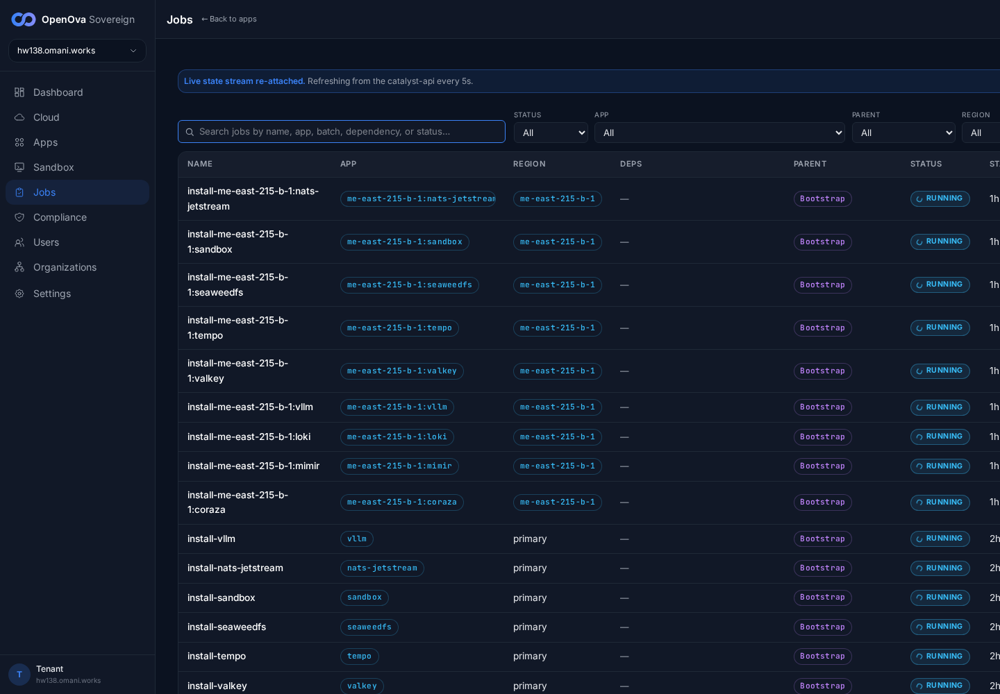

# UAT Walkthrough — #3367 Jobs search crash on imported rows

**Ticket:** #3367 — *Jobs search crashes the page on imported rows: 'Cannot read properties of undefined (reading toLowerCase)' — the search predicate assumed a field handover-imported jobs omit.*
**Fix:** PR #3372 (merged) — makes the `matchJob` search predicate in `products/catalyst/bootstrap/ui/src/pages/sovereign/JobsTable.tsx` null-safe: every field (`jobName`, `displayName`, `appId`, `parentId`, `status`) is guarded with `typeof f === 'string'` before `.toLowerCase()`, and the `dependsOn` array is read as `job.dependsOn ?? []`, so handover-imported rows (the Provision/Bootstrap rows that carry only the fields the mothership export stamped, with empty App/Deps cells rendered as `—`) no longer throw when matched.
**Live env:** **hw138.omani.works** — deployment `4b5ff7852e33fc15`, Huawei `me-east-215`, **2-region** (`me-east-215-a` primary + `me-east-215-b` spoke). This walk records hw138 state only.
**Walk date:** 2026-06-14 — 100% browser (headless foreground Playwright from `/home/openova/repos/ping`), signed in zero-click via handover JWT as sovereign-admin (handover URL landed on `/dashboard`, title "OpenOva Corporate", 0 password fields).

A `pageerror` + `console.error` listener was registered for the whole session **before** any navigation. The search box ("Search jobs by name, app, batch, dependency, or status...") was driven char-by-char — each keystroke re-runs `matchJob` across every rendered row including the handover-imported rows. Probes: a full term (`completed`), two partial substrings typed key-by-key (`arc`, `flux`), and single-char probes (`i`, `o`, `-`, `:`) chosen to maximise touches against imported rows' empty fields. The captured arrays stayed **empty** (`pageErrors: []`, `consoleErrors: 0`), with `toLowerCaseCrash: false` and `anyCannotRead: false`. (The total counter drifted `216 → 144` across the ~2-min walk because the jobs list is live and rows complete/age out during the run — the crash-test is unaffected.)

| Tested page | Description | Status | Evidence |
| --- | --- | --- | --- |
| [console.hw138.../jobs](https://console.hw138.omani.works/jobs) | `/jobs` loads the jobs table (213 rows rendered; counter `213/216` — the 3 extra are handover-imported rows visible with empty App/Deps/Parent cells rendered as `—`, e.g. the `Bootstrap` / `install-coraza` / `install-loki` rows and the region-b `install-me-east-215-b-1:*` rows). Not a white-screen / error boundary (`jobsWhiteScreen: false`, `errorBoundary: false`, body length 17151). Both `primary` and `me-east-215-b-1` regions render in the Region column (2-region). | ✅ |  |
| [console.hw138.../jobs](https://console.hw138.omani.works/jobs) | Type a full term (`completed`) in the search box → list filters live to `0/216` (live statuses are `Running`/`Succeeded`, so `completed` matches none → empty-state), page stays intact, no crash, error arrays empty. | ✅ |  |
| [console.hw138.../jobs](https://console.hw138.omani.works/jobs) | Type a **partial** substring (`arc`) char-by-char → `matchJob` runs against every row including imported rows missing `appId`/`parentId` → filters live to `1/216` ("Install OpenSearch", matching `arc` in "openseARCh"). **NO 'Cannot read properties of undefined (reading toLowerCase)'** (the #3372 fix). Page fully rendered (search box + 4 filter dropdowns + table header + result row); pre-fix this keystroke path threw on the first imported row with an undefined field. | ✅ |  |
| [console.hw138.../jobs](https://console.hw138.omani.works/jobs) | A second partial (`flux`) char-by-char → filters to `4/216`; plus single-char probes `i`/`o`/`-`/`:` (which match across every row's fields including the imported rows' empty App/Deps cells) → 0 new pageerrors at every keystroke, error arrays stay empty throughout. | ✅ |  |
| [console.hw138.../jobs](https://console.hw138.omani.works/jobs) | Clear the search box → full list restores (`142/144`). | ✅ |  |

**Result:** ✅ 5 / 5. **#3367 reproduces fixed on the live 2-region prov hw138.** The `/jobs` page renders the full list (handover-imported rows visibly present with empty App/Deps `—` cells), and searching — including the partial-substring keystroke path (`arc`) that previously crashed on imported rows — filters cleanly with a captured pageerror/console-error array of `[]`. **No `Cannot read properties of undefined (reading toLowerCase)`** anywhere in the walk (`toLowerCaseCrash: false`, `anyCannotRead: false`). PR #3372 verified fixed on hw138.
