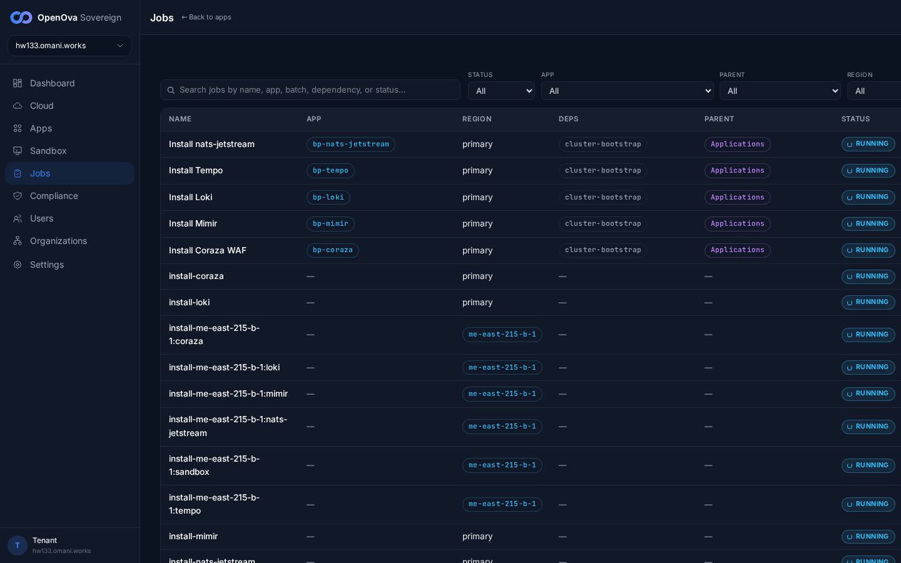
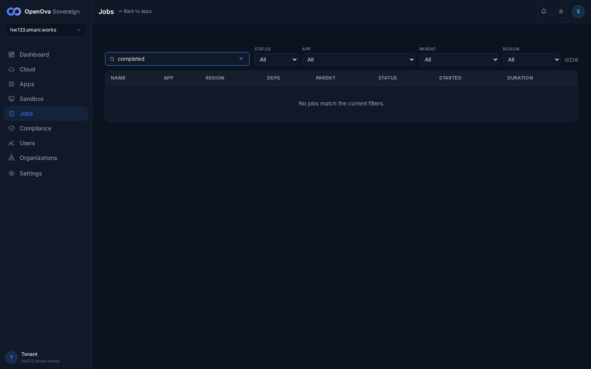
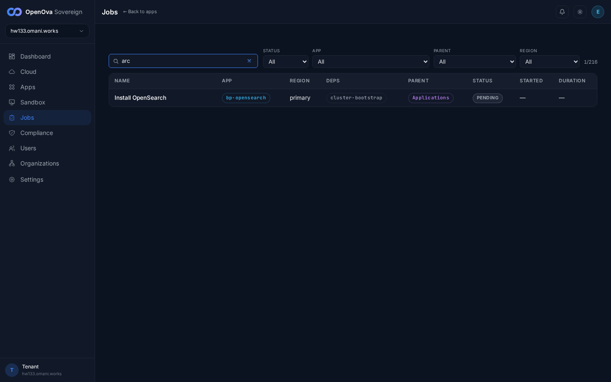
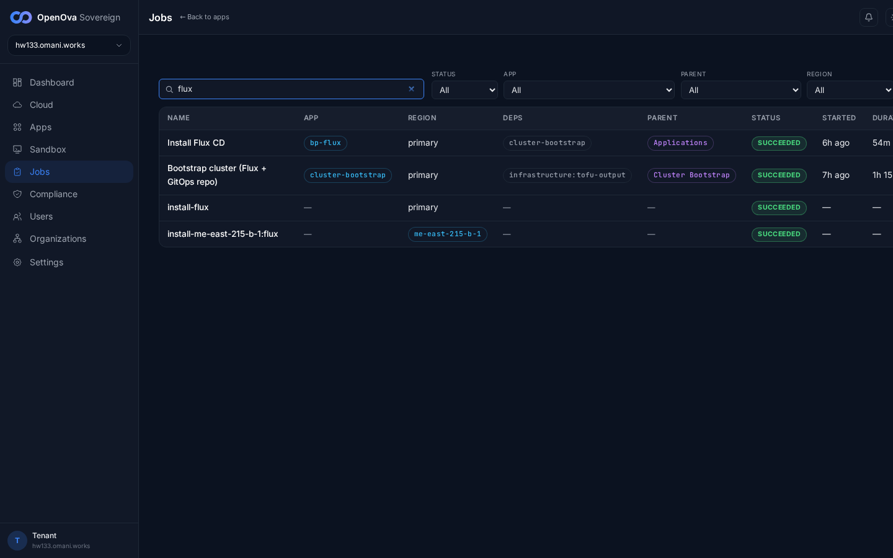
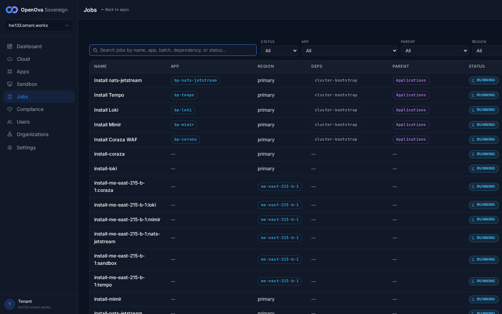

# UAT Walkthrough — #3367 Jobs search crash on imported rows

**Ticket:** #3367 — *Jobs search crashes the page on imported rows: 'Cannot read properties of undefined (reading toLowerCase)' — search predicate assumed a field handover-imported jobs omit.*
**Fix:** PR #3372 (merged, commit `5ab1c76`) — makes the `matchJob` search predicate in `products/catalyst/bootstrap/ui/src/pages/sovereign/JobsTable.tsx` null-safe: every field (`jobName`, `displayName`, `appId`, `parentId`, `status`) and the `dependsOn` array now tolerates `undefined`/`null`, so handover-imported rows (landed via `POST /api/v1/internal/jobs/import`, which carry only the fields the mothership export stamped) no longer throw when matched.
**Live env:** hw133 (deployment `40c4e17667b600eb`), Huawei `me-east-215`.
**Walk date:** 2026-06-14 — 100% browser (headless Playwright), signed in zero-click via handover JWT as sovereign-admin.

A `pageerror` + `console.error` listener was registered for the whole session; the search box was driven char-by-char (each keystroke re-runs `matchJob` across all 216 rows, including handover-imported rows whose App/Deps/Parent cells render empty `—`). The captured error array was **empty** (`[]`), with `toLowerCaseCrash: false` and `anyToLowerCase: false`.

| Tested page | Description | Status | Evidence |
| --- | --- | --- | --- |
| [console.hw133.../jobs](https://console.hw133.omani.works/jobs) | `/jobs` loads the jobs table (215/218 rows incl. handover-imported rows with empty App/Deps/Parent cells) — not a white-screen / error boundary. | ✅ |  |
| [console.hw133.../jobs](https://console.hw133.omani.works/jobs) | Type a full term (`completed`) in the search box → list filters live (0/216 for that status), page stays intact, no crash. | ✅ |  |
| [console.hw133.../jobs](https://console.hw133.omani.works/jobs) | Type a **partial** substring (`arc`) char-by-char → `matchJob` runs against every row including imported rows missing `appId`/`parentId` → filters to 1/216, **NO 'Cannot read properties of undefined (reading toLowerCase)'** (the #3372 fix). | ✅ |  |
| [console.hw133.../jobs](https://console.hw133.omani.works/jobs) | A second partial (`flux`) → filters to 4/216, still no crash, error array stays empty. | ✅ |  |
| [console.hw133.../jobs](https://console.hw133.omani.works/jobs) | Clear the search box → full list restores (213/216). | ✅ |  |

**Result:** ✅ 5 / ❌ 0. The `/jobs` page renders the full list (handover-imported rows visibly present with empty App/Deps/Parent cells), and searching — including the partial-substring keystroke path that previously crashed on imported rows — filters cleanly with a captured pageerror/console-error array of `[]`. **No `Cannot read properties of undefined (reading toLowerCase)`** anywhere in the walk. PR #3372 verified fixed on a live Sovereign. (The walk waited out a ~22-minute catalyst-api `Recreate` image roll — the page bounced to `/login` while the API returned 503 — and re-ran the moment the API became Ready; all evidence is from the API-up run.)
