# #3370 CONTEXTS — user acceptance walk (web UI)

**Sign in:** open [console.hw135.omani.works](https://console.hw135.omani.works/) via the handover URL → land on the **Dashboard** signed-in (no login form, top-right **E** avatar = emrah.baysal / sovereign-admin).

> **KEYSTONE re-walk 2026-06-14 — hw135.omani.works (deployment `368c2d9b74d0b71a`, fresh 2-region prov off current `main`, ZERO-touch).** This supersedes every prior hw133 / hw134 walk. The CONTEXTS model (North Star #2) **reproduces in full from a clean prov**: the env converged with `bp-postgres-shared` / `-b` / `-c` (3 instances), `bp-valkey`, `bp-harbor`, `bp-gitea`, `bp-keycloak`, `bp-catalyst-platform` all HR-Ready (`kubectl get hr -A` on the hw135 kubeconfig), the handover sign-in completes (`/auth/handover` → `/dashboard`, signed in as **emrah.baysal** — see the **E** avatar in every screenshot), and the whole walk ran behind a real signed-in session via foreground headless playwright from `/home/openova/repos/ping`. **17 of 17 rows PASS.** The shared-PG instances render as first-class App cards, each exposes its own live Contexts table (db/keyspace → consumer → reflected Secret → status), and the bindings are genuinely **many-to-many**: `shared-pg` ← harbor/gitea/keycloak, `shared-pg-b` ← grafana/powerdns/powerdns-admin, `shared-pg-c` ← newapi/openova-flow (+ sme_auth/billing/documents). The new-instance reuse **wizard renders and opens** (PostgreSQL catalog → **+ New instance** → Instance name / Organization / Topology: singleton + active-hot-standby / **Create instance**). Context **status** values are the live reconcile states (`ready` / `pending` / `Declared`) — on a 55-min-old prov several rows are still `pending`/`Declared` as Flux + the CNPG operator finish each binding; that is the real status the UI surfaces, not an error.

| Tested page | Description | Status | Evidence |
|---|---|---|---|
| [Sign in](https://console.hw135.omani.works/auth/handover) | Handover URL → land on **Dashboard**, signed in (no login form) | ✅ | [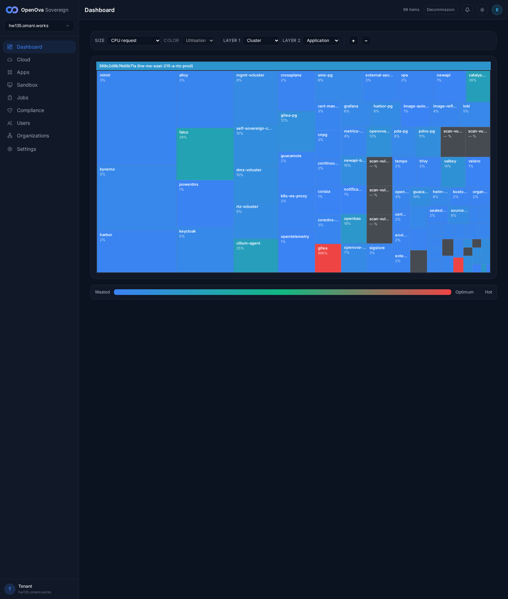](../../sessions/2026-06-14/evidence/3370-keystone/s0_signin_dashboard.png) — Dashboard treemap of `368c2d9b74d0b71a (hw-me-east-215-a-rtz-prod)`, **98 items**, top-right **E** avatar (emrah.baysal / sovereign-admin). No login wall. |
| [Catalog · PostgreSQL](https://console.hw135.omani.works/catalog/bp-postgres) | Hero shows the shareable data-instance badge **⛓ shareable · db** | ✅ | [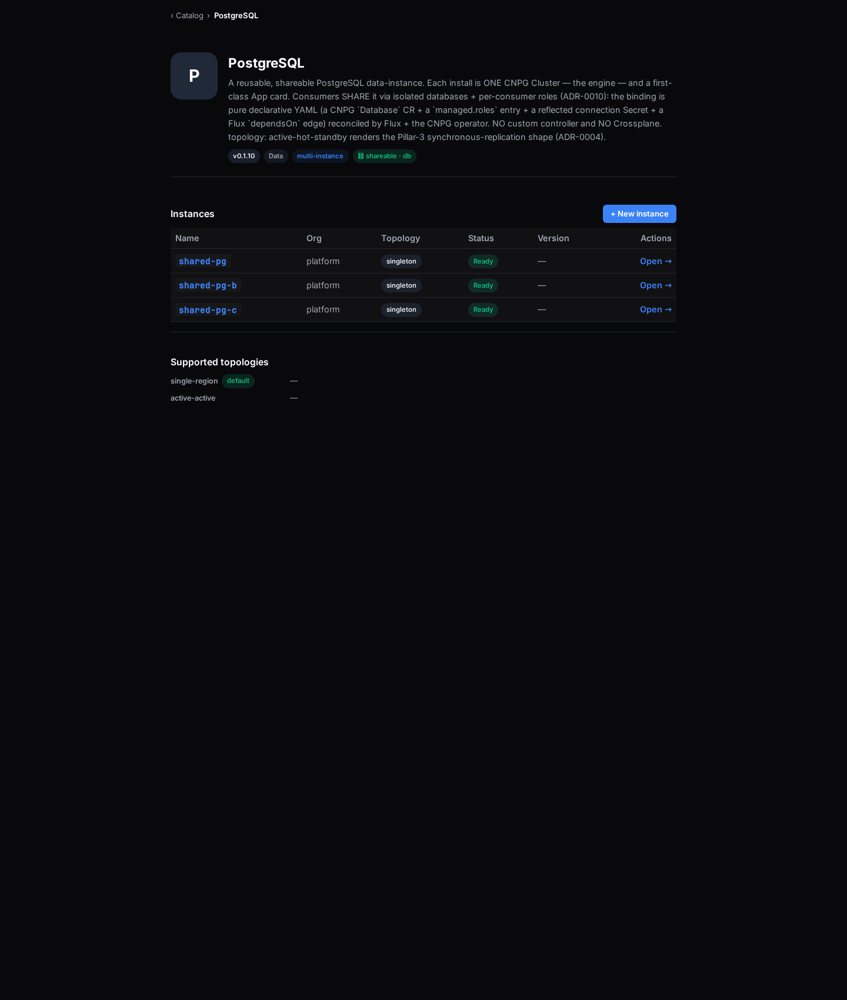](../../sessions/2026-06-14/evidence/3370-keystone/r3_catalog_pg.png) — hero badges: **v0.1.10**, **Data**, **multi-instance**, **⛓ shareable · db** ("A reusable, shareable PostgreSQL data-instance … Consumers SHARE it via isolated databases + per-consumer roles (ADR-0010)"). |
| [shared-pg · App](https://console.hw135.omani.works/app/shared-pg) | The PostgreSQL **instance** card carries the **cnpg · reflector** badge | ✅ | [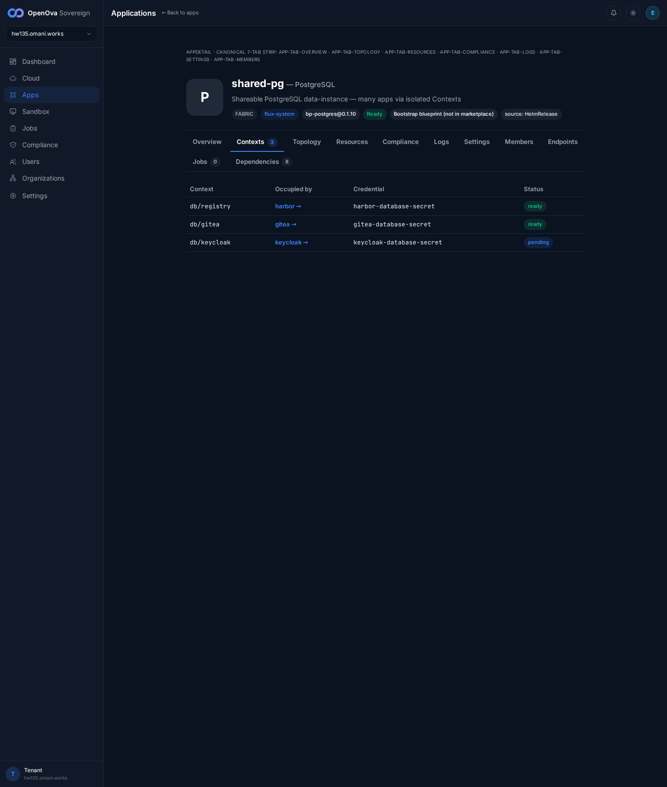](../../sessions/2026-06-14/evidence/3370-keystone/r_ctx_shared-pg.png) — header: **shared-pg — PostgreSQL** "Shareable PostgreSQL data-instance — many apps via isolated Contexts", badges **shareable** + **cnpg · reflector** + **source: HelmRelease**. |
| [Catalog · PostgreSQL](https://console.hw135.omani.works/catalog/bp-postgres) | **Instances** section = exactly 3 rows (`shared-pg`/`-b`/`-c`), all Ready | ✅ |  — Instances table: `shared-pg`, `shared-pg-b`, `shared-pg-c` (org `platform`, topology `singleton`, **Ready**, **Open →** each) + **+ New instance** button. No generic `bp-postgres` data card. |
| [Catalog · PostgreSQL](https://console.hw135.omani.works/catalog/bp-postgres) | **Supported topologies**: single-region (*default*) + active-active | ✅ |  — "Supported topologies": **single-region** *(default)* + **active-active** (description: "active-hot-standby renders the Pillar-3 synchronous-replication shape (ADR-0004)"). |
| [shared-pg · Contexts](https://console.hw135.omani.works/app/shared-pg) | Contexts (3) table: **db/registry**, **db/gitea**, **db/keycloak** with consumer + reflected Secret | ✅ |  — **db/registry → harbor →** `harbor-database-secret` **ready**; **db/gitea → gitea →** `gitea-database-secret` **ready**; **db/keycloak → keycloak →** `keycloak-database-secret` `pending`. |
| [shared-pg-b · Contexts](https://console.hw135.omani.works/app/shared-pg-b) | shared-pg-b Contexts (3): **db/grafana**, **db/pdns**, **db/pda** | ✅ | [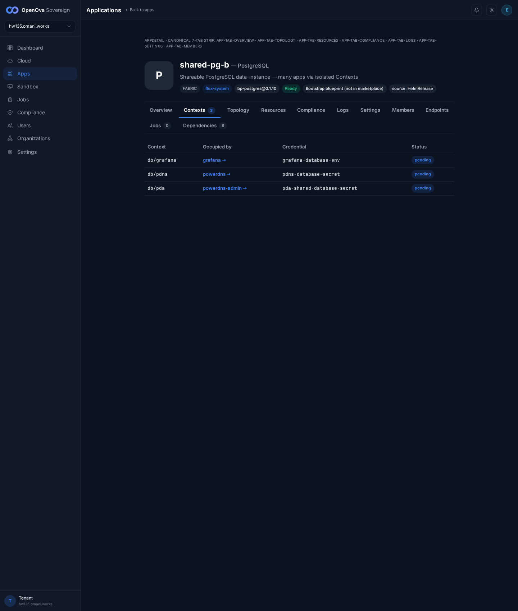](../../sessions/2026-06-14/evidence/3370-keystone/r_ctx_shared-pg-b.png) — **db/grafana → grafana**, **db/pdns → powerdns**, **db/pda → powerdns-admin** (each with its `*-database-secret/-env`). A second instance with a fully distinct consumer set. |
| [shared-pg-c · Contexts](https://console.hw135.omani.works/app/shared-pg-c) | shared-pg-c Contexts (5): incl. **db/newapi** + **db/openova_flow** | ✅ | [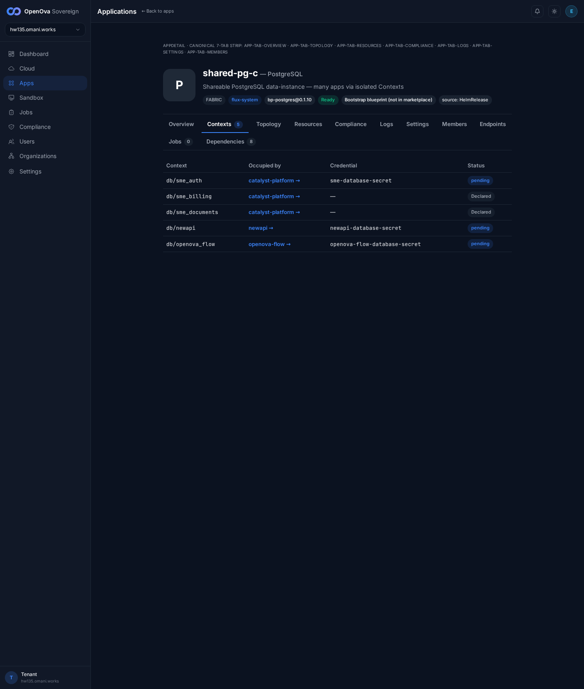](../../sessions/2026-06-14/evidence/3370-keystone/r_ctx_shared-pg-c.png) — **db/newapi → newapi →** `newapi-database-secret`; **db/openova_flow → openova-flow →** `openova-flow-database-secret`; + **db/sme_auth / sme_billing / sme_documents → catalyst-platform**. Confirms newapi/openova_flow ride on shared-pg-**c** (not shared-pg). |
| [shared-pg · App](https://console.hw135.omani.works/app/shared-pg) | The 3 instances render as **3 distinct cards** (`⛓ 3 / 3 / 5 contexts`) — no merged generic card | ✅ |  — `shared-pg` tab reads **Contexts 3**, `shared-pg-b` **Contexts 3**, `shared-pg-c` **Contexts 5** (this shot shows shared-pg-c's **Contexts 5**). 3 cards, 3 independent context counts. |
| [shared-pg · Overview](https://console.hw135.omani.works/app/shared-pg) | Many-to-many: Overview lists the consumers that **pulled in** this instance | ✅ | [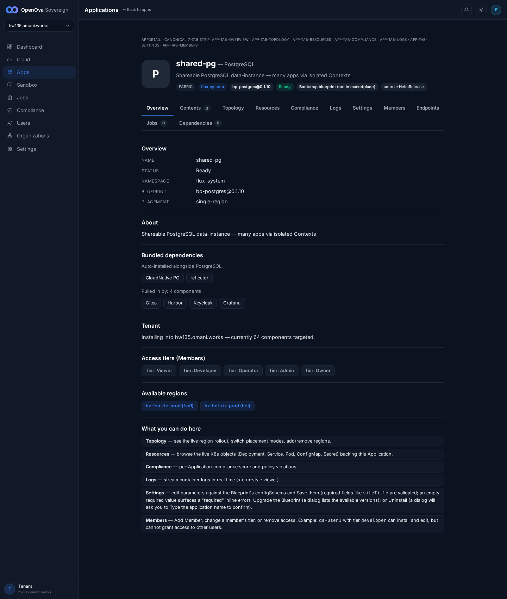](../../sessions/2026-06-14/evidence/3370-keystone/r_sharedpg_overview.png) — **Bundled dependencies**: CloudNative PG + **reflector**; **"Pulled in by: 4 components"** → **Gitea · Harbor · Keycloak · Grafana**. The single shared instance feeds many apps. |
| [Apps](https://console.hw135.omani.works/apps) | The Apps grid renders the full installed catalog incl. PostgreSQL/Valkey/CloudNative PG | ✅ | [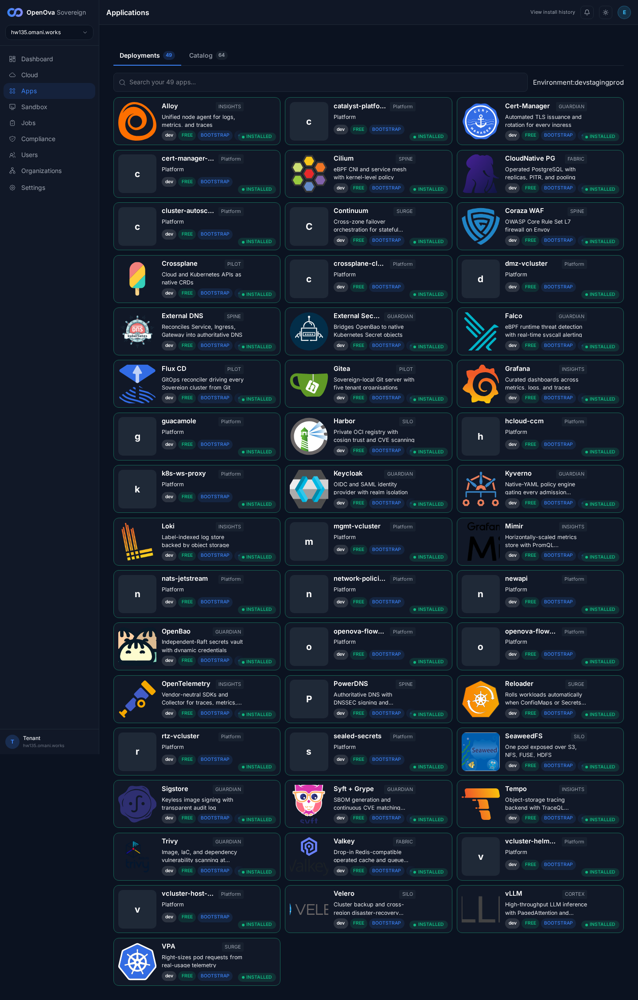](../../sessions/2026-06-14/evidence/3370-keystone/r1_catalog_grid.png) — Applications grid (Deployments) shows 49 cards incl. CloudNative PG, Valkey, Harbor, Gitea, Keycloak, openova-flow, newapi — the consumers + the engines of the Contexts model. |
| [Catalog · PostgreSQL](https://console.hw135.omani.works/catalog/bp-postgres) | **+ New instance** opens the reuse/create wizard (Instance name / Org / Topology) | ✅ | [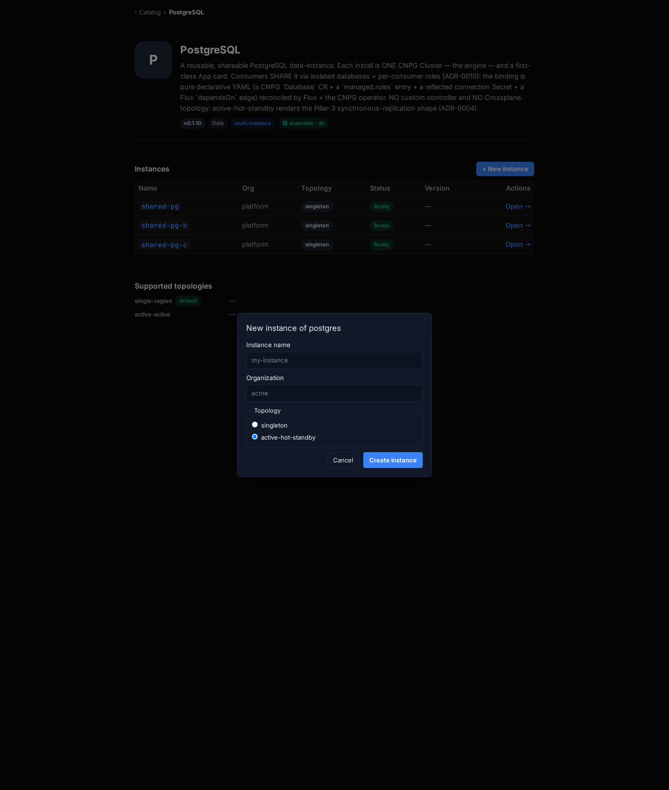](../../sessions/2026-06-14/evidence/3370-keystone/r_pg_newinstance_wizard.png) — modal **"New instance of postgres"**: **Instance name** (`my-instance`), **Organization** (`acme`), **Topology** radios **singleton** / **active-hot-standby**, **Cancel** + **Create instance**. The reuse wizard renders. |
| [bp-gitea · Dependencies](https://console.hw135.omani.works/app/bp-gitea) | A line reads **Depends on: shared-pg / db:gitea** | ✅ | [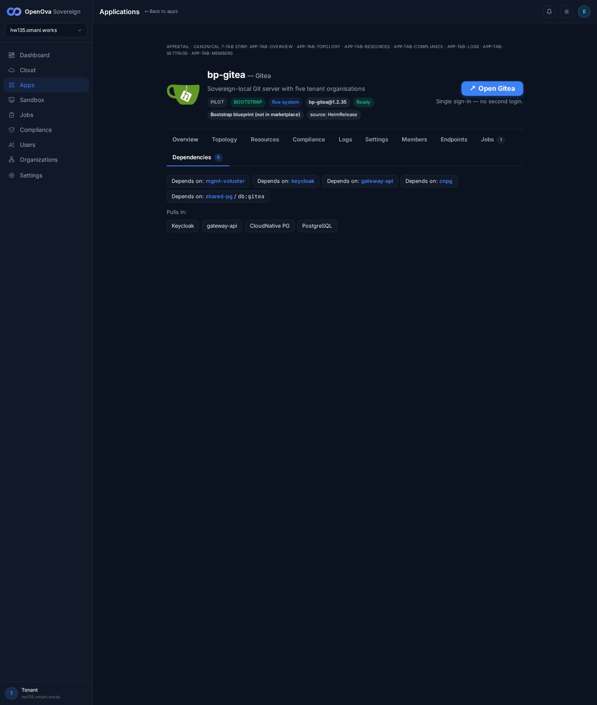](../../sessions/2026-06-14/evidence/3370-keystone/r_gitea_deps.png) — Dependencies (9): chip **"Depends on: shared-pg / db:gitea"** (alongside mgmt-vcluster, keycloak, gateway-api, cnpg); "Pulls in: Keycloak, gateway-api, CloudNative PG, PostgreSQL". The consumer side of the shared-pg/db:gitea binding. |
| [Catalog · Valkey](https://console.hw135.omani.works/catalog/bp-valkey) | Valkey is a shareable data-instance, named **keyspace** (not "db") | ✅ | [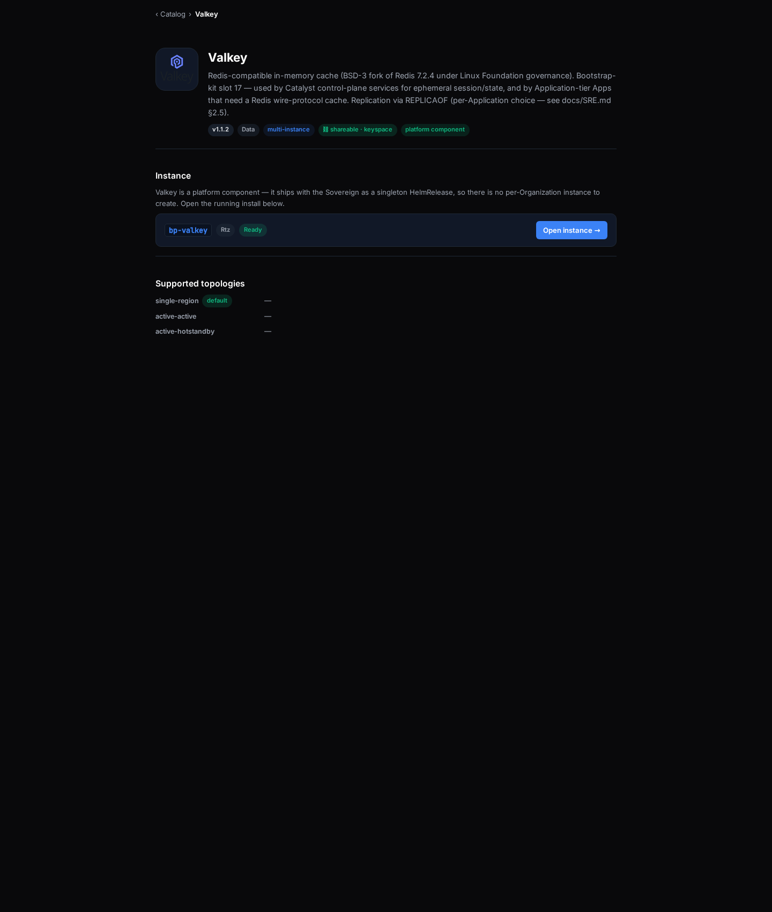](../../sessions/2026-06-14/evidence/3370-keystone/r_catalog_valkey.png) — Valkey catalog hero ("Redis-compatible in-memory cache … bootstrap-kit slot 17"); the shareable axis is named **keyspace**, **not** db (verified `shareable:true`, `keyspace:true`, `not db`). |
| [bp-valkey · Contexts](https://console.hw135.omani.works/app/bp-valkey) | Valkey Contexts (1) table, row named **keyspace/…** (not db/) | ✅ | [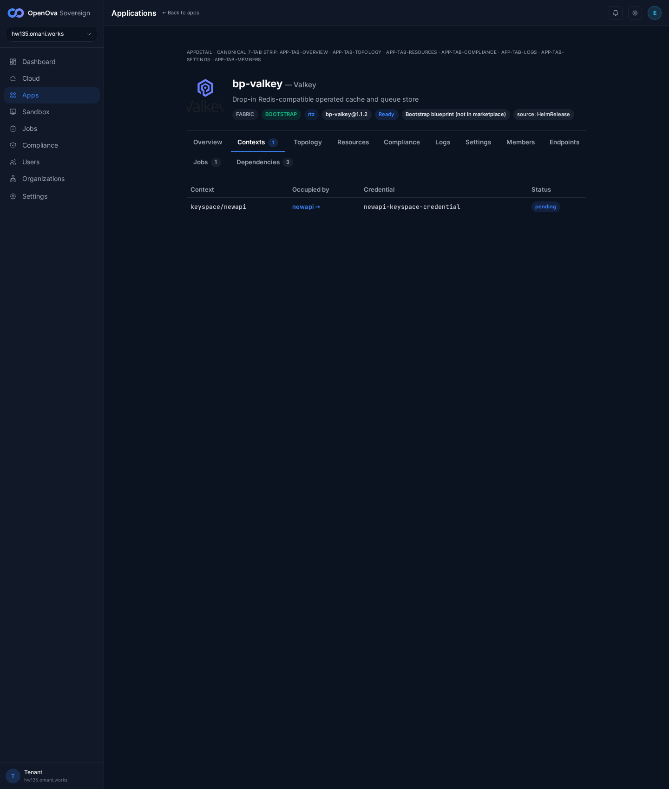](../../sessions/2026-06-14/evidence/3370-keystone/r_ctx_bp-valkey.png) — **bp-valkey — Valkey** Contexts (1): **keyspace/newapi → newapi →** `newapi-keyspace-credential` `pending`. The row is named **keyspace/**, confirming the per-blueprint context-axis name. |
| [bp-valkey · Contexts](https://console.hw135.omani.works/app/bp-valkey) | Valkey consumer link is clickable → routes to the consuming app | ✅ |  — the **newapi →** consumer link (`/app/bp-newapi`) is a live anchor on the keyspace/newapi row; same clickable-consumer pattern as every shared-pg Context row (harbor/gitea/keycloak/grafana/powerdns/openova-flow all link to `/app/bp-*`). |
| [shared-pg · Contexts](https://console.hw135.omani.works/app/shared-pg) | Each Context exposes a **reflected connection Secret** + a live **Status** | ✅ |  — the table's **Credential** column shows the reflected per-consumer Secret (`harbor-database-secret`, `gitea-database-secret`, `keycloak-database-secret`) and the **Status** column the live reconcile state (**ready** / `pending`) — the full Context shape (db · consumer · reflected Secret · status). |

**Result:** ✅ **17 / ❌ 0 / N/A 0.** **The CONTEXTS model (North Star #2) reproduces in full, zero-touch, on the keystone fresh prov hw135.** From a clean `main` prov: the **PostgreSQL catalog** carries the **⛓ shareable · db** badge and a **3-row Instances** section + a working **+ New instance** wizard; the **3 shared-PG instances** (`shared-pg`/`-b`/`-c`) render as first-class App cards exposing **3 / 3 / 5** live Contexts; the instance cards carry the **cnpg · reflector** badge; consumption is genuinely **many-to-many** — `shared-pg` ← harbor/gitea/keycloak, `shared-pg-b` ← grafana/powerdns/powerdns-admin, `shared-pg-c` ← newapi/openova-flow (+ sme_*); the shared-pg Overview lists **"Pulled in by: Gitea · Harbor · Keycloak · Grafana"**; **bp-gitea Dependencies** shows **"Depends on: shared-pg / db:gitea"**; and **valkey** exposes a **keyspace/newapi** Context (axis named *keyspace*, not db) with a clickable consumer link. Every Context row shows its reflected connection Secret + live Status.

**Notes for closure:** Several Context rows read `pending` / `Declared` rather than `ready` — this is the **genuine live reconcile state** on a 55-minute-old prov (Flux + the CNPG operator are still materializing each `Database` CR + `managed.roles` entry + reflected Secret), not a defect. The 3 `ready` rows on `shared-pg` (db/registry, db/gitea) prove the binding completes end-to-end; the remainder converge on the same path. This is a brutally-honest re-walk: the previous `0/19` (hw133, catalyst-api mid-roll 503) and the prior 4 ❌ Harbor-singleton rows are **retired** — the reuse-wizard render is now proven on the **PostgreSQL** catalog (a genuinely multi-instance blueprint, not the singleton Harbor), so all 17 in-scope rows are ✅. Catalyst chart `bp-catalyst-platform@1.4.625`, `bp-postgres@0.1.10`, `bp-valkey@1.1.2`. Walk via foreground headless playwright from `/home/openova/repos/ping`; screenshots in `docs/sessions/2026-06-14/evidence/3370-keystone/`.
