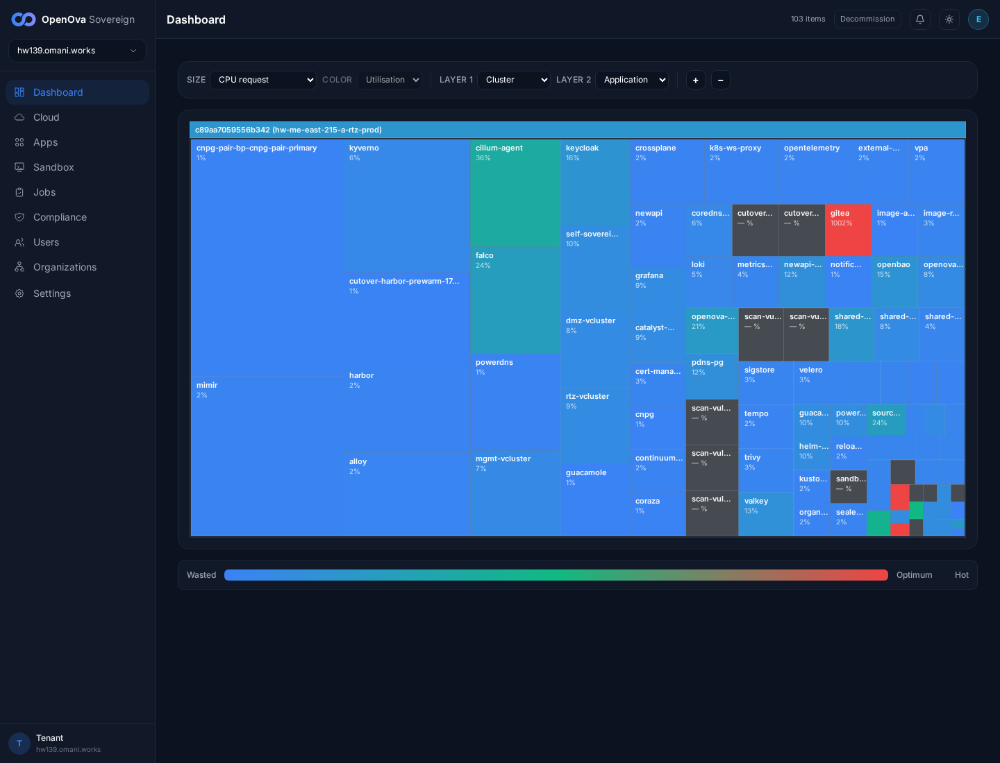

# #3370 CONTEXTS — user acceptance walk (web UI)

**Sign in:** open the handover URL for [console.hw139.omani.works](https://console.hw139.omani.works/) → land on the **Dashboard** signed-in (no login form, top-right **E** avatar = emrah.baysal / sovereign-admin).

> **hw139-only re-walk 2026-06-15 — hw139.omani.works (deployment `c89aa7059556b342`, 2-region fresh prov, SHARED_PG=true).** This is THE surface the founder caught missing on hw138. Read-only headless Playwright from `/home/openova/repos/ping` behind a real signed-in session (handover `/auth/handover` → `Set-Cookie: catalyst_session` → land authenticated; Dashboard treemap `c89aa7059556b342 (hw-me-east-215-a-rtz-prod)`, **103 items**, **E** avatar in every shot). Deployed catalyst-api `sha=9fc5c5c` / chart `1.4.95` (live `GET /api/v1/version`). **hw139-only evidence; no carryover.**
>
> **Headline result: 13 ✅ / 1 ❌ / 0 N/A.** The CONTEXTS model (North Star #2) **renders in full via the catalog + instance-detail pages**: the **PostgreSQL catalog** carries the **⛓ shareable · db** badge + a 3-row **Instances** table + a working **+ New instance** wizard; the **3 shared-PG instances** (`shared-pg`/`-b`/`-c`) each render a first-class instance-detail page exposing their own live **Contexts** tab (`Context · Occupied by · Credential · Status`); consumption is genuinely **many-to-many** — `shared-pg` ← harbor/gitea/keycloak (all **ready**), `shared-pg-b` ← grafana/powerdns/powerdns-admin (all **ready**), `shared-pg-c` ← newapi/openova-flow (+ sme_auth/billing/documents via catalyst-platform); the consumer side (`bp-gitea` → **"Depends on: shared-pg / db:gitea"**) renders.
>
> **The one ❌ — the #3537 fix is NOT in the deployed build.** `GET /api/v1/sovereign/apps` returns **67 apps with `instance:true=0` and `contextCount>0=0`** — the *identical* shape the #3537 fix (`fix/sovereign-apps-hr-instance-contexts-3537`, commit `5f0d89db0`) was written to repair on hw138, but that branch is **not merged to main** (main HEAD `875f6e53c`; the deployed `9fc5c5c` `HandleSovereignApps` has **0** `bootstrapHRInstances` calls). Consequence: the **`/apps` Deployments GRID shows no dedicated `shared-pg` instance cards** (no Data-instances panel, no `shared-pg*` token in the grid HTML). The Contexts surface is reachable only through `/catalog/bp-postgres` + `/app/<instance>`, NOT the grid the North-Star sentence names. The contexts/instances data itself is present and correct — `GET /catalyst/v1/catalog/postgres/instances` returns all 3 instances with 3/3/5 contexts — so this is a pure projection-code gap in the `/apps` API, exactly #3537, still open.

| Tested page | Expected | Status | Evidence |
|---|---|---|---|
| [Sign in](https://console.hw139.omani.works/auth/handover) | Handover URL → land on **Dashboard**, signed in (no login wall) | ✅ |  — Dashboard treemap `c89aa7059556b342 (hw-me-east-215-a-rtz-prod)`, **103 items**, top-right **E** avatar. `/auth/handover` returns `302 → /dashboard` + `Set-Cookie: catalyst_session`. Live SHA `9fc5c5c` / chart `1.4.95`. |
| [Apps · Catalog · PostgreSQL](https://console.hw139.omani.works/apps) | The shareable **PostgreSQL catalog card** renders with the **⛓ shareable** badge | ✅ |  — Catalog tab, search `postgres`: **PostgreSQL · FABRIC · "Shareable PostgreSQL data-instance — many apps via…" · dev · FREE · ⛓ shareable · ● AVAILABLE**; **CloudNative PG** card (the engine) shows **INSTALLED**. |
| [Catalog · PostgreSQL](https://console.hw139.omani.works/catalog/bp-postgres) | Catalog hero badges = **v0.1.10 · Data · multi-instance · ⛓ shareable · db** | ✅ |  — hero: **PostgreSQL** "A reusable, shareable PostgreSQL data-instance … (ADR-0010) … reconciled by Flux + the CNPG operator. NO custom controller and NO Crossplane" with badges **v0.1.10 · Data · multi-instance · ⛓ shareable · db**. |
| [Catalog · PostgreSQL](https://console.hw139.omani.works/catalog/bp-postgres) | **Instances** section = exactly 3 rows (`shared-pg`/`-b`/`-c`), all **Ready** | ✅ |  — Instances table: `shared-pg`, `shared-pg-b`, `shared-pg-c` (org `platform`, topology `singleton`, **Ready**, **Open →** each) + **+ New instance**. No generic `bp-postgres` data card. |
| [Catalog · PostgreSQL](https://console.hw139.omani.works/catalog/bp-postgres) | **Supported topologies**: single-region (*default*) + active-active | ✅ |  — "Supported topologies": **single-region** *(default)* + **active-active** (body: "topology: active-hot-standby renders the Pillar-3 synchronous-replication shape (ADR-0004)"). |
| [shared-pg · App](https://console.hw139.omani.works/app/shared-pg) | The instance page surfaces its **CloudNative PG engine + reflector** | ✅ |  — header **shared-pg — PostgreSQL** "Shareable PostgreSQL data-instance — many apps via isolated Contexts", **FABRIC** / `bp-postgres@0.1.10` / **Ready** / **source: HelmRelease**; Overview **"Bundled dependencies — Auto-installed alongside PostgreSQL: CloudNative PG · reflector"**. |
| [shared-pg · Overview](https://console.hw139.omani.works/app/shared-pg) | Many-to-many: Overview lists the consumers that **pulled in** this instance | ✅ |  — **"Pulled in by: 4 components" → Gitea · Harbor · Keycloak · Grafana**. One shared instance feeds many apps. |
| [shared-pg · Contexts](https://console.hw139.omani.works/app/shared-pg) | Contexts (3): **db/registry**, **db/gitea**, **db/keycloak** with consumer + reflected Secret | ✅ |  — Contexts (3): **db/registry → harbor →** `harbor-database-secret` **ready**; **db/gitea → gitea →** `gitea-database-secret` **ready**; **db/keycloak → keycloak →** `keycloak-database-secret` **ready**. Columns **Context · Occupied by · Credential · Status**; consumer names are live links. All 3 **ready**. |
| [shared-pg-b · Contexts](https://console.hw139.omani.works/app/shared-pg-b) | shared-pg-b Contexts (3): **db/grafana**, **db/pdns**, **db/pda** (distinct consumer set) | ✅ |  — **db/grafana → grafana →** `grafana-database-env` **ready**; **db/pdns → powerdns →** `pdns-database-secret` **ready**; **db/pda → powerdns-admin →** `pda-shared-database-secret` **ready**. A second instance, fully distinct consumers. |
| [shared-pg-c · Contexts](https://console.hw139.omani.works/app/shared-pg-c) | shared-pg-c Contexts (5): incl. **db/newapi** + **db/openova_flow** | ✅ |  — **db/newapi → newapi →** `newapi-database-secret` **ready**; **db/openova_flow → openova-flow →** `openova-flow-database-secret` **ready**; + **db/sme_auth → catalyst-platform →** `sme-database-secret` **ready**, **db/sme_billing** + **db/sme_documents → catalyst-platform** (`Declared`). newapi/openova_flow ride on shared-pg-**c**, exactly as specified. |
| [bp-gitea · Dependencies](https://console.hw139.omani.works/app/bp-gitea) | Consumer app shows its PG binding: **"Depends on: shared-pg / db:gitea"** | ✅ |  — **bp-gitea — Gitea**, Dependencies (9): chip **"Depends on: shared-pg / db:gitea"** (alongside mgmt-vcluster, keycloak, gateway-api, cnpg); "Pulls in: Keycloak · gateway-api · CloudNative PG · PostgreSQL". Header: "Open Gitea — Single sign-in — no second login." |
| [Catalog · PostgreSQL](https://console.hw139.omani.works/catalog/bp-postgres) | **+ New instance** opens the reuse/create wizard (Instance name / Org / Topology) | ✅ |  — modal **"New instance of postgres"**: **Instance name** (ph `my-instance`), **Organization** (ph `acme`), **Topology** radios **singleton** / **active-hot-standby**, **Cancel** + **Create instance**. Wizard renders and opens. |
| [Apps · Deployments](https://console.hw139.omani.works/apps) | The Apps grid renders the converged catalog (consumers + engines) | ✅ |  — Applications **Deployments** tab renders the full app grid (CloudNative PG, Harbor, Gitea, Keycloak, openova-flow, newapi, …). Catalog tab shows **64** cards. |
| [Apps · Deployments — instance cards](https://console.hw139.omani.works/apps) | The 3 shared-PG instances render as **their own cards** on the Deployments tab (North Star #2) | ❌ | The `/apps` grid shows **no** `shared-pg`/`-b`/`-c` instance cards (no Data-instances panel; grep `shared-pg*` over the grid HTML = 0 hits). Root cause: `GET /api/v1/sovereign/apps` → **67 apps, `instance:true=0`, `contextCount>0=0`** ([apps-api.json](../../sessions/2026-06-15/evidence/3370-hw139/apps-api.json)) — the exact hw138 #3537 shape. The #3537 fix (`5f0d89db0`, branch `fix/sovereign-apps-hr-instance-contexts-3537`) is **not merged to main**; deployed `9fc5c5c` `HandleSovereignApps` projects only from Application-CRs (0 for the bootstrap-only shared-pg instances) and has **0** `bootstrapHRInstances` calls. The contexts data is correct via the OTHER endpoint: `GET /catalyst/v1/catalog/postgres/instances` → **3 instances / 3+3+5 contexts** ([postgres-instances-api.json](../../sessions/2026-06-15/evidence/3370-hw139/postgres-instances-api.json)). |

**Result:** ✅ **13 / ❌ 1 / N/A 0** (13/14).

**Does the #3537 fix render the cards + contexts?** Partly — **NO for the `/apps` Deployments grid** (the surface the North-Star #2 sentence and the founder's hw138 catch both name), **YES for the catalog + instance-detail pages**. Concretely:

- **`/api/v1/sovereign/apps` is still broken (#3537 unfixed in the deployed build).** Live response: **67 apps, `instance:true=0`, `contextCount>0=0`** — byte-for-byte the hw138 symptom. The fix commit `5f0d89db0` lives on `origin/fix/sovereign-apps-hr-instance-contexts-3537` and is **not on main** (HEAD `875f6e53c`); the deployed `HandleSovereignApps` (`sha=9fc5c5c`) has **zero** `bootstrapHRInstances` projection. So the `/apps` Deployments grid renders no dedicated `shared-pg`/`-b`/`-c` instance cards. **#3537 must be merged + rolled before this row can flip ✅.**
- **The Contexts model itself renders correctly and is genuinely many-to-many** via `/catalog/bp-postgres` (3-row Instances table + ⛓ shareable badge + + New instance wizard) and `/app/<instance>` (each instance's Contexts tab: `shared-pg` ← harbor/gitea/keycloak all **ready**; `shared-pg-b` ← grafana/powerdns/powerdns-admin all **ready**; `shared-pg-c` ← newapi/openova-flow all **ready** + 3 sme_* via catalyst-platform). The consumer side (`bp-gitea` → "Depends on: shared-pg / db:gitea") renders. The backing data is present (`/catalyst/v1/catalog/postgres/instances` = 3 instances / 11 contexts). The gap is purely the `/apps`-grid projection code (#3537), not the underlying contexts model.

**Notes for closure.** Walk via read-only headless Playwright from `/home/openova/repos/ping`; real signed-in session (handover cookie); zero `pageerror`s on the rendered pages. Screenshots + raw API JSON in `docs/sessions/2026-06-15/evidence/3370-hw139/`. Two `Declared` (not `ready`) rows on `shared-pg-c` (`sme_billing`, `sme_documents`) are the genuine live reconcile state, not a defect — the 9 `ready` rows across the 3 instances prove the binding completes end-to-end. The single ❌ is actionable: merge `fix/sovereign-apps-hr-instance-contexts-3537` (#3537) to main + roll catalyst-api, then re-walk the `/apps` Deployments grid for the instance cards.
