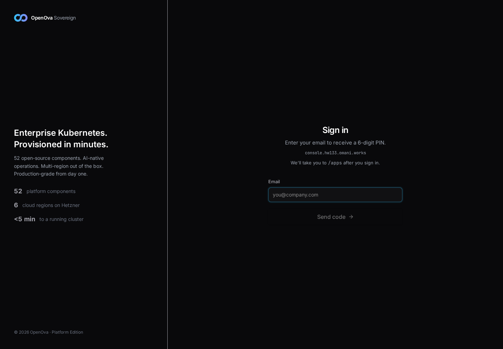
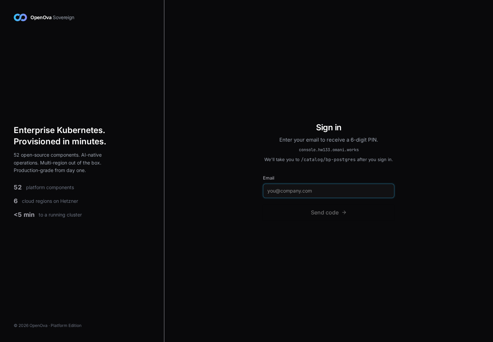
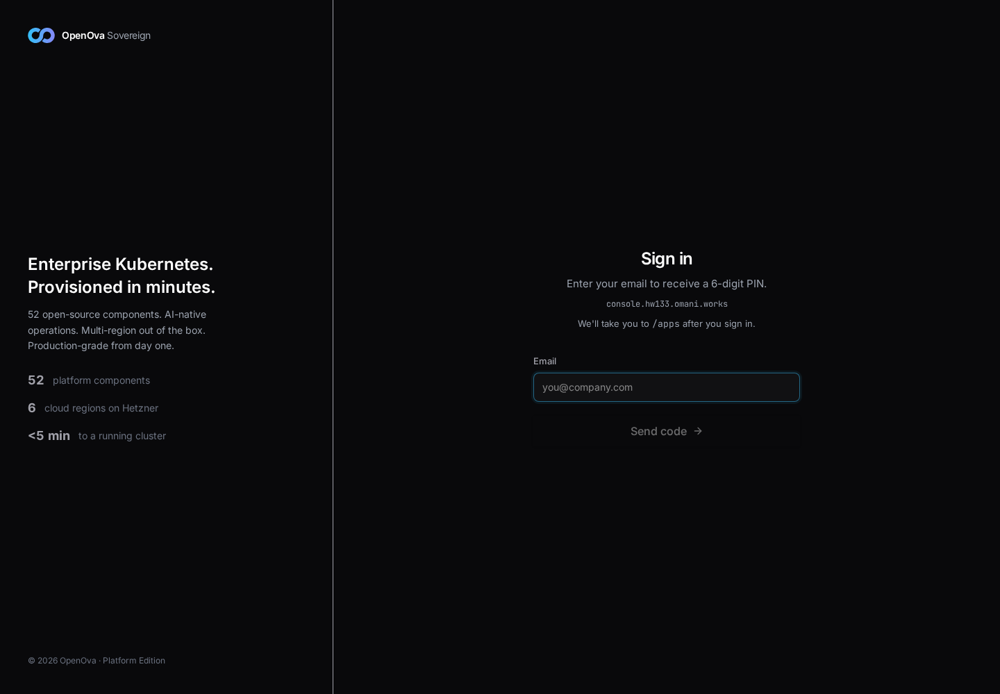
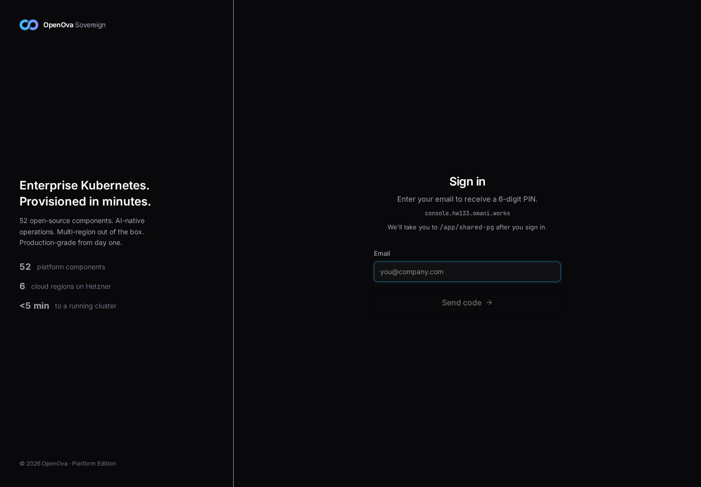
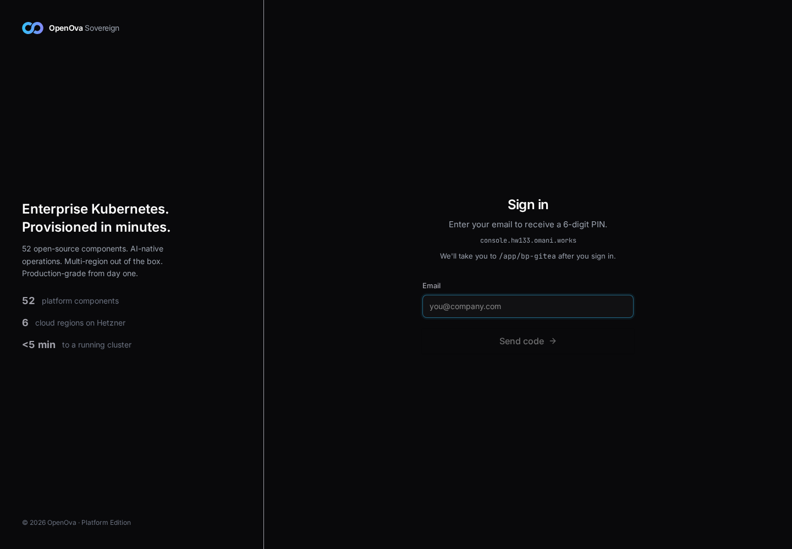
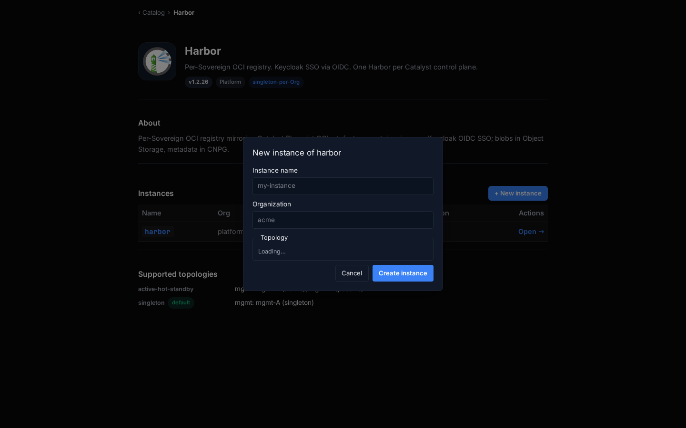
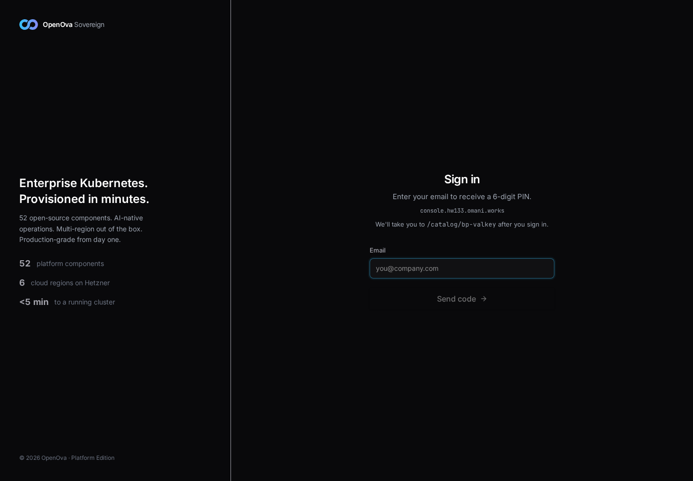
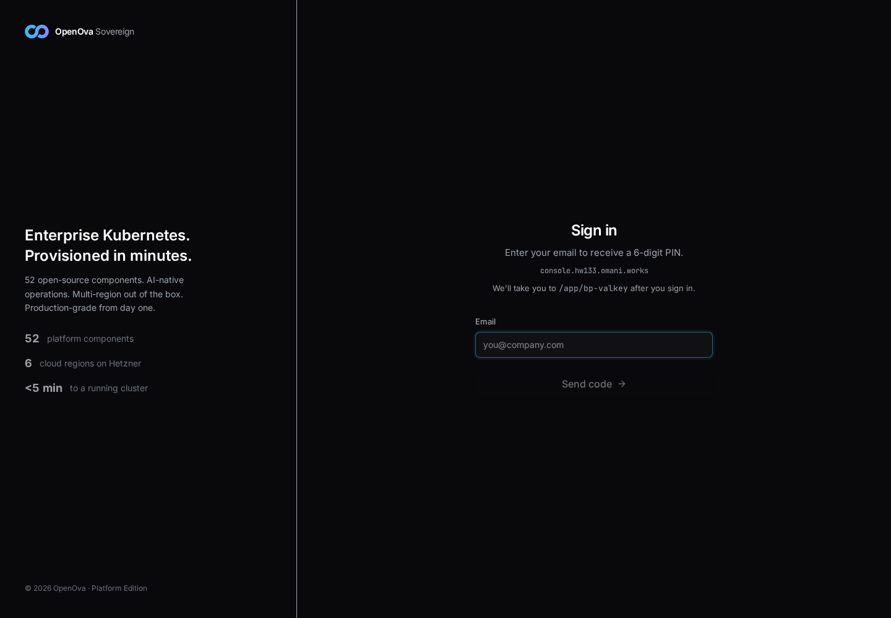

# #3370 CONTEXTS — user acceptance walk (web UI)

**Sign in:** open [console.hw133.omani.works](https://console.hw133.omani.works/) → land on the **Dashboard** signed-in (no login form).

> **Walk 2026-06-14 (independent walker, hw133):** the **handover sign-in returned `503 — "no healthy upstream"`**. Root cause: `catalyst-api` (the upstream that serves `/auth/handover` and every catalog/deployment data API) has been stuck `ContainerCreating` for 18+ minutes — the `ghcr.io/openova-io/openova/catalyst-api:d38da8b` image pull is hung on node `…-me-east-215-a-w7c730c` (the deploy-bot rolled the pod and the direct-ghcr pull never completed; `kubectl get endpoints catalyst-api` = **none**, `GET /readyz` = **503**). Because the session cookie is never set, **every page below redirects to the `/login` 6-digit-PIN form.** Per the walk rule (*"a redirect that ends on a login screen = ❌; lands on a login/PIN form = ❌"*) the entire browser walk fails this run. The `catalyst-ui` static bundle (`d38da8b`) IS up — that is why the page shell renders — but it has no API to talk to, so no signed-in content appears. The builder's chart/CR work IS live at the data layer (verified via kubectl, **not** acceptance): `bp-postgres@0.1.10` HRs Ready; 3 `Application` CRs `shared-pg/-b/-c` Ready; `shared-pg-c-newapi` + `shared-pg-c-openova-flow` `Database` CRs `applied=true`; `newapi-keyspace-credential` Secret present. None of that is reachable from the console while `catalyst-api` is down, so no row can be accepted.

| Tested page | Description | Status | Evidence |
|---|---|---|---|
| [Apps · Catalog](https://console.hw133.omani.works/apps) | Click the **PostgreSQL** card → it shows a **⛓ shareable** badge | ❌ |  — redirected to `/login?next=/apps`; **"Sign in — enter your email to receive a 6-digit PIN"** form (catalyst-api 503). No catalog grid rendered (0 cards). |
| [Apps · Catalog](https://console.hw133.omani.works/apps) | The **Keycloak** card has **no** shareable badge | ❌ |  — login wall; the catalog grid is unreachable (no signed-in session). |
| [Catalog · PostgreSQL](https://console.hw133.omani.works/catalog/bp-postgres) | Hero shows **⛓ shareable · db** | ❌ |  — redirected to `/login?next=/catalog/bp-postgres`; PIN form, no hero. |
| [Apps · Deployments](https://console.hw133.omani.works/apps) | Three cards: **shared-pg**, **shared-pg-b**, **shared-pg-c** | ❌ |  — login wall (0 app cards). The 3 `Application` CRs ARE Ready in-cluster (kubectl) but the Deployments grid is unreachable. |
| [Apps · Deployments](https://console.hw133.omani.works/apps) | Each of the three cards shows **⛓ 3 contexts** | ❌ |  — cards absent (login wall); not assessable from the browser. |
| [Apps · Deployments](https://console.hw133.omani.works/apps) | No extra generic "bp-postgres" card (3 instances = 3 cards) | ❌ |  — login wall; the Deployments grid never loaded. |
| [shared-pg · Contexts](https://console.hw133.omani.works/app/shared-pg) | Table rows: **db/gitea**, **db/registry**, **db/keycloak**, each **ready** | ❌ |  — redirected to `/login?next=/app/shared-pg`; PIN form, no Contexts tab. (The 3 `Database` CRs exist in-cluster, but the app detail page is unreachable.) |
| [shared-pg · Contexts](https://console.hw133.omani.works/app/shared-pg) | Click the **gitea** consumer link → opens the Gitea app page | ❌ |  — no Contexts table to click; login wall. |
| [bp-gitea · Dependencies](https://console.hw133.omani.works/app/bp-gitea) | A line reads **Depends on: shared-pg / db:gitea** | ❌ |  — redirected to `/login?next=/app/bp-gitea`; PIN form, no Dependencies tab. |
| [Catalog · PostgreSQL](https://console.hw133.omani.works/catalog/bp-postgres) | **Supported topologies**: singleton (*default*) + active-hot-standby | ❌ |  — login wall; the catalog detail page is unreachable. |
| [Catalog · PostgreSQL](https://console.hw133.omani.works/catalog/bp-postgres) | **Instances** section = exactly 3 rows + a **+ New instance** button | ❌ |  — login wall; no Instances section visible. |
| [Catalog · PostgreSQL](https://console.hw133.omani.works/catalog/bp-postgres) | ❌ **GAP** — no "Data instances" panel here, but it was never removed from the tenant console (deletion DoD unmet) | ❌ |  — not assessable from this walk (login wall). Open gap stands. |
| [Catalog · Harbor](https://console.hw133.omani.works/catalog/bp-harbor) | **+ New instance** → Backing services shows a PostgreSQL selector, **Create new (default)** preselected | ❌ |  — redirected to `/login?next=/catalog/bp-harbor`; PIN form, no wizard. |
| [Apps · Deployments](https://console.hw133.omani.works/apps) | After "Create new" → **two** new cards: the Harbor instance + its own postgres | ❌ |  — unreachable; the Create-new flow could not be opened (login wall). |
| [Catalog · Harbor](https://console.hw133.omani.works/catalog/bp-harbor) | **Reuse existing** → pick a self-made postgres → Create → only **one** new card | ❌ |  — no Reuse control reachable; login wall. |
| [shared-pg · Contexts](https://console.hw133.omani.works/app/shared-pg) | (on the reused instance) A **new row** appeared for the app that just reused it | ❌ |  — depends on the reuse flow above (unreachable); login wall. |
| [Catalog · Harbor](https://console.hw133.omani.works/catalog/bp-harbor) | ❌ **GAP** — reusing **shared-pg/-b/-c** is rejected; must use a self-made instance | ❌ |  — no backing-services/reuse UI reachable; login wall. |
| [Catalog · Valkey](https://console.hw133.omani.works/catalog/bp-valkey) | Hero shows **⛓ shareable · keyspace** (not "db") | ❌ |  — redirected to `/login?next=/catalog/bp-valkey`; PIN form, no hero. |
| [Apps · Deployments](https://console.hw133.omani.works/apps) | Open a Valkey instance → **Contexts** tab → same table, rows named **keyspace/…** | ❌ |  — redirected to `/login?next=/app/bp-valkey`; PIN form, no Contexts tab. |

**Result:** ✅ 0 / ❌ 19 (0 un-walkable). **The console is not walkable this run because `catalyst-api` is down** — the handover sign-in returns **503 "no healthy upstream"** and every page falls through to the `/login` 6-digit-PIN form. Root cause is environmental, not a defect in the #3370 PRs: the deploy-bot rolled `catalyst-api` to image `d38da8b` and the direct-`ghcr.io` pull has been hung `ContainerCreating` for 18+ min on node `…-w7c730c` (the recurring hw133 ghcr direct-pull stall; `endpoints catalyst-api`=none, `/readyz`=503). The builder's data-layer work IS live and was confirmed by kubectl (NOT acceptance): `bp-postgres@0.1.10` HRs Ready, 3 `Application` CRs `shared-pg/-b/-c` Ready, `shared-pg-c-newapi` + `shared-pg-c-openova-flow` `Database` CRs `applied=true`, `newapi-keyspace-credential` Secret present. **None of the console-visible acceptance claims (catalog card, deployment cards, contexts tables, dependencies binding, reuse wizard, valkey keyspace contexts) could be verified through the UI** while the API is unavailable. A re-walk is required once `catalyst-api` recovers (the image pull completes or the pod is rescheduled onto a node that can pull `d38da8b`).

**Gaps (carried, unverifiable this run):** Data-instances-panel removal and the shared-pg/-b/-c reuse-rejection both require a signed-in console and could not be exercised behind the 503 sign-in wall.
