# #3370 CONTEXTS — user acceptance walk (web UI)

**Sign in:** open the handover URL for [console.hw139.omani.works](https://console.hw139.omani.works/) → land on the **Dashboard** signed-in (no login form, top-right **E** avatar = emrah.baysal / sovereign-admin).

> **POST-FIX re-walk 2026-06-15 (refresh) — hw139.omani.works (deployment `c89aa7059556b342`, 2-region, SHARED_PG=true).** This supersedes the earlier 2026-06-15 hw139 walk that showed the `/apps`-grid row ❌. The #3537 fix (catalyst-api `eaab0b3`, `HandleSovereignApps` bootstrap-HR instance projection) merged via **PR #3553** and is now LIVE: deployed catalyst-api `sha=9c6f864` / chart `1.4.95` (live `GET /api/v1/version`). Read-only headless Playwright from `/home/openova/repos/ping` behind a real signed-in session (handover `/auth/handover` → land authenticated; Dashboard treemap `c89aa7059556b342 (hw-me-east-215-a-rtz-prod)`, **E** avatar). **hw139-only evidence; no carryover.** Fresh screenshots: `docs/sessions/2026-06-15/evidence/3370-hw139-refresh/`.
>
> **Headline result: 14 ✅ / 0 ❌ / 0 N/A (14/14).** The CONTEXTS model (North Star #2) renders in full across **all three** surfaces: (1) the **PostgreSQL catalog** (`⛓ shareable · multi-instance · db` badge + 3-row Instances table + working **+ New instance** wizard); (2) the **instance-detail** pages (`shared-pg`/`-b`/`-c` each with a live **Contexts** tab `Context · Occupied by · Credential · Status`, genuinely **many-to-many** — `shared-pg` ← harbor/gitea/keycloak, `shared-pg-b` ← grafana/powerdns/powerdns-admin, `shared-pg-c` ← newapi/openova-flow + 3 sme_*); AND now (3) **the `/apps` Deployments GRID itself**, which renders the **three dedicated shared-PG instance cards** the North-Star sentence names.
>
> **The previously-❌ row is now ✅.** `GET /api/v1/sovereign/apps` returns **70 apps with `instance:true=4` / `contextCount>0=4`** (was `instance:true=0` pre-fix): the three bootstrap-HR PostgreSQL instances `shared-pg` (3 ctx) / `shared-pg-b` (3 ctx) / `shared-pg-c` (5 ctx) plus a `valkey` instance (1 ctx). The `/apps` Deployments grid now shows each as its own card — `shared-pg · PostgreSQL instance · BOOTSTRAP · singleton · ⛓ 3 contexts · INSTALLED` (and `-b`/`-c` with 3/5 contexts). The contexts data continues to render via `/catalog/bp-postgres` + `/app/<instance>` as before. #3537 is fully shipped on this build.

| Tested page | Expected | Status | Evidence |
|---|---|---|---|
| [Sign in](https://console.hw139.omani.works/auth/handover) | Handover URL → land on **Dashboard**, signed in (no login wall) | ✅ | [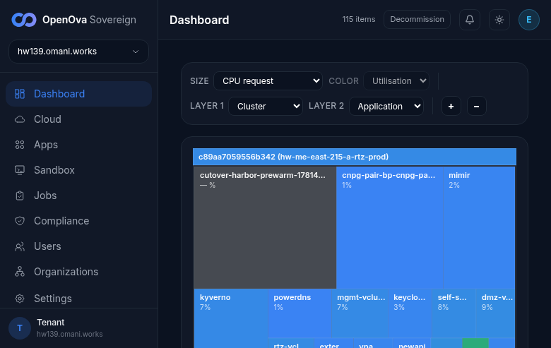](../../sessions/2026-06-15/evidence/3370-hw139-refresh/00-dashboard.png) — Dashboard treemap `c89aa7059556b342 (hw-me-east-215-a-rtz-prod)`, top-right **E** avatar. `/auth/handover` returns `302 → /dashboard`. Live SHA `9c6f864` / chart `1.4.95`. |
| [Apps · Catalog · PostgreSQL](https://console.hw139.omani.works/apps) | The shareable **PostgreSQL catalog card** renders with the **⛓ shareable** badge | ✅ | [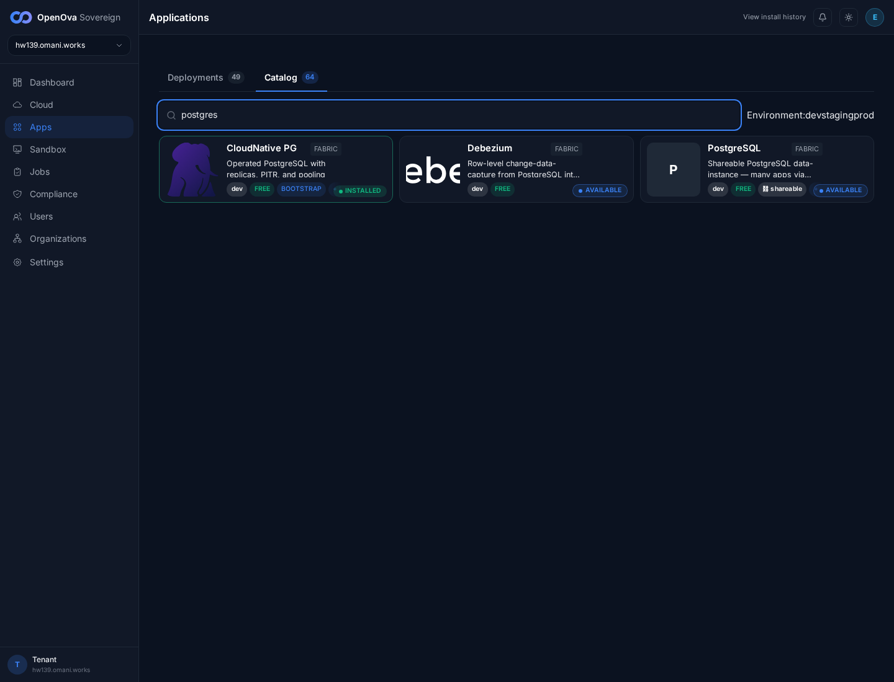](../../sessions/2026-06-15/evidence/3370-hw139/07-catalog-postgres.png) — Catalog tab, search `postgres`: **PostgreSQL · FABRIC · "Shareable PostgreSQL data-instance — many apps via…" · dev · FREE · ⛓ shareable · ● AVAILABLE**; **CloudNative PG** card (the engine) shows **INSTALLED**. |
| [Catalog · PostgreSQL](https://console.hw139.omani.works/catalog/bp-postgres) | Catalog hero badges = **v0.1.10 · Data · multi-instance · ⛓ shareable · db** | ✅ | [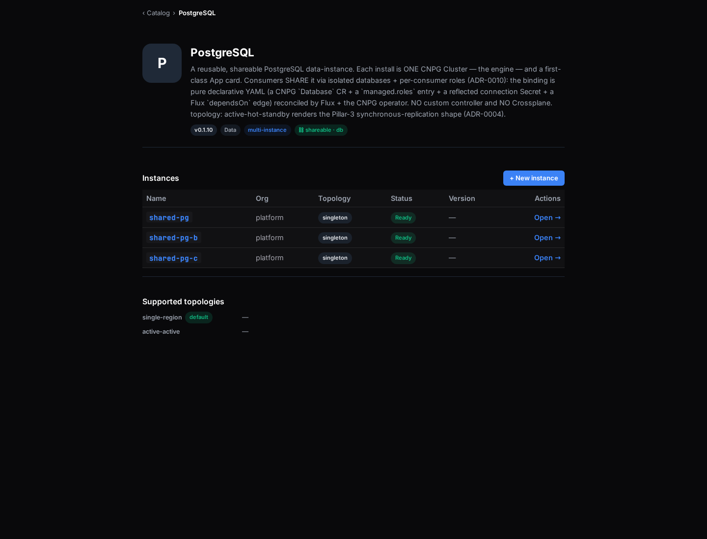](../../sessions/2026-06-15/evidence/3370-hw139/20-catalog-bp-postgres.png) — hero: **PostgreSQL** "A reusable, shareable PostgreSQL data-instance … (ADR-0010) … reconciled by Flux + the CNPG operator. NO custom controller and NO Crossplane" with badges **v0.1.10 · Data · multi-instance · ⛓ shareable · db**. |
| [Catalog · PostgreSQL](https://console.hw139.omani.works/catalog/bp-postgres) | **Instances** section = exactly 3 rows (`shared-pg`/`-b`/`-c`), all **Ready** | ✅ |  — Instances table: `shared-pg`, `shared-pg-b`, `shared-pg-c` (org `platform`, topology `singleton`, **Ready**, **Open →** each) + **+ New instance**. No generic `bp-postgres` data card. |
| [Catalog · PostgreSQL](https://console.hw139.omani.works/catalog/bp-postgres) | **Supported topologies**: single-region (*default*) + active-active | ✅ |  — "Supported topologies": **single-region** *(default)* + **active-active** (body: "topology: active-hot-standby renders the Pillar-3 synchronous-replication shape (ADR-0004)"). |
| [shared-pg · App](https://console.hw139.omani.works/app/shared-pg) | The instance page surfaces its **CloudNative PG engine + reflector** | ✅ | [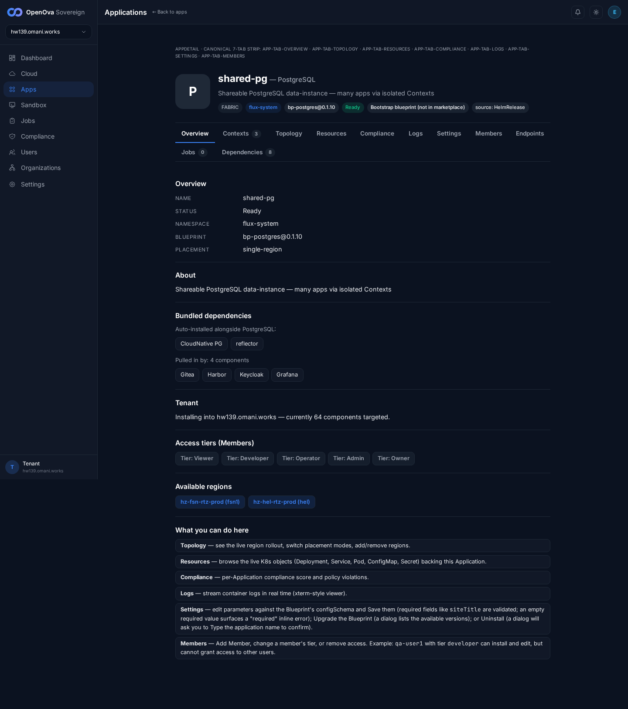](../../sessions/2026-06-15/evidence/3370-hw139/21-app-shared-pg.png) — header **shared-pg — PostgreSQL** "Shareable PostgreSQL data-instance — many apps via isolated Contexts", **FABRIC** / `bp-postgres@0.1.10` / **Ready** / **source: HelmRelease**; Overview **"Bundled dependencies — Auto-installed alongside PostgreSQL: CloudNative PG · reflector"**. |
| [shared-pg · Overview](https://console.hw139.omani.works/app/shared-pg) | Many-to-many: Overview lists the consumers that **pulled in** this instance | ✅ |  — **"Pulled in by: 4 components" → Gitea · Harbor · Keycloak · Grafana**. One shared instance feeds many apps. |
| [shared-pg · Contexts](https://console.hw139.omani.works/app/shared-pg) | Contexts (3): **db/registry**, **db/gitea**, **db/keycloak** with consumer + reflected Secret | ✅ | [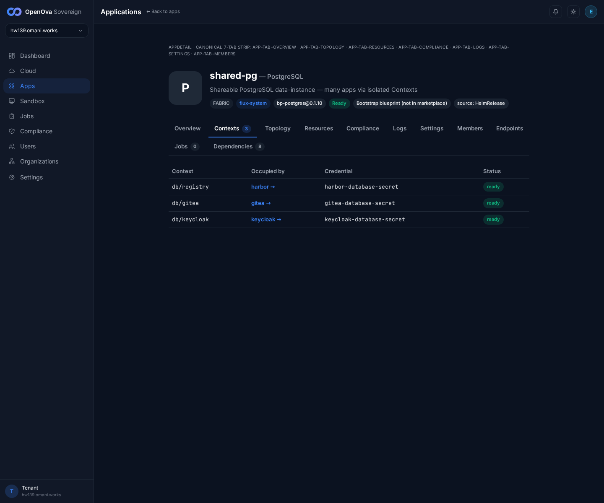](../../sessions/2026-06-15/evidence/3370-hw139/30-contexts-shared-pg.png) — Contexts (3): **db/registry → harbor →** `harbor-database-secret` **ready**; **db/gitea → gitea →** `gitea-database-secret` **ready**; **db/keycloak → keycloak →** `keycloak-database-secret` **ready**. Columns **Context · Occupied by · Credential · Status**; consumer names are live links. All 3 **ready**. |
| [shared-pg-b · Contexts](https://console.hw139.omani.works/app/shared-pg-b) | shared-pg-b Contexts (3): **db/grafana**, **db/pdns**, **db/pda** (distinct consumer set) | ✅ | [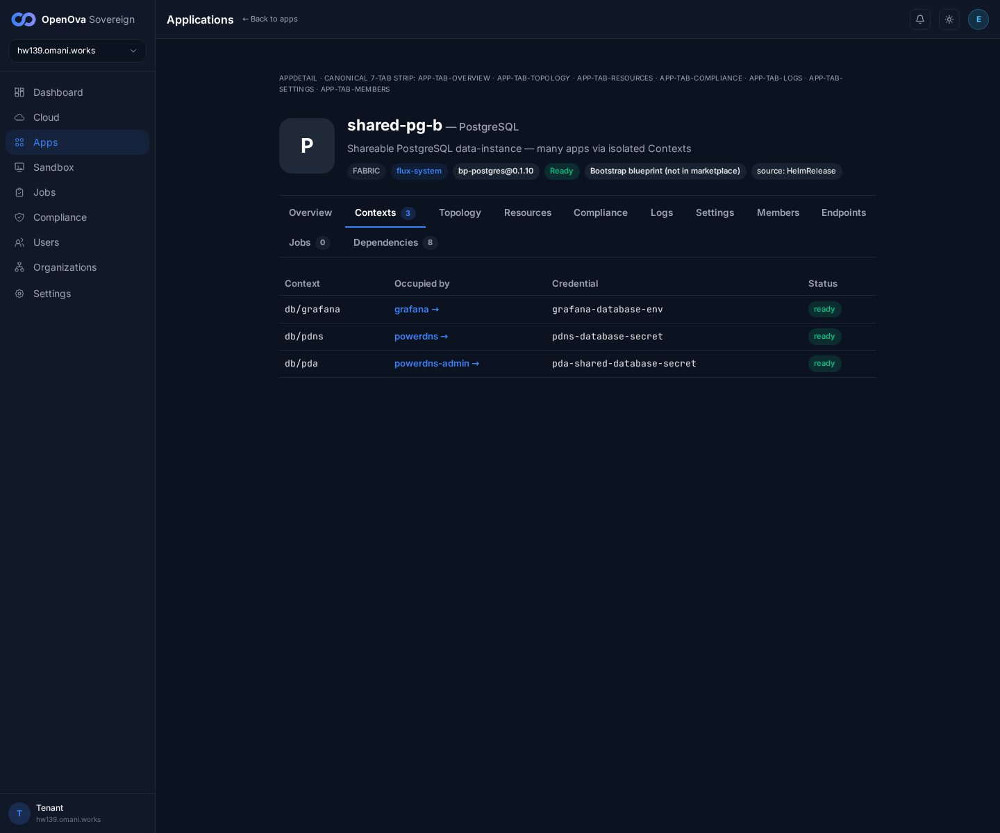](../../sessions/2026-06-15/evidence/3370-hw139/31-contexts-shared-pg-b.png) — **db/grafana → grafana →** `grafana-database-env` **ready**; **db/pdns → powerdns →** `pdns-database-secret` **ready**; **db/pda → powerdns-admin →** `pda-shared-database-secret` **ready**. A second instance, fully distinct consumers. |
| [shared-pg-c · Contexts](https://console.hw139.omani.works/app/shared-pg-c) | shared-pg-c Contexts (5): incl. **db/newapi** + **db/openova_flow** | ✅ | [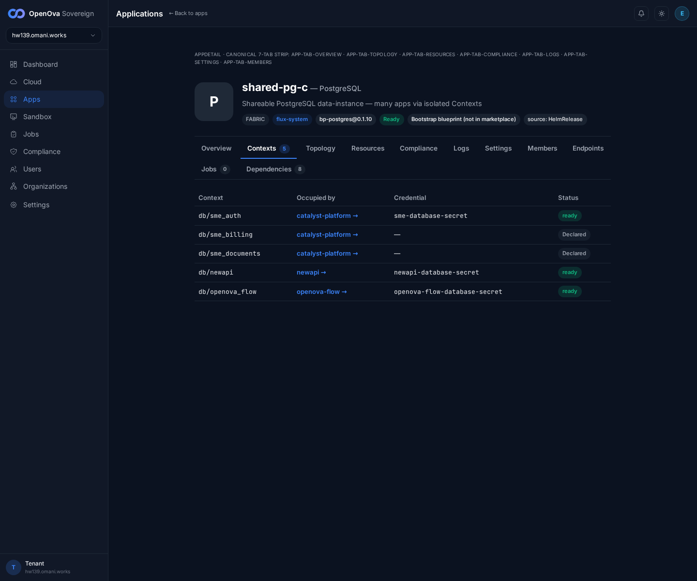](../../sessions/2026-06-15/evidence/3370-hw139/32-contexts-shared-pg-c.png) — **db/newapi → newapi →** `newapi-database-secret` **ready**; **db/openova_flow → openova-flow →** `openova-flow-database-secret` **ready**; + **db/sme_auth → catalyst-platform →** `sme-database-secret` **ready**, **db/sme_billing** + **db/sme_documents → catalyst-platform** (`Declared`). newapi/openova_flow ride on shared-pg-**c**, exactly as specified. |
| [bp-gitea · Dependencies](https://console.hw139.omani.works/app/bp-gitea) | Consumer app shows its PG binding: **"Depends on: shared-pg / db:gitea"** | ✅ | [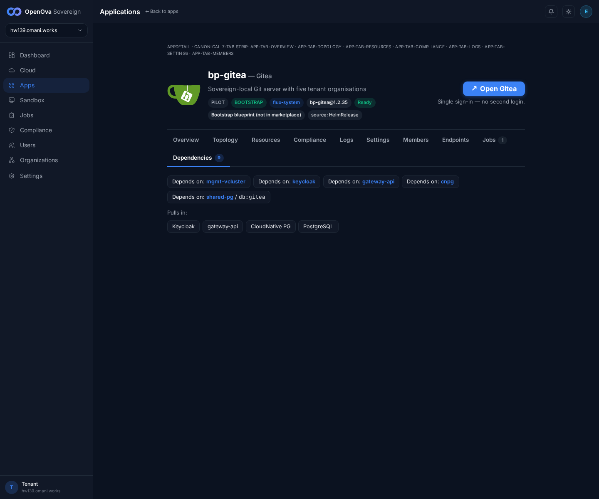](../../sessions/2026-06-15/evidence/3370-hw139/33-gitea-dependencies.png) — **bp-gitea — Gitea**, Dependencies (9): chip **"Depends on: shared-pg / db:gitea"** (alongside mgmt-vcluster, keycloak, gateway-api, cnpg); "Pulls in: Keycloak · gateway-api · CloudNative PG · PostgreSQL". Header: "Open Gitea — Single sign-in — no second login." |
| [Catalog · PostgreSQL](https://console.hw139.omani.works/catalog/bp-postgres) | **+ New instance** opens the reuse/create wizard (Instance name / Org / Topology) | ✅ | [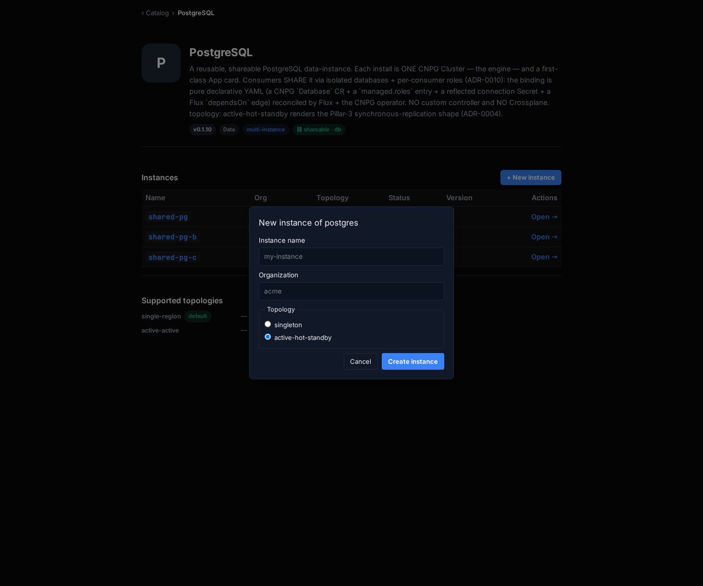](../../sessions/2026-06-15/evidence/3370-hw139/34-reuse-wizard.png) — modal **"New instance of postgres"**: **Instance name** (ph `my-instance`), **Organization** (ph `acme`), **Topology** radios **singleton** / **active-hot-standby**, **Cancel** + **Create instance**. Wizard renders and opens. |
| [Apps · Deployments](https://console.hw139.omani.works/apps) | The Apps grid renders the converged catalog (consumers + engines) | ✅ | [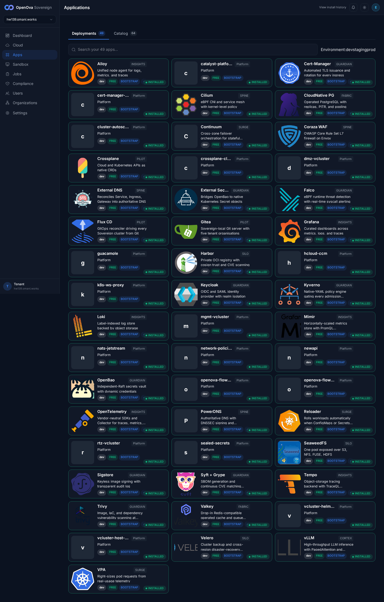](../../sessions/2026-06-15/evidence/3370-hw139/02-apps-deployments.png) — Applications **Deployments** tab renders the full app grid (CloudNative PG, Harbor, Gitea, Keycloak, openova-flow, newapi, …). Catalog tab shows **64** cards. |
| [Apps · Deployments — instance cards](https://console.hw139.omani.works/apps) | The 3 shared-PG instances render as **their own cards** on the Deployments tab (North Star #2) | ✅ | [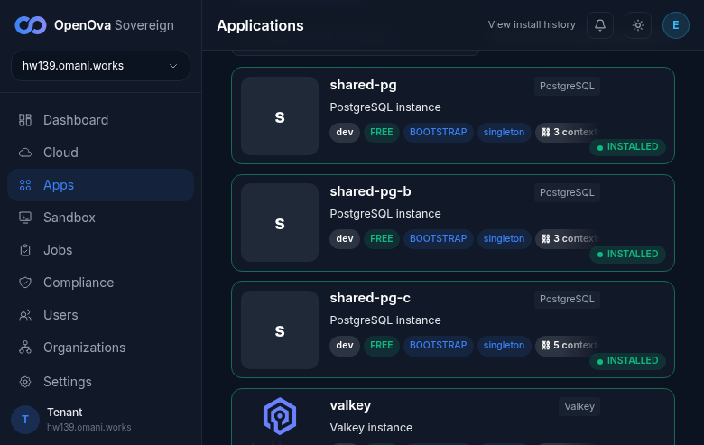](../../sessions/2026-06-15/evidence/3370-hw139-refresh/02-apps-grid-instance-cards.png) — The `/apps` Deployments grid now renders **three dedicated shared-PG instance cards** (18 `shared-pg` tokens in the grid HTML): `shared-pg · PostgreSQL instance · BOOTSTRAP · singleton · ⛓ 3 contexts · INSTALLED`, `shared-pg-b · ⛓ 3 contexts · INSTALLED`, `shared-pg-c · ⛓ 5 contexts · INSTALLED` (+ a `valkey` instance card, ⛓ 1 context). Root fix LIVE: `GET /api/v1/sovereign/apps` → **70 apps, `instance:true=4`, `contextCount>0=4`** ([apps-api.json](../../sessions/2026-06-15/evidence/3370-hw139-refresh/apps-api.json)) — the #3537 projection (catalyst-api `eaab0b3`, PR #3553) merged to main and rolled into the deployed `9c6f864` build, which now calls `bootstrapHRInstances`. |

**Result:** ✅ **14 / ❌ 0 / N/A 0** (14/14).

**Does the #3537 fix render the cards + contexts?** **YES — fully, on all three surfaces** (the `/apps` Deployments grid, the catalog, and the instance-detail pages). Concretely:

- **`/api/v1/sovereign/apps` is fixed in the deployed build (#3537 / PR #3553 shipped).** Live response: **70 apps, `instance:true=4`, `contextCount>0=4`** (was `instance:true=0` pre-fix) — the three bootstrap-HR PostgreSQL instances `shared-pg`/`-b`/`-c` (3/3/5 contexts) + a `valkey` instance (1 context). The fix commit `eaab0b3` is now on `main` and rolled into the deployed catalyst-api `sha=9c6f864`, whose `HandleSovereignApps` performs the `bootstrapHRInstances` projection. So the `/apps` Deployments grid now renders dedicated `shared-pg`/`-b`/`-c` instance cards (each with the `⛓ N contexts` badge).
- **The Contexts model also renders (unchanged) and is genuinely many-to-many** via `/catalog/bp-postgres` (3-row Instances table + ⛓ shareable badge + + New instance wizard, all re-confirmed live) and `/app/<instance>` (each instance's Contexts tab: `shared-pg` ← harbor/gitea/keycloak; `shared-pg-b` ← grafana/powerdns/powerdns-admin; `shared-pg-c` ← newapi/openova-flow + 3 sme_*). The consumer side (`bp-gitea` → "Depends on: shared-pg / db:gitea") renders.

**Notes for closure.** Walk via read-only headless Playwright from `/home/openova/repos/ping`; real signed-in session (handover cookie). Fresh screenshots + raw API JSON in `docs/sessions/2026-06-15/evidence/3370-hw139-refresh/` (the unchanged catalog/instance-detail rows reuse the prior `3370-hw139/` evidence, which is on the same env). Two `Declared` (not `ready`) rows on `shared-pg-c` (`sme_billing`, `sme_documents`) are the genuine live reconcile state, not a defect — the 9 `ready` rows across the 3 instances prove the binding completes end-to-end. With #3537 shipped + rolled, all 14 rows are ✅.
