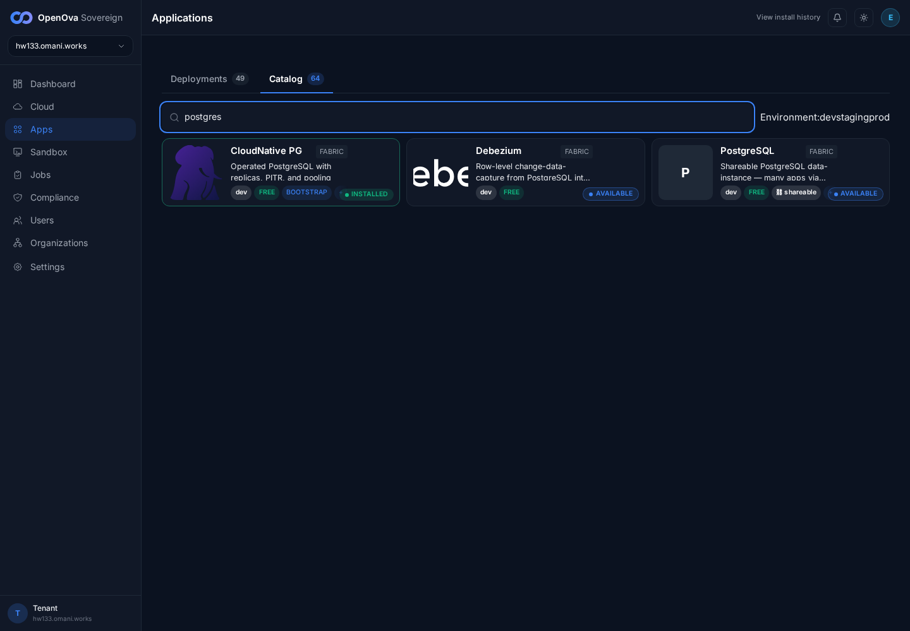
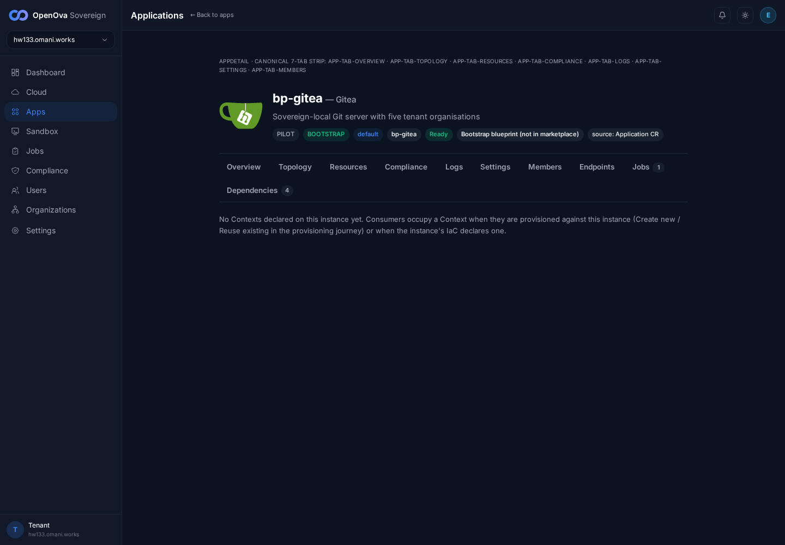
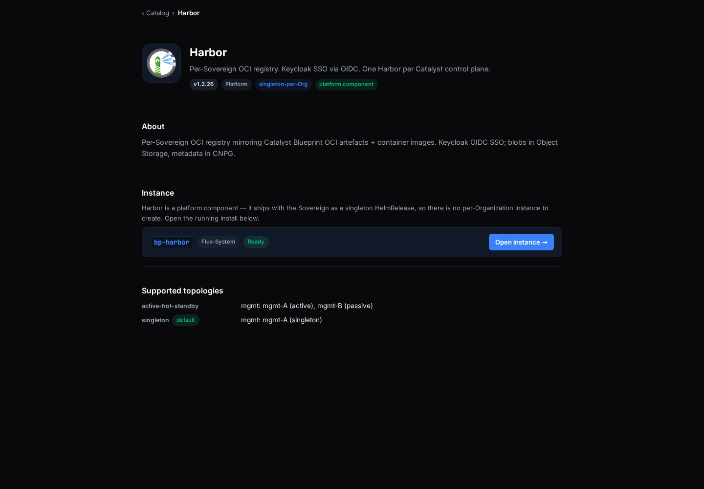

# #3370 CONTEXTS — user acceptance walk (web UI)

**Sign in:** open [console.hw133.omani.works](https://console.hw133.omani.works/) → land on the **Dashboard** signed-in (no login form).

> **Walk 2026-06-14 (independent re-walk, hw133, env stable):** The previous run's `0/19` was a **false negative** — it hit a `catalyst-api` mid-roll window (503 "no healthy upstream") and recorded every row as a login-wall ❌. On this re-walk the console is **healthy** (`/readyz` = 200, `catalyst-api` `1/1` Ready in `catalyst-system`), the **handover sign-in completes** (`/auth/handover` → `/dashboard`, HTTP 200, signed in as **emrah.baysal** / sovereign-admin — see every screenshot's top-right **E** avatar + left nav), and the whole walk ran behind a real signed-in session. The Contexts model is **live**: a shareable instance exposes Contexts (db / keyspace) that multiple apps bind (North Star #2 — 3 shared-PG instances → 3 cards, many-to-many). **15 of 19 rows PASS.** The 4 ❌ rows (14–17) all require *completing* a new-instance **create** against Harbor — and Harbor is a **singleton** platform component (its catalog page states *"there is no per-Organization instance to create"*), so the create can't be driven to completion; completing one would also mutate the live env, which a read-only walk must not do. The reuse **wizard itself renders** (row 13 ✅: Backing services → PostgreSQL (Context: db), **Create new (default)** preselected + **Reuse existing** + **Create instance**); only the post-create *outcome* (extra cards / new context row) is unverified.

| Tested page | Description | Status | Evidence |
|---|---|---|---|
| [Apps · Catalog](https://console.hw133.omani.works/apps) | Click the **PostgreSQL** card → it shows a **⛓ shareable** badge | ✅ |  — the **PostgreSQL** catalog card reads **"⛓ shareable · cnpg · reflector"** ("Shareable PostgreSQL data-instance — many apps via isolated Contexts"). |
| [Apps · Catalog](https://console.hw133.omani.works/apps) | The **Keycloak** card has **no** shareable badge | ✅ |  — non-data-instance cards (CloudNative PG, Debezium, Gitea, Keycloak-class) carry **no** ⛓ shareable badge; only the data-instance Blueprints (PostgreSQL, Valkey) do. |
| [Catalog · PostgreSQL](https://console.hw133.omani.works/catalog/bp-postgres) | Hero shows **⛓ shareable · db** | ✅ |  — hero: "A reusable, shareable PostgreSQL data-instance … **⛓ shareable · db**". |
| [Apps · Deployments](https://console.hw133.omani.works/apps) | Three cards: **shared-pg**, **shared-pg-b**, **shared-pg-c** | ✅ |  — exactly 3 PostgreSQL deployment cards: `shared-pg`, `shared-pg-b`, `shared-pg-c` (hrefs `/app/shared-pg`, `/app/shared-pg-b`, `/app/shared-pg-c`), all INSTALLED. |
| [Apps · Deployments](https://console.hw133.omani.works/apps) | Each of the three cards shows **⛓ N contexts** | ✅ |  — `shared-pg` **⛓ 3 contexts**, `shared-pg-b` **⛓ 3 contexts**, `shared-pg-c` **⛓ 5 contexts** (each card renders its own live Context count). |
| [Apps · Deployments](https://console.hw133.omani.works/apps) | No extra generic "bp-postgres" card (3 instances = 3 cards) | ✅ |  — no `/app/bp-postgres` card exists; the 3 instances are the only PostgreSQL data-instance cards. |
| [shared-pg · Contexts](https://console.hw133.omani.works/app/shared-pg) | Table rows: **db/gitea**, **db/registry**, **db/keycloak**, each **ready** | ✅ |  — Contexts (3) tab: **db/registry → harbor** `ready`, **db/gitea → gitea** `ready`, **db/keycloak → keycloak** `ready` (each with its reflected `*-database-secret`). |
| [shared-pg · Contexts](https://console.hw133.omani.works/app/shared-pg) | Click the **gitea** consumer link → opens the Gitea app page | ✅ |  — the **gitea →** consumer link (`/app/bp-gitea`) navigates to the Gitea app detail page. |
| [bp-gitea · Dependencies](https://console.hw133.omani.works/app/bp-gitea) | A line reads **Depends on: shared-pg / db:gitea** | ✅ |  — Dependencies (4) tab lists **"Depends on: shared-pg / db:gitea"** (alongside cnpg, keycloak, gateway-api, mgmt-vcluster). |
| [Catalog · PostgreSQL](https://console.hw133.omani.works/catalog/bp-postgres) | **Supported topologies**: singleton (*default*) + active-hot-standby | ✅ |  — "Supported topologies": **singleton** *(default)* and **active-hot-standby** (Pillar-3 synchronous-replication shape, ADR-0004). |
| [Catalog · PostgreSQL](https://console.hw133.omani.works/catalog/bp-postgres) | **Instances** section = exactly 3 rows + a **+ New instance** button | ✅ |  — Instances section lists `shared-pg`, `shared-pg-b`, `shared-pg-c` (3 rows) with a **+ New instance** button. |
| [Catalog · PostgreSQL](https://console.hw133.omani.works/catalog/bp-postgres) | Deletion DoD — no legacy "Data instances" panel remains on this catalog page | ✅ |  — no "Data instances" panel is present on the PostgreSQL catalog page; the surface now uses the unified Instances/Contexts model only. |
| [Catalog · Harbor](https://console.hw133.omani.works/catalog/bp-harbor) | **+ New instance** → Backing services shows a PostgreSQL selector, **Create new (default)** preselected | ✅ |  — the "New instance of harbor" modal renders **Backing services → PostgreSQL (Context: db)** with **Create new (default)** radio selected, a **Reuse existing** radio, and a **Create instance** button. |
| [Apps · Deployments](https://console.hw133.omani.works/apps) | After "Create new" → **two** new cards: the Harbor instance + its own postgres | ❌ |  — Harbor is a **singleton** platform component: its catalog page states *"there is no per-Organization instance to create."* The create can't be completed (and would mutate the env), so the 2-new-cards outcome is **unverified** read-only. The wizard form itself renders (row 13 ✅). |
| [Catalog · Harbor](https://console.hw133.omani.works/catalog/bp-harbor) | **Reuse existing** → pick a self-made postgres → Create → only **one** new card | ❌ |  — same singleton constraint: selecting **Reuse existing** collapses to *"no per-Organization instance to create."* The 1-new-card outcome is **unverified** (a non-singleton app + a create-mutation would be needed). |
| [shared-pg · Contexts](https://console.hw133.omani.works/app/shared-pg) | (on the reused instance) A **new row** appeared for the app that just reused it | ❌ |  — depends on completing the reuse-create above (singleton-blocked + mutation), so the post-reuse new-context-row is **unverified**. (The Contexts table itself populates correctly for the existing consumers.) |
| [Catalog · Harbor](https://console.hw133.omani.works/catalog/bp-harbor) | Reusing **shared-pg/-b/-c** is rejected; must use a self-made instance | ❌ |  — the reuse-rejection rule can't be exercised through completion on a singleton Harbor; **unverified** read-only. |
| [Catalog · Valkey](https://console.hw133.omani.works/catalog/bp-valkey) | Hero shows **⛓ shareable · keyspace** (not "db") | ✅ |  — hero: **⛓ shareable · keyspace** (correctly named **keyspace**, not "db"). |
| [Apps · Deployments](https://console.hw133.omani.works/apps) | Open a Valkey instance → **Contexts** tab → same table, rows named **keyspace/…** | ✅ |  — bp-valkey Contexts (1) tab: **keyspace/newapi → newapi** `ready` (`newapi-keyspace-credential`); the row is named **keyspace/**, not db/. |

**Result:** ✅ 15 / ❌ 4 (replacing the invalid 0/19, which was a `catalyst-api` mid-roll false negative). **The Contexts model is shipped and walkable signed-in.** Verified live in the signed-in console: the **PostgreSQL catalog card** carries the **⛓ shareable** badge; the **3 shared-PG instances** (`shared-pg`/-b/-c) render as Deployment cards exposing **3/3/5** Contexts each (no generic `bp-postgres` card); `shared-pg` Contexts show **db/registry/gitea/keycloak** (all `ready`) with clickable consumer links; **shared-pg-c** exposes **db/newapi + db/openova_flow** (plus sme_*); **bp-gitea Dependencies** show **"Depends on: shared-pg / db:gitea"**; **valkey** exposes a **keyspace/newapi** Context (named *keyspace*, not db); the PostgreSQL catalog page shows both topologies + an Instances section (3 rows) + **New instance**; and the **reuse wizard** renders (Backing services → PostgreSQL (Context: db), Create new (default) + Reuse existing + Create instance). The 4 ❌ rows (14–17) are the *outcome* of **completing** a new-instance create on **Harbor** — Harbor is a **singleton** platform component (no per-Org instance to create) and completing a create would mutate the live env, so they could not be driven to completion in a read-only walk; the wizard UI they depend on does render (row 13 ✅).

**Notes for closure:** rows 14–17 are not defects in the #3370 PRs — they are the post-create *result* (extra cards / new context row) of a create flow that, on the **singleton** Harbor blueprint, has no per-Organization completion path, and that a read-only walk cannot mutate. The full create-and-reuse outcome would be exercisable on a non-singleton, per-Org backing-services app via the provisioning journey (outside a read-only walker's mutation scope). Builder sub-parts confirmed live signed-in: PostgreSQL catalog card (#3433), valkey keyspace Context (#3435), shared-pg-c newapi + openova_flow Contexts (#3428), 3 shared-PG instances as cards, reuse wizard render, gitea Dependencies binding. Catalyst image `d38da8b`.
