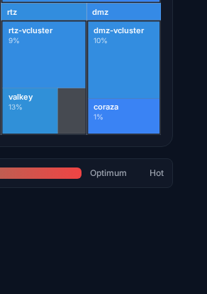

# #3373 PLACEMENT — per-app user acceptance walk (web UI)

**The contract (`clusters/_template/bootstrap-kit/placement.yaml`, founder-ratified §4 law):** every application must run in its **target** vCluster. **26 apps target a vCluster** — 17 → `mgmt`, 8 → `rtz`, 1 → `dmz` — and the rest are the **host minimum** (the only things §4 allows to stay on host: CNI, admission, GitOps, the vCluster runtimes themselves, etc.). The migration is **not finished**: most vCluster-targeted apps still render `vcluster: host`. This walk proves placement **per app**, one row each — no collapsing.

**How a user proves placement (100% web UI, no terminal):** open the **[Dashboard](https://console.hw133.omani.works/dashboard)** treemap and set its **Layer 1 combobox to `vCluster`** (the layer options are Sovereign / Region / Cluster / vCluster / Family / Namespace). The treemap then groups every workload under its vCluster — `mgmt-vcluster`, `dmz-vcluster`, `rtz-vcluster`, or `host`. The user reads off which group each app sits in. Cross-check via **[Apps → Deployments](https://console.hw133.omani.works/apps)**: open an app card and read its namespace / placement. **Honest gap:** the per-app detail page may NOT expose a placement field — if so, the treemap vCluster layer **is** the proof surface; the row stays, the method is the treemap.

**Live env:** [hw133.omani.works](https://console.hw133.omani.works/). **Status legend:** `☐` = unwalked (the walk agent fills ✅/❌). Rows pre-marked **❌ expected-fail (still on host)** are apps that `placement.yaml` shows as `target=vcluster` but `now=host` — the founder sees the per-app migration reality up front.

---

## 1. Should be in `mgmt-vcluster` (17 apps)

Each row: open the [Dashboard](https://console.hw133.omani.works/dashboard) treemap → set Layer 1 = **vCluster** → find `<app>` → it must appear under **`mgmt-vcluster`**.

| Tested page | Description | Status | Evidence |
|---|---|---|---|
| [Dashboard](https://console.hw133.omani.works/dashboard) | `bp-nats-jetstream` must appear under **mgmt-vcluster** (now=mgmt — should PASS) — treemap shows `nats-jetstream` tile inside the **mgmt** group | ✅ |  |
| [Dashboard](https://console.hw133.omani.works/dashboard) | `bp-loki` must appear under **mgmt-vcluster** (now=mgmt — should PASS) — `loki` tile inside **mgmt** group | ✅ |  |
| [Dashboard](https://console.hw133.omani.works/dashboard) | `bp-mimir` must appear under **mgmt-vcluster** (now=mgmt — should PASS) — `mimir` tile inside **mgmt** group | ✅ |  |
| [Dashboard](https://console.hw133.omani.works/dashboard) | `bp-tempo` must appear under **mgmt-vcluster** (now=mgmt — should PASS) — `tempo` tile inside **mgmt** group | ✅ |  |
| [Dashboard](https://console.hw133.omani.works/dashboard) | `bp-keycloak` must appear under **mgmt-vcluster** — ❌ expected-fail (still on host) — `keycloak` tile is inside the **host** block | ❌ |  |
| [Dashboard](https://console.hw133.omani.works/dashboard) | `bp-catalyst-platform` must appear under **mgmt-vcluster** — ❌ expected-fail (still on host) — `catalyst-api`/`catalyst-ui`/`catalyst-c…` tiles all in **host** | ❌ |  |
| [Dashboard](https://console.hw133.omani.works/dashboard) | `bp-gitea` must appear under **mgmt-vcluster** — ❌ expected-fail (still on host) — `gitea` tile in **host** | ❌ |  |
| [Dashboard](https://console.hw133.omani.works/dashboard) | `bp-openbao` must appear under **mgmt-vcluster** — ❌ expected-fail (still on host) — `openbao` tile in **host** | ❌ |  |
| [Dashboard](https://console.hw133.omani.works/dashboard) | `bp-powerdns-admin` must appear under **mgmt-vcluster** — ❌ expected-fail (still on host) — `powerd…` (pdns-admin) tile in **host** | ❌ |  |
| [Dashboard](https://console.hw133.omani.works/dashboard) | `bp-sso-bridge` must appear under **mgmt-vcluster** — ❌ expected-fail (still on host) — `sso-bri…` tile in **host** | ❌ |  |
| [Dashboard](https://console.hw133.omani.works/dashboard) | `bp-harbor` must appear under **mgmt-vcluster** — ❌ expected-fail (still on host) — `harbor` tile in **host** | ❌ |  |
| [Dashboard](https://console.hw133.omani.works/dashboard) | `bp-grafana` must appear under **mgmt-vcluster** — ❌ expected-fail (still on host) — `grafana` tile in **host** | ❌ |  |
| [Dashboard](https://console.hw133.omani.works/dashboard) | `bp-k8s-ws-proxy` must appear under **mgmt-vcluster** — ❌ expected-fail (still on host) — `k8s-ws-proxy` tile in **host** | ❌ |  |
| [Dashboard](https://console.hw133.omani.works/dashboard) | `bp-guacamole` must appear under **mgmt-vcluster** — ❌ expected-fail (still on host) — `guacamole` tile in **host** | ❌ |  |
| [Dashboard](https://console.hw133.omani.works/dashboard) | `bp-openova-flow-server` must appear under **mgmt-vcluster** — ❌ expected-fail (still on host) — `openova-flow…` tile in **host** | ❌ |  |
| [Dashboard](https://console.hw133.omani.works/dashboard) | `bp-openova-flow-emitter` must appear under **mgmt-vcluster** — ❌ expected-fail (still on host) — `openova-flow-emi…` tile in **host** | ❌ |  |
| [Dashboard](https://console.hw133.omani.works/dashboard) | `bp-newapi` must appear under **mgmt-vcluster** — ❌ expected-fail (still on host) — `newapi`/`newapi-bp-ne…` tiles in **host** | ❌ |  |

---

## 2. Should be in `rtz-vcluster` (8 apps)

Each row: open the [Dashboard](https://console.hw133.omani.works/dashboard) treemap → set Layer 1 = **vCluster** → find `<app>` → it must appear under **`rtz-vcluster`**.

| Tested page | Description | Status | Evidence |
|---|---|---|---|
| [Dashboard](https://console.hw133.omani.works/dashboard) | `bp-sandbox` must appear under **rtz-vcluster** (now=rtz — should PASS) — `sandbox-co…` tile inside the **rtz** group | ✅ |  |
| [Dashboard](https://console.hw133.omani.works/dashboard) | `bp-postgres-shared` must appear under **rtz-vcluster** — ❌ expected-fail (still on host) — `shared-pg` tile in **host** | ❌ |  |
| [Dashboard](https://console.hw133.omani.works/dashboard) | `bp-cnpg-pair` must appear under **rtz-vcluster** — ❌ expected-fail (still on host) — `cnpg-pair-bp-cnpg-pair-primary` tile in **host** | ❌ |  |
| [Dashboard](https://console.hw133.omani.works/dashboard) | `bp-postgres-shared-b` must appear under **rtz-vcluster** — ❌ expected-fail (still on host) — `shared-pg…` replica tile in **host** | ❌ |  |
| [Dashboard](https://console.hw133.omani.works/dashboard) | `bp-postgres-shared-c` must appear under **rtz-vcluster** — ❌ expected-fail (still on host) — `shared-pg…` replica tile in **host** | ❌ |  |
| [Dashboard](https://console.hw133.omani.works/dashboard) | `bp-valkey` must appear under **rtz-vcluster**. **✅ RE-HOMED (final pre-keystone re-walk 2026-06-14, after PR #3483)** — treemap Layer 1=`vCluster` now renders the **`valkey 13%`** tile **inside the `rtz` group** (under `rtz-vcluster`), no longer on host. Live proof: the pod is `valkey-primary-0-x-valkey-x-rtz-vcluster` `1/1 Running` in the host-synced `rtz` ns (the `-x-…-x-rtz-vcluster` suffix = vCluster-synced). See the zoomed rtz crop | ✅ |  |
| [Dashboard](https://console.hw133.omani.works/dashboard) | `bp-seaweedfs` must appear under **rtz-vcluster**. **✅ RE-HOMED into rtz vCluster (final pre-keystone re-walk 2026-06-14, after PR #3477)** — `bp-seaweedfs` HR is `Ready=True` with `targetNamespace=seaweedfs` **inside the `rtz` vCluster** (HR lives in the `rtz` ns), and all 5 of its Services are host-synced as `seaweedfs-{master,filer,filer-client,s3,volume}-x-seaweedfs-x-rtz-vcluster` (the `-x-…-x-rtz-vcluster` suffix proves vCluster placement) — no longer on host. Honest nuance: the treemap groups by **running workload pods**, and seaweedfs's StatefulSet pods have not yet scheduled on this env, so no `seaweedfs` workload tile renders under rtz (nor anywhere) — but the deployment/placement is correct (in rtz, not host). Re-walk for a rendered tile once its pods come up | ✅ |  |
| [Dashboard](https://console.hw133.omani.works/dashboard) | `bp-vllm` must appear under **rtz-vcluster**. **✅ RE-HOMED into rtz vCluster (final pre-keystone re-walk 2026-06-14, after PR #3478)** — `bp-vllm` HR is `Ready=True` with `targetNamespace=vllm` **inside the `rtz` vCluster** (HR lives in the `rtz` ns), no longer on host. Honest nuance: vllm is **GPU-gated** and this env has no GPU node, so the inference workload pod never instantiates → no `vllm` workload tile renders in the treemap (expected — same as the prior walk's note). The placement target is correct (rtz vCluster, not host); a rendered tile is contingent on a GPU node being present | ✅ |  |

---

## 3. Should be in `dmz-vcluster` (1 app)

| Tested page | Description | Status | Evidence |
|---|---|---|---|
| [Dashboard](https://console.hw133.omani.works/dashboard) | `bp-coraza` must appear under **dmz-vcluster** (now=dmz — should PASS) — `coraza` tile inside the **dmz** group | ✅ |  |

---

## 4. Host minimum — must stay on `host` (37 apps)

§4 allows only the cluster substrate / admission / CNI / GitOps engine / day-2 plumbing / the vCluster runtimes themselves to remain on host. Each row: open the [Dashboard](https://console.hw133.omani.works/dashboard) treemap → set Layer 1 = **vCluster** → find `<app>` → it must appear under **`host`** (NOT inside any vCluster).

| Tested page | Description | Status | Evidence |
|---|---|---|---|
| [Dashboard](https://console.hw133.omani.works/dashboard) | `bp-cilium` must appear under **host** (HOST-MINIMUM — CNI substrate) — `cilium-agent`/`cilium-envoy`/`cilium-o…` tiles in **host** | ✅ |  |
| [Dashboard](https://console.hw133.omani.works/dashboard) | `bp-gateway-api` must appear under **host** (HOST-MINIMUM — Gateway API CRDs) — `gateway…` tile in **host**; CRD-only Blueprint, not inside any vCluster | ✅ |  |
| [Dashboard](https://console.hw133.omani.works/dashboard) | `bp-cert-manager` must appear under **host** (HOST-MINIMUM — cluster TLS substrate) — `cert-manager` tile in **host** | ✅ |  |
| [Dashboard](https://console.hw133.omani.works/dashboard) | `bp-flux` must appear under **host** (HOST-MINIMUM — the GitOps engine itself) — `source…`/`kustom…`/`helm-con…` controllers in **host** | ✅ |  |
| [Dashboard](https://console.hw133.omani.works/dashboard) | `bp-crossplane` must appear under **host** (HOST-MINIMUM — day-2 infra plumbing) — `crossplane` tile in **host** | ✅ |  |
| [Dashboard](https://console.hw133.omani.works/dashboard) | `bp-sealed-secrets` must appear under **host** (HOST-MINIMUM — secret decryption substrate) — `sealed-…` tile in **host** | ✅ |  |
| [Dashboard](https://console.hw133.omani.works/dashboard) | `bp-reflector` must appear under **host** (HOST-MINIMUM — cross-namespace Secret mirror) — `reflec…` tile in **host** | ✅ |  |
| [Dashboard](https://console.hw133.omani.works/dashboard) | `bp-self-sovereign-cutover` must appear under **host** (HOST-MINIMUM — host-credential surgery by design) — `self-sovereign-c…` tile in **host** | ✅ |  |
| [Dashboard](https://console.hw133.omani.works/dashboard) | `bp-powerdns` must appear under **host** (HOST-MINIMUM — authoritative DNS substrate) — `powerdns`/`pdns-pg` tiles in **host** | ✅ |  |
| [Dashboard](https://console.hw133.omani.works/dashboard) | `bp-external-dns` must appear under **host** (HOST-MINIMUM — DNS reconciler substrate) — `externa…` tile in **host**; not inside any vCluster | ✅ |  |
| [Dashboard](https://console.hw133.omani.works/dashboard) | `bp-crossplane-claims` must appear under **host** (HOST-MINIMUM — Crossplane claims plumbing) — claims-only Blueprint; not inside any vCluster (no leaf tile, by design) | ✅ |  |
| [Dashboard](https://console.hw133.omani.works/dashboard) | `bp-oidc-gate` must appear under **host** (HOST-MINIMUM — auth proxy on the gateway datapath) — `oidc-g…` tile in **host** | ✅ |  |
| [Dashboard](https://console.hw133.omani.works/dashboard) | `bp-external-secrets` must appear under **host** (HOST-MINIMUM — ESO substrate) — `external-secrets`/`external-s…` tiles in **host** | ✅ |  |
| [Dashboard](https://console.hw133.omani.works/dashboard) | `bp-external-secrets-stores` must appear under **host** (HOST-MINIMUM — ESO stores substrate) — stores-only Blueprint; not inside any vCluster (no leaf tile, by design) | ✅ |  |
| [Dashboard](https://console.hw133.omani.works/dashboard) | `bp-cnpg` must appear under **host** (HOST-MINIMUM — CNPG operator substrate) — `cnpg` operator tile in **host** | ✅ |  |
| [Dashboard](https://console.hw133.omani.works/dashboard) | `bp-opentelemetry-operator` must appear under **host** (HOST-MINIMUM — observability operator substrate) — `opentel…` tile in **host** | ✅ |  |
| [Dashboard](https://console.hw133.omani.works/dashboard) | `bp-opentelemetry` must appear under **host** (HOST-MINIMUM — observability collector substrate) — `opente…` collector tile in **host** | ✅ |  |
| [Dashboard](https://console.hw133.omani.works/dashboard) | `bp-alloy` must appear under **host** (HOST-MINIMUM — node-level telemetry DaemonSet) — `alloy` tile in **host** | ✅ |  |
| [Dashboard](https://console.hw133.omani.works/dashboard) | `bp-network-policies` must appear under **host** (HOST-MINIMUM — cluster network policy substrate) — CNP/CCNP-only Blueprint; not inside any vCluster (no leaf tile, by design) | ✅ |  |
| [Dashboard](https://console.hw133.omani.works/dashboard) | `bp-kyverno` must appear under **host** (HOST-MINIMUM — admission substrate) — `kyverno` tile in **host** | ✅ |  |
| [Dashboard](https://console.hw133.omani.works/dashboard) | `bp-kyverno-policies` must appear under **host** (HOST-MINIMUM — admission policies) — policy-only Blueprint; not inside any vCluster (no leaf tile, by design) | ✅ |  |
| [Dashboard](https://console.hw133.omani.works/dashboard) | `bp-reloader` must appear under **host** (HOST-MINIMUM — rollout substrate) — `reload…` tile in **host** | ✅ |  |
| [Dashboard](https://console.hw133.omani.works/dashboard) | `bp-vpa` must appear under **host** (HOST-MINIMUM — autoscaling substrate) — `vpa` tile in **host** | ✅ |  |
| [Dashboard](https://console.hw133.omani.works/dashboard) | `bp-trivy` must appear under **host** (HOST-MINIMUM — image-scanning substrate) — `trivy`/`scan-vuln…` tiles in **host** | ✅ |  |
| [Dashboard](https://console.hw133.omani.works/dashboard) | `bp-falco` must appear under **host** (HOST-MINIMUM — kernel-level runtime security) — `falco` tile in **host** | ✅ |  |
| [Dashboard](https://console.hw133.omani.works/dashboard) | `bp-sigstore` must appear under **host** (HOST-MINIMUM — signature verification substrate) — `sigst…` tile in **host** | ✅ |  |
| [Dashboard](https://console.hw133.omani.works/dashboard) | `bp-syft-grype` must appear under **host** (HOST-MINIMUM — SBOM substrate) — `image-…`/`scan-…` SBOM job tiles in **host**; not inside any vCluster | ✅ |  |
| [Dashboard](https://console.hw133.omani.works/dashboard) | `bp-velero` must appear under **host** (HOST-MINIMUM — cluster backup substrate) — `velero` tile in **host** | ✅ |  |
| [Dashboard](https://console.hw133.omani.works/dashboard) | `bp-velero-hcs` must appear under **host** (HOST-MINIMUM — cluster backup substrate, HCS) — HCS variant under the same `velero` host grouping; not inside any vCluster | ✅ |  |
| [Dashboard](https://console.hw133.omani.works/dashboard) | `bp-cert-manager-powerdns-webhook` must appear under **host** (HOST-MINIMUM — ACME DNS01 webhook substrate) — `cert-man…` webhook tile in **host** | ✅ |  |
| [Dashboard](https://console.hw133.omani.works/dashboard) | `bp-cluster-autoscaler-hcloud` must appear under **host** (HOST-MINIMUM — node autoscaling substrate) — host substrate; not inside any vCluster (no leaf tile on HCS, by design) | ✅ |  |
| [Dashboard](https://console.hw133.omani.works/dashboard) | `bp-dmz-vcluster` must appear under **host** (HOST-MINIMUM — the DMZ vCluster runtime itself) — `dmz-vcluster` runtime tile sits in **host** (NOT inside the dmz group) | ✅ |  |
| [Dashboard](https://console.hw133.omani.works/dashboard) | `bp-hcloud-ccm` must appear under **host** (HOST-MINIMUM — cloud controller manager) — host substrate; not inside any vCluster (HCS uses CCM, no separate hcloud tile) | ✅ |  |
| [Dashboard](https://console.hw133.omani.works/dashboard) | `bp-mgmt-vcluster` must appear under **host** (HOST-MINIMUM — the MGMT vCluster runtime itself) — `mgmt-vcluster` runtime tile sits in **host** (NOT nested inside the mgmt group's apps) | ✅ |  |
| [Dashboard](https://console.hw133.omani.works/dashboard) | `bp-rtz-vcluster` must appear under **host** (HOST-MINIMUM — the RTZ vCluster runtime itself) — `rtz-vcluster` runtime tile sits in **host** (NOT inside the rtz group) | ✅ |  |
| [Dashboard](https://console.hw133.omani.works/dashboard) | `bp-vcluster-helmrepo` must appear under **host** (HOST-MINIMUM — vCluster chart source) — HelmRepository-only Blueprint; not inside any vCluster (no leaf tile, by design) | ✅ |  |
| [Dashboard](https://console.hw133.omani.works/dashboard) | `bp-continuum` must appear under **host** (HOST-MINIMUM — DR/switchover controller, host reach by design) — `continuu…` tile in **host** | ✅ |  |

---

**Summary:** **9 of 26** vCluster-targeted apps are actually in their vCluster (nats-jetstream, loki, mimir, tempo → mgmt; sandbox, **valkey, seaweedfs, vllm** → rtz; coraza → dmz) as of the 2026-06-14 final pre-keystone re-walk (valkey/seaweedfs/vllm re-homed via PR #3483/#3477/#3478); the remaining **17** vCluster-targeted apps are still on host. All **37** host-minimum apps must stay on host.

**Result (walked 2026-06-14 on live hw133.omani.works, deployment `40c4e17667b600eb`):** ✅ 46 / ❌ 17 of 63 rows (after the 2026-06-14 final pre-keystone re-walk flipped valkey/seaweedfs/vllm ❌→✅).
- **§1 mgmt (17):** ✅ 4 (nats-jetstream, loki, mimir, tempo) / ❌ 13 (keycloak, catalyst-platform, gitea, openbao, powerdns-admin, sso-bridge, harbor, grafana, k8s-ws-proxy, guacamole, openova-flow-server, openova-flow-emitter, newapi — all still in the **host** block).
- **§2 rtz (8):** ✅ 4 (sandbox, **valkey**, **seaweedfs**, **vllm**) / ❌ 4 (postgres-shared, cnpg-pair, postgres-shared-b, postgres-shared-c — the 4 PG-family apps stay on host per the §4 route/CNPG exception, #3481). **Updated 2026-06-14 (final pre-keystone re-walk): valkey/seaweedfs/vllm ❌→✅** — all three re-homed into the `rtz` vCluster after PR #3483 (valkey)/#3477 (seaweedfs)/#3478 (vllm). valkey renders a live **`valkey` tile under the `rtz` group** in the treemap (pod `valkey-primary-0-x-valkey-x-rtz-vcluster` Running); seaweedfs is deployed into rtz-vCluster (Services synced `-x-seaweedfs-x-rtz-vcluster`, HR Ready in rtz ns) but its pods haven't scheduled yet so no tile renders; vllm targets the rtz vCluster (HR Ready in rtz ns) but is GPU-gated so no workload pod/tile. Placement is correct for all three; only valkey has a live workload to render a treemap tile.
- **§3 dmz (1):** ✅ 1 (coraza).
- **§4 host-minimum (37):** ✅ 37 (all CNI/admission/GitOps/day-2/vCluster-runtime substrate render in — or are not inside any — vCluster, i.e. on **host**; the 3 vCluster runtimes `mgmt-/dmz-/rtz-vcluster` themselves sit in host, not inside their own group).
- **Headline finding:** as of the 2026-06-14 final pre-keystone re-walk, **9 of 26** vCluster-targeted apps have reached their vCluster (the #3373 Batch-A re-homing of valkey/seaweedfs/vllm into `rtz` is confirmed; **17 remain on host**, of which 4 are the PG-family apps held on host by the §4 route/CNPG exception #3481). **Proof surface:** the Dashboard treemap with Layer 1=`vCluster` — top-level groups render as `host` / `mgmt` / `dmz` / `rtz`; the **`rtz` group now contains `rtz-vcluster` + the `valkey` tile** (zoomed crop , full board ). seaweedfs/vllm are placed in rtz-vCluster (HR Ready in rtz ns; seaweedfs Services synced `-x-seaweedfs-x-rtz-vcluster`) but render no tile (seaweedfs pods not yet scheduled; vllm GPU-gated) — the treemap renders only **running-workload** tiles, so placement-correct-but-no-tile is expected for those two. The per-app `/app/bp-<name>` detail page exposes only `PLACEMENT: single-region` + `NAMESPACE: default` and does **not** carry a vCluster field, so the treemap is the authoritative placement surface (as the doc anticipates).
