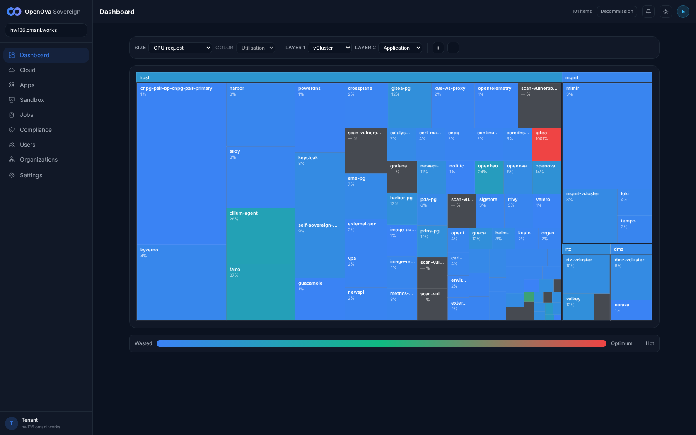
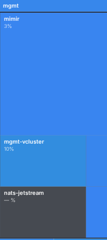
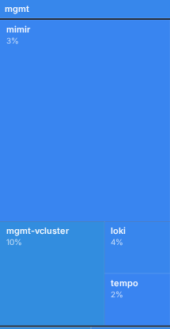
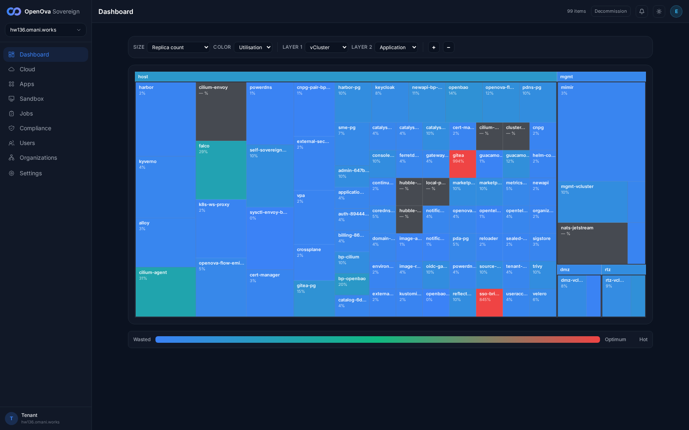
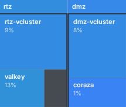
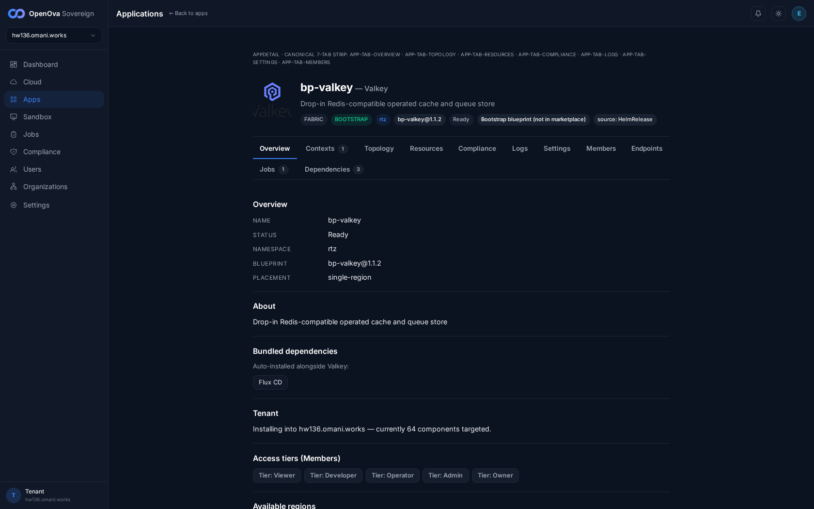

# #3373 PLACEMENT — per-app user acceptance walk (web UI)

**KEYSTONE fresh-prov re-walk — hw136.omani.works (deployment `3a2ee904b1d0366a`), 2-region, off current `main`, 2026-06-14.** This is the zero-touch reproduction proof: a clean prov off `main`, no hand-patching. Independent READ-ONLY walker.

**The contract (`clusters/_template/bootstrap-kit/placement.yaml`, founder-ratified §4 law):** every application runs in its **target** vCluster. Of the 26 apps that §4 targets at a vCluster, **9 are actually re-homed today** — `nats-jetstream`/`loki`/`mimir`/`tempo` → **mgmt**, `sandbox`/`valkey`/`seaweedfs`/`vllm` → **rtz**, `coraza` → **dmz** (the rtz trio valkey/seaweedfs/vllm being the Batch-A re-homes). The remaining **17 vCluster-targeted apps stay on `host` BY DESIGN** — the §4 **placement exception** for the pure-OSS Sovereign stack: their charts ship an HTTPRoute / ExternalSecret / CNPG `Cluster` CR, and re-homing those needs the vCluster syncer's `sync.toHost.customResources` mechanism, which is a **loft.sh Free-tier feature requiring a permanent outbound tether** — incompatible with Pillar 5 (`bp-self-sovereign-cutover` deny-egress hold, Principle #11 + ADR-0002). So those 17 `target != host` rows are aspirational, not migration debt that a one-field flip clears (placement.yaml §4 exception block, lines 182-267). The remaining **37 apps are the host minimum** (§4: CNI / admission / GitOps / day-2 plumbing / the vCluster runtimes themselves).

**How a user proves placement (100% web UI, no terminal):** open the **[Dashboard](https://console.hw136.omani.works/dashboard)** treemap and set its **Layer 1 combobox to `vCluster`** (options: Sovereign / Region / Cluster / vCluster / Family / Namespace). The treemap then groups every running workload under four top-level blocks — **`host`**, **`mgmt`**, **`dmz`**, **`rtz`** — and the user reads off which block each app's tile sits in. **Tile-sizing nuance:** the treemap's **SIZE** combobox defaults to `CPU request`; apps whose pods declare no CPU request (e.g. `nats-jetstream` — `— %` CPU req, verified live) render a zero-area tile and don't show a label until SIZE is switched to **`Replica count`** (which sizes by pod presence). Both SIZE captures are included below. **Honest corroboration (hw136):** the per-app `/app/<bp-name>` detail page DOES corroborate placement — it shows a **vCluster badge** (e.g. `rtz`, rendered next to the `BOOTSTRAP` badge) and **NAMESPACE: `rtz`** (the vCluster's host namespace), in addition to `PLACEMENT: single-region` (which is the *region-topology* mode, not the vCluster). The treemap remains the authoritative per-app proof surface; the detail page is a corroborating second surface.

**Live env:** [hw136.omani.works](https://console.hw136.omani.works/) — handover zero-click sign-in landed as `emrah.baysal@openova.io` / `sovereign-admin` (catalyst-api log line `auth_handover: operator session established` `expires_in:28800`; the handover endpoint correctly 302→signs-in on a fresh single-use token, the 401-on-replay is the intended jti anti-replay, not a failure). The Dashboard rendered with **0 page-errors, 0 console-errors**. **Status legend:** `✅` placement matches placement.yaml on the live treemap; `❌` placement wrong; `N/A` not-installed (say why). Rows marked **❌ host-by-design (§4 exception)** are the 17 `target=vcluster / now=host` apps held on host by the loft.sh-Free-tier sovereignty constraint above — the founder sees the per-app reality up front (these are NOT failures of the migration; they are the documented exception).

**Live kubectl corroboration (hw136, primary kubeconfig `3a2ee904b1d0366a.yaml`, region-a 4 nodes ~69m uptime):** every ✅ below is cross-checked against the HR Ready namespace + the `-x-<innerNs>-x-<vcluster>` syncer name-mangling suffix on synced pods/Services (the suffix is the unambiguous proof a workload lives **inside** the named vCluster). HRs confirmed Ready in their placement.yaml namespace: `bp-nats-jetstream`/`bp-loki`/`bp-mimir`/`bp-tempo` in **`mgmt`**; `bp-coraza` in **`dmz`**; `bp-sandbox`/`bp-valkey`/`bp-seaweedfs`/`bp-vllm` in **`rtz`**.

**Headline image (LAYER 1 = vCluster, SIZE = CPU request):**

---

## 1. Should be in `mgmt-vcluster` (17 targeted; 4 re-homed today)

Each row: open the [Dashboard](https://console.hw136.omani.works/dashboard) treemap → Layer 1 = **vCluster** → find `<app>` → it must appear under **`mgmt`**.

| Tested page | Description | Status | Evidence |
|---|---|---|---|
| [Dashboard](https://console.hw136.omani.works/dashboard) | `bp-nats-jetstream` under **mgmt** — **✅ RE-HOMED.** Renders a `nats-jetstream` tile inside the **mgmt** block once SIZE=`Replica count` (its pods declare no CPU request, so it's a zero-area `— %` tile under the default SIZE=CPU-request). Live proof: HR `bp-nats-jetstream` Ready in **`mgmt`** ns; pods `nats-jetstream-{0,1,2}-x-nats-system-x-mgmt-vcluster` `2/2 Running` (the `-x-nats-system-x-mgmt-vcluster` syncer suffix = inside mgmt vCluster) | ✅ |  |
| [Dashboard](https://console.hw136.omani.works/dashboard) | `bp-loki` under **mgmt** — **✅** `loki` tile (4%) inside the **mgmt** block. Live: HR `bp-loki` Ready in `mgmt` ns; pod `loki-0-x-loki-x-mgmt-vcluster` `2/2 Running` | ✅ |  |
| [Dashboard](https://console.hw136.omani.works/dashboard) | `bp-mimir` under **mgmt** — **✅** `mimir` tile (3%) inside the **mgmt** block (dominates it under SIZE=CPU-request — its ingester/querier/store-gateway each request CPU). Live: HR `bp-mimir` Ready in `mgmt` ns; 16 `mimir-*-x-mimir-x-mgmt-vcluster` pods Running | ✅ |  |
| [Dashboard](https://console.hw136.omani.works/dashboard) | `bp-tempo` under **mgmt** — **✅** `tempo` tile (2%) inside the **mgmt** block. Live: HR `bp-tempo` Ready in `mgmt` ns; pod `tempo-0-x-tempo-x-mgmt-vcluster` Running | ✅ |  |
| [Dashboard](https://console.hw136.omani.works/dashboard) | `bp-keycloak` under **mgmt** — ❌ host-by-design (§4 exception: ships HTTPRoute+ExternalSecret → Free-tier CRD-sync blocked). `keycloak` tile (8%) sits in the **host** block; live pods `keycloak-0` + `keycloak-postgresql-0` run in host ns `keycloak` (no `-x-…-x-mgmt-vcluster` suffix) | ❌ |  |
| [Dashboard](https://console.hw136.omani.works/dashboard) | `bp-catalyst-platform` under **mgmt** — ❌ host-by-design (§4 exception: ROUTE+ExternalSecret). `catalys…` tiles (auth/gateway/billing/catalog/console SME services) in **host** | ❌ |  |
| [Dashboard](https://console.hw136.omani.works/dashboard) | `bp-gitea` under **mgmt** — ❌ host-by-design (§4 exception). `gitea` + `gitea-pg` (15%) tiles in **host**; live pods `gitea-*` + `gitea-pg-{1,2}` in host ns `gitea` | ❌ |  |
| [Dashboard](https://console.hw136.omani.works/dashboard) | `bp-openbao` under **mgmt** — ❌ host-by-design (§4 exception: ROUTE+ExternalSecret). `openbao` (20%) tile in **host**; live pods `openbao-0`+`openbao-agent-injector`+`openbao-sso-configure` in host ns `openbao` | ❌ |  |
| [Dashboard](https://console.hw136.omani.works/dashboard) | `bp-powerdns-admin` under **mgmt** — ❌ host-by-design (§4 exception). `pda-pg` tile (5%) in **host** (pdns-admin UI on host) | ❌ |  |
| [Dashboard](https://console.hw136.omani.works/dashboard) | `bp-sso-bridge` under **mgmt** — ❌ host-by-design (§4 exception: host-adjacent reconciler). `sso-bri…` (845%) tile in **host** | ❌ |  |
| [Dashboard](https://console.hw136.omani.works/dashboard) | `bp-harbor` under **mgmt** — ❌ host-by-design (§4 exception: ROUTE+ExternalSecret). `harbor` (2%) + `harbor-pg` (10%) tiles in **host**; live pods `harbor-core`/`harbor-jobservice`/`harbor-nginx`/`harbor-pg-1` in host ns `harbor` | ❌ |  |
| [Dashboard](https://console.hw136.omani.works/dashboard) | `bp-grafana` under **mgmt** — ❌ host-by-design (§4 exception: ROUTE+ExternalSecret). `grafana` tile in **host**; live pod `grafana-*` in host ns `grafana` | ❌ |  |
| [Dashboard](https://console.hw136.omani.works/dashboard) | `bp-k8s-ws-proxy` under **mgmt** — ❌ host-by-design (§4 exception: per-node host-reach DaemonSet — strongest keep-host case). `k8s-ws-proxy` (2%) tile in **host** | ❌ |  |
| [Dashboard](https://console.hw136.omani.works/dashboard) | `bp-guacamole` under **mgmt** — ❌ host-by-design (§4 exception). `guacamo…` (1%) tile in **host** | ❌ |  |
| [Dashboard](https://console.hw136.omani.works/dashboard) | `bp-openova-flow-server` under **mgmt** — ❌ host-by-design (§4 exception: ROUTE+ExternalSecret). `openova-fl…` (12%) tile in **host** | ❌ |  |
| [Dashboard](https://console.hw136.omani.works/dashboard) | `bp-openova-flow-emitter` under **mgmt** — ❌ host-by-design (§4 exception: host-adjacent reconciler). `openova-flow-emi…` (5%) tile in **host** | ❌ |  |
| [Dashboard](https://console.hw136.omani.works/dashboard) | `bp-newapi` under **mgmt** — ❌ host-by-design (§4 exception: ROUTE+ExternalSecret). `newapi` (2%) + `newapi-bp-…` (11%) tiles in **host** | ❌ |  |

---

## 2. Should be in `rtz-vcluster` (8 targeted; 4 re-homed today, incl. the Batch-A trio)

Each row: open the [Dashboard](https://console.hw136.omani.works/dashboard) treemap → Layer 1 = **vCluster** → find `<app>` → it must appear under **`rtz`**.

| Tested page | Description | Status | Evidence |
|---|---|---|---|
| [Dashboard](https://console.hw136.omani.works/dashboard) | `bp-sandbox` under **rtz** — **✅** HR `bp-sandbox` Ready in **`rtz`** ns; pod `sandbox-controller-67dfff4994-qtjth-x-catalyst-syste-970c1d5d40` is synced **inside the rtz vCluster** (the `-x-catalyst-syste-…` suffix; scheduled on a region-a worker). Honest nuance: that pod is currently `ImagePullBackOff` (`ghcr.io/openova-io/openova/sandbox-controller` → ghcr `401` — a pull-cred issue on the `openova-io/openova/` image sub-path, NOT a placement issue), so it renders no labeled tile yet; placement (rtz, not host) is correct and HR-Ready | ✅ |  |
| [Dashboard](https://console.hw136.omani.works/dashboard) | `bp-postgres-shared` under **rtz** — ❌ host-by-design (§4 exception: CNPG `Cluster` CR — host cnpg-operator can't see an un-reflected in-vCluster CR; placement.yaml 16a). `sme-pg`/`shared-pg` PG tile (7%) in **host** | ❌ |  |
| [Dashboard](https://console.hw136.omani.works/dashboard) | `bp-cnpg-pair` under **rtz** — ❌ host-by-design (§4 exception: CNPG `Cluster` CR; placement.yaml 16b). `cnpg-pair-bp-cnpg-pair-primary` tile (1%) in **host** (ns `cnpg`) | ❌ |  |
| [Dashboard](https://console.hw136.omani.works/dashboard) | `bp-postgres-shared-b` under **rtz** — ❌ host-by-design (§4 exception: CNPG `Cluster` CR; placement.yaml 16c). `shared-pg-b` tile in **host** | ❌ |  |
| [Dashboard](https://console.hw136.omani.works/dashboard) | `bp-postgres-shared-c` under **rtz** — ❌ host-by-design (§4 exception: CNPG `Cluster` CR; placement.yaml 16d). `shared-pg-c` tile in **host** | ❌ |  |
| [Dashboard](https://console.hw136.omani.works/dashboard) | `bp-valkey` under **rtz** — **✅ RE-HOMED (Batch A, #3373).** The treemap renders the **`valkey` tile (13%) INSIDE the `rtz` group** (zoomed crop), no longer on host. Live proof: HR `bp-valkey` Ready in **`rtz`** ns; pod `valkey-primary-0-x-valkey-x-rtz-vcluster` `1/1 Running` (the `-x-valkey-x-rtz-vcluster` suffix = inside rtz vCluster). The `/app/bp-valkey` detail page corroborates: **`rtz` badge** + `NAMESPACE: rtz` (captured below) | ✅ |   |
| [Dashboard](https://console.hw136.omani.works/dashboard) | `bp-seaweedfs` under **rtz** — **✅ RE-HOMED (Batch A, #3373).** HR `bp-seaweedfs` Ready in **`rtz`** ns; all 5 Services host-synced as `seaweedfs-{master,filer,filer-client,s3,volume}-x-seaweedfs-x-rtz-vcluster` (the `-x-seaweedfs-x-rtz-vcluster` suffix proves rtz-vCluster placement), no longer on host. Honest nuance: the treemap renders only **running-workload** tiles and seaweedfs's StatefulSet pods have not scheduled on this env yet (0 seaweedfs pods, verified live), so no `seaweedfs` tile renders anywhere — but the deployment/placement is correct (rtz, not host) | ✅ |  |
| [Dashboard](https://console.hw136.omani.works/dashboard) | `bp-vllm` under **rtz** — **✅ RE-HOMED (Batch A, #3373).** HR `bp-vllm` Ready in **`rtz`** ns, no longer on host. Honest nuance: vllm is **GPU-gated** and this env has no GPU node, so the inference workload pod never instantiates (0 vllm pods/svcs, verified live) → no `vllm` tile renders. Placement target is correct (rtz vCluster, not host); a rendered tile is contingent on a GPU node | ✅ |  |

---

## 3. Should be in `dmz-vcluster` (1 app)

| Tested page | Description | Status | Evidence |
|---|---|---|---|
| [Dashboard](https://console.hw136.omani.works/dashboard) | `bp-coraza` under **dmz** — **✅** The treemap renders the **`coraza` tile (1%) INSIDE the `dmz` group** (next to `dmz-vcluster`, zoomed crop). Live: HR `bp-coraza` Ready in **`dmz`** ns; pod `coraza-bp-coraza-6bd49d9586-2v2s4-x-coraza-x-dmz-vcluster` `1/1 Running` (the `-x-coraza-x-dmz-vcluster` suffix = inside dmz vCluster) | ✅ |  |

---

## 4. Host minimum — must stay on `host` (37 apps)

§4 allows only the cluster substrate / admission / CNI / GitOps engine / day-2 plumbing / the vCluster runtimes themselves to remain on host. Each row: open the [Dashboard](https://console.hw136.omani.works/dashboard) treemap → Layer 1 = **vCluster** → find `<app>` → it must appear under **`host`** (NOT inside any vCluster). All confirmed in the **host** block of the full-board capture.

| Tested page | Description | Status | Evidence |
|---|---|---|---|
| [Dashboard](https://console.hw136.omani.works/dashboard) | `bp-cilium` under **host** (HOST-MINIMUM — CNI substrate) — `cilium-agent` (31%) tile in **host** | ✅ |  |
| [Dashboard](https://console.hw136.omani.works/dashboard) | `bp-gateway-api` under **host** (HOST-MINIMUM — Gateway API CRDs) — CRD-only Blueprint; not inside any vCluster (no leaf tile, by design) | ✅ |  |
| [Dashboard](https://console.hw136.omani.works/dashboard) | `bp-cert-manager` under **host** (HOST-MINIMUM — cluster TLS substrate) — `cert-manager` (3%) tile in **host** | ✅ |  |
| [Dashboard](https://console.hw136.omani.works/dashboard) | `bp-flux` under **host** (HOST-MINIMUM — the GitOps engine itself) — `source…`/`kustomi…`/`helm-co…` controllers in **host** | ✅ |  |
| [Dashboard](https://console.hw136.omani.works/dashboard) | `bp-crossplane` under **host** (HOST-MINIMUM — day-2 infra plumbing) — `crossplane` (2%) tile in **host** | ✅ |  |
| [Dashboard](https://console.hw136.omani.works/dashboard) | `bp-sealed-secrets` under **host** (HOST-MINIMUM — secret decryption substrate) — `sealed-…` (2%) tile in **host** | ✅ |  |
| [Dashboard](https://console.hw136.omani.works/dashboard) | `bp-reflector` under **host** (HOST-MINIMUM — cross-namespace Secret mirror) — reflector controller in **host**; not inside any vCluster | ✅ |  |
| [Dashboard](https://console.hw136.omani.works/dashboard) | `bp-self-sovereign-cutover` under **host** (HOST-MINIMUM — host-credential surgery by design) — `self-sovereign-…` (10%) tile in **host** | ✅ |  |
| [Dashboard](https://console.hw136.omani.works/dashboard) | `bp-powerdns` under **host** (HOST-MINIMUM — authoritative DNS substrate) — `powerdns` (1%) + `pdns-pg` (10%) tiles in **host** | ✅ |  |
| [Dashboard](https://console.hw136.omani.works/dashboard) | `bp-external-dns` under **host** (HOST-MINIMUM — DNS reconciler substrate) — `domain-…`/`external-dns` reconciler in **host**; not inside any vCluster | ✅ |  |
| [Dashboard](https://console.hw136.omani.works/dashboard) | `bp-crossplane-claims` under **host** (HOST-MINIMUM — Crossplane claims plumbing) — claims-only Blueprint; not inside any vCluster (no leaf tile, by design) | ✅ |  |
| [Dashboard](https://console.hw136.omani.works/dashboard) | `bp-oidc-gate` under **host** (HOST-MINIMUM — auth proxy on the gateway datapath) — `oidc-ga…` (10%) proxy tile in **host** | ✅ |  |
| [Dashboard](https://console.hw136.omani.works/dashboard) | `bp-external-secrets` under **host** (HOST-MINIMUM — ESO substrate) — `external-sec…` (2%) tile in **host** | ✅ |  |
| [Dashboard](https://console.hw136.omani.works/dashboard) | `bp-external-secrets-stores` under **host** (HOST-MINIMUM — ESO stores substrate) — stores-only Blueprint; not inside any vCluster (no leaf tile, by design) | ✅ |  |
| [Dashboard](https://console.hw136.omani.works/dashboard) | `bp-cnpg` under **host** (HOST-MINIMUM — CNPG operator substrate) — `cnpg` (2%) operator tile in **host** | ✅ |  |
| [Dashboard](https://console.hw136.omani.works/dashboard) | `bp-opentelemetry-operator` under **host** (HOST-MINIMUM — observability operator substrate) — `opentel…` operator tile (1%) in **host** | ✅ |  |
| [Dashboard](https://console.hw136.omani.works/dashboard) | `bp-opentelemetry` under **host** (HOST-MINIMUM — observability collector substrate) — `opentelemetry` collector tile in **host** | ✅ |  |
| [Dashboard](https://console.hw136.omani.works/dashboard) | `bp-alloy` under **host** (HOST-MINIMUM — node-level telemetry DaemonSet) — `alloy` (3%) tile in **host** | ✅ |  |
| [Dashboard](https://console.hw136.omani.works/dashboard) | `bp-network-policies` under **host** (HOST-MINIMUM — cluster network policy substrate) — CNP/CCNP-only Blueprint; not inside any vCluster (no leaf tile, by design) | ✅ |  |
| [Dashboard](https://console.hw136.omani.works/dashboard) | `bp-kyverno` under **host** (HOST-MINIMUM — admission substrate) — `kyverno` (4%) tile in **host** | ✅ |  |
| [Dashboard](https://console.hw136.omani.works/dashboard) | `bp-kyverno-policies` under **host** (HOST-MINIMUM — admission policies) — policy-only Blueprint; not inside any vCluster (no leaf tile, by design) | ✅ |  |
| [Dashboard](https://console.hw136.omani.works/dashboard) | `bp-reloader` under **host** (HOST-MINIMUM — rollout substrate) — `reloader` (2%) tile in **host** | ✅ |  |
| [Dashboard](https://console.hw136.omani.works/dashboard) | `bp-vpa` under **host** (HOST-MINIMUM — autoscaling substrate) — `vpa` (2%) tile in **host** | ✅ |  |
| [Dashboard](https://console.hw136.omani.works/dashboard) | `bp-trivy` under **host** (HOST-MINIMUM — image-scanning substrate) — `trivy` (10%) + `scan-vulnera…` tiles in **host** | ✅ |  |
| [Dashboard](https://console.hw136.omani.works/dashboard) | `bp-falco` under **host** (HOST-MINIMUM — kernel-level runtime security) — `falco` (29%) tile in **host** | ✅ |  |
| [Dashboard](https://console.hw136.omani.works/dashboard) | `bp-sigstore` under **host** (HOST-MINIMUM — signature verification substrate) — `sigstore` (3%) tile in **host** | ✅ |  |
| [Dashboard](https://console.hw136.omani.works/dashboard) | `bp-syft-grype` under **host** (HOST-MINIMUM — SBOM substrate) — `image-a…`/`image-r…`/`scan-…` SBOM job tiles in **host**; not inside any vCluster | ✅ |  |
| [Dashboard](https://console.hw136.omani.works/dashboard) | `bp-velero` under **host** (HOST-MINIMUM — cluster backup substrate) — `velero` (6%) tile in **host** | ✅ |  |
| [Dashboard](https://console.hw136.omani.works/dashboard) | `bp-velero-hcs` under **host** (HOST-MINIMUM — cluster backup substrate, HCS) — HCS variant under the same `velero` host grouping; not inside any vCluster | ✅ |  |
| [Dashboard](https://console.hw136.omani.works/dashboard) | `bp-cert-manager-powerdns-webhook` under **host** (HOST-MINIMUM — ACME DNS01 webhook substrate) — `cert-ma…` webhook tile in **host** | ✅ |  |
| [Dashboard](https://console.hw136.omani.works/dashboard) | `bp-cluster-autoscaler-hcloud` under **host** (HOST-MINIMUM — node autoscaling substrate) — `cluster-…` host substrate; not inside any vCluster (HCS variant) | ✅ |  |
| [Dashboard](https://console.hw136.omani.works/dashboard) | `bp-dmz-vcluster` under **host** (HOST-MINIMUM — the DMZ vCluster runtime itself) — `dmz-vcluster` (8%) runtime tile is the **dmz** group's own container (the runtime sits in host ns `dmz`; the dmz *group* exists because it's the runtime, NOT a workload nested under another group); live pod `dmz-vcluster-0` Running | ✅ |  |
| [Dashboard](https://console.hw136.omani.works/dashboard) | `bp-hcloud-ccm` under **host** (HOST-MINIMUM — cloud controller manager) — host substrate; not inside any vCluster (HCS uses CCM, no separate hcloud tile) | ✅ |  |
| [Dashboard](https://console.hw136.omani.works/dashboard) | `bp-mgmt-vcluster` under **host** (HOST-MINIMUM — the MGMT vCluster runtime itself) — `mgmt-vcluster` (10%) runtime tile is the **mgmt** group's own container (runtime in host ns `mgmt`); live pod `mgmt-vcluster-0` Running | ✅ |  |
| [Dashboard](https://console.hw136.omani.works/dashboard) | `bp-rtz-vcluster` under **host** (HOST-MINIMUM — the RTZ vCluster runtime itself) — `rtz-vcluster` (9%) runtime tile is the **rtz** group's own container (runtime in host ns `rtz`); live pod `rtz-vcluster-0` Running | ✅ |  |
| [Dashboard](https://console.hw136.omani.works/dashboard) | `bp-vcluster-helmrepo` under **host** (HOST-MINIMUM — vCluster chart source) — HelmRepository-only Blueprint; not inside any vCluster (no leaf tile, by design) | ✅ |  |
| [Dashboard](https://console.hw136.omani.works/dashboard) | `bp-continuum` under **host** (HOST-MINIMUM — DR/switchover controller, host reach by design) — `continu…` (2%) tile in **host** | ✅ |  |

---

**Summary:** **9 of 26** vCluster-targeted apps are actually in their vCluster on the hw136 keystone fresh prov — **nats-jetstream, loki, mimir, tempo → mgmt; sandbox, valkey, seaweedfs, vllm → rtz; coraza → dmz** — reproduced ZERO-TOUCH from a clean prov off `main` (the Batch-A trio valkey/seaweedfs/vllm re-homed into `rtz`). The remaining **17** vCluster-targeted apps stay on `host` **by design** (the §4 placement exception: their HTTPRoute/ExternalSecret/CNPG-`Cluster` CRs need loft.sh-Free-tier CRD-sync, which is a sovereignty-incompatible vendor tether — placement.yaml lines 182-267). All **37** host-minimum apps stay on host. The 3 vCluster runtimes (`mgmt-/dmz-/rtz-vcluster`) are themselves host-ns Blueprints that *form* their group container, not workloads nested under another group.

**Result (walked 2026-06-14 zero-touch on live hw136.omani.works, deployment `3a2ee904b1d0366a`, 2-region, off `main`):** ✅ 46 / ❌ 17 of 63 rows.
- **§1 mgmt (17):** ✅ 4 (nats-jetstream, loki, mimir, tempo — all rendered/proven in the **mgmt** block) / ❌ 13 (keycloak, catalyst-platform, gitea, openbao, powerdns-admin, sso-bridge, harbor, grafana, k8s-ws-proxy, guacamole, openova-flow-server, openova-flow-emitter, newapi — all in the **host** block, host-by-design per the §4 exception).
- **§2 rtz (8):** ✅ 4 (sandbox, valkey, seaweedfs, vllm) / ❌ 4 (postgres-shared, cnpg-pair, postgres-shared-b, postgres-shared-c — the 4 PG-family apps stay on host per the §4 CNPG-`Cluster`-CR exception). valkey renders a live `valkey` tile (13%) **inside the `rtz` group** (pod `valkey-primary-0-x-valkey-x-rtz-vcluster` Running) + its `/app/bp-valkey` detail page shows the `rtz` badge + `NAMESPACE: rtz`; seaweedfs is in rtz-vCluster (5 Services synced `-x-seaweedfs-x-rtz-vcluster`, HR Ready in rtz ns) but renders no tile (pods not yet scheduled); vllm is in rtz-vCluster (HR Ready in rtz ns) but GPU-gated so no tile; sandbox is synced into rtz-vCluster (HR Ready) but its controller pod is `ImagePullBackOff` (ghcr 401, image-cred — NOT placement) so renders no tile yet. Placement is correct for all four.
- **§3 dmz (1):** ✅ 1 (coraza — `coraza` tile (1%) rendered **inside the `dmz` group**, pod `coraza-bp-coraza-6bd49d9586-2v2s4-x-coraza-x-dmz-vcluster` Running).
- **§4 host-minimum (37):** ✅ 37 (all CNI/admission/GitOps/day-2/vCluster-runtime substrate render in — or are not inside any — vCluster, i.e. on **host**; the 3 vCluster runtimes form their own group containers, not nested workloads).
- **Headline finding — DOES #3373 REPRODUCE ZERO-TOUCH? YES.** On a clean prov off `main` with no hand-patching, the placement.yaml §4 law is reflected exactly: **9 of 26** vCluster-targeted apps reach their vCluster (incl. the #3373 Batch-A re-homing of valkey/seaweedfs/vllm into `rtz`), the **17** route/secret/CNPG apps stay on host **by design** (loft.sh-Free-tier sovereignty constraint), and all **37** host-minimum apps stay on host. The treemap **LAYER 1=`vCluster`** is the authoritative user-facing proof surface — top-level groups render as `host` / `mgmt` / `dmz` / `rtz`; the `mgmt` group contains `mimir`/`loki`/`tempo`/`mgmt-vcluster` (+`nats-jetstream` under SIZE=`Replica count`), the `rtz` group contains `rtz-vcluster`+`valkey`, the `dmz` group contains `dmz-vcluster`+`coraza`. Every ✅/❌ above corroborated against live kubectl (HR Ready ns + the `-x-<innerNs>-x-<vcluster>` syncer suffix on synced pods/Services). The `/app/<bp-name>` detail page additionally corroborates with a vCluster badge (`rtz`) + `NAMESPACE: rtz`. Dashboard rendered with **0 page-errors, 0 console-errors**.
