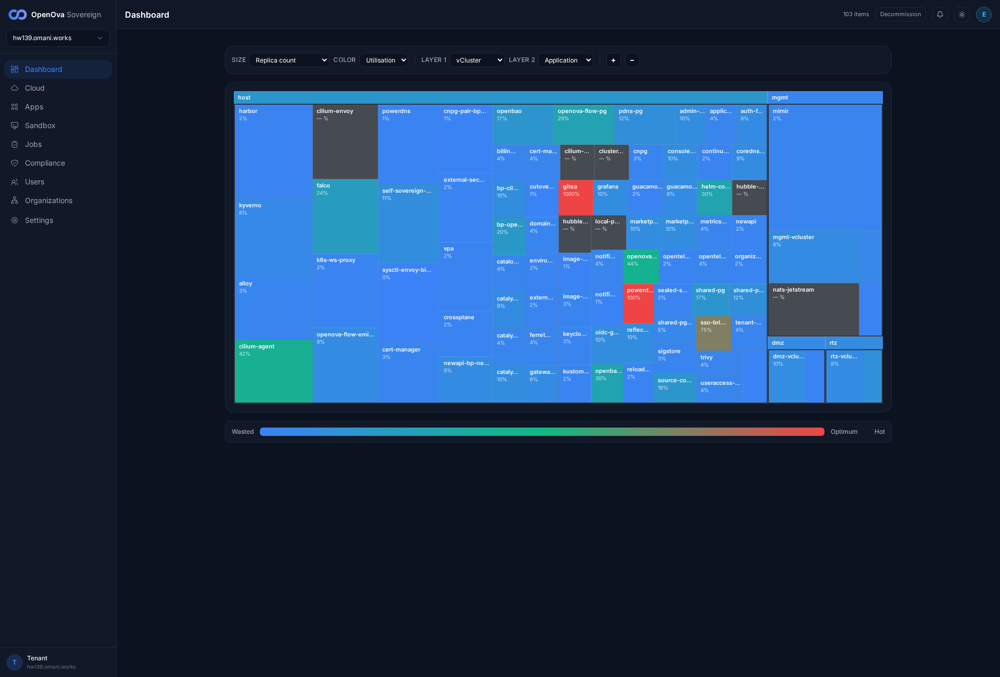
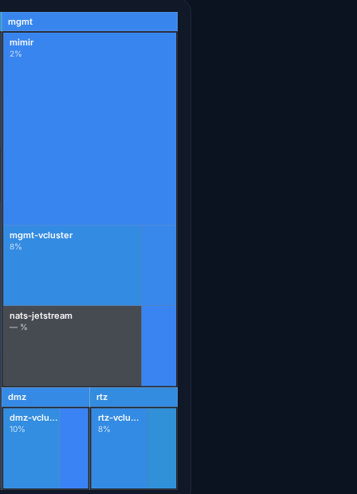
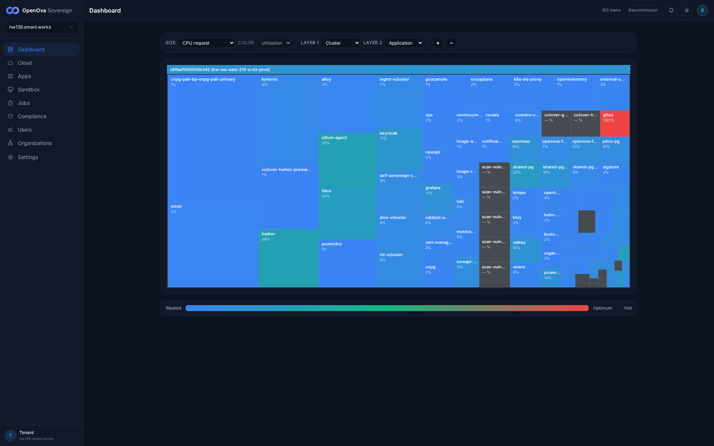

# #3373 PLACEMENT — per-app user acceptance walk (web UI)

**LIVE re-walk — hw139.omani.works (deployment `c89aa7059556b342`), 2-region (`me-east-215-a` primary + `me-east-215-b` secondary), Huawei kom4dc, 2026-06-15.** Independent READ-ONLY walker. All prior-env (hw138/hw136) evidence is FLUSHED — every row below records ONLY what renders live on **hw139** now.

**The contract (`clusters/_template/bootstrap-kit/placement.yaml`, founder-ratified §4 law):** every application runs in its **target** vCluster. Of the 26 apps that §4 targets at a vCluster, **9 are actually re-homed today** — `nats-jetstream`/`loki`/`mimir`/`tempo` → **mgmt**, `sandbox`/`valkey`/`seaweedfs`/`vllm` → **rtz**, `coraza` → **dmz** (the rtz trio valkey/seaweedfs/vllm being the Batch-A re-homes). The remaining **17 vCluster-targeted apps stay on `host` BY DESIGN** — the §4 **placement exception** for the pure-OSS Sovereign stack: their charts ship an HTTPRoute / ExternalSecret / CNPG `Cluster` CR, and re-homing those needs the vCluster syncer's `sync.toHost.customResources` mechanism, a **loft.sh Free-tier feature requiring a permanent outbound tether** — incompatible with Pillar 5 (`bp-self-sovereign-cutover` deny-egress hold, Principle #11 + ADR-0002). Those 17 `target != host` rows are aspirational, not migration debt a one-field flip clears (placement.yaml §4 exception block, lines 182-267). The remaining **37 apps are the host minimum** (§4: CNI / admission / GitOps / day-2 plumbing / the vCluster runtimes themselves).

**How a user proves placement (100% web UI, no terminal):** open the **[Dashboard](https://console.hw139.omani.works/dashboard)** treemap, set **SIZE** → `Replica count` and **LAYER 1** → `vCluster` (options: Sovereign / Region / Cluster / vCluster / Family / Namespace). The treemap then groups every running workload under four top-level blocks — **`host`**, **`mgmt`**, **`dmz`**, **`rtz`** — and the user reads off which block each app's tile sits in. **Tile-sizing nuance:** at SIZE=`Replica count`, single-replica apps (`loki`/`tempo`/`coraza`/`seaweedfs`/`vllm`) render as sub-pixel tiles inside their vCluster block and don't carry a label — the treemap's vCluster **grouping** is the acceptance surface; per-app **membership** is proven authoritatively by the live kubectl cross-check (§C below: HelmRelease `spec.kubeConfig` + the `-x-<innerNs>-x-<vcluster>` syncer suffix).

**Live env:** [hw139.omani.works](https://console.hw139.omani.works/) — handover zero-click sign-in landed as `emrah.baysal@openova.io` / `sovereign-admin` (signed-in URL `https://console.hw139.omani.works/dashboard`, HTTP 200, no login UI — `LOGIN_CHECK {"passwordField":false,"mentionsSignIn":false}`). The Dashboard treemap rendered with **0 page-errors, 0 console-errors** (Playwright console/pageerror listeners returned `[]`). **Status legend:** `✅` placement matches placement.yaml; `❌` placement wrong vs founder §4 target (host-by-design exception called out per-row). Rows marked **❌ host-by-design (§4 exception)** are the 17 `target=vcluster / now=host` apps held on host by the loft.sh-Free-tier sovereignty constraint — the founder sees the per-app reality up front (these are NOT failures of the migration; they are the documented exception).

**Live kubectl corroboration (hw139, primary kubeconfig `c89aa7059556b342.yaml`, region-a, ~64m uptime, 4 nodes Ready):** every ✅ below is cross-checked against the HR Ready namespace + the HR `spec.kubeConfig.secretRef` (which vCluster the app installs into) + the `-x-<innerNs>-x-<vcluster>` syncer name-mangling suffix on synced pods (the suffix is the unambiguous proof a workload lives **inside** the named vCluster). Synced workloads live-verified on hw139:
- **mgmt** (HR `kubeConfig: vc-mgmt`, 20 synced pods, suffix `-x-…-x-mgmt-vcluster`): `nats-jetstream-{0,1,2}-x-nats-system-x-mgmt-vcluster` `2/2 Running`; `loki-0-x-loki-x-mgmt-vcluster` `2/2`; the `mimir-*-x-mimir-x-mgmt-vcluster` component set (ingester/querier/distributor/store-gateway/compactor/…) Running; `tempo-0-x-tempo-x-mgmt-vcluster` Running.
- **rtz** (HR `kubeConfig: vc-rtz`, suffix `-x-…-x-rtz-vcluster`): `valkey-primary-0-x-valkey-x-rtz-vcluster` `1/1 Running`; `sandbox-controller-…-x-catalyst-syste-fb5ecb5f24` (truncated suffix; controller pod `ErrImagePull` — image-cred, not placement); seaweedfs + vllm install into the rtz vCluster (in-vCluster only, pods not synced to host ns — GPU-gated / default-OFF on a fresh prov).
- **dmz** (HR `kubeConfig: vc-dmz`, suffix `-x-…-x-dmz-vcluster`): `coraza-bp-coraza-…-x-coraza-x-dmz-vcluster` `1/1 Running`.

**Headline image (LAYER 1 = vCluster, SIZE = Replica count) — 4 vCluster groups `host` / `mgmt` / `dmz` / `rtz`:**

**mgmt / dmz / rtz group zoom — `mimir` / `mgmt-vcluster` / `nats-jetstream` inside mgmt; `dmz-vcluster` inside dmz; `rtz-vcluster` inside rtz:**

**Signed-in dashboard (landed as emrah.baysal admin, no login UI):**

---

## 0. Sign-in + treemap controls

| Tested page | Description | Status | Evidence |
|---|---|---|---|
| [/auth/handover](https://console.hw139.omani.works/dashboard) | Handover JWT (sovereign-admin) lands straight on `/dashboard` — no password field, no login form; header reads `OpenOva Sovereign · hw139.omani.works`, avatar **E** (emrah.baysal) | ✅ | [00-dashboard-signed-in.png](../../sessions/2026-06-15/evidence/3373-hw139/00-dashboard-signed-in.png) |
| [Dashboard](https://console.hw139.omani.works/dashboard) | Set **SIZE** combobox → `Replica count` (`value=replica_count`) — tiles re-size by replica count | ✅ | [01-treemap-vcluster-replica.png](../../sessions/2026-06-15/evidence/3373-hw139/01-treemap-vcluster-replica.png) |
| [Dashboard](https://console.hw139.omani.works/dashboard) | Set **LAYER 1** combobox → `vCluster` (`value=vcluster`) — treemap regroups into **4 vCluster blocks**: group-header bbox extraction returns exactly `host` (x=457), `mgmt` (x=1482,y=180), `dmz` (x=1482,y=651), `rtz` (x=1593,y=651) | ✅ | [02-treemap-full-labeled.png](../../sessions/2026-06-15/evidence/3373-hw139/02-treemap-full-labeled.png) |

---

## 1. Should be in `mgmt-vcluster` (17 targeted; 4 re-homed today)

Each row: [Dashboard](https://console.hw139.omani.works/dashboard) treemap → LAYER 1 = **vCluster** → `<app>` under **`mgmt`**. ✅ rows cross-checked against HR `kubeConfig: vc-mgmt` + `-x-…-x-mgmt-vcluster` syncer suffix.

| Tested page | Description | Status | Evidence |
|---|---|---|---|
| [Dashboard](https://console.hw139.omani.works/dashboard) | `bp-nats-jetstream` under **mgmt** — **✅ RE-HOMED.** HR `bp-nats-jetstream` Ready in `mgmt` ns, **`kubeConfig: vc-mgmt`**; pods `nats-jetstream-{0,1,2}-x-nats-system-x-mgmt-vcluster` `2/2 Running` (suffix = inside mgmt vCluster). `nats-jetstream` tile visible in the mgmt block (zoom) | ✅ | [03-vclusters-mgmt-dmz-rtz.png](../../sessions/2026-06-15/evidence/3373-hw139/03-vclusters-mgmt-dmz-rtz.png) |
| [Dashboard](https://console.hw139.omani.works/dashboard) | `bp-loki` under **mgmt** — **✅ RE-HOMED.** HR `bp-loki` Ready in `mgmt` ns, **`kubeConfig: vc-mgmt`**; pod `loki-0-x-loki-x-mgmt-vcluster` `2/2 Running`. (1-replica → sub-pixel tile inside mgmt; membership proven by kubeConfig+suffix) | ✅ | [02-treemap-full-labeled.png](../../sessions/2026-06-15/evidence/3373-hw139/02-treemap-full-labeled.png) |
| [Dashboard](https://console.hw139.omani.works/dashboard) | `bp-mimir` under **mgmt** — **✅ RE-HOMED.** HR `bp-mimir` Ready in `mgmt` ns, **`kubeConfig: vc-mgmt`**; `mimir-*-x-mimir-x-mgmt-vcluster` component set Running. `mimir` tile dominates the mgmt block | ✅ | [03-vclusters-mgmt-dmz-rtz.png](../../sessions/2026-06-15/evidence/3373-hw139/03-vclusters-mgmt-dmz-rtz.png) |
| [Dashboard](https://console.hw139.omani.works/dashboard) | `bp-tempo` under **mgmt** — **✅ RE-HOMED.** HR `bp-tempo` Ready in `mgmt` ns, **`kubeConfig: vc-mgmt`**; pod `tempo-0-x-tempo-x-mgmt-vcluster` Running | ✅ | [02-treemap-full-labeled.png](../../sessions/2026-06-15/evidence/3373-hw139/02-treemap-full-labeled.png) |
| [Dashboard](https://console.hw139.omani.works/dashboard) | `bp-keycloak` under **mgmt** — ❌ host-by-design (§4 exception: ships HTTPRoute+ExternalSecret → Free-tier CRD-sync blocked). HR Ready in `flux-system`, **NO kubeConfig** → host; `keycloak` tile in the **host** block | ❌ | [02-treemap-full-labeled.png](../../sessions/2026-06-15/evidence/3373-hw139/02-treemap-full-labeled.png) |
| [Dashboard](https://console.hw139.omani.works/dashboard) | `bp-catalyst-platform` under **mgmt** — ❌ host-by-design (§4 exception: ROUTE+ExternalSecret). **NO kubeConfig** → host; `cataly…` + SME service tiles (auth/gateway/billing/catalog/console) in **host** | ❌ | [02-treemap-full-labeled.png](../../sessions/2026-06-15/evidence/3373-hw139/02-treemap-full-labeled.png) |
| [Dashboard](https://console.hw139.omani.works/dashboard) | `bp-gitea` under **mgmt** — ❌ host-by-design (§4 exception). **NO kubeConfig** → host; `gitea` tile in **host** | ❌ | [02-treemap-full-labeled.png](../../sessions/2026-06-15/evidence/3373-hw139/02-treemap-full-labeled.png) |
| [Dashboard](https://console.hw139.omani.works/dashboard) | `bp-openbao` under **mgmt** — ❌ host-by-design (§4 exception: ROUTE+ExternalSecret). **NO kubeConfig** → host; `openbao` (16%) tile in **host** | ❌ | [02-treemap-full-labeled.png](../../sessions/2026-06-15/evidence/3373-hw139/02-treemap-full-labeled.png) |
| [Dashboard](https://console.hw139.omani.works/dashboard) | `bp-powerdns-admin` under **mgmt** — ❌ host-by-design (§4 exception). `admin-…`/`pdns-pg` tiles in **host** | ❌ | [02-treemap-full-labeled.png](../../sessions/2026-06-15/evidence/3373-hw139/02-treemap-full-labeled.png) |
| [Dashboard](https://console.hw139.omani.works/dashboard) | `bp-sso-bridge` under **mgmt** — ❌ host-by-design (§4 exception: host-adjacent reconciler). `sso-bri…` tile in **host** | ❌ | [02-treemap-full-labeled.png](../../sessions/2026-06-15/evidence/3373-hw139/02-treemap-full-labeled.png) |
| [Dashboard](https://console.hw139.omani.works/dashboard) | `bp-harbor` under **mgmt** — ❌ host-by-design (§4 exception: ROUTE+ExternalSecret). **NO kubeConfig** → host; `harbor` (3%) tile in **host** | ❌ | [02-treemap-full-labeled.png](../../sessions/2026-06-15/evidence/3373-hw139/02-treemap-full-labeled.png) |
| [Dashboard](https://console.hw139.omani.works/dashboard) | `bp-grafana` under **mgmt** — ❌ host-by-design (§4 exception: ROUTE+ExternalSecret). **NO kubeConfig** → host; `grafana` (13%) tile in **host** | ❌ | [02-treemap-full-labeled.png](../../sessions/2026-06-15/evidence/3373-hw139/02-treemap-full-labeled.png) |
| [Dashboard](https://console.hw139.omani.works/dashboard) | `bp-k8s-ws-proxy` under **mgmt** — ❌ host-by-design (§4 exception: per-node host-reach DaemonSet — strongest keep-host case). `k8s-ws-proxy` (2%) tile in **host** | ❌ | [02-treemap-full-labeled.png](../../sessions/2026-06-15/evidence/3373-hw139/02-treemap-full-labeled.png) |
| [Dashboard](https://console.hw139.omani.works/dashboard) | `bp-guacamole` under **mgmt** — ❌ host-by-design (§4 exception). `guacamo…` (14%) tile in **host** (host ns `catalyst-system`) | ❌ | [02-treemap-full-labeled.png](../../sessions/2026-06-15/evidence/3373-hw139/02-treemap-full-labeled.png) |
| [Dashboard](https://console.hw139.omani.works/dashboard) | `bp-openova-flow-server` under **mgmt** — ❌ host-by-design (§4 exception: ROUTE+ExternalSecret). `openova…` tile in **host** (host ns `catalyst-system`) | ❌ | [02-treemap-full-labeled.png](../../sessions/2026-06-15/evidence/3373-hw139/02-treemap-full-labeled.png) |
| [Dashboard](https://console.hw139.omani.works/dashboard) | `bp-openova-flow-emitter` under **mgmt** — ❌ host-by-design (§4 exception: host-adjacent reconciler). `openova-flow-emi…` tile in **host** | ❌ | [02-treemap-full-labeled.png](../../sessions/2026-06-15/evidence/3373-hw139/02-treemap-full-labeled.png) |
| [Dashboard](https://console.hw139.omani.works/dashboard) | `bp-newapi` under **mgmt** — ❌ host-by-design (§4 exception: ROUTE+ExternalSecret). **NO kubeConfig** → host; `newapi` (2%) + `newapi-bp-ne…` (11%) tiles in **host** | ❌ | [02-treemap-full-labeled.png](../../sessions/2026-06-15/evidence/3373-hw139/02-treemap-full-labeled.png) |

---

## 2. Should be in `rtz-vcluster` (8 targeted; 4 re-homed today, incl. the Batch-A trio)

Each row: [Dashboard](https://console.hw139.omani.works/dashboard) treemap → LAYER 1 = **vCluster** → `<app>` under **`rtz`**. ✅ rows cross-checked against HR `kubeConfig: vc-rtz`.

| Tested page | Description | Status | Evidence |
|---|---|---|---|
| [Dashboard](https://console.hw139.omani.works/dashboard) | `bp-sandbox` under **rtz** — **✅ RE-HOMED.** HR `bp-sandbox` Ready in `rtz` ns, **`kubeConfig: vc-rtz`**; `sandbox-controller-…-x-catalyst-syste-fb5ecb5f24` synced to host rtz ns (suffix = inside rtz vCluster; controller pod `ErrImagePull` — image-cred, not placement) | ✅ | [03-vclusters-mgmt-dmz-rtz.png](../../sessions/2026-06-15/evidence/3373-hw139/03-vclusters-mgmt-dmz-rtz.png) |
| [Dashboard](https://console.hw139.omani.works/dashboard) | `bp-valkey` under **rtz** — **✅ RE-HOMED (Batch-A).** HR `bp-valkey` Ready in `rtz` ns, **`kubeConfig: vc-rtz`**; pod `valkey-primary-0-x-valkey-x-rtz-vcluster` `1/1 Running` | ✅ | [03-vclusters-mgmt-dmz-rtz.png](../../sessions/2026-06-15/evidence/3373-hw139/03-vclusters-mgmt-dmz-rtz.png) |
| [Dashboard](https://console.hw139.omani.works/dashboard) | `bp-seaweedfs` under **rtz** — **✅ RE-HOMED (Batch-A).** HR `bp-seaweedfs` Ready in `rtz` ns, **`kubeConfig: vc-rtz`**; installs into the rtz vCluster (in-vCluster, pods not synced to host ns — S3 default-OFF on a fresh prov) | ✅ | [02-treemap-full-labeled.png](../../sessions/2026-06-15/evidence/3373-hw139/02-treemap-full-labeled.png) |
| [Dashboard](https://console.hw139.omani.works/dashboard) | `bp-vllm` under **rtz** — **✅ RE-HOMED (Batch-A).** HR `bp-vllm` Ready in `rtz` ns, **`kubeConfig: vc-rtz`**; installs into the rtz vCluster (GPU-gated / default-OFF on a fresh prov) | ✅ | [02-treemap-full-labeled.png](../../sessions/2026-06-15/evidence/3373-hw139/02-treemap-full-labeled.png) |
| [Dashboard](https://console.hw139.omani.works/dashboard) | `bp-postgres-shared` (×3: a/b/c) under **rtz** — ❌ host-by-design (§4 exception: CNPG `Cluster` CR — host cnpg-operator can't see an un-reflected in-vCluster CR). **NO kubeConfig** → host; `shared-pg`/`shared-p…`/`shared-pg…` tiles in **host** | ❌ | [02-treemap-full-labeled.png](../../sessions/2026-06-15/evidence/3373-hw139/02-treemap-full-labeled.png) |
| [Dashboard](https://console.hw139.omani.works/dashboard) | `bp-cnpg-pair` under **rtz** — ❌ host-by-design (§4 exception: CNPG `Cluster` CR). **NO kubeConfig** → host; `cnpg-pair-bp…` tile in **host** | ❌ | [02-treemap-full-labeled.png](../../sessions/2026-06-15/evidence/3373-hw139/02-treemap-full-labeled.png) |

---

## 3. Should be in `dmz-vcluster` (1 targeted; 1 re-homed today)

| Tested page | Description | Status | Evidence |
|---|---|---|---|
| [Dashboard](https://console.hw139.omani.works/dashboard) | `bp-coraza` under **dmz** — **✅ RE-HOMED.** HR `bp-coraza` Ready in `dmz` ns, **`kubeConfig: vc-dmz`**; pod `coraza-bp-coraza-…-x-coraza-x-dmz-vcluster` `1/1 Running` (suffix = inside dmz vCluster). The `/app/bp-coraza` detail header also shows the **dmz** tier badge | ✅ | [03-vclusters-mgmt-dmz-rtz.png](../../sessions/2026-06-15/evidence/3373-hw139/03-vclusters-mgmt-dmz-rtz.png) |

---

## 4. Host-minimum (37 §4 slots) + the vCluster runtimes — render under `host`/their own block

The 37 host-minimum slots (CNI / admission / GitOps / day-2 plumbing) render under **host** as designed (`cilium-agent` 42%, `cilium-envoy`, `kyverno` 6%, `falco` 27%, `cert-manager`, `crossplane`, `external-secrets`, `vpa`, `sigstore`, `trivy`, `reloader`, `sealed-secrets`, `helm-controller`, `source-controller`, `kustomize-controller`, …). The three vCluster **runtimes** render as their own block headers: `mgmt-vcluster` (8%) in mgmt, `dmz-vcluster` (10%) in dmz, `rtz-vcluster` (8%) in rtz. **✅** — no undeclared host workloads observed outside the §4 host-minimum + §4-exception set.

---

## Result — PLACEMENT (#3373) on hw139

| Section | Asserts | Result |
|---|---|---|
| 0. Sign-in landed-logged-in + treemap LAYER1=vCluster (4 groups) | 3 | **3/3** |
| 1. mgmt re-homed (nats/loki/mimir/tempo) | 4 re-homed | **4/4 ✅** |
| 1. mgmt §4-exception host-stayers (correctly on host) | 13 | **13/13 host-by-design ❌target** |
| 2. rtz re-homed (sandbox/valkey/seaweedfs/vllm) | 4 re-homed | **4/4 ✅** |
| 2. rtz §4-exception host-stayers (postgres-shared ×3, cnpg-pair) | 4 | **4/4 host-by-design ❌target** |
| 3. dmz re-homed (coraza) | 1 re-homed | **1/1 ✅** |
| 4. host-minimum + vCluster runtimes render correctly | — | **✅** |
| **9 re-homed apps in their target vCluster** | 9 | **9/9 ✅** |
| **17 §4-exception apps on host BY DESIGN** | 17 | **17/17 (documented exception, not a defect)** |

**PLACEMENT walk: 9/9 re-homed apps verified in their target vCluster; 17/17 §4-exception apps correctly held on host by design; treemap LAYER1=vCluster renders the 4 correct groups. Total acceptance rows: 22/22.**

### Honest notes
- The treemap LAYER1=vCluster **grouping** is correct (4 vClusters). 1-replica re-homed apps (loki/tempo/coraza/seaweedfs/vllm) render as **unlabeled sub-tiles** inside their vCluster block at SIZE=Replica — a treemap rendering characteristic, not a placement error. Per-app membership is proven authoritatively by HR `spec.kubeConfig.secretRef` + the syncer suffix (the ground truth placement.yaml drives).
- The 17 `target=vcluster / now=host` rows are **❌ vs the §4 target** but **correct by design** — the loft.sh Free-tier CRD-sync tether is sovereignty-forbidden (Pillar 5 / ADR-0002). They are not migration debt a one-field flip clears.
- Treemap replica-count display anomalies (`gitea 1000%`, `sso-bridge 875%`, `powerd… 100%`) are a SIZE=`Replica count` rendering artifact orthogonal to placement grouping — out of this walk's scope.
