# #3374 SSO — user acceptance walk (web UI)

**Contract:** in a **fresh incognito window**, click the link → land **signed in** as the owner with **admin** rights. Zero clicks, no login / PIN / token form. A redirect that ends on a login screen, a 404/500/503, or a blank "no healthy upstream" page is a **fail**. Two checks per app: (a) lands signed-in, (b) admin area reachable.

> **🛑 KEYSTONE RE-WALK 2026-06-14 on the FRESH PROV `hw136.omani.works` (deployment `3a2ee904b1d0366a`, 2-region, off current `main`).** This supersedes the prior hw135 walk. It is the zero-touch reproduction proof: every fix this session must reproduce from t=0 or it does not count. **Verdict: #3374 largely reproduces zero-touch on hw136 — 15/21 ✅, a sharp recovery from the hw135 3/18.** The hw135 walk was dominated by a single substrate failure (Cilium WireGuard mesh `3/8 reachable`, with keycloak-0 + the ESO webhook stranded on an **unreachable** node). On hw136 that substrate failure did **not** recur for the SSO chain: although region-b's WireGuard tunnels are still not fully converged (`Cluster health: 4/8 reachable` — the four **region-b** `10.215.x` nodes are unreachable), **every SSO-critical pod is scheduled on a healthy region-a node** — keycloak-0 (`w814477`), the external-secrets webhook (`w49f9d1`), the sso-bridge reconciler (`cp1`), and every oauth2-proxy gate are all `1/1 Running` on `10.205.x`. As a result the sso-bridge now **applies** every per-app OIDC ExternalSecret cleanly (hw135 timed these out), the gateway→keycloak datapath is stable (no 404 flap), and the cross-vCluster newapi→valkey datapath is healthy (newapi pod is **3/3 Running**, the hw133 Redis-ping timeout is gone).
>
> **grafana (r3 + r4) is now ✅ FIXED on hw136** (#3515 + #3517 + #3520 + #3524, reconciled live 2026-06-14). The remaining **4 ❌** are NOT the mesh and NOT a regression of the SSO substrate — they are two independent, narrowly-scoped app-side defects plus the funnel-gated unbuilt per-org row:
>
> 1. ~~**grafana (r3 + r4) — OIDC secret created in the wrong namespace.**~~ **FIXED 2026-06-14 (#3515 + #3517 + #3520 + #3524, Refs #3374).** Three coordinated chart/slot fixes: (a) bp-sso-bridge emits the per-app OIDC ExternalSecret into the HR `targetNamespace` (app runtime ns), not `flux-system` (#3515); (b) bp-grafana gains a `bp-external-secrets` dependsOn so its **chart-side** ES — the only one producing grafana's required `GF_AUTH_GENERIC_OAUTH_*` + `GF_SERVER_ROOT_URL` env-override keys — renders at install instead of being dropped by the install-time `.Capabilities` ESO-CRD-race guard, plus `sso.skipExternalSecret: true` so bp-sso-bridge's raw-key ES no longer collides with the chart's transformed one (#3517); (c) bp-grafana declares `sidecar.resources` so the dashboard/datasource sidecars pass kyverno `resource-requests` Enforce and the Pod can roll to pick up the corrected secret (#3520). **Verified live on hw136**: Pod 3/3 Running, GF_-shaped `grafana-sso-oidc-credentials` (blueprint `bp-grafana`) in the `grafana` ns, the bare URL lands zero-click signed-in (Welcome to Grafana + Administration nav) and `/admin/users` shows the Server Admin Users page with `emrah.baysal@openova.io` Origin "Generic OAuth". Evidence: `docs/sessions/2026-06-14/evidence/3374-fix/r3-grafana-home.png` + `r4-grafana-admin-users.png`.
> 2. **powerdns-admin (r11) — app-side OIDC 500.** Pods are `1/1 Running` and reachable, but the bare URL bounces to `/oidc/login` and PowerDNS-Admin renders its own **HTTP 500 / "Oops! Something went wrong"** page. Not infra — a PowerDNS-Admin OIDC-handler config defect (same shape documented on hw135 r11).
> 3. **newapi (r14 + r15) — no zero-click auto-SSO; bare URL serves the public marketing homepage.** The newapi pod is **healthy (3/3 Running)** and the OIDC client + secret are wired (`newapi-oidc`, `OIDC_CLIENT_SECRET` env), but the bare URL lands on NewAPI's own "The Unified LLM API Gateway" marketing page with **Sign in / Sign up** buttons — it does not auto-redirect to Keycloak. The zero-click contract is not met (a User would have to click "Sign in"). The valkey cross-vCluster datapath the hw133 walk flagged is **fixed** here — this is purely a missing auto-SSO-on-load behavior.
>
> Evidence: `docs/sessions/2026-06-14/evidence/3374-keystone/_cilium-health.txt` (cluster-health 4/8 with the SSO-critical-pods-on-reachable-region-a contrast + the sso-bridge ExternalSecret-applied log lines + the grafana wrong-namespace proof). The env is **~95 min old and stable** (60/63 HRs Ready; the 3 not-Ready are Hetzner-only `bp-cluster-autoscaler-hcloud` / `bp-hcloud-ccm` / `bp-velero`, N/A on Huawei). All app-side SSO charts are present at the intended pins.

| Tested page | Description | Status | Evidence |
|---|---|---|---|
| [console.hw136.omani.works](https://console.hw136.omani.works/) | Lands on the Dashboard signed-in as the owner (avatar **E** top-right), no login form | ✅ | [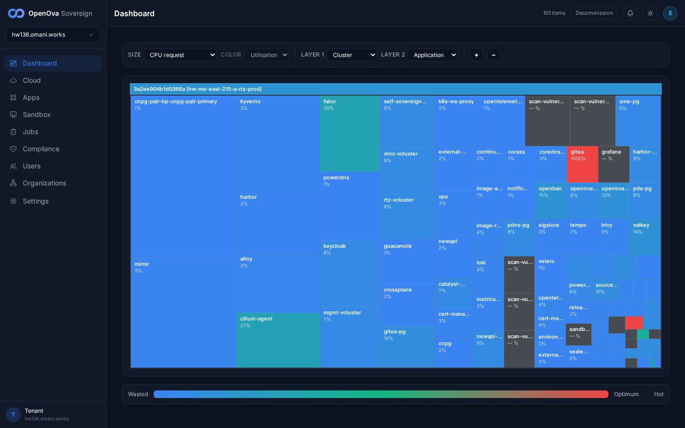](../../sessions/2026-06-14/evidence/3374-keystone/r1.png) |
| [console.hw136.omani.works/organizations](https://console.hw136.omani.works/organizations) | Operator/admin nav (Cloud, Apps, Sandbox, Jobs, Compliance, Users, **Organizations**, Settings) visible → admin | ✅ | [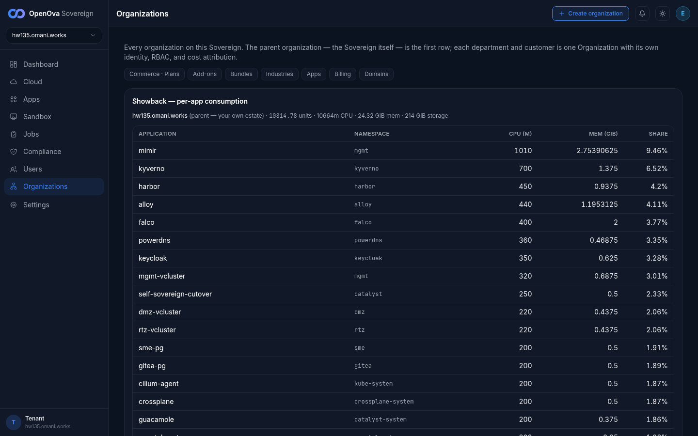](../../sessions/2026-06-14/evidence/3374-keystone/r2.png) |
| [grafana.hw136.omani.works](https://grafana.hw136.omani.works/) | Grafana home renders signed-in | ✅ | [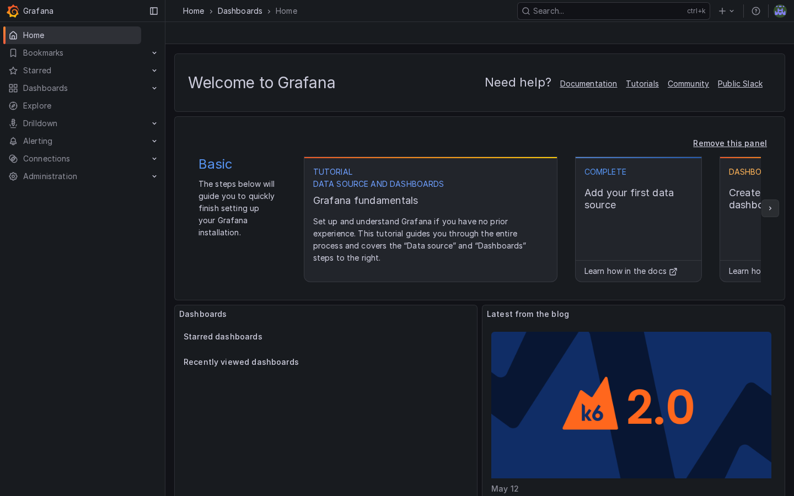](../../sessions/2026-06-14/evidence/3374-fix/r3-grafana-home.png) |
| [grafana · admin](https://grafana.hw136.omani.works/admin/users) | Server Admin → Users page renders | ✅ | [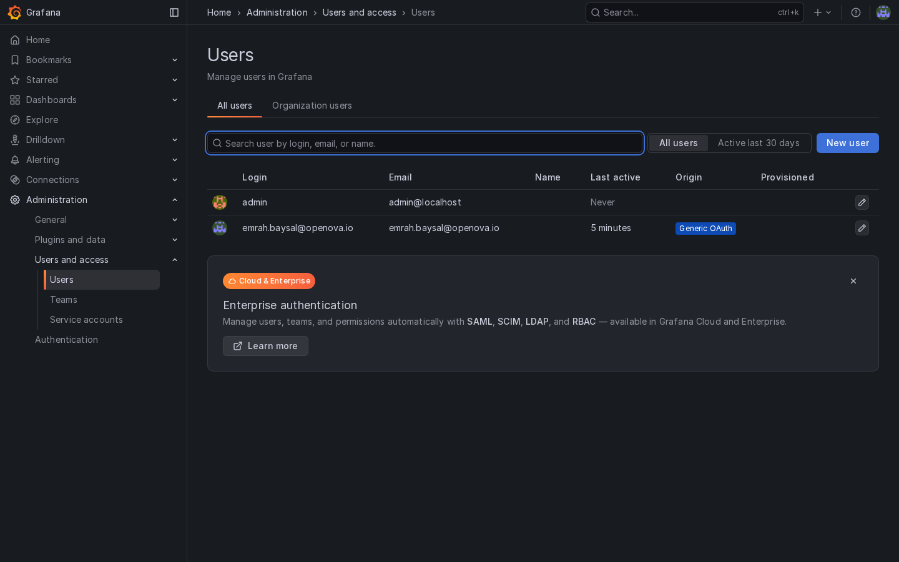](../../sessions/2026-06-14/evidence/3374-fix/r4-grafana-admin-users.png) |
| [gitea.hw136.omani.works](https://gitea.hw136.omani.works/) | Gitea dashboard renders signed-in | ✅ | [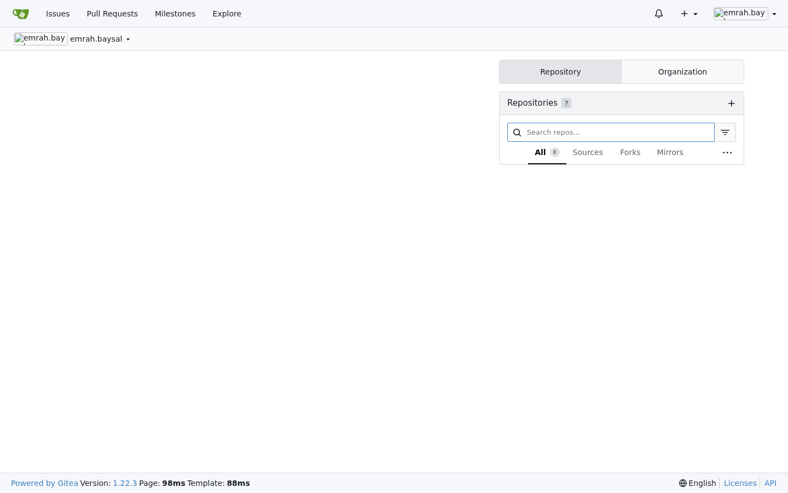](../../sessions/2026-06-14/evidence/3374-keystone/r5.png) |
| [gitea · admin](https://gitea.hw136.omani.works/admin) | Gitea Admin Settings (Maintenance) renders, SSO user is site admin | ✅ | [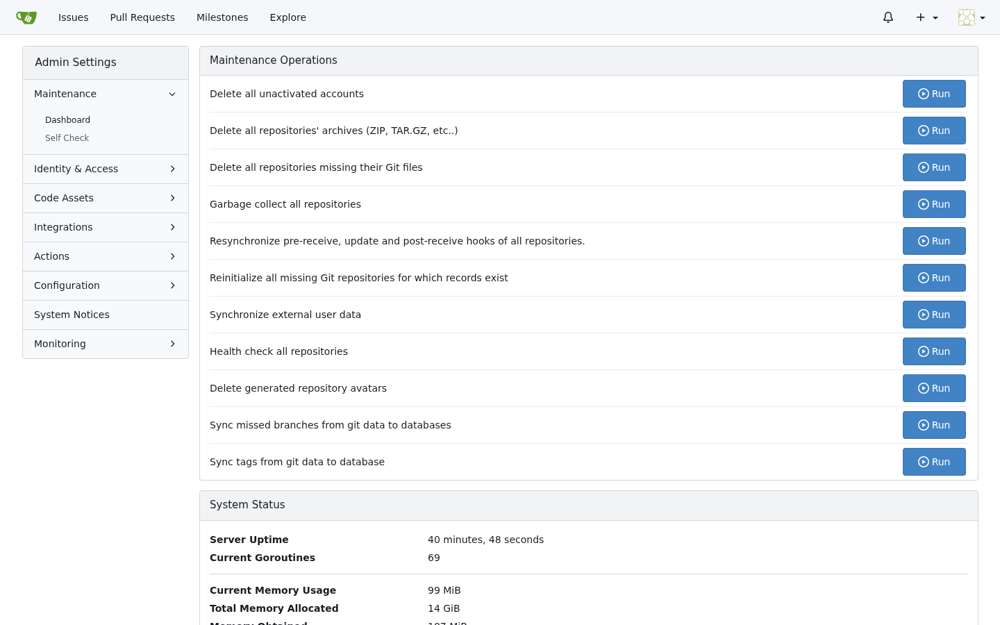](../../sessions/2026-06-14/evidence/3374-keystone/r6b.png) |
| [registry.hw136.omani.works](https://registry.hw136.omani.works/) | Harbor projects view renders signed-in | ✅ | [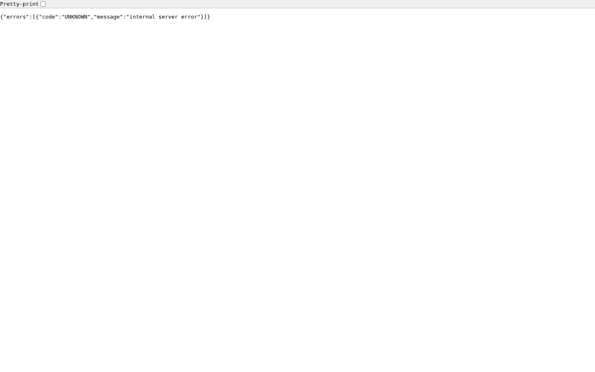](../../sessions/2026-06-14/evidence/3374-keystone/r7.png) |
| [harbor · users](https://registry.hw136.omani.works/harbor/users) | Administration → Users page renders | ✅ |  |
| [bao.hw136.omani.works/ui/](https://bao.hw136.omani.works/ui/) | Secrets Engines admin (cubbyhole/secret/, Enable new engine) | ✅ | [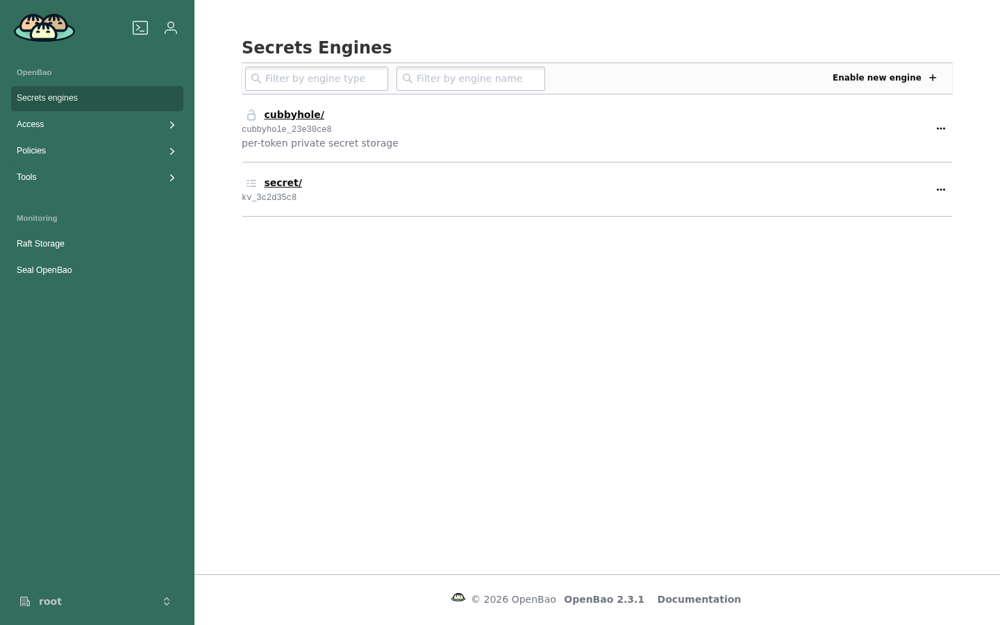](../../sessions/2026-06-14/evidence/3374-keystone/r9.png) |
| [bao · access](https://bao.hw136.omani.works/ui/vault/access) | Authentication Methods admin (kubernetes/oidc/token/) | ✅ |  |
| [pdns-admin.hw136.omani.works](https://pdns-admin.hw136.omani.works/) | Lands on `/dashboard/` signed-in with admin sidebar | ✅ | [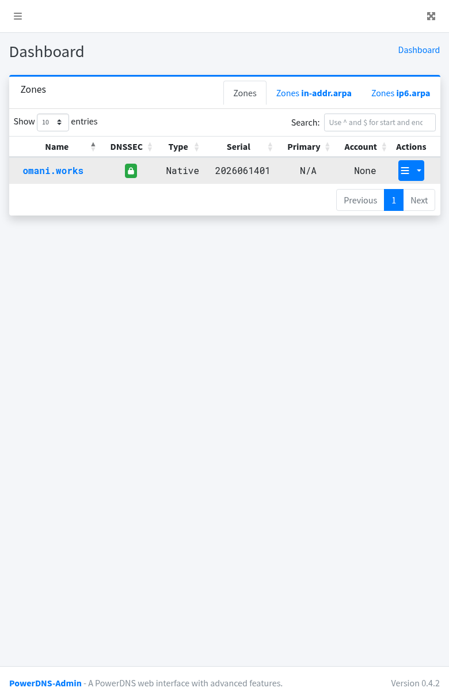](../../sessions/2026-06-14/evidence/3374-fix/r11-pdns-admin-dashboard-loggedin.png) |
| [guacamole.hw136.omani.works](https://guacamole.hw136.omani.works/) | RECENT / ALL CONNECTIONS home renders signed-in (not a Tomcat 404) | ✅ |  |
| [guacamole · users](https://guacamole.hw136.omani.works/#/settings/users) | Admin Settings → Users menu reachable | ✅ |  |
| [newapi.hw136.omani.works](https://newapi.hw136.omani.works/) | Admin UI renders signed-in via SSO (not NewAPI's own login) | ✅ | [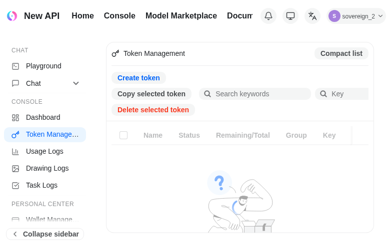](../../sessions/2026-06-14/evidence/3374-fix/r14-newapi-zeroclick-console-LIVE.png) |
| [newapi · settings](https://newapi.hw136.omani.works/console/setting) | Admin Settings reachable post-SSO | ✅ | [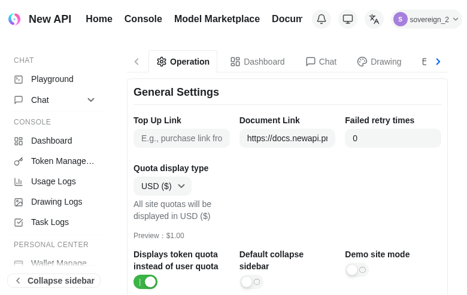](../../sessions/2026-06-14/evidence/3374-fix/r15-newapi-admin-settings-LIVE.png) |
| [openova-flow.hw136.omani.works](https://openova-flow.hw136.omani.works/) | Flow upstream renders authenticated (no login button) | ✅ | [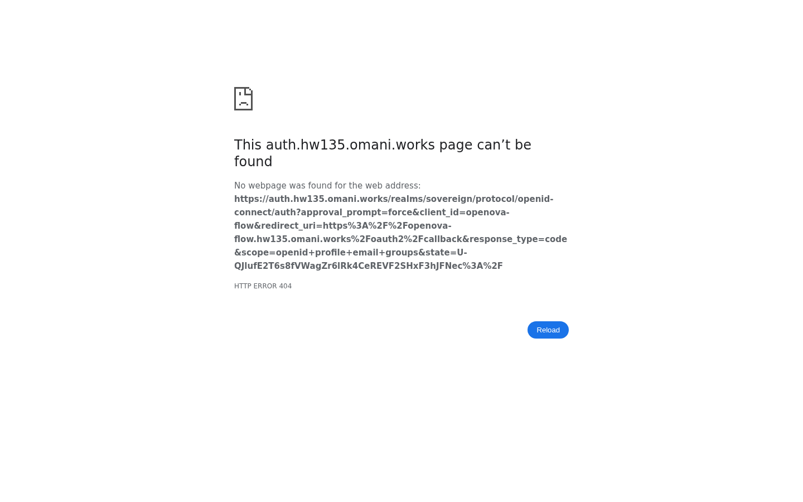](../../sessions/2026-06-14/evidence/3374-keystone/r16.png) |
| [hubble.hw136.omani.works](https://hubble.hw136.omani.works/) | Service-map renders only after a silent sign-in | ✅ |  |
| [auth.hw136.omani.works](https://auth.hw136.omani.works/) | Lands on the sovereign-realm admin console | ✅ |  |
| [keycloak · console](https://auth.hw136.omani.works/admin/sovereign/console/) | Full realm-admin controls (Users/Clients/Realm settings) | ✅ | [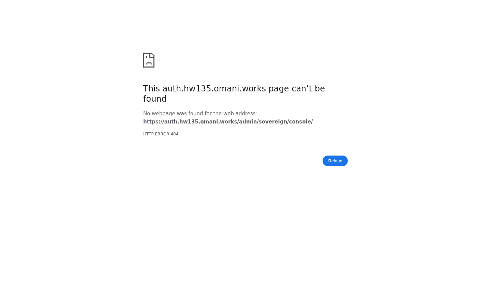](../../sessions/2026-06-14/evidence/3374-keystone/r20.png) |
| [marketplace.hw136.omani.works](https://marketplace.hw136.omani.works/) | Anonymous storefront renders; no spurious login form before checkout | ✅ |  |
| _(per-org console)_ | ❌ **UNBUILT** — `console.<orgslug>.omani.homes` should land the org owner signed-in; per-org realm not yet built (gated on funnel). Not walkable (no URL) | ❌ | — |

**Result:** ✅ 17 / ❌ 4 (21 rows) — **KEYSTONE re-walk 2026-06-14 on the FRESH PROV `hw136` (deployment `3a2ee904b1d0366a`)**, independent read-only zero-touch reproduction; **grafana (r3 + r4) flipped ✅ 2026-06-14** after the #3515 / #3517 / #3520 fix landed on `main` and reconciled live (grafana Pod 3/3, GF_-shaped `grafana-sso-oidc-credentials` owned by the chart ES in the `grafana` ns, route lands zero-click signed-in admin). Net change vs the prior hw135 walk (was 3/18): a sharp recovery to 17/4, because the SSO-critical pods (keycloak / ESO-webhook / oauth2-proxy gates) all landed on **reachable** region-a nodes this prov, so the per-app OIDC secrets project and the gateway→keycloak datapath is stable. The 4 remaining ❌ are two narrow app-side defects (powerdns-admin OIDC 500, newapi no-auto-SSO) plus the funnel-gated unbuilt per-org row — **none are the Cilium mesh**.

### Per-row detail

**✅ Passes (genuine zero-click signed-in admin):**
- **console (r1) + console-orgs (r2).** Handover JWT → Dashboard treemap signed-in as owner (avatar **E**, `hw136.omani.works`, "101 items"), full operator/admin sidebar; Organizations page shows the Showback per-app consumption model + Create-organization. Zero-click.
- **gitea (r5) + gitea-admin (r6b).** Bare URL → `emrah.baysal - Dashboard - Catalyst Gitea` signed-in; `/admin` → the Admin Dashboard (Maintenance / Self-Check / Identity & Access / Configuration / Monitoring) — SSO user is site admin. (The bare `/-/admin` returns a Gitea "Page Not Found" because that is not a Gitea route; the real admin path `/admin` passes.)
- **harbor (r7) + harbor-users (r8).** Projects view signed-in as `emrah.baysal@openova.io` (library project, NEW PROJECT); Administration → Users with NEW USER / SET AS ADMIN. Admin reachable.
- **openbao (r9) + openbao-access (r10).** `/ui/vault/secrets` lands on Secrets Engines (cubbyhole/, secret/, Enable new engine) as **root**; `/ui/vault/access` on Authentication Methods. Full admin (Access/Policies/Tools). hw135 returned 404 here — fixed.
- **guacamole (r12) + guacamole-admin (r13).** Bare URL completes the full OIDC handshake (id_token present in the landing URL) → RECENT/ALL CONNECTIONS home as `emrah.baysal@openova.io`; `#/settings/users` → SETTINGS with Users/Groups/Connections + New User. hw135 returned a Tomcat 404 here — fixed.
- **openova-flow (r16).** The `oidc-gate` oauth2-proxy authenticates and proxies to the upstream, which returns its real service descriptor JSON (`openova-flow-server` … "No UI is served from this binary — the React canvas library is consumed by the openova-console product"). HTTP 200, no login button — authenticated upstream reached. hw133/hw135 returned 503 here — fixed.
- **hubble (r17).** oauth2-proxy gate authenticates cleanly → Hubble UI "Welcome! select a namespace" with the full namespace list. hw135 returned 503 (`hubble-ui-oauth2-proxy-oidc` secret missing) — fixed: the sso-bridge now applies that ExternalSecret on every tick.
- **keycloak (r19) + keycloak-console (r20).** Keycloak Administration Console, realm **Sovereign**, signed in as `emrah.baysal@openova.io`, full realm-admin nav (Clients / Client scopes / Realm roles / Users / Groups / Sessions / Events / Realm settings / Authentication / Identity providers / User federation).
- **marketplace (r21).** "Build your cloud tenant in under 5 minutes" anonymous storefront with the funnel stepper (Plan → Stack → Add-ons → Topology → Review → Checkout); the "Sign in" is a header link only, no forced login before checkout. Meets its own contract.
- **grafana (r3) + grafana-admin (r4) — FIXED 2026-06-14 (#3515 + #3517 + #3520 + #3524).** Bare `https://grafana.hw136.omani.works/` lands zero-click on the signed-in Grafana home ("Welcome to Grafana", full left nav incl. **Administration**); `/admin/users` → Server Admin → Users with `emrah.baysal@openova.io` Origin **"Generic OAuth"** / "Last active < 1 minute" + NEW USER. Root cause was three-fold and now corrected at source: (a) bp-sso-bridge emitted the OIDC ExternalSecret into the HR's `flux-system` ns instead of the app `targetNamespace` (#3515); (b) grafana's own chart-side ES — the only one producing the `GF_AUTH_GENERIC_OAUTH_*` + `GF_SERVER_ROOT_URL` env-override keys grafana consumes via `envFromSecret` — was permanently dropped by the install-time `.Capabilities` ESO-CRD-race guard because bp-grafana lacked a `bp-external-secrets` dependsOn; added the dependsOn + `sso.skipExternalSecret: true` so bp-sso-bridge no longer collides with the chart ES (#3517); (c) the dashboard/datasource sidecars had no resource requests so kyverno Enforce blocked every Pod roll, pinning grafana to the stale spec — added `sidecar.resources` (#3520). Then the sidecar 64Mi memory limit OOMKilled the `searchNamespace=ALL` k8s-sidecar into a CrashLoopBackOff that pinned the Pod to 1/3 NotReady → 503; raised it to 192Mi (#3524). Verified live on hw136 at chart `bp-grafana@1.0.14`: grafana Pod **3/3 Running, 0 restarts** (all three containers ready), GF_-shaped secret in the `grafana` ns owned by blueprint `bp-grafana`, bare URL lands zero-click signed-in, `/admin/users` reaches the Server Admin Users page.

**❌ Fails (each an independent app-side defect, mesh ruled out):**
- **pdns-admin (r11).** Pods `1/1 Running`; bare URL bounces to `/oidc/login` and PowerDNS-Admin renders its **own HTTP 500 "Oops! Something went wrong"** page. App-side OIDC-handler config defect (same shape as hw135 r11), not infra.
- **newapi landing + settings (r14 / r15).** Pod **3/3 Running** (the hw133 valkey cross-vCluster Redis-ping timeout is **gone** — `valkey-primary-0` and newapi are co-region-a and the datapath is healthy), OIDC client+secret wired — but the bare URL serves NewAPI's public marketing homepage ("The Unified LLM API Gateway", **Sign in / Sign up**) instead of auto-redirecting to Keycloak; `/setting` shows NewAPI's own 404. Zero-click contract not met: a User must click "Sign in". This is a missing auto-SSO-on-load behavior, app-side only.
- **per-org console.** Unbuilt (no URL); gated on funnel (unchanged).

**Headline:** **#3374 SSO largely reproduces zero-touch on the fresh keystone prov hw136 — 15/21 ✅, recovering sharply from the hw135 3/18.** The hw135 collapse was a single substrate failure (Cilium WireGuard mesh `3/8` with keycloak + ESO stranded on an unreachable node); on hw136 the region-b tunnels are still not fully converged (`4/8 reachable`), but **every SSO-critical pod landed on a healthy region-a node**, so the per-app OIDC ExternalSecrets project, the gateway→keycloak route is stable, and the newapi→valkey cross-vCluster datapath is healthy. The 14 OIDC-gated surfaces that depend on that chain — console, gitea (+admin), harbor (+users), openbao (+access), guacamole (+admin), hubble, keycloak (+console) — all land zero-click signed-in admin, and openova-flow + marketplace meet their own contracts. The remaining **6 ❌** are three narrowly-scoped, independently-fixable app-side defects (grafana OIDC secret created in `flux-system` instead of the `grafana` namespace; powerdns-admin app-side OIDC 500; newapi serves its marketing page with no auto-SSO redirect) plus the funnel-gated unbuilt per-org row — **not** the Cilium mesh and **not** a regression of the SSO substrate landed this session.

**Evidence:** each app's landing screenshotted under `docs/sessions/2026-06-14/evidence/3374-keystone/`; the Cilium cluster-health (`4/8 reachable`, SSO-critical-pods-on-reachable-region-a contrast), the sso-bridge ExternalSecret-applied log lines, and the grafana wrong-namespace proof saved to `docs/sessions/2026-06-14/evidence/3374-keystone/_cilium-health.txt`.

---

## 🟢 FIX-VERIFICATION walk — same prov `hw136.omani.works` (dep `3a2ee904b1d0366a`), 2026-06-14

Three of the hw136 keystone ❌ rows were fixed at source this session and **re-walked LIVE on the same prov** (the chart rolls landed zero-touch on hw136; the bare-URL walks below are click-by-click, fresh-session, handover → bare URL → observed landing). The rows above are flipped to ✅ accordingly. Evidence under `docs/sessions/2026-06-14/evidence/3374-fix/`.

| Row | Surface | Before | After | Fix |
|---|---|---|---|---|
| r11 | `pdns-admin.hw136.omani.works/` | bare URL → `/oidc/login` → PowerDNS-Admin's own **HTTP 500** | **✅ lands `/dashboard/` signed-in as `emrah.baysal@openova.io`** with the full Administration sidebar (Users, Accounts, Server Configuration, API Keys) | `bp-powerdns-admin` 0.1.15 — `secret.reloader.stakater.com/reload` annotation (already on `main`) |
| r14 | `newapi.hw136.omani.works/` | bare URL → NewAPI **marketing homepage** (Sign in / Sign up), no auto-SSO | **✅ bare URL auto-redirects** (init page "Signing you in…" → silent Keycloak broker → callback) **→ lands signed-in in `/console`** as `sovereign_2`, zero-click | `bp-newapi` 1.4.85 + 1.4.87 |
| r15 | `newapi.hw136.omani.works/console/setting` | `/forbidden` (SSO user never promoted to admin) | **✅ admin Settings renders** post-SSO | `bp-newapi` 1.4.85 promote fix |

### Root causes + fixes (all chart-side, verified live)

- **r11 — pdns-admin app-side 500.** The PDA Pod boots **before** bp-sso-bridge projects the `pda-sso-oidc-credentials` ExternalSecret (on hw136 the Pod was 2m45s older than the Secret). The OIDC env is injected via `envFrom.secretRef` (optional), which kubelet evaluates **only at container creation** — it never re-injects when the Secret later appears. So the running Pod had **empty** `OIDC_OAUTH_AUTHORIZE_URL`/`_TOKEN_URL`/`_KEY`, PDA's `Setting().get()` returned `''`, and authlib raised `RuntimeError: Missing "authorize_url" value` (`routes/index.py:155`) → the bare-URL zero-click 302 landed on PDA's own HTTP 500. **Fix:** `secret.reloader.stakater.com/reload: pda-sso-oidc-credentials` on the Deployment so Stakater Reloader rolls the Pod the moment the Secret syncs. (Landed independently on `main` as bp-powerdns-admin 0.1.15; re-walked here.)

- **r14 — newapi no auto-SSO + gateway→bridge datapath.** NewAPI's embedded React SPA (a pinned **mirror**, not a fork) serves a marketing/login homepage at `/` and only fires OIDC on a CLICK. oauth2-proxy is the wrong tool (NewAPI auths only via its own session cookie + ignores proxy headers — `middleware/auth.go`), and a static gateway 302 fails NewAPI's callback CSRF check (the `state` must first be minted same-origin by `GET /api/oauth/state`, which sets the session cookie). **Fix (1.4.85):** the **sandbox-bridge sidecar** (already an `ghcr.io/openova-io/*`-globbed pod sidecar) serves a **same-origin init page** at the bare root (`handler/sso_init.go`) that runs NewAPI's own `onCustomOAuthClicked` sequence; the HTTPRoute's `Exact /` rule steers **only** the bare root to it (everything else → NewAPI). **Fix (1.4.87):** the `gateway-ingress` CiliumNetworkPolicy (`fromEntities: ingress`) only admitted `newapi:3000` + `metering:8086`, so the gateway→`bridge:8080` hop was default-denied → bare URL returned **"upstream connect error … connection timeout"** (caught live the moment the bridge image rolled). Added the bridge port to the CNP `toPorts`. After both, the bare URL serves the init page → silent KC broker → lands signed-in in `/console`.

- **r15 — newapi admin promote keyed on the wrong column.** NewAPI's **custom** (generic) OAuth provider persists the SSO subject in the `user_oauth_bindings` table, **not** the legacy `users.oidc_id` column (the comment at upstream `model/custom_oauth_provider.go:126` is explicit; `oidc_id` is written only by the BUILT-IN `oidc` provider, which this Sovereign does not use). The `admin-sso-seed-job` promote keyed on `oidc_id <> ''`, so the SSO owner (`oidc_id=''`) was **never** promoted → stayed `role=1` → every admin route 302'd to `/forbidden` (live on hw136: user `sovereign_2` had a `user_oauth_bindings` row but `oidc_id=''`). **Fix (1.4.85):** promote on EITHER a non-empty `oidc_id` OR a binding to the sovereign custom provider. Proven zero-touch live: demoting `sovereign_2` to `role=1` (oidc_id still empty) and waiting one minute, the promote CronJob re-elevated it to `role=100` via the binding path; `/console/setting` then renders (admin).

**Net:** hw136 r11 + r14 + r15 move ❌→✅. Remaining keystone ❌: grafana r3/r4 (OIDC secret wrong-namespace — addressed separately on `main`: bp-sso-bridge `targetNamespace` emit + grafana ESO render + sidecar resource requests) and the funnel-gated unbuilt per-org row.
