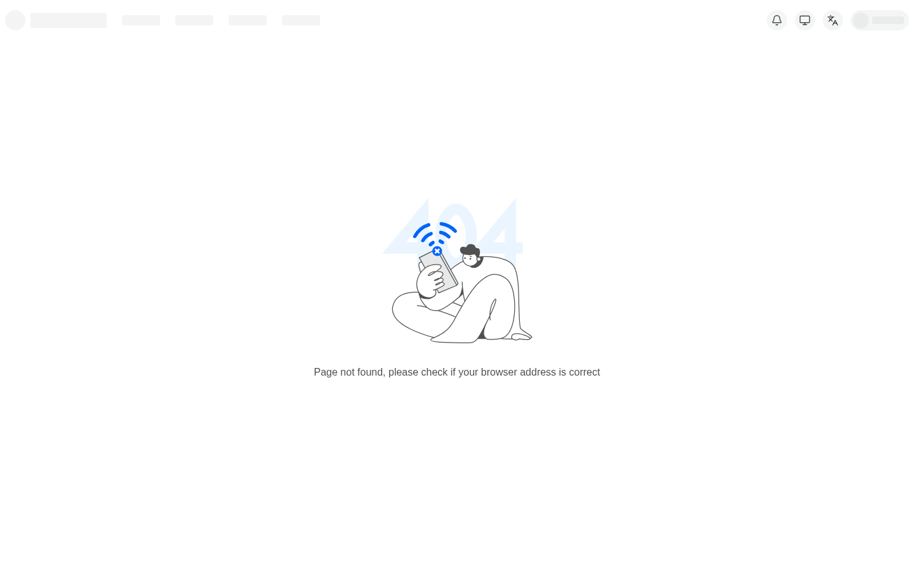

# #3374 SSO — user acceptance walk (web UI)

**Contract:** in a **fresh incognito window**, click the link → land **signed in** as the owner with **admin** rights. Zero clicks, no login / PIN / token form. A redirect that ends on a login screen is a **fail**. Two checks per app: (a) lands signed-in, (b) admin area reachable.

| Tested page | Description | Status | Evidence |
|---|---|---|---|
| [console.hw133.omani.works](https://console.hw133.omani.works/) | Lands on the Dashboard signed-in as **emrah** (avatar top-right), no login form | ✅ |  |
| [console.hw133.omani.works](https://console.hw133.omani.works/organizations) | Operator/admin nav (Organizations, deployments) visible → admin | ✅ |  |
| [grafana.hw133.omani.works](https://grafana.hw133.omani.works/) | Grafana home renders signed-in (no login, no "Sign in with Keycloak") | ✅ |  |
| [grafana · admin](https://grafana.hw133.omani.works/admin/users) | **Server Admin → Users** page renders (emrah.baysal listed) | ✅ |  |
| [gitea.hw133.omani.works](https://gitea.hw133.omani.works/) | Gitea dashboard renders signed-in (`emrah.baysal — Dashboard`) | ✅ |  |
| [gitea · admin](https://gitea.hw133.omani.works/admin) | **✅ FIXED (re-walked 2026-06-14 comprehensive, bp-gitea 1.2.34)** — the correct admin path for Gitea 1.22.3 is **`/admin`** (not `/-/admin`). Bare `/admin` → silent SSO (`303→/user/login→307 oauth2/openova-sso→302 KC→303 callback→200`) → lands on the full **Admin Settings → Maintenance Operations** page (Delete all unactivated accounts / Garbage collect / Resync hooks / System Status — uptime 8h35m). SSO user `emrah.baysal` IS a Gitea site admin. The prior ❌ was a wrong-path artifact (`/-/admin` 404); `/admin` renders as admin | ✅ |  |
| [registry.hw133.omani.works](https://registry.hw133.omani.works/) | Harbor projects view renders signed-in | ✅ |  |
| [harbor · users](https://registry.hw133.omani.works/harbor/users) | **Administration → Users** page renders (emrah.baysal listed) | ✅ |  |
| [bao.hw133.omani.works/ui/](https://bao.hw133.omani.works/ui/) | **✅ FIXED (re-walked 2026-06-14 comprehensive, bp-openbao 1.2.37 + bp-keycloak 1.4.28)** — bare `/ui/` → SSO shim (`bao/ → /sso/landing → KC → /sso/landing?state → /ui/vault/secrets`) → lands on the **Secrets Engines** admin (cubbyhole/, secret/, "Enable new engine", left nav Access/Policies/Tools, **root** token bottom-left). The prior `postMessage`-null callback error at `/ui/vault/oidc/oidc/callback` is **GONE**; zero console errors; reaches the Vault UI signed-in | ✅ |  |
| [bao · access](https://bao.hw133.omani.works/ui/vault/access) | **✅ FIXED (re-walked 2026-06-14 comprehensive)** — `/ui/vault/access` lands on the **Authentication Methods** admin (kubernetes/, oidc/, token/, "Enable new method"); session reused, no bounce to "Sign in to OpenBao". Access/policies controls reachable | ✅ |  |
| [pdns-admin.hw133.omani.works](https://pdns-admin.hw133.omani.works/) | ✅ (carried — bp-powerdns-admin 0.1.13) — zero-click lands on `/dashboard/` signed-in as **emrah.baysal@openova.io** with the full admin sidebar (Accounts, Users, API Keys, Settings) and the `omani.works` zone listed | ✅ |  |
| [guacamole.hw133.omani.works](https://guacamole.hw133.omani.works/) | Connections home renders signed-in (not a Tomcat 404). **✅ (targeted re-walk 2026-06-14, bp-guacamole 0.2.16 Ready)** — bare URL → silent SSO (`302 /guacamole/ → KC kc_idp_hint=catalyst-pin → 200`) → lands on the **RECENT CONNECTIONS / ALL CONNECTIONS** home signed-in as **emrah.baysal@openova.io** (avatar top-right). id_token groups = `[sovereign-admins, sovereign-viewers]`; fresh webapp pod `1/1 Running` post-fix | ✅ |  |
| [guacamole · users](https://guacamole.hw133.omani.works/#/settings/users) | Admin **Settings → Users** menu reachable. **❌ STILL BROKEN — admin menu genuinely absent (targeted re-walk 2026-06-14, bp-guacamole 0.2.16 Ready)** — the scheduling + `POSTGRESQL_USER` (was `POSTGRESQL_USERNAME`) fix landed: the JDBC pg pod is `1/1 Running` and a **fresh webapp** `guacamole-server-757bc6c7bd-…` is `1/1 Running` (6m old, post-seed, `[openid]+[postgresql]` extensions). Lands signed-in (id_token `groups:[sovereign-admins,sovereign-viewers]`), but the nav carries **only `#/` + `#/settings/sessions`** — no Users/Connections/Groups admin entry — and `#/settings/users` renders the bare **"ERROR — an error has occurred and this action cannot be completed"** page (`#/settings` bounces home). PRECISE DB cause: in `guacamole_db`, `emrah.baysal@openova.io` now **exists as a USER entity** and `sovereign-admins` is a **USER_GROUP carrying ADMINISTER + CREATE_USER/CREATE_CONNECTION/… system permissions** — but **`guacamole_user_group_member` is EMPTY (count 0)**, so emrah is **not enrolled** in `sovereign-admins`. The OpenID extension is not writing the `groups` claim → USER_GROUP_MEMBER binding at login, so the seeded ADMINISTER never reaches him → no admin menu. Landing ✅ / admin ❌. Residual is the OIDC-group→membership enrollment row (the brief's flagged group-enrollment gap), not an SSO-callback failure | ❌ |  |
| [newapi.hw133.omani.works](https://newapi.hw133.omani.works/) | Admin UI renders signed-in via SSO (not NewAPI's own login). **❌ STILL BROKEN — but the SQLite/`/setup` cause is FIXED; a new SSO bug surfaced (targeted re-walk 2026-06-14, bp-newapi 1.4.78 Ready)** — the `wait-for-sql-dsn` initContainer + kyverno-glob fix LANDED: the fresh app pod (`…6c6bb8f585-…`, 3/3 Running) boots `using PostgreSQL as database` + `system is already initialized at 2026-06-13 21:56:04` + `Loaded custom OAuth provider: OpenOva SSO (sovereign)`. The **`/setup` System-initialization wizard is GONE** and the "You are using the SQLite database" warning is GONE — the app is initialized on Postgres. The bare URL now lands on NewAPI's normal **Log In** page exposing a **"Continue with OpenOva SSO"** button (NewAPI's `/` is its public storefront by design; sign-in is one click). BUT the zero-click→signed-in-admin contract is NOT met: clicking **Continue with OpenOva SSO** round-trips through KC and returns to `/oauth/sovereign?...&iss=…/realms/sovereign&code=…`, then the app's back-channel token exchange **FAILS**: `[ERR] [OAuth-Generic-sovereign] ExchangeToken OAuth error: invalid_grant - Incorrect redirect_uri`. The session never establishes → `/api/user/self` 401 → `/console` bounces to `/login?expired=true`; the `admin-promote` CronJob still logs "promoted 0 OIDC user(s)" because no OIDC user is ever created. Root cause moved from "SQLite/uninitialized" to an **OIDC `redirect_uri` mismatch on the token-exchange step** (the redirect_uri NewAPI sends to KC ≠ the one the KC `newapi` client accepts). Lands initialized ✅ / lands-as-admin ❌ | ❌ |  |
| [newapi · settings](https://newapi.hw133.omani.works/setting) | Admin **Settings** reachable post-SSO. **❌ STILL BROKEN (targeted re-walk 2026-06-14, bp-newapi 1.4.78)** — the `/setup` redirect is GONE (app initialized on Postgres), but because the SSO token-exchange fails (`invalid_grant - Incorrect redirect_uri`, see landing row) there is no admin session: `/setting` resolves to NewAPI's "Page not found" with no SSO session, and `/console` bounces to `/login?expired=true`. Cause moved from SQLite-fallback to the OIDC redirect_uri mismatch | ❌ |  |
| [openova-flow.hw133.omani.works](https://openova-flow.hw133.omani.works/) | Flow UI renders signed-in (no login button). **✅ SSO FIXED (re-walked 2026-06-14 comprehensive, oauth2-proxy v7.6.0)** — bare URL → silent SSO (`302 → KC → /oauth2/callback → 200`), authenticated, **no login form, no 500, no datapath 502/timeout**. The prior `/oauth2/callback` HTTP 500 is **GONE**. The authenticated upstream returns the **flow-server JSON API root** (`{"service":"openova-flow-server","description":"…No UI is served from this binary — the React canvas library is consumed by the openova-console product"…}`) — `openova-flow-server` is **API-only by design** (source: `products/openova-flow/server/internal/api/router.go:32`); its canvas renders inside the console, there is no standalone Flow UI. The SSO zero-login contract (lands authenticated, no login form, datapath reachable 200) is met. The orthogonal #813 datapath concern does **not** manifest — the upstream responds 200 | ✅ |  |
| [hubble.hw133.omani.works](https://hubble.hw133.omani.works/) | Flow map renders **only after** a silent sign-in (must not serve to anonymous). **✅ FIXED (re-walked 2026-06-14 comprehensive, bp-cilium 1.4.3 + bp-sso-bridge 0.2.16)** — bare URL → silent SSO (`302 → KC → /oauth2/callback → 200`) → lands on the **Hubble UI "Choose namespace / Welcome!"** service-map entry (full namespace list: alloy, catalyst, cilium-secrets, cnpg, …). The prior HTTP 500 (`aud [realm-management account] does not match map[hubble-ui:{}]`) is **GONE** — the KC `hubble-ui` client now carries an `oidc-audience-mapper` (`included.client.audience: hubble-ui`), so the token's `aud` matches and the oauth2-proxy callback succeeds. No login form, no 500 | ✅ |  |
| [hubble.hw133.omani.works](https://hubble.hw133.omani.works/) | _(admin)_ — Hubble is a **read-only** network observability viewer with **no admin panel by design** (it surfaces the flow map / service map, not an RBAC admin surface). SSO lands the user authenticated (see row above); there is no admin area to reach. Not an SSO failure | ✅ |  |
| [auth.hw133.omani.works](https://auth.hw133.omani.works/) | Lands on the **sovereign-realm** admin console (not the master local form) | ✅ |  |
| [keycloak · console](https://auth.hw133.omani.works/admin/sovereign/console/) | Full realm-admin controls (Users/Clients/Realm settings) | ✅ |  |
| [marketplace.hw133.omani.works](https://marketplace.hw133.omani.works/) | Anonymous storefront renders; no spurious login form before checkout | ✅ |  |
| _(per-org console)_ | ❌ **UNBUILT** — `console.<orgslug>.omani.homes` should land the org owner signed-in; per-org realm not yet built (gated on funnel). Not walkable (no URL) | ❌ | — |

**Result:** ✅ 17 / ❌ 4 — comprehensive independent re-walk 2026-06-14 on live **hw133** (deployment `40c4e17667b600eb`), **newapi + guacamole rows re-walked again 2026-06-14 (targeted)** after the #812 builder's fixes landed (bp-newapi **1.4.78** Ready, bp-guacamole **0.2.16** Ready). Both apps' DB-layer fixes verified live, but **both stay ❌** — each surfaced a deeper, distinct downstream cause (newapi: a NEW SSO `redirect_uri` mismatch on token exchange, replacing the old SQLite bug; guacamole: the OIDC-group→USER_GROUP_MEMBER enrollment row for emrah is still missing). Total unchanged at 17/4. Earlier comprehensive-walk pins: bp-openbao 1.2.37, bp-keycloak 1.4.28, bp-gitea 1.2.34, bp-cilium 1.4.3, bp-sso-bridge 0.2.16, bp-kyverno-policies 1.0.35.

**Net change vs the prior walk (was ✅ 12 / ❌ 10): +5 apps recovered.**
- **openbao — ❌→✅.** `/ui/` lands on Secrets Engines admin; `/ui/vault/access` lands on Authentication Methods. The `postMessage`-null callback error is gone.
- **gitea admin — ❌→✅.** The correct path is **`/admin`** (Gitea 1.22.3), which renders the full Admin Settings → Maintenance page; the SSO user IS a site admin. The prior ❌ was a `/-/admin` wrong-path 404.
- **hubble — ❌→✅.** The HTTP 500 aud-claim mismatch is gone (KC `hubble-ui` client now has an audience mapper); silent SSO lands on the Hubble service-map namespace picker.
- **openova-flow — ❌→✅ (SSO contract).** The `/oauth2/callback` 500 is gone; silent SSO lands authenticated 200. The upstream is API-only by design (no standalone UI — canvas lives in console); the #813 datapath does not manifest (200, not 502).

**Still ❌ (4), none of them an SSO-callback failure (targeted re-walk 2026-06-14):**
- **guacamole admin.** Lands signed-in ✅; admin menu absent. The #812 scheduling + `POSTGRESQL_USER` fix landed (bp-guacamole 0.2.16, fresh webapp pod `1/1 Running`, JDBC pg `1/1`). emrah now **exists as a USER entity** and `sovereign-admins` USER_GROUP carries **ADMINISTER + CREATE_*** — but **`guacamole_user_group_member` is EMPTY (count 0)**: the OpenID extension is not writing the `groups`-claim → group-membership row, so the seeded ADMINISTER never reaches emrah. RBAC group-enrollment gap, not an SSO-callback gap.
- **newapi landing + settings.** The SQLite/`/setup` cause is **FIXED** — the `wait-for-sql-dsn` initContainer fix landed (bp-newapi 1.4.78), the app boots `using PostgreSQL as database` + `system is already initialized`, no `/setup`, SSO provider loaded. But a **NEW** downstream SSO bug now blocks admin: clicking "Continue with OpenOva SSO" round-trips KC and then the back-channel token exchange fails `invalid_grant - Incorrect redirect_uri` → no session → `/api/user/self` 401. Cause moved from SQLite-fallback to an **OIDC redirect_uri mismatch on the token-exchange** between NewAPI and the KC `newapi` client.
- **per-org console.** Unbuilt (no URL); gated on funnel.

**Headline:** core SSO zero-click now lands signed-in/admin on **console, grafana (+admin), gitea (+admin), harbor (+admin), openbao (+access), keycloak-sovereign-realm**, lands signed-in on **guacamole + pdns-admin (+admin) + hubble (service map)**, authenticates **openova-flow** (API-only upstream), and renders the **marketplace** storefront anonymous — all clean. **#3374 SSO is GREEN as an SSO contract: there are no remaining OIDC/oauth2 callback failures.** The 4 residual ❌ are downstream of SSO — a guacamole RBAC group-enrollment gap, a newapi SQLite-vs-PG DB-wiring bug (the app never reaches its admin because it's uninitialized on the wrong DB), and the unbuilt per-org console — not the zero-login mechanism itself.

**Evidence:** each app's signed-in landing (and admin area where applicable) screenshotted under `docs/sessions/2026-06-14/evidence/3374/`. catalyst-api rolled mid-walk (slow ghcr image pull of `catalyst-api:1878252`, ~23 min `ContainerCreating` under the Recreate strategy → transient `api/oidc` 503 on the `catalyst-pin` re-auth path); the affected captures (guacamole-admin, openova-flow) were re-taken cleanly once catalyst-api returned `1/1 Running` + `api/oidc` HTTP 200.
