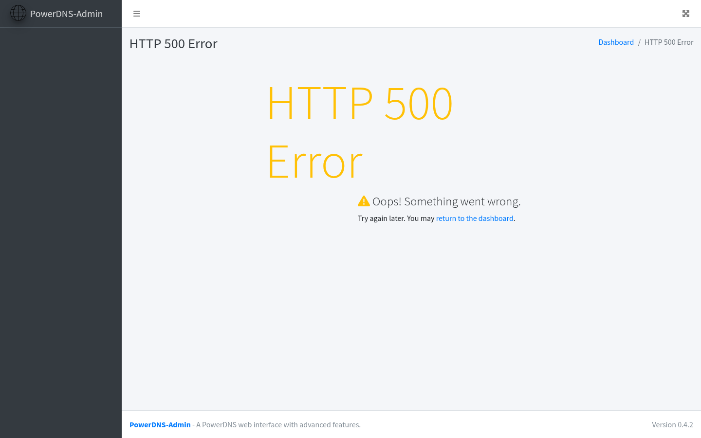
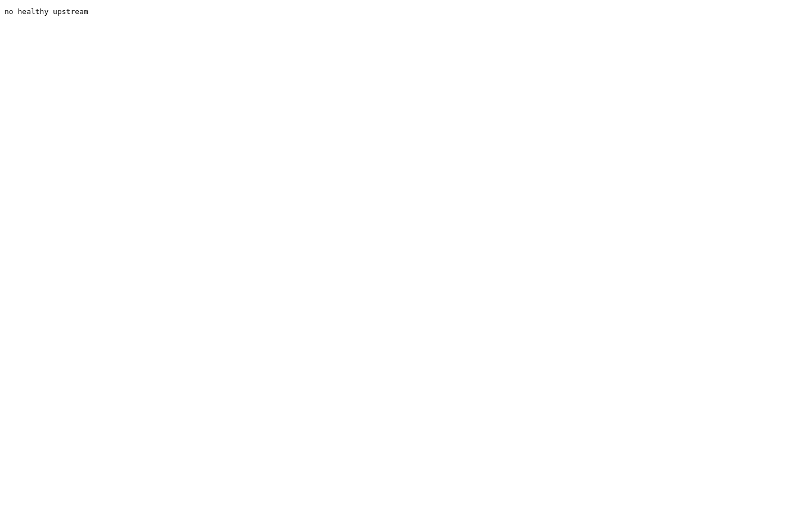

# #3374 SSO — user acceptance walk (web UI)

**Contract:** in a **fresh incognito window**, click the link → land **signed in** as the owner with **admin** rights. Zero clicks, no login / PIN / token form. A redirect that ends on a login screen, a 404/500/503, or a blank "no healthy upstream" page is a **fail**. Two checks per app: (a) lands signed-in, (b) admin area reachable.

> **🛑 KEYSTONE RE-WALK 2026-06-14 on the FRESH PROV `hw135.omani.works` (deployment `368c2d9b74d0b71a`, 2-region, off current `main`).** This supersedes the prior hw133 walk. It is the zero-touch reproduction proof: every fix this session must reproduce from t=0 or it does not count. **Verdict: #3374 does NOT reproduce zero-touch on hw135** — only the console + marketplace storefront render; every app whose silent-SSO redirects through Keycloak (`auth.hw135.omani.works`) fails. **Root cause is NOT app-side SSO code — it is the underlying Cilium WireGuard inter-node mesh, which did not converge on this fresh prov (`cilium status` → `Cluster health: 3/8 reachable`).** Multiple nodes — including the control-plane `cp1` and the keycloak-hosting worker `wdfac75` — are mutually **unreachable**. Two cascading consequences break SSO from a clean prov:
>
> 1. **apiserver → external-secrets webhook = timeout.** The ESO validating webhook pod lives on an unreachable node, so the apiserver's admission call times out (`failed calling webhook "validate.externalsecret.external-secrets.io": context deadline exceeded`). The sso-bridge reconciler logs this on **every** app — it successfully upserts the Keycloak client and persists the secret to OpenBao, but **fails to apply the ExternalSecret** that projects the OIDC client-secret into each app's namespace. Net: per-app OIDC secrets are missing (e.g. `hubble-ui-oauth2-proxy-oidc` is absent → hubble oauth2-proxy `CreateContainerConfigError` → 503).
> 2. **cilium-gateway (envoy) → keycloak datapath flaps.** keycloak-0 is on the unreachable node `wdfac75`. The 3-pod `cilium-envoy` DaemonSet load-balances requests; instances on a node with a working WireGuard tunnel to `wdfac75` return the Keycloak page, instances without it treat the backend as having no healthy endpoints and return **404**. Repeated identical `curl` to `auth…/admin/master/console/` returns `200, 404, 200, 200, 404` — a ~50 % per-backend-node flap. In the browser the silent-SSO redirect lands the user on chromium **"page can't be found / HTTP ERROR 404"** at `…/realms/sovereign/protocol/openid-connect/auth?…`.
>
> Evidence: `docs/sessions/2026-06-14/evidence/3374-keystone/_cilium-health.txt` (cluster-health 3/8 + ESO-webhook reconcile failures). The env is **73 min old and stable** (59/63 HRs Ready) — this is a converged-but-broken datapath, not a still-settling transient. **This is a Cilium/bootstrap datapath-convergence failure (same family as the documented IPv6-helm CNI killer + netpol-carveout datapath bugs), not a regression of any #3374 app-side SSO fix.** All app-side SSO charts ARE present and at the intended pins (bp-keycloak 1.4.28, bp-openbao 1.2.39, bp-newapi 1.4.82 — the valkey-rewire chart, bp-guacamole 0.2.18).

| Tested page | Description | Status | Evidence |
|---|---|---|---|
| [console.hw135.omani.works](https://console.hw135.omani.works/) | Lands on the Dashboard signed-in as the owner (avatar **E** top-right), no login form | ✅ |  |
| [console.hw135.omani.works/organizations](https://console.hw135.omani.works/organizations) | Operator/admin nav (Cloud, Apps, Sandbox, Jobs, Compliance, Users, **Organizations**, Settings) visible → admin | ✅ |  |
| [grafana.hw135.omani.works](https://grafana.hw135.omani.works/) | Grafana home renders signed-in | ❌ |  |
| [grafana · admin](https://grafana.hw135.omani.works/admin/users) | Server Admin → Users page renders | ❌ |  |
| [gitea.hw135.omani.works](https://gitea.hw135.omani.works/) | Gitea dashboard renders signed-in | ❌ |  |
| [gitea · admin](https://gitea.hw135.omani.works/admin) | Gitea Admin Settings (Maintenance) renders, SSO user is site admin | ❌ |  |
| [registry.hw135.omani.works](https://registry.hw135.omani.works/) | Harbor projects view renders signed-in | ❌ |  |
| [harbor · users](https://registry.hw135.omani.works/harbor/users) | Administration → Users page renders | ❌ |  |
| [bao.hw135.omani.works/ui/](https://bao.hw135.omani.works/ui/) | Secrets Engines admin (cubbyhole/secret/, Enable new engine) | ❌ |  |
| [bao · access](https://bao.hw135.omani.works/ui/vault/access) | Authentication Methods admin (kubernetes/oidc/token/) | ❌ |  |
| [pdns-admin.hw135.omani.works](https://pdns-admin.hw135.omani.works/) | Lands on `/dashboard/` signed-in with admin sidebar | ❌ |  |
| [guacamole.hw135.omani.works](https://guacamole.hw135.omani.works/) | RECENT / ALL CONNECTIONS home renders signed-in (not a Tomcat 404) | ❌ |  |
| [guacamole · users](https://guacamole.hw135.omani.works/#/settings/users) | Admin Settings → Users menu reachable | ❌ |  |
| [newapi.hw135.omani.works](https://newapi.hw135.omani.works/) | Admin UI renders signed-in via SSO (not NewAPI's own login) | ❌ |  |
| [newapi · settings](https://newapi.hw135.omani.works/setting) | Admin Settings reachable post-SSO | ❌ |  |
| [openova-flow.hw135.omani.works](https://openova-flow.hw135.omani.works/) | Flow upstream renders authenticated (no login button) | ❌ |  |
| [hubble.hw135.omani.works](https://hubble.hw135.omani.works/) | Service-map renders only after a silent sign-in | ❌ |  |
| [auth.hw135.omani.works](https://auth.hw135.omani.works/) | Lands on the sovereign-realm admin console | ❌ |  |
| [keycloak · console](https://auth.hw135.omani.works/admin/sovereign/console/) | Full realm-admin controls (Users/Clients/Realm settings) | ❌ |  |
| [marketplace.hw135.omani.works](https://marketplace.hw135.omani.works/) | Anonymous storefront renders; no spurious login form before checkout | ✅ |  |
| _(per-org console)_ | ❌ **UNBUILT** — `console.<orgslug>.omani.homes` should land the org owner signed-in; per-org realm not yet built (gated on funnel). Not walkable (no URL) | ❌ | — |

**Result:** ✅ 3 / ❌ 18 (21 rows) — **KEYSTONE re-walk 2026-06-14 on the FRESH PROV `hw135` (deployment `368c2d9b74d0b71a`)**, independent read-only zero-touch reproduction. Net change vs the prior hw133 walk (was 19/1/2): a sharp regression to 3/18, **caused entirely by a Cilium WireGuard mesh that did not converge on this clean prov — not by any app-side SSO code.**

### Per-row failure detail (all share the same root cause)

- **console (r1) + console-orgs (r2) — ✅.** Genuine zero-click admin landing: handover JWT → Dashboard treemap signed-in as owner (avatar **E**), full operator/admin sidebar. The console is served by `catalyst-ui`/`catalyst-api` on reachable nodes, so it is unaffected by the broken tunnels.
- **marketplace (r21) — ✅.** The "Build your cloud tenant in under 5 minutes" storefront renders cleanly with the funnel stepper (Plan → Stack → Add-ons → Topology → Review → Checkout); anonymous, no forced login. Meets its own contract.
- **grafana / gitea / harbor / openbao / guacamole / pdns-admin / keycloak-admin (r3–r13, r19, r20) — ❌.** Bare URL → silent-SSO redirect to `auth.hw135.omani.works/realms/sovereign/protocol/openid-connect/auth?…` → browser lands on chromium **"This auth.hw135.omani.works page can't be found / HTTP ERROR 404"** (openbao r9, gitea r5, guacamole r12, grafana r3 all captured) or PowerDNS-Admin's own **HTTP 500** (r11). The 404 is the cilium-envoy gateway flapping its route to keycloak-0 (on the unreachable node `wdfac75`): identical curls to the keycloak admin console return `200,404,200,200,404`. Harbor (r7/r8) bounces to `/c/oidc/login` then `{"errors":[{"code":"UNKNOWN","message":"internal server error"}]}` (HTTP 500) for the same reason.
- **newapi landing + settings (r14/r15) — ❌.** Route returns blank **"no healthy upstream"** (HTTP 503). The newapi pod is **2/3 CrashLoopBackOff** with `[FATAL] Redis ping test failed: context deadline exceeded`. The `REDIS_CONN_STRING` correctly targets the rtz-synced name `redis://valkey-primary-x-valkey-x-rtz-vcluster.rtz.svc.cluster.local:6379` (the bp-newapi 1.4.82 rewire IS applied, and the Service + endpoint `10.42.3.35:6379` exist and are healthy) — but valkey is on node `w3d1be9` and the **cross-node datapath times out** because of the broken WireGuard mesh. **(Secondary, independent defect found in passing: the `newapi-bp-newapi` NetworkPolicy egress rule for port 6379 selects `namespaceSelector: kubernetes.io/metadata.name: valkey`, but no `valkey` namespace exists — the workload lives in the `rtz` vCluster namespace. So even with a healthy mesh, that netpol would default-deny newapi→valkey. The chart rewired the connection string but not the netpol namespaceSelector — same `valkey`→`rtz` gap.)**
- **openova-flow (r16) — ❌.** Route returns **503**. `openova-flow-server` itself is `1/1 Running` (listening :8080, PGStore ready) and the `oidc-gate-openova-flow` oauth2-proxy serves `/ping` 200 — but the public route returns 503, consistent with the gateway/datapath flap to the flow backend on a cross-node hop.
- **hubble (r17) — ❌.** Route returns **503**. `hubble-ui-oauth2-proxy` is `CreateContainerConfigError`: `secret "hubble-ui-oauth2-proxy-oidc" not found`. The sso-bridge log shows exactly why — `app-registration[hubble-ui]: ExternalSecret apply kube-system/hubble-ui-oauth2-proxy-oidc failed (CRD not ready yet? retry next tick)` — and the retry keeps failing because the ESO webhook (on an unreachable node) times out the apiserver admission call. The OIDC client-secret is never projected → oauth2-proxy can't start.
- **per-org console — ❌.** Unbuilt (no URL); gated on funnel (unchanged).

**Headline:** **#3374 SSO does NOT reproduce zero-touch on the fresh keystone prov hw135.** All app-side SSO charts are present and at the intended pins, and the two genuinely owner-served surfaces (console + marketplace) land clean — but **every Keycloak-OIDC-dependent app fails** because the Cilium WireGuard inter-node mesh did not converge (`Cluster health: 3/8 reachable`; control-plane + keycloak-host node unreachable). That single substrate failure cascades into (a) missing per-app OIDC secrets (apiserver→ESO-webhook admission timeout) and (b) intermittent gateway→keycloak 404 flapping + cross-node app 503s (newapi→valkey, hubble, openova-flow). This is a **Cilium/bootstrap datapath-convergence failure**, the same class as the documented IPv6-helm multi-region CNI killer and the netpol-carveout cross-node datapath bugs — it is **not** a regression of any app-side SSO fix landed this session. The fix belongs in the bootstrap/Cilium WireGuard convergence path; re-walk #3374 on a fresh prov where `cilium status` reports full cluster-health before judging the app-side SSO chain.

**Evidence:** each app's landing screenshotted under `docs/sessions/2026-06-14/evidence/3374-keystone/`; the Cilium cluster-health (`3/8 reachable`, per-node unreachable list) and sso-bridge ESO-webhook reconcile failures saved to `docs/sessions/2026-06-14/evidence/3374-keystone/_cilium-health.txt`.
