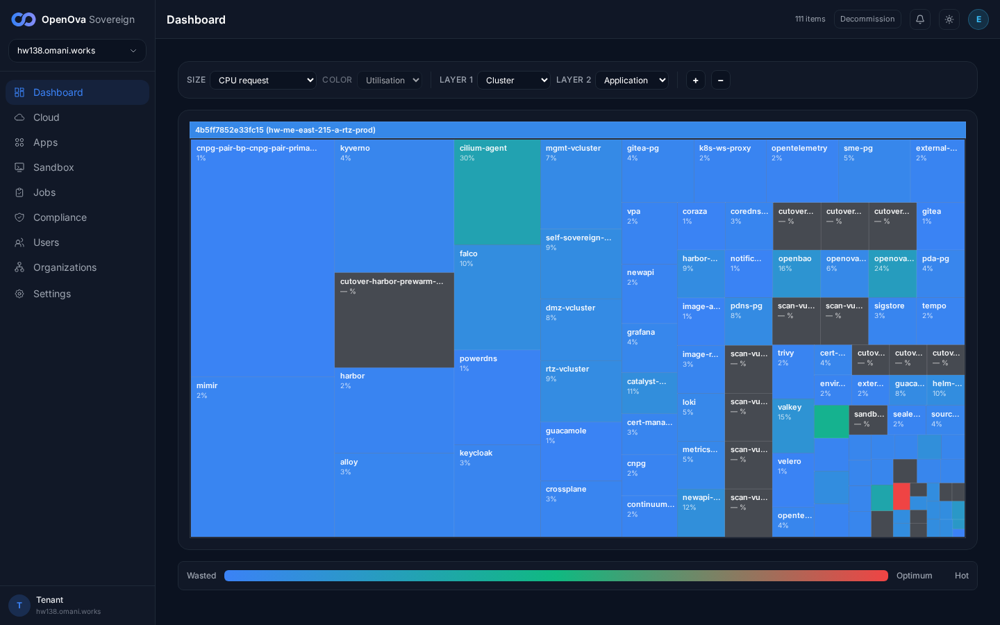
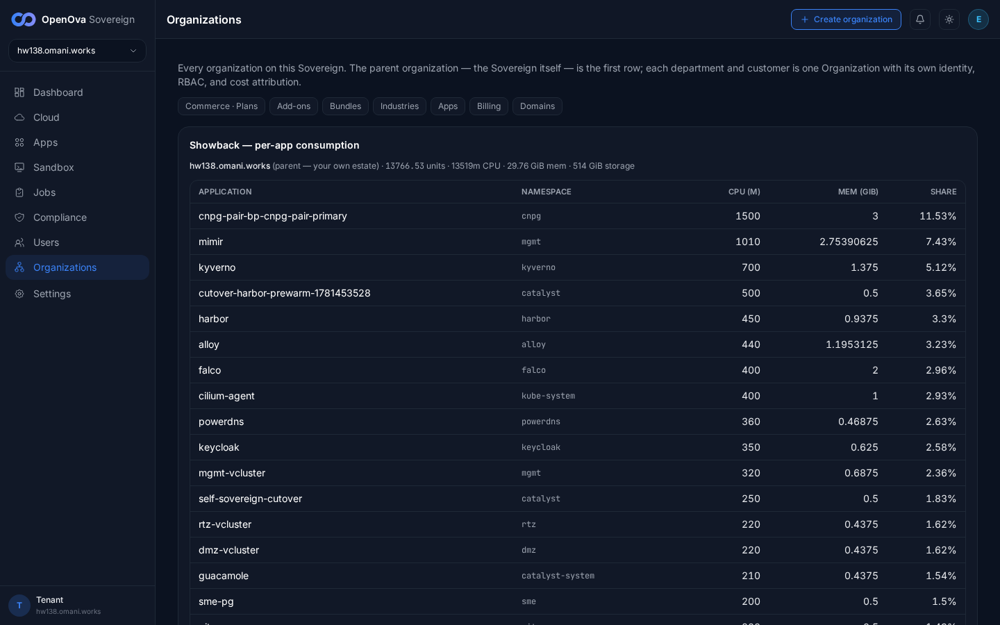
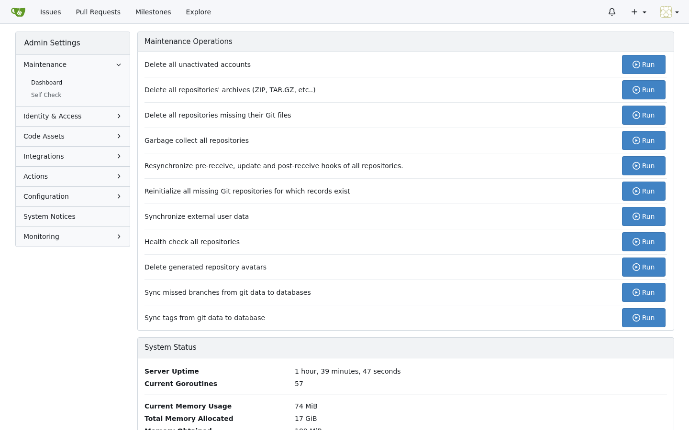
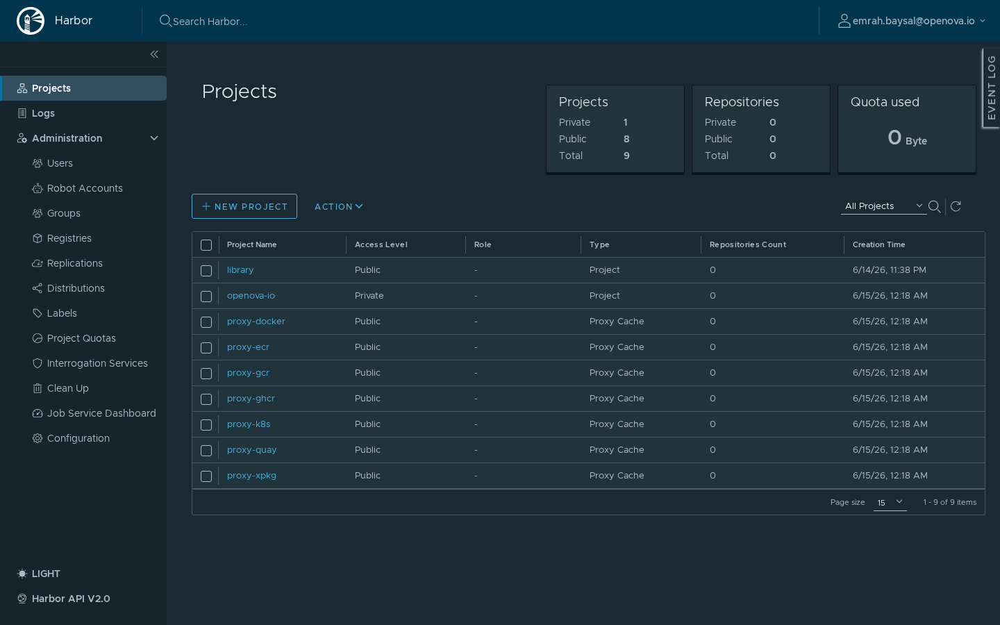
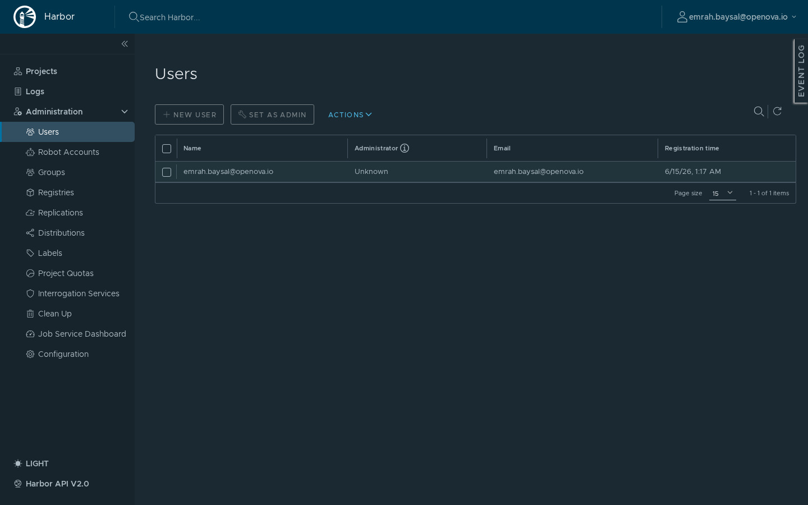
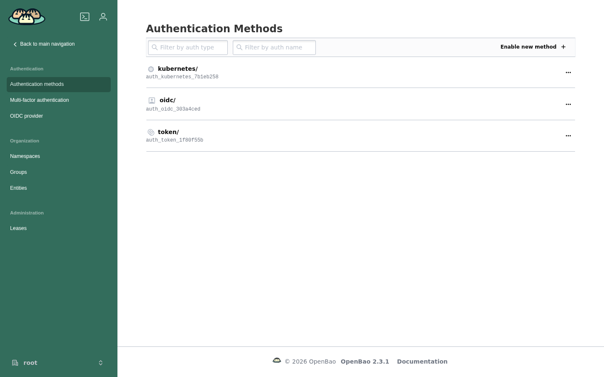
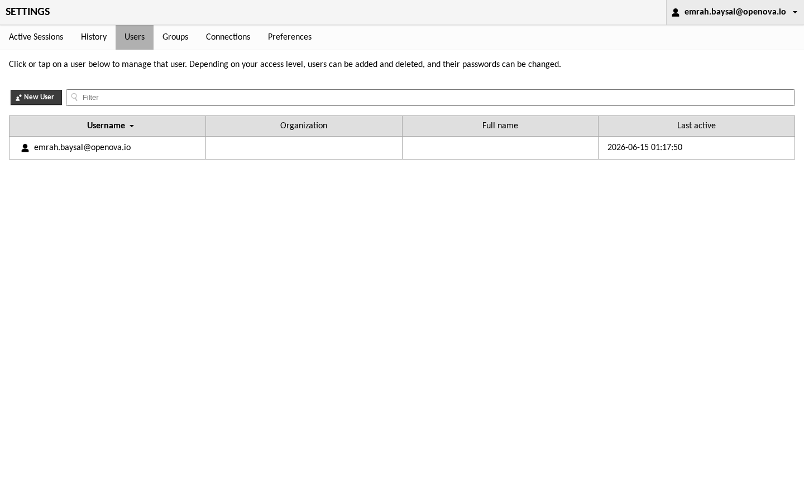
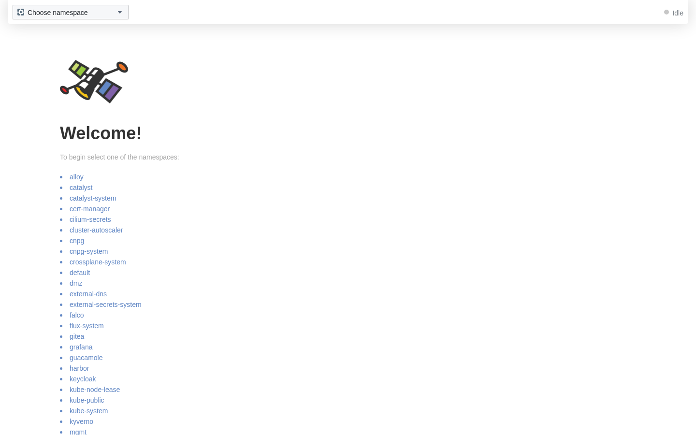
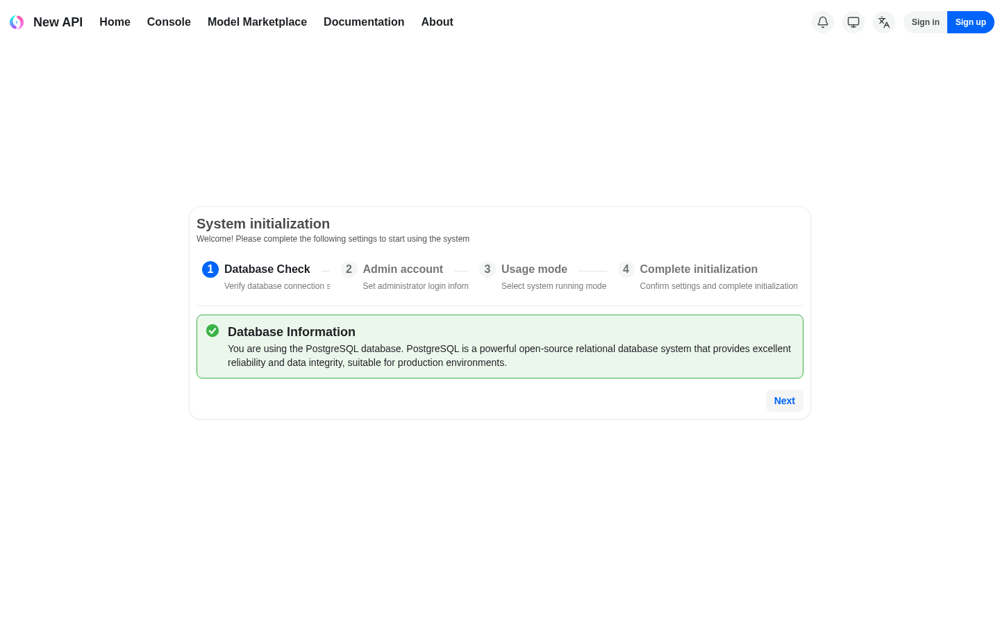

# #3374 SSO — user acceptance walk (web UI)

**Contract:** in a **fresh incognito window**, a handover link establishes the session, then each app's **bare URL** must land **signed in** as the owner with **admin** rights. Zero clicks, no login / PIN / token form. A redirect that ends on a login screen, a 404/500/503, or a blank "no healthy upstream" page is a **fail**. Where an app has an admin area, the admin path must also be reachable signed-in.

> **🛑 LIVE RE-WALK 2026-06-15 on the CURRENT prov `hw138.omani.works` (deployment `4b5ff7852e33fc15`, single-region region-a — cluster `hw-me-east-215-a-rtz-prod`).** This is a fresh, read-only, headless-Playwright walk against hw138 only. All prior-env evidence (hw136 and earlier) is flushed; this table records **only** what renders live on hw138 right now. No mutation, no fixes — observation only.
>
> Session established with a handover JWT (`iss=https://console.openova.io`, `sub=emrah.baysal@openova.io`, `role=sovereign-admin`, `aud=https://console.hw138.omani.works`) → `console.hw138.omani.works/dashboard` signed-in; each app's bare URL then walked in the same browser context.
>
> **Verdict: 16 / 18 ✅ (2 ❌).** The two fails are app-side, both confirmed on a second fresh-session re-check: **pdns-admin** serves its own **HTTP 500** at `/oidc/login`, and **newapi** redirects to a **`/setup` "System initialization" wizard** (Sign in / Sign up buttons) instead of landing the SSO owner signed-in — its admin path bounces to the same wizard. The Sovereign console, Keycloak, and every OIDC-gated app on the shared keycloak chain (grafana, gitea, harbor, openbao, guacamole, hubble) all land **zero-click signed-in admin**; openova-flow and marketplace meet their own contracts. The env is live and stable (Gitea reported ~1h40m uptime at walk time).

| Tested page | Expected | Status | Evidence |
|---|---|---|---|
| [console.hw138.omani.works](https://console.hw138.omani.works/) | Lands on the Dashboard treemap signed-in as the owner (avatar **E** top-right, `hw138.omani.works`, "111 items"), full admin sidebar, no login form | ✅ |  |
| [console · organizations](https://console.hw138.omani.works/organizations) | Organizations page with the Showback per-app consumption model + **Create organization** (admin) | ✅ |  |
| [grafana.hw138.omani.works](https://grafana.hw138.omani.works/) | Grafana home renders zero-click signed-in ("Welcome to Grafana", full nav incl. Administration) | ✅ |  |
| [grafana · /admin/users](https://grafana.hw138.omani.works/admin/users) | Server Admin → Users page; SSO user present with Origin **"Generic OAuth"** | ✅ |  |
| [gitea.hw138.omani.works](https://gitea.hw138.omani.works/) | Gitea `emrah.baysal` Dashboard renders signed-in | ✅ |  |
| [gitea · /admin](https://gitea.hw138.omani.works/admin) | Admin Settings → Maintenance Operations renders; SSO user is site admin | ✅ |  |
| [registry.hw138.omani.works](https://registry.hw138.omani.works/) | Harbor Projects view renders signed-in as `emrah.baysal@openova.io` | ✅ |  |
| [harbor · /harbor/users](https://registry.hw138.omani.works/harbor/users) | Administration → Users page with NEW USER / SET AS ADMIN | ✅ |  |
| [bao.hw138.omani.works/ui/](https://bao.hw138.omani.works/ui/) | Secrets Engines admin (cubbyhole/, secret/, Enable new engine) as **root** | ✅ |  |
| [bao · /ui/vault/access](https://bao.hw138.omani.works/ui/vault/access) | Authentication Methods admin (kubernetes/, oidc/, token/) | ✅ |  |
| [guacamole.hw138.omani.works](https://guacamole.hw138.omani.works/) | RECENT / ALL CONNECTIONS home renders signed-in (OIDC handshake completes, id_token present) — not a Tomcat 404 | ✅ |  |
| [guacamole · #/settings/users](https://guacamole.hw138.omani.works/#/settings/users) | SETTINGS → Users tab reachable with New User | ✅ |  |
| [pdns-admin.hw138.omani.works](https://pdns-admin.hw138.omani.works/) | Lands on the PowerDNS-Admin dashboard signed-in | ❌ |  |
| [hubble.hw138.omani.works](https://hubble.hw138.omani.works/) | Hubble UI "Welcome! select a namespace" renders after a silent sign-in | ✅ |  |
| [newapi.hw138.omani.works](https://newapi.hw138.omani.works/) | Admin console renders zero-click signed-in via SSO (not NewAPI's own login / setup) | ❌ |  |
| [newapi · /console/setting](https://newapi.hw138.omani.works/console/setting) | Admin Settings reachable post-SSO | ❌ |  |
| [openova-flow.hw138.omani.works](https://openova-flow.hw138.omani.works/) | Flow upstream returns authenticated (no login form) | ✅ |  |
| [marketplace.hw138.omani.works](https://marketplace.hw138.omani.works/) | Anonymous storefront renders; no forced login form before checkout | ✅ |  |
| [auth.hw138.omani.works/admin/sovereign/console/](https://auth.hw138.omani.works/admin/sovereign/console/) | Keycloak realm **Sovereign** admin console, full realm-admin nav | ✅ |  |

**Result:** ✅ 16 / ❌ 2 (18 rows) — **LIVE re-walk 2026-06-15 on the current prov `hw138` (deployment `4b5ff7852e33fc15`)**, read-only headless Playwright. Both ❌ rows are app-side and reconfirmed on a second fresh session: pdns-admin HTTP 500, newapi served its `/setup` initialization wizard. (newapi contributes 2 of the 18 rows — bare URL + admin — both ❌.)

### Per-row detail

**✅ Passes (genuine zero-click signed-in admin):**
- **console + console-orgs.** Handover JWT → Dashboard treemap signed-in as owner (avatar **E**, `hw138.omani.works`, "111 items"); the treemap header reads `hw-me-east-215-a-rtz-prod` (region-a). The full operator/admin sidebar is present (Dashboard / Cloud / Apps / Sandbox / Jobs / Compliance / Users / Organizations / Settings). `/organizations` shows the Showback per-app consumption model + Create-organization (admin). Zero-click.
- **grafana + grafana-admin.** Bare URL lands zero-click on the signed-in Grafana home ("Welcome to Grafana", full left nav incl. **Administration**); `/admin/users` → Server Admin → Users with `emrah.baysal@openova.io`, Origin **"Generic OAuth"**, "Last active < 1 minute", NEW USER. The SSO owner is a Grafana Server Admin via OIDC.
- **gitea + gitea-admin.** Bare URL → `emrah.baysal - Dashboard - Catalyst Gitea` signed-in; `/admin` → Admin Settings (Maintenance Operations / Identity & Access / Configuration / Monitoring / System Status, ~1h40m uptime) — the SSO user is site admin.
- **harbor + harbor-users.** Projects view signed-in as `emrah.baysal@openova.io` (library + proxy-cache projects, NEW PROJECT); Administration → Users with NEW USER / SET AS ADMIN. Admin reachable.
- **openbao + openbao-access.** `/ui/` lands on Secrets Engines (cubbyhole/, secret/, Enable new engine) as **root**; `/ui/vault/access` → Authentication Methods (kubernetes/, oidc/, token/, Enable new method). Full admin (Access / Policies / Tools / Raft Storage / Seal).
- **guacamole + guacamole-users.** Bare URL completes the full OIDC handshake (id_token present in the landing URL, realm `sovereign`, aud `guacamole`) → RECENT / ALL CONNECTIONS home as `emrah.baysal@openova.io`; `#/settings/users` → SETTINGS with Active Sessions / History / Users / Groups / Connections + New User. Not a Tomcat 404.
- **hubble.** The oauth2-proxy gate authenticates cleanly → Hubble UI "Welcome! To begin select one of the namespaces:" with the full namespace list — renders only after a silent sign-in.
- **openova-flow.** The oidc gate authenticates and proxies to the upstream, which returns its real service-descriptor JSON (`openova-flow-server` … "No UI is served from this binary — the React canvas library is consumed by the openova-console product"). HTTP 200, no login form — authenticated upstream reached. This is the documented contract for this binary (it serves no browser UI).
- **marketplace.** "Build your cloud tenant in under 5 minutes" anonymous storefront with the funnel stepper (Plan → Stack → Add-ons → Topology → Review → Checkout); the "Sign in" is a header link only, no forced login before checkout. Meets its own contract (intentionally anonymous).
- **keycloak.** `/admin/sovereign/console/` → Keycloak Administration Console, realm **Sovereign**, signed in as `emrah.baysal@openova.io`, full realm-admin nav (Clients / Client scopes / Realm roles / Users / Groups / Sessions / Events / Realm settings / Authentication / Identity providers / User federation).

**❌ Fails (live reason, hw138 right now):**
- **pdns-admin.** Bare URL → `pdns-admin.hw138.omani.works/oidc/login` → PowerDNS-Admin renders its own **HTTP 500 / "Oops! Something went wrong"** page (PowerDNS-Admin v0.4.2). HTTP status **500**. Reconfirmed on a second fresh session — identical 500 at `/oidc/login`. Never lands signed-in.
- **newapi (bare URL + /console/setting).** Bare URL → `newapi.hw138.omani.works/setup` → NewAPI's own **"System initialization"** wizard (steps: Database Check / Admin account / Usage mode / Complete initialization) with **Sign in / Sign up** buttons in the header — the app is uninitialized and serves its own setup flow, not a zero-click SSO-signed-in admin console. `/console/setting` redirects to the same `/setup` wizard. HTTP 200 but the contract (lands signed-in as admin via SSO) is **not** met. Reconfirmed on a second fresh session.

**Honesty notes:**
- **Region.** hw138 is single-region (region-a, cluster `hw-me-east-215-a-rtz-prod`); this walk is SSO-only and makes no multi-region claim.
- **openova-flow** passes by reaching its authenticated **JSON** upstream — there is no browser UI to show signed-in chrome; the pass is "authenticated upstream reached, no login form", consistent with the binary's own description.
- **marketplace** is an intentionally anonymous storefront; its pass is "no forced login before checkout", not a signed-in admin landing.

**Method:** headless Playwright (Chromium 1.60.0) from `/home/openova/repos/ping`; one browser context; handover JWT minted with `/tmp/hw-priv.pem` (RS256) → `console.hw138.omani.works/dashboard`; each bare URL then navigated and screenshotted (`docs/sessions/2026-06-14/evidence/3374-hw138/`). pdns-admin and newapi additionally re-checked with a second freshly-minted handover. Read-only — no cluster mutation.
