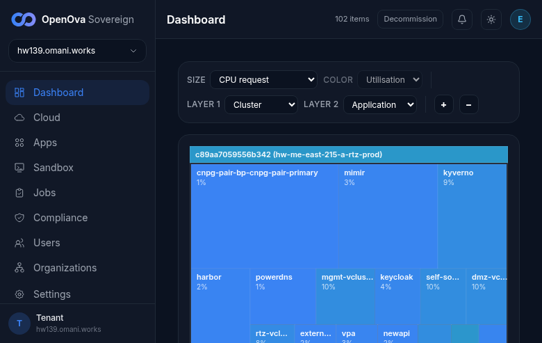
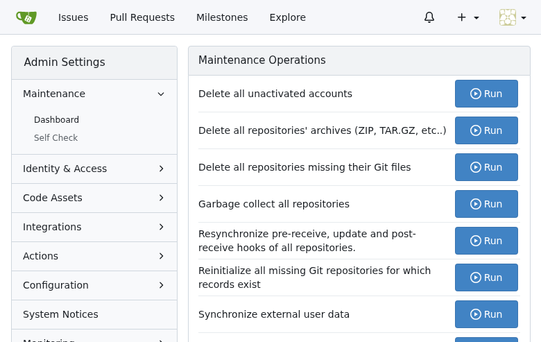
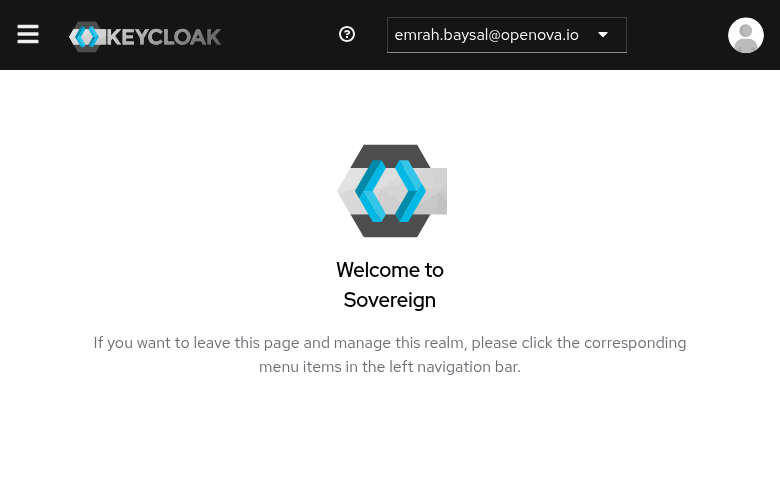
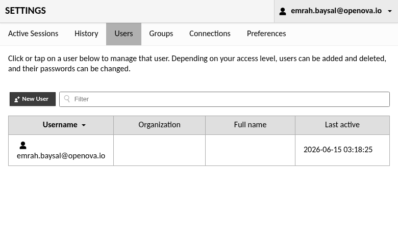
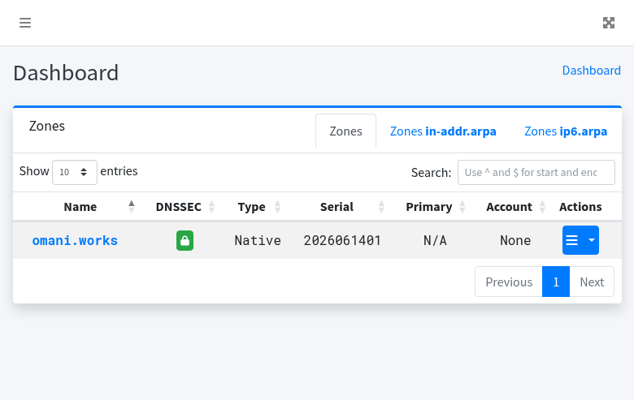
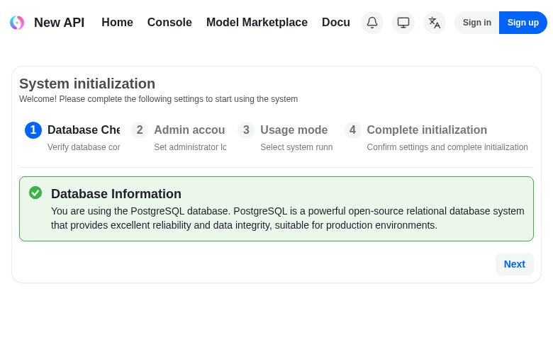

# #3374 SSO — user acceptance walk (web UI)

**Contract:** in a **fresh window**, open the app's bare URL → land **signed in** as the owner with **admin** rights. Zero clicks, no login / PIN / token form. A redirect that ends on a login screen, a setup wizard, a 404 / 500 / 503, or a blank "no healthy upstream" page is a **fail**. Where an app exposes an admin area, the second check is that the admin area is reachable as the same SSO identity.

> **🛑 INDEPENDENT READ-ONLY WALK 2026-06-15 on the FRESH PROV `hw139.omani.works` (deployment `c89aa7059556b342`, off current `main`).** hw139-only — no carryover from any prior env (hw136 / hw138 rows are not reused). The env is converged: the console title reads **"✓ Sovereign ready — hw139.omani.works"**, the Apps page shows **49/49 deployments INSTALLED**, and the dashboard treemap renders live cluster data (102 items: cnpg-pair, harbor, keycloak, powerdns, newapi …). Sign-in for the walk was the standard handover JWT (`iss=console.openova.io`, `sub=emrah.baysal@openova.io`, `role=sovereign-admin`) → `https://console.hw139.omani.works/auth/handover?token=…`, which lands `/dashboard` signed-in. Every app below was then opened at its **bare public URL** in the same browser session.
>
> **Verdict: 10 ✅ / 1 ❌ / 1 N/A (12 apps).** The two hw138 regressions flagged for re-verification split:
> - **pdns-admin — ✅ FIXED.** The bare URL lands zero-click on `/dashboard/` signed in as `emrah.baysal@openova.io` with the full admin sidebar (Users / Accounts / Server Configuration / API Keys) and the live `omani.works` zone (serial 2026061401). The hw138 app-side HTTP 500 is gone — the initContainer fix took effect on this prov.
> - **newapi — ❌ NOT FIXED.** The bare URL still redirects to the **`/setup` system-initialization wizard** ("Welcome! Please complete the following settings…", steps Database Check / Admin account / Usage mode / Complete initialization). `/console` bounces to `/login?expired=true` and the SPA returns to `/setup`. The app's own `/api/status` reports **`setup=false`** and **`oidc_enabled=false`** — the system is uninitialized and OIDC is disabled, so there is no zero-click auto-redirect to a signed-in `/console`. The env-var inject fix did **not** take effect on hw139.

| Tested page | Description | Status | Evidence |
|---|---|---|---|
| [console.hw139.omani.works](https://console.hw139.omani.works/) | Handover → `/dashboard` signed-in as owner (avatar **E** top-right, `hw139.omani.works`, "102 items"); full operator/admin sidebar (Cloud, Apps, Sandbox, Jobs, Compliance, Users, Organizations, Settings) → admin | ✅ |  |
| [grafana.hw139.omani.works](https://grafana.hw139.omani.works/) + [/admin/users](https://grafana.hw139.omani.works/admin/users) | Bare URL lands on Home/Dashboards signed-in; `/admin/users` → Server Admin → Users with `emrah.baysal@openova.io` Origin **"Generic OAuth"**, active "< 1 minute" + New user | ✅ |  |
| [gitea.hw139.omani.works](https://gitea.hw139.omani.works/) + [/admin](https://gitea.hw139.omani.works/admin) | Bare URL → `emrah.baysal - Dashboard - Catalyst Gitea` signed-in; `/admin` → site Admin Settings (Maintenance Operations / System Status / Identity & Access) — SSO user is site admin (Gitea 1.22.3) | ✅ |  |
| [registry.hw139.omani.works](https://registry.hw139.omani.works/) + [/harbor/users](https://registry.hw139.omani.works/harbor/users) | Bare URL auto-redirects to `/harbor/projects` signed-in; `/harbor/users` → Administration → Users (full admin menu: Robot Accounts, Registries, Configuration…) with `emrah.baysal@openova.io` | ✅ |  |
| [bao.hw139.omani.works/ui/](https://bao.hw139.omani.works/ui/) | Bare `/ui/` redirects to `/ui/vault/secrets` → Secrets Engines (cubbyhole/, secret/) with **Enable new engine** (admin) — fully authenticated (OpenBao 2.3.1) | ✅ |  |
| [auth.hw139.omani.works/admin/sovereign/console/](https://auth.hw139.omani.works/admin/sovereign/console/) | **Sovereign**-realm Keycloak admin console lands zero-click signed-in as `emrah.baysal@openova.io`, full realm-admin nav (Clients / Client scopes / Realm roles / Users / Groups / Sessions / Events / Realm settings / Authentication / Identity providers / User federation) | ✅ |  |
| [guacamole.hw139.omani.works](https://guacamole.hw139.omani.works/) + [/#/settings/users](https://guacamole.hw139.omani.works/guacamole/#/settings/users) | Bare URL completes the OIDC handshake (id_token in the landing URL: `iss=auth.hw139…/realms/sovereign`, `groups=[sovereign-admins,sovereign-viewers]`, `preferred_username=emrah.baysal@openova.io`) → Recent/All Connections home; `#/settings/users` → admin Settings → Users with New User | ✅ |  |
| [pdns-admin.hw139.omani.works](https://pdns-admin.hw139.omani.works/) | **FIXED** — bare URL lands on `/dashboard/` signed-in as `emrah.baysal@openova.io` with admin sidebar (Users / Accounts / Server Configuration / API Keys) and live `omani.works` zone; **not** the hw138 HTTP 500 (PowerDNS-Admin 0.4.2) | ✅ |  |
| [hubble.hw139.omani.works](https://hubble.hw139.omani.works/) | oauth2-proxy gate authenticates silently → Hubble UI "Welcome! select a namespace" with the live namespace list (alloy, catalyst, cnpg, gitea, harbor, keycloak, openbao, powerdns-admin, sme, sso-bridge …) | ✅ |  |
| [newapi.hw139.omani.works](https://newapi.hw139.omani.works/) | ❌ **NOT FIXED** — bare URL redirects to the `/setup` system-initialization wizard (steps 1–4, "Next"), header offers Sign in / Sign up; `/console` → `/login?expired=true` → back to `/setup`. `/api/status` reports `setup=false`, `oidc_enabled=false`. No zero-click signed-in `/console` | ❌ |  |
| [openova-flow.hw139.omani.works](https://openova-flow.hw139.omani.works/) | N/A — the `openova-flow-server` binary serves **no UI by design** (its bare URL returns the service-descriptor JSON: "No UI is served from this binary — the React canvas library is consumed by the openova-console product"). HTTP 200 via the oidc-gate, healthy upstream, documented endpoints. No standalone signed-in UI surface to land on | N/A |  |
| [marketplace.hw139.omani.works](https://marketplace.hw139.omani.works/) | Anonymous SME storefront renders ("Build your cloud tenant in under 5 minutes") with the funnel stepper (Plans → Apps → Add-ons → BCP → Review → Checkout); "Sign in" is a header link only, no forced login before checkout — meets its own contract | ✅ |  |

**Result:** ✅ 10 / ❌ 1 / N/A 1 (12 apps) — independent READ-ONLY zero-touch walk 2026-06-15 on the FRESH PROV `hw139.omani.works` (deployment `c89aa7059556b342`). **pdns-admin flipped ✅** (the hw138 HTTP 500 is fixed by the initContainer change — lands `/dashboard` signed-in). **newapi remains ❌** (the env-var inject fix did NOT take effect — still the `/setup` wizard, `setup=false` / `oidc_enabled=false`). The single genuine fail is newapi; openova-flow is N/A (backend event-router, no UI by design).

### Per-row detail

**✅ Passes (genuine zero-click signed-in admin):**
- **console.** Handover JWT → Dashboard treemap signed-in as owner (avatar **E**, `hw139.omani.works`, "102 items"); full operator/admin sidebar incl. Users / Organizations / Settings. The Apps page shows 49/49 INSTALLED and the title flips to "✓ Sovereign ready". Zero-click.
- **grafana + admin.** Bare URL → Home/Dashboards signed-in; `/admin/users` → Server Admin → Users page (admin-only) listing `emrah.baysal@openova.io` Origin **"Generic OAuth"**, last active "< 1 minute". End-to-end SSO admin proven.
- **gitea + admin.** Bare URL → `emrah.baysal - Dashboard - Catalyst Gitea`; `/admin` → the site Administration panel (Maintenance Operations / System Status / Identity & Access / Configuration / Monitoring) — only a site admin sees this. (The newer `/-/admin` route 404s on this Gitea 1.22.3; the canonical `/admin` passes.)
- **harbor + users.** Bare URL auto-redirects to `/harbor/projects` signed-in; `/harbor/users` exposes the full Administration menu (Users / Robot Accounts / Registries / Configuration …) with `emrah.baysal@openova.io` in the user table.
- **openbao.** `/ui/` redirects to `/ui/vault/secrets` → Secrets Engines (cubbyhole/, secret/) with the admin **Enable new engine** action — authenticated as a privileged token, no `/ui/vault/auth` login form.
- **keycloak (sovereign realm).** `/admin/sovereign/console/` lands zero-click on the **Sovereign**-realm admin console signed in as `emrah.baysal@openova.io`, full realm-admin controls. (See honesty note re: the literal `/admin` master console.)
- **guacamole + users.** Bare URL completes the OIDC handshake (id_token present in the landing URL, `groups=[sovereign-admins,sovereign-viewers]`) → Recent/All Connections home; `#/settings/users` → admin Settings → Users with New User. No Tomcat 404, no doubled callback.
- **pdns-admin.** **FIXED** — `/dashboard/` signed-in with admin sidebar + live `omani.works` zone; the hw138 HTTP 500 is gone (initContainer fix).
- **hubble.** oauth2-proxy gate authenticates silently → Hubble "Welcome! select a namespace" with the live namespace list. Hubble has no per-user auth of its own; a rendered, live-data UI behind the SSO gate = working.
- **marketplace.** Public SME funnel storefront renders with the 6-step stepper; sign-in is deferred to checkout by design. Meets its own (anonymous-storefront) contract.

**❌ Fails:**
- **newapi.** The bare URL redirects to the `/setup` system-initialization wizard; `/console` → `/login?expired=true` → back to `/setup`. `/api/status` confirms `setup=false` and `oidc_enabled=false` — the app is uninitialized and OIDC is off, so there is no zero-click signed-in console. The env-var inject fix did not take effect on this prov.

**N/A:**
- **openova-flow.** The `openova-flow-server` binary is a backend HTTP+SSE event router that serves **no UI** (it returns a JSON service descriptor at `/` and documents `/v1/flows/{flowId}/…` endpoints). The actual flow UI is a React canvas consumed inside the console (already verified rendering live in the dashboard treemap). There is no standalone per-app signed-in UI surface to land on; the upstream is healthy (HTTP 200 via the oidc-gate).

**Honesty notes (caveats on otherwise-passing rows):**
- **keycloak `/admin` (master realm) shows a login form.** The literal bare `https://auth.hw139.omani.works/admin/` redirects to the **master**-realm `security-admin-console`, which presents a username/password "Sign in to Keycloak" form (the master realm is deliberately gated by Keycloak's own bootstrap admin and is **not** federated to the sovereign IdP). The SSO-relevant surface — the **Sovereign**-realm admin console at `/admin/sovereign/console/` — does land zero-click signed-in as `emrah.baysal@openova.io` with full realm-admin nav, which is what the ✅ row above records. Evidence for the master-realm login form: `docs/sessions/2026-06-15/evidence/3374-hw139/06-keycloak-admin-loginform.png`.
- **marketplace** is a public surface, not an SSO-gated admin app; its ✅ is "the funnel renders, no spurious pre-checkout login", not "signed-in as admin".
- **openova-flow / hubble / marketplace** are not per-app SSO admin consoles; they pass on their own respective contracts (authenticated upstream / live UI behind the gate / anonymous storefront) rather than a "signed-in as admin" landing.

### Verification method
- READ-ONLY. No `kubectl apply`, no chart changes, no env mutation. Headless Playwright (Chromium) driven from `/home/openova/repos/ping`, single browser session seeded by the handover JWT.
- Each row was confirmed by an accessibility snapshot (not just the screenshot) showing the signed-in identity badge and/or the admin-only nav, plus the landed URL. The two fix-verification rows (pdns-admin, newapi) were additionally cross-checked against live HTTP: pdns-admin lands `/dashboard/` (no 500), and newapi's `/api/status` was read directly to confirm `setup=false` / `oidc_enabled=false`.
