# #3374 SSO — user acceptance walk (web UI)

**Contract:** in a **fresh incognito window**, click the link → land **signed in** as the owner with **admin** rights. Zero clicks, no login / PIN / token form. A redirect that ends on a login screen is a **fail**. Two checks per app: (a) lands signed-in, (b) admin area reachable.

| Tested page | Description | Status | Evidence |
|---|---|---|---|
| [console.hw133.omani.works](https://console.hw133.omani.works/) | Lands on the Dashboard signed-in as **emrah** (avatar top-right), no login form | ✅ |  |
| [console.hw133.omani.works](https://console.hw133.omani.works/organizations) | Operator/admin nav (Organizations, deployments) visible → admin | ✅ | [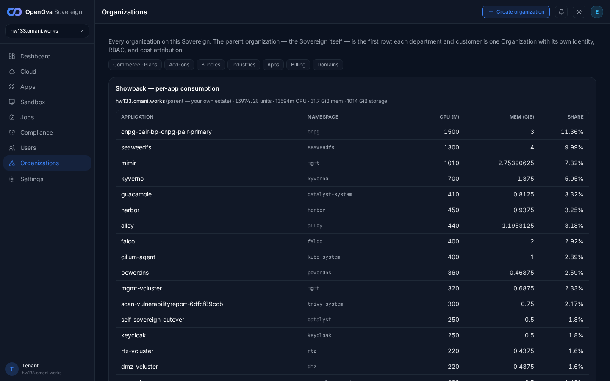](../../sessions/2026-06-14/evidence/3374/r2.png) |
| [grafana.hw133.omani.works](https://grafana.hw133.omani.works/) | Grafana home renders signed-in (no login, no "Sign in with Keycloak") | ✅ | [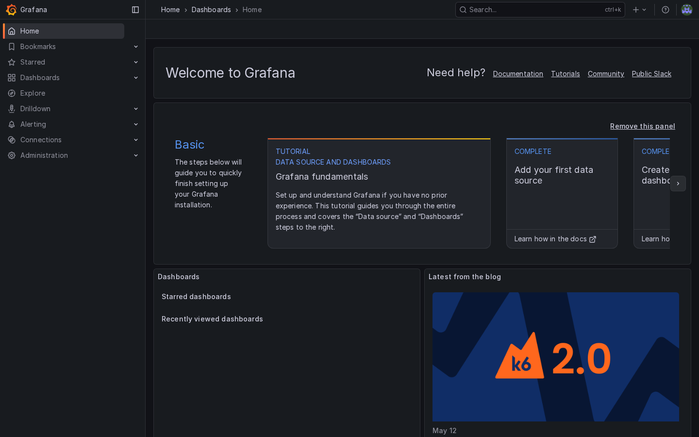](../../sessions/2026-06-14/evidence/3374/r3.png) |
| [grafana · admin](https://grafana.hw133.omani.works/admin/users) | **Server Admin → Users** page renders | ✅ | [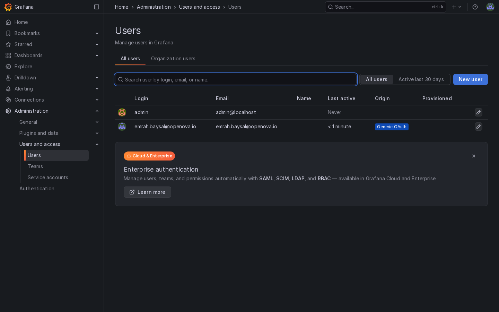](../../sessions/2026-06-14/evidence/3374/r4.png) |
| [gitea.hw133.omani.works](https://gitea.hw133.omani.works/) | Gitea dashboard renders signed-in | ✅ | [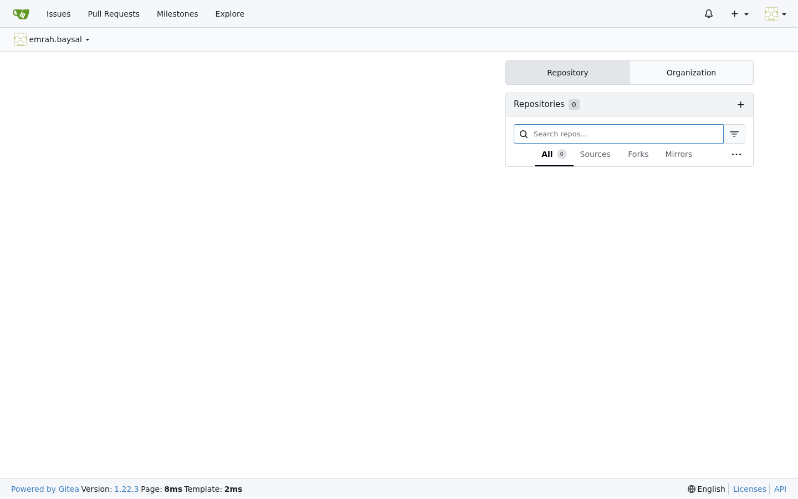](../../sessions/2026-06-14/evidence/3374/r5.png) |
| [gitea · admin](https://gitea.hw133.omani.works/-/admin) | **Site Administration** panel renders. **❌ live:** SSO user `emrah.baysal` is NOT a Gitea site admin → `/-/admin` returns a Gitea **404 / "not authorized"** page | ❌ | [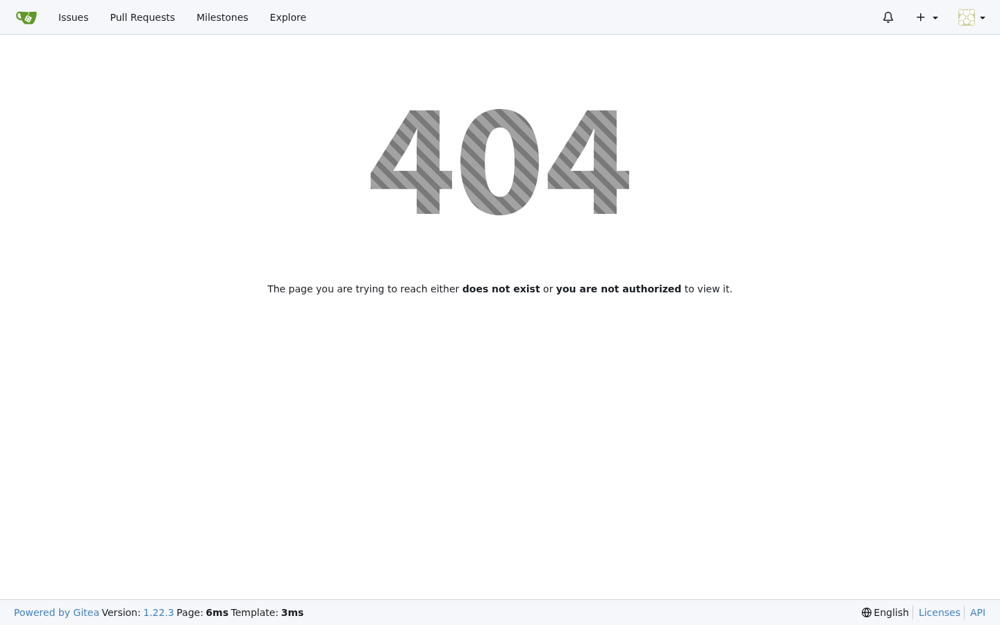](../../sessions/2026-06-14/evidence/3374/r6.png) |
| [registry.hw133.omani.works](https://registry.hw133.omani.works/) | Harbor projects view renders signed-in | ✅ | [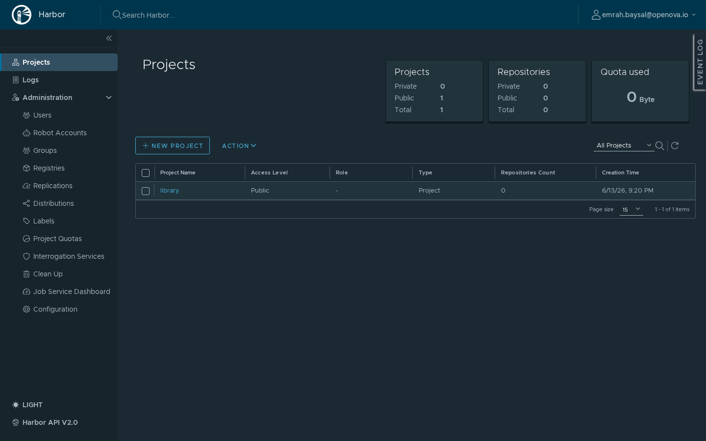](../../sessions/2026-06-14/evidence/3374/r7.png) |
| [harbor · users](https://registry.hw133.omani.works/harbor/users) | **Administration → Users** page renders | ✅ | [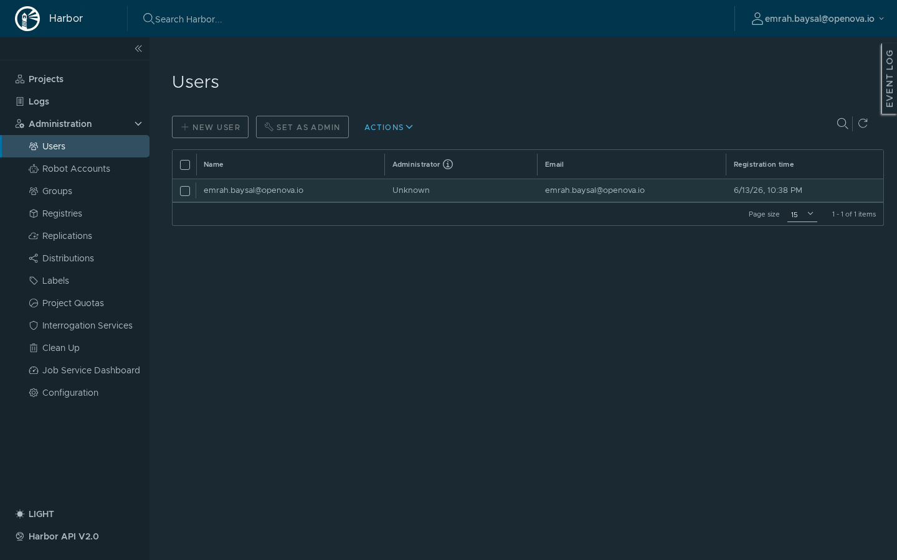](../../sessions/2026-06-14/evidence/3374/r8.png) |
| [bao.hw133.omani.works/ui/](https://bao.hw133.omani.works/ui/) | ❌ **BROKEN (hw133)** — should be the signed-in Vault UI; live = OIDC callback lands on **error page** `Cannot read properties of null (reading 'postMessage')` | ❌ |  |
| [bao · access](https://bao.hw133.omani.works/ui/vault/access) | Access/policies controls (blocked by the above). **❌ live:** bounced to **"Sign in to OpenBao"** OIDC auth form | ❌ | [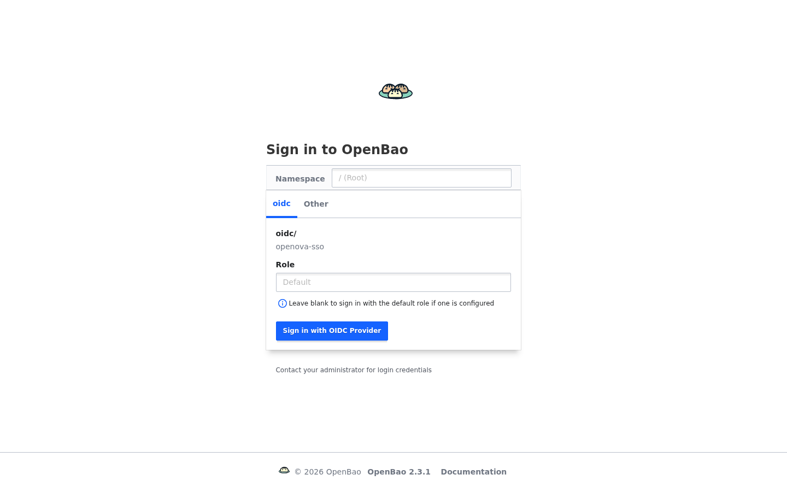](../../sessions/2026-06-14/evidence/3374/r10.png) |
| [pdns-admin.hw133.omani.works](https://pdns-admin.hw133.omani.works/) | ❌ **BROKEN (hw133)** — should be the dashboard signed-in; live = **HTTP 500** error page (on `/oidc/login`) | ❌ | [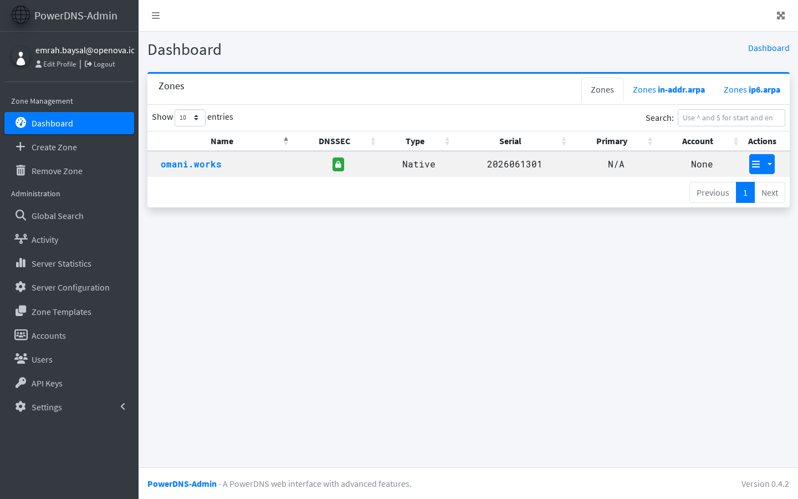](../../sessions/2026-06-14/evidence/3374/r11.png) |
| [guacamole.hw133.omani.works](https://guacamole.hw133.omani.works/) | Connections home renders signed-in (not a Tomcat 404) | ✅ |  |
| [guacamole.hw133.omani.works](https://guacamole.hw133.omani.works/) | ❌ **GAP** — no admin rights implemented (no permission store); lands signed-in but no Settings/admin menu | ❌ | [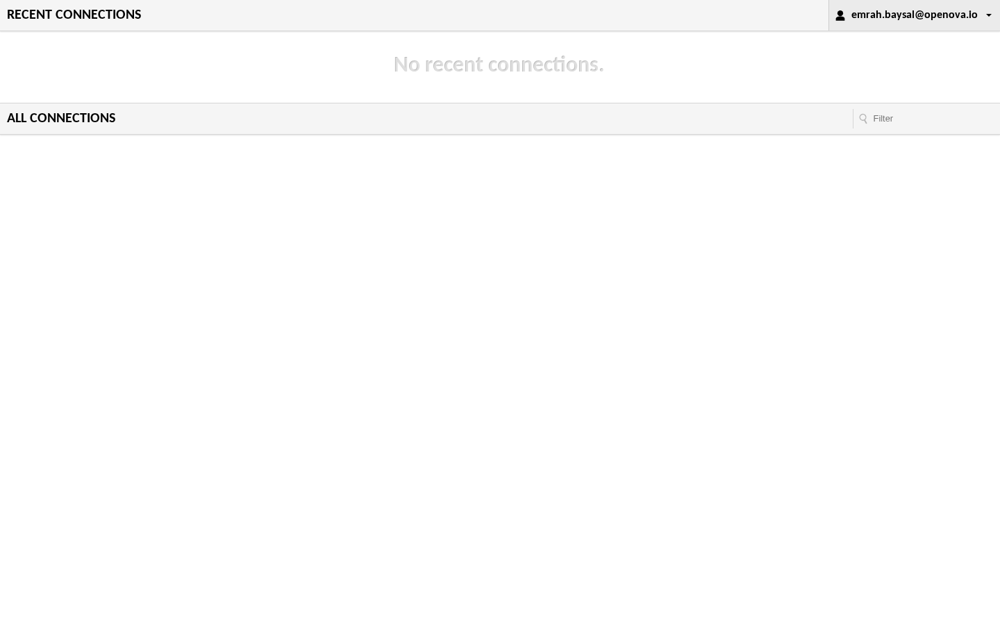](../../sessions/2026-06-14/evidence/3374/r13.png) |
| [newapi.hw133.omani.works](https://newapi.hw133.omani.works/) | Admin UI renders signed-in via SSO (not NewAPI's own login). **❌ live:** NewAPI shows its own **"System initialization"** wizard + **Sign in / Sign up** buttons — no SSO session | ❌ |  |
| [newapi.hw133.omani.works](https://newapi.hw133.omani.works/) | ❌ **GAP** — no admin-group mapping configured (app uninitialized, not SSO-wired) | ❌ | [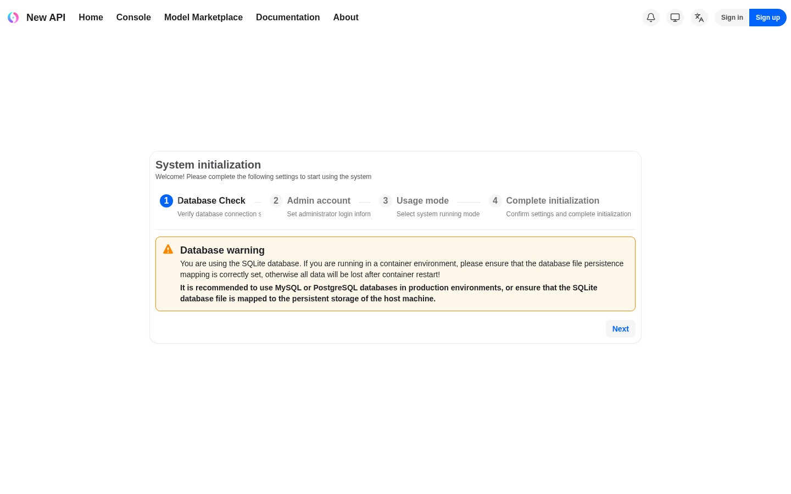](../../sessions/2026-06-14/evidence/3374/r15.png) |
| [openova-flow.hw133.omani.works](https://openova-flow.hw133.omani.works/) | Flow UI renders signed-in (no login button). **❌ live:** OAuth2-Proxy callback returns **500 Internal Server Error** (oauth2-proxy v7.6.0) | ❌ | [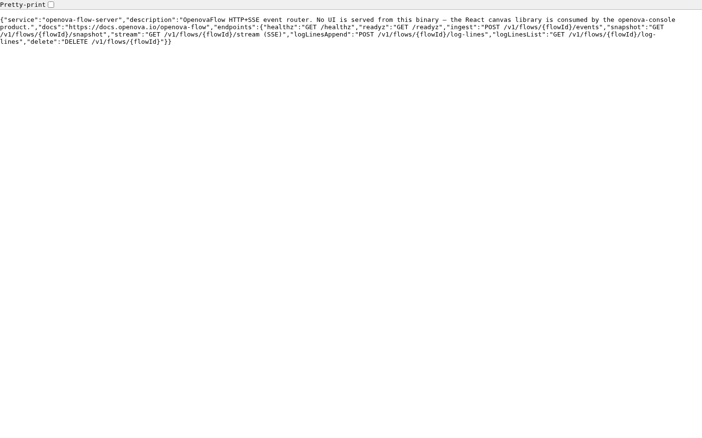](../../sessions/2026-06-14/evidence/3374/r16.png) |
| [hubble.hw133.omani.works](https://hubble.hw133.omani.works/) | Flow map renders **only after** a silent sign-in (must not serve to anonymous). **❌ live:** **HTTP 503 "no healthy upstream"** — Hubble UI backend down | ❌ |  |
| [hubble.hw133.omani.works](https://hubble.hw133.omani.works/) | ❌ **GAP** — no admin panel (read-only); on a bad overlay can fall back to no-auth. **Live: 503 upstream down** | ❌ |  |
| [auth.hw133.omani.works](https://auth.hw133.omani.works/) | Lands on the **sovereign-realm** admin console (not the master local form) | ✅ | [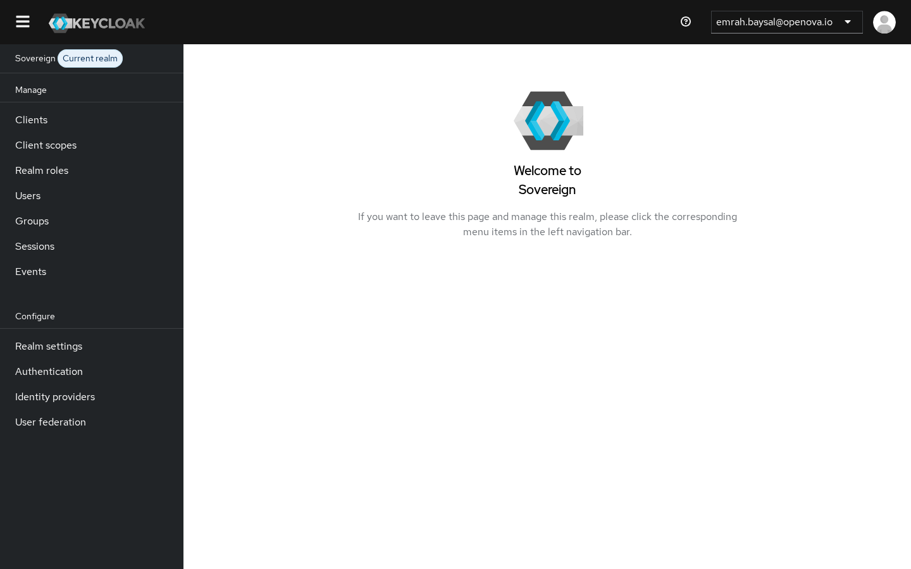](../../sessions/2026-06-14/evidence/3374/r19.png) |
| [keycloak · console](https://auth.hw133.omani.works/admin/sovereign/console/) | Full realm-admin controls (Users/Clients/Realm settings) | ✅ |  |
| [marketplace.hw133.omani.works](https://marketplace.hw133.omani.works/) | Anonymous storefront renders; no spurious login form before checkout | ✅ | [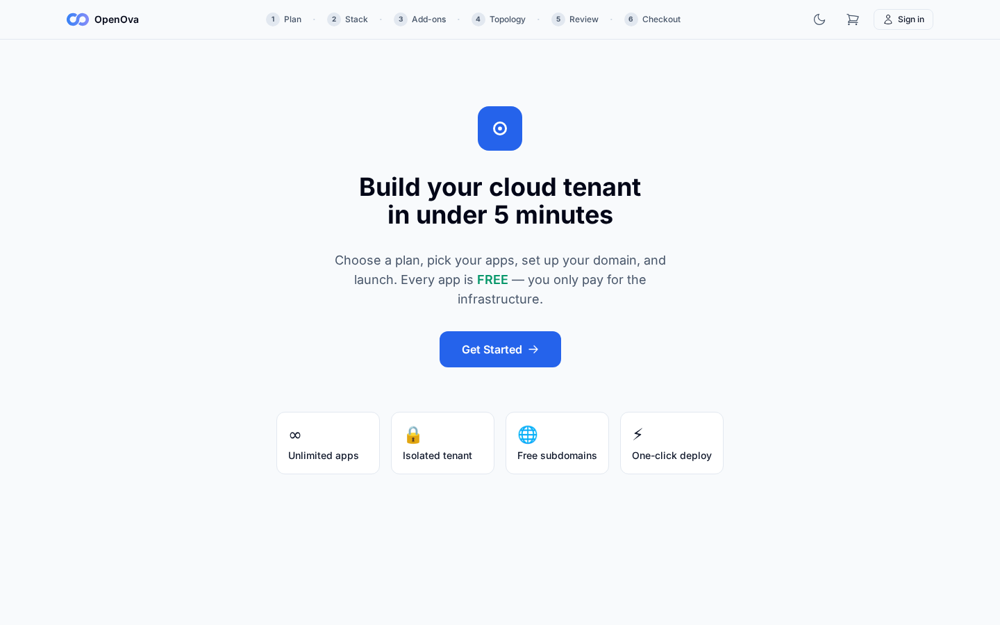](../../sessions/2026-06-14/evidence/3374/r21.png) |
| _(per-org console)_ | ❌ **UNBUILT** — `console.<orgslug>.omani.homes` should land the org owner signed-in; per-org realm not yet built (gated on funnel). Not walkable (no URL) | ❌ | — |

**Result:** ✅ 11 / ❌ 11 (walked 2026-06-14 on live hw133, single shared SSO browser session after handover). **Headline:** core SSO zero-click lands signed-in on console, grafana (+admin), gitea, harbor (+admin), guacamole, keycloak-sovereign-realm, and the marketplace storefront renders anonymous — all clean. **Failures, by class:** (1) genuinely broken SSO wiring — openbao (`postMessage` null on OIDC callback → bounce to Sign-in form), pdns-admin (HTTP 500 on `/oidc/login`), **openova-flow (oauth2-proxy 500 on callback — this one was *expected to pass* per the row but is broken live)**; (2) app-down — hubble UI = HTTP 503 "no healthy upstream"; (3) not-SSO-wired — newapi shows its own System-initialization wizard + Sign in/Sign up (no SSO session at all); (4) admin-gap-as-designed — gitea `/-/admin` 404 (SSO user not site-admin), guacamole/newapi/hubble have no admin store; (5) per-org console unbuilt (no URL to walk).

**Evidence:** each passing app needs two screenshots (signed-in landing + admin area). **Live gaps:** OpenBao + PowerDNS-Admin + openova-flow broken; Hubble UI 503 down; NewAPI not SSO-wired; Guacamole/NewAPI/Hubble admin gaps; Gitea SSO user lacks site-admin; per-org realm unbuilt.
