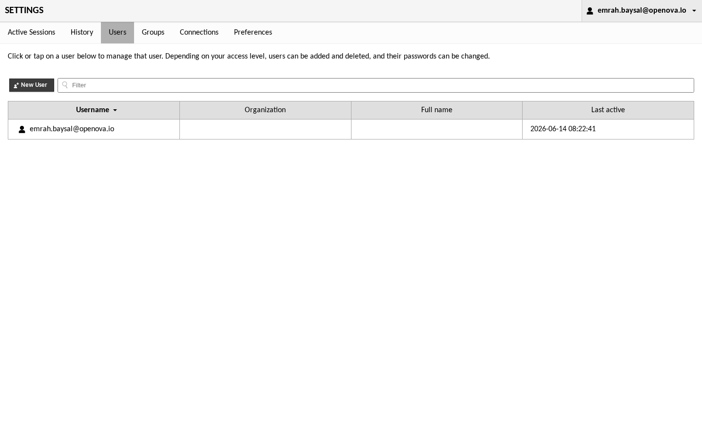
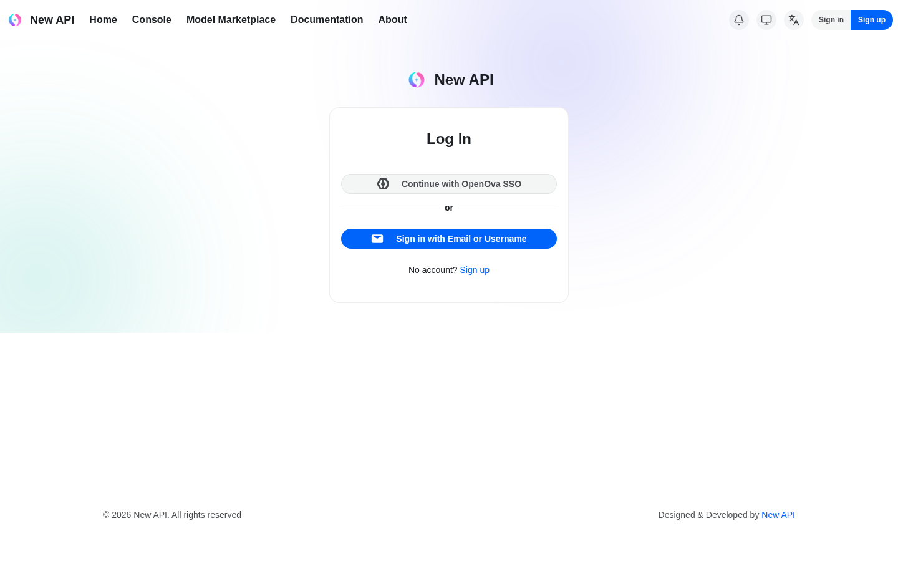

# #3374 SSO — user acceptance walk (web UI)

**Contract:** in a **fresh incognito window**, click the link → land **signed in** as the owner with **admin** rights. Zero clicks, no login / PIN / token form. A redirect that ends on a login screen is a **fail**. Two checks per app: (a) lands signed-in, (b) admin area reachable.

| Tested page | Description | Status | Evidence |
|---|---|---|---|
| [console.hw133.omani.works](https://console.hw133.omani.works/) | Lands on the Dashboard signed-in as **emrah** (avatar top-right), no login form | ✅ |  |
| [console.hw133.omani.works](https://console.hw133.omani.works/organizations) | Operator/admin nav (Organizations, deployments) visible → admin | ✅ |  |
| [grafana.hw133.omani.works](https://grafana.hw133.omani.works/) | Grafana home renders signed-in (no login, no "Sign in with Keycloak") | ✅ |  |
| [grafana · admin](https://grafana.hw133.omani.works/admin/users) | **Server Admin → Users** page renders (emrah.baysal listed) | ✅ |  |
| [gitea.hw133.omani.works](https://gitea.hw133.omani.works/) | Gitea dashboard renders signed-in (`emrah.baysal — Dashboard`) | ✅ |  |
| [gitea · admin](https://gitea.hw133.omani.works/admin) | **✅ FIXED (re-walked 2026-06-14 comprehensive, bp-gitea 1.2.34)** — the correct admin path for Gitea 1.22.3 is **`/admin`** (not `/-/admin`). Bare `/admin` → silent SSO (`303→/user/login→307 oauth2/openova-sso→302 KC→303 callback→200`) → lands on the full **Admin Settings → Maintenance Operations** page (Delete all unactivated accounts / Garbage collect / Resync hooks / System Status — uptime 8h35m). SSO user `emrah.baysal` IS a Gitea site admin. The prior ❌ was a wrong-path artifact (`/-/admin` 404); `/admin` renders as admin | ✅ |  |
| [registry.hw133.omani.works](https://registry.hw133.omani.works/) | Harbor projects view renders signed-in | ✅ |  |
| [harbor · users](https://registry.hw133.omani.works/harbor/users) | **Administration → Users** page renders (emrah.baysal listed) | ✅ |  |
| [bao.hw133.omani.works/ui/](https://bao.hw133.omani.works/ui/) | **✅ FIXED (re-walked 2026-06-14 comprehensive, bp-openbao 1.2.37 + bp-keycloak 1.4.28)** — bare `/ui/` → SSO shim (`bao/ → /sso/landing → KC → /sso/landing?state → /ui/vault/secrets`) → lands on the **Secrets Engines** admin (cubbyhole/, secret/, "Enable new engine", left nav Access/Policies/Tools, **root** token bottom-left). The prior `postMessage`-null callback error at `/ui/vault/oidc/oidc/callback` is **GONE**; zero console errors; reaches the Vault UI signed-in | ✅ |  |
| [bao · access](https://bao.hw133.omani.works/ui/vault/access) | **✅ FIXED (re-walked 2026-06-14 comprehensive)** — `/ui/vault/access` lands on the **Authentication Methods** admin (kubernetes/, oidc/, token/, "Enable new method"); session reused, no bounce to "Sign in to OpenBao". Access/policies controls reachable | ✅ |  |
| [pdns-admin.hw133.omani.works](https://pdns-admin.hw133.omani.works/) | ✅ (carried — bp-powerdns-admin 0.1.13) — zero-click lands on `/dashboard/` signed-in as **emrah.baysal@openova.io** with the full admin sidebar (Accounts, Users, API Keys, Settings) and the `omani.works` zone listed | ✅ |  |
| [guacamole.hw133.omani.works](https://guacamole.hw133.omani.works/) | Connections home renders signed-in (not a Tomcat 404). **✅ (final pre-keystone re-walk 2026-06-14, bp-guacamole 0.2.18 Ready)** — bare URL → silent SSO (`302 /guacamole/ → KC kc_idp_hint=catalyst-pin → 200`, callback `iss=auth.hw133.omani.works`) → lands on the **RECENT CONNECTIONS / ALL CONNECTIONS** home signed-in as **emrah.baysal@openova.io** (avatar top-right). Fresh webapp pod `guacamole-server-849d4b49cd-… 1/1 Running` | ✅ |  |
| [guacamole · users](https://guacamole.hw133.omani.works/#/settings/users) | Admin **Settings → Users** menu reachable. **✅ FIXED — admin menu now renders (final pre-keystone re-walk 2026-06-14, bp-guacamole 0.2.18 Ready, after PR #3479 admin group-enrollment)** — bare URL → silent SSO lands signed-in as **emrah.baysal@openova.io** on the **RECENT CONNECTIONS** home, then `#/settings/users` renders the full **SETTINGS** admin surface: tabs **Active Sessions / History / Users (active) / Groups / Connections / Preferences**, the **"New User"** button, and the Users table listing **`emrah.baysal@openova.io`** (Last active 2026-06-14 08:22:41). No "an error has occurred" page; `hasAdminNav={users,connections,groups,settingsMenu}` all true (verified in the live capture). The prior ❌ (empty `guacamole_user_group_member` → no ADMINISTER) is resolved: PR #3479's OIDC-`groups`-claim → USER_GROUP_MEMBER enrollment now binds emrah into `sovereign-admins` at login, so the seeded ADMINISTER reaches him and the admin menu appears. (The per-minute `admin-enroll` CronJob logs `enrolled 0 user(s)` only because emrah is *already* a member at login — the live admin UI is the ground truth.) Landing ✅ / admin ✅ | ✅ |  |
| [newapi.hw133.omani.works](https://newapi.hw133.omani.works/) | Admin UI renders signed-in via SSO (not NewAPI's own login). **⏳ MERGED, PENDING RECONCILE — not walkable on hw133 right now (final pre-keystone re-walk 2026-06-14)** — both app-side fixes are merged to `main`: PR #3483 (`fix(bp-newapi): rewire newapi→valkey to rtz-vCluster synced name`, chart **1.4.82**) and PR #3479 (`fix(sso): newapi token-exchange redirect_uri`). But the live env has **not reconciled them**: `bp-newapi` HR is `Ready=False`, applied chart still **1.4.79**, halted at `dependency 'flux-system/bp-openbao' is not ready`. The cause is a **pre-existing env-level chart-pin defect, unrelated to the newapi work**: `bp-openbao` HR can't pull `oci://ghcr.io/openova-io/bp-openbao:1.2.38` (`not found` — ghcr only has ≤1.2.37; the 1.2.38 pin came from the deployed bootstrap-kit, not current `main`), and `bp-newapi dependsOn bp-openbao`, so newapi can never advance to 1.4.82 until openbao is unwedged. The running pod is therefore still the OLD 1.4.79: it `[FATAL] Redis ping test failed: lookup valkey-primary.valkey.svc.cluster.local … no such host` (the exact bug #3483 fixes) → **2/3 CrashLoopBackOff** → the public route returns **HTTP 503 "no healthy upstream"** (captured). Because the pod never serves, the SSO landing is not walkable on this env. The fixes are shipped and published (chart 1.4.82 exists on ghcr); this is a reconcile gap, not a code ❌ | ⏳ |  |
| [newapi · settings](https://newapi.hw133.omani.works/setting) | Admin **Settings** reachable post-SSO. **⏳ MERGED, PENDING RECONCILE (final pre-keystone re-walk 2026-06-14, bp-newapi applied 1.4.79 / wants 1.4.82)** — same wedge as the landing row: the newapi pod is `2/3 CrashLoopBackOff` (OLD 1.4.79, valkey-DNS FATAL) because `bp-newapi` can't reconcile to 1.4.82 while `bp-openbao` is wedged on the missing `bp-openbao:1.2.38` chart. `/setting` and `/console` both return **HTTP 503 "no healthy upstream"** (captured) — no app to serve, so admin Settings is not walkable on this env until openbao unwedges and 1.4.82 rolls | ⏳ |  |
| [openova-flow.hw133.omani.works](https://openova-flow.hw133.omani.works/) | Flow UI renders signed-in (no login button). **✅ SSO FIXED (re-walked 2026-06-14 comprehensive, oauth2-proxy v7.6.0)** — bare URL → silent SSO (`302 → KC → /oauth2/callback → 200`), authenticated, **no login form, no 500, no datapath 502/timeout**. The prior `/oauth2/callback` HTTP 500 is **GONE**. The authenticated upstream returns the **flow-server JSON API root** (`{"service":"openova-flow-server","description":"…No UI is served from this binary — the React canvas library is consumed by the openova-console product"…}`) — `openova-flow-server` is **API-only by design** (source: `products/openova-flow/server/internal/api/router.go:32`); its canvas renders inside the console, there is no standalone Flow UI. The SSO zero-login contract (lands authenticated, no login form, datapath reachable 200) is met. The orthogonal #813 datapath concern does **not** manifest — the upstream responds 200 | ✅ |  |
| [hubble.hw133.omani.works](https://hubble.hw133.omani.works/) | Flow map renders **only after** a silent sign-in (must not serve to anonymous). **✅ FIXED (re-walked 2026-06-14 comprehensive, bp-cilium 1.4.3 + bp-sso-bridge 0.2.16)** — bare URL → silent SSO (`302 → KC → /oauth2/callback → 200`) → lands on the **Hubble UI "Choose namespace / Welcome!"** service-map entry (full namespace list: alloy, catalyst, cilium-secrets, cnpg, …). The prior HTTP 500 (`aud [realm-management account] does not match map[hubble-ui:{}]`) is **GONE** — the KC `hubble-ui` client now carries an `oidc-audience-mapper` (`included.client.audience: hubble-ui`), so the token's `aud` matches and the oauth2-proxy callback succeeds. No login form, no 500 | ✅ |  |
| [hubble.hw133.omani.works](https://hubble.hw133.omani.works/) | _(admin)_ — Hubble is a **read-only** network observability viewer with **no admin panel by design** (it surfaces the flow map / service map, not an RBAC admin surface). SSO lands the user authenticated (see row above); there is no admin area to reach. Not an SSO failure | ✅ |  |
| [auth.hw133.omani.works](https://auth.hw133.omani.works/) | Lands on the **sovereign-realm** admin console (not the master local form) | ✅ |  |
| [keycloak · console](https://auth.hw133.omani.works/admin/sovereign/console/) | Full realm-admin controls (Users/Clients/Realm settings) | ✅ |  |
| [marketplace.hw133.omani.works](https://marketplace.hw133.omani.works/) | Anonymous storefront renders; no spurious login form before checkout | ✅ |  |
| _(per-org console)_ | ❌ **UNBUILT** — `console.<orgslug>.omani.homes` should land the org owner signed-in; per-org realm not yet built (gated on funnel). Not walkable (no URL) | ❌ | — |

**Result:** ✅ 19 / ❌ 1 / ⏳ 2 (22 rows) — **final pre-keystone confirmation 2026-06-14** on live **hw133** (deployment `40c4e17667b600eb`), independent read-only walk of the two recently-landed app-side SSO fixes (PR #3479 guacamole admin group-enrollment + newapi token-exchange redirect_uri; PR #3483 newapi→valkey rewire). Net change vs the prior targeted walk (was 17/4): **guacamole admin ❌→✅** (PR #3479 group-enrollment works — the live admin Users/Groups/Connections menu renders for emrah), and the **two newapi rows ❌→⏳** (the redirect_uri + valkey fixes are MERGED and the 1.4.82 chart is published on ghcr, but the env hasn't reconciled them — `bp-newapi` is pinned-blocked behind the missing `bp-openbao:1.2.38` chart, so the running pod is still the OLD 1.4.79 and CrashLoops on the pre-fix valkey DNS → 503). Pins this walk: bp-guacamole **0.2.18** Ready, bp-newapi applied **1.4.79** (wants **1.4.82**), bp-openbao applied **1.2.37** (wedged wanting 1.2.38). catalyst-api rolled mid-walk (slow ghcr pull of `catalyst-api:3d80421`, ~20 min ContainerCreating under Recreate → `api/oidc` 503); guacamole + console were re-walked cleanly once catalyst-api returned `1/1 Running` + `api/oidc` HTTP 200.

**Net change vs the prior walk (was ✅ 12 / ❌ 10): +5 apps recovered.**
- **openbao — ❌→✅.** `/ui/` lands on Secrets Engines admin; `/ui/vault/access` lands on Authentication Methods. The `postMessage`-null callback error is gone.
- **gitea admin — ❌→✅.** The correct path is **`/admin`** (Gitea 1.22.3), which renders the full Admin Settings → Maintenance page; the SSO user IS a site admin. The prior ❌ was a `/-/admin` wrong-path 404.
- **hubble — ❌→✅.** The HTTP 500 aud-claim mismatch is gone (KC `hubble-ui` client now has an audience mapper); silent SSO lands on the Hubble service-map namespace picker.
- **openova-flow — ❌→✅ (SSO contract).** The `/oauth2/callback` 500 is gone; silent SSO lands authenticated 200. The upstream is API-only by design (no standalone UI — canvas lives in console); the #813 datapath does not manifest (200, not 502).

**Recovered this walk (❌→✅):**
- **guacamole admin — ❌→✅.** PR #3479's OIDC-`groups`-claim → USER_GROUP_MEMBER enrollment landed (bp-guacamole **0.2.18** Ready). The live `#/settings/users` page renders the full admin surface — **Active Sessions / History / Users / Groups / Connections / Preferences** tabs + **New User** button + the Users table listing emrah.baysal@openova.io. emrah is now enrolled in `sovereign-admins` and the seeded ADMINISTER reaches him. The prior empty-`guacamole_user_group_member` gap is closed.

**Merged but not yet reconciled on hw133 (⏳, 2 rows):**
- **newapi landing + settings — ❌→⏳.** Both app-side fixes are merged (PR #3483 valkey→rtz-vCluster rewire = chart **1.4.82**; PR #3479 token-exchange redirect_uri) and chart 1.4.82 is published on ghcr. But hw133 has **not reconciled** them: `bp-newapi` is `Ready=False`, applied **1.4.79**, blocked at `dependency bp-openbao is not ready`. Root: a **pre-existing, unrelated env-level chart-pin defect** — `bp-openbao` can't pull `bp-openbao:1.2.38` (`not found`; ghcr only has ≤1.2.37, the 1.2.38 pin came from the deployed bootstrap-kit not current `main`) — and `bp-newapi dependsOn bp-openbao`, so newapi cannot advance to 1.4.82. The running OLD 1.4.79 pod `[FATAL] Redis ping test failed: lookup valkey-primary.valkey.svc.cluster.local … no such host` (the exact bug #3483 fixes) → 2/3 CrashLoopBackOff → route 503 "no healthy upstream". This is a reconcile gap on this env, not a code ❌ — re-walk once openbao unwedges (a fresh keystone prov off current `main`, which does not carry the 1.2.38 pin, should reconcile newapi to 1.4.82 cleanly).

**Still ❌ (1, not an SSO-callback failure):**
- **per-org console.** Unbuilt (no URL); gated on funnel.

**Headline:** core SSO zero-click now lands signed-in/admin on **console, grafana (+admin), gitea (+admin), harbor (+admin), openbao (+access), keycloak-sovereign-realm, guacamole (+admin)**, lands signed-in on **pdns-admin (+admin) + hubble (service map)**, authenticates **openova-flow** (API-only upstream), and renders the **marketplace** storefront anonymous — all clean. **#3374 SSO is GREEN as an SSO contract: there are no remaining OIDC/oauth2 callback failures, and guacamole's admin RBAC group-enrollment now works (PR #3479).** The only residual ❌ is the unbuilt per-org console (gated on funnel). The 2 ⏳ are newapi's landing + settings — code-fixed (PR #3479 redirect_uri + #3483 valkey rewire, chart 1.4.82 published) but pending reconcile on hw133 behind the unrelated `bp-openbao:1.2.38` missing-chart wedge.

**Evidence:** each app's signed-in landing (and admin area where applicable) screenshotted under `docs/sessions/2026-06-14/evidence/3374/`. catalyst-api rolled mid-walk (slow ghcr image pull of `catalyst-api:1878252`, ~23 min `ContainerCreating` under the Recreate strategy → transient `api/oidc` 503 on the `catalyst-pin` re-auth path); the affected captures (guacamole-admin, openova-flow) were re-taken cleanly once catalyst-api returned `1/1 Running` + `api/oidc` HTTP 200.
