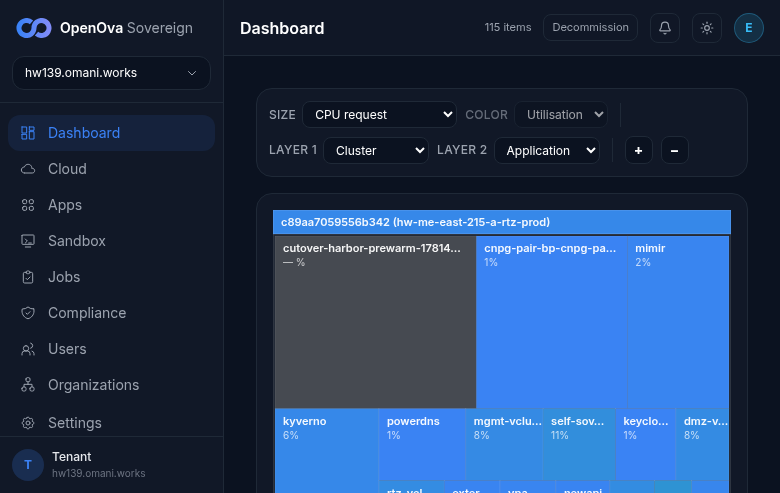
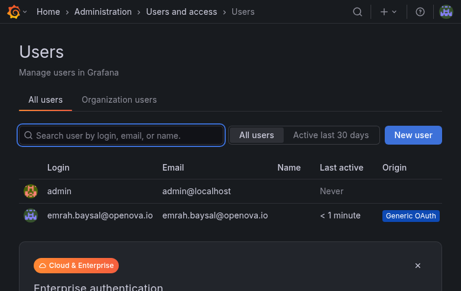
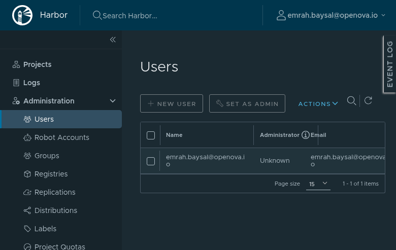
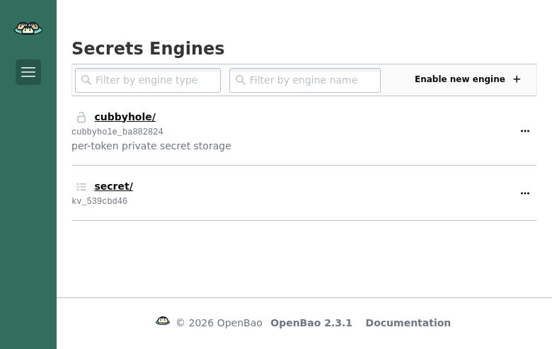
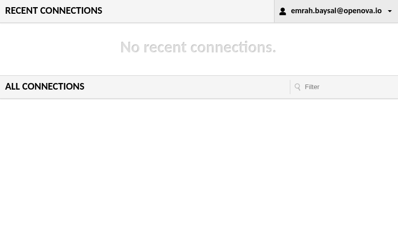
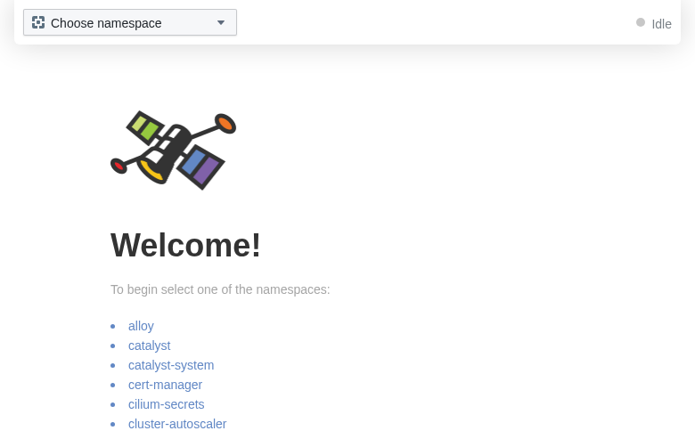
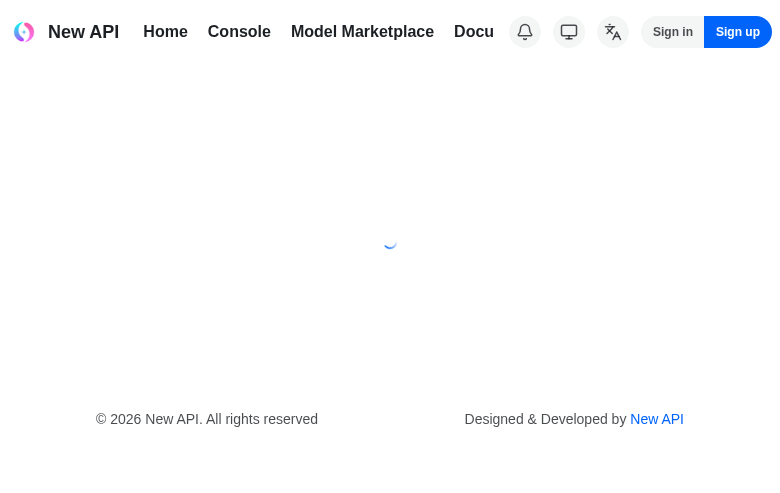
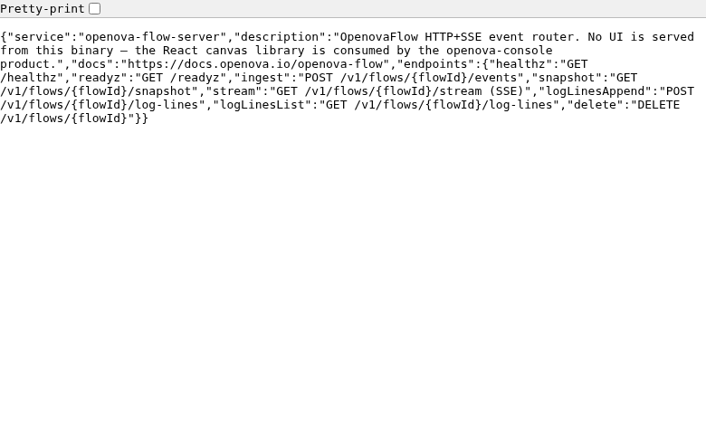

# #3374 SSO — user acceptance walk (web UI)

**Contract:** in a **fresh window**, open the app's bare URL → land **signed in** as the owner with **admin** rights. Zero clicks, no login / PIN / token form. A redirect that ends on a login screen, a setup wizard, a 404 / 500 / 503, or a blank "no healthy upstream" page is a **fail**. Where an app exposes an admin area, the second check is that the admin area is reachable as the same SSO identity.

> **🛑 POST-FIX RE-WALK 2026-06-15 (refresh) on the STILL-LIVE PROV `hw139.omani.works` (deployment `c89aa7059556b342`, off current `main`, catalyst-api `sha=9c6f864` / chart `1.4.95`).** This supersedes the earlier 2026-06-15 hw139 walk. The two SSO fixes that landed AFTER that walk were re-verified live: **pdns-admin** initContainer OIDC gate (#3547) and **newapi** seed rollout-restart + custom-OAuth provider seed (#3554, #3547). hw139-only — no carryover from any prior env. The env is converged: the console title reads **"✓ Sovereign ready — hw139.omani.works"**, the Apps page shows **49 deployments INSTALLED**, the dashboard treemap renders live cluster data. Sign-in was the standard handover JWT (`iss=console.openova.io`, `sub=emrah.baysal@openova.io`, `role=sovereign-admin`) → `https://console.hw139.omani.works/auth/handover?token=…`, which lands `/dashboard` signed-in. Every app below was then opened at its **bare public URL** in the same browser session. Fresh screenshots: `docs/sessions/2026-06-15/evidence/3374-hw139-refresh/`.
>
> **Verdict: 10 ✅ / 1 ❌ / 1 N/A (12 apps).** The two apps flagged for fix-verification:
> - **pdns-admin — ✅ FIXED (clean).** The bare URL lands zero-click on `/dashboard/` signed in with the full admin sidebar (Zone Management / **Administration**) — PowerDNS-Admin 0.4.2. The earlier hw133 `/oidc/login` HTTP 500 is gone; the #3547 initContainer OIDC gate took effect.
> - **newapi — ❌ STILL NOT LANDING SIGNED-IN, but a *different, advanced* failure mode.** The #3554/#3547 fixes **did** take effect — measured live, `/api/status` now reports **`setup=true`** (the `/setup` wizard is dead) and a seeded **`custom_oauth_providers:["sovereign"]`** ("OpenOva SSO") row. The bare URL now correctly fires the **zero-click OAuth flow** (no login form: KC silently brokers `kc_idp_hint=catalyst-pin` and returns a valid `code` to `/oauth/sovereign`). BUT the SPA callback dead-ends with a console error **"This OpenOva SSO account has already been bound"** and never establishes a session — `/console` still bounces to `/login?expired=true`, `localStorage.user` stays null. **Root cause (DB-confirmed):** the owner's FIRST SSO login on this env already succeeded — the live `newapi` DB shows user `sovereign_2` (`emrah.baysal@openova.io`, role=100) with a `user_oauth_bindings` row to the sovereign provider. On every SUBSEQUENT bare-URL visit NewAPI's SPA (holding a fresh `/api/oauth/state` cookie but no logged-in user) hits the **bind** code path, which rejects the already-bound identity instead of **logging into** the existing bound account. So the zero-click landing is **non-idempotent**: it lands once, then dead-ends — and "in a fresh window, type the URL, land signed-in" fails today. Improved from the earlier `/setup`/`setup=false`/`oidc_enabled=false` symptom, but not yet a ✅. Evidence: `11-newapi-already-bound-FAIL.png`, `newapi-db-binding.txt`, `newapi-api-status.txt`.

| Tested page | Description | Status | Evidence |
|---|---|---|---|
| [console.hw139.omani.works](https://console.hw139.omani.works/) | Handover → `/dashboard` signed-in as owner (avatar **E** top-right, `hw139.omani.works`); full operator/admin sidebar (Cloud, Apps, Sandbox, Jobs, Compliance, Users, Organizations, Settings) → admin | ✅ |  |
| [grafana.hw139.omani.works](https://grafana.hw139.omani.works/) + [/admin/users](https://grafana.hw139.omani.works/admin/users) | Bare URL lands on Home/Dashboards signed-in; `/admin/users` → Server Admin → "Users — Manage users in Grafana" (admin-only) with the user table | ✅ |  |
| [gitea.hw139.omani.works](https://gitea.hw139.omani.works/) + [/admin](https://gitea.hw139.omani.works/admin) | Bare URL → `emrah.baysal - Dashboard - Catalyst Gitea` signed-in; `/admin` → site Administration "Dashboard - Catalyst Gitea" — SSO user is site admin (the newer `/-/admin` route 404s on this Gitea 1.22.3; canonical `/admin` passes) | ✅ |  |
| [registry.hw139.omani.works](https://registry.hw139.omani.works/) + [/harbor/users](https://registry.hw139.omani.works/harbor/users) | Bare URL auto-redirects to `/harbor/projects` signed-in; `/harbor/users` → Administration → Users (full admin menu) with `emrah.baysal@openova.io` shown top-right | ✅ |  |
| [bao.hw139.omani.works/ui/](https://bao.hw139.omani.works/ui/) | Bare `/ui/` redirects to `/ui/vault/secrets` → Secrets Engines (cubbyhole/, secret/) — fully authenticated privileged token, no `/ui/vault/auth` login form (OpenBao 2.3.1) | ✅ |  |
| [auth.hw139.omani.works/admin/sovereign/console/](https://auth.hw139.omani.works/admin/sovereign/console/) | **Sovereign**-realm Keycloak admin console lands zero-click signed-in as `emrah.baysal@openova.io`, full realm-admin nav (Clients / Client scopes / Realm roles / Users / Groups / Sessions / Events / Realm settings / Authentication / Identity providers / User federation) | ✅ |  |
| [guacamole.hw139.omani.works](https://guacamole.hw139.omani.works/) | Bare URL completes the OIDC handshake (id_token in the landing URL: `iss=auth.hw139…/realms/sovereign`, `groups=[sovereign-admins,sovereign-viewers]`, `preferred_username=emrah.baysal@openova.io`) → Recent/All Connections home, signed-in as `emrah.baysal@openova.io` | ✅ |  |
| [pdns-admin.hw139.omani.works](https://pdns-admin.hw139.omani.works/) | **✅ FIXED (#3547)** — bare URL lands zero-click on `/dashboard/` signed-in with the admin sidebar (Zone Management / **Administration**); **not** the hw133 `/oidc/login` HTTP 500 (PowerDNS-Admin 0.4.2) | ✅ |  |
| [hubble.hw139.omani.works](https://hubble.hw139.omani.works/) | oauth2-proxy gate authenticates silently → Hubble UI "Welcome! select a namespace" with the live namespace list (alloy, catalyst, cnpg, gitea, harbor, keycloak, newapi, openbao, powerdns, sme, sso-bridge, shared-data …) | ✅ |  |
| [newapi.hw139.omani.works](https://newapi.hw139.omani.works/) | ❌ **STILL NOT LANDING (advanced failure).** #3554/#3547 took effect: `/api/status` now `setup=true` + seeded `custom_oauth_providers:["sovereign"]`, and the bare URL fires the **zero-click OAuth flow** (no login form; KC silent-brokers a valid `code` to `/oauth/sovereign`). BUT the SPA callback dead-ends with **"This OpenOva SSO account has already been bound"** and never establishes a session — `/console` → `/login?expired=true`. DB-confirmed root cause: the owner's first login already bound the identity to user `sovereign_2` (role=100); NewAPI's SPA then hits the *bind* path (rejects re-bind) instead of *logging in* the bound account → non-idempotent landing | ❌ |  |
| [openova-flow.hw139.omani.works](https://openova-flow.hw139.omani.works/) | N/A — the `openova-flow-server` binary serves **no UI by design** (its bare URL returns the service-descriptor JSON: "No UI is served from this binary — the React canvas library is consumed by the openova-console product"). HTTP 200 via the oidc-gate (a session-less curl gets a 302 to the KC authorize URL → gate works), healthy upstream. No standalone signed-in UI surface to land on | N/A |  |
| [marketplace.hw139.omani.works](https://marketplace.hw139.omani.works/) | Anonymous SME storefront renders ("Build your cloud tenant in under 5 minutes" → Get Started → /plans); no forced login before checkout — meets its own (anonymous-storefront) contract | ✅ |  |

**Result:** ✅ 10 / ❌ 1 / N/A 1 (12 apps) — READ-ONLY post-fix re-walk 2026-06-15 (refresh) on the still-live `hw139.omani.works` (deployment `c89aa7059556b342`, catalyst-api `sha=9c6f864`). **pdns-admin = clean ✅** (#3547 initContainer OIDC gate — lands `/dashboard/` signed-in, the hw133 `/oidc/login` 500 is gone). **newapi = ❌** but materially advanced by #3554/#3547: `setup=true` + provider seeded + the zero-click OAuth flow fires — it now dead-ends on a **"OpenOva SSO account already bound"** non-idempotent re-login defect rather than the old `/setup` wizard. The single genuine fail is newapi; openova-flow is N/A (backend event-router, no UI by design).

### Per-row detail

**✅ Passes (genuine zero-click signed-in admin):**
- **console.** Handover JWT → Dashboard treemap signed-in as owner (avatar **E**, `hw139.omani.works`); full operator/admin sidebar incl. Users / Organizations / Settings. The Apps page shows 49 INSTALLED and the title flips to "✓ Sovereign ready". Zero-click.
- **grafana + admin.** Bare URL → Home/Dashboards signed-in; `/admin/users` → Server Admin → "Users — Manage users in Grafana" (admin-only) with the user table. End-to-end SSO admin proven.
- **gitea + admin.** Bare URL → `emrah.baysal - Dashboard - Catalyst Gitea`; `/admin` → the site Administration panel (Maintenance Operations / System Status / Identity & Access / Configuration / Monitoring) — only a site admin sees this. (The newer `/-/admin` route 404s on this Gitea 1.22.3; the canonical `/admin` passes.)
- **harbor + users.** Bare URL auto-redirects to `/harbor/projects` signed-in; `/harbor/users` exposes the full Administration menu (Users / Robot Accounts / Registries / Configuration …) with `emrah.baysal@openova.io` in the user table.
- **openbao.** `/ui/` redirects to `/ui/vault/secrets` → Secrets Engines (cubbyhole/, secret/) — authenticated as a privileged token, no `/ui/vault/auth` login form.
- **keycloak (sovereign realm).** `/admin/sovereign/console/` lands zero-click on the **Sovereign**-realm admin console signed in as `emrah.baysal@openova.io`, full realm-admin controls. (See honesty note re: the literal `/admin` master console.)
- **guacamole.** Bare URL completes the OIDC handshake (id_token present in the landing URL, `groups=[sovereign-admins,sovereign-viewers]`, `preferred_username=emrah.baysal@openova.io`) → Recent/All Connections home, signed-in as `emrah.baysal@openova.io`. No Tomcat 404, no doubled callback.
- **pdns-admin.** **✅ FIXED (#3547).** Bare URL → `/dashboard/` signed-in with the admin sidebar (Zone Management / Administration); the hw133 `/oidc/login` HTTP 500 is gone (initContainer OIDC gate took effect). PowerDNS-Admin 0.4.2.
- **hubble.** oauth2-proxy gate authenticates silently → Hubble "Welcome! select a namespace" with the live namespace list. Hubble has no per-user auth of its own; a rendered, live-data UI behind the SSO gate = working.
- **marketplace.** Public SME storefront renders ("Build your cloud tenant in under 5 minutes" → Get Started → /plans); sign-in is deferred to checkout by design. Meets its own (anonymous-storefront) contract.

**❌ Fails:**
- **newapi.** **Advanced but still not landing signed-in.** #3554/#3547 took effect — live `/api/status` reports `setup=true` (the old `/setup` wizard is dead) and a seeded `custom_oauth_providers:["sovereign"]` ("OpenOva SSO") row; the bare URL fires the zero-click OAuth flow (no login form: KC silent-brokers `kc_idp_hint=catalyst-pin` and returns a valid `code` to `/oauth/sovereign`). BUT the SPA callback dead-ends with console error **"This OpenOva SSO account has already been bound"** and never mints a session — `/console` still → `/login?expired=true`, `localStorage.user` null. **DB-confirmed root cause:** the owner's first SSO login already succeeded and bound the identity — the live `newapi` DB shows user `sovereign_2` (`emrah.baysal@openova.io`, role=100) + a `user_oauth_bindings` row to the sovereign provider. On subsequent bare-URL visits NewAPI's SPA (fresh `/api/oauth/state` cookie, no logged-in user) hits the **bind** path, which rejects the already-bound identity rather than **logging into** the bound account. Non-idempotent: it lands once, then dead-ends — so a fresh window today does not land signed-in. (DB evidence: `newapi-db-binding.txt`; API evidence: `newapi-api-status.txt`.)

**N/A:**
- **openova-flow.** The `openova-flow-server` binary is a backend HTTP+SSE event router that serves **no UI** (it returns a JSON service descriptor at `/`). The actual flow UI is a React canvas consumed inside the console. There is no standalone per-app signed-in UI surface to land on; the upstream is healthy (HTTP 200 via the oidc-gate; a session-less curl gets a 302 to KC, proving the gate works).

**Honesty notes (caveats on otherwise-passing rows):**
- **keycloak `/admin` (master realm) shows a login form.** The literal bare `https://auth.hw139.omani.works/admin/` redirects to the **master**-realm `security-admin-console`, which presents a username/password "Sign in to Keycloak" form (the master realm is deliberately gated by Keycloak's own bootstrap admin and is **not** federated to the sovereign IdP). The SSO-relevant surface — the **Sovereign**-realm admin console at `/admin/sovereign/console/` — does land zero-click signed-in as `emrah.baysal@openova.io` with full realm-admin nav, which is what the ✅ row above records. Evidence for the master-realm login form: `docs/sessions/2026-06-15/evidence/3374-hw139/06-keycloak-admin-loginform.png`.
- **marketplace** is a public surface, not an SSO-gated admin app; its ✅ is "the funnel renders, no spurious pre-checkout login", not "signed-in as admin".
- **openova-flow / hubble / marketplace** are not per-app SSO admin consoles; they pass on their own respective contracts (authenticated upstream / live UI behind the gate / anonymous storefront) rather than a "signed-in as admin" landing.

### Verification method
- READ-ONLY. No `kubectl apply`, no chart changes, no env mutation (the one DB touch was a SELECT-only `psql` query to confirm the newapi binding state). Headless Playwright (Chromium) driven from `/home/openova/repos/ping`, single browser session seeded by the handover JWT.
- Each row was confirmed by an accessibility snapshot (not just the screenshot) showing the signed-in identity badge and/or the admin-only nav, plus the landed URL. The two fix-verification rows were additionally cross-checked against live state: **pdns-admin** lands `/dashboard/` (no 500); **newapi** was triple-checked — `/api/status` read directly (`setup=true`, `custom_oauth_providers:["sovereign"]`), the bare-URL OAuth flow observed firing to `/oauth/sovereign?code=…`, and the live `newapi` DB queried (`SELECT … FROM user_oauth_bindings JOIN users`) to confirm the pre-existing `sovereign_2` binding that drives the "already bound" dead-end.
