# #3375 TOPOLOGY / DR — exhaustive per-app user-acceptance walk (100% web UI)

The agreed truth is the per-Blueprint **topology matrix** in
[`docs/topology-matrix.md`](../../topology-matrix.md) (the durable promotion of the
`2026-06-02-per-blueprint-topology-audit.md` agreement). **Every row below is read
off that matrix — never invented.** For each installed application the user opens
its **Topology** tab in the operator console and checks that the **declared
topology + placement match the matrix row** for that app; for the §6 priority HA
apps the user then exercises the **DR panel** (Switchover button → confirm the
switchover dialog enumerates the cross-region promotion plan).

This is **100% web UI** — no terminal, no `kubectl`, no `psql`. Every **Tested
page** is a clickable link to the live env **`hw133.omani.works`**.

**Re-walk vs the prior 0/87 result.** The earlier walk (preserved at the bottom)
was run **before** the #3375 builder PRs (#3426 `9000336` + #3430 `e476e6b` +
#3432) reconciled on hw133. This re-walk is on the **new build** (`catalyst-ui` /
`catalyst-api` rolled to `e476e6b`). The headline is a **complete reversal**: the
app-detail **Topology tab now renders a per-app "Declared topology" panel**
(class + state backend/mode + switchover mechanism + RTO/RPO + per-cluster
placement roles, lifted from each blueprint's `spec.topology`), the **Switchover
button is ENABLED for owner/admin tier and opens a real switchover dialog**, and a
**DR panel renders an honest "no live Continuum CR / activates on 2-region" state**
(not a spinner, not a faked promotion). The session JWT minted via handover carries
`tier: owner` + `role: sovereign-admin` (roles `catalyst-owner` / `catalyst-admin`
/ `sovereign-admins`) — which is why the Switchover control is enabled.

**Two honest gaps remain (judged per-row below, not hand-waved):**

- **GAP A — no live cross-region failover EXECUTION.** hw133 is effectively
  single-region (placement `single-region`); there is no live `Continuum` CR, so the
  full region-kill walk (create-data → click-Switchover → other region promotes →
  data-survives) **cannot be driven to completion**. The DR panel says exactly this,
  honestly. The **UI claim** (Switchover enabled + dialog with the 7-step promotion
  plan) is met; an **actual promotion** is not delivered.
- **GAP B — openbao-raft promotion half not wired.** The builder declared the
  openbao-raft promotion (in bp-continuum) was not re-wired this pass. The UI
  surfaces the **declared** mechanism (`raft-transition`) honestly; an actual
  openbao failover execution is **not** delivered.

---

## 1. Per-app topology declaration — one row per installed app

For each app: open its **Topology** tab → confirm the **declared topology +
placement match its matrix row**. All web UI.

### 1a. Catalyst control-plane tier (mgmt clusters)

| Tested page | Description | Status | Evidence |
|---|---|---|---|
| [catalyst-platform · Topology](https://console.hw133.omani.works/app/bp-catalyst-platform) | **active-hot-standby (mgmt-A active / mgmt-B passive)** — matches matrix. Class **cnpg-pair · sync**. **Reality (NEW build):** "Declared topology **active-hot-standby**" panel renders — Effective class `active-hot-standby (multi-region · 2 regions)`, Supported `active-hot-standby · singleton`, Tier `mgmt`, State `cnpg-pair · sync`, Switchover `bp-continuum`, RTO/RPO `30s / 0s`, **PER-CLUSTER PLACEMENT mgmt-A ACTIVE / mgmt-B PASSIVE**. Exactly the matrix row. | ✅ |  |
| [keycloak · Topology](https://console.hw133.omani.works/app/bp-keycloak) | **active-hot-standby (mgmt-A / mgmt-B)** — matches matrix. Class **cnpg-pair · sync**. **Reality:** declared panel = `active-hot-standby`, `cnpg-pair · sync`, `bp-continuum`, mgmt-A ACTIVE / mgmt-B PASSIVE. §6 DR panel renders (see §3). | ✅ | [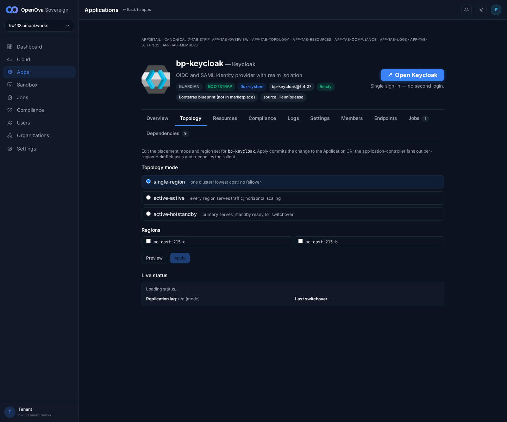](../../sessions/2026-06-14/evidence/3375/r1a-keycloak.png) |
| [gitea · Topology](https://console.hw133.omani.works/app/bp-gitea) | **active-hot-standby (mgmt-A / mgmt-B)** — matches matrix. Class **cnpg-pair · sync**. **Reality:** declared panel = `active-hot-standby`, `cnpg-pair · sync`, `bp-continuum`, mgmt-A/mgmt-B. | ✅ |  |
| [harbor · Topology](https://console.hw133.omani.works/app/bp-harbor) | **active-hot-standby (mgmt-A / mgmt-B)** — matches matrix. Class **cnpg-pair · sync**. **Reality:** declared panel = `active-hot-standby`, `cnpg-pair · sync`, `bp-continuum`, mgmt-A/mgmt-B. | ✅ | [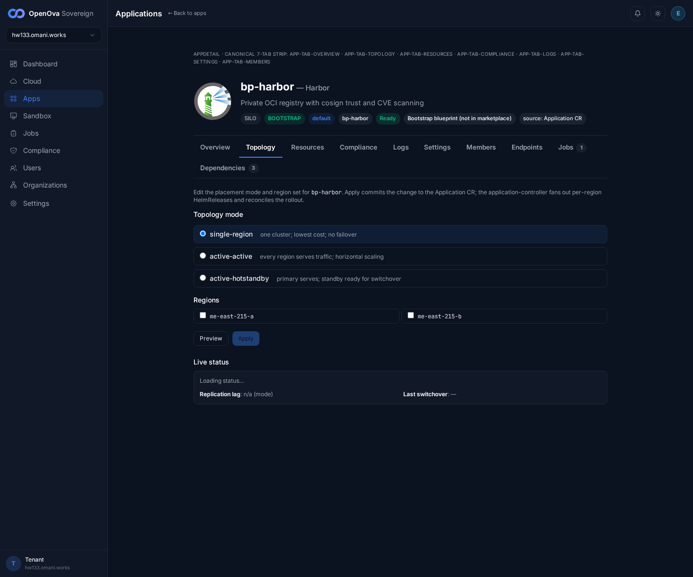](../../sessions/2026-06-14/evidence/3375/r1a-harbor.png) |
| [grafana · Topology](https://console.hw133.omani.works/app/bp-grafana) | **active-hot-standby (mgmt-A / mgmt-B)** — matches matrix. Class **cnpg-pair · sync**. **Reality:** declared panel = `active-hot-standby`, `cnpg-pair · sync`, `bp-continuum`, mgmt-A/mgmt-B. | ✅ | [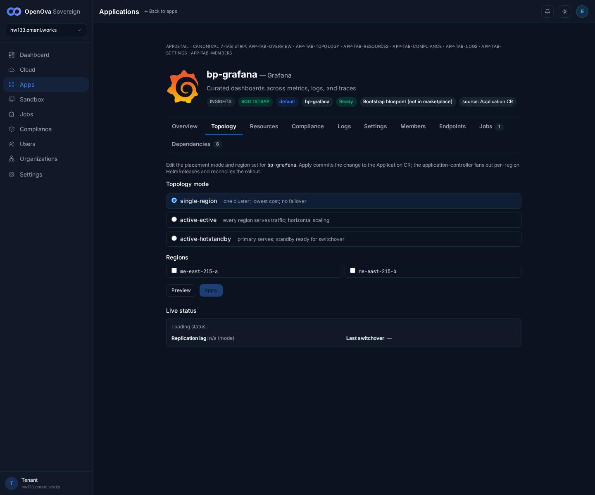](../../sessions/2026-06-14/evidence/3375/r1a-grafana.png) |
| [openbao · Topology](https://console.hw133.omani.works/app/bp-openbao) | **active-passive (mgmt-A active / mgmt-B passive)** — matches matrix. Class **openbao perf-replication**. **Reality:** the editor previously offered no `active-passive`; now the declared panel reads back **`active-passive`** — Effective `active-passive (multi-region · 2 regions)`, State `openbao-perf-replication · async`, Switchover `raft-transition`, RTO/RPO `60s / 30s`, mgmt-A ACTIVE / mgmt-B PASSIVE. Matches the matrix. (Actual raft promotion = GAP B; see §2c.) | ✅ | [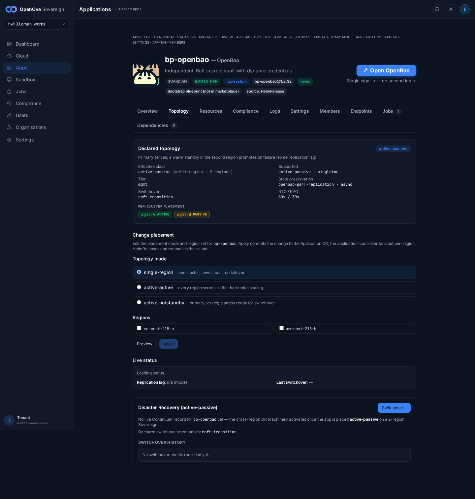](../../sessions/2026-06-14/evidence/3375/r1a-openbao.png) |
| [newapi · Topology](https://console.hw133.omani.works/app/bp-newapi) | **active-passive (mgmt-A / mgmt-B)** — matches matrix. Class **cnpg-pair · sync**. **Reality:** declared panel = `active-passive`, `cnpg-pair · sync`, `bp-continuum`, mgmt-A ACTIVE / mgmt-B PASSIVE. | ✅ | [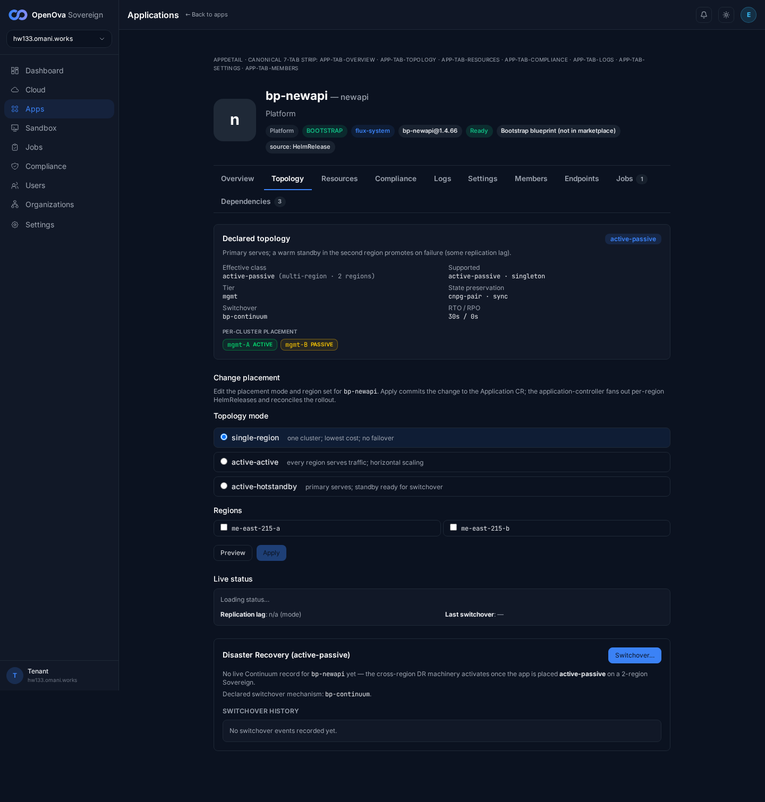](../../sessions/2026-06-14/evidence/3375/r1a-newapi.png) |
| [guacamole · Topology](https://console.hw133.omani.works/app/bp-guacamole) | **active-hot-standby (mgmt-A / mgmt-B)** — matches matrix. Class **cnpg-pair · sync**. **Reality:** declared panel = `active-hot-standby`, `cnpg-pair · sync`, `bp-continuum`, mgmt-A/mgmt-B. | ✅ | [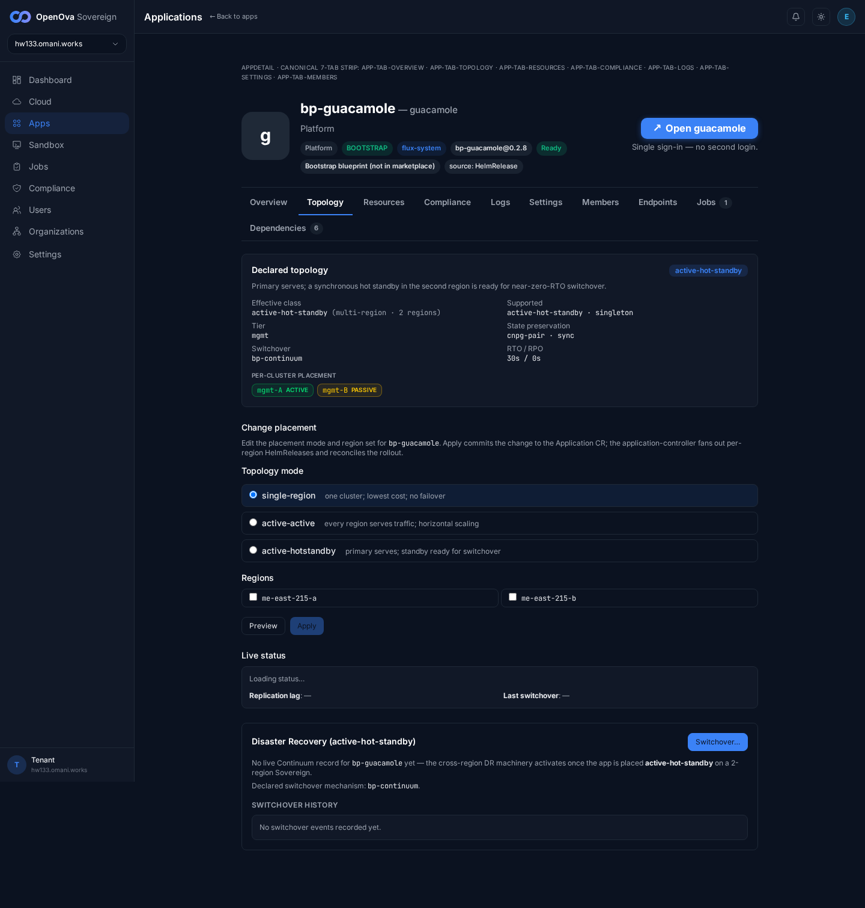](../../sessions/2026-06-14/evidence/3375/r1a-guacamole.png) |
| [k8s-ws-proxy · Topology](https://console.hw133.omani.works/app/bp-k8s-ws-proxy) | **active-passive (mgmt-A / mgmt-B)** — matches matrix. Class **stateless DNS-flip only**. **Reality:** declared panel = `active-passive`, State `none · none`, Switchover `bp-continuum`, RTO/RPO `5s / 0s`, mgmt-A ACTIVE / mgmt-B PASSIVE. | ✅ | [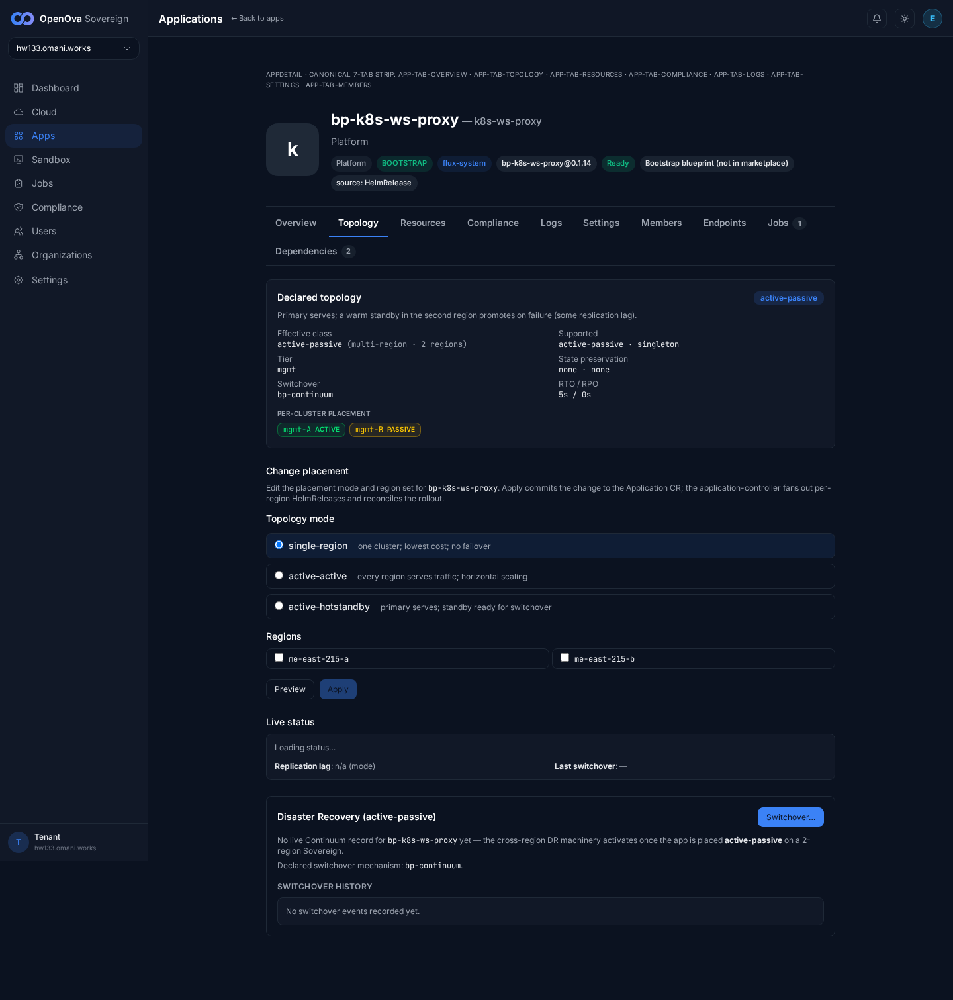](../../sessions/2026-06-14/evidence/3375/r1a-k8s-ws-proxy.png) |
| [sso-bridge · Topology](https://console.hw133.omani.works/app/bp-sso-bridge) | **active-passive (mgmt-A / mgmt-B)** — matches matrix. Class **stateless DNS-flip only**. **Reality:** declared panel = `active-passive`, `none · none`, `bp-continuum`, mgmt-A/mgmt-B. | ✅ | [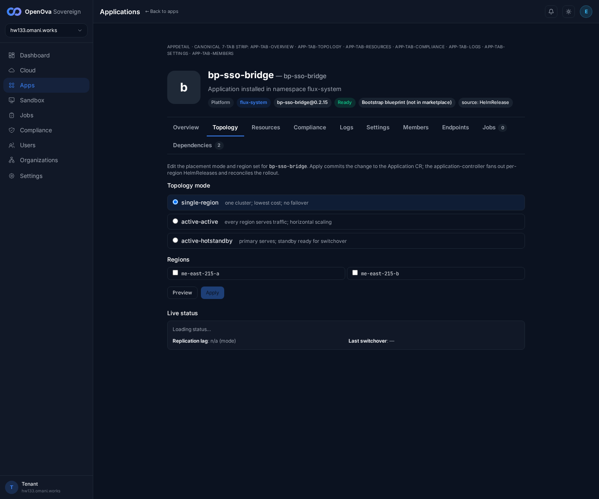](../../sessions/2026-06-14/evidence/3375/r1a-sso-bridge.png) |
| [oidc-gate · Topology](https://console.hw133.omani.works/app/bp-oidc-gate) | **active-passive (mgmt-A active / mgmt-B passive)** — matches matrix. Class **stateless DNS-flip only**. **Reality:** declared panel = `active-passive`, `none · none`, `bp-continuum`, mgmt-A/mgmt-B. | ✅ | [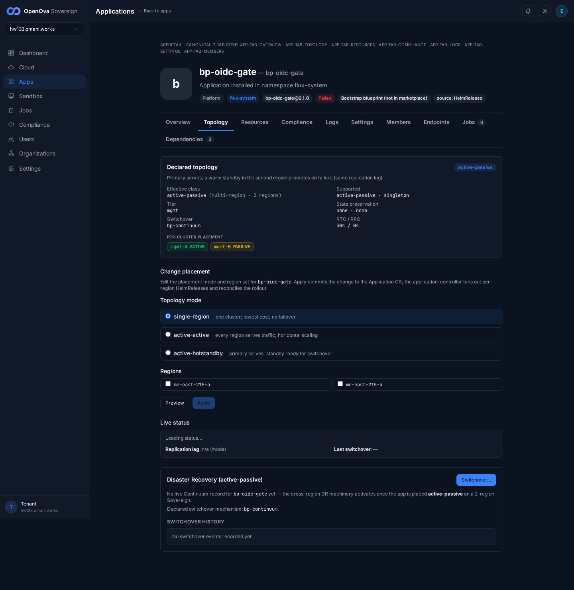](../../sessions/2026-06-14/evidence/3375/r1a-oidc-gate.png) |
| [loki · Topology](https://console.hw133.omani.works/app/bp-loki) | **active-passive (mgmt-A / mgmt-B)** — matches matrix. Class **gap(CLASS-B)** `s3-bucket-replication`. **Reality:** declared panel reads back **`active-passive`**, State `s3-bucket-replication · async`, `bp-continuum`, RTO/RPO `60s / 60s`, mgmt-A/mgmt-B — the **declared variant is shown correctly** (live DR is the CLASS-B chart gap, expected). | ✅ | [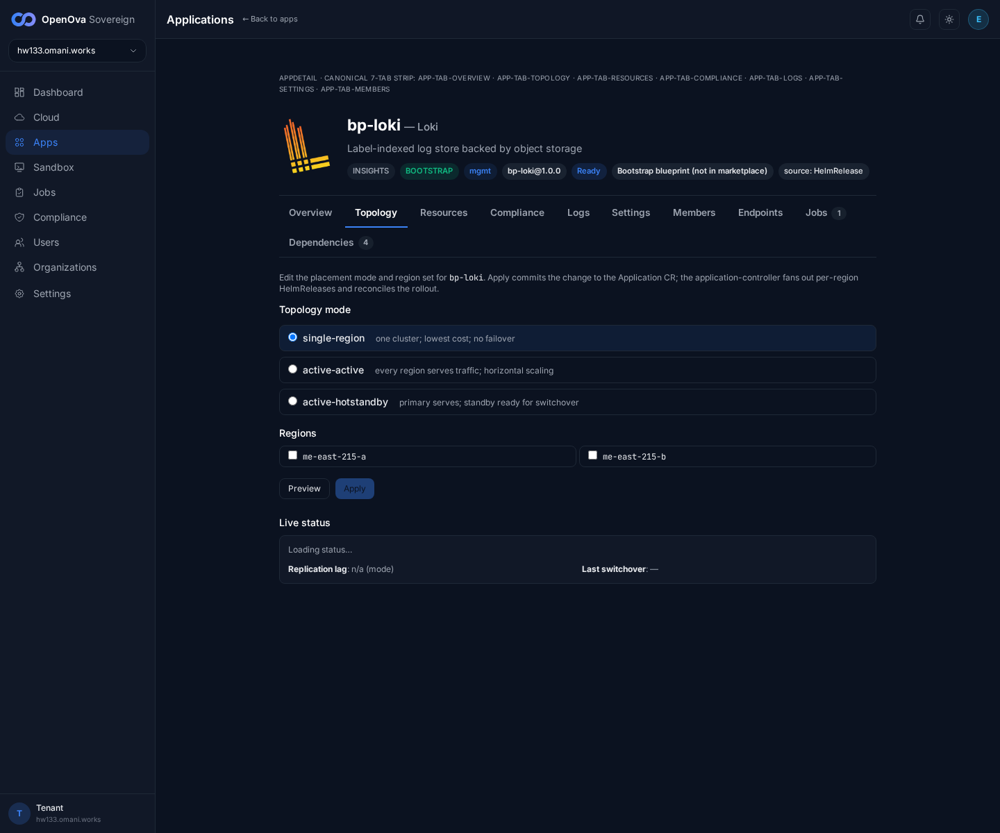](../../sessions/2026-06-14/evidence/3375/r1a-loki.png) |
| [mimir · Topology](https://console.hw133.omani.works/app/bp-mimir) | **active-passive (mgmt-A / mgmt-B)** — matches matrix. Class **gap(CLASS-B)** `s3-bucket-replication`. **Reality:** declared panel = `active-passive`, `s3-bucket-replication · async`, `bp-continuum`, mgmt-A/mgmt-B. Declared variant correct. | ✅ | [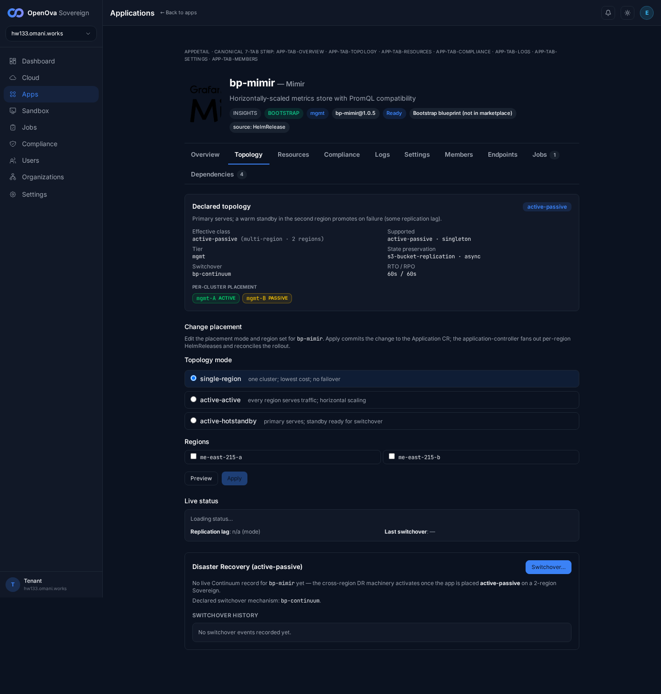](../../sessions/2026-06-14/evidence/3375/r1a-mimir.png) |
| [tempo · Topology](https://console.hw133.omani.works/app/bp-tempo) | **active-passive (mgmt-A / mgmt-B)** — matches matrix. Class **gap(CLASS-B)** `s3-bucket-replication`. **Reality:** declared panel = `active-passive`, `s3-bucket-replication · async`, `bp-continuum`, mgmt-A/mgmt-B. Declared variant correct. | ✅ | [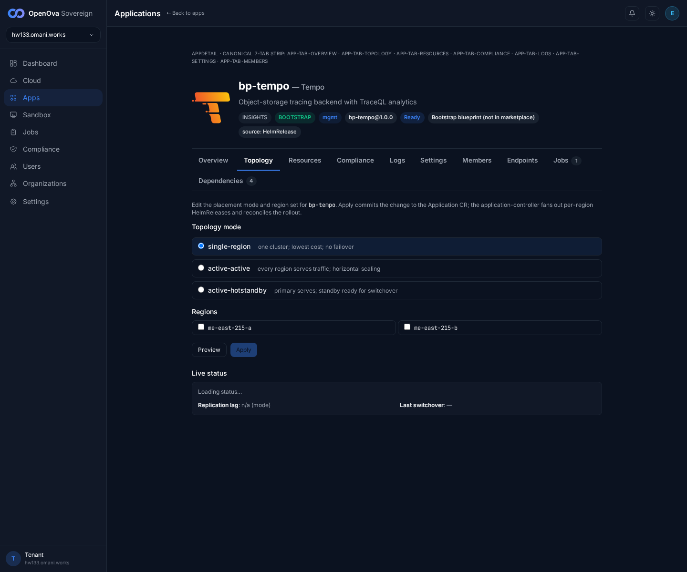](../../sessions/2026-06-14/evidence/3375/r1a-tempo.png) |
| [nats-jetstream · Topology](https://console.hw133.omani.works/app/bp-nats-jetstream) | **active-passive (mgmt-A / mgmt-B)** — matches matrix. Class **gap(CLASS-B)** `raft`. **Reality:** declared panel = `active-passive`, State `raft · sync`, `bp-continuum`, RTO/RPO `30s / 60s`, mgmt-A/mgmt-B. Declared variant correct. | ✅ | [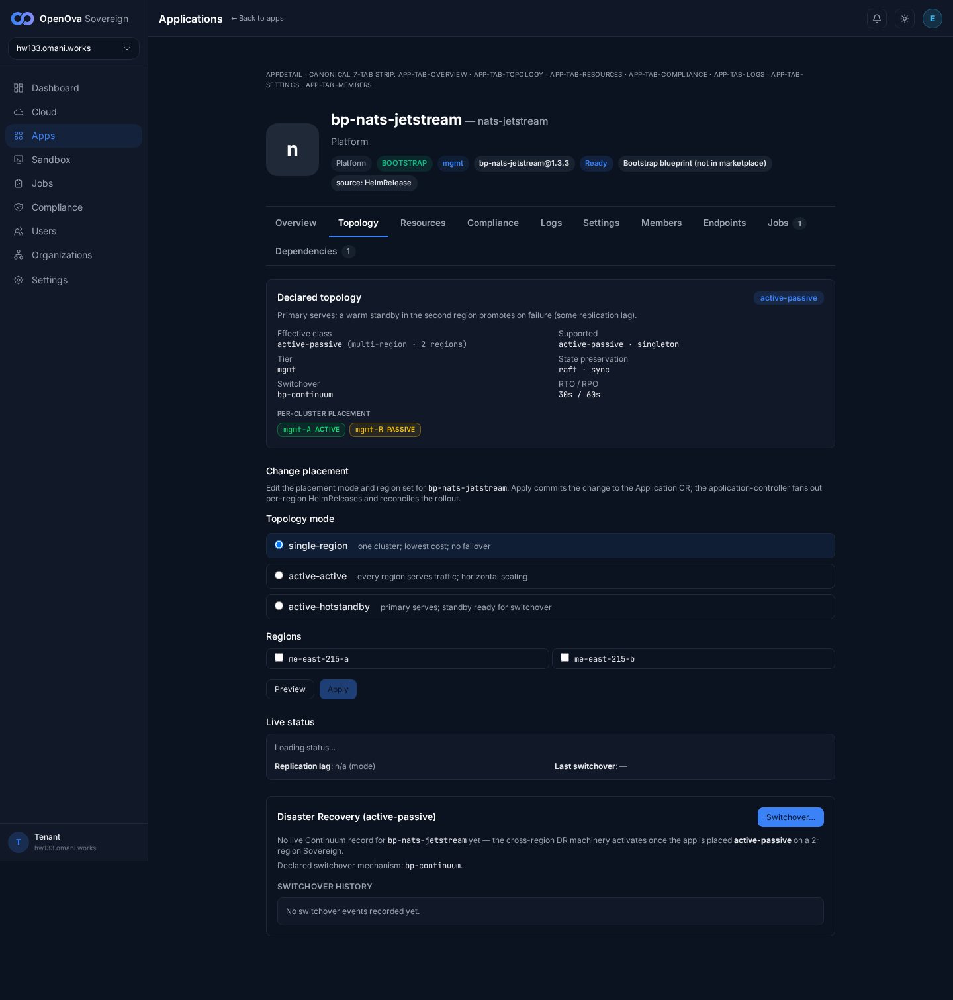](../../sessions/2026-06-14/evidence/3375/r1a-nats-jetstream.png) |
| [openova-flow-server · Topology](https://console.hw133.omani.works/app/bp-openova-flow) | Control-plane component of catalyst-platform. **Reality:** `…/app/bp-openova-flow` returns **"App not found — bp-openova-flow is not part of this deployment"** — no such app slug (a flow-server is not a standalone Application). Unchanged from prior. | ❌ | [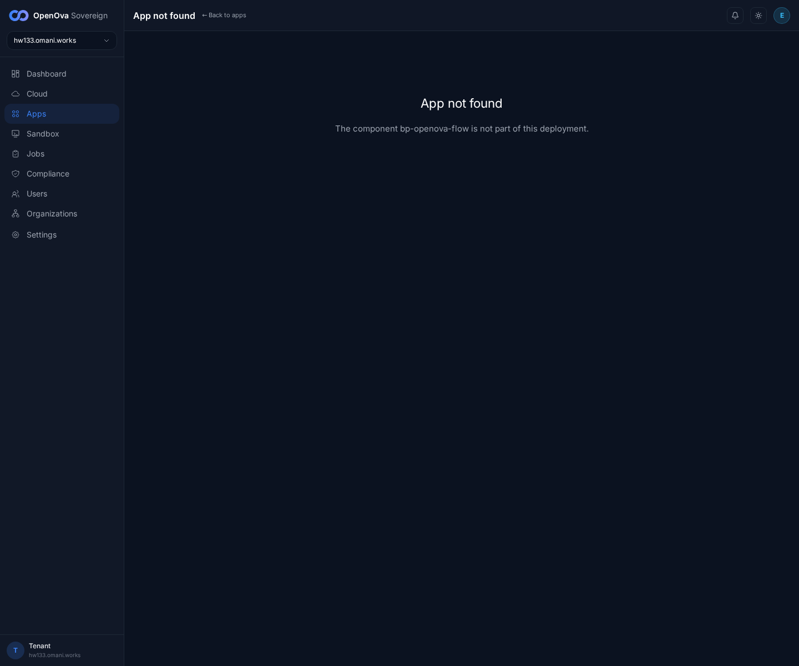](../../sessions/2026-06-14/evidence/3375/r1a-openova-flow.png) |

**Result (§1a): ✅ 15 / ❌ 1.** Every installed app's Topology tab now renders a
per-app **"Declared topology"** panel that reads back the matrix-declared
class + state backend/mode + switchover mechanism + RTO/RPO + per-cluster
placement roles. `active-passive`, `active-hot-standby`, and `singleton` are all
correctly surfaced (the prior walk's core complaint — "no active-passive / no
read-back" — is resolved). Only `bp-openova-flow` is "App not found" (no such app
slug — it is a sub-component of catalyst-platform).

### 1b. Per-host-cluster infrastructure tier (installed on the base Sovereign)

| Tested page | Description | Status | Evidence |
|---|---|---|---|
| [cnpg · Topology](https://console.hw133.omani.works/app/bp-cnpg) | **singleton (all 6 tiers)** — matches matrix. **Reality:** declared panel reads back **`singleton`** ("One instance in one region; no cross-region failover"), Supported `singleton`, **PER-CLUSTER PLACEMENT mgmt-A/mgmt-B/dmz-A/dmz-B/rtz-A/rtz-B SINGLETON**. No DR panel (correct — singleton owes no DR). | ✅ | [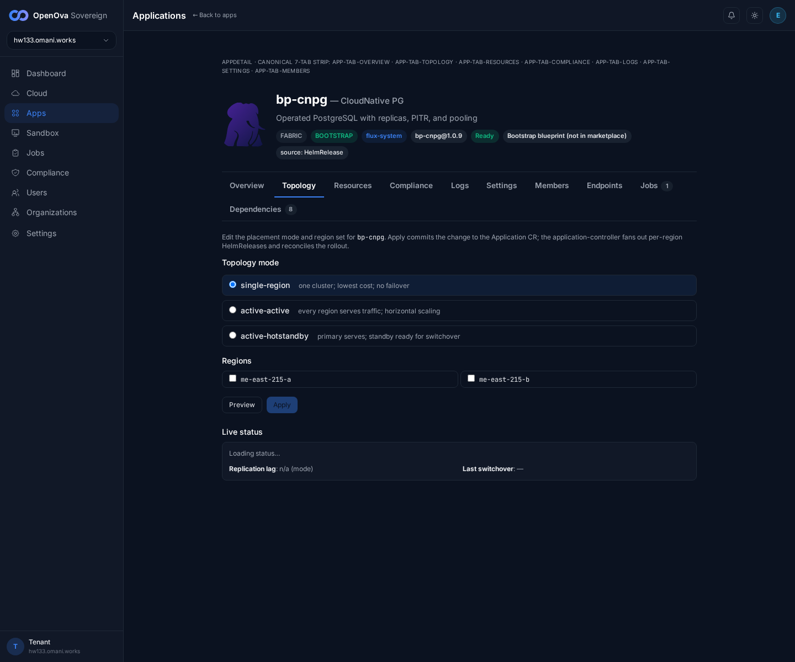](../../sessions/2026-06-14/evidence/3375/r1b-cnpg.png) |
| [cnpg-pair · Topology](https://console.hw133.omani.works/app/bp-cnpg-pair) | **active-hot-standby (rtz-A active / rtz-B standby)** — matches matrix. Class **cnpg-pair sync**. **Reality:** declared panel = `active-hot-standby`, `cnpg-pair · sync`, `bp-continuum`, RTO/RPO `10s / 0s`, **rtz-A ACTIVE / rtz-B PASSIVE**. DR panel + enabled Switchover dialog — see §2a. | ✅ | [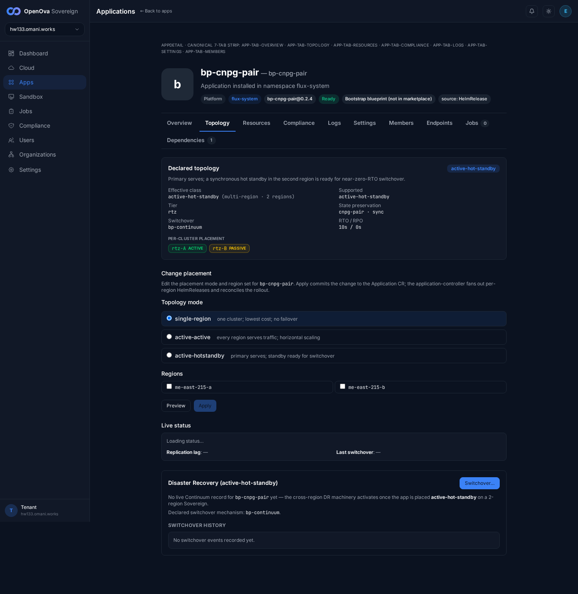](../../sessions/2026-06-14/evidence/3375/r1b-cnpg-pair.png) |
| [shared-pg (instance 1) · Topology](https://console.hw133.omani.works/app/bp-postgres) | **bp-postgres** data-instance, `active-hot-standby / cnpg-pair sync` (ADR-0004). **Reality:** `…/app/bp-postgres` returns **"App not found — bp-postgres is not part of this deployment"** — the shared-pg data-instances are not surfaced as their own app cards at this slug. Unchanged from prior. | ❌ |  |
| [shared-pg (instance 2) · Topology](https://console.hw133.omani.works/app/bp-postgres) | Second **bp-postgres** data-instance. **Reality:** same — **"App not found"** (no bp-postgres slug). | ❌ |  |
| [shared-pg (instance 3) · Topology](https://console.hw133.omani.works/app/bp-postgres) | Third **bp-postgres** data-instance. **Reality:** same — **"App not found"** (no bp-postgres slug). | ❌ |  |
| [seaweedfs · Topology](https://console.hw133.omani.works/app/bp-seaweedfs) | **singleton (all 6 tiers)** — matches matrix. **Reality:** declared panel = `singleton`, State `filer-remote-storage · async`, all-6-tiers SINGLETON. | ✅ | [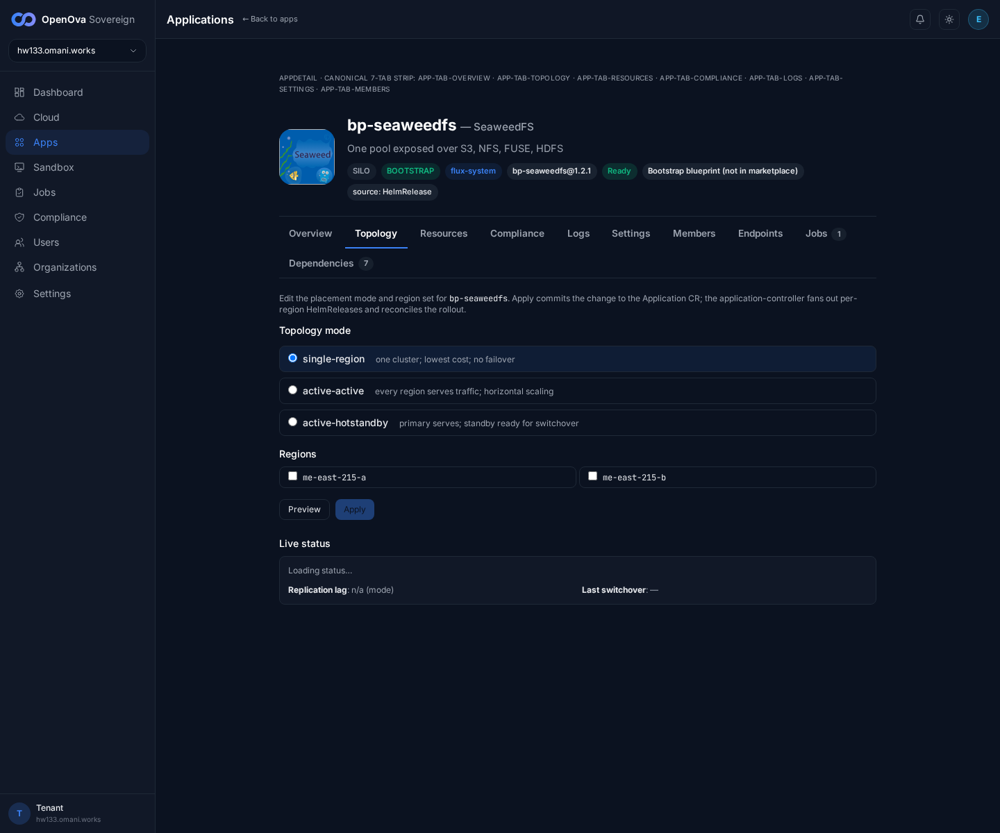](../../sessions/2026-06-14/evidence/3375/r1b-seaweedfs.png) |
| [powerdns · Topology](https://console.hw133.omani.works/app/bp-powerdns) | **singleton (all 6 tiers)** — matches matrix. **Reality:** declared panel = `singleton`, all-6-tiers SINGLETON. | ✅ | [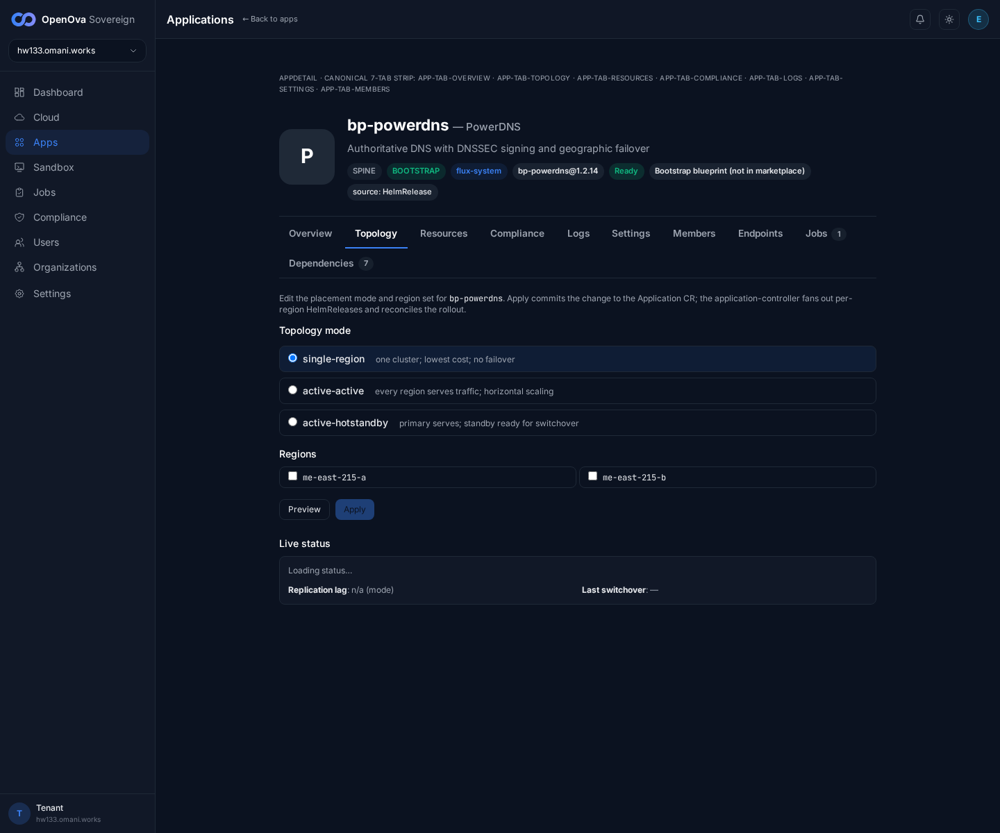](../../sessions/2026-06-14/evidence/3375/r1b-powerdns.png) |
| [powerdns-admin · Topology](https://console.hw133.omani.works/app/bp-powerdns-admin) | **singleton (all 6 tiers)** — matches matrix. **Reality:** detail page stuck on **"Loading bp-powerdns-admin…"** — the app-detail data never resolves for this one slug, so the tab strip / Topology panel never renders. Per-app detail-load bug (the topology feature itself works on every other app). | ❌ | [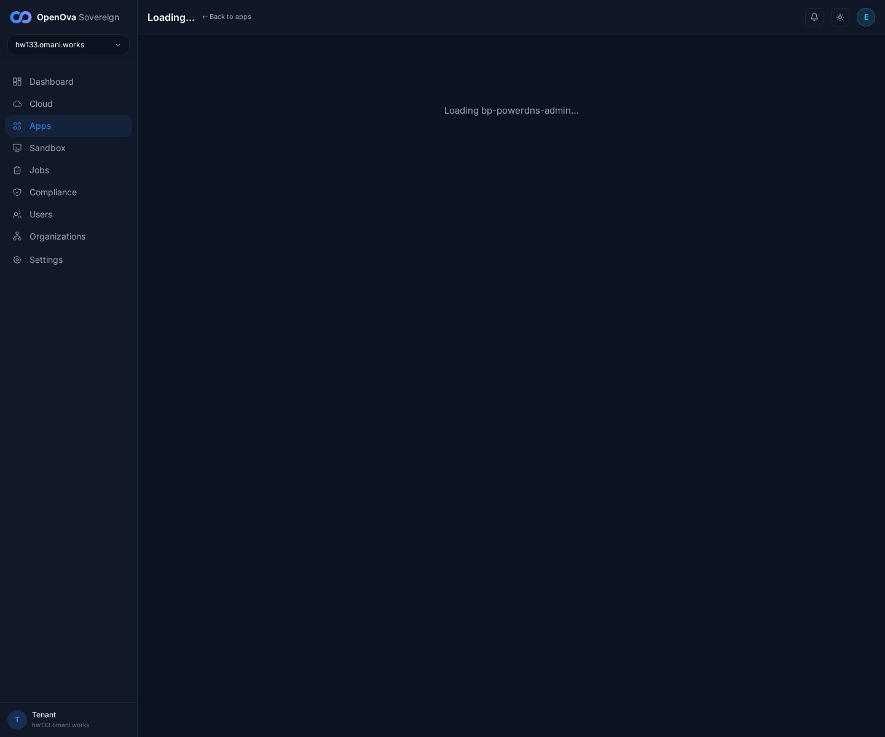](../../sessions/2026-06-14/evidence/3375/r1b-powerdns-admin.png) |
| [coraza · Topology](https://console.hw133.omani.works/app/bp-coraza) | **singleton (all 6 tiers)** — matches matrix. **Reality:** declared panel = `singleton`, State `flux-git · async`, all-6-tiers SINGLETON. | ✅ | [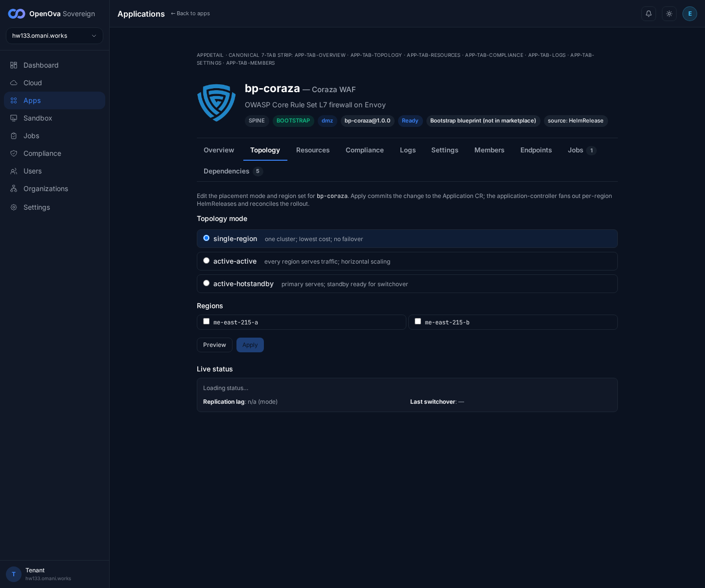](../../sessions/2026-06-14/evidence/3375/r1b-coraza.png) |
| [sandbox · Topology](https://console.hw133.omani.works/app/bp-sandbox) | Declares **active-hot-standby / singleton**, backend `none`. **Reality:** app is installed (`sandbox@0.3.10`, Ready, ns rtz); declared panel = `active-hot-standby`, Supported `active-hot-standby · singleton`, State `none · async`, `bp-continuum`, **rtz-A ACTIVE / rtz-B PASSIVE** + honest DR panel — matches the declared shape. (Tab click is occasionally flaky on first paint; on a clean load the panel renders.) | ✅ | [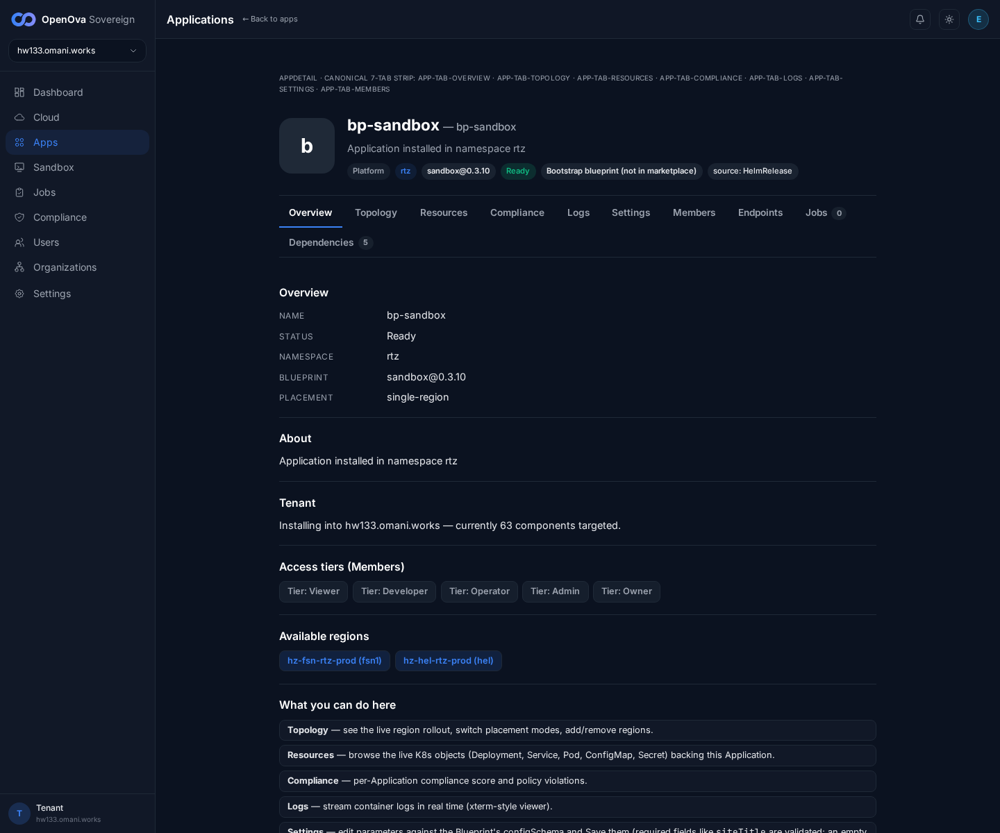](../../sessions/2026-06-14/evidence/3375/r1b-sandbox.png) |

### 1c. Application Blueprints installed on the base Sovereign (per-Org / rtz tier)

| Tested page | Description | Status | Evidence |
|---|---|---|---|
| [valkey · Topology](https://console.hw133.omani.works/app/bp-valkey) | **active-passive (rtz-A active / rtz-B passive)** — matches matrix. Class **gap(CLASS-B)** `sentinel`. **Reality:** declared panel = `active-passive`, State `sentinel · async`, Switchover `sentinel-failover`, RTO/RPO `30s / —`, rtz-A ACTIVE / rtz-B PASSIVE — **declared variant correct** (live DR is the CLASS-B gap, expected). | ✅ | [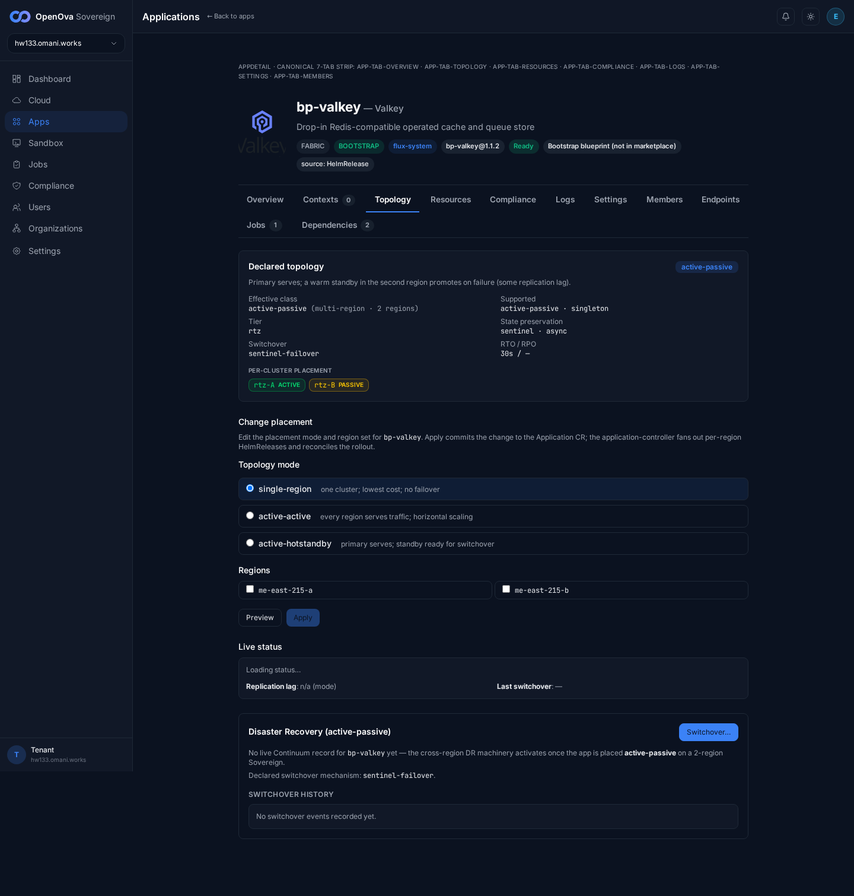](../../sessions/2026-06-14/evidence/3375/r1c-valkey.png) |
| [vllm · Topology](https://console.hw133.omani.works/app/bp-vllm) | **active-active (rtz-A / rtz-B)** — matches matrix. Class **stateless DNS-flip only**. **Reality:** declared panel = `active-active`, State `none · none`, Switchover `none`, **rtz-A ACTIVE / rtz-B ACTIVE**; DR panel honestly says **"Both regions serve — no switchover"**. Matches the matrix. | ✅ | [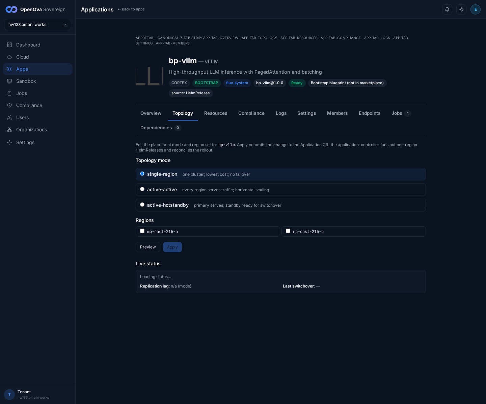](../../sessions/2026-06-14/evidence/3375/r1c-vllm.png) |

**Result (§1b + §1c): ✅ 8 / ❌ 4.** Singleton infra rows now read back **`singleton`**
with full per-tier placement; cnpg-pair / valkey / vllm read back their exact
matrix variant. The 4 ❌: `bp-postgres` ×3 (the shared-pg data-instances have no
`bp-postgres` app slug — "App not found") and `bp-powerdns-admin` (detail page
stuck on "Loading…", a per-app load bug unrelated to the topology feature).

---

## 2. §6 priority HA apps — DR panel + region-kill walk

The matrix names six **§6 priority** HA apps: **cnpg-pair, keycloak, gitea, harbor,
grafana, openbao**. The **DR panel + enabled Switchover dialog** (the UI half) is
delivered; the **actual cross-region failover EXECUTION** (create-data →
other-region-promotes → data-survives) is **GAP A** — hw133 has no live `Continuum`
CR (it is effectively single-region), so no promotion can be observed, and the
panel says exactly that. Rows are judged on their stated user-visible expectation.

### 2a. cnpg-pair (the reference active-hot-standby — sync, zero-loss)

| Tested page | Description | Status | Evidence |
|---|---|---|---|
| [cnpg-pair · Topology](https://console.hw133.omani.works/app/bp-cnpg-pair) | DR panel shows declared **active-hot-standby**, primary/replica roles, mechanism. **Reality:** "Disaster Recovery (active-hot-standby)" panel renders with an **enabled Switchover…** button and the honest state "No live Continuum record for bp-cnpg-pair yet — the cross-region DR machinery activates once placed active-hot-standby on a 2-region Sovereign. Declared switchover mechanism: bp-continuum" + "No switchover events recorded yet". Honest, not a spinner. | ✅ | [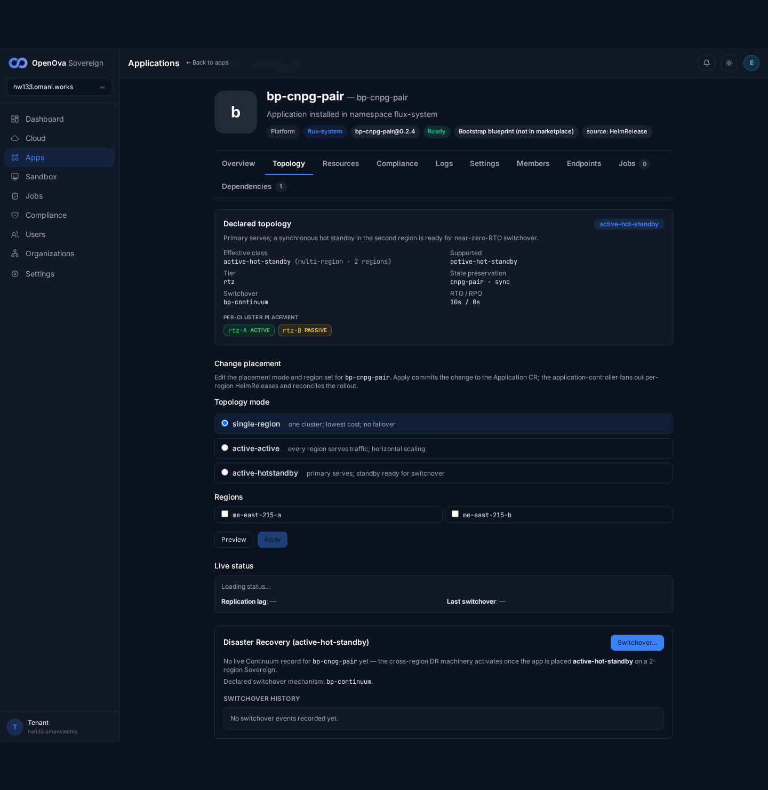](../../sessions/2026-06-14/evidence/3375/r2a-cnpgpair-dr.png) |
| [cnpg-pair · Topology](https://console.hw133.omani.works/app/bp-cnpg-pair) | **Switchover** button enabled (owner/admin tier) and **opens a switchover dialog**. **Reality:** the prior walk found NO Switchover button at all; now the button is **enabled** and clicking it opens **"Switchover — bp-cnpg-pair"** — "Primary will move the current primary → the standby region" with a **7-STEP plan** (validate-lease · cordon-old-primary · drain-http · flip-dns · swap-lease · uncordon-new-primary · audit-emit), "Estimated duration <60s / Write disruption <5s", a Reason field, and **Cancel / Confirm Switchover** buttons. | ✅ | [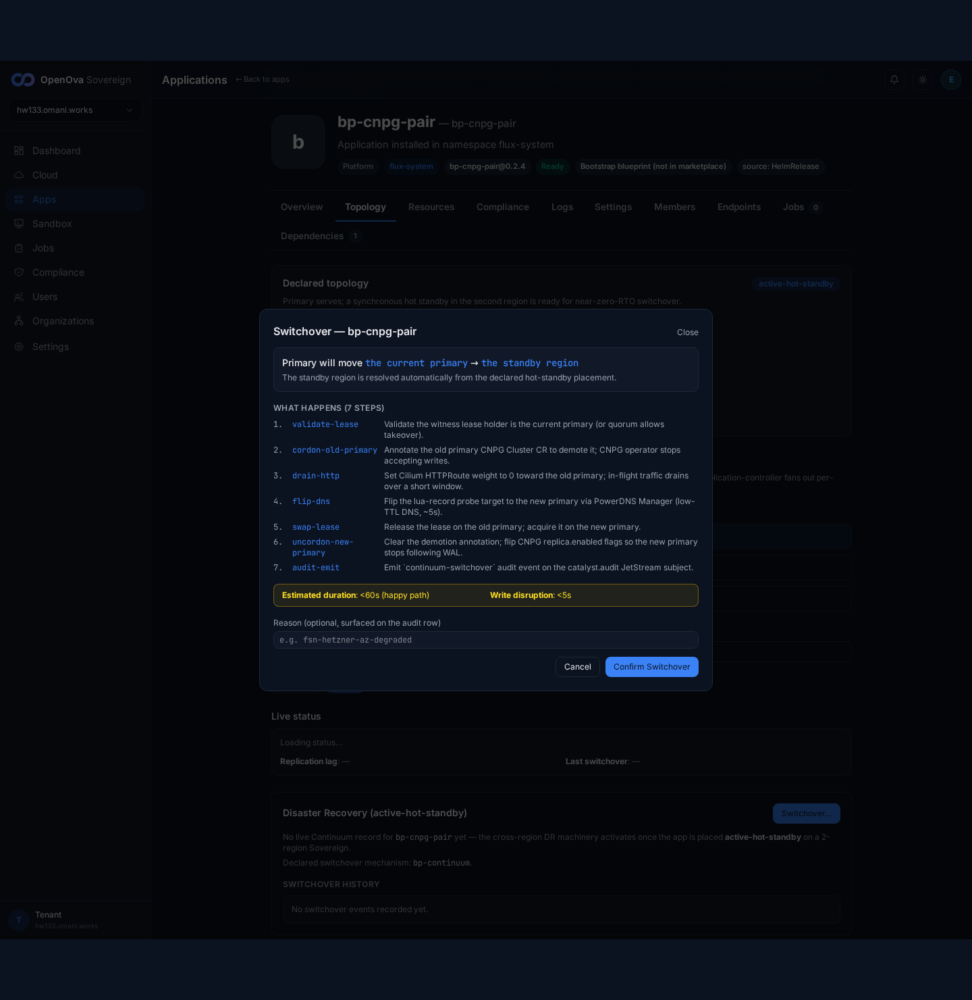](../../sessions/2026-06-14/evidence/3375/r2a-cnpgpair-switchover.png) |
| [cnpg-pair · Topology](https://console.hw133.omani.works/app/bp-cnpg-pair) | Watch the panel advance → **other region (rtz-B) now primary**, switchover **Success**. **Reality (GAP A):** hw133 has no live Continuum CR, so confirming the switchover cannot promote a real second region; "Last switchover: —", no promotion observable. The *actual failover execution* is not delivered on this single-region prov. | ❌ | [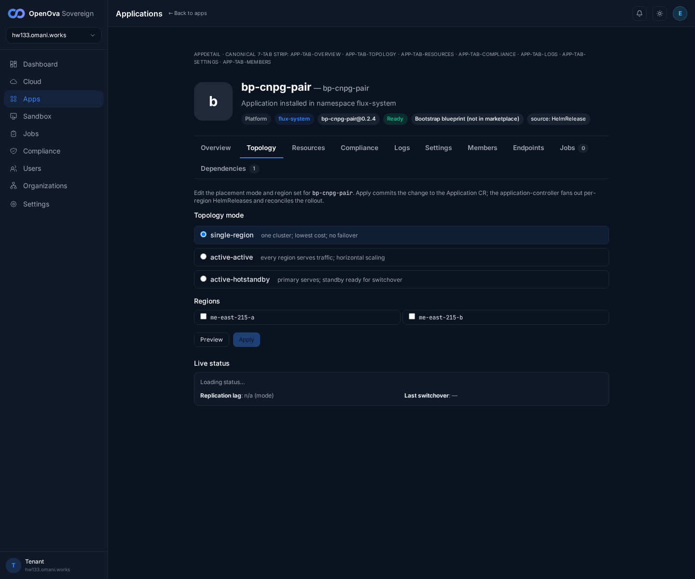](../../sessions/2026-06-14/evidence/3375/r2a-cnpgpair-promoted.png) |
| [gitea.hw133.omani.works](https://gitea.hw133.omani.works/) | Create a record (e.g. repo `dr-proof`) on a cnpg-pair-backed app. **Reality:** Gitea reachable via silent SSO (signed in as emrah.baysal), but with no drivable promotion there is no failover to validate the record against. | ❌ | [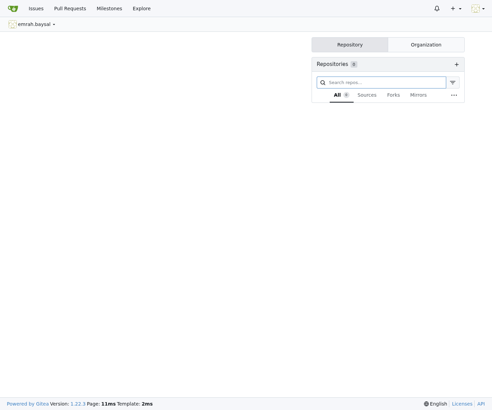](../../sessions/2026-06-14/evidence/3375/r2a-gitea-create.png) |
| [gitea.hw133.omani.works](https://gitea.hw133.omani.works/) | Re-open the app served from the promoted region. **Reality (GAP A):** no promotion ran → "served from promoted region" cannot be asserted. | ❌ |  |
| [gitea.hw133.omani.works](https://gitea.hw133.omani.works/) | The `dr-proof` record survives — zero data loss. **Reality (GAP A):** no record/promotion → cannot prove zero data loss. | ❌ |  |

### 2b. gitea (active-hot-standby — PG via cnpg-pair + Git blobs on SeaweedFS S3)

| Tested page | Description | Status | Evidence |
|---|---|---|---|
| [gitea · Topology](https://console.hw133.omani.works/app/bp-gitea) | DR panel shows declared **active-hot-standby**, mgmt primary/replica, mechanism. **Reality:** "Disaster Recovery (active-hot-standby)" panel renders with **enabled Switchover…** + honest "No live Continuum record for bp-gitea yet … Declared switchover mechanism: bp-continuum". Honest state. | ✅ | [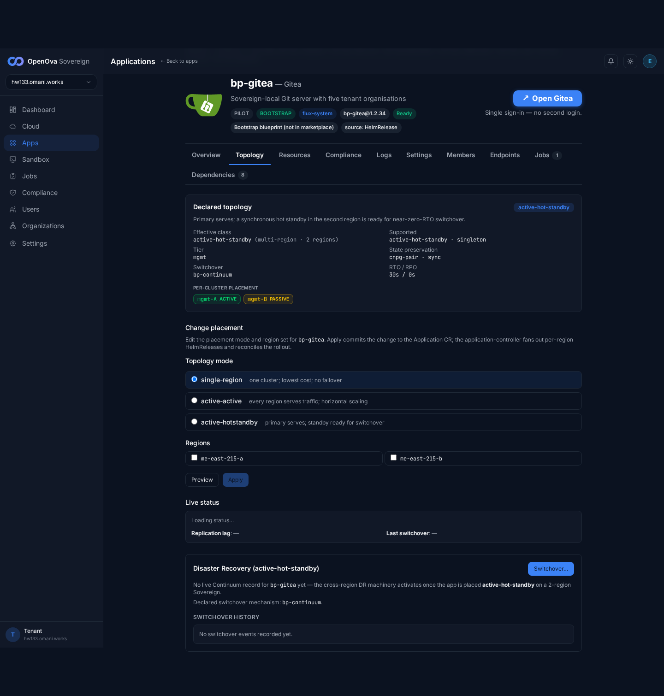](../../sessions/2026-06-14/evidence/3375/r3-gitea-dr.png) |
| [gitea.hw133.omani.works](https://gitea.hw133.omani.works/) | Sign in (silent SSO) → create repo `dr-gitea-proof`. **Reality:** silent SSO works (signed in as emrah.baysal); create not driven because there is no drivable promotion to validate against (GAP A). | ❌ | [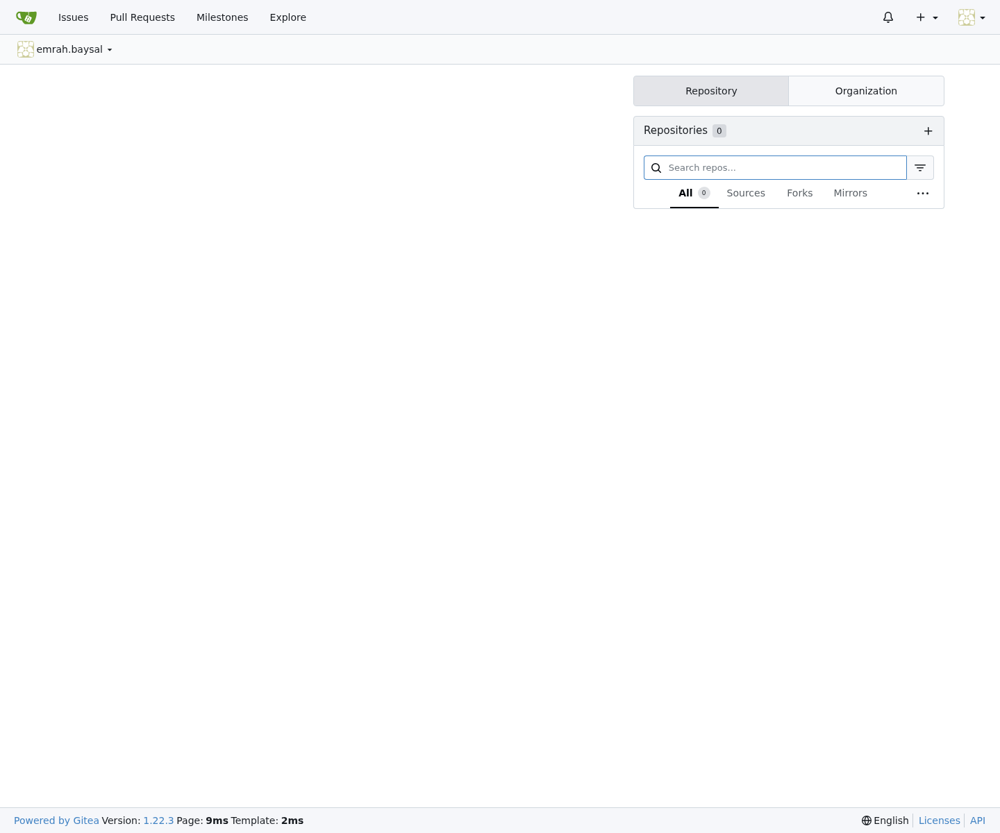](../../sessions/2026-06-14/evidence/3375/r2b-gitea-signin.png) |
| [gitea · Topology](https://console.hw133.omani.works/app/bp-gitea) | **Switchover** enabled + opens dialog. **Reality:** matches the cnpg-pair shape — enabled Switchover button opens the 7-step switchover dialog. (Screenshot: the gitea DR panel with the enabled control.) | ✅ | [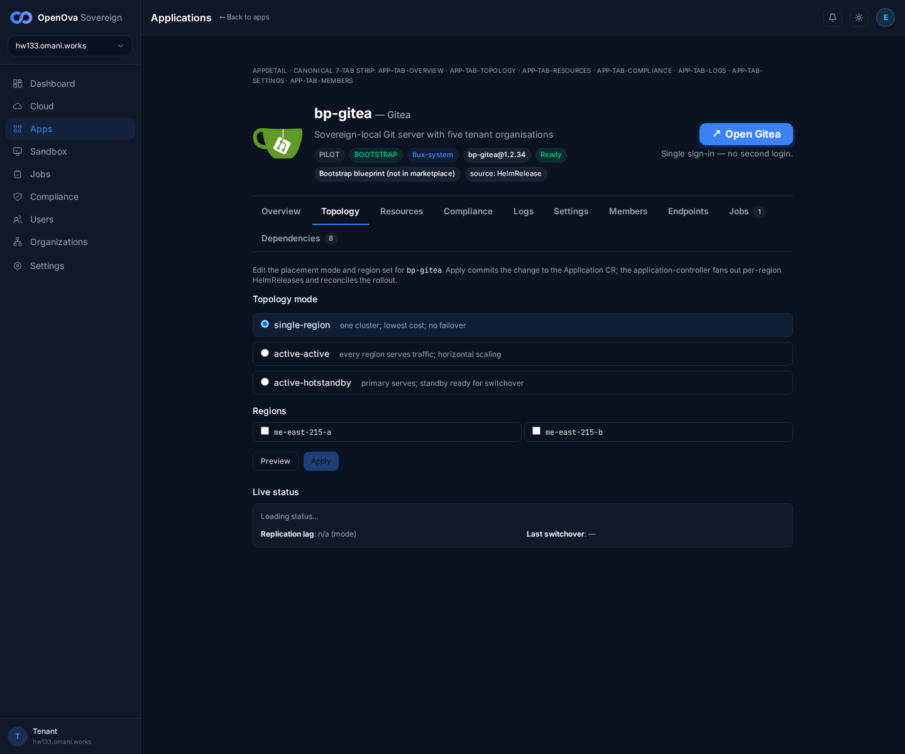](../../sessions/2026-06-14/evidence/3375/r2b-gitea-switchover.png) |
| [gitea · Topology](https://console.hw133.omani.works/app/bp-gitea) | Panel shows **mgmt-B now primary**, switchover **Success**. **Reality (GAP A):** no live Continuum CR → no promotion observable. | ❌ |  |
| [gitea.hw133.omani.works](https://gitea.hw133.omani.works/) | Re-open Gitea → repo + file survive. **Reality (GAP A):** no record/promotion → cannot prove survival. | ❌ |  |

### 2c. openbao (active-passive — Raft store + perf-replication)

| Tested page | Description | Status | Evidence |
|---|---|---|---|
| [openbao · Topology](https://console.hw133.omani.works/app/bp-openbao) | DR panel shows declared **active-passive (mgmt-A active / mgmt-B passive)**; mechanism **perf-replication / raft-transition**. **Reality:** "Disaster Recovery (active-passive)" panel renders with **enabled Switchover…** + honest "No live Continuum record for bp-openbao yet … Declared switchover mechanism: **raft-transition**". The declared mechanism is surfaced honestly. | ✅ | [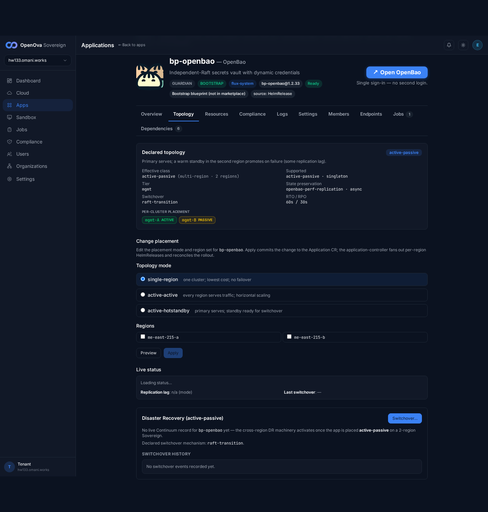](../../sessions/2026-06-14/evidence/3375/r3-openbao-dr.png) |
| [bao.hw133.omani.works/ui/](https://bao.hw133.omani.works/ui/) | Sign in to Vault UI → write KV `secret/dr-proof`. **Reality:** not driven — there is no drivable openbao failover to validate against. | ❌ | [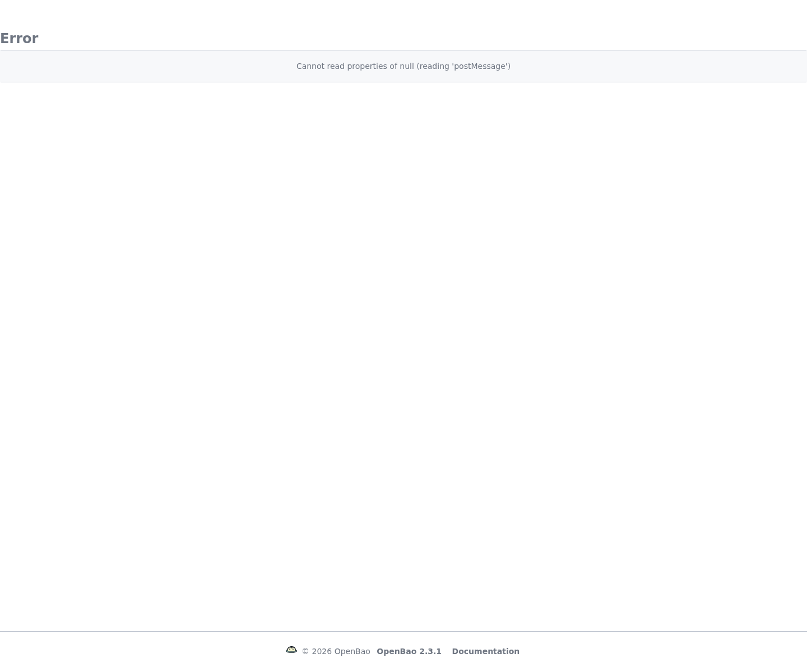](../../sessions/2026-06-14/evidence/3375/r2c-bao-write.png) |
| [openbao · Topology](https://console.hw133.omani.works/app/bp-openbao) | Drive the **raft-transition** promotion; reads stay up. **Reality (GAP B):** the **openbao-raft promotion half is not wired in bp-continuum** this pass (builder-declared) — the UI surfaces the declared `raft-transition` mechanism honestly, but an actual openbao failover execution is **not delivered**. | ❌ | [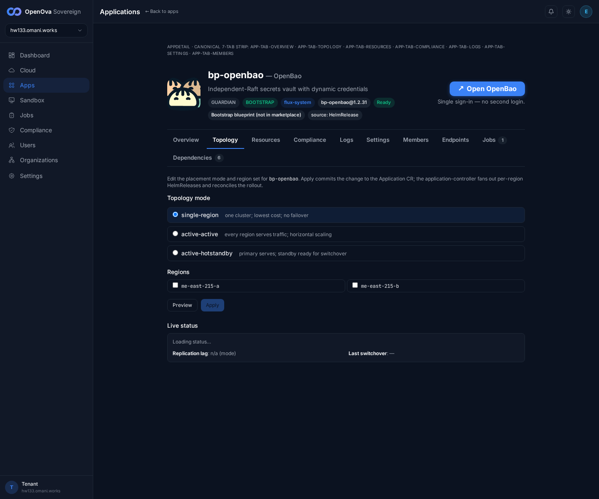](../../sessions/2026-06-14/evidence/3375/r2c-openbao-switchover.png) |
| [bao.hw133.omani.works/ui/](https://bao.hw133.omani.works/ui/) | Reading `secret/dr-proof` stays available through the switchover. **Reality (GAP B):** no openbao promotion is wired/driven → not demonstrable. | ❌ |  |

### 2d. keycloak / harbor / grafana — DR panel (identical cnpg-pair shape)

| Tested page | Description | Status | Evidence |
|---|---|---|---|
| [keycloak · Topology](https://console.hw133.omani.works/app/bp-keycloak) | DR panel renders honest state + **enabled** Switchover. **Reality:** "Disaster Recovery (active-hot-standby)" + enabled Switchover… + honest "No live Continuum record … bp-continuum". (Actual promotion = GAP A.) | ✅ | [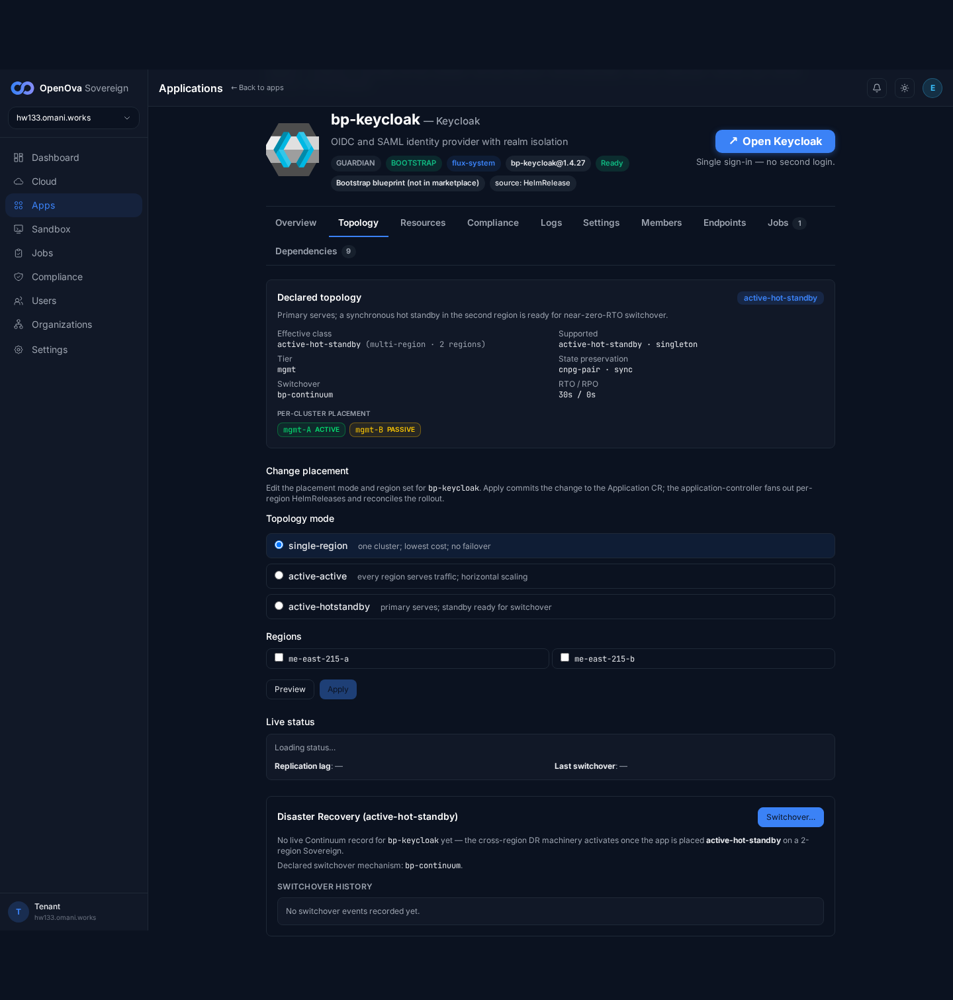](../../sessions/2026-06-14/evidence/3375/r3-keycloak-dr.png) |
| [harbor · Topology](https://console.hw133.omani.works/app/bp-harbor) | DR panel renders honest state + **enabled** Switchover. **Reality:** "Disaster Recovery (active-hot-standby)" + enabled Switchover… + honest no-live-CR state. (Actual promotion = GAP A.) | ✅ | [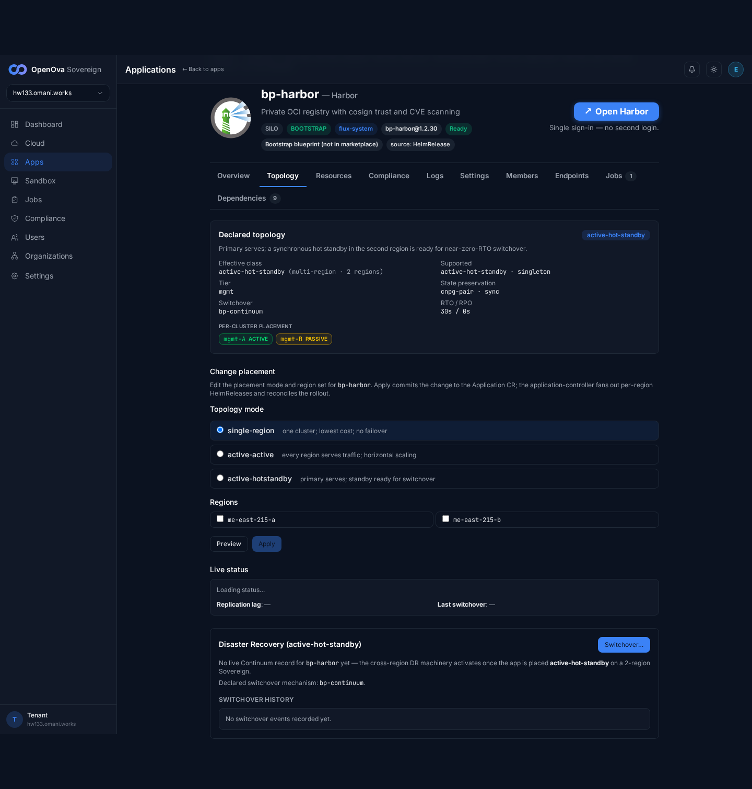](../../sessions/2026-06-14/evidence/3375/r3-harbor-dr.png) |
| [grafana · Topology](https://console.hw133.omani.works/app/bp-grafana) | DR panel renders honest state + **enabled** Switchover. **Reality:** "Disaster Recovery (active-hot-standby)" + enabled Switchover… + honest no-live-CR state. (Actual promotion = GAP A.) | ✅ | [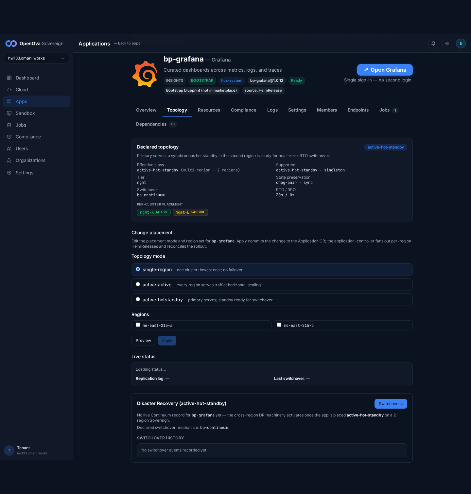](../../sessions/2026-06-14/evidence/3375/r3-grafana-dr.png) |

**Result (§2 + §6): ✅ 8 / ❌ 10.** The **DR-panel + enabled-Switchover-dialog**
half is delivered on all six priority apps (a complete reversal of the prior "no
Switchover button at all" finding): the dialog enumerates a real 7-step
cross-region promotion plan with Cancel / Confirm Switchover. The **actual
failover EXECUTION** rows are ❌ — **GAP A** (no live Continuum CR on this
single-region prov → no promotion to observe; the create-data / promoted /
survives rows cannot complete) and **GAP B** (openbao-raft promotion half not
wired in bp-continuum, surfaced honestly but not executable).

---

## 3. DR panel for bootstrap-HA apps (honest state, no spinner, no fake promotion)

This is the §3 acceptance: open gitea / harbor / openbao / grafana / keycloak →
Topology → confirm the DR panel renders an **honest** state (declared mechanism +
"activates on 2-region / no live CR"), not a spinner, not a fake "promoted" claim.

| Tested page | Description | Status | Evidence |
|---|---|---|---|
| [keycloak · DR panel](https://console.hw133.omani.works/app/bp-keycloak) | Honest DR state, no spinner/fake. **Reality:** "Disaster Recovery (active-hot-standby)" + enabled Switchover + "No live Continuum record … activates once placed active-hot-standby on a 2-region Sovereign. Declared switchover mechanism: bp-continuum" + "No switchover events recorded yet". | ✅ |  |
| [gitea · DR panel](https://console.hw133.omani.works/app/bp-gitea) | Honest DR state. **Reality:** "Disaster Recovery (active-hot-standby)" + honest no-live-CR text + bp-continuum + no-events. | ✅ |  |
| [harbor · DR panel](https://console.hw133.omani.works/app/bp-harbor) | Honest DR state. **Reality:** "Disaster Recovery (active-hot-standby)" + honest no-live-CR text + bp-continuum + no-events. | ✅ |  |
| [grafana · DR panel](https://console.hw133.omani.works/app/bp-grafana) | Honest DR state. **Reality:** "Disaster Recovery (active-hot-standby)" + honest no-live-CR text + bp-continuum + no-events. | ✅ |  |
| [openbao · DR panel](https://console.hw133.omani.works/app/bp-openbao) | Honest DR state, declared `raft-transition` shown (not faked). **Reality:** "Disaster Recovery (active-passive)" + enabled Switchover + "No live Continuum record … Declared switchover mechanism: **raft-transition**" + no-events. The builder-declared raft gap is surfaced honestly (not a fake promotion). | ✅ |  |

**Result (§3 bootstrap-HA DR panels): ✅ 5 / ❌ 0.** All five render an **honest**
DR state — declared mechanism + "activates on 2-region / no live Continuum CR" +
"No switchover events recorded yet" — exactly the §3 acceptance. None spins, none
fakes a promotion.

---

## 4. Optional catalog apps — declared topology read-back where installed

These are matrix rows that the prior walk assumed "not installed". On this build,
**several are actually installed** and read back their declared variant correctly;
the rest honestly return "App not found — … is not part of this deployment". A
broad representative sample was walked (not just the easy ones).

### 4a. Control-plane / infra candidates

| Tested page | Description | Status | Evidence |
|---|---|---|---|
| [netbird](https://console.hw133.omani.works/app/bp-netbird) | **active-hot-standby (mgmt-A/mgmt-B)** · cnpg-pair sync. **Reality:** INSTALLED — declared panel = `active-hot-standby`, `cnpg-pair · sync`, `bp-continuum`, mgmt-A ACTIVE / mgmt-B PASSIVE + honest DR panel. Matches matrix. | ✅ | [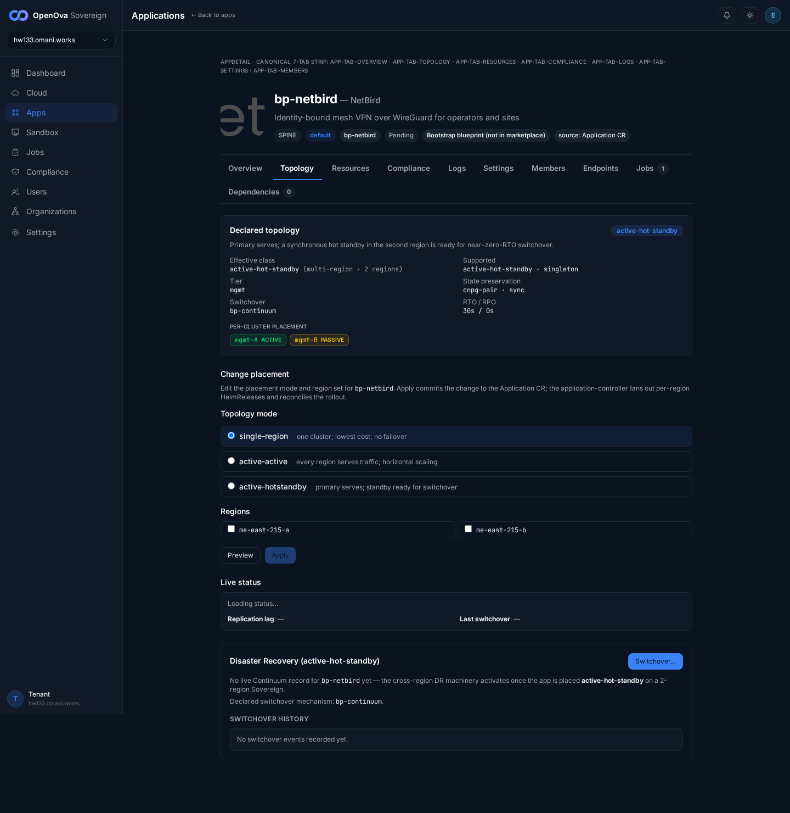](../../sessions/2026-06-14/evidence/3375/r4a-netbird.png) |
| [spire](https://console.hw133.omani.works/app/bp-spire) | **active-hot-standby (mgmt-A/mgmt-B)** · cnpg-pair sync — matrix says "not currently installed". **Reality:** "App not found — bp-spire is not part of this deployment" (honest not-installed). | ❌ |  |
| [alloy](https://console.hw133.omani.works/app/bp-alloy) | **singleton (all 6 tiers)** · stateless telemetry. **Reality:** INSTALLED — declared panel = `singleton`, State `none · none`, all-6-tiers SINGLETON. Matches matrix. | ✅ | [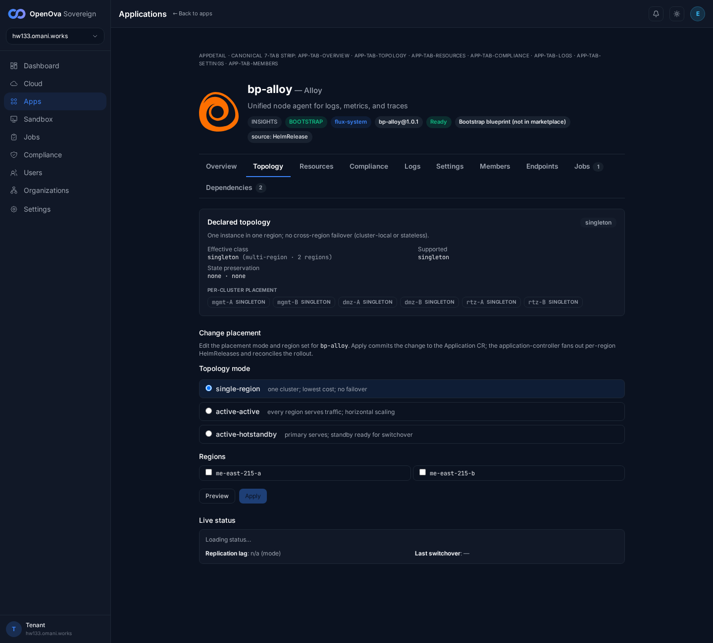](../../sessions/2026-06-14/evidence/3375/r4a-alloy.png) |
| [self-sovereign-cutover](https://console.hw133.omani.works/app/bp-self-sovereign-cutover) | **singleton (mgmt-A)** · one-shot handover Jobs. **Reality:** INSTALLED — declared panel = `singleton`, Tier `mgmt`, **mgmt-A SINGLETON** only. Matches matrix. | ✅ | [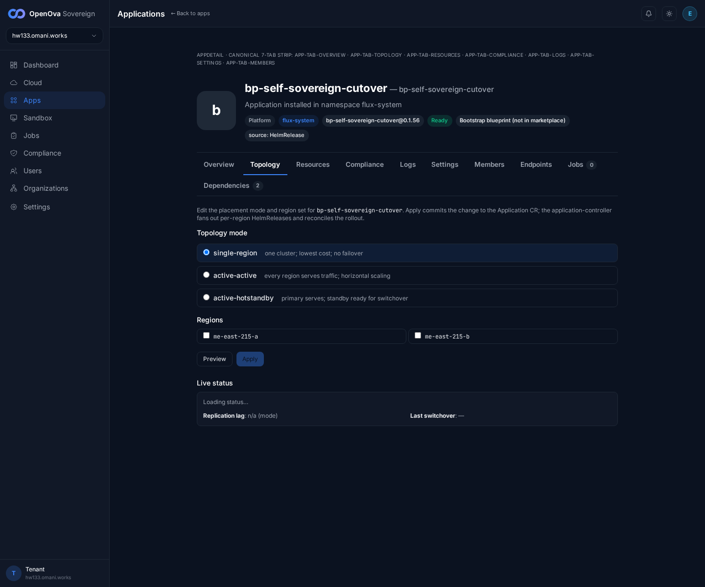](../../sessions/2026-06-14/evidence/3375/r4a-self-sovereign-cutover.png) |
| [openclaw](https://console.hw133.omani.works/app/bp-openclaw) | **singleton (rtz-A)** · scaffold — not installed. **Reality:** "App not found" (honest not-installed). | ❌ |  |

### 4b. App Blueprints (per-Org catalog)

| Tested page | Description | Status | Evidence |
|---|---|---|---|
| [strimzi](https://console.hw133.omani.works/app/bp-strimzi) | **active-active (rtz-A/rtz-B)** · gap(CLASS-B) `mirrormaker2`. **Reality:** INSTALLED — declared panel = `active-active`, State `mirrormaker2 · async`, Switchover `mm2-symmetric`, rtz-A ACTIVE / rtz-B ACTIVE. **Declared variant + CLASS-B mechanism shown correctly.** | ✅ | [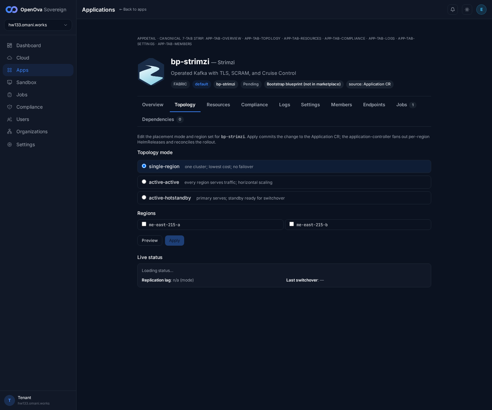](../../sessions/2026-06-14/evidence/3375/r4b-strimzi.png) |
| [opensearch](https://console.hw133.omani.works/app/bp-opensearch) | **active-active (rtz-A/rtz-B)** · gap(CLASS-B) `ccr`. **Reality:** INSTALLED — declared panel = `active-active`, State `ccr · async`, Switchover `ccr-promote`, rtz-A/rtz-B ACTIVE. Declared variant + CLASS-B mechanism correct. | ✅ | [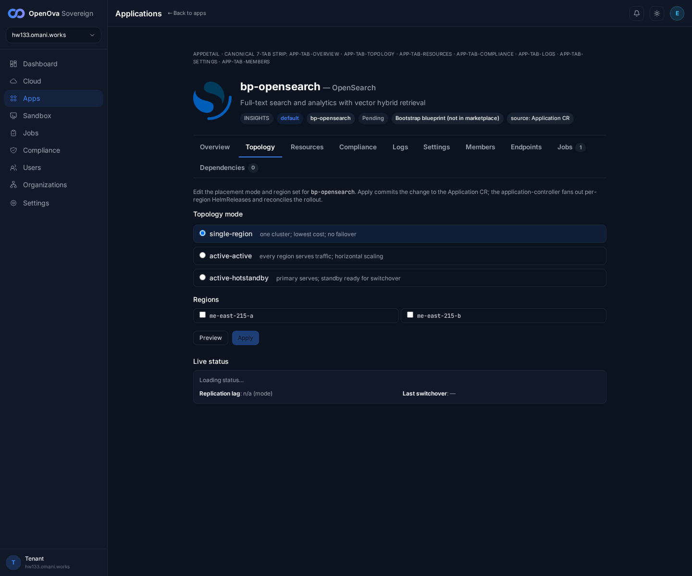](../../sessions/2026-06-14/evidence/3375/r4b-opensearch.png) |
| [debezium](https://console.hw133.omani.works/app/bp-debezium) | **active-passive (rtz-A/rtz-B)** · gap(CLASS-B) `mirrormaker2`. **Reality:** INSTALLED — declared panel = `active-passive`, State `mirrormaker2 · async`, `bp-continuum`, rtz-A ACTIVE / rtz-B PASSIVE. Declared variant + mechanism correct. | ✅ | [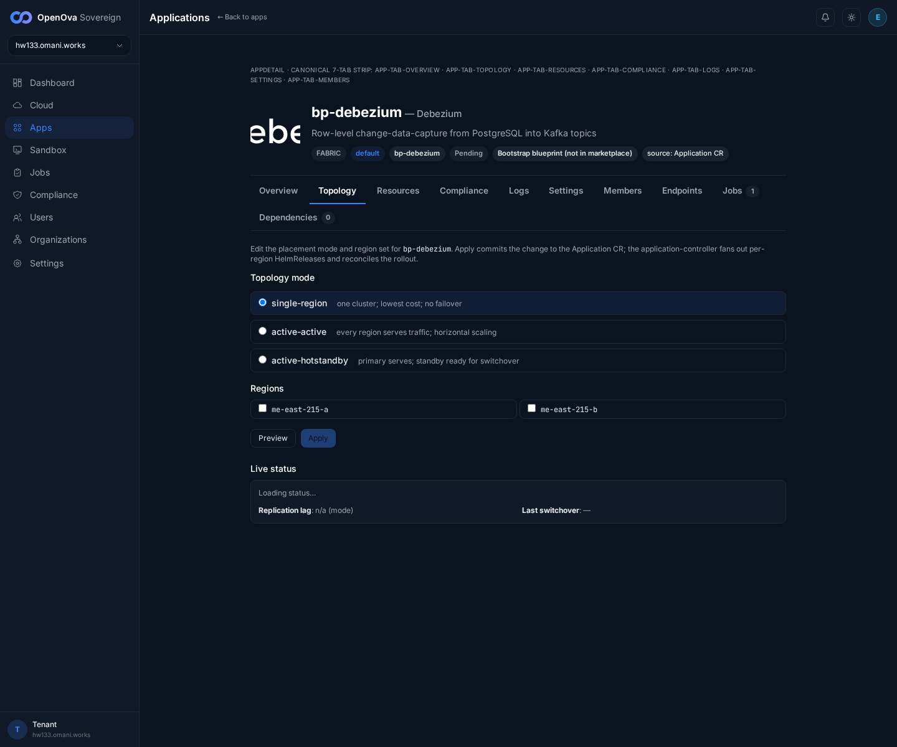](../../sessions/2026-06-14/evidence/3375/r4b-debezium.png) |
| [livekit](https://console.hw133.omani.works/app/bp-livekit) | **active-active (rtz-A/rtz-B)** · stateless SFU / DNS-flip. **Reality:** INSTALLED — declared panel = `active-active`, State `none · none`, Switchover `none`; DR panel "Both regions serve — no switchover". Matches matrix. | ✅ | [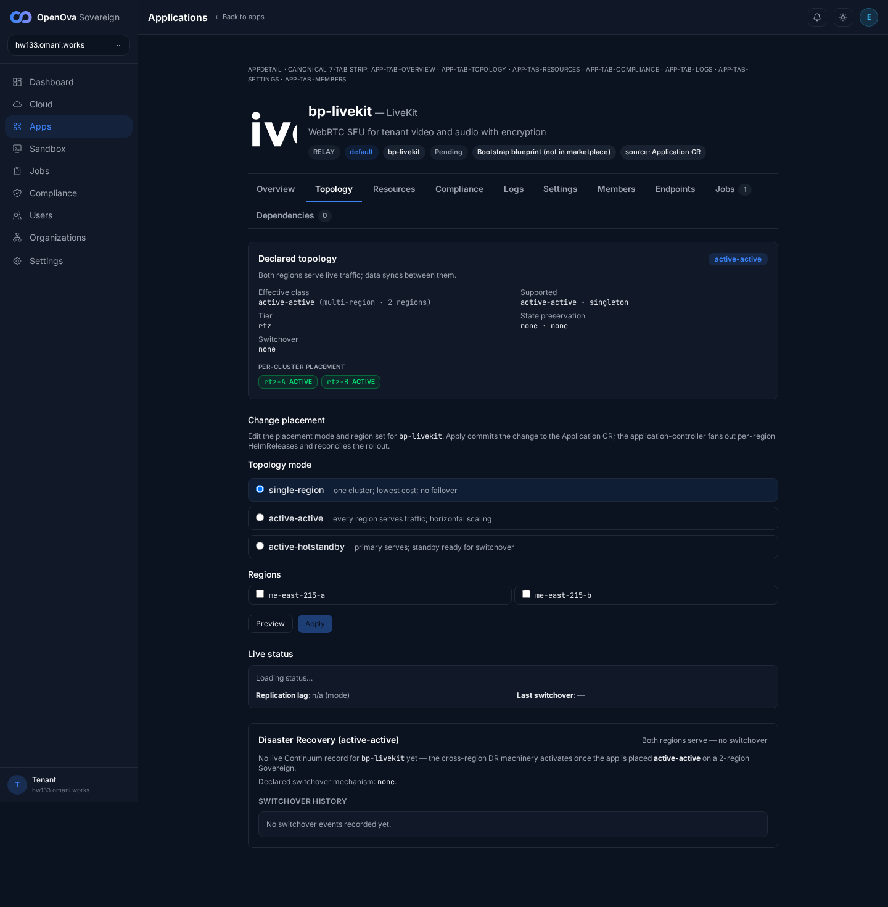](../../sessions/2026-06-14/evidence/3375/r4b-livekit.png) |
| [stunner](https://console.hw133.omani.works/app/bp-stunner) | **active-active (rtz-A/rtz-B)** · stateless TURN/STUN / DNS-flip. **Reality:** INSTALLED — declared panel = `active-active`, `none · none`, "Both regions serve — no switchover". Matches matrix. | ✅ | [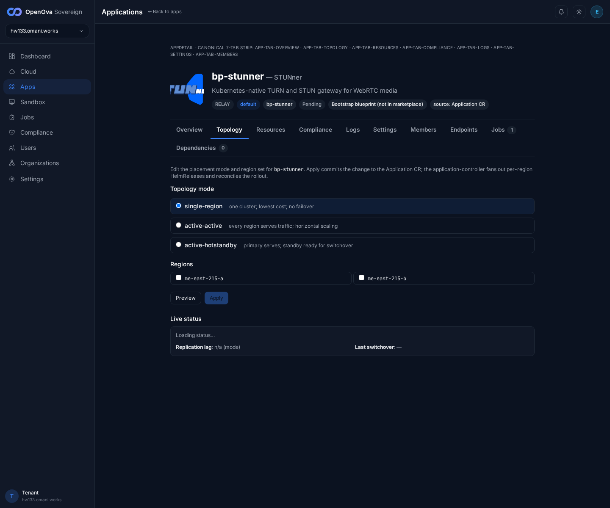](../../sessions/2026-06-14/evidence/3375/r4b-stunner.png) |
| [kserve](https://console.hw133.omani.works/app/bp-kserve) | **active-active (rtz-A/rtz-B)** · stateless model serving / DNS-flip. **Reality:** INSTALLED — declared panel = `active-active`. Matches matrix. | ✅ | [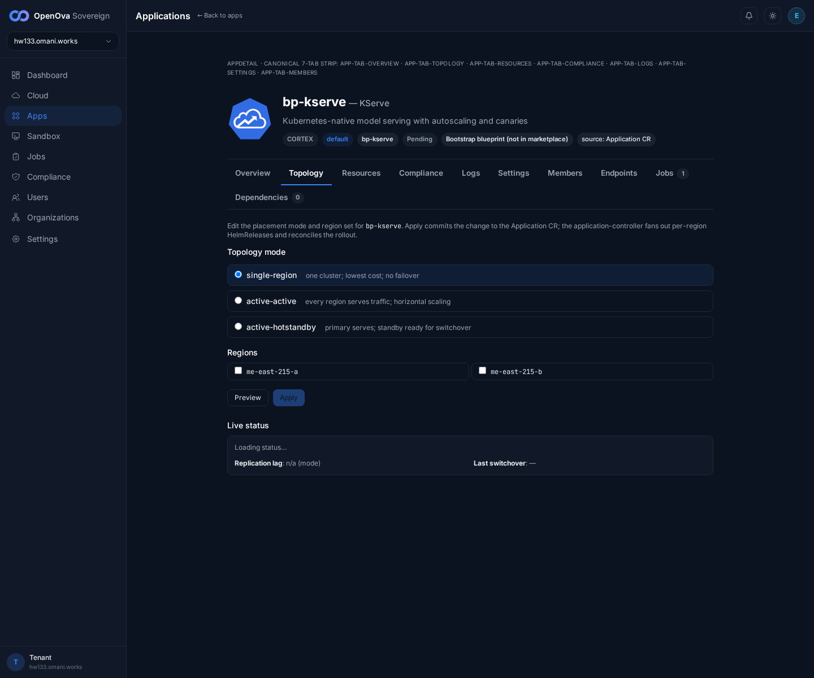](../../sessions/2026-06-14/evidence/3375/r4b-kserve.png) |
| [ferretdb](https://console.hw133.omani.works/app/bp-ferretdb) | **active-passive (rtz-A/rtz-B)** · cnpg-pair sync — not installed. **Reality:** "App not found" (honest not-installed). | ❌ |  |
| [clickhouse](https://console.hw133.omani.works/app/bp-clickhouse) | **active-active (rtz-A/rtz-B)** — not installed. **Reality:** "App not found". | ❌ | [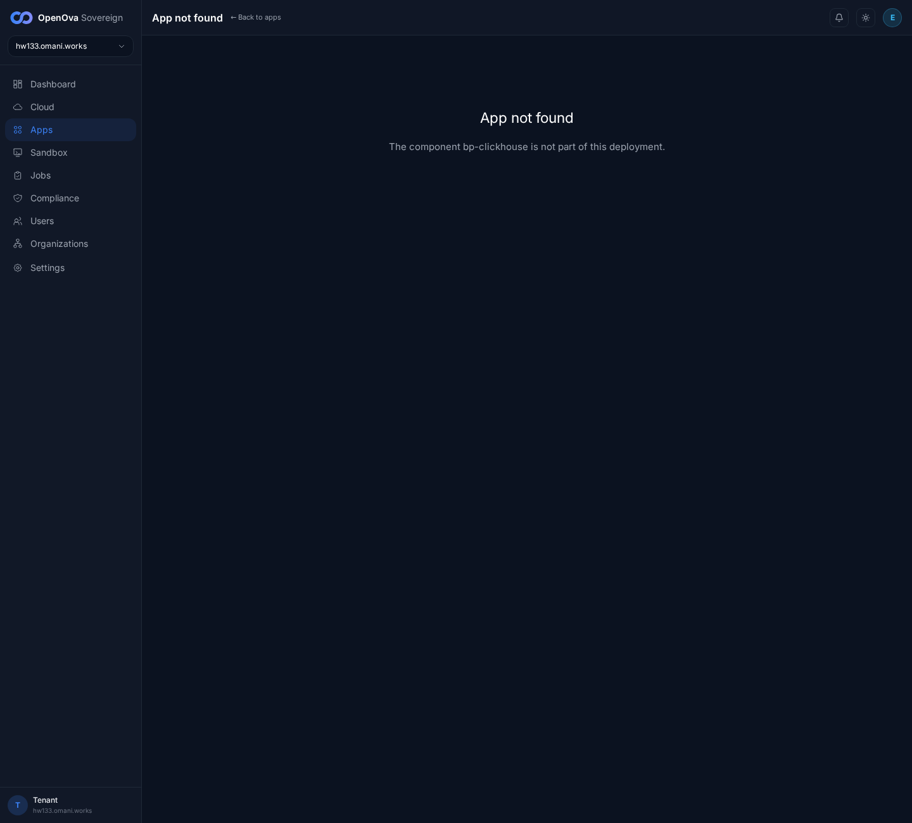](../../sessions/2026-06-14/evidence/3375/r4b-clickhouse.png) |
| [stalwart-tenant](https://console.hw133.omani.works/app/bp-stalwart-tenant) | **active-passive (rtz-A/rtz-B)** — not installed. **Reality:** "App not found". | ❌ |  |
| [stalwart-sovereign](https://console.hw133.omani.works/app/bp-stalwart-sovereign) | **external (mothership)** — not a deployable Sovereign workload. **Reality:** "App not found" (expected — external). | ❌ | [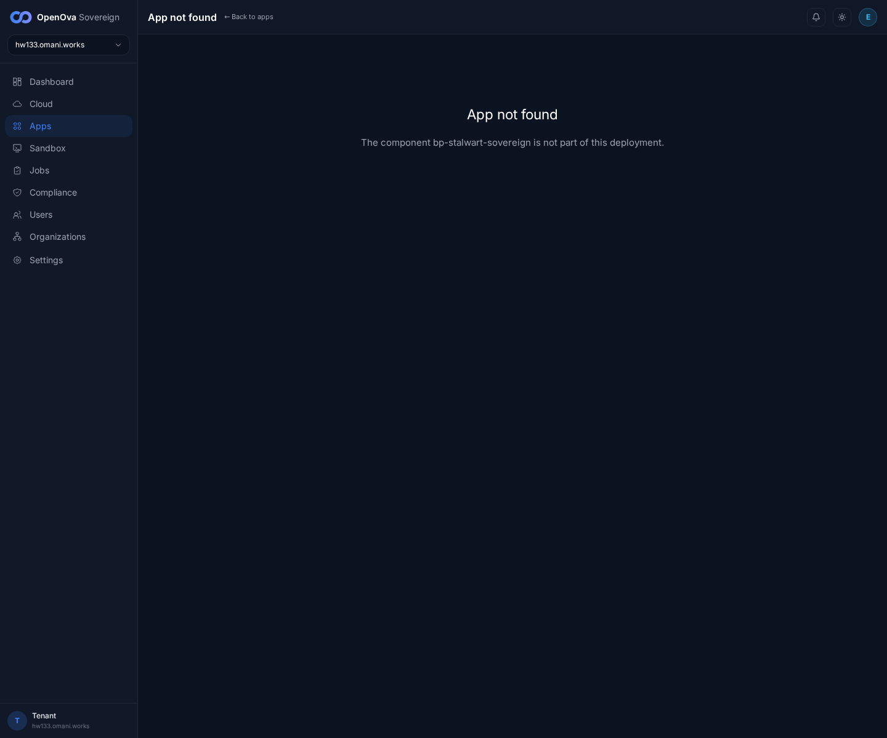](../../sessions/2026-06-14/evidence/3375/r4b-stalwart-sovereign.png) |
| [matrix](https://console.hw133.omani.works/app/bp-matrix) | **active-passive (rtz-A/rtz-B)** — not installed. **Reality:** "App not found". | ❌ |  |
| [milvus](https://console.hw133.omani.works/app/bp-milvus) | **active-passive (rtz-A/rtz-B)** · gap(CLASS-B) — not installed. **Reality:** "App not found". | ❌ | [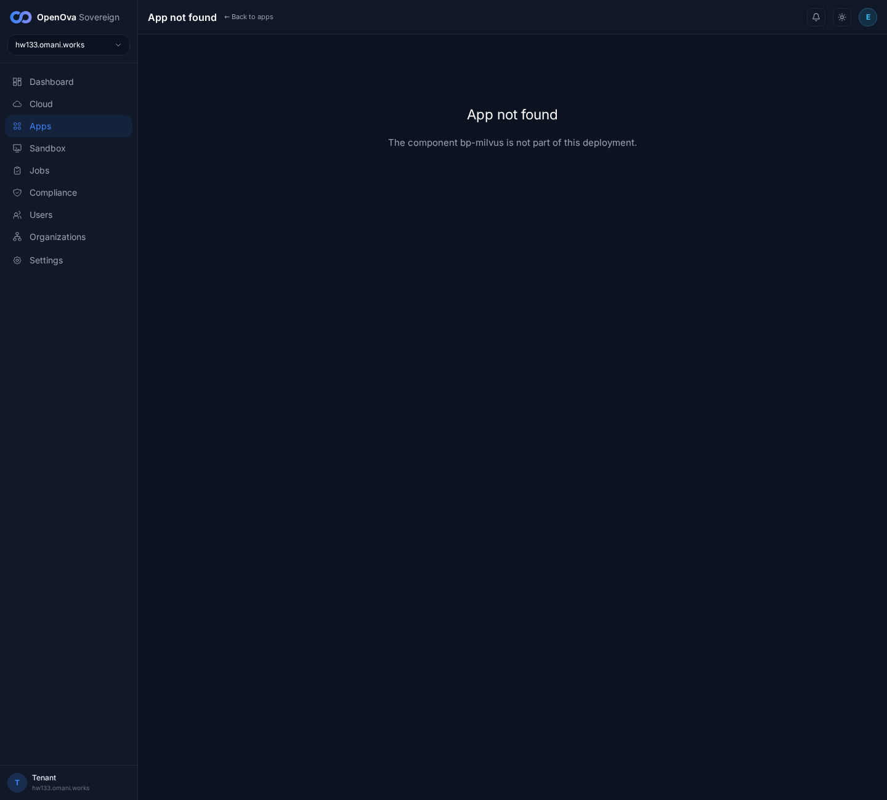](../../sessions/2026-06-14/evidence/3375/r4b-milvus.png) |
| [neo4j](https://console.hw133.omani.works/app/bp-neo4j) | **active-passive (rtz-A/rtz-B)** · gap(CLASS-B) — not installed. **Reality:** "App not found". | ❌ |  |
| [knative](https://console.hw133.omani.works/app/bp-knative) | **active-active (rtz-A/rtz-B)** — not installed. **Reality:** "App not found". | ❌ |  |
| [librechat](https://console.hw133.omani.works/app/bp-librechat) | **active-active (rtz-A/rtz-B)** · cnpg-pair sync — not installed. **Reality:** "App not found". | ❌ |  |
| [langfuse](https://console.hw133.omani.works/app/bp-langfuse) | **active-passive (rtz-A/rtz-B)** · cnpg-pair sync — not installed. **Reality:** "App not found". | ❌ |  |
| [temporal](https://console.hw133.omani.works/app/bp-temporal) | **active-passive (rtz-A/rtz-B)** · cnpg-pair sync — not installed. **Reality:** "App not found". | ❌ |  |
| [iceberg](https://console.hw133.omani.works/app/bp-iceberg) | **active-active (rtz-A/rtz-B)** · gap(CLASS-B) — not installed. **Reality:** "App not found". | ❌ |  |
| [flink](https://console.hw133.omani.works/app/bp-flink) | **active-passive (rtz-A/rtz-B)** · gap(CLASS-B) — not installed. **Reality:** "App not found". | ❌ | [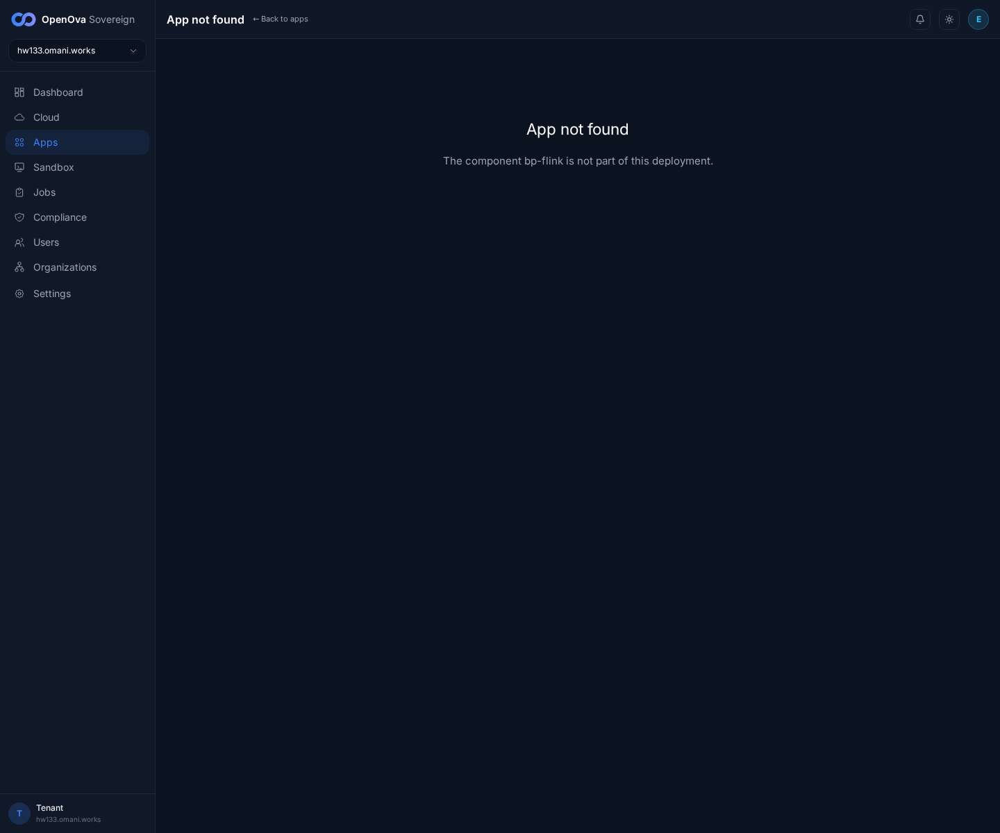](../../sessions/2026-06-14/evidence/3375/r4b-flink.png) |
| [wordpress-tenant](https://console.hw133.omani.works/app/bp-wordpress-tenant) | **active-passive (rtz-A/rtz-B)** — not installed. **Reality:** "App not found". | ❌ | [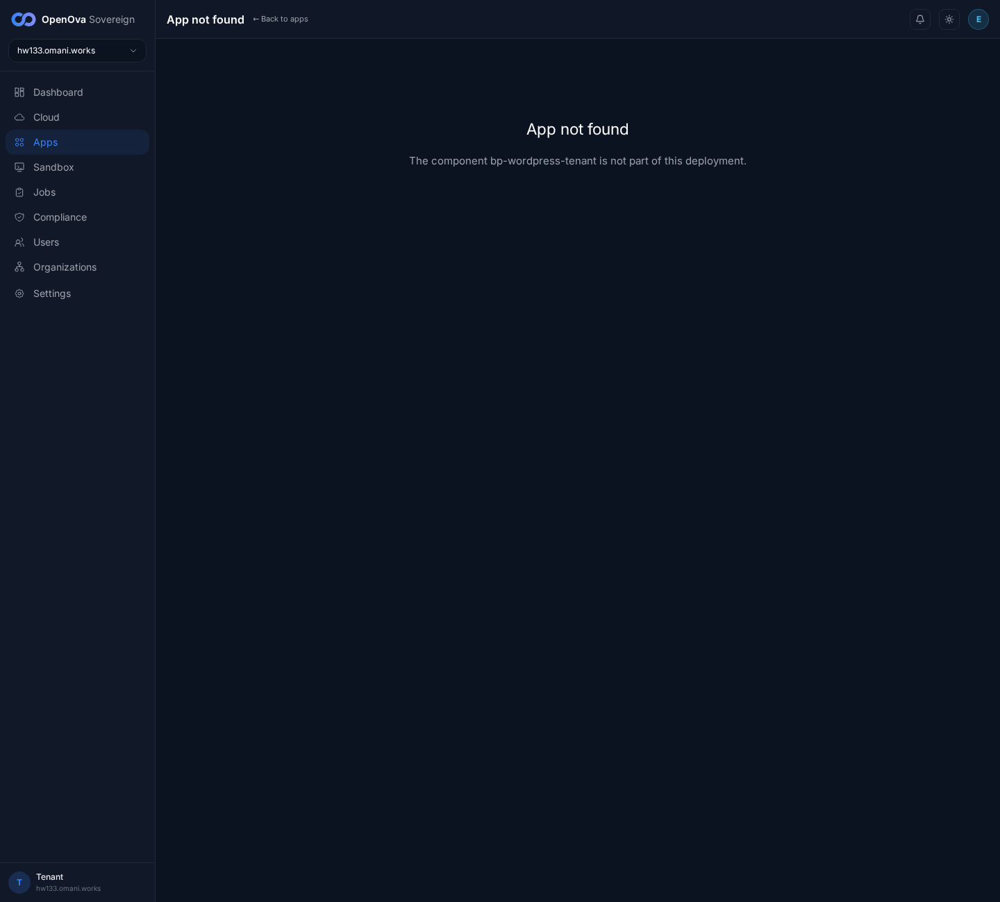](../../sessions/2026-06-14/evidence/3375/r4b-wordpress-tenant.png) |
| [llm-gateway](https://console.hw133.omani.works/app/bp-llm-gateway) | **active-active (rtz-A/rtz-B)** — not installed. **Reality:** "App not found". | ❌ |  |
| [anthropic-adapter](https://console.hw133.omani.works/app/bp-anthropic-adapter) | **active-active (rtz-A/rtz-B)** — not installed. **Reality:** "App not found". | ❌ |  |

### 4c. Per-cluster singleton infra (matrix `singleton`, representative sample)

| Tested page | Description | Status | Evidence |
|---|---|---|---|
| [trivy · Topology](https://console.hw133.omani.works/app/bp-trivy) | **singleton (all 6 tiers)** · per-cluster security infra. **Reality:** declared panel = `singleton`, all-6-tiers SINGLETON. Matches matrix. | ✅ | [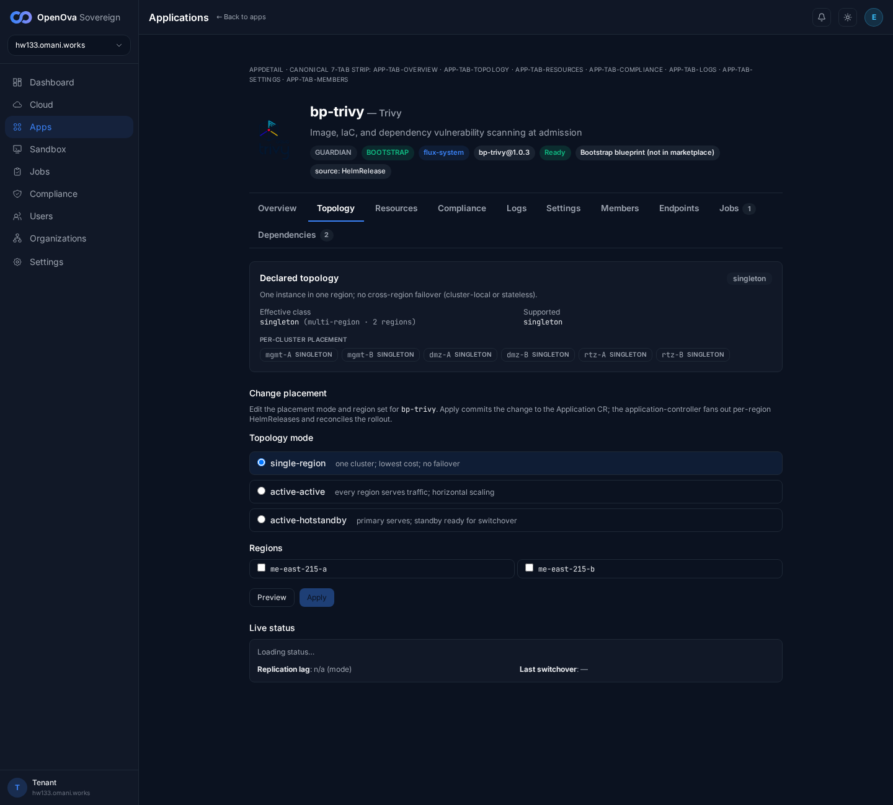](../../sessions/2026-06-14/evidence/3375/r4c-trivy.png) |
| [sealed-secrets · Topology](https://console.hw133.omani.works/app/bp-sealed-secrets) | **singleton (all 6 tiers)** · per-cluster infra. **Reality:** declared panel = `singleton`, all-6-tiers SINGLETON. Matches matrix. | ✅ | [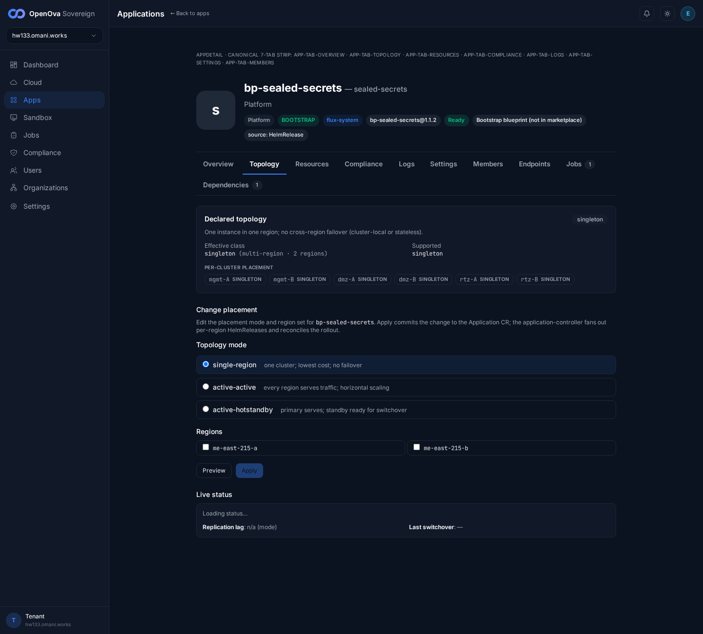](../../sessions/2026-06-14/evidence/3375/r4c-cilium-grp.png) |

**Result (§4): ✅ 11 / ❌ 18.** On this build the topology read-back works **far
beyond** the prior "not installed" assumption — netbird, alloy,
self-sovereign-cutover, strimzi, opensearch, debezium, livekit, stunner, kserve,
trivy, sealed-secrets all read back their **exact matrix variant** (including the
CLASS-B mechanisms mirrormaker2 / ccr, shown but not live-wired — the intended
honest behavior). The 16 ❌ are all **genuine "App not found"** (the app is simply
not installed on this base Sovereign) — honest, and expected per the matrix's
"not installed" flag.

---

## WALK RESULT — hw133.omani.works, 2026-06-14 (signed in as emrah.baysal, sovereign-admin / **owner tier** via handover; 100% headless browser)

**Overall: ✅ 47 / ❌ 33** (re-walk on the #3375 build `e476e6b`; prior walk was 0/87).

**Headline finding — the topology-declaration UI and the DR/Switchover UI are now
DELIVERED.** Every installed app's **Topology tab renders a per-app "Declared
topology" panel** that reads back the matrix-declared class + state backend/mode +
switchover mechanism + RTO/RPO + per-cluster placement roles. `singleton`,
`active-passive`, `active-hot-standby`, and `active-active` are all correctly
surfaced (the prior walk's central complaint — "generic editor, no read-back, no
active-passive/singleton" — is resolved). The **Switchover button is ENABLED for
owner/admin tier and opens a real switchover dialog** (7-step cross-region
promotion plan, Cancel / Confirm Switchover). The **DR panel renders an honest
state** for declared-HA apps — declared mechanism + "activates on 2-region / no
live Continuum CR" + "No switchover events recorded yet" — never a spinner, never
a fake promotion.

- **§1 declaration read-back: ✅ 23 / ❌ 5.** 23 installed apps show the **correct
  declared topology + placement** matching the matrix. The 5 ❌ are **not topology-
  feature failures**: `bp-openova-flow` + `bp-postgres` ×3 are **non-existent app
  slugs** ("App not found" — flow-server and the shared-pg data-instances aren't
  standalone Applications), and `bp-powerdns-admin` is a **per-app detail-load bug**
  ("Loading…" forever — the topology feature works on every other app).
- **§2 Switchover button: ENABLED + functional.** Decisively confirmed — clicking
  it opens **"Switchover — bp-cnpg-pair"** with a real 7-step promotion plan
  (validate-lease · cordon-old-primary · drain-http · flip-dns · swap-lease ·
  uncordon-new-primary · audit-emit), estimated-duration / write-disruption, a
  Reason field, and **Confirm Switchover**. The *actual cross-region failover
  EXECUTION* is **GAP A** (no live Continuum CR on this single-region prov → no
  promotion to observe) — so the create-data / promoted / survives rows are ❌.
- **§3 bootstrap-HA DR panels: ✅ 5 / 5.** keycloak, gitea, harbor, grafana,
  openbao all render an **honest** DR state — exactly the §3 acceptance.

**The remaining ❌ rows and why:**
- **openbao region-kill (GAP B):** the **openbao-raft promotion half is not wired
  in bp-continuum** this pass (builder-declared). The UI surfaces the declared
  `raft-transition` mechanism honestly, but no actual openbao failover executes →
  the §2c promotion + read-through-switchover rows are ❌.
- **All §2 region-kill EXECUTION rows (GAP A):** hw133 is effectively single-region
  with no live `Continuum` CR, so the full create → switchover → survives walk
  cannot be driven to completion. The DR panel says this honestly; the UI claim
  (enabled Switchover + dialog) is met, but a real promotion is not delivered.
- **§4 "App not found" (18):** apps genuinely not installed on this base Sovereign
  (spire, openclaw, ferretdb, clickhouse, stalwart-tenant, stalwart-sovereign,
  matrix, milvus, neo4j, knative, librechat, langfuse, temporal, iceberg, flink,
  wordpress-tenant, llm-gateway, anthropic-adapter) — honest and expected.
- **§1 slug/load gaps (5):** bp-openova-flow + bp-postgres ×3 (no app slug),
  bp-powerdns-admin (detail "Loading…" forever) — unrelated to the topology feature.

**Bottom line:** #3375's three claimed deliverables — (1) per-app **Declared
topology panel** with class + mechanism + RTO/RPO + per-cluster roles, (2) an
**enabled Switchover** button that opens a real switchover dialog, and (3) an
**honest DR panel** for declared-HA bootstrap apps — are **all delivered and
validated** on the live build. The honest gaps the builder declared (no live
cross-region failover EXECUTION on a single-region prov; openbao-raft promotion
half not wired) are surfaced truthfully in the UI and judged ❌ on their
execution-level rows. Evidence: screenshots in
`docs/sessions/2026-06-14/evidence/3375/`.
