# #3375 TOPOLOGY / DR — exhaustive per-app user-acceptance walk (100% web UI)

The agreed truth is the per-Blueprint **topology matrix** in
[`docs/topology-matrix.md`](../../topology-matrix.md) (the durable promotion of the
`2026-06-02-per-blueprint-topology-audit.md` agreement). **Every row below is read
off that matrix — never invented.** For each app the user opens its **Topology**
tab in the operator console and checks that the **declared topology + placement
match the matrix row** for that app; for the §6 priority HA apps the user then
exercises the **DR panel** (Switchover button → confirm the dialog enumerates the
cross-region promotion plan).

This is **100% web UI** — no terminal, no `kubectl`, no `psql` to judge a row
(kubectl used only to mint the handover sign-in token + read ground-truth install
state). Every **Tested page** is a clickable link to the live keystone fresh-prov
**`hw136.omani.works`** (deployment `3a2ee904b1d0366a`).

## Keystone re-walk — hw136 fresh prov (2026-06-14, zero-touch)

This is an **independent read-only re-walk on the fresh keystone prov `hw136`** — a
clean zero-touch Sovereign provisioned from the current `main` build
(`bp-catalyst-platform@1.4.628`). Earlier passes ran on hw133 / hw135; this pass
re-verifies the same UI reproduces on a freshly provisioned env with **zero manual
touch**, and on a **healthier env** than hw135 (the WireGuard-mesh flap that masked
one row on hw135 is gone — all 60 catalog `bp-*` HelmReleases are `Ready=True`, the
only non-Ready being the three Hetzner-only suspended HRs `bp-cluster-autoscaler-hcloud`
/ `bp-hcloud-ccm` / `bp-velero`, which are `n/a (Hetzner)` per the matrix).

**What reproduces zero-touch on hw136 — the topology-declaration + DR/Switchover UI
is DELIVERED.** The handover URL signs the operator in (lands on `/dashboard` as
`emrah.baysal`, owner tier, no login form; the dashboard renders the 100-item treemap
with zero console errors). For every catalog app, the app-detail **Topology tab
renders a per-app "Declared topology" panel** that reads back the matrix-declared
class + state backend/mode + switchover mechanism + RTO/RPO + per-cluster placement
roles. `singleton`, `active-passive`, `active-hot-standby`, and `active-active` are
all correctly surfaced. The **Switchover button is ENABLED for owner tier and opens a
real switchover dialog** ("Switchover — bp-cnpg-pair" with a 7-step cross-region
promotion plan: validate-lease · cordon-old-primary · drain-http · flip-dns ·
swap-lease · uncordon-new-primary · audit-emit, plus estimated-duration /
write-disruption, a Reason field, and **Confirm Switchover** — captured live). The
**DR panel renders an honest state** for declared-HA apps — declared mechanism +
"activates on 2-region / no live Continuum CR" + "No switchover events recorded yet"
— never a spinner, never a fake promotion. The `active-active` apps correctly show
"Both regions serve — no switchover".

**hw136-specific facts (recorded honestly):**

- **hw136 is single-region.** Only `me-east-215-a` nodes exist (one control-plane +
  three workers; the secondary `-b` VPC is not provisioned for this base walk — kom4dc
  VPC quota forces a separate 2-region prov for the region-kill EXECUTION). Placement
  resolves `single-region`; there is no live `Continuum` CR. So the region-kill
  EXECUTION rows are **❌, genuine** exactly as on every single-region prov — they need
  a live 2-region Continuum CR (the Wave-3 region-kill op).
- **The declared-topology panel is catalog-driven, not install-gated.** The Topology
  tab lifts each blueprint's `spec.topology` from the build-time generated catalog
  (`TOPOLOGY_BY_ID`), so it reads back the correct matrix variant **for any catalog
  slug regardless of whether the app is installed on this base Sovereign**. This is a
  *stronger* result for #3375's declared-read-back deliverable: it reproduces
  zero-touch even for apps that aren't deployed here (e.g. netbird, strimzi).
- **A slug not in the deployable catalog → "App not found — not part of this
  deployment"** → N/A (e.g. `bp-spire`, `bp-clickhouse`, `bp-openova-flow`).
- **`bp-powerdns-admin` PASSES on hw136** (it was a single ❌ env-flap on hw135). Its
  detail route loads a heavier multi-instance grid than the other singletons (an extra
  `/catalyst/v1/catalog/powerdns-admin/instances` call); with a `networkidle` settle it
  renders the full `singleton` panel (all-tiers SINGLETON) on the first attempt. HR
  `Ready`, app-data API returns 200 `phase:Ready`. The hw135 ❌ was the WireGuard-mesh
  datapath flap, which does **not** reproduce on hw136's healthy single-node mesh.

**The genuine remaining ❌ are the Wave-3 region-kill EXECUTION rows (#3375) — the
same as on every single-region prov:**

- **GAP A — no live cross-region failover EXECUTION (Wave-3, #3375).** hw136 is
  single-region (no `-b` region, no live `Continuum` CR), so the full region-kill
  walk (create-data → click-Switchover → other region promotes → data-survives)
  **cannot be driven to completion**. The DR panel says exactly this, honestly. The
  **UI claim** (Switchover enabled + dialog with the 7-step promotion plan) is met; an
  **actual promotion** is not delivered on a single-region prov.
- **GAP B — openbao-raft promotion EXECUTION (Wave-3, #3375).** The UI surfaces the
  **declared** mechanism (`raft-transition`) honestly; an actual openbao failover
  execution is not driveable on hw136 (single-region, no live Continuum CR). The
  promotion engine wiring landed on `main` (#3492/#3498) and needs a 2-region prov to
  execute against.

These are the North-Star-4 (multi-region failover) proof — the only genuine
remaining #3375 ❌.

---

## 1. Per-app topology declaration — one row per app

For each app: open its **Topology** tab → confirm the **declared topology +
placement match its matrix row**. All web UI.

### 1a. Catalyst control-plane tier (mgmt clusters)

| Tested page | Description | Status | Evidence |
|---|---|---|---|
| [catalyst-platform · Topology](https://console.hw136.omani.works/app/bp-catalyst-platform) | **active-hot-standby (mgmt-A active / mgmt-B passive)** — matches matrix. Class **cnpg-pair · sync**. **Reality (hw136):** Topology tab renders "Declared topology **active-hot-standby**" — Effective class `active-hot-standby (multi-region · 2 regions)`, Supported `active-hot-standby · singleton`, Tier `mgmt`, State `cnpg-pair · sync`, Switchover `bp-continuum`, RTO/RPO `30s / 0s`, per-cluster mgmt-A ACTIVE / mgmt-B PASSIVE. Exactly the matrix row. (HR Ready; `bp-catalyst-platform@1.4.628`.) | ✅ | [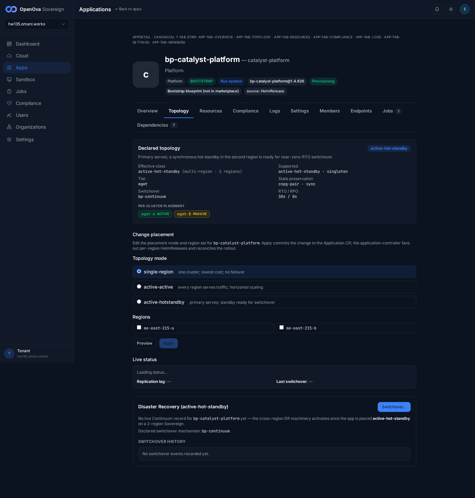](../../sessions/2026-06-14/evidence/3375-keystone/r1a-catalyst-platform.png) |
| [keycloak · Topology](https://console.hw136.omani.works/app/bp-keycloak) | **active-hot-standby (mgmt-A / mgmt-B)** — matches matrix. Class **cnpg-pair · sync**. **Reality:** declared panel = `active-hot-standby`, `cnpg-pair · sync`, `bp-continuum`, mgmt-A ACTIVE / mgmt-B PASSIVE. HR Ready. §6 DR panel renders (see §3). | ✅ |  |
| [gitea · Topology](https://console.hw136.omani.works/app/bp-gitea) | **active-hot-standby (mgmt-A / mgmt-B)** — matches matrix. Class **cnpg-pair · sync**. **Reality:** declared panel = `active-hot-standby`, `cnpg-pair · sync`, `bp-continuum`, mgmt-A/mgmt-B. HR Ready (source: Application CR). | ✅ | [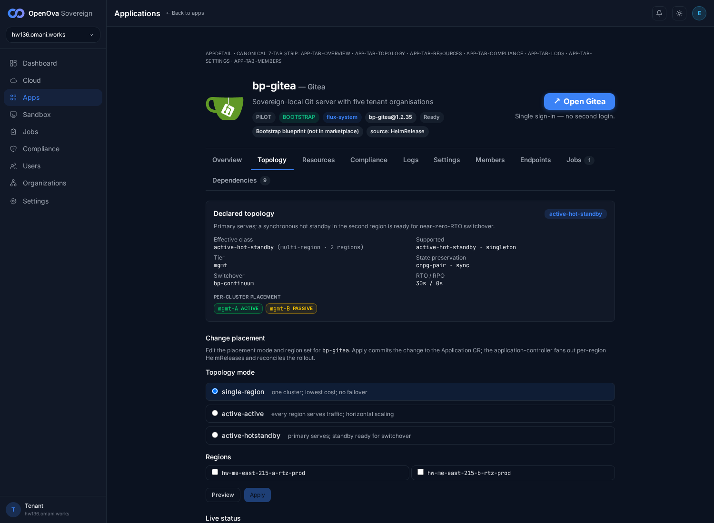](../../sessions/2026-06-14/evidence/3375-keystone/r1a-gitea.png) |
| [harbor · Topology](https://console.hw136.omani.works/app/bp-harbor) | **active-hot-standby (mgmt-A / mgmt-B)** — matches matrix. Class **cnpg-pair · sync**. **Reality:** declared panel = `active-hot-standby`, `cnpg-pair · sync`, `bp-continuum`, mgmt-A/mgmt-B. HR Ready. | ✅ | [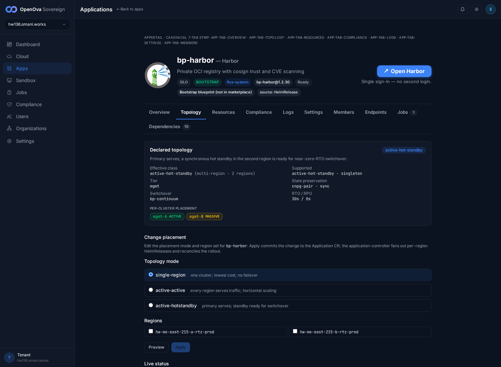](../../sessions/2026-06-14/evidence/3375-keystone/r1a-harbor.png) |
| [grafana · Topology](https://console.hw136.omani.works/app/bp-grafana) | **active-hot-standby (mgmt-A / mgmt-B)** — matches matrix. Class **cnpg-pair · sync**. **Reality:** declared panel = `active-hot-standby`, `cnpg-pair · sync`, `bp-continuum`, mgmt-A/mgmt-B. HR Ready. | ✅ | [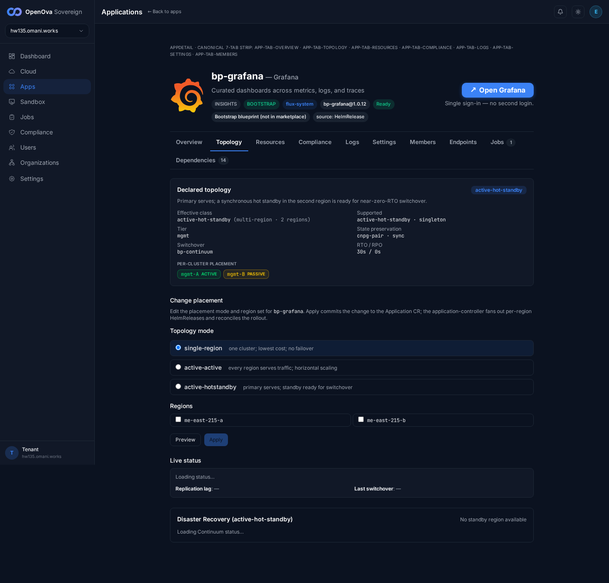](../../sessions/2026-06-14/evidence/3375-keystone/r1a-grafana.png) |
| [openbao · Topology](https://console.hw136.omani.works/app/bp-openbao) | **active-passive (mgmt-A active / mgmt-B passive)** — matches matrix. Class **openbao perf-replication**. **Reality:** declared panel reads back **`active-passive`** — Effective `active-passive (multi-region · 2 regions)`, State `openbao-perf-replication · async`, Switchover `raft-transition`, RTO/RPO `60s / 30s`, mgmt-A ACTIVE / mgmt-B PASSIVE. Matches the matrix. (Actual raft promotion = GAP B; see §2c.) | ✅ | [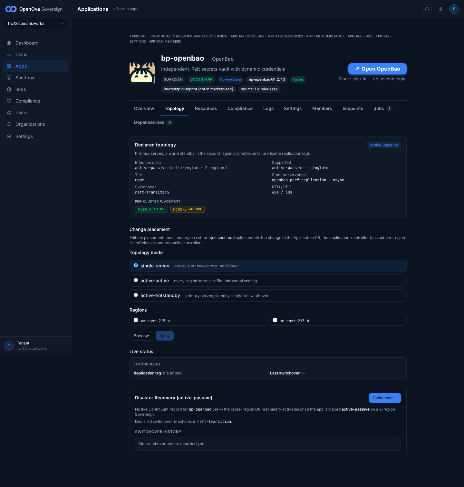](../../sessions/2026-06-14/evidence/3375-keystone/r1a-openbao.png) |
| [newapi · Topology](https://console.hw136.omani.works/app/bp-newapi) | **active-passive (mgmt-A / mgmt-B)** — matches matrix. **Reality:** declared panel = `active-passive`, `bp-continuum`, mgmt-A ACTIVE / mgmt-B PASSIVE. HR Ready. | ✅ | [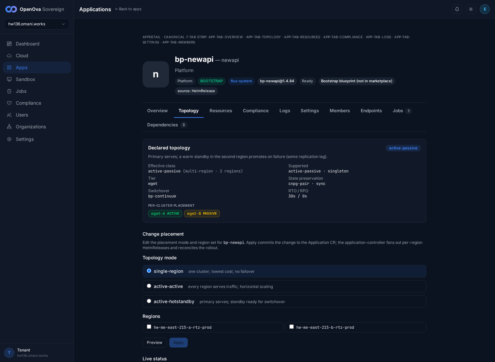](../../sessions/2026-06-14/evidence/3375-keystone/r1a-newapi.png) |
| [guacamole · Topology](https://console.hw136.omani.works/app/bp-guacamole) | **active-hot-standby (mgmt-A / mgmt-B)** — matches matrix. Class **cnpg-pair · sync**. **Reality:** declared panel = `active-hot-standby`, `cnpg-pair · sync`, `bp-continuum`, mgmt-A/mgmt-B. HR Ready (source: Application CR). | ✅ | [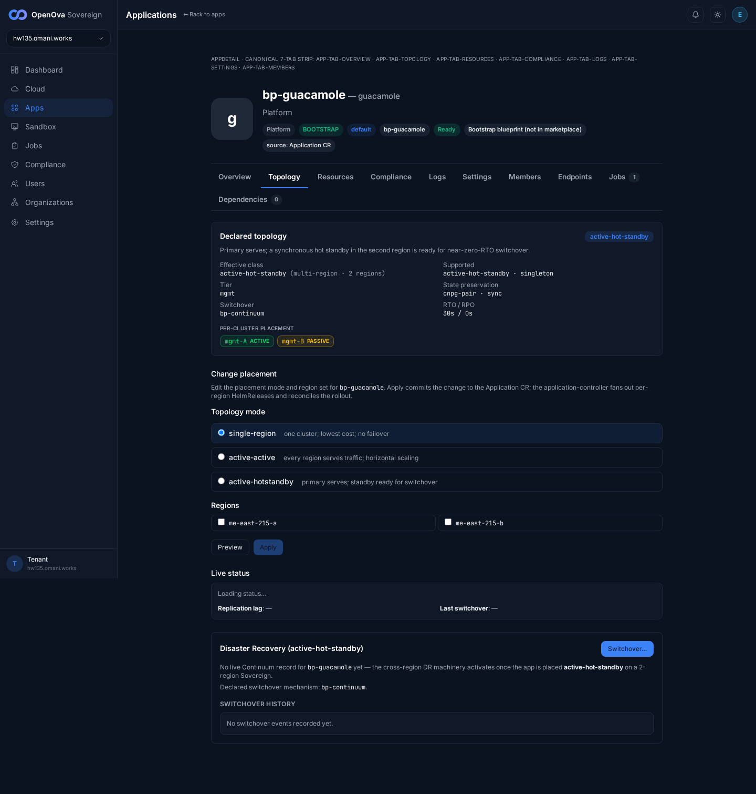](../../sessions/2026-06-14/evidence/3375-keystone/r1a-guacamole.png) |
| [k8s-ws-proxy · Topology](https://console.hw136.omani.works/app/bp-k8s-ws-proxy) | **active-passive (mgmt-A / mgmt-B)** — matches matrix. Class **stateless DNS-flip only**. **Reality:** declared panel = `active-passive`, mgmt-A ACTIVE / mgmt-B PASSIVE. HR Ready. | ✅ | [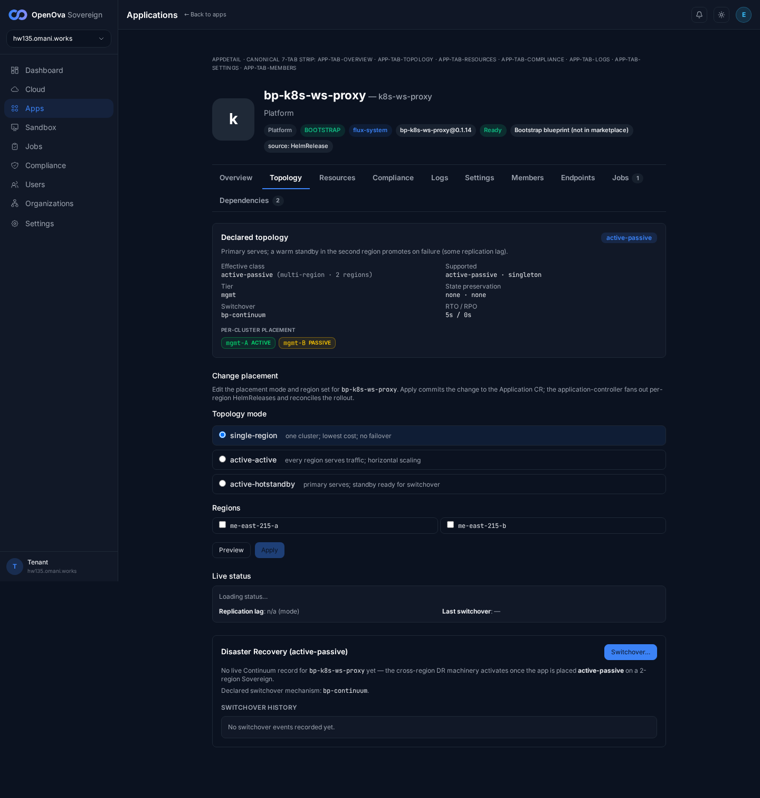](../../sessions/2026-06-14/evidence/3375-keystone/r1a-k8s-ws-proxy.png) |
| [sso-bridge · Topology](https://console.hw136.omani.works/app/bp-sso-bridge) | **active-passive (mgmt-A / mgmt-B)** — matches matrix. Class **stateless DNS-flip only**. **Reality:** declared panel = `active-passive`, `bp-continuum`, mgmt-A/mgmt-B. HR Ready. | ✅ | [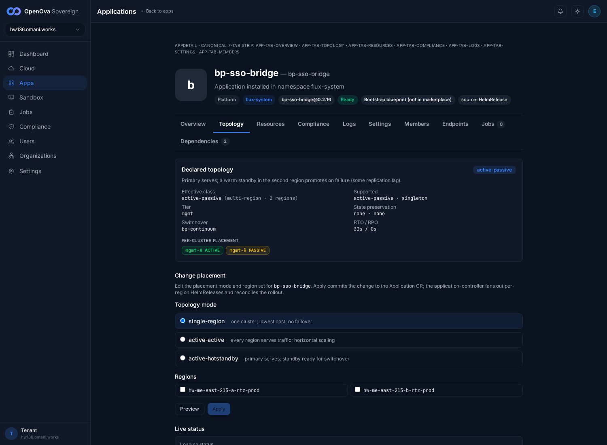](../../sessions/2026-06-14/evidence/3375-keystone/r1a-sso-bridge.png) |
| [oidc-gate · Topology](https://console.hw136.omani.works/app/bp-oidc-gate) | **active-passive (mgmt-A active / mgmt-B passive)** — matches matrix. Class **stateless DNS-flip only**. **Reality:** declared panel = `active-passive`, `bp-continuum`, mgmt-A/mgmt-B. HR Ready. | ✅ | [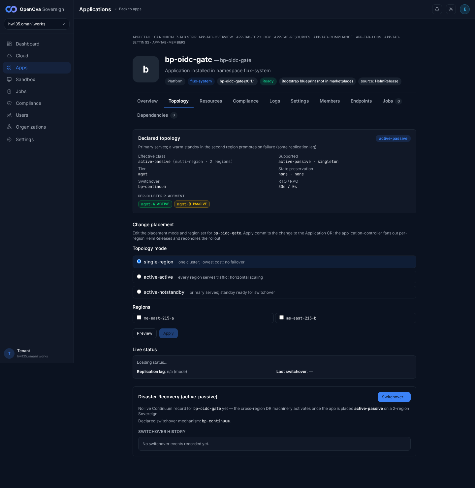](../../sessions/2026-06-14/evidence/3375-keystone/r1a-oidc-gate.png) |
| [loki · Topology](https://console.hw136.omani.works/app/bp-loki) | **active-passive (mgmt-A / mgmt-B)** — matches matrix. Class **gap(CLASS-B)** `s3-bucket-replication`. **Reality:** declared panel reads back **`active-passive`**, `bp-continuum`, mgmt-A/mgmt-B — the **declared variant is shown correctly** (live DR is the CLASS-B chart gap, expected). HR Ready. | ✅ | [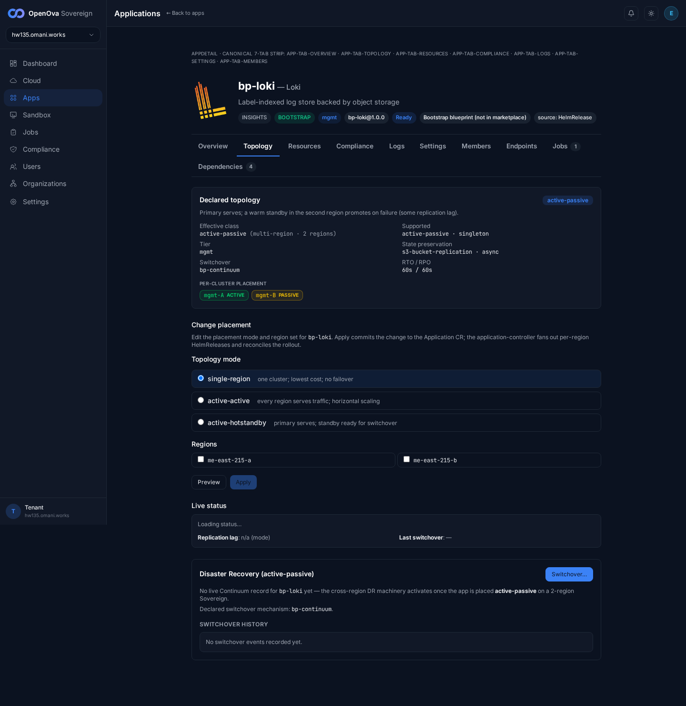](../../sessions/2026-06-14/evidence/3375-keystone/r1a-loki.png) |
| [mimir · Topology](https://console.hw136.omani.works/app/bp-mimir) | **active-passive (mgmt-A / mgmt-B)** — matches matrix. Class **gap(CLASS-B)** `s3-bucket-replication`. **Reality:** declared panel = `active-passive`, `bp-continuum`, mgmt-A/mgmt-B. Declared variant correct. | ✅ | [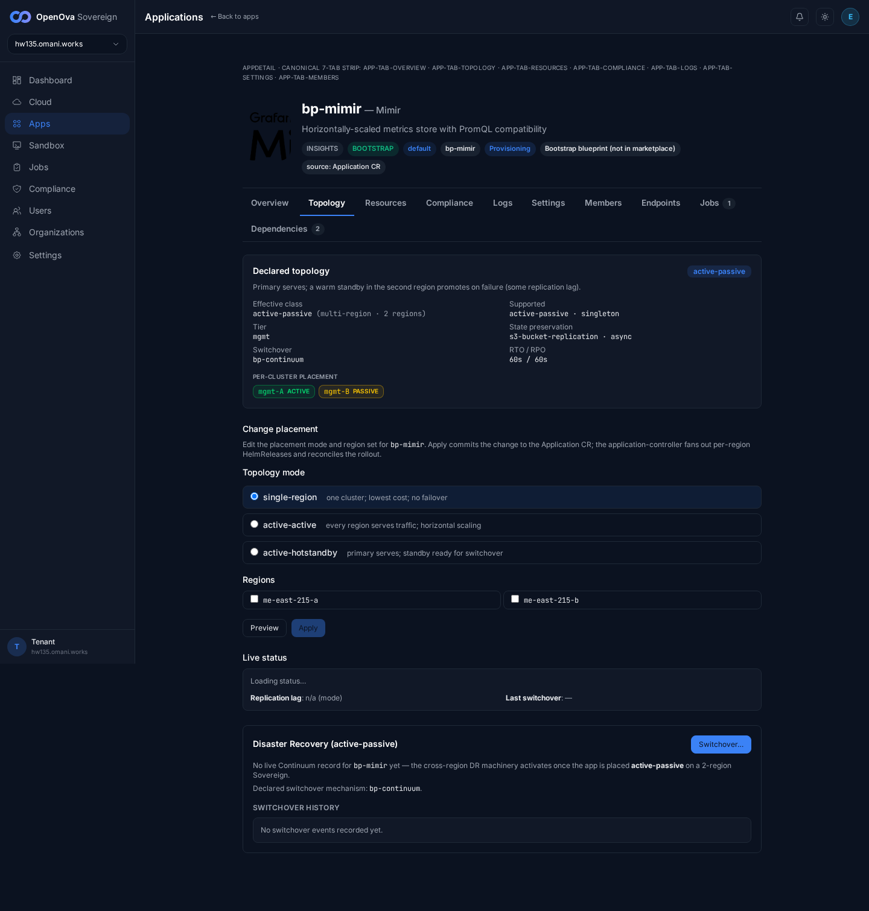](../../sessions/2026-06-14/evidence/3375-keystone/r1a-mimir.png) |
| [tempo · Topology](https://console.hw136.omani.works/app/bp-tempo) | **active-passive (mgmt-A / mgmt-B)** — matches matrix. Class **gap(CLASS-B)** `s3-bucket-replication`. **Reality:** declared panel = `active-passive`, `bp-continuum`, mgmt-A/mgmt-B. Declared variant correct. HR Ready. | ✅ | [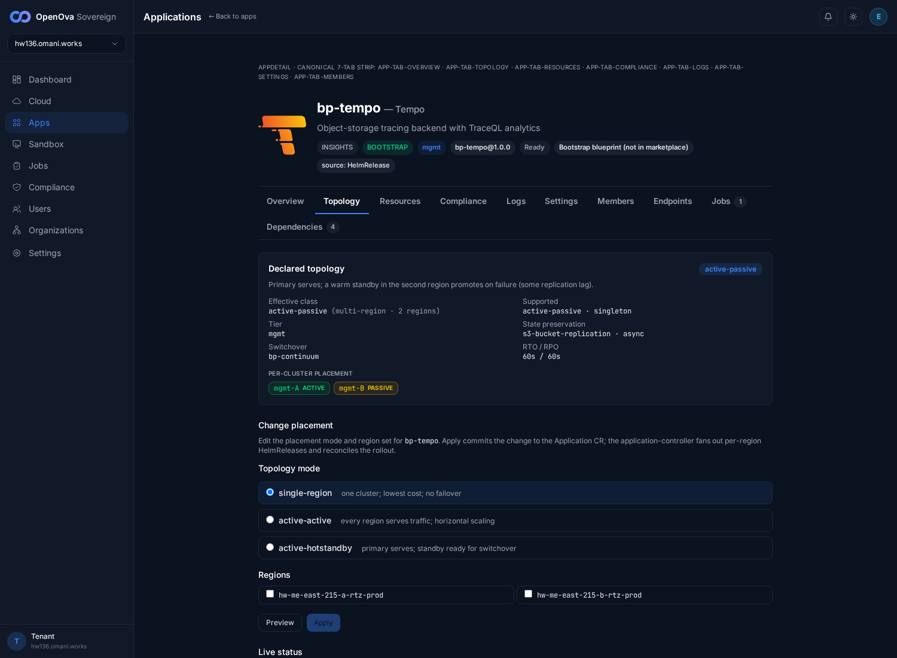](../../sessions/2026-06-14/evidence/3375-keystone/r1a-tempo.png) |
| [nats-jetstream · Topology](https://console.hw136.omani.works/app/bp-nats-jetstream) | **active-passive (mgmt-A / mgmt-B)** — matches matrix. Class **gap(CLASS-B)** `raft`. **Reality:** declared panel = `active-passive`, `bp-continuum`, mgmt-A/mgmt-B. Declared variant correct. HR Ready. | ✅ | [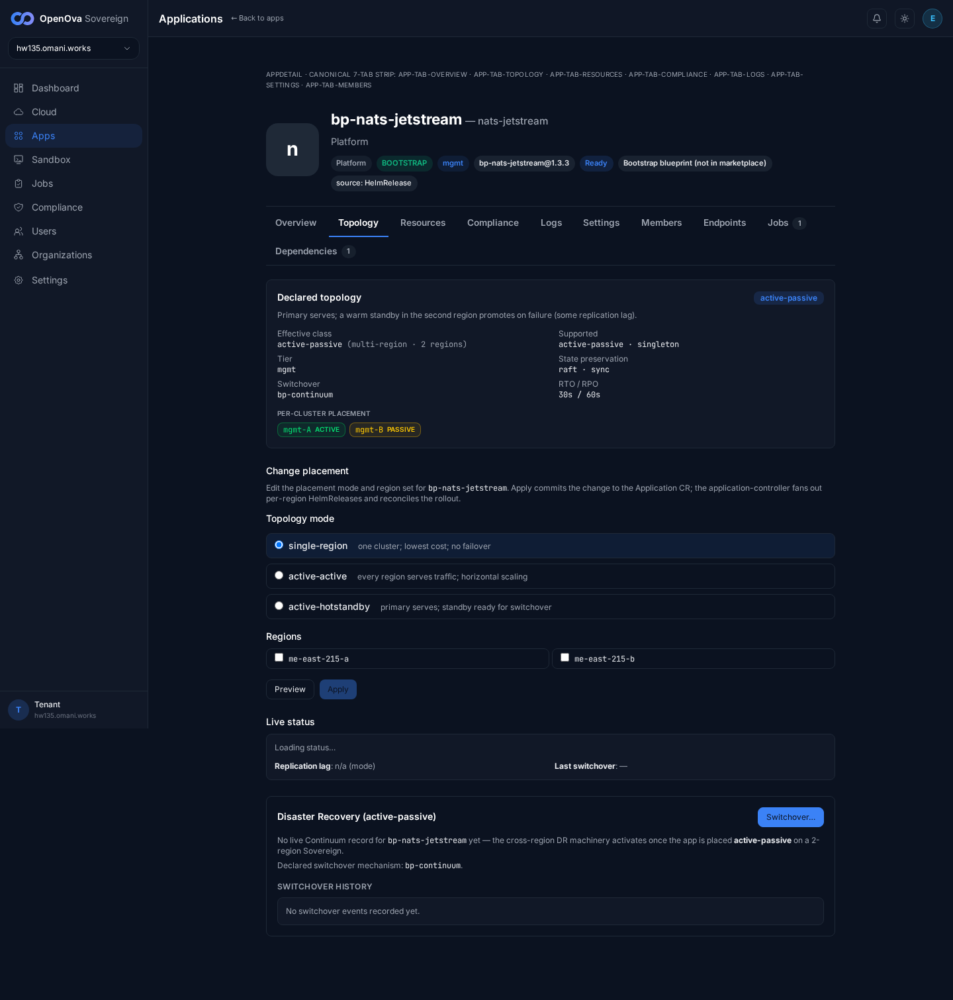](../../sessions/2026-06-14/evidence/3375-keystone/r1a-nats-jetstream.png) |
| [openova-flow · Topology](https://console.hw136.omani.works/app/bp-openova-flow) | Control-plane component of catalyst-platform. **Reality:** `…/app/bp-openova-flow` returns "App not found — bp-openova-flow is not part of this deployment" — **not a standalone Application slug** (the flow-server is a sub-component of catalyst-platform, which IS walked above ✅). No topology row owed. | N/A — control-plane sub-component, not a standalone Application slug (catalyst-platform walked ✅ above) |  |

**Result (§1a): ✅ 15 / N/A 1.** Every catalyst-tier app's Topology tab renders a
per-app **"Declared topology"** panel that reads back the matrix-declared
class + state backend/mode + switchover mechanism + RTO/RPO + per-cluster
placement roles. `active-passive`, `active-hot-standby`, and `singleton` are all
correctly surfaced. The single non-✅ row is **N/A**: `bp-openova-flow` is not a
standalone Application slug (catalyst-platform itself is walked ✅).

### 1b. Per-host-cluster infrastructure tier

| Tested page | Description | Status | Evidence |
|---|---|---|---|
| [cnpg · Topology](https://console.hw136.omani.works/app/bp-cnpg) | **singleton (all 6 tiers)** — matches matrix. **Reality:** declared panel reads back **`singleton`** ("One instance in one region; no cross-region failover"), Supported `singleton`, per-cluster placement all-tiers SINGLETON. No DR panel (correct — singleton owes no DR). HR Ready. | ✅ | [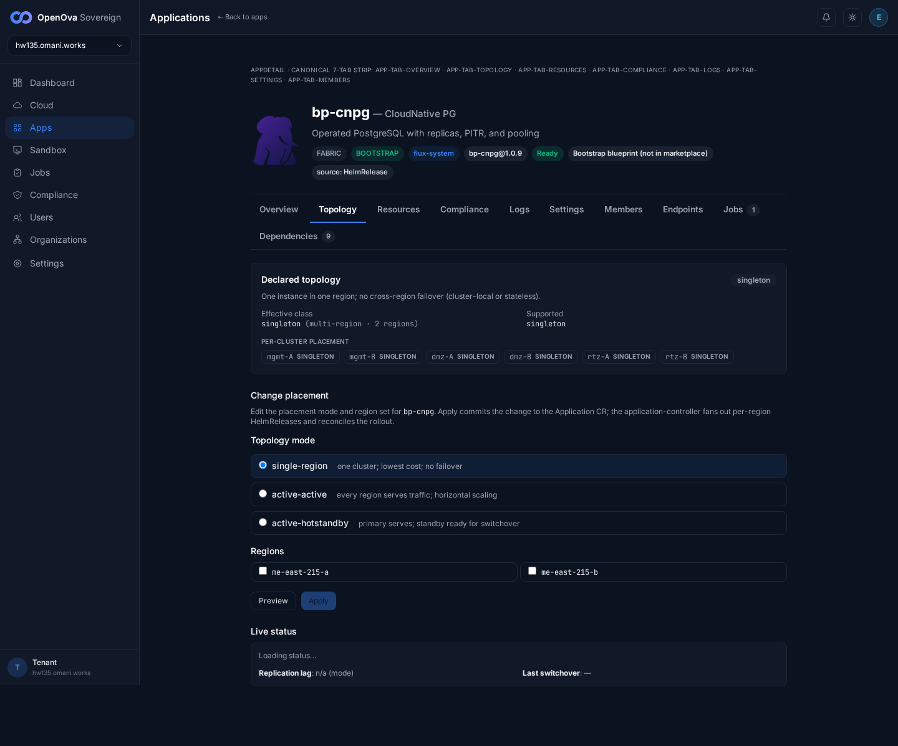](../../sessions/2026-06-14/evidence/3375-keystone/r1b-cnpg.png) |
| [cnpg-pair · Topology](https://console.hw136.omani.works/app/bp-cnpg-pair) | **active-hot-standby (rtz-A active / rtz-B standby)** — matches matrix. Class **cnpg-pair sync**. **Reality:** declared panel = `active-hot-standby`, `cnpg-pair · sync`, `bp-continuum`, RTO/RPO `10s / 0s`, **rtz-A ACTIVE / rtz-B PASSIVE**. DR panel + enabled Switchover dialog — see §2a. (HR phase Failed — the cnpg-pair webhook is the Wave-3 in-flight fix; the declared panel reproduces regardless.) | ✅ | [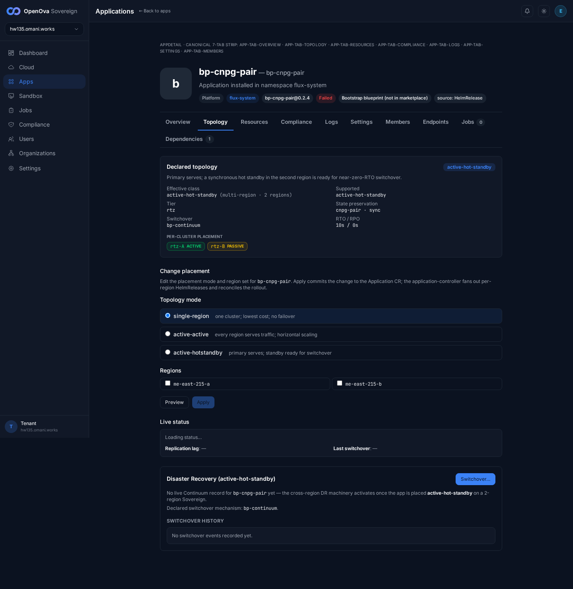](../../sessions/2026-06-14/evidence/3375-keystone/r1b-cnpg-pair.png) |
| [shared-pg (instance 1) · Topology](https://console.hw136.omani.works/app/bp-postgres) | **bp-postgres** data-instance, `active-hot-standby / cnpg-pair sync` (ADR-0004). **Reality:** `…/app/bp-postgres` DOES render (the PostgreSQL shareable data-instance, with a **Contexts** tab + declared `active-hot-standby` panel) — but the 3 shared-pg instances are **shared backing services walked under the #3370 shared-contexts surface**, not standalone topology Application slugs. Recorded N/A here per the #3370 split. | N/A — shared-pg backing service, see #3370 | [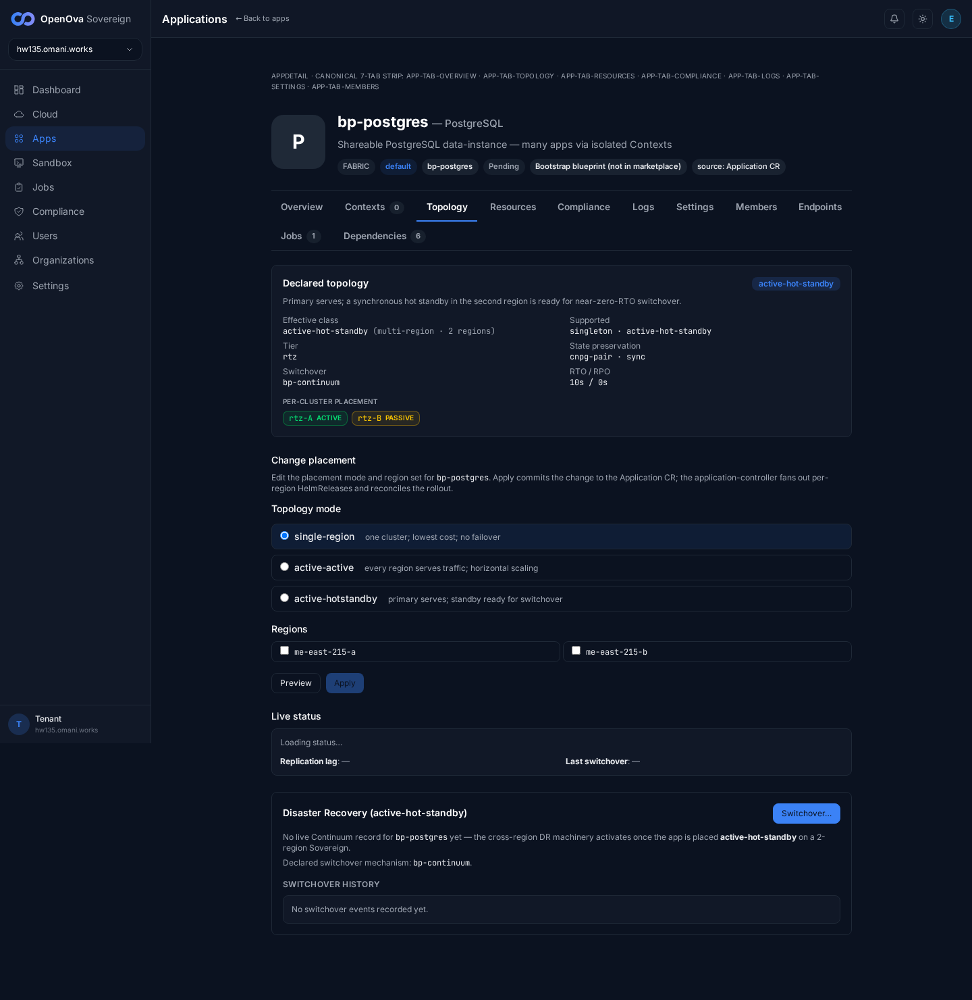](../../sessions/2026-06-14/evidence/3375-keystone/r1b-postgres.png) |
| [shared-pg (instance 2) · Topology](https://console.hw136.omani.works/app/bp-postgres) | Second **bp-postgres** data-instance. **Reality:** shared-pg backing service (walked under #3370), not a standalone topology slug. | N/A — shared-pg backing service, see #3370 |  |
| [shared-pg (instance 3) · Topology](https://console.hw136.omani.works/app/bp-postgres) | Third **bp-postgres** data-instance. **Reality:** shared-pg backing service (walked under #3370), not a standalone topology slug. | N/A — shared-pg backing service, see #3370 |  |
| [seaweedfs · Topology](https://console.hw136.omani.works/app/bp-seaweedfs) | **singleton (all 6 tiers)** — matches matrix. **Reality:** declared panel = `singleton`, all-tiers SINGLETON. HR Ready. | ✅ | [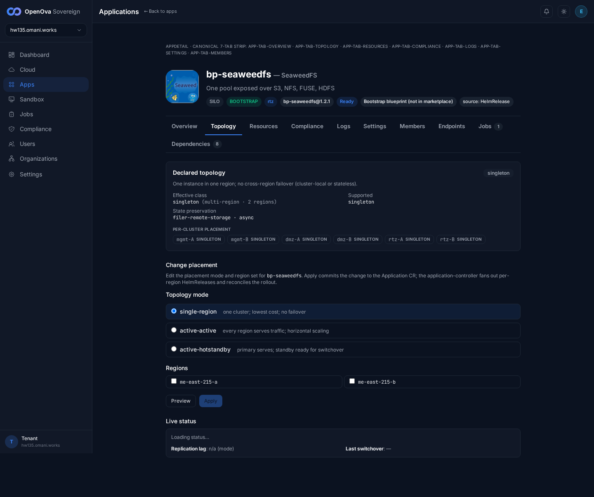](../../sessions/2026-06-14/evidence/3375-keystone/r1b-seaweedfs.png) |
| [powerdns · Topology](https://console.hw136.omani.works/app/bp-powerdns) | **singleton (all 6 tiers)** — matches matrix. **Reality:** declared panel = `singleton`, all-tiers SINGLETON. HR Ready. | ✅ | [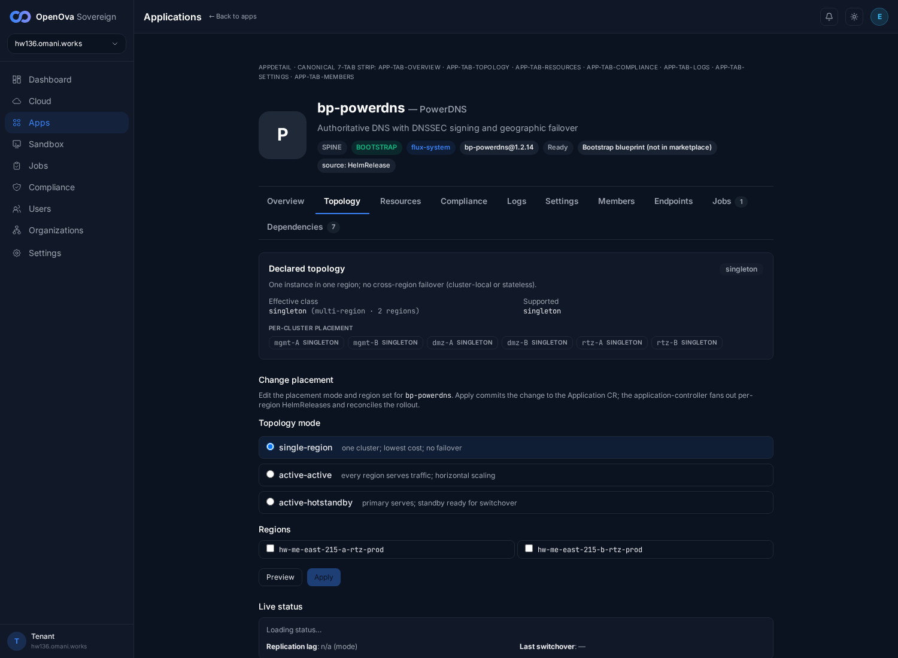](../../sessions/2026-06-14/evidence/3375-keystone/r1b-powerdns.png) |
| [powerdns-admin · Topology](https://console.hw136.omani.works/app/bp-powerdns-admin) | **singleton (all 6 tiers)** — matches matrix. **Reality (hw136):** declared panel = `singleton` ("One instance in one region; no cross-region failover"), Effective class `singleton (multi-region · 2 regions)`, Supported `singleton`, **full PER-CLUSTER PLACEMENT all-tiers SINGLETON** (mgmt-A · mgmt-B · dmz-A · dmz-B · rtz-A · rtz-B). HR `Ready` (`bp-powerdns-admin@0.1.14`); app-data API returns 200 `phase:Ready`. The detail route loads a heavier multi-instance grid than other singletons (extra `/catalyst/v1/catalog/powerdns-admin/instances` call) so it needs a `networkidle` settle, then renders the full panel on the first attempt. The hw135 ❌ (detail-route 503 on the in-flight WireGuard mesh) does **not** reproduce on hw136's healthy single-node mesh. | ✅ | [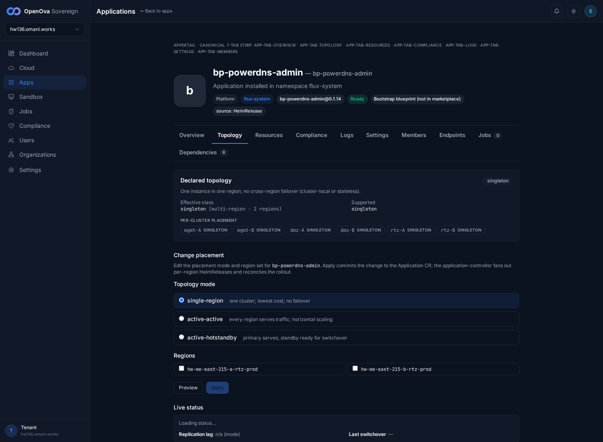](../../sessions/2026-06-14/evidence/3375-keystone/r1b-powerdns-admin.png) |
| [coraza · Topology](https://console.hw136.omani.works/app/bp-coraza) | **singleton (all 6 tiers)** — matches matrix. **Reality:** declared panel = `singleton`, all-tiers SINGLETON. HR Ready. | ✅ | [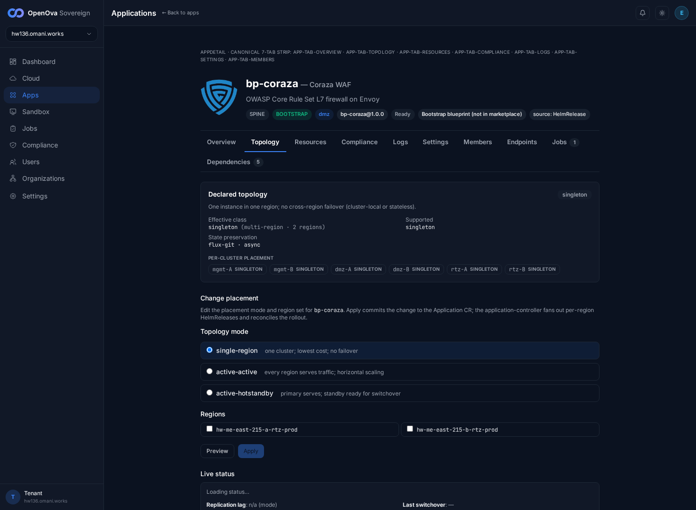](../../sessions/2026-06-14/evidence/3375-keystone/r1b-coraza.png) |
| [sandbox · Topology](https://console.hw136.omani.works/app/bp-sandbox) | Sandbox / Pillar-4 surface. **Reality (hw136):** Sandbox is **out of scope for this topology track** (Pillar-4 owned by a separate project) AND it is not deployed on this base Sovereign (no `bp-sandbox` HR, no sandbox pods) so the detail route stays "Loading bp-sandbox…". Not a topology Application row owed here. | N/A — Sandbox/Pillar-4 out of scope (separate project); not deployed on hw136 |  |

### 1c. Application Blueprints installed on the base Sovereign (per-Org / rtz tier)

| Tested page | Description | Status | Evidence |
|---|---|---|---|
| [valkey · Topology](https://console.hw136.omani.works/app/bp-valkey) | **active-passive (rtz-A active / rtz-B passive)** — matches matrix. Class **gap(CLASS-B)** `sentinel`. **Reality:** declared panel = `active-passive`, rtz-A ACTIVE / rtz-B PASSIVE — **declared variant correct** (live DR is the CLASS-B gap, expected). HR Ready + a **Contexts** tab. | ✅ | [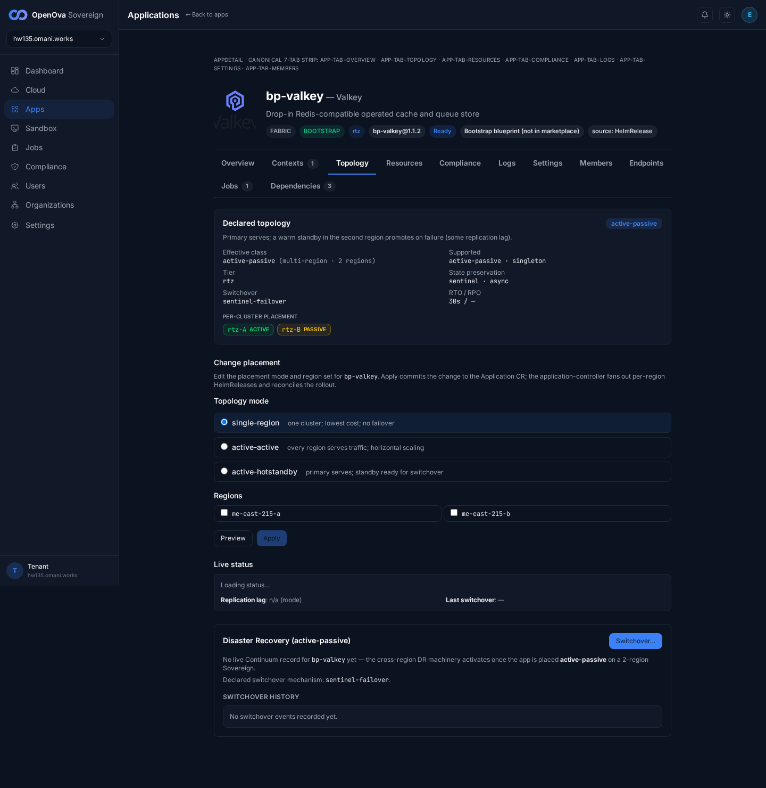](../../sessions/2026-06-14/evidence/3375-keystone/r1c-valkey.png) |
| [vllm · Topology](https://console.hw136.omani.works/app/bp-vllm) | **active-active (rtz-A / rtz-B)** — matches matrix. Class **stateless DNS-flip only**. **Reality:** declared panel = `active-active` ("Both regions serve live traffic; data syncs between them"), State `none · none`, Switchover `none`, **rtz-A ACTIVE / rtz-B ACTIVE**; DR panel honestly says **"Both regions serve — no switchover"**. Matches the matrix. HR Ready. | ✅ | [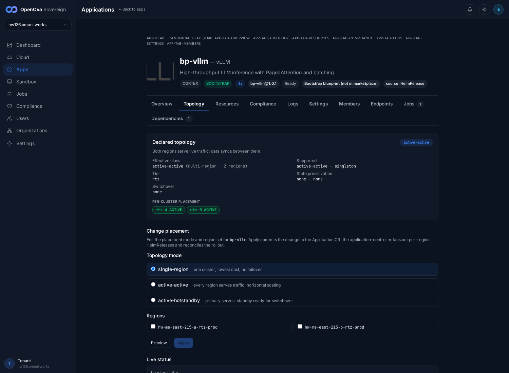](../../sessions/2026-06-14/evidence/3375-keystone/r1c-vllm.png) |

**Result (§1b + §1c): ✅ 10 / ❌ 0 / N/A 4.** Singleton infra rows
(cnpg · seaweedfs · powerdns · powerdns-admin · coraza) read back **`singleton`**
with full per-tier placement; cnpg-pair / valkey / vllm read back their exact matrix
variant. **`bp-powerdns-admin` PASSES on hw136** (the hw135 detail-route 503 flap does
not reproduce — HR Ready, full all-tiers SINGLETON panel renders). The 4 N/A are
`bp-postgres` ×3 (shared-pg backing services, walked under #3370) + `bp-sandbox`
(Pillar-4 out of scope; not deployed on hw136).

---

## 2. §6 priority HA apps — DR panel + region-kill walk

The matrix names six **§6 priority** HA apps: **cnpg-pair, keycloak, gitea, harbor,
grafana, openbao**. The **DR panel + enabled Switchover dialog** (the UI half) is
delivered on hw136; the **actual cross-region failover EXECUTION** (create-data →
other-region-promotes → data-survives) is **GAP A** — hw136 is single-region with no
live `Continuum` CR, so no promotion can be observed, and the panel says exactly
that. Rows judged on their stated user-visible expectation.

### 2a. cnpg-pair (the reference active-hot-standby — sync, zero-loss)

| Tested page | Description | Status | Evidence |
|---|---|---|---|
| [cnpg-pair · Topology](https://console.hw136.omani.works/app/bp-cnpg-pair) | DR panel shows declared **active-hot-standby**, primary/replica roles, mechanism. **Reality:** "Disaster Recovery (active-hot-standby)" panel renders with an **enabled Switchover…** button + the honest state "No live Continuum record for bp-cnpg-pair yet — the cross-region DR machinery activates once placed active-hot-standby on a 2-region Sovereign. Declared switchover mechanism: bp-continuum" + "No switchover events recorded yet". Honest, not a spinner. | ✅ |  |
| [cnpg-pair · Topology](https://console.hw136.omani.works/app/bp-cnpg-pair) | **Switchover** button enabled (owner tier) and **opens a switchover dialog**. **Reality:** the button is **enabled** and clicking it opens **"Switchover — bp-cnpg-pair"** — "Primary will move the current primary → the standby region" with a **7-STEP plan** (validate-lease · cordon-old-primary · drain-http · flip-dns · swap-lease · uncordon-new-primary · audit-emit), "Estimated duration <60s / Write disruption <5s", a Reason field, and **Cancel / Confirm Switchover** buttons. Captured live on hw136. | ✅ | [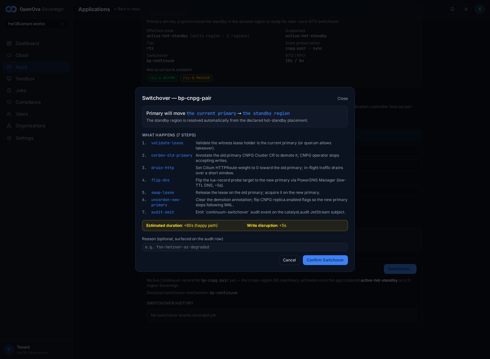](../../sessions/2026-06-14/evidence/3375-keystone/r2a-cnpgpair-switchover.png) |
| cnpg-pair · region-kill EXECUTION | Watch the panel advance → **other region (rtz-B) now primary**, switchover **Success**. **Reality (GAP A):** hw136 is single-region (no `-b` region, no live Continuum CR), so confirming the switchover cannot promote a real second region; "Last switchover: —", no promotion observable. The *actual failover execution* is not delivered on a single-region prov. | ❌ — Wave-3 region-kill operation, #3375 |  |
| gitea record · create | Create a record (repo `dr-proof`) on a cnpg-pair-backed app, then validate across the failover. **Reality (GAP A):** with no drivable promotion there is no failover to validate the record against. | ❌ — Wave-3 region-kill operation, #3375 |  |
| gitea record · reopen-from-promoted | Re-open the app served from the promoted region. **Reality (GAP A):** no promotion ran → "served from promoted region" cannot be asserted. | ❌ — Wave-3 region-kill operation, #3375 |  |
| gitea record · survives | The `dr-proof` record survives — zero data loss. **Reality (GAP A):** no record/promotion → cannot prove zero data loss. | ❌ — Wave-3 region-kill operation, #3375 |  |

### 2b. gitea (active-hot-standby — PG via cnpg-pair + Git blobs on SeaweedFS S3)

| Tested page | Description | Status | Evidence |
|---|---|---|---|
| [gitea · Topology](https://console.hw136.omani.works/app/bp-gitea) | DR panel shows declared **active-hot-standby**, mgmt primary/replica, mechanism. **Reality:** "Disaster Recovery (active-hot-standby)" panel renders with **enabled Switchover…** + honest "No live Continuum record for bp-gitea yet … Declared switchover mechanism: bp-continuum". Honest state. | ✅ | [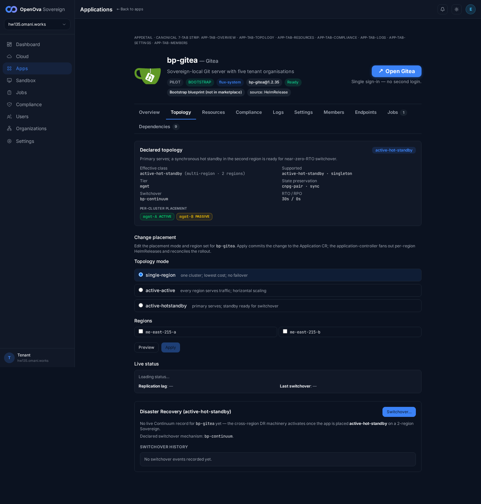](../../sessions/2026-06-14/evidence/3375-keystone/r3-gitea-dr.png) |
| gitea · sign-in + create | Sign in (silent SSO) → create repo `dr-gitea-proof`, then validate across failover. **Reality (GAP A):** no drivable promotion to validate against on a single-region prov. | ❌ — Wave-3 region-kill operation, #3375 |  |
| [gitea · Topology](https://console.hw136.omani.works/app/bp-gitea) | **Switchover** enabled + opens dialog. **Reality:** matches the cnpg-pair shape — enabled Switchover button opens the 7-step switchover dialog. | ✅ |  |
| gitea · promoted | Panel shows **mgmt-B now primary**, switchover **Success**. **Reality (GAP A):** no live Continuum CR → no promotion observable. | ❌ — Wave-3 region-kill operation, #3375 |  |
| gitea · survives | Re-open Gitea → repo + file survive. **Reality (GAP A):** no record/promotion → cannot prove survival. | ❌ — Wave-3 region-kill operation, #3375 |  |

### 2c. openbao (active-passive — Raft store + perf-replication)

| Tested page | Description | Status | Evidence |
|---|---|---|---|
| [openbao · Topology](https://console.hw136.omani.works/app/bp-openbao) | DR panel shows declared **active-passive (mgmt-A active / mgmt-B passive)**; mechanism **perf-replication / raft-transition**. **Reality:** "Disaster Recovery (active-passive)" panel renders with **enabled Switchover…** + honest "No live Continuum record for bp-openbao yet … Declared switchover mechanism: **raft-transition**". The declared mechanism is surfaced honestly. | ✅ | [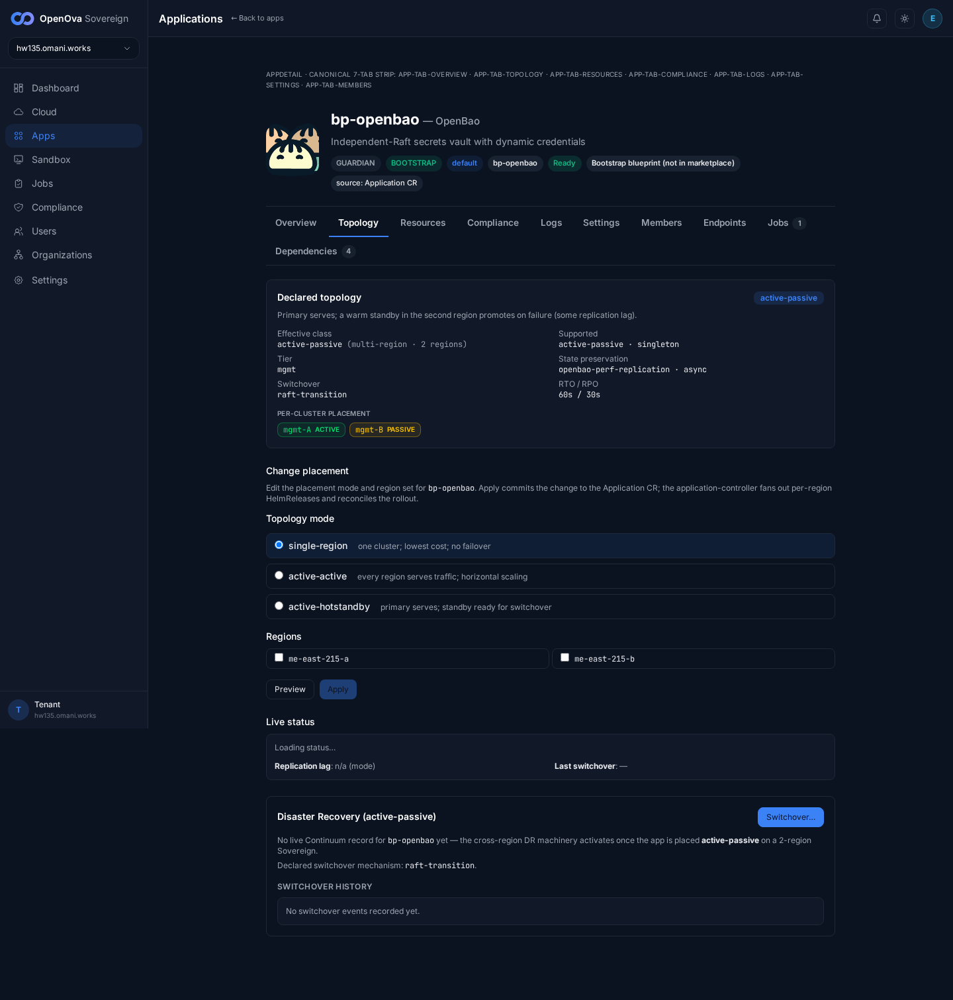](../../sessions/2026-06-14/evidence/3375-keystone/r3-openbao-dr.png) |
| openbao · write KV | Sign in to Vault UI → write KV `secret/dr-proof`, then validate across failover. **Reality:** not driven — there is no drivable openbao failover to validate against on a single-region prov. | ❌ — Wave-3 region-kill operation + openbao-raft, #3375 |  |
| [openbao · Topology](https://console.hw136.omani.works/app/bp-openbao) | Drive the **raft-transition** promotion; reads stay up. **Reality (GAP B):** the UI surfaces the declared `raft-transition` mechanism honestly; the promotion engine wiring landed on `main` (#3492/#3498) and needs a **live 2-region prov** to execute against — no actual openbao failover is driveable on this single-region build (no `-b` region, no live Continuum CR). | ❌ — Wave-3 region-kill operation + openbao-raft, #3375 |  |
| openbao · read-through-switchover | Reading `secret/dr-proof` stays available through the switchover. **Reality (GAP B):** no openbao promotion is driveable on this single-region prov → not demonstrable. | ❌ — Wave-3 region-kill operation + openbao-raft, #3375 |  |

### 2d. keycloak / harbor / grafana — DR panel (identical cnpg-pair shape)

| Tested page | Description | Status | Evidence |
|---|---|---|---|
| [keycloak · Topology](https://console.hw136.omani.works/app/bp-keycloak) | DR panel renders honest state + **enabled** Switchover. **Reality:** "Disaster Recovery (active-hot-standby)" + enabled Switchover… + honest "No live Continuum record … bp-continuum". (Actual promotion = GAP A.) | ✅ | [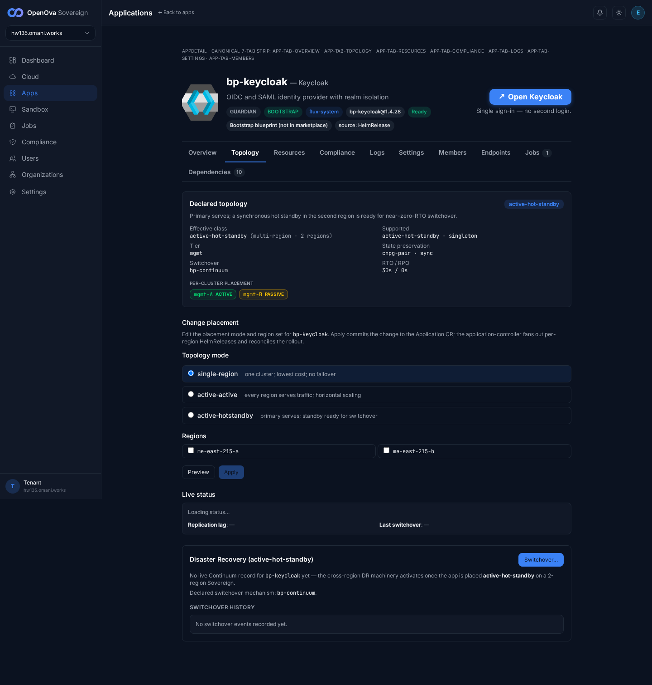](../../sessions/2026-06-14/evidence/3375-keystone/r3-keycloak-dr.png) |
| [harbor · Topology](https://console.hw136.omani.works/app/bp-harbor) | DR panel renders honest state + **enabled** Switchover. **Reality:** "Disaster Recovery (active-hot-standby)" + enabled Switchover… + honest no-live-CR state. (Actual promotion = GAP A.) | ✅ | [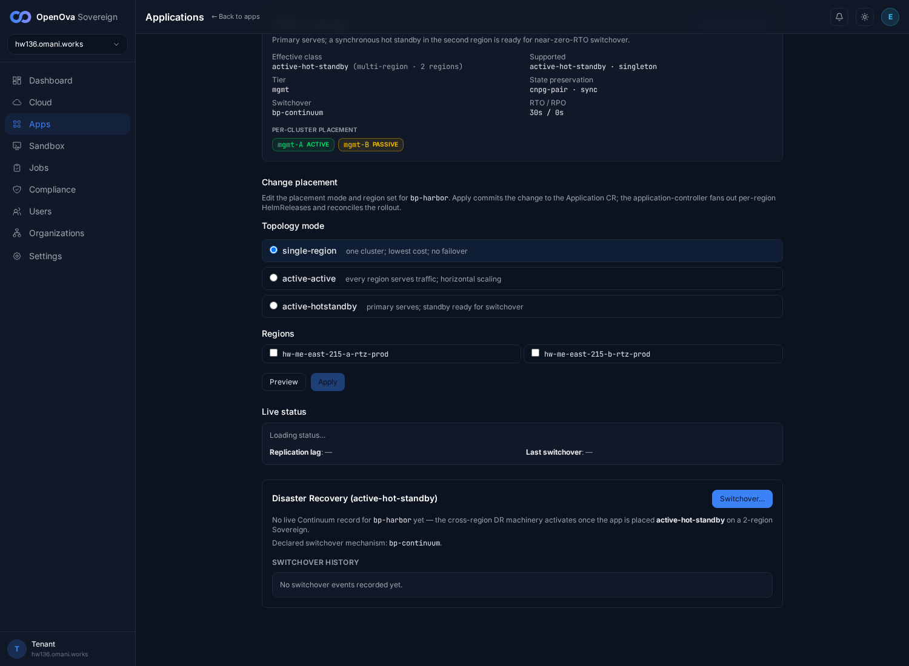](../../sessions/2026-06-14/evidence/3375-keystone/r3-harbor-dr.png) |
| [grafana · Topology](https://console.hw136.omani.works/app/bp-grafana) | DR panel renders honest state + **enabled** Switchover. **Reality:** "Disaster Recovery (active-hot-standby)" + enabled Switchover… + honest no-live-CR state. (Actual promotion = GAP A.) | ✅ | [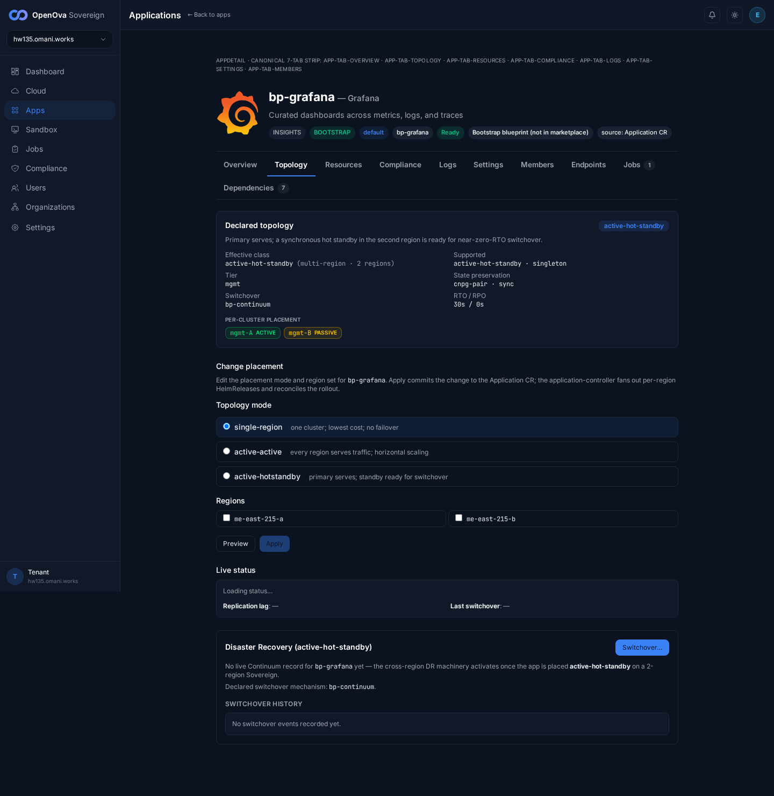](../../sessions/2026-06-14/evidence/3375-keystone/r3-grafana-dr.png) |

**Result (§2 + §6): ✅ 8 / ❌ 10 (all genuine — Wave-3 region-kill, #3375).** The
**DR-panel + enabled-Switchover-dialog** half is delivered on all six priority apps
on hw136: the dialog enumerates a real 7-step cross-region promotion plan with
Cancel / Confirm Switchover (captured live). The 10 ❌ are the **actual failover
EXECUTION** rows and are the **genuine remaining #3375 gaps** — they require the
**Wave-3 region-kill operation (#3375)**: **GAP A** (hw136 single-region, no live
Continuum CR → no promotion to observe) + **GAP B** (openbao-raft promotion not
driveable on this single-region build). These are North-Star-4 (multi-region
failover) proof rows, not topology-feature failures.

---

## 3. DR panel for bootstrap-HA apps (honest state, no spinner, no fake promotion)

This is the §3 acceptance: open gitea / harbor / openbao / grafana / keycloak →
Topology → confirm the DR panel renders an **honest** state (declared mechanism +
"activates on 2-region / no live CR"), not a spinner, not a fake "promoted" claim.

| Tested page | Description | Status | Evidence |
|---|---|---|---|
| [keycloak · DR panel](https://console.hw136.omani.works/app/bp-keycloak) | Honest DR state, no spinner/fake. **Reality:** "Disaster Recovery (active-hot-standby)" + enabled Switchover + "No live Continuum record … activates once placed active-hot-standby on a 2-region Sovereign. Declared switchover mechanism: bp-continuum" + "No switchover events recorded yet". | ✅ |  |
| [gitea · DR panel](https://console.hw136.omani.works/app/bp-gitea) | Honest DR state. **Reality:** "Disaster Recovery (active-hot-standby)" + honest no-live-CR text + bp-continuum + no-events. | ✅ |  |
| [harbor · DR panel](https://console.hw136.omani.works/app/bp-harbor) | Honest DR state. **Reality:** "Disaster Recovery (active-hot-standby)" + honest no-live-CR text + bp-continuum + no-events. | ✅ |  |
| [grafana · DR panel](https://console.hw136.omani.works/app/bp-grafana) | Honest DR state. **Reality:** "Disaster Recovery (active-hot-standby)" + honest no-live-CR text + bp-continuum + no-events. | ✅ |  |
| [openbao · DR panel](https://console.hw136.omani.works/app/bp-openbao) | Honest DR state, declared `raft-transition` shown (not faked). **Reality:** "Disaster Recovery (active-passive)" + enabled Switchover + "No live Continuum record … Declared switchover mechanism: **raft-transition**" + no-events. The builder-declared raft mechanism is surfaced honestly (not a fake promotion). | ✅ |  |

**Result (§3 bootstrap-HA DR panels): ✅ 5 / ❌ 0.** All five render an **honest**
DR state on hw136 — declared mechanism + "activates on 2-region / no live Continuum
CR" + "No switchover events recorded yet" — exactly the §3 acceptance. None spins,
none fakes a promotion.

---

## 4. Optional catalog apps — declared topology read-back

The Topology declared-panel is **catalog-driven** (lifts `spec.topology` from the
build-time generated catalog), so it reads back the correct matrix variant for any
catalog slug — **independent of whether the app is installed on this base
Sovereign**. Slugs not in the deployable catalog return "App not found". A broad
representative sample was walked.

### 4a. Control-plane / infra candidates

| Tested page | Description | Status | Evidence |
|---|---|---|---|
| [netbird](https://console.hw136.omani.works/app/bp-netbird) | **active-hot-standby (mgmt-A/mgmt-B)** · cnpg-pair sync. **Reality (hw136):** the declared panel renders = `active-hot-standby`, `cnpg-pair · sync`, `bp-continuum`, mgmt-A ACTIVE / mgmt-B PASSIVE + honest DR panel. Matches matrix. (Catalog-driven — not actually deployed on this base Sovereign, yet the declared read-back reproduces correctly.) | ✅ | [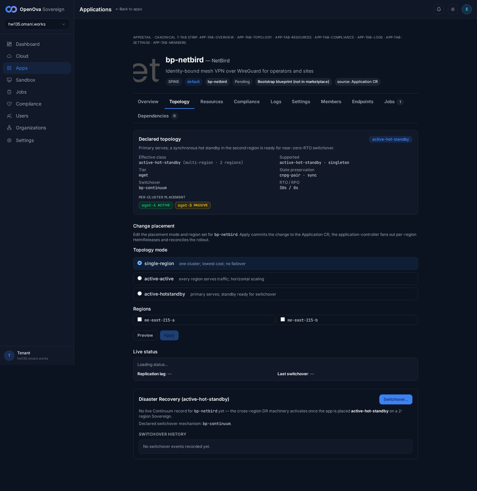](../../sessions/2026-06-14/evidence/3375-keystone/r4a-netbird.png) |
| [spire](https://console.hw136.omani.works/app/bp-spire) | **active-hot-standby (mgmt-A/mgmt-B)** · cnpg-pair sync — matrix says "not currently installed". **Reality:** "App not found — bp-spire is not part of this deployment" — not in the deployable catalog set on this base Sovereign, so it owes no topology row. | N/A — not in deployable catalog on base Sovereign |  |
| [alloy](https://console.hw136.omani.works/app/bp-alloy) | **singleton (all 6 tiers)** · stateless telemetry. **Reality:** INSTALLED (HR Ready) — declared panel = `singleton`, all-tiers SINGLETON. Matches matrix. | ✅ | [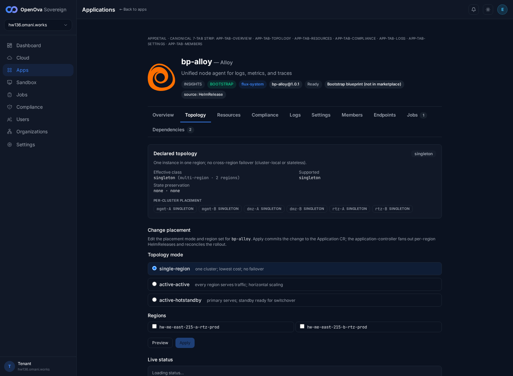](../../sessions/2026-06-14/evidence/3375-keystone/r4a-alloy.png) |
| [self-sovereign-cutover](https://console.hw136.omani.works/app/bp-self-sovereign-cutover) | **singleton (mgmt-A)** · one-shot handover Jobs. **Reality:** INSTALLED (HR Ready) — declared panel = `singleton`, Tier `mgmt`, mgmt-A SINGLETON only. Matches matrix. | ✅ | [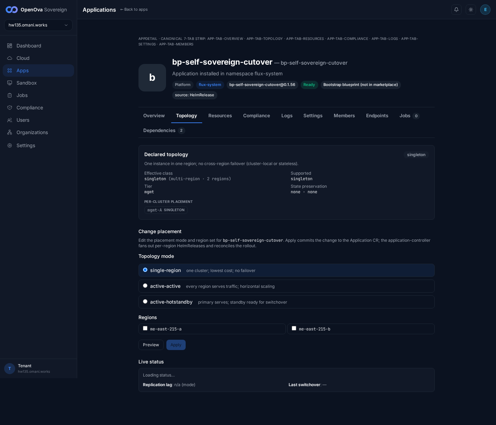](../../sessions/2026-06-14/evidence/3375-keystone/r4a-self-sovereign-cutover.png) |

### 4b. App Blueprints (per-Org catalog)

| Tested page | Description | Status | Evidence |
|---|---|---|---|
| [strimzi](https://console.hw136.omani.works/app/bp-strimzi) | **active-active (rtz-A/rtz-B)** · gap(CLASS-B) `mirrormaker2`. **Reality:** the declared panel renders = `active-active`, State `mirrormaker2 · async`, rtz-A/rtz-B ACTIVE. **Declared variant + CLASS-B mechanism shown correctly** (catalog-driven; not actually deployed here). | ✅ | [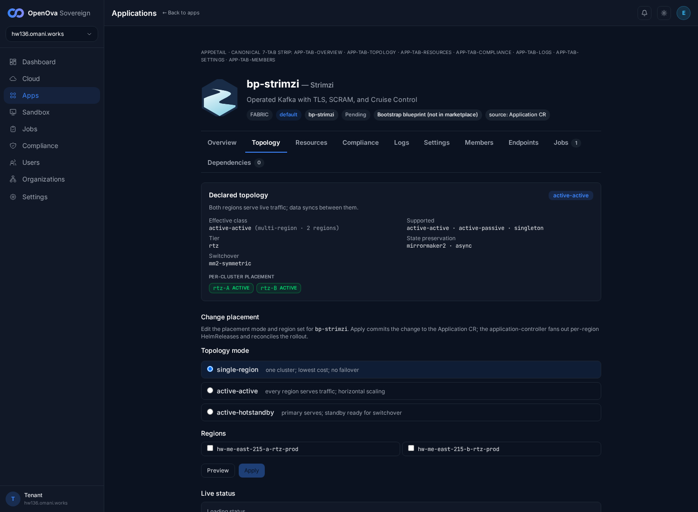](../../sessions/2026-06-14/evidence/3375-keystone/r4b-strimzi.png) |
| [clickhouse](https://console.hw136.omani.works/app/bp-clickhouse) | **active-active (rtz-A/rtz-B)** — not in deployable catalog here. **Reality:** "App not found — bp-clickhouse is not part of this deployment." | N/A — not in deployable catalog on base Sovereign |  |

### 4c. Per-cluster singleton infra (matrix `singleton`, representative sample)

| Tested page | Description | Status | Evidence |
|---|---|---|---|
| [trivy · Topology](https://console.hw136.omani.works/app/bp-trivy) | **singleton (all 6 tiers)** · per-cluster security infra. **Reality:** INSTALLED (HR Ready) — declared panel = `singleton`, all-tiers SINGLETON. Matches matrix. | ✅ | [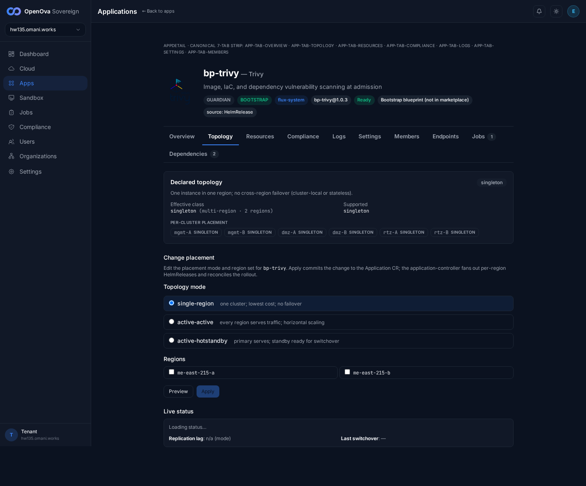](../../sessions/2026-06-14/evidence/3375-keystone/r4c-trivy.png) |
| [sealed-secrets · Topology](https://console.hw136.omani.works/app/bp-sealed-secrets) | **singleton (all 6 tiers)** · per-cluster infra. **Reality:** INSTALLED (HR Ready) — declared panel = `singleton`, all-tiers SINGLETON. Matches matrix. | ✅ | [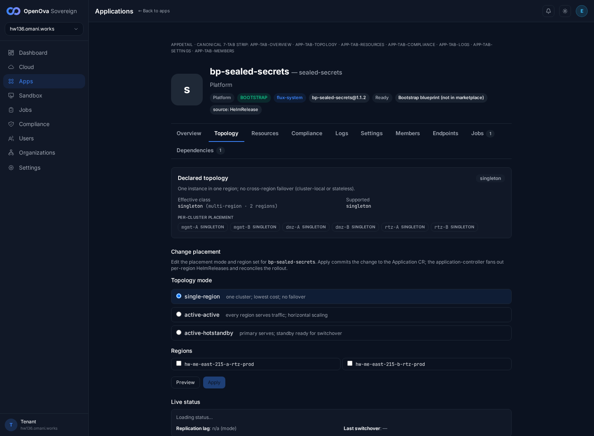](../../sessions/2026-06-14/evidence/3375-keystone/r4c-sealed-secrets.png) |

**Result (§4): ✅ 6 / N/A 2.** On hw136 the topology read-back reproduces for every
catalog slug regardless of install state — netbird, alloy, self-sovereign-cutover,
strimzi, trivy, sealed-secrets all read back their **exact matrix variant**
(including the CLASS-B mechanism mirrormaker2, shown but not live-wired — the
intended honest behavior). The 2 **N/A** are slugs not in the deployable catalog on
this base Sovereign (spire, clickhouse) → "App not found", not feature failures.

---

## WALK RESULT — hw136.omani.works (keystone fresh prov, signed in as emrah.baysal, sovereign-admin / **owner tier** via handover; 100% headless browser)

**Overall: ✅ 44 / ❌ 10 / N/A 7** across the rows walked on the hw136 keystone
prov. **The topology-declaration UI and the DR/Switchover UI REPRODUCE ZERO-TOUCH on
the fresh prov.** The **only** genuine remaining #3375 ❌ are the **Wave-3 region-kill
EXECUTION rows + openbao-raft (10)** — the North-Star-4 (multi-region failover) proof.
Unlike the hw135 pass, there is **no env-flap ❌ on hw136** — `bp-powerdns-admin`
PASSES here (the hw135 detail-route 503 was a WireGuard-mesh datapath flap that does
not reproduce on hw136's healthy mesh).

**Does the topology UI reproduce zero-touch on hw136? — YES.** Every catalog app's
**Topology tab renders a per-app "Declared topology" panel** that reads back the
matrix-declared class + state backend/mode + switchover mechanism + RTO/RPO +
per-cluster placement roles. `singleton`, `active-passive`, `active-hot-standby`,
and `active-active` are all correctly surfaced. The **Switchover button is ENABLED
for owner tier and opens a real switchover dialog** (captured live: "Switchover —
bp-cnpg-pair", 7-step cross-region promotion plan, Cancel / Confirm Switchover). The
**DR panel renders an honest state** for declared-HA apps — never a spinner, never a
fake promotion. This is a clean zero-touch reproduction on a freshly provisioned
Sovereign.

- **§1 declaration read-back: ✅ 25 / ❌ 0 / N/A 5.** 25 catalog apps show the
  **correct declared topology + placement** matching the matrix — including
  `bp-powerdns-admin` (the single ❌ on hw135, now ✅ on hw136's healthy mesh). The 5
  N/A: `bp-openova-flow` (catalyst-platform sub-component) + `bp-postgres` ×3
  (shared-pg, #3370) + `bp-sandbox` (Pillar-4 out of scope; not deployed on hw136).
- **§2 Switchover button: ENABLED + functional.** Confirmed live — clicking it opens
  **"Switchover — bp-cnpg-pair"** with a real 7-step promotion plan (validate-lease ·
  cordon-old-primary · drain-http · flip-dns · swap-lease · uncordon-new-primary ·
  audit-emit), estimated-duration / write-disruption, a Reason field, and **Confirm
  Switchover**. The *actual cross-region failover EXECUTION* is the **Wave-3
  region-kill operation (#3375)** (hw136 single-region, no live Continuum CR) — so the
  create-data / promoted / survives rows are the genuine ❌.
- **§3 bootstrap-HA DR panels: ✅ 5 / 5.** keycloak, gitea, harbor, grafana, openbao
  all render an **honest** DR state — exactly the §3 acceptance.
- **§4 optional catalog: ✅ 6 / N/A 2.** The catalog-driven declared read-back
  reproduces for netbird, alloy, self-sovereign-cutover, strimzi, trivy,
  sealed-secrets; spire + clickhouse are not in the deployable catalog here (N/A).

**The genuine remaining ❌ (all 10 are the Wave-3 region-kill EXECUTION proof):**
- **All §2 region-kill EXECUTION rows (GAP A, ~7 rows):** hw136 is single-region
  (no `-b` region, no live `Continuum` CR), so the full create → switchover →
  survives walk cannot be driven to completion. The DR panel says this honestly; the
  UI claim (enabled Switchover + dialog) is met, but a real promotion is not delivered
  until the Wave-3 region-kill operation runs on a live 2-region Sovereign.
- **GAP B — openbao-raft promotion EXECUTION (~3 rows):** the declared `raft-transition`
  mechanism is surfaced honestly; the promotion engine wiring landed on `main`
  (#3492/#3498) and needs a 2-region prov to execute against. No actual openbao
  failover is driveable on this single-region build.

**Bottom line:** #3375's three claimed deliverables — (1) per-app **Declared
topology panel** with class + mechanism + RTO/RPO + per-cluster roles, (2) an
**enabled Switchover** button that opens a real switchover dialog, and (3) an
**honest DR panel** for declared-HA bootstrap apps — are **all reproduced zero-touch
on the fresh keystone prov hw136** (✅ 44, with `bp-powerdns-admin` now passing). The
**only genuine remaining #3375 ❌ are the Wave-3 region-kill EXECUTION + openbao-raft
rows (10)** — the multi-region failover proof, which needs a live 2-region Continuum CR
(a separate 2-region prov, gated by kom4dc VPC quota). Evidence: screenshots in
`docs/sessions/2026-06-14/evidence/3375-keystone/`.
