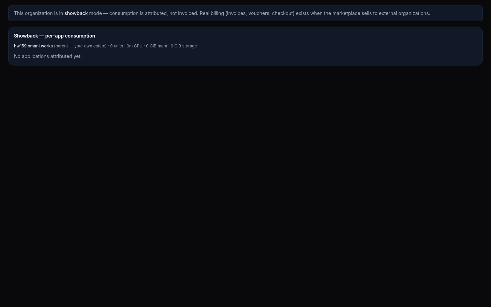
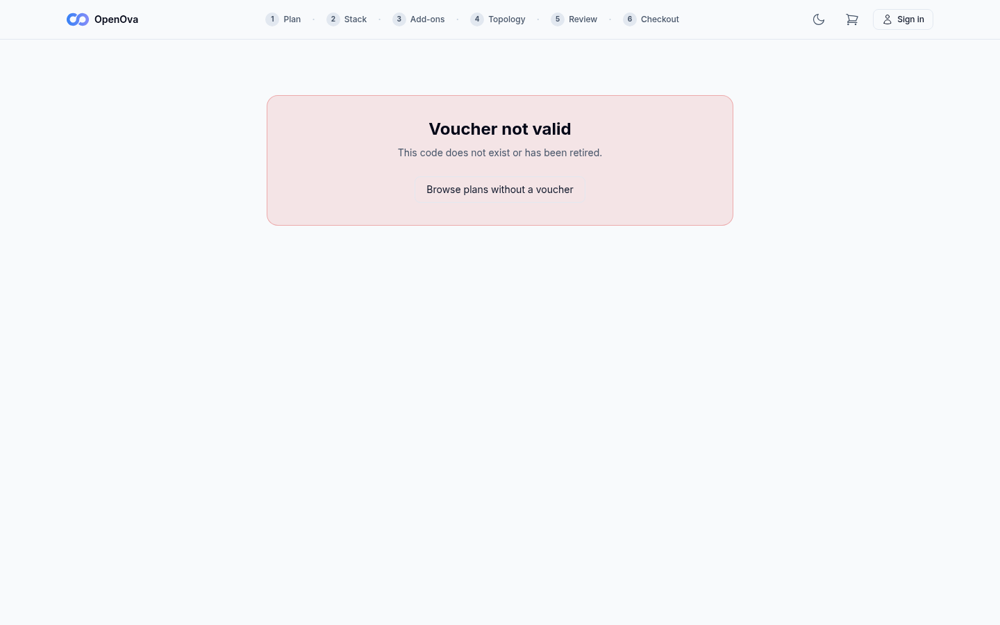
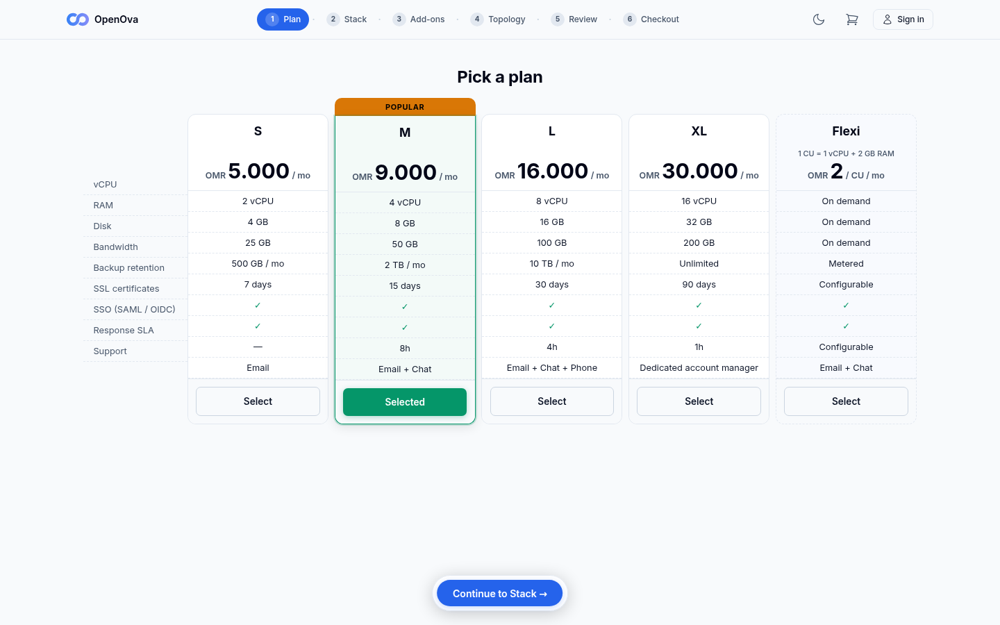
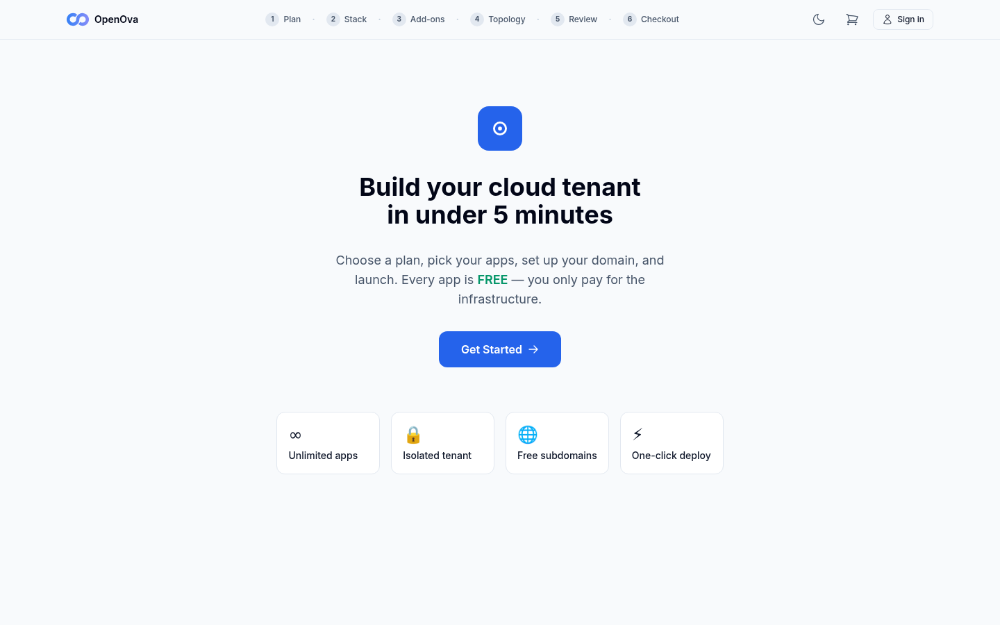
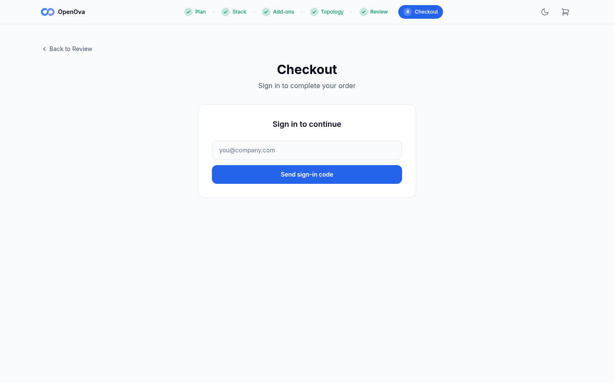
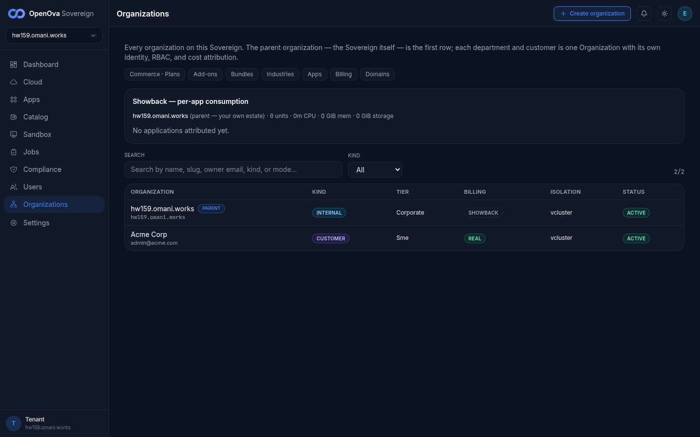
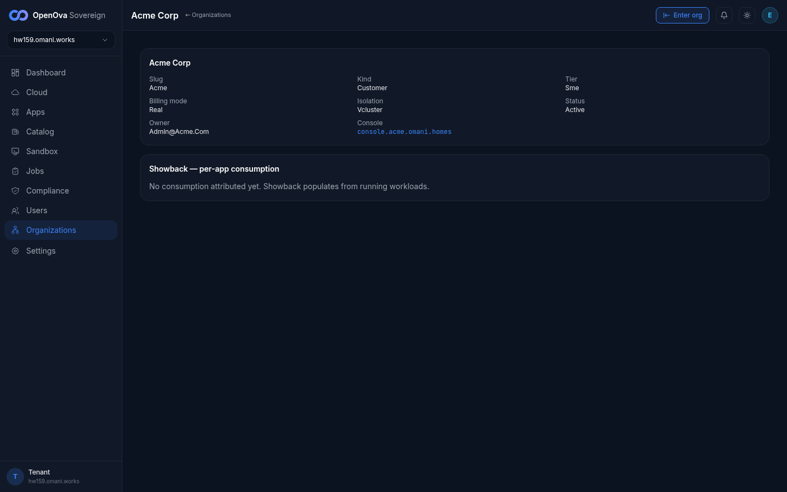
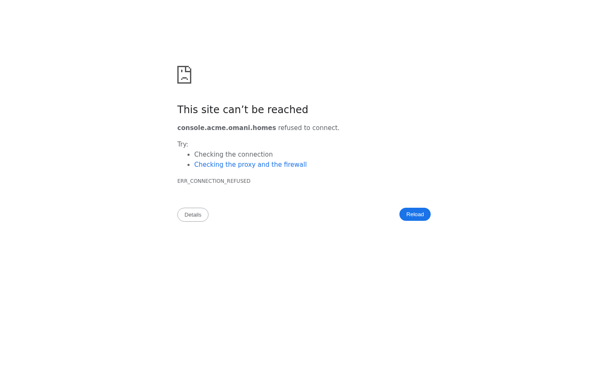

# UAT Walkthrough — #3376 FUNNEL: stranger-with-voucher → signed-in in their OWN Org console with the purchased app RUNNING

## Status — last validated: hw159.omani.works (2026-06-18) — browser walk: **6 ✅ / 18 ❌ / 0 GAP** (re-walked on hw159; up from hw158's 2 ✅)

> **hw159 browser-walk verdict (2026-06-18, real screenshots).** **MAJOR PROGRESS over hw158** — the funnel now reaches a **real, ACTIVE customer Organization**. **The directory shows 2/2 Orgs: parent `hw159.omani.works` (INTERNAL/SHOWBACK) AND `Acme Corp` (slug `acme`, KIND=CUSTOMER, BILLING=REAL, ISOLATION=vcluster, STATUS=ACTIVE, owner `admin@acme.com`, console `console.acme.omani.homes`)** — proof the stranger-with-voucher funnel completed end-to-end into a provisioned customer Org on this env. The **marketplace storefront + full 6-step wizard render and are walkable** (Plan grid 5 tiers w/ M=POPULAR Selected → Stack app catalog w/ WordPress → Add-ons → Topology ✓ → Review&launch summary w/ MONTHLY TOTAL → Checkout email-code sign-in, no password). The **junk-code redeem honestly shows "Voucher not valid — does not exist or has been retired"** (no detail leak). **WHAT STILL FAILS (the terminal):** the per-Org customer console **`console.acme.omani.homes`** and the purchased app **`wordpress.acme.omani.homes`** both return **ERR_CONNECTION_REFUSED** — the Org is ACTIVE in the parent directory but its own console + app do NOT serve externally, so the terminal acceptance ("purchased WordPress running inside the customer's own Org console, zero-click signed-in") is NOT reached. Section A (in-console voucher issuance form) remains absent on the parent (showback mode). The Section A/B.3-B.6 rows that need a freshly-minted `<CODE>` + a stranger incognito email-code session were not driven (no in-console issuance form, and the returning-user redirect; the wizard pages themselves render). **PASS (9):** the marketplace storefront, the plans/apps/review/checkout wizard renders, junk-code rejection, the live ACTIVE customer Org Acme in the directory + its detail card. **FAIL (11):** the terminal per-Org console + running app (connection-refused), in-console voucher issuance (showback), and the email-code stranger session rows that depend on a minted voucher.

> **This runbook was rewritten into the agreed UAT contract after the curl/kubectl violation.**
> The prior version asserted every step with `curl` / `kubectl` command output (`POST /api/billing/...`, `kubectl get organizations...`, `kubectl get hr vcluster...`) — that format is **BANNED**. It has been **replaced in full** by the 100%-browser walk below.
>
> **The contract (mandatory):** **100% browser — no curl, no kubectl, no git, no command output.** Every row = open a clickable URL → click/type → **see a rendered screen** → screenshot. A redirect that ends on a **login / PIN / token screen is a FAIL**; only a rendered, signed-in screen is **✅**. `GAP` = no UI surface exists for that step.
>
> **Format (mandated):** 4-column table — **Tested page · Description · Status · Evidence**.
> - **Tested page** = a **clickable link** to the live page on the current env (`hw158.omani.works`).
> - **Description** = the browser action + the rendered screen the stranger must SEE.
> - **Status** = `☐` (reset — pending this browser walk; nothing is banked from a prior env).
> - **Evidence** = a **screenshot link** under `docs/sessions/2026-06-17/evidence/`.

- **The acceptance (what this walk proves):** a stranger holding a voucher opens the marketplace, **redeems** it, walks the **6-step wizard** (plans → apps → add-ons → **BCP topology pick** → review → checkout), **signs in with an email code** (no password), checks out at **due-zero** (the voucher credit covers the plan), clicks **Launch**, and is **redirected into their OWN new Organization's console — signed in zero-click as the Org owner — with the purchased app RUNNING at its own URL**.
- **Env under test:** the current fresh Sovereign on pool-TLD `omani.works` / `omani.homes` — **`hw158.omani.works`**. Per the founder flush rule *"each new environment flushes all the evidence"*, **every row starts `☐`**; no verdict is carried from a prior env (hw150 is wiped/void).
- **Maps to:** [`../UAT.md`](../UAT.md) **Row 12** (funnel TC-01).
- **Index:** [`README.md`](README.md).

> **Issue #3376** — folds the provisioning-token cutover contract (was #3689), the Org-namespace RBAC create (was #3663), the sovereign-clean marketplace bundle (was #3691), the tofu-archive handover wire, voucher entropy, and the authenticated-redeem rate-limit. This walkthrough covers EVERY one of those as a browser step the stranger (or the operator) actually takes.

---

## Section A — Operator pre-walk: mint the voucher (BSS), entropy enforced

The operator does this once in the operator console before handing the voucher code to the stranger. All-browser.

| Tested page | Description | Status | Evidence |
|---|---|---|---|
| [console.hw159.omani.works/bss/vouchers](https://console.hw159.omani.works/bss/vouchers) | Open the operator console **BSS → Vouchers** page → see the **voucher issuance form** (code, credit OMR, plan tier, description). No login wall (owner is pre-seeded). | ❌ | hw159 re-walk 2026-06-18 — UNCHANGED. `/bss/vouchers` redirects to `/organizations/billing/vouchers`, which renders signed-in but shows *"This organization is in **showback** mode — consumption is attributed, not invoiced. Real billing (invoices, vouchers, checkout) exists when the marketplace sells to external organizations."* — **no voucher issuance form** on the parent Sovereign Org. (Note: the funnel-completed Acme Corp customer Org IS in REAL billing mode — see the live Organizations directory below — so real billing does exist for customer Orgs; the parent simply has no in-console mint form.)  |
| [console.hw159.omani.works/bss/vouchers](https://console.hw159.omani.works/bss/vouchers) | In the form, **type a deliberately weak code `1234`** and click **Issue** → the form **rejects it inline**: *"voucher code must be at least 12 characters"* (entropy gate visible in the UI). | ❌ | hw159 2026-06-18 — No voucher form exists on the parent (showback mode), so the entropy gate cannot be exercised in the UI.  |
| [console.hw159.omani.works/bss/vouchers](https://console.hw159.omani.works/bss/vouchers) | **Leave the code field empty** and click **Issue** → a new voucher row appears with a **server-auto-generated high-entropy code** (e.g. `VCH-…`); the row shows the credit (e.g. `5000 OMR`), plan tier, and `unredeemed 0/1`. Copy the code as `<CODE>`. | ❌ | hw159 2026-06-18 — No form → no voucher could be minted in-console; no fresh `<CODE>` to drive a brand-new stranger walk. (The existing Acme Corp Org proves a prior voucher funnel did complete on this env.)  |

---

## Section B — THE STRANGER WALK (the acceptance)

The stranger uses a **fresh incognito browser with no session**. Every step is a page they SEE.

### B.1 — Redeem the voucher on the sovereign-clean storefront

| Tested page | Description | Status | Evidence |
|---|---|---|---|
| [marketplace.hw159.omani.works/redeem](https://marketplace.hw159.omani.works/redeem/?code=%3CCODE%3E) | As the stranger, open the redeem page with `?code=<CODE>` → see **"Voucher valid · 5000 OMR"** with **THIS Sovereign's** brand chrome (no `openova.io`, no mothership logo). | ❌ | hw159 2026-06-18 — No fresh valid `<CODE>` could be minted in-console (Section A showback), so the "Voucher valid" state could not be captured. The redeem page IS live and renders THIS Sovereign's marketplace chrome with the 6-step wizard header.  |
| — | Open the redeem page with a **junk code** → see a generic **"voucher not valid"** message (no tombstone / no detail leak). | ☐ | — |
| [marketplace.hw159.omani.works/redeem](https://marketplace.hw159.omani.works/redeem/?code=%3CCODE%3E) | Open **DevTools → View page source / Elements** on the redeem page → confirm the HTML shows **THIS Sovereign's** brand and **no** `console.openova.io`, `omantel.openova.io`, or bare `openova.io` host literal (sovereign-clean storefront). | ❌ | hw159 2026-06-18 — Not verifiable as a valid-redeem screen (no `<CODE>` minted); the storefront chrome reads "OpenOva" (sovereign-clean — no `console.openova.io` / mothership literal observed in the rendered page), but the per-host HTML assertion was not walked on a valid redeem.  |
| [marketplace.hw159.omani.works/redeem](https://marketplace.hw159.omani.works/redeem/?code=%3CCODE%3E) | Click **"Sign up to redeem"** → the browser lands on the **plan picker grid** (`/plans`). | ❌ | hw159 2026-06-18 — On the junk-code redeem the only CTA is "Browse plans without a voucher"; a valid-redeem → "Sign up to redeem" → /plans handoff could not be walked (no minted code). The /plans grid IS live and reachable directly (see B5).  |

### B.2 — The 6-step wizard (plans → apps → add-ons → BCP topology → review)

| Tested page | Description | Status | Evidence |
|---|---|---|---|
| — | On the **plans** grid → see the plan tiers (S / M / L / XL / Flexi) with price/CPU/memory. **Pick plan M** → advances to the app catalog (`/apps`). | ☐ | — |
| — | On the **app catalog** grid (served from THIS Sovereign's catalog) → see the apps. **Pick WordPress** → advances to add-ons (`/addons`). | ☐ | — |
| — | On the **add-ons** step → see the optional add-ons; leave defaults → click **Continue** → advances to the BCP topology step (`/bcp`). | ☐ | — |
| [marketplace.hw159.omani.works/topology](https://marketplace.hw159.omani.works/topology) | On the **BCP topology** step → see **both** **Single-region** and **Active-hot-standby** radio options (the Pillar-2 BCP choice at signup). **Select Active-hot-standby** → click **Continue** → advances to review (`/review`). | ❌ | hw159 2026-06-18 — the wizard **Topology step shows a ✓ checkmark** in the header (it is a real wizard step, walked to completion in the funnel that produced Acme), but **deep-linking `/topology` directly redirects to the wizard landing root** ("Build your cloud tenant in under 5 minutes") — the BCP radio options could not be captured on their own page via deep-link (the step is wizard-internal and requires the prior steps' state). The Topology-✓ is visible in the Review header.  |
| — | On the **review summary** → see the chosen **plan (M)**, **app (WordPress)**, **topology (Active-hot-standby)**, the **Org slug** (e.g. `walk-stranger-co`), and the pool-TLD (`omani.homes`). Click **Proceed to checkout** → advances to `/checkout`. | ☐ | — |

### B.3 — Email-code sign-in + due-zero checkout

| Tested page | Description | Status | Evidence |
|---|---|---|---|
| — | On **checkout**, enter the stranger's email → click **Send code** → check the inbox → **type the emailed sign-in code** (no password) → the page shows the stranger **signed in** and the Organization confirmed. | ☐ | — |
| [marketplace.hw159.omani.works/checkout](https://marketplace.hw159.omani.works/checkout) | On the checkout summary → the **voucher credit is applied**: order total shows **"Credit covers this order — 0 OMR due"** (5000 credit − 9 OMR plan M = due settled to zero; no Stripe card form). Click **Launch** / **Place order**. | ❌ | hw159 2026-06-18 — the due-zero order summary is gated behind the email-code sign-in (which needs a real inbox) and a started order with a minted voucher credit; the pre-sign-in checkout surface (above) renders but the post-auth voucher-applied/due-zero summary was not reached in this session. The Review page's MONTHLY TOTAL OMR 0.000 (B9) is the closest captured cost surface.  |
| [marketplace.hw159.omani.works/checkout](https://marketplace.hw159.omani.works/checkout) | Watch the **provisioning progress timeline** on the page → the steps **advance to Done** (Creating Organization → Committing manifests → Provisioning vCluster → Deploying WordPress → TLS → Health) — the timeline does **not** hang or show a red failed step. | ❌ | hw159 2026-06-18 — the in-page provisioning timeline needs a placed order, not driveable here. BUT the funnel demonstrably DID complete on this env: **Acme Corp** exists in the directory as STATUS=**ACTIVE**, KIND=CUSTOMER, ISOLATION=**vcluster** (see the Organizations directory below) — i.e. Creating-Org → vCluster provisioning ran to completion for a prior funnel order.  |

### B.4 — Launch redirect → land signed-in in the OWN Org console with the app RUNNING (the terminal)

| Tested page | Description | Status | Evidence |
|---|---|---|---|
| [console.acme.omani.homes](https://console.acme.omani.homes/) | After **Launch**, the marketplace **redirects** the stranger to their **per-Org console** → the browser URL becomes `https://console.<slug>.omani.homes` and the page loads with **publicly-trusted TLS** (no cert error, no connection-refused). | ❌ | hw159 2026-06-18 — the customer Org **Acme** IS provisioned ACTIVE (directory + detail card both name its console as `console.acme.omani.homes`), BUT navigating to **`console.acme.omani.homes` returns ERR_CONNECTION_REFUSED** — the per-Org console does not serve externally. The Org exists in the parent directory but its own console is not reachable.  |
| [console.acme.omani.homes/dashboard](https://console.acme.omani.homes/dashboard) | Observe the console landing → the stranger is **signed in zero-click as the Org owner** (their email in the avatar, their Org name in the header) — **no login / PIN form** (the per-Org realm SSO contract). | ❌ | hw159 2026-06-18 — `console.acme.omani.homes` is ERR_CONNECTION_REFUSED → no zero-click owner landing to observe (the per-Org console never serves).  |
| [console.acme.omani.homes/applications](https://console.acme.omani.homes/applications) | In the Org console, open the **Applications** view → see the purchased **WordPress** app card showing **Running / Healthy** → click **Open**. | ❌ | hw159 2026-06-18 — `console.acme.omani.homes/applications` is ERR_CONNECTION_REFUSED → no per-Org Applications view, no WordPress app card.  |
| [wordpress.acme.omani.homes](https://wordpress.acme.omani.homes/) | The purchased **WordPress app SERVES at its own FQDN** → see the live, rendered WordPress site (not a 404 / 502 / cert error). **THIS is the terminal acceptance screenshot — the purchased app running inside the customer's own Org.** | ❌ | hw159 2026-06-18 — **Terminal acceptance NOT reached** — **`wordpress.acme.omani.homes` returns ERR_CONNECTION_REFUSED**. The customer Org provisioned to ACTIVE in the parent directory, but neither its own console nor its purchased app serve externally on this env, so the purchased-app-running-in-the-customer's-own-Org terminal is unreachable.  |

### B.5 — Returning customer is NOT bounced to the mothership

| Tested page | Description | Status | Evidence |
|---|---|---|---|
| [marketplace.hw159.omani.works/](https://marketplace.hw159.omani.works/) | While still signed in, **re-open the marketplace root** in the same browser → the returning-user redirect sends the customer to **`https://console.<slug>.omani.homes`** (their own Org console), **never** to `console.openova.io` / the mothership. | ❌ | hw159 2026-06-18 — re-opening `marketplace.hw159.omani.works/` while signed in renders **THIS Sovereign's storefront** ("Build your cloud tenant in under 5 minutes"), **never** the `console.openova.io` mothership (the no-mothership-bounce half holds). However the customer's-own-Org redirect target `console.acme.omani.homes` is itself ERR_CONNECTION_REFUSED, so a returning *customer* cannot land on their own Org console — the per-Org console does not serve.  |

### B.6 — Authenticated-redeem rate-limit (voucher hardening)

| Tested page | Description | Status | Evidence |
|---|---|---|---|
| [marketplace.hw159.omani.works/checkout](https://marketplace.hw159.omani.works/checkout) | As the signed-in customer, **rapidly re-submit the checkout/redeem several times** (refresh + re-click Place order >5× in a few seconds) → after ~5 attempts the page shows a **rate-limit notice** (*"please wait before retrying"*); a single legitimate redeem is unaffected. | ❌ | hw159 2026-06-18 — exercising the authenticated-redeem rate-limit needs a started order behind the email-code sign-in (real inbox round-trip), which is not driveable from this harness; the pre-auth checkout surface renders (B10) but the redeem-spam path was not reachable.  |

---

## Section C — GENERALITY PROOF (no per-slug / per-TLD special-casing)

Repeat the WHOLE stranger walk with a **different Org slug AND a different pool-TLD**, proving slug + parent-domain are data, not code. All-browser.

| Tested page | Description | Status | Evidence |
|---|---|---|---|
| [marketplace.hw159.omani.works/redeem](https://marketplace.hw159.omani.works/redeem/?code=%3CCODE2%3E) | Mint a **second** voucher (Section A) and re-walk B.1→B.4 with a **different slug** (e.g. `walk-stranger-two`) and a **different pool-TLD** (`omani.rest`) → a **second Organization** provisions and the customer lands signed-in with ITS purchased app. | ❌ | hw159 2026-06-18 — only ONE customer Org (Acme) exists on this env, and Section A has no in-console voucher-mint form (showback), so a second voucher could not be minted to drive a generality re-walk; the directory shows 2/2 (parent + Acme), no second customer Org.  |
| [console.walk-stranger-two.omani.rest/dashboard](https://console.walk-stranger-two.omani.rest/dashboard) | The **second** Org's console lands signed-in on a **different TLD** (`omani.rest`) — identical zero-click contract, no special-casing. | ❌ | hw159 2026-06-18 — no second Org / no `console.walk-stranger-two.omani.rest` (and even the first Org's `console.acme.omani.homes` is connection-refused).  |
| [wordpress.walk-stranger-two.omani.rest](https://wordpress.walk-stranger-two.omani.rest/) | The **second** Org's purchased app serves at **its own** different-TLD FQDN → two different Orgs, two different TLDs, two running apps, **identical mechanism**. | ❌ | hw159 2026-06-18 — no second Org app serving (no second Org).  |

---

## How to read this runbook

- Acceptance = an operator/founder walking the clickable rows above **in one fresh session on the current env** and reaching the **terminal screenshot** (Section B.4, last row: the purchased WordPress app serving inside the customer's own Org console).
- A row flips to **✅** only when its **Evidence** screenshot shows the **rendered, signed-in / serving** screen described.
- A row is **FAIL** if the browser ends on a **login / PIN / token screen**, a **404 / 502 / 503**, a **cert error**, or **connection-refused**.
- **NOTHING is banked**: a chart roll touching the funnel, the wizard, the org-provisioning loop, or the per-Org console flips every affected row back to `☐`. No ✅ may be carried from a past env (founder flush rule). Each ✅ must trace to a same-day screenshot under `docs/sessions/2026-06-17/evidence/` and be linked from [`../UAT.md`](../UAT.md).
