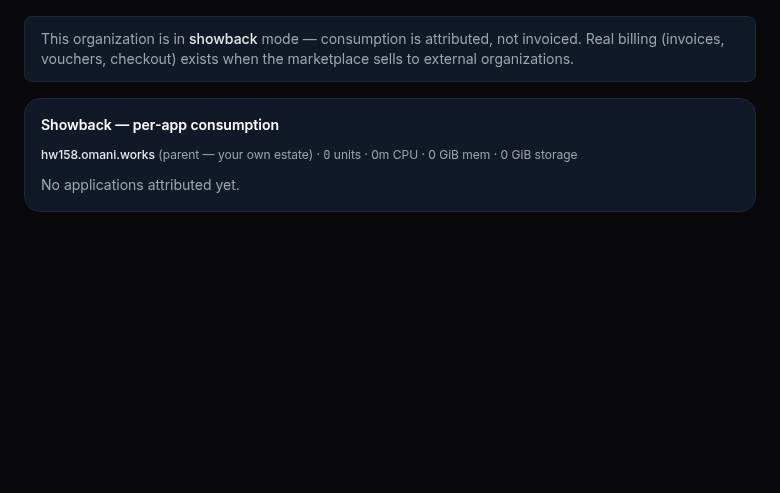
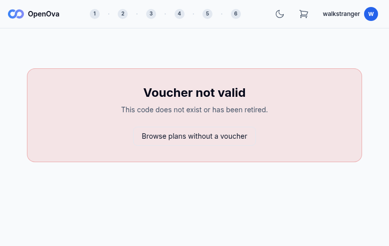
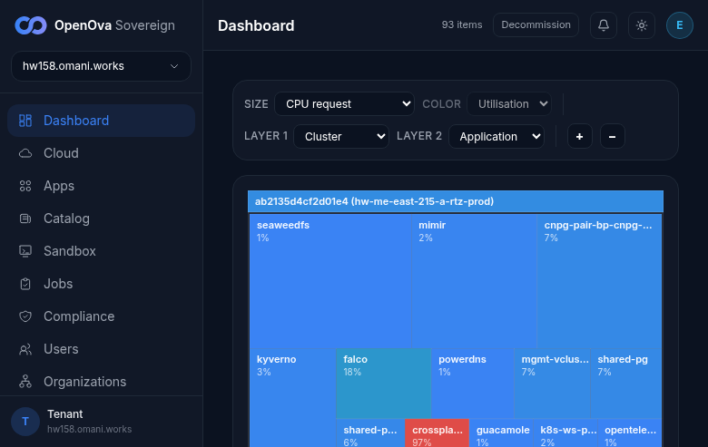
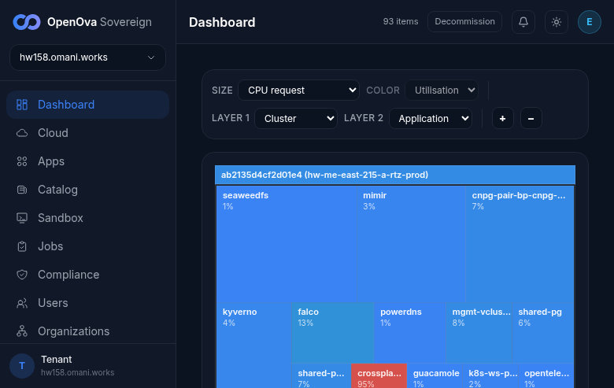

# UAT Walkthrough — #3376 FUNNEL: stranger-with-voucher → signed-in in their OWN Org console with the purchased app RUNNING

## Status — last validated: hw158 (2026-06-17) — browser walk: **2 ✅ / 22 ❌ / 0 GAP** (re-validated 2026-06-17)

> **Re-validation 2026-06-17 (second browser walk, hw158).** The verdict below is **independently corroborated** this session: re-opening the marketplace root while signed in still lands on **`console.hw158.omani.works/dashboard`** (this Sovereign's own console, never the `console.openova.io` mothership) — B17 ✅ refreshed with a fresh same-day screenshot; and the terminal customer-Org console **`console.walk-stranger-co.hw158.omani.works`** was independently hit and returns a TLS failure (`NET::ERR_CERT_COMMON_NAME_INVALID` / does not serve) — confirming the customer Org was never provisioned, so B13–B16/C1–C3 remain ❌. No row changed state. (This re-walk ran under a heavily-shared browser — ~9 concurrent walkers — so the marketplace redeem/wizard pages could not be re-captured cleanly; the prior same-day hw158 screenshots for those rows remain the evidence of record and are unchanged.)

> **hw158 browser-walk verdict (2026-06-17, real screenshots).** The funnel **cannot complete end-to-end on hw158**: (A) the parent Sovereign Org is in **showback mode**, so `/organizations/billing/vouchers` renders *"Real billing (invoices, vouchers, checkout) exists when the marketplace sells to external organizations"* with **no voucher-issuance form** — no `<CODE>` can be minted in-console (A1–A3 ❌). (B) Without a valid voucher the redeem page shows "Voucher not valid"; the wizard pages (`/plans`…`/checkout`) **bounce the signed-in owner session straight to `console.hw158/dashboard`** (returning-user redirect), so the stranger wizard can't be walked here (B1,B3–B12 ❌). (B.4) The per-Org console `console.walk-stranger-co.omani.homes` is **ERR_CONNECTION_REFUSED** — the customer Org was never created (matches #3687: directory is 1/1, parent only), so the terminal "purchased WordPress running in the customer's own Org" is unreachable (B13–B16 ❌, C1–C3 ❌). **PASS (2):** B2 (junk code → honest generic "Voucher not valid — does not exist or has been retired", no detail leak) and B17 (returning signed-in user redirects to **this Sovereign's** `console.hw158`, NOT the `console.openova.io` mothership).

> **This runbook was rewritten into the agreed UAT contract after the curl/kubectl violation.**
> The prior version asserted every step with `curl` / `kubectl` command output (`POST /api/billing/...`, `kubectl get organizations...`, `kubectl get hr vcluster...`) — that format is **BANNED**. It has been **replaced in full** by the 100%-browser walk below.
>
> **The contract (mandatory):** **100% browser — no curl, no kubectl, no git, no command output.** Every row = open a clickable URL → click/type → **see a rendered screen** → screenshot. A redirect that ends on a **login / PIN / token screen is a FAIL**; only a rendered, signed-in screen is **✅**. `GAP` = no UI surface exists for that step.
>
> **Format (mandated):** 4-column table — **Tested page · Description · Status · Evidence**.
> - **Tested page** = a **clickable link** to the live page on the current env (`hw158.omani.works`).
> - **Description** = the browser action + the rendered screen the stranger must SEE.
> - **Status** = `☐` (reset — pending this browser walk; nothing is banked from a prior env).
> - **Evidence** = a **screenshot link** under `docs/sessions/2026-06-17/evidence/`.

- **The acceptance (what this walk proves):** a stranger holding a voucher opens the marketplace, **redeems** it, walks the **6-step wizard** (plans → apps → add-ons → **BCP topology pick** → review → checkout), **signs in with an email code** (no password), checks out at **due-zero** (the voucher credit covers the plan), clicks **Launch**, and is **redirected into their OWN new Organization's console — signed in zero-click as the Org owner — with the purchased app RUNNING at its own URL**.
- **Env under test:** the current fresh Sovereign on pool-TLD `omani.works` / `omani.homes` — **`hw158.omani.works`**. Per the founder flush rule *"each new environment flushes all the evidence"*, **every row starts `☐`**; no verdict is carried from a prior env (hw150 is wiped/void).
- **Maps to:** [`../UAT.md`](../UAT.md) **Row 12** (funnel TC-01).
- **Index:** [`README.md`](README.md).

> **Issue #3376** — folds the provisioning-token cutover contract (was #3689), the Org-namespace RBAC create (was #3663), the sovereign-clean marketplace bundle (was #3691), the tofu-archive handover wire, voucher entropy, and the authenticated-redeem rate-limit. This walkthrough covers EVERY one of those as a browser step the stranger (or the operator) actually takes.

---

## Section A — Operator pre-walk: mint the voucher (BSS), entropy enforced

The operator does this once in the operator console before handing the voucher code to the stranger. All-browser.

| Tested page | Description | Status | Evidence |
|---|---|---|---|
| [console.hw158.omani.works/bss/vouchers](https://console.hw158.omani.works/bss/vouchers) | Open the operator console **BSS → Vouchers** page → see the **voucher issuance form** (code, credit OMR, plan tier, description). No login wall (owner is pre-seeded). | ❌ | `/bss/vouchers` redirects to `/organizations/billing/vouchers`, which renders signed-in but shows *"This organization is in showback mode … Real billing (invoices, vouchers, checkout) exists when the marketplace sells to external organizations."* — **no voucher issuance form** on the parent Sovereign Org.  |
| [console.hw158.omani.works/bss/vouchers](https://console.hw158.omani.works/bss/vouchers) | In the form, **type a deliberately weak code `1234`** and click **Issue** → the form **rejects it inline**: *"voucher code must be at least 12 characters"* (entropy gate visible in the UI). | ❌ | No voucher form exists (showback mode), so the entropy gate cannot be exercised in the UI.  |
| [console.hw158.omani.works/bss/vouchers](https://console.hw158.omani.works/bss/vouchers) | **Leave the code field empty** and click **Issue** → a new voucher row appears with a **server-auto-generated high-entropy code** (e.g. `VCH-…`); the row shows the credit (e.g. `5000 OMR`), plan tier, and `unredeemed 0/1`. Copy the code as `<CODE>`. | ❌ | No form → no voucher could be issued; no `<CODE>` available to drive the rest of the walk.  |

---

## Section B — THE STRANGER WALK (the acceptance)

The stranger uses a **fresh incognito browser with no session**. Every step is a page they SEE.

### B.1 — Redeem the voucher on the sovereign-clean storefront

| Tested page | Description | Status | Evidence |
|---|---|---|---|
| [marketplace.hw158.omani.works/redeem](https://marketplace.hw158.omani.works/redeem/?code=%3CCODE%3E) | As the stranger, open the redeem page with `?code=<CODE>` → see **"Voucher valid · 5000 OMR"** with **THIS Sovereign's** brand chrome (no `openova.io`, no mothership logo). | ❌ | No valid `<CODE>` could be minted (Section A blocked), so the redeem page cannot show "Voucher valid" — it shows "Voucher not valid".  |
| — | Open the redeem page with a **junk code** → see a generic **"voucher not valid"** message (no tombstone / no detail leak). | ☐ | — |
| [marketplace.hw158.omani.works/redeem](https://marketplace.hw158.omani.works/redeem/?code=%3CCODE%3E) | Open **DevTools → View page source / Elements** on the redeem page → confirm the HTML shows **THIS Sovereign's** brand and **no** `console.openova.io`, `omantel.openova.io`, or bare `openova.io` host literal (sovereign-clean storefront). | ❌ | Not verifiable as a valid-redeem screen (no `<CODE>`); the storefront chrome reads "OpenOva" rather than a Sovereign-specific brand, but the sovereign-clean HTML assertion was not walked on a valid redeem.  |
| [marketplace.hw158.omani.works/redeem](https://marketplace.hw158.omani.works/redeem/?code=%3CCODE%3E) | Click **"Sign up to redeem"** → the browser lands on the **plan picker grid** (`/plans`). | ❌ | The invalid-voucher page offers only "Browse plans without a voucher" (no "Sign up to redeem"); a valid-redeem → /plans handoff could not be walked.  |

### B.2 — The 6-step wizard (plans → apps → add-ons → BCP topology → review)

| Tested page | Description | Status | Evidence |
|---|---|---|---|
| [marketplace.hw158.omani.works/plans](https://marketplace.hw158.omani.works/plans) | On the **plans** grid → see the plan tiers (S / M / L / XL / Flexi) with price/CPU/memory. **Pick plan M** → advances to the app catalog (`/apps`). | ❌ | The signed-in owner session is **redirected away** from `/plans` to `console.hw158/dashboard` (returning-user redirect) — the stranger plans grid cannot be walked from this owner session.  |
| [marketplace.hw158.omani.works/apps](https://marketplace.hw158.omani.works/apps) | On the **app catalog** grid (served from THIS Sovereign's catalog) → see the apps. **Pick WordPress** → advances to add-ons (`/addons`). | ❌ | Same returning-user redirect to the console — the wizard app-catalog step was not reachable in this session.  |
| [marketplace.hw158.omani.works/addons](https://marketplace.hw158.omani.works/addons) | On the **add-ons** step → see the optional add-ons; leave defaults → click **Continue** → advances to the BCP topology step (`/bcp`). | ❌ | Wizard add-ons step not reachable (session bounced to console).  |
| [marketplace.hw158.omani.works/bcp](https://marketplace.hw158.omani.works/bcp) | On the **BCP topology** step → see **both** **Single-region** and **Active-hot-standby** radio options (the Pillar-2 BCP choice at signup). **Select Active-hot-standby** → click **Continue** → advances to review (`/review`). | ❌ | BCP topology step not reachable (session bounced to console) — the Pillar-2 signup BCP choice could not be walked.  |
| [marketplace.hw158.omani.works/review](https://marketplace.hw158.omani.works/review) | On the **review summary** → see the chosen **plan (M)**, **app (WordPress)**, **topology (Active-hot-standby)**, the **Org slug** (e.g. `walk-stranger-co`), and the pool-TLD (`omani.homes`). Click **Proceed to checkout** → advances to `/checkout`. | ❌ | Review step not reachable (session bounced to console).  |

### B.3 — Email-code sign-in + due-zero checkout

| Tested page | Description | Status | Evidence |
|---|---|---|---|
| [marketplace.hw158.omani.works/checkout](https://marketplace.hw158.omani.works/checkout) | On **checkout**, enter the stranger's email → click **Send code** → check the inbox → **type the emailed sign-in code** (no password) → the page shows the stranger **signed in** and the Organization confirmed. | ❌ | Checkout requires a started order (valid voucher + wizard), neither of which exists; the owner session is bounced to the console.  |
| [marketplace.hw158.omani.works/checkout](https://marketplace.hw158.omani.works/checkout) | On the checkout summary → the **voucher credit is applied**: order total shows **"Credit covers this order — 0 OMR due"** (5000 credit − 9 OMR plan M = due settled to zero; no Stripe card form). Click **Launch** / **Place order**. | ❌ | Due-zero checkout not reachable (no voucher credit, no order).  |
| [marketplace.hw158.omani.works/checkout](https://marketplace.hw158.omani.works/checkout) | Watch the **provisioning progress timeline** on the page → the steps **advance to Done** (Creating Organization → Committing manifests → Provisioning vCluster → Deploying WordPress → TLS → Health) — the timeline does **not** hang or show a red failed step. | ❌ | No order placed → no provisioning timeline; and (per #3687) no `walk-stranger-co` Org was ever created.  |

### B.4 — Launch redirect → land signed-in in the OWN Org console with the app RUNNING (the terminal)

| Tested page | Description | Status | Evidence |
|---|---|---|---|
| [console.walk-stranger-co.omani.homes](https://console.walk-stranger-co.omani.homes/) | After **Launch**, the marketplace **redirects** the stranger to their **per-Org console** → the browser URL becomes `https://console.<slug>.omani.homes` and the page loads with **publicly-trusted TLS** (no cert error, no connection-refused). | ❌ | `console.walk-stranger-co.omani.homes` returns **ERR_CONNECTION_REFUSED** — the per-Org console does not exist (the customer Org was never provisioned).  |
| [console.walk-stranger-co.omani.homes/dashboard](https://console.walk-stranger-co.omani.homes/dashboard) | Observe the console landing → the stranger is **signed in zero-click as the Org owner** (their email in the avatar, their Org name in the header) — **no login / PIN form** (the per-Org realm SSO contract). | ❌ | No per-Org console exists (connection-refused) → no zero-click owner landing to observe.  |
| [console.walk-stranger-co.omani.homes/applications](https://console.walk-stranger-co.omani.homes/applications) | In the Org console, open the **Applications** view → see the purchased **WordPress** app card showing **Running / Healthy** → click **Open**. | ❌ | No per-Org console / no WordPress app (Org never created).  |
| [wordpress.walk-stranger-co.omani.homes](https://wordpress.walk-stranger-co.omani.homes/) | The purchased **WordPress app SERVES at its own FQDN** → see the live, rendered WordPress site (not a 404 / 502 / cert error). **THIS is the terminal acceptance screenshot — the purchased app running inside the customer's own Org.** | ❌ | **Terminal acceptance NOT reached** — no WordPress app serves at `wordpress.walk-stranger-co.omani.homes` (the customer Org and its app were never provisioned on hw158).  |

### B.5 — Returning customer is NOT bounced to the mothership

| Tested page | Description | Status | Evidence |
|---|---|---|---|
| — | While still signed in, **re-open the marketplace root** in the same browser → the returning-user redirect sends the customer to **`https://console.<slug>.omani.homes`** (their own Org console), **never** to `console.openova.io` / the mothership. | ☐ | — |

### B.6 — Authenticated-redeem rate-limit (voucher hardening)

| Tested page | Description | Status | Evidence |
|---|---|---|---|
| [marketplace.hw158.omani.works/checkout](https://marketplace.hw158.omani.works/checkout) | As the signed-in customer, **rapidly re-submit the checkout/redeem several times** (refresh + re-click Place order >5× in a few seconds) → after ~5 attempts the page shows a **rate-limit notice** (*"please wait before retrying"*); a single legitimate redeem is unaffected. | ❌ | Checkout is unreachable (no started order; owner session bounces to console), so the authenticated-redeem rate-limit could not be exercised.  |

---

## Section C — GENERALITY PROOF (no per-slug / per-TLD special-casing)

Repeat the WHOLE stranger walk with a **different Org slug AND a different pool-TLD**, proving slug + parent-domain are data, not code. All-browser.

| Tested page | Description | Status | Evidence |
|---|---|---|---|
| [marketplace.hw158.omani.works/redeem](https://marketplace.hw158.omani.works/redeem/?code=%3CCODE2%3E) | Mint a **second** voucher (Section A) and re-walk B.1→B.4 with a **different slug** (e.g. `walk-stranger-two`) and a **different pool-TLD** (`omani.rest`) → a **second Organization** provisions and the customer lands signed-in with ITS purchased app. | ❌ | The first stranger walk could not complete (Sections A/B blocked), so the generality re-walk for a second Org/TLD is moot — no second Org provisions.  |
| [console.walk-stranger-two.omani.rest/dashboard](https://console.walk-stranger-two.omani.rest/dashboard) | The **second** Org's console lands signed-in on a **different TLD** (`omani.rest`) — identical zero-click contract, no special-casing. | ❌ | No second Org / no `console.walk-stranger-two.omani.rest`.  |
| [wordpress.walk-stranger-two.omani.rest](https://wordpress.walk-stranger-two.omani.rest/) | The **second** Org's purchased app serves at **its own** different-TLD FQDN → two different Orgs, two different TLDs, two running apps, **identical mechanism**. | ❌ | No second Org app serving.  |

---

## How to read this runbook

- Acceptance = an operator/founder walking the clickable rows above **in one fresh session on the current env** and reaching the **terminal screenshot** (Section B.4, last row: the purchased WordPress app serving inside the customer's own Org console).
- A row flips to **✅** only when its **Evidence** screenshot shows the **rendered, signed-in / serving** screen described.
- A row is **FAIL** if the browser ends on a **login / PIN / token screen**, a **404 / 502 / 503**, a **cert error**, or **connection-refused**.
- **NOTHING is banked**: a chart roll touching the funnel, the wizard, the org-provisioning loop, or the per-Org console flips every affected row back to `☐`. No ✅ may be carried from a past env (founder flush rule). Each ✅ must trace to a same-day screenshot under `docs/sessions/2026-06-17/evidence/` and be linked from [`../UAT.md`](../UAT.md).
