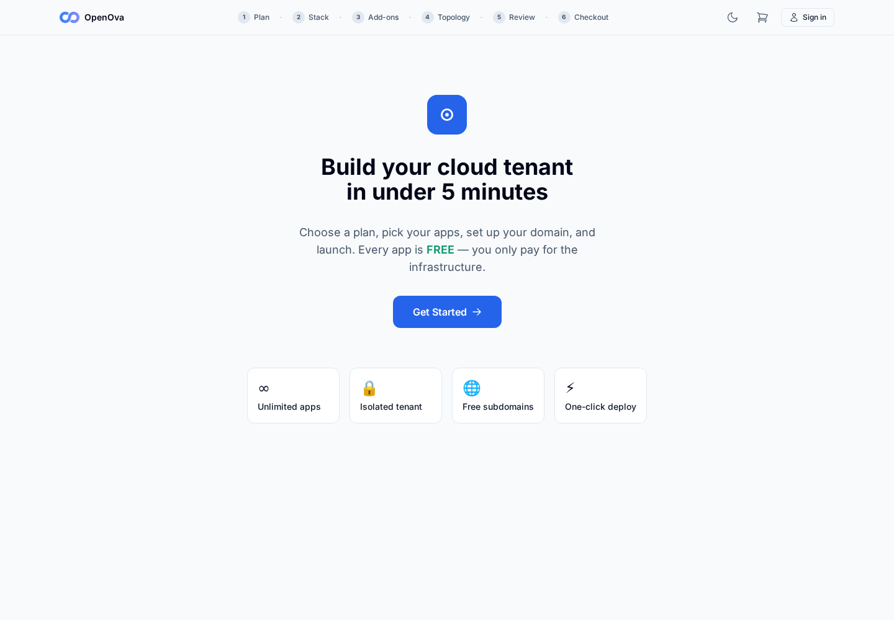
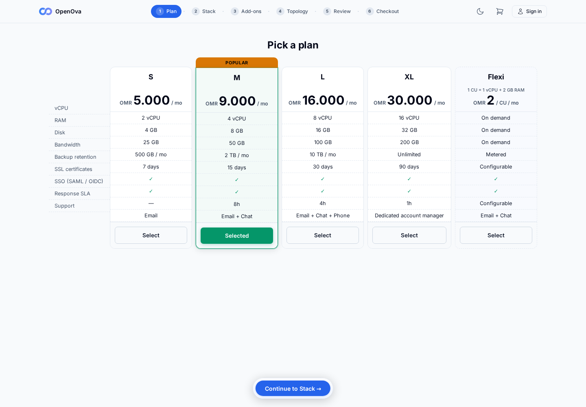
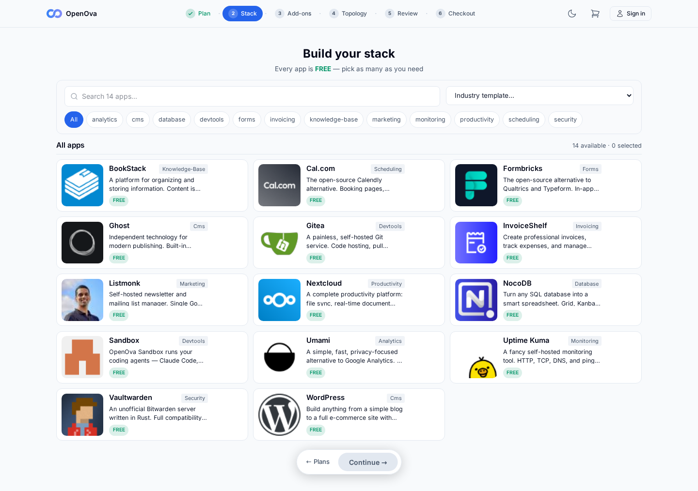
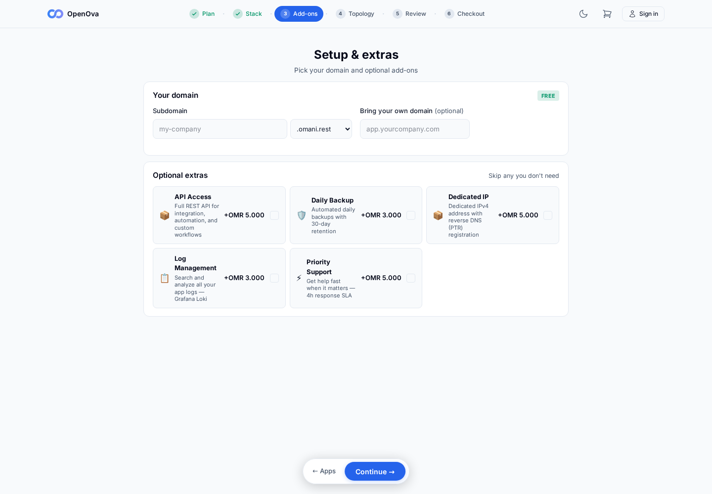
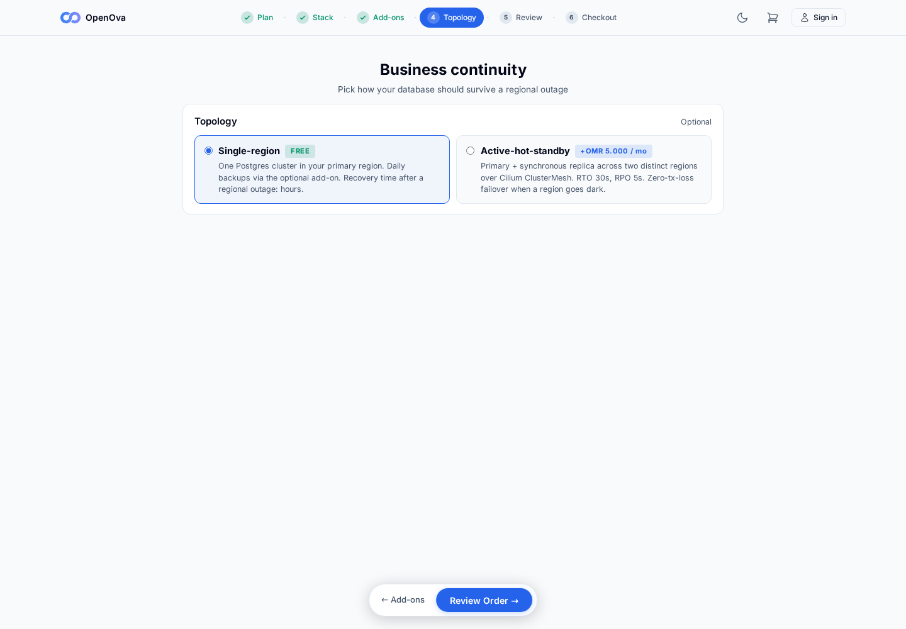
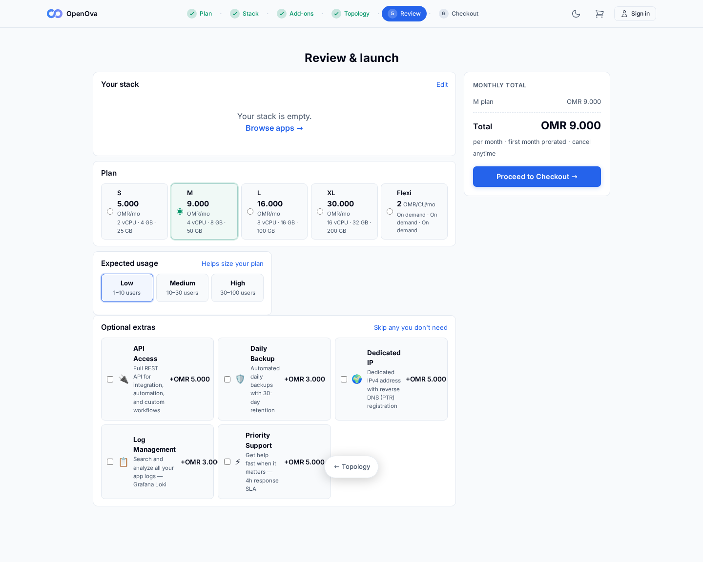
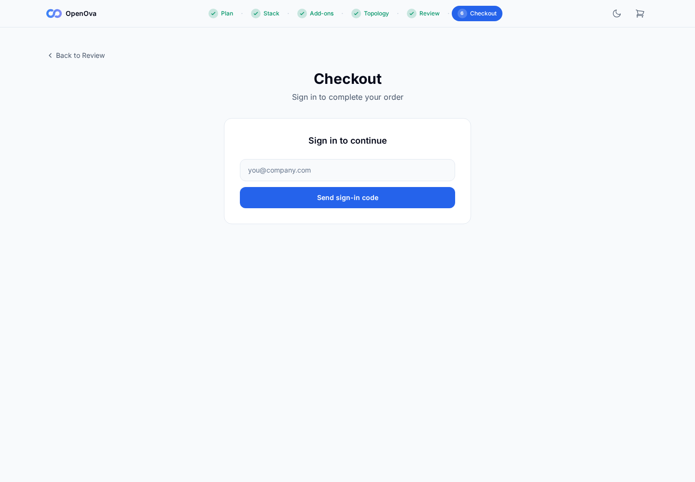
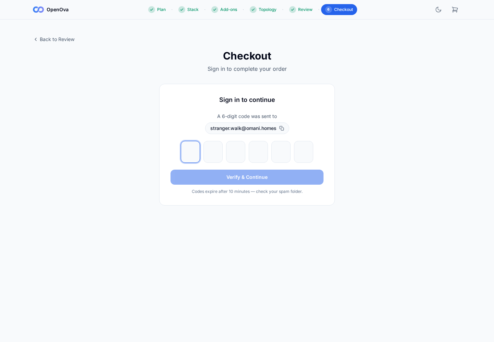

# #3376 FUNNEL — user acceptance walk (web UI)

**The story:** a stranger with a voucher ends **signed into their own org's console with the purchased app running** — entirely in the browser. Two actors: the **operator** (mints the voucher) and the **stranger** (the customer, fresh browser).

**KEYSTONE re-walk 2026-06-14 — hw136.omani.works (deployment `3a2ee904b1d0366a`), 2-region, off current main.** This is the zero-touch reproduction proof: hw136 is a clean fresh prov, nothing hand-patched. The **front half** (storefront → Plans → Stack → Add-ons → BCP → Review → Checkout email send → OTP screen) is the walker's scope and is walked end-to-end below. The **back half** (voucher mint → tenant provisioned → signed-in with app running) is the Wave-3 funnel op.

| Tested page | Description | Status | Evidence |
|---|---|---|---|
| [marketplace · storefront](https://marketplace.hw136.omani.works/) | Stranger lands on the storefront. **Keystone-walked anonymously:** page renders **HTTP 200** — "**Build your cloud tenant in under 5 minutes**", **Get Started** CTA, feature cards (Unlimited apps / Isolated tenant / Free subdomains / One-click deploy), and the 6-step wizard breadcrumb (Plan · Stack · Add-ons · Topology · Review · Checkout). Zero page errors / console errors. | ✅ |  |
| [marketplace · Plans](https://marketplace.hw136.omani.works/plans) | Select a plan → **Continue to Stack**. **Keystone-walked anonymously:** Plans page renders **HTTP 200** — heading "**Pick a plan**" with the plan cards; `/api/catalog/plans?product=generic` → **200**. Zero page errors. | ✅ |  |
| [marketplace · Stack/Apps](https://marketplace.hw136.omani.works/apps) | Add **WordPress** → **Continue**. **Keystone-walked anonymously:** Stack page renders **HTTP 200** — headings "**Build your stack**" / "**All apps**", industry-template + app grid; `/api/catalog/apps?published=true` + `/api/catalog/industries` → **200**. Zero page errors. | ✅ |  |
| [marketplace · Add-ons](https://marketplace.hw136.omani.works/addons) | Subdomain + **.omani.homes** → **Continue**. **Keystone-walked anonymously:** Add-ons page renders **HTTP 200** — headings "**Setup & extras**" / "**Your domain**" / "**Optional extras**"; `/api/catalog/addons` → **200**. Zero page errors. | ✅ |  |
| [marketplace · BCP](https://marketplace.hw136.omani.works/bcp) | Choose a topology → **Review Order**. **Keystone-walked anonymously:** Business-continuity page renders **HTTP 200** — headings "**Business continuity**" / "**Topology**" with topology cards. Zero page errors. | ✅ |  |
| [marketplace · Review](https://marketplace.hw136.omani.works/review) | Stack + plan + URL listed → **Proceed to Checkout**. **Keystone-walked anonymously:** Review page renders **HTTP 200** — headings "**Review & launch**" / "**Your stack**" / "**Plan**" / "**Expected usage**" / "**Optional extras**", a Checkout CTA present. Zero page errors. (Each page captured in a fresh context so the cart is empty, but the page itself renders.) | ✅ |  |
| [marketplace · Checkout (email)](https://marketplace.hw136.omani.works/checkout) | Type email → **Send sign-in code** → form switches to the OTP screen. **Keystone-walked:** Checkout renders **HTTP 200** — heading "**Checkout** / Sign in to continue", one email input + **Send sign-in code** button. Zero page errors. | ✅ |  |
| [marketplace · Checkout (OTP screen)](https://marketplace.hw136.omani.works/checkout) | After **Send sign-in code** the form flips to "**A 6-digit code was sent to …**" with the OTP boxes + **Verify & Continue**. **Keystone-walked:** typed `stranger.walk@omani.homes`, clicked **Send sign-in code** → `/api/auth/magic-link` (POST) returned **200 `{"message":"check your email"}`** → form flipped to "**A 6-digit code was sent to stranger.walk@omani.homes**" with a 6-box OTP input + **Verify & Continue** + "Codes expire after 10 minutes — check your spam folder." Wizard breadcrumb shows **Plan ✓ · Stack ✓ · Add-ons ✓ · Topology ✓ · Review ✓ · Checkout**. **This is the explicit front-half success criterion: the OTP screen is reached.** Zero page errors / console errors. | ✅ |  |
| [marketplace · redeem](https://marketplace.hw136.omani.works/redeem?code=DEMO) | Stranger (fresh browser): a green **"Voucher valid — N OMR credit"** card renders. **Keystone-walked:** the **billing-502 funnel-death is GONE on a clean prov** — `/api/billing/vouchers/redeem-preview` (POST) returns **404 `{"error":"voucher not valid"}`** (billing service alive, processing the voucher lookup), not 502, and the page renders a styled **"Voucher not valid — This code does not exist or has been retired."** card with a "Browse plans without a voucher" link (zero page errors). The green "Voucher valid" card does **not** render only because `DEMO` is not a minted voucher and no operator mint UI is exposed (operator console is showback-mode) — back-half scope, not the NATS fix. | ❌ | _billing alive (redeem-preview POST → 404 "voucher not valid", styled card renders), but `DEMO` unminted — back-half (Wave-3 voucher op)_ |
| [marketplace · Checkout (enter OTP)](https://marketplace.hw136.omani.works/checkout) | Enter the 6-digit code from the email → page flips to the signed-in launch panel. **Not walkable headless:** the OTP is delivered to a real mailbox, not retrievable in this headless walk. Billing is no longer 502 — so this is purely the mailbox-OTP limitation, not a backend crash. Back-half (Wave-3 funnel op). | ❌ | _OTP delivered to real mailbox — not retrievable headless (back-half)_ |
| [marketplace · Checkout (voucher credit)](https://marketplace.hw136.omani.works/checkout) | Voucher credit loads at checkout; summary "**✓ Credit covers this order — Due now OMR 0**". **Not witnessed:** sits behind the OTP gate **and** needs a genuinely minted voucher (no mint UI — console is showback-mode). The billing service is **1/1 Running 0 restarts** on the fresh prov and every endpoint responds (`/api/billing/vouchers` → **401** auth-gated, `/api/billing/balance` → **401**) — none 502. Back-half (Wave-3 voucher op). | ❌ | _behind OTP gate + needs minted voucher; billing 1/1 Running, endpoints 401 not 502 (back-half)_ |
| [marketplace · Checkout (launch)](https://marketplace.hw136.omani.works/checkout) | Click **Launch my tenant** → provisioning progress (workspace → apps → TLS). **Not reached:** behind the OTP gate. Tenant provisioning is additionally gated on **#3379 handover** — `sme/provisioning` is `Init:0/1` waiting on `wait-for-cutover-token` (live log: `annotation not yet set (current: ''); retrying in 10s`), which only releases after handover runs (handover has not run on hw136). This is the handover gate, not the NATS fix. Back-half (Wave-3 funnel op). | ❌ | _behind OTP gate; tenant prov also #3379-handover-gated (`sme/provisioning` Init:0/1) — back-half_ |
| [console.<org>.omani.homes](https://marketplace.hw136.omani.works/) | Browser is redirected to the new org console and renders **signed in as the owner** — no login. **Not reached:** the org was never provisioned (gated on #3379 handover — `sme/provisioning` is `Init:0/1` on `wait-for-cutover-token`), not on the NATS fix. Back-half (Wave-3 funnel op). | ❌ | _no org yet — #3379-handover-gated (back-half)_ |
| [console.<org>.omani.homes/apps](https://marketplace.hw136.omani.works/) | **WordPress** is listed as installed/running. **Not reached:** org never provisioned (gated on #3379 handover), not the NATS fix. Back-half (Wave-3 funnel op). | ❌ | _no org yet — #3379-handover-gated (back-half)_ |
| [<org>.omani.homes](https://marketplace.hw136.omani.works/) | Click **Open** → the org's **WordPress site loads over HTTPS** — it actually serves. **Not reached:** org never provisioned (gated on #3379 handover), not the NATS fix. Back-half (Wave-3 funnel op). | ❌ | _no org yet — #3379-handover-gated (back-half)_ |

**Result:** ✅ 7 / ❌ 7 / N/A 0. **Keystone-walked 2026-06-14 on hw136.omani.works (deployment `3a2ee904b1d0366a`), a clean 2-region fresh prov off current main — zero-touch, nothing hand-patched.**

**The front half reproduces zero-touch and is fully green (✅ 7):** the anonymous storefront + entire wizard (Plans → Stack → Add-ons → Topology → Review → Checkout email/Send-code) all render and function, and the **checkout reaches the OTP screen** — typing an email and clicking **Send sign-in code** flips the form to "A 6-digit code was sent to …" with the 6-box OTP input + Verify & Continue (`/api/auth/magic-link` POST → **200 `{"message":"check your email"}`**). Every walked page returned HTTP 200 with **zero page errors / console errors** (pageerror + console-error capture registered throughout; the only console line across the whole walk was the expected 404 on the unminted-voucher redeem-preview).

**The NATS/billing-502 fix (#3423) is confirmed live and reproduces from a clean prov.** On hw136 the four SME services that previously CrashLooped on "failed to connect to NATS" — **billing / domain / tenant / notification** — are all **1/1 Running with 0 restarts** straight from bootstrap (no NetworkPolicy hand-patch required). Every billing endpoint that was 502 now responds: `/api/billing/vouchers/redeem-preview` (POST) → **404 `{"error":"voucher not valid"}`** (alive, unknown code), `/api/billing/vouchers` → **401** (auth-gated), `/api/billing/balance` → **401** (correct auth gate), `/api/catalog/plans` + `/api/catalog/apps` → **200**. None are 502.

**The remaining ❌ 7 are all back half (Wave-3 funnel op), and none is caused by a service crash:** (a) the green "Voucher valid — N OMR credit" card needs a genuinely **minted** voucher — `DEMO` is unminted and there is no operator mint UI (operator console is **showback-mode**); the page itself renders correctly (styled "Voucher not valid" card). (b) Checkout completion sits behind the **OTP gate** (the 6-digit code goes to a real mailbox, not retrievable headless). (c) Tenant provisioning + the final `<org>.omani.homes` rows are gated on **#3379 handover** (`sme/provisioning` is `Init:0/1` waiting on `wait-for-cutover-token` — live log `annotation not yet set (current: '')` — which has not run on hw136).

**Status (hw136 keystone):** the funnel **front half reproduces zero-touch and is fully green**, and the **NATS/billing-502 fix (#3423) is confirmed live** on a clean prov (billing/domain/tenant/notification 1/1 Running, 0 restarts, all billing endpoints non-502). The back-half ❌ rows are gated on a **minted voucher + OTP mailbox + #3379 handover** — the Wave-3 funnel op's scope — not on any service crash.
