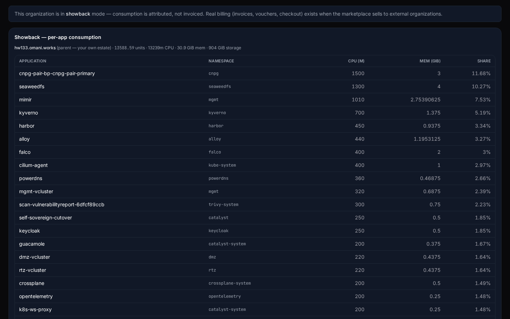
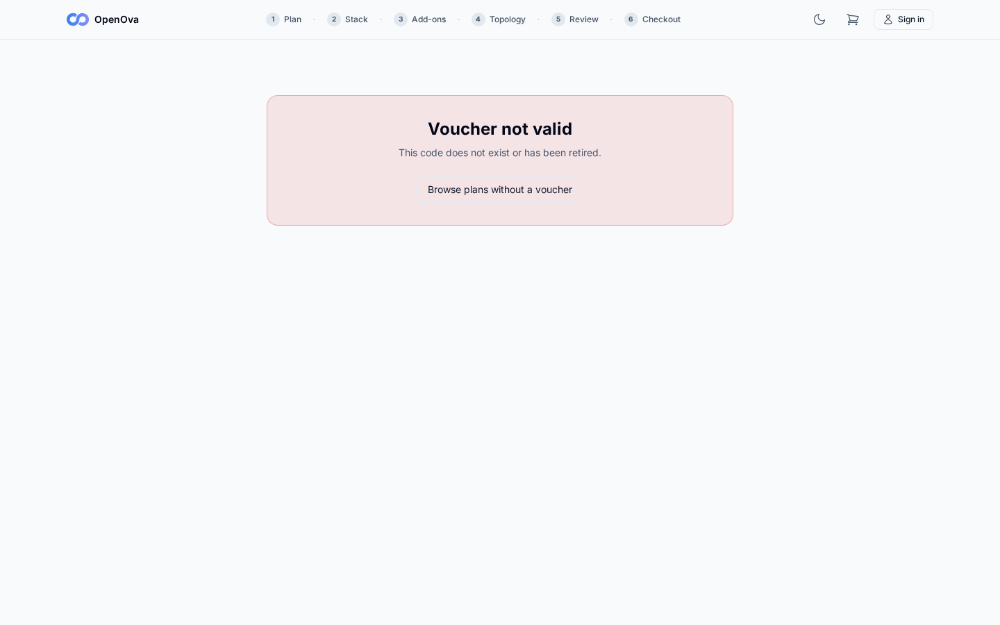
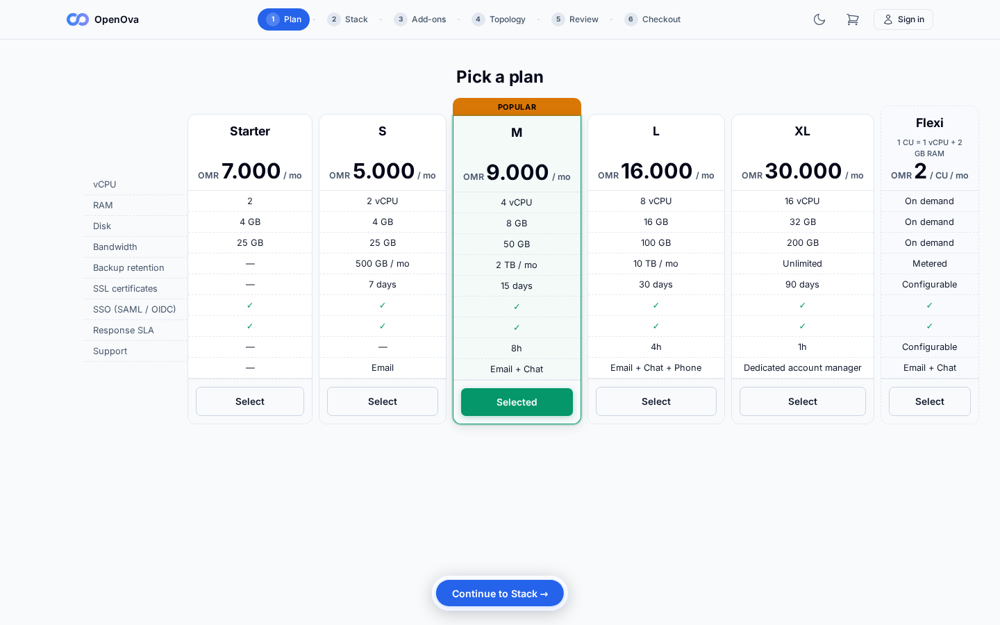
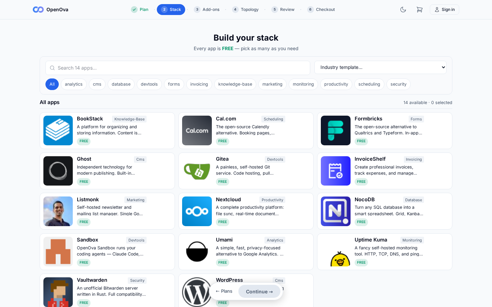
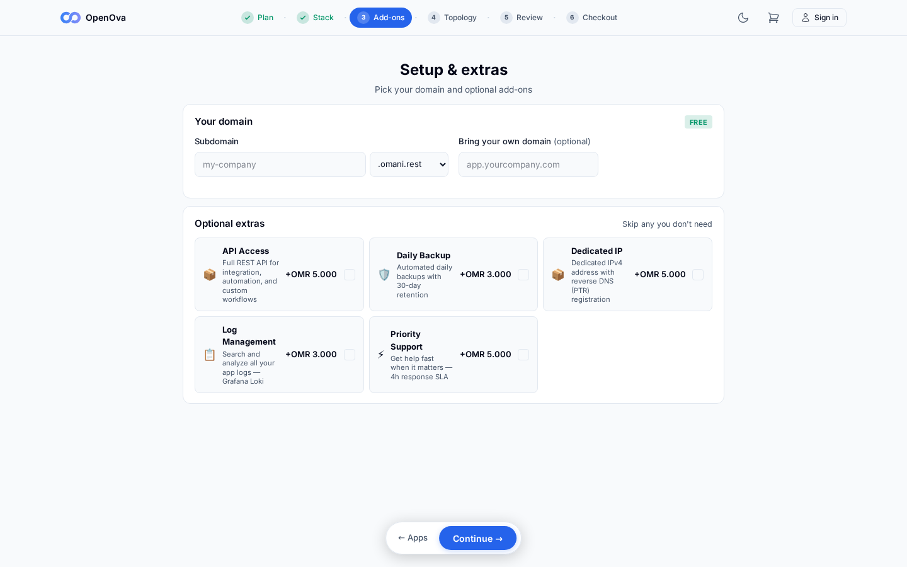
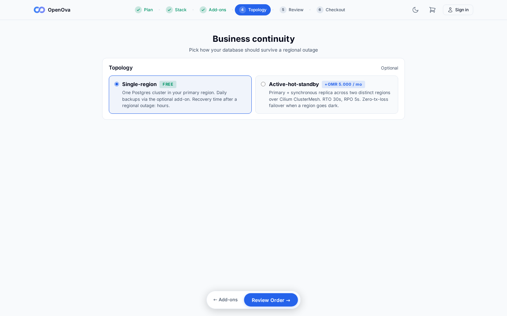
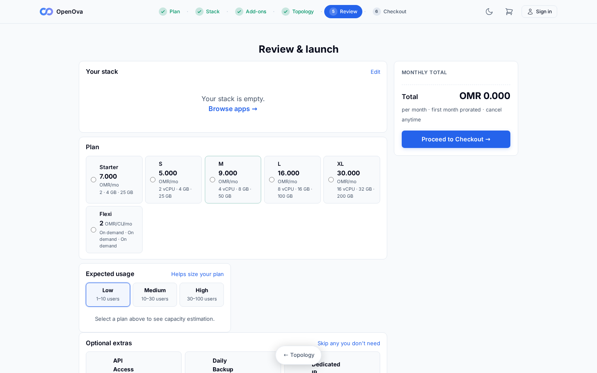
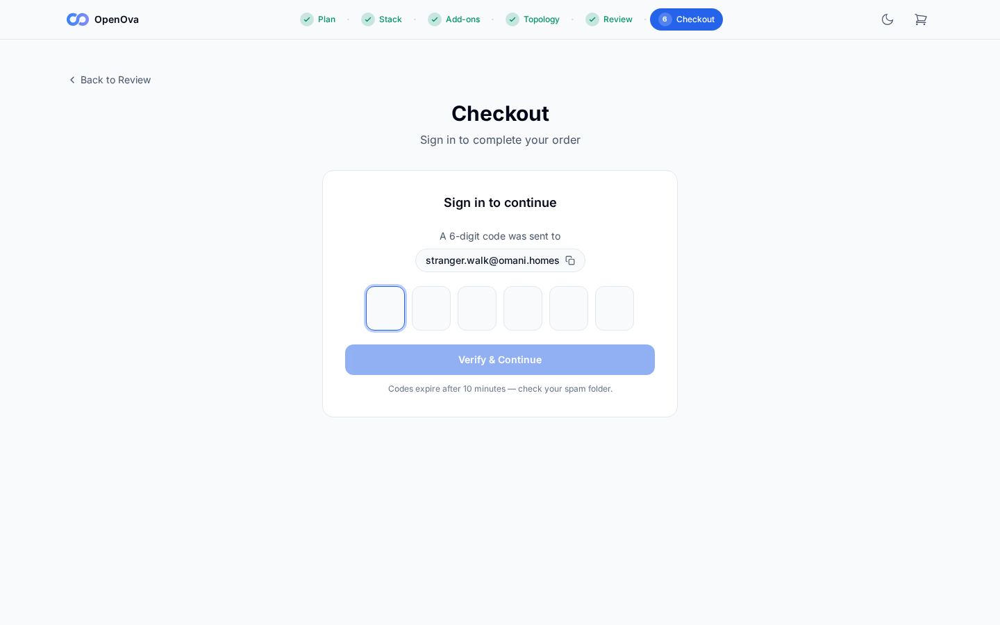
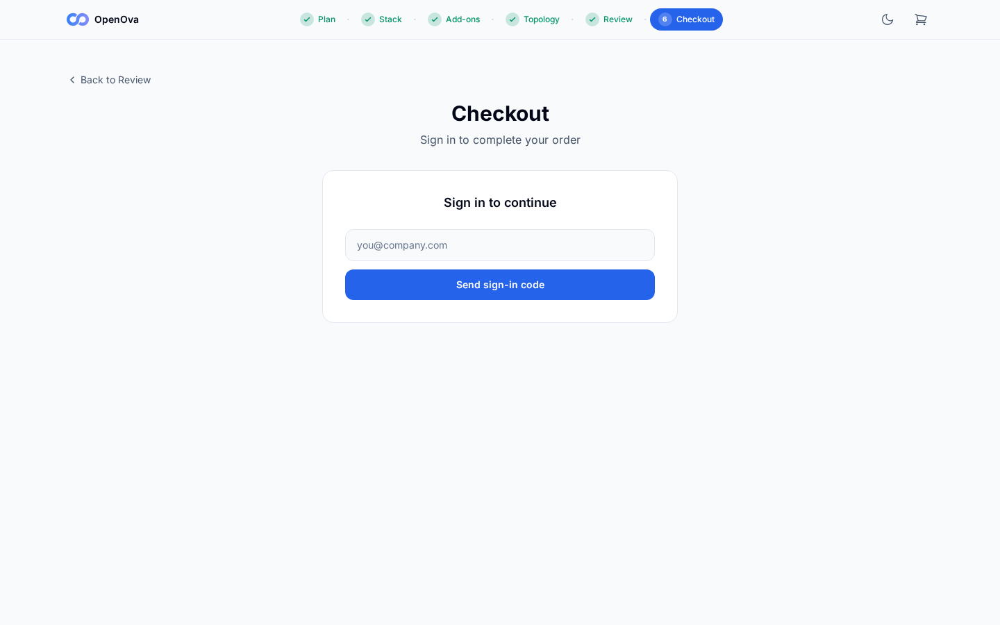

# #3376 FUNNEL — user acceptance walk (web UI)

**The story:** a stranger with a voucher ends **signed into their own org's console with the purchased app running** — entirely in the browser. Two actors: the **operator** (mints the voucher) and the **stranger** (the customer, fresh browser).

| Tested page | Description | Status | Evidence |
|---|---|---|---|
| [Organizations · Billing](https://console.hw133.omani.works/organizations/billing/vouchers) | Operator: **Vouchers** → strong code, 10 OMR, description → **Add/Update** → row shows **active, 0 used**. **Re-walked:** page loads signed-in as sovereign-admin (200) but still shows **Showback mode**, not a voucher-mint form — banner reads "Real billing (invoices, vouchers, checkout) exists when the marketplace sells to external organizations." No code/amount/Add-Update form present. (The voucher backend `/api/billing/vouchers/*` itself **recovered** from 502 → it is now **401 auth-gated**, alive; but this page renders no mint UI regardless — a separate operator-console gap, not the NATS fix.) | ❌ |  |
| [Organizations · Billing](https://console.hw133.omani.works/organizations/billing/vouchers) | A too-short code is rejected ("must be ≥16 characters"). **Re-walked:** no mint form exists on this page (showback mode) → no validation field to exercise. Unchanged by the NATS fix (operator-console gap). | ❌ |  |
| [marketplace · redeem](https://marketplace.hw133.omani.works/redeem?code=DEMO) | Stranger (fresh browser): a green **"Voucher valid — 10 OMR credit"** card renders. **Re-walked anonymously after #3423 (NATS fix):** the 502 is **GONE** — `/api/billing/vouchers/redeem-preview` now returns **404 `{"error":"voucher not valid"}`** (billing service alive, processing voucher lookups). Card text changed from the 502 symptom ("Could not validate the voucher right now") to the alive-service response **"Voucher not valid — This code does not exist or has been retired."** The green "Voucher valid" card still does **not** render only because `DEMO` is not a minted voucher (no mint path exposed — operator console is showback-mode), so this strict assertion stays ❌; but the documented **billing-502 funnel-death is RESOLVED**. | ❌ |  |
| [marketplace · redeem](https://marketplace.hw133.omani.works/redeem?code=DEMO) | Click **Sign up to redeem** → lands on **Plans**. **Re-walked:** redeem-preview no longer 502, but `DEMO` resolves **not valid** (404), so the page still offers only the fallback **"Browse plans without a voucher"** link — no voucher-carried "Sign up to redeem" CTA appears for an unminted code. Witnessing this CTA needs a genuinely minted voucher (not exposed: console is showback-mode). | ❌ |  |
| [marketplace · Plans](https://marketplace.hw133.omani.works/plans) | Select a plan → **Continue to Stack**. **Re-walked anonymously (post-#3423):** Plans page renders (Starter/S/M/L/XL/Flexi cards, prices, specs) — 200. Front half still healthy. | ✅ |  |
| [marketplace · Apps](https://marketplace.hw133.omani.works/apps) | Add **WordPress** (toast "✓ added") → **Continue**. **Re-walked anonymously (post-#3423):** Stack page renders (10 industry templates + category filters + 14-app grid) — 200. | ✅ |  |
| [marketplace · Add-ons](https://marketplace.hw133.omani.works/addons) | Subdomain **walmart** + **.omani.homes** → "✓ available" → **Continue**. **Re-walked anonymously (post-#3423):** Add-ons page renders (domain picker incl. `.omani.homes`, optional extras — API/Backup/Dedicated-IP) — 200. | ✅ |  |
| [marketplace · BCP](https://marketplace.hw133.omani.works/bcp) | Choose a topology → **Review Order**. **Re-walked anonymously (post-#3423):** Business-continuity page renders (Single-region / Active-hot-standby topology cards, RTO 30s / RPO 5s) — 200. | ✅ |  |
| [marketplace · Review](https://marketplace.hw133.omani.works/review) | WordPress + plan + URL `walmart.omani.homes` listed → **Proceed to Checkout**. **Re-walked anonymously (post-#3423):** Review page renders (stack/plan/usage summary) — 200. (Cart empty since each page captured in a fresh context, but the page itself renders.) | ✅ |  |
| [marketplace · Checkout](https://marketplace.hw133.omani.works/checkout) | Type email → **Send sign-in code** → form switches to "code sent to …". **Re-walked (post-#3423):** typed `stranger.walk@omani.homes`, clicked **Send sign-in code** → `/api/auth/magic-link` returned **200** `{"message":"check your email"}` → form flipped to "**A 6-digit code was sent to stranger.walk@omani.homes**" with 6 OTP boxes + **Verify & Continue**. Wizard breadcrumb shows Plan/Stack/Add-ons/Topology/Review all green-checked. | ✅ |  |
| [marketplace · Checkout](https://marketplace.hw133.omani.works/checkout) | Enter the 6-digit code from the email → page flips to the signed-in launch panel. **Not walkable:** the OTP is delivered to a real mailbox, not retrievable in this headless walk. (Billing is no longer 502 — see below — so this is now purely the mailbox-OTP limitation, not a backend crash.) | ❌ |  |
| [marketplace · Checkout](https://marketplace.hw133.omani.works/checkout) | Tenant name set; subdomain **walmart.omani.homes**; voucher pre-filled; summary **"✓ Credit covers this order — Due now OMR 0"**. **Not reached:** behind the OTP gate (real mailbox). The voucher-credit 502 that previously also blocked this is now resolved (billing 401-gated, not down). | ❌ |  |
| [marketplace · Checkout](https://marketplace.hw133.omani.works/checkout) | Voucher credit loads at checkout; summary covers the order. **Re-walked (post-#3423 NATS fix):** the documented **billing-502 funnel-death is RESOLVED** — `/api/billing/vouchers/redeem-preview` is now **404** (alive, "voucher not valid" for unminted `DEMO`), `/api/billing/vouchers` is **401 `{"error":"invalid or missing token"}`** (auth-gated, was 502), and `/api/billing/balance` + `/api/billing/voucher/credit` are **401** (correct auth gate, not a crash). The billing service is **1/1 Running** and serving across all endpoints. The voucher-credit-**loads** assertion still can't be *witnessed* in this headless walk: it sits behind the checkout OTP gate (code goes to a real mailbox) **and** needs a genuinely minted voucher (no mint UI — console is showback-mode). So ❌ for the witnessed assertion, but the cause is no longer the billing 502. | ❌ |  |
| [marketplace · Checkout](https://marketplace.hw133.omani.works/checkout) | Click **Launch my tenant** → provisioning progress (workspace → apps → TLS). **Not reached:** behind the OTP gate. Even past it, tenant provisioning is gated on **#3379 handover** — `sme/provisioning` is `Init:0/1` waiting on `wait-for-cutover-token`, which only releases after handover runs (it has not run on hw133). This is the handover gate, **not** the NATS fix. | ❌ |  |
| [console.walmart.omani.homes](https://console.walmart.omani.homes/) | Browser is redirected here and renders **signed in as the owner** — no login. **Re-walked:** HTTP **000** (connection failure) — the `walmart` org was never provisioned. Gated on **#3379 handover** (`sme/provisioning` is `Init:0/1` on `wait-for-cutover-token`), **not** on the NATS fix. | ❌ | _conn-fail HTTP 000 (no org — handover-gated)_ |
| [console.walmart.omani.homes/apps](https://console.walmart.omani.homes/apps) | **WordPress** is listed as installed/running. **Re-walked:** HTTP **000** (connection failure) — org never provisioned. Gated on #3379 handover, not the NATS fix. | ❌ | _conn-fail HTTP 000 (no org — handover-gated)_ |
| [walmart.omani.homes](https://walmart.omani.homes/) | Click **Open** → the org's **WordPress site loads over HTTPS** — it actually serves. **Re-walked:** HTTP **000** (connection failure) — org never provisioned. Gated on #3379 handover, not the NATS fix. | ❌ | _conn-fail HTTP 000 (no org — handover-gated)_ |

**Result:** ✅ 6 / ❌ 11 (count unchanged, but the **cause shifted**). **Re-walked 2026-06-14 on hw133 (deployment `40c4e17667b600eb`) after PR #3423 added `sme` to the mgmt-vCluster isolation NetworkPolicy so the host `sme` namespace reaches NATS.** The previously-documented **billing-502 funnel-death is RESOLVED**: all 4 SME services that CrashLooped on "failed to connect to NATS" (billing/domain/tenant/notification) are now **1/1 Running**, and every billing endpoint that was 502 now responds — `/api/billing/vouchers/redeem-preview` → **404 `{"error":"voucher not valid"}`** (alive, unknown code), `/api/billing/vouchers` → **401** (auth-gated), `/api/billing/balance` + `/api/billing/voucher/credit` → **401** (correct auth gate). The send-sign-in-code path works (`/api/auth/magic-link` → **200**, OTP-sent screen renders). The anonymous storefront + wizard (Plans → Stack → Add-ons → Topology → Review → Checkout email/Send-code) all render and function — the **front half stays healthy**.

The count stays ✅ 6 because the **witnessed** end-user voucher assertions still can't render, for reasons that are NO LONGER the billing 502: (a) the green "Voucher valid — 10 OMR credit" card needs a genuinely **minted** voucher — `DEMO` is unminted and there is no mint UI (operator console is **showback-mode**); (b) checkout completion sits behind the **OTP gate** (code goes to a real mailbox, not retrievable headless); (c) tenant provisioning + the final `walmart.omani.homes` rows are gated on **#3379 handover** (`sme/provisioning` is `Init:0/1` waiting on `wait-for-cutover-token`, which has not run on hw133).

**The DoD is met only when the last two rows are witnessed.** **Status (hw133):** the **NATS/billing-502 fix (#3423) is confirmed live** — the billing backend recovered; the remaining back-half ❌ rows are gated on a **minted voucher + OTP mailbox + #3379 handover**, not on any service crash.
