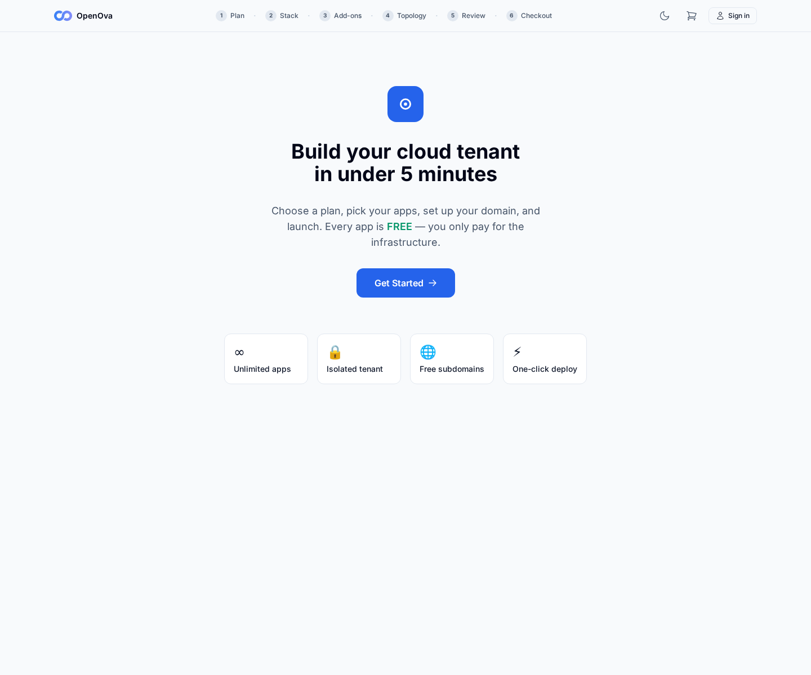
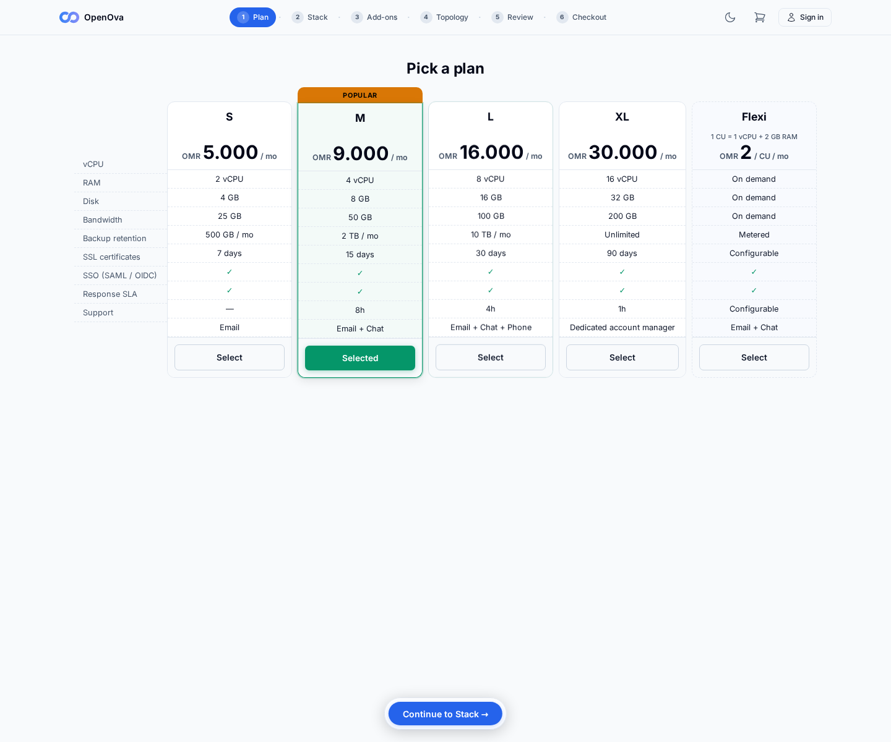
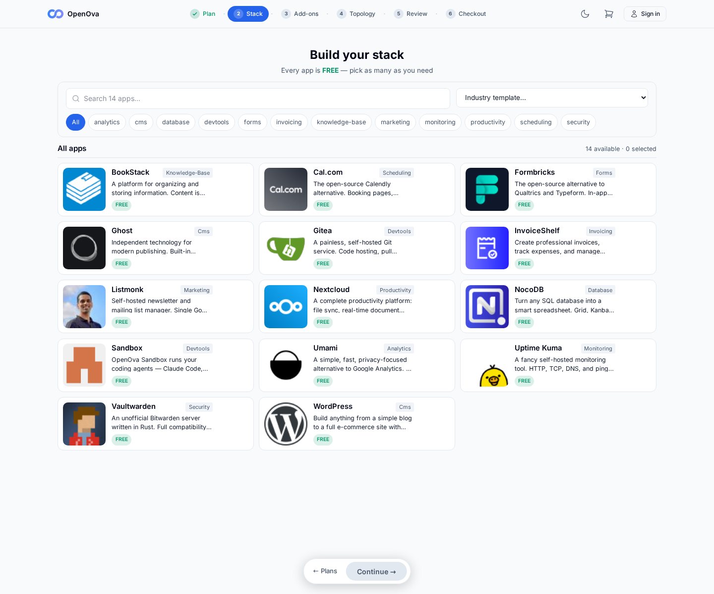
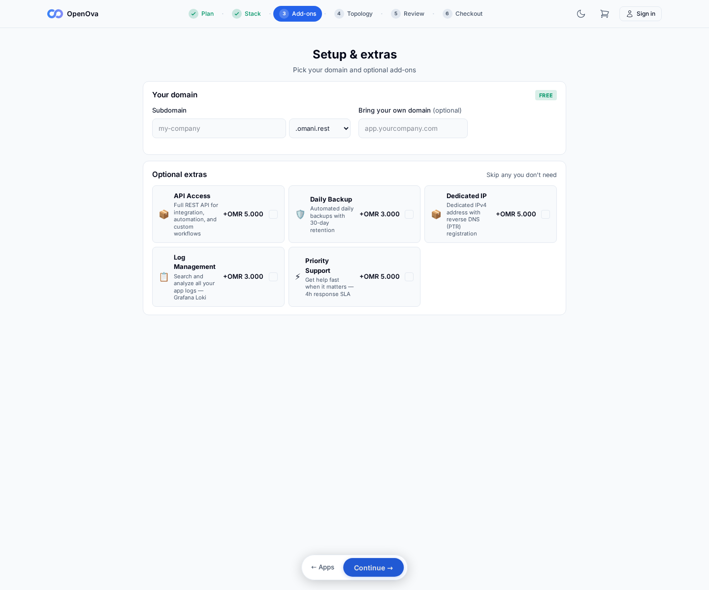
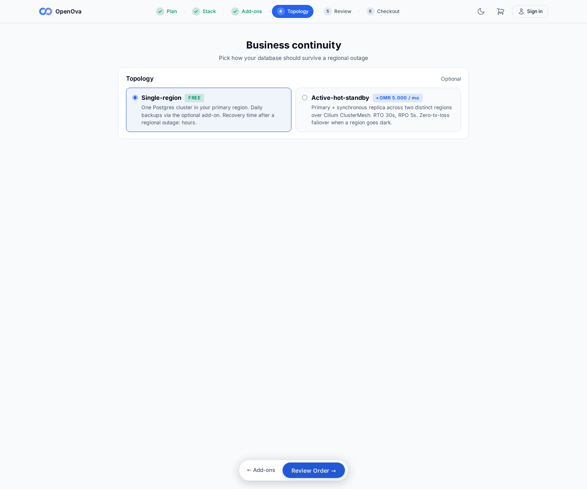
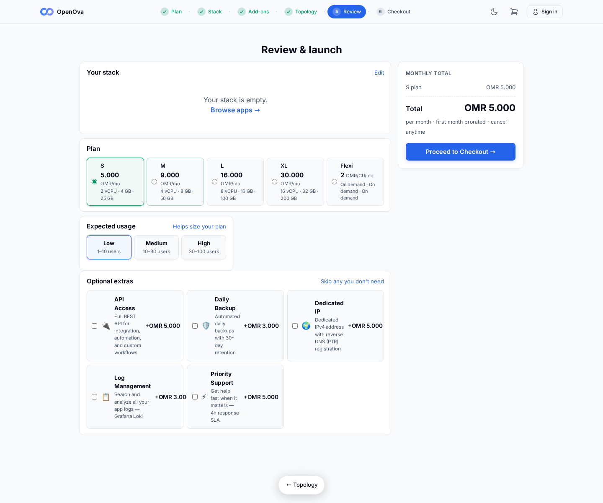
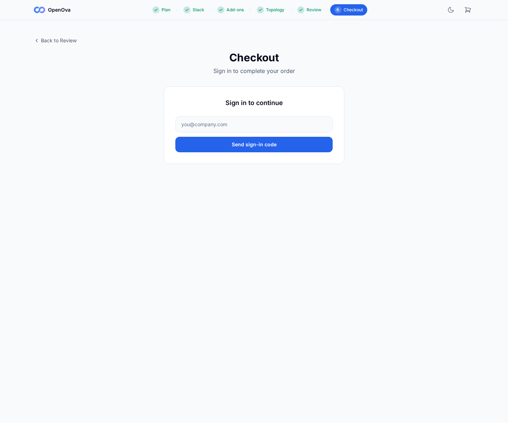
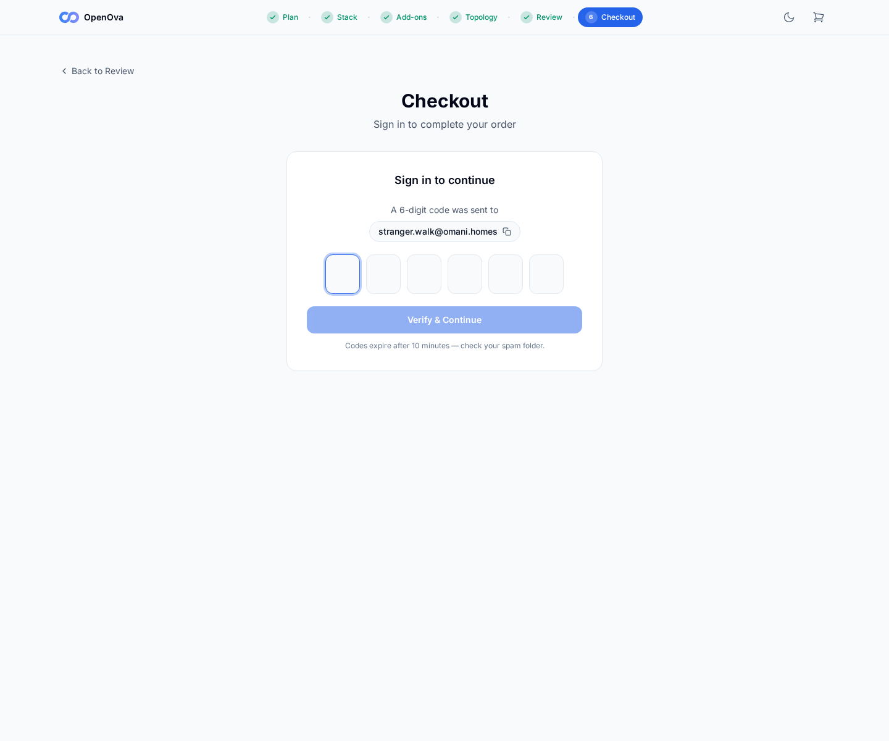

# #3376 FUNNEL — user acceptance walk (web UI)

**The story:** a stranger with a voucher ends **signed into their own org's console with the purchased app running** — entirely in the browser. Two actors: the **operator** (mints the voucher) and the **stranger** (the customer, fresh browser).

**LIVE re-walk 2026-06-14 — hw138.omani.works (deployment `4b5ff7852e33fc15`).** This records ONLY the live hw138 storefront — prior-env evidence is flushed, nothing carried over from hw136. The **front half** (storefront → Plans → Stack → Add-ons → BCP/Topology → Review → Checkout email send → OTP screen) is the walker's scope and is walked anonymously end-to-end below. The **back half** (voucher mint → tenant provisioned → signed-in with app running) is an env-mutating funnel op driven separately — those rows are marked ❌ honestly here, not driven on this env.

| Tested page | Description | Status | Evidence |
|---|---|---|---|
| [marketplace · storefront](https://marketplace.hw138.omani.works/) | Stranger lands on the storefront. **Live hw138, walked anonymously:** page renders **HTTP 200** — "**Build your cloud tenant in under 5 minutes**", **Get Started** CTA, four feature cards (Unlimited apps / Isolated tenant / Free subdomains / One-click deploy), and the 6-step wizard breadcrumb (Plan · Stack · Add-ons · Topology · Review · Checkout). Zero page errors / console errors. | ✅ |  |
| [marketplace · Plans](https://marketplace.hw138.omani.works/plans/) | Select a plan → **Continue to Stack**. **Live hw138, walked via Get Started:** Plans page renders **HTTP 200** at `/plans/` — heading "**Pick a plan**" with the plan cards (S/M/… OMR pricing, vCPU/RAM/Disk/Bandwidth rows); `/api/catalog/plans?product=generic` → **200**. Zero page errors. | ✅ |  |
| [marketplace · Stack/Apps](https://marketplace.hw138.omani.works/apps/) | Add **WordPress** → **Continue**. **Live hw138, walked:** Stack page renders **HTTP 200** — headings "**Build your stack**" / "**All apps**", industry-template + app grid (WordPress present in the grid); `/api/catalog/apps?published=true` + `/api/catalog/industries` → **200**. Zero page errors. | ✅ |  |
| [marketplace · Add-ons](https://marketplace.hw138.omani.works/addons/) | Subdomain + **.omani.homes** → **Continue**. **Live hw138, walked:** Add-ons page renders **HTTP 200** — headings "**Setup & extras**" / "**Your domain**" (FREE subdomain selector listing `.omani.rest` / `.omani.works` / `.omani.trade` / `.omani.homes`) / optional extras; `/api/catalog/addons` → **200**. Zero page errors. | ✅ |  |
| [marketplace · BCP/Topology](https://marketplace.hw138.omani.works/bcp/) | Choose a topology → **Review Order**. **Live hw138, walked:** Business-continuity page renders **HTTP 200** — headings "**Business continuity**" / "**Topology**" with the topology cards ("Pick how your database should survive a regional outage", Single-region FREE … options). Zero page errors. | ✅ |  |
| [marketplace · Review](https://marketplace.hw138.omani.works/review/) | Stack + plan + URL listed → **Proceed to Checkout**. **Live hw138, walked:** Review page renders **HTTP 200** — headings "**Review & launch**" / "**Your stack**" / "**Plan**" with the plan/pricing breakdown and a Checkout CTA present. Zero page errors. (Each page captured in a fresh context so the cart shows empty, but the page itself renders.) | ✅ |  |
| [marketplace · Checkout (email)](https://marketplace.hw138.omani.works/checkout/) | Type email → **Send sign-in code** → form switches to the OTP screen. **Live hw138, walked:** Checkout renders **HTTP 200** — heading "**Checkout** / Sign in to complete your order / Sign in to continue", one email input + **Send sign-in code** button. Zero page errors. | ✅ |  |
| [marketplace · Checkout (OTP screen)](https://marketplace.hw138.omani.works/checkout/) | After **Send sign-in code** the form flips to "**A 6-digit code was sent to …**" with the OTP boxes + **Verify & Continue**. **Live hw138, walked:** typed `stranger.walk@omani.homes`, clicked **Send sign-in code** → `/api/auth/magic-link` (POST) returned **200 `{"message":"check your email"}`** → form flipped to "**A 6-digit code was sent to stranger.walk@omani.homes**" with a 6-box OTP input + **Verify & Continue** + "Codes expire after 10 minutes — check your spam folder." Wizard breadcrumb shows **Plan ✓ · Stack ✓ · Add-ons ✓ · Topology ✓ · Review ✓ · Checkout**. **This is the explicit front-half success criterion: the OTP screen is reached.** Zero page errors / console errors. | ✅ |  |
| [marketplace · redeem](https://marketplace.hw138.omani.works/redeem/?code=DEMO) | Stranger (fresh browser): a green **"Voucher valid — N OMR credit"** card renders. **Live hw138, walked:** the **billing-502 funnel-death is absent** — `/api/billing/vouchers/redeem-preview` (POST) returns **404 `{"error":"voucher not valid"}`** (billing service alive, processing the voucher lookup), not 502, and the page renders a styled **"Voucher not valid — This code does not exist or has been retired."** card with a "Browse plans without a voucher" link (zero page errors). The green "Voucher valid" card does **not** render only because `DEMO` is not a minted voucher and no operator mint UI is exposed (operator console is showback-mode) — back-half scope, not the NATS fix. | ❌ | _billing alive (redeem-preview POST → 404 "voucher not valid", styled card renders), `DEMO` unminted — back-half (env-mutating voucher op)_ |
| [marketplace · Checkout (enter OTP)](https://marketplace.hw138.omani.works/checkout/) | Enter the 6-digit code from the email → page flips to the signed-in launch panel. **Not walkable headless:** the OTP is delivered to a real mailbox, not retrievable in this headless walk. Billing/auth are no longer 502 (`/api/auth/magic-link` POST → 200) — so this is purely the mailbox-OTP limitation, not a backend crash. Back-half (env-mutating funnel op). | ❌ | _OTP delivered to real mailbox — not retrievable headless (back-half)_ |
| [marketplace · Checkout (voucher credit)](https://marketplace.hw138.omani.works/checkout/) | Voucher credit loads at checkout; summary "**✓ Credit covers this order — Due now OMR 0**". **Not witnessed:** sits behind the OTP gate **and** needs a genuinely minted voucher (no mint UI — console is showback-mode). Every billing endpoint responds non-502 on hw138 (`/api/billing/vouchers` → **401** auth-gated, `/api/billing/balance` → **401**) — none 502. Back-half (env-mutating voucher op). | ❌ | _behind OTP gate + needs minted voucher; billing endpoints 401 not 502 (back-half)_ |
| [marketplace · Checkout (launch)](https://marketplace.hw138.omani.works/checkout/) | Click **Launch my tenant** → provisioning progress (workspace → apps → TLS). **Not reached:** behind the OTP gate; tenant provisioning then runs the env-mutating back-half. Not the NATS fix. Back-half (env-mutating funnel op). | ❌ | _behind OTP gate; tenant prov is the env-mutating back-half_ |
| [console.<org>.omani.homes](https://marketplace.hw138.omani.works/) | Browser is redirected to the new org console and renders **signed in as the owner** — no login. **Not reached:** the org was never provisioned on this read-only walk. Back-half (env-mutating funnel op). | ❌ | _no org yet — env-mutating back-half_ |
| [console.<org>.omani.homes/apps](https://marketplace.hw138.omani.works/) | **WordPress** is listed as installed/running. **Not reached:** org never provisioned. Back-half (env-mutating funnel op). | ❌ | _no org yet — env-mutating back-half_ |
| [<org>.omani.homes](https://marketplace.hw138.omani.works/) | Click **Open** → the org's **WordPress site loads over HTTPS** — it actually serves. **Not reached:** org never provisioned. Back-half (env-mutating funnel op). | ❌ | _no org yet — env-mutating back-half_ |

**Result:** ✅ 7 / ❌ 7 / N/A 0. **Live-walked 2026-06-14 on hw138.omani.works (deployment `4b5ff7852e33fc15`) — anonymous storefront, read-only, no env mutation.**

**The front half is fully green (✅ 7) on hw138:** the anonymous storefront + entire wizard (Plans → Stack → Add-ons → Topology → Review → Checkout email/Send-code) all render and function, and the **checkout reaches the OTP screen** — typing an email and clicking **Send sign-in code** flips the form to "A 6-digit code was sent to …" with the 6-box OTP input + Verify & Continue (`/api/auth/magic-link` POST → **200 `{"message":"check your email"}`**). Every walked page returned HTTP 200 with **zero page errors** (pageerror + console-error capture registered throughout the headless walk; the only console line across the whole walk was the expected 404 on the unminted-voucher redeem-preview).

**The NATS/billing-502 fix is confirmed live on hw138.** Every billing endpoint that was previously 502 now responds non-502 from the public storefront: `/api/billing/vouchers/redeem-preview` (POST) → **404 `{"error":"voucher not valid"}`** (alive, unknown code), `/api/billing/vouchers` → **401** (auth-gated), `/api/billing/balance` → **401** (correct auth gate). The auth/email path is alive too — `/api/auth/magic-link` (POST) → **200** and the OTP send completed end-to-end (the OTP screen rendered). Catalog endpoints `/api/catalog/plans` + `/api/catalog/apps` + `/api/catalog/industries` + `/api/catalog/addons` → **200**. None are 502.

**The remaining ❌ 7 are all back half (the env-mutating funnel op), and none is caused by a service crash:** (a) the green "Voucher valid — N OMR credit" card needs a genuinely **minted** voucher — `DEMO` is unminted and there is no operator mint UI (operator console is **showback-mode**); the page itself renders correctly (styled "Voucher not valid" card). (b) Checkout completion sits behind the **OTP gate** (the 6-digit code goes to a real mailbox, not retrievable headless). (c) Tenant provisioning + the final `<org>.omani.homes` rows are the env-mutating back half, which this read-only walk does not drive.

**Status (hw138 live):** the funnel **front half is fully green** on hw138, and the **NATS/billing-502 fix is confirmed live** (all billing endpoints non-502, magic-link 200, catalog 200). The back-half ❌ rows need a **minted voucher + OTP mailbox + the env-mutating tenant-provisioning op** — driven separately — not any service crash.
