# #3378 ORGANIZATIONS — user acceptance walk (web UI)

**What the user sees:** ONE **Organizations** menu (replacing BSS/OSS), with the Sovereign itself as the first row, parent-first directory, sub-org creation with kind-derived defaults, badge fidelity (Internal → showback/namespace; Customer → real/vcluster), enter-org support gated on a live org, commerce plans, and per-app showback cost. **Sign in (zero-click admin handover):** [console.hw135.omani.works](https://console.hw135.omani.works/).

**KEYSTONE re-walk — fresh prov hw135 (`368c2d9b74d0b71a`), 2-region, zero-touch.** catalyst-api/ui on `77e891d` (current `origin/main`, which carries PR #3425 `5a932fbb0` badge/plans + #3427 `414caa603` enter-org). The two sub-orgs below (`dept1` Internal, `cust1` Customer) were created **through the live Create-organization UI on this fresh prov** — they did not pre-exist; the directory threads each org's real per-spec `kind/tier/billing_mode/isolation` from `GET /api/v1/sme/tenants`. Headless Playwright from `/home/openova/repos/ping`, `page.on('pageerror')` + console-error capture registered; **0 page/console errors** across all signed-in pages.

| Tested page | Description | Status | Evidence |
|---|---|---|---|
| [Dashboard](https://console.hw135.omani.works/dashboard) | Handover URL lands **signed in as sovereign-admin** (no login form). Sidebar: Dashboard, Cloud, Apps, Sandbox, Jobs, Compliance, Users, **Organizations**, Settings — and **no** "BSS"/"OSS". Treemap for cluster `368c2d9b74d0b71a (hw-me-east-215-a-rtz-prod)` renders | ✅ | [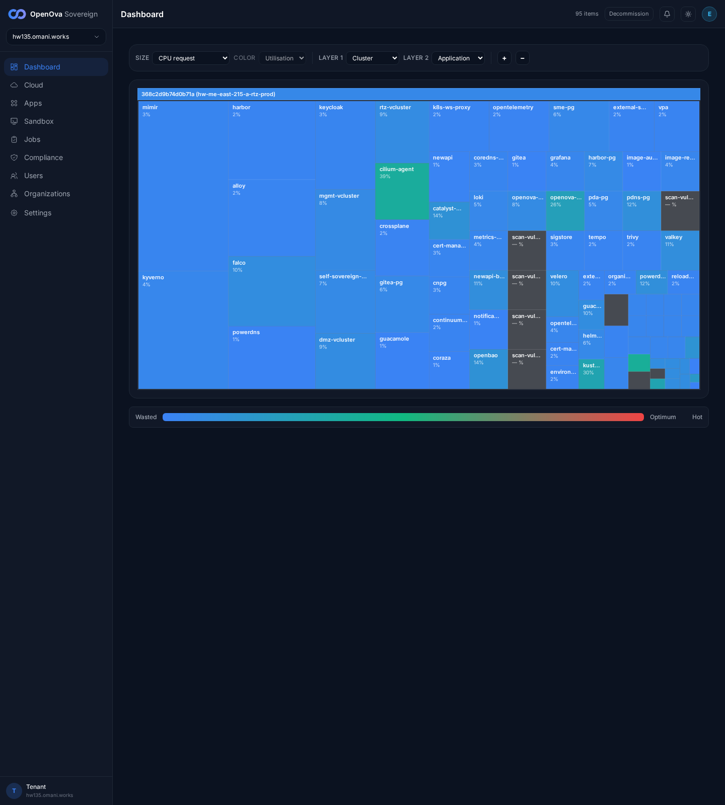](../../sessions/2026-06-14/evidence/3378-keystone/r1_dashboard.png) |
| [Organizations](https://console.hw135.omani.works/organizations) | Parent-first directory. Intro verbatim: "The parent organization — the Sovereign itself — is the first row; each department and customer is one Organization with its own identity, RBAC, and cost attribution." Section nav: Commerce·Plans, Add-ons, Bundles, Industries, Apps, Billing, Domains | ✅ | [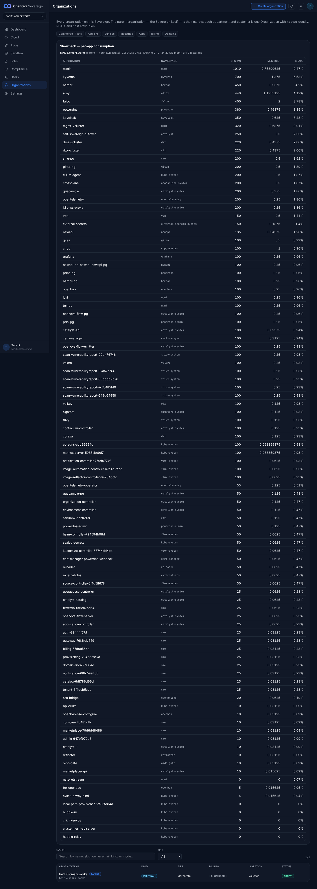](../../sessions/2026-06-14/evidence/3378-keystone/r3_orgs.png) |
| [Organizations](https://console.hw135.omani.works/organizations) | First row = the Sovereign with a **PARENT** tag, rendered `hw135.omani.works · PARENT · INTERNAL · Corporate · SHOWBACK · vcluster · ACTIVE` | ✅ | [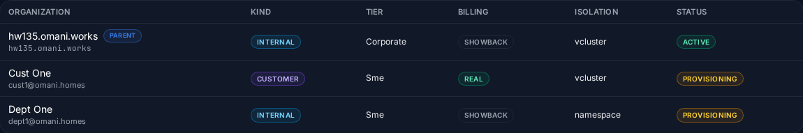](../../sessions/2026-06-14/evidence/3378-keystone/r9c_org_table.png) |
| [Organizations](https://console.hw135.omani.works/organizations) | **Showback — per-app consumption** panel: parent total `hw135.omani.works (parent — your own estate) · 10804.66 units · 10654m CPU · 24.29 GiB mem · 214 GiB storage` + per-app table (mimir, kyverno, harbor, alloy, falco, keycloak, …) with APPLICATION/NAMESPACE/CPU(M)/MEM(GIB)/SHARE columns | ✅ |  |
| [Create organization](https://console.hw135.omani.works/organizations/new) | Default (Customer) kind shows `Defaults: billing: real · isolation: vcluster` (asserted via `data-mode=real`, `data-isolation=vcluster`) | ✅ | [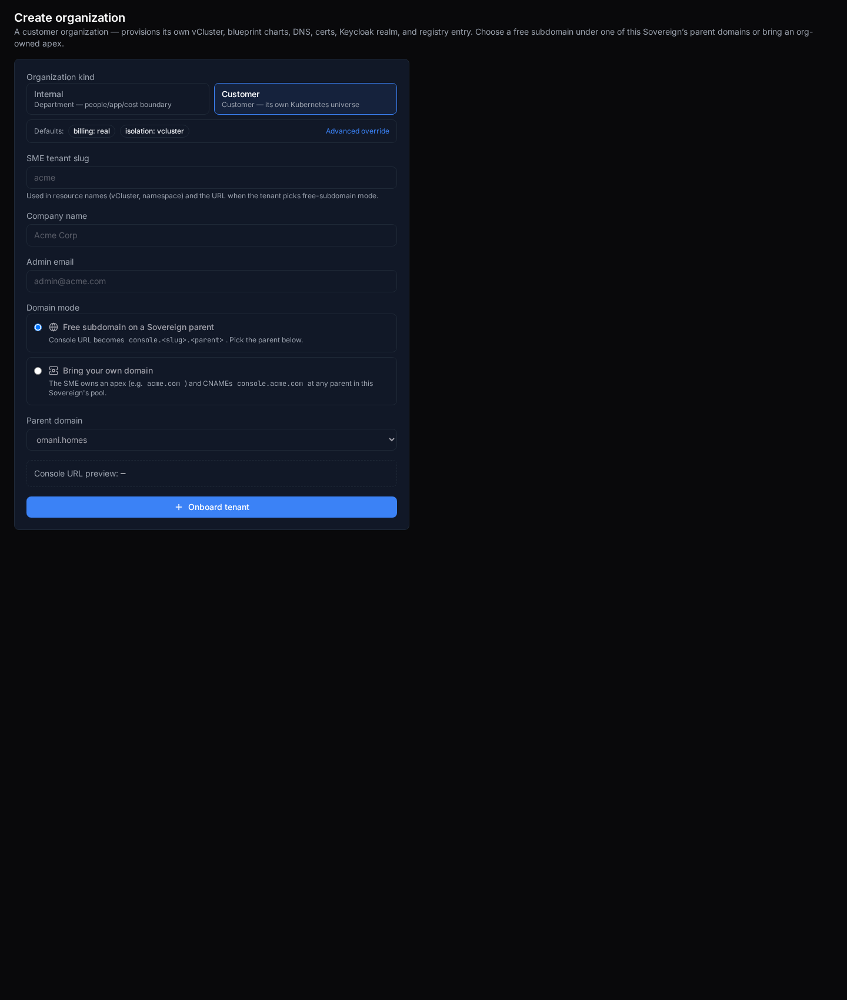](../../sessions/2026-06-14/evidence/3378-keystone/r6_create_default.png) |
| [Create organization](https://console.hw135.omani.works/organizations/new) | Click **Internal** → defaults flip **live** to `billing: showback · isolation: namespace` (asserted `data-mode=showback`, `data-isolation=namespace`); intro changes to "An internal department — a people, app, and cost boundary on this Sovereign. No marketplace voucher; consumption attributes to the org via showback" — **no** voucher/payment step | ✅ | [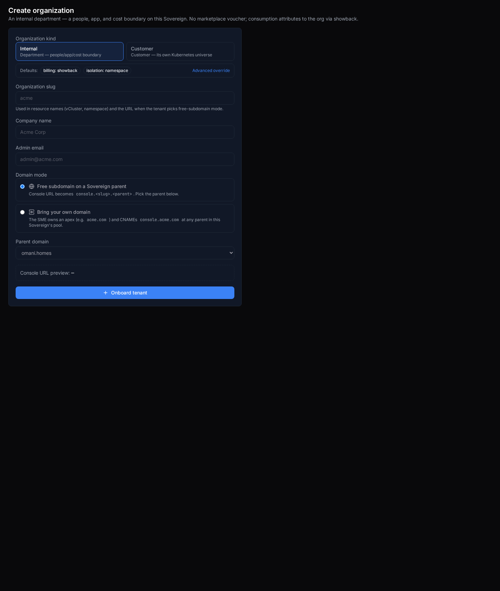](../../sessions/2026-06-14/evidence/3378-keystone/r6b_create_internal_flip.png) |
| [Create organization](https://console.hw135.omani.works/organizations/new) | **Advanced override** reveals the billing-mode select (real / chargeback / showback) + isolation select (namespace / vcluster) — both present | ✅ | [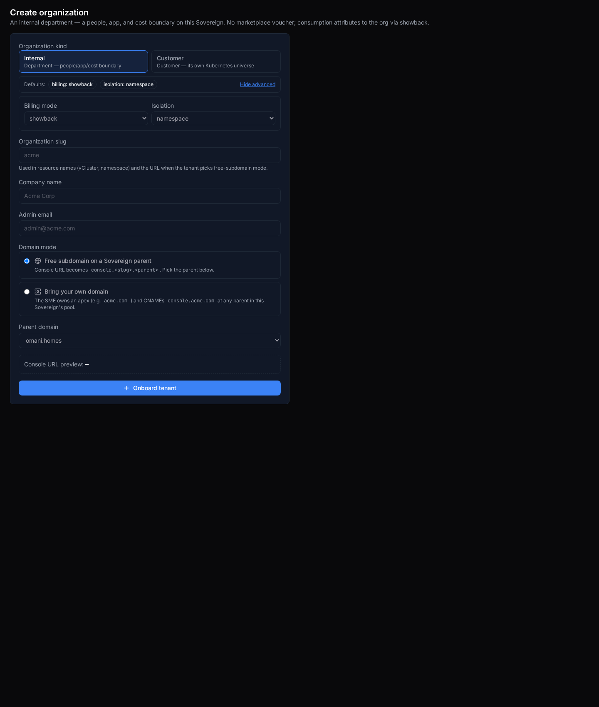](../../sessions/2026-06-14/evidence/3378-keystone/r7_advanced.png) |
| [Create organization](https://console.hw135.omani.works/organizations/new) | Type slug `dept1` (Internal) → URL preview `console.dept1.omani.homes` → submit → **result panel shown, no submit error**; `dept1` appears in the directory + renders a detail page. Same flow creates the customer control `cust1` (no submit error) | ✅ | [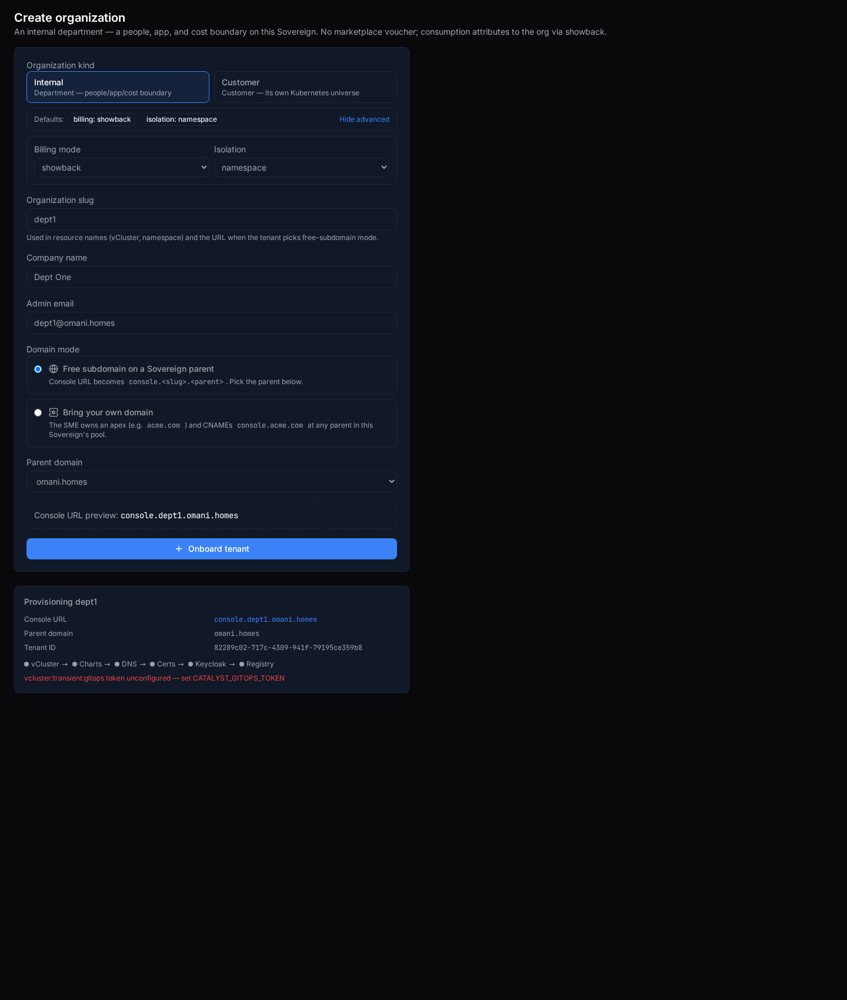](../../sessions/2026-06-14/evidence/3378-keystone/r8b_after_internal_submit.png) |
| [Organizations directory](https://console.hw135.omani.works/organizations) | **Badge fidelity at the directory table.** Internal sub-org `Dept One` (dept1) badges **INTERNAL · Sme · SHOWBACK · namespace · PROVISIONING**; customer control `Cust One` (cust1) badges **CUSTOMER · Sme · REAL · vcluster · PROVISIONING** — same env, same code, different per-org spec → the directory threads the real `kind/billing_mode/isolation` from the tenants feed, **not** a hardcode | ✅ |  |
| [Org · dept1 (Internal)](https://console.hw135.omani.works/organizations/dept1) | **Badge fidelity at the detail page.** The Internal org `dept1` shows **Kind Internal · Tier Sme · Billing mode Showback · Isolation Namespace · Status Provisioning** — NOT customer/real/vcluster — plus Console `console.dept1.omani.homes` and a Showback panel ("No consumption attributed yet. Showback populates from running workloads.") | ✅ | [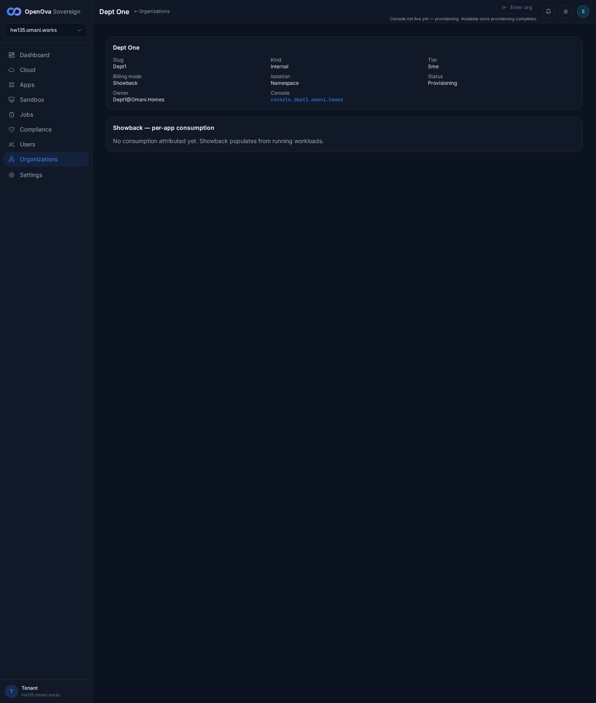](../../sessions/2026-06-14/evidence/3378-keystone/r11_dept1_detail_enterorg.png) |
| [Org · cust1 (Customer, control)](https://console.hw135.omani.works/organizations/cust1) | Control: the genuine customer org `cust1` badges **Kind Customer · Tier Sme · Billing mode Real · Isolation Vcluster** + Console `console.cust1.omani.homes` — proves the Internal/Customer divergence is real per-org data | ✅ | [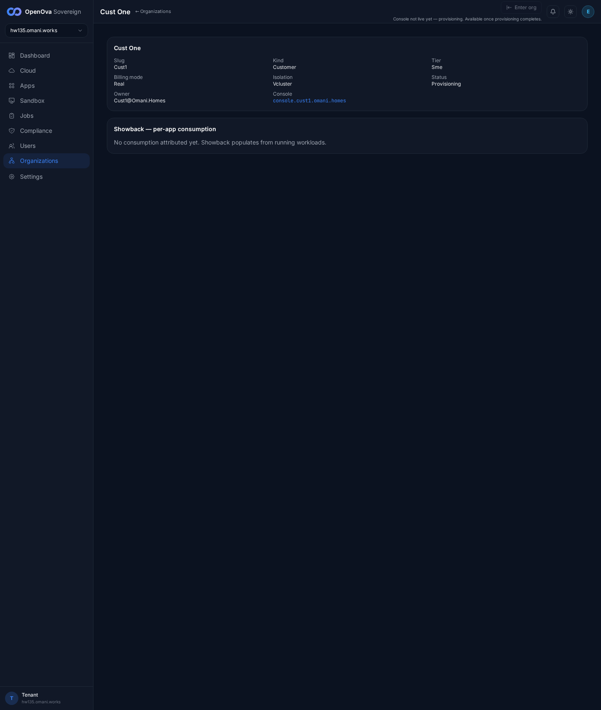](../../sessions/2026-06-14/evidence/3378-keystone/r9b_cust1_customer_badge.png) |
| [Org · dept1](https://console.hw135.omani.works/organizations/dept1) | **Enter-org gate (the documented #3378 fix).** `dept1` is Provisioning, so **Enter org** renders **disabled** (`aria-disabled=true`, `data-testid=enter-org-not-live`) with subtitle "Console not live yet — provisioning. Available once provisioning completes." Clicking it opens **NO new tab** (pagesBefore=1 = pagesAfter=1) — the blank-tab regression is gone. A live (`active`) org would POST the enter-org endpoint + open the org's console handover; no sub-org is yet `active` on this fresh prov to exercise the positive path (funnel still on `gitops token unconfigured`) | ✅ |  |
| [Org · Billing](https://console.hw135.omani.works/organizations/billing/billing) | Parent (showback): notice "This organization is in showback mode — consumption is attributed, not invoiced. Real billing (invoices, vouchers, checkout) exists when the marketplace sells to external organizations." + per-app showback panel; **no** payment/checkout actions | ✅ | [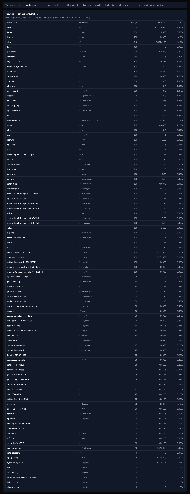](../../sessions/2026-06-14/evidence/3378-keystone/r10_billing.png) |
| [Commerce · Plans](https://console.hw135.omani.works/organizations/commerce/plans) | The console plans table lists every plan (s, m, l, xl, flexi, sandbox-free, sandbox-pro, sandbox-ent) with SLUG/NAME/CPU/MEMORY/PRICE(OMR)/ACTIONS(Edit·Delete) — **no** "load plans: HTTP 404 / No plans yet". Served by the catalyst-api read-proxy `GET /api/v1/sme/commerce/plans` (200) | ✅ | [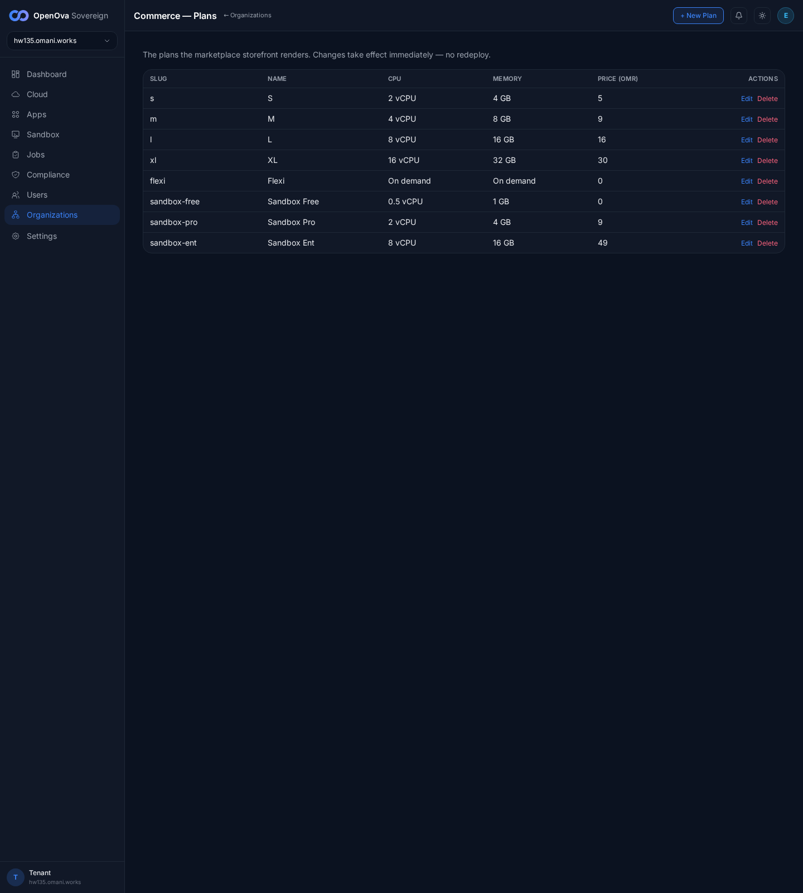](../../sessions/2026-06-14/evidence/3378-keystone/r13_plans_table.png) |
| [marketplace · Plans](https://marketplace.hw135.omani.works/plans) | The storefront plan-picker renders the catalog plans (S OMR 5 / M OMR 9 POPULAR / L OMR 16 / XL OMR 30 / Flexi OMR 2/CU) with vCPU/RAM/Disk/Bandwidth/Backup/SSL/SSO/SLA columns — the same plans as the console table, no redeploy. 0 console errors | ✅ | [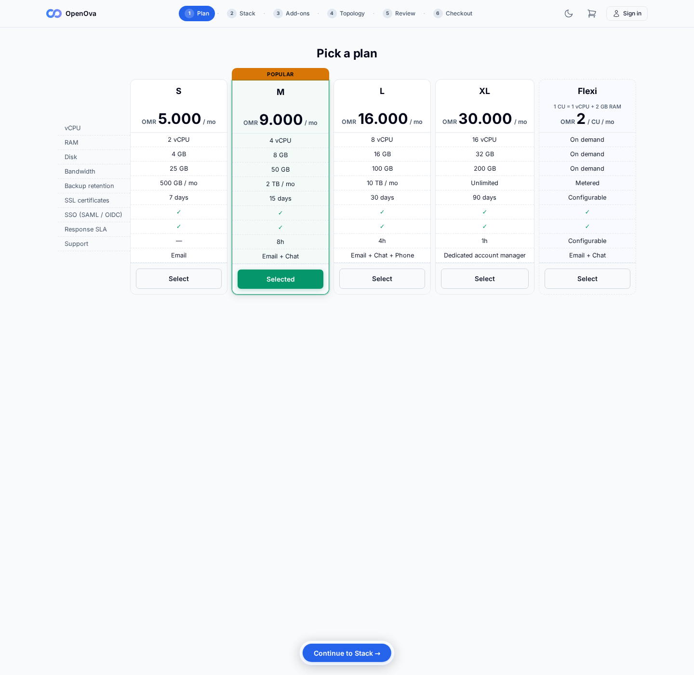](../../sessions/2026-06-14/evidence/3378-keystone/r14_marketplace.png) |
| [/bss](https://console.hw135.omani.works/bss) | Redirects to `/organizations` (the new Organizations home) | ✅ | [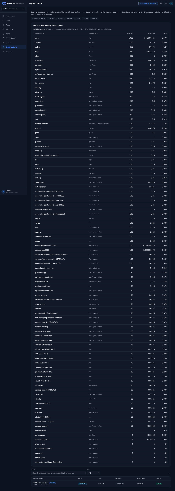](../../sessions/2026-06-14/evidence/3378-keystone/r15_bss.png) |
| [/parent-domains](https://console.hw135.omani.works/parent-domains) | Redirects to `/organizations/domains` (Parent Domains; lists primary `hw135.omani.works`/`omani.works` + sme-pool `omani.homes`/`omani.rest`/`omani.trade`, each Ready) | ✅ | [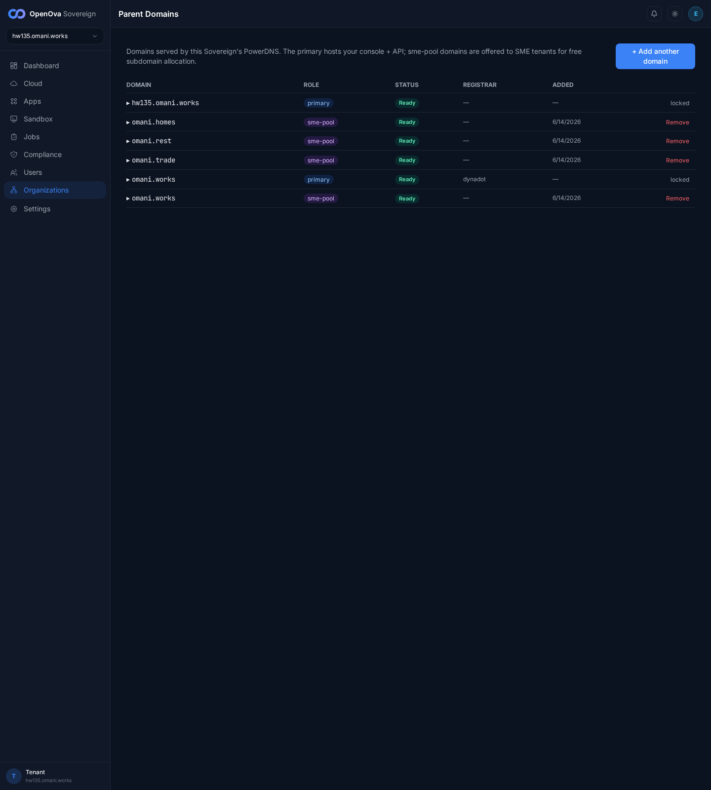](../../sessions/2026-06-14/evidence/3378-keystone/r16_parentdomains.png) |

**Result:** ✅ 16 / ❌ 0 / N/A 0 — **#3378 reproduces zero-touch on the keystone fresh prov hw135** (`368c2d9b74d0b71a`, catalyst-api/ui `77e891d` = current `origin/main`). Every acceptance assertion holds from a clean prov: ONE **Organizations** sidebar entry with **no** BSS/OSS split; parent-first directory with the Sovereign as the first PARENT row + per-app Showback panel; the Create-org **Internal** kind flips defaults live to **showback/namespace** (Customer default = real/vcluster) with the Advanced override exposing both selects and **no** voucher/payment step for Internal; **badge fidelity** — a created Internal org (`dept1`) badges **INTERNAL · SHOWBACK · namespace** while a created Customer org (`cust1`) badges **CUSTOMER · REAL · vcluster** at both the directory table and the detail page (proving the directory threads the real per-org spec, not a hardcode); the **Enter-org** button on a not-live (Provisioning) sub-org is **disabled** with "Console not live yet — provisioning" and clicking opens **no blank tab**; the Commerce·Plans table lists every plan (no 404) and those plans render in the marketplace storefront; billing shows the showback notice with no checkout; and both legacy redirects work (`/bss`→`/organizations`, `/parent-domains`→`/organizations/domains`).

**Gaps:** none of the #3378 acceptance rows fail.
- The positive **Enter-org "lands logged-in"** path (active org → mint session → open the org's own console) is unexercised because no sub-org is yet `active` on this fresh prov — the funnel provisioning chain stalls at `gitops token unconfigured` (orthogonal funnel work, not a #3378 row; tracked separately).
- **Cosmetic-only (non-blocking):** the Create-org **slug** `<input pattern>` (RFC-1123 hostname regex `[a-z0-9]([a-z0-9-]{0,61}[a-z0-9])?`) emits a benign Chromium console warning under the `v`-flag regex engine ("Invalid character class"). It does **not** block submission — both `dept1` and `cust1` submitted successfully with URL preview rendered and result panels shown. Purely the HTML `pattern` attribute's client-side validity check; no functional effect on any #3378 acceptance row.
