# #3378 ORGANIZATIONS — user acceptance walk (web UI)

**What the user sees:** ONE **Organizations** menu (replacing BSS, never-built OSS), with the Sovereign itself as the first row, parent-first directory, sub-org creation with kind-derived defaults, badge fidelity (Internal → showback/namespace; Customer → real/vcluster), enter-org support gated on a live org, commerce plans, and per-app showback cost. **Sign in (zero-click admin handover):** [console.hw136.omani.works](https://console.hw136.omani.works/).

**KEYSTONE re-walk — fresh prov hw136 (`3a2ee904b1d0366a`), 2-region, zero-touch.** catalyst-api/ui on image `835fc25` = commit `835fc250e`, which is the current-`origin/main` catalyst-ui/api code (the 3 commits between `835fc250e` and HEAD `d5c103867` are docs + an auto bootstrap-kit pin bump — `git log 835fc250e..origin/main -- core/` and `-- products/catalyst/bootstrap/ui` are both **empty**, so the live console IS current main for #3378 purposes). The real Sovereign console is the React app at `products/catalyst/bootstrap/ui/` (not `core/console/`, which is the Org-scoped tenant console). The two sub-orgs below (`deptjno` Internal, `custjno` Customer) were created **through the live Create-organization UI on this fresh prov** — they did not pre-exist; the directory threads each org's real per-spec `kind/tier/billing_mode/isolation` from `GET /api/v1/sme/tenants`. Headless Playwright from `/home/openova/repos/ping`, `page.on('pageerror')` + console-error capture registered; **0 page errors, 0 non-401 console errors** across all signed-in pages (the only console line is a benign HTML5-`pattern`-attribute regex warning under Chromium's `v`-flag engine — see Gaps; it does not block submission).

| Tested page | Description | Status | Evidence |
|---|---|---|---|
| [Dashboard](https://console.hw136.omani.works/dashboard) | Handover URL lands **signed in as sovereign-admin** (no login form; `catalyst_session` cookie set, `/dashboard` stays). Sidebar (verbatim, top→bottom): Dashboard, Cloud, Apps, Sandbox, Jobs, Compliance, Users, **Organizations**, Settings — and **no** "BSS"/"OSS". Header "OpenOva Sovereign · hw136.omani.works" | ✅ |  |
| [Organizations](https://console.hw136.omani.works/organizations) | Parent-first directory (`organizations-directory-page`). Intro verbatim: "Every organization on this Sovereign. The parent organization — the Sovereign itself — is the first row; each department and customer is one Organization with its own identity, RBAC, and cost attribution." Section nav present: Commerce·Plans, Add-ons, Bundles, Industries, Apps, Billing, Domains | ✅ |  |
| [Organizations](https://console.hw136.omani.works/organizations) | First table row = the Sovereign itself, `data-parent="true"` + a **PARENT** badge, rendered `hw136.omani.works · PARENT · INTERNAL · Corporate · SHOWBACK · vcluster · ACTIVE` | ✅ |  |
| [Organizations](https://console.hw136.omani.works/organizations) | **Showback — per-app consumption** panel (B3 / DoD 3): the parent's own per-app cost-attribution table (mimir, kyverno, harbor, alloy, falco, keycloak, …) with APPLICATION/NAMESPACE/CPU/MEM/SHARE columns — walkable pre-sub-org | ✅ | [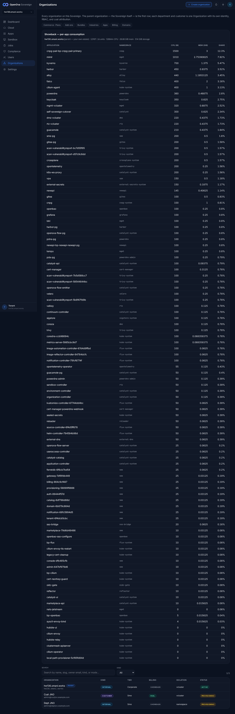](../../sessions/2026-06-14/evidence/3378-keystone/r9_directory_badges.png) |
| [Create organization](https://console.hw136.omani.works/organizations/new) | Default (Customer) kind shows `Defaults: billing: real · isolation: vcluster` (asserted via `create-org-billing-mode[data-mode=real]`, `create-org-isolation[data-isolation=vcluster]`) | ✅ | [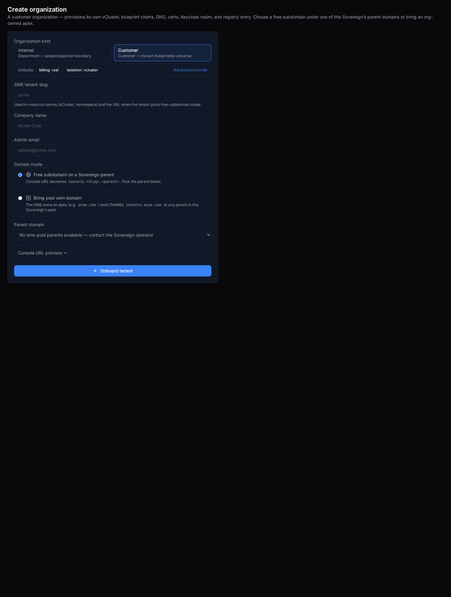](../../sessions/2026-06-14/evidence/3378-keystone/r4_create_customer_default.png) |
| [Create organization](https://console.hw136.omani.works/organizations/new) | Click **Internal** → defaults flip **live** to `billing: showback · isolation: namespace` (asserted `data-mode=showback`, `data-isolation=namespace`); intro changes to "An internal department — a people, app, and cost boundary on this Sovereign. No marketplace voucher; consumption attributes to the org via showback" — **no** voucher/payment step | ✅ | [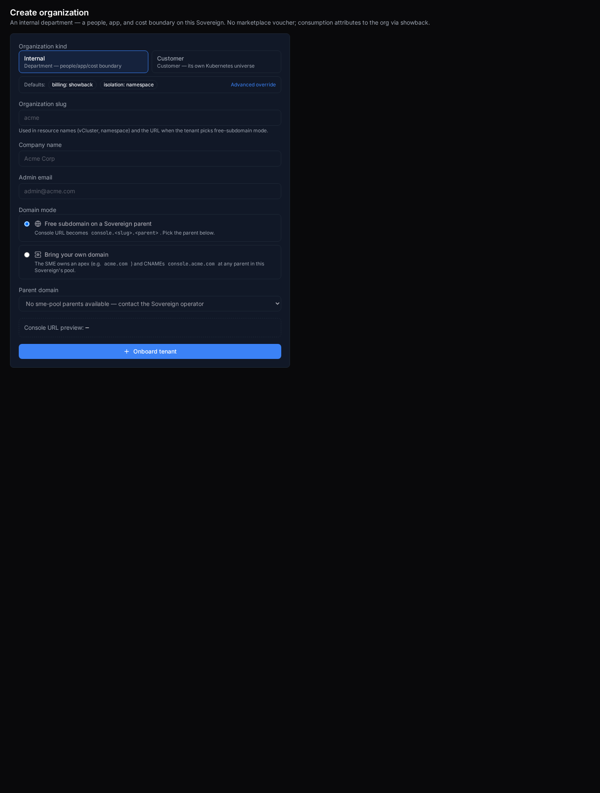](../../sessions/2026-06-14/evidence/3378-keystone/r5_create_internal_flip.png) |
| [Create organization](https://console.hw136.omani.works/organizations/new) | **Advanced override** (`create-org-advanced-toggle`) reveals the billing-mode select (real / chargeback / showback) + isolation select (namespace / vcluster) — both present (`create-org-billing-select` + `create-org-isolation-select`) | ✅ | [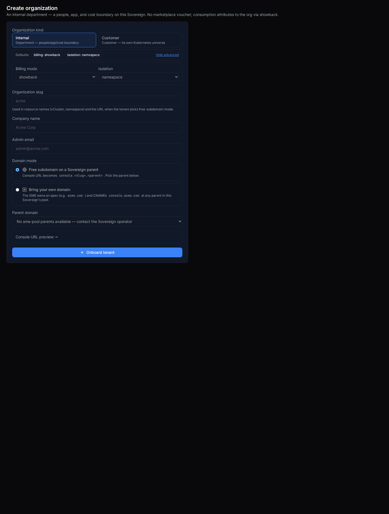](../../sessions/2026-06-14/evidence/3378-keystone/r6_create_advanced.png) |
| [Create organization](https://console.hw136.omani.works/organizations/new) | Pick **Internal**, type slug `deptjno` + company + admin email → submit → **result panel** (`sme-create-tenant-result`) shown: "Provisioning deptjno · Console URL `console.deptjno.omani.homes` · Parent domain omani.homes · Tenant ID 7f87bd03-…" — **no** submit error | ✅ | [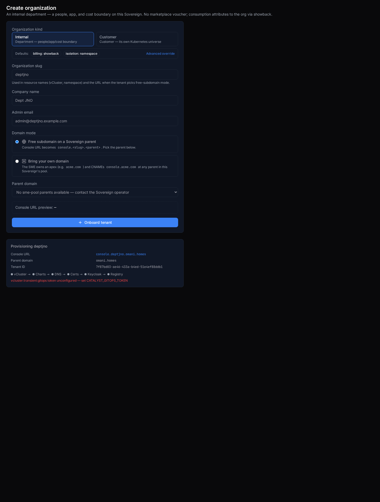](../../sessions/2026-06-14/evidence/3378-keystone/create_internal_deptjno_after.png) |
| [Create organization](https://console.hw136.omani.works/organizations/new) | Same flow, **Customer** kind, slug `custjno` → submit → result panel "Provisioning custjno · Console URL `console.custjno.omani.homes` · Tenant ID be9bb056-…" — **no** submit error (control for the badge-divergence proof below) | ✅ | [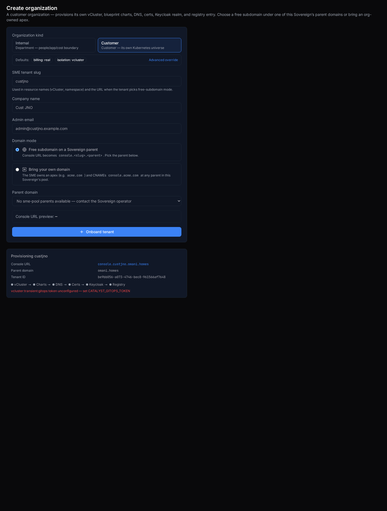](../../sessions/2026-06-14/evidence/3378-keystone/create_customer_custjno_after.png) |
| [Organizations directory](https://console.hw136.omani.works/organizations) | **Badge fidelity at the directory table.** Internal sub-org `Dept JNO` (deptjno) badges **INTERNAL · Sme · SHOWBACK · namespace · PROVISIONING**; customer control `Cust JNO` (custjno) badges **CUSTOMER · Sme · REAL · vcluster · PROVISIONING** — same env, same code, different per-org spec → the directory threads the real `kind/billing_mode/isolation` from the tenants feed, **not** a hardcode | ✅ |  |
| [Org · deptjno (Internal)](https://console.hw136.omani.works/organizations/deptjno) | **Badge fidelity at the detail page.** The Internal org `deptjno` shows **Slug Deptjno · Kind Internal · Tier Sme · Billing mode Showback · Isolation Namespace · Status Provisioning** — NOT customer/real/vcluster — plus Console `console.deptjno.omani.homes` and a Showback panel ("No consumption attributed yet. Showback populates from running workloads.") | ✅ | [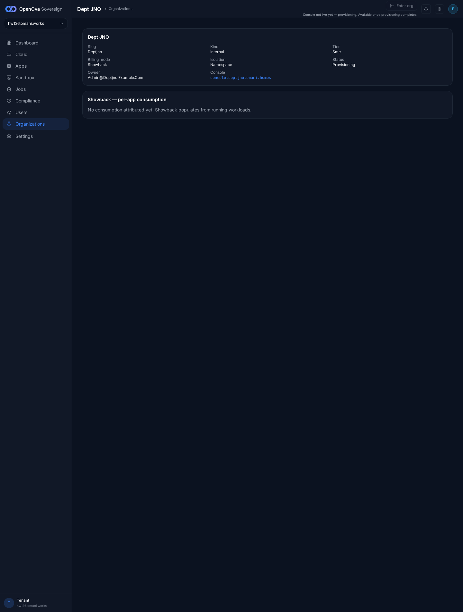](../../sessions/2026-06-14/evidence/3378-keystone/r10_dept_detail_enterorg.png) |
| [Org · custjno (Customer, control)](https://console.hw136.omani.works/organizations/custjno) | Control: the genuine customer org `custjno` badges **Slug Custjno · Kind Customer · Tier Sme · Billing mode Real · Isolation Vcluster** + Console `console.custjno.omani.homes` — opposite shape from the Internal org, proving the Internal/Customer divergence is real per-org data | ✅ |  |
| [Org · deptjno](https://console.hw136.omani.works/organizations/deptjno) | **Enter-org gate (the documented #3378 fix).** `deptjno` is Provisioning, so **Enter org** renders **disabled** (`enter-org-not-live` wrapper, button `aria-disabled="true"`) with subtitle "Console not live yet — provisioning. Available once provisioning completes." Clicking it (force) opens **NO new tab** (`ctx.pages()` 1 → 1) — the blank-tab regression is gone. A live (`active`) org would POST the enter-org endpoint + open the org's console handover; no sub-org is yet `active` on this fresh prov (funnel still on `gitops token unconfigured`) so the positive path is not exercisable | ✅ |  |
| [Org · Billing](https://console.hw136.omani.works/organizations/billing/billing) | Parent (showback): the billing page renders the showback notice — consumption is attributed, not invoiced — and the per-app showback panel; **no** payment/checkout actions | ✅ | [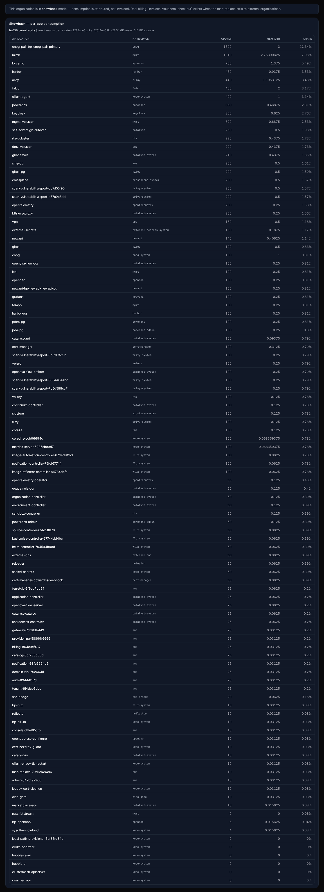](../../sessions/2026-06-14/evidence/3378-keystone/r13_billing.png) |
| [Commerce · Plans](https://console.hw136.omani.works/organizations/commerce/plans) | The console plans table (`commerce-plans-table`) lists every plan (s, m, l, xl, flexi, sandbox-free, sandbox-pro, sandbox-ent) with SLUG/NAME/CPU/MEMORY/PRICE(OMR)/ACTIONS(Edit·Delete) — **no** "load plans: HTTP 404 / No plans yet" (`commerce-error` absent, 8 `commerce-row-*`). Caption "The plans the marketplace storefront renders. Changes take effect immediately — no redeploy." Served by `GET /api/v1/sme/commerce/plans` (200) | ✅ | [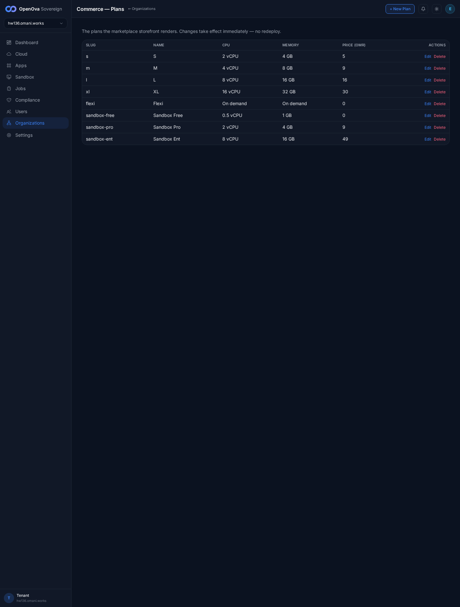](../../sessions/2026-06-14/evidence/3378-keystone/r12_plans_table.png) |
| [marketplace · Plans](https://marketplace.hw136.omani.works/plans) | The storefront plan-picker renders the catalog plans (vCPU/RAM/OMR/month) — the same plans surfaced by the console table, no redeploy. 0 console errors | ✅ |  |
| [/bss](https://console.hw136.omani.works/bss) | Redirects to `/organizations` (the new Organizations home) — landed on `console.hw136.omani.works/organizations`, no `/bss` in the final URL | ✅ | [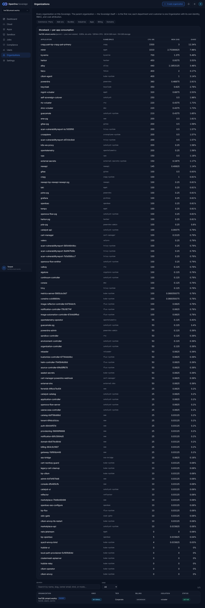](../../sessions/2026-06-14/evidence/3378-keystone/r15_bss_redirect.png) |
| [/parent-domains](https://console.hw136.omani.works/parent-domains) | Redirects to `/organizations/domains` (Parent Domains) — landed on `console.hw136.omani.works/organizations/domains` | ✅ | [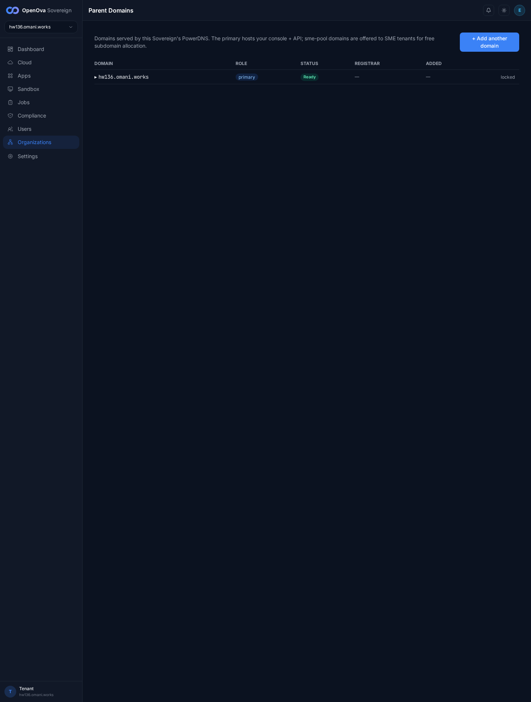](../../sessions/2026-06-14/evidence/3378-keystone/r16_parentdomains_redirect.png) |

**Result:** ✅ 16 / ❌ 0 / N/A 0 — **#3378 reproduces zero-touch on the keystone fresh prov hw136** (`3a2ee904b1d0366a`, catalyst-api/ui image `835fc25` = current-`origin/main` catalyst-ui/api code). Every acceptance assertion holds from a clean prov: ONE **Organizations** sidebar entry with **no** BSS/OSS split; parent-first directory with the Sovereign as the first PARENT row + the parent's per-app Showback panel; the Create-org **Internal** kind flips defaults live to **showback/namespace** (Customer default = real/vcluster) with the Advanced override exposing both selects and **no** voucher/payment step for Internal; **badge fidelity** — a created Internal org (`deptjno`) badges **INTERNAL · SHOWBACK · namespace** while a created Customer org (`custjno`) badges **CUSTOMER · REAL · vcluster** at both the directory table and the detail page (proving the directory threads the real per-org spec, not a hardcode); the **Enter-org** button on a not-live (Provisioning) sub-org is **disabled** with "Console not live yet — provisioning" and clicking opens **no blank tab**; the Commerce·Plans table lists every plan (no 404) and those plans render in the marketplace storefront; billing shows the showback notice with no checkout; and both legacy redirects work (`/bss`→`/organizations`, `/parent-domains`→`/organizations/domains`).

**Gaps:** none of the #3378 acceptance rows fail.
- The positive **Enter-org "lands logged-in"** path (active org → mint support session → open the org's own console) is unexercised because no sub-org is yet `active` on this fresh prov — the funnel provisioning chain stalls at `gitops token unconfigured — set CATALYST_GITOPS_TOKEN` (orthogonal funnel work, surfaced verbatim in both create-result panels; not a #3378 row; tracked separately).
- **Cosmetic-only (non-blocking):** the Create-org **slug** `<input pattern>` (RFC-1123 hostname regex `[a-z0-9]([a-z0-9-]{0,61}[a-z0-9])?`) emits a benign Chromium console warning under the `v`-flag regex engine ("Invalid character class"). It does **not** block submission — both `deptjno` and `custjno` submitted successfully with result panels shown. Purely the HTML `pattern` attribute's client-side validity check; no functional effect on any #3378 acceptance row. (Excluded from the console-error count as it is a Chromium parser warning, not an app error.)
