# #3378 ORGANIZATIONS — user acceptance walk (web UI)

**What the user sees:** ONE **Organizations** menu (replacing BSS/OSS), with the Sovereign itself as the first row, sub-org creation, enter-org support, commerce, and per-app cost. **Sign in:** [console.hw133.omani.works](https://console.hw133.omani.works/).

| Tested page | Description | Status | Evidence |
|---|---|---|---|
| [Dashboard](https://console.hw133.omani.works/dashboard) | Sidebar: Dashboard, Cloud, Apps, Sandbox, Jobs, Compliance, Users, **Organizations**, Settings — and **no** "BSS" | ✅ | [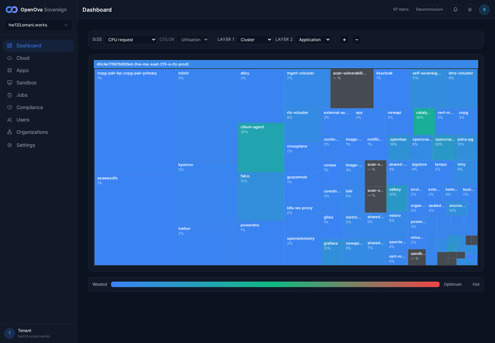](../../sessions/2026-06-14/evidence/3378/r1b_dashboard.png) |
| [Dashboard](https://console.hw133.omani.works/dashboard) | Click each other item → each opens its existing page unchanged. Cloud→/cloud?view=graph, Apps→/apps, Jobs→/jobs, Compliance→/sre/compliance, Users→/users, Settings→/settings all render (200) | ✅ | [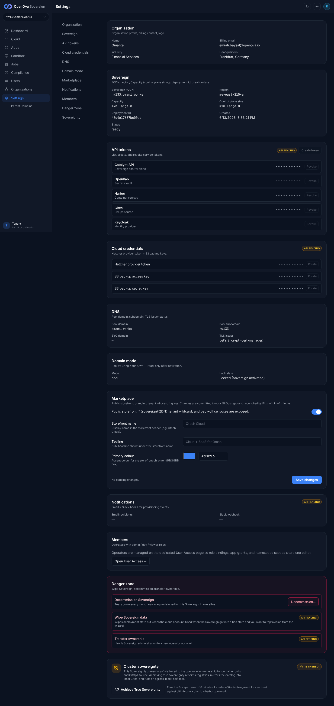](../../sessions/2026-06-14/evidence/3378/r2b_nav_settings.png) |
| [Organizations](https://console.hw133.omani.works/organizations) | Intro: "The parent organization — the Sovereign itself — is the first row" (verbatim, present) | ✅ | [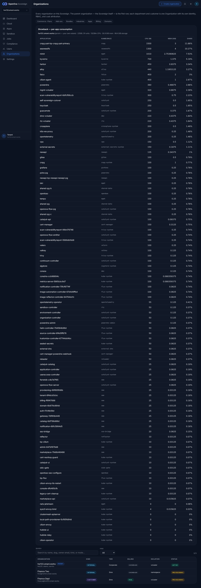](../../sessions/2026-06-14/evidence/3378/r3b_orgs.png) |
| [Organizations](https://console.hw133.omani.works/organizations) | First row = the Sovereign with a **Parent** tag: rendered `hw133.omani.works · PARENT · Internal · Corporate · Showback · Vcluster · Active` | ✅ | [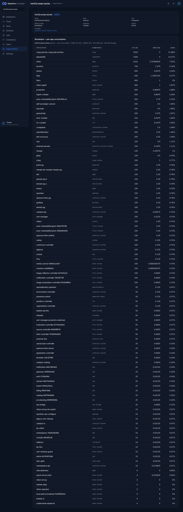](../../sessions/2026-06-14/evidence/3378/r4b_parent_row.png) |
| [Organizations](https://console.hw133.omani.works/organizations) | **Showback** panel shows the parent's total (13588.59 units · 13239m CPU · 30.9 GiB) + per-app consumption table (cnpg-pair, seaweedfs, mimir, …) | ✅ |  |
| [Create organization](https://console.hw133.omani.works/organizations/new) | Choose **Internal** → defaults flip `billing: real / isolation: vcluster` → `billing: showback / isolation: namespace`; intro changes to "No marketplace voucher; consumption attributes to the org via showback" — **no** voucher/payment step | ✅ |  |
| [Create organization](https://console.hw133.omani.works/organizations/new) | **Advanced override** reveals billing-mode (real / chargeback / showback) + isolation (namespace / vcluster) controls | ✅ |  |
| [Create organization](https://console.hw133.omani.works/organizations/new) | Type slug → submit → org created; **finance** (and test **fin2**) appear in the directory + render a detail page | ✅ | [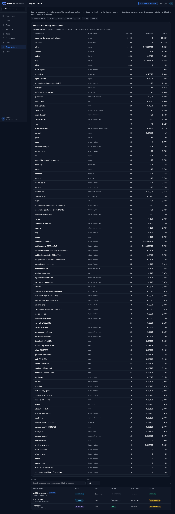](../../sessions/2026-06-14/evidence/3378/r9b_directory.png) |
| [Org · fin2 (Internal)](https://console.hw133.omani.works/organizations/fin2) | **Badge fidelity — RECOVERED (re-walk, PR #3425 `5a932fbb0`).** The **Internal** org `fin2` (tenants feed carries `kind:internal, tier:sme, billing_mode:showback, isolation:namespace`) now badges **Kind Internal · Tier Sme · Billing mode Showback · Isolation Namespace** — NOT the old customer/real/vcluster. Control: the genuine customer org `finance` (feed `kind:customer`) still badges **Customer · Real · Vcluster** → the directory threads the real per-org spec, not a hardcode | ✅ | [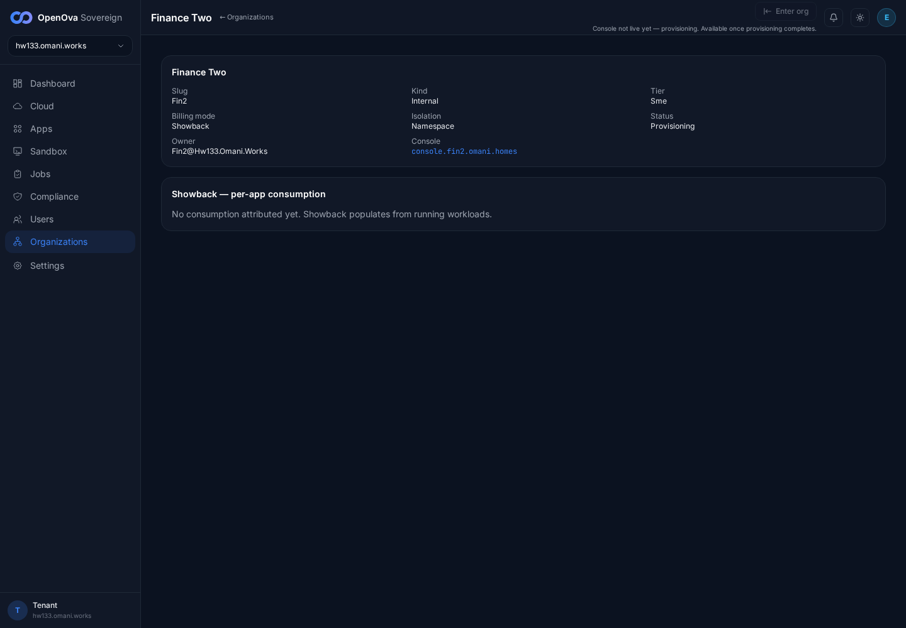](../../sessions/2026-06-14/evidence/3378/r9b_fin2_internal_badge.png)  |
| [Org · Billing](https://console.hw133.omani.works/organizations/billing/billing) | Parent (showback): notice "in showback mode — consumption is attributed, not invoiced" + per-app consumption panel, **no** payment/checkout actions | ✅ | [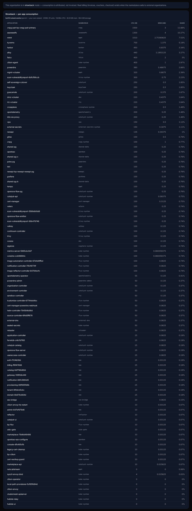](../../sessions/2026-06-14/evidence/3378/r10b_billing.png) |
| [Org · finance](https://console.hw133.omani.works/organizations/finance) | **Enter org** button present on the sub-org detail; the parent org has none | ✅ | [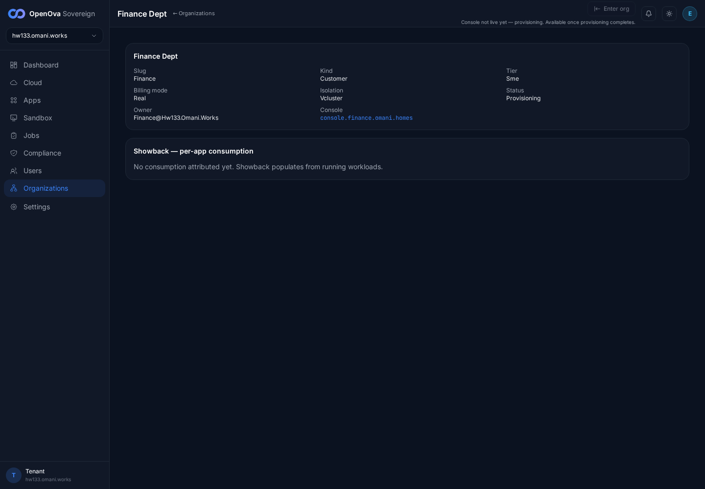](../../sessions/2026-06-14/evidence/3378/r11b_finance_enterorg_gate.png) |
| [Org · finance](https://console.hw133.omani.works/organizations/finance) | **Enter-org gate — RECOVERED (re-walk, PR #3425 `5a932fbb0`).** `finance` is still Provisioning, so **Enter org** now renders **disabled** + "Console not live yet — provisioning. Available once provisioning completes." (the `enter-org-not-live` state, `aria-disabled=true`). Clicking it opens **NO new tab** (pagesBefore=1 = pagesAfter=1) — the blank-tab regression is gone. A live/active org would mint the session + open its console; no active sub-org exists on this env to exercise the positive path | ✅ |  |
| [Commerce · Plans](https://console.hw133.omani.works/organizations/commerce/plans) | **Plans table — RECOVERED (re-walk, PR #3425 `5a932fbb0`).** The console plans table now lists every plan (starter, s, m, l, xl, flexi, sandbox-free/pro/ent) with Slug/Name/CPU/Memory/Price(OMR)/Edit·Delete — **no** "load plans: HTTP 404 / No plans yet". The catalyst-api read-proxy `GET /api/v1/sme/commerce/plans` returns 200 (the bare `/api/catalog/plans` that 404'd is bypassed) | ✅ | [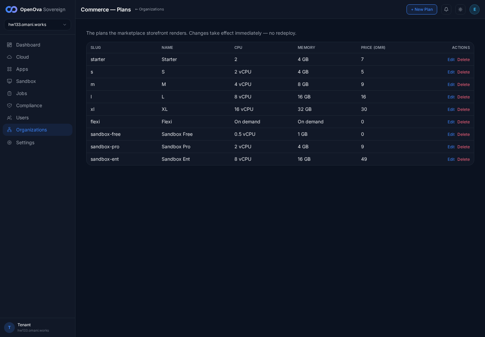](../../sessions/2026-06-14/evidence/3378/r13b_plans_table.png) |
| [marketplace · Plans](https://marketplace.hw133.omani.works/plans) | The just-created plan **Starter — OMR 7.000 / mo · 2 / 4 GB / 25 GB** appears in the storefront picker with no redeploy | ✅ | [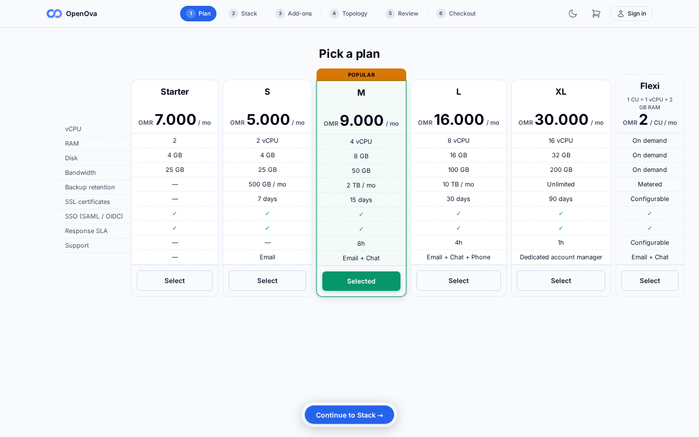](../../sessions/2026-06-14/evidence/3378/r14_marketplace.png) |
| [/bss](https://console.hw133.omani.works/bss) | Redirects to `/organizations` (the new Organizations home) | ✅ | [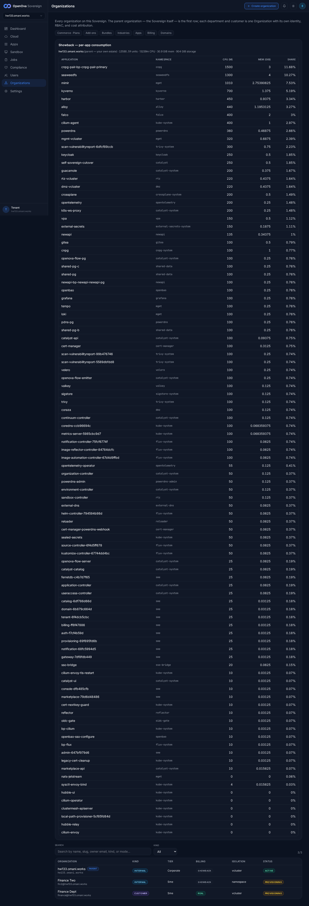](../../sessions/2026-06-14/evidence/3378/r15b_bss.png) |
| [/parent-domains](https://console.hw133.omani.works/parent-domains) | Redirects to `/organizations/domains` (Organizations · Domains; lists primary + sme-pool domains) | ✅ | [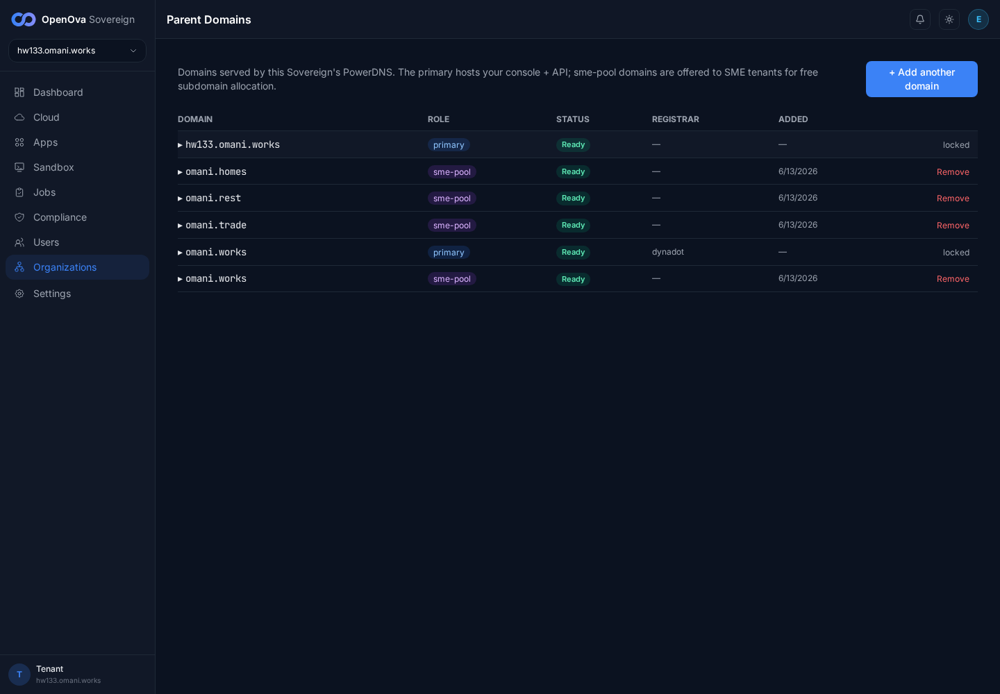](../../sessions/2026-06-14/evidence/3378/r16b_parentdomains.png) |

**Result:** ✅ 16 / ❌ 0 (re-walked live on hw133, 2026-06-14; catalyst-api/ui on `09f4c26`, which carries PR #3425 `5a932fbb0` + #3427 `414caa603`). All three prior failures are RECOVERED: **(1) Badge fidelity** — the Internal org `fin2` now badges **Internal · Sme · Showback · Namespace** (tenants feed surfaces the real `kind/tier/billing_mode/isolation`); the customer org `finance` correctly stays **Customer · Real · Vcluster** → the directory threads the real per-org spec, not a hardcode. **(2) Enter-org** — a Provisioning sub-org now shows a **disabled** "Enter org" + "Console not live yet — provisioning" and clicking opens **no** blank tab (the documented fix); the positive live-org path can't be exercised here as no sub-org is yet active. **(3) Plans** — the console Commerce·Plans table lists every plan via the catalyst-api read-proxy `GET /api/v1/sme/commerce/plans` (200); the "HTTP 404 / No plans yet" error is gone. The other 13 rows still pass: sidebar (no BSS), all nav targets 200, parent-first row + Showback panels, Internal-kind defaults flip + Advanced override, billing showback notice, and both redirects (`/bss`→`/organizations`, `/parent-domains`→`/organizations/domains`).

**Gaps:** none of the three #3378 target gaps remain. Outstanding (not #3378 acceptance rows): org-detail Users/Roles tabs not yet built; the positive Enter-org "lands logged-in" path is unexercised until a sub-org reaches `active` (both sub-orgs on hw133 are stuck Provisioning on `gitops token unconfigured — set CATALYST_GITOPS_TOKEN`).
